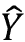

# 第二章：回归与分类

回归和分类是几乎所有机器学习应用中的两大基本任务。它们在从工程学、物理科学、生物学、金融市场到社会科学等众多领域都有应用。这些任务是统计学家和数据科学家手中的基本工具。在本章中，我们将涵盖以下主题：

+   回归

+   分类

+   分类与回归的区别

+   线性回归

+   不同类型的线性回归

+   使用 TensorFlow Keras API 进行分类

+   应用线性回归估算房价

+   应用逻辑回归识别手写数字

本章的所有代码文件可以在[`packt.link/dltfchp2`](https://packt.link/dltfchp2)找到

让我们首先了解回归究竟是什么。

# 什么是回归？

回归通常是机器学习领域中人们接触的第一个算法。它通过学习给定的一组因变量和自变量之间的关系，让我们能够从数据中进行预测。回归几乎在每个领域都有应用；任何需要分析两者或更多事物之间关系的地方，都能找到回归的用武之地。

以房价估算为例。影响房价的因素有很多：房间数量、面积、地理位置、设施的可用性、停车空间等。回归分析可以帮助我们找到这些因素与房价之间的数学关系。

让我们设想一个更简单的世界，在这个世界中，只有房屋的面积决定其价格。通过回归分析，我们可以确定房屋面积（**自变量**：这些是不会依赖于其他变量的变量）与其价格（**因变量**：这些变量依赖于一个或多个自变量）之间的关系。之后，我们可以利用这个关系来预测任何房屋的价格，只要知道其面积。若想进一步了解自变量和因变量以及如何识别它们，可以参考这篇文章：[`medium.com/deeplearning-concepts-and-implementation/independent-and-dependent-variables-in-machine-learning-210b82f891db`](https://medium.com/deeplearning-concepts-and-implementation/independent-and-dependent-variables-in-machine-learning-210b82f891db)。在机器学习中，自变量通常作为输入提供给模型，而因变量则是从模型中输出的结果。

根据自变量的数量、因变量的数量以及关系类型，我们有许多不同类型的回归。回归的两个重要组成部分是：自变量和因变量之间的 *关系*，以及不同自变量对因变量的 *影响强度*。在接下来的部分中，我们将详细学习广泛使用的线性回归技术。

# 使用线性回归进行预测

**线性回归** 是最广为人知的建模技术之一。已有超过 200 年的历史，几乎从所有可能的角度进行了探索。线性回归假设输入变量（`X`）与输出变量（`Y`）之间存在线性关系。线性回归的基本思想是建立一个模型，利用训练数据在给定输入的情况下预测输出，使得预测输出  尽可能接近训练数据中的观测输出 `Y`。它涉及寻找预测值  的线性方程，形式为：


其中  是 `n` 个输入变量， 是线性系数，`b` 是偏差项。我们还可以将前述方程扩展为：


偏差项使我们的回归模型即使在没有任何输入的情况下也能提供输出；它为我们提供了一个将数据偏移以更好拟合的选项。对于输入样本 `i`，观测值（`Y`）和预测值 () 之间的误差为：


目标是找到最佳的系数 `W` 和偏差 `b` 的估计值，使得观测值 `Y` 和预测值  之间的误差最小化。让我们通过一些例子更好地理解这一点。

## 简单线性回归

如果我们只考虑一个自变量和一个因变量，那么我们得到的是一个简单的线性回归。考虑前一节定义的房价预测的例子；房屋的面积（`A`）是自变量，而房屋的价格（`Y`）是因变量。我们希望找到预测价格  和 `A` 之间的线性关系，形式为：


其中 `b` 是偏差项。因此，我们需要确定 `W` 和 `b`，使得价格 `Y` 和预测价格  之间的误差最小化。估计 `W` 和 `b` 的标准方法称为最小二乘法，即我们试图最小化误差平方和（`S`）。对于前述情况，表达式变为：


我们希望估计回归系数 `W` 和 `b`，使得 `S` 最小化。我们利用函数在极值点的导数为 0 的事实，得到这两个方程：


这两个方程可以解出两个未知数。为此，我们首先展开第二个方程中的求和：


看一下左侧最后一项，它只是将常数`N`加和了`N`次。因此，我们可以将其重新写为：


重排项后，我们得到：


右边的两个项可以被 （平均价格，输出）和 （平均面积，输入）替代，从而得到：


以类似的方式，我们展开关于权重`W`的* S*的偏微分方程：


代入偏置项`b`的表达式：


重排方程：


通过玩弄均值定义，我们可以从中得到权重`W`的值，如下所示：


其中  和  分别是平均价格和面积。让我们尝试在一些简单的样本数据上进行此操作：

1.  我们导入必要的模块。这个是一个简单的例子，因此我们只使用 NumPy、pandas 和 Matplotlib：

    ```py
    import tensorflow as tf
    import numpy as np
    import matplotlib.pyplot as plt
    import pandas as pd 
    ```

1.  接下来，我们生成具有线性关系的随机数据。为了使其更具现实性，我们还添加了一个随机噪声元素。你可以看到两个变量（原因，`area`，和效果，`price`）呈正线性关系：

    ```py
    #Generate a random data
    np.random.seed(0)
    area = 2.5 * np.random.randn(100) + 25
    price = 25 * area + 5 + np.random.randint(20,50, size = len(area))
    data = np.array([area, price])
    data = pd.DataFrame(data = data.T, columns=['area','price'])
    plt.scatter(data['area'], data['price'])
    plt.show() 
    ```


图 2.1：房屋面积与价格之间的散点图

1.  现在，我们使用我们定义的方程来计算两个回归系数。你可以看到结果非常接近我们模拟的线性关系：

    ```py
    W = sum(price*(area-np.mean(area))) / sum((area-np.mean(area))**2)
    b = np.mean(price) - W*np.mean(area)
    print("The regression coefficients are", W,b) 
    
    -----------------------------------------------
    The regression coefficients are 24.815544052284988 43.4989785533412 
    ```

1.  现在，让我们尝试使用获得的权重和偏置值预测新的价格：

    ```py
    y_pred = W * area + b 
    ```

1.  接下来，我们将预测的价格与实际价格一起绘制出来。你可以看到，预测的价格与面积呈线性关系：

    ```py
    plt.plot(area, y_pred, color='red',label="Predicted Price")
    plt.scatter(data['area'], data['price'], label="Training Data")
    plt.xlabel("Area")
    plt.ylabel("Price")
    plt.legend() 
    ```

    

    图 2.2：预测值与实际价格

从*图 2.2*中，我们可以看到，预测值与实际房价趋势相同。

## 多元线性回归

上面的例子很简单，但在大多数问题中并非如此。在大多数问题中，因变量依赖于多个自变量。多元线性回归找到许多自变量(`X`)和因变量(`Y`)之间的线性关系，使得它们满足如下形式的预测值`Y`：


其中  是`n`个独立的输入变量，而  是线性系数，`b`是偏置项。

和之前一样，线性系数`W[s]`是通过最小二乘法来估计的，即最小化预测值（）和观测值（`Y`）之间的平方差之和。因此，我们试图最小化损失函数（也叫平方误差，如果我们除以`n`，它就是均方误差）：


其中求和是对所有训练样本进行的。

如你所猜测的那样，现在我们将不再是两个方程，而是会有*n+1*个方程，我们需要同时求解它们。一个更简单的替代方法是使用 TensorFlow Keras API。我们将很快学习如何使用 TensorFlow Keras API 来执行回归任务。

## 多元线性回归

有时候，自变量可能影响多个因变量。例如，考虑这样一个情况，我们希望预测火箭的速度和二氧化碳排放量——这两个将是我们的因变量，且它们都会受到传感器读取的燃料量、发动机类型、火箭机体等因素的影响。这就是多元线性回归的一个例子。在数学上，一个多元回归模型可以表示为：


其中和。项表示第`j`个预测输出值，对应于第`i`个输入样本，`w`表示回归系数，`x[ik]`是第`i`个输入样本的第`k`个特征。需要求解的方程个数将是*n x m*。虽然我们可以使用矩阵来解这些方程，但这个过程计算量较大，因为它需要计算矩阵的逆和行列式。一个更简单的方法是使用梯度下降，并将最小二乘误差的和作为损失函数，使用 TensorFlow API 中包含的多种优化器之一。

在接下来的章节中，我们将深入探讨 TensorFlow Keras API，这是一种多功能的高级 API，可以轻松开发你的模型。

# 用于线性回归的神经网络

在前面的章节中，我们使用了数学表达式来计算线性回归方程的系数。在本节中，我们将看到如何使用神经网络来执行回归任务，并利用 TensorFlow Keras API 构建一个神经网络模型。

在使用神经网络进行回归之前，我们先回顾一下什么是神经网络。简而言之，神经网络是由许多人工神经元组成的网络。从*第一章*，《使用 TF 的神经网络基础》中，我们知道最简单的神经网络——（简单）感知器，可以用数学表达式表示为：


其中，`f`是激活函数。假设我们将`f`设为线性函数，那么上述表达式类似于我们在前一节中学习的线性回归的表达式。换句话说，我们可以说，神经网络（也叫做函数逼近器）是一个广义的回归器。接下来，让我们尝试使用 TensorFlow Keras API 构建一个简单的神经网络回归器。

## 使用 TensorFlow Keras 进行简单线性回归

在第一章中，我们学习了如何在 TensorFlow Keras 中构建模型。在这里，我们将使用相同的`Sequential` API 来使用`Dense`类构建一个单层感知机（全连接神经网络）。我们将继续使用相同的问题，也就是根据房屋的面积预测价格：

1.  我们从导入所需的包开始。注意到在导入包时添加了`Keras`模块和`Dense`层：

    ```py
    import tensorflow as tf
    import numpy as np
    import matplotlib.pyplot as plt
    import pandas as pd
    import tensorflow.keras as K
    from tensorflow.keras.layers import Dense 
    ```

1.  接下来，我们生成数据，像之前的案例一样：

    ```py
    #Generate a random data
    np.random.seed(0)
    area = 2.5 * np.random.randn(100) + 25
    price = 25 * area + 5 + np.random.randint(20,50, size = len(area))
    data = np.array([area, price])
    data = pd.DataFrame(data = data.T, columns=['area','price'])
    plt.scatter(data['area'], data['price'])
    plt.show() 
    ```

1.  神经网络的输入应该进行标准化；这是因为输入会与权重相乘，如果我们有非常大的数值，那么乘积结果会很大，很快我们的度量可能会超出计算机能够处理的最大值（无穷大）：

    ```py
    data = (data - data.min()) / (data.max() - data.min())  #Normalize 
    ```

1.  现在让我们构建模型；由于这是一个简单的线性回归器，我们使用一个仅有一个单元的`Dense`层：

    ```py
    model = K.Sequential([
                          Dense(1, input_shape = [1,], activation=None)
    ])
    model.summary() 
    
    Model: "sequential"
    ____________________________________________________________
     Layer (type)           Output Shape              Param #   
    ============================================================
     dense (Dense)          (None, 1)                 2         

    ============================================================
    Total params: 2
    Trainable params: 2
    Non-trainable params: 0
    ____________________________________________________________ 
    ```

1.  要训练一个模型，我们需要定义损失函数和优化器。损失函数定义了我们的模型试图最小化的量，而优化器决定了我们使用的最小化算法。此外，我们还可以定义度量指标，即在模型训练过程中我们希望记录的量。我们通过`compile`函数定义损失函数、`optimizer`（参见*第一章*，*神经网络基础与 TF*）和度量指标：

    ```py
    model.compile(loss='mean_squared_error', optimizer='sgd') 
    ```

1.  现在模型已经定义好了，我们只需要使用`fit`函数训练它。注意我们使用了`batch_size`为 32，并通过`fit`函数的`validation_split`参数将数据划分为训练集和验证集：

    ```py
    model.fit(x=data['area'],y=data['price'], epochs=100, batch_size=32, verbose=1, validation_split=0.2) 
    
    model.fit(x=data['area'],y=data['price'], epochs=100, batch_size=32, verbose=1, validation_split=0.2)
    Epoch 1/100
    3/3 [==============================] - 0s 78ms/step - loss: 1.2643 - val_loss: 1.4828
    Epoch 2/100
    3/3 [==============================] - 0s 13ms/step - loss: 1.0987 - val_loss: 1.3029
    Epoch 3/100
    3/3 [==============================] - 0s 13ms/step - loss: 0.9576 - val_loss: 1.1494
    Epoch 4/100
    3/3 [==============================] - 0s 16ms/step - loss: 0.8376 - val_loss: 1.0156
    Epoch 5/100
    3/3 [==============================] - 0s 15ms/step - loss: 0.7339 - val_loss: 0.8971
    Epoch 6/100
    3/3 [==============================] - 0s 16ms/step - loss: 0.6444 - val_loss: 0.7989
    Epoch 7/100
    3/3 [==============================] - 0s 14ms/step - loss: 0.5689 - val_loss: 0.7082
    .
    .
    .
    Epoch 96/100
    3/3 [==============================] - 0s 22ms/step - loss: 0.0827 - val_loss: 0.0755
    Epoch 97/100
    3/3 [==============================] - 0s 17ms/step - loss: 0.0824 - val_loss: 0.0750
    Epoch 98/100
    3/3 [==============================] - 0s 14ms/step - loss: 0.0821 - val_loss: 0.0747
    Epoch 99/100
    3/3 [==============================] - 0s 21ms/step - loss: 0.0818 - val_loss: 0.0740
    Epoch 100/100
    3/3 [==============================] - 0s 15ms/step - loss: 0.0815 - val_loss: 0.0740
    <keras.callbacks.History at 0x7f7228d6a790> 
    ```

1.  好的，你已经成功地训练了一个神经网络来执行线性回归任务。训练 100 个 epoch 后的均方误差为训练数据上的 0.0815，验证数据上的 0.074。我们可以通过`predict`函数获得给定输入的预测值：

    ```py
    y_pred = model.predict(data['area']) 
    ```

1.  接下来，我们绘制预测数据与实际数据的图表：

    ```py
    plt.plot(data['area'], y_pred, color='red',label="Predicted Price")
    plt.scatter(data['area'], data['price'], label="Training Data")
    plt.xlabel("Area")
    plt.ylabel("Price")
    plt.legend() 
    ```

1.  *图 2.3*显示了预测数据与实际数据之间的图表。你可以看到，就像线性回归器一样，我们得到了一个良好的线性拟合：


图 2.3：预测价格与实际价格

1.  如果你有兴趣了解系数`W`和`b`，我们可以通过打印模型的权重`model.weights`来查看：

    ```py
    [<tf.Variable 'dense/kernel:0' shape=(1, 1) dtype=float32, numpy=array([[-0.33806288]], dtype=float32)>,
    <tf.Variable 'dense/bias:0' shape=(1,) dtype=float32, numpy=array([0.68142694], dtype=float32)>] 
    ```

从上面的结果中我们可以看到我们的系数是`W= 0.69`，偏差是`b= 0.127`。因此，使用线性回归，我们可以找到房价与面积之间的线性关系。在下一节中，我们将使用 TensorFlow Keras API 探索多元线性回归。

## 使用 TensorFlow Keras API 进行多元线性回归

前面一节中的示例只有一个自变量，即房子的*面积*，和一个因变量，即房子的*价格*。然而，现实生活中的问题并非如此简单；我们可能有多个自变量，并且可能需要预测多个因变量。正如你从多元线性回归的讨论中所意识到的那样，这些问题涉及到求解多个方程。我们可以通过使用 Keras API 来简化这两个任务。

此外，我们可以有多个神经网络层，也就是说，我们可以构建一个**深度神经网络**。深度神经网络就像是应用多个函数逼近器：


其中  是`L`层的函数。从上面的表达式中，我们可以看到，如果`f`是线性函数，添加多层神经网络没有意义；然而，使用非线性激活函数（更多细节请参见*第一章*，*使用 TF 的神经网络基础*）允许我们将神经网络应用于回归问题，在这些问题中，因变量和自变量以某种非线性方式相关。在本节中，我们将使用基于 TensorFlow Keras 构建的深度神经网络来预测一辆车的燃油效率，给定其气缸数、排量、加速度等。我们使用的数据来自 UCI ML 数据库（Blake, C., & Merz, C. (1998)，UCI 机器学习数据库：[`www.ics.uci.edu/~mlearn/MLRepository.xhtml`](http://www.ics.uci.edu/~mlearn/MLRepository.xhtml)）：

1.  我们首先导入我们需要的模块。在前面的示例中，我们使用了 DataFrame 操作来标准化数据。在本示例中，我们将使用 Keras 的`Normalization`层。`Normalization`层将数据移到均值为零，标准差为一的位置。此外，由于我们有多个自变量，我们将使用 Seaborn 来可视化不同变量之间的关系：

    ```py
    import tensorflow as tf
    import numpy as np
    import matplotlib.pyplot as plt
    import pandas as pd
    import tensorflow.keras as K
    from tensorflow.keras.layers import Dense, Normalization
    import seaborn as sns 
    ```

1.  让我们首先从 UCI ML 数据库下载数据。

    ```py
    url = 'https://archive.ics.uci.edu/ml/machine-learning-databases/auto-mpg/auto-mpg.data'
    column_names = ['mpg', 'cylinders', 'displacement', 'horsepower', 'weight', 'acceleration', 'model_year', 'origin']
    data = pd.read_csv(url, names=column_names, na_values='?', comment='\t', sep=' ', skipinitialspace=True) 
    ```

1.  数据包括八个特征：mpg、气缸数、排量、马力、重量、加速度、模型年份和原产地。尽管车辆的原产地也可能影响燃油效率“mpg”（*每加仑英里数*），但我们只使用七个特征来预测 mpg 值。此外，我们删除包含 NaN 值的行：

    ```py
    data = data.drop('origin', 1)
    print(data.isna().sum())
    data = data.dropna() 
    ```

1.  我们将数据集分为训练集和测试集。在这里，我们将 392 个数据点的 80%作为训练数据，20%作为测试数据：

    ```py
    train_dataset = data.sample(frac=0.8, random_state=0)
    test_dataset = data.drop(train_dataset.index) 
    ```

1.  接下来，我们使用 Seaborn 的`pairplot`来可视化不同变量之间的关系：

    ```py
    sns.pairplot(train_dataset[['mpg', 'cylinders', 'displacement','horsepower', 'weight', 'acceleration', 'model_year']], diag_kind='kde') 
    ```

1.  我们可以看到，mpg（燃油效率）与其他所有变量都有依赖关系，而且这种依赖关系是非线性的，因为没有一条曲线是线性的：


图 2.4：auto-mpg 数据中不同变量之间的关系

1.  为了方便，我们还将变量分为输入变量和我们想要预测的标签：

    ```py
    train_features = train_dataset.copy()
    test_features = test_dataset.copy() 
    train_labels = train_features.pop('mpg')
    test_labels = test_features.pop('mpg') 
    ```

1.  现在，我们使用 Keras 的归一化层对数据进行归一化。请注意，尽管我们将输入归一化为均值为 0，标准差为 1 的值，但输出预测的`'mpg'`保持不变：

    ```py
    #Normalize
    data_normalizer = Normalization(axis=1)
    data_normalizer.adapt(np.array(train_features)) 
    ```

1.  我们构建了模型。模型有两个隐藏层，分别有 64 个和 32 个神经元。对于隐藏层，我们使用了**修正线性单元**（**ReLU**）作为激活函数；这应该有助于逼近燃油效率与其他变量之间的非线性关系：

    ```py
    model = K.Sequential([
        data_normalizer,
        Dense(64, activation='relu'),
        Dense(32, activation='relu'),
        Dense(1, activation=None)
    ])
    model.summary() 
    ```

1.  之前我们使用随机梯度作为优化器，这次我们尝试使用 Adam 优化器（更多细节请参见*第一章*，*神经网络基础与 TF*）。我们选择的回归损失函数仍然是均方误差：

    ```py
    model.compile(optimizer='adam', loss='mean_squared_error') 
    ```

1.  接下来，我们训练模型 100 个 epoch：

    ```py
    history = model.fit(x=train_features,y=train_labels, epochs=100, verbose=1, validation_split=0.2) 
    ```

1.  很酷，现在模型已经训练好了，我们可以通过绘制损失曲线来检查我们的模型是过拟合、欠拟合，还是拟合良好。随着训练 epoch 的增加，验证损失和训练损失彼此接近；这表明我们的模型已经得到了适当的训练：

    ```py
    plt.plot(history.history['loss'], label='loss')
    plt.plot(history.history['val_loss'], label='val_loss')
    plt.xlabel('Epoch')
    plt.ylabel('Error [MPG]')
    plt.legend()
    plt.grid(True) 
    ```


图 2.5：模型误差

1.  最后，让我们比较预测的燃油效率与测试数据集的真实燃油效率。记住，模型之前从未见过测试数据集，因此这个预测来自于模型对输入与燃油效率之间关系的泛化能力。如果模型已经很好地学习了这个关系，二者应该形成线性关系：

    ```py
    y_pred = model.predict(test_features).flatten()
    a = plt.axes(aspect='equal')
    plt.scatter(test_labels, y_pred)
    plt.xlabel('True Values [MPG]')
    plt.ylabel('Predictions [MPG]')
    lims = [0, 50]
    plt.xlim(lims)
    plt.ylim(lims)
    plt.plot(lims, lims) 
    ```


图 2.6：预测燃油效率与实际值之间的图示

1.  此外，我们还可以绘制预测值与真实燃油效率之间的误差：

    ```py
    error = y_pred - test_labels
    plt.hist(error, bins=30)
    plt.xlabel('Prediction Error [MPG]')
    plt.ylabel('Count') 
    ```


图 2.7：预测误差

如果我们想要进行多个预测，即处理多元回归问题，那么唯一的变化就是：在最后的全连接层中，不是一个单元，而是根据要预测的变量个数来决定单元的数量。例如，假设我们想构建一个模型，该模型考虑学生的 SAT 分数、出勤率和一些家庭参数，并预测四年本科学习的 GPA 分数；那么输出层就会有四个单元。现在你已经熟悉了回归，我们将开始讨论分类任务。

# 分类任务与决策边界

到目前为止，本章的重点是回归。在本节中，我们将讨论另一个重要任务：分类任务。首先让我们了解回归（有时也称为预测）和分类之间的区别：

+   在分类中，数据被分组为不同的类别，而在回归中，目标是为给定数据预测一个连续的数值。例如，识别手写数字是一个分类任务；所有的手写数字都会属于 0 到 9 之间的某个数字。预测房价的任务则是一个回归任务，依据的是不同的输入变量。

+   在分类任务中，模型会找到决策边界，将一个类别与另一个类别分开。而在回归任务中，模型会近似一个函数，拟合输入输出关系。

+   分类是回归的一个子集；在分类中，我们是预测类别。回归则更为通用。

*图 2.8* 显示了分类与回归任务的区别。在分类中，我们需要找到一条线（或者在多维空间中是平面或超平面）来分隔不同的类别。而在回归中，目标是找到一条线（或平面或超平面），使其尽可能适合给定的输入点：


图 2.8：分类与回归

在接下来的章节中，我们将解释逻辑回归，这是一种非常常见且有用的分类技术。

## 逻辑回归

逻辑回归用于确定事件发生的概率。通常，事件被表示为一个类别型的因变量。事件的概率通过 sigmoid（或“logit”）函数表示：


现在的目标是估计权重  和偏置项 `b`。在逻辑回归中，系数是通过最大似然估计或随机梯度下降法来估计的。如果 `p` 是输入数据点的总数，则损失通常定义为交叉熵项，公式为：


逻辑回归用于分类问题。例如，在查看医疗数据时，我们可以使用逻辑回归来分类一个人是否患有癌症。如果输出的类别变量有两个或更多级别，我们可以使用多项式逻辑回归。另一个常用的技术是“一个对所有”的方法，适用于两个或更多输出变量。

对于多类逻辑回归，交叉熵损失函数被修改为：


其中 `K` 是类别的总数。你可以在 [`en.wikipedia.org/wiki/Logistic_regression`](https://en.wikipedia.org/wiki/Logistic_regression) 上阅读更多关于逻辑回归的内容。

现在你对逻辑回归有了一些了解，让我们看看如何将它应用于任何数据集。

## 在 MNIST 数据集上进行逻辑回归

接下来，我们将使用 TensorFlow Keras 通过逻辑回归对手写数字进行分类。我们将使用 **MNIST**（**修改后的国家标准与技术研究院**）数据集。对于从事深度学习领域的人来说，MNIST 并不陌生，它就像机器学习的 ABC。它包含手写数字的图像，并为每张图像提供标签，指示它是哪个数字。标签的值介于 0 到 9 之间，取决于手写数字。因此，这是一个多类分类问题。

为了实现逻辑回归，我们将构建一个只有一个密集层的模型。每个类别将在输出中由一个单元表示，因此由于我们有 10 个类别，输出中的单元数将是 10。逻辑回归中使用的概率函数类似于 Sigmoid 激活函数；因此，我们使用 Sigmoid 激活。

让我们构建我们的模型：

1.  第一阶段，和往常一样，导入所需的模块。请注意，在这里我们使用了 Keras API 中另一个非常有用的层——`Flatten` 层。`Flatten` 层帮助我们将 MNIST 数据集中的 28 x 28 的二维输入图像调整为一个 784 的展平数组：

    ```py
    import tensorflow as tf
    import numpy as np
    import matplotlib.pyplot as plt
    import pandas as pd
    import tensorflow.keras as K
    from tensorflow.keras.layers import Dense, Flatten 
    ```

1.  我们从 `tensorflow.keras` 数据集中获取 MNIST 输入数据：

    ```py
    ((train_data, train_labels),(test_data, test_labels)) = tf.keras.datasets.mnist.load_data() 
    ```

1.  接下来，我们对数据进行预处理。我们对图像进行归一化；MNIST 数据集中的图像是黑白图像，每个像素的强度值介于 0 到 255 之间。我们将其除以 255，使得现在的值介于 0 到 1 之间：

    ```py
    train_data = train_data/np.float32(255)
    train_labels = train_labels.astype(np.int32)  
    test_data = test_data/np.float32(255)
    test_labels = test_labels.astype(np.int32) 
    ```

1.  现在，我们定义了一个非常简单的模型；它只有一个 `Dense` 层，具有 `10` 个单元，输入的大小是 784。你可以从模型摘要的输出中看到，只有 `Dense` 层具有可训练的参数：

    ```py
    model = K.Sequential([
        Flatten(input_shape=(28, 28)),
        Dense(10, activation='sigmoid')
    ])
    model.summary() 
    
    Model: "sequential"
    ____________________________________________________________
     Layer (type)           Output Shape              Param #   
    ============================================================
     flatten (Flatten)      (None, 784)               0         

     dense (Dense)          (None, 10)                7850      

    ============================================================
    Total params: 7,850
    Trainable params: 7,850
    Non-trainable params: 0
    ____________________________________________________________ 
    ```

1.  由于测试标签是整数值，我们将使用 `SparseCategoricalCrossentropy` 损失，并将 `logits` 设置为 `True`。选择的优化器是 Adam。此外，我们还定义了准确度作为训练过程中要记录的指标。我们将训练模型 50 个 epoch，训练-验证拆分比例为 80:20：

    ```py
    model.compile(optimizer='adam', loss=tf.keras.losses.SparseCategoricalCrossentropy(from_logits=True), metrics=['accuracy'])
    history = model.fit(x=train_data,y=train_labels, epochs=50, verbose=1, validation_split=0.2) 
    ```

1.  让我们通过绘制损失图来看看我们简单模型的表现。你可以看到，由于验证损失和训练损失在分歧，训练损失在减少，而验证损失在增加，因此模型出现了过拟合。你可以通过添加隐藏层来提高模型性能：

    ```py
    plt.plot(history.history['loss'], label='loss')
    plt.plot(history.history['val_loss'], label='val_loss')
    plt.xlabel('Epoch')
    plt.ylabel('Loss')
    plt.legend()
    plt.grid(True) 
    ```


图 2.9：损失图

1.  为了更好地理解结果，我们构建了两个实用函数；这些函数帮助我们可视化手写数字及输出中 10 个单元的概率：

    ```py
    def plot_image(i, predictions_array, true_label, img):
        true_label, img = true_label[i], img[i]
        plt.grid(False)
        plt.xticks([])
        plt.yticks([])
        plt.imshow(img, cmap=plt.cm.binary)
        predicted_label = np.argmax(predictions_array)
        if predicted_label == true_label:
          color ='blue'
        else:
          color ='red'
        plt.xlabel("Pred {} Conf: {:2.0f}% True ({})".format(predicted_label,
                                      100*np.max(predictions_array),
                                      true_label),
                                      color=color)
    def plot_value_array(i, predictions_array, true_label):
        true_label = true_label[i]
        plt.grid(False)
        plt.xticks(range(10))
        plt.yticks([])
        thisplot = plt.bar(range(10), predictions_array,
        color"#777777")
        plt.ylim([0, 1])
        predicted_label = np.argmax(predictions_array)
        thisplot[predicted_label].set_color('red')
        thisplot[true_label].set_color('blue') 
    ```

1.  使用这些实用函数，我们绘制了预测结果：

    ```py
    predictions = model.predict(test_data)
    i = 56
    plt.figure(figsize=(10,5))
    plt.subplot(1,2,1)
    plot_image(i, predictions[i], test_labels, test_data)
    plt.subplot(1,2,2)
    plot_value_array(i, predictions[i],  test_labels)
    plt.show() 
    ```

1.  左侧的图像是手写数字的图像，包含预测标签、预测的置信度以及真实标签。右侧的图像显示了 10 个单元的概率（逻辑斯蒂回归）输出；我们可以看到代表数字 4 的单元具有最高的概率：


图 2.10：预测的数字及预测的置信度值

1.  在这段代码中，为了保持逻辑回归的特点，我们使用了 Sigmoid 激活函数和仅有的一个 `Dense` 层。为了获得更好的性能，添加更多的密集层并使用 Softmax 作为最终激活函数将会更有帮助。例如，以下模型在验证数据集上达到了 97% 的准确率：

    ```py
    better_model = K.Sequential([
        Flatten(input_shape=(28, 28)),
        Dense(128,  activation='relu'),
        Dense(10, activation='softmax')
    ])
    better_model.summary() 
    ```

你可以通过添加更多层，或者改变每层的神经元数量，甚至更改优化器来进行实验。这将帮助你更好地理解这些参数如何影响模型性能。

# 总结

本章介绍了不同类型的回归算法。我们从线性回归开始，并用它来预测简单单输入变量案例中的房价。我们使用 TensorFlow Keras API 构建了简单和多重线性回归模型。接下来，本章讨论了逻辑回归，这是一种非常重要且实用的分类任务技术。章节解释了 TensorFlow Keras API，并用它实现了线性回归和逻辑回归在一些经典数据集上的应用。下一章将向你介绍卷积神经网络，这是最成功的商业神经网络模型之一，专门用于图像数据。

# 参考文献

如果你有兴趣了解本章所涵盖的概念，以下是一些不错的资源：

1.  TensorFlow 官网：[`www.tensorflow.org/`](https://www.tensorflow.org/)

1.  *探索双变量数值数据*：[`www.khanacademy.org/math/statistics-probability/describing-relationships-quantitative-data`](https://www.khanacademy.org/math/statistics-probability/describing-relationships-quantitative-data)

1.  Murphy, K. P. (2022). *概率机器学习：导论*，MIT 出版社。

1.  Blake, C., & Merz, C. (1998). UCI 机器学习数据库库： [`www.ics.uci.edu/~mlearn/MLRepository.xhtml`](http://www.ics.uci.edu/~mlearn/MLRepository.xhtml%20)

# 加入我们书籍的 Discord 空间

加入我们的 Discord 社区，与志同道合的人相遇，并与 2000 多名成员一起学习： [`packt.link/keras`](https://packt.link/keras)


