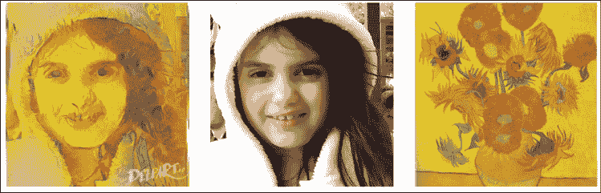

# 第三章：卷积神经网络

在*第一章*，*使用 TF 的神经网络基础*中，我们讨论了密集网络，其中每一层都与相邻的层完全连接。我们探讨了这些密集网络在分类 MNIST 手写字符数据集中的应用。在那个情境中，输入图像中的每个像素都分配给一个神经元，总共有 784 个输入神经元（28 x 28 像素）。然而，这种策略并没有利用图像之间的空间结构和关系。特别是，这段代码是一个密集网络，它将表示每个手写数字的位图转换为一个平坦的向量，移除了局部空间结构。移除空间结构是一个问题，因为重要的信息会丢失：

```py
#X_train is 60000 rows of 28x28 values --> reshaped in 60000 x 784
X_train = X_train.reshape(60000, 784)
X_test = X_test.reshape(10000, 784) 
```

卷积神经网络利用空间信息，因此它们非常适合用于图像分类。这些网络采用了一种灵活的架构，灵感来自于生物学数据，这些数据来自于在视觉皮层上进行的生理实验。生物学研究表明，我们的视觉是基于多个皮层层次的，每一层都识别更复杂的信息。首先，我们看到的是单个像素，然后从这些像素中我们能识别出简单的几何形状，接着是更复杂的元素，如物体、面孔、人类身体、动物等。

卷积神经网络是一个令人着迷的课题。在短短的时间内，它们已经展示出了颠覆性的技术突破，打破了多个领域的性能记录，从文本到视频再到语音，远远超出了它们最初用于图像处理的领域。在本章中，我们将介绍卷积神经网络（也称为 CNN、DCNN 和 ConvNets）的概念，这是一种对深度学习具有重要意义的神经网络类型。

本章涵盖以下主题：

+   深度卷积神经网络

+   深度卷积神经网络的示例

+   使用深度学习识别 CIFAR-10 图像

+   用于大规模图像识别的非常深的卷积网络

+   用于迁移学习的深度 Inception V3 网络

+   其他 CNN 架构

+   风格迁移

本章的所有代码文件可以在[`packt.link/dltfchp3`](https://packt.link/dltfchp3)找到。

让我们从深度卷积神经网络开始。

# 深度卷积神经网络

**深度卷积神经网络**（**DCNN**）由多个神经网络层组成。通常，卷积层和池化层（即下采样）交替排列。每个滤波器的深度从网络的左到右逐渐增加。最后一阶段通常由一个或多个全连接层组成。


图 3.1：DCNN 的示例

卷积神经网络（ConvNets）有三个关键的基本概念：局部感受野、共享权重和池化。让我们一起回顾它们。

## 局部感受野

如果我们希望保留图像或其他形式数据的空间信息，则将每个图像用像素矩阵表示是很方便的。在这种情况下，编码局部结构的简单方法是将相邻输入神经元的子矩阵连接成下一层的单个隐藏神经元。那个单个隐藏神经元代表一个局部感受野。请注意，这个操作被称为卷积，这也是这种类型网络的名称来源。您可以将卷积理解为一个矩阵对另一个矩阵的处理，后者被称为核。

当然，我们可以通过具有重叠子矩阵来编码更多信息。例如，假设每个单个子矩阵的大小为 5 x 5，并且这些子矩阵与 28 x 28 像素的 MNIST 图像一起使用。然后我们将能够在隐藏层生成 24 x 24 的局部感受野神经元。实际上，在触及图像边界之前，可以仅将子矩阵滑动 23 个位置。在 TensorFlow 中，沿核的一个边的像素数是核大小，而步幅长度是卷积中每步移动核的像素数。

让我们定义从一层到另一层的特征图。当然，我们可以有多个特征图，它们可以独立地从每个隐藏层学习。例如，我们可以从处理 MNIST 图像的 28 x 28 输入神经元开始，然后在下一个隐藏层中定义大小为 24 x 24 的 `k` 个特征图（形状再次为 5 x 5）。

## 共享权重和偏置

假设我们希望摆脱原始图像中的像素表示，通过获取能够在输入图像中的任何位置独立检测相同特征的能力。一个简单的方法是在所有隐藏层的神经元中使用相同的权重和偏置。这样一来，每一层将学习从图像中导出的一组位置无关的潜在特征，需要记住，每一层由并行的一组核组成，每个核只学习一个特征。

## 一个数学示例

理解卷积的一个简单方法是将其视为应用于矩阵的滑动窗口函数。在以下示例中，给定输入矩阵 *`I`* 和核 *`K`*，我们得到卷积输出。3 x 3 的核 *`K`*（有时称为过滤器或特征检测器）与输入矩阵逐元素相乘，以获得输出矩阵中的一个单元。通过在 *`I`* 上滑动窗口获得其他所有单元：

| J

&#124; 1 &#124; 1 &#124; 1 &#124; 0 &#124; 0 &#124;

&#124; 0 &#124; 1 &#124; 1 &#124; 1 &#124; 0 &#124;

&#124; 0 &#124; 0 &#124; 1 &#124; 1 &#124; 1 &#124;

&#124; 0 &#124; 0 &#124; 1 &#124; 1 &#124; 0 &#124;

&#124; 0 &#124; 1 &#124; 1 &#124; 0 &#124; 0 &#124;

| K

&#124; 1 &#124; 0 &#124; 1 &#124;

&#124; 0 &#124; 1 &#124; 0 &#124;

&#124; 1 &#124; 0 &#124; 1 &#124;

| Convolved

&#124; 4 &#124; 3 &#124; 4 &#124;

&#124; 2 &#124; 4 &#124; 3 &#124;

&#124; 2 &#124; 3 &#124; 4 &#124;

|

在这个例子中，我们决定一旦滑动窗口碰到 *`I`* 的边界就停止滑动（因此输出是 3x3）。或者，我们也可以选择用零填充输入（这样输出就是 5x5）。这个决策与采用的填充选择有关。请注意，卷积核深度等于输入深度（通道）。

另一种选择是我们每次滑动窗口时滑动的距离，这被称为步幅（stride），可以是 1 或更大。较大的步幅会产生较少的核应用并且输出尺寸较小，而较小的步幅会产生更多的输出并保留更多信息。

滤波器的大小、步幅和填充类型是超参数，可以在训练过程中进行微调。

## TensorFlow 中的 ConvNets

在 TensorFlow 中，如果我们想添加一个具有 32 个并行特征和 3x3 滤波器的卷积层，我们写：

```py
import tensorflow as tf
from tensorflow.keras import datasets, layers, models
model = models.Sequential()
model.add(layers.Conv2D(32, (3, 3), activation='relu', input_shape=(28, 28, 1))) 
```

这意味着我们对 28x28 的图像应用 3x3 卷积，输入通道为 1（或输入滤波器），输出通道为 32（或输出滤波器）。

卷积的示例见 *图 3.2*：


图 3.2：卷积示例

## 池化层

假设我们希望总结特征图的输出。我们可以再次利用单个特征图产生的输出的空间连续性，将子矩阵的值聚合为一个单一的输出值，从而合成地描述该物理区域相关的“含义”。

### 最大池化

一个简单且常见的选择是所谓的最大池化运算符，它仅输出在该区域内观察到的最大激活值。在 Keras 中，如果我们想定义一个 2x2 的最大池化层，我们写：

```py
model.add(layers.MaxPooling2D((2, 2))) 
```

最大池化操作的示例见 *图 3.3*：


图 3.3：最大池化示例

### 平均池化

另一种选择是平均池化，它简单地将一个区域聚合为该区域观察到的激活值的平均值。

请注意，Keras 实现了大量的池化层，完整的池化层列表可以在线查看（见[`keras.io/layers/pooling/`](https://keras.io/layers/pooling/)）。简而言之，所有池化操作不过是对给定区域的汇总操作。

## ConvNets 总结

到目前为止，我们已经描述了卷积神经网络（ConvNets）的基本概念。CNN 在一维上对音频和文本数据沿时间维度应用卷积和池化操作，在二维上对图像沿（高度 x 宽度）维度应用，在三维上对视频沿（高度 x 宽度 x 时间）维度应用。对于图像，将滤波器滑动到输入体积上会产生一个映射，提供每个空间位置上滤波器的响应。

换句话说，ConvNet 有多个滤波器堆叠在一起，能够独立于图像中的位置学习识别特定的视觉特征。这些视觉特征在网络的初始层是简单的，而在更深层的网络中变得越来越复杂。CNN 的训练需要识别每个滤波器的正确值，这样当输入通过多个层时，会激活最后一层的某些神经元，从而预测正确的值。

# DCNN 的一个例子：LeNet

获得图灵奖的 Yann LeCun 提出了[1]一类名为 LeNet 的卷积神经网络（ConvNets），该网络用于识别 MNIST 手写字符，并具有对简单几何变换和畸变的鲁棒性。LeNet 的核心思想是让较低层交替进行卷积操作和最大池化操作。卷积操作基于精心选择的局部感受野，并为多个特征图共享权重。然后，高层通过传统的多层感知器（MLP）进行全连接，隐藏层使用 softmax 作为输出层。

## LeNet 代码示例（TF）

要在代码中定义 LeNet，我们使用一个 2D 卷积模块（请注意，`tf.keras.layers.Conv2D`是`tf.keras.layers.Convolution2D`的别名，因此这两者可以互换使用——详见[`www.tensorflow.org/api_docs/python/tf/keras/layers/Conv2D`](https://www.tensorflow.org/api_docs/python/tf/keras/layers/Conv2D)）：

```py
layers.Convolution2D(20, (5, 5), activation='relu', input_shape=input_shape) 
```

其中，第一个参数是卷积中输出滤波器的数量，接下来的元组是每个滤波器的扩展。一个有趣的可选参数是 padding。有两个选项：`padding='valid'`表示卷积只在输入和滤波器完全重叠的地方计算，因此输出会小于输入，而`padding='same'`表示我们得到的输出与输入的大小`相同`，并且输入周围的区域会用零填充。

此外，我们还使用了`MaxPooling2D`模块：

```py
layers.MaxPooling2D(pool_size=(2, 2), strides=(2, 2)) 
```

其中，`pool_size=(2, 2)`是一个包含 2 个整数的元组，表示图像在垂直和水平方向下缩小的因子。所以(2, 2)将在每个维度上将图像缩小一半，`strides=(2, 2)`是用于处理的步幅。

现在，让我们回顾一下代码。首先，我们导入一些模块：

```py
import tensorflow as tf
from tensorflow.keras import datasets, layers, models, optimizers
# network and training
EPOCHS = 5
BATCH_SIZE = 128
VERBOSE = 1
OPTIMIZER = tf.keras.optimizers.Adam()
VALIDATION_SPLIT=0.90
IMG_ROWS, IMG_COLS = 28, 28 # input image dimensions
INPUT_SHAPE = (IMG_ROWS, IMG_COLS, 1)
NB_CLASSES = 10  # number of outputs = number of digits 
```

然后我们定义 LeNet 网络：

```py
#define the convnet 
def build(input_shape, classes):
    model = models.Sequential() 
```

我们有一个第一个卷积阶段，使用 ReLU 激活函数，接着是最大池化。我们的网络将学习 20 个卷积滤波器，每个滤波器的大小为 5x5。输出维度与输入形状相同，因此将是 28 x 28。请注意，由于`Convolutional2D`是我们管道的第一个阶段，我们还需要定义其`input_shape`。

最大池化操作实现了一个滑动窗口，窗口在层上滑动，并在每个区域中取最大值，步长为 2 个像素，垂直和水平方向都适用：

```py
# CONV => RELU => POOL
model.add(layers.Convolution2D(20, (5, 5), activation='relu',
            input_shape=input_shape))
model.add(layers.MaxPooling2D(pool_size=(2, 2), strides=(2, 2))) 
```

接着是第二个卷积阶段，使用 ReLU 激活函数，之后再次是最大池化层。在这种情况下，我们将学习到的卷积滤波器数量从之前的 20 增加到 50。增加深层滤波器数量是深度学习中的常见技术：

```py
# CONV => RELU => POOL
model.add(layers.Convolution2D(50, (5, 5), activation='relu'))
model.add(layers.MaxPooling2D(pool_size=(2, 2), strides=(2, 2))) 
```

然后我们进行一个标准的展平操作，接着是一个包含 500 个神经元的全连接网络，再接一个具有 10 类的 softmax 分类器：

```py
# Flatten => RELU layers
model.add(layers.Flatten())
model.add(layers.Dense(500, activation='relu'))
# a softmax classifier
model.add(layers.Dense(classes, activation="softmax"))
return model 
```

恭喜，你刚刚定义了你的第一个深度卷积学习网络！让我们看看它的视觉效果：


图 3.4：LeNet 可视化

现在我们需要一些额外的代码来训练网络，但这与我们在*第一章*《使用 TF 的神经网络基础》中描述的非常相似。这次我们还展示了打印损失的代码：

```py
# data: shuffled and split between train and test sets
(X_train, y_train), (X_test, y_test) = datasets.mnist.load_data()
# reshape
X_train = X_train.reshape((60000, 28, 28, 1))
X_test = X_test.reshape((10000, 28, 28, 1))
# normalize
X_train, X_test = X_train / 255.0, X_test / 255.0
# cast
X_train = X_train.astype('float32')
X_test = X_test.astype('float32')
# convert class vectors to binary class matrices
y_train = tf.keras.utils.to_categorical(y_train, NB_CLASSES)
y_test = tf.keras.utils.to_categorical(y_test, NB_CLASSES)
# initialize the optimizer and model
model = LeNet.build(input_shape=INPUT_SHAPE, classes=NB_CLASSES)
model.compile(loss="categorical_crossentropy", optimizer=OPTIMIZER,
    metrics=["accuracy"])
model.summary()
# use TensorBoard, princess Aurora!
callbacks = [
  # Write TensorBoard logs to './logs' directory
  tf.keras.callbacks.TensorBoard(log_dir='./logs')
]
# fit 
history = model.fit(X_train, y_train, 
        batch_size=BATCH_SIZE, epochs=EPOCHS, 
        verbose=VERBOSE, validation_split=VALIDATION_SPLIT,
        callbacks=callbacks)
score = model.evaluate(X_test, y_test, verbose=VERBOSE)
print("\nTest score:", score[0])
print('Test accuracy:', score[1]) 
```

现在让我们运行代码。如*图 3.5*所示，训练时间显著增加，每次迭代在我们的深度网络中现在需要约 28 秒，而在*第一章*《使用 TF 的神经网络基础》中定义的网络则只需约 1-2 秒。然而，准确率在训练集上达到了 99.991%的新高，验证集上为 99.91%，测试集上为 99.15%！


图 3.5：LeNet 准确率

让我们看看完整运行 20 个周期的执行情况：

```py
Model: "sequential_1"
_____________________________________________________________________
Layer (type)                    Output Shape              Param #    
=====================================================================
conv2d_2 (Conv2D)               (None, 24, 24, 20)        520        

max_pooling2d_2 (MaxPooling  2D) (None, 12, 12, 20)       0          

conv2d_3 (Conv2D)               (None, 8, 8, 50)          25050      

max_pooling2d_3 (MaxPooling  2D) (None, 4, 4, 50)         0          

flatten   (Flatten)             (None, 800)               0          

dense   (Dense)                 (None, 500)               400500     

dense_1 (Dense)                 (None, 10)                5010    

=====================================================================
Total params: 431,080
Trainable params: 431,080
Non-trainable params: 0
_________________________________________________________________
Train on 48000 samples, validate on 12000 samples
Epoch 1/20
[2019-04-04 14:18:28.546158: I tensorflow/core/profiler/lib/profiler_session.cc:164] Profile Session started.
48000/48000 [==============================] - 28s 594us/sample - loss: 0.2035 - accuracy: 0.9398 - val_loss: 0.0739 - val_accuracy: 0.9783
Epoch 2/20
48000/48000 [==============================] - 26s 534us/sample - loss: 0.0520 - accuracy: 0.9839 - val_loss: 0.0435 - val_accuracy: 0.9868
Epoch 3/20
48000/48000 [==============================] - 27s 564us/sample - loss: 0.0343 - accuracy: 0.9893 - val_loss: 0.0365 - val_accuracy: 0.9895
Epoch 4/20
48000/48000 [==============================] - 27s 562us/sample - loss: 0.0248 - accuracy: 0.9921 - val_loss: 0.0452 - val_accuracy: 0.9868
Epoch 5/20
48000/48000 [==============================] - 27s 562us/sample - loss: 0.0195 - accuracy: 0.9939 - val_loss: 0.0428 - val_accuracy: 0.9873
Epoch 6/20
48000/48000 [==============================] - 28s 548us/sample - loss: 0.0585 - accuracy: 0.9820 - val_loss: 0.1038 - val_accuracy: 0.9685
Epoch 7/20
48000/48000 [==============================] - 26s 537us/sample - loss: 0.0134 - accuracy: 0.9955 - val_loss: 0.0388 - val_accuracy: 0.9896
Epoch 8/20
48000/48000 [==============================] - 29s 589us/sample - loss: 0.0097 - accuracy: 0.9966 - val_loss: 0.0347 - val_accuracy: 0.9899
Epoch 9/20
48000/48000 [==============================] - 29s 607us/sample - loss: 0.0091 - accuracy: 0.9971 - val_loss: 0.0515 - val_accuracy: 0.9859
Epoch 10/20
48000/48000 [==============================] - 27s 565us/sample - loss: 0.0062 - accuracy: 0.9980 - val_loss: 0.0376 - val_accuracy: 0.9904
Epoch 11/20
48000/48000 [==============================] - 30s 627us/sample - loss: 0.0068 - accuracy: 0.9976 - val_loss: 0.0366 - val_accuracy: 0.9911
Epoch 12/20
48000/48000 [==============================] - 24s 505us/sample - loss: 0.0079 - accuracy: 0.9975 - val_loss: 0.0389 - val_accuracy: 0.9910
Epoch 13/20
48000/48000 [==============================] - 28s 584us/sample - loss: 0.0057 - accuracy: 0.9978 - val_loss: 0.0531 - val_accuracy: 0.9890
Epoch 14/20
48000/48000 [==============================] - 28s 580us/sample - loss: 0.0045 - accuracy: 0.9984 - val_loss: 0.0409 - val_accuracy: 0.9911
Epoch 15/20
48000/48000 [==============================] - 26s 537us/sample - loss: 0.0039 - accuracy: 0.9986 - val_loss: 0.0436 - val_accuracy: 0.9911
Epoch 16/20
48000/48000 [==============================] - 25s 513us/sample - loss: 0.0059 - accuracy: 0.9983 - val_loss: 0.0480 - val_accuracy: 0.9890
Epoch 17/20
48000/48000 [==============================] - 24s 499us/sample - loss: 0.0042 - accuracy: 0.9988 - val_loss: 0.0535 - val_accuracy: 0.9888
Epoch 18/20
48000/48000 [==============================] - 24s 505us/sample - loss: 0.0042 - accuracy: 0.9986 - val_loss: 0.0349 - val_accuracy: 0.9926
Epoch 19/20
48000/48000 [==============================] - 29s 599us/sample - loss: 0.0052 - accuracy: 0.9984 - val_loss: 0.0377 - val_accuracy: 0.9920
Epoch 20/20
48000/48000 [==============================] - 25s 524us/sample - loss: 0.0028 - accuracy: 0.9991 - val_loss: 0.0477 - val_accuracy: 0.9917
10000/10000 [==============================] - 2s 248us/sample - loss: 0.0383 - accuracy: 0.9915
Test score: 0.03832608199457617
Test accuracy: 0.9915 
```

让我们绘制模型的准确率和模型损失图，并了解到，我们只需训练 10 次迭代，就能达到类似的 99.1%准确率：

```py
Train on 48000 samples, validate on 12000 samples
Epoch 1/10
[2019-04-04 15:57:17.848186: I tensorflow/core/profiler/lib/profiler_session.cc:164] Profile Session started.
48000/48000 [==============================] - 26s 544us/sample - loss: 0.2134 - accuracy: 0.9361 - val_loss: 0.0688 - val_accuracy: 0.9783
Epoch 2/10
48000/48000 [==============================] - 30s 631us/sample - loss: 0.0550 - accuracy: 0.9831 - val_loss: 0.0533 - val_accuracy: 0.9843
Epoch 3/10
48000/48000 [==============================] - 30s 621us/sample - loss: 0.0353 - accuracy: 0.9884 - val_loss: 0.0410 - val_accuracy: 0.9874
Epoch 4/10
48000/48000 [==============================] - 37s 767us/sample - loss: 0.0276 - accuracy: 0.9910 - val_loss: 0.0381 - val_accuracy: 0.9887
Epoch 5/10
48000/48000 [==============================] - 24s 509us/sample - loss: 0.0200 - accuracy: 0.9932 - val_loss: 0.0406 - val_accuracy: 0.9881
Epoch 6/10
48000/48000 [==============================] - 31s 641us/sample - loss: 0.0161 - accuracy: 0.9950 - val_loss: 0.0423 - val_accuracy: 0.9881
Epoch 7/10
48000/48000 [==============================] - 29s 613us/sample - loss: 0.0129 - accuracy: 0.9955 - val_loss: 0.0396 - val_accuracy: 0.9894
Epoch 8/10
48000/48000 [==============================] - 27s 554us/sample - loss: 0.0107 - accuracy: 0.9965 - val_loss: 0.0454 - val_accuracy: 0.9871
Epoch 9/10
48000/48000 [==============================] - 24s 510us/sample - loss: 0.0082 - accuracy: 0.9973 - val_loss: 0.0388 - val_accuracy: 0.9902
Epoch 10/10
48000/48000 [==============================] - 26s 542us/sample - loss: 0.0083 - accuracy: 0.9970 - val_loss: 0.0440 - val_accuracy: 0.99892
10000/10000 [==============================] - 2s 196us/sample - loss: 0.0327 - accuracy: 0.9910
Test score: 0.03265062951518773
Test accuracy: 0.991 
```

让我们看一些 MNIST 图像，以便理解 99.1%准确率的实际效果！例如，人的写 9 的方式有很多种，其中一种在*图 3.6*中展示。对于 3、7、4 和 5 也一样，图中的 1 号字符难度极高，即使是人类也可能难以识别：


图 3.6：MNIST 手写字符示例

我们可以用以下图表总结目前不同模型的所有进展。我们的简单网络起始准确率为 90.71%，这意味着每 100 个手写字符中大约有 9 个无法正确识别。然后，使用深度学习架构我们提高了 8%的准确率，达到了 99.2%，这意味着每 100 个手写字符中少于 1 个被误识别，正如*图 3.7*所示：


图 3.7：不同模型和优化器的准确率

## 理解深度学习的威力

另一个我们可以运行的测试是为了更好地理解深度学习和卷积网络的威力，我们可以减少训练集的大小并观察性能的下降。一个方法是将 50,000 个训练样本分成两组：

+   用于训练我们模型的正确训练集将逐步减少大小：5,900、3,000、1,800、600 和 300 个示例。

+   用于估计我们的模型训练效果的验证集将由剩余的示例组成。我们的测试集始终是固定的，包含 10,000 个示例。

在此设置下，我们将前面定义的深度学习卷积神经网络与*第一章*中定义的第一个示例神经网络进行比较，*神经网络基础与 TF*。正如我们在下面的图表中所看到的，当有更多数据可用时，我们的深度网络总是优于简单网络。在有 5,900 个训练示例时，深度学习网络的准确率为 97.23%，而简单网络的准确率为 94%。

一般来说，深度网络需要更多的训练数据才能充分展现其能力，如*图 3.8*所示：


图 3.8：不同数据量下的准确率

有关 MNIST 的最新结果（例如，当前可用的最高性能）可以在线查阅（参见 [`rodrigob.github.io/are_we_there_yet/build/classification_datasets_results.xhtml`](http://rodrigob.github.io/are_we_there_yet/build/classification_datasets_results.xhtml)）。截至 2019 年 3 月，最佳结果的错误率为 0.21% [2]。

# 使用深度学习识别 CIFAR-10 图像

CIFAR-10 数据集包含 60,000 张 32 x 32 像素的彩色图像，分为三个通道，并划分为 10 个类别。每个类别包含 6,000 张图像。训练集包含 50,000 张图像，而测试集提供 10,000 张图像。以下图片来自 CIFAR 数据库（参见 [`www.cs.toronto.edu/~kriz/cifar.xhtml`](https://www.cs.toronto.edu/~kriz/cifar.xhtml)），展示了来自 10 个类别的一些随机示例：


图 3.9：CIFAR-10 图像示例

本节中的图像来自 *Learning Multiple Layers of Features from Tiny Images*，Alex Krizhevsky，2009：[`www.cs.toronto.edu/~kriz/learning-features-2009-TR.pdf`](https://www.cs.toronto.edu/~kriz/learning-features-2009-TR.pdf)。它们是 CIFAR-10 数据集的一部分（toronto.edu）：[`www.cs.toronto.edu/~kriz/cifar.xhtml`](https://www.cs.toronto.edu/~kriz/cifar.xhtml)。

目标是识别之前未见过的图像，并将其分配到十个类别中的一个。让我们定义一个合适的深度网络。

首先，我们导入一些有用的模块，定义几个常量并加载数据集（包括加载操作的完整代码可在线获取）：

```py
import tensorflow as tf
from tensorflow.keras import datasets, layers, models, optimizers
# CIFAR_10 is a set of 60K images 32x32 pixels on 3 channels
IMG_CHANNELS = 3
IMG_ROWS = 32
IMG_COLS = 32
#constant
BATCH_SIZE = 128
EPOCHS = 20
CLASSES = 10
VERBOSE = 1
VALIDATION_SPLIT = 0.2
OPTIM = tf.keras.optimizers.RMSprop() 
```

我们的网络将学习 32 个卷积滤波器，每个滤波器的大小为 3 x 3。输出维度与输入形状相同，因此为 32 x 32，所使用的激活函数是 ReLU 函数，这是引入非线性的一种简单方法。之后，我们有一个 `MaxPooling` 操作，池大小为 2 x 2，并且丢弃率为 25%：

```py
#define the convnet 
def build(input_shape, classes):
    model = models.Sequential() 
    model.add(layers.Convolution2D(32, (3, 3), activation='relu',
                        input_shape=input_shape))
    model.add(layers.MaxPooling2D(pool_size=(2, 2)))
    model.add(layers.Dropout(0.25)) 
```

深度管道中的下一个阶段是一个包含 512 个单元的密集网络，并使用 ReLU 激活，随后是 50%的 dropout，最后是一个带有 10 个类别输出的 softmax 层，每个类别对应一个类别：

```py
 model.add(layers.Flatten())
    model.add(layers.Dense(512, activation='relu'))
    model.add(layers.Dropout(0.5))
    model.add(layers.Dense(classes, activation='softmax'))
    return model 
```

在定义了网络之后，我们可以训练模型。在这种情况下，我们将数据进行拆分，并计算一个验证集，除了训练集和测试集外。训练集用于构建我们的模型，验证集用于选择表现最佳的方式，而测试集用于检查我们最佳模型在新数据上的表现：

```py
# use TensorBoard, princess Aurora!
callbacks = [
  # Write TensorBoard logs to './logs' directory
  tf.keras.callbacks.TensorBoard(log_dir='./logs')
]
# train
model.compile(loss='categorical_crossentropy', optimizer=OPTIM,
    metrics=['accuracy'])

model.fit(X_train, y_train, batch_size=BATCH_SIZE,
    epochs=EPOCHS, validation_split=VALIDATION_SPLIT, 
    verbose=VERBOSE, callbacks=callbacks) 
score = model.evaluate(X_test, y_test,
                     batch_size=BATCH_SIZE, verbose=VERBOSE)
print("\nTest score:", score[0])
print('Test accuracy:', score[1]) 
```

让我们运行代码。我们的网络在 20 次迭代后达到了 66.8%的测试准确率。我们还打印了准确率和损失图，并使用`model.summary()`输出了网络的总结：

```py
Epoch 17/20
40000/40000 [==============================] - 112s 3ms/sample - loss: 0.6282 - accuracy: 0.7841 - val_loss: 1.0296 - val_accuracy: 0.6734
Epoch 18/20
40000/40000 [==============================] - 76s 2ms/sample - loss: 0.6140 - accuracy: 0.7879 - val_loss: 1.0789 - val_accuracy: 0.6489
Epoch 19/20
40000/40000 [==============================] - 74s 2ms/sample - loss: 0.5931 - accuracy: 0.7958 - val_loss: 1.0461 - val_accuracy: 0.6811
Epoch 20/20
40000/40000 [==============================] - 71s 2ms/sample - loss: 0.5724 - accuracy: 0.8042 - val_loss: 0.1.0527 - val_accuracy: 0.6773
10000/10000 [==============================] - 5s 472us/sample - loss: 1.0423 - accuracy: 0.6686
Test score: 1.0423416819572449
Test accuracy: 0.6686 
```

*图 3.10* 显示了准确率和损失图：


图 3.10：定义网络的准确率和损失

我们已经看到了如何提高准确率，以及 CIFAR-10 数据集的损失如何变化。下一节将讨论如何改善当前的结果。

## 通过更深的网络提高 CIFAR-10 性能

提高性能的一种方法是定义一个更深的网络，使用多个卷积操作。在以下示例中，我们有一系列模块：

第 1 个模块：（CONV+CONV+MaxPool+DropOut）

第 2 个模块：（CONV+CONV+MaxPool+DropOut）

第 3 个模块：（CONV+CONV+MaxPool+DropOut）

随后是一个标准的密集输出层。所有使用的激活函数都是 ReLU 函数。还有一个新层，我们在*第一章*中也讨论过，*神经网络基础与 TF*，`BatchNormalization()`，用于在模块之间引入一种正则化形式：

```py
def build_model(): 
    model = models.Sequential()

    #1st block
    model.add(layers.Conv2D(32, (3,3), padding='same', 
        input_shape=x_train.shape[1:], activation='relu'))
    model.add(layers.BatchNormalization())
    model.add(layers.Conv2D(32, (3,3), padding='same', activation='relu'))
    model.add(layers.BatchNormalization())
    model.add(layers.MaxPooling2D(pool_size=(2,2)))
    model.add(layers.Dropout(0.2))
    #2nd block
    model.add(layers.Conv2D(64, (3,3), padding='same', activation='relu'))
    model.add(layers.BatchNormalization())
    model.add(layers.Conv2D(64, (3,3), padding='same', activation='relu'))
    model.add(layers.BatchNormalization())
    model.add(layers.MaxPooling2D(pool_size=(2,2)))
    model.add(layers.Dropout(0.3))
    #3d block 
    model.add(layers.Conv2D(128, (3,3), padding='same', activation='relu'))
    model.add(layers.BatchNormalization())
    model.add(layers.Conv2D(128, (3,3), padding='same', activation='relu'))
    model.add(layers.BatchNormalization())
    model.add(layers.MaxPooling2D(pool_size=(2,2)))
    model.add(layers.Dropout(0.4))
    #dense  
    model.add(layers.Flatten())
    model.add(layers.Dense(NUM_CLASSES, activation='softmax'))
    return model
    model.summary() 
```

恭喜！你已经定义了一个更深的网络。让我们运行代码 40 次，达到 82%的准确率！为了完整性，我们加上剩余的代码部分。第一部分是加载和标准化数据：

```py
import tensorflow as tf
from tensorflow.keras import datasets, layers, models, regularizers, optimizers
from tensorflow.keras.preprocessing.image import ImageDataGenerator
import numpy as np

EPOCHS=50
NUM_CLASSES = 10
def load_data():
    (x_train, y_train), (x_test, y_test) = datasets.cifar10.load_data()
    x_train = x_train.astype('float32')
    x_test = x_test.astype('float32')

    #normalize 
    mean = np.mean(x_train,axis=(0,1,2,3))
    std = np.std(x_train,axis=(0,1,2,3))
    x_train = (x_train-mean)/(std+1e-7)
    x_test = (x_test-mean)/(std+1e-7)

    y_train =  tf.keras.utils.to_categorical(y_train,NUM_CLASSES)
    y_test =  tf.keras.utils.to_categorical(y_test,NUM_CLASSES)
    return x_train, y_train, x_test, y_test 
```

然后我们需要有一部分代码来训练网络：

```py
(x_train, y_train, x_test, y_test) = load_data()
model = build_model()
model.compile(loss='categorical_crossentropy', 
            optimizer='RMSprop', 
            metrics=['accuracy'])
#train
batch_size = 64
model.fit(x_train, y_train, batch_size=batch_size,
    epochs=EPOCHS, validation_data=(x_test,y_test)) 
score = model.evaluate(x_test, y_test,
                     batch_size=batch_size)
print("\nTest score:", score[0])
print('Test accuracy:', score[1]) 
```

因此，相较于先前的简单深度网络，我们提高了 15.14%的性能。

## 通过数据增强提高 CIFAR-10 性能

提高性能的另一种方法是为我们的训练生成更多的图像。这里的想法是，我们可以从标准的 CIFAR 训练集开始，通过多种转换类型来增强这个集合，包括旋转、重新缩放、水平或垂直翻转、缩放、通道偏移等。让我们看看在上一节中定义的相同网络上应用的代码：

```py
from tensorflow.keras.preprocessing.image import ImageDataGenerator
#image augmentation
datagen = ImageDataGenerator(
    rotation_range=30,
    width_shift_range=0.2,
    height_shift_range=0.2,
    horizontal_flip=True,
    )
datagen.fit(x_train) 
```

`rotation_range`是一个度数值（0-180），用于随机旋转图片；`width_shift`和`height_shift`是随机平移图片的垂直或水平方向的范围；`zoom_range`用于随机缩放图片；`horizontal_flip`用于随机水平翻转一半图像；`fill_mode`是用于填充旋转或平移后可能出现的新像素的策略。

通过数据增强，我们从标准 CIFAR-10 数据集生成了更多的训练图像，如*图 3.11*所示：


图 3.11：图像增强的一个示例

现在我们可以直接应用这个直觉来进行训练。使用之前定义的相同 ConvNet，我们只需生成更多的增强图像，然后进行训练。为了提高效率，生成器与模型并行运行。这使得图像增强可以在 CPU 上进行，同时在 GPU 上并行训练。以下是代码：

```py
#train
batch_size = 64
model.fit_generator(datagen.flow(x_train, y_train, batch_size=batch_size),
                    epochs=EPOCHS,
                    verbose=1,validation_data=(x_test,y_test))
#save to disk
model_json = model.to_json()
with open('model.json', 'w') as json_file:
    json_file.write(model_json)
model.save_weights('model.h5') 
#test
scores = model.evaluate(x_test, y_test, batch_size=128, verbose=1)
print('\nTest result: %.3f loss: %.3f' % (scores[1]*100,scores[0])) 
```

每次迭代现在变得更昂贵，因为我们拥有更多的训练数据。因此，我们只进行 50 次迭代。我们可以看到，通过这样做，我们达到了 85.91%的准确率：

```py
Epoch 46/50
50000/50000 [==============================] - 36s 722us/sample - loss: 0.2440 - accuracy: 0.9183 - val_loss: 0.4918 - val_accuracy: 0.8546
Epoch 47/50
50000/50000 [==============================] - 34s 685us/sample - loss: 0.2338 - accuracy: 0.9208 - val_loss: 0.4884 - val_accuracy: 0.8574
Epoch 48/50
50000/50000 [==============================] - 32s 643us/sample - loss: 0.2383 - accuracy: 0.9189 - val_loss: 0.5106 - val_accuracy: 0.8556
Epoch 49/50
50000/50000 [==============================] - 37s 734us/sample - loss: 0.2285 - accuracy: 0.9212 - val_loss: 0.5017 - val_accuracy: 0.8581
Epoch 49/50
50000/50000 [==============================] - 36s 712us/sample - loss: 0.2263 - accuracy: 0.9228 - val_loss: 0.4911 - val_accuracy: 0.8591
10000/10000 [==============================] - 2s 160us/sample - loss: 0.4911 - accuracy: 0.8591
Test score: 0.4911323667049408
Test accuracy: 0.8591 
```

我们实验中获得的结果总结在下图中：


图 3.12：不同网络在 CIFAR-10 上的准确率。在 x 轴上，我们有递增的迭代次数

CIFAR-10 的最新结果列表可以在网上找到（请见[`rodrigob.github.io/are_we_there_yet/build/classification_datasets_results.xhtml`](http://rodrigob.github.io/are_we_there_yet/build/classification_datasets_results.xhtml)）。截至 2019 年 4 月，最佳结果的准确率为 96.53% [3]。

## 使用 CIFAR-10 进行预测

假设我们希望使用刚刚训练的 CIFAR-10 深度学习模型来批量评估图像。由于我们已经保存了模型和权重，因此每次不需要重新训练：

```py
import numpy as np
import scipy.misc
from tensorflow.keras.models import model_from_json
from tensorflow.keras.optimizers import SGD
#load model
model_architecture = 'cifar10_architecture.json'
model_weights = 'cifar10_weights.h5'
model = model_from_json(open(model_architecture).read())
model.load_weights(model_weights)
#load images
img_names = ['cat-standing.jpg', 'dog.jpg']
imgs = [np.transpose(scipy.misc.imresize(scipy.misc.imread(img_name), (32, 32)),
                     (2, 0, 1)).astype('float32')
           for img_name in img_names]
imgs = np.array(imgs) / 255
# train
optim = SGD()
model.compile(loss='categorical_crossentropy', optimizer=optim,
    metrics=['accuracy'])
# predict 
predictions = model.predict_classes(imgs)
print(predictions) 
```

注意，我们使用 SciPy 的`imread`来加载图像，然后将其调整为 32 × 32 像素。生成的图像张量的维度为（32, 32, 3）。然而，我们希望颜色维度位于第一位而非最后，因此我们对其进行了转置。之后，图像张量的列表被合并为一个单一张量，并归一化至 0 到 1.0 之间。

现在让我们分别获取一只  和一只  的预测。我们得到的类别是 3（猫）和 5（狗），如预期一样。我们成功地创建了一个卷积神经网络（ConvNet）来分类 CIFAR-10 图像。接下来，我们将研究 VGG16：深度学习的突破。

# 用于大规模图像识别的非常深的卷积神经网络

2014 年，一篇名为*Very Deep Convolutional Networks for Large-Scale Image Recognition*的论文提出了对图像识别的有趣贡献，由 K. Simonyan 和 A. Zisserman [4]提出。论文表明，通过将深度推到 16-19 层，可以显著改进之前的配置。论文中的一个模型标记为 D 或 VGG16，有 16 层深度。Java Caffe（参见[`caffe.berkeleyvision.org/`](http://caffe.berkeleyvision.org/)）用于在 ImageNet ILSVRC-2012 上训练模型（参见[`image-net.org/challenges/LSVRC/2012/`](http://image-net.org/challenges/LSVRC/2012/)），包括 1000 个类别的图像，分为三组：训练（130 万张图像）、验证（50K 张图像）和测试（100K 张图像）。每张图像为（224 x 224），3 通道。该模型在 ILSVRC-2012-val 上达到 7.5%的 top-5 错误率（前 5 个结果的错误率），在 ILSVRC-2012-test 上达到 7.4%的 top-5 错误率。

根据 ImageNet 网站：

> 本竞赛的目标是利用大量手工标记的 ImageNet 数据集子集（包含 1000 万张标记图像，涵盖 10000 多个物体类别）进行训练，用于检索和自动注释照片内容。测试图像将不带任何初始注释 —— 没有分割或标签 —— 算法必须生成标签，指定图像中存在的对象。

模型在 Caffe 中实现的权重已经直接转换为（[`gist.github.com/baraldilorenzo/07d7802847aaad0a35d3`](https://gist.github.com/baraldilorenzo/07d7802847aaad0a35d3)）`tf.Keras`，可以通过预加载到下面实现的`tf.Keras`模型中使用，正如论文所述：

```py
import tensorflow as tf
from tensorflow.keras import layers, models
# define a VGG16 network
def VGG_16(weights_path=None):
    model = models.Sequential()
    model.add(layers.ZeroPadding2D((1,1),input_shape=(224,224, 3)))
    model.add(layers.Convolution2D(64, (3, 3), activation='relu'))
    model.add(layers.ZeroPadding2D((1,1)))
    model.add(layers.Convolution2D(64, (3, 3), activation='relu'))
    model.add(layers.MaxPooling2D((2,2), strides=(2,2)))
    model.add(layers.ZeroPadding2D((1,1)))
    model.add(layers.Convolution2D(128, (3, 3), activation='relu'))
    model.add(layers.ZeroPadding2D((1,1)))
    model.add(layers.Convolution2D(128, (3, 3), activation='relu'))
    model.add(layers.MaxPooling2D((2,2), strides=(2,2)))
    model.add(layers.ZeroPadding2D((1,1)))
    model.add(layers.Convolution2D(256, (3, 3), activation='relu'))
    model.add(layers.ZeroPadding2D((1,1)))
    model.add(layers.Convolution2D(256, (3, 3), activation='relu'))
    model.add(layers.ZeroPadding2D((1,1)))
    model.add(layers.Convolution2D(256, (3, 3), activation='relu'))
    model.add(layers.MaxPooling2D((2,2), strides=(2,2)))
    model.add(layers.ZeroPadding2D((1,1)))
    model.add(layers.Convolution2D(512, (3, 3), activation='relu'))
    model.add(layers.ZeroPadding2D((1,1)))
    model.add(layers.Convolution2D(512, (3, 3), activation='relu'))
    model.add(layers.ZeroPadding2D((1,1)))
    model.add(layers.Convolution2D(512, (3, 3), activation='relu'))
    model.add(layers.MaxPooling2D((2,2), strides=(2,2)))
    model.add(layers.ZeroPadding2D((1,1)))
    model.add(layers.Convolution2D(512, (3, 3), activation='relu'))
    model.add(layers.ZeroPadding2D((1,1)))
    model.add(layers.Convolution2D(512, (3, 3), activation='relu'))
    model.add(layers.ZeroPadding2D((1,1)))
    model.add(layers.Convolution2D(512, (3, 3), activation='relu'))
    model.add(layers.MaxPooling2D((2,2), strides=(2,2)))
    model.add(layers.Flatten())
    #top layer of the VGG net
    model.add(layers.Dense(4096, activation='relu'))
    model.add(layers.Dropout(0.5))
    model.add(layers.Dense(4096, activation='relu'))
    model.add(layers.Dropout(0.5))
    model.add(layers.Dense(1000, activation='softmax'))
    if weights_path:
        model.load_weights(weights_path)
    return model 
```

我们已经实现了一个 VGG16 网络。请注意，我们也可以直接使用`tf.keras.applications.vgg16`获取模型及其权重。在这里，我想展示 VGG16 是如何内部工作的。接下来，我们将利用它。

## 通过 VGG16 网络识别猫

现在让我们测试一个的图像。

请注意，我们将使用预定义的权重：

```py
import cv2
im = cv2.resize(cv2.imread('cat.jpg'), (224, 224)).astype(np.float32)
#im = im.transpose((2,0,1))
im = np.expand_dims(im, axis=0)
# Test pretrained model
model = VGG_16('/Users/antonio/.keras/models/vgg16_weights_tf_dim_ordering_tf_kernels.h5')
model.summary()
model.compile(optimizer='sgd', loss='categorical_crossentropy')
out = model.predict(im)
print(np.argmax(out)) 
```

当代码执行时，返回类别`285`，对应于“埃及猫”（参见[`gist.github.com/yrevar/942d3a0ac09ec9e5eb3a`](https://gist.github.com/yrevar/942d3a0ac09ec9e5eb3a)）：

```py
Total params: 138,357,544
Trainable params: 138,357,544
Non-trainable params: 0
---------------------------------------------------------------
285 
```

令人印象深刻，不是吗？我们的 VGG16 网络可以成功识别猫的图像！这是深度学习的重要一步。距离[4]中的论文仅过去七年，但那是一个改变游戏规则的时刻。

## 使用内置的 tf.Keras VGG16 网络模块

`tf.Keras`应用程序是预构建和预训练的深度学习模型。在实例化模型时，权重将自动下载并存储在`~/.keras/models/`中。使用内置代码非常简单：

```py
import tensorflow as tf
from tensorflow.keras.applications.vgg16 import VGG16
import matplotlib.pyplot as plt
import numpy as np
import cv2
# pre built model with pre-trained weights on imagenet
model = VGG16(weights='imagenet', include_top=True)
model.compile(optimizer='sgd', loss='categorical_crossentropy')
# resize into VGG16 trained images' format
im = cv2.resize(cv2.imread('steam-locomotive.jpg'), (224, 224))
im = np.expand_dims(im, axis=0)
# predict
out = model.predict(im)
index = np.argmax(out)
print(index)
plt.plot(out.ravel())
plt.show()
#this should print 820 for steaming train 
```

现在，让我们考虑一辆火车，。如果我们运行代码，结果是 `820`，这是“蒸汽机车”在 ImageNet 中的代码。同样重要的是，所有其他类别的支持度非常弱，如*图 3.13*所示：


图 3.13：蒸汽火车是最可能的结果

结束本节时，请注意 VGG16 只是 `tf.Keras` 中预构建模块之一。预训练模型的完整列表可在线获取（见 [`www.tensorflow.org/api_docs/python/tf/keras/applications`](https://www.tensorflow.org/api_docs/python/tf/keras/applications)）。

## 回收预构建的深度学习模型以提取特征

一个非常简单的思路是使用 VGG16，通常是 DCNN，用于特征提取。此代码通过从特定层提取特征来实现这一思路。

请注意，我们需要切换到函数式 API，因为顺序模型仅接受层：

```py
import tensorflow as tf
from tensorflow.keras.applications.vgg16 import VGG16 
from tensorflow.keras import models
from tensorflow.keras.preprocessing import image
from tensorflow.keras.applications.vgg16 import preprocess_input
import numpy as np
import cv2
# prebuild model with pre-trained weights on imagenet
base_model = VGG16(weights='imagenet', include_top=True)
print (base_model)
for i, layer in enumerate(base_model.layers):
    print (i, layer.name, layer.output_shape)
# extract features from block4_pool block
model = models.Model(inputs=base_model.input, 
    outputs=base_model.get_layer('block4_pool').output)
img_path = 'cat.jpg'
img = image.load_img(img_path, target_size=(224, 224))
x = image.img_to_array(img)
x = np.expand_dims(x, axis=0)
x = preprocess_input(x)
# get the features from this block
features = model.predict(x)
print(features) 
```

你可能会想知道为什么我们要从 DCNN 的中间层提取特征。其理由是，当网络学习将图像分类到不同类别时，每一层都会学习识别执行最终分类所需的特征。较低层识别较低阶的特征，如颜色和边缘，而较高层则将这些低阶特征组合成更高阶的特征，如形状或物体。因此，中间层有能力从图像中提取重要特征，这些特征更有可能帮助不同种类的分类。

这有多个优点。首先，我们可以依赖公开的大规模训练，并将这种学习转移到新的领域。其次，我们可以节省在昂贵训练上的时间。第三，即使我们没有大量的领域训练样本，我们也能提供合理的解决方案。我们还可以为当前任务获得一个良好的初始网络结构，而不是盲目猜测。

有了这些，我们将结束对 VGG16 CNN 的概述，这是本章定义的最后一个深度学习模型。

# 用于迁移学习的深度 Inception V3

迁移学习是一种非常强大的深度学习技术，应用于多个不同领域。迁移学习的基本思想非常简单，可以通过一个类比来解释。假设你想学一门新语言，比如西班牙语。那么，从你已经掌握的其他语言（比如英语）开始可能会很有帮助。

按照这个思路，计算机视觉研究人员现在通常使用预训练的 CNN 来为新任务生成表示[1]，其中数据集可能不足以从头训练一个完整的 CNN。另一种常见策略是拿到预训练的 ImageNet 网络，然后微调整个网络以适应新的任务。例如，我们可以拿一个训练来识别 10 类音乐的网络，并微调它来识别 20 类电影。

Inception V3 是一个由 Google 开发的非常深的卷积神经网络[2]。`tf.Keras`实现了完整的网络，如*图 3.14*所示，并且它已经在 ImageNet 上进行了预训练。该模型的默认输入尺寸是 299x299，且有三个通道：


图 3.14：Inception V3 深度学习模型

这个骨架示例灵感来源于一个在线可用的方案（见[`keras.io/applications/`](https://keras.io/applications/)）。假设我们有一个来自不同领域的训练数据集 `D`，与 ImageNet 不同。`D` 的输入有 1,024 个特征，输出有 200 个类别。让我们看一个代码片段：

```py
import tensorflow as tf
from tensorflow.keras.applications.inception_v3 import InceptionV3
from tensorflow.keras.preprocessing import image
from tensorflow.keras import layers, models
# create the base pre-trained model
base_model = InceptionV3(weights='imagenet', include_top=False) 
```

我们使用一个经过训练的 Inception V3 模型：我们不包括全连接层——具有 1,024 个输入的稠密层——因为我们希望在 `D` 上进行微调。上述代码片段将会为我们下载预训练的权重：

```py
Downloading data from https://github.com/fchollet/deep-learning-models/releases/download/v0.5/inception_v3_weights_tf_dim_ordering_tf_kernels_notop.h5
87916544/87910968 [===========================] – 26s 0us/step 
```

因此，如果你查看最后四层（`include_top=True`时），你会看到这些形状：

```py
# layer.name, layer.input_shape, layer.output_shape
('mixed10', [(None, 8, 8, 320), (None, 8, 8, 768), (None, 8, 8, 768), (None, 8, 8, 192)], (None, 8, 8, 2048))
('avg_pool', (None, 8, 8, 2048), (None, 1, 1, 2048))
('flatten', (None, 1, 1, 2048), (None, 2048))
('predictions', (None, 2048), (None, 1000)) 
```

当`include_top=False`时，你移除了最后三层并暴露了`mixed_10`层。`GlobalAveragePooling2D`层将`(None, 8, 8, 2048)`转换为`(None, 2048)`，其中`(None, 2048)`张量中的每个元素是对应的`(8,8)`子张量在`(None, 8, 8, 2048)`张量中的平均值。`None`表示未指定的维度，这对于定义占位符非常有用：

```py
x = base_model.output
# let's add a fully-connected layer as first layer
x = layers.Dense(1024, activation='relu')(x)
# and a logistic layer with 200 classes as last layer
predictions = layers.Dense(200, activation='softmax')(x)
# model to train
model = models.Model(inputs=base_model.input, outputs=predictions) 
```

所有卷积层都是预训练的，因此我们在训练完整模型时冻结这些层：

```py
# i.e. freeze all convolutional InceptionV3 layers
for layer in base_model.layers:
    layer.trainable = False 
```

然后，模型会被编译并训练几个周期，以便训练顶层。为了简化，这里我们省略了训练代码本身：

```py
# compile the model (should be done *after* setting layers to non-trainable)
model.compile(optimizer='rmsprop', loss='categorical_crossentropy')
# train the model on the new data for a few epochs
model.fit_generator(...) 
```

然后，我们冻结顶层的 Inception 层，并微调其他 Inception 层。在这个示例中，我们决定冻结前 172 层（这是一个可调的超参数）：

```py
# we chose to train the top 2 inception blocks, i.e. we will freeze
# the first 172 layers and unfreeze the rest:
for layer in model.layers[:172]:
   layer.trainable = False
for layer in model.layers[172:]:
   layer.trainable = True 
```

然后，模型会重新编译以进行微调优化：

```py
# we need to recompile the model for these modifications to take effect
# we use SGD with a low learning rate
from tensorflow.keras.optimizers import SGD
model.compile(optimizer=SGD(lr=0.0001, momentum=0.9), loss='categorical_crossentropy')
# we train our model again (this time fine-tuning the top 2 inception blocks
# alongside the top Dense layers
model.fit_generator(...) 
```

现在我们有了一个新的深度网络，它重用了一个标准的 Inception V3 网络，但通过迁移学习训练于新领域 `D`。当然，针对实现良好精度有许多微调参数。然而，我们现在通过迁移学习重新使用了一个非常大的预训练网络作为起点。这样做的好处是我们可以避免在我们的机器上进行训练，而是重用`tf.Keras`中已经可用的内容。

# 其他 CNN 架构

在本节中，我们将讨论许多其他不同的 CNN 架构，包括 AlexNet、残差网络、highwayNets、DenseNets 和 Xception。

## AlexNet

最早的卷积网络之一是 AlexNet [4]，它只有八层；前五层是卷积层和最大池化层，最后三层是全连接层。AlexNet [4] 是一篇被引用超过 35,000 次的文章，它开启了深度学习（尤其是计算机视觉）的革命。此后，网络变得越来越深。最近，提出了一种新思路。

## 残差网络

残差网络基于一个有趣的思想，即允许早期层的输出直接输入到更深的层中。这就是所谓的跳跃连接（或快进连接）。其关键思想是最小化深度网络中梯度消失或爆炸的风险（见 *第八章*，*自编码器*）。

ResNet 的构建块称为“残差块”或“恒等块”，包括前向连接和快进连接。在这个示例中（*图 3.15*），早期层的输出与后期层的输出相加，然后传递到 ReLU 激活函数中：


图 3.15：图像分割示例

## HighwayNets 和 DenseNets

可能会使用额外的权重矩阵来学习跳跃权重，这些模型通常被称为 HighwayNets。相反，具有多个并行跳跃的模型被称为 DenseNets [5]。有研究指出，人类大脑可能有类似于残差网络的结构，因为大脑皮层 VI 层的神经元从 I 层获取输入，跳过了中间层。此外，残差网络比传统的 CNN 更快训练，因为每次迭代时传播的层数较少（由于跳跃连接，深层输入更早到达）。*图 3.16* 显示了一个 DenseNet 的示例（基于 [`arxiv.org/abs/1608.06993`](http://arxiv.org/abs/1608.06993)）：


图 3.16：DenseNet 示例

## Xception

Xception 网络使用两个基本模块：深度卷积和点卷积。深度卷积是通道级的 n x n 空间卷积。假设一张图像有三个通道，那么我们就有三个 n x n 的卷积。点卷积是 1 x 1 卷积。在 Xception 中，作为 Inception 模块的“极端”版本，首先使用 1 x 1 卷积来映射跨通道的相关性，然后分别映射每个输出通道的空间相关性，如 *图 3.17* 所示（来自 [`arxiv.org/pdf/1610.02357.pdf`](https://arxiv.org/pdf/1610.02357.pdf)）：


图 3.17：Inception 模块的极端形式示例

**Xception**（**极限 Inception**）是一种深度卷积神经网络架构，灵感来自 Inception，其中 Inception 模块已被深度可分离卷积所替代。Xception 使用了多个跳跃连接，方式类似于 ResNet。最终的架构相当复杂，如*图 3.18*所示（来自 [`arxiv.org/pdf/1610.02357.pdf`](https://arxiv.org/pdf/1610.02357.pdf)）。数据首先通过入口流，然后通过中间流，中间流重复八次，最后通过出口流：


图 3.18：完整的 Xception 架构

残差网络、HyperNets、DenseNets、Inception 和 Xception 都可以作为预训练网络，在 `tf.Keras.application` 和 `tf.Hub` 中使用。Keras 网站上有一个很好的总结，展示了在 ImageNet 数据集上的表现以及每个网络的深度。总结可以在 [`keras.io/applications/`](https://keras.io/applications/) 上找到：


图 3.19：不同的 CNN 和 top-1 及 top-5 准确率结果

top-1 和 top-5 准确率指的是模型在 ImageNet 验证数据集上的表现。

本节中，我们讨论了许多 CNN 架构。下一节将介绍风格迁移，这是一种用于训练神经网络创造艺术的深度学习技术。

# 风格迁移

风格迁移是一个有趣的神经网络应用，提供了许多关于神经网络强大能力的见解。那么它到底是什么呢？假设你看到一幅著名艺术家的画作。从原则上讲，你观察到的是两个元素：画作本身（例如一位女性的肖像，或者一幅风景画）以及更内在的东西——艺术家的“风格”。风格是什么？这很难定义，但人们知道毕加索有他的风格，马蒂斯有他的风格，每个艺术家都有他/她的独特风格。现在，假设你拿到了一幅马蒂斯的名画，交给神经网络，让神经网络以毕加索的风格重新绘制它。或者，假设你拿到一张自己的照片，交给神经网络，让神经网络将你的照片以马蒂斯或毕加索的风格，或者以任何你喜欢的艺术家的风格来绘制。这就是风格迁移的作用。

例如，访问 [`deepart.io/`](https://deepart.io/) 查看一个酷炫的演示，如下图所示，其中 deepart 应用了“梵高”风格，灵感来自《向日葵》画作（这是一张公有领域图像：“Sonnenblumen. Arles, 1888 油画，92.5 x 73 cm Vincent van Gogh” [`commons.wikimedia.org/wiki/Vincent_van_Gogh#/media/File:Vincent_Van_Gogh_0010.jpg`](https://commons.wikimedia.org/wiki/Vincent_van_Gogh#/media/File:Vincent_Van_Gogh_0010.jpg)），并将其应用于我女儿 Aurora 的照片：



图 3.20：Deepart 示例

那么，我们如何更正式地定义风格迁移的过程呢？实际上，风格迁移是生成一张人工图像 `x` 的任务，这张图像具有源内容图像 `p` 的内容和源风格图像 `a` 的风格。所以，从直觉上讲，我们需要两个距离函数：一个距离函数衡量两张图像内容的差异，`L`[content]，另一个距离函数衡量两张图像风格的差异，`L`[style]。然后，风格迁移可以看作是一个优化问题，在这个问题中，我们尝试最小化这两个度量值。正如 Leon A. Gatys、Alexander S. Ecker 和 Matthias Bethge 在 *A Neural Algorithm of Artistic Style* 中所述（[`arxiv.org/abs/1508.06576`](https://arxiv.org/abs/1508.06576)），我们使用预训练的网络来实现风格迁移。特别是，我们可以输入一个 VGG19（或任何合适的预训练网络）来提取有效表示图像的特征。现在我们将定义两个用于训练网络的函数：内容距离和风格距离。

## 内容距离

给定两张图像，`p` 内容图像和 `x` 输入图像，我们定义内容距离为通过 VGG19 网络的一个层 `l` 在特征空间中的距离，该网络接收两张图像作为输入。换句话说，这两张图像通过预训练的 VGG19 提取的特征来表示。这些特征将图像投射到一个特征“内容”空间，在这个空间中，可以方便地计算“内容”距离，如下所示：


为了生成漂亮的图像，我们需要确保生成图像的内容与输入图像的内容相似（即，距离较小）。因此，通过标准的反向传播算法来最小化该距离。代码非常简单：

```py
#
#content distance
#
def get_content_loss(base_content, target):
  return tf.reduce_mean(tf.square(base_content - target)) 
```

## 风格距离

如前所述，VGG19 更高层次的特征用于作为内容表示。你可以把这些特征看作是滤波器的响应。为了表示风格，我们使用 Gram 矩阵 `G`（定义为向量 `v` 的矩阵 `v`^T `v`），我们考虑  作为 VGG19 网络第 `l` 层中映射 `i` 和映射 `j` 的内积矩阵。可以证明，Gram 矩阵表示不同滤波器响应之间的相关性矩阵。

每一层对总风格损失的贡献定义为：


其中，是输入图像`x`的 Gram 矩阵，是风格图像 a 的 Gram 矩阵，`N[l]`是特征图的数量，每个特征图的大小为。Gram 矩阵可以将图像投影到一个空间中，在该空间内，风格得到了考虑。此外，还使用了来自多个 VGG19 层的特征相关性，因为我们希望考虑多尺度信息和更强大的风格表示。跨层的总风格损失是加权和：

|  |  |
| --- | --- |

因此，关键思想是对内容图像执行梯度下降，使其风格与风格图像相似。代码很简单：

```py
#style distance
#
def gram_matrix(input_tensor):
  # image channels first 
  channels = int(input_tensor.shape[-1])
  a = tf.reshape(input_tensor, [-1, channels])
  n = tf.shape(a)[0]
  gram = tf.matmul(a, a, transpose_a=True)
  return gram / tf.cast(n, tf.float32)

def get_style_loss(base_style, gram_target):
  # height, width, num filters of each layer
  height, width, channels = base_style.get_shape().as_list()
  gram_style = gram_matrix(base_style)

  return tf.reduce_mean(tf.square(gram_style - gram_target)) 
```

简而言之，风格迁移背后的概念很简单：首先，我们使用 VGG19 作为特征提取器，然后定义两个合适的函数距离，一个用于风格，另一个用于内容，并进行适当的最小化。如果你想亲自尝试，可以在线找到 TensorFlow 教程。教程可以在[`colab.research.google.com/github/tensorflow/models/blob/master/research/nst_blogpost/4_Neural_Style_Transfer_with_Eager_Execution.ipynb`](https://colab.research.google.com/github/tensorflow/models/blob/master/research/nst_blogpost/4_Neural_Style_Transfer_with_Eager_Execution.ipynb)找到。如果你对这个技术的演示感兴趣，可以去 deepart.io 的免费站点，他们提供风格迁移服务。

# 总结

在本章中，我们学习了如何使用深度学习卷积神经网络（ConvNets）来高精度地识别 MNIST 手写字符。我们使用 CIFAR-10 数据集构建了一个包含 10 个类别的深度学习分类器，并使用 ImageNet 数据集构建了一个准确的包含 1000 个类别的分类器。此外，我们还探讨了如何使用大型深度学习网络，如 VGG16，以及非常深的网络，如 Inception V3。最后，我们讨论了迁移学习的应用。

在下一章中，我们将学习如何使用词嵌入，并探讨这些技术为何对深度学习至关重要。

# 参考文献

1.  LeCun, Y. 和 Bengio, Y. (1995). *用于图像、语音和时间序列的卷积神经网络*。大脑理论与神经网络手册，第 3361 卷。

1.  Wan. L, Zeiler M., Zhang S., Cun, Y. L., 和 Fergus R. (2014). *使用 dropconnect 的神经网络正则化*。*第 30 届国际机器学习会议论文集*，第 1058-1066 页。

1.  Graham B. (2014). *分数最大池化*。arXiv 预印本，arXiv: 1412.6071。

1.  Simonyan K. 和 Zisserman A. (2014 年 9 月). *用于大规模图像识别的非常深的卷积神经网络*。arXiv 电子打印。

# 加入我们书籍的 Discord 空间

加入我们的 Discord 社区，与志同道合的人一起学习，和超过 2000 名成员一起进步：[`packt.link/keras`](https://packt.link/keras)


