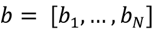
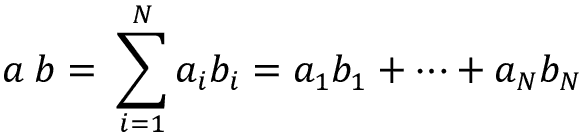
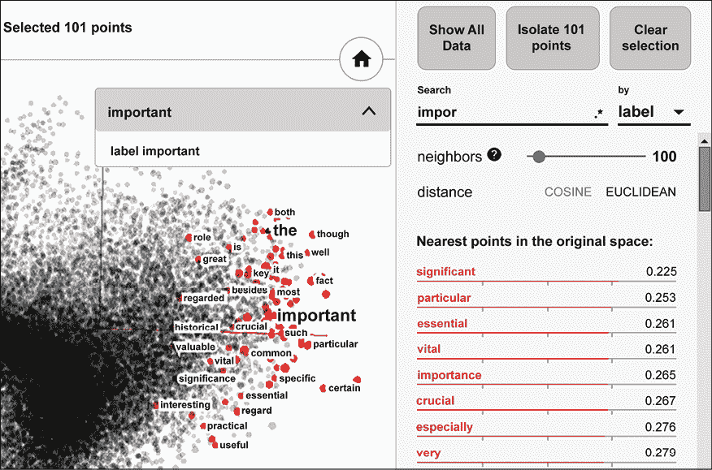
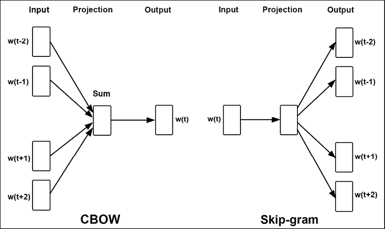
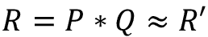
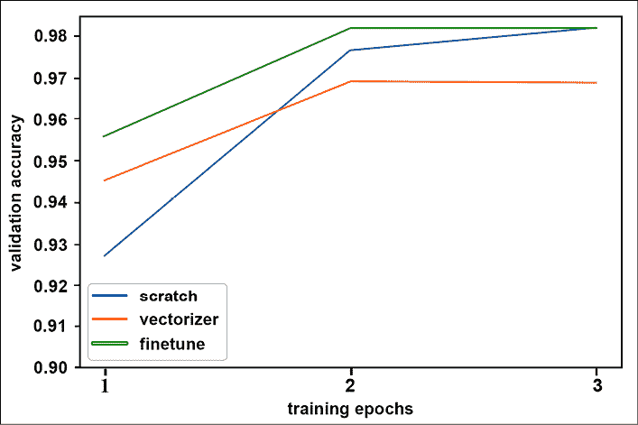

# 第四章：词嵌入

在上一章，我们讨论了卷积网络，它们在图像数据中非常成功。在接下来的几章中，我们将切换方向，专注于处理文本数据的策略和网络。

在本章中，我们将首先了解词嵌入的概念，然后介绍两个最早的实现——Word2Vec 和 GloVe。我们将学习如何使用流行的库 Gensim 在我们自己的语料库上从头开始构建词嵌入，并探索我们创建的嵌入空间。

我们还将学习如何使用预训练的第三方嵌入作为我们自己自然语言处理任务（例如垃圾邮件检测）的起点，即学习如何自动检测未经请求和不需要的电子邮件。接着，我们将了解如何利用词嵌入的概念解决无关的任务，例如为推荐物品构建嵌入空间。

然后，我们将了解自 Word2Vec 以来，过去十年间对这些基础词嵌入技术的扩展——通过 fastText 添加句法相似性，通过像 ELMo 和 Google Universal Sentence Encoder 这样的神经网络加入上下文的影响，通过 InferSent 和 skip-thoughts 这样的句子编码，此外还引入了像 ULMFiT 和 BERT 这样的语言模型。

在本章中，我们将学习以下内容：

+   词嵌入——起源与基本原理

+   分布式表示

+   静态嵌入

+   使用 Gensim 创建你自己的嵌入

+   使用 Gensim 探索嵌入空间

+   使用词嵌入进行垃圾邮件检测

+   神经嵌入——不仅仅是词嵌入

+   字符和子词嵌入

+   动态嵌入

+   句子和段落嵌入

+   基于语言的模型嵌入

本章的所有代码文件可以在[`packt.link/dltfchp4`](https://packt.link/dltfchp4)找到。

让我们开始吧！

# 词嵌入 ‒ 起源与基本原理

维基百科将词嵌入定义为自然语言处理（**NLP**）中一组语言建模和特征学习技术的统称，其中词汇表中的词或短语被映射为实数向量。

深度学习模型和其他机器学习模型一样，通常不会直接处理文本；文本需要转换为数字。将文本转换为数字的过程称为向量化。早期的词向量化技术是独热编码，你在*第一章*，*使用 TF 的神经网络基础*中学习过。正如你会回忆的那样，独热编码的一个主要问题是，它将每个词视为与其他所有词完全独立，因为任何两个词之间的相似度（通过两个词向量的点积来衡量）总是零。

点积是对两个等长向量进行的代数运算！[](img/B18331_04_001.png) 和 ，其结果是一个数值。它也被称为内积或标量积：



为什么两个词的独热向量的点积总是 0？考虑两个词`w[i]`和`w[j]`。假设词汇表大小为`V`，它们对应的独热向量是一个秩为`V`的零向量，其中位置`i`和`j`设为 1。当使用点积操作组合时，a[i]中的 1 将与 b[i]中的 0 相乘，b[j]中的 1 将与 a[j]中的 0 相乘，且两个向量中的其他所有元素都是 0，因此结果点积也为 0。

为了克服独热编码的局限性，NLP 社区借鉴了**信息检索**（**IR**）技术，通过使用文档作为上下文来将文本向量化。值得注意的技术包括**词频-逆文档频率**（**TF-IDF**）[35]、**潜在语义分析**（**LSA**）[36]和主题建模[37]。这些表示方法试图捕捉基于文档的词语语义相似性。在这些方法中，独热编码和 TF-IDF 是相对稀疏的嵌入，因为词汇通常很大，且一个词在语料库中出现的文档数量通常较少。

词向量技术的开发始于 2000 年左右。这些技术与以前基于 IR 的技术不同，因为它们使用邻近的词作为上下文，从而在从人类理解的角度来看产生更自然的语义相似性。今天，词嵌入已成为所有类型的 NLP 任务的基础技术，如文本分类、文档聚类、词性标注、命名实体识别、情感分析等。词嵌入产生了密集的低维向量，并且与 LSA 和主题模型一起，可以将其视为该词的潜在特征向量。

词向量基于分布假设，分布假设认为在相似上下文中出现的词语往往具有相似的意义。因此，基于词嵌入的编码方法也被称为分布式表示，我们将在接下来的部分讨论这一点。

# 分布式表示

分布式表示通过考虑一个词与其上下文中其他词的关系，试图捕捉该词的意义。分布假设的思想可以通过语言学家*J. R. Firth*的一句话来表达，他首先提出了这一思想：

> 你可以通过一个词汇周围的词来了解它的含义。

这是如何工作的呢？举个例子，考虑以下一对句子：

*巴黎是法国的首都*。

*柏林是德国的首都*。

即使假设没有世界地理知识，这对句子对也暗示了巴黎、法国、柏林和德国之间某种关系，可以表示为：

`"巴黎" 对应 "法国" 就像 "柏林" 对应 "德国"。`

分布式表示基于这样一种观点：存在某种变换，如下所示：

`巴黎 : 法国 :: 柏林 : 德国`

换句话说，分布式嵌入空间是指在相似上下文中使用的词汇彼此靠近。因此，这个空间中的词向量相似度大致对应于词汇的语义相似度。

*图 4.1* 显示了 TensorBoard 对“重要”这个词在嵌入空间中的词汇嵌入的可视化。从中可以看出，词汇的邻居往往是紧密相关的，或与原词可互换。

例如，“crucial”几乎是一个同义词，很容易看出在某些情况下，“historical”或“valuable”可以互换使用：



图 4.1：词嵌入数据集中“重要”一词最近邻的可视化，来源于 TensorFlow 嵌入指南（https://www.tensorflow.org/guide/embedding）

在接下来的部分，我们将探讨各种类型的分布式表示（或词嵌入）。

# 静态嵌入

静态嵌入是最古老的词嵌入类型。这些嵌入是基于一个大型语料库生成的，尽管词汇量很大，但仍然是有限的。你可以把静态嵌入看作一个字典，词汇是键，它们对应的向量是值。如果你有一个词汇需要查找其嵌入，但该词汇不在原始语料库中，那么你就无法找到它。此外，无论一个词如何使用，静态嵌入始终是相同的，因此静态嵌入无法解决多义词的问题，即具有多个含义的词汇。我们将在本章后面讨论非静态嵌入时进一步探讨这个问题。

## Word2Vec

被称为 Word2Vec 的模型最早由 Google 的研究团队于 2013 年创建，团队由*Tomas Mikolov*领导[1, 2, 3]。这些模型是自监督的，也就是说，它们是依赖自然语言结构来提供标注训练数据的监督模型。

Word2Vec 的两种架构如下：

+   **连续词袋模型** (**CBOW**)

+   Skip-gram



图 4.2：CBOW 和 Skip-gram Word2Vec 模型的架构

在 CBOW 架构中，模型根据周围词汇的窗口预测当前词汇。上下文词汇的顺序不会影响预测（即词袋假设，因此得名）。在 Skip-gram 架构中，模型根据上下文词汇预测周围的词汇。根据 Word2Vec 网站，CBOW 速度较快，但 Skip-gram 在预测不常见词汇时表现更好。

*图 4.2* 总结了 CBOW 和 Skip-gram 架构。为了理解输入和输出，考虑以下示例句子：

*地球每年绕太阳公转一次。*

假设窗口大小为 5，也就是内容词左右各有两个上下文词，得到的上下文窗口如下所示。加粗的词是正在考虑的词，其他词是窗口中的上下文词：

[_, _, **这**, 地球, 旅行]

[_, 这, **地球**, 旅行, 围绕]

[这, 地球, **旅行**, 围绕, 太阳]

[地球, 旅行, **围绕**, 太阳]

[旅行, 围绕, **这**, 太阳, 一次]

[围绕, 太阳, **这**, 一次, 每]

[太阳, **一次**, 每年]

[太阳, **一次**, 每年, _]

[**一次**, 每年, _, _]

对于 CBOW 模型，前三个上下文窗口的输入和标签元组如下所示。在第一个示例中，CBOW 模型将学习在给定词组（“地球”，“旅行”）的情况下预测词“这”，依此类推。更准确地说，是“地球”和“旅行”这两个词的稀疏向量作为输入。模型将学习预测一个稠密向量，其最大值或概率对应于词“这”：

([地球, 旅行], **这**)

([这, 旅行, 围绕], **地球**)

([这, 地球, 围绕, 太阳], **旅行**)

对于跳字模型，前三个上下文窗口对应以下输入和标签元组。我们可以简化跳字模型的目标：给定一个目标词，预测一个上下文词，基本上就是预测一对词是否在语境上相关。语境相关意味着一对词在上下文窗口中以某种方式相关。也就是说，跳字模型的输入是上下文词“这”和“地球”的稀疏向量，输出是值 1：

([**这**, 地球], 1)

([**这**, 旅行], 1)

([**地球**, 这], 1)

([**地球**, 旅行], 1)

([**地球**, 围绕], 1)

([**旅行**, 这], 1)

([**旅行**, 地球], 1)

([**旅行**, 围绕], 1)

([**旅行**, 这], 1)

我们还需要负样本来正确训练模型，因此我们通过将每个输入词与词汇表中的某个随机词配对来生成额外的负样本。这一过程称为负采样，可能会产生以下额外的输入：

([**地球**, 土豚], 0)

([**地球**, 斑马], 0)

使用所有这些输入训练的模型称为**带有负采样的跳字模型**（**SGNS**）模型。

重要的是要理解，我们并不关心这些模型的分类能力；相反，我们关心的是训练的副作用——学习到的权重。这些学习到的权重就是我们所说的嵌入（embedding）。

尽管自己实现这些模型作为一种学术练习可能会很有启发，但此时 Word2Vec 已经变得如此商品化，你不太可能再需要自己动手实现。对于好奇者，你将在本章附带的源代码中的`tf2_cbow_model.py`和`tf2_cbow_skipgram.py`文件中找到实现 CBOW 和跳字模型的代码。

Word2Vec 模型是由 Google 以自监督的方式训练的，使用了约 1000 亿个来自 Google 新闻数据集的单词，并包含了 300 万个单词的词汇表。然后，Google 发布了预训练模型，供任何人下载和使用。预训练的 Word2Vec 模型可以在这里下载（[`drive.google.com/file/d/0B7XkCwpI5KDYNlNUTTlSS21pQmM/edit`](https://drive.google.com/file/d/0B7XkCwpI5KDYNlNUTTlSS21pQmM/edit)）。输出向量的维度是 300。它以 BIN 文件格式提供，并且可以使用 Gensim 通过`gensim.models.Word2Vec.load_word2vec_format()`或使用`gensim()`数据下载器来打开。

另一种早期的词嵌入实现是 GloVe，我们接下来将讨论它。

## GloVe

**全局词向量表示**（**GloVe**）嵌入是由*Jeffrey Pennington*、*Richard Socher*和*Christopher Manning* [4] 创建的。作者将 GloVe 描述为一种无监督学习算法，用于获取词的向量表示。训练是在从语料库中聚合的全局词-词共现统计数据上进行的，结果的表示显示了类似词之间的聚类行为，类似于 Word2Vec。

GloVe 与 Word2Vec 的区别在于，Word2Vec 是一个预测模型，而 GloVe 是一个基于计数的模型。第一步是构建一个大的（词，上下文）对的矩阵，这些对在训练语料中共现。行对应于单词，列对应于上下文，通常是一个或多个单词的序列。矩阵中的每个元素表示单词在上下文中共现的频率。

GloVe 过程将这个共现矩阵分解为一对（词，特征）和（特征，上下文）矩阵。这个过程被称为矩阵分解，使用**随机梯度下降**（**SGD**）这一迭代数值方法进行。例如，假设我们要将矩阵`R`分解为其因子`P`和`Q`：



SGD 过程将从包含随机值的`P`和`Q`开始，并尝试通过将它们相乘来重建矩阵*R’*。矩阵`R`和*R’*之间的差异表示损失，通常通过计算两个矩阵之间的均方误差来得到。损失决定了`P`和`Q`的值需要改变多少，以便使*R’*更接近`R`，从而最小化重建损失。这个过程会重复多次，直到损失在可接受的阈值内为止。此时，（词，特征）矩阵`P`就是 GloVe 嵌入。

GloVe 过程比 Word2Vec 更具资源消耗性。这是因为 Word2Vec 通过在词向量批次上训练来学习嵌入，而 GloVe 则是一次性对整个共现矩阵进行分解。为了使这个过程具有可扩展性，通常会采用 SGD 并行模式，如 HOGWILD!论文中所述 [5]。

Levy 和 Goldberg 在他们的论文 [6] 中也指出了 Word2Vec 和 GloVe 方法之间的等价性，表明 Word2Vec SGNS 模型隐式地因子分解了一个词-上下文矩阵。

与 Word2Vec 类似，你不太可能需要自己生成 GloVe 嵌入，更有可能使用预先生成的针对大型语料库的嵌入并提供下载。如果你感兴趣，你可以在附带本章节源代码下载的地方找到实现矩阵因子分解的代码 `tf2_matrix_factorization.py`。

在各种大型语料库（标记数从 60 亿到 840 亿，词汇量从 40 万到 220 万）上训练的 GloVe 向量以及各种维度（50、100、200、300）都可以从 GloVe 项目下载页面 ([`nlp.stanford.edu/projects/glove/`](https://nlp.stanford.edu/projects/glove/)) 获得。它可以直接从该网站下载，或者使用 Gensim 或 spaCy 数据下载器下载。

# 使用 Gensim 创建您自己的嵌入

我们将使用 Gensim 和一个名为 text8 的小型文本语料库创建一个嵌入。

Gensim 是一个开源的 Python 库，旨在从文本文档中提取语义意义。其特点之一是优秀的 Word2Vec 算法实现，具有易于使用的 API，允许您训练和查询自己的 Word2Vec 模型。要了解更多关于 Gensim 的信息，请参阅 [`radimrehurek.com/gensim/index.xhtml`](https://radimrehurek.com/gensim/index.xhtml)。要安装 Gensim，请按照 [`radimrehurek.com/gensim/install.xhtml`](https://radimrehurek.com/gensim/install.xhtml) 上的说明进行操作。

text8 数据集是大型文本压缩基准的前 10⁸ 字节，其中包括英文维基百科的前 10⁹ 字节 [7]。text8 数据集可以作为 Gensim API 中的一个可迭代的 token 集合访问，基本上是一个标记化句子的列表。要下载 text8 语料库，创建一个 Word2Vec 模型并保存以供以后使用，请运行以下几行代码（在本章节的源代码中的 `create_embedding_with_text8.py` 中可用）：

```py
import gensim.downloader as api
from gensim.models import Word2Vec
dataset = api.load("text8")
model = Word2Vec(dataset)
model.save("data/text8-word2vec.bin") 
```

这将在 text8 数据集上训练一个 Word2Vec 模型并将其保存为二进制文件。Word2Vec 模型有许多参数，但我们将使用默认值。在这种情况下，它使用 CBOW 模型 (`sg=0`)，窗口大小为 5 (`window=5`)，并生成 100 维的嵌入 (`size=100`)。详细的参数设置请参阅 Word2Vec 文档页面 [8]。要运行此代码，请在命令行中执行以下命令：

```py
$ mkdir data
$ python create_embedding_with_text8.py 
```

代码应该运行 5-10 分钟，之后将在 `data` 文件夹中写入一个训练好的模型。我们将在下一节中检查这个训练好的模型。

词向量在文本处理中的作用至关重要；然而，在本书写作时，TensorFlow 中并没有类似的 API 允许你以相同的抽象层次处理嵌入。因此，在本章中我们使用了 Gensim 来处理 Word2Vec 模型。在线 TensorFlow 教程包含了如何从头开始训练 Word2Vec 模型的示例（[`www.tensorflow.org/tutorials/text/word2vec`](https://www.tensorflow.org/tutorials/text/word2vec)），但这不是我们关注的重点。

# 使用 Gensim 探索嵌入空间

让我们重新加载刚刚构建的 Word2Vec 模型，并使用 Gensim API 进行探索。实际的词向量可以通过模型的`wv`属性作为自定义的 Gensim 类进行访问：

```py
from gensim.models import KeyedVectors
model = KeyedVectors.load("data/text8-word2vec.bin")
word_vectors = model.wv 
```

我们可以查看词汇表中的前几个词，并检查是否可以找到特定的词：

```py
words = word_vectors.vocab.keys()
print([x for i, x in enumerate(words) if i < 10])
assert("king" in words) 
```

上面的代码片段产生了以下输出：

```py
['anarchism', 'originated', 'as', 'a', 'term', 'of', 'abuse', 'first', 'used', 'against'] 
```

我们可以查找与给定词（“king”）相似的词，如下所示：

```py
def print_most_similar(word_conf_pairs, k):
   for i, (word, conf) in enumerate(word_conf_pairs):
       print("{:.3f} {:s}".format(conf, word))
       if i >= k-1:
           break
   if k < len(word_conf_pairs):
       print("...")
print_most_similar(word_vectors.most_similar("king"), 5) 
```

使用单个参数的`most_similar()`方法产生了以下输出。在这里，浮点数评分是相似度的衡量标准，较高的值优于较低的值。正如你所看到的，相似词汇看起来大多是准确的：

```py
0.760 prince
0.701 queen
0.700 kings
0.698 emperor
0.688 throne
... 
```

你还可以像我们之前描述的国家-首都示例一样进行向量运算。我们的目标是验证“巴黎：法国”::“柏林：德国”是否成立。这等同于说巴黎和法国之间的嵌入空间距离应该与柏林和德国之间的距离相同。换句话说，法国 - 巴黎 + 柏林应该给出德国。在代码中，这将转化为：

```py
print_most_similar(word_vectors.most_similar(
   positive=["france", "berlin"], negative=["paris"]), 1
) 
```

这将返回以下结果，正如预期的那样：

```py
0.803 germany 
```

前面报告的相似度值是余弦相似度，但*Levy*和*Goldberg* [9]提出了一种更好的相似度度量方法，该方法也在 Gensim API 中实现。这个度量方法本质上是计算对数尺度上的距离，从而放大较短距离之间的差异，减小较长距离之间的差异。

```py
print_most_similar(word_vectors.most_similar_cosmul(
   positive=["france", "berlin"], negative=["paris"]), 1
) 
```

这也得出了预期的结果，但相似度更高：

```py
0.984 germany 
```

Gensim 还提供了一个`doesnt_match()`函数，可以用来从一组词中检测出不同的那个词：

```py
print(word_vectors.doesnt_match(["hindus", "parsis", "singapore", "christians"])) 
```

这给我们带来了`singapore`，正如预期的那样，因为它是识别宗教的一组词中唯一的一个国家。

我们还可以计算两个词之间的相似度。在这里，我们演示了相关词之间的距离小于不相关词之间的距离：

```py
for word in ["woman", "dog", "whale", "tree"]:
   print("similarity({:s}, {:s}) = {:.3f}".format(
       "man", word,
       word_vectors.similarity("man", word)
   )) 
```

这给出了以下有趣的结果：

```py
similarity(man, woman) = 0.759
similarity(man, dog) = 0.474
similarity(man, whale) = 0.290
similarity(man, tree) = 0.260 
```

`similar_by_word()`函数在功能上与`similar()`等价，唯一的区别是后者默认在比较之前会对向量进行归一化处理。还有一个相关的`similar_by_vector()`函数，它允许你通过指定一个向量作为输入来查找相似的词汇。这里我们尝试查找与“singapore”相似的词：

```py
print(print_most_similar(
   word_vectors.similar_by_word("singapore"), 5)
) 
```

我们得到了以下输出，从地理角度来看，似乎大部分是正确的：

```py
0.882 malaysia
0.837 indonesia
0.826 philippines
0.825 uganda
0.822 thailand
... 
```

我们还可以使用`distance()`函数计算嵌入空间中两个单词之间的距离。这个实际上就是`1 - similarity()`：

```py
print("distance(singapore, malaysia) = {:.3f}".format(
   word_vectors.distance("singapore", "malaysia")
)) 
```

我们还可以直接从`word_vectors`对象中查找词汇表单词的向量，或者使用以下所示的`word_vec()`包装器来查找：

```py
vec_song = word_vectors["song"]
vec_song_2 = word_vectors.word_vec("song", use_norm=True) 
```

根据你的使用场景，可能还会有其他一些函数你会觉得有用。KeyedVectors 的文档页面列出了所有可用的函数[10]。

这里显示的代码可以在本书随附的代码中的`explore_text8_embedding.py`文件中找到。

# 使用词嵌入进行垃圾邮件检测

由于各种强大嵌入的广泛可用性，这些嵌入是从大型语料库中生成的，因此使用这些嵌入之一将文本输入转化为机器学习模型的输入变得非常普遍。文本被视为一个令牌序列。嵌入为每个令牌提供一个密集的固定维度向量。每个令牌都会被其向量替换，这样就将文本序列转换为一个示例矩阵，每个示例都有一个固定数量的特征，对应于嵌入的维度。

这个示例矩阵可以直接作为标准（非神经网络基于）机器学习程序的输入，但由于本书是关于深度学习和 TensorFlow 的，我们将展示如何使用你在*第三章*《卷积神经网络》中学到的**卷积神经网络**（**CNN**）的一个一维版本。我们的示例是一个垃圾邮件检测器，它将**短消息服务**（**SMS**）或文本消息分类为“ham”或“spam”。这个示例与我们将在*第二十章*《高级卷积神经网络》中介绍的情感分析示例非常相似，该示例也使用一维 CNN，但我们这里的重点将放在嵌入层上。

具体来说，我们将看到程序如何从头开始学习一个嵌入，该嵌入针对垃圾邮件检测任务进行了定制。接下来，我们将看到如何使用像本章中我们学习的外部第三方嵌入，这一过程类似于计算机视觉中的迁移学习。最后，我们将学习如何将这两种方法结合起来，从第三方嵌入开始，让网络将其作为自定义嵌入的起点，这一过程类似于计算机视觉中的微调。

像往常一样，我们将从导入开始：

```py
import argparse
import gensim.downloader as api
import numpy as np
import os
import shutil
import tensorflow as tf
from sklearn.metrics import accuracy_score, confusion_matrix 
```

Scikit-learn 是一个开源的 Python 机器学习工具包，包含许多高效且易于使用的数据挖掘和数据分析工具。在本章中，我们使用了其中的两个预定义度量`accuracy_score`和`confusion_matrix`，来评估模型训练后的表现。

你可以在[`scikit-learn.org/stable/`](https://scikit-learn.org/stable/)了解更多关于 scikit-learn 的信息。

## 获取数据

我们模型的数据是公开的，来自 UCI 机器学习库中的 SMS 垃圾短信数据集[11]。以下代码将下载该文件并解析它，生成 SMS 消息及其相应标签的列表：

```py
def download_and_read(url):
   local_file = url.split('/')[-1]
   p = tf.keras.utils.get_file(local_file, url,
       extract=True, cache_dir=".")
   labels, texts = [], []
   local_file = os.path.join("datasets", "SMSSpamCollection")
   with open(local_file, "r") as fin:
       for line in fin:
           label, text = line.strip().split('\t')
           labels.append(1 if label == "spam" else 0)
           texts.append(text)
   return texts, labels
DATASET_URL = "https://archive.ics.uci.edu/ml/machine-learning-databases/00228/smsspamcollection.zip"
texts, labels = download_and_read(DATASET_URL) 
```

数据集包含 5,574 条 SMS 记录，其中 747 条标记为“垃圾短信”（spam），其余 4,827 条标记为“正常短信”（ham）。SMS 记录的文本保存在变量`texts`中，相应的数字标签（0 = 正常短信，1 = 垃圾短信）保存在变量`labels`中。

## 准备数据以供使用

下一步是处理数据，使其可以被网络使用。SMS 文本需要作为整数序列输入网络，其中每个单词由其在词汇表中的相应 ID 表示。我们将使用 Keras 的分词器将每条 SMS 文本转换为单词序列，然后使用`fit_on_texts()`方法在分词器上创建词汇表。

然后，我们使用`texts_to_sequences()`将 SMS 消息转换为整数序列。最后，由于网络只能处理固定长度的整数序列，我们调用`pad_sequences()`函数，用零填充较短的 SMS 消息。

我们数据集中最长的 SMS 消息有 189 个标记（单词）。在许多应用中，可能会有一些极长的离群序列，我们可以通过设置`maxlen`标志来限制长度为较小的数字。这样，超过`maxlen`个标记的句子将被截断，少于`maxlen`个标记的句子将被填充：

```py
# tokenize and pad text
tokenizer = tf.keras.preprocessing.text.Tokenizer()
tokenizer.fit_on_texts(texts)
text_sequences = tokenizer.texts_to_sequences(texts)
text_sequences = tf.keras.preprocessing.sequence.pad_sequences(
    text_sequences)
num_records = len(text_sequences)
max_seqlen = len(text_sequences[0])
print("{:d} sentences, max length: {:d}".format(
    num_records, max_seqlen)) 
```

我们还将把标签转换为分类格式或独热编码格式，因为我们希望选择的损失函数（分类交叉熵）要求标签采用这种格式：

```py
# labels
NUM_CLASSES = 2
cat_labels = tf.keras.utils.to_categorical(
    labels, num_classes=NUM_CLASSES) 
```

分词器允许访问通过`word_index`属性创建的词汇表，该属性基本上是一个词汇单词及其在词汇表中索引位置的字典。我们还构建了反向索引，使我们能够从索引位置找到相应的单词。此外，我们为`PAD`字符创建了条目：

```py
# vocabulary
word2idx = tokenizer.word_index
idx2word = {v:k for k, v in word2idx.items()}
word2idx["PAD"] = 0
idx2word[0] = "PAD"
vocab_size = len(word2idx)
print("vocab size: {:d}".format(vocab_size)) 
```

最后，我们创建了网络将使用的`dataset`对象。`dataset`对象允许我们声明性地设置一些属性，比如批处理大小。在这里，我们从填充后的整数序列和分类标签中构建数据集，打乱数据，并将其拆分为训练集、验证集和测试集。最后，我们为这三个数据集设置了批处理大小：

```py
# dataset
dataset = tf.data.Dataset.from_tensor_slices(
    (text_sequences, cat_labels))
dataset = dataset.shuffle(10000)
test_size = num_records // 4
val_size = (num_records - test_size) // 10
test_dataset = dataset.take(test_size)
val_dataset = dataset.skip(test_size).take(val_size)
train_dataset = dataset.skip(test_size + val_size)
BATCH_SIZE = 128
test_dataset = test_dataset.batch(BATCH_SIZE, drop_remainder=True)
val_dataset = val_dataset.batch(BATCH_SIZE, drop_remainder=True)
train_dataset = train_dataset.batch(BATCH_SIZE, drop_remainder=True) 
```

## 构建嵌入矩阵

Gensim 工具包提供了对各种训练好的嵌入模型的访问，您可以通过在 Python 提示符下运行以下命令来查看：

```py
>>> import gensim.downloader as api
>>> api.info("models").keys() 
```

这将返回（在本书撰写时）以下训练好的词嵌入：

+   **Word2Vec**：有两种版本，一个是基于 Google 新闻训练的（包含 300 万个词向量，基于 30 亿个标记），另一个是基于俄语语料库训练的（word2vec-ruscorpora-300，word2vec-google-news-300）。

+   **GloVe**：有两种版本，一种在 Gigawords 语料库上训练（基于 60 亿标记的 40 万个词向量），提供 50d、100d、200d 和 300d 向量，另一种在 Twitter 上训练（基于 270 亿标记的 120 万个词向量），提供 25d、50d、100d 和 200d 向量（glove-wiki-gigaword-50，glove-wiki-gigaword-100，glove-wiki-gigaword-200，glove-wiki-gigaword-300，glove-twitter-25，glove-twitter-50，glove-twitter-100，glove-twitter-200）。较小的嵌入尺寸会导致输入的更大压缩，从而产生更大的近似度。

+   **fastText**：使用子词信息在 2017 年维基百科、UMBC 网络语料库和 statmt.org 新闻数据集（16B 个标记）上训练的一百万个词向量（fastText-wiki-news-subwords-300）。

+   **ConceptNet Numberbatch**：一种集成嵌入，使用 ConceptNet 语义网络、**释义数据库**（**PPDB**）、Word2Vec 和 GloVe 作为输入。生成 600d 向量[12, 13]。

对于我们的示例，我们选择了基于 Gigaword 语料库训练的 300d GloVe 嵌入。

为了保持我们的模型小，我们只考虑词汇表中存在的词的嵌入。这是通过以下代码完成的，该代码为词汇表中的每个词创建一个较小的嵌入矩阵。矩阵中的每一行对应一个词，行本身就是对应该词的嵌入向量：

```py
def build_embedding_matrix(sequences, word2idx, embedding_dim,
       embedding_file):
   if os.path.exists(embedding_file):
       E = np.load(embedding_file)
   else:
       vocab_size = len(word2idx)
       E = np.zeros((vocab_size, embedding_dim))
       word_vectors = api.load(EMBEDDING_MODEL)
       for word, idx in word2idx.items():
           try:
               E[idx] = word_vectors.word_vec(word)
           except KeyError:   # word not in embedding
               pass
       np.save(embedding_file, E)
   return E
EMBEDDING_DIM = 300
DATA_DIR = "data"
EMBEDDING_NUMPY_FILE = os.path.join(DATA_DIR, "E.npy")
EMBEDDING_MODEL = "glove-wiki-gigaword-300"
E = build_embedding_matrix(text_sequences, word2idx, 
   EMBEDDING_DIM,
   EMBEDDING_NUMPY_FILE)
print("Embedding matrix:", E.shape) 
```

嵌入矩阵的输出形状是（9010，300），对应词汇表中的 9,010 个标记，以及第三方 GloVe 嵌入中的 300 个特征。

## 定义垃圾邮件分类器

我们现在可以定义我们的分类器了。我们将使用**一维卷积神经网络或 ConvNet**（**1D CNN**），这与您在*第三章*、*卷积神经网络*中已经看到的网络类似。

输入是一个整数序列。第一层是一个嵌入层，将每个输入整数转换为大小为（`embedding_dim`）的向量。根据运行模式（即是否从零开始学习嵌入、进行迁移学习或微调），网络中的嵌入层会略有不同。当网络以随机初始化的嵌入权重（`run_mode == "scratch"`）开始并在训练过程中学习权重时，我们将`trainable`参数设置为`True`。在迁移学习的情况下（`run_mode == "vectorizer"`），我们从嵌入矩阵`E`中设置权重，但将`trainable`参数设置为`False`，这样它就不会训练。在微调的情况下（`run_mode == "finetuning"`），我们从外部矩阵`E`设置嵌入权重，并将该层设置为可训练。

嵌入层的输出被输入到一个卷积层中。这里，固定大小为 3 个标记宽度的 1D 窗口（`kernel_size=3`），也称为时间步，被卷积运算与 256 个随机滤波器（`num_filters=256`）进行运算，从而为每个时间步生成大小为 256 的向量。因此，输出向量的形状是（`batch_size`，`time_steps`，`num_filters`）。

卷积层的输出被送入一个 1D 空间丢弃层。空间丢弃将随机丢弃卷积层输出的整个特征图。这是一种正则化技术，用于防止过拟合。然后，它会经过一个全局最大池化层，该层从每个时间步的每个滤波器中提取最大值，生成形状为（`batch_size`，`num_filters`）的向量。

丢弃层的输出被输入到池化层进行扁平化，然后进入一个全连接层，该层将形状为（`batch_size`，`num_filters`）的向量转换为（`batch_size`，`num_classes`）。Softmax 激活函数将（垃圾短信、正常短信）的每个分数转换为概率分布，表示输入的短信是垃圾短信或正常短信的概率：

```py
class SpamClassifierModel(tf.keras.Model):
   def __init__(self, vocab_sz, embed_sz, input_length,
           num_filters, kernel_sz, output_sz,
           run_mode, embedding_weights,
           **kwargs):
       super(SpamClassifierModel, self).__init__(**kwargs)
       if run_mode == "scratch":
           self.embedding = tf.keras.layers.Embedding(vocab_sz,
               embed_sz,
               input_length=input_length,
               trainable=True)
       elif run_mode == "vectorizer":
           self.embedding = tf.keras.layers.Embedding(vocab_sz,
               embed_sz,
               input_length=input_length,
               weights=[embedding_weights],
               trainable=False)
       else:
           self.embedding = tf.keras.layers.Embedding(vocab_sz,
               embed_sz,
               input_length=input_length,
               weights=[embedding_weights],
               trainable=True)
       self.conv = tf.keras.layers.Conv1D(filters=num_filters,
           kernel_size=kernel_sz,
           activation="relu")
       self.dropout = tf.keras.layers.SpatialDropout1D(0.2)
       self.pool = tf.keras.layers.GlobalMaxPooling1D()
       self.dense = tf.keras.layers.Dense(output_sz,
           activation="softmax")
   def call(self, x):
       x = self.embedding(x)
       x = self.conv(x)
       x = self.dropout(x)
       x = self.pool(x)
       x = self.dense(x)
       return x
# model definition
conv_num_filters = 256
conv_kernel_size = 3
model = SpamClassifierModel(
   vocab_size, EMBEDDING_DIM, max_seqlen,
   conv_num_filters, conv_kernel_size, NUM_CLASSES,
   run_mode, E)
model.build(input_shape=(None, max_seqlen)) 
```

最后，我们使用分类交叉熵损失函数和 Adam 优化器来编译模型：

```py
# compile
model.compile(optimizer="adam", loss="categorical_crossentropy", metrics=["accuracy"]) 
```

## 训练和评估模型

需要注意的一点是，数据集在某种程度上是不平衡的；垃圾短信只有 747 个实例，而正常短信有 4,827 个实例。网络仅通过总是预测多数类即可实现接近 87%的准确率。为了解决这个问题，我们设置了类别权重，表示垃圾短信的错误代价是正常短信错误的八倍。这由`CLASS_WEIGHTS`变量表示，并作为额外参数传递给`model.fit()`调用。

训练 3 个周期后，我们在测试集上评估模型，并报告模型在测试集上的准确率和混淆矩阵。然而，对于不平衡数据，即使使用了类别权重，模型也可能会学习到始终预测多数类。因此，通常建议按类别报告准确率，以确保模型能够有效地区分每个类别。这可以通过使用混淆矩阵来轻松完成，方法是将每行的对角元素除以该行所有元素的和，其中每行对应一个标记类别：

```py
NUM_EPOCHS = 3
# data distribution is 4827 ham and 747 spam (total 5574), which
# works out to approx 87% ham and 13% spam, so we take reciprocals
# and this works out to being each spam (1) item as being 
# approximately 8 times as important as each ham (0) message.
CLASS_WEIGHTS = { 0: 1, 1: 8 }
# train model
model.fit(train_dataset, epochs=NUM_EPOCHS,
   validation_data=val_dataset,
   class_weight=CLASS_WEIGHTS)
# evaluate against test set
labels, predictions = [], []
for Xtest, Ytest in test_dataset:
   Ytest_ = model.predict_on_batch(Xtest)
   ytest = np.argmax(Ytest, axis=1)
   ytest_ = np.argmax(Ytest_, axis=1)
   labels.extend(ytest.tolist())
   predictions.extend(ytest.tolist())
print("test accuracy: {:.3f}".format(accuracy_score(labels, predictions)))
print("confusion matrix")
print(confusion_matrix(labels, predictions)) 
```

## 运行垃圾短信检测器

我们要查看的三个场景是：

+   让网络为任务学习嵌入。

+   从固定的外部第三方嵌入开始，其中嵌入矩阵被视为一个向量化器，用于将整数序列转换为向量序列。

+   从外部第三方嵌入开始，在训练过程中进一步微调到任务中。

每种场景可以通过设置`mode`参数的值来评估，具体如以下命令所示：

```py
$ python spam_classifier --mode [scratch|vectorizer|finetune] 
```

数据集较小，模型也比较简单。我们通过仅进行少量训练（3 轮），就能取得非常好的结果（验证集准确率接近 100%，测试集准确率完美）。在这三种情况下，网络都取得了完美的成绩，准确预测了 1,111 条正常消息，以及 169 条垃圾邮件。

*图 4.3* 中显示的验证准确率变化，展示了三种方法之间的差异：



图 4.3：不同嵌入技术在训练周期中的验证准确率对比

在从零开始学习的情况下，第一轮结束时，验证准确率为 0.93，但在接下来的两个轮次中，它上升到 0.98。在向量化器的情况下，网络从第三方嵌入中获得了一定的起步优势，并在第一轮结束时达到了接近 0.95 的验证准确率。然而，由于嵌入权重不允许改变，因此无法将嵌入自定义为垃圾邮件检测任务，第三轮结束时的验证准确率是三者中最低的。微调的情况和向量化器一样，也获得了起步优势，但能够根据任务定制嵌入，因此能够以三者中最快的速度进行学习。微调的情况在第一轮结束时具有最高的验证准确率，并且在第二轮结束时达到了从零开始学习的情况在第三轮结束时所达到的相同验证准确率。

在接下来的章节中，我们将看到分布式相似性不仅限于单词嵌入，它也适用于其他场景。

# 神经嵌入 – 不仅仅是针对单词

自 Word2Vec 和 GloVe 以来，词嵌入技术在多个方向上得到了发展。其中一个方向是将词嵌入应用于非单词场景，也就是我们所说的神经嵌入。正如你回忆的那样，词嵌入利用了分布假设，即在相似语境中出现的单词通常具有相似的含义，其中语境通常是围绕目标单词的固定大小（按单词数量计算）窗口。

神经嵌入的理念非常相似；即在相似语境中出现的实体往往彼此密切相关。这些语境的构建方式通常取决于具体情况。我们将在这里描述两种技术，这些技术是基础且足够通用的，可以轻松应用于各种用例。

## Item2Vec

Item2Vec 嵌入模型最初由 Barkan 和 Koenigstein [14] 提出，适用于协同过滤用例，即基于其他具有相似购买历史的用户购买的商品来向用户推荐商品。它将网上商店中的商品作为“单词”，将商品集（即用户随时间购买的商品序列）作为“句子”，从中提取“单词语境”。

例如，考虑一个向超市购物者推荐商品的问题。假设我们的超市销售 5000 种商品，因此每个商品可以表示为一个大小为 5000 的稀疏独热编码向量。每个用户由他们的购物车表示，购物车是这样的一系列向量。应用类似我们在 Word2Vec 部分看到的上下文窗口，我们可以训练一个 skip-gram 模型来预测可能的商品对。学习到的嵌入模型将商品映射到一个稠密的低维空间，在这个空间中，类似的商品会聚集在一起，这可以用于进行相似商品推荐。

## node2vec

node2vec 嵌入模型由 Grover 和 Leskovec [15] 提出，作为一种可扩展的方式，用于学习图中节点的特征。它通过在图上执行大量固定长度的随机游走来学习图结构的嵌入。节点是“单词”，随机游走是从中派生出“单词上下文”的“句子”。

**Something2Vec** 页面 [40] 提供了一个全面的列表，列出了研究人员如何尝试将分布假设应用于除了单词以外的其他实体。希望这个列表能激发你为自己的“Something2Vec”表示法的创意。

为了说明创建你自己的神经嵌入是多么简单，我们将生成一个类似 node2vec 的模型，或者更准确地说，是一个前身基于图的嵌入，叫做 DeepWalk，提出者为 Perozzi 等人 [42]，用于 1987-2015 年间在 NeurIPS 会议上发表的论文，通过利用它们之间的词共现关系。

数据集是一个 11,463 × 5,812 的词频矩阵，其中行表示单词，列表示会议论文。我们将使用此数据构建论文的图，其中两篇论文之间的边表示它们都出现的单词。node2vec 和 DeepWalk 假设图是无向且无权的。我们的图是无向的，因为两篇论文之间的关系是双向的。然而，我们的边可以根据两篇文档之间的词共现次数来加权。对于我们的示例，我们将任何超过 0 的共现次数视为有效的无权边。

像往常一样，我们将从声明我们的导入开始：

```py
import gensim
import logging
import numpy as np
import os
import shutil
import tensorflow as tf
from scipy.sparse import csr_matrix
from sklearn.metrics.pairwise import cosine_similarity
logging.basicConfig(format='%(asctime)s : %(levelname)s : %(message)s', level=logging.INFO) 
```

下一步是从 UCI 仓库下载数据，并将其转换为稀疏的词项-文档矩阵（TD），然后通过将词项-文档矩阵的转置与其自身相乘来构建文档-文档矩阵 E。我们的图是通过文档-文档矩阵表示为邻接矩阵或边矩阵。由于每个元素表示两个文档之间的相似度，我们将通过将任何非零元素设置为 1 来二值化矩阵 `E`：

```py
DATA_DIR = "./data"
UCI_DATA_URL = "https://archive.ics.uci.edu/ml/machine-learning-databases/00371/NIPS_1987-2015.csv"
def download_and_read(url):
   local_file = url.split('/')[-1]
   p = tf.keras.utils.get_file(local_file, url, cache_dir=".")
   row_ids, col_ids, data = [], [], []
   rid = 0
   f = open(p, "r")
   for line in f:
       line = line.strip()
       if line.startswith("\"\","):
           # header
           continue
       # compute non-zero elements for current row
       counts = np.array([int(x) for x in line.split(',')[1:]])
       nz_col_ids = np.nonzero(counts)[0]
       nz_data = counts[nz_col_ids]
       nz_row_ids = np.repeat(rid, len(nz_col_ids))
       rid += 1
       # add data to big lists
       row_ids.extend(nz_row_ids.tolist())
       col_ids.extend(nz_col_ids.tolist())
       data.extend(nz_data.tolist())
   f.close()
   TD = csr_matrix((
       np.array(data), (
           np.array(row_ids), np.array(col_ids)
           )
       ),
       shape=(rid, counts.shape[0]))
   return TD
# read data and convert to Term-Document matrix
TD = download_and_read(UCI_DATA_URL)
# compute undirected, unweighted edge matrix
E = TD.T * TD
# binarize
E[E > 0] = 1 
```

一旦我们拥有了稀疏二值化邻接矩阵`E`，我们就可以从每个顶点生成随机游走。从每个节点开始，我们构造了 32 个最大长度为 40 个节点的随机游走。每次游走有 0.15 的随机重启概率，这意味着对于任何节点，特定的随机游走有 15%的概率会结束。以下代码将构造随机游走，并将它们写入由`RANDOM_WALKS_FILE`指定的文件。为了给出输入的示例，我们提供了该文件前 10 行的快照，展示了从节点 0 开始的随机游走：

```py
0 1405 4845 754 4391 3524 4282 2357 3922 1667
0 1341 456 495 1647 4200 5379 473 2311
0 3422 3455 118 4527 2304 772 3659 2852 4515 5135 3439 1273
0 906 3498 2286 4755 2567 2632
0 5769 638 3574 79 2825 3532 2363 360 1443 4789 229 4515 3014 3683 2967 5206 2288 1615 1166
0 2469 1353 5596 2207 4065 3100
0 2236 1464 1596 2554 4021
0 4688 864 3684 4542 3647 2859
0 4884 4590 5386 621 4947 2784 1309 4958 3314
0 5546 200 3964 1817 845 
```

请注意，这是一个非常缓慢的过程。输出的副本随本章的源代码一起提供，以防你希望跳过随机游走生成过程：

```py
NUM_WALKS_PER_VERTEX = 32
MAX_PATH_LENGTH = 40
RESTART_PROB = 0.15
RANDOM_WALKS_FILE = os.path.join(DATA_DIR, "random-walks.txt")
def construct_random_walks(E, n, alpha, l, ofile):
   if os.path.exists(ofile):
       print("random walks generated already, skipping")
       return
   f = open(ofile, "w")
   for i in range(E.shape[0]):  # for each vertex
       if i % 100 == 0:
           print("{:d} random walks generated from {:d} vertices"
               .format(n * i, i))
       for j in range(n):       # construct n random walks
           curr = i
           walk = [curr]
           target_nodes = np.nonzero(E[curr])[1]
           for k in range(l):   # each of max length l
               # should we restart?
               if np.random.random() < alpha and len(walk) > 5:
                   break
               # choose one outgoing edge and append to walk
               try:
                   curr = np.random.choice(target_nodes)
                   walk.append(curr)
                   target_nodes = np.nonzero(E[curr])[1]
               except ValueError:
                   continue
           f.write("{:s}\n".format(" ".join([str(x) for x in walk])))
   print("{:d} random walks generated from {:d} vertices, COMPLETE"
       .format(n * i, i))
   f.close()
# construct random walks (caution: very long process!)
construct_random_walks(E, NUM_WALKS_PER_VERTEX, RESTART_PROB, MAX_PATH_LENGTH, RANDOM_WALKS_FILE) 
```

以下是`RANDOM_WALKS_FILE`中的几行内容。你可以想象，这些看起来像是一种语言中的句子，其中词汇表是我们图中的所有节点 ID。我们已经了解到，词嵌入利用语言的结构来生成词的分布式表示。像 DeepWalk 和 node2vec 这样的图嵌入方案也做了相同的事情，它们利用从随机游走中生成的“句子”。这些嵌入可以捕捉图中节点之间的相似性，超越了直接邻居的关系，正如我们将看到的那样：

```py
0 1405 4845 754 4391 3524 4282 2357 3922 1667
0 1341 456 495 1647 4200 5379 473 2311
0 3422 3455 118 4527 2304 772 3659 2852 4515 5135 3439 1273
0 906 3498 2286 4755 2567 2632
0 5769 638 3574 79 2825 3532 2363 360 1443 4789 229 4515 3014 3683 2967 5206 2288 1615 1166
0 2469 1353 5596 2207 4065 3100
0 2236 1464 1596 2554 4021
0 4688 864 3684 4542 3647 2859
0 4884 4590 5386 621 4947 2784 1309 4958 3314
0 5546 200 3964 1817 845 
```

我们现在准备创建我们的词嵌入模型。Gensim 包提供了一个简单的 API，允许我们声明性地创建和训练一个 Word2Vec 模型，使用以下代码。训练后的模型将被序列化到由`W2V_MODEL_FILE`指定的文件中。`Documents`类允许我们流式传输大输入文件，以便训练 Word2Vec 模型而不会遇到内存问题。我们将在 skip-gram 模式下训练 Word2Vec 模型，窗口大小为 10，这意味着我们训练它以预测给定一个中心节点时，最多预测五个邻近节点。每个节点的结果嵌入是一个大小为 128 的稠密向量：

```py
W2V_MODEL_FILE = os.path.join(DATA_DIR, "w2v-neurips-papers.model")
class Documents(object):
   def __init__(self, input_file):
       self.input_file = input_file
   def __iter__(self):
       with open(self.input_file, "r") as f:
           for i, line in enumerate(f):
               if i % 1000 == 0:
                   logging.info("{:d} random walks extracted".format(i))
               yield line.strip().split()
def train_word2vec_model(random_walks_file, model_file):
   if os.path.exists(model_file):
       print("Model file {:s} already present, skipping training"
           .format(model_file))
       return
   docs = Documents(random_walks_file)
   model = gensim.models.Word2Vec(
       docs,
       size=128,    # size of embedding vector
       window=10,   # window size
       sg=1,        # skip-gram model
       min_count=2,
       workers=4
   )
   model.train(
       docs,
       total_examples=model.corpus_count,
       epochs=50)
   model.save(model_file)
# train model
train_word2vec_model(RANDOM_WALKS_FILE, W2V_MODEL_FILE) 
```

我们得到的 DeepWalk 模型实际上就是一个 Word2Vec 模型，因此在处理单词的上下文中，您可以用 Word2Vec 做的任何事情，也可以在顶点的上下文中使用这个模型来做。让我们使用这个模型来发现文档之间的相似性：

```py
def evaluate_model(td_matrix, model_file, source_id):
   model = gensim.models.Word2Vec.load(model_file).wv
   most_similar = model.most_similar(str(source_id))
   scores = [x[1] for x in most_similar]
   target_ids = [x[0] for x in most_similar]
   # compare top 10 scores with cosine similarity 
   # between source and each target
   X = np.repeat(td_matrix[source_id].todense(), 10, axis=0)
   Y = td_matrix[target_ids].todense()
   cosims = [cosine_similarity(X[i], Y[i])[0, 0] for i in range(10)]
   for i in range(10):
       print("{:d} {:s} {:.3f} {:.3f}".format(
           source_id, target_ids[i], cosims[i], scores[i]))
source_id = np.random.choice(E.shape[0])
evaluate_model(TD, W2V_MODEL_FILE, source_id) 
```

以下是输出结果。第一列和第二列是源节点和目标节点的 ID。第三列是源文档和目标文档对应的词向量之间的余弦相似度，第四列是 Word2Vec 模型报告的相似度分数。正如你所看到的，余弦相似度只报告了 10 对文档中的 2 对之间的相似性，但 Word2Vec 模型能够在嵌入空间中检测到潜在的相似性。这与我们注意到的一热编码和稠密嵌入之间的行为类似：

```py
src_id dst_id cosine_sim w2v_score
1971   5443        0.000     0.348
1971   1377        0.000     0.348
1971   3682        0.017     0.328
1971   51          0.022     0.322
1971   857         0.000     0.318
1971   1161        0.000     0.313
1971   4971        0.000     0.313
1971   5168        0.000     0.312
1971   3099        0.000     0.311
1971   462         0.000     0.310 
```

这种嵌入策略的代码可以在本章配套的源代码文件夹中的`neurips_papers_node2vec.py`找到。接下来，我们将继续研究字符和子词嵌入。

# 字符和子词嵌入

基本词嵌入策略的另一种演变是改为使用字符和子词嵌入，而不是词嵌入。字符级嵌入最早由 *Xiang* 和 *LeCun* [17] 提出，相较于词嵌入，它们有一些关键的优势。

首先，字符词汇表是有限且小的——例如，英语的词汇表大约包含 70 个字符（26 个字母、10 个数字，以及其他特殊字符），这导致字符模型也小而紧凑。其次，不像词嵌入提供一个大而有限的词汇集合的向量，字符嵌入没有“超出词汇表”这一概念，因为任何单词都可以通过词汇表来表示。第三，字符嵌入对于稀有词和拼写错误的单词通常表现更好，因为与词输入相比，字符输入的失衡程度要小得多。

字符嵌入更适合需要语法相似性而非语义相似性的应用。然而，不同于词嵌入，字符嵌入通常是针对特定任务的，通常是在网络内联生成以支持该任务。因此，第三方字符嵌入通常不可用。

子词嵌入结合了字符和词嵌入的思想，通过将单词视为字符 n-gram 的集合，即由 `n` 个连续字符组成的序列。它们最早由 Bojanowski 等人 [18] 提出，基于 **Facebook AI Research**（**FAIR**）的研究，随后作为 fastText 嵌入发布。fastText 嵌入可用于 157 种语言，包括英语。相关论文报告了在多个 NLP 任务中，特别是在词类比和语言任务方面，对于形态丰富语言的状态-of-the-art（最先进）性能。

fastText 计算字符 n-gram 的嵌入，其中 n 介于 3 到 6 个字符之间（默认设置可以更改），同时也计算单词本身的嵌入。例如，单词“green”的 n=3 时的字符 n-gram 会是“<gr”、 “gre”、 “ree”、 “een”和“en>”。单词的开始和结束分别用“<”和“>”字符标记，以区分短词和它们的 n-gram，如“<cat>”与“cat”。

在查找过程中，如果单词存在于 fastText 嵌入中，你可以通过单词作为键来查找相应的向量。然而，与传统的词嵌入不同，即使单词不在嵌入中，你仍然可以为该单词构建一个 fastText 向量。这是通过将单词分解为其组成的三元子词（trigram）来实现的，如前面的示例所示，然后查找这些子词的向量，并取这些子词向量的平均值。fastText Python API [19] 会自动执行此操作，但如果你使用其他 API 来访问 fastText 词嵌入，如 Gensim 或 NumPy，你需要手动执行此操作。

接下来，我们将讨论动态嵌入。

# 动态嵌入

到目前为止，我们所考虑的所有嵌入都是静态的；也就是说，它们被部署为一个字典，字典中包含映射到固定维度向量的单词（和子词）。在这些嵌入中，对应某个单词的向量无论它在句子中是作为名词还是动词使用，都将是相同的。例如，单词“ensure”（作为名词时是保健品的名字，作为动词时是“确保”）。它还为多义词或具有多个含义的单词提供相同的向量，例如“bank”（这个词的意思可以根据它与“money”或“river”共现时的上下文不同而不同）。在这两种情况下，单词的意思会根据上下文中的线索发生变化。动态嵌入试图利用这些信号，根据上下文为单词提供不同的向量。

动态嵌入被部署为训练好的网络，它通过查看整个序列（而不仅仅是单个单词），将输入（通常是一个 one-hot 向量序列）转换为一个低维密集的固定大小嵌入。你可以将输入预处理为该密集嵌入，然后将其用作任务特定网络的输入，或者将网络封装起来，将其视为类似于 `tf.keras.layers.Embedding` 层的静态嵌入。以这种方式使用动态嵌入网络通常比提前生成（第一种选择）或使用传统嵌入要昂贵得多。

最早的动态嵌入是由 McCann 等人 [20] 提出的，称为**上下文化向量**（**CoVe**）。该方法涉及从机器翻译网络的编码器-解码器对中获取编码器的输出，并将其与相同单词的词向量连接起来。

你将在下一章中了解更多关于 seq2seq 网络的内容。研究人员发现，这种策略提高了各种自然语言处理（NLP）任务的性能。

Peters 等人 [21] 提出的另一种动态嵌入是**来自语言模型的嵌入**（**ELMo**）。ELMo 使用基于字符的单词表示和双向**长短期记忆**（**LSTM**）来计算上下文化的单词表示。你将在下一章中了解更多关于 LSTM 的内容。与此同时，可以从 TensorFlow 的模型库 TensorFlow Hub 获取训练好的 ELMo 网络。你可以访问它并按如下方式使用它来生成 ELMo 嵌入。

TensorFlow Hub 上可用的所有与 TensorFlow 2.0 兼容的模型集合可以在 TensorFlow 2.0 的 [16] 网站上找到。在这里，我使用了一系列句子，模型将通过其默认的空格分词策略来确定标记：

```py
import tensorflow as tf
import tensorflow_hub as hub

elmo = hub.load("https://tfhub.dev/google/elmo/3")
embeddings = elmo.signatures"default")["elmo"]
print(embeddings.shape) 
```

输出是 (`2, 7, 1024`)。第一个索引告诉我们输入包含了 2 个句子。第二个索引指的是所有句子中的最大单词数，在这个例子中是 7。模型会自动将输出填充到最长的句子。第三个索引给出了由 ELMo 创建的上下文单词嵌入的大小；每个单词被转换为一个大小为 (1024) 的向量。

你还可以通过将 ELMo 嵌入层包装在 `tf.keras.KerasLayer` 适配器中，将其集成到你的 TF2 模型中。在这个简单的模型中，模型将返回整个字符串的嵌入：

```py
embed = hub.KerasLayer("https://tfhub.dev/google/elmo/3",input_shape=[], dtype=tf.string)
model = tf.keras.Sequential([embed])
embeddings = model.predict([
    "i i like green eggs and ham",
    "would you eat them in a box"
])
print(embeddings.shape) 
```

动态嵌入，如 ELMo，能够在不同的上下文中为相同的单词提供不同的嵌入，相比于 Word2Vec 或 GloVe 等静态嵌入，具有更好的表现。一个合乎逻辑的下一步是生成表示更大文本单元（如句子和段落）的嵌入。这也是我们在下一部分要探讨的内容。

# 句子和段落嵌入

一个简单却出奇有效的生成有用的句子和段落嵌入的解决方案是将其组成单词的单词向量进行平均。尽管我们在本节中会描述一些流行的句子和段落嵌入，但通常建议始终先尝试将单词向量进行平均，作为一个基准。

句子（和段落）嵌入也可以通过将其视为单词序列并使用标准的单词向量表示每个单词，以任务优化的方式创建。单词向量序列作为输入训练网络来执行某个特定任务。从网络的某个后期层（在分类层之前）提取的向量通常能够很好地表示序列。然而，这些向量往往是非常任务特定的，作为通用的向量表示其使用价值有限。

Kiros 等人提出了一种生成通用句子向量表示的思路，这些向量可以跨任务使用[22]。他们建议利用来自书籍的文本连续性来构建一个编码器-解码器模型，该模型经过训练能够根据一个句子预测周围的句子。由编码器-解码器网络构建的单词序列的向量表示通常被称为“思想向量”。此外，提出的模型与 skip-gram 非常相似，我们试图根据一个单词预测其周围的单词。正因如此，这些句子向量被称为 skip-thought 向量。该项目发布了一个基于 Theano 的模型，可以用来生成句子的嵌入。后来，Google 研究团队使用 TensorFlow 重新实现了这个模型[23]。Skip-Thoughts 模型为每个句子输出大小为 (2048) 的向量。使用该模型并不是非常简单，但如果你想使用它，仓库中的 `README.md` 文件[23]提供了详细的使用说明。

一个更方便的句子嵌入来源是 Google 的 Universal Sentence Encoder，它可以在 TensorFlow Hub 上获得。该编码器有两种实现方式。第一种实现速度较快，但准确性较差，基于 Iyer 等人提出的**深度平均网络**（**DAN**）[24]，该网络将单词和二元组的嵌入合并，并通过一个全连接网络进行处理。第二种实现更为准确，但速度较慢，基于 Vaswani 等人提出的 Transformer 网络的编码器部分[25]。我们将在*第六章*《Transformers》中更详细地讨论 Transformer 网络。

与 ELMo 一样，Google Universal Sentence Encoder 也可以从 TensorFlow Hub 加载到你的 TF2 代码中。下面是一些调用它的代码，使用了我们两个示例句子：

```py
embed = hub.load("https://tfhub.dev/google/universal-sentence-encoder-large/4")
embeddings = embed([
"i like green eggs and ham",
"would you eat them in a box"
])["outputs"]
print(embeddings.shape) 
```

输出是（`2`，`512`）；也就是说，每个句子由一个大小为（512）的向量表示。值得注意的是，Google Universal Sentence Encoder 可以处理任意长度的单词序列——因此，你可以合法地用它来获取一端的单词嵌入以及另一端的段落嵌入。然而，随着序列长度的增加，嵌入的质量往往会变得“稀释”。

更早的相关工作是在提出 Word2Vec 后不久，由 Le 和 Mikolov [26] 提出的，旨在为长序列（如段落和文档）生成嵌入。这个方法现在通常被称为 Doc2Vec 或 Paragraph2Vec。Doc2Vec 算法是 Word2Vec 的扩展，它利用周围的单词来预测一个单词。在 Doc2Vec 的情况下，训练时提供一个额外的参数——段落 ID。在训练结束时，Doc2Vec 网络会学习每个单词和每个段落的嵌入。在推理阶段，网络接收到一个有缺失单词的段落。网络利用已知部分的段落生成一个段落嵌入，然后使用该段落嵌入和单词嵌入来推断段落中缺失的单词。Doc2Vec 算法有两种实现方式——**段落向量 - 分布式记忆**（**PV-DM**）和**段落向量 - 分布式词袋模型**（**PV-DBOW**），大致相当于 Word2Vec 中的 CBOW 和 skip-gram。除了提到 Gensim 工具包提供了可以用你自己的语料库进行训练的预构建实现之外，我们在本书中不会进一步讨论 Doc2Vec。

在看过不同形式的静态和动态嵌入之后，我们现在稍微换个方向，来看看基于语言模型的嵌入。

# 基于语言模型的嵌入

基于语言模型的嵌入代表了词嵌入演化的下一步。语言模型是一个单词序列的概率分布。一旦我们有了模型，就可以让它预测给定特定单词序列后最可能出现的下一个单词。与传统的词嵌入类似，无论是静态还是动态，它们都被训练以预测给定语料库中的部分句子后（或前）出现的下一个单词（如果语言模型是双向的，也包括前一个单词）。训练过程中不涉及主动标注，因为它利用了大量文本的自然语法结构，因此在某种意义上，这是一种自监督学习过程。

作为词嵌入的语言模型与传统嵌入的主要区别在于，传统嵌入作为数据的单次初始转换应用，然后根据特定任务进行微调。而语言模型则是在大型外部语料库上进行训练，表示特定语言的模型，比如英语。这个步骤被称为预训练。预训练这些语言模型的计算成本通常相对较高；然而，进行预训练的人通常会将模型公开供他人使用，所以我们通常不需要担心这个步骤。下一步是根据你特定的应用领域对这些通用语言模型进行微调。例如，如果你在旅游或医疗行业工作，你会使用自己领域的文本来微调语言模型。微调涉及用你自己的文本重新训练最后几层。微调完成后，你可以将此模型用于该领域的多个任务。与预训练步骤相比，微调步骤通常成本较低。

一旦你完成了微调语言模型，你就可以去除语言模型的最后一层，替换成一个一到两层的全连接网络，将语言模型嵌入的输入转换为你的任务所需的最终分类或回归输出。这个想法与转移学习相同，你在*第三章*，*卷积神经网络*中已经学习过，唯一的区别是这里你是在文本上进行转移学习，而不是在图像上。与图像的转移学习一样，这些基于语言模型的嵌入允许我们在几乎没有标注数据的情况下获得惊人的结果。不出所料，语言模型嵌入已经被称为自然语言处理领域的“ImageNet 时刻”。

基于语言模型的嵌入思想起源于 ELMo [21] 网络，你在本章中已经见过这个模型。ELMo 通过在大量文本语料库上进行训练，学习预测给定一系列单词时下一个和前一个单词的内容，从而了解语言。ELMo 基于双向 LSTM，你将在*第八章*，*自编码器*中进一步学习有关它的内容。

第一个可行的语言模型嵌入是由 Howard 和 Ruder [27] 提出的，他们通过 **通用语言模型微调**（**ULMFiT**）模型进行训练，该模型使用了包含 28,595 篇维基百科文章和 1.03 亿个单词的 wikitext-103 数据集。ULMFiT 提供了与图像任务的迁移学习相同的好处——在相对较少的标注数据情况下，通过监督学习任务获得更好的结果。

与此同时，变换器架构已成为机器翻译任务的首选网络，取代了 LSTM 网络，因为它允许并行操作，并更好地处理长期依赖。我们将在 *第六章*，*变换器* 中学习更多关于变换器架构的内容。OpenAI 团队的 Radford 等人 [29] 提出了使用标准变换器网络的解码器堆栈，取代了 ULMFiT 中使用的 LSTM 网络。利用这一点，他们构建了一个名为 **生成预训练**（**GPT**）的语言模型嵌入，在许多语言处理任务中取得了最先进的结果。该论文提出了几种配置，用于涉及单句和多句任务的监督任务，如分类、蕴含、相似度和多选问答。

OpenAI 团队随后构建了更大的语言模型，分别称为 GPT-2 和 GPT-3。由于担心恶意操作员滥用该技术，GPT-2 最初没有发布 [30]。

OpenAI 变换器架构的一个问题是它是单向的，而其前身 ELMo 和 ULMFiT 是双向的。由 Google AI 团队 [28] 提出的 **双向编码器表示变换器**（**BERT**）使用了变换器架构的编码器堆栈，并通过对其输入进行最多 15% 的掩码，要求模型进行预测，从而安全地实现了双向性。

与 OpenAI 的论文一样，BERT 提出了几种配置，用于执行多种监督学习任务，如单句和多句分类、问答和标注。

BERT 模型有两种主要版本——BERT-base 和 BERT-large。BERT-base 有 12 层编码器，768 个隐藏单元和 12 个注意力头，总参数量为 1.1 亿。BERT-large 有 24 层编码器，1,024 个隐藏单元和 16 个注意力头，总参数量为 3.4 亿。更多细节可以在 BERT GitHub 仓库 [33] 中找到。

BERT 预训练是一个昂贵的过程，目前只能通过 **张量处理单元**（**TPUs**）或大型分布式 **图形处理单元**（**GPUs**）集群实现。TPUs 仅通过 Google 的 Colab 网络 [31] 或 Google Cloud Platform [32] 提供。不过，使用自定义数据集对 BERT-base 进行微调通常可以在 GPU 实例上实现。

一旦 BERT 模型被微调到你的领域，通常来自最后四个隐藏层的嵌入会对下游任务产生良好的结果。具体使用哪个嵌入，或者哪些嵌入的组合（通过求和、平均、最大池化或拼接）通常取决于任务类型。

在接下来的部分，我们将探讨如何从 BERT 语言模型中提取嵌入。

## 使用 BERT 作为特征提取器

BERT 项目 [33] 提供了一套 Python 脚本，可以通过命令行运行来对 BERT 进行微调：

```py
$ git clone https://github.com/google-research/bert.git
$ cd bert 
```

然后我们下载我们想要微调的适当 BERT 模型。如前所述，BERT 有两种尺寸——BERT-base 和 BERT-large。此外，每个模型都有带大小写和不带大小写的版本。带大小写的版本区分大写和小写单词，而不带大小写的版本则不区分。对于我们的例子，我们将使用 BERT-base-uncased 预训练模型。你可以在 `README.md` 页面下方找到该模型和其他模型的下载链接：

```py
$ mkdir data
$ cd data
$ wget \ 
https://storage.googleapis.com/bert_models/2018_10_18/uncased_L-12_H-768_A-12.zip
$ unzip -a uncased_L-12_H-768_A-12.zip 
```

这将在你本地 BERT 项目的 `data` 目录下创建以下文件夹。`bert_config.json` 文件是用来创建原始预训练模型的配置文件，`vocab.txt` 是模型使用的词汇表，包含 30,522 个单词和词片段：

```py
uncased_L-12_H-768_A-12/
 ├── bert_config.json
 ├── bert_model.ckpt.data-00000-of-00001
 ├── bert_model.ckpt.index
 ├── bert_model.ckpt.meta
 └── vocab.txt 
```

预训练语言模型可以直接作为文本特征提取器，应用于简单的机器学习管道。这在你只想将文本输入向量化时非常有用，利用嵌入的分布特性，获取比一热编码更密集、更丰富的表示。

这里的输入仅是一个每行一个句子的文件。我们称其为 `sentences.txt`，并将其放入 `${CLASSIFIER_DATA}` 文件夹中。你可以通过将它们标识为 -1（最后一个隐藏层）、-2（前一个隐藏层）等，来生成来自最后隐藏层的嵌入。提取输入句子的 BERT 嵌入的命令如下：

```py
$ export BERT_BASE_DIR=./data/uncased_L-12_H-768_A-12
$ export CLASSIFIER_DATA=./data/my_data
$ export TRAINED_CLASSIFIER=./data/my_classifier
$ python extract_features.py \
    --input_file=${CLASSIFIER_DATA}/sentences.txt \
    --output_file=${CLASSIFIER_DATA}/embeddings.jsonl \
    --vocab_file=${BERT_BASE_DIR}/vocab.txt \
    --bert_config_file=${BERT_BASE_DIR}/bert_config.json \
    --init_checkpoint=${BERT_BASE_DIR}/bert_model.ckpt \
    --layers=-1,-2,-3,-4 \
    --max_seq_length=128 \
    --batch_size=8 
```

该命令将从模型的最后四个隐藏层提取 BERT 嵌入，并将其写入与输入文件同一目录下名为 `embeddings.jsonl` 的按行排列的 JSON 文件中。这些嵌入随后可以作为下游模型的输入，这些模型专注于某些特定任务，如情感分析。因为 BERT 是在大量英语文本上预训练的，它学到了许多语言的细微差别，这些知识对下游任务非常有用。下游模型不一定是神经网络，也可以是支持向量机（SVM）或 XGBoost 等非神经网络模型。

你可以用 BERT 做更多的事情。之前的用例对应于计算机视觉中的迁移学习。像计算机视觉一样，也可以对 BERT（以及其他变换器模型）进行微调，以适应特定任务，将适当的“头部”网络附加到 BERT 上，并将组合网络针对特定任务进行微调。你将在*第六章*，*变换器*中学习更多关于这些技术的内容。

# 总结

在本章中，我们学习了词的分布表示背后的概念及其各种实现，从静态的词嵌入如 Word2Vec 和 GloVe 开始。

然后我们看到了对基本概念的改进，例如子词嵌入、能够捕捉词在句子中上下文的句子嵌入，以及使用整个语言模型来生成嵌入。虽然基于语言模型的嵌入方法如今已经取得了最先进的成果，但仍然有很多应用场景中，传统方法能获得非常好的结果，因此了解所有方法并理解它们的权衡是非常重要的。

我们还简要探讨了词嵌入在自然语言领域之外的其他有趣应用，利用其他类型序列的分布特性，在信息检索和推荐系统等领域做出预测。

现在你已经可以使用嵌入技术，不仅仅是针对文本基础的神经网络，我们将在下一章深入探讨这一点，还可以应用于机器学习的其他领域。

# 参考文献

1.  Mikolov, T., 等. (2013 年 9 月 7 日)。*高效估计词向量空间中的词表示*。arXiv:1301.3781v3 [cs.CL]。

1.  Mikolov, T., 等. (2013 年 9 月 17 日)。*利用语言之间的相似性进行机器翻译*。arXiv:1309.4168v1 [cs.CL]。

1.  Mikolov, T., 等. (2013)。*词和短语的分布式表示及其组合性*。神经信息处理系统进展 26 (NIPS 2013)。

1.  Pennington, J., Socher, R., Manning, C. (2014). *GloVe：全局词向量表示*。D14-1162，2014 年*自然语言处理中的实证方法*会议（*EMNLP*）论文集。

1.  Niu, F., 等. (2011 年 11 月 11 日)。*HOGWILD！一种无锁并行化随机梯度下降的方法*。arXiv:1106.5730v2 [math.OC]。

1.  Levy, O., Goldberg, Y. (2014). *神经词嵌入作为隐式矩阵分解*。神经信息处理系统进展 27 (NIPS 2014)。

1.  Mahoney, M. (2011 年 9 月 1 日)。text8 数据集：[`mattmahoney.net/dc/textdata.xhtml`](http://mattmahoney.net/dc/textdata.xhtml)

1.  Rehurek, R. (2019 年 4 月 10 日)。Word2Vec 模型的 gensim 文档：[`radimrehurek.com/gensim/models/word2vec.xhtml`](https://radimrehurek.com/gensim/models/word2vec.xhtml)

1.  Levy, O., Goldberg, Y. (2014 年 6 月 26-27 日). *稀疏和显式词表示中的语言规律性*. 第十八届计算语言学习会议论文集，页 171-180（ACL 2014）。

1.  Rehurek, R. (2019 年 4 月 10 日). gensim 文档，KeyedVectors 模块：[`radimrehurek.com/gensim/models/keyedvectors.xhtml`](https://radimrehurek.com/gensim/models/keyedvectors.xhtml)

1.  Almeida, T. A., Gamez Hidalgo, J. M., 和 Yamakami, A. (2011). 短信垃圾信息过滤研究的贡献：新数据集与结果。2011 年 ACM 文档工程研讨会论文集（DOCENG）：[`www.dt.fee.unicamp.br/~tiago/smsspamcollection/doceng11.pdf?ref=https://githubhelp.com`](https://www.dt.fee.unicamp.br/~tiago/smsspamcollection/doceng11.pdf?ref=https://githubhelp.com)

1.  Speer, R., Chin, J. (2016 年 4 月 6 日). *一种生成高质量词嵌入的集成方法*. arXiv:1604.01692v1 [cs.CL].

1.  Speer, R. (2016 年 5 月 25 日). *ConceptNet Numberbatch：一个新名称，代表你可以下载的最佳词嵌入*：[`blog.conceptnet.io/posts/2016/conceptnet-numberbatch-a-new-name-for-the-best-word-embeddings-you-can-download/`](http://blog.conceptnet.io/posts/2016/conceptnet-numberbatch-a-new-name-for-the-best-word-embeddings-you-can-download/)

1.  Barkan, O., Koenigstein, N. (2016 年 9 月 13-16 日). *Item2Vec：用于协同过滤的神经网络项嵌入*. IEEE 第 26 届国际机器学习与信号处理研讨会（MLSP 2016）。

1.  Grover, A., Leskovec, J. (2016 年 8 月 13-17 日). *node2vec：用于网络的可扩展特征学习*. 第 22 届 ACM SIGKDD 国际知识发现与数据挖掘会议论文集（KDD 2016）。

1.  TensorFlow 2.0 模型在 TensorFlow Hub 上：[`tfhub.dev/s?q=tf2-preview`](https://tfhub.dev/s?q=tf2-preview)

1.  Zhang, X., LeCun, Y. (2016 年 4 月 4 日). *从零开始的文本理解*. arXiv 1502.01710v5 [cs.LG].

1.  Bojanowski, P., 等人. (2017 年 6 月 19 日). *通过子词信息丰富词向量*. arXiv: 1607.04606v2 [cs.CL].

1.  Facebook AI Research, fastText (2017). GitHub 仓库：[`github.com/facebookresearch/fastText`](https://github.com/facebookresearch/fastText)

1.  McCann, B., Bradbury, J., Xiong, C., Socher, R. (2017). *通过翻译学习：上下文化词向量*. 神经信息处理系统，2017。

1.  Peters, M., 等人. (2018 年 3 月 22 日). *深度上下文化词表示*. arXiv: 1802.05365v2 [cs.CL].

1.  Kiros, R., 等人. (2015 年 6 月 22 日). *Skip-Thought 向量*. arXiv: 1506.06727v1 [cs.CL].

1.  Kiros, R, 等人. (2017). GitHub 仓库：[`github.com/ryankiros/skip-thoughts`](https://github.com/ryankiros/skip-thoughts)

1.  Iyer, M., Manjunatha, V., Boyd-Graber, J., Daume, H. (2015 年 7 月 26-31 日). *深度无序组合在文本分类中超越语法方法*. 第 53 届计算语言学协会年会暨第七届国际自然语言处理联合会议（ACL 2015）论文集。

1.  Vaswani, A., et al. (2017 年 12 月 6 日)。*注意力即全部需求*。arXiv: 1706.03762v5 [cs.CL]。

1.  Le, Q., Mikolov, T. (2014) *句子和文档的分布式表示*。arXiv: 1405.4053v2 [cs.CL]。

1.  Howard, J., Ruder, S. (2018 年 5 月 23 日)。*用于文本分类的通用语言模型微调*。arXiv: 1801.06146v5 [cs.CL]。

1.  Devlin, J., Chang, M., Lee, K., Toutanova, K. (2018 年 10 月 11 日)。*BERT：用于语言理解的深度双向变换器预训练*。arXiv: 1810.04805v1 [cs.CL]: [`arxiv.org/pdf/1810.04805.pdf`](https://arxiv.org/pdf/1810.04805.pdf)

1.  Radford, A., Narasimhan, K., Salimans, T., Sutskever, I. (2018)。*通过无监督学习提高语言理解*： [`openai.com/blog/language-unsupervised/`](https://openai.com/blog/language-unsupervised/)

1.  Radford, A., et al. (2019). *语言模型是无监督的多任务学习者*。OpenAI 博客 2019: [`www.persagen.com/files/misc/radford2019language.pdf`](http://www.persagen.com/files/misc/radford2019language.pdf)

1.  Google Collaboratory: [`colab.research.google.com`](https://colab.research.google.com/)

1.  Google Cloud Platform. [`cloud.google.com/`](https://cloud.google.com/)

1.  Google Research, BERT (2019)。GitHub 仓库：[`github.com/google-research/bert`](https://github.com/google-research/bert)

1.  Nemeth (2019)。使用 Tensorflow 2.0 的简单 BERT。*Towards Data Science 博客*：[`towardsdatascience.com/simple-bert-using-tensorflow-2-0-132cb19e9b22`](https://towardsdatascience.com/simple-bert-using-tensorflow-2-0-132cb19e9b22)

1.  TF-IDF。维基百科。2019 年 5 月检索：[`en.wikipedia.org/wiki/Tf%E2%80%93idf`](https://en.wikipedia.org/wiki/Tf%E2%80%93idf)

1.  潜在语义分析。维基百科。2019 年 5 月检索：[`en.wikipedia.org/wiki/Latent_semantic_analysis`](https://en.wikipedia.org/wiki/Latent_semantic_analysis)

1.  主题模型。维基百科。2019 年 5 月检索：[`en.wikipedia.org/wiki/Topic_model`](https://en.wikipedia.org/wiki/Topic_model)

1.  Warstadt, A., Singh, A., and Bowman, S. (2018). *神经网络可接受性判断*。arXiv 1805:12471 [cs.CL]: [`nyu-mll.github.io/CoLA/`](https://nyu-mll.github.io/CoLA/)

1.  Microsoft Research Paraphrase Corpus. (2018): [`www.microsoft.com/en-us/download/details.aspx?id=52398`](https://www.microsoft.com/en-us/download/details.aspx?id=52398)

1.  Nozawa, K. (2019)。Something2Vec 论文： [`gist.github.com/nzw0301/333afc00bd508501268fa7bf40cafe4e`](https://gist.github.com/nzw0301/333afc00bd508501268fa7bf40cafe4e)

1.  Perrone, V., et al. (2016)。*用于动态特征模型的泊松随机场*：[`archive.ics.uci.edu/ml/datasets/NIPS+Conference+Papers+1987-2015`](https://archive.ics.uci.edu/ml/datasets/NIPS+Conference+Papers+1987-2015)

1.  Perozzi, B., Al-Rfou, R., 和 Skiena, S. (2014)。*DeepWalk：社交表示的在线学习*。arXiv 1403.6652v2 [cs.SI]。

# 加入我们书籍的 Discord 空间

加入我们的 Discord 社区，结识志同道合的人，与超过 2000 名成员一起学习，网址：[`packt.link/keras`](https://packt.link/keras)


