# 第六章：变换器

基于变换器的架构在**自然语言处理**（**NLP**）（及其他领域）中几乎已成为解决各种任务的通用方法，例如：

+   神经机器翻译

+   文本摘要

+   文本生成

+   命名实体识别

+   问答系统

+   文本分类

+   文本相似度

+   冒犯性信息/脏话检测

+   查询理解

+   语言建模

+   下一句预测

+   阅读理解

+   情感分析

+   意译

以及更多内容。

在不到四年的时间里，谷歌研究团队于 2017 年发布的*Attention Is All You Need*论文，成功让变换器在自然语言处理（NLP）社区引起轰动，打破了过去三十年间任何记录。

基于变换器的模型使用所谓的注意力机制，识别输入序列（例如句子）中单词之间的复杂关系。注意力机制帮助解决了编码“成对相关性”的挑战——这一点是其“前辈”，如 LSTM RNN 甚至 CNN，在建模顺序数据（如文本）时无法实现的。

模型——例如 BERT、T5 和 GPT（本章稍后会更详细介绍）——如今已经构成了几乎每个领域的新应用的最前沿基础构件，从计算机视觉到语音识别、翻译或蛋白质和编码序列。注意力也已被应用于强化学习中的游戏：例如，DeepMind 的 AlphaStar（[`rdcu.be/bVI7G`](https://rdcu.be/bVI7G) 和 [`www.deepmind.com/blog/alphastar-grandmaster-level-in-starcraft-ii-using-multi-agent-reinforcement-learning`](https://www.deepmind.com/blog/alphastar-grandmaster-level-in-starcraft-ii-using-multi-agent-reinforcement-learning)）中，玩家和对手的《星际争霸》游戏单位的观察被自注意力处理。例如。因此，斯坦福大学最近提出了“基础模型”这一术语，用来定义一组基于巨型预训练变换器的**大语言模型**（**LLMs**）。

这些进展得益于一些简单的想法，我们将在接下来的几节中进行回顾。

你将会学习：

+   什么是变换器

+   它们是如何随时间演变的

+   一些优化技术

+   注意事项

+   未来会是什么样子

让我们开始关注变换器。你会惊讶地发现，注意力其实就是你所需要的全部！

# 架构

尽管典型的变换器架构通常不同于循环网络的架构，但它基于几个源自 RNN 的关键思想。在撰写本书时，变换器代表了与文本以及任何可以表示为序列的数据相关的深度学习架构的下一个进化步骤，因此，它应该成为你工具箱中的必备部分。

原始 Transformer 架构是编码器-解码器架构的一种变体，其中循环层被（自）注意力层替代。Transformer 最初由 Google 在 2017 年发布的开创性论文《*Attention Is All You Need*》中提出，论文作者包括 Ashish Vaswani、Noam Shazeer、Niki Parmar、Jakob Uszkoreit、Llion Jones、Aidan N. Gomez、Lukasz Kaiser 和 Illia Polosukhin，[`arxiv.org/abs/1706.03762`](https://arxiv.org/abs/1706.03762)，并提供了一个参考实现，我们将在本讨论中使用该实现。

该架构是自 2014-2015 年以来广泛使用的编码器-解码器模型的一个实例（例如 Sutskever 等人（2014）的《*序列到序列学习与神经网络*》，[`arxiv.org/abs/1409.3215`](https://arxiv.org/abs/1409.3215)）。在此之前，注意力机制已经与**长短期记忆网络**（**LSTM**）以及其他**RNN**（**循环神经网络**）模型结合使用，相关内容在前一章中有讨论。注意力机制首次出现在 2014 年，由 Bahdanau 等人提出的论文《*神经机器翻译：联合学习对齐与翻译*》，[`arxiv.org/abs/1409.0473`](https://arxiv.org/abs/1409.0473)，并在 2015 年应用于神经机器翻译，见 Luong 等人所写的《*基于注意力的神经机器翻译的有效方法*》，[`arxiv.org/abs/1508.04025`](https://arxiv.org/abs/1508.04025)，同时也有其他注意力机制与不同类型模型的结合。

2017 年，首个 Transformer 模型证明了可以将 LSTM 从**神经机器翻译**（**NMT**）模型中移除，转而使用所谓的（自）注意力模块（因此论文的标题是《*Attention Is All You Need*》）。

## 关键直觉

让我们从定义一些将在本章后面有用的概念开始。2017 年 Transformer 带来的创新主要基于四个关键思想：

+   位置编码

+   注意力

+   自注意力

+   多头（自）注意力

在接下来的章节中，我们将更详细地讨论这些内容。

### 位置编码

RNN 通过顺序处理单词来保持词序。这种方法的优点是简单，但其中一个缺点是这使得并行化变得困难（在多个硬件加速器上进行训练）。如果我们想有效地利用高度并行的架构，如 GPUs 和 TPUs，就需要一种替代的方式来表示顺序。

Transformer 使用一种简单的替代顺序表示方法，称为位置编码，将每个单词与表示其在文本中位置的数字关联。例如：

```py
[("Transformers", 1), ("took", 2), ("NLP", 3), ("by", 4), ("storm", 5)] 
```

关键的直觉是，通过为变压器添加位置信息，模型能够学习每个标记（文本/句子中的一个单词）的位置重要性。注意，位置编码在变压器之前就存在（正如在 RNN 章节中所讨论的那样），但这个直觉在创建基于变压器的模型时尤其重要。在原始变压器论文中引入（绝对）位置编码之后，还出现了其他变体，如相对位置编码（*Self-Attention with Relative Position Representations*，Shaw 等人，2018 年，[`arxiv.org/abs/1803.02155`](https://arxiv.org/abs/1803.02155)），以及旋转位置编码（*RoFormer: Enhanced Transformer with Rotary Position Embedding*，Su 等人，2021 年，[`arxiv.org/abs/2104.09864`](https://arxiv.org/abs/2104.09864)）。

现在我们已经定义了位置编码，让我们把注意力转向*注意力*机制。

### 注意力

变压器配方的另一个关键成分是注意力。这个机制最早是在 2014 年，由 Bahdanou 等人首次在机器翻译中引入，见于*Neural Machine Translation by Jointly Learning to Align and Translate*（Dzmitry Bahdanau, KyungHyun Cho, Yoshua Bengio），[`arxiv.org/pdf/1409.0473.pdf`](https://arxiv.org/pdf/1409.0473.pdf)。一些研究论文还将注意力机制的思想归功于 Alex Graves 的*Generating Sequences with Recurrent Neural Networks*，这篇论文可追溯到 2013 年，[`arxiv.org/pdf/1308.0850.pdf`](https://arxiv.org/pdf/1308.0850.pdf)。

这个成分——这个关键思想——后来成为了第一篇变压器论文标题的一部分，*Attention is All You Need*。为了获得一个高层次的概述，我们来看看这篇介绍注意力机制的论文中的一个例子：

*欧洲经济区协议于 1992 年 8 月签署。*

在法语中，这可以翻译为：

*L’accord sur la zone économique européenne a été signé en août 1992.*

早在 80 年代初期，最初的自动机器翻译尝试是基于逐字翻译的方法。这种方法非常有限，因为文本结构从源语言到目标语言可能有很多不同的变化。例如，在法语翻译中，一些词的顺序可能会发生变化：在英语中，形容词通常位于名词之前，比如“European Economic Area”，而在法语中，形容词可以位于名词之后——“la zone économique européenne”。此外，与英语不同，法语中有性别区分的词汇。例如，形容词“économique”和“européenne”必须使用阴性形式，因为它们属于阴性名词“la zone”。

注意力方法背后的关键直觉是构建一个文本模型，在将源句子中的单词翻译成目标语言时，“查看”源句子中的每个单词。在 2017 年原始的变换器论文中，作者指出，这种做法的计算成本是二次方的，但在翻译准确性上所获得的收益是相当可观的。最近的研究降低了这种初始的二次复杂度，例如 Choromanski 等人（2020）在《*Rethinking Attention with Performers*》论文中提出的**Fast Attention Via Positive Orthogonal Random**（**FAVOR**+）特性，该论文由谷歌、DeepMind、剑桥大学和艾伦·图灵研究所联合发布。

让我们回顾一下 Bahdanou 等人（2014）原始注意力论文中的一个很好的例子：

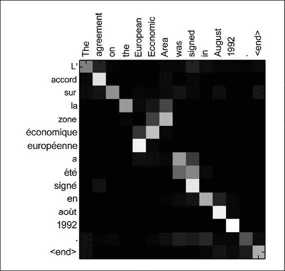

图 6.1：一个关于英语句子“The agreement on the European Economic Area was signed in August 1992.”的注意力示例。该图可视化了“注释权重”——与注释相关的权重。来源：《Neural Machine Translation by Jointly Learning to Align and Translate》Bahdanau 等人（2014）（https://arxiv.org/abs/1409.0473）

使用注意力机制，神经网络可以学习每个源英语单词与每个目标法语单词之间的热力图。请注意，关系不仅仅存在于对角线位置，还可能遍布整个矩阵。例如，当模型输出法语单词“européenne”时，它会特别关注输入单词“European”和“Economic”。（在*图 6.1*中，这对应于对角线及其相邻单元格。）Bahdanou 等人于 2014 年发表的注意力论文表明，模型（使用带有注意力的 RNN 编码器-解码器框架）能够*学习对齐并关注*输入元素而无需监督，并且正如*图 6.1*所示，将输入的英语句子翻译成法语。当然，训练集越大，基于注意力的模型可以学习到的相关性就越多。

简而言之，注意力机制可以访问所有之前的单词，并根据*学习到的*相关性度量对其进行加权。这样，注意力机制就能提供关于目标句子中远离的词元的相关信息。

现在，我们可以关注变换器的另一个关键部分——“自注意力”。

### 自注意力

原始的 Transformer 论文中推广的第三个关键思想是使用自注意力机制来处理源语言同一句子中的词汇关系——自注意力。通过这种机制，神经网络可以被训练来学习每个输入序列（例如一句话）中所有单词（或其他元素）之间的关系，而不管它们的位置，随后再集中处理（机器）翻译。自注意力的概念可以追溯到 2016 年 Cheng 等人发表的论文 *Long Short-Term Memory-Networks for Machine Reading*，[`arxiv.org/pdf/1601.06733.pdf`](https://arxiv.org/pdf/1601.06733.pdf)。

让我们通过以下两个句子来举个例子：

“Server, can I have the check?”

“看起来我刚刚把服务器搞崩了。”

显然，单词“server”在两种句子中的含义完全不同，而自注意力机制能够理解每个单词，并根据周围单词的上下文来判断它们的含义。再次强调，注意力机制可以访问所有之前的单词，并根据学习到的相关性度量为它们赋予权重。自注意力为位于源句子中较远位置的词汇提供了相关信息。

### 多头（自）注意力

原始的 Transformer 会多次执行（自）注意力功能。一组被称为权重矩阵的集合（在 *如何计算注意力* 部分详细介绍）称为一个注意力头。当你拥有多组这些矩阵时，就有了多个注意力头。多头（自）注意力层通常有多个并行的（自）注意力层。注意，引入多个头的做法使我们能够定义哪些单词彼此之间是“相关”的。而且，所有这些相关性定义可以通过现代硬件加速器并行计算，从而加速计算过程。

现在我们已经浏览了 Transformer 关键元素的高层定义，接下来我们将深入探讨如何计算注意力机制。

## 如何计算注意力

在原始的 Transformer 中，自注意力功能是通过使用所谓的缩放点积单元来计算的。2017 年论文的作者甚至称他们的注意力方法为 *缩放点积注意力*。你可能还记得高中时学过的，两个向量之间的点积可以很好地判断这两个向量有多“接近”。

每个输入的令牌序列（例如一句话）的嵌入经过 Transformer（编码器和/或解码器）后，会产生 *注意力权重*（下文会详细介绍），这些权重是同时计算的，计算过程涵盖了每个序列元素（如单词）之间的关系。最终的输出会为每个令牌生成嵌入，这些嵌入包含令牌本身以及与其相关的其他令牌，且每个令牌的权重由其相对的注意力权重决定。

注意力层将输入向量转换为查询、键和值矩阵，然后将其拆分为注意力头（因此是多头注意力）：

+   查询词可以解释为我们正在计算注意力函数的“目标”词。

+   关键字和价值词是我们正在关注的词。

点积（下面将进一步解释）告诉我们词语之间的相似度。如果两个词的向量更对齐，*注意力得分*会更高。Transformer 将以这样的方式学习权重，即如果一个句子中的两个词相互相关，那么它们的词向量将会对齐。

每个注意力层学习三个权重矩阵：

+   查询权重 `W[Q]`

+   关键权重 `W[K]`

+   值权重 `W[V]`

对于每个单词 `i`，计算一个输入词嵌入 `x[i]`，得到：

+   一个查询向量 `q[i]` = `x[i]``W[Q]`

+   一个关键向量 `k[i]` = `x[i]``W[K]`

+   一个值向量 `v[i]` = `x[i]``W[V]`

给定查询和相应的关键向量，以下的点积公式生成了原始 transformer 论文中的 *注意力权重*：

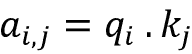

其中：

+   `a`[i,j] 是单词 `i` 到单词 `j` 的注意力。

+   . 是查询与关键字的点积，这将给我们一个感觉，表示向量之间有多“接近”。

注意，单词 `i` 的注意力单元是所有单词值向量的加权和，权重由 `a`[i,j] 表示，即单词 `i` 到单词 `j` 的注意力。

现在，为了在训练过程中稳定梯度，注意力权重被除以关键向量维度的平方根 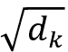。

然后，结果通过 softmax 函数进行归一化处理。注意，单词 `i` 到单词 `j` 的注意力函数与单词 `j` 到单词 `i` 的注意力函数不同。

注意，由于现代深度学习加速器与矩阵的兼容性较好，我们可以使用大矩阵为所有词计算注意力。

定义 `q[i]`、`k[i]`、`v[i]`（其中 `i` 是第 `i` 行）为矩阵 `Q`、`K`、`V`，分别对应。然后，我们可以将注意力函数总结为一个注意力矩阵：

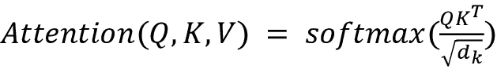

本节讨论了如何计算原始 transformer 论文中介绍的注意力函数。接下来，我们将讨论编码器-解码器架构。

## 编码器-解码器架构

类似于 seq2seq 模型，(*Sequence to Sequence Learning with Neural Networks* 由 Ilya Sutskever、Oriol Vinyals、Quoc V. Le（2014）所描述) 中的 *第五章*，*循环神经网络*，原始的 transformer 模型也使用了编码器-解码器架构：

+   编码器接受输入（源）嵌入序列，并将其转换为一个新的固定长度的输入嵌入向量。

+   解码器获取来自编码器的输出嵌入向量，并将其转化为一系列输出嵌入。

+   编码器和解码器都由多个堆叠的层组成。每个编码器和解码器层都使用前面描述的注意力机制。

我们将在本节的后面更加详细地了解 transformer 架构。

自从引入 transformer 架构以来，其他一些更新的网络只使用了编码器或解码器组件（或两者），这些内容将在本章的*transformer 分类*部分中讨论。

接下来，让我们简要回顾一下原始 transformer 的其他组件——残差和归一化层。

## 残差连接和归一化层

通常，基于 transformer 的网络会重用其他现有的最先进的机器学习方法，例如注意力机制。因此，你不必惊讶于编码器和解码器层将神经网络与残差连接（*He 等人提出的深度残差学习用于图像识别*，2016 年，[`arxiv.org/abs/1512.03385`](https://arxiv.org/abs/1512.03385)）和归一化步骤（*Ba 等人提出的层归一化*，2016 年，[`arxiv.org/abs/1607.06450`](https://arxiv.org/abs/1607.06450)）相结合。

好的，现在我们已经具备了深入研究 transformer 的所有关键要素。

## Transformer 架构概述

现在我们已经涵盖了原始 transformer 的一些关键概念，让我们深入探讨 2017 年开创性论文中介绍的架构。请注意，基于 transformer 的模型通常通过利用各种注意力机制而不使用 RNN 来构建。这也是由于注意力机制本身能够与 RNN（编码器-解码器）模型的注意力机制相匹配并超越它们。因此，这篇开创性论文的标题是*Attention is all You Need*。

*图 6.2*展示了一个带有 RNN 和注意力的 seq2seq 网络，并与原始的 transformer 网络进行了比较。

Transformer 与 seq2seq 加注意力模型在以下方面相似：

+   两种方法都处理源（输入）和目标（输出）*序列*。

+   如前所述，两者都使用了编码器-解码器架构。

+   编码器最后一个块的输出作为上下文或思维向量，用于计算解码器中的注意力函数。

+   目标（输出）序列的嵌入被输入到密集（全连接）块中，这些块将输出嵌入转换为最终的整数形式序列：

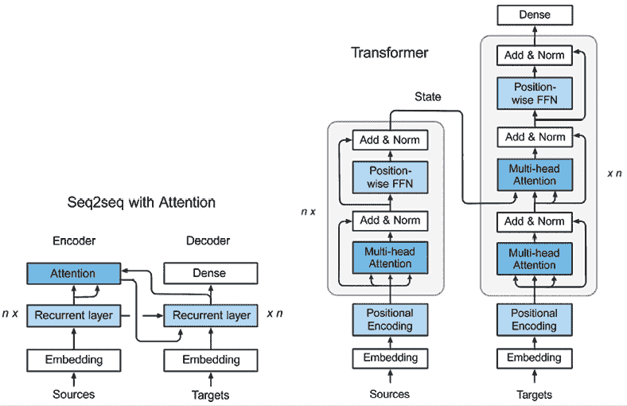

图 6.2：数据流在（a）seq2seq + Attention 和（b）Transformer 架构中的流动。图像来源：Zhang 等人。

这两种架构在以下方面有所不同：

+   seq2seq 网络在编码器中使用循环层和注意力层，在解码器中使用循环层。

    Transformer 用所谓的 transformer 块（N 个相同层的堆叠）替代了这些层，正如*图 6.2*所示：

    +   在编码器中，transformer 块由一系列子层组成：一个多头（自）注意力层和一个位置逐一的前馈层。每一层都有一个残差连接，之后是一个归一化层。

    +   在解码器中，Transformer 块包含一个变种的多头（自）注意力层，带有 *掩码—* 掩码多头自注意力层，以及一个与编码器中类似的前馈层（具有相同的残差连接和归一化层）。掩码有助于防止位置关注未来。此外，解码器包含第二个多头（自）注意力层，用于计算对编码器 Transformer 块输出的关注（掩码将在本节稍后详细介绍）。

+   在带有注意力机制的 seq2seq 网络中，编码器状态传递到第一个递归时间步，就像在带有注意力机制的 seq2seq 网络中一样。

    在 Transformer 中，编码器状态会传递到解码器中的每个 Transformer 块。这允许 Transformer 网络在时间步之间并行工作，因为不像 seq2seq 网络那样存在时间依赖。

    最后的解码器后跟一个最终的线性变换（一个全连接层），并使用 softmax 函数生成输出（下一个标记）的概率。

+   由于前述提到的并行性，添加了一个编码层来提供位置信息，以区分 Transformer 网络序列中每个元素的位置（位置编码层）。这样，第一个编码器将输入序列的位置信息和嵌入作为输入，而不仅仅是编码，从而考虑到位置信息。

让我们一步步地了解数据如何通过 Transformer 网络流动。在本章后续部分，我们将使用 TensorFlow 和 Keras API 从头开始创建并训练一个 Transformer 模型：

1.  作为数据预处理的一部分，输入和输出会被分词并转换为嵌入。

1.  接下来，位置编码被应用于输入和输出嵌入，以获得序列中标记的相对位置信息。在编码器部分：

    +   根据 *图 6.2*，编码器部分由一个嵌入层和一个位置编码层组成，后面跟着六个相同的 Transformer 块（原始 Transformer 中有六个“层”）。正如我们之前所学，每个编码器中的 Transformer 块由一个多头（自）注意力层和一个位置逐元素前馈层组成。

    我们已经简要看到自注意力是关注同一序列部分的过程。当我们处理一个句子时，我们可能希望知道与当前单词最相关的其他单词是什么。

    +   多头自注意力层由多个（在开创性论文中参考实现为 8 个）并行的自注意力层组成。自注意力通过构建三个向量 `Q`（查询），`K`（键），和 `V`（值）来实现，这些向量是从输入嵌入中构造的。通过将输入嵌入与三个可训练的权重矩阵 `W[Q]`，`W[K]`，和 `W[V]` 相乘来创建这些向量。输出向量 `Z` 是通过结合每个自注意力层中的 `K`、`Q` 和 `V`，并使用以下公式生成的。这里，`d[K]` 是 `K`、`Q` 和 `V` 向量的维度（在参考实现中为 64）：

    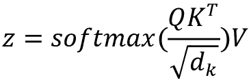

    +   多头自注意力层会为 `Z` 创建多个值（基于每个自注意力层中多个可训练的权重矩阵 `W[Q]`，`W[K]` 和 `W[V]`），然后将它们连接起来，作为位置-wise 前馈层的输入。

    +   位置-wise 前馈层的输入由序列中不同元素（或句子中的单词）的嵌入表示组成，这些嵌入通过多头自注意力层的自注意力机制进行处理。每个标记在内部由一个固定长度的嵌入向量表示（在开创性论文中，参考实现中为 512）。每个向量都会并行地通过前馈层。FFN 的输出是下一个 transformer 块中多头自注意力层的输入（或被送入该层）。在编码器的最后一个 transformer 块中，输出是传递给解码器的上下文向量。

    +   多头自注意力层和位置-wise FFN 层不仅传递来自前一层的信号，还会将来自输入的残差信号传递到它们的输出中。输出和残差输入会经过一个层归一化步骤，这在*图 6.2*中作为“Add & Norm”层展示。

    +   由于整个序列在编码器中是并行处理的，因此单个元素的位置信息会丢失。为了弥补这一点，输入的嵌入向量被增强了一个位置嵌入，位置嵌入通过一个不带学习参数的正弦函数实现。位置嵌入被加到输入嵌入中。

1.  接下来，让我们来看看数据是如何在解码器中流动的：

    +   编码器的输出结果是一个由 `K` 和 `V` 组成的注意力向量对，它们会并行地传送到解码器中的所有 transformer 块。解码器中的 transformer 块与编码器中的类似，唯一的不同是它增加了一个额外的多头自注意力层，用于处理来自编码器的注意力向量。这个额外的多头自注意力层的工作方式类似于编码器中的那个以及下面的那个，只不过它会将来自下层的 `Q` 向量与来自编码器状态的 `K` 和 `Q` 向量结合。

    +   类似于 seq2seq 网络，输出序列一次生成一个 token，使用来自前一个时间步的输入。与编码器的输入类似，解码器的输入也会通过位置嵌入进行增强。与编码器不同，解码器中的自注意力过程仅允许关注之前时间点的 token。这是通过屏蔽未来时间点的 token 来实现的。

    +   解码器中最后一个变换器块的输出是一个低维嵌入序列（参考文献中提到的原始论文中为 512）。该序列传递给全连接层，将其转换为一个针对目标词汇表的概率分布序列，从中我们可以通过贪婪算法或更复杂的技术（如束搜索）生成最可能的词汇。

*图 6.3* 展示了涵盖了上述所有内容的变换器架构：

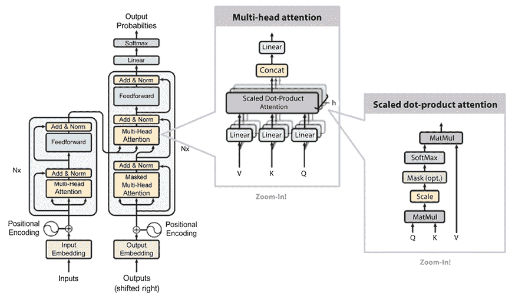

图 6.3：基于 Vaswani 等人（2017 年）《Attention Is All You Need》中的原始图像的变换器架构

## 训练

变换器通常通过半监督学习分两步训练：

1.  首先，进行无监督预训练，通常是在非常大的语料库上进行。

1.  然后，基于较小的标注数据集进行有监督的微调。

预训练和微调可能需要大量的 GPU/TPU 资源、内存和时间。考虑到大型语言模型（简称 LLM）的参数数量在不断增加，尤其如此，正如我们将在下一节中看到的。

有时候，第二阶段只有一小部分标注数据。这就是所谓的少量样本学习，考虑基于有限的样本数量进行预测。

# 变换器架构

在本节中，我们提供了变换器所使用的最重要架构的高级概述，以及计算注意力的不同方法。

## 变换器的分类

在本节中，我们将把变换器分类为不同的类别。下一段将介绍最常见的变换器。

### 解码器或自回归

一个典型的例子是**GPT**（**生成预训练模型**），你可以在本章稍后的 GPT-2 和 GPT-3 部分了解更多，或者参考[`openai.com/blog/language-unsupervised`](https://openai.com/blog/language-unsupervised)。自回归模型仅使用原始变压器模型的解码器，其注意力头只能看到文本中的前部分内容，而看不见后续内容，并在完整句子上使用遮罩机制。自回归模型通过预训练来猜测在观察到所有前面的标记后，下一个标记是什么。通常，自回归模型用于**自然语言生成**（**NLG**）文本生成任务。其他自回归模型的例子包括原始 GPT、GPT-2、Transformer-XL、Reformer 和 XLNet，稍后将在本章中详细介绍。

### 编码器或自编码

一个典型的例子是**BERT**（**来自变压器的双向编码器表示**），将在本章稍后介绍。自编码器对应于原始变压器模型中的编码器，能够访问完整的输入标记，没有遮罩。自编码模型通过遮罩/更改输入标记然后尝试重构原始句子进行预训练。通常，这些模型构建了完整句子的双向表示。需要注意的是，自编码器和自回归模型的唯一区别在于预训练阶段，因此相同的架构可以用于这两种方式。自编码器可用于 NLG，也可用于分类和许多其他 NLP 任务。除了 BERT 外，其他自编码模型的例子包括 ALBERT、RoBERTa 和 ELECTRA，你可以在本章后续部分了解更多。

### Seq2seq

一个典型的例子是**T5**（**文本到文本转移变压器**）和原始变压器。序列到序列模型使用原始变压器架构中的编码器和解码器。Seq2seq 可以针对许多任务进行微调，如翻译、摘要、排序和问答。除了原始变压器和 T5 外，另一个 Seq2seq 模型的例子是**多任务统一模型**（**MUM**）。

### 多模态

一个典型的例子是 MUM。多模态模型将文本输入与其他类型的内容（例如图像、视频和音频）混合。

### 检索

一个典型的例子是 RETRO。一些模型在（预）训练和推理过程中使用文档检索。这通常是减少模型规模、快速访问记忆信息的一种有效策略，从而节省使用的参数数量。

## 注意力

现在我们已经理解了如何对变压器进行分类，接下来让我们关注注意力机制！

注意力机制有多种类型，比如自注意力、局部/硬注意力和全局/软注意力，下面我们将关注一些例子。

### 完整与稀疏

如前所述，原始 2017 年 Transformer 论文中的（缩放）点积注意力通常是在一个完整的平方矩阵 `O`(`L`²) 上计算的，其中 `L` 是最大考虑序列的长度（在某些配置中，`L` = 512）。谷歌研究院在 2020 年提出的 BigBird 类型 Transformer，并在本章后续更详细讨论，提出了通过利用稀疏矩阵来使用稀疏注意力的思想（基于 OpenAI 2019 年发布的论文《利用稀疏 Transformer 生成长序列》，作者为 Child 等人， [`arxiv.org/abs/1904.10509`](https://arxiv.org/abs/1904.10509)）。

### LSH 注意力

Reformer 提出了通过哈希化来降低注意力机制复杂度的思想——模型的作者称之为局部敏感哈希注意力。该方法基于仅在计算 *softmax*(*QK*ᐪ) 时使用最大元素的概念。换句话说，对于每个查询 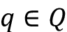，只有接近 `q` 的键 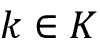 会被计算。为了计算接近度，使用根据局部敏感哈希技术计算的多个哈希函数。

### 局部注意力

一些 Transformer 模型采用了仅具有局部上下文窗口的思想（例如，右边和左边的几个标记）。其想法是，使用更少的参数允许我们考虑更长的序列，但注意力的程度是有限的。由于这个原因，局部注意力不太流行。

# 预训练

如你之前所学，原始的 Transformer 具有编码器-解码器架构。然而，研究社区意识到，在某些情况下，仅使用编码器或仅使用解码器，或者同时使用两者是有益的。

## 编码器预训练

如前所述，这些模型也被称为自编码模型，它们仅在预训练过程中使用编码器。预训练通过遮蔽输入序列中的词并训练模型重建序列来进行。通常，编码器可以访问所有输入词。仅编码器模型通常用于分类。

## 解码器预训练

解码器模型被称为自回归模型。在预训练过程中，解码器被优化为预测下一个词。特别是，解码器只能访问序列中给定词之前的所有词。解码器仅模型通常用于文本生成。

## 编码器-解码器预训练

在这种情况下，模型可以同时使用编码器和解码器。编码器中的注意力可以使用序列中的所有词语，而解码器中的注意力只能使用序列中给定词之前的词语。编码器-解码器有广泛的应用，包括文本生成、翻译、摘要和生成式问答。

## 预训练任务的分类

这对于将预训练组织成由*《自然语言处理中的预训练模型：一项调查》*（Xipeng Qiu, 2020）建议的分类法非常有用，详见[`arxiv.org/abs/2003.08271`](https://arxiv.org/abs/2003.08271)：

+   **语言建模** (**LM**)：对于单向语言建模，任务是预测下一个标记；对于双向语言建模，任务是预测前一个和下一个标记。

+   **掩蔽语言建模** (**MLM**)：其核心思想是将输入句子中的一些标记进行掩蔽。然后，训练模型根据未被掩蔽的标记预测被掩蔽的标记。

+   **置换语言建模** (**PLM**)：这与语言建模（LM）类似，但对输入序列进行了随机置换。然后，从中选择一个标记子集作为目标，并训练模型去预测这些目标。

+   **去噪自编码器** (**DAE**)：故意提供部分损坏的输入。例如，随机抽取输入标记并将其替换为特殊的[MASK]元素；或者，随机删除输入标记；又或者，随机打乱句子的顺序。任务是恢复原始未损坏的输入。

+   **对比学习** (**CTL**)：任务是通过假设一些观测到的文本对比随机抽取的文本具有更高的语义相似性，来学习文本对的评分函数。这类技术包括一些具体技术，如：

    +   **深度信息最大化** (**DIM**)：最大化输入图像表示与同一图像的各个局部区域之间的互信息。

    +   **替换标记检测** (**RTD**)：预测给定周围环境下，输入标记是否被替换。

    +   **下一个句子预测** (**NSP**)：训练模型去区分两个输入句子是否在训练语料库中是连续的。

    +   **句子顺序预测** (**SOP**)：与 NSP 相似，但增加了一些附加信号：两个连续的片段是正例，两个交换的片段是负例。

在这一部分中，我们简要回顾了不同的预训练技术。下一部分将回顾一些最常用的变换器（transformer）模型。

# 一些流行且知名模型的概述

自从开创性论文《Attention is All You Need》发布后，已经提出了大量基于变换器的替代模型。我们来回顾一些最受欢迎和知名的模型。

## BERT

BERT（双向编码器表示变换器）是谷歌 AI 研究团队于 2018 年开发的语言表示模型。我们来了解一下该模型的主要直觉：

1.  BERT 通过所谓的“双向自注意力”机制，从左右两侧考虑每个单词的上下文。

1.  训练通过随机掩盖输入的单词标记进行，并避免循环以确保单词不能间接地“看到”自己。在自然语言处理术语中，这被称为“填空”。换句话说，预训练任务涉及掩盖一小部分未标记的输入，然后训练网络恢复这些原始输入。（这是 MLM 的一个例子。）

1.  该模型使用分类进行预训练，以预测句子序列 S 是否在句子 T 之前。通过这种方式，BERT 能够理解句子之间的关系（“下一句预测”），例如“句子 T 是否在句子 S 之后？”预训练的思想成为了大语言模型的新标准。

1.  BERT——即 BERT Large——成为第一个大规模语言模型之一，拥有 24 个变换器模块、1024 个隐藏层、16 个自注意力头和 340M 参数。该模型在一个包含 33 亿个单词的大型语料库上进行训练。

BERT 在 11 项 NLP 任务中取得了最先进的结果，包括：

+   GLUE 得分为 80.4%，相比之前的最佳结果提高了 7.6%。

+   在 SQuAD 1.1 上取得 93.2%的准确率，超越人类表现 2%。

我们将在本章后面看到 GLUE 和 SQuAD 的指标。如果你想了解更多，可以参考以下资料：

+   原始研究论文：*BERT: 深度双向变换器语言理解的预训练*，作者：Jacob Devlin, Ming-Wei Chang, Kenton Lee, Kristina Toutanova，2018 年，[`arxiv.org/abs/1810.04805`](https://arxiv.org/abs/1810.04805)。

+   Google AI 博客文章：*开源 BERT：自然语言处理的最先进预训练*，2018 年，讨论了当时最先进模型在 11 项 NLP 任务中的进展([`ai.googleblog.com/2018/11/open-sourcing-bert-state-of-art-pre.xhtml`](https://ai.googleblog.com/2018/11/open-sourcing-bert-state-of-art-pre.xhtml))。

+   开源的 TensorFlow 实现和预训练的 BERT 模型可以在[`goo.gl/language/bert`](http://goo.gl/language/bert)以及 TensorFlow 模型库的[`github.com/tensorflow/models/tree/master/official/nlp/modeling/models`](https://github.com/tensorflow/models/tree/master/official/nlp/modeling/models)中找到。

+   BERT 的 Colab 笔记本可以在这里找到：[`colab.research.google.com/github/tensorflow/tpu/blob/master/tools/colab/bert_finetuning_with_cloud_tpus.ipynb`](https://colab.research.google.com/github/tensorflow/tpu/blob/master/tools/colab/bert_finetuning_with_cloud_tpus.ipynb)。

+   BERT 在 Cloud TPU 上的微调：一个教程，展示了如何在 Cloud TPU 上训练 BERT 模型，用于句子和句子对分类任务：[`cloud.google.com/tpu/docs/tutorials/bert`](https://cloud.google.com/tpu/docs/tutorials/bert)。

+   一篇关于将 BERT 应用于 Google 搜索以提升语言理解的 Google 博客文章。根据 Google 的说法，BERT“*将帮助搜索更好地理解美国 10 个英语搜索中的一个*。”此外，文章提到，“*这些系统的一个强大特点是它们能够将一种语言的学习成果应用到其他语言中。因此，我们可以将从英语（互联网上大多数内容存在的语言）中的改进中学习到的模型，应用到其他语言中*。”（摘自 *比以往更好地理解搜索*）：[`blog.google/products/search/search-language-understanding-bert/`](https://blog.google/products/search/search-language-understanding-bert/)。

## GPT-2

GPT-2 是 OpenAI 在 *语言模型是无监督多任务学习者*（由 Alec Radford、Jeffrey Wu、Rewon Child、David Luan、Dario Amodei 和 Ilya Sutskever 编写）中介绍的模型，[`openai.com/blog/better-language-models/`](https://openai.com/blog/better-language-models/)，[`openai.com/blog/gpt-2-6-month-follow-up/`](https://openai.com/blog/gpt-2-6-month-follow-up/)，[`www.openai.com/blog/gpt-2-1-5b-release/`](https://www.openai.com/blog/gpt-2-1-5b-release/)，以及 [`github.com/openai/gpt-2`](https://github.com/openai/gpt-2)。

让我们回顾一下关键直觉：

+   四种模型大小中最大的一个是具有 15 亿参数的 48 层变换器，训练数据集为名为 Webtext 的新数据集，包含来自 4500 万个网页的文本。

+   GPT-2 使用了原始的 2017 年基于变换器的架构，并对 Radford 等人（2018）开发的原始 GPT 模型（同样由 OpenAI 开发）进行了修改，*通过生成预训练提高语言理解*，[`openai.com/blog/language-unsupervised/`](https://openai.com/blog/language-unsupervised/)，以及 [`cdn.openai.com/research-covers/language-unsupervised/language_understanding_paper.pdf`](https://cdn.openai.com/research-covers/language-unsupervised/language_understanding_paper.pdf)。

+   研究表明，在一个大型且多样化的数据集上训练的 LLM 可以在各种 NLP 任务中表现良好，如问答、机器翻译、阅读理解和摘要生成。以前，这些任务通常通过在任务特定数据集上的监督学习来处理。GPT-2 采用无监督方式进行训练，并在零样本任务迁移中表现出色。

+   最初，OpenAI 只发布了一个较小版本的 GPT-2，具有 1.17 亿个参数，“因为担心大型语言模型会被用来大规模生成具有误导性、偏见或攻击性的语言。”随后，模型被发布： [`openai.com/blog/gpt-2-1-5b-release/`](https://openai.com/blog/gpt-2-1-5b-release/)。

+   有趣的是，OpenAI 开发了一种基于机器学习的检测方法，用于测试演员是否生成用于宣传的合成文本。检测率为~95%，用于检测 1.5B 个 GPT-2 生成的文本：[`github.com/openai/gpt-2-output-dataset`](https://github.com/openai/gpt-2-output-dataset)。

与 2018 年原版 GPT 类似，GPT-2 不需要原始 transformer 模型的编码器部分——它使用多层解码器进行语言建模。解码器只能从句子中的前置单词获取信息。它以单词向量为输入，并输出下一个单词的概率估计，但它是*自回归*的，这意味着句子中的每个标记依赖于前一个单词的上下文。另一方面，BERT 不是自回归的，因为它一次性使用整个周围上下文。

GPT-2 是第一个展示常识推理的 LLM，能够执行多个 NLP 任务，包括翻译、问答和阅读理解。该模型在 8 个测试的语言建模数据集中的 7 个上达到了最先进的结果。

## GPT-3

GPT-3 是 OpenAI 开发的自回归语言模型，2019 年在 Tom B. Brown 等人发布的*Language Models are Few-Shot Learners*论文中介绍，[`arxiv.org/abs/2005.14165`](https://arxiv.org/abs/2005.14165)。我们来看一下关键直觉：

+   GPT-3 使用与 GPT-2 相似的架构和模型，主要区别在于采用了稀疏注意力机制。

+   对于每个任务，模型评估有三种不同的方法：

    +   **少量学习**：模型在推理时接收少量任务示范（通常少于一百个）。然而，不允许进行权重更新。

    +   **一次性学习**：模型仅接收一次示范和任务的自然语言描述。

    +   **零样本学习**：模型不接收任何示范，只能访问任务的自然语言描述。

+   对于所有任务，GPT-3 在没有任何梯度更新的情况下应用，任务和少量示范完全通过与模型的文本交互来指定。

研究人员训练 GPT-3 的参数数量范围从 1.25 亿（GPT-3 Small）到 1750 亿（GPT-3 175B）。在没有微调的情况下，该模型在许多 NLP 任务中取得了显著成果，包括翻译和问答，有时甚至超过了最先进的模型。特别是，GPT-3 在自然语言生成（NLG）方面表现出色，创作的新闻文章几乎与真实文章难以区分。该模型证明它能够解决需要即时推理或领域适应的任务，例如解码单词、在句子中使用新词，或进行三位数的算术运算。

GPT-3 的底层模型未公开，我们无法对模型进行预训练，但一些数据集统计信息可以在[`github.com/openai/gpt-3`](https://github.com/openai/gpt-3)查看，并且我们可以运行数据并对 GPT-3 引擎进行微调。

## Reformer

Reformer 模型由 UC Berkeley 和 Google AI 研究人员 Nikita Kitaev、Łukasz Kaiser 和 Anselm Levskaya 在 2020 年的论文*Reformer: The Efficient Transformer*中介绍，[`arxiv.org/abs/2001.04451`](https://arxiv.org/abs/2001.04451)。

让我们来看一下关键的直觉：

+   作者展示了你可以训练 Reformer 模型，该模型在处理长序列时，在内存效率和速度上与变换器模型表现相当。

+   变换器的一个限制是处理长序列的能力，因为计算注意力需要二次方时间。

+   Reformer 通过使用三种技术解决了变换器训练过程中计算和内存的挑战。

+   首先，Reformer 将（缩放的）点积注意力替换为使用局部敏感哈希注意力的近似方法（本章前面简要描述了这一点）。论文的作者将前者在注意力层中的`O`(`L`²)因素替换为 `O`(*LlogL*)，其中`L`是序列的长度（参见图 6.4，其中 LSH 应用于序列中的块）。有关局部敏感哈希的更多信息，请参考计算机科学中的相关介绍：[`en.wikipedia.org/wiki/Locality-sensitive_hashing`](https://en.wikipedia.org/wiki/Locality-sensitive_hashing)。

+   其次，该模型将注意力层和前馈层与可逆残差层结合，而不是使用普通的残差层（基于 Gomez 等人 2017 年提出的*The reversible residual network: Backpropagation without storing activations*的思想，[`proceedings.neurips.cc/paper/2017/hash/f9be311e65d81a9ad8150a60844bb94c-Abstract.xhtml`](https://proceedings.neurips.cc/paper/2017/hash/f9be311e65d81a9ad8150a60844bb94c-Abstract.xhtml)）。可逆残差层允许存储激活一次，而不是`N`次，从而减少了内存和时间复杂度的开销。

+   第三，Reformer 在某些计算中使用了分块技术，包括前馈层和反向传播的计算。

+   你可以阅读 Google AI 博客文章，了解 Reformer 如何通过提高效率：[`ai.googleblog.com/2020/01/reformer-efficient-transformer.xhtml`](https://ai.googleblog.com/2020/01/reformer-efficient-transformer.xhtml)

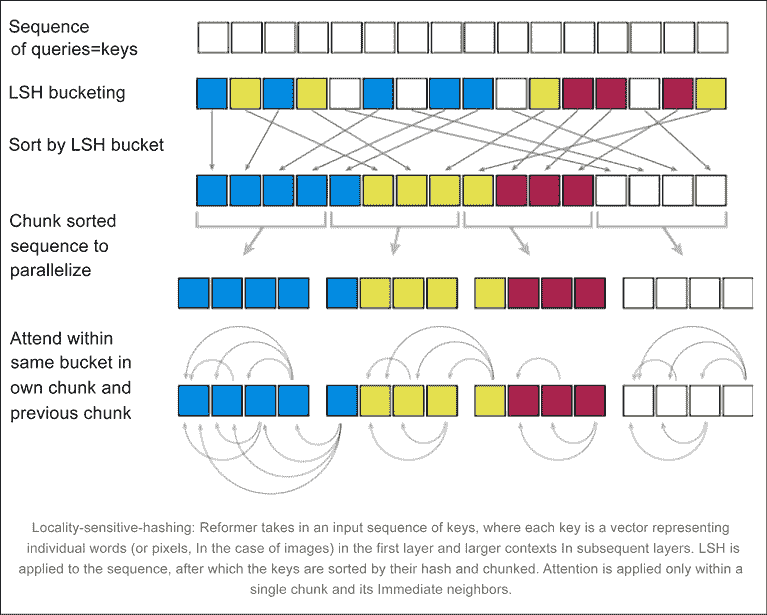

图 6.4：局部敏感哈希提高变换器的效率 – 来源：[`ai.googleblog.com/2020/01/reformer-efficient-transformer.xhtml`](https://ai.googleblog.com/2020/01/reformer-efficient-transformer.xhtml)

## BigBird

BigBird 是另一种 transformer，于 2020 年由谷歌研究团队提出，采用稀疏注意力机制，以应对计算长序列时所需的二次复杂度。欲了解更多详情，请参阅论文 *Big Bird: Transformers for Longer Sequences*，作者包括 Manzil Zaheer、Guru Guruganesh、Avinava Dubey、Joshua Ainslie、Chris Alberti、Santiago Ontanon、Philip Pham、Anirudh Ravula、Qifan Wang、Li Yang 和 Amr Ahmed， [`arxiv.org/pdf/2007.14062.pdf`](https://arxiv.org/pdf/2007.14062.pdf)。

让我们来看一下关键的直觉：

+   作者们证明了 BigBird 能够处理更长的上下文——在类似硬件上，它的序列长度比 BERT 增加了 8 倍。在某些 NLP 任务中，它的表现“显著”优于 BERT，例如问答和文档摘要。

+   BigBird 采用稀疏注意力机制，以克服 BERT 的二次依赖性。研究人员证明了复杂度从 `O`(`L`²) 降低到 `O`(`L`)。

+   通过这种方式，BigBird 可以处理的序列长度是 BERT 的 8 倍。换句话说，BERT 的限制是 512 个 tokens，而 BigBird 增加到 4,096 个 tokens。

## Transformer-XL

Transformer-XL 是一种基于自注意力机制的模型，由卡内基梅隆大学和谷歌大脑的研究人员于 2019 年在论文 *Transformer-XL: Attentive Language Models Beyond a Fixed-Length Context* 中提出，该论文的作者包括 Zihang Dai、Zhilin Yang、Yiming Yang、Jaime Carbonell、Quoc V. Le 和 Ruslan Salakhutdinov，[`aclanthology.org/P19-1285.pdf`](https://aclanthology.org/P19-1285.pdf)。

让我们来看一下关键的直觉：

+   与原始 transformer 和 RNNs 不同，Transformer-XL 展示了它能够在生成相对连贯的文本时，建模超出固定长度上下文的长期依赖关系。

+   Transformer-XL 引入了一种新的段级递归机制和一种新的相对位置编码类型（与绝对位置编码相对），使得模型能够学习比 RNN 长 80% 和比传统 transformer 长 450% 的依赖关系。传统上，由于计算限制，transformer 将整个语料库划分为较短的段落，并且仅在每个段落内训练模型。

+   在训练过程中，前一个段落计算出的隐藏状态序列被固定并缓存，以便在模型处理下一个新段落时作为扩展上下文重用，如 *图 6.5* 所示。尽管梯度仍然局限于某个段落内，但这种额外的输入使得网络能够利用历史信息，从而具备建模长期依赖的能力，避免了上下文的碎片化。

+   在评估过程中，可以复用前几个段落的表示，而不需要像传统模型那样从头开始计算。通过这种方式，Transformer-XL 在评估过程中比传统模型快了多达 1,800 倍以上：

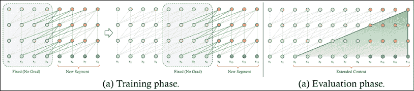

图 6.5：Transformer-XL 与输入的递归缓存前段

## XLNet

XLNet 是一种无监督语言表示学习方法，由卡内基梅隆大学和谷歌大脑的研究人员在 2019 年开发。它基于广义排列语言建模目标。XLNet 使用 Transformer-XL 作为主干模型。这里的参考论文是*XLNet: Generalized Autoregressive Pre-training for Language Understanding*，作者包括 Zhilin Yang、Zihang Dai、Yiming Yang、Jaime Carbonell、Ruslan Salakhutdinov 和 Quoc V. Le，[`arxiv.org/abs/1906.08237`](https://arxiv.org/abs/1906.08237)。

让我们再来看一下关键的直觉：

+   像 BERT 一样，XLNet 使用双向上下文，查看给定标记前后的词语，以预测它应该是什么。

+   XLNet 最大化了相对于所有可能排列顺序的因式分解顺序的序列期望对数似然。由于排列操作，每个位置的上下文可以由来自左右两边的标记组成。换句话说，XLNet 捕捉到了双向上下文。

+   XLNet 在 20 个任务上超越了 BERT，并在 18 个任务上达到了最先进的结果。

+   代码和预训练模型可以在这里找到：[`github.com/zihangdai/xlnet`](https://github.com/zihangdai/xlnet)。

XLNet 被认为在几乎所有 NLP 任务中都优于 BERT，在 20 个任务上超越了 BERT，通常差距较大。当它被引入时，该模型在 18 个 NLP 任务上达到了最先进的性能，包括情感分析、自然语言推理、问答和文档排序。

## RoBERTa

RoBERTa（一个强健优化的 BERT 模型）是 2019 年由华盛顿大学和 Facebook AI（Meta）的研究人员提出的，在*RoBERTa: A Robustly Optimized BERT Pretraining Approach*论文中，由 Yinhan Liu、Myle Ott、Naman Goyal、Jingfei Du、Mandar Joshi、Danqi Chen、Omer Levy、Mike Lewis、Luke Zettlemoyer 和 Veselin Stoyanov 编写，[`arxiv.org/abs/1907.11692`](https://arxiv.org/abs/1907.11692)。

让我们来看一下关键的直觉：

+   在复制 BERT 时，研究人员发现 BERT“显著欠训练”。

+   RoBERTa 的作者提出了一种 BERT 变种，通过修改关键超参数（更长的训练时间、更大的批量、更多的数据），移除下一个句子预训练目标，并在更长的序列上进行训练。作者还提出了动态变化应用于训练数据的掩蔽模式。

+   研究人员收集了一个新的数据集，称为 CC-News，大小与其他私有数据集相似。

+   代码可以在这里找到：[`github.com/pytorch/fairseq`](https://github.com/pytorch/fairseq)。

RoBERTa 在 GLUE 和 SQuAD 任务上超过了 BERT，并在其中一些任务上与 XLNet 持平。

## ALBERT

**ALBERT**（**A Lite BERT**）是由 Google Research 和芝加哥丰田技术研究院的研究人员于 2019 年提出的模型，论文标题为*ALBERT: A Lite BERT for Self-supervised Learning of Language Representations*，作者包括 Zhenzhong Lan、Mingda Chen、Sebastian Goodman、Kevin Gimpel、Piyush Sharma 和 Radu Soricut，[`arxiv.org/abs/1909.11942v1`](https://arxiv.org/abs/1909.11942v1)。

让我们来看一下关键的直觉：

+   大型模型通常通过增加模型大小来提高预训练自然语言表示的性能。然而，由于 GPU/TPU 内存限制、更长的训练时间和意外的模型退化，增加模型大小可能变得困难。

+   ALBERT 试图解决内存限制、通信开销和模型退化问题，采用了一种结合了两种参数减少技术的架构：因式分解嵌入参数化和跨层参数共享。通过因式分解嵌入参数化，隐藏层的大小与词汇嵌入的大小分离，通过将大词汇嵌入矩阵分解为两个小矩阵来实现。通过跨层参数共享，模型防止了随着网络深度增加而参数数量的增长。这两种技术在不“严重”影响性能的情况下提高了参数效率。

+   与原始的 BERT-Large 模型相比，ALBERT 的参数量减少了 18 倍，训练速度提高了 1.7 倍，性能仅略微下降。

+   代码可在此处获取：[`github.com/brightmart/albert_zh`](https://github.com/brightmart/albert_zh)。

ALBERT 声称在所有当前最先进的语言基准（如 GLUE、SQuAD 和 RACE）上都建立了新的最先进成果。

## StructBERT

StructBERT 是 2019 年提出的一个模型，论文标题为*StructBERT: Incorporating Language Structures into Pre-training for Deep Language Understanding*，作者包括 Wei Wang、Bin Bi、Ming Yan、Chen Wu、Zuyi Bao、Jiangnan Xia、Liwei Peng 和 Luo Si，[`arxiv.org/abs/1908.04577`](https://arxiv.org/abs/1908.04577)。

让我们来看一下关键的直觉：

+   阿里巴巴团队建议在预训练过程中通过利用词级和句子级的顺序扩展 BERT。通过混合多个 token 来扩展 BERT 的预训练掩码，模型需要预测正确的顺序。

+   此外，该模型随机打乱句子顺序，并通过特定的预测任务预测下一句和上一句。

+   这种附加的词汇和句子打乱以及预测原始顺序的任务使得 StructBERT 能够在预训练过程中学习语言结构。

阿里巴巴的 StructBERT 声称在不同的 NLP 任务（如情感分类、自然语言推理、语义文本相似性和问答）中达到了最先进的结果，超越了 BERT。

## T5 和 MUM

2019 年，Google 的研究人员在 Colin Raffel、Noam Shazeer、Adam Roberts、Katherine Lee、Sharan Narang、Michael Matena、Yanqi Zhou、Wei Li 和 Peter J. Liu 的论文《*Exploring the Limits of Transfer Learning with a Unified Text-to-Text Transformer*》中介绍了一种名为 Text-to-Text Transfer Transformer（简称 T5）的框架，[`arxiv.org/abs/1910.10683`](https://arxiv.org/abs/1910.10683)。这篇论文是变压器模型领域的基础性论文。

以下是一些关键观点：

+   T5 将许多自然语言处理任务作为“文本到文本”的问题进行处理。T5 是一个单一模型（具有不同数量的参数），可以在众多任务上进行训练。该框架如此强大，能够应用于摘要生成、情感分析、问答和机器翻译等任务。

+   转移学习，即先在数据丰富的任务上预训练一个模型，再在下游任务上进行微调，通过比较预训练目标、架构、未标注数据集、转移方法及其他因素，在数十个语言理解任务上进行了深入分析。

+   与原始的变压器类似，T5：1）使用编码器-解码器结构；2）将输入序列映射到学习的嵌入和位置嵌入，这些嵌入传递给编码器；3）在编码器和解码器中使用自注意力块，结合自注意力和前馈层（每层都具有归一化和跳跃连接）。

+   训练是在一个名为“Colossal Clean Crawled Corpus”（C4）的数据集上进行的，每个 T5 模型的参数数量从 6000 万（T5 小型）到 110 亿不等。

+   计算成本与 BERT 相似，但参数数量是其两倍。

+   代码可在这里获取：[`github.com/google-research/text-to-text-transfer-transformer`](https://github.com/google-research/text-to-text-transfer-transformer)。

+   Google 还提供了在 Colab 教程中使用免费的 TPU 运行 T5，网址为[`colab.research.google.com/github/google-research/text-to-text-transfer-transformer/blob/main/notebooks/t5-trivia.ipynb`](https://colab.research.google.com/github/google-research/text-to-text-transfer-transformer/blob/main/notebooks/t5-trivia.ipynb)。我们将在本章稍后详细讨论这一内容。

当模型呈现时，具有 110 亿参数的 T5 模型在 24 个任务中有 17 个任务上达到了最先进的性能，成为事实上的最佳语言模型之一：

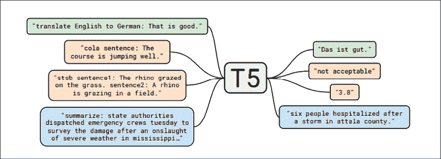

图 6.6：T5 在我们多种任务集上使用相同的模型、损失函数、超参数等——包括翻译、问答和分类任务

mT5 由 Google Research 的 Xue 等人在 2020 年开发，通过使用单一的 Transformer 模型来处理多语言。它在基于 Common Crawl 的数据集上进行了预训练，涵盖了 101 种语言。你可以在 *mT5: A Massively Multilingual Pre-trained Text-to-Text Transformer* 中阅读更多信息，[`arxiv.org/pdf/2010.11934.pdf`](https://arxiv.org/pdf/2010.11934.pdf)。

**MUM**（即 **Multitask Unified Model** 的缩写）是一个使用 T5 文本到文本框架的模型，根据 Google 的说法，其性能是 BERT 的 1,000 倍。MUM 不仅能理解语言，还能生成语言。它还是多模态的，涵盖文本和图像等模态（未来将扩展到更多模态）。该模型在 75 种不同语言和多种任务上进行了训练。目前，MUM 被用于支持 Google 搜索排名：[`blog.google/products/search/introducing-mum/`](https://blog.google/products/search/introducing-mum/)。

## ELECTRA

ELECTRA 是斯坦福大学和 Google Brain 研究人员于 2020 年推出的模型，发表在 *ELECTRA: Pre-training Text Encoders as Discriminators Rather Than Generators* 论文中，作者为 Kevin Clark、Minh-Thang Luong、Quoc V. Le 和 Christopher D. Manning，[`arxiv.org/abs/2003.10555`](https://arxiv.org/abs/2003.10555)。

让我们来看一下关键的直觉：

+   BERT 的预训练任务包括掩盖一小部分未标记的输入，然后训练网络去恢复这些输入。通常只使用少量的词汇（约 15%）。

+   ELECTRA 的作者提出了一种新的预训练任务——“替换词检测”。其思想是将一些词用由小型语言模型生成的替代词替换。然后，预训练的判别器用来预测每个词是原始词还是替代词。通过这种方式，模型可以从所有词中学习，而不仅仅是一个子集：

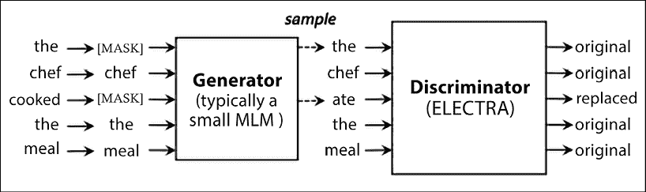

图 6.7：ELECTRA 替换策略。判别器的任务是检测该词是原始词还是替代词——来源：[`arxiv.org/pdf/2003.10555.pdf`](https://arxiv.org/pdf/2003.10555.pdf)

ELECTRA 超越了之前的最先进模型，同时需要更少的预训练工作。代码可以在 [`github.com/google-research/electra`](https://github.com/google-research/electra) 获取。

## DeBERTa

DeBERTa 是微软研究人员在 2020 年推出的模型，发表在 *DeBERTa: Decoding-enhanced BERT with Disentangled Attention* 论文中，作者为 Pengcheng He、Xiaodong Liu、Jianfeng Gao 和 Weizhu Chen，[`arxiv.org/abs/2006.03654`](https://arxiv.org/abs/2006.03654)。

让我们来看看最重要的观点：

+   BERT 的自注意力集中在内容到内容和内容到位置的关系上，内容和位置的嵌入会在自注意力之前加上。DeBERTa 保持了两个独立的向量来表示内容和位置，从而使自注意力可以在内容到内容、内容到位置、位置到内容以及位置到位置之间进行计算。

+   DeBERTa 保留了绝对位置的信息，并结合了相关的位置信息。

由于模型使用了额外的结构信息，DeBERTa 声称在使用比其他模型（如 RoBERTa）更少的训练数据时，达到了最先进的结果。代码可在 [`github.com/microsoft/DeBERTa`](https://github.com/microsoft/DeBERTa) 上找到。

## 进化变换器与 MEENA

进化变换器是由谷歌大脑（Google Brain）研究人员在 2019 年提出的，发表于 *The Evolved Transformer* 这篇由 David R. So、Chen Liang 和 Quoc V. Le 撰写的论文中，[`arxiv.org/abs/1901.11117`](https://arxiv.org/abs/1901.11117)。

让我们回顾一下主要的思想：

+   变换器是一类手工设计的架构。进化变换器的研究人员应用了 **神经架构搜索** (**NAS**)，这是一套自动优化技术，用于学习如何结合基本架构构件，从而找到比人类手工设计的模型更优秀的模型。

+   NAS 被应用于变换器编码器和解码器块， resulting in a new architecture shown in *Figures 6.8* and *6.9*.

与原始变换器架构相比，进化变换器（Evolved Transformers）展示了稳定的改进。该模型是 MEENA 的核心，MEENA 是一个多轮开放域聊天机器人，经过端到端训练，使用从公共领域社交媒体对话中挖掘并过滤的数据。MEENA 使用了 26 亿个参数的进化变换器，拥有一个进化变换器编码器块和 13 个进化变换器解码器块。训练所使用的目标函数专注于最小化困惑度（perplexity），即预测下一个标记时的“不确定性”。与现有的最先进聊天机器人相比，MEENA 能进行更加敏感和具体的对话。参见谷歌博客文章 *Towards a Conversational Agent that Can Chat About…Anything*，[`ai.googleblog.com/2020/01/towards-conversational-agent-that-can.xhtml`](https://ai.googleblog.com/2020/01/towards-conversational-agent-that-can.xhtml)：

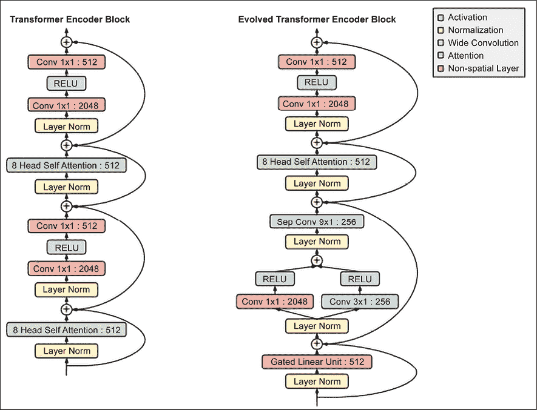

图 6.8：进化变换器编码器块，来源：[`arxiv.org/pdf/1901.11117.pdf`](https://arxiv.org/pdf/1901.11117.pdf)

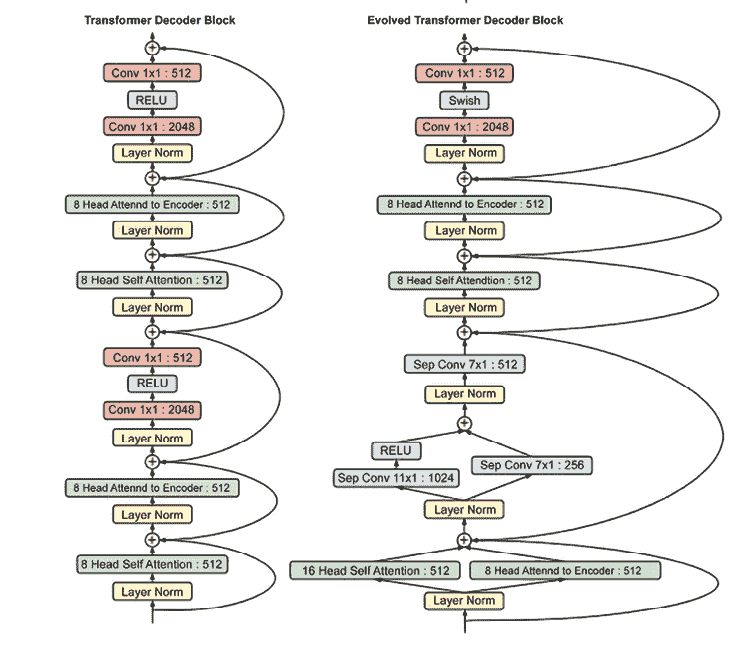

图 6.9：进化变换器解码器块，来源：[`arxiv.org/pdf/1901.11117.pdf`](https://arxiv.org/pdf/1901.11117.pdf)

## LaMDA

LaMDA 是谷歌研究人员在 2022 年提出的模型，来源于 *LaMDA: Language Models for Dialog Applications* 这篇由 Romal Thoppilan 等人撰写的论文，[`arxiv.org/abs/2201.08239`](https://arxiv.org/abs/2201.08239)。它是一种基于变换器（transformer）的神经语言模型，专门用于对话。我们来看一下关键的直觉：

+   在预训练阶段，LaMDA 使用了 1.56 万亿个单词的数据集——比以前用于大规模语言模型的数据多出近 40 倍——来自公共对话数据和其他公共网页文档。在将数据集分词为 2.81 万亿 SentencePiece 令牌后，预训练根据前面的令牌预测句子中的每个下一个令牌。

+   在微调阶段，LaMDA 执行生成任务和分类任务的混合，生成针对给定上下文的自然语言响应，并分类判断响应是否安全且高质量。生成与分类的结合提供了最终答案（见 *图 6.10*）。

+   LaMDA 定义了一套强健的质量、安全性和根植性评估指标：

    +   质量：该度量被分解为三个维度，**合理性、特异性和趣味性**（**SSI**）。合理性考虑模型生成的响应是否符合对话上下文的逻辑。特异性判断响应是否针对前一个对话上下文，而不是一个可以应用于大多数上下文的通用回答。趣味性则衡量模型生成的响应是否富有见解、出乎意料或机智。

    +   安全性：考虑如何避免产生任何可能对用户造成伤害的意外结果，以及避免加剧不公平的偏见。

    +   根植性：考虑到信息的可信性，但该信息可能与外部权威来源支持的资料相矛盾。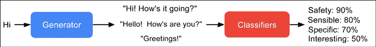

    图 6.10：LaMDA 生成并评分一个响应候选。来源：[`ai.googleblog.com/2022/01/lamda-towards-safe-grounded-and-high.xhtml`](https://ai.googleblog.com/2022/01/lamda-towards-safe-grounded-and-high.xhtml)

LaMDA 展示了接近人脑水平的惊人表现。根据 Google 的说法（[`ai.googleblog.com/2022/01/lamda-towards-safe-grounded-and-high.xhtml`](https://ai.googleblog.com/2022/01/lamda-towards-safe-grounded-and-high.xhtml)），LaMDA 在各个维度上，以及所有模型大小上，都明显优于预训练模型。质量度量（合理性、特异性和趣味性）随着模型参数的增加而普遍提高，无论是否经过微调。安全性似乎并未仅凭模型扩展得到改善，但经过微调后有了提升。根植性随着模型大小的增加而提高，可能是因为较大的模型能更好地记住不常见的知识，但微调使模型能够访问外部知识源，并有效地将一些记忆负担转移到外部知识源上。经过微调后，模型在质量上的差距可以缩小到接近人类水平，但在安全性和根植性方面，模型的表现仍低于人类水平：

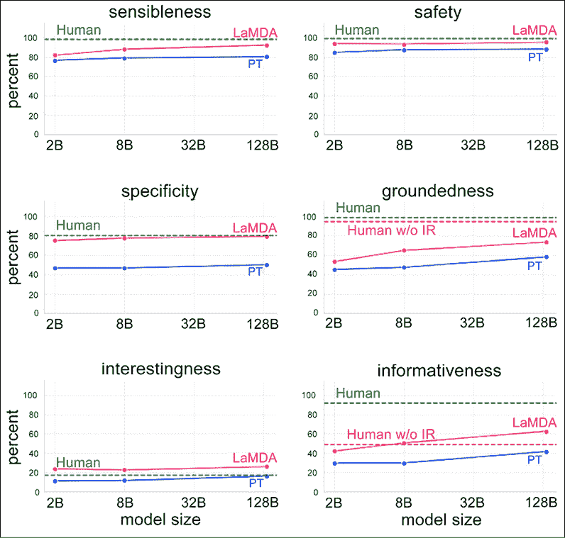

图 6.11：LaMDA 性能 – 来源：[`ai.googleblog.com/2022/01/lamda-towards-safe-grounded-and-high.xhtml`](https://ai.googleblog.com/2022/01/lamda-towards-safe-grounded-and-high.xhtml)

## Switch Transformer

Switch Transformer 是由谷歌的研究人员在 2021 年提出的，发表于《Switch Transformers: Scaling to Trillion Parameter Models with Simple and Efficient Sparsity》一文中，由 William Fedus、Barret Zoph 和 Noam Shazeer 撰写，文章链接：[`arxiv.org/abs/2101.03961`](https://arxiv.org/abs/2101.03961)。

让我们看看关键的直觉：

+   Switch Transformer 从 70 亿到 1.6 万亿参数进行了训练。如前所述，典型的变换器是一个由多头自注意力层组成的深度堆栈，每层的末端都有一个 FFN（前馈神经网络），用于聚合来自多个头的输出。Switch Transformer 将这个单一的 FFN 替换为多个 FFN，并将其称为“专家”。在每次前向传播中，在每层，对于输入的每个标记，模型会激活一个专家：

    图 6.12：具有多个路由 FFN 的 Switch Transformer——变换器中存在的密集 FFN 层被稀疏的 Switch FFN 层（浅蓝色）替代。来源：[`arxiv.org/pdf/2101.03961.pdf`](https://arxiv.org/pdf/2101.03961.pdf)

+   Switch-Base（70 亿参数）和 Switch-Large（260 亿参数）在语言建模、分类、共指解析、问答和摘要等任务上优于 T5-Base（2 亿参数）和 T5-Large（7 亿参数）。

Switch Transformer 的一个示例实现可以在[`keras.io/examples/nlp/text_classification_with_switch_transformer/`](https://keras.io/examples/nlp/text_classification_with_switch_transformer/)找到。

## RETRO

**RETRO**（**检索增强型变换器**）是 DeepMind 在 2022 年提出的一种检索增强自回归语言模型，发表于 Sebastian Borgeaud 等人的《通过从万亿标记中检索来改进语言模型》中，[`arxiv.org/pdf/2112.04426/`](https://arxiv.org/pdf/2112.04426/)。我们来看一下关键的直觉：

+   增加 LLM 中的参数数量已被证明是一种提高结果质量的方法。然而，这种方法并不可持续，因为它在计算上非常昂贵。

+   RETRO 将一个检索**数据库**（**DB**）与变换器结合，形成混合架构。其思想是首先使用最近邻算法在预计算的 BERT 嵌入中进行搜索，这些嵌入存储在检索数据库中。然后，将这些嵌入作为输入传递给变换器的编码器。

+   检索和变换器的结合使得 RETRO（从 1.5 亿扩展到 70 亿非嵌入参数）在使用 LLM 时节省了参数数量。

例如，考虑查询“2021 年美国网球公开赛冠军是”及*图 6.13*，其中缓存的 BERT 嵌入被传递给变换器编码器，以获得最终结果：

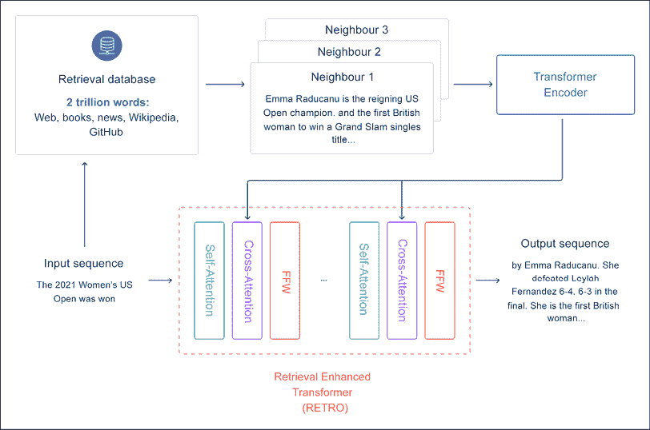

图 6.13：检索增强变压器（RETRO）的高级概览。来源：https://deepmind.com/research/publications/2021/improving-language-models-by-retrieving-from-trillions-of-tokens

## Pathways 和 PaLM

Google Research 宣布了 Pathways（[`blog.google/technology/ai/introducing-pathways-next-generation-ai-architecture/`](https://blog.google/technology/ai/introducing-pathways-next-generation-ai-architecture/)），这是一个能够跨领域和任务泛化的单一模型，同时具有高度的效率。随后，Google 推出了**Pathways 语言模型**（**PaLM**），这是一个包含 5400 亿参数、密集型解码器-only 的变压器模型，使我们能够在多个 TPU v4 Pods 上高效地训练单一模型。Google 对 PaLM 进行了数百项语言理解和生成任务的评估，发现它在大多数任务中都能实现最先进的性能，并且在许多情况下具有显著的优势（见[`ai.googleblog.com/2022/04/pathways-language-model-palm-scaling-to.xhtml?m=1`](https://ai.googleblog.com/2022/04/pathways-language-model-palm-scaling-to.xhtml?m=1)）。

# 实现

在本节中，我们将通过一些使用变压器的任务。

## 变压器参考实现：一个翻译示例

在本节中，我们将简要回顾一个可以在[`www.tensorflow.org/text/tutorials/transformer`](https://www.tensorflow.org/text/tutorials/transformer)上找到的变压器参考实现，具体来说，我们将利用这个机会在 Google Colab 中运行代码。

不是每个人都意识到训练变压器需要的 GPU 数量。幸运的是，你可以在[`colab.research.google.com/github/tensorflow/text/blob/master/docs/tutorials/transformer.ipynb`](https://colab.research.google.com/github/tensorflow/text/blob/master/docs/tutorials/transformer.ipynb)上免费使用可用资源。

请注意，除非你需要实现一些非常具体的定制，或者你对核心研究感兴趣，否则从零开始实现变压器可能不是最佳选择。如果你对了解内部实现不感兴趣，可以跳到下一节。我们的教程使用创意共享署名 4.0 许可证授权，代码示例使用 Apache 2.0 许可证授权。我们将要执行的具体任务是将葡萄牙语翻译成英语。让我们一步一步地看一下代码：

1.  首先，让我们安装数据集并导入正确的库。请注意，在线的 Colab 似乎缺少`import tensorflow_text`这一行，但在这里已添加：

    ```py
    !pip install tensorflow_datasets
    !pip install -U 'tensorflow-text==2.8.*'
    import logging
    import time
    import numpy as np
    import matplotlib.pyplot as plt
    import tensorflow_text
    import tensorflow_datasets as tfds
    import tensorflow as tf
    logging.getLogger('tensorflow').setLevel(logging.ERROR)  # suppress warnings 
    ```

1.  然后，加载葡萄牙语到英语的数据集：

    ```py
    examples, metadata = tfds.load('ted_hrlr_translate/pt_to_en', with_info=True,
                                   as_supervised=True)
    train_examples, val_examples = examples['train'], examples['validation'] 
    ```

1.  现在，让我们将文本转换为标记 ID 的序列，这些标记 ID 用作嵌入的索引：

    ```py
    model_name = 'ted_hrlr_translate_pt_en_converter'
    tf.keras.utils.get_file(
        f'{model_name}.zip',
        f'https://storage.googleapis.com/download.tensorflow.org/models/{model_name}.zip',
        cache_dir='.', cache_subdir='', extract=True
    )
    tokenizers = tf.saved_model.load(model_name) 
    ```

1.  让我们看一下标记化的 ID 和标记化的单词：

    ```py
    for pt_examples, en_examples in train_examples.batch(3).take(1):
      print('> Examples in Portuguese:')
    for en in en_examples.numpy():
      print(en.decode('utf-8')) 
    
    and when you improve searchability , you actually take away the one advantage of print , which is serendipity .
    but what if it were active ?
    but they did n't test for curiosity . 
    
    encoded = tokenizers.en.tokenize(en_examples)
    for row in encoded.to_list():
      print(row) 
    
    [2, 72, 117, 79, 1259, 1491, 2362, 13, 79, 150, 184, 311, 71, 103, 2308, 74, 2679, 13, 148, 80, 55, 4840, 1434, 2423, 540, 15, 3]
    [2, 87, 90, 107, 76, 129, 1852, 30, 3]
    [2, 87, 83, 149, 50, 9, 56, 664, 85, 2512, 15, 3] 
    
    round_trip = tokenizers.en.detokenize(encoded)
    for line in round_trip.numpy():
      print(line.decode('utf-8')) 
    
    and when you improve searchability , you actually take away the one advantage of print , which is serendipity .
    but what if it were active ?
    but they did n ' t test for curiosity . 
    ```

1.  现在让我们创建一个输入管道。首先，我们定义一个函数来丢弃超过 `MAX_TOKENS` 长度的示例。其次，我们定义一个函数来对原始文本的批次进行标记化。第三，我们创建批次：

    ```py
    MAX_TOKENS=128
    def filter_max_tokens(pt, en):
      num_tokens = tf.maximum(tf.shape(pt)[1],tf.shape(en)[1])
      return num_tokens < MAX_TOKENS
    def tokenize_pairs(pt, en):
        pt = tokenizers.pt.tokenize(pt)
        # Convert from ragged to dense, padding with zeros.
        pt = pt.to_tensor()
        en = tokenizers.en.tokenize(en)
        # Convert from ragged to dense, padding with zeros.
        en = en.to_tensor()
        return pt, en
    BUFFER_SIZE = 20000
    BATCH_SIZE = 64
    def make_batches(ds):
      return (
          ds
          .cache()
          .shuffle(BUFFER_SIZE)
          .batch(BATCH_SIZE)
          .map(tokenize_pairs, num_parallel_calls=tf.data.AUTOTUNE)
          .filter(filter_max_tokens)
          .prefetch(tf.data.AUTOTUNE))
    train_batches = make_batches(train_examples)
    val_batches = make_batches(val_examples) 
    ```

1.  现在我们添加位置编码，强制根据词汇的含义相似度和它们在句子中的位置，使得令牌彼此更接近，位于 d 维嵌入空间中：

    ```py
    def get_angles(pos, i, d_model):
      angle_rates = 1 / np.power(10000, (2 * (i//2)) / np.float32(d_model))
      return pos * angle_rates
    def positional_encoding(position, d_model):
      angle_rads = get_angles(np.arange(position)[:, np.newaxis],
                              np.arange(d_model)[np.newaxis, :],
                              d_model)
      # apply sin to even indices in the array; 2i
      angle_rads[:, 0::2] = np.sin(angle_rads[:, 0::2])
      # apply cos to odd indices in the array; 2i+1
      angle_rads[:, 1::2] = np.cos(angle_rads[:, 1::2])
      pos_encoding = angle_rads[np.newaxis, ...]
      return tf.cast(pos_encoding, dtype=tf.float32) 
    ```

1.  现在，让我们集中关注掩码过程。前瞻掩码用于掩蔽序列中的未来令牌，掩码指示哪些条目不应被使用。例如，为了预测第三个令牌，只会使用第一个和第二个令牌，而为了预测第四个令牌，只会使用第一个、第二个和第三个令牌，依此类推：

    ```py
    def create_padding_mask(seq):
      seq = tf.cast(tf.math.equal(seq, 0), tf.float32)
      # add extra dimensions to add the padding
      # to the attention logits.
      return seq[:, tf.newaxis, tf.newaxis, :]  # (batch_size, 1, 1, seq_len)
    def create_look_ahead_mask(size):
      mask = 1 - tf.linalg.band_part(tf.ones((size, size)), -1, 0)
      return mask  # (seq_len, seq_len) 
    ```

1.  我们离变换器的本质越来越近。让我们将注意力函数定义为一个缩放的点积：

    ```py
    def scaled_dot_product_attention(q, k, v, mask):
      """Calculate the attention weights.
      q, k, v must have matching leading dimensions.
      k, v must have matching penultimate dimension, i.e.: seq_len_k = seq_len_v.
      The mask has different shapes depending on its type(padding or look ahead)
      but it must be broadcastable for addition.
      Args:
        q: query shape == (..., seq_len_q, depth)
        k: key shape == (..., seq_len_k, depth)
        v: value shape == (..., seq_len_v, depth_v)
        mask: Float tensor with shape broadcastable
              to (..., seq_len_q, seq_len_k). Defaults to None.
      Returns:
        output, attention_weights
      """
      matmul_qk = tf.matmul(q, k, transpose_b=True)  # (..., seq_len_q, seq_len_k)
      # scale matmul_qk
      dk = tf.cast(tf.shape(k)[-1], tf.float32)
      scaled_attention_logits = matmul_qk / tf.math.sqrt(dk)
      # add the mask to the scaled tensor.
      if mask is not None:
        scaled_attention_logits += (mask * -1e9)
      # softmax is normalized on the last axis (seq_len_k) so that the scores
      # add up to 1.
      attention_weights = tf.nn.softmax(scaled_attention_logits, axis=-1)  # (..., seq_len_q, seq_len_k)
      output = tf.matmul(attention_weights, v)  # (..., seq_len_q, depth_v)
      return output, attention_weights 
    ```

1.  现在注意力已定义，我们需要实现多头机制。它有三个部分：线性层、缩放点积注意力和最终的线性层（见 *图 6.14*）：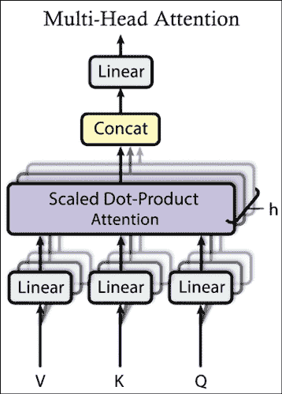

    图 6.14：多头注意力

    ```py
    class MultiHeadAttention(tf.keras.layers.Layer):
      def __init__(self,*, d_model, num_heads):
        super(MultiHeadAttention, self).__init__()
        self.num_heads = num_heads
        self.d_model = d_model
        assert d_model % self.num_heads == 0
        self.depth = d_model // self.num_heads
        self.wq = tf.keras.layers.Dense(d_model)
        self.wk = tf.keras.layers.Dense(d_model)
        self.wv = tf.keras.layers.Dense(d_model)
        self.dense = tf.keras.layers.Dense(d_model)
      def split_heads(self, x, batch_size):
        """Split the last dimension into (num_heads, depth).
        Transpose the result such that the shape is (batch_size, num_heads, seq_len, depth)
        """
        x = tf.reshape(x, (batch_size, -1, self.num_heads, self.depth))
        return tf.transpose(x, perm=[0, 2, 1, 3])
      def call(self, v, k, q, mask):
        batch_size = tf.shape(q)[0]
        q = self.wq(q)  # (batch_size, seq_len, d_model)
        k = self.wk(k)  # (batch_size, seq_len, d_model)
        v = self.wv(v)  # (batch_size, seq_len, d_model)
        q = self.split_heads(q, batch_size)  # (batch_size, num_heads, seq_len_q, depth)
        k = self.split_heads(k, batch_size)  # (batch_size, num_heads, seq_len_k, depth)
        v = self.split_heads(v, batch_size)  # (batch_size, num_heads, seq_len_v, depth)
        # scaled_attention.shape == (batch_size, num_heads, seq_len_q, depth)
        # attention_weights.shape == (batch_size, num_heads, seq_len_q, seq_len_k)
        scaled_attention, attention_weights = scaled_dot_product_attention(
            q, k, v, mask)
        scaled_attention = tf.transpose(scaled_attention, perm=[0, 2, 1, 3])  # (batch_size, seq_len_q, num_heads, depth)
        concat_attention = tf.reshape(scaled_attention,
                                      (batch_size, -1, self.d_model))  # (batch_size, seq_len_q, d_model)
        output = self.dense(concat_attention)  # (batch_size, seq_len_q, d_model)
        return output, attention_weights 
    ```

1.  现在，我们可以定义一个逐点前馈网络，它由两个完全连接的层组成，中间有一个 ReLU 激活函数：

    ```py
    def point_wise_feed_forward_network(d_model, dff):
     return tf.keras.Sequential([
         tf.keras.layers.Dense(dff, activation='relu'),  # (batch_size, seq_len, dff)
         tf.keras.layers.Dense(d_model)  # (batch_size, seq_len, d_model)
     ]) 
    ```

1.  我们现在可以集中精力定义如 *图 6.15* 所示的编码器和解码器部分。记住，传统的变换器通过 `N` 个编码器层处理输入句子，而解码器使用编码器输出和它自己的输入（自注意力）来预测下一个词。每个编码器层都有由多头注意力（带填充掩码）和逐点前馈网络组成的子层。每个子层使用残差连接来解决梯度消失问题，并且有一个归一化层：

    ```py
    class EncoderLayer(tf.keras.layers.Layer):
      def __init__(self,*, d_model, num_heads, dff, rate=0.1):
        super(EncoderLayer, self).__init__()
        self.mha = MultiHeadAttention(d_model=d_model, num_heads=num_heads)
        self.ffn = point_wise_feed_forward_network(d_model, dff)
        self.layernorm1 = tf.keras.layers.LayerNormalization(epsilon=1e-6)
        self.layernorm2 = tf.keras.layers.LayerNormalization(epsilon=1e-6)
        self.dropout1 = tf.keras.layers.Dropout(rate)
        self.dropout2 = tf.keras.layers.Dropout(rate)
      def call(self, x, training, mask):
        attn_output, _ = self.mha(x, x, x, mask)  # (batch_size, input_seq_len, d_model)
        attn_output = self.dropout1(attn_output, training=training)
        out1 = self.layernorm1(x + attn_output)  # (batch_size, input_seq_len, d_model)
        ffn_output = self.ffn(out1)  # (batch_size, input_seq_len, d_model)
        ffn_output = self.dropout2(ffn_output, training=training)
        out2 = self.layernorm2(out1 + ffn_output)  # (batch_size, input_seq_len, d_model)
        return out2 
    ```

1.  每个解码器层由多个子层组成。首先是一个带掩蔽的多头注意力（带前瞻掩码和填充掩码）。然后是一个多头注意力（带填充掩码），V（值）和 K（键）接收编码器输出作为输入。Q（查询）接收来自掩蔽多头注意力子层的输出，最后是逐点前馈网络：

    ```py
    class DecoderLayer(tf.keras.layers.Layer):
      def __init__(self,*, d_model, num_heads, dff, rate=0.1):
        super(DecoderLayer, self).__init__()
        self.mha1 = MultiHeadAttention(d_model=d_model, num_heads=num_heads)
        self.mha2 = MultiHeadAttention(d_model=d_model, num_heads=num_heads)
        self.ffn = point_wise_feed_forward_network(d_model, dff)
        self.layernorm1 = tf.keras.layers.LayerNormalization(epsilon=1e-6)
        self.layernorm2 = tf.keras.layers.LayerNormalization(epsilon=1e-6)
        self.layernorm3 = tf.keras.layers.LayerNormalization(epsilon=1e-6)
        self.dropout1 = tf.keras.layers.Dropout(rate)
        self.dropout2 = tf.keras.layers.Dropout(rate)
        self.dropout3 = tf.keras.layers.Dropout(rate)
      def call(self, x, enc_output, training,
               look_ahead_mask, padding_mask):
        # enc_output.shape == (batch_size, input_seq_len, d_model)
        attn1, attn_weights_block1 = self.mha1(x, x, x, look_ahead_mask)  # (batch_size, target_seq_len, d_model)
        attn1 = self.dropout1(attn1, training=training)
        out1 = self.layernorm1(attn1 + x)
        attn2, attn_weights_block2 = self.mha2(
            enc_output, enc_output, out1, padding_mask)  # (batch_size, target_seq_len, d_model)
        attn2 = self.dropout2(attn2, training=training)
        out2 = self.layernorm2(attn2 + out1)  # (batch_size, target_seq_len, d_model)
        ffn_output = self.ffn(out2)  # (batch_size, target_seq_len, d_model)
        ffn_output = self.dropout3(ffn_output, training=training)
        out3 = self.layernorm3(ffn_output + out2)  # (batch_size, target_seq_len, d_model)
        return out3, attn_weights_block1, attn_weights_block2 
    ```

1.  现在我们已经定义了编码器层，可以用它来定义合适的编码器。编码器由三个阶段组成：输入嵌入、位置编码和 `N` 个编码器层：

    ```py
    class Encoder(tf.keras.layers.Layer):
      def __init__(self,*, num_layers, d_model, num_heads, dff, input_vocab_size,
                   rate=0.1):
        super(Encoder, self).__init__()
        self.d_model = d_model
        self.num_layers = num_layers
        self.embedding = tf.keras.layers.Embedding(input_vocab_size, d_model)
        self.pos_encoding = positional_encoding(MAX_TOKENS, self.d_model)
        self.enc_layers = [
            EncoderLayer(d_model=d_model, num_heads=num_heads, dff=dff, rate=rate)
            for _ in range(num_layers)]
        self.dropout = tf.keras.layers.Dropout(rate)
      def call(self, x, training, mask):
        seq_len = tf.shape(x)[1]
        # adding embedding and position encoding.
        x = self.embedding(x)  # (batch_size, input_seq_len, d_model)
        x *= tf.math.sqrt(tf.cast(self.d_model, tf.float32))
        x += self.pos_encoding[:, :seq_len, :]
        x = self.dropout(x, training=training)
        for i in range(self.num_layers):
          x = self.enc_layersi
        return x  # (batch_size, input_seq_len, d_model) 
    ```

1.  我们现在可以专注于解码器本身。解码器由输出嵌入、位置编码和 `N` 个解码器层组成：

    ```py
    class Decoder(tf.keras.layers.Layer):
      def __init__(self,*, num_layers, d_model, num_heads, dff, target_vocab_size,
                   rate=0.1):
        super(Decoder, self).__init__()
        self.d_model = d_model
        self.num_layers = num_layers
        self.embedding = tf.keras.layers.Embedding(target_vocab_size, d_model)
        self.pos_encoding = positional_encoding(MAX_TOKENS, d_model)
        self.dec_layers = [
            DecoderLayer(d_model=d_model, num_heads=num_heads, dff=dff, rate=rate)
            for _ in range(num_layers)]
        self.dropout = tf.keras.layers.Dropout(rate)
      def call(self, x, enc_output, training,
               look_ahead_mask, padding_mask):
        seq_len = tf.shape(x)[1]
        attention_weights = {}
        x = self.embedding(x)  # (batch_size, target_seq_len, d_model)
        x *= tf.math.sqrt(tf.cast(self.d_model, tf.float32))
        x += self.pos_encoding[:, :seq_len, :]
        x = self.dropout(x, training=training)
        for i in range(self.num_layers):
          x, block1, block2 = self.dec_layersi
          attention_weights[f'decoder_layer{i+1}_block1'] = block1
          attention_weights[f'decoder_layer{i+1}_block2'] = block2
        # x.shape == (batch_size, target_seq_len, d_model)
        return x, attention_weights 
    ```

1.  现在我们已经定义了编码器和解码器，我们可以把注意力转向变换器本身，它由编码器、解码器和最终的线性层组成（见 *图 6.15*）：

    ```py
    class Transformer(tf.keras.Model):
      def __init__(self,*, num_layers, d_model, num_heads, dff, input_vocab_size,
                   target_vocab_size, rate=0.1):
        super().__init__()
        self.encoder = Encoder(num_layers=num_layers, d_model=d_model,
                               num_heads=num_heads, dff=dff,
                               input_vocab_size=input_vocab_size, rate=rate)
        self.decoder = Decoder(num_layers=num_layers, d_model=d_model,
                               num_heads=num_heads, dff=dff,
                               target_vocab_size=target_vocab_size, rate=rate)
        self.final_layer = tf.keras.layers.Dense(target_vocab_size)
      def call(self, inputs, training):
        # Keras models prefer if you pass all your inputs in the first argument
        inp, tar = inputs
        enc_padding_mask, look_ahead_mask, dec_padding_mask = self.create_masks(inp, tar)
        enc_output = self.encoder(inp, training, enc_padding_mask)  # (batch_size, inp_seq_len, d_model)
        # dec_output.shape == (batch_size, tar_seq_len, d_model)
        dec_output, attention_weights = self.decoder(
            tar, enc_output, training, look_ahead_mask, dec_padding_mask)
        final_output = self.final_layer(dec_output)  # (batch_size, tar_seq_len, target_vocab_size)
        return final_output, attention_weights
      def create_masks(self, inp, tar):
        # Encoder padding mask
        enc_padding_mask = create_padding_mask(inp)
        # Used in the 2nd attention block in the decoder.
        # This padding mask is used to mask the encoder outputs.
        dec_padding_mask = create_padding_mask(inp)
        # Used in the 1st attention block in the decoder.
        # It is used to pad and mask future tokens in the input received by
        # the decoder.
        look_ahead_mask = create_look_ahead_mask(tf.shape(tar)[1])
        dec_target_padding_mask = create_padding_mask(tar)
        look_ahead_mask = tf.maximum(dec_target_padding_mask, look_ahead_mask)
        return enc_padding_mask, look_ahead_mask, dec_padding_mask 
    ```

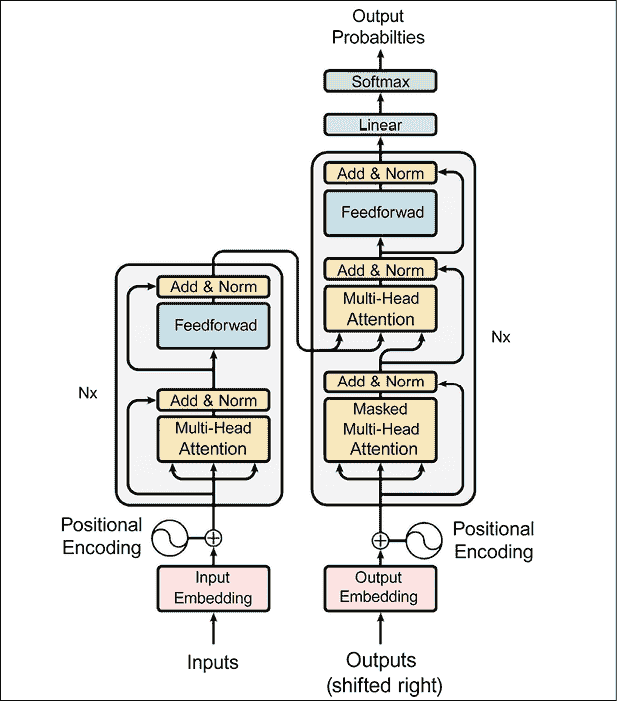

图 6.15：传统的变换器

1.  我们快完成了。我们只需要定义超参数和优化器，使用与开创性论文中完全相同的设置，并定义损失函数：

    ```py
    num_layers = 4
    d_model = 128
    dff = 512
    num_heads = 8
    dropout_rate = 0.1
    class CustomSchedule(tf.keras.optimizers.schedules.LearningRateSchedule):
      def __init__(self, d_model, warmup_steps=4000):
        super(CustomSchedule, self).__init__()
        self.d_model = d_model
        self.d_model = tf.cast(self.d_model, tf.float32)
        self.warmup_steps = warmup_steps
      def __call__(self, step):
        arg1 = tf.math.rsqrt(step)
        arg2 = step * (self.warmup_steps ** -1.5)
        return tf.math.rsqrt(self.d_model) * tf.math.minimum(arg1, arg2)
    learning_rate = CustomSchedule(d_model)
    optimizer = tf.keras.optimizers.Adam(learning_rate, beta_1=0.9, beta_2=0.98,
                                         epsilon=1e-9)
    def loss_function(real, pred):
      mask = tf.math.logical_not(tf.math.equal(real, 0))
      loss_ = loss_object(real, pred)
      mask = tf.cast(mask, dtype=loss_.dtype)
      loss_ *= mask
      return tf.reduce_sum(loss_)/tf.reduce_sum(mask)
    def accuracy_function(real, pred):
      accuracies = tf.equal(real, tf.argmax(pred, axis=2))
      mask = tf.math.logical_not(tf.math.equal(real, 0))
      accuracies = tf.math.logical_and(mask, accuracies)
      accuracies = tf.cast(accuracies, dtype=tf.float32)
      mask = tf.cast(mask, dtype=tf.float32)
      return tf.reduce_sum(accuracies)/tf.reduce_sum(mask)
    train_loss = tf.keras.metrics.Mean(name='train_loss')
    train_accuracy = tf.keras.metrics.Mean(name='train_accuracy') 
    ```

1.  现在是定义变换器的时候了。让我们看看代码：

    ```py
    transformer = Transformer(
        num_layers=num_layers,
        d_model=d_model,
        num_heads=num_heads,
        dff=dff,
        input_vocab_size=tokenizers.pt.get_vocab_size().numpy(),
        target_vocab_size=tokenizers.en.get_vocab_size().numpy(),
        rate=dropout_rate) 
    ```

1.  让我们也用以下代码定义检查点：

    ```py
    checkpoint_path = './checkpoints/train'
    ckpt = tf.train.Checkpoint(transformer=transformer,
                               optimizer=optimizer)
    ckpt_manager = tf.train.CheckpointManager(ckpt, checkpoint_path, max_to_keep=5)
    # if a checkpoint exists, restore the latest checkpoint.
    if ckpt_manager.latest_checkpoint:
      ckpt.restore(ckpt_manager.latest_checkpoint)
      print('Latest checkpoint restored!!') 
    ```

1.  记住，变换器是自回归的。当前的输出被用来预测接下来会发生什么。我们使用前瞻掩码，以防止模型看到预期的输出。我们现在准备定义 `train_step`：

    ```py
    train_step_signature = [
        tf.TensorSpec(shape=(None, None), dtype=tf.int64),
        tf.TensorSpec(shape=(None, None), dtype=tf.int64),
    ]
    @tf.function(input_signature=train_step_signature)
    def train_step(inp, tar):
      tar_inp = tar[:, :-1]
      tar_real = tar[:, 1:]
      with tf.GradientTape() as tape:
        predictions, _ = transformer([inp, tar_inp],
                                     training = True)
        loss = loss_function(tar_real, predictions)
      gradients = tape.gradient(loss, transformer.trainable_variables)
      optimizer.apply_gradients(zip(gradients, transformer.trainable_variables))
      train_loss(loss)
      train_accuracy(accuracy_function(tar_real, predictions))
    EPOCHS = 20
    for epoch in range(EPOCHS):
      start = time.time()
      train_loss.reset_states()
      train_accuracy.reset_states()
      # inp -> portuguese, tar -> english
      for (batch, (inp, tar)) in enumerate(train_batches):
        train_step(inp, tar)
        if batch % 50 == 0:
          print(f'Epoch {epoch + 1} Batch {batch} Loss {train_loss.result():.4f} Accuracy {train_accuracy.result():.4f}')
      if (epoch + 1) % 5 == 0:
        ckpt_save_path = ckpt_manager.save()
        print(f'Saving checkpoint for epoch {epoch+1} at {ckpt_save_path}')
      print(f'Epoch {epoch + 1} Loss {train_loss.result():.4f} Accuracy {train_accuracy.result():.4f}')
      print(f'Time taken for 1 epoch: {time.time() - start:.2f} secs\n') 
    ```

    在 Colab 中运行训练步骤后，我们得到了以下情况：

    ```py
    Epoch 20 Loss 1.5030 Accuracy 0.6720
    Time taken for 1 epoch: 169.01 secs 
    ```

1.  我们现在准备进行翻译。以下步骤用于翻译：

    1.  使用葡萄牙语分词器（`tokenizers.pt`）对输入句子进行编码。

    1.  解码器输入初始化为 [START] token。

    1.  计算填充掩码（padding masks）和前瞻掩码（look-ahead masks）。

    1.  然后，解码器通过查看编码器输出和自身输出（自注意力）来输出预测结果。

    1.  将预测的 token 拼接到解码器输入中，并传递给解码器：

    ```py
    class Translator(tf.Module):
      def __init__(self, tokenizers, transformer):
        self.tokenizers = tokenizers
        self.transformer = transformer
      def __call__(self, sentence, max_length=MAX_TOKENS):
        # input sentence is portuguese, hence adding the start and end token
        assert isinstance(sentence, tf.Tensor)
        if len(sentence.shape) == 0:
          sentence = sentence[tf.newaxis]
        sentence = self.tokenizers.pt.tokenize(sentence).to_tensor()
        encoder_input = sentence
        # As the output language is english, initialize the output with the
        # english start token.
        start_end = self.tokenizers.en.tokenize([''])[0]
        start = start_end[0][tf.newaxis]
        end = start_end[1][tf.newaxis]
        # 'tf.TensorArray' is required here (instead of a python list) so that the
        # dynamic-loop can be traced by 'tf.function'.
        output_array = tf.TensorArray(dtype=tf.int64, size=0, dynamic_size=True)
        output_array = output_array.write(0, start)
        for i in tf.range(max_length):
          output = tf.transpose(output_array.stack())
          predictions, _ = self.transformer([encoder_input, output], training=False)
          # select the last token from the seq_len dimension
          predictions = predictions[:, -1:, :]  # (batch_size, 1, vocab_size)
          predicted_id = tf.argmax(predictions, axis=-1)
          # concatentate the predicted_id to the output which is given to the decoder
          # as its input.
          output_array = output_array.write(i+1, predicted_id[0])
          if predicted_id == end:
            break
        output = tf.transpose(output_array.stack())
        # output.shape (1, tokens)
        text = tokenizers.en.detokenize(output)[0]  # shape: ()
        tokens = tokenizers.en.lookup(output)[0]
        # 'tf.function' prevents us from using the attention_weights that were
        # calculated on the last iteration of the loop. So recalculate them outside
        # the loop.
        _, attention_weights = self.transformer([encoder_input, output[:,:-1]], training=False)
        return text, tokens, attention_weights 
    ```

1.  让我们用以下代码片段对示例句子调用翻译器：

    ```py
    translator = Translator(tokenizers, transformer)
    def print_translation(sentence, tokens, ground_truth):
      print(f'{"Input:":15s}: {sentence}')
      print(f'{"Prediction":15s}: {tokens.numpy().decode("utf-8")}')
      print(f'{"Ground truth":15s}: {ground_truth}')
    sentence = 'os meus vizinhos ouviram sobre esta ideia.'
    ground_truth = 'and my neighboring homes heard about this idea .'
    translated_text, translated_tokens, attention_weights = translator(
        tf.constant(sentence))
    print_translation(sentence, translated_text, ground_truth) 
    ```

    得到的结果是：

    ```py
    Input:         : os meus vizinhos ouviram sobre esta ideia.
    Prediction     : my neighbors have heard about this idea .
    Ground truth   : and my neighboring homes heard about this idea . 
    ```

在这份详细分析中，我们讨论了如何实现传统的变换器，考虑到位置编码、多头注意力和掩码。分析的代码见 [`www.tensorflow.org/text/tutorials/transformer`](https://www.tensorflow.org/text/tutorials/transformer)。

接下来，我们将讨论如何利用更高层次的库来使用变换器。

## Hugging Face

正如之前讨论的那样，除非你需要实现一些非常特定的定制化，或者对核心研究感兴趣，否则从头实现变换器（transformer）可能不是最佳选择。如果你想理解变换器架构的内部细节，或者希望修改变换器架构以生成新的变种，这样做是有用的。如今，有很多优秀的库提供高质量的解决方案，其中之一就是 Hugging Face，它提供了一些高效的工具。Hugging Face 的构建围绕着将其开源的变换器库商业化的想法展开。让我们来看一下为什么这个库变得如此流行：

+   Hugging Face 提供了一个通用的 API 来处理多种变换器架构。

+   它不仅提供基础模型，还提供具有不同类型“头”的模型，用于处理特定任务（例如，对于 BERT 架构，它提供 `TFBertModel`，以及用于情感分析等任务的 `TFBertForSequenceClassification`，用于命名实体识别等任务的 `TFBertForTokenClassification`，以及用于问答的 `TFBertForQuestionAnswering` 等）。

+   你还可以通过使用这里提供的预训练权重，例如使用 `TFBertForPreTraining`，来轻松创建一个用于特定任务的网络。

+   除了下一小节中的 `pipeline()` 方法外，我们还可以按常规方式定义模型，并使用 `fit()` 来训练它，使用 `predict()` 来进行推理，就像普通的 TF 模型一样（PyTorch 也有 Trainer 接口）。我们将在本章后面看到一个示例。

现在，让我们看一些使用 Hugging Face 的示例。

### 生成文本

在这一部分，我们将使用 GPT-2 进行自然语言生成，这是一个生成自然语言输出的软件过程。让我们从安装 Hugging Face 库开始：

1.  第一步是创建一个专门的虚拟环境，在其中安装 transformer 库。在我的例子中，我使用的是 TensorFlow 2.0 的库：

    ```py
    python -m venv .env
    source .env/bin/activate
    pip install transformers[tf-cpu] 
    ```

1.  然后让我们通过下载一个用于情感分析的预训练模型来验证一切是否正常工作：

    ```py
    python -c "from transformers import pipeline; print(pipeline('sentiment-analysis')('we love you'))" 
    ```

    由于期望的情感应该是非常积极的，我们将看到如下的内容：

    ```py
    [{'label': 'POSITIVE', 'score': 0.9998704791069031}] 
    ```

1.  现在，让我们专注于使用 GPT-2 生成文本：

    ```py
    from transformers import pipeline
    generator = pipeline(task="text-generation") 
    ```

    你应该看到如下的内容：

    ```py
    No model was supplied, defaulted to gpt2 (https://huggingface.co/gpt2)
    Downloading: 100%|██████████████████████████████| 665/665 [00:00<00:00, 167kB/s]
    Downloading: 100%|███████████████████████████| 475M/475M [03:24<00:00, 2.44MB/s 
    ```

1.  让我们给生成器传递一些文本，看看结果如何。第一句话来自托尔金的作品，第二句来自爱因斯坦的理论，第三句来自《哈利·波特》：

    ```py
    generator("Three Rings for the Elven-kings under the sky, Seven for the Dwarf-lords in their halls of stone") 
    
    Setting 'pad_token_id' to 50256 (first 'eos_token_id') to generate sequence
    [{'generated_text': 'Three Rings for the Elven-kings under the sky, Seven for the Dwarf-lords in their halls of stone and Eight for the Dwarves in their halls of rock! Three new Rings of the Elven-kings under the sky, Seven for'}] 
    
    generator ("The original theory of relativity is based upon the premise that all coordinate systems in relative uniform translatory motion to each other are equally valid and equivalent ") 
    
    Setting 'pad_token_id' to 50256 (first 'eos_token_id') to generate sequence
    [{'generated_text': 'The original theory of relativity is based upon the premise that all coordinate systems in relative uniform translatory motion to each other are equally valid and equivalent \xa0to one another. In other words, they can all converge, and therefore all the laws are valid'}] 
    
    generator ("It takes a great deal of bravery to stand up to our enemies") 
    
    Setting 'pad_token_id' to 50256 (first 'eos_token_id') to generate sequence
    [{'generated_text': 'It takes a great deal of bravery to stand up to our enemies that day. She still has a lot to learn from it, or it could take decades to do.\n\nWhile some braver men struggle, many are not as lucky'}] 
    ```

很简单，不是吗？

### 自动选择模型和自动标记化

Hugging Face 在帮助开发者自动化尽可能多的步骤方面做得非常出色。让我们看一些例子：

1.  你可以轻松地从几十种可用的预训练模型中导入一个。所有可用模型的完整列表在这里：[`huggingface.co/docs/transformers/model_doc/auto`](https://huggingface.co/docs/transformers/model_doc/auto)：

    ```py
    from transformers import TFAutoModelForSequenceClassification
    model = TFAutoModelForSequenceClassification.from_pretrained("distilbert-base-uncased") 
    
    Downloading: 100%|█████████████████████████████| 483/483 [00:00<00:00, 68.9kB/s]
    Downloading: 100%|███████████████████████████| 347M/347M [01:05<00:00, 5.59MB/s]
    … 
    ```

    你可能应该在下游任务上训练此模型，以便将其用于预测和推理。

1.  你可以使用`AutoTokenizer`将单词转换为模型使用的标记：

    ```py
    from transformers import AutoTokenizer
    tokenizer = AutoTokenizer.from_pretrained("bert-base-uncased")
    sequence = "The original theory of relativity is based upon the premise that all coordinate systems"
    print(tokenizer(sequence)) 
    
    {'input_ids': [101, 1996, 2434, 3399, 1997, 20805, 2003, 2241, 2588, 1996, 18458, 2008, 2035, 13530, 3001, 102], 'token_type_ids': [0, 0, 0, 0, 0, 0, 0, 0, 0, 0, 0, 0, 0, 0, 0, 0], 'attention_mask': [1, 1, 1, 1, 1, 1, 1, 1, 1, 1, 1, 1, 1, 1, 1, 1]} 
    ```

### 命名实体识别

**命名实体识别**（**NER**）是一个经典的 NLP 任务。根据维基百科，命名实体识别——也称为（命名的）实体识别、实体分块和实体提取——是信息提取的一个子任务，旨在定位和分类未结构化文本中提到的命名实体，并将其分为预定义的类别，如人名、组织、地点、医学编码、时间表达、数量、货币值和百分比等。

让我们看看如何利用 Hugging Face 轻松地执行此任务：

1.  首先，让我们创建一个 NER 流水线：

    ```py
    from transformers import pipeline
    ner_pipe = pipeline("ner")
    sequence = """Mr. and Mrs. Dursley, of number four, Privet Drive, were proud to say that they were perfectly normal, thank you very much."""
    for entity in ner_pipe(sequence):
        print(entity) 
    ```

1.  你将能够看到如下的内容，其中实体已被识别：

    ```py
    {'entity': 'I-PER', 'score': 0.99908304, 'index': 6, 'word': 'Du', 'start': 13, 'end': 15}
    {'entity': 'I-PER', 'score': 0.9869529, 'index': 7, 'word': '##rs', 'start': 15, 'end': 17}
    {'entity': 'I-PER', 'score': 0.9784202, 'index': 8, 'word': '##ley', 'start': 17, 'end': 20}
    {'entity': 'I-ORG', 'score': 0.6860208, 'index': 14, 'word': 'P', 'start': 38, 'end': 39}
    {'entity': 'I-ORG', 'score': 0.7713562, 'index': 15, 'word': '##rive', 'start': 39, 'end': 43}
    {'entity': 'I-ORG', 'score': 0.76567733, 'index': 16, 'word': '##t', 'start': 43, 'end': 44}
    {'entity': 'I-ORG', 'score': 0.8087192, 'index': 17, 'word': 'Drive', 'start': 45, 'end': 50} 
    ```

命名实体识别可以理解九种不同的类别：

+   `O`：命名实体之外。

+   `B-MIS`：紧接着另一个杂项实体的杂项实体开始。

+   `I-MIS`：杂项实体。

+   `B-PER`：紧接着另一个人名的人的名字开始。

+   `I-PER`：一个人的名字。

+   `B-ORG`：紧接着另一个组织的组织开始。

+   `I-ORG`：组织。

+   `B-LOC`：紧接着另一个地点的地点开始。

+   `I-LOC`：地点。

这些实体在通常用于此任务的 CoNLL-2003 数据集中定义，并由 Hugging Face 自动选择。

### 总结

现在，让我们转向摘要任务，即以简洁明了的形式表达某些事物或某人最重要的事实或想法。Hugging Face 让使用 T5 模型作为默认模型变得非常简单。让我们来看一下代码：

1.  首先，让我们使用默认的 T5 small 模型创建一个摘要管道：

    ```py
    from transformers import pipeline
    summarizer = pipeline("summarization")
    ARTICLE = """
     Mr.
     and Mrs.
     Dursley, of number four, Privet Drive, were proud to say
     that they were perfectly normal, thank you very much.
     They were the last
     people you'd expect to be involved in anything strange or mysterious,
    because they just didn't hold with such nonsense.
     Mr.
     Dursley was the director of a firm called Grunnings, which made
     drills.
     He was a big, beefy man with hardly any neck, although he did
     have a very large mustache.
     Mrs.
     Dursley was thin and blonde and had
     nearly twice the usual amount of neck, which came in very useful as she
     spent so much of her time craning over garden fences, spying on the
     neighbors.
     The Dursleys had a small son called Dudley and in their
     opinion there was no finer boy anywhere"""
    print(summarizer(ARTICLE, max_length=130, min_length=30, do_sample=False)) 
    ```

1.  结果，我们将看到类似以下内容：

    ```py
    No model was supplied, defaulted to t5-small (https://huggingface.co/t5-small)
    Downloading: 100%|██████████████████████████| 1.17k/1.17k [00:00<00:00, 300kB/s]
    Downloading: 100%|███████████████████████████| 231M/231M [01:29<00:00, 2.71MB/s]
    [{'summary_text': "Mr. and Mrs. Dursley, of number four, were the last people you'd expect to be involved in anything strange or mysterious . the Dursleys had a small son called Dudley and in their opinion there was no finer boy anywhere ."}] 
    ```

1.  假设你想换一个不同的模型。其实这非常简单，你只需要更改一个参数：

    ```py
    summarizer = pipeline("summarization", model='t5-base') 
    ```

1.  结果，我们可以看到类似以下内容：

    ```py
    Downloading: 100%|████████████████████████████████████████████████████████████| 773k/773k [00:00<00:00, 1.28MB/s]
    Downloading: 100%|██████████████████████████████████████████████████████████| 1.32M/1.32M [00:00<00:00, 1.93MB/s]
    [{'summary_text': "bob greene says he and his wife were perfectly normal . he says they were the last people you'd expect to be involved in anything strange or mysterious . greene: they were a big, beefy man with hardly any neck, but had a very large mustache ."}] 
    ```

### 微调

对于 transformers，一个常见的使用模式是先使用预训练的大型语言模型（LLM），然后对该模型进行微调以适应特定的下游任务。当然，微调步骤是在你自己的数据集上进行的，而预训练则是在非常大的数据集上完成的。这种两步策略的优势在于节省计算成本并减少碳足迹。此外，微调使得你可以使用最先进的模型，而无需从头开始训练一个。让我们看看如何使用 TF 进行模型微调。这个例子可以在 [`huggingface.co/docs/transformers/training`](https://huggingface.co/docs/transformers/training) 找到，其中使用的预训练模型是 `bert-base-cased`，该模型在“Yelp 评论”数据集上进行了微调（数据集可以在 [`huggingface.co/datasets/yelp_review_full`](https://huggingface.co/datasets/yelp_review_full) 找到）。让我们从 [`huggingface.co/docs/transformers/training`](https://huggingface.co/docs/transformers/training) 查看代码。

1.  首先，让我们加载并标记化 Yelp 数据集：

    ```py
    from datasets import load_dataset
    dataset = load_dataset("yelp_review_full")
    from transformers import AutoTokenizer
    tokenizer = AutoTokenizer.from_pretrained("bert-base-cased")
    def tokenize_function(examples):
        return tokenizer(examples["text"], padding="max_length", truncation=True)
    tokenized_datasets = dataset.map(tokenize_function, batched=True)
    small_train_dataset = tokenized_datasets["train"].shuffle(seed=42).select(range(1000))
    small_eval_dataset = tokenized_datasets["test"].shuffle(seed=42).select(range(1000)) 
    ```

1.  然后，我们将其转换为 TF 格式的数据集：

    ```py
    from transformers import DefaultDataCollator
    data_collator = DefaultDataCollator(return_tensors="tf")
    # convert the tokenized datasets to TensorFlow datasets
    tf_train_dataset = small_train_dataset.to_tf_dataset(
        columns=["attention_mask", "input_ids", "token_type_ids"],
        label_cols=["labels"],
        shuffle=True,
        collate_fn=data_collator,
        batch_size=8,
    )
    tf_validation_dataset = small_eval_dataset.to_tf_dataset(
        columns=["attention_mask", "input_ids", "token_type_ids"],
        label_cols=["labels"],
        shuffle=False,
        collate_fn=data_collator,
        batch_size=8,
    ) 
    ```

1.  现在，我们可以使用 `TFAutoModelForSequenceClassification`，并特别选择 `bert-base-cased`：

    ```py
    import tensorflow as tf
    from transformers import TFAutoModelForSequenceClassification
    model = TFAutoModelForSequenceClassification.from_pretrained("bert-base-cased", num_labels=5) 
    ```

1.  最后，微调就是使用 Keras/TF 2.0 中标准的训练模型方法，通过编译模型，然后使用 `fit` 进行训练：

    ```py
    model.compile(
        optimizer=tf.keras.optimizers.Adam(learning_rate=5e-5),
        loss=tf.keras.losses.SparseCategoricalCrossentropy(from_logits=True),
        metrics=tf.metrics.SparseCategoricalAccuracy(),
    )
    model.fit(tf_train_dataset, validation_data=tf_validation_dataset, epochs=3) 
    ```

如果你愿意，可以在公开的 Colab 笔记本上测试代码（可访问 [`huggingface.co/docs/transformers/training`](https://huggingface.co/docs/transformers/training)）。如果你自己运行代码，你应该能够看到类似 *图 6.16* 的内容：

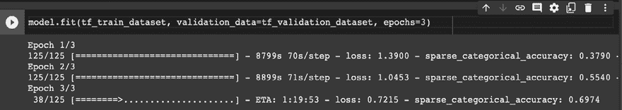

图 6.16：在 Colab 笔记本上微调 BERT

接下来，我们将介绍 TFHub。

## TFHub

在上一节中，我们讨论了如何使用 Hugging Face Transformer 库。现在，我们将看看另一个名为 TFHub 的库，网址为[`tfhub.dev/`](https://tfhub.dev/)。TensorFlow Hub 是一个包含经过训练的机器学习模型的库，这些模型可以进行微调并部署到任何地方。其核心思想是仅需几行代码，就能重用像 BERT 和 Faster R-CNN 这样的预训练模型。

使用 TFHub 就像写几行代码一样简单。让我们来看一个简单的例子，其中我们加载一个预训练模型来计算嵌入。在这个例子中，我们使用`nnlm-en-dim128`，这是一个基于标记的文本嵌入模型，经过英语 Google News 200B 语料库的训练：

```py
!pip install --upgrade tensorflow_hub
import tensorflow_hub as hub
model = hub.KerasLayer("https://tfhub.dev/google/nnlm-en-dim128/2")
embeddings = model(["The rain in Spain.", "falls",
                    "mainly", "In the plain!"])
print(embeddings.shape)  #(4,128) 
```

现在让我们看看如何使用 BERT。此代码改编自[`www.tensorflow.org/hub/tutorials/bert_experts`](https://www.tensorflow.org/hub/tutorials/bert_experts)，也可以在 Hugging Face 上找到([`huggingface.co/docs/transformers/training`](https://huggingface.co/docs/transformers/training))：

1.  让我们设置环境并导入一些有用的模块：

    ```py
    !pip install seaborn
    !pip install sklearn
    !pip install tensorflow_hub
    !pip install tensorflow_text
    import seaborn as sns
    from sklearn.metrics import pairwise
    import tensorflow as tf
    import tensorflow_hub as hub
    import tensorflow_text as text  # Imports TF ops for preprocessing. 
    ```

1.  让我们定义几个句子，用于比较它们之间的相似度：

    ```py
    sentences = [
        "Do not pity the dead, Harry. Pity the living, and, above all those who live without love.",
        "It is impossible to manufacture or imitate love",
        "Differences of habit and language are nothing at all if our aims are identical and our hearts are open.",
        "What do I care how he looks? I am good-looking enough for both of us, I theenk! All these scars show is zat my husband is brave!",
        "Love as powerful as your mother's for you leaves it's own mark. To have been loved so deeply, even though the person who loved us is gone, will give us some protection forever.",
        "Family…Whatever yeh say, blood's important. . . .",
        "I cared more for your happiness than your knowing the truth, more for your peace of mind than my plan, more for your life than the lives that might be lost if the plan failed."
    ] 
    ```

1.  然后，让我们使用 TFHub 上的预训练 BERT 模型来计算输入句子的嵌入。BERT 的输出就是这些嵌入本身：

    ```py
    #@title Configure the model { run: "auto" }
    BERT_MODEL = "https://tfhub.dev/google/experts/bert/wiki_books/2" # @param {type: "string"} ["https://tfhub.dev/google/experts/bert/wiki_books/2", "https://tfhub.dev/google/experts/bert/wiki_books/mnli/2", "https://tfhub.dev/google/experts/bert/wiki_books/qnli/2", "https://tfhub.dev/google/experts/bert/wiki_books/qqp/2", "https://tfhub.dev/google/experts/bert/wiki_books/squad2/2", "https://tfhub.dev/google/experts/bert/wiki_books/sst2/2",  "https://tfhub.dev/google/experts/bert/pubmed/2", "https://tfhub.dev/google/experts/bert/pubmed/squad2/2"]
    # Preprocessing must match the model, but all the above use the same.
    PREPROCESS_MODEL = "https://tfhub.dev/tensorflow/bert_en_uncased_preprocess/3"
    preprocess = hub.load(PREPROCESS_MODEL)
    bert = hub.load(BERT_MODEL)
    inputs = preprocess(sentences)
    outputs = bert(inputs) 
    ```

1.  现在让我们定义一些辅助函数，通过`pairwise.cosine_similarity`来展示嵌入之间的相似度：

    ```py
    def plot_similarity(features, labels):
      """Plot a similarity matrix of the embeddings."""
      cos_sim = pairwise.cosine_similarity(features)
      sns.set(font_scale=1.2)
      cbar_kws=dict(use_gridspec=False, location="left")
      g = sns.heatmap(
          cos_sim, xticklabels=labels, yticklabels=labels,
          vmin=0, vmax=1, cmap="Blues", cbar_kws=cbar_kws)
      g.tick_params(labelright=True, labelleft=False)
      g.set_yticklabels(labels, rotation=0)
      g.set_title("Semantic Textual Similarity")
    plot_similarity(outputs["pooled_output"], sentences) 
    ```

有兴趣的读者可以在 Hugging Face 网站上访问 Colab 笔记本（可在[`huggingface.co/docs/transformers/training`](https://huggingface.co/docs/transformers/training)找到），并可视化一个显示句子之间相似度的热图。总的来说，使用 TFHub 与 LLM 一起使用真的很简单，不是吗？

# 评估

评估 transformers 模型需要考虑多种类别的指标，并理解这些类别之间的成本权衡。让我们来看一下主要的指标。

## 质量

transformers 模型的质量可以通过多个常用数据集进行衡量。让我们来看看最常用的几个数据集。

### GLUE

**通用语言理解评估**（**GLUE**）基准是一个用于训练、评估和分析自然语言理解系统的资源集合。GLUE 可以在[`gluebenchmark.com/`](https://gluebenchmark.com/)访问。

GLUE 包括：

+   一个建立在现有数据集上的九个句子或句子对语言理解任务的基准，选择这些数据集是为了覆盖不同的大小、文本类型和难度级别

+   一个设计用于评估和分析模型在广泛语言现象方面的表现的诊断数据集，涵盖自然语言中常见的各种语言现象

+   一个用于跟踪基准测试上表现的公开排行榜，以及一个可视化模型在诊断集上的表现的仪表板

*图 6.17*展示了 2022 年 3 月的 GLUE 仪表板：

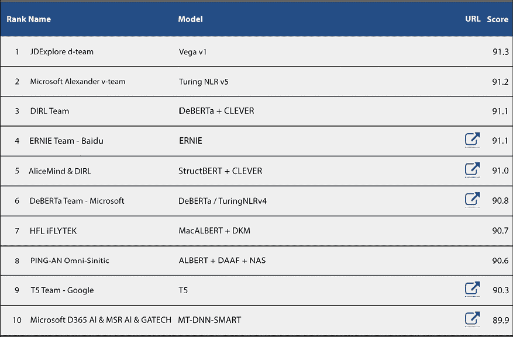

图 6.17：GLUE 仪表板

### SuperGLUE

近年来，新的预训练和迁移学习模型与方法推动了语言理解任务在表现上的显著提升。GLUE 基准提供了一个单一的评分指标，用于总结在多种语言理解任务上的进展，但该基准的表现最近接近非专家人类的水平，表明进一步研究的空间有限。

SuperGLUE 是一个新基准，类似于 GLUE，但提供了一组更困难的语言理解任务、改进的资源以及一个新的公开排行榜。*图 6.18*是 2022 年 3 月的 SuperGLUE 排行榜：

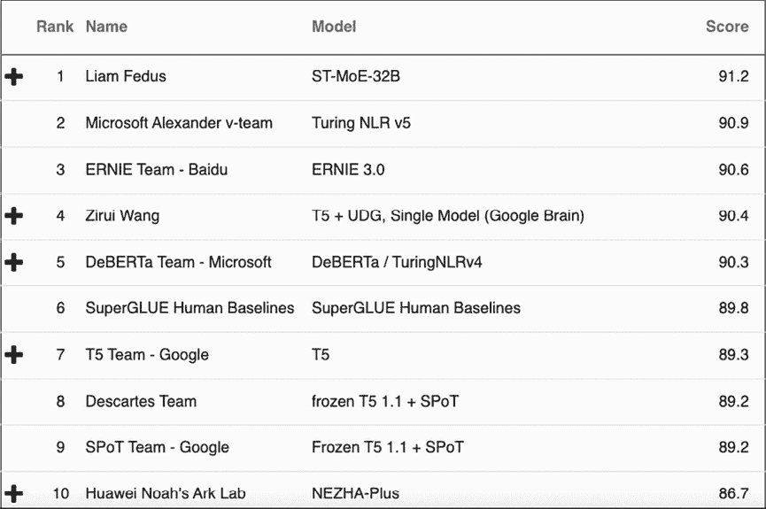

图 6.18：SuperGLUE 排行榜

### SQuAD

SQuAD 是一个用于评估问题与答案的数据集，[`rajpurkar.github.io/SQuAD-explorer/`](https://rajpurkar.github.io/SQuAD-explorer/)。具体而言，**斯坦福问答数据集**（**SQuAD**）是一个阅读理解数据集，包含由群众工作者在一组维基百科文章上提出的问题，每个问题的答案是相应阅读段落中的一段文本或片段，否则该问题可能无法回答。

SQuAD2.0 结合了 SQuAD1.1 中的 100,000 个问题和超过 50,000 个由群众工作者故意编写的无法回答的问题，这些问题看起来与可以回答的问题相似。为了在 SQuAD2.0 中取得好成绩，系统不仅需要在可能的情况下回答问题，还必须判断何时没有答案可以支持该段落，并避免回答。

### RACE

**阅读理解数据集（Examinations）**（**RACE**）是一个机器阅读理解数据集，包含来自英语考试的 27,933 篇文章和 97,867 个问题，目标人群是 12 至 18 岁的中国学生。RACE 包括两个子集，分别是来自初中和高中考试的 RACE-M 和 RACE-H。RACE-M 包含 28,293 个问题，RACE-H 包含 69,574 个问题。每个问题都有四个候选答案，其中一个是正确的。RACE 的数据生成过程与大多数机器阅读理解数据集不同，RACE 中的问题专门设计用于测试人类阅读技能，由领域专家创建，而不是通过启发式方法或众包生成问题和答案。RACE 可在[`www.cs.cmu.edu/~glai1/data/race/`](https://www.cs.cmu.edu/~glai1/data/race/)获取。*图 6.19*展示了 RACE 排行榜：

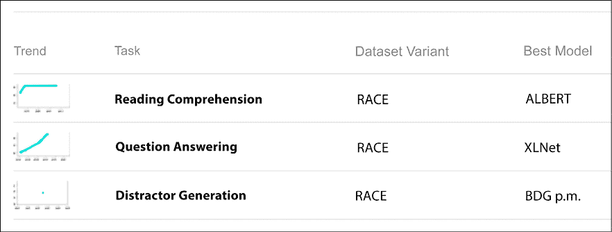

图 6.19：RACE 排行榜

### NLP-progress

NLP-progress 是一个仓库，用于跟踪自然语言处理（NLP）领域的进展，包括最常见的 NLP 任务的数据库和当前的最先进模型。该网站旨在跟踪 NLP 领域的进展，并概述最常见的 NLP 任务及其相应数据集中的最先进模型。NLP-progress 旨在涵盖传统和核心 NLP 任务，如依存句法分析和词性标注，以及更近期的任务，如阅读理解和自然语言推理。如果你需要一个良好的起点来寻找适合你任务的质量指标，那么[`nlpprogress.com/`](http://nlpprogress.com/)是你开始的地方。

## 尺寸

前一节概述了质量指标。本节重点介绍了各种变换器架构中使用的参数数量。如*图 6.20*所示，近年来，变换器的规模竞争愈加激烈。回顾 2018 年，BERT 的规模大约为 3.4 亿参数，到 2021 年，T5 的参数数达到了 110 亿，而 Megatron 突破了 5000 亿参数。最近的 Switch Transformer 拥有超过一万亿个参数，预计很快我们将看到第一个拥有 100 万亿个参数的模型。事实上，有证据表明，模型越大越有优势，它能够记忆信息并进行泛化。然而，训练如此大的模型需要巨大的计算资源：

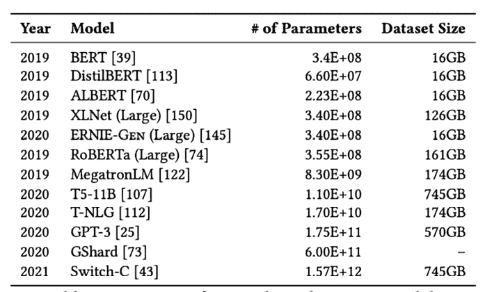

图 6.20：变换器的规模（以十亿个参数为单位）

万亿参数的变换器正在到来！

事实上，论文[`arxiv.org/pdf/1906.02243.pdf`](https://arxiv.org/pdf/1906.02243.pdf)警告了训练大规模模型的可持续性影响（见*图 6.21*），无论是在云计算成本还是二氧化碳排放方面：

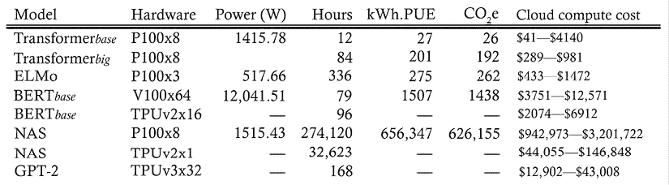

图 6.21：训练模型的成本估算，包括二氧化碳排放（磅）和云计算成本（美元）- 来源：[`arxiv.org/pdf/1906.02243.pdf`](https://arxiv.org/pdf/1906.02243.pdf)

所以，大小并不是唯一能提升变换器质量的因素，因为更大的模型实际上可能只会带来边际上的改进，而且训练它们需要巨大的计算资源。

### 更大并不总意味着更好

2022 年初，出现了一种新趋势，即采用一种混合方法，将大模型与更传统的检索机制结合使用。我们在本章前面讨论过这种方法，当时我们讨论了 RETRO。RETRO 语言模型实现了一种基于外部记忆使用的学习方案。DeepMind 声称，RETRO（或称“检索增强型变换器”）的表现相当于一个神经网络，大小是其原始模型的 25 倍。GPT-3 拥有 1750 亿个参数，而 RETRO 只使用了其中的 70 亿个。当然，这样做需要更少的时间、能量和计算能力来训练。

## 服务成本

提供模型服务的成本取决于多个因素，没有合理的假设很难估算成本。当然，服务成本与模型中的参数数量有关。此外，提交给模型进行推理的查询次数也是一个因素。然后，重要的是考虑是否由云服务提供商管理模型，或者是否在本地基础设施中提供服务。在这种情况下，可能需要记住，MLOps（参见[`en.wikipedia.org/wiki/MLOps`](https://en.wikipedia.org/wiki/MLOps)）是开发机器学习模型并将其部署为生产系统的过程。当然，MLOps 的最佳实践可能被采用来优化服务成本。

在本节中，我们已经看到评估变压器模型的几个关键因素，即质量、大小和服务成本。这个列表显然不是完整的，适当的评估会考虑这些因素之间的最佳折衷。在下一节中，我们将讨论优化。

# 优化

优化变压器模型涉及构建轻量化、响应迅速且能效高的模型。让我们看看优化模型时最常采用的思想。

## 量化

量化的核心思想是通过使用较小的精度来逼近网络的权重。这个想法非常简单，但在实际中效果很好。如果你有兴趣了解更多，我们推荐由 Amir Gholami 等人撰写的论文《*高效神经网络推理的量化方法综述*》，[`arxiv.org/pdf/2103.13630.pdf`](https://arxiv.org/pdf/2103.13630.pdf)。

## 权重剪枝

权重剪枝的核心思想是移除网络中的一些连接。基于幅度的权重剪枝通常在训练过程中将模型权重逐渐归零，从而增加模型的稀疏性。这种简单的技术在模型大小和服务成本方面都有好处，因为基于幅度的权重剪枝会在训练过程中逐渐归零模型权重，从而实现模型稀疏性。稀疏模型更容易压缩，而且在推理时可以跳过零值，从而提高延迟性能。

再说一次，权重剪枝涉及权衡，因为它可能会导致一些质量损失，尽管通常这些损失非常小。如果你有兴趣了解更多，请查看 TensorFlow 关于剪枝的指南：[`www.tensorflow.org/model_optimization/guide/pruning/comprehensive_guide`](https://www.tensorflow.org/model_optimization/guide/pruning/comprehensive_guide)。

## 蒸馏

知识蒸馏的核心思想是训练一个小模型来复制大模型的行为。这种压缩技术有时被称为师生学习。你应该查看的开创性论文是由 Geoffrey Hinton、Oriol Vinyals 和 Jeff Dean 撰写的《*蒸馏神经网络中的知识*》，[`arxiv.org/abs/1503.02531`](https://arxiv.org/abs/1503.02531)。

在过去几年里，我们看到了许多蒸馏后的变换器。例如，DistilBERT 是一个基于 BERT 架构的小型、快速、便宜且轻量的变换器模型。知识蒸馏在预训练阶段进行，以减少 BERT 模型的大小 40%。Hugging Face 提供了一些现成的 Python 脚本，用于蒸馏 seq2seq T5 模型，脚本可在[`github.com/huggingface/transformers/tree/master/examples/research_projects/seq2seq-distillation`](https://github.com/huggingface/transformers/tree/master/examples/research_projects/seq2seq-distillation)找到。使用该脚本非常直观：

```py
python distillation.py --teacher t5-small --data_dir cnn_dm \
--student_decoder_layers 3 --student_encoder_layers 6 --tokenizer_name t5-small \
--learning_rate=3e-4 --freeze_encoder --no_teacher --freeze_embeds \
--do_train --train_batch_size 32 \
--do_predict \
--model_name_or_path t5-small --eval_beams 2 --eval_max_gen_length 142 \
--val_check_interval 0.25 --n_val 1000 \
--output_dir distilt5 --gpus 1 --logger_name wandb 
```

在本节中，我们讨论了优化变换器的一些技术，具体包括量化、权重修剪和蒸馏。接下来，我们将讨论变换器常见的陷阱。

# 常见陷阱：做与不做

在本节中，我们将提供五个必做事项和一些典型的禁止事项，这些建议通常在处理变换器时会被推荐。

## 必做事项

让我们从推荐的最佳实践开始：

+   **使用预训练的大型模型。** 如今，几乎总是从一个已预训练的模型（如 T5）开始比从头训练变换器更为方便。如果你使用一个预训练模型，肯定是在“巨人的肩膀”上站立，想一想吧！

+   **确实要从少量样本学习开始。** 当你开始使用变换器时，通常从一个预训练模型开始，然后进行轻量的少量样本学习是一个不错的选择。通常，这样可以在不产生高计算成本的情况下提高结果的质量。

+   **使用领域数据和客户数据进行微调。** 在玩转预训练模型和少量样本学习之后，你可以考虑在自己的专有数据或公开的领域数据上进行适当的微调。

+   **熟悉变换器的库。** Hugging Face 或 TFHub 提供了几乎所有已知变换器的最先进实现。除非你有一些非常特殊的需求或者在进行创新性研究工作，否则从这些库入手会非常有用。

+   **熟悉最常用的评估指标。** 当你使用变换器时，理想的做法是考虑在质量、大小、服务成本以及许多其他因素之间的权衡。

## 不要做的事

现在让我们来看看一些你应该避免的陷阱！

+   **不要使用非常大的模型作为起点。** 大型模型在训练和服务上都有一定的成本。你需要大量的资源进行微调，而且每次查询的服务成本可能也很高。最好从较小的模型开始，并了解它们是否能够满足你的质量需求。

+   **不要使用未优化的模型。** 如今，量化、修剪和蒸馏是标准技术，任何投入生产的变换器系统都需要使用这些技术。

在本节中，我们已经了解了一些变换器的最佳实践。在下一节中，我们将讨论这些架构的未来解决方案。

# 变换器的未来

变换器最初应用于自然语言处理任务，而卷积神经网络（CNN）通常用于图像处理系统。最近，变换器开始成功地应用于视觉处理任务。视觉变换器计算图像中各个小区域（例如，16 x 16 像素）之间的像素关系。这一方法在 Alexey Dosovitskiy 等人所写的研讨会论文*An Image is Worth 16x16 Words: Transformers for Image Recognition at Scale*中被提出，论文链接为[`arxiv.org/abs/2010.11929`](https://arxiv.org/abs/2010.11929)，旨在使注意力计算变得可行。

**视觉变换器**（**ViTs**）如今已被用于复杂的应用，如自动驾驶。特斯拉的工程师展示了他们的特斯拉自动驾驶系统在汽车的多摄像头系统中使用了变换器。当然，ViTs 也用于更传统的计算机视觉任务，包括但不限于图像分类、目标检测、视频深度伪造检测、图像分割、异常检测、图像合成和聚类分析。其结果通常优于 CNN。

另一个需要考虑的方向是少样本学习（FSL）。少样本学习是指通过提供非常少量的训练数据来指导机器学习模型的预测，就像在推理时提供几个示例，而与标准的微调技术不同，后者需要相对大量的训练数据，才能使预训练模型适应所需任务并达到较高的准确性。

因此，为特定任务训练的模型可以以非常低的成本被重新用于全新的任务。例如，假设我们训练了一个文本生成模型。然后，我们希望执行新的任务，如翻译或总结。我们所做的就是提供一些翻译示例（比如一对对手动翻译的文本），或者一些总结示例（同样是几对示例）。仅此而已，不需要重新训练或微调训练。

由于 FSL 已被证明在多个不断扩展的领域中表现良好，因此不要惊讶于未来的人工智能训练阶段将变得越来越不重要。更多信息可以参考这篇论文，*Code Generation Tools (Almost) for Free? A Study of Few-Shot, Pre-Trained Language Models on Code*，作者为 Patrick Bareiß、Beatriz Souza、Marcelo d’Amorim 和 Michael Pradel。作者提出使用 FSL 通过 CodeGen 生成编程代码，CodeGen 是一个开源程序合成模型（见[`github.com/salesforce/CodeGen`](https://github.com/salesforce/CodeGen)）。

# 总结

在这一章中，我们讨论了变压器模型，这是一种深度学习架构，已经彻底改变了传统的自然语言处理领域。我们首先回顾了架构背后的关键直觉，并介绍了各种类别的变压器以及对最流行模型的深入分析。然后，我们重点讲解了基于原始架构和流行库（如 Hugging Face 和 TFHub）的实现。接着，我们简要讨论了评估、优化和在使用变压器时常见的最佳实践。最后一部分着重回顾了变压器如何应用于计算机视觉任务，这是一个与自然语言处理完全不同的领域。这需要对注意力机制进行细致的定义。最终，注意力是你所需要的一切！在注意力的核心，仅仅是向量之间的余弦相似度。

下一章将专注于无监督学习。

# 加入我们书籍的 Discord 空间

加入我们的 Discord 社区，结识志同道合的人，与 2000 多名成员一起学习，链接：[`packt.link/keras`](https://packt.link/keras)


