# 第八章：自编码器

自编码器是通过无监督学习（有时也称为半监督学习）来学习的，因为输入也被视为目标。在本章中，你将学习并实现不同类型的自编码器，最终学习如何堆叠自编码器。我们还将看到如何使用自编码器生成 MNIST 数字，最后，介绍构建长短期记忆自编码器生成句子向量的步骤。本章包含以下主题：

+   普通自编码器

+   稀疏自编码器

+   去噪自编码器

+   卷积自编码器

+   堆叠自编码器

+   使用 LSTM 自编码器生成句子

+   变分自编码器生成图像

本章的所有代码文件可以在[`packt.link/dltfchp8`](https://packt.link/dltfchp8)找到

让我们开始吧！

# 自编码器简介

自编码器是一类神经网络，试图通过反向传播将输入重建为目标。自编码器由两部分组成：编码器和解码器。编码器读取输入并将其压缩成紧凑的表示，解码器则读取这个紧凑的表示并从中重建输入。换句话说，自编码器通过最小化重建误差来尝试学习恒等函数。

它们具有学习数据紧凑表示的固有能力。它们处于深度信念网络的核心，广泛应用于图像重建、聚类、机器翻译等多个领域。

你可能认为使用深度神经网络实现恒等函数很无聊；然而，之所以有趣，是因为实现的方式。自编码器中的隐藏单元数通常少于输入（和输出）单元的数量。这迫使编码器学习输入的压缩表示，而解码器则从中进行重建。如果输入数据中存在某种结构，比如输入特征之间的相关性，那么自编码器将会发现这些相关性，并最终学习到类似于**主成分分析**（**PCA**）所学到的低维表示。

虽然 PCA 使用线性变换，但自编码器则使用非线性变换。

一旦自编码器训练完成，我们通常会丢弃解码器组件，只使用编码器组件来生成输入的紧凑表示。或者，我们也可以将编码器用作特征检测器，生成输入的紧凑且语义丰富的表示，并通过将 softmax 分类器附加到隐藏层来构建分类器。

自编码器的编码器和解码器组件可以使用稠密、卷积或递归网络来实现，这取决于所建模的数据类型。例如，稠密网络可能是用于构建**协同过滤**（**CF**）模型的自编码器的不错选择，在这种模型中，我们基于实际的稀疏用户评分学习用户偏好的压缩模型。类似地，卷积神经网络可能适用于文章*《iSee: Using Deep Learning to Remove Eyeglasses from Faces》*中描述的用例，作者为 M. Runfeldt。另一方面，递归网络对于处理顺序或文本数据的自编码器是一个不错的选择，例如《深度患者：从电子健康记录中预测患者未来的无监督表示》(*Deep Patient: An Unsupervised Representation to Predict the Future of Patients from the Electronic Health Records*, Miotto 等)和跳跃思维向量（skip-thought vectors）。

我们可以将自编码器看作由两个级联网络组成。第一个网络是编码器，它接收输入`x`，并通过变换`h`将其编码为编码信号`y`，即：

*y = h*(`x`)

第二个网络使用编码信号`y`作为输入，执行另一个变换`f`，得到重建信号`r`，即：

*r = f*(`y`) *= f*(`h`(`x`))

我们将误差定义为`e`，即原始输入`x`与重建信号`r`之间的差异，*e = x - r*。然后，网络通过减少损失函数（例如，**均方误差**（**MSE**））来学习，误差像**多层感知机**（**MLP**）中那样向后传播到隐藏层。

根据编码层相对于输入的实际维度、损失函数和约束条件，存在多种类型的自编码器：变分自编码器、稀疏自编码器、去噪自编码器和卷积自编码器。

自编码器还可以通过依次堆叠编码器来堆叠，编码器将其输入压缩为越来越小的表示，然后按相反顺序堆叠解码器。堆叠自编码器具有更强的表达能力，连续层的表示捕捉了输入的层次化分组，类似于卷积神经网络中的卷积和池化操作。

堆叠自编码器曾经是按层训练的。例如，在*图 8.1*中的网络，我们首先训练`X`层，通过隐藏层**H1**重建**X’**层（忽略**H2**）。然后，我们训练**H1**层，通过隐藏层**H2**重建**H1’**层。最后，我们将所有层堆叠在一起，按所示配置进行微调，以便从`X`重建**X’**。然而，随着如今更好的激活函数和正则化函数的出现，训练这些网络时通常会一次性训练整个网络：

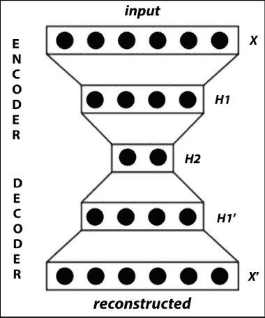

图 8.1：堆叠自编码器的可视化

在本章中，我们将学习自编码器中的这些变化，并使用 TensorFlow 实现它们。

# 简单自编码器

简单自编码器，正如 Hinton 在他 2006 年的论文《使用神经网络减少数据维度》中提出的那样，仅包含一个隐藏层。隐藏层中的神经元数量少于输入层（或输出层）中的神经元数量。

这会导致信息流在网络中的瓶颈效应。编码器输入和解码器输出之间的隐藏层（`y`）也被称为“瓶颈层”。自编码器中的学习过程包括在隐藏层上开发输入信号的紧凑表示，以便输出层可以忠实地重建原始输入。

在*图 8.2*中，您可以看到一个简单自编码器的架构：

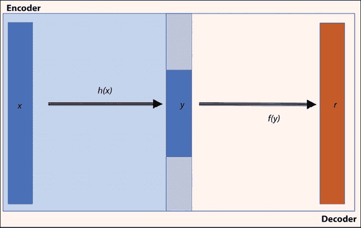

图 8.2：简单自编码器架构

让我们尝试构建一个简单自编码器。在论文中，Hinton 使用它进行维度减少，而在接下来的代码中，我们将使用自编码器进行图像重建。我们将使用 MNIST 数据库训练自编码器，并用它来重建测试图像。在代码中，我们将使用 TensorFlow Keras 的`Layers`类来构建我们自己的编码器和解码器层，因此首先让我们了解一下`Layers`类。

## TensorFlow Keras 层 ‒ 定义自定义层

TensorFlow 提供了一种简单的方法，允许您从零开始或将现有层组合起来定义自定义层。TensorFlow Keras 的`layers`包定义了一个`Layers`对象。我们可以通过将其作为`Layers`类的子类来创建自己的层。在定义层时，必须定义输出的维度。尽管输入维度是可选的，但如果不定义，系统将自动从数据中推断出来。要构建我们自己的层，我们需要实现三个方法：

+   `__init__()`：在这里，您定义所有与输入无关的初始化。

+   `build()`：在这里，我们定义输入张量的形状，并根据需要执行其他初始化。在我们的示例中，由于没有显式定义输入形状，我们无需定义`build()`方法。

+   `call()`：这是执行前向计算的地方。

使用`tensorflow.keras.layers.Layer`类，我们现在定义编码器和解码器层。首先，从编码器层开始。我们导入`tensorflow.keras`为`K`，并创建一个`Encoder`类。`Encoder`接收输入并生成隐藏层或瓶颈层作为输出：

```py
class Encoder(K.layers.Layer):
    def __init__(self, hidden_dim):
        super(Encoder, self).__init__()
        self.hidden_layer = K.layers.Dense(units=hidden_dim, activation=tf.nn.relu)
    def call(self, input_features):
        activation = self.hidden_layer(input_features)
        return activation 
```

接下来，我们定义`Decoder`类；该类接收来自`Encoder`的输出，并通过一个全连接神经网络传递。目标是能够重建`Encoder`的输入：

```py
class Decoder(K.layers.Layer):
    def __init__(self, hidden_dim, original_dim):
        super(Decoder, self).__init__()
        self.output_layer = K.layers.Dense(units=original_dim, activation=tf.nn.relu)
    def call(self, encoded):
        activation = self.output_layer(encoded)
        return activation 
```

现在我们已经定义了编码器和解码器，我们使用`tensorflow.keras.Model`对象来构建自动编码器模型。你可以在以下代码中看到，在`__init__()`函数中我们实例化了编码器和解码器对象，在`call()`方法中我们定义了信号流。还请注意在`_init__()`中初始化的成员列表`self.loss`：

```py
class Autoencoder(K.Model):
    def __init__(self, hidden_dim, original_dim):
        super(Autoencoder, self).__init__()
        self.loss = []
        self.encoder = Encoder(hidden_dim=hidden_dim)
        self.decoder = Decoder(hidden_dim=hidden_dim, original_dim=original_dim)
    def call(self, input_features):
        encoded = self.encoder(input_features)
        reconstructed = self.decoder(encoded)
        return reconstructed 
```

在下一节中，我们将使用这里定义的自动编码器来重建手写数字。

## 使用自动编码器重建手写数字

现在我们已经准备好了包含编码器和解码器层的自动编码器模型，让我们尝试重建手写数字。完整的代码可以在本章的 GitHub 仓库中找到，文件名为`VanillaAutoencoder.ipynb`。代码将需要 NumPy、TensorFlow 和 Matplotlib 模块：

```py
import numpy as np
import tensorflow as tf
import tensorflow.keras as K
import matplotlib.pyplot as plt 
```

在实际实现之前，我们还需要定义一些超参数。如果你尝试调整这些超参数，你会注意到，尽管模型的架构保持不变，但模型性能却有显著变化。超参数调优（有关更多细节，请参阅*第一章*，*使用 TF 的神经网络基础*）是深度学习中的一个重要步骤。为了保证可重复性，我们为随机计算设置了种子：

```py
np.random.seed(11)
tf.random.set_seed(11)
batch_size = 256
max_epochs = 50
learning_rate = 1e-3
momentum = 8e-1
hidden_dim = 128
original_dim = 784 
```

对于训练数据，我们使用的是 TensorFlow 数据集中的 MNIST 数据集。我们将数据归一化，使得像素值位于[0,1]之间；这通过将每个像素元素除以 255 来实现。

我们将张量从 2D 重塑为 1D。我们使用`from_tensor_slices`函数生成一个批量数据集，并沿着第一个维度对训练数据集进行切片（切片的张量）。另外请注意，我们没有使用独热编码标签；这是因为我们并没有使用标签来训练网络，因为自动编码器是通过无监督学习进行学习的：

```py
(x_train, _), (x_test, _) = K.datasets.mnist.load_data()
x_train = x_train / 255.
x_test = x_test / 255.
x_train = x_train.astype(np.float32)
x_test = x_test.astype(np.float32)
x_train = np.reshape(x_train, (x_train.shape[0], 784))
x_test = np.reshape(x_test, (x_test.shape[0], 784))
training_dataset = tf.data.Dataset.from_tensor_slices(x_train).batch(batch_size) 
```

现在我们实例化我们的自动编码器模型对象，并定义训练时使用的损失函数和优化器。仔细观察损失函数的公式；它仅仅是原始图像与重建图像之间的差异。你可能会发现，*重建损失*这一术语也常在许多书籍和论文中用来描述它：

```py
autoencoder = Autoencoder(hidden_dim=hidden_dim, original_dim=original_dim)
opt = tf.keras.optimizers.Adam(learning_rate=1e-2)
def loss(preds, real):
    return tf.reduce_mean(tf.square(tf.subtract(preds, real))) 
```

我们的自定义自动编码器模型将定义一个自定义训练过程，而不是使用自动训练循环。我们使用`tf.GradientTape`来记录梯度计算，并隐式地将梯度应用于模型的所有可训练变量：

```py
def train(loss, model, opt, original):
    with tf.GradientTape() as tape:
        preds = model(original)
        reconstruction_error = loss(preds, original)
        gradients = tape.gradient(reconstruction_error, model.trainable_variables)
        gradient_variables = zip(gradients, model.trainable_variables)
    opt.apply_gradients(gradient_variables)
    return reconstruction_error 
```

上述的`train()`函数将在训练循环中调用，并将数据集以批次的形式输入到模型中：

```py
def train_loop(model, opt, loss, dataset, epochs=20):
    for epoch in range(epochs):
        epoch_loss = 0
        for step, batch_features in enumerate(dataset):
            loss_values = train(loss, model, opt, batch_features)
            epoch_loss += loss_values
        model.loss.append(epoch_loss)
        print('Epoch {}/{}. Loss: {}'.format(epoch + 1, epochs, epoch_loss.numpy())) 
```

现在我们来训练我们的自动编码器：

```py
train_loop(autoencoder, opt, loss, training_dataset, epochs=max_epochs) 
```

并绘制我们的训练图：

```py
plt.plot(range(max_epochs), autoencoder.loss)
plt.xlabel('Epochs')
plt.ylabel('Loss')
plt.show() 
```

训练图如下所示。我们可以看到，随着网络的学习，损失/成本在减少，并且在 50 个训练周期后几乎保持不变，这意味着进一步增加训练周期将不会有帮助。如果我们希望进一步提高训练效果，我们应该改变像学习率和`batch_size`这样的超参数：

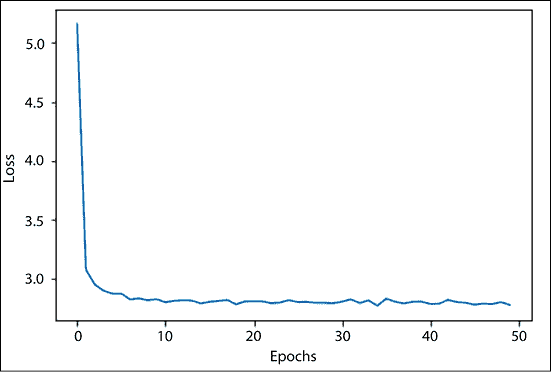

图 8.3：基础自编码器的损失曲线

在*图 8.4*中，你可以看到原始图像（上）和重建图像（下）；它们略显模糊，但仍然准确：

```py
number = 10  # how many digits we will display
plt.figure(figsize=(20, 4))
for index in range(number):
    # display original
    ax = plt.subplot(2, number, index + 1)
    plt.imshow(x_test[index].reshape(28, 28), cmap='gray')
    ax.get_xaxis().set_visible(False)
    ax.get_yaxis().set_visible(False)
    # display reconstruction
    ax = plt.subplot(2, number, index + 1 + number)
    plt.imshow(autoencoder(x_test)[index].numpy().reshape(28, 28), cmap='gray')
    ax.get_xaxis().set_visible(False)
    ax.get_yaxis().set_visible(False)
plt.show() 
```

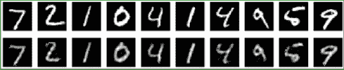

图 8.4：使用基础自编码器的原始图像与重建图像

有趣的是，在前面的代码中，我们将输入的维度从 784 减少到 128，并且网络仍然能够重建原始图像。这应该能给你一些关于自编码器在降维方面强大功能的启示。自编码器相较于 PCA 在降维方面的一个优势是，PCA 只能表示线性变换，而我们可以在自编码器中使用非线性激活函数，从而在编码中引入非线性：

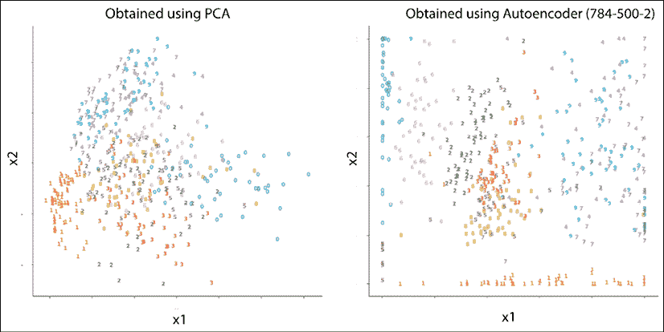

图 8.5：左侧图：通过取所有 60,000 个训练样本的前两个主成分得到的每个类别 500 个数字的二维编码。右侧图：784-500-2 自编码器找到的二维编码

*图 8.5* 比较了 PCA 和堆叠自编码器的结果，堆叠自编码器的结构为 784-500-2（这里的数字代表每个自编码器中编码器层的大小；这些自编码器具有对称的解码器）。

你可以看到右侧的彩色点被很好地分开，因此，堆叠自编码器相比 PCA 给出了更好的结果。现在你已经熟悉了基础自编码器，接下来让我们看看不同类型的自编码器及其实现细节。

# 稀疏自编码器

我们在上一节中讨论的自编码器更像是一个恒等网络；它只是简单地重建输入。重点在于在像素级别重建图像，唯一的约束是瓶颈层中的单元数。虽然像素级重建很有趣，但它主要是一个压缩机制，并不一定确保网络从数据集中学习到抽象特征。我们可以通过增加进一步的约束来确保网络从数据集中学习到抽象特征。

在稀疏自编码器中，增加了一个稀疏惩罚项到重建误差中。这会确保瓶颈层中在任何给定时间点只有较少的单元被激活。我们可以将稀疏惩罚项加入到编码器层中。

在以下代码中，你可以看到`Encoder`的稠密层现在增加了一个额外的参数`activity_regularizer`：

```py
class SparseEncoder(K.layers.Layer):
    def __init__(self, hidden_dim):
        # encoder initializer
        super(SparseEncoder, self).__init__()
        self.hidden_layer = K.layers.Dense(units=hidden_dim, activation=tf.nn.relu, activity_regularizer=regularizers.l1(10e-5))
    def call(self, input_features):
        # forward function
        activation = self.hidden_layer(input_features)
        return activation 
```

活动正则化器尝试减少层的输出（参考*第一章*，*TF 中的神经网络基础*）。它将减少全连接层的权重和偏差，以确保输出尽可能小。TensorFlow 支持三种类型的`activity_regularizer`：

+   `l1`：这里的活动计算为绝对值的和。

+   `l2`：这里的活动计算为平方值的和。

+   `l1_l2`：这包括 L1 和 L2 项。

保持代码其他部分不变，仅更改编码器，你可以从基础自编码器得到稀疏自编码器。稀疏自编码器的完整代码在 Jupyter 笔记本`SparseAutoencoder.ipynb`中。

或者，你也可以在损失函数中显式地添加一个稀疏正则化项。为此，你需要将稀疏项的正则化实现为一个函数。如果`m`是输入模式的总数，那么我们可以定义一个量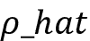（你可以在 Andrew Ng 的讲座中查看数学细节：[`web.stanford.edu/class/cs294a/sparseAutoencoder_2011new.pdf`](https://web.stanford.edu/class/cs294a/sparseAutoencoder_2011new.pdf)），它衡量每个隐藏层单元的净活动（即它平均多少次激活）。基本思想是设定一个约束，使其等于稀疏参数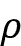。这样就会在损失函数中添加一个稀疏正则化项，使得损失函数变为：

*损失 = 均方误差 + 稀疏参数的正则化*

这个正则化项会惩罚网络，如果偏离。一种标准的做法是使用**Kullback-Leiber**（**KL**）散度（你可以通过这场有趣的讲座了解更多关于 KL 散度的内容：[`www.stat.cmu.edu/~cshalizi/754/2006/notes/lecture-28.pdf`](https://www.stat.cmu.edu/~cshalizi/754/2006/notes/lecture-28.pdf)），来计算和之间的差异。

让我们更深入地探讨一下 KL 散度，`D`[KL]。它是一个非对称的度量，用于衡量两个分布之间的差异，在我们这个例子中，指的是和之间的差异。当和相等时，差异为零；否则，当偏离时，差异会单调增加。数学表达式为：

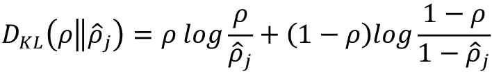

我们将其添加到损失函数中，以隐式地包含稀疏项。我们需要为稀疏项设定一个常数值，并使用编码器输出计算。

输入的紧凑表示存储在权重中。让我们可视化网络学习到的权重。以下是标准自编码器和稀疏自编码器的编码器层权重。

我们可以看到，在标准自编码器（a）中，许多隐藏单元具有非常大的权重（较亮），这表明它们被过度使用，而稀疏自编码器（b）的所有隐藏单元几乎均等地学习输入表示，我们看到颜色分布更加均匀：

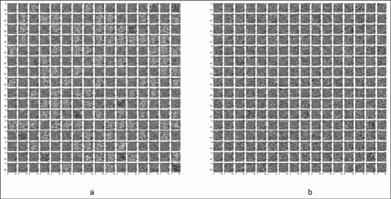

图 8.6：编码器权重矩阵（a）标准自编码器和（b）稀疏自编码器

现在我们已经了解了稀疏自编码器，接下来我们转向自编码器能够从图像中去除噪声的案例。

# 去噪自编码器

我们在前面的部分中讨论的两个自编码器是欠完备自编码器的例子，因为它们的隐藏层相比输入（输出）层具有较低的维度。去噪自编码器属于完备自编码器类别，因为当隐藏层的维度大于输入层时，它们的效果更好。

去噪自编码器从受损（噪声）输入中学习；它将噪声输入传递给编码器网络，然后解码器重建的图像与原始输入进行比较。其目的是帮助网络学习如何去噪输入。它将不再仅仅进行像素级的比较，而是为了去噪，它将学习邻近像素的信息。

去噪自编码器与其他自编码器的主要区别有两点：首先，`n_hidden`，即瓶颈层中的隐藏单元数大于输入层中的单元数`m`，即`n_hidden` > `m`。其次，编码器的输入是受损的输入。

为了实现这一点，我们在测试和训练图像中添加噪声项：

```py
noise = np.random.normal(loc=0.5, scale=0.5, size=x_train.shape)
x_train_noisy = x_train + noise
noise = np.random.normal(loc=0.5, scale=0.5, size=x_test.shape)
x_test_noisy = x_test + noise
x_train_noisy = np.clip(x_train_noisy, 0., 1.)
x_test_noisy = np.clip(x_test_noisy, 0., 1.) 
```

接下来让我们看看去噪自编码器的实际操作。

## 使用去噪自编码器清除图像

让我们使用去噪自编码器来清除手写的 MNIST 数字：

1.  我们首先导入所需的模块：

    ```py
    import numpy as np
    import tensorflow as tf
    import tensorflow.keras as K
    import matplotlib.pyplot as plt 
    ```

1.  接下来，我们定义模型的超参数：

    ```py
    np.random.seed(11)
    tf.random.set_seed(11)
    batch_size = 256
    max_epochs = 50
    learning_rate = 1e-3
    momentum = 8e-1
    hidden_dim = 128
    original_dim = 784 
    ```

1.  我们读取 MNIST 数据集，对其进行归一化处理，并添加噪声：

    ```py
    (x_train, _), (x_test, _) = K.datasets.mnist.load_data()
    x_train = x_train / 255.
    x_test = x_test / 255.
    x_train = x_train.astype(np.float32)
    x_test = x_test.astype(np.float32)
    x_train = np.reshape(x_train, (x_train.shape[0], 784))
    x_test = np.reshape(x_test, (x_test.shape[0], 784))
    # Generate corrupted MNIST images by adding noise with normal dist
    # centered at 0.5 and std=0.5
    noise = np.random.normal(loc=0.5, scale=0.5, size=x_train.shape)
    x_train_noisy = x_train + noise
    noise = np.random.normal(loc=0.5, scale=0.5, size=x_test.shape)
    x_test_noisy = x_test + noise 
    ```

1.  我们使用与*经典自编码器*部分中定义的相同的编码器、解码器和自编码器类：

    ```py
    # Encoder
    class Encoder(K.layers.Layer):
        def __init__(self, hidden_dim):
            super(Encoder, self).__init__()
            self.hidden_layer = K.layers.Dense(units=hidden_dim, activation=tf.nn.relu)
        def call(self, input_features):
            activation = self.hidden_layer(input_features)
            return activation
    # Decoder
    class Decoder(K.layers.Layer):
        def __init__(self, hidden_dim, original_dim):
            super(Decoder, self).__init__()
            self.output_layer = K.layers.Dense(units=original_dim, activation=tf.nn.relu)
        def call(self, encoded):
            activation = self.output_layer(encoded)
            return activation
    class Autoencoder(K.Model):
        def __init__(self, hidden_dim, original_dim):
            super(Autoencoder, self).__init__()
            self.loss = []
            self.encoder = Encoder(hidden_dim=hidden_dim)
            self.decoder = Decoder(hidden_dim=hidden_dim, original_dim=original_dim)
        def call(self, input_features):
            encoded = self.encoder(input_features)
            reconstructed = self.decoder(encoded)
            return reconstructed 
    ```

1.  接下来，我们创建模型并定义损失函数和优化器。请注意，这次我们使用的是更简便的 Keras 内建 `compile()` 和 `fit()` 方法，而不是编写自定义训练循环：

    ```py
    model = Autoencoder(hidden_dim=hidden_dim, original_dim=original_dim)
    model.compile(loss='mse', optimizer='adam')
    loss = model.fit(x_train_noisy,
                x_train,
                validation_data=(x_test_noisy, x_test),
                epochs=max_epochs,
                batch_size=batch_size) 
    ```

1.  现在让我们绘制训练损失图：

    ```py
    plt.plot(range(max_epochs), loss.history['loss'])
    plt.xlabel('Epochs')
    plt.ylabel('Loss')
    plt.show() 
    ```

*图 8.7* 显示了各个时代的损失：

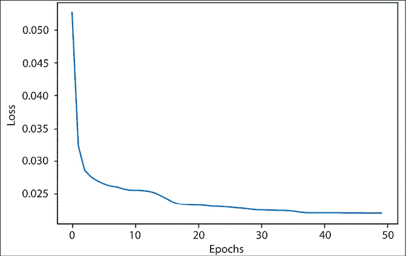

图 8.7：去噪自编码器的损失图

最后，让我们看看我们的模型实际操作：

```py
number = 10  # how many digits we will display
plt.figure(figsize=(20, 4))
for index in range(number):
    # display original
    ax = plt.subplot(2, number, index + 1)
    plt.imshow(x_test_noisy[index].reshape(28, 28), cmap='gray')
    ax.get_xaxis().set_visible(False)
    ax.get_yaxis().set_visible(False)
    # display reconstruction
    ax = plt.subplot(2, number, index + 1 + number)
    plt.imshow(model(x_test_noisy)[index].numpy().reshape(28, 28), cmap='gray')
    ax.get_xaxis().set_visible(False)
    ax.get_yaxis().set_visible(False)
plt.show() 
```

顶排显示的是输入的噪声图像，底排显示的是我们训练后的去噪自编码器生成的清晰图像：

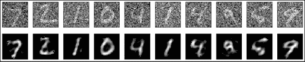

图 8.8：噪声输入图像和对应的去噪重建图像

从噪声图像中重建图像的效果令人印象深刻，相信你会同意。如果你想尝试一下，你可以在笔记本`DenoisingAutoencoder.ipynb`中访问代码。

# 堆叠自编码器

到目前为止，我们只限制自己使用仅有一个隐藏层的自编码器。我们可以通过堆叠多个编码器和解码器层来构建深度自编码器；这种自编码器称为堆叠自编码器。一个编码器提取的特征会作为输入传递给下一个编码器。堆叠自编码器可以作为一个整体网络进行训练，目标是最小化重建误差。或者，每个单独的编码器/解码器网络可以先使用你之前学过的无监督方法进行预训练，然后对整个网络进行微调。当深度自编码器网络是卷积网络时，我们称之为**卷积自编码器**。接下来，我们将在 TensorFlow 中实现一个卷积自编码器。

## 用于去除图像噪声的卷积自编码器

在上一部分，我们从噪声输入图像中重建了手写数字。我们使用了一个全连接网络作为编码器和解码器。然而，我们知道，对于图像来说，卷积网络能够提供更好的结果，所以在本节中，我们将使用卷积网络作为编码器和解码器。为了获得更好的结果，我们将在编码器和解码器网络中使用多个卷积层；也就是说，我们将堆叠卷积层（以及最大池化或上采样层）。我们还将训练整个自编码器作为一个整体：

1.  我们从`tensorflow.keras.layers`导入所有必需的模块和特定层：

    ```py
    import numpy as np
    import tensorflow as tf
    import tensorflow.keras as K
    import matplotlib.pyplot as plt
    from tensorflow.keras.layers import Dense, Conv2D, MaxPooling2D, UpSampling2D 
    ```

1.  我们指定了超参数。如果你仔细观察，你会发现这个列表与早期的自编码器实现略有不同；这次我们关注的是卷积层的过滤器，而不是学习率和动量：

    ```py
    np.random.seed(11)
    tf.random.set_seed(11)
    batch_size = 128
    max_epochs = 50
    filters = [32,32,16] 
    ```

1.  在下一步中，我们读取数据并进行预处理。同样，你可能会注意到与之前的代码相比有一些微小的变化，尤其是在添加噪声和将值限制在[0-1]之间的方式上。我们这样做是因为在这种情况下，我们将使用二元交叉熵损失，而不是均方误差损失，并且解码器的最终输出将通过 sigmoid 激活，将其限制在[0-1]之间：

    ```py
    (x_train, _), (x_test, _) = K.datasets.mnist.load_data()
    x_train = x_train / 255.
    x_test = x_test / 255.
    x_train = np.reshape(x_train, (len(x_train),28, 28, 1))
    x_test = np.reshape(x_test, (len(x_test), 28, 28, 1))
    noise = 0.5
    x_train_noisy = x_train + noise * np.random.normal(loc=0.0, scale=1.0, size=x_train.shape)
    x_test_noisy = x_test + noise * np.random.normal(loc=0.0, scale=1.0, size=x_test.shape)
    x_train_noisy = np.clip(x_train_noisy, 0, 1)
    x_test_noisy = np.clip(x_test_noisy, 0, 1)
    x_train_noisy = x_train_noisy.astype('float32')
    x_test_noisy = x_test_noisy.astype('float32')
    #print(x_test_noisy[1].dtype) 
    ```

1.  现在我们来定义编码器。编码器由三层卷积层组成，每一层后跟一个最大池化层。由于我们使用的是 MNIST 数据集，输入图像的形状为 28 × 28（单通道），而输出图像的大小为 4 × 4（由于最后一层卷积层有 16 个滤波器，图像有 16 个通道）：

    ```py
    class Encoder(K.layers.Layer):
        def __init__(self, filters):
            super(Encoder, self).__init__()
            self.conv1 = Conv2D(filters=filters[0], kernel_size=3, strides=1, activation='relu', padding='same')
            self.conv2 = Conv2D(filters=filters[1], kernel_size=3, strides=1, activation='relu', padding='same')
            self.conv3 = Conv2D(filters=filters[2], kernel_size=3, strides=1, activation='relu', padding='same')
            self.pool = MaxPooling2D((2, 2), padding='same')

        def call(self, input_features):
            x = self.conv1(input_features)
            x = self.pool(x)
            x = self.conv2(x)
            x = self.pool(x)
            x = self.conv3(x)
            x = self.pool(x)
            return x 
    ```

1.  接下来是解码器。它在设计上与编码器完全相反，且我们不使用最大池化，而是使用上采样来恢复尺寸。注意那些被注释掉的`print`语句；你可以通过它们来理解每一步之后形状是如何变化的。（或者，你也可以使用`model.summary`函数来获取完整的模型概述。）另外需要注意的是，编码器和解码器依然是基于 TensorFlow Keras 的`Layers`类，但现在它们内部有多个层。现在你知道如何构建一个复杂的自定义层了：

    ```py
    class Decoder(K.layers.Layer):
        def __init__(self, filters):
            super(Decoder, self).__init__()
            self.conv1 = Conv2D(filters=filters[2], kernel_size=3, strides=1, activation='relu', padding='same')
            self.conv2 = Conv2D(filters=filters[1], kernel_size=3, strides=1, activation='relu', padding='same')
            self.conv3 = Conv2D(filters=filters[0], kernel_size=3, strides=1, activation='relu', padding='valid')
            self.conv4 = Conv2D(1, 3, 1, activation='sigmoid', padding='same')
            self.upsample = UpSampling2D((2, 2))
        def call(self, encoded):
            x = self.conv1(encoded)
            #print("dx1", x.shape)
            x = self.upsample(x)
            #print("dx2", x.shape)
            x = self.conv2(x)
            x = self.upsample(x)
            x = self.conv3(x)
            x = self.upsample(x)
            return self.conv4(x) 
    ```

1.  我们将编码器和解码器结合起来，构建一个自动编码器模型。这与之前完全相同：

    ```py
    class Autoencoder(K.Model):
        def __init__(self, filters):
            super(Autoencoder, self).__init__()
            self.encoder = Encoder(filters)
            self.decoder = Decoder(filters)
        def call(self, input_features):
            #print(input_features.shape)
            encoded = self.encoder(input_features)
            #print(encoded.shape)
            reconstructed = self.decoder(encoded)
            #print(reconstructed.shape)
            return reconstructed 
    ```

1.  现在我们实例化我们的模型，然后在`compile()`方法中指定二元交叉熵作为损失函数，Adam 作为优化器。接着，使用训练数据集来训练模型：

    ```py
    model = Autoencoder(filters)
    model.compile(loss='binary_crossentropy', optimizer='adam')
    loss = model.fit(x_train_noisy,
                x_train,
                validation_data=(x_test_noisy, x_test),
                epochs=max_epochs,
                batch_size=batch_size) 
    ```

1.  绘制损失曲线：

    ```py
    plt.plot(range(max_epochs), loss.history['loss'])
    plt.xlabel('Epochs')
    plt.ylabel('Loss')
    plt.show() 
    ```

    你可以看到训练过程中的损失曲线；在 50 个 epoch 后，损失降到了 0.0988：

    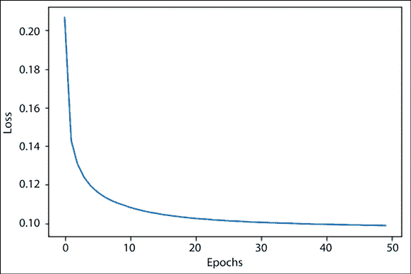

    图 8.9：卷积自动编码器的损失图

1.  最后，你可以看到从噪声输入图像重建出的精彩图像：

    ```py
    number = 10  # how many digits we will display
    plt.figure(figsize=(20, 4))
    for index in range(number):
        # display original
        ax = plt.subplot(2, number, index + 1)
        plt.imshow(x_test_noisy[index].reshape(28, 28), cmap='gray')
        ax.get_xaxis().set_visible(False)
        ax.get_yaxis().set_visible(False)
        # display reconstruction
        ax = plt.subplot(2, number, index + 1 + number)
        plt.imshow(tf.reshape(model(x_test_noisy)[index], (28, 28)), cmap='gray')
        ax.get_xaxis().set_visible(False)
        ax.get_yaxis().set_visible(False)
    plt.show() 
    ```

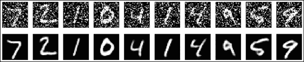

图 8.10：输入的噪声图像和重建的去噪图像

你可以看到，与本章前面介绍的自动编码器相比，这些图像要清晰得多。魔法就在于卷积层的堆叠。该部分的代码可以在 Jupyter 笔记本`ConvolutionAutoencoder.ipynb`中找到。

## 一个 TensorFlow Keras 自动编码器示例 ‒ 句子向量

在这个示例中，我们将构建并训练一个基于 LSTM 的自动编码器，以为 Reuters-21578 语料库中的文档生成句子向量（[`archive.ics.uci.edu/ml/datasets/reuters-21578+text+categorization+collection`](https://archive.ics.uci.edu/ml/datasets/reuters-21578+text+categorization+collection)）。我们已经在*第四章*，*词嵌入*中看到过如何使用词嵌入表示一个单词，从而创建代表该单词在其出现的其他单词上下文中意义的向量。在这里，我们将看到如何为句子构建类似的向量。句子是单词的序列，因此句子向量表示句子的含义。

构建句子向量的最简单方法是将所有单词向量相加，并除以单词的数量。然而，这种方法将句子视为一个单词袋，并没有考虑单词的顺序。因此，句子*The dog bit the man*和*The man bit the dog*在这种情况下会被视为相同。LSTM 被设计为处理序列输入，并考虑单词顺序，因此可以提供更好且更自然的句子表示。

首先，我们导入必要的库：

```py
from sklearn.model_selection import train_test_split
from tensorflow.keras.callbacks import ModelCheckpoint
from tensorflow.keras.layers import Input
from tensorflow.keras.layers import RepeatVector
from tensorflow.keras.layers import LSTM
from tensorflow.keras.layers import Bidirectional
from tensorflow.keras.models import Model
from tensorflow.keras.preprocessing import sequence
from scipy.stats import describe
import collections
import matplotlib.pyplot as plt
import nltk
import numpy as np
import os
from time import gmtime, strftime
from tensorflow.keras.callbacks import TensorBoard
import re
# Needed to run only once
nltk.download('punkt')
nltk.download('reuters')
from nltk.corpus import reuters 
```

如果你正在使用 Google 的 Colab 运行代码，还需要通过向代码中添加以下内容来解压 Reuters 语料库：

```py
%%capture
!unzip /root/nltk_data/corpora/reuters.zip -d /root/nltk_data/corpora 
```

接下来，我们将使用 GloVe 嵌入，因此我们也需要下载它们：

```py
!wget http://nlp.stanford.edu/data/glove.6B.zip
!unzip glove*.zip 
```

现在所有工具都已准备好，我们将首先将每个文本块（文档）转换为一个句子列表，每行一个句子。同时，每个句子的单词在添加时都会进行规范化处理。规范化过程包括去除所有数字并将其替换为数字`9`，然后将单词转换为小写。同时，我们也在同一段代码中计算单词的频率。结果是单词频率表`word_freqs`：

```py
def is_number(n):
    temp = re.sub("[.,-/]", "",n)
    return temp.isdigit()
# parsing sentences and building vocabulary
word_freqs = collections.Counter()
documents = reuters.fileids()
#ftext = open("text.tsv", "r")
sents = []
sent_lens = []
num_read = 0
for i in range(len(documents)):
    # periodic heartbeat report
    if num_read % 100 == 0:
        print("building features from {:d} docs".format(num_read))
    # skip docs without specified topic
    title_body = reuters.raw(documents[i]).lower()
    if len(title_body) == 0:
        continue
    num_read += 1
    # convert to list of word indexes
    title_body = re.sub("\n", "", title_body)
    for sent in nltk.sent_tokenize(title_body):
        for word in nltk.word_tokenize(sent):
            if is_number(word):
                word = "9"
            word = word.lower()
            word_freqs[word] += 1
        sents.append(sent)
        sent_lens.append(len(sent)) 
```

让我们使用之前生成的数组来获取一些关于语料库的信息，这将帮助我们确定 LSTM 网络的常数值：

```py
print("Total number of sentences are: {:d} ".format(len(sents)))
print ("Sentence distribution min {:d}, max {:d} , mean {:3f}, median {:3f}".format(np.min(sent_lens), np.max(sent_lens), np.mean(sent_lens), np.median(sent_lens)))
print("Vocab size (full) {:d}".format(len(word_freqs))) 
```

这为我们提供了关于语料库的以下信息：

```py
Total number of sentences are: 50470 
Sentence distribution min 1, max 3688 , mean 167.072657, median 155.000000
Vocab size (full) 33748 
```

基于这些信息，我们为 LSTM 模型设置了以下常数。我们将`VOCAB_SIZE`设为`5000`；也就是说，我们的词汇表覆盖了最常用的 5,000 个单词，涵盖了语料库中超过 93%的单词。其余的单词被视为**词汇表外**（**OOV**）并替换为`UNK`标记。在预测时，任何模型未见过的单词也将被分配`UNK`标记。`SEQUENCE_LEN`大约设为训练集中文本句子的中位数长度的一半。长度小于`SEQUENCE_LEN`的句子将通过特殊的`PAD`字符进行填充，长度超过的句子将被截断以符合限制：

```py
VOCAB_SIZE = 5000
SEQUENCE_LEN = 50 
```

由于我们的 LSTM 输入是数值型的，因此我们需要构建查找表，以便在单词和单词 ID 之间进行转换。由于我们将词汇表的大小限制为 5,000，并且需要添加两个伪单词`PAD`和`UNK`，因此我们的查找表包含了最常出现的 4,998 个单词以及`PAD`和`UNK`：

```py
word2id = {}
word2id["PAD"] = 0
word2id["UNK"] = 1
for v, (k, _) in enumerate(word_freqs.most_common(VOCAB_SIZE - 2)):
    word2id[k] = v + 2
id2word = {v:k for k, v in word2id.items()} 
```

我们网络的输入是一个单词序列，其中每个单词由一个向量表示。简单来说，我们可以使用每个单词的独热编码（one-hot encoding），但那样会使输入数据非常庞大。因此，我们使用每个单词的 50 维 GloVe 嵌入来编码每个单词。

嵌入向量被生成到一个形状为（`VOCAB_SIZE`，`EMBED_SIZE`）的矩阵中，其中每一行表示我们词汇表中某个单词的 GloVe 嵌入向量。`PAD`和`UNK`行（分别为`0`和`1`）分别用零和随机均匀值填充：

```py
EMBED_SIZE = 50
def lookup_word2id(word):
    try:
        return word2id[word]
    except KeyError:
        return word2id["UNK"]
def load_glove_vectors(glove_file, word2id, embed_size):
    embedding = np.zeros((len(word2id), embed_size))
    fglove = open(glove_file, "rb")
    for line in fglove:
        cols = line.strip().split()
        word = cols[0].decode('utf-8')
        if embed_size == 0:
            embed_size = len(cols) - 1
        if word in word2id:
            vec = np.array([float(v) for v in cols[1:]])
        embedding[lookup_word2id(word)] = vec
    embedding[word2id["PAD"]] = np.zeros((embed_size))
    embedding[word2id["UNK"]] = np.random.uniform(-1, 1, embed_size)
    return embedding 
```

接下来，我们使用这些函数生成嵌入向量：

```py
sent_wids = [[lookup_word2id(w) for w in s.split()] for s in sents]
sent_wids = sequence.pad_sequences(sent_wids, SEQUENCE_LEN)
# load glove vectors into weight matrix
embeddings = load_glove_vectors("glove.6B.{:d}d.txt".format(EMBED_SIZE), word2id, EMBED_SIZE) 
```

我们的自动编码器模型接收一个 GloVe 词向量序列，并学习生成一个与输入序列相似的输出序列。编码器 LSTM 将序列压缩成一个固定大小的上下文向量，解码器 LSTM 则使用这个向量重建原始序列。

网络的示意图如下所示：

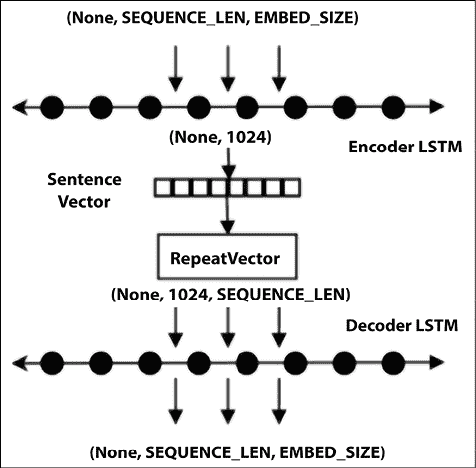

图 8.11：LSTM 网络的可视化

由于输入数据量相当大，我们将使用生成器来生成每一批次的输入。我们的生成器生成形状为（`BATCH_SIZE`，`SEQUENCE_LEN`，`EMBED_SIZE`）的张量批次。这里，`BATCH_SIZE` 是 `64`，并且由于我们使用的是 50 维的 GloVe 向量，所以 `EMBED_SIZE` 是 `50`。我们在每个训练周期开始时对句子进行洗牌，并返回 64 个句子的批次。每个句子都被表示为一个由 GloVe 词向量组成的向量。如果词汇表中的某个单词没有对应的 GloVe 嵌入向量，它将用零向量表示。我们构建了两个生成器实例，一个用于训练数据，一个用于测试数据，分别包含原始数据集的 70%和 30%：

```py
BATCH_SIZE = 64
def sentence_generator(X, embeddings, batch_size):
    while True:
        # loop once per epoch
        num_recs = X.shape[0]
        indices = np.random.permutation(np.arange(num_recs))
        num_batches = num_recs // batch_size
        for bid in range(num_batches):
            sids = indices[bid * batch_size : (bid + 1) * batch_size]
            Xbatch = embeddings[X[sids, :]]
            yield Xbatch, Xbatch
train_size = 0.7
Xtrain, Xtest = train_test_split(sent_wids, train_size=train_size)
train_gen = sentence_generator(Xtrain, embeddings, BATCH_SIZE)
test_gen = sentence_generator(Xtest, embeddings, BATCH_SIZE) 
```

现在我们准备定义自动编码器。如图所示，它由一个编码器 LSTM 和一个解码器 LSTM 组成。编码器 LSTM 读取形状为（`BATCH_SIZE`，`SEQUENCE_LEN`，`EMBED_SIZE`）的张量，表示一批句子。每个句子表示为一个固定长度的填充序列，大小为 `SEQUENCE_LEN`。每个单词表示为一个 300 维的 GloVe 向量。编码器 LSTM 的输出维度是一个超参数，`LATENT_SIZE`，它是后续从训练好的自动编码器中获得的句子向量的大小。维度为 `LATENT_SIZE` 的向量空间表示编码句子意义的潜在空间。LSTM 的输出是每个句子的一个大小为（`LATENT_SIZE`）的向量，因此，对于整个批次，输出张量的形状为（`BATCH_SIZE`，`LATENT_SIZE`）。接下来，将这个输出传递给 `RepeatVector` 层，该层会将其复制到整个序列中；也就是说，该层的输出张量形状为（`BATCH_SIZE`，`SEQUENCE_LEN`，`LATENT_SIZE`）。这个张量接着输入到解码器 LSTM 中，解码器 LSTM 的输出维度是 `EMBED_SIZE`，所以输出张量的形状是（`BATCH_SIZE`，`SEQUENCE_LEN`，`EMBED_SIZE`），也就是与输入张量的形状相同。

我们使用 Adam 优化器和 MSE 损失函数来编译此模型。之所以使用 MSE，是因为我们希望重建一个意义相似的句子，即在维度为`LATENT_SIZE`的嵌入空间中，尽可能接近原始句子：

```py
LATENT_SIZE = 512
EMBED_SIZE = 50
BATCH_SIZE = 64
NUM_EPOCHS = 20
inputs = Input(shape=(SEQUENCE_LEN, EMBED_SIZE), name="input")
encoded = Bidirectional(LSTM(LATENT_SIZE), merge_mode="sum", name="encoder_lstm")(inputs)
decoded = RepeatVector(SEQUENCE_LEN, name="repeater")(encoded)
decoded = Bidirectional(LSTM(EMBED_SIZE, return_sequences=True), merge_mode="sum", name="decoder_lstm")(decoded)
autoencoder = Model(inputs, decoded) 
```

我们将损失函数定义为均方误差，并选择 Adam 优化器：

```py
autoencoder.compile(optimizer="adam", loss="mse") 
```

我们使用以下代码训练自编码器 20 个周期。选择 20 个周期是因为 MSE 损失在此时间内收敛：

```py
num_train_steps = len(Xtrain) // BATCH_SIZE
num_test_steps = len(Xtest) // BATCH_SIZE
steps_per_epoch=num_train_steps,
epochs=NUM_EPOCHS,
validation_data=test_gen,
validation_steps=num_test_steps,
history = autoencoder.fit_generator(train_gen,
                                steps_per_epoch=num_train_steps,
                                epochs=NUM_EPOCHS,
                                validation_data=test_gen,
                                validation_steps=num_test_steps) 
```

训练结果如下所示。下图显示了训练和验证数据的损失图；我们可以看到，随着模型的学习，损失按预期减少：

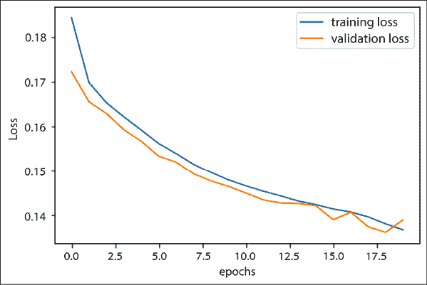

图 8.12：LSTM 自编码器的损失图

由于我们输入的是一个嵌入矩阵，输出也将是一个词嵌入矩阵。由于嵌入空间是连续的，而我们的词汇表是离散的，并非每个输出嵌入都会对应一个词。我们能做的最好的事情是找到一个最接近输出嵌入的词，以便重建原始文本。这有点繁琐，所以我们将以不同的方式评估我们的自编码器。

由于自编码器的目标是产生良好的潜在表示，我们比较了使用原始输入与自编码器输出所产生的潜在向量。

首先，我们将编码器部分提取为独立的网络：

```py
encoder = Model(autoencoder.input, autoencoder.get_layer("encoder_lstm").output) 
```

然后，我们在测试集上运行自编码器以返回预测的嵌入。我们将输入嵌入和预测嵌入通过编码器送入，以从每个向量生成句子向量，并使用*余弦*相似度比较这两个向量。接近“1”的余弦相似度表示高度相似，接近“0”的则表示相似度低。

以下代码在 500 个随机测试句子的子集上运行，并生成一些余弦相似度样本值，这些值表示源嵌入生成的句子向量与自编码器生成的目标嵌入之间的相似度：

```py
def compute_cosine_similarity(x, y):
    return np.dot(x, y) / (np.linalg.norm(x, 2) * np.linalg.norm(y, 2))
k = 500
cosims = np.zeros((k))
i= 0
for bid in range(num_test_steps):
    xtest, ytest = next(test_gen)
    ytest_ = autoencoder.predict(xtest)
    Xvec = encoder.predict(xtest)
    Yvec = encoder.predict(ytest_)
    for rid in range(Xvec.shape[0]):
        if i >= k:
            break
        cosims[i] = compute_cosine_similarity(Xvec[rid], Yvec[rid])
        if i <= 10:
            print(cosims[i])
        i += 1
    if i >= k:
        break 
```

以下显示了前 10 个余弦相似度的值。正如我们所见，这些向量似乎非常相似：

```py
0.9765363335609436
0.9862152338027954
0.9831727743148804
0.977733314037323
0.9851642847061157
0.9849132895469666
0.9831638932228088
0.9843543767929077
0.9825796484947205
0.9877195954322815
0.9820773601531982 
```

*图 8.13* 显示了来自前 500 个句子的句子向量的余弦相似度分布直方图。

如前所述，这证实了从自编码器的输入和输出生成的句子向量非常相似，显示出生成的句子向量是对句子的良好表示：

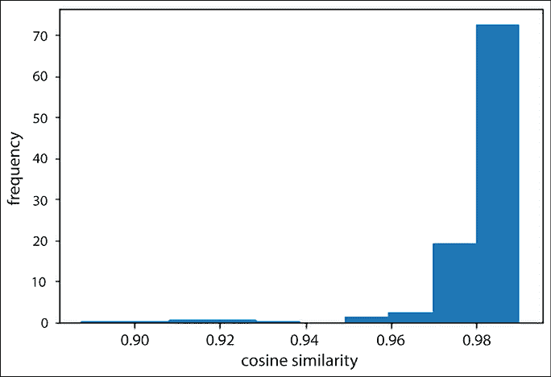

图 8.13：余弦相似度分布

到目前为止，我们一直专注于能够重建数据的自编码器；在接下来的部分，我们将介绍自编码器的一种稍微不同的变体——变分自编码器，它用于生成数据。

# 变分自编码器

像深度置信网络（DBNs，*第七章*，*无监督学习*）和生成对抗网络（GANs，参见*第九章*，*生成模型*，了解更多细节）一样，变分自编码器也是生成模型。**变分自编码器**（**VAEs**）是最佳神经网络与贝叶斯推断的结合体。它们是最有趣的神经网络之一，已成为无监督学习的最流行方法之一。它们是自编码器的一个变种。除了常规的编码器和解码器网络外，VAE 还具有额外的随机层。随机层在编码器网络之后，使用高斯分布进行数据采样，而在解码器网络之后，使用伯努利分布进行数据采样。像 GANs 一样，VAE 也可以用来生成基于其训练分布的图像和图形。

变分自编码器（VAEs）允许在潜在空间中设置复杂的先验，从而学习强大的潜在表示。*图 8.14* 描述了一个 VAE：

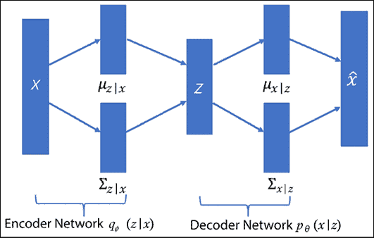

图 8.14：变分自编码器的架构

编码器网络！[](img/B18331_08_017.png)逼近真实但不可求解的后验分布！[](img/B18331_08_018.png)，其中 `x` 是 VAE 的输入，`z` 是潜在表示。解码器网络！[](img/B18331_08_019.png) 以 `d` 维潜在变量（也叫潜在空间）作为输入，并生成符合 `P`(`x`) 分布的新图像。正如从前面的图示中可以看到的，潜在表示 `z` 是从！[](img/B18331_08_020.png)中采样的，而解码器网络的输出从！[](img/B18331_08_021.png) 中采样！[](img/B18331_08_022.png)。这里 `N` 表示具有均值！[](img/B18331_08_023.png) 和方差！[](img/B18331_01_017.png)的正态分布。

现在我们已经了解了 VAE 的基本架构，问题就来了，如何训练它们，因为训练数据的最大似然和后验密度是不可求解的。网络通过最大化数据对数似然的下界来进行训练。因此，损失项由两个部分组成：生成损失，通过解码器网络的采样获得，以及 Kullback-Leibler 散度项，也叫潜在损失。

生成损失确保解码器生成的图像与用于训练网络的图像相似，潜在损失确保后验分布！[](img/B18331_08_025.png)接近先验分布！[](img/B18331_08_026.png)。由于编码器使用高斯分布进行采样，潜在损失衡量潜在变量与该分布的匹配程度。

一旦 VAE 训练完成，我们可以仅使用解码器网络来生成新图像。让我们尝试编写一个 VAE。这次我们使用的是 Fashion-MNIST 数据集；该数据集包含了 Zalando 的([`github.com/zalandoresearch/fashion-mnist`](https://github.com/zalandoresearch/fashion-mnist))商品图像。训练和测试集的划分与 MNIST 完全相同，即 60,000 张训练图像和 10,000 张测试图像。每张图像的大小也是 28 × 28，因此我们可以轻松地将运行在 MNIST 数据集上的代码替换为 Fashion-MNIST 数据集的代码。

本节中的代码改编自[`github.com/dragen1860/TensorFlow-2.x-Tutorials`](https://github.com/dragen1860/TensorFlow-2.x-Tutorials)。作为第一步，我们像往常一样导入所有必要的库：

```py
import tensorflow as tf
import numpy as np
from matplotlib import pyplot as plt 
```

让我们固定随机数种子，以确保结果可复现。我们还可以添加一个`assert`语句，以确保我们的代码在 TensorFlow 2.0 或更高版本上运行：

```py
np.random.seed(333)
tf.random.set_seed(333)
assert tf.__version__.startswith('2.'), "TensorFlow Version Below 2.0" 
```

在继续创建 VAE 之前，让我们先稍微了解一下 Fashion-MNIST 数据集。这个数据集可以在 TensorFlow Keras API 中找到：

```py
(x_train, y_train), (x_test, y_test) = tf.keras.datasets.fashion_mnist.load_data()
x_train, x_test = x_train.astype(np.float32)/255., x_test.astype(np.float32)/255.
print(x_train.shape, y_train.shape)
print(x_test.shape, y_test.shape) 
```

```py
--------------------------------------------------
(60000, 28, 28) (60000,)
(10000, 28, 28) (10000,) 
```

我们看到一些示例图像：

```py
number = 10  # how many digits we will display
plt.figure(figsize=(20, 4))
for index in range(number):
    # display original
    ax = plt.subplot(2, number, index + 1)
    plt.imshow(x_train[index], cmap='gray')
    ax.get_xaxis().set_visible(False)
    ax.get_yaxis().set_visible(False)
plt.show() 
```

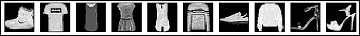

图 8.15：Fashion-MNIST 数据集中的示例图像

在开始之前，让我们声明一些超参数，如学习率、隐藏层和潜在空间的维度、批次大小、轮次等：

```py
image_size = x_train.shape[1]*x_train.shape[2]
hidden_dim = 512
latent_dim = 10
num_epochs = 80
batch_size = 100
learning_rate = 0.001 
```

我们使用 TensorFlow Keras Model API 来构建 VAE 模型。`__init__()`函数定义了我们将使用的所有层：

```py
class VAE(tf.keras.Model):
    def __init__(self,dim,**kwargs):
        h_dim = dim[0]
        z_dim = dim[1]
        super(VAE, self).__init__(**kwargs)
        self.fc1 = tf.keras.layers.Dense(h_dim)
        self.fc2 = tf.keras.layers.Dense(z_dim)
        self.fc3 = tf.keras.layers.Dense(z_dim)
        self.fc4 = tf.keras.layers.Dense(h_dim)
        self.fc5 = tf.keras.layers.Dense(image_size) 
```

我们定义了获取编码器输出、解码器输出和重新参数化的函数。编码器和解码器的实现都很直接；然而，我们需要深入探讨一下`reparametrize`函数。正如你所知道的，VAE 从随机节点`z`中采样，这个`z`由真实后验的来近似。现在，为了获得参数，我们需要使用反向传播。然而，反向传播无法作用于随机节点。通过重新参数化，我们可以使用一个新参数`eps`，它允许我们以一种能够通过确定性随机节点进行反向传播的方式重新参数化`z` ([`arxiv.org/pdf/1312.6114v10.pdf`](https://arxiv.org/pdf/1312.6114v10.pdf))：

```py
def encode(self, x):
    h = tf.nn.relu(self.fc1(x))
    return self.fc2(h), self.fc3(h)
def reparameterize(self, mu, log_var):
    std = tf.exp(log_var * 0.5)
    eps = tf.random.normal(std.shape)
    return mu + eps * std
def decode_logits(self, z):
    h = tf.nn.relu(self.fc4(z))
    return self.fc5(h)
def decode(self, z):
    return tf.nn.sigmoid(self.decode_logits(z)) 
```

最后，我们定义了`call()`函数，它将控制信号如何在 VAE 的不同层之间传播：

```py
def call(self, inputs, training=None, mask=None):
    mu, log_var = self.encode(inputs)
    z = self.reparameterize(mu, log_var)
    x_reconstructed_logits = self.decode_logits(z)
    return x_reconstructed_logits, mu, log_var 
```

现在，我们创建 VAE 模型并声明其优化器。你可以看到模型的摘要：

```py
model = VAE([hidden_dim, latent_dim])
model.build(input_shape=(4, image_size))
model.summary()
optimizer = tf.keras.optimizers.Adam(learning_rate) 
```

```py
Model: "vae"
_________________________________________________________________
 Layer (type)                Output Shape              Param #   
=================================================================
 dense (Dense)               multiple                  401920    

 dense_1 (Dense)             multiple                  5130      

 dense_2 (Dense)             multiple                  5130      

 dense_3 (Dense)             multiple                  5632      

 dense_4 (Dense)             multiple                  402192    

=================================================================
Total params: 820,004
Trainable params: 820,004
Non-trainable params: 0
_________________________________________________________________ 
```

现在，我们训练模型。我们定义了我们的损失函数，它是重构损失和 KL 散度损失的总和：

```py
dataset = tf.data.Dataset.from_tensor_slices(x_train)
dataset = dataset.shuffle(batch_size * 5).batch(batch_size)
num_batches = x_train.shape[0] // batch_size
for epoch in range(num_epochs):
    for step, x in enumerate(dataset):
        x = tf.reshape(x, [-1, image_size])
        with tf.GradientTape() as tape:
            # Forward pass
            x_reconstruction_logits, mu, log_var = model(x)
            # Compute reconstruction loss and kl divergence
            # Scaled by 'image_size' for each individual pixel.
            reconstruction_loss = tf.nn.sigmoid_cross_entropy_with_logits(labels=x, logits=x_reconstruction_logits)
            reconstruction_loss = tf.reduce_sum(reconstruction_loss) / batch_size

            kl_div = - 0.5 * tf.reduce_sum(1\. + log_var - tf.square(mu) - tf.exp(log_var), axis=-1)
            kl_div = tf.reduce_mean(kl_div)
            # Backprop and optimize
            loss = tf.reduce_mean(reconstruction_loss) + kl_div
        gradients = tape.gradient(loss, model.trainable_variables)
        for g in gradients:
            tf.clip_by_norm(g, 15)
        optimizer.apply_gradients(zip(gradients, model.trainable_variables))
        if (step + 1) % 50 == 0:
            print("Epoch[{}/{}], Step [{}/{}], Reconst Loss: {:.4f}, KL Div: {:.4f}"
            .format(epoch + 1, num_epochs, step + 1, num_batches, float(reconstruction_loss), float(kl_div))) 
```

一旦模型训练完成，它应该能够生成与原始 Fashion-MNIST 图像相似的图像。为此，我们只需要使用解码器网络，并向其传递一个随机生成的`z`输入：

```py
z = tf.random.normal((batch_size, latent_dim))
out = model.decode(z)  # decode with sigmoid
out = tf.reshape(out, [-1, 28, 28]).numpy() * 255
out = out.astype(np.uint8) 
```

*图 8.16* 显示了 80 轮训练后的结果：

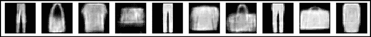

图 8.16：80 轮训练后的结果

生成的图像与输入空间相似。生成的图像与原始 Fashion-MNIST 图像相似，符合预期。

# 总结

在这一章中，我们详细探讨了新一代深度学习模型：自编码器。我们从基础的自编码器开始，随后讨论了其变种：稀疏自编码器、去噪自编码器、堆叠自编码器和卷积自编码器。我们使用自编码器重建了图像，并演示了它们如何用来清除图像中的噪声。最后，本章展示了自编码器如何用于生成句子向量和图像。自编码器通过无监督学习进行学习。

在下一章，我们将深入探讨生成对抗网络，这是一种通过无监督学习范式学习的有趣深度学习模型。

# 参考文献

1.  Rumelhart, D. E., Hinton, G. E., 和 Williams, R. J. (1985). *通过误差传播学习内部表示*。No. ICS-8506。加利福尼亚大学圣地亚哥分校，认知科学研究所：[`www.cs.toronto.edu/~fritz/absps/pdp8.pdf`](http://www.cs.toronto.edu/~fritz/absps/pdp8.pdf)

1.  Hinton, G. E. 和 Salakhutdinov, R. R. (2016). *利用神经网络减少数据的维度*。Science 313.5786: 504–507：[`www.cs.toronto.edu/~hinton/science.pdf`](https://www.cs.toronto.edu/~hinton/science.pdf)

1.  Masci, J. 等 (2011). *堆叠卷积自编码器用于层次化特征提取*。人工神经网络与机器学习–ICANN 2011: 52–59：[`www.semanticscholar.org/paper/Reducing-the-dimensionality-of-data-with-neural-Hinton-Salakhutdinov/46eb79e5eec8a4e2b2f5652b66441e8a4c921c3e`](https://www.semanticscholar.org/paper/Reducing-the-dimensionality-of-data-with-neural-Hinton-Salakhutdinov/46eb79e5eec8a4e2b2f5652b66441e8a4c921c3e)

1.  Japkowicz, N., Myers, C., 和 Gluck, M. (1995). *一种用于分类的新颖性检测方法*。IJCAI。卷：[`www.ijcai.org/Proceedings/95-1/Papers/068.pdf`](https://www.ijcai.org/Proceedings/95-1/Papers/068.pdf)

1.  Sedhain, S. (2015). *AutoRec: 自编码器遇上协同过滤*。第 24 届国际万维网大会论文集，ACM。

1.  Cheng, H. (2016). *宽深学习推荐系统*。第一届推荐系统深度学习研讨会论文集，ACM。

1.  Runfeldt, M. *使用深度学习从人脸中去除眼镜*。

1.  Miotto, R. (2016). *深度病人：一种无监督表示方法，用于预测电子健康记录中病人的未来*。Scientific Reports。

1.  Kiros, R. (2015). *跳跃思想向量*，神经信息处理系统进展。

1.  Kullback-Leibler 散度：[`hanj.cs.illinois.edu/cs412/bk3/KL-divergence.pdf`](http://hanj.cs.illinois.edu/cs412/bk3/KL-divergence.pdf)

1.  去噪自编码器：[`cs.stanford.edu/people/karpathy/convnetjs/demo/autoencoder.xhtml`](https://cs.stanford.edu/people/karpathy/convnetjs/demo/autoencoder.xhtml)

# 加入我们书籍的 Discord 空间

加入我们的 Discord 社区，结识志同道合的人，并与超过 2000 名成员一起学习，网址：[`packt.link/keras`](https://packt.link/keras)


