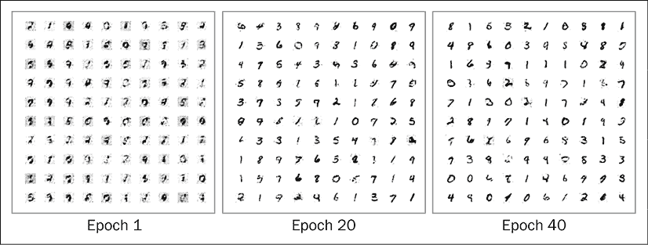
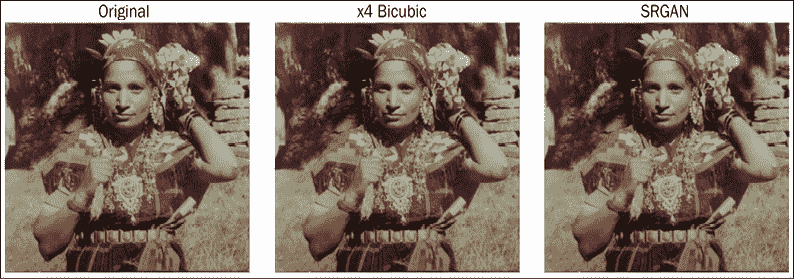
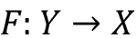
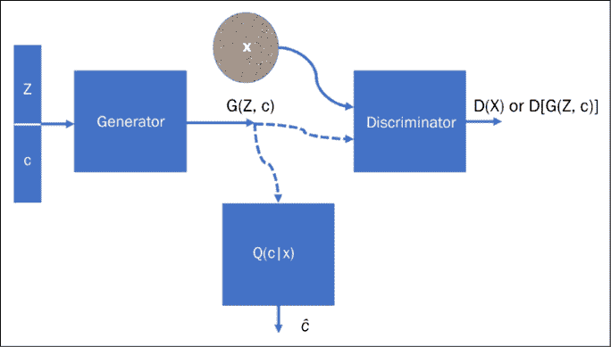

# 第九章：生成模型

生成模型是一种机器学习算法，用于生成数据。它们用于生成与训练模型时使用的数据相似的新数据。这些模型可以用于生成新数据以供测试，或填补缺失的数据。生成模型被广泛应用于许多领域，例如密度估计、图像合成和自然语言处理。在*第八章*《自编码器》中讨论的 VAE 就是一种生成模型；在本章中，我们将讨论各种生成模型，包括**生成对抗网络**（**GANs**）及其变种、基于流的模型和扩散模型。

GANs 被 Yann LeCun（深度学习的奠基人之一）定义为*过去 10 年中机器学习领域最有趣的想法*（[`www.quora.com/What-are-some-recent-and-potentially-upcoming-breakthroughs-in-deep-learning`](https://www.quora.com/What-are-some-recent-and-potentially-upcoming-breakthroughs-in-deep-learning)）。GANs 能够学习如何重现看似真实的合成数据。例如，计算机可以学习如何绘画并创建逼真的图像。这个想法最初由 Ian Goodfellow 提出（有关更多信息，请参见*2016 年 NIPS 教程：生成对抗网络*，I. Goodfellow，2016）；他曾与蒙特利尔大学、Google Brain 和 OpenAI 合作，现在在 Apple Inc.担任机器学习总监。

在本章中，我们将介绍不同类型的 GANs；本章将向你介绍基于流的模型和扩散模型，此外，你还将看到它们在 TensorFlow 中的一些实现。总体来说，我们将涵盖以下主题：

+   什么是 GAN？

+   深度卷积 GANs

+   InfoGAN

+   SRGAN

+   CycleGAN

+   GAN 的应用

+   基于流的生成模型

+   用于数据生成的扩散模型

本章的所有代码文件可以在[`packt.link/dltfchp9`](https://packt.link/dltfchp9)找到

让我们开始吧！

# 什么是 GAN？

GANs 能够学习高维复杂的数据分布，这使它们在近年来受到研究人员的广泛关注。从 2016 年 Ian Goodfellow 首次提出 GANs，到 2022 年 3 月，关于 GANs 的研究论文已超过 10 万篇，仅在短短 6 年的时间里！

GANs 的应用包括创建图像、视频、音乐，甚至自然语言。它们已被应用于图像到图像的转换、图像超分辨率、药物发现，甚至视频中的下一帧预测任务。在合成数据生成任务中，GANs 特别成功——无论是在训练深度学习模型，还是评估对抗性攻击中。

GAN 的关键思想可以通过将其类比为“艺术伪造”来轻松理解，艺术伪造是指创造被错误归于其他通常更著名艺术家的艺术作品的过程。GAN 同时训练两个神经网络。生成器*G(Z)*负责进行伪造，判别器*D(Y)*则负责根据其对真实艺术品和复制品的观察判断复制作品的真实性。*D(Y)*接收输入*Y*（例如一张图像），并通过表达一个投票来判断输入的真实性。一般来说，接近 1 的值表示“真实”，而接近 0 的值表示“伪造”。*G(Z)*接收来自随机噪声*Z*的输入，并通过训练自己来欺骗*D*，让其认为*G(Z)*生成的内容是真实的。

训练判别器*D(Y)*的目标是最大化*D(Y)*对于真实数据分布中的每一张图像，同时最小化*D(Y)*对于每一张非真实数据分布的图像。因此，*G*和*D*进行对立的博弈，这也是**对抗训练**这一名称的由来。需要注意的是，我们以交替的方式训练*G*和*D*，它们的每个目标都通过一个梯度下降优化的损失函数来表达。生成模型不断提高其伪造能力，而判别模型则不断提高其伪造识别能力。判别网络（通常是标准的卷积神经网络）尝试分类输入的图像是否真实。重要的新想法是通过判别器和生成器反向传播，从而调整生成器的参数，使得生成器能够学会如何更频繁地欺骗判别器。最终，生成器将学会生成与真实图像无法区分的图像：


图 9.1: GAN 的基本架构

当然，GAN 涉及在两个玩家之间的博弈中朝着平衡发展。让我们首先理解这里的“平衡”是什么意思。当我们开始时，希望其中一个玩家优于另一个，这样会推动另一个玩家进步，从而使生成器和判别器互相推动着彼此改进。

最终，我们达到了一个状态，在这个状态下，无论是哪一方，改进都不再显著。我们通过绘制损失函数来检查这一点，查看两个损失（梯度损失和判别器损失）何时达到平台期。我们不希望游戏向某一方过于倾斜；如果伪造者每次都能立即学会如何欺骗判别器，那么伪造者就*再也没有什么可以学习的了*。实际上，训练 GAN 是非常困难的，很多研究都在分析 GAN 的收敛性；可以查看这个网站：[`avg.is.tuebingen.mpg.de/projects/convergence-and-stability-of-gan-training`](https://avg.is.tuebingen.mpg.de/projects/convergence-and-stability-of-gan-training) 了解不同类型 GAN 的收敛性和稳定性的详细信息。在 GAN 的生成应用中，我们希望生成器的学习效果略好于判别器。

现在让我们深入探讨 GAN 是如何学习的。判别器和生成器轮流进行学习。学习过程可以分为两个步骤：

1.  这里是判别器，*D(x)*，进行学习。生成器，*G(z)*，用于从随机噪声*z*（遵循某个先验分布*P(z)*)中生成假的图像。生成器产生的假图像和训练数据集中的真实图像都被输入到判别器中，判别器进行监督学习，尝试将真假图像分开。如果*P*[数据] (*x*) 是训练数据集分布，那么判别器网络会最大化其目标，使得*D(x)*在输入数据为真实时接近 1，在输入数据为虚假时接近 0。

1.  在下一步中，生成器网络进行学习。它的目标是欺骗判别器网络，使其认为生成的*G(z)*是真实的，即强迫*D(G(z))*接近 1。

这两个步骤会依次重复。一旦训练结束，判别器就不再能够区分真实和虚假的数据，生成器则变得非常擅长生成与训练数据非常相似的数据。判别器和生成器之间的稳定性是一个活跃的研究问题。

现在你已经对 GAN 有了基本了解，让我们看一个实际应用，其中使用 GAN 生成“手写”数字。

## 在 TensorFlow 中使用 GAN 生成 MNIST 数据

让我们构建一个简单的 GAN，能够生成手写数字。我们将使用 MNIST 手写数字来训练网络。我们需要导入 TensorFlow 模块；为了保持代码的简洁，我们将从 TensorFlow 框架中导出所有需要的类：

```py
from tensorflow.keras.datasets import mnist
from tensorflow.keras.layers import Input, Dense, Reshape, Flatten, Dropout
from tensorflow.keras.layers import BatchNormalization, Activation, ZeroPadding2D
from tensorflow.keras.layers import LeakyReLU
from tensorflow.keras.layers import UpSampling2D, Conv2D
from tensorflow.keras.models import Sequential, Model
from tensorflow.keras.optimizers import Adam
from tensorflow.keras import initializers
import matplotlib.pyplot as plt
import numpy as np 
```

我们使用 TensorFlow Keras 数据集来访问 MNIST 数据。数据包含 60,000 张手写数字的训练图像，每张图像的大小为 28 × 28。数字的像素值范围为 0-255；我们将输入值标准化，使得每个像素的值在 [-1, 1] 范围内：

```py
randomDim = 10
(X_train, _), (_,  _) = mnist.load_data()
X_train = (X_train.astype(np.float32) - 127.5)/127.5 
```

我们将使用一个简单的**多层感知器**（**MLP**），并将其输入一个大小为 784 的平面向量图像，因此我们需要重塑训练数据：

```py
X_train = X_train.reshape(60000, 784) 
```

现在我们需要构建生成器和鉴别器。生成器的目的是接收一个噪声输入，并生成一张与训练数据集相似的图像。噪声输入的大小由变量`randomDim`决定；你可以将其初始化为任何整数值。通常人们将其设置为 100。对于我们的实现，我们尝试了一个值为 10。这个输入会传入一个有`256`个神经元并使用 LeakyReLU 激活函数的全连接层。接下来，我们添加另一个有`512`个隐藏神经元的全连接层，紧接着是第三个有`1024`个神经元的隐藏层，最后是输出层，包含`784`个神经元。你可以改变隐藏层中神经元的数量，看看性能如何变化；然而，输出层神经元的数量必须与训练图像的像素数量匹配。对应的生成器如下：

```py
generator = Sequential()
generator.add(Dense(256, input_dim=randomDim))
generator.add(LeakyReLU(0.2))
generator.add(Dense(512))
generator.add(LeakyReLU(0.2))
generator.add(Dense(1024))
generator.add(LeakyReLU(0.2))
generator.add(Dense(784, activation='tanh')) 
```

同样，我们构建了一个鉴别器。现在注意（*图 9.1*）鉴别器接收的图像，可能来自训练集，也可能是由生成器生成的图像，因此其输入大小为`784`。此外，在这里我们使用了 TensorFlow 的初始化器来初始化全连接层的权重，使用的是标准差为 0.02，均值为 0 的正态分布。如*第一章：TensorFlow 神经网络基础*中所述，TensorFlow 框架中提供了许多初始化器。鉴别器的输出是一个单一的比特，`0`表示假图像（由生成器生成），`1`表示图像来自训练数据集：

```py
discriminator = Sequential()
discriminator.add(Dense(1024, input_dim=784, kernel_initializer=initializers.RandomNormal(stddev=0.02))
)
discriminator.add(LeakyReLU(0.2))
discriminator.add(Dropout(0.3))
discriminator.add(Dense(512))
discriminator.add(LeakyReLU(0.2))
discriminator.add(Dropout(0.3))
discriminator.add(Dense(256))
discriminator.add(LeakyReLU(0.2))
discriminator.add(Dropout(0.3))
discriminator.add(Dense(1, activation='sigmoid')) 
```

接下来，我们将生成器和鉴别器结合在一起，形成一个 GAN（生成对抗网络）。在 GAN 中，我们确保鉴别器的权重是固定的，通过将`trainable`参数设置为`False`来实现：

```py
discriminator.trainable = False
ganInput = Input(shape=(randomDim,))
x = generator(ganInput)
ganOutput = discriminator(x)
gan = Model(inputs=ganInput, outputs=ganOutput) 
```

训练这两个网络的技巧是，我们首先单独训练鉴别器；我们对鉴别器使用二元交叉熵损失函数。随后，我们冻结鉴别器的权重，并训练组合的 GAN；这时的训练目标是生成器。此时的损失函数仍然是二元交叉熵：

```py
discriminator.compile(loss='binary_crossentropy', optimizer='adam')
gan.compile(loss='binary_crossentropy', optimizer='adam') 
```

现在我们开始进行训练。对于每一个训练轮次（epoch），我们首先取一个随机噪声样本，输入到生成器中，生成器会产生一张假图像。然后，我们将生成的假图像与实际的训练图像以及它们对应的标签一起放入一个批次，并用这些数据先对鉴别器进行训练：

```py
def train(epochs=1, batchSize=128):
    batchCount = int(X_train.shape[0] / batchSize)
    print ('Epochs:', epochs)
    print ('Batch size:', batchSize)
    print ('Batches per epoch:', batchCount)
    for e in range(1, epochs+1):
        print ('-'*15, 'Epoch %d' % e, '-'*15)
        for _ in range(batchCount):
            # Get a random set of input noise and images
            noise = np.random.normal(0, 1, size=[batchSize,
            randomDim])
            imageBatch = X_train[np.random.randint(0,
            X_train.shape[0], size=batchSize)]
            # Generate fake MNIST images
            generatedImages = generator.predict(noise)
            # print np.shape(imageBatch), np.shape(generatedImages)
            X = np.concatenate([imageBatch, generatedImages])
            # Labels for generated and real data
            yDis = np.zeros(2*batchSize)
            # One-sided label smoothing
            yDis[:batchSize] = 0.9
            # Train discriminator
            discriminator.trainable = True
            dloss = discriminator.train_on_batch(X, yDis) 
```

如果你注意到，在分配标签时，我们并没有使用`0`/`1`，而是使用了`0`/`0.9` —— 这叫做标签平滑。研究发现，使用软目标有助于提高模型的泛化能力和学习速度（*标签平滑何时有用？*，Muller 等，NeurIPS 2019）。

现在，在同一个`for`循环中，我们将训练生成器。我们希望生成器生成的图像被鉴别器判断为真实的，因此我们使用一个随机向量（噪声）作为输入给生成器；生成器生成一张假图像，然后训练 GAN，使得鉴别器将这张图像判断为真实（输出为`1`）：

```py
 # Train generator
            noise = np.random.normal(0, 1, size=[batchSize,
            randomDim])
            yGen = np.ones(batchSize)
            discriminator.trainable = False
            gloss = gan.train_on_batch(noise, yGen) 
```

很酷的技巧，对吧？如果你愿意，你还可以保存生成器和判别器的损失，以及生成的图像。接下来，我们将保存每个 epoch 的损失，并在每 20 个 epoch 后生成图像：

```py
 # Store loss of most recent batch from this epoch
        dLosses.append(dloss)
        gLosses.append(gloss)
        if e == 1 or e % 20 == 0:
               saveGeneratedImages(e) 
```

我们现在可以通过调用`train`函数来训练 GAN。在下图中，你可以看到生成损失和判别损失的曲线图，随着 GAN 的学习进行：


图 9.2：判别器和生成器的损失图

由我们 GAN 生成的手写数字：



图 9.3：生成的手写数字

从之前的图中可以看出，随着训练轮次的增加，GAN 生成的手写数字越来越逼真。

为了绘制损失和生成的手写数字图像，我们定义了两个辅助函数，`plotLoss()`和`saveGeneratedImages()`。它们的代码如下：

```py
# Plot the loss from each batch
def plotLoss(epoch):
    plt.figure(figsize=(10, 8))
    plt.plot(dLosses, label='Discriminitive loss')
    plt.plot(gLosses, label='Generative loss')
    plt.xlabel('Epoch')
    plt.ylabel('Loss')
    plt.legend()
    plt.savefig('images/gan_loss_epoch_%d.png' % epoch)
# Create a wall of generated MNIST images
def saveGeneratedImages(epoch, examples=100, dim=(10, 10), figsize=(10, 10)):
    noise = np.random.normal(0, 1, size=[examples, randomDim])
    generatedImages = generator.predict(noise)
    generatedImages = generatedImages.reshape(examples, 28, 28)
    plt.figure(figsize=figsize)
    for i in range(generatedImages.shape[0]):
        plt.subplot(dim[0], dim[1], i+1)
        plt.imshow(generatedImages[i], interpolation='nearest',
        cmap='gray_r')
        plt.axis('off')
    plt.tight_layout()
    plt.savefig('images/gan_generated_image_epoch_%d.png' % epoch) 
```

`saveGeneratedImages`函数将图像保存在`images`文件夹中，因此请确保你已在当前工作目录中创建了该文件夹。完整代码可以在本章节的 GitHub 仓库中的笔记本`VanillaGAN.ipynb`中找到。在接下来的部分，我们将介绍一些近期的 GAN 架构，并在 TensorFlow 中实现它们。

# 深度卷积生成对抗网络（DCGAN）

DCGAN 于 2016 年提出，已成为最流行且成功的 GAN 架构之一。设计的主要思想是使用卷积层，而不使用池化层或最终的分类层。卷积步幅和转置卷积被用来进行下采样（即减少维度）和上采样（即增加维度。在 GAN 中，我们通过转置卷积层来实现这一点。有关转置卷积层的更多信息，请参考 Dumoulin 和 Visin 的论文《深度学习卷积算术指南》）。

在深入了解 DCGAN 架构及其功能之前，让我们先指出该论文中介绍的主要变化：

+   网络由所有卷积层组成。池化层被替换为判别器中的步幅卷积（即，在使用卷积层时，我们将步幅数从 1 增加到 2），而生成器中使用转置卷积。

+   卷积层后的全连接分类层已被移除。

+   为了帮助梯度流动，每个卷积层后都进行了批归一化。

DCGAN 的基本理念与基础 GAN 相同：我们有一个生成器，它接受 100 维的噪声；噪声被投影并重新塑形，然后通过卷积层。*图 9.4*显示了生成器的架构：


图 9.4：可视化生成器的架构

判别器网络接受图像（无论是由生成器生成的还是来自真实数据集的），这些图像会经过卷积和批量归一化处理。在每个卷积步骤中，图像会通过步幅进行下采样。卷积层的最终输出被展平并传递到一个单神经元分类器层。

在*图 9.5*中，您可以看到判别器：


图 9.5：可视化判别器的架构

生成器和判别器结合在一起形成了 DCGAN。训练过程与之前相同；也就是说，我们首先在一个小批量上训练判别器，然后冻结判别器并训练生成器。这个过程会反复进行几千个周期。作者发现，使用 Adam 优化器和学习率 0.002 可以获得更稳定的结果。

接下来，我们将实现一个 DCGAN，用于生成手写数字。

## 用于 MNIST 数字的 DCGAN

现在让我们构建一个用于生成手写数字的 DCGAN。我们首先来看生成器的代码。生成器是通过按顺序添加层来构建的。第一层是一个密集层，输入是 100 维的噪声。这个 100 维的输入被扩展为一个大小为 128 × 7 × 7 的平坦向量。这样做是为了最终得到一个 28 × 28 的输出，这是 MNIST 手写数字的标准大小。该向量被重塑为大小为 7 × 7 × 128 的张量。然后，使用 TensorFlow Keras 的`UpSampling2D`层对该张量进行上采样。请注意，这一层仅通过将行和列加倍来缩放图像。该层没有权重，因此计算开销很小。

Upsampling2D 层现在将 7 × 7 × 128（行 × 列 × 通道）图像的行和列加倍，得到 14 × 14 × 128 的输出。上采样后的图像将传递到一个卷积层，该卷积层学习填充上采样图像中的细节。卷积的输出传递到批量归一化层，以改善梯度流。批量归一化后的输出在所有中间层中会经过 ReLU 激活。我们重复这种结构，即上采样 | 卷积 | 批量归一化 | ReLU。在接下来的生成器中，我们有两个这样的结构，第一个卷积操作使用 128 个滤波器，第二个使用 64 个滤波器。最终的输出通过一个纯卷积层得到，该层使用 3 个滤波器和双曲正切激活，输出大小为 28 × 28 × 1 的图像：

```py
def build_generator(self):
    model = Sequential()
    model.add(Dense(128 * 7 * 7, activation="relu",
    input_dim=self.latent_dim))
    model.add(Reshape((7, 7, 128)))
    model.add(UpSampling2D())
    model.add(Conv2D(128, kernel_size=3, padding="same"))
    model.add(BatchNormalization(momentum=0.8))
    model.add(Activation("relu"))
    model.add(UpSampling2D())
    model.add(Conv2D(64, kernel_size=3, padding="same"))
    model.add(BatchNormalization(momentum=0.8))
    model.add(Activation("relu"))
    model.add(Conv2D(self.channels, kernel_size=3, padding="same"))
    model.add(Activation("tanh"))
    model.summary()
    noise = Input(shape=(self.latent_dim,))
    img = model(noise)
    return Model(noise, img) 
```

结果生成器模型如下：

```py
Model: "sequential_1"
_________________________________________________________________
 Layer (type)                Output Shape              Param #   
=================================================================
 conv2d_3 (Conv2D)           (None, 14, 14, 32)        320       

 leaky_re_lu (LeakyReLU)     (None, 14, 14, 32)        0         

 dropout (Dropout)           (None, 14, 14, 32)        0         

 conv2d_4 (Conv2D)           (None, 7, 7, 64)          18496     

 zero_padding2d (ZeroPadding  (None, 8, 8, 64)         0         
 2D)                                                             

 batch_normalization_2 (Batc  (None, 8, 8, 64)         256       
 hNormalization)                                                 

 leaky_re_lu_1 (LeakyReLU)   (None, 8, 8, 64)          0         

 dropout_1 (Dropout)         (None, 8, 8, 64)          0         

 conv2d_5 (Conv2D)           (None, 4, 4, 128)         73856     

 batch_normalization_3 (Batc  (None, 4, 4, 128)        512       
 hNormalization)                                                 

 leaky_re_lu_2 (LeakyReLU)   (None, 4, 4, 128)         0         

 dropout_2 (Dropout)         (None, 4, 4, 128)         0         

 conv2d_6 (Conv2D)           (None, 4, 4, 256)         295168    

 batch_normalization_4 (Batc  (None, 4, 4, 256)        1024      
 hNormalization)                                                 

 leaky_re_lu_3 (LeakyReLU)   (None, 4, 4, 256)         0         

 dropout_3 (Dropout)         (None, 4, 4, 256)         0         

 flatten (Flatten)           (None, 4096)              0         

 dense_1 (Dense)             (None, 1)                 4097      

=================================================================
Total params: 393,729
Trainable params: 392,833
Non-trainable params: 896 
```

你还可以尝试使用转置卷积层。这个层不仅能上采样输入图像，还能在训练过程中学习如何填充细节。因此，你可以用一个转置卷积层替换上采样和卷积层。转置卷积层执行的是反向卷积操作。你可以在论文中阅读更详细的内容：*深度学习卷积算术指南*（[`arxiv.org/abs/1603.07285`](https://arxiv.org/abs/1603.07285)）。

现在我们有了生成器，让我们看看构建判别器的代码。判别器与标准卷积神经网络相似，但有一个重大变化：我们使用步长为 2 的卷积层代替最大池化。我们还加入了 dropout 层以避免过拟合，并使用批归一化来提高准确性和加速收敛。激活层使用的是 leaky ReLU。在接下来的网络中，我们使用了三个这样的卷积层，过滤器分别为 32、64 和 128。第三个卷积层的输出被展平并输入到一个带有单个单元的全连接层。

该单元的输出将图像分类为伪造或真实：

```py
def build_discriminator(self):
    model = Sequential()
    model.add(Conv2D(32, kernel_size=3, strides=2,
    input_shape=self.img_shape, padding="same"))
    model.add(LeakyReLU(alpha=0.2))
    model.add(Dropout(0.25))
    model.add(Conv2D(64, kernel_size=3, strides=2, padding="same"))
    model.add(ZeroPadding2D(padding=((0,1),(0,1))))
    model.add(BatchNormalization(momentum=0.8))
    model.add(LeakyReLU(alpha=0.2))
    model.add(Dropout(0.25))
    model.add(Conv2D(128, kernel_size=3, strides=2, padding="same"))
    model.add(BatchNormalization(momentum=0.8))
    model.add(LeakyReLU(alpha=0.2))
    model.add(Dropout(0.25))
    model.add(Conv2D(256, kernel_size=3, strides=1, padding="same"))
    model.add(BatchNormalization(momentum=0.8))
    model.add(LeakyReLU(alpha=0.2))
    model.add(Dropout(0.25))
    model.add(Flatten())
    model.add(Dense(1, activation='sigmoid'))
    model.summary()
    img = Input(shape=self.img_shape)
    validity = model(img)
    return Model(img, validity) 
```

结果判别器网络是：

```py
Model: "sequential"
_________________________________________________________________
 Layer (type)                Output Shape              Param #   
=================================================================
 dense (Dense)               (None, 6272)              633472    

 reshape (Reshape)           (None, 7, 7, 128)         0         

 up_sampling2d (UpSampling2D  (None, 14, 14, 128)      0         
 )                                                               

 conv2d (Conv2D)             (None, 14, 14, 128)       147584    

 batch_normalization (BatchN  (None, 14, 14, 128)      512       
 ormalization)                                                   

 activation (Activation)     (None, 14, 14, 128)       0         

 up_sampling2d_1 (UpSampling  (None, 28, 28, 128)      0         
 2D)                                                             

 conv2d_1 (Conv2D)           (None, 28, 28, 64)        73792     

 batch_normalization_1 (Batc  (None, 28, 28, 64)       256       
 hNormalization)                                                 

 activation_1 (Activation)   (None, 28, 28, 64)        0         

 conv2d_2 (Conv2D)           (None, 28, 28, 1)         577       

 activation_2 (Activation)   (None, 28, 28, 1)         0         

=================================================================
Total params: 856,193
Trainable params: 855,809
Non-trainable params: 384
_________________________________________________________________ 
```

完整的 GAN 是通过将两者结合而成的：

```py
class DCGAN():
    def __init__(self, rows, cols, channels, z = 10):
        # Input shape
        self.img_rows = rows
        self.img_cols = cols
        self.channels = channels
        self.img_shape = (self.img_rows, self.img_cols, self.channels)
        self.latent_dim = z
        optimizer = Adam(0.0002, 0.5)
        # Build and compile the discriminator
        self.discriminator = self.build_discriminator()
        self.discriminator.compile(loss=’binary_crossentropy’,
            optimizer=optimizer,
            metrics=[‘accuracy’])
        # Build the generator
        self.generator = self.build_generator()
        # The generator takes noise as input and generates imgs
        z = Input(shape=(self.latent_dim,))
        img = self.generator(z)
        # For the combined model we will only train the generator
        self.discriminator.trainable = False
        # The discriminator takes generated images as input and determines validity
        valid = self.discriminator(img)
        # The combined model  (stacked generator and discriminator)
        # Trains the generator to fool the discriminator
        self.combined = Model(z, valid)
        self.combined.compile(loss=’binary_crossentropy’, optimizer=optimizer) 
```

如你所见，我们在这里定义了`binary_crossentropy`损失对象，稍后我们将用它来定义生成器和判别器的损失。生成器和判别器的优化器在此`init`方法中定义。最后，我们定义了一个 TensorFlow 检查点，用于在模型训练过程中保存两个模型（生成器和判别器）。

GAN 的训练方式与之前相同；每一步，首先将随机噪声输入生成器。生成器的输出与真实图像结合，初步训练判别器，然后训练生成器使其生成能够欺骗判别器的图像。

这一过程会对下一批图像重复进行。GAN 的训练通常需要几百到几千轮：

```py
 def train(self, epochs, batch_size=256, save_interval=50):
        # Load the dataset
        (X_train, _), (_, _) = mnist.load_data()
        # Rescale -1 to 1
        X_train = X_train / 127.5 - 1.
        X_train = np.expand_dims(X_train, axis=3)
        # Adversarial ground truths
        valid = np.ones((batch_size, 1))
        fake = np.zeros((batch_size, 1))
        for epoch in range(epochs):
            # ---------------------
            #  Train Discriminator
            # ---------------------
            # Select a random half of images
            idx = np.random.randint(0, X_train.shape[0], batch_size)
            imgs = X_train[idx]
            # Sample noise and generate a batch of new images
            noise = np.random.normal(0, 1, (batch_size, self.latent_dim))
            gen_imgs = self.generator.predict(noise)
            # Train the discriminator (real classified as ones and generated as zeros)
            d_loss_real = self.discriminator.train_on_batch(imgs, valid)
            d_loss_fake = self.discriminator.train_on_batch(gen_imgs, fake)
            d_loss = 0.5 * np.add(d_loss_real, d_loss_fake)
            # ---------------------
            #  Train Generator
            # ---------------------
            # Train the generator (wants discriminator to mistake images as real)
            g_loss = self.combined.train_on_batch(noise, valid)
            # Plot the progress
            print ("%d [D loss: %f, acc.: %.2f%%] [G loss: %f]" % (epoch, d_loss[0], 100*d_loss[1], g_loss))
            # If at save interval => save generated image samples
            if epoch % save_interval == 0:
                self.save_imgs(epoch) 
```

最后，我们需要一个辅助函数来保存图像：

```py
 def save_imgs(self, epoch):
        r, c = 5, 5
        noise = np.random.normal(0, 1, (r * c, self.latent_dim))
        gen_imgs = self.generator.predict(noise)
        # Rescale images 0 - 1
        gen_imgs = 0.5 * gen_imgs + 0.5
        fig, axs = plt.subplots(r, c)
        cnt = 0
        for i in range(r):
            for j in range(c):
                axs[i,j].imshow(gen_imgs[cnt, :,:,0], cmap='gray')
                axs[i,j].axis('off')
                cnt += 1
        fig.savefig("images/dcgan_mnist_%d.png" % epoch)
        plt.close() 
```

现在让我们开始训练我们的 GAN：

```py
dcgan = DCGAN(28,28,1)
dcgan.train(epochs=5000, batch_size=256, save_interval=50) 
```

我们的 GAN 在学习如何伪造手写数字后生成的图像是：


图 9.6：GAN 生成的图像——初步尝试

前面的图像是 GAN 的初步尝试。随着它在接下来的 10 轮训练中学习，生成的数字质量大幅提升：


图 9.7：GAN 在 6、8 和 10 轮训练后的生成图像

完整的代码可以在 GitHub 仓库中的`DCGAN.ipynb`找到。我们可以将这里讨论的概念应用到其他领域的图像上。关于图像的一个有趣研究工作发表在论文 *无监督表示学习与深度卷积生成对抗网络* 中，作者是 Alec Radford、Luke Metz 和 Soumith Chintala，2015 年。以下是论文摘要：

> 近年来，卷积网络（CNN）在计算机视觉应用中的监督学习得到了广泛应用。相比之下，CNN 的无监督学习关注较少。在这项工作中，我们希望帮助弥合 CNN 在监督学习和无监督学习上的成功之间的差距。我们介绍了一类称为深度卷积生成对抗网络（DCGAN）的 CNN，它们具有某些架构限制，并证明它们是无监督学习的有力候选。通过在各种图像数据集上进行训练，我们展示了令人信服的证据，表明我们的深度卷积对抗对可以在生成器和判别器中学习从物体部分到场景的层次化表示。此外，我们还使用学习到的特征进行新的任务，展示它们作为通用图像表示的适用性。
> 
> —Radford 等人，2015 年

以下是将 DCGAN 应用于名人图像数据集的一些有趣结果：


图 9.8：使用 DCGAN 生成的名人图像

另一篇有趣的论文是由 Raymond A. Yeh 等人于 2016 年发表的*《基于感知和上下文损失的语义图像修复》*。就像摄影师使用内容感知填充工具来填补图像中不需要或缺失的部分一样，本文中他们使用了 DCGAN 进行图像补全。

如前所述，围绕 GAN 的研究正在进行大量探索。在下一节中，我们将探讨近年来提出的一些有趣的 GAN 架构。

# 一些有趣的 GAN 架构

自从它们问世以来，GAN（生成对抗网络）引起了大量关注，因此我们看到在 GAN 的训练、架构和应用方面进行了许多修改和实验。在这一节中，我们将探讨近年来提出的一些有趣的 GAN。

## SRGAN

你是否记得在某部犯罪惊悚片中，主角让电脑专家放大模糊的犯罪现场图像？通过放大，我们可以详细看到犯罪嫌疑人的面孔，包括使用的武器以及上面刻的任何东西！好吧，**超分辨率生成对抗网络**（**SRGANs**）可以执行类似的魔法。魔法的意思是，GAN 表明通过它可以获得高分辨率图像，而最终的结果取决于所使用的相机分辨率。在这里，GAN 被训练成在给定低分辨率图像时，可以生成逼真的高分辨率图像。SRGAN 架构由三个神经网络组成：一个非常深的生成器网络（使用残差模块；参见*第二十章*，*高级卷积神经网络*），一个判别器网络，以及一个预训练的 VGG-16 网络。

SRGAN 使用感知损失函数（由 Johnson 等人开发；你可以在*参考文献*部分找到该论文的链接）。在 SRGAN 中，作者首先对高分辨率图像进行了下采样，并使用生成器生成其“高分辨率”版本。判别器被训练来区分真实的高分辨率图像和生成的高分辨率图像。在 VGG 网络的高层中，网络输出与高分辨率部分之间的特征图激活差异构成了感知损失函数。除了感知损失外，作者进一步添加了内容损失和对抗损失，以使得生成的图像看起来更自然，细节更具艺术感。感知损失定义为内容损失和对抗损失的加权和：


右边第一个项是内容损失，通过使用预训练的 VGG 19 生成的特征图来获得。从数学角度来看，它是重建图像（即由生成器生成的图像）和原始高分辨率参考图像之间的欧几里得距离。右侧的第二项是对抗损失。它是标准的生成损失项，旨在确保生成器生成的图像能够欺骗判别器。你可以从下面的图像中看到，由 SRGAN 生成的图像在 PSNR 值为 37.61 时，已经非常接近原始高分辨率图像：



图 9.9：来自论文《使用生成对抗网络的照片级单图像超分辨率》中的示例，Ledig 等人。

另一个值得注意的架构是 CycleGAN；它在 2017 年提出，能够执行图像翻译任务。经过训练后，你可以将一张图像从一个领域翻译到另一个领域。例如，在训练了马和斑马的数据集后，如果你给它一张前景是马的图像，CycleGAN 可以将马转化为斑马，并保持相同的背景。我们接下来将进一步探讨它。

## CycleGAN

你有没有想过如果梵高或马奈画了某个景象，它会是什么样子？我们有很多梵高/马奈画的景象和风景，但没有任何输入输出对的集合。CycleGAN 执行图像翻译，即在没有训练样本的情况下，将给定领域（例如景象）的图像转换为另一个领域（例如同一场景的梵高画作）。CycleGAN 在没有训练对的情况下进行图像翻译的能力使它独特。

为了实现图像翻译，作者使用了一种非常简单但有效的过程。他们利用了两个 GAN，每个 GAN 的生成器执行图像从一个领域到另一个领域的翻译。

具体来说，假设输入为 *X*，则第一个 GAN 的生成器执行映射 ；因此，其输出为 *Y = G(X)*。第二个 GAN 的生成器执行反向映射 ，得到 *X = F(Y)*。每个判别器的训练目标是区分真实图像与合成图像。其原理如下所示：


图 9.10：循环一致性损失

为了训练组合的 GAN，作者除了常规的 GAN 对抗损失外，还加入了正向循环一致性损失（左图）和反向循环一致性损失（右图）。这确保了如果输入图像为*X*，则经过两次转换 *F(G(X)) ~ X* 后，得到的图像与原图像相同，*X*（同样，反向循环一致性损失确保 *G(F(Y)) ~ Y*）。

以下是一些由 CycleGAN 成功实现的图像转换示例 [7]：


图 9.11：一些成功的 CycleGAN 图像转换示例

以下是更多示例；你可以看到季节的转换（夏季  冬季），照片  绘画及其反向转换，马  斑马及其反向转换 [7]：


图 9.12：CycleGAN 转换的更多示例

在本章后面，我们还将探索 CycleGAN 的 TensorFlow 实现。接下来，我们将讨论 InfoGAN，它是一种条件 GAN，其中 GAN 不仅生成图像，还可以通过控制变量来控制生成的图像。

## InfoGAN

到目前为止，我们考虑的 GAN 架构几乎没有或完全没有对生成图像的控制。InfoGAN 改变了这一点；它提供了对生成图像各种属性的控制。InfoGAN 使用信息理论的概念，将噪声项转化为潜在编码，从而对输出进行可预测且系统化的控制。

InfoGAN 中的生成器接受两个输入：潜在空间 *Z* 和潜在编码 *c*，因此生成器的输出是 *G(Z,c)*。GAN 的训练目标是最大化潜在编码 *c* 和生成图像 *G(Z,c)* 之间的互信息。以下图展示了 InfoGAN 的架构：



图 9.13：InfoGAN 的架构，已可视化

拼接向量*(Z,c)*被输入到生成器中。*Q(c|X)* 也是一个神经网络。与生成器结合后，它工作于形成随机噪声 *Z* 和其潜在编码 *c_hat* 之间的映射。目标是给定 *X* 来估计 *c*。这通过在传统 GAN 的目标函数中添加正则化项来实现：


术语 *V*[G]*(D,G)* 是传统 GAN 的损失函数，第二项是正则化项，其中  是一个常数。论文中将其值设为 1，*I(c;G(Z,c))* 是潜在编码 *c* 和生成器生成的图像 *G(Z,c)* 之间的互信息。

以下是 InfoGAN 在 MNIST 数据集上的一些令人兴奋的结果：


图 9.14：使用 InfoGAN 在 MNIST 数据集上的结果。这里，不同的行对应于不同的固定潜在编码和噪声的随机样本

现在，既然我们已经看过一些令人兴奋的 GAN 架构，让我们来探索一些 GAN 的酷应用。

# GAN 的酷应用

我们已经看到生成器能够学会如何伪造数据。这意味着它学会了如何创建由网络生成的看似真实且人工制作的新合成数据。在深入探讨一些 GAN 代码的细节之前，我们想分享论文 [6] 的结果（代码可以在 [`github.com/hanzhanggit/StackGAN`](https://github.com/hanzhanggit/StackGAN) 在线获得），该论文使用 GAN 从文本描述中合成伪造图像。结果令人印象深刻：第一列是测试集中真实的图像，所有其他列是由 StackGAN 的第一阶段和第二阶段从相同的文本描述生成的图像。更多例子可以在 YouTube 上找到（[`www.youtube.com/watch?v=SuRyL5vhCIM&feature=youtu.be`](https://www.youtube.com/watch?v=SuRyL5vhCIM&feature=youtu.be)）：


图 9.15：使用 GAN 生成的鸟类图像


图 9.16：使用 GAN 生成的花卉图像

现在让我们看看 GAN 如何学会“伪造”MNIST 数据集。在这种情况下，生成器和判别器网络使用的是 GAN 和 CNN 的结合。在开始时，生成器生成的内容没有任何可理解的形式，但经过几轮迭代后，合成的伪造数字逐渐变得越来越清晰。在这张图中，面板按训练轮次递增排序，你可以看到面板之间的质量在不断提高：


图 9.17：GAN 的初始输出难以辨认

随着训练的进行，你可以在 *图 9.17* 中看到数字开始变得更具可识别性：


图 9.18：GAN 的改进输出，经过进一步迭代后


图 9.19：GAN 的最终输出，显示出比之前迭代显著的改进

经过 10,000 次训练周期后，你可以看到手写数字变得更加真实。

GAN 最酷的应用之一是在生成器的向量 *Z* 中对人脸进行运算。换句话说，如果我们停留在合成伪造图像的空间中，就可以看到类似这样的事情： *[微笑的女人] - [中立的女人] + [中立的男人] = [微笑的男人]*，或者像这样： *[戴眼镜的男人] - [不戴眼镜的男人] + [不戴眼镜的女人] = [戴眼镜的女人]*。这一点在 Alec Radford 及其同事于 2015 年发布的论文 *《使用深度卷积生成对抗网络的无监督表示学习》* 中得到了展示。本文中的所有图像都是通过 GAN 的一个版本生成的。它们并不是真实的。完整论文请访问：[`arxiv.org/abs/1511.06434`](http://arxiv.org/abs/1511.06434)。以下是论文中的一些示例。作者还在这个 GitHub 仓库中分享了他们的代码：[`github.com/Newmu/dcgan_code`](https://github.com/Newmu/dcgan_code)：


图 9.20：使用 GAN 进行图像运算

**卧室**：经过五次训练周期后生成的卧室：


图 9.21：使用 GAN 在经过 5 次训练周期后生成的卧室

**专辑封面**：这些图像是通过 GAN 生成的，但看起来像真实的专辑封面：


图 9.22：使用 DCGAN 生成的专辑封面

GAN 的另一个酷应用是生成虚拟人脸。NVIDIA 于 2018 年推出了一种名为 StyleGAN 的模型（第二版 StyleGAN2 于 2020 年 2 月发布，第三版于 2021 年发布），该模型展示了可以用来生成逼真的人类图像。下面是通过 StyleGAN 生成的一些逼真的虚假人物面孔，这些面孔是在经过 1,000 次训练周期后获得的；为了获得更好的效果，你需要进行更多的训练：


图 9.23：通过 StyleGAN 生成的虚假面孔

它不仅生成假图像，像 InfoGAN 一样，你可以从粗到细地控制特征。这是 NVIDIA 发布的官方视频，展示了特征如何影响结果：[`www.youtube.com/watch?v=kSLJriaOumA`](https://www.youtube.com/watch?v=kSLJriaOumA)。他们通过在潜变量*Z*之后添加一个非线性映射网络来实现这一点。映射网络将潜变量转换为相同大小的映射；映射向量的输出被馈送到生成器网络的不同层，从而允许 StyleGAN 控制不同的视觉特征。要了解更多关于 StyleGAN 的内容，您应该阅读 NVIDIA 实验室的论文《A style-based generator architecture for Generative Adversarial Networks》[10]。

# TensorFlow 中的 CycleGAN

在本节中，我们将实现一个基于 TensorFlow 的 CycleGAN。CycleGAN 需要一个特殊的数据集，一个成对数据集，来自一个图像领域到另一个领域。因此，除了必要的模块外，我们还将使用`tensorflow_datasets`。另外，我们将使用`tensorflow_examples`库，直接使用`tensorflow_examples`中定义的`pix2pix`模型中的生成器和判别器。这里的代码来自于这里的[`github.com/tensorflow/docs/blob/master/site/en/tutorials/generative/cyclegan.ipynb`](https://github.com/tensorflow/docs/blob/master/site/en/tutorials/generative/cyclegan.ipynb)：

```py
import tensorflow_datasets as tfds
from tensorflow_examples.models.pix2pix import pix2pix
import os
import time
import matplotlib.pyplot as plt
from IPython.display import clear_output
import tensorflow as tf 
```

TensorFlow 的`Dataset` API 包含了一个数据集列表。它有许多适用于 CycleGAN 的成对数据集，例如从马到斑马、从苹果到橘子等等。你可以在这里访问完整的列表：[`www.tensorflow.org/datasets/catalog/cycle_gan`](https://www.tensorflow.org/datasets/catalog/cycle_gan)。在我们的代码中，我们将使用`summer2winter_yosemite`，它包含了约塞米蒂（美国）在夏季（数据集 A）和冬季（数据集 B）的图像。我们将训练 CycleGAN 将夏季图像转换为冬季图像，反之亦然。

让我们加载数据并获取训练和测试图像：

```py
dataset, metadata = tfds.load('cycle_gan/summer2winter_yosemite',
                              with_info=True, as_supervised=True)
train_summer, train_winter = dataset['trainA'], dataset['trainB']
test_summer, test_winter = dataset['testA'], dataset['testB'] 
```

我们需要设置一些超参数：

```py
BUFFER_SIZE = 1000
BATCH_SIZE = 1
IMG_WIDTH = 256
IMG_HEIGHT = 256
EPOCHS = 100
LAMBDA = 10
AUTOTUNE = tf.data.AUTOTUNE 
```

在我们训练网络之前，图像需要进行归一化。为了更好的性能，我们还会对训练图像添加随机抖动；这些图像首先被调整为 286x286 的大小，然后我们随机裁剪回 256x256 的大小，最后应用随机抖动：

```py
def normalize(input_image, label):
    input_image = tf.cast(input_image, tf.float32)
    input_image = (input_image / 127.5) - 1
    return input_image
def random_crop(image):
    cropped_image = tf.image.random_crop(image, size=[IMG_HEIGHT,
    IMG_WIDTH, 3])
    return cropped_image
def random_jitter(image):
    # resizing to 286 x 286 x 3
    image = tf.image.resize(image, [286, 286],
    method=tf.image.ResizeMethod.NEAREST_NEIGHBOR)
    # randomly cropping to 256 x 256 x 3
    image = random_crop(image)
    # random mirroring
    image = tf.image.random_flip_left_right(image)
    return image 
```

数据增强（随机裁剪和抖动）仅应用于训练图像；因此，我们需要为图像预处理分离出两个函数，一个用于训练数据，另一个用于测试数据：

```py
def preprocess_image_train(image, label):
    image = random_jitter(image)
    image = normalize(image)
    return image
def preprocess_image_test(image, label):
    image = normalize(image)
    return image 
```

之前的函数应用于图像时，将会将其归一化到[-1,1]的范围内，并对训练图像应用增强。让我们将这些应用到我们的训练和测试数据集，并创建一个数据生成器，它将批量提供训练图像：

```py
train_summer = train_summer.cache().map(
    preprocess_image_train, num_parallel_calls=AUTOTUNE).shuffle(
    BUFFER_SIZE).batch(BATCH_SIZE)
train_winter = train_winter.cache().map(
    preprocess_image_train, num_parallel_calls=AUTOTUNE).shuffle(
    BUFFER_SIZE).batch(BATCH_SIZE)
test_summer = test_summer.map(
    preprocess_image_test,
    num_parallel_calls=AUTOTUNE).cache().shuffle(
    BUFFER_SIZE).batch(BATCH_SIZE)
test_winter = test_winter.map(
    preprocess_image_test,
    num_parallel_calls=AUTOTUNE).cache().shuffle(
    BUFFER_SIZE).batch(BATCH_SIZE) 
```

在前面的代码中，参数`num_parallel_calls`使得可以利用系统中的多个 CPU 核心；应将其值设置为系统中 CPU 核心的数量。如果不确定，请使用`AUTOTUNE = tf.data.AUTOTUNE`，让 TensorFlow 动态地为你确定合适的数量。

如前所述，我们使用的是从`pix2pix`模型中提取的生成器和判别器，定义在`tensorflow_examples`模块中。我们将有两个生成器和两个判别器：

```py
OUTPUT_CHANNELS = 3
generator_g = pix2pix.unet_generator(OUTPUT_CHANNELS, norm_type='instancenorm')
generator_f = pix2pix.unet_generator(OUTPUT_CHANNELS, norm_type='instancenorm')
discriminator_x = pix2pix.discriminator(norm_type='instancenorm', target=False)
discriminator_y = pix2pix.discriminator(norm_type='instancenorm', target=False) 
```

在继续进行模型定义之前，让我们看看图像。每张图像在绘制之前都会进行处理，以确保其强度是正常的：

```py
to_winter = generator_g(sample_summer)
to_summer = generator_f(sample_winter)
plt.figure(figsize=(8, 8))
contrast = 8
imgs = [sample_summer, to_winter, sample_winter, to_summer]
title = ['Summer', 'To Winter', 'Winter', 'To Summer']
for i in range(len(imgs)):
  plt.subplot(2, 2, i+1)
  plt.title(title[i])
  if i % 2 == 0:
    plt.imshow(imgs[i][0] * 0.5 + 0.5)
  else:
    plt.imshow(imgs[i][0] * 0.5 * contrast + 0.5)
plt.show() 
```


图 9.24：训练前 CycleGAN 架构中 GAN 1 的输入和 GAN 2 的输出

接下来我们定义损失和优化器。我们保留与 DCGAN 相同的生成器和判别器的损失函数：

```py
loss_obj = tf.keras.losses.BinaryCrossentropy(from_logits=True)
def discriminator_loss(real, generated):
    real_loss = loss_obj(tf.ones_like(real), real)
    generated_loss = loss_obj(tf.zeros_like(generated), generated)
    total_disc_loss = real_loss + generated_loss
    return total_disc_loss * 0.5
def generator_loss(generated):
    return loss_obj(tf.ones_like(generated), generated) 
```

由于现在有四个模型，两个生成器和两个判别器，我们需要定义四个优化器：

```py
generator_g_optimizer = tf.keras.optimizers.Adam(2e-4, beta_1=0.5)
generator_f_optimizer = tf.keras.optimizers.Adam(2e-4, beta_1=0.5)
discriminator_x_optimizer = tf.keras.optimizers.Adam(2e-4, beta_1=0.5)
discriminator_y_optimizer = tf.keras.optimizers.Adam(2e-4, beta_1=0.5) 
```

此外，在 CycleGAN 中，我们需要定义两个额外的损失函数，第一个是循环一致性损失；我们可以使用相同的函数来计算前向和反向的循环一致性损失。循环一致性损失确保结果接近原始输入：

```py
def calc_cycle_loss(real_image, cycled_image):
    loss1 = tf.reduce_mean(tf.abs(real_image - cycled_image))
    return LAMBDA * loss1 
```

我们还需要定义一个身份损失，确保如果输入给生成器一个图像*Y*，它将输出真实图像*Y*或与*Y*相似的图像。因此，如果我们给夏季图像生成器输入一张夏季图像，它不应该有太大变化：

```py
def identity_loss(real_image, same_image):
    loss = tf.reduce_mean(tf.abs(real_image - same_image))
    return LAMBDA * 0.5 * loss 
```

现在我们定义一个函数，在批次中训练生成器和判别器，每次处理一对图像。这两个判别器和两个生成器将通过该函数以及带有梯度带的帮助进行训练。训练步骤可以分为四个部分：

1.  获取两个生成器的输出图像。

1.  计算损失。

1.  计算梯度。

1.  最后，应用梯度：

    ```py
    @tf.function
    def train_step(real_x, real_y):
        # persistent is set to True because the tape is used
        # more than once to calculate the gradients.
      with tf.GradientTape(persistent=True) as tape:
        # Generator G translates X -> Y
        # Generator F translates Y -> X.

        fake_y = generator_g(real_x, training=True)
        cycled_x = generator_f(fake_y, training=True)
        fake_x = generator_f(real_y, training=True)
        cycled_y = generator_g(fake_x, training=True)
        # same_x and same_y are used for identity loss.
        same_x = generator_f(real_x, training=True)
        same_y = generator_g(real_y, training=True)
        disc_real_x = discriminator_x(real_x, training=True)
        disc_real_y = discriminator_y(real_y, training=True)
        disc_fake_x = discriminator_x(fake_x, training=True)
        disc_fake_y = discriminator_y(fake_y, training=True)
        # calculate the loss
        gen_g_loss = generator_loss(disc_fake_y)
        gen_f_loss = generator_loss(disc_fake_x)

        total_cycle_loss = calc_cycle_loss(real_x, cycled_x) + \
        calc_cycle_loss(real_y, cycled_y)

        # Total generator loss = adversarial loss + cycle loss
        total_gen_g_loss = gen_g_loss + total_cycle_loss + \
        identity_loss(real_y, same_y)
        total_gen_f_loss = gen_f_loss + total_cycle_loss + \
        identity_loss(real_x, same_x)
        disc_x_loss = discriminator_loss(disc_real_x,
        disc_fake_x)
        disc_y_loss = discriminator_loss(disc_real_y,
        disc_fake_y)
        # Calculate the gradients for generator and discriminator
        generator_g_gradients = tape.gradient(total_gen_g_loss,
        generator_g.trainable_variables)
        generator_f_gradients = tape.gradient(total_gen_f_loss,
        generator_f.trainable_variables)
        discriminator_x_gradients = tape.gradient(disc_x_loss,
        discriminator_x.trainable_variables)
        discriminator_y_gradients = tape.gradient(disc_y_loss,
        discriminator_y.trainable_variables)
        # Apply the gradients to the optimizer
        generator_g_optimizer.apply_gradients(zip(generator_g_gradients, generator_g.trainable_variables))
        generator_f_optimizer.apply_gradients(zip(generator_f_gradients, generator_f.trainable_variables))
        discriminator_x_optimizer.apply_gradients(zip(discriminator_x_gradients, discriminator_x.trainable_variables))
        discriminator_y_optimizer.apply_gradients(zip(discriminator_y_gradients, discriminator_y.trainable_variables)) 
    ```

我们定义了检查点来保存模型权重。由于训练一个足够好的 CycleGAN 可能需要一些时间，因此我们保存检查点，如果我们下次开始时，可以加载现有的检查点——这将确保模型从上次停止的地方继续学习：

```py
checkpoint_path = "./checkpoints/train"
ckpt = tf.train.Checkpoint(generator_g=generator_g,
                           generator_f=generator_f,
                           discriminator_x=discriminator_x,
                           discriminator_y=discriminator_y,
                           generator_g_optimizer=generator_g_optimizer,
generator_f_optimizer=generator_f_optimizer,
discriminator_x_optimizer=discriminator_x_optimizer,
discriminator_y_optimizer=discriminator_y_optimizer)
ckpt_manager = tf.train.CheckpointManager(ckpt, checkpoint_path, max_to_keep=5)
# if a checkpoint exists, restore the latest checkpoint.
if ckpt_manager.latest_checkpoint:
    ckpt.restore(ckpt_manager.latest_checkpoint)
    print ('Latest checkpoint restored!!') 
```

现在让我们将所有部分结合起来，并训练网络 100 轮。请记住，在论文中，测试网络被训练了 200 轮，因此我们的结果不会那么好：

```py
for epoch in range(EPOCHS):
    start = time.time()
    n = 0
    for image_x, image_y in tf.data.Dataset.zip((train_summer, train_winter)):
        train_step(image_x, image_y)
        if n % 10 == 0:
            print ('.', end='')
        n += 1
    clear_output(wait=True)
    # Using a consistent image (sample_summer) so that the progress of
    # the model is clearly visible.
    generate_images(generator_g, sample_summer)
    if (epoch + 1) % 5 == 0:
        ckpt_save_path = ckpt_manager.save()
        print ('Saving checkpoint for epoch {} at {}'.format(epoch+1,
                                                             ckpt_save_path))
    print ('Time taken for epoch {} is {} sec\n'.format(epoch + 1,
                                                        time.time()-start)) 
```

你可以看到一些由我们的 CycleGAN 生成的图像。生成器*A*接收夏季照片并将其转换为冬季，而生成器*B*接收冬季照片并将其转换为夏季：


图 9.25：训练后使用 CycleGAN 生成的图像

我们建议您在 TensorFlow CycleGAN 数据集中尝试其他数据集。一些数据集会像苹果和橙子一样容易，但一些数据集则需要更多的训练。作者还维护了一个 GitHub 仓库，分享了他们在 PyTorch 中的实现，并提供了其他框架（包括 TensorFlow）中实现的链接：[`github.com/junyanz/CycleGAN`](https://github.com/junyanz/CycleGAN)。

# 流基模型用于数据生成

虽然 VAE（*第八章*，*自编码器*）和 GAN 在数据生成方面做得很好，但它们并未显式地学习输入数据的概率密度函数。GAN 通过将无监督问题转化为有监督学习问题来进行学习。

VAE 通过最大化**证据下界**（**ELBO**）来优化数据的最大对数似然。流基模型与这两者的不同之处在于，它们显式地学习数据分布。这一点优于 VAE 和 GAN，因为它使得流基模型能够用于填补缺失数据、采样数据，甚至识别数据分布中的偏差。流基模型通过最大化对数似然估计来实现这一点。为了理解如何实现这一点，我们稍微深入一些数学内容。

让表示数据*D*的概率密度，表示由我们的模型*M*近似的概率密度。流基模型的目标是找到模型参数，使得两者之间的距离最小，即：


如果我们使用 KL 散度作为距离度量，上面的表达式可以简化为：


这个方程表示最小化**负对数似然**（**NLL**）（等同于最大化对数似然估计）。

流基模型的基本架构由一系列可逆函数组成，如下图所示。挑战在于找到函数*f(x)*，使得其逆函数*f*^(-1)*(x)*能够生成*x*’，即输入*x*的重构版本：


图 9.26：流基模型的架构

流基模型的实现主要有两种方式：

+   归一化流：这里的基本思想是使用一系列简单的可逆函数来转换复杂的输入。当我们通过一系列变换时，我们根据变量变化定理（[`archive.lib.msu.edu/crcmath/math/math/c/c210.htm`](https://archive.lib.msu.edu/crcmath/math/math/c/c210.htm)）反复地用新变量替代旧变量，最终得到目标变量的概率分布。变量 z[i]所经过的路径即为流，而由连续分布形成的完整链条称为归一化流。

    **RealNVP**（**Real-valued Non-Volume Preserving**）模型由 Dinh 等人（2017 年）提出，**NICE**（**Non-linear Independent Components Estimation**）由 Dinh 等人（2015 年）提出，Glow 由 Knigma 和 Dhariwal（2018 年）提出，使用了归一化流技巧：

    

    图 9.27：归一化流模型：[`lilianweng.github.io/posts/2018-10-13-flow-models/`](https://lilianweng.github.io/posts/2018-10-13-flow-models/)

+   自回归流：像**MADE**（**Masked Autoencoder for Distribution Estimation**）、PixelRNN 和 wavenet 这样的模型基于自回归模型。在这里，向量变量中的每一维都依赖于之前的维度。因此，观察  的概率只依赖于 ，因此这些条件概率的乘积给出了整个序列的概率。

Lilian Weng 的博客 ([`lilianweng.github.io/posts/2018-10-13-flow-models/`](https://lilianweng.github.io/posts/2018-10-13-flow-models/)) 提供了关于基于流的模型的非常好的描述。

# 数据生成的扩散模型

2021 年，OpenAI 的两位研究科学家 Prafulla Dhariwal 和 Alex Nichol 发表的论文 *扩散模型在图像合成上超越 GAN* 引起了对扩散模型用于数据生成的极大关注。

使用**Frechet Inception Distance**（**FID**）作为生成图像评估的度量标准，他们在一个基于 ImageNet 数据训练的扩散模型上达到了 3.85 的 FID 分数：


图 9.28：从 ImageNet 生成的图像的选定样本（FID 3.85）。图像来源：Dhariwal, Prafulla 和 Alexander Nichol. “扩散模型在图像合成上超越 GAN。” *神经信息处理系统进展* 34（2021）

扩散模型背后的想法非常简单。我们从输入图像  开始，在每一个时间步（正向步）中向其添加高斯噪声（噪声扩散），使得在  步后，原始图像无法再被解读。然后找到一个模型，它可以从一个噪声输入开始，执行反向扩散并生成清晰图像：


图 9.29：作为马尔可夫链的图模型，用于正向和反向扩散过程

唯一的问题是，虽然可以使用重新参数化技巧来获得条件概率 ，但反向条件概率  是未知的。我们训练一个神经网络模型  来近似这些条件概率。以下是 Ho 等人（2020 年）在他们的 *去噪扩散概率模型* 论文中使用的训练和采样算法：

| **算法 1 训练** | **算法 2 采样** |
| --- | --- |
| 1\. **重复** 2\.  3\.  4\.  5\. 在  上执行梯度下降步骤 6\. **直到** 收敛 | 1\.  2\. **对于** *t* = *T*, ..., 1 **执行** 3\.  4\.  5\. **结束** 6\. **返回 x**[0] |

表 9.1：Ho 等人（2020 年）使用的训练和采样步骤

扩散模型提供了可处理性和灵活性这两个相互矛盾的目标，这在生成模型中是非常难得的。然而，它们依赖于一长串的扩散步骤的马尔可夫链，因此计算开销较大。扩散模型正受到广泛关注，我们希望在不久的将来会出现能够像 GAN 一样快速采样的算法。

# 总结

本章探讨了我们这个时代最令人兴奋的深度神经网络之一：GAN。与判别网络不同，GAN 有能力基于输入空间的概率分布生成图像。我们从 Ian Goodfellow 提出的第一个 GAN 模型开始，并用它生成手写数字。接着，我们介绍了 DCGAN，其中使用卷积神经网络生成图像，我们看到了由 DCGAN 生成的名人肖像、卧室甚至专辑封面等令人惊叹的图片。最后，本章深入探讨了一些令人惊叹的 GAN 架构：SRGAN、CycleGAN、InfoGAN 和 StyleGAN。本章还包括了在 TensorFlow 2.0 中实现 CycleGAN 的代码。

在这一章以及之前的章节中，我们一直在继续探讨不同的无监督学习模型，其中自编码器和 GAN 是自监督学习的例子；下一章将进一步详细阐述自监督学习、联合学习和对比学习之间的区别。

# 参考文献

1.  Goodfellow, Ian J. (2014). *生成模型估计的可区分性标准*. arXiv 预印本 arXiv:1412.6515: [`arxiv.org/pdf/1412.6515.pdf`](https://arxiv.org/pdf/1412.6515.pdf)

1.  Dumoulin, Vincent, 和 Visin, Francesco. (2016). *深度学习的卷积算术指南*. arXiv 预印本 arXiv:1603.07285: [`arxiv.org/abs/1603.07285`](https://arxiv.org/abs/1603.07285)

1.  Salimans, Tim 等人. (2016). *改进的 GAN 训练技术*. 神经信息处理系统进展: [`papers.nips.cc/paper/6125-improved-techniques-for-training-gans.pdf`](http://papers.nips.cc/paper/6125-improved-techniques-for-training-gans.pdf%20)

1.  Johnson, Justin, Alahi, Alexandre, 和 Fei-Fei, Li. (2016). *实时风格迁移与超分辨率的感知损失*. 欧洲计算机视觉会议. Springer, Cham: [`arxiv.org/abs/1603.08155`](https://arxiv.org/abs/1603.08155)

1.  Radford, Alec, Metz, Luke., 和 Chintala, Soumith. (2015). *使用深度卷积生成对抗网络进行无监督表示学习*. arXiv 预印本 arXiv:1511.06434: [`arxiv.org/abs/1511.06434`](https://arxiv.org/abs/1511.06434)

1.  Ledig, Christian, 等人。（2017）。*使用生成对抗网络进行逼真的单幅图像超分辨率*。IEEE 计算机视觉与模式识别会议论文集：[`openaccess.thecvf.com/content_cvpr_2017/papers/Ledig_Photo-Realistic_Single_Image_CVPR_2017_paper.pdf`](http://openaccess.thecvf.com/content_cvpr_2017/papers/Ledig_Photo-Realistic_Single_Image_CVPR_2017_paper.pdf)

1.  Zhu, Jun-Yan, 等人。（2017）。*使用循环一致对抗网络进行未配对的图像到图像翻译*。IEEE 国际计算机视觉会议论文集：[`openaccess.thecvf.com/content_ICCV_2017/papers/Zhu_Unpaired_Image-To-Image_Translation_ICCV_2017_paper.pdf`](http://openaccess.thecvf.com/content_ICCV_2017/papers/Zhu_Unpaired_Image-To-Image_Translation_ICCV_2017_paper.pdf)

1.  Karras, Tero, Laine, Samuli 和 Aila, Timo。（2019）。*一种基于风格的生成对抗网络生成器架构*。IEEE/CVF 计算机视觉与模式识别会议论文集，页码 4401-4410。

1.  Chen, Xi, 等人。（2016）。*InfoGAN：通过信息最大化生成对抗网络进行可解释的表示学习*。神经信息处理系统进展：[`arxiv.org/abs/1606.03657`](https://arxiv.org/abs/1606.03657)

1.  StyleGAN 的 TensorFlow 实现：[`github.com/NVlabs/stylegan`](https://github.com/NVlabs/stylegan)

# 加入我们书籍的 Discord 社区

加入我们的 Discord 社区，和志同道合的人一起学习，和超过 2000 名成员一起成长，链接：[`packt.link/keras`](https://packt.link/keras)


