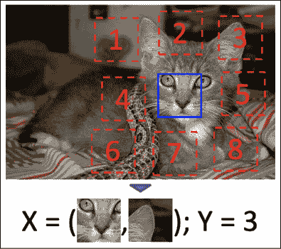
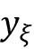
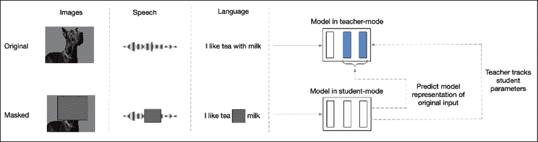

# 第十章：自监督学习

想象一下你处于海洋中央，渴得无法忍受。周围是水，但你不能喝其中任何一滴。但是，如果你有能力将水中的盐分煮掉，使它变得可以饮用呢？当然，这个过程的能源成本可能相当高，因此你可能会适度使用这一过程。然而，如果你的能源成本变得几乎为零，例如，你利用太阳能，这个过程可能会变得更具吸引力，甚至可以在更大规模上进行。

在我们上面描述的这个较为简化的情况中，第一个场景大致类似于监督学习，而第二个场景则与我们将在本章中讲解的无监督/半监督学习技术类别相似。监督学习技术的最大问题是与收集标签训练数据相关的时间和费用。因此，带标签的数据集通常相对较小。

深度学习在计算与手动特征工程之间进行权衡，虽然这种方法非常有效，但深度学习模型通常需要比传统（非深度学习）模型更多的数据来进行训练。深度学习模型通常更加复杂，具有更多可学习的参数，这使得它们在各种任务中表现得更好。然而，更复杂的模型也需要更多的数据来训练。由于训练数据的创建成本较高，这实际上限制了我们使用监督学习来扩展深度学习模型。

不幸的是，完全不需要标签数据的无监督学习技术至今尚未取得太大成功。自监督技术通过利用野外数据的结构来创建标签数据，以供监督学习模型使用，从而提供了一种折衷方案。在本章中，我们将学习各种自监督技术及其在自然语言处理、计算机视觉和音频信号处理等领域的应用。

本章将涵盖以下主题：

+   之前的工作

+   自监督学习

+   自预测

+   对比学习

+   前置任务

本章的所有代码文件可以在 https://packt.link/dltfchp10 找到

自监督学习是通过富有创意地重新利用数据中已经隐含存在的标签的过程。在本章中，我们将学习一些常见的自监督学习策略，并举例说明它们在解决现实问题中的应用。让我们开始吧。

# 之前的工作

自监督学习并不是一个新概念。然而，随着基于变换器的模型（如 BERT 和 GPT-2）的出现，这一术语变得广为人知，这些模型通过半监督的方式在大量未标记的文本上进行训练。过去，自监督学习通常被归类为无监督学习。然而，早期有许多模型尝试利用输入数据中的规律性来生成与使用监督学习相当的结果。你在前面的章节中已经接触过其中的一些，但我们将在本节中简要介绍它们。

**限制玻尔兹曼机**（**RBM**）是一个生成神经网络模型，可以学习输入的概率分布。它于 1986 年发明，并在 2000 年代中期得到了改进。它可以在监督或无监督模式下进行训练，并可以应用于许多下游任务，如降维、分类等。

**自编码器**（**AEs**）是无监督学习模型，旨在通过学习重建输入数据，来学习其有效的潜在表示。潜在表示可用于对输入进行编码，以便用于下游任务。该模型有多种变体。稀疏、自噪声和对比 AEs 在学习下游分类任务的表示方面非常有效，而变分 AEs 作为生成模型更为有用。

Word2Vec 模型是另一个很好的例子，我们现在称之为自监督学习。CBOW 和 skip-gram 模型用于构建词语的潜在表示，分别尝试学习邻居到词语和词语到邻居的映射。然而，潜在表示现在可以作为词嵌入，应用于各种下游任务。同样，GloVe 模型也是一个自监督模型，利用词汇共现和矩阵分解来生成用于下游任务的词嵌入。

**自回归**（**AR**）模型根据过去的行为预测未来的行为。我们在本章的*自我预测*部分进行了讨论。然而，AR 模型源自统计学中的时间序列分析，来自神经（但在变换器之前的）自然语言处理中的隐马尔可夫模型，以及**递归神经网络**（**RNNs**）。

**对比学习**（**CL**）模型试图学习表示，使得相似的项目对聚集在一起，而不相似的项目对被推得很远。

本章的*对比学习*部分也介绍了 CL 模型。然而，**自组织映射**（**SOMs**）和孪生网络使用非常相似的思想，可能是当前 CL 模型的前身。

# 自监督学习

在自监督学习中，网络通过监督学习进行训练，但标签是通过利用数据的某些属性以自动化方式获得的，而无需人工标注。通常，这种自动化是通过利用数据样本的不同部分如何相互作用并学习预测这种关系来实现的。换句话说，数据本身为学习过程提供了监督。

一类技术涉及利用同一数据样本内部的共现或在不同时间点的同一数据样本之间的共现。这些技术将在*自预测*部分中更详细地讨论。

另一类技术涉及利用给定数据样本中的共现模态，例如文本与其相关的音频流，或图像与其标题之间的关系。此技术的示例将在联合学习部分讨论。

另一类自监督学习技术涉及利用数据样本对之间的关系。这些对是根据某些领域级启发式从数据集中选择的。这些技术的示例在*对比学习*部分中有详细介绍。

这些技术可以直接用来训练模型解决业务任务（例如情感分析、分类等），也可以用来学习数据的潜在（嵌入）表示，然后用于生成特征，学习解决下游业务任务。后一类任务是用来间接学习数据的潜在表示的，称为前置任务。*前置任务*部分将更详细地讨论这一主题，并提供示例。

自监督学习的优势有两个方面。首先，正如前面所提到的，监督学习涉及数据的人工标注，这种标注过程成本非常高，因此很难获得高质量的标注数据。其次，自监督任务可能不会直接解决业务任务，但可以用来学习数据的良好表示，然后可以将此信息转移到实际的下游业务任务中。

# 自预测

自预测的思路是给定数据样本的一部分，预测另一部分。为了进行预测，我们假装要预测的部分是隐藏的或缺失的，并学习如何预测它。显然，两个部分都是已知的，而要预测的部分作为数据标签。模型以监督的方式进行训练，使用非隐藏部分作为输入，隐藏部分作为标签，学习准确地预测隐藏部分。本质上，就是假装输入的某个部分是未知的，并进行预测。

这个思路也可以扩展到反向管道，例如故意向图像中添加噪声，并使用原始图像作为标签，将损坏的图像作为输入。

## 自回归生成

**自回归**（**AR**）模型试图根据过去的事件、行为或特性来预测未来的事件、行为或特性。任何具有固有顺序的数据都可以使用 AR 生成进行建模。与变分自编码器（VAE）或生成对抗网络（GAN）等潜在变量模型不同，AR 模型不假设独立性。

### PixelRNN

PixelRNN [1] AR 模型使用二维**循环神经网络**（**RNNs**）对图像进行大规模建模。其思想是通过依赖左边和上方所有像素来学习生成一个像素。通过卷积操作可以一次性计算每个维度上的所有状态。PixelRNN 中使用的 LSTM 层有两种类型——行 LSTM 和对角双向 LSTM。在行 LSTM 中，卷积操作沿每一行应用；而在对角双向 LSTM 中，卷积操作则沿图像的对角线应用：

|  |  |
| --- | --- |

图 10.1：PixelRNN 通过依赖左侧和上方的所有像素来预测一个像素。来自论文《像素递归神经网络》[1]

### 图像 GPT（IPT）

图像 GPT（IPT）[14]与 PixelRNN 类似，只是它在图像块上工作，并且每个图像块被视为一个词。图像 GPT 基于变换器模型，使用 ImageNet 数据集上的图像进行训练。这些图像通过多种方式（超分辨率、双三次插值、添加噪声等）被损坏，然后进行预训练以预测原始图像。IPT 模型的核心包括变换器的编码器-解码器对，但具有多个头部和尾部，分别用于从损坏的输入图像中提取特征，并将解码器输出格式化为输出图像。这些多个头部和尾部专门用于 IPT 训练的不同任务（去噪、去雨、x2 和 x4 超分辨率等）：


图 10.2：图像 GPT（IPT）AR 模型的架构。来自论文《预训练图像处理变换器》[14]

### GPT-3

GPT-3（或称生成预训练变换器）[9]是 OpenAI 推出的一种自回归（AR）语言模型，能够生成类似人类的文本。它根据人类提供的提示生成单词、代码和其他数据的序列。GPT 的第一个版本使用了 1.1 亿个学习参数，GPT-2 使用了 15 亿个，GPT-3 使用了 1750 亿个参数。该模型使用了互联网上现成的无标签文本进行训练，如维基百科，最初是英文的，后来也包括了其他语言。GPT-3 模型有广泛的应用场景，包括摘要生成、翻译、语法修正、问答、聊天机器人和电子邮件写作等。

GPT-3 的流行催生了一种新职业，称为提示工程 [39]，其基本任务是为 GPT-3 创建最有效的提示，以便启动它执行各种任务。GPT-3 的一些可能应用可以在 OpenAI GPT-3 示例页面找到（[`beta.openai.com/examples/`](https://beta.openai.com/examples/)）。

### XLNet

XLNet [38] 类似于 GPT-3，都是一种广义的自回归模型。然而，它同时利用了自回归语言建模和**自编码**，并避免了它们的局限性。它不是仅使用来自左侧或右侧上下文的标记来预测下一个标记，而是使用左侧和右侧上下文中所有可能的标记排列，从而使用来自左右两侧上下文的标记进行预测。其次，不同于像 BERT 这样的自编码方法，它不依赖于输入的损坏（如掩码语言建模中那样），因为它是一个广义的自回归语言模型。经验上，在可比较的实验设置下，XLNet 在广泛的任务上始终优于 BERT。

### WaveNet

WaveNet [3] 是一种基于 PixelCNN 架构的自回归生成模型，但它在原始音频波形上进行操作。与 PixelCNN 一样，WaveNet 在特定时间点的音频样本依赖于所有前一个时间步的样本。条件概率分布被建模为一堆卷积层。WaveNet 的核心成分是因果卷积。模型在某一时间步产生的预测不能依赖于任何未来的时间步。应用于语音合成时，WaveNet 展现出最先进的性能，人工听众评定其在英语和普通话语音合成方面，比其他类似的文本到语音模型自然得多。

### WaveRNN

WaveRNN [28] 是一种自回归生成模型，通过将数据的分布分解为每个样本的条件概率的乘积来学习数据的联合概率。WaveNet 架构中的卷积层被单层 RNN 替代。它还使用了更高效的采样技术，整体上减少了需要执行的操作次数，并使得 WaveRNN 比 WaveNet 提速约 4 倍。

## 掩码生成

掩码生成模型会随机遮蔽部分自身，并假装这些部分是缺失的，模型通过利用未遮蔽的信息来预测这些遮蔽的信息。与自回归模型不同，掩码生成模型中，遮蔽的信息不需要位于未遮蔽信息的前后，它可以出现在输入的任何位置。

### BERT

**BERT** [16]，即**双向编码器表示模型**，是一种基于 Transformer 的语言模型，由谷歌的团队使用互联网文本进行训练。在预训练阶段，BERT 使用两个目标——**掩码语言建模**（**MLM**）和**下一个句子预测**（**NSP**）。在训练过程中，15%的输入标记会被掩码，模型需要学习预测被掩码的标记。由于 BERT 是基于 Transformer 的，它可以使用句子中任何位置的上下文信息来帮助预测被掩码的标记。BERT 模型在预训练完成后，可以通过较小的有监督数据集进行微调，用于各种下游任务，如分类、情感分析、文本蕴含等。**BERT**将在*第六章*，*Transformer*中详细介绍。

```py
[MASK] in the sentence "The capital of France is [MASK].":
```

```py
from transformers import BertTokenizer, TFBertForMaskedLM
import tensorflow as tf
tokenizer = BertTokenizer.from_pretrained("bert-base-cased")
model = TFBertForMaskedLM.from_pretrained("bert-base-cased")
inputs = tokenizer("The capital of France is [MASK].", return_tensors="tf")
logits = model(**inputs).logits
mask_token_index = tf.where(inputs.input_ids == tokenizer.mask_token_id)[0][1]
predicted_token_id = tf.math.argmax(logits[:, mask_token_index], axis=-1)
print(tokenizer.convert_ids_to_tokens(predicted_token_id)[0]) 
```

有些时候可以预测，这段代码块的输出是`"Paris"`。

### 堆叠去噪自编码器

堆叠去噪自编码器（AE）[29]向图像中添加随机噪声，并使用它们作为去噪自编码器的输入，来预测原始图像。多个去噪自编码器层分别进行训练并堆叠。这样形成了多个非线性组合，并且是实现困难图像识别任务更好泛化性能的关键。通过这种纯无监督方式学习的更高层次的表示，可以作为图像特征，提升下游基于 SVM 的图像分类器的性能。每一层的功能类似于普通的自编码器，即它以图像为输入，并在经过一个“瓶颈”层后尝试重建图像。瓶颈层学习输入图像的紧凑特征表示。不幸的是，自编码器通常只会学习如何压缩图像，而不会学习语义上有意义的表示。去噪自编码器通过破坏输入并要求网络恢复破坏，从而学会更好的语义表示输入图像。

### 上下文自编码器

上下文自编码器[12]将图像的一个区域进行遮掩，并使用它来训练卷积神经网络（上下文自编码器，Context AE），以回归缺失的像素值，进而预测原始图像。上下文自编码器的任务比去噪自编码器的任务更难，因为它需要填补更大范围的缺失区域，而且不能使用来自相邻像素的信息。这需要对图像有更深层次的语义理解，并且能够在大范围的空间区域上生成高级特征。从某种意义上说，上下文自编码器是一种更强大的生成模型，因为它不仅需要填补缺失的区域，还需要与已提供的上下文保持一致。

因此，上下文自编码器的训练目标是重建损失和对抗损失的结合。这比仅仅训练重建（L2）损失的模型产生更锐利的预测：


图 10.3：上下文编码器任务的定性说明（来自《上下文编码器：通过修复学习特征》[10]）

上下文不一定是图像特征，也可以是颜色，正如我们将在下一节看到的那样。

### 色彩化

论文*《色彩化作为视觉理解的代理任务》* [12] 使用色彩化作为学习图像表示的一种方式。彩色图像被转换为其灰度等效图像，然后作为输入来预测原始的彩色图像。该模型可以自动为灰度图像上色，同时学习一种表示方式，能够帮助进行下游任务，如图像分类和分割。从功能上讲，该模型根据`L`（灰度）通道预测其*Lab*编码中的`a`和`b`（颜色信息）通道。本文作者在 ImageNet 数据集上进行的实验结果表明，该模型在没有使用 ImageNet 标签的情况下，能够在语义分割和图像分类数据集上产生最先进的结果，甚至超过一些早期的、在 ImageNet 上使用监督学习训练的模型。

## 固有关系预测

使用该技术的模型尝试通过利用输入图像各部分之间的固有关系来学习视觉常识任务。这些学习到的模型的权重可以用来为其他下游任务生成图像的语义表示。

### 相对位置

论文*《通过上下文预测进行无监督视觉表示学习》* [8] 预测图像中一个区域相对于另一个区域的相对位置。实际上，这种方法使用空间上下文作为自监督的来源来训练视觉表示。给定一个大型未标记的图像集合，从每张图像中提取出随机的区域对，如*图 10.4*所示。每对区域根据第二个区域相对于中心区域的方向进行标注。训练一个卷积神经网络来预测第二个区域相对于第一个区域的位置。学习到的特征表示能够捕捉到图像间的视觉相似性概念。利用这种表示，已证明它有助于视觉数据挖掘，即发现描绘相同语义对象的图像片段，在 Pascal VOC 2007 数据集上效果尤为显著：



图 10.4：相对位置预测的说明。模型必须预测第二个区域相对于（中心）第一个区域的配置。来自论文《通过上下文预测进行无监督视觉表示学习》[8]

### 解谜拼图

论文《通过解拼图实现无监督视觉表征学习》[26]描述了一种与之前的相对位置预测方法相似的方法。该方法尝试通过解决自然图像的拼图来学习图像的视觉表征。首先从输入图像中提取小块并打乱，形成拼图。网络学习从拼图中重建原始图像，即解开拼图。所用的网络是**上下文自由网络**（**CFN**），一种 n 路并行的孪生网络。每个小块对应于 n 路 CFN 中的一列。每列中的共享层与 AlexNet 中的实现完全相同。分类头预测小块的原始索引（即打乱前的位置）。在 Pascal VOC 数据集上，它在图像分类和物体检测任务中超越了所有先前的自监督模型：


图 10.5：图像被分割成多个小块并打乱，模型学习将这些打乱的小块重新排列回正确的顺序。摘自论文《无监督视觉表征学习》[26]

### 旋转

RotNet 模型 [34] 通过使用旋转作为自监督信号来学习图像表征。输入图像分别旋转 0、90、180 和 270 度，并训练一个卷积网络（RotNet）来预测旋转角度，作为 4 个目标类之一。事实证明，这个看似简单的任务为语义特征学习提供了一个非常强大的监督信号。RotNet 特征被用作图像分类的输入，针对 CIFAR-10 数据集，分类精度仅比使用监督学习获得的最先进结果低 1.6%。在当时，它还在一些分类任务中取得了 ImageNet 的最先进结果，并且在一些分类和物体检测任务中也取得了 Pascal VOC 的优秀表现。

## 混合自预测

使用混合自预测模型，利用多个自预测策略实现自预测，而不是只使用一种策略。例如，我们的前两个示例，Jukebox 和 DALL-E，通过首先使用一种自监督技术（VQ-VAE 或向量量化变分自编码器 [35]）将输入数据简化为更易处理的格式，然后使用另一种（AR）在简化后的图像上生成最终预测，从而实现自预测。在我们的第三个示例中，VQ-VAE 组件的预测通过使用对抗训练的判别器进一步精细化。

### VQ-VAE

由于 VQ-VAE 是我们所有混合自预测模型的共同组成部分，我们可以尝试从高层次理解它的工作原理。你已经在 *第八章*《自编码器》中阅读过自编码器和变分自编码器。自编码器试图通过首先将输入编码为更小的维度，然后解码该较小维度的输出，来学习重构其输入。然而，自编码器通常最终只是压缩输入，而未能学习到好的语义表示。

**变分自编码器**（**VAE**）在这方面可以做得更好，因为它通过强制使用概率先验，通常采用标准高斯分布的形式，并通过最小化重构损失以及先验分布与后验分布（潜在空间中的实际分布）之间的 KL 散度来进行优化。

虽然 VAE 学习的是连续的潜在分布，但 VQ-VAE 学习的是离散的潜在分布。这是有用的，因为 transformers 被设计为接受离散数据作为输入。VQ-VAE 通过向网络中添加一个离散代码本组件来扩展 VAE，该组件用于通过选择与每个潜在向量在欧几里得距离上最接近的代码本向量来量化编码器输出的潜在向量。VQ-VAE 解码器的任务是从离散化的潜在向量重构输入。

### Jukebox

我们的第一个示例是 Jukebox 论文[32]，这是一个音乐生成模型，类似于 GPT-3 是一个文本生成模型，Image-GPT 是一个图像生成模型。也就是说，给定一个音乐（声音和音乐）提示，Jukebox 可以生成可能跟随此提示的音乐。早期的音频生成模型尝试通过钢琴卷轴的形式生成符号化的音乐，因为直接生成原始音频的问题在于其包含的信息量极大，因此需要建模极长的依赖关系。VQ-VAE 通过学习音频的低维编码来解决这个问题，目的是尽量减少丢失不重要的信息，同时保留大部分有用信息。

Jukebox 使用层次化的 VQ-VAE 将输入信号离散化为不同的时间分辨率，然后在每个分辨率下生成一个新的序列，最后将每个层级生成的序列组合成最终的预测。

### DALL-E

我们的第二个混合预测模型示例是 OpenAI 的 DALL-E 模型[5]。DALL-E 也可以归类为联合学习（多模态）模型，因为它试图从文本描述中学习生成图像，使用文本和图像的配对作为训练输入。然而，我们在这里将其归类为混合预测模型，因为与 Jukebox 一样，它试图通过使用 VQ-VAE 来解决图像信息的高维度问题（与相关文本的维度相比）。

DALL-E 将文本和图像作为单一数据流接收。DALL-E 使用了两阶段的训练方案。在第一阶段，训练了一个 VQ-VAE 将每个输入的大小为 (256, 256, 3) 的 RGB 图像压缩成大小为 (32, 32) 的图像令牌网格，其中的每个元素可以取 8,192 个可能的离散值之一。这使得图像输入的大小减小了 192 倍，而图像质量没有相应的损失。

在第二阶段，文本被 BPE 编码并截断为 256 个令牌。**字节对编码**（**BPE**）是一种混合字符/词编码，可以使用相对较小的词汇表来表示大语料库，通过编码常见的字节对。然后，此编码与扁平化的 1,024 个（32 x 32）图像令牌序列串联。使用这个联合序列来训练自回归变换器，以建模文本和图像令牌的联合分布。第一阶段学习了 VQ-VAE 中的视觉码书，第二阶段学习了文本和图像令牌离散潜在分布的先验。训练好的 DALL-E 模型可以根据文本提示生成图像。

文本生成图像正变得相当流行。最近，OpenAI 发布了名为 DALL-E 2 的更新版本，它拥有 350 亿个参数，而原版 DALL-E 只有 120 亿个参数。尽管它们的命名相似，DALL-E 是 GPT-3 的一个版本，专门用于根据文本描述生成图像，而 DALL-E 2 则是一个编码器-解码器管道，使用 CLIP 将文本描述编码为 CLIP 嵌入，然后使用你在《第九章》《生成模型》中学到的扩散模型将嵌入解码为图像。不出所料，DALL-E 2 生成的图像比 DALL-E 更真实、更准确。

更近期，Google Research 发布了 Imagen，这是这一领域的另一个与 DALL-E 2 竞争的模型。与 DALL-E 2 类似，Imagen 使用了 T5-XXL 编码器将输入文本映射到嵌入，并使用扩散模型将嵌入解码为图像。

### VQ-GAN

VQ-GAN [30] 使用了一个编码器-解码器框架，其中编码器使用了 VQ-VAE 风格的编码器，学习了一个离散潜在表示，但解码器是一个 **生成对抗网络**（**GAN**）的鉴别器组件。VQ-GAN 不使用 VQ-VAE 中使用的 L2 损失，而是使用感知损失和鉴别器损失的组合，这有助于在增加压缩率时保持良好的感知质量。与传统的 VAE 解码器相比，使用 GAN 结构有助于训练效率。

类似于 VQ-VAE，VQ-GAN 学习了一个上下文丰富的视觉组件的码书，这些组件用于组合序列以训练自回归组件。使用 **Fréchet Inception Distance**（**FID**）指标发现，VQ-GAN 在使用 ImageNet 图像上优于 VQ-VAE-2 模型，尽管它使用的参数大约少了 10 倍：


图 10.6：VQ-GAN 架构。来自论文：《驯服变换器以进行高分辨率图像合成》[30]

接下来，我们将了解另一种流行的自监督技术——对比学习。

# 对比学习

**对比学习**（**CL**）试图预测一对输入样本之间的关系。CL 的目标是学习一个嵌入空间，使得相似的样本对被拉近，而不相似的样本对被推远。训练 CL 模型的输入是以*数据点对*的形式出现的。CL 可以在有监督和无监督的设置中使用。

在无监督设置中使用时，它可以成为一种非常强大的自监督学习方法。通过自监督的方式从现有数据中找到相似对，从相似对的数据对中找到不相似的对。模型学习预测一对数据点是否相似或不同。

可以通过考虑用于生成对比样本的技术来推导出 CL 的分类法。在我们这么做之前，我们将简单地探索一下在 CL 中流行的各种训练目标。

## 训练目标

早期的 CL 模型使用由一个正样本和一个负样本组成的数据点来学习。然而，最近的 CL 模型趋势是从单个批次中的多个正负样本中学习。在本节中，我们将介绍一些常用于训练 CL 模型的训练目标（也叫损失函数）。

### 对比损失

对比损失[35]是使用 CL 技术进行学习的最早训练目标之一。它试图将数据编码到嵌入空间中，使得同一类别的样本具有相似的嵌入，而不同类别的样本具有不相似的嵌入。因此，给定两个数据对（`xᵢ`*, y*[i]）和（`xⱼ`*, y*[j]），对比损失目标可以通过以下公式来描述：


当对*数据对*i 和`j`相似时，第一个项被激活，当数据对不相似时，第二个项被激活。目标是最大化第一个项中的差异的平方，并最小化第二项中的差异的平方（从而在不相似的样本对情况下最大化第二项）。！[](img/B18331_10_003.png)是一个超参数，表示不同类别样本之间允许的最小距离的边界。

### 三元组损失

三元组损失 [11] 是对比损失的增强版，它使用三个数据点而不是两个——锚点、正样本和负样本。因此，给定一个锚点 `x`，我们选择一个正样本  和一个负样本 ，其中 `x` 和  属于同一类，而 `x` 和  属于不同类。三元组损失学习最小化锚点 `x` 与正样本  之间的距离，并最大化 `x` 与负样本  之间的距离。这个过程在 *图 10.7* 中有示意图：


图 10.7：三元组损失的示意图。基于论文：FaceNet: A Unified Embedding for Face Recognition and Clustering [11]

三元组损失的公式如下所示。与对比损失一样， 是一个超参数，表示相似对与不相似对之间的最小允许差异。基于三元组损失的模型通常需要具有挑战性的值，如 ，即所谓的硬负样本，以提供良好的表示：


### N-pair 损失

N-pair 损失 [21] 是三元组损失的泛化，它将与多个负样本的比较引入，而不仅仅是与一个负样本进行比较。因此，给定一个 *(N+1)* 元组的训练样本，{`x`, `x`^+, `x[1]`^-, `x[2]`^-, …, `x[N+1]`^-}，其中有一个正样本和 *N-1* 个负样本，N-pair 损失使用以下公式定义：


### 提升的结构损失

提升的结构损失 [15] 是三元组损失的另一种泛化，它使用训练批次中的所有成对边。这可以带来更好的训练效果。*图 10.8* 说明了提升结构损失的原理，以及它如何从对比损失和三元组损失演变而来。红色边连接相似的对，蓝色边连接不相似的对：


图 10.8：提升结构损失的原理示意图。基于论文：Deep Metric Learning via Lifted Structured Feature Embedding [15]

### NCE 损失

**噪声对比估计** (**NCE**) 损失 [27] 使用逻辑回归来区分正例和负例（噪声）。NCE 损失试图最大化正例 `x` 的对数几率（logits），并最小化负例的对数几率 。NCE 损失的公式如下所示：


### InfoNCE 损失

InfoNCE 损失[2]受到 NCE 损失（在前一节中描述）的启发，使用分类交叉熵损失从无关噪声样本的集合中识别正样本。给定一些上下文向量`c`，正样本应从条件概率分布*p(x|c)*中抽取，而*N-1*个负样本则可以从与上下文`c`无关的分布*p(x)*中抽取。InfoNCE 损失优化的是正确分类正样本的负对数概率。

InfoNCE 损失通过以下方程给出，其中*f(x, c)*估计密度比*p(x|c) / p(x)*：


### Soft 最近邻损失

Soft 最近邻损失[33]进一步扩展了对比损失的思想，包含了已知标签下的多个正样本。给定一批样本，，其中`yᵢ`是`xᵢ`的类别标签，以及一个相似性函数`f`，该函数衡量两个输入之间的相似性，Soft 最近邻损失由以下方程给出：


温度是一个超参数，用于调整表示空间中特征的集中程度。因此，在低温度下，表示空间中远离点对 Soft 最近邻损失的贡献也较低。

## 实例转换

使用实例转换的 CL 模型通常依赖数据增强技术生成正样本对，并通过负样本挖掘技术从正样本对中生成负样本对。许多这样的模型依赖于生成批次内的负样本和创新的硬负样本挖掘技术。

数据增强技术用于创建原始数据点及其噪声版本的样本对。这将非本质的变化引入样本中，而不修改语义意义，模型随后在训练过程中学习这些变化。

批内负采样是一种通过结合单个批次内示例的信息来生成负样本的技术。对于批次中的每个正样本对(`xᵢ`*, y*[i])，所有对(`xᵢ`*, y*[j])和(`xⱼ`*, y*[i])都可以视为负样本对。实际上，负样本对是通过在同一批次内将两个随机正样本对的元素组合来创建的。该技术实用且能够在 GPU 上高效实现，因此广泛使用。

一些模型需要硬负样本来学习如何执行任务。硬负样本是标签不同但嵌入特征非常接近的样本对。你可以将它们视为在嵌入空间中非常接近但位于决策边界两侧的点。对于有监督学习，识别硬负样本相对简单。对于无监督学习，一种方法是增加批量大小，从而引入更多硬负样本。另一种技术[19]是根据候选负样本与锚点样本的相似性来增加其采样概率。

### SimCLR

SimCLR 模型[36]提供了一个用于对比学习视觉表征的简单框架。每个输入图像（`x`）通过使用相同的图像增强策略家族，以两种不同的方式（`xᵢ`和`xⱼ`）进行增强，从而产生*2N*个正样本。

使用批内负样本采样，因此对于每个正样本，我们有*(2N-1)*个负样本。对于每个示例中的数据点对，应用一个基础编码器（`f`），然后一个投影头（`g`）尝试最大化正样本对的相似度，并最小化负样本对的相似度。为了获得良好的性能，SimCLR 需要使用大批量大小，以便在训练过程中包含足够的负样本。SimCLR 在 ImageNet 上实现了自监督和半监督模型的最新成果，并与监督学习的 ResNet-50 表现相匹配。*图 10.9*展示了 SimCLR 模型的架构：


图 10.9：SimCLR 模型的架构。摘自论文：A Simple Framework for Contrastive Learning of Visual Representations [36]

### Barlow Twins

Barlow Twins 模型[20]的思想源自神经科学，即感知处理的目标是将高度冗余的感官输入重新编码为因子化代码，或具有统计独立成分的代码。在此模型中，图像被扭曲成两个版本。将这两个扭曲版本输入相同的网络以提取特征，并学习使这两个特征之间的交叉相关矩阵尽可能接近单位矩阵。与神经科学的理念一致，该模型的目标是通过减少这些向量之间的冗余，来减少样本的两个扭曲版本之间的冗余。这体现在其独特的损失函数中——在第一个公式中，第一项表示身份矩阵与交叉相关矩阵之间的差异，第二项表示冗余减少项。第二个公式定义了交叉相关矩阵`C`的每个元素：


Barlow Twins 模型与该领域其他模型的一些显著区别在于，Barlow Twins 模型不需要大量负样本，因此可以在较小的批次上运行，并且受益于高维嵌入。Barlow Twins 模型在 ImageNet 上超越了一些先前的半监督模型，并与一些监督学习的 ImageNet 模型持平。

### BYOL

**Bootstrap Your Own Latent**（**BYOL**）模型 [17] 的独特之处在于它完全不使用负样本。它依赖于两个相互作用并彼此学习的神经网络——在线网络和目标网络。BYOL 的目标是学习一个可以用于下游任务的表示 。在线网络由一组权重  参数化，并包括三个阶段——编码器 、投影器  和预测器 。目标网络的架构与在线网络相同，但使用一组不同的权重 。目标网络提供回归目标来训练在线网络，其参数  是在线网络参数  的指数移动平均。在每次训练步骤之后，执行以下更新：


BYOL 为每个图像生成两个增强视图。对于第一个增强视图，在线网络输出一个表示  和一个投影 。同样，目标网络输出一个表示  和一个投影 。BYOL 尝试最小化 L2 归一化的在线投影和目标投影之间的误差  和 。在训练结束时，我们只保留在线网络（编码器）。

BYOL 在 ImageNet 上与半监督或迁移学习模型相比，取得了竞争性的结果。与该领域的其他模型相比，它对批量大小和图像增强类型的变化不太敏感。然而，后续研究 [4] 表明，BYOL 中的批归一化组件可能通过隐式创建负样本，作为数据重分布的结果，从而隐式地引发了一种对比学习形式。

### 特征聚类

特征聚类涉及通过聚类找到相似的数据样本。当数据增强技术不可行时，这非常有用。这里的想法是使用聚类算法为样本分配伪标签，以便我们可以进行样本内对比学习（CL）。尽管相似，特征聚类与对比学习不同，它放宽了实例区分问题——与其学习区分单一输入图像的多个变换，特征聚类则学习区分具有相似特征的图像组。

### DeepCluster

DeepCluster [24]论文的前提是，像 ImageNet 这样的监督学习数据集“过于小”，无法考虑超出图像分类的一般目的特征。为了学习一般目的特征，需要在互联网规模的数十亿图像上进行训练。然而，标注如此大规模的数据集并不可行，因此 DeepCluster 提出了一种聚类方法，联合学习神经网络的参数和生成特征的聚类分配。DeepCluster 通过 K-Means 聚类算法迭代地对这些特征进行分组，并使用聚类分配作为伪标签来学习 ConvNet 的参数。训练的最终产物是 ConvNet 的权重。这些权重已被证明是有用的通用视觉特征，并且在许多下游任务中超越了在不同数据集上发布的最佳结果。

### SwAV

**SwAV**（**SWapping Assignments between multiple Views**）[25]模型通过预测来自另一个视图的表示来学习特征，从而预测某一视图的聚类分配（伪标签）。SwAV 使用了与 CL 模型中相似的架构变体。图像`x[1]`和`x[2]`是同一输入图像`x`的变换，经过编码器  生成表示`z[1]`和`z[2]`。在 SwAV 的情况下，`z[1]`和`z[2]`用于通过将其特征与一组`K`原型向量*{c*[1]*, …, c*[K]*}*进行匹配，从而计算`q[1]`和`q[2]`，这些向量随后用于分别预测`x[2]`和`x[1]`的聚类分配。

与 DeepCluster 不同，SwAV 进行在线聚类（即对持续流式到达的数据进行聚类，这些数据在聚类过程开始之前并不为人所知），因此能够扩展到潜在的无限数据量。SwAV 还适用于大批量和小批量大小。SwAV 论文还提出了一种新的多裁剪策略，可以在没有计算或内存开销的情况下增加图像的视图数量。它在 ImageNet 上使用 ResNet50（监督学习方法）取得了 75%的 Top-1 准确率，并且在所有考虑的迁移任务中超越了监督预训练的结果。

### InterCLR

InterCLR [18]是一个混合模型，通过利用图像内和图像间的不变性来共同学习视觉表示。它在其流程中有两个不变性学习分支，一个用于图像内，一个用于图像间。图像内分支通过标准 CL 方法构造对比对，例如从输入图像生成一对变换。图像间分支使用通过聚类获得的伪标签构造对比对——同一聚类中的两个项构成正对，来自不同聚类的两项构成负对。

使用 InfoNCE 损失函数的变体来计算对比损失，并通过反向传播训练网络：


图 10.10：InterCLR 模型的架构。摘自论文：深入探讨无监督视觉表示的图像间不变性 [18]

InterCLR 论文还讨论了伪标签维护、采样策略和图像间分支的决策边界设计等一些特别考虑因素，但为了节省篇幅，我们在此略过。InterCLR 模型在多个标准基准测试中，相较于现有的图像内不变性学习方法，展示了许多改进。

## 多视图编码

多视图编码近年来已成为主流的 CL 方法，涉及使用同一物体的两个或多个视角构建正对比样本。目标是最大化多个视角的表示之间的互信息，对于正例，负例则最小化这一互信息。这要求模型学习跨越多个视角的高阶特征。

### AMDIM

**增强多尺度深度信息最大化**（**AMDIM**）[31] 是一个基于早期局部深度信息最大化方法的自监督表征学习模型，旨在最大化一个全局摘要特征与一组从编码器中间层提取的局部特征之间的互信息。全局摘要特征依赖于整个输入，局部特征则来自中间层。AMDIM 通过预测每个输入的独立增强特征，以及跨多个尺度的特征，扩展了 DIM，并使用了更强大的编码器。

论文还考虑了生成对比对的其他方法，如实例变换和多模态（将在下一节讨论），但在此描述是因为它也考虑了使用多视图编码构建对比对。这一模型在多个自监督学习目标的基准测试中超越了若干标准。

### CMC

**对比多视图编码**（**CMC**）[37] 模型基于这样一个理念：当一个物体由多个视角表示时，这些视角每一个都带有噪声且不完整，但物体的物理、几何和语义等重要因素通常在所有视角中是共享的。CMC 的目标是学习物体的紧凑表示，捕捉这些重要因素。CMC 通过使用 CL 来学习一个表示，使得同一场景的视角映射到相近的点，而不同场景的视角则映射到远离的点。

## 多模态模型

本节涵盖的模型类别包括使用来自两个或更多模态的配对输入的模型。这些模型的输入可以是图像和字幕、视频和文本、音频片段及其转录本等。这些模型学习跨多个模态的联合嵌入。在这一类模型中，我们将以 CLIP [6] 和 CodeSearchNet [13] 模型为例进行讲解。

另一类多模态模型是可以用于跨多个模态进行自监督学习的框架。Data2Vec [7] 模型就是这样一个模型的例子。

### CLIP

CLIP 模型 [6] 通过学习预测哪些图像与哪些字幕匹配来学习图像表示。它在互联网上预训练了 4 亿对图像-文本数据。预训练之后，该模型可以使用自然语言查询来引用已学习的视觉概念。CLIP 可以在零-shot 模式下用于下游任务，如图像分类、文本到图像生成以及图像到图像的搜索。该模型在自然图像的表现上与完全监督基准具有竞争力，且无需额外的微调。例如，CLIP 在零-shot 模式下可以与原始 ResNet50 在 ImageNet 上的准确度相匹配，即无需额外微调。CLIP 还可以通过使用特定的图像数据集进行微调，来应对特定的下游任务，例如学习卫星图像的视觉表示或肿瘤检测。

*图 10.11* 展示了 CLIP 模型的训练与推理架构。图像和文本编码器都是基于 Transformer 的编码器。预训练的目标是解决预测哪些文本与哪些图像整体匹配的任务。因此，给定一批 `N` 对图像-文本对，CLIP 学习预测在 `N` x `N` 的所有可能图像-文本对中，实际发生的图像-文本对是哪一对。CLIP 通过最大化批次中 N 对真实图像-文本嵌入的余弦相似度，同时最小化剩余的 `N`² *- N* 错误对的余弦相似度，来学习一个多模态联合嵌入空间。

在推理时，一个模态的输入可以用来预测另一个模态的输出，即，给定一个图像，它可以预测该图像的类别为文本：


图 10.11：CLIP 模型的架构。来自论文：《从自然语言监督中学习可迁移的视觉模型》 [34x]

```py
 the CLIP model’s ability to compare images and text. Here, we take an image of two cats side by side and compare it to two text strings: "a photo of a cat" and "a photo of a dog". CLIP can compare the image with the two text strings and correctly determine that the probability that the image is similar to the string "a photo of a cat" is 0.995 as opposed to a probability of 0.005 for the image being similar to the string "a photo of a dog":
```

```py
import tensorflow as tf
from PIL import Image
import requests
from transformers import CLIPProcessor, TFCLIPModel
model = TFCLIPModel.from_pretrained("openai/clip-vit-base-patch32")
processor = CLIPProcessor.from_pretrained("openai/clip-vit-base-patch32")
url = "http://images.cocodataset.org/val2017/000000039769.jpg"
image = Image.open(requests.get(url, stream=True).raw)
texts = ["a photo of a cat", "a photo of a dog"]
inputs = processor(text=texts, images=image, return_tensors="tf", padding=True)
outputs = model(**inputs)
logits_per_image = outputs.logits_per_image
probs = tf.nn.softmax(logits_per_image, axis=1)
print(probs.numpy()) 
```

CLIP 模型通过将文本和图像投影到单一的嵌入空间来实现这一点。通过这种共同嵌入的方法，CLIP 还能够计算两张图像和一段文本之间的相似度。它还提供了提取文本和图像编码的能力。

### CodeSearchNet

```py
 and query encodings for positive pairs and minimizes it for negative pairs.
```

### Data2Vec

Data2Vec [7] 有些不同，它提出了一个通用框架，用于跨多种模态进行自监督学习。它使用掩蔽预测，将相同的学习方法应用于语音、语言或计算机视觉。核心思想是基于输入的掩蔽视图预测整个输入的潜在表示。它不是预测特定模态的目标，如单词、视觉标记等，而是预测包含整个输入信息的上下文化潜在表示。它采用教师-学生架构——首先，构建完整输入数据的表示，作为学习任务的目标（教师模式）。然后对输入样本进行掩蔽编码，并预测完整的数据表示（学生模式）。教师的参数通过使用学生的指数衰减平均权重来更新。在训练结束时，教师的权重作为学习到的嵌入被使用。

使用该框架在语音识别、图像分类和自然语言理解等主要基准上的实验显示，无论是达到最先进的性能，还是与流行方法竞争，结果都非常出色：



图 10.12：Data2Vec 模型的架构。来自论文：data2vec: A General Framework for Self-supervised Learning in Speech, Vision and Language [7]

# 前置任务

前置任务是自监督学习模型试图通过利用无标签数据中固有的某些模式来解决的任务。这些任务本身不一定有用，但它们帮助系统学习一个有用的潜在表示，或者嵌入，这些表示可以直接使用，或在微调后用于其他下游任务。训练以解决前置任务通常作为构建实际模型的前奏，因此它也被称为预训练。

我们在本章中讨论的几乎所有技术都是前置任务。虽然一些任务本身可能最终会变得有用，例如色彩化或超分辨率，但它们也会产生嵌入，这些嵌入会学习所训练的无标签数据分布的语义，以学习到的权重的形式存在。这些权重随后可以应用于下游任务。

这不是一个新概念——例如，广泛用于寻找“同义词”的 Word2Vec 算法，是基于一个嵌入空间，在该空间中，语境相似的词汇聚在一起。它使用 skip-gram 或 CBOW 算法进行训练，这两种算法试图在给定一个词的情况下预测上下文词，反之亦然。这些目标本身没有直接的实用价值，但在这个过程中，网络最终会学习到输入数据中单词的良好潜在表示。这个表示可以直接用于寻找单词的“同义词”或进行单词类比，也可以用来生成有用的单词和单词序列（例如句子和文档）的向量表示，进而用于下游任务，例如文本分类或情感分析。

前置任务的最大优势在于，使用较少量的标注数据即可训练下游任务的模型。模型通过解决前置任务，利用大量现成的未标注数据，学习到有关领域的知识（大致的概况）。它只需要较少量的标注数据就能根据已经掌握的领域知识，学习解决更具体的下游任务。由于标注数据难以获得且成本较高，这种两步法通常能够使某些机器学习模型成为可能，甚至更具实用性。

# 小结

在本章中，我们了解了多种自监督策略，如何利用数据学习数据分布，并以专门的嵌入空间形式展示，这些嵌入空间又可以用来解决下游任务。我们讨论了自预测、对比学习和前置任务作为自监督的具体方法。

在下一章中，我们将讨论强化学习，这是一种通过奖励作为反馈机制来训练特定任务模型的方法。

# 参考文献

1.  Aaron van den Oord, Nal Kalchbrenner 和 Koray Kavucuoglu（2016）。像素递归神经网络 会议论文 MLR Press: [`proceedings.mlr.press/v48/oord16.pdf`](http://proceedings.mlr.press/v48/oord16.pdf)

1.  Aaron van den Oord, Yazhe Li, 和 Oriol Vinyals. *对比预测编码的表示学习*。Arxiv 预印本，arXiv 1807.03748 [cs.LG]: [`arxiv.org/pdf/1807.03748.pdf`](https://arxiv.org/pdf/1807.03748.pdf)

1.  Aaron van den Oord 等人（2016）。*WaveNet：一种原始音频的生成模型*。Arxiv 预印本，arXiv:1609.03499v2 [cs.SD]: [`arxiv.org/pdf/1609.03499.pdf`](https://arxiv.org/pdf/1609.03499.pdf)

1.  Abe Fetterman 和 Josh Albrecht（2020）。*理解自监督和对比学习*与“自举你的潜在表示”（BYOL）。博客文章：[`generallyintelligent.ai/blog/2020-08-24-understanding-self-supervised-contrastive-learning/`](https://generallyintelligent.ai/blog/2020-08-24-understanding-self-supervised-contrastive-learning/)

1.  Aditya Ramesh 等人。*零样本文本到图像生成*。Arxiv 预印本，arXiv 2102.12092v2 [cs.CV]：[`arxiv.org/pdf/2102.12092.pdf`](https://arxiv.org/pdf/2102.12092.pdf)

1.  Alec Radford 等人（2021）。*从自然语言监督中学习可迁移的视觉模型*。机器学习研究论文集（PMLR）：[`proceedings.mlr.press/v139/radford21a/radford21a.pdf`](http://proceedings.mlr.press/v139/radford21a/radford21a.pdf)

1.  Alexei Baevsky 等人（2022）。*data2vec：一个通用框架，用于语音、视觉和语言的自监督学习*。Arxiv 预印本，arXiv 2202.03555v1 [cs.LG]：[`arxiv.org/pdf/2202.03555.pdf`](https://arxiv.org/pdf/2202.03555.pdf)

1.  Carl Doersch、Abhinav Gupta 和 Alexei Efros（2015）。*通过上下文预测进行无监督视觉表示学习*。计算机视觉国际会议（ICCV）：[`www.cv-foundation.org/openaccess/content_iccv_2015/papers/Doersch_Unsupervised_Visual_Representation_ICCV_2015_paper.pdf`](https://www.cv-foundation.org/openaccess/content_iccv_2015/papers/Doersch_Unsupervised_Visual_Representation_ICCV_2015_paper.pdf)

1.  Chuan Li（2020）。*OpenAI 的 GPT-3 语言模型——技术概述*。LambdaLabs 博客文章：[`lambdalabs.com/blog/demystifying-gpt-3/`](https://lambdalabs.com/blog/demystifying-gpt-3/)

1.  Deepak Pathak 等人（2016）。*上下文编码器：通过填充学习特征*：[`openaccess.thecvf.com/content_cvpr_2016/papers/Pathak_Context_Encoders_Feature_CVPR_2016_paper.pdf`](https://openaccess.thecvf.com/content_cvpr_2016/papers/Pathak_Context_Encoders_Feature_CVPR_2016_paper.pdf)

1.  Florian Schroff、Dmitry Kalenichenko 和 James Philbin（2025）。*FaceNet：一种统一的面部识别与聚类嵌入*。ArXiv 预印本，arXiv 1503.03832 [cs.CV]：[`arxiv.org/pdf/1503.03832.pdf`](https://arxiv.org/pdf/1503.03832.pdf)

1.  Gustav Larsson、Michael Maire 和 Gregory Shakhnarovich（2017）。*将图像上色作为视觉理解的代理任务*：[`openaccess.thecvf.com/content_cvpr_2017/papers/Larsson_Colorization_as_a_CVPR_2017_paper.pdf`](https://openaccess.thecvf.com/content_cvpr_2017/papers/Larsson_Colorization_as_a_CVPR_2017_paper.pdf)

1.  Hamel Husain 等人（2020）。*CodeSearchNet 挑战：评估语义代码搜索的现状*。Arxiv 预印本，arXiv: 1909.09436 [cs.LG]：[`arxiv.org/pdf/1909.09436.pdf`](https://arxiv.org/pdf/1909.09436.pdf)

1.  Hanting Chen 等人（2021）。*预训练图像处理变换器*。计算机视觉与模式识别会议（CVPR）：[`openaccess.thecvf.com/content/CVPR2021/papers/Chen_Pre-Trained_Image_Processing_Transformer_CVPR_2021_paper.pdf`](https://openaccess.thecvf.com/content/CVPR2021/papers/Chen_Pre-Trained_Image_Processing_Transformer_CVPR_2021_paper.pdf)

1.  Hyun Oh Song, Yu Xiang, Stefanie Jegelka 和 Silvio Savarese. (2015). *通过提升结构化特征嵌入进行深度度量学习*. Arxiv 预印本, arXiv 1511.06452 [cs.CV]: [`arxiv.org/pdf/1511.06452.pdf`](https://arxiv.org/pdf/1511.06452.pdf)

1.  Jacob Devlin 等. (2019). *BERT：用于语言理解的深度双向变换器预训练*. Arxiv 预印本, arXiv: 1810.04805v2 [cs.CL]: [`arxiv.org/pdf/1810.04805.pdf`](https://arxiv.org/pdf/1810.04805.pdf)

1.  Jean-Bastien Grill 等. (2020). *Bootstrap 你的潜在空间：一种新的自监督学习方法*. Arxiv 预印本, arXiv 2006.07733 [cs.LG]: [`arxiv.org/pdf/2006.07733.pdf`](https://arxiv.org/pdf/2006.07733.pdf)

1.  Jiahao Xie 等. (2021). *深入探讨无监督视觉表示的图像间不变性*. Arxiv 预印本, arXiv: 2008.11702 [cs.CV]: [`arxiv.org/pdf/2008.11702.pdf`](https://arxiv.org/pdf/2008.11702.pdf)

1.  Joshua Robinson, Ching-Yao Chuang, Suvrit Sra 和 Stefanie Jegelka. (2021). *使用困难负样本进行对比学习*. Arxiv 预印本, arXiv 2010.04592 [cs.LG]: [`arxiv.org/pdf/2010.04592.pdf`](https://arxiv.org/pdf/2010.04592.pdf)

1.  Jure Zobontar 等. (2021). Barlow Twins：通过冗余减少进行自监督学习. Arxiv 预印本, arXiv 2103.03230 [cs.CV]: [`arxiv.org/pdf/2103.03230.pdf`](https://arxiv.org/pdf/2103.03230.pdf)

1.  Kihyuk Sohn. (2016). *改进的深度度量学习与多类 N-pair 损失目标*. 神经信息处理系统进展: [`proceedings.neurips.cc/paper/2016/file/6b180037abbebea991d8b1232f8a8ca9-Paper.pdf`](https://proceedings.neurips.cc/paper/2016/file/6b180037abbebea991d8b1232f8a8ca9-Paper.pdf)

1.  Lilian Weng 和 Jong Wook Kim. (2021). *自监督学习：自预测与对比学习*. NeurIPS 教程: [`neurips.cc/media/neurips-2021/Slides/21895.pdf`](https://neurips.cc/media/neurips-2021/Slides/21895.pdf)

1.  Lilian Weng. (博客文章 2021). 对比表示学习: [`lilianweng.github.io/posts/2021-05-31-contrastive/`](https://lilianweng.github.io/posts/2021-05-31-contrastive/)

1.  Mathilde Caron, Piotr Bojanowsky, Armand Joulin 和 Matthijs Douze. (2019). *深度聚类：用于无监督学习视觉特征*. Arxiv 预印本, arXiv: 1807.05520 [cs.CV]: [`arxiv.org/pdf/1807.05520.pdf`](https://arxiv.org/pdf/1807.05520.pdf)

1.  Mathilde Caron 等. (2020). *通过对比聚类分配进行无监督的视觉特征学习*. Arxiv 预印本, arXiv: 2006.099882 [cs.CV]: [`arxiv.org/pdf/2006.09882.pdf`](https://arxiv.org/pdf/2006.09882.pdf)

1.  Mehdi Noroozi 和 Paolo Favaro. (2016). *通过解拼图来进行无监督的视觉表示学习*. 欧洲计算机视觉大会: [`link.springer.com/chapter/10.1007/978-3-319-46466-4_5`](https://link.springer.com/chapter/10.1007/978-3-319-46466-4_5)

1.  Michael Gutmann 和 Aapo Hyvarinen（2010）。*噪声对比估计：一种新的无标准化统计模型估计原理*。机器学习研究会议论文集（PMLR）：[`proceedings.mlr.press/v9/gutmann10a/gutmann10a.pdf`](http://proceedings.mlr.press/v9/gutmann10a/gutmann10a.pdf)

1.  Nal Kalchbrenner 等人（2018）。*高效的神经音频合成*。机器学习研究会议论文集（MLR）：[`proceedings.mlr.press/v80/kalchbrenner18a/kalchbrenner18a.pdf`](http://proceedings.mlr.press/v80/kalchbrenner18a/kalchbrenner18a.pdf)

1.  Pascal Vincent 等人（2010）。*堆叠去噪自编码器：通过局部去噪标准在深度网络中学习有用表示*。机器学习研究期刊（JMLR）：[`www.jmlr.org/papers/volume11/vincent10a/vincent10a.pdf?ref=https://githubhelp.com`](https://www.jmlr.org/papers/volume11/vincent10a/vincent10a.pdf?ref=https://githubhelp.com)

1.  Patrick Esser、Robin Rombach 和 Bjorn Ommer（2021）。*为高分辨率图像合成驯服变换器*。计算机视觉与模式识别（CVPR）：[`openaccess.thecvf.com/content/CVPR2021/papers/Esser_Taming_Transformers_for_High-Resolution_Image_Synthesis_CVPR_2021_paper.pdf`](https://openaccess.thecvf.com/content/CVPR2021/papers/Esser_Taming_Transformers_for_High-Resolution_Image_Synthesis_CVPR_2021_paper.pdf)

1.  Philip Bachman、R Devon Hjelm 和 William Buchwalter（2019）。*通过最大化不同视图之间的互信息学习表示*。神经信息处理系统进展（NeurIPS）：[`proceedings.neurips.cc/paper/2019/file/ddf354219aac374f1d40b7e760ee5bb7-Paper.pdf`](https://proceedings.neurips.cc/paper/2019/file/ddf354219aac374f1d40b7e760ee5bb7-Paper.pdf)

1.  Prafulla Dhariwal 等人（2020）。Jukebox：*一种生成音乐的模型*。Arxiv 预印本，arXiv 2005.00341v1 [eess.AS]：[`arxiv.org/pdf/2005.00341.pdf`](https://arxiv.org/pdf/2005.00341.pdf)

1.  Ruslan Salakhutdinov 和 Geoff Hinton（2007）。*通过保持类别邻域结构学习非线性嵌入*。机器学习研究会议论文集（PMLR）：[`proceedings.mlr.press/v2/salakhutdinov07a/salakhutdinov07a.pdf`](http://proceedings.mlr.press/v2/salakhutdinov07a/salakhutdinov07a.pdf)

1.  Spyros Gidaris、Praveer Singh 和 Nicos Komodakis（2018）。*通过预测图像旋转进行无监督表示学习*。Arxiv 预印本，arXiv 1803.07728v1 [cs.CV]：[`arxiv.org/pdf/1803.07728.pdf`](https://arxiv.org/pdf/1803.07728.pdf)

1.  Sumit Chopra 等人（2005）。*通过判别学习相似度度量，应用于人脸验证*。IEEE 计算机学会：[`www.cs.utoronto.ca/~hinton/csc2535_06/readings/chopra-05.pdf`](http://www.cs.utoronto.ca/~hinton/csc2535_06/readings/chopra-05.pdf)

1.  Ting Chen, Simon Kornblith, Mohammed Norouzi 和 Geoffrey Hinton. (2020). *对比学习的简单框架*。Arxiv 预印本，arXiv 2002.05709 [cs.LG]：[`arxiv.org/pdf/2002.05709.pdf`](https://arxiv.org/pdf/2002.05709.pdf)

1.  Yonglong Tian, Dilip Krishnan 和 Philip Isola. (2020). *对比多视角编码*。Arxiv 预印本，arXiv: 1906.05849 [cs.CV]：[`arxiv.org/pdf/1906.05849.pdf?ref=https://githubhelp.com`](https://arxiv.org/pdf/1906.05849.pdf?ref=https://githubhelp.com)

1.  Zhilin Yang 等. (2019). *XLNet：用于语言理解的广义自回归预训练*：[`proceedings.neurips.cc/paper/2019/file/dc6a7e655d7e5840e66733e9ee67cc69-Paper.pdf`](https://proceedings.neurips.cc/paper/2019/file/dc6a7e655d7e5840e66733e9ee67cc69-Paper.pdf)

1.  *提示工程*。(2022 年 7 月 7 日)。维基百科，维基媒体基金会：[`en.wikipedia.org/wiki/Prompt_engineering`](https://en.wikipedia.org/wiki/Prompt_engineering)

# 加入我们书籍的 Discord 空间

加入我们的 Discord 社区，与志同道合的人一起学习，和超过 2000 名成员共同成长：[`packt.link/keras`](https://packt.link/keras)


