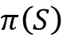
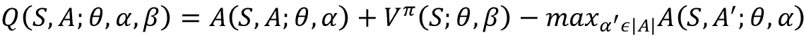
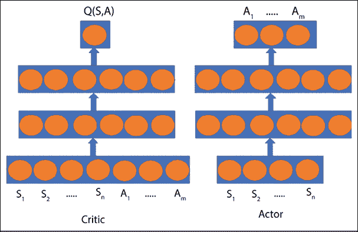

# 第十一章：强化学习

本章介绍了**强化学习**（**RL**）——一种最不被探索但最有前景的学习范式。强化学习与我们在之前章节中讨论的监督学习和无监督学习模型大不相同。从一张白纸开始（也就是没有先前的信息），RL 代理可以通过多次试错的阶段，并学会实现一个目标，在此过程中唯一的输入是来自环境的反馈。OpenAI 在强化学习方面的研究似乎表明，持续的竞争可能是智力进化的一个原因。许多深度学习从业者认为，RL 将在大规模人工智能梦想中扮演重要角色：**人工通用智能**（**AGI**）。本章将深入探讨不同的 RL 算法。以下主题将被涵盖：

+   什么是 RL 及其术语

+   学习如何使用 OpenAI Gym 接口

+   RL 的应用

+   深度 Q 网络

+   策略梯度

本章的所有代码文件可以在[`packt.link/dltfchp11`](https://packt.link/dltfchp11)找到。

# RL 简介

学习走路的婴儿、学习飞行的鸟和学习玩 Atari 游戏的强化学习（RL）代理之间有什么共同点？嗯，三者都有：

+   **试错法**：孩子（或鸟）尝试多种方式，失败多次，最终在某些方式上成功，才能真正学会走路（或飞行）。RL 代理玩许多游戏，赢得一些，输掉许多，直到它能够可靠地成功。

+   **目标**：孩子的目标是走路，鸟的目标是飞行，而 RL 代理的目标是赢得游戏。

+   **与环境的互动**：它们唯一的反馈来自于环境。

那么，首先产生的问题是，什么是 RL，它与监督学习和无监督学习有什么区别？任何养宠物的人都知道，训练宠物的最佳策略是奖励它的良好行为，并惩罚它的不良行为。RL，也叫做**带有评论员的学习**，是一种学习范式，在这种范式中，代理以相同的方式进行学习。这里的代理对应于我们的网络（程序）；它可以执行一组**动作**（`a`），这会导致环境的**状态**（`s`）发生变化，进而代理从环境中获得奖励或惩罚。

例如，考虑训练一只狗去捡球的情况：在这里，狗是我们的智能体，狗做出的自愿肌肉运动是行动，而地面（以及人和球）是环境；狗通过给予它奖励的反应来感知我们的行动。强化学习（RL）可以定义为一种通过与环境互动，在一些理想化条件下，进行目标导向学习和决策的计算方法。智能体可以感知环境的状态，并且可以对环境执行特定的、明确定义的动作。这会导致两件事：首先，环境的状态发生变化；其次，生成奖励（在理想条件下）。这个循环持续进行，理论上智能体随着时间的推移学习如何更频繁地生成奖励：


图 11.1：强化学习：智能体与环境的互动

与监督学习不同，智能体没有被提供任何训练示例；它不知道正确的行动是什么。

与无监督学习不同，智能体的目标不是在输入中找到某种内在的结构（虽然学习过程可能会发现一些结构，但那并不是目标）；相反，它唯一的目标是最大化奖励（从长远来看）并减少惩罚。

## 强化学习术语

在学习各种强化学习算法之前，了解一些重要术语非常重要。我们将通过两个例子来说明这些术语，第一个是迷宫中的机器人，第二个是控制**自动驾驶汽车**（**SDC**）轮子的智能体。两个强化学习智能体如下所示：


图 11.2：机器人在迷宫中寻找路径的状态（左侧）。智能体控制自动驾驶汽车方向盘的状态（右侧）

*图 11.2* 显示了我们将要考虑的两个例子。让我们从术语开始：

+   **状态**，`S`：状态是一组可以定义环境可能处于的所有状态的标记（或表示）。它可以是连续的，也可以是离散的。在机器人通过迷宫寻找路径的例子中，状态可以用一个 4×4 的矩阵来表示，矩阵元素表示该块是空的、被占用的，还是被阻挡的。值为 1 的块表示被机器人占据，值为 0 表示空的，`X` 表示该块不可通行。这个数组中的每个元素，`S`，可以有这三种离散值之一，因此状态在本质上是离散的。接下来，考虑智能体控制自动驾驶汽车的方向盘。智能体以前视图图像作为输入。图像包含连续值的像素，因此在这里状态是连续的。

+   **动作**，*A(S)*：动作是代理在某一特定状态下可以采取的所有可能行为的集合。可能的动作集合`A`取决于当前状态`S`。动作可能会导致状态的变化，也可能不会。与状态一样，动作可以是离散的或连续的。比如，机器人在迷宫中寻找路径时，可以执行五个离散的动作 [**上**, **下**, **左**, **右**, **不变**]。而自动驾驶代理则可以在一个连续的角度范围内旋转方向盘。

+   **奖励** *R(S,A,S’)*：奖励是环境根据代理的动作返回的标量值。这里`S`是当前状态，*S’*是执行动作`A`后环境的状态。奖励由目标决定；如果动作将代理带近目标，代理将获得较高的奖励，否则会得到较低（甚至负）的奖励。我们如何定义奖励完全由我们决定——以迷宫为例，我们可以定义奖励为代理当前位置与目标之间的欧几里得距离。自动驾驶代理的奖励可以是车在路上（正奖励）或偏离道路（负奖励）。

+   **策略** ：策略定义了每个状态与在该状态下应该采取的动作之间的映射。策略可以是*确定性*的，即对于每个状态，都有一个明确的策略。例如，对于迷宫机器人，如果上方的方块为空，就向上移动。策略也可以是*随机*的，即动作是按一定概率采取的。它可以实现为一个简单的查找表，或者作为一个依赖于当前状态的函数。策略是强化学习代理的核心。在本章中，我们将学习帮助代理学习策略的不同算法。

+   **回报** `G[t]`：这是从当前时刻开始，所有未来奖励的折扣总和，数学定义如下：


+   这里 `R[t]` 是时刻 `t` 的奖励，且  是折扣因子；它的值介于 0 和 1 之间。折扣因子决定了在决策策略时未来奖励的重要性。如果它接近零，代理会更加注重即时奖励。然而，高折扣因子意味着代理会更长远地考虑未来。它可能会放弃即时奖励，以换取较高的未来奖励，就像在国际象棋中，你可能会牺牲一个兵，以换取后续的将死对方。

+   **价值函数** *V(S)*：它定义了一个状态在长远来看“好坏”的程度。可以把它看作是代理从状态`S`出发，在一段时间内可以期望积累的奖励总量。你可以把它看作是长远的好处，而不是短期且短暂的好处。你认为哪个更重要，是最大化即时奖励还是价值函数？你可能猜对了：就像在国际象棋中，我们有时会牺牲一个兵，以便在几步后赢得比赛，因此代理应该尝试最大化价值函数。

+   通常，值定义为**状态价值函数**  或 **动作价值函数** ，其中  是所遵循的策略。状态价值函数是遵循策略  后，从状态 `S` 得到的期望回报：


+   这里的 `E` 是期望，`S[t]`*=s* 是时间 `t` 时的状态。动作值函数是从状态 `S` 开始，采取动作 *A=a* 并遵循策略  所得到的期望回报：


+   **环境模型**：这是一个可选元素。它模拟环境的行为，并包含环境的物理特性；换句话说，它表示环境将如何表现。环境模型通过转移到下一个状态的转移概率来定义。这是一个可选组件；我们也可以采用**无模型**的强化学习，在这种情况下，不需要转移概率来定义 RL 过程。

在 RL 中，我们假设环境的状态遵循**马尔可夫性质**，即每个状态仅依赖于前一个状态、从动作空间中采取的动作以及相应的奖励。

即，如果 `S`ᵗ^(+1) 是时间 *t+1* 时环境的状态，那么它是时间 `t` 时 `S`ᵗ 状态、时间 `t` 时采取的动作 `A`ᵗ 和相应的奖励 `R`ᵗ 的函数，不需要前置历史。如果 *P(S*ᵗ^(+1)|`S`ᵗ*)* 是转移概率，从数学上讲，马尔可夫性质可以写成：


因此，RL 可以被认为是一个**马尔可夫决策过程**（**MDP**）。

## 深度强化学习算法

**深度强化学习**（**DRL**）的基本思想是，我们可以使用深度神经网络来逼近策略函数或价值函数。在本章中，我们将研究一些流行的 DRL 算法。这些算法可以根据它们逼近的内容分为两类：

+   **基于价值的方法**：在这些方法中，算法会采取最大化价值函数的动作。这里的智能体学习预测给定状态或动作的好坏。基于价值的方法的一个例子是深度 Q 网络。例如，考虑我们的迷宫中的机器人：假设每个状态的值是从该位置到目标所需步数的负数，那么，在每个时间步，智能体将选择采取能将其带到具有最佳值的状态的动作，如下图所示。因此，从 **-6** 的值开始，它将移动到 **-5**、**-4**、**-3**、**-2**、**-1**，最终到达目标，值为 `0`：


图 11.3：迷宫寻路机器人的值函数值演示

+   **基于策略的方法**：在这些方法中，算法预测最优策略（即最大化期望回报的策略），而不维护价值函数的估计。目标是找到最优策略，而不是最优动作。基于策略的方法的一个例子是策略梯度。在这里，我们近似策略函数，从而将每个状态映射到最佳的相应动作。基于策略的方法相对于基于价值的方法的一个优势是，它们甚至可以用于连续动作空间。

除了近似策略或价值的算法外，我们还需要回答一些问题，以便让强化学习有效地工作。

### 代理如何选择其动作，尤其是在未训练的情况下？

当代理开始学习时，它并不知道如何确定一个动作是最好的，或者哪个动作将提供最佳的`Q`值。那么我们该如何做呢？我们借鉴自然界的做法。就像蜜蜂和蚂蚁一样，代理在探索新动作和利用已学得动作之间做出平衡。最初，当代理开始时，它不知道在所有可能的动作中哪个更好，因此它会做出随机选择，但随着学习的进行，它开始利用已学得的策略。这被称为**探索与利用**[2]的权衡。通过探索，代理收集更多的信息，之后利用这些收集到的信息做出最佳决策。

### 代理如何在探索与利用之间保持平衡？

有多种策略，其中最常用的一种是**epsilon-贪心** () 策略。在这里，代理持续探索，并且根据的值，在每一步，代理以概率选择一个随机动作，并以概率选择一个最大化价值函数的动作。通常，的值会渐进下降。在 Python 中，策略可以实现为：

```py
 if np.random.rand() <= epsilon:
        a = random.randrange(action_size)
  else:
        a = np.argmax(model.predict(s)) 
```

其中，`model`是近似价值/策略函数的深度神经网络，`a`是从大小为`action_size`的动作空间中选择的动作，`s`是状态。另一种进行探索的方式是使用噪声；研究人员成功地实验了高斯噪声和奥恩斯坦-乌伦贝克噪声。

### 如何处理高度相关的输入状态空间？

我们的强化学习模型的输入是环境的当前状态。每个动作都会引起环境的某些变化；然而，两个连续状态之间的相关性非常高。如果我们让网络基于连续的状态进行学习，两个连续输入之间的高相关性就会导致所谓的**灾难性遗忘**。为了缓解灾难性遗忘的影响，David Isele 和 Akansel Cosgun 在 2018 年提出了**经验回放**方法。

简单来说，学习算法首先将 MDP 元组——状态、动作、奖励和下一个状态 *<S, A, R, S’>*——存储在缓冲区/记忆中。一旦积累了足够的记忆，就会随机选择一批数据来训练代理。记忆会不断地通过新的添加和旧的删除来刷新。使用经验回放提供了三个好处：

+   首先，它允许相同的经验在多个权重更新中被潜在地使用，从而提高了数据效率。

+   其次，随机选择经验批次可以去除连续状态之间的相关性，从而避免网络训练时出现偏差。

+   第三，它可以防止任何不希望出现的反馈循环，这些循环可能导致网络陷入局部最小值或发散。

经验回放的一个修改版本是**优先经验回放**（**PER**）。该方法由 Tom Schaul 等人于 2015 年提出[4]，其理念来源于并非所有经验（或者说，尝试）都同等重要的观点。有些尝试比其他尝试能提供更好的教训。因此，与其随机选择经验，不如为更多教育意义的经验分配更高的优先级，从而提高选择训练的效率。在 Schaul 的论文中，提出应该优先选择那些预测和目标之间差异较大的经验，因为在这些情况下，代理能够学到更多。

### 如何处理移动目标的问题

与监督学习不同，RL 中的目标并不是事先已知的。在移动目标的情况下，代理试图最大化期望回报，但最大值会随着代理学习的进行而不断变化。实际上，这就像试图捕捉一只蝴蝶，每次靠近它时，它都会飞到一个新的位置。移动目标的主要原因是，同一网络用来估计动作和目标值，这可能会导致学习中的震荡。

这个问题的解决方案是由 DeepMind 团队在 2015 年发表的论文《*通过深度强化学习实现人类水平的控制*》中提出的，该论文发表于《自然》杂志。该解决方案是，现在代理不再面对一个移动的目标，而是拥有短期固定的目标。代理现在保持两个网络，它们在架构上完全相同，一个叫做局部网络，用于在每一步估计当前的动作，另一个是目标网络，用来获取目标值。然而，两个网络各自有自己的一组权重。在每一个时间步，局部网络学习的方向是使其估计值和目标值尽可能接近。经过若干个时间步后，目标网络的权重会被更新。更新可以是**硬更新**，即在`N`个时间步之后，将局部网络的权重完全复制到目标网络，或者是**软更新**，在这种情况下，目标网络缓慢地（通过 Tau 因子！[](img/B18331_11_018.png)）将其权重向局部网络靠近。

## 近年来强化学习的成功

在过去的几年里，深度强化学习（DRL）已成功应用于各种任务，特别是在游戏和机器人领域。让我们在学习算法之前，先了解一些强化学习的成功案例：

+   **AlphaGo Zero**：由谷歌的 DeepMind 团队开发，AlphaGo Zero 的论文《*无需任何人类知识即可掌握围棋*》从一张完全空白的白纸（**tabula rasa**）开始。AlphaGo Zero 使用一个神经网络来近似计算棋步概率和价值。

+   这个神经网络以原始棋盘表示作为输入。它使用一个由神经网络引导的蒙特卡洛树搜索来选择棋步。强化学习算法在训练循环中结合了前瞻性搜索。它使用 40 块残差 CNN 训练了 40 天，在训练过程中，它玩了大约 2900 万盘棋（这是一个非常大的数字！）。该神经网络在 Google Cloud 上使用 TensorFlow 进行优化，配备了 64 个 GPU 工作节点和 19 个 CPU 参数服务器。你可以在这里查看论文：[`www.nature.com/articles/nature24270`](https://www.nature.com/articles/nature24270)。

+   **AI 控制的滑翔机**：微软开发了一套控制系统，可以在多种不同的自动驾驶硬件平台上运行，如 Pixhawk 和 Raspberry Pi 3。它能够通过自主寻找并利用自然气流，将滑翔机保持在空中，无需使用发动机。控制系统帮助滑翔机在没有电机或人工干预的情况下，仅通过检测并利用气流来飞行。他们将其实现为一个部分可观察的马尔可夫决策过程（MDP）。他们采用了贝叶斯强化学习，并使用蒙特卡洛树搜索来寻找最佳行动。他们将整个系统分为多个层次的规划器——一个高层规划器根据经验做出决策，一个低层规划器则使用贝叶斯强化学习实时检测并锁定气流。你可以在微软新闻中看到这款滑翔机的实际操作：[`news.microsoft.com/features/science-mimics-nature-microsoft-researchers-test-ai-controlled-soaring-machine/`](https://news.microsoft.com/features/science-mimics-nature-microsoft-researchers-test-ai-controlled-soaring-machine/)。

+   **运动行为**：在论文《*在丰富环境中运动行为的出现*》([`arxiv.org/pdf/1707.02286.pdf`](https://arxiv.org/pdf/1707.02286.pdf))中，DeepMind 的研究人员为智能体提供了丰富多样的环境。环境呈现出不同难度级别的挑战。智能体在不断增加的难度下进行训练，这促使其在没有进行任何奖励设计（即没有设计特定奖励函数）的情况下，学习到复杂的运动技能。

+   **使用强化学习进行数据中心冷却**：数据中心是当今数字/互联网革命的主力军。凭借其庞大的服务器和网络设备，它们促进了数据存储、数据传输以及信息处理。数据中心约占全球能源消耗的 1.5%左右，如果不采取措施，消耗量只会增加。DeepMind 与 Google Research 在 2016 年采用强化学习模型，成功将其数据中心的能耗减少了 40%。通过使用数据中心传感器收集的历史数据，他们训练了一个深度神经网络来预测未来的能效并提出最佳行动方案。你可以在这篇论文中阅读该模型和方法的详细信息：*使用模型预测控制进行数据中心冷却*（[`proceedings.neurips.cc/paper/2018/file/059fdcd96baeb75112f09fa1dcc740cc-Paper.pdf`](https://proceedings.neurips.cc/paper/2018/file/059fdcd96baeb75112f09fa1dcc740cc-Paper.pdf)）。

+   **控制核聚变等离子体**：RL 的一个最近（2022 年）且有趣的应用是借助强化学习来控制核聚变等离子体。相关成果已发布在《自然》期刊的论文中：*通过强化学习实现托卡马克等离子体的磁控*。

看到 DRL 代理如何在没有任何隐性知识的情况下学习执行任务，甚至在许多专业任务中超越人类，真是令人惊叹。在接下来的章节中，我们将探索这些神奇的 DRL 算法，看看它们如何在几千个训练周期内，以几乎人类的效率玩游戏。

# 强化学习的仿真环境

正如前面提到的，**试错**是任何 RL 算法的重要组成部分。因此，在模拟环境中首先训练我们的 RL 代理是有意义的。

今天，已经有大量平台可以用来创建环境。一些流行的包括：

+   **OpenAI Gym**：它包含了一系列环境，我们可以用来训练 RL 代理。在本章中，我们将使用 OpenAI Gym 接口。

+   **Unity ML-Agents SDK**：它允许开发者通过一个简单易用的 Python API，将使用 Unity 编辑器创建的游戏和仿真转化为智能代理可以训练的环境，使用 DRL、进化策略或其他机器学习方法。它与 TensorFlow 兼容，能够训练适用于 2D/3D 以及 VR/AR 游戏的智能代理。你可以在这里了解更多：[`github.com/Unity-Technologies/ml-agents`](https://github.com/Unity-Technologies/ml-agents)。

+   **Gazebo**：在 Gazebo 中，我们可以构建具有基于物理的仿真功能的三维世界。`gym-gazebo` 工具包结合 Gazebo、**机器人操作系统**（**ROS**）和 OpenAI Gym 接口，可以用于训练 RL 代理。有关更多信息，您可以参考白皮书：[`arxiv.org/abs/1608.05742`](https://arxiv.org/abs/1608.05742)。

+   **Blender 学习环境**：这是一个用于 Blender 游戏引擎的 Python 接口，它也可以与 OpenAI Gym 配合使用。其基础是 Blender：一款免费的 3D 建模软件，内置游戏引擎。这为创建游戏提供了一个易用且强大的工具集。它提供了与 Blender 游戏引擎的接口，游戏本身是在 Blender 中设计的。然后，我们可以创建一个自定义虚拟环境，在特定问题上训练 RL 代理（[`github.com/LouisFoucard/gym-blender`](https://github.com/LouisFoucard/gym-blender)）。

+   **Malmo**：由微软团队构建的 Malmo 是一个基于 Minecraft 的 AI 实验和研究平台。它提供了一个简单的 API，用于创建任务和任务。您可以在这里了解更多关于 Project Malmo 的信息：[`www.microsoft.com/en-us/research/project/project-malmo/`](https://www.microsoft.com/en-us/research/project/project-malmo/)。

# OpenAI Gym 介绍

我们将使用 OpenAI Gym 来为我们的代理提供环境。OpenAI Gym 是一个开源工具包，用于开发和比较 RL 算法。它包含了多种可用于训练代理并开发新 RL 算法的仿真环境。

首先需要做的是安装 OpenAI Gym。以下命令将安装最小的 `gym` 包：

```py
pip install gym 
```

如果您想安装所有（免费）`gym` 模块，可以在后面加上 `[all]`：

```py
pip install gym[all] 
```

MuJoCo 环境需要购买许可证。对于基于 Atari 的游戏，您需要安装 Atari 依赖项（Box2D 和 ROM）：

```py
pip install box2d-py 
```

OpenAI Gym 提供了多种环境，从简单的基于文本的到三维游戏。支持的环境可以按如下方式分组：

+   **算法**：包含涉及执行计算任务（如加法）的环境。虽然我们可以轻松地在计算机上执行这些计算，但使这些问题成为 RL 问题的有趣之处在于，代理仅通过示例学习这些任务。

+   **Atari**：此环境提供了种类繁多的经典 Atari/街机游戏。

+   **Box2D**：包含二维机器人工具任务，如赛车代理或双足机器人走路。

+   **经典控制**：包含经典控制理论问题，例如平衡小车杆。

+   **MuJoCo**：这是专有的（您可以获得一个月的免费试用）。它支持各种机器人仿真任务。该环境包括物理引擎，因此用于训练机器人任务。

+   **机器人学**：此环境也使用 MuJoCo 的物理引擎。它模拟了以目标为导向的任务，适用于取物和影像手机器人。

+   **Toy text**：一个简单的基于文本的环境——非常适合初学者。

你可以从 Gym 网站获取完整的环境列表：[`gym.openai.com`](https://gym.openai.com)。要查看安装中所有可用环境的列表，你可以使用以下代码：

```py
from gym import envs

envall = envs.registry.all()
len(envall) 
```

在编写本书时，结果是 859，即 `gym` 模块中存在 859 个不同的环境。让我们看看这些环境的更多细节。每个环境都是通过使用 `make` 函数创建的。每个环境都有一个唯一的 ID、其观察空间、动作空间和默认奖励范围。Gym 允许你通过点符号访问它们，如下代码所示。我们遍历 `envall` 列表中的所有环境，并记录下其唯一 ID，ID 用于通过 `make` 方法创建环境，观察空间、奖励范围和动作空间：

```py
from tqdm import tqdm
List = []
for e in tqdm(envall):
    try:
        env = e.make()
        List.append([e.id, env.observation_space, env.action_space, env.reward_range])
        env.close() 
    except:
        continue 
```

*图 11.4* 显示了列表中的一个随机样本：


图 11.4：OpenAI Gym 中可用环境的随机列表

你可以使用这些命令来查看 Gym 中任何环境的详细信息。例如，以下代码打印出 MountainCar 环境的详细信息：

```py
env = gym.make('MountainCar-v0')
print(f"The Observation space is        {env.observation_space}" )
print(f"Upper Bound for Env Observation {env.observation_space.high}")
print(f"Lower Bound for Env Observation {env.observation_space.low}")
print(f"Action Space                    {env.action_space}")
env.seed(0)
obs = env.reset()
print(f"The initial observation is      {obs}")
# Take a random actionget the new observation space
new_obs, reward, done, info = env.step(env.action_space.sample())
print(f"The new observation is          {new_obs}")
env.close() 
```

OpenAI Gym 提供的核心接口是统一的环境接口。代理可以使用三种基本方法与环境进行交互，即 `reset`、`step` 和 `render`。`reset` 方法重置环境并返回观察值。`step` 方法使环境按一个时间步长前进，并返回 `new_obs`、`reward`、`done` 和 `info`。`render` 方法渲染环境的一帧，类似于弹出一个窗口。让我们尝试查看一些不同的环境并查看它们的初始帧：

| **物理引擎** | **经典控制** | **Atari** |
| --- | --- | --- |

|

```py
e = 'LunarLander-v2'
env = gym.make(e)
obs = env.reset() 
img = env.render(mode='rgb_array')
env.close()
plt.imshow(img) 
```

|

```py
e = 'CartPole-v0'
env = gym.make(e)
env.reset()
img = env.render(mode='rgb_array')
env.close()
plt.imshow(img) 
```

|

```py
e = 'SpaceInvaders-v0'
env = gym.make(e)
env.reset()
img = env.render(mode='rgb_array')
env.close()
plt.imshow(img) 
```

|

|  |  |  |
| --- | --- | --- |

表 11.1：OpenAI Gym 的不同环境及其初始状态

上述代码使用 Matplotlib 显示环境；你也可以直接使用 `render` 方法：

```py
import gym
env_name = 'Breakout-v0'
env = gym.make(env_name)
obs = env.reset()
env.render() 
```

你可以在*图 11.5*中看到 Breakout 环境；`render` 函数会弹出环境窗口：


图 11.5：Breakout 环境的初始状态

我们可以使用 `env.observation_space` 和 `env.action_space` 来了解 Breakout 游戏的状态空间和动作空间。结果显示，状态由一个 210 × 160 大小的三通道图像组成，动作空间是离散的，有四个可能的动作。完成后，别忘了使用以下命令关闭 OpenAI：

```py
env.close() 
```

## 随机代理玩 Breakout

让我们玩得开心，玩一下 Breakout 游戏。当我第一次玩这个游戏时，我根本不知道规则是什么，也不知道该怎么玩，所以我随机选择了控制按钮。我们的新手智能体也将做同样的事情；它会从动作空间中随机选择动作。Gym 提供了一个名为`sample()`的函数，它从动作空间中选择一个随机动作——我们将使用这个函数。同时，我们还可以保存游戏的回放，以便稍后查看。保存回放有两种方式，一种是使用 Matplotlib，另一种是使用 OpenAI Gym 的 Monitor 包装器。让我们先看看 Matplotlib 方法。

我们将首先导入必要的模块；目前我们只需要`gym`和`matplotlib`，因为智能体将进行随机操作：

```py
import gym
import matplotlib.pyplot as plt
import matplotlib.animation as animation 
```

我们创建 Gym 环境：

```py
env_name = 'Breakout-v0'
env = gym.make(env_name) 
```

接下来，我们将一步一步运行游戏，选择一个随机动作，无论是 300 步还是直到游戏结束（以较早的为准）。环境状态（观察）空间将在每一步保存到列表`frames`中：

```py
frames = [] # array to store state space at each step
env.reset()
done = False
for _ in range(300): 
    #print(done)
    frames.append(env.render(mode='rgb_array'))
    obs,reward,done, _ = env.step(env.action_space.sample())
    if done:
        break 
```

现在，我们进入将所有帧合成 GIF 图像的部分，使用 Matplotlib Animation。我们创建一个图像对象、补丁，然后定义一个函数，将图像数据设置为特定的帧索引。该函数由 Matplotlib 的`Animation`类使用，用来创建动画，最后我们将其保存在文件`random_agent.gif`中：

```py
patch = plt.imshow(frames[0])
plt.axis('off')
def animate(i):
    patch.set_data(frames[i])
    anim = animation.FuncAnimation(plt.gcf(), animate, \
        frames=len(frames), interval=10)
    anim.save('random_agent.gif', writer='imagemagick') 
```

上面的代码将生成一个 GIF 图像。下面是从该图像中截取的一些屏幕截图：


图 11.6：从保存的 GIF 图像中截取的一些屏幕截图

现在我们已经熟悉了 OpenAI Gym，我们将继续介绍包装器——你可以用它来创建自定义环境。

## Gym 中的包装器

Gym 为我们提供了多种包装器来修改现有环境。例如，如果你有图像输入，RGB 强度值在 0 到 255 之间，而你使用的 RL 智能体是神经网络，最佳输入范围是 0 到 1，那么你可以使用 Gym 包装器类来预处理状态空间。下面我们定义了一个包装器，用于连接观察：

```py
from collections import deque
from gym import spaces
import numpy as np
#Class to concat observations
class ConcatObservations(gym.Wrapper):
    def __init__(self, env, n):
        gym.Wrapper.__init__(self, env)
        shape = env.observation_space.shape
        self.n = n
        self.frames = deque([], maxlen=n)
        self.observation_space = \
            spaces.Box(low=0, high=255, shape=((n,) + shape), dtype=env.observation_space.dtype)
    def reset(self):  #reset function
        obs = self.env.reset()
        for _ in range(self.n):
            self.frames.append(obs)
        return self._get_obs()
    def step(self, action): #step function
        obs, reward, done, info = self.env.step(action)
        self.frames.append(obs)
        return self._get_obs(), reward, done, info
    def _get_obs(self):
        return np.array(self.frames) 
```

你可以看到我们需要更改默认的`reset`函数、`step`函数和观察函数`_get_obs`。我们还需要修改默认的观察空间。

让我们看看它是如何工作的。如果你选择`"BreakoutNoFrameskip-v4"`环境，那么初始的观察空间是 210 x 160 x 3：

```py
env = gym.make("BreakoutNoFrameskip-v4")
print(f"The original observation space is  {env.observation_space}") 
```

```py
### OUTPUT: 
```

```py
>>>The original observation space is  Box(0, 255, (210, 160, 3), uint8) 
```

现在，如果你使用我们刚刚创建的包装器：

```py
env = ConcatObservations(env, 4)
print(f"The new observation space is  {env.observation_space}") 
```

```py
### OUTPUT: 
```

```py
The new observation space is  Box(0, 255, (4, 210, 160, 3), uint8) 
```

你可以看到现在添加了一个维度——它有四个帧，每个帧的大小是 210 x 160 x 3。你也可以使用包装器来修改奖励。在这种情况下，你使用父类`RewardWrapper`。下面是一个示例代码，可以将奖励裁剪到[-10, 10]的范围内：

```py
class ClippedRewards(gym.RewardWrapper):
    def __init__(self, env):
        gym.RewardWrapper.__init__(self, env)
        self.reward_range = (-10,10)
    def reward(self, reward):
        """Clip to {+10, 0, -10} by its sign."""
        return reward if reward >= -10 and reward <= 10 else 10 * np.sign(reward) 
```

让我们尝试在 CartPole 环境中使用它，该环境的奖励范围是 ：

```py
env = ClippedRewards(gym.make("CartPole-v0"))
print(f'Clipped reward range: {env.reward_range}')
env.close() 
```

```py
### OUTPUT: 
```

```py
Clipped reward range: (-10, 10) 
```

包装器的另一个有用应用是，当你想在智能体学习时保存状态空间。通常，RL 智能体需要大量的步骤来进行适当的训练，因此在每一步保存状态空间并不可行。相反，我们可以选择在每 500 步后（或者你希望的任何其他步数）存储状态空间，正如前述算法所示。OpenAI Gym 提供了`Wrapper Monitor`类来将游戏保存为视频。为此，我们需要首先导入包装器，然后创建环境，最后使用`Monitor`。

默认情况下，它将存储 1、8、27、64（完美立方数的剧集编号）等视频，然后每 1,000 个剧集；每次训练，默认保存在一个文件夹中。执行此操作的代码如下：

```py
import gym
env = gym.make("Breakout-v0")
env = gym.wrappers.Monitor(env, 'recording', force=True)
observation = env.reset()
for _ in range(1000):
    #env.render()
    action = env.action_space.sample()
    # your agent here (this takes random actions)
    observation, reward, done, info = env.step(action)
    if done:
        observation = env.reset()
env.close() 
```

要使`Monitor`正常工作，我们需要 FFmpeg 的支持。根据操作系统的不同，可能需要安装它，如果缺少的话。

这将把视频以`.mp4`格式保存在`recording`文件夹中。这里需要注意的是，如果你想使用同一个文件夹进行下次训练，会需要设置`force=True`选项。

如果你想在 Google Colab 上训练你的智能体，你需要添加以下驱动程序，以便能够可视化 Gym 的输出：

```py
!pip install pyglet
!apt-get install -y xvfb python-opengl > /dev/null 2>&1
!pip install gym pyvirtualdisplay > /dev/null 2>&1 
```

安装 Python 虚拟显示后，你需要启动它——Gym 使用虚拟显示来设置观察。以下代码可以帮助你启动一个大小为 600 x 400 的显示：

```py
from pyvirtualdisplay import Display
display = Display(visible=0, size=(600, 400))
display.start() 
```

并且要能够玩 Atari 游戏，使用：

```py
!wget http://www.atarimania.com/roms/Roms.rar
!mkdir /content/ROM/
!unrar e /content/Roms.rar /content/ROM/
!python -m atari_py.import_roms /content/ROM/ 
```

# 深度 Q 网络

**深度 Q 网络**，简称**DQNs**，是深度学习神经网络，旨在逼近 Q 函数（价值-状态函数）。它们是最流行的基于价值的强化学习算法之一。该模型由 Google 的 DeepMind 在 2013 年 NeurIPS 会议上提出，论文标题为*使用深度强化学习玩 Atari 游戏*。这篇论文的最重要贡献是，他们直接将原始状态空间作为输入传递给网络；输入特征不像早期的 RL 实现那样是人工设计的。此外，他们能够使用完全相同的架构训练智能体进行不同的 Atari 游戏，并取得最先进的结果。

该模型是简单 Q 学习算法的扩展。在 Q 学习算法中，会维持一个 Q 表作为备忘单。每次执行动作后，Q 表会使用贝尔曼方程[5]进行更新：


 是学习率，它的值位于[0,1]范围内。第一项表示旧的`Q`值的组成部分，第二项表示目标`Q`值。Q 学习适用于状态数量和可能的动作数量较少的情况，但对于较大的状态空间和动作空间，Q 学习的扩展性较差。一个更好的替代方法是使用深度神经网络作为函数近似器，逼近每个可能动作的目标 Q 函数。在这种情况下，深度神经网络的权重存储了 Q 表信息。每个可能的动作都有一个单独的输出单元。网络将状态作为输入，并返回所有可能动作的预测目标`Q`值。问题来了：我们如何训练这个网络，损失函数应该是什么？好吧，由于我们的网络必须预测目标`Q`值：


损失函数应该尽量减少预测的`Q`值（`Q`[predicted]）与目标`Q`值（`Q`[target]）之间的差异。我们可以通过将损失函数定义为：


其中`W`是我们深度`Q`网络的训练参数，通过梯度下降学习，以使损失函数最小化。

以下是 DQN 的一般架构。网络将`n`维状态作为输入，并输出`Q`值，对于`m`维动作空间中的每个可能动作。每一层（包括输入层）可以是卷积层（如果我们采用原始像素作为输入，卷积层更有意义）或密集层：


图 11.7：图示显示了一个简单的 DQN 网络，输入层接收状态向量 S，输出层预测该状态下所有可能动作的 Q 值

在接下来的部分，我们将尝试训练一个 DQN。我们的智能体任务是使小车上的杆子保持稳定。智能体可以左右移动小车以保持平衡。

## CartPole 的 DQN

CartPole 是一个经典的 OpenAI 问题，具有连续的状态空间和离散的动作空间。在这个问题中，一根杆子通过一个不受控制的关节连接到一个小车上；小车沿着一个无摩擦的轨道移动。目标是通过左右移动小车来保持杆子在小车上站立。每当杆子站立时，奖励为+1。若杆子与垂直方向的角度超过 15 度，或小车从中心位置移动超过 2.4 个单位，游戏结束：


图 11.8：来自 CartPole Gym 环境的截图

你可以查看 OpenAI Gym 的排行榜，看看 CartPole 环境中的一些酷炫条目：[`github.com/openai/gym/wiki/Leaderboard#cartpole-v0`](https://github.com/openai/gym/wiki/Leaderboard#cartpole-v0)。

我们首先导入必要的模块。我们显然需要`gym`来为我们提供 CartPole 环境，`tensorflow`来构建我们的 DQN 网络。除此之外，我们还需要`random`和`numpy`模块：

```py
import random
import gym
import math
import numpy as np
from collections import deque
import tensorflow as tf
from tensorflow.keras.models import Sequential
from tensorflow.keras.layers import Dense
from tensorflow.keras.optimizers import Adam 
```

我们设置了训练代理的最大训练回合数（`EPOCHS`）、我们认为环境已解决的阈值（`THRESHOLD`），以及一个布尔值来表示是否希望记录训练过程（`MONITOR`）。请注意，根据官方 OpenAI 文档，CartPole 环境在代理能够在 195 个时间步（ticks）内保持杆处于竖直位置时被认为已解决。在以下代码中，为了节省时间，我们将`THRESHOLD`降低到 45：

```py
EPOCHS = 1000
THRESHOLD = 45
MONITOR = True 
```

现在让我们构建我们的 DQN。我们声明一个`DQN`类，并在其`__init__()`函数中声明所有超参数和模型。我们还在`DQN`类内部创建了环境。如你所见，这个类非常通用，你可以用它来训练任何 Gym 环境，只要其状态空间信息可以被包含在一个一维数组中：

```py
class DQN():
    def __init__(self, env_string, batch_size=64):
        self.memory = deque(maxlen=100000)
        self.env = gym.make(env_string)
        input_size = self.env.observation_space.shape[0]
        action_size = self.env.action_space.n
        self.batch_size = batch_size
        self.gamma = 1.0
        self.epsilon = 1.0
        self.epsilon_min = 0.01
        self.epsilon_decay = 0.995

        alpha=0.01
        alpha_decay=0.01
        if MONITOR: self.env = gym.wrappers.Monitor(self.env,
        'data/'+env_string, force=True)

        # Init model
        self.model = Sequential()
        self.model.add(Dense(24, input_dim=input_size,
        activation='tanh'))
        self.model.add(Dense(48, activation='tanh'))
        self.model.add(Dense(action_size, activation='linear'))
        self.model.compile(loss='mse', optimizer=Adam(lr=alpha,
        decay=alpha_decay)) 
```

我们构建的 DQN 是一个三层感知机；在以下输出中，你可以看到模型摘要。我们使用带有学习率衰减的 Adam 优化器：

```py
Model: "sequential"
_________________________________________________________________
 Layer (type)                Output Shape              Param #   
=================================================================
 dense (Dense)               (None, 24)                120       

 dense_1 (Dense)             (None, 48)                1200      

 dense_2 (Dense)             (None, 2)                 98        

=================================================================
Total params: 1,418
Trainable params: 1,418
Non-trainable params: 0
_________________________________________________________________ 
```

变量列表`self.memory`将包含我们的经验回放缓冲区。我们需要添加一个方法，将*S,A,R,S’*元组保存到内存中，并添加一个方法，从中批量获取随机样本以训练代理。我们通过定义类方法`remember`和`replay`来实现这两个功能：

```py
def remember(self, state, action, reward, next_state, done):
        self.memory.append((state, action, reward, next_state, done))
def replay(self, batch_size):
        x_batch, y_batch = [], []
        minibatch = random.sample(self.memory, min(len(self.memory),
        batch_size))
        for state, action, reward, next_state, done in minibatch:
             y_target = self.model.predict(state)
             y_target[0][action] = reward if done else reward + self.gamma * np.max(self.model.predict(next_state)[0])
             x_batch.append(state[0])
             y_batch.append(y_target[0])

        self.model.fit(np.array(x_batch), np.array(y_batch),
        batch_size=len(x_batch), verbose=0) 
```

我们的代理将在选择动作时使用**epsilon-贪婪策略**。该策略在以下方法中实现：

```py
def choose_action(self, state, epsilon):
        if np.random.random() <= epsilon:
            return self.env.action_space.sample()
        else:
            return np.argmax(self.model.predict(state)) 
```

接下来，我们编写一个方法来训练代理。我们定义了两个列表来跟踪分数。首先，我们填充经验回放缓冲区，然后从中选择一些样本来训练代理，并希望代理能够逐渐学会做得更好：

```py
def train(self):
    scores = deque(maxlen=100)
    avg_scores = []
    for e in range(EPOCHS):
        state = self.env.reset()
        state = self.preprocess_state(state)
        done = False
        i = 0
        while not done:
            action = self.choose_action(state,self.epsilon)
            next_state, reward, done, _ = self.env.step(action)
            next_state = self.preprocess_state(next_state)
            self.remember(state, action, reward, next_state, done)
            state = next_state
            self.epsilon = max(self.epsilon_min,
            self.epsilon_decay*self.epsilon) # decrease epsilon
            i += 1
        scores.append(i)
        mean_score = np.mean(scores)
        avg_scores.append(mean_score)
        if mean_score >= THRESHOLD and e >= 100:
            print('Ran {} episodes. Solved after {} trials ✔'.format(e, e - 100))
            return avg_scores
        if e % 100 == 0:
            print('[Episode {}] - Mean survival time over last 100 episodes was {} ticks.'.format(e, mean_score))
    self.replay(self.batch_size)
    print('Did not solve after {} episodes :('.format(e))
    return avg_scores 
```

现在所有必要的函数已经完成，我们只需要一个辅助函数来重新塑造 CartPole 环境的状态，以便模型的输入是正确的形状。环境的状态由四个连续变量描述：小车位置（[-2.4-2.4]），小车速度，杆角度（[-41.8o-41.8o]），和杆速度：

```py
def preprocess_state(self, state):
    return np.reshape(state, [1, self.input_size]) 
```

现在让我们实例化我们的代理，应用于 CartPole 环境并进行训练：

```py
env_string = 'CartPole-v0'
agent = DQN(env_string)
scores = agent.train() 
```

```py
[Episode 0] - Mean survival time over last 100 episodes was 28.0 ticks.
[Episode 100] - Mean survival time over last 100 episodes was 15.71 ticks.
[Episode 200] - Mean survival time over last 100 episodes was 27.81 ticks.
Ran 259 episodes. Solved after 159 trials ✔ 
```

让我们绘制代理学习过程中获得的平均奖励：

```py
import matplotlib.pyplot as plt
plt.plot(scores)
plt.show() 
```

*图 11.9*显示了代理在我的系统上进行训练的过程。代理在 254 步内达到了我们设定的 45 的阈值：

``

图 11.9：代理平均奖励图

训练完成后，你可以关闭环境：

```py
agent.env.close() 
```

你可以看到，从一开始没有任何平衡杆的平衡信息，到代理使用 DQN 逐渐能够平衡杆越来越长时间（平均值），随着学习的进行。起初一片空白，代理能够构建信息/知识来完成目标，真是了不起！

## DQN 用于玩 Atari 游戏

在前一节中，我们训练了一个 DQN 来平衡 CartPole。这个问题比较简单，因此我们可以使用感知机模型来解决。但是，假设环境状态仅仅是我们人类看到的 CartPole 视觉画面。如果输入状态空间是原始的像素值，我们之前的 DQN 将无法工作。我们需要的是卷积神经网络（CNN）。接下来，我们将基于 DQN 经典论文《*通过深度强化学习玩 Atari*》来构建一个模型。

大部分代码将与用于 CartPole 的 DQN 相似，但 DQN 网络本身以及我们如何处理从环境中获得的状态将发生显著变化。

首先，让我们看看状态空间处理方式的变化。*图 11.10* 显示了其中一款 Atari 游戏——Breakout：


图 11.10：Atari 游戏 Breakout 的截图

现在，如果你看看这张图像，并非所有部分都包含相关信息：顶部有关于分数的冗余信息，底部有不必要的空白区域，图像还带有颜色。为了减轻模型的负担，最好移除不必要的信息，因此我们将裁剪图像，转换为灰度图，并将其调整为 84 × 84 的正方形（如论文中所示）。以下是预处理输入原始像素的代码：

```py
def preprocess_state(self, img):
    img_temp = img[31:195]  # Choose the important area of the image
    img_temp = tf.image.rgb_to_grayscale(img_temp)
    img_temp = tf.image.resize(img_temp, [self.IM_SIZE, self.IM_SIZE],
    method=tf.image.ResizeMethod.NEAREST_NEIGHBOR)
    img_temp = tf.cast(img_temp, tf.float32)
    return img_temp[:,:,0] 
```

另一个重要问题是，仅通过一次观察图像，代理如何知道小球是上升还是下降？一种方法是使用 LSTM 和 CNN 结合，记录过去的状态，从而追踪小球的运动。然而，论文中采用了一种简单的技术：它将过去四个时间步的状态空间连接在一起作为 CNN 的输入，而不是单一的状态帧；也就是说，网络将过去四帧环境画面作为输入。以下是将当前状态和过去状态组合的代码：

```py
def combine_images(self, img1, img2):
    if len(img1.shape) == 3 and img1.shape[0] == self.m:
        im = np.append(img1[1:,:, :],np.expand_dims(img2,0), axis=2)
        return tf.expand_dims(im, 0)
    else:
        im = np.stack([img1]*self.m, axis = 2)
        return tf.expand_dims(im, 0) 
```

模型是在 `__init__` 函数中定义的。我们修改该函数，使其现在具有一个输入为（84 × 84 × 4）的 CNN，表示四个大小为 84 × 84 的状态帧：

```py
def __init__(self, env_string,batch_size=64, IM_SIZE = 84, m = 4):
    self.memory = deque(maxlen=5000)
    self.env = gym.make(env_string)
    input_size = self.env.observation_space.shape[0]
    action_size = self.env.action_space.n
    self.batch_size = batch_size
    self.gamma = 1.0
    self.epsilon = 1.0
    self.epsilon_min = 0.01
    self.epsilon_decay = 0.995
    self.IM_SIZE = IM_SIZE
    self.m = m

    alpha=0.01
    alpha_decay=0.01
    if MONITOR: self.env = gym.wrappers.Monitor(self.env, '../data/'+env_string, force=True)

    # Init model
    self.model = Sequential()
    self.model.add( Conv2D(32, 8, (4,4), activation='relu',padding='valid', input_shape=(IM_SIZE, IM_SIZE, m)))
    self.model.add( Conv2D(64, 4, (2,2), activation='relu',padding='valid'))
    self.model.add( Conv2D(64, 3, (1,1), activation='relu',padding='valid'))
    self.model.add(Flatten())
    self.model.add(Dense(512, activation='elu'))
    self.model.add(Dense(action_size, activation='linear'))
    self.model.compile(loss='mse', optimizer=Adam(lr=alpha, decay=alpha_decay)) 
```

最后，我们需要在 `train` 函数中做一个小改动。我们需要调用新的 `preprocess` 函数，并使用 `combine_images` 函数来确保四帧图像被连接在一起：

```py
def train(self):
    scores = deque(maxlen=100)
    avg_scores = []

    for e in range(EPOCHS):
        state = self.env.reset()
        state = self.preprocess_state(state)
        state = self.combine_images(state, state)
        done = False
        i = 0
        while not done:
            action = self.choose_action(state,self.epsilon)
            next_state, reward, done, _ = self.env.step(action)
            next_state = self.preprocess_state(next_state)
            next_state = self.combine_images(next_state, state)
            #print(next_state.shape)
            self.remember(state, action, reward, next_state, done)
            state = next_state
            self.epsilon = max(self.epsilon_min, self.epsilon_decay*self.epsilon) # decrease epsilon
            i += reward
        scores.append(i)
        mean_score = np.mean(scores)
        avg_scores.append(mean_score)
        if mean_score >= THRESHOLD and e >= 100:
            print('Ran {} episodes. Solved after {} trials ✔'.format(e, e - 100))
            return avg_scores
        if e % 100 == 0:
            print('[Episode {}] - Score over last 100 episodes was {}.'.format(e, mean_score))
        self.replay(self.batch_size)

    print('Did not solve after {} episodes :('.format(e))
    return avg_scores 
```

就是这样。我们现在可以训练智能体来玩 Breakout 游戏。本章节的完整代码可以在 GitHub 仓库中找到，链接为 [`github.com/PacktPublishing/Deep-Learning-with-TensorFlow-and-Keras-3rd-edition/tree/main/Chapter_11`](https://github.com/PacktPublishing/Deep-Learning-with-TensorFlow-and-Keras-3rd-edition/tree/main/Chapter_11)，文件名为 `DQN_Atari_v2.ipynb`。

## DQN 变种

在 DQN 取得前所未有的成功之后，强化学习（RL）领域的关注度增加，许多新的 RL 算法应运而生。接下来，我们将看到一些基于 DQN 的算法。它们都以 DQN 为基础，并在此基础上进行扩展。

### Double DQN

在 DQN 中，智能体使用相同的 `Q` 值来选择和评估一个动作。这可能会导致学习中的最大化偏差。例如，假设对于某个状态 `S`，所有可能的动作的真实 `Q` 值都为零。那么，我们的 DQN 估计值将有些高于零，有些低于零，并且由于我们选择具有最大 `Q` 值的动作，然后使用相同的（最大化的）估计值函数来评估每个动作的 `Q` 值，我们就在高估 `Q` 值——换句话说，我们的智能体过于乐观。这可能导致训练不稳定和低质量的策略。为了解决这个问题，DeepMind 的 Hasselt 等人在论文 *Deep Reinforcement Learning with Double Q-Learning* 中提出了 Double DQN 算法。在 Double DQN 中，我们有两个具有相同架构但不同权重的 Q 网络。一个 Q 网络用于通过 epsilon-greedy 策略确定动作，另一个用于计算其值（Q 目标）。

如果你还记得，在 DQN 中，Q 目标是通过以下公式给出的：


在这里，使用相同的 DQN *Q(S,A; W)* 选择了动作 `A`，其中 `W` 是网络的训练参数；也就是说，我们在编写 `Q` 值函数时，连同其训练参数一起，以强调 vanilla DQN 和 Double DQN 之间的区别：


在 Double DQN 中，目标的计算公式现在将发生变化。现在，DQN *Q(S,A;W)* 用于确定动作，而 DQN *Q(S,A;W’)* 用于计算目标（注意权重不同）。因此，前面的公式将变为：


这个简单的变化减少了高估的情况，并帮助我们更快速、更可靠地训练智能体。

### Dueling DQN

这个架构是 Wang 等人在 2015 年的论文 *Dueling Network Architectures for Deep Reinforcement Learning* 中提出的。与 DQN 和 Double DQN 一样，它也是一种无模型算法。

Dueling DQN 将 Q 函数解耦为价值函数和优势函数。我们之前讨论过的价值函数表示状态的价值，而不考虑任何动作。另一方面，优势函数提供了动作 `A` 在状态 `S` 中的相对效用（优势/好处）度量。Dueling DQN 在初始层使用卷积网络从原始像素中提取特征。然而，在后期阶段，它被分为两个不同的网络，一个用于近似价值，另一个用于近似优势。这样可以确保网络为价值函数和优势函数提供独立的估计。


在这里， 是共享卷积网络的训练参数数组（它被 `V` 和 `A` 共享），而  和  是 *Advantage* 和 *Value* 估计器网络的训练参数。稍后，两个网络通过聚合层重新组合，以估算 `Q` 值。

在 *图 11.11* 中，你可以看到 Dueling DQN 的架构：


图 11.11：可视化 Dueling DQN 的架构

你可能会想，这样做有什么好处？如果我们最后还要将它们组合起来，为什么要解构 `Q` 呢？其实，解耦价值和优势函数可以让我们知道哪些状态是有价值的，而不需要考虑每个状态下每个动作的影响。有很多状态，无论采取什么行动，都是好或坏的状态：例如，在一个好的度假村与亲人一起吃早餐始终是一个好状态，而被送进医院急诊室始终是一个坏状态。因此，分开价值和优势可以获得更稳健的价值函数近似。接下来，你可以看到来自论文的一幅图，展示了在 Atari 游戏《Enduro》中，价值网络学会关注道路，而优势网络只在前方有车时才关注，以避免碰撞：


图 11.12：在 Atari 游戏 Enduro 中，价值网络学会关注道路（红点），而优势网络只在有其他车辆立即在前方时才关注。图像来源：https://arxiv.org/pdf/1511.06581.pdf

聚合层的实现方式使得可以从给定的 `Q` 中恢复 `V` 和 `A`。这是通过强制使优势函数估计器在选择的动作下具有零优势来实现的：



在论文中，Wang 等人报告称，如果将最大值操作替换为平均值操作，网络会更加稳定。原因是，优势的变化速度现在与平均值的变化速度相同，而不是与最优（最大）值的变化速度相同。

### Rainbow

Rainbow 是当前最先进的 DQN 变体。从技术上讲，称其为 DQN 变体是不准确的。实际上，它是许多 DQN 变体的集成，组合成一个单一的算法。它将分布式强化学习[6]损失修改为多步损失，并将其与 Double DQN 和贪心策略相结合。论文中引用如下：

> 网络架构是一个适用于回报分布的对抗性网络架构。该网络具有一个共享的表示 ，然后被输入到具有 `N`[原子] 输出的值流 ，以及具有 `N`[原子]×`N`[动作] 输出的优势流 ，其中 a1ξ(fξ(s), a) 表示与原子 i 和动作 a 对应的输出。对于每个原子 `z[i]`，值流和优势流按 Dueling DQN 的方式聚合，然后通过 softmax 层以获得用于估计回报分布的标准化参数分布。

Rainbow 集成了六种不同的强化学习算法：

+   N 步回报

+   分布式状态-动作值学习

+   对抗网络

+   噪声网络

+   双重 DQN

+   优先经验回放

到目前为止，我们已经讨论了基于价值的强化学习算法。在下一节中，我们将学习基于策略的强化学习算法。

# 深度确定性策略梯度

DQN 及其变体在解决状态空间连续且动作空间离散的问题上非常成功。例如，在 Atari 游戏中，输入空间由原始像素构成，但动作是离散的—[**上**，**下**，**左**，**右**，**无操作**]。如何解决具有连续动作空间的问题呢？例如，假设一个强化学习智能体驾驶一辆车需要转动车轮：这个动作具有连续的动作空间。

解决这种情况的一种方法是通过离散化动作空间并继续使用 DQN 或其变体。然而，更好的解决方案是使用策略梯度算法。在策略梯度方法中，策略  直接进行近似。

神经网络用于近似策略；在最简单的形式下，神经网络学习一种选择动作的策略，以通过调整权重来最大化回报，这一过程使用最陡峭的梯度上升，因此得名：策略梯度。

在本节中，我们将重点介绍 **深度确定性策略梯度**（**DDPG**）算法，这是 Google DeepMind 于 2015 年提出的另一种成功的强化学习算法。DDPG 使用两个网络进行实现；一个叫做演员网络，另一个叫做评论员网络。

演员网络确定性地逼近最优策略，也就是说，它为任何给定的输入状态输出最优的动作。从本质上讲，演员在学习。评论员则使用演员最优选择的动作来评估最优动作值函数。在继续之前，让我们将其与前一节讨论的 DQN 算法进行对比。在*图 11.13*中，你可以看到 DDPG 的整体架构：



图 11.13：DDPG 模型架构

在*图 11.13*的左侧是评论员网络，它以状态向量`S`和所采取的动作`A`为输入。网络的输出是该状态和动作对应的`Q`值。右侧的图示则展示了演员网络。它以状态向量 S 为输入，并预测要采取的最优动作 A。在图中，我们展示了演员和评论员网络各有四层，这仅是为了演示目的。

演员网络输出最优的动作；评论员网络则以输入状态和所采取的动作为输入，并评估其`Q`值。为了训练评论员网络，我们遵循与 DQN 相同的过程；也就是说，我们尝试最小化估计的`Q`值与目标`Q`值之间的差异。然后，动作的`Q`值的梯度会被传播回去，训练演员网络。因此，如果评论员足够优秀，它将迫使演员选择具有最优价值函数的动作。

# 总结

近年来，强化学习取得了显著进展。将所有这些进展总结在一章中是不可能的。然而，在这一章中，我们重点讨论了近年来成功的 RL 算法。本章从介绍 RL 领域的重要概念、挑战以及前进的解决方案开始。接下来，我们深入探讨了两个重要的 RL 算法：DQN 和 DDPG 算法。章末，我们还涵盖了深度学习领域的一些重要话题。

在下一章中，我们将继续将所学应用于实际生产。

# 参考文献

1.  《MIT 技术评论》报道了 OpenAI 在强化学习方面的实验：[`www.technologyreview.com/s/614325/open-ai-algorithms-learned-tool-use-and-cooperation-after-hide-and-seek-games/`](https://www.technologyreview.com/s/614325/open-ai-algorithms-learned-tool-use-and-cooperation-after-hide-and-seek-games/)

1.  Coggan, Melanie. (2014). *强化学习中的探索与利用*。由 Doina Precup 教授监督的研究，McGill 大学 CRA-W DMP 项目。

1.  Lin, Long-Ji. (1993). *使用神经网络的机器人强化学习*。编号 CMU-CS-93-103。卡内基梅隆大学计算机科学学院，宾夕法尼亚州，匹兹堡。

1.  Schaul, Tom, John Quan, Ioannis Antonoglou, 和 David Silver. (2015). *优先经验回放*。arXiv 预印本 arXiv:1511.05952

1.  Sutton R.、Barto A. *第四章，强化学习*。MIT 出版社：[`web.stanford.edu/class/psych209/Readings/SuttonBartoIPRLBook2ndEd.pdf`](https://web.stanford.edu/class/psych209/Readings/SuttonBartoIPRLBook2ndEd.pdf)

1.  Dabney W.、Rowland M.、Bellemare M G. 和 Munos R.（2018）。*基于分位数回归的分布式强化学习*。发表于第三十二届 AAAI 人工智能会议。

1.  Hessel, M.、Modayil, J.、Van Hasselt, H.、Schaul, T.、Ostrovski, G.、Dabney, W.、Horgan, D.、Piot, B.、Azar, M. 和 Silver, D.（2018）。*Rainbow：结合深度强化学习中的改进*。发表于第三十二届 AAAI 人工智能会议。

1.  关于不同环境的详细信息可以在[`www.gymlibrary.ml/`](https://www.gymlibrary.ml/)找到

1.  一些环境的维基页面可以在[`github.com/openai/gym/wiki`](https://github.com/openai/gym/wiki)找到

1.  关于安装说明和依赖项的详细信息可以在[`github.com/openai/gym`](https://github.com/openai/gym)找到

1.  DeepMind 的论文《*深度强化学习的异步方法*》链接：[`arxiv.org/pdf/1602.01783.pdf`](https://arxiv.org/pdf/1602.01783.pdf)

1.  这是 Andrej Karpathy 关于强化学习的博客文章：[`karpathy.github.io/2016/05/31/rl/`](http://karpathy.github.io/2016/05/31/rl/)

1.  Glorot X. 和 Bengio Y.（2010）。*理解训练深度前馈神经网络的困难*。第十三届国际人工智能与统计会议论文集：[`proceedings.mlr.press/v9/glorot10a/glorot10a.pdf`](http://proceedings.mlr.press/v9/glorot10a/glorot10a.pdf)

1.  关于为什么强化学习仍然很难突破的精彩读物：[`www.alexirpan.com/2018/02/14/rl-hard.xhtml`](https://www.alexirpan.com/2018/02/14/rl-hard.xhtml)

1.  Lillicrap, T. P.、Hunt, J. J.、Pritzel, A.、Heess, N.、Erez, T.、Tassa, Y.、... & Wierstra, D.（2015）。*使用深度强化学习进行连续控制。arXiv 预印本 arXiv:1509.02971*。

# 加入我们书籍的 Discord 空间

加入我们的 Discord 社区，结识志同道合的人，并与超过 2000 名成员一起学习：[`packt.link/keras`](https://packt.link/keras)


