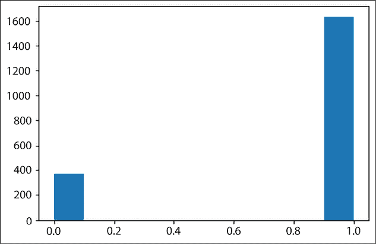
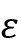

# 第十二章：概率 TensorFlow

不确定性是生活中的一部分；无论你是在进行分类任务还是回归任务，了解你的模型在预测中的信心度非常重要。到目前为止，我们已经介绍了传统的深度学习模型，虽然它们在许多任务中表现出色，但它们无法处理不确定性。相反，它们本质上是确定性的。在本章中，你将学习如何利用 TensorFlow Probability 构建能够处理不确定性的模型，特别是概率深度学习模型和贝叶斯网络。本章内容包括：

+   TensorFlow Probability

+   TensorFlow Probability 中的分布、事件和形状

+   使用 TensorFlow Probability 构建贝叶斯网络

+   理解机器学习模型中的不确定性

+   使用 TensorFlow Probability 模拟随即性和认知不确定性

本章的所有代码文件可以在 [`packt.link/dltfchp12`](https://packt.link/dltfchp12) 找到

让我们从理解 TensorFlow Probability 开始。

# TensorFlow Probability

**TensorFlow Probability** (**TFP**)，是 TensorFlow 生态系统的一部分，是一个为开发概率模型提供工具的库。它可以用于进行概率推理和统计分析。它建立在 TensorFlow 之上，提供相同的计算优势。

*图 12.1* 显示了构成 TensorFlow Probability 的主要组件：


图 12.1：TensorFlow Probability 的不同组件

在根本上，我们有 TensorFlow 支持的所有数值运算，特别是 `LinearOperator` 类（属于 `tf.linalg`）——它包含了对矩阵执行的所有方法，而无需实际构造矩阵。这提供了计算上高效的矩阵自由计算。TFP 包含大量概率分布及其相关的统计计算。它还包括 `tfp.bijectors`，提供了广泛的变换分布。

Bijectors 封装了概率密度的变量变换。也就是说，当一个变量从空间 A 变换到空间 B 时，我们需要一种方法来映射变量的概率分布。Bijectors 为我们提供了完成这一任务所需的所有工具。

TensorFlow 概率还提供了`JointDistribution`，它允许用户抽取联合样本并计算联合对数密度（对数概率密度函数）。标准的 TFP 分布作用于张量，但`JointDistribution`作用于张量的结构。`tfp.layers`提供了神经网络层，可用于扩展标准 TensorFlow 层并为其添加不确定性。最后，它还提供了广泛的概率推理工具。在本章中，我们将通过一些这些函数和类；我们首先从安装开始。要在你的工作环境中安装 TFP，只需运行：

```py
pip install tensorflow-probability 
```

让我们玩一下 TFP。要使用 TFP，我们需要导入它。此外，我们将进行一些绘图。因此，我们导入一些额外的模块：

```py
import matplotlib.pyplot as plt
import tensorflow_probability as tfp
import functools, inspect, sys 
```

接下来，我们探索`tfp.distributions`中可用的不同分布类别：

```py
tfd = tfp.distributions
distribution_class =  tfp.distributions.Distribution
distributions = [name for name, obj in inspect.getmembers(tfd)
                if inspect.isclass(obj) and issubclass(obj, distribution_class)]
print(distributions) 
```

这是输出结果：

```py
['Autoregressive', 'BatchBroadcast', 'BatchConcat', 'BatchReshape', 'Bates', 'Bernoulli', 'Beta', 'BetaBinomial', 'BetaQuotient', 'Binomial', 'Blockwise', 'Categorical', 'Cauchy', 'Chi', 'Chi2', 'CholeskyLKJ', 'ContinuousBernoulli', 'DeterminantalPointProcess', 'Deterministic', 'Dirichlet', 'DirichletMultinomial', 'Distribution', 'DoublesidedMaxwell', 'Empirical', 'ExpGamma', 'ExpInverseGamma', 'ExpRelaxedOneHotCategorical', 'Exponential', 'ExponentiallyModifiedGaussian', 'FiniteDiscrete', 'Gamma', 'GammaGamma', 'GaussianProcess', 'GaussianProcessRegressionModel', 'GeneralizedExtremeValue', 'GeneralizedNormal', 'GeneralizedPareto', 'Geometric', 'Gumbel', 'HalfCauchy', 'HalfNormal', 'HalfStudentT', 'HiddenMarkovModel', 'Horseshoe', 'Independent', 'InverseGamma', 'InverseGaussian', 'JohnsonSU', 'JointDistribution', 'JointDistributionCoroutine', 'JointDistributionCoroutineAutoBatched', 'JointDistributionNamed', 'JointDistributionNamedAutoBatched', 'JointDistributionSequential', 'JointDistributionSequentialAutoBatched', 'Kumaraswamy', 'LKJ', 'LambertWDistribution', 'LambertWNormal', 'Laplace', 'LinearGaussianStateSpaceModel', 'LogLogistic', 'LogNormal', 'Logistic', 'LogitNormal', 'MarkovChain', 'Masked', 'MatrixNormalLinearOperator', 'MatrixTLinearOperator', 'Mixture', 'MixtureSameFamily', 'Moyal', 'Multinomial', 'MultivariateNormalDiag', 'MultivariateNormalDiagPlusLowRank', 'MultivariateNormalDiagPlusLowRankCovariance', 'MultivariateNormalFullCovariance', 'MultivariateNormalLinearOperator', 'MultivariateNormalTriL', 'MultivariateStudentTLinearOperator', 'NegativeBinomial', 'Normal', 'NormalInverseGaussian', 'OneHotCategorical', 'OrderedLogistic', 'PERT', 'Pareto', 'PixelCNN', 'PlackettLuce', 'Poisson', 'PoissonLogNormalQuadratureCompound', 'PowerSpherical', 'ProbitBernoulli', 'QuantizedDistribution', 'RelaxedBernoulli', 'RelaxedOneHotCategorical', 'Sample', 'SigmoidBeta', 'SinhArcsinh', 'Skellam', 'SphericalUniform', 'StoppingRatioLogistic', 'StudentT', 'StudentTProcess', 'StudentTProcessRegressionModel', 'TransformedDistribution', 'Triangular', 'TruncatedCauchy', 'TruncatedNormal', 'Uniform', 'VariationalGaussianProcess', 'VectorDeterministic', 'VonMises', 'VonMisesFisher', 'Weibull', 'WishartLinearOperator', 'WishartTriL', 'Zipf'] 
```

你可以看到，TFP 中有丰富的分布可供选择。现在让我们尝试其中一种分布：

```py
normal = tfd.Normal(loc=0., scale=1.) 
N samples and plots them:
```

```py
def plot_normal(N):
  samples = normal.sample(N)
  sns.distplot(samples)
  plt.title(f"Normal Distribution with zero mean, and 1 std. dev {N} samples")
  plt.show() 
```

你可以看到，随着`N`的增加，图形遵循一个很好的正态分布：

| **N=100** |  |
| --- | --- |
| **N=1000** |  |
| **N=10000** |  |

图 12.2：从随机生成的样本中生成的正态分布，样本大小为 100、1,000 和 10,000。该分布的均值为零，标准差为一。

现在让我们探索 TFP 中可用的不同分布。

# TensorFlow 概率分布

TFP 中的每个分布都有一个与之相关的形状、批次和事件大小。形状是样本大小；它代表独立同分布的抽样或观测。考虑我们在前一节中定义的正态分布：

```py
normal = tfd.Normal(loc=0., scale=1.) 
```

这定义了一个单一的正态分布，均值为零，标准差为一。当我们使用`sample`函数时，我们从这个分布中进行随机抽样。

如果打印对象`normal`，请注意`batch_shape`和`event_shape`的细节：

```py
print(normal) 
```

```py
>>> tfp.distributions.Normal("Normal", batch_shape=[], event_shape=[], dtype=float32) 
```

让我们尝试定义第二个`normal`对象，不过这次，`loc`和`scale`是列表：

```py
normal_2 = tfd.Normal(loc=[0., 0.], scale=[1., 3.])
print(normal_2) 
```

```py
>>> tfp.distributions.Normal("Normal", batch_shape=[2], event_shape=[], dtype=float32) 
```

你注意到`batch_shape`的变化了吗？现在，如果我们从中抽取一个样本，我们将从两个正态分布中抽取，一个均值为零，标准差为一，另一个均值为零，标准差为三。因此，批次形状决定了来自同一分布族的观测数。这两个正态分布是独立的；因此，它是一个同一分布族的分布批次。

你可以有同一类型的分布族的批次，就像前面例子中有两个正态分布一样。你不能创建一个批次，例如，一个正态分布和一个高斯分布。

如果我们需要一个依赖于两个变量且每个变量具有不同均值的单一正态分布，该如何操作？这可以通过 `MultivariateNormalDiag` 来实现，并且这会影响事件形状——它是从该分布中抽取单个样本或观测值的原子形状：

```py
normal_3 = tfd.MultivariateNormalDiag(loc = [[1.0, 0.3]])
print(normal_3) 
```

```py
>>> tfp.distributions.MultivariateNormalDiag("MultivariateNormalDiag", batch_shape=[1], event_shape=[2], dtype=float32) 
```

我们可以看到在上面的输出中，`event_shape` 已发生变化。

## 使用 TFP 分布

一旦定义了分布，你可以做很多其他操作。TFP 提供了丰富的函数来执行各种操作。我们已经使用了 `Normal` 分布和 `sample` 方法。上面的部分也展示了如何使用 TFP 创建单变量、多变量或独立分布。TFP 提供了许多重要方法，用于与创建的分布进行交互。以下是一些重要的方法：

+   `sample(n)`：它从分布中抽取 `n` 个观测值。

+   `prob(value)`：它为该值提供概率（离散）或概率密度（连续）。

+   `log_prob(values)`：为值提供对数概率或对数似然。

+   `mean()`：它提供分布的均值。

+   `stddev()`：它提供分布的标准差。

### 硬币投掷示例

现在，让我们使用 TFP 的一些功能来描述数据，以下是一个例子：我们在学校时就熟悉的标准硬币投掷例子。我们知道如果我们投掷一枚硬币，只有两种可能性——要么是正面，要么是反面。这样的分布，只有两个离散值，称为 **伯努利** 分布。让我们考虑不同的场景：

#### 场景 1

一个公平的硬币，正面概率为 `0.5`，反面概率为 `0.5`。

让我们创建分布：

```py
coin_flip = tfd.Bernoulli(probs=0.5, dtype=tf.int32) 
```

现在获取一些样本：

```py
coin_flip_data = coin_flip.sample(2000) 
```

让我们可视化这些样本：

```py
plt.hist(coin_flip_data) 
```


图 12.3：来自 2,000 次观测的正面和反面的分布

你可以看到我们正反面出现的次数是相等的；毕竟，它是一个公平的硬币。正面和反面的概率都是 `0.5`：

```py
coin_flip.prob(0) ## Probability of tail 
```

```py
>>> <tf.Tensor: shape=(), dtype=float32, numpy=0.5> 
```

#### 场景 2

一个偏向正面的硬币，正面概率为 `0.8`，反面概率为 `0.2`。

现在，由于硬币是有偏的，正面概率为 `0.8`，我们将使用以下方法创建分布：

```py
bias_coin_flip = tfd.Bernoulli(probs=0.8, dtype=tf.int32) 
```

现在获取一些样本：

```py
bias_coin_flip_data = bias_coin_flip.sample(2000) 
```

让我们可视化这些样本：

```py
plt.hist(bias_coin_flip_data) 
```



图 12.4：来自 2,000 次偏向正面的硬币投掷的正面和反面分布

我们可以看到，现在正面的次数远大于反面。因此，反面的概率不再是 `0.5`：

```py
bias_coin_flip.prob(0) ## Probability of tail 
```

```py
>>> <tf.Tensor: shape=(), dtype=float32, numpy=0.19999999> 
```

你可能会得到一个接近 `0.2` 的数字。

#### 场景 3

两个硬币，一个偏向正面，正面概率为 `0.8`，另一个偏向正面，正面概率为 `0.6`。

现在，我们有两个独立的硬币。由于硬币有偏差，正面概率分别为 `0.8` 和 `0.6`，我们使用以下方法创建分布：

```py
two_bias_coins_flip = tfd.Bernoulli(probs=[0.8, 0.6], dtype=tf.int32) 
```

现在获取一些样本：

```py
two_bias_coins_flip_data = two_bias_coins_flip.sample(2000) 
```

让我们可视化这些样本：

```py
plt.hist(two_bias_coins_flip_data[:,0], alpha=0.8, label='Coin 1')
plt.hist(two_bias_coins_flip_data[:,1], alpha=0.5, label='Coin 2')
plt.legend(loc='center') 
```


图 12.5：2000 次独立投掷中，两个硬币的正反面分布

蓝色的柱子对应于硬币 1，橙色的柱子对应于硬币 2。图表中的棕色部分是两个硬币结果重叠的区域。可以看到，硬币 1 的正面数量明显大于硬币 2，正如预期的那样。

### 正态分布

我们可以使用伯努利分布，其中数据只有两个可能的离散值：正面和反面，好与坏，垃圾邮件和火腿，等等。然而，日常生活中的大量数据是连续范围的，正态分布是非常常见的。所以，让我们也来探讨不同的正态分布。

从数学上讲，正态分布的概率密度函数可以表示为：


其中  是分布的均值， 是标准差。

在 TFP 中，参数 `loc` 表示均值，参数 `scale` 表示标准差。现在，为了说明我们如何使用分布，我们假设想要表示某个地点的天气数据，例如印度德里的夏季天气。

#### 单变量正态分布

我们可以认为天气只依赖于温度。所以，通过收集多年来夏季的温度样本，我们可以获得数据的良好表示。也就是说，我们可以得到一个单变量正态分布。

现在，基于天气数据，德里 6 月的平均最高温度为 35 摄氏度，标准差为 4 摄氏度。所以，我们可以通过以下方式创建正态分布：

```py
temperature = tfd.Normal(loc=35, scale = 4) 
```

从中获取一些观测样本：

```py
temperature_data = temperature.sample(1000) 
```

现在，让我们来可视化它：

```py
sns.displot(temperature_data, kde= True) 
```


图 12.6：德里 6 月温度的概率密度函数

检查我们的样本数据的均值和标准差是否接近我们描述的值是很有帮助的。

使用该分布，我们可以通过以下方式找到均值和标准差：

```py
temperature.mean() 
```

```py
# output
>>> <tf.Tensor: shape=(), dtype=float32, numpy=35.0> 
```

```py
temperature.stddev() 
```

```py
# output
>>> <tf.Tensor: shape=(), dtype=float32, numpy=4.0> 
```

从采样数据中，我们可以通过以下方式进行验证：

```py
tf.math.reduce_mean(temperature_data) 
```

```py
# output
>>> <tf.Tensor: shape=(), dtype=float32, numpy=35.00873> 
```

```py
tf.math.reduce_std(temperature_data) 
```

```py
# output
>>> <tf.Tensor: shape=(), dtype=float32, numpy=3.9290223> 
```

因此，采样数据遵循相同的均值和标准差。

#### 多变量分布

到目前为止一切正常。我把我的分布展示给一位从事气象学的朋友看，他说仅使用温度是不够的，湿度也很重要。因此，现在每个天气点依赖于两个参数——当天的温度和湿度。这种数据分布可以通过 TFP 中定义的 `MultivariateNormalDiag` 分布类来获得：

```py
weather = tfd.MultivariateNormalDiag(loc = [35, 56], scale_diag=[4, 15])
weather_data = weather.sample(1000)
plt.scatter(weather_data[:, 0], weather_data[:, 1], color='blue', alpha=0.4)
plt.xlabel("Temperature Degree Celsius")
plt.ylabel("Humidity %") 
```

*图 12.7* 显示了使用 TFP 生成的两个变量（温度和湿度）的多变量正态分布：


图 12.7：多元正态分布，其中 x 轴代表温度，y 轴代表湿度

使用 TFP 中提供的不同分布和双射函数，我们可以生成遵循与真实数据相同联合分布的合成数据来训练模型。

## 贝叶斯网络

**贝叶斯网络**（**BNs**）利用图论、概率论和统计学的概念来封装复杂的因果关系。在这里，我们构建一个**有向无环图**（**DAG**），其中节点（称为因素或随机变量）通过箭头连接，表示因果关系。每个节点代表一个具有相关概率的变量（也称为**条件概率表**（**CPT**））。这些连接表示一个节点对另一个节点的依赖关系。尽管它们最早由 Pearl 于 1988 年提出，但近年来它们重新引起了关注。贝叶斯网络之所以受到广泛关注，主要原因是标准的深度学习模型无法表示因果关系。

它们的优势在于可以结合专家知识和数据来建模不确定性。由于其在做概率和因果推理方面的强大能力，贝叶斯网络已经在许多领域得到了应用。贝叶斯网络的核心是贝叶斯定理：


贝叶斯定理用于根据某些条件来确定事件的联合概率。理解贝叶斯网络最简单的方法是，它可以确定假设与证据之间的因果关系。假设有一个未知的假设 H，我们想要评估它的不确定性并做出一些决策。我们从关于假设 H 的一些先验信念开始，然后根据证据 E 更新我们对 H 的信念。

让我们通过一个例子来理解它。我们考虑一个非常标准的例子：一个有草和喷头的花园。现在，凭常识我们知道，如果喷头开着，草地就会湿。现在让我们反过来说：如果你回家后发现草地湿了，那么喷头开着的概率是多少？而实际上下雨的概率又是多少？有意思吧？让我们进一步增加证据——你发现天空多云。那么，你认为草地湿的原因是什么？

这种基于证据的推理通过贝叶斯网络（BNs）以有向无环图（DAG）的形式呈现，也叫因果图——因为它们提供了因果关系的洞察。

为了建模这个问题，我们使用了`JointDistributionCoroutine`分布类。这个分布类允许从单一的模型规范中同时进行数据采样和联合概率计算。让我们做出一些假设来建立模型：

+   天空多云的概率是`0.2`

+   天空多云并且下雨的概率是`0.8`，而天空不多云但下雨的概率是`0.1`

+   草地湿且喷洒器开启的情况下，云层存在的概率为`0.1`，而云层不存在且喷洒器开启的概率为`0.5`

+   现在，对于草地，我们有四种可能性：

| **喷洒器** | **降雨** | **草地湿** |
| --- | --- | --- |
| F | F | 0 |
| F | T | 0.8 |
| T | F | 0.9 |
| T | T | 0.99 |

表 12.1：喷洒器-降雨-草地情境的条件概率表

*图 12.8* 显示了对应的 BN 有向无环图（DAG）：


图 12.8：我们玩具问题的贝叶斯网络

这个信息可以通过以下模型表示：

```py
Root = tfd.JointDistributionCoroutine.Root
def model():
  # generate the distribution for cloudy weather
  cloudy = yield Root(tfd.Bernoulli(probs=0.2, dtype=tf.int32))
  # define sprinkler probability table
  sprinkler_prob = [0.5, 0.1]
  sprinkler_prob = tf.gather(sprinkler_prob, cloudy)
  sprinkler = yield tfd.Bernoulli(probs=sprinkler_prob, dtype=tf.int32)
  # define rain probability table
  raining_prob = [0.1, 0.8]
  raining_prob = tf.gather(raining_prob, cloudy)
  raining = yield tfd.Bernoulli(probs=raining_prob, dtype=tf.int32)
  #Conditional Probability table for wet grass
  grass_wet_prob = [[0.0, 0.8],
                    [0.9, 0.99]]
  grass_wet_prob = tf.gather_nd(grass_wet_prob, _stack(sprinkler, raining))
  grass_wet = yield tfd.Bernoulli(probs=grass_wet_prob, dtype=tf.int32) 
```

上述模型将像一个数据生成器一样工作。`Root`函数用来告诉图中的节点没有父节点。我们定义了几个实用函数，`broadcast`和`stack`：

```py
def _conform(ts):
  """Broadcast all arguments to a common shape."""
  shape = functools.reduce(
      tf.broadcast_static_shape, [a.shape for a in ts])
  return [tf.broadcast_to(a, shape) for a in ts]
def _stack(*ts):
  return tf.stack(_conform(ts), axis=-1) 
```

为了进行推理，我们使用了`MarginalizableJointDistributionCoroutine`类，因为它可以帮助我们计算边际化的概率：

```py
d = marginalize.MarginalizableJointDistributionCoroutine(model) 
```

现在，基于我们的观察，我们可以获取其他因素的概率。

#### 案例 1：

我们观察到草地是湿的（对应的观察值为 1——如果草地是干的，我们会将其设为 0），我们对于云层或喷洒器的状态一无所知（对应未知状态的观察值设置为“边际化”），并且我们想知道降雨的概率（对应我们想找到的概率的观察值设置为“列举”）。将其转化为观察值：

```py
observations = ['marginalize', # We don't know the cloudy state
                'tabulate', # We want to know the probability of rain
                'marginalize', # We don't know the sprinkler state.
                1]             # We observed a wet lawn. 
```

现在我们通过以下方式得到降雨的概率：

```py
p = tf.exp(d.marginalized_log_prob(observations))
p = p / tf.reduce_sum(p) 
```

结果是`array([0.27761015, 0.72238994], dtype=float32)`，即有 0.722 的概率表示下雨了。

#### 案例 2：

我们观察到草地是湿的，对于云层或降雨的状态我们一无所知，我们想要知道喷洒器是否开启的概率。将其转化为观察值：

```py
observations = ['marginalize',  
                'marginalize', 
                'tabulate',  
                1] 
```

这得到了概率`array([0.61783344, 0.38216656], dtype=float32)`，即有`0.382`的概率表示喷洒器开启。

#### 案例 3：

如果我们观察到没有下雨，且喷洒器关闭，你认为草地的状态会是什么？逻辑上，草地不应该是湿的。让我们通过将观察值传递给模型来确认这一点：

```py
observations = ['marginalize',  
                 0,
                 0, 
                'tabulate'] 
```

这得到了概率`array([1., 0], dtype=float32)`，即有 100%的概率表示草地是干的，正如我们预期的那样。

如你所见，一旦我们知道了父节点的状态，就不需要知道父节点的父节点的状态——也就是说，BN 遵循局部马尔可夫性质。在我们这里讨论的例子中，我们从结构开始，且有条件概率可以使用。我们演示了如何基于模型进行推理，并且尽管使用的是相同的模型和条件概率分布（CPD），证据仍然会改变**后验概率**。

在贝叶斯网络中，结构（节点及其相互连接方式）和参数（每个节点的条件概率）是从数据中学习得出的。它们分别被称为结构学习和参数学习。涉及结构学习和参数学习的算法超出了本章的范围。

## 使用 TensorFlow Probability 处理预测中的不确定性

在本章开始时，我们讨论了深度学习模型中的预测不确定性，以及现有的深度学习架构无法解释这些不确定性。在本章中，我们将使用 TFP 提供的层来建模不确定性。

在添加 TFP 层之前，让我们先理解一下不确定性。我们可以将不确定性分为两类。

### 随机不确定性

这种不确定性存在于自然过程的随机性中。它是固有的不确定性，由于概率的变化性而存在。例如，在投掷硬币时，总会有一定程度的不确定性，无法准确预测下一次投掷是正面还是反面。无法消除这种不确定性。本质上，每次重复实验时，结果都会有一定的变化。

### 认知不确定性

这种不确定性源于知识的缺乏。知识缺乏的原因可能有很多，比如对底层过程的理解不足、对现象的知识不完整等。这种类型的不确定性可以通过理解原因来减少，例如，通过获取更多数据，进行更多实验。

这些不确定性的存在增加了风险。我们需要一种方法来量化这些不确定性，从而量化风险。

### 创建合成数据集

在本节中，我们将学习如何修改标准的深度神经网络以量化不确定性。我们从创建一个合成数据集开始。为了创建数据集，我们假设输出预测 y 与输入 x 之间是线性关系，如下所示：


这里， 服从均值为零，标准差为 1 的正态分布，围绕 x 变化。下面的函数将为我们生成这些合成数据。请注意，为了生成这些数据，我们使用了作为 TFP 分布一部分的 `Uniform` 分布和 `Normal` 分布：

```py
def create_dataset(n, x_range):
    x_uniform_dist = tfd.Uniform(low=x_range[0], high=x_range[1])
    x = x_uniform_dist.sample(n).numpy() [:, np.newaxis] 
    y_true = 2.7*x+3
    eps_uniform_dist = tfd.Normal(loc=0, scale=1)
    eps = eps_uniform_dist.sample(n).numpy() [:, np.newaxis] *0.74*x
    y = y_true + eps
    return x, y, y_true 
```

`y_true` 是不包含正态分布噪声的真实值 。

现在我们用它来创建训练数据集和验证数据集：

```py
x_train, y_train, y_true = create_dataset(2000, [-10, 10])
x_val, y_val, _ = create_dataset(500, [-10, 10]) 
```

这将为我们提供 2,000 个用于训练的数据点和 500 个用于验证的数据点。*图 12.9* 显示了这两个数据集的图形，背景为真实值（在没有任何噪声的情况下的 *y* 值）：


图 12.9：合成数据集的图示

### 使用 TensorFlow 构建回归模型

我们可以构建一个简单的 Keras 模型，执行对前一部分创建的合成数据集的回归任务：

```py
# Model Architecture
model = Sequential([Dense(1, input_shape=(1,))])
# Compile 
model.compile(loss='mse', optimizer='adam')
# Fit
model.fit(x_train, y_train, epochs=100, verbose=1) 
```

让我们看看拟合模型在测试数据集上的表现如何：


图 12.10：真实值与拟合回归线

这是一个简单的问题，我们可以看到拟合的回归线几乎与真实值重合。然而，无法判断预测的不确定性。

### 用于随机不确定性的概率神经网络

如果我们不使用线性回归，而是构建一个能够拟合分布的模型，会怎样呢？在我们的合成数据集中，随机不确定性的来源是噪声，我们知道我们的噪声遵循正态分布，这种分布由两个参数来描述：均值和标准差。因此，我们可以修改我们的模型，预测均值和标准差的分布，而不是实际的*y*值。我们可以通过使用`IndependentNormal` TFP 层或`DistributionLambda` TFP 层来实现这一点。以下代码定义了修改后的模型架构：

```py
model = Sequential([Dense(2, input_shape = (1,)),
    tfp.layers.DistributionLambda(lambda t: tfd.Normal(loc=t[..., :1], scale=0.3+tf.math.abs(t[...,1:])))
]) 
```

我们需要再做一次修改。之前，我们预测的是*y*值；因此，均方误差损失是一个不错的选择。现在，我们预测的是分布；因此，更好的选择是负对数似然作为损失函数：

```py
# Define negative loglikelihood loss function
def neg_loglik(y_true, y_pred):
    return -y_pred.log_prob(y_true) 
```

现在让我们训练这个新模型：

```py
model.compile(loss=neg_loglik, optimizer='adam')
# Fit
model.fit(x_train, y_train, epochs=500, verbose=1) 
```

由于现在我们的模型返回的是一个分布，我们需要测试数据集的统计信息，包括均值和标准差：

```py
# Summary Statistics
y_mean = model(x_test).mean()
y_std = model(x_test).stddev() 
```

请注意，现在预测的均值对应于第一种情况中的拟合线。现在让我们来看一下图表：

```py
fig = plt.figure(figsize = (20, 10))
plt.scatter(x_train, y_train, marker='+', label='Training Data', alpha=0.5)
plt.plot(x_train, y_true, color='k', label='Ground Truth')
plt.plot(x_test, y_mean, color='r', label='Predicted Mean')
plt.fill_between(np.squeeze(x_test), np.squeeze(y_mean+1*y_std), np.squeeze(y_mean-1*y_std),  alpha=0.6, label='Aleatory Uncertainty (1SD)')
plt.fill_between(np.squeeze(x_test), np.squeeze(y_mean+2*y_std), np.squeeze(y_mean-2*y_std),  alpha=0.4, label='Aleatory Uncertainty (2SD)')
plt.title('Aleatory Uncertainty')
plt.xlabel('$x$')
plt.ylabel('$y$')
plt.legend()
plt.show() 
```

以下曲线显示了拟合线以及随机不确定性：


图 12.11：使用 TFP 层建模随机不确定性

你可以看到，我们的模型在原点附近的不确定性较小，但随着距离增大，不确定性增加。

### 考虑到认识论不确定性

在传统的神经网络中，每个权重都由一个数字表示，并且该数字会被更新，以使得模型相对于其权重的损失最小化。我们假设这样学习到的权重就是最优权重。但真的是这样吗？为了回答这个问题，我们将每个权重替换为一个分布，而不是学习一个单一的值，我们现在让模型为每个权重分布学习一组参数。这是通过将 Keras 的 `Dense` 层替换为 `DenseVariational` 层来实现的。`DenseVariational` 层通过对权重使用变分后验分布来表示其值的不确定性。它试图将后验分布正则化，使其接近先验分布。因此，为了使用 `DenseVariational` 层，我们需要定义两个函数，一个是先验生成函数，另一个是后验生成函数。我们使用在 [`www.tensorflow.org/probability/examples/Probabilistic_Layers_Regression`](https://www.tensorflow.org/probability/examples/Probabilistic_Layers_Regression) 上定义的后验和先验函数。

现在我们的模型有两层，一个是 `DenseVariational` 层，后面跟着一个 `DistributionLambda` 层：

```py
model = Sequential([
  tfp.layers.DenseVariational(1, posterior_mean_field, prior_trainable, kl_weight=1/x_train.shape[0]),
  tfp.layers.DistributionLambda(lambda t: tfd.Normal(loc=t, scale=1)),
]) 
```

同样，由于我们要处理的是分布，我们使用的损失函数是负对数似然函数：

```py
model.compile(optimizer=tf.optimizers.Adam(learning_rate=0.01), loss=negloglik) 
```

我们继续使用之前创建的相同的合成数据并训练模型：

```py
model.fit(x_train, y_train, epochs=100, verbose=1) 
```

现在模型已经训练完毕，我们进行预测，为了理解不确定性的概念，我们对相同的输入范围进行了多次预测。我们可以在以下图表中看到结果的方差差异：

|  |  |
| --- | --- |

图 12.12：认识不确定性

*图 12.12* 显示了两个图表，一个是使用仅 200 个训练数据点构建模型时的图表，另一个是使用 2000 个数据点训练模型时的图表。我们可以看到，当数据量增加时，方差以及因此的认识不确定性减少。这里的 *总体均值* 指的是所有预测（共 100 个）的均值，而 *集成均值* 指的是我们只考虑了前 15 个预测值。所有机器学习模型在预测结果时都会受到一定程度的不确定性影响。获得一个估计值或可量化的不确定性范围，能帮助 AI 用户在 AI 预测中建立更多信心，并推动 AI 的广泛应用。

# 总结

本章介绍了 TensorFlow Probability，这是一个建立在 TensorFlow 之上的库，用于进行概率推理和统计分析。本章从对概率推理的需求开始——数据固有的不确定性和由于缺乏知识而产生的不确定性。我们演示了如何使用 TensorFlow Probability 分布生成不同的数据分布。我们学习了如何构建贝叶斯网络并执行推理。接着，我们使用 TFP 层构建了贝叶斯神经网络，以考虑到偶然性不确定性。最后，我们学会了如何借助 `DenseVariational` TFP 层处理认知不确定性。

在下一章中，我们将学习 TensorFlow AutoML 框架。

# 参考文献

1.  Dillon, J. V., Langmore, I., Tran, D., Brevdo, E., Vasudevan, S., Moore, D., Patton, B., Alemi, A., Hoffman, M., 和 Saurous, R. A. (2017). *TensorFlow 分布*. arXiv 预印本 arXiv:1711.10604.

1.  Piponi, D., Moore, D., 和 Dillon, J. V. (2020). *TensorFlow 概率的联合分布*. arXiv 预印本 arXiv:2001.11819.

1.  Fox, C. R. 和 Ülkümen, G. (2011). *区分不确定性的两个维度*，载于《判断与决策的论文集》，Brun, W., Kirkebøen, G. 和 Montgomery, H. 编。奥斯陆：Universitetsforlaget。

1.  Hüllermeier, E. 和 Waegeman, W. (2021). *机器学习中的偶然性和认知不确定性：概念与方法简介*. 《机器学习》110 卷，第 3 期：457–506。

# 加入我们书籍的 Discord 空间

加入我们的 Discord 社区，与志同道合的人交流，并与超过 2000 名成员一起学习： [`packt.link/keras`](https://packt.link/keras)


