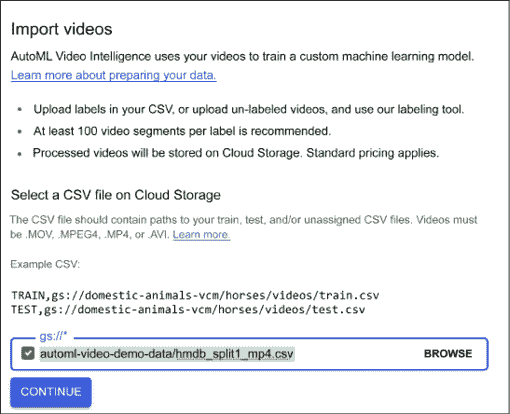
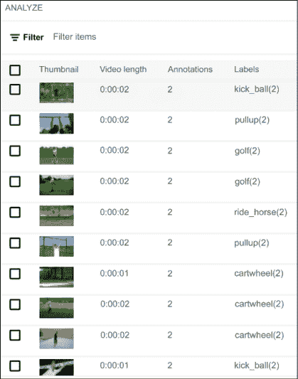
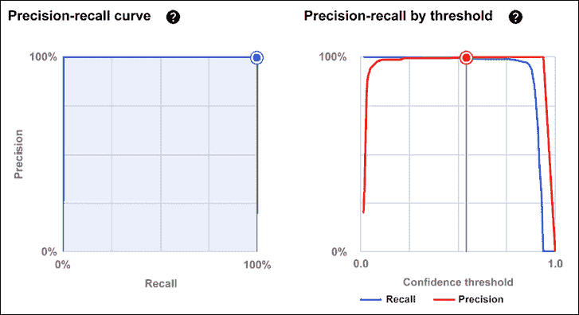

# 第十三章：AutoML 简介

AutoML 的目标是使那些不熟悉机器学习技术的领域专家能够轻松使用机器学习技术。

在本章中，我们将通过一个实际练习使用 Google Cloud 平台，并在简要讨论基础知识后进行大量动手操作。

我们将涵盖：

+   自动数据准备

+   自动特征工程

+   自动模型生成

+   AutoKeras

+   Google Cloud AutoML 提供了多种解决方案，包括表格、视觉、文本、翻译和视频处理。

让我们从 AutoML 的介绍开始。

# 什么是 AutoML？

在前几章中，我们介绍了几种现代机器学习和深度学习中使用的模型。例如，我们见过密集网络、卷积神经网络（CNN）、递归神经网络（RNN）、自编码器和生成对抗网络（GAN）等架构。

有两点需要说明。首先，这些架构是由深度学习专家手工设计的，并不一定容易向非专家解释。其次，这些架构的组合本身是一个手工过程，涉及大量的人工直觉和试错。

今天，人工智能研究的一个主要目标是实现**人工通用智能**（**AGI**）——一种能够理解并自动学习任何人类能做的工作或活动的机器智能。需要注意的是，许多研究人员认为 AGI 是不可实现的，因为智能并不只有一种形式，而是有多种形式。

就我个人而言，我倾向于认同这一观点。请查看[`twitter.com/ylecun/status/1526672565233758213`](https://twitter.com/ylecun/status/1526672565233758213)了解 Yann LeCun 在这一主题上的立场。然而，AutoML 研究和工业应用开始之前，现实情况是非常不同的。事实上，在 AutoML 出现之前，设计深度学习架构与手工制作装饰品非常相似——这是一种通过手工制作装饰物品的活动或爱好。

以通过 X 光识别乳腺癌的任务为例。在阅读了前几章之后，你可能会认为，通过组合多个卷积神经网络（CNN）创建的深度学习管道可能是一个合适的工具。这个直觉可能是一个很好的起点。问题在于，向你的模型使用者解释为什么某个*特定*的 CNN 组合在乳腺癌检测领域有效并不容易。理想情况下，你希望为领域专家（在这个例子中是医学专业人士）提供易于访问的深度学习工具，而这些工具不需要强大的机器学习背景。

另一个问题是，不容易理解是否存在原始手工设计的模型的变种（例如不同的组合），这些变种可能会取得更好的结果。理想情况下，你希望为探索变种空间（例如不同组合）提供深度学习工具，并以一种更有原则且自动化的方式进行。

所以，AutoML 的核心理念是通过使整个端到端的机器学习流程更加自动化，从而减少陡峭的学习曲线和手工构建机器学习解决方案的巨大成本。为此，我们假设 AutoML 管道包括三个宏观步骤：数据准备、特征工程和自动化模型生成，如*图 13.1*所示：


图 13.1：AutoML 管道的三个步骤

在本章的初步部分，我们将详细讨论这三个步骤。接着，我们将重点关注 Google Cloud AutoML。

# 实现 AutoML

AutoML 如何实现端到端自动化的目标？嗯，你可能已经猜到了，自然的选择是使用机器学习——这非常酷。AutoML 使用机器学习来自动化机器学习管道。

其好处是什么？自动化创建和调整机器学习端到端的过程提供了更简单的解决方案，减少了生产时间，并最终可能产生比手工构建的模型更优秀的架构。

这是一个封闭的研究领域吗？恰恰相反。到 2022 年初，AutoML 是一个非常开放的研究领域，这并不令人惊讶，因为最初引起人们对 AutoML 关注的论文是在 2016 年底发表的。

# 自动化数据准备

典型机器学习管道的第一阶段是数据准备（回想一下*图 13.1*中的管道）。在这一步中，有两个主要方面需要考虑：数据清洗和数据合成：

**数据清洗**是通过检查错误的数据类型、缺失值和错误，以及应用数据归一化、分桶、缩放和编码等方法来提高数据质量。一个健壮的 AutoML 管道应该尽可能自动化所有这些枯燥但至关重要的步骤。

**数据合成**是指通过数据增强生成合成数据，用于训练、评估和验证。通常，这一步是领域特定的。例如，我们已经看到如何通过裁剪、旋转、调整大小和翻转操作生成类似 CIFAR10 的合成图像（*第四章*）。也可以考虑通过 GAN 生成额外的图像或视频（参见*第九章*），并使用增强的合成数据集进行训练。对于文本，应该采取不同的方法，可以训练 RNN（*第五章*）生成合成文本，或者采用更多的 NLP 技术，如 BERT、Seq2Seq 或 Transformers（参见*第六章*）对文本进行标注或跨语言翻译，然后再翻译回原始语言——这是另一种领域特定的增强形式。

另一种方法是生成可以进行机器学习的合成环境。这种方法在强化学习和游戏中非常流行，特别是在像 OpenAI Gym 这样的工具包中，旨在提供易于设置的模拟环境，并包含各种不同的（游戏）场景。

简单来说，我们可以说合成数据生成是 AutoML 引擎应提供的另一种选择。通常，使用的工具非常具有领域特定性，适用于图像或视频的工具不一定适用于其他领域，如文本。因此，我们需要一套（相当）庞大的工具集，用于跨领域执行合成数据生成。

# 自动特征工程

特征工程是典型机器学习管道中的第二步（参见*图 13.1*）。它包括三个主要步骤：特征选择、特征构建和特征映射。让我们依次来看每个步骤：

**特征选择**旨在通过丢弃对学习任务贡献较小的特征来选择一个有意义的特征子集。在这个过程中，“有意义”的定义确实取决于应用和你特定问题的领域。

**特征构建**的目标是从基本特征出发，构建新的派生特征。通常，这一技术用于实现更好的泛化能力，并对数据进行更丰富的表示。

**特征映射**旨在通过映射函数改变原始特征空间。这可以通过多种方式实现；例如，它可以使用自编码器（参见*第八章*）、PCA（参见*第七章*）或聚类（参见*第七章*）。

总之，特征工程是一门基于直觉、试验和错误，以及大量人类经验的艺术。现代的 AutoML 引擎旨在使整个过程更加自动化，从而减少人工干预。

# 自动模型生成

模型生成和超参数调优是机器学习管道中的典型第三个宏观步骤（参见*图 13.1*）。

**模型生成**包括为解决特定任务创建合适的模型。例如，你可能会使用 CNN 进行视觉识别，使用 RNN 进行时间序列分析或处理序列问题。当然，也有很多变种，每一种都通过试验和错误的过程手动构建，且适用于非常特定的领域。

**超参数调优**发生在模型手动构建之后。这个过程通常计算开销非常大，且可以显著改善结果质量。因为调优超参数有助于进一步优化我们的模型。

自动模型生成是任何 AutoML 流水线的最终目标。如何实现这一目标？一种方法是通过组合一组基本操作来生成模型，包括卷积、池化、拼接、跳跃连接、递归神经网络、自编码器以及我们在本书中遇到的几乎所有深度学习模型。这些操作构成了一个（通常非常大的）搜索空间，需要进行探索，目标是使这一探索尽可能高效。在 AutoML 行话中，这种探索被称为 **NAS**，即 **神经架构搜索**。关于 AutoML 的开创性论文[1]发布于 2016 年 11 月。其关键思想（见*图 13.2*）是使用强化学习（RL，见*第十一章*）。RNN 充当控制器，生成候选神经网络的模型描述。强化学习被用来最大化生成架构在验证集上的预期准确性。

在 CIFAR-10 数据集上，这种方法从头开始设计了一个新颖的网络架构，其测试集准确性可与最优秀的人工发明架构相媲美。CIFAR-10 模型的测试误差率为 3.65，比之前的最先进模型提高了 0.09 个百分点，且速度比其快了 1.05 倍。对于 Penn Treebank 数据集，该模型能够构建一个新型递归单元，其表现优于广泛使用的 LSTM 单元（见*第九章*）及其他最先进的基线。该单元在 Penn Treebank 上的测试集困惑度为 62.4，比之前的最先进模型低了 3.6。

论文的关键结果如*图 13.2*所示。基于 RNN 的控制网络以概率 p 生成样本架构 A。该候选架构 A 通过子网络训练以得到候选准确性 R。然后计算 p 的梯度，并由 R 进行缩放以更新控制器。这个强化学习操作在多个循环中计算。生成架构的过程如果层数超过一定值就会停止。

控制器 RNN 如何使用基于强化学习的策略梯度方法来生成更好的架构的细节，请参考[1]。在这里，我们强调 NAS 使用基于 Q-learning 的元建模算法，并采用 ϵ-greedy 探索策略以及经验回放（见*第十一章*）来探索模型搜索空间：


图 13.2：使用递归神经网络的神经架构搜索（NAS）

自 2016 年底的原始论文以来，模型生成技术经历了“寒武纪大爆发”。最初，目标是在一次性步骤中生成整个模型。后来，提出了一种*基于细胞*的方法，将生成过程分为两个宏观步骤：首先自动构建一个细胞结构，然后将预定义数量的已发现细胞堆叠在一起生成整个端到端架构[2]。这种**高效神经架构搜索**（**ENAS**）在使用显著更少的 GPU 小时的情况下，表现出强大的经验性能，相较于所有现有的自动模型设计方法，特别是在 2018 年时，其计算开销比标准神经架构搜索低了 1,000 倍。这里，ENAS 的主要目标是通过层次化组合来减少搜索空间。已经提出了基于细胞的方法的变种，包括纯层次化方法，其中更高层次的细胞通过逐步结合较低层次的细胞生成。

NAS 的另一种完全不同的方法是使用迁移学习（见*第五章*），将现有神经网络的学习迁移到新的神经网络，以加速设计过程[3]。换句话说，我们希望在 AutoML 中使用迁移学习。

另一种方法基于**遗传编程**（**GP**）和**进化算法**（**EAs**），其中构成模型搜索空间的基本操作被编码为合适的表示，然后这种编码通过逐步变异的方式，逐步演化成更好的模型，这种方式类似于生物体的基因进化[4]。

**超参数调优**包括找到与学习优化（批量大小、学习率等）和模型特定（卷积神经网络的卷积核大小、特征图数量等；或密集网络或自编码器网络的神经元数量等）相关的超参数的最优组合。同样，搜索空间可能非常大。通常使用三种方法：贝叶斯优化、网格搜索和随机搜索。

**贝叶斯优化**构建了一个目标函数的概率模型，并利用该模型选择最有前景的超参数来在真实的目标函数中进行评估。

**网格搜索**将搜索空间划分为离散的值网格，并测试网格中的所有可能组合。例如，如果有三个超参数，每个超参数有两个候选值的网格，那么需要检查总共 2 x 3 = 6 种组合。网格搜索还有分层变种，逐步细化搜索空间中的网格区域，并提供更好的结果。其核心思想是首先使用粗网格，在找到更好的网格区域后，在该区域进行更细致的网格搜索。

**随机搜索**对参数搜索空间进行随机抽样，这种简单的方法在许多情况下已经证明非常有效[5]。

现在我们已经简要讨论了基础知识，接下来我们将在 Google Cloud 上进行大量的动手操作。让我们开始吧。

# AutoKeras

AutoKeras [6] 提供了自动搜索深度学习模型架构和超参数的功能。该框架使用贝叶斯优化进行高效的神经网络架构搜索。您可以通过 `pip` 安装 Alpha 版本：

```py
pip3 install autokeras # for 1.19 version 
```

架构在*图 13.3* [6]中有详细说明：


图 13.3：AutoKeras 系统概述

架构遵循以下步骤：

1.  用户调用 API。

1.  搜索器在 CPU 上生成神经网络架构。

1.  基于神经架构在 RAM 上构建的带参数的真实神经网络。

1.  神经网络被复制到 GPU 上进行训练。

1.  训练后的神经网络被保存在存储设备中。

1.  搜索器基于训练结果进行更新。

步骤 2 到 6 将重复，直到达到时间限制。

# Google Cloud AutoML 和 Vertex AI

Google Cloud AutoML ([`cloud.google.com/automl/`](https://cloud.google.com/automl/)) 是一整套用于图像、视频和文本处理的产品。AutoML 可以用最少的努力和机器学习专业知识训练高质量的自定义机器学习模型。

Vertex AI 将构建机器学习的 Google Cloud 服务整合到一个统一的用户界面和 API 中。在 Vertex AI 中，您现在可以轻松地训练、比较、测试和部署模型。然后，您可以使用先进的方式监控和运行实验（请参见 [`cloud.google.com/vertex-ai`](https://cloud.google.com/vertex-ai)）。

截至 2022 年，套件由以下组件组成，这些组件无需您了解深度学习网络的内部结构：

**Vertex AI**

+   统一平台，帮助您构建、部署和扩展更多的 AI 模型

**结构化数据**

+   AutoML Tables：自动构建和部署最先进的机器学习模型以处理结构化数据

**Sight**

+   AutoML Image：在云端或边缘设备上从物体检测和图像分类中提取见解

+   AutoML Video：实现强大的内容发现和互动视频体验

**语言**

+   AutoML Text：通过机器学习揭示文本的结构和意义

+   AutoML Translation：动态检测并在不同语言之间进行翻译

在本章的剩余部分，我们将回顾三种 AutoML 解决方案：AutoML Tables、AutoML Text 和 AutoML Video。

## 使用 Google Cloud AutoML Tables 解决方案

让我们看一个使用 Google Cloud AutoML Tables 的示例。我们的目标是导入一些表格数据并在这些数据上训练一个分类器；我们将使用某银行的营销数据。请注意，这个和随后的示例可能会根据不同的使用标准由 Google 收费（请查看在线的最新费用估算 – 见[`cloud.google.com/products/calculator/`](https://cloud.google.com/products/calculator/)）。

所需的第一步是启用 Vertex AI API：


图 13.4：启用 Vertex AI API

然后我们可以从控制台选择**TABULAR**数据集（见*图 13.5*）。数据集的名称是`bank-marketing.csv`：


图 13.5：选择 TABULAR 数据集

在下一个屏幕上，我们指明要从 CSV 加载数据：


图 13.6：AutoML 表格——从 CSV 文件加载数据

接下来，我们可以训练一个新模型，如*图 13.7*所示：


图 13.7：训练新模型

提供了多个训练选项，适用于**分类**和**回归**：


图 13.8：分类和回归的选项

让我们选择**Deposit**列作为目标。数据集描述在[`archive.ics.uci.edu/ml/datasets/bank+marketing`](https://archive.ics.uci.edu/ml/datasets/bank+marketing)中。数据与葡萄牙一家银行的直接营销活动（电话营销）有关。分类目标是预测客户是否会订阅定期存款。

由于选定的列是分类数据，AutoML 表格将构建一个分类模型。它将根据所选列中的类别预测目标。分类是二元的：`1`表示负面结果，意味着没有在银行进行存款；`2`表示正面结果，意味着在银行进行了存款，如*图 13.9*所示：


图 13.9：将目标列设置为 Deposit 时训练新模型

然后我们可以检查数据集（见*图 13.10*），这使我们有机会检查数据集的多个特征，如*名称*、*类型*、*缺失值*、*不同值*、*无效值*、*与目标的相关性*、*均值*和*标准差*：


图 13.10：AutoML 表格——检查数据集

现在是通过**训练**标签来训练模型的时间了。首先让我们为训练设定一个预算，如*图 13.11*所示：


图 13.11：设置训练预算

在这个例子中，我们接受*`3`*小时作为我们的训练预算。在此期间，您可以去喝杯咖啡，而 AutoML 会为您工作（见*图 13.12*）。训练预算是一个介于 1 到 72 之间的数字，表示最大节点小时数，用于训练您的模型。如果您的模型在此之前停止改进，AutoML 表格将停止训练，您只会被收取与实际使用的节点预算相对应的费用：


图 13.12：AutoML 表格训练过程

在训练过程中，我们可以检查进度，如*图 13.13*所示：


图 13.13：检查训练进度

在不到一小时的时间内，Google AutoML 应该会向我们的收件箱发送一封电子邮件：


图 13.14：AutoML 表格：训练结束，并向我的账户发送了电子邮件

点击建议的 URL，您可以查看我们训练的结果。AutoML 生成的模型达到了 94% 的准确率（见*图 13.15*）。记住，准确率是模型在自动保留的测试集上正确分类预测的比例。还提供了对数损失（例如，模型预测与标签值之间的交叉熵）。对于对数损失，较低的值表示更高质量的模型：


图 13.15：AutoML 表格 – 分析我们的训练结果

此外，**接收者操作特征曲线下面积**（**AUC ROC**）也被表示出来。该值范围从零到一，值越高表示模型质量越高。该统计数据总结了 AUC ROC 曲线，这是一张显示分类模型在所有分类阈值下性能的图表。**真正率**（**TPR**）（也称为“召回率”）为：


其中，*TP* 是真正例的数量，*FN* 是假负例的数量。**假正率**（**FPR**）为：


其中，*FP* 是假正例的数量，*TN* 是真负例的数量。

ROC 曲线绘制了不同分类阈值下的真正率（TPR）与假正率（FPR）。在*图 13.16*中，您将看到 ROC 曲线一个阈值下的**曲线下面积**（**AUC**）：


图 13.16：AutoML 表格 – 深入分析我们的训练结果

可以深入评估并访问混淆矩阵（见*图 13.17*）：


图 13.17：AutoML 表格 – 进一步深入分析我们的训练结果

请注意，手工制作的模型在 [`www.kaggle.com/uciml/adult-census-income/kernels`](https://www.kaggle.com/uciml/adult-census-income/kernels) 上的准确率为 ˜86-90%。因此，我们通过 AutoML 生成的模型无疑是一个非常好的结果！

我们还可以查看每个特征在孤立情况下的重要性，如 *图 13.18* 所示：


图 13.18：孤立考虑每个特征的具体重要性

如果我们对结果满意，可以通过 **DEPLOY & TEST** 将模型部署到生产环境中（参见 *图 13.19*）。我们可以选择创建一个可在边缘部署的 Docker 容器，或者直接使用端点。我们选择后者，并对每个可用选项使用默认设置：


图 13.19：AutoML 表格 – 在生产中部署

然后，使用 REST API 可以进行在线收入预测（参见 [`en.wikipedia.org/wiki/Representational_state_transfer`](https://en.wikipedia.org/wiki/Representational_state_transfer)），使用本章所示示例的命令，如 *图 13.20* 所示：


图 13.20：AutoML 表格 – 查询已部署的生产模型

简单来说，我们可以说 Google Cloud ML 非常注重 AutoML 的易用性和效率。让我们总结一下所需的主要步骤（参见 *图 13.21*）：

1.  数据集已导入。

1.  数据集的架构和标签已定义。

1.  输入特征会被自动识别。

1.  AutoML 通过自动执行特征工程、创建模型并调整超参数来实现“魔法”。

1.  自动生成的模型可以进行评估。

1.  模型接着会在生产环境中部署。

当然，也可以通过更改架构和标签定义来重复步骤 2-6。


图 13.21：AutoML 表格 – 所需的主要步骤

在本节中，我们看到了一个关注易用性和效率的 AutoML 示例。Faes 等人[7]展示了取得的进展，引用了该论文：

> “据我们所知，这是首次由非人工智能专家（即医生）自动设计和实现深度学习模型用于医疗应用。尽管在二分类和多分类任务的内部验证中取得了与专家调优的医学图像分类算法相当的表现，但在更复杂的挑战（如多标签分类）和这些模型的外部验证方面尚显不足。我们相信，人工智能有可能通过提高分诊效率和个性化医疗（通过量身定制的预测模型）来推动医疗保健的发展。自动化的预测模型设计方法提高了技术的可访问性，从而促进了医疗社区的参与，并为临床医生提供了一个平台，帮助他们更好地理解人工智能集成的优势和潜在风险。”

在这种情况下，使用了 Cloud AutoML Tables。接下来，我们来看另一个例子。

## 使用 Google Cloud AutoML 文本解决方案

在本节中，我们将使用 AutoML 构建一个分类器。让我们从 Vertex AI 控制台创建一个文本数据集。我们要集中在单标签分类任务上：


图 13.22：AutoML 文本分类—创建数据集

我们将使用一个已经在线可用的数据集（快乐时光数据集存储在`cloud-ml-data/NL-classification/happiness.csv`），将其加载到名为**happiness**的数据集中，并进行单标签分类（如*图 13.23*所示）。这可能需要几分钟或更长时间。

处理完成后，我们将通过电子邮件收到通知：


图 13.23：AutoML 文本分类—创建数据集

一旦数据集加载完成，您应该能够看到每个文本片段都被标注为七个类别中的一个，如*图 13.24*所示：


图 13.24：AutoML 文本分类—类别示例

现在是时候开始训练模型了：


图 13.25：AutoML 文本分类—开始训练

最终，模型建立完成，达到了 90.2%的精度和 86.7%的召回率：


图 13.26：AutoML 文本分类—精度与召回率

我们还可以查看精度-召回率曲线以及基于阈值的精度-召回率（见*图 13.27*）。这些曲线可以用于对分类器进行校准，根据阈值（基于预测概率大于阈值的值）进行校准：


图 13.27：精度-召回率与阈值下的精度-召回率

混淆矩阵如*图 13.28*所示：


图 13.28：文本分类问题的混淆矩阵

## 使用 Google Cloud AutoML 视频解决方案

在这个解决方案中，我们将自动构建一个用于视频分类的新模型。目的是能够根据视频的内容将不同的视频片段分类到各种类别（或类）中。第一步是创建数据集，如*图 13.29*所示：


图 13.29：AutoML 视频智能 – 一个分类问题

我们将使用大约 5,000 个视频的集合，这些视频已存储在 GCP 存储桶中的一个示例数据集中，路径为`automl-video-demo-data/hmdb_split1_5classes_all.csv`，如*图 13.30*所示：



图 13.30\. 导入示例数据集

和往常一样，导入过程需要一些时间，当完成时我们会收到一封电子邮件通知。一旦视频导入完成，我们可以预览它们及其关联的类别：



图 13.31：AutoML 视频智能 – 导入的视频预览

我们现在可以开始构建模型了。有多种选项，包括使用 AutoML 进行训练，使用边缘设备的 AutoML 模型进行导出，或基于 TensorFlow 构建自定义模型。让我们使用默认选项，如*图 13.32*所示：


图 13.32：AutoML 视频智能 – 提示获取更多视频

在这种情况下，我们决定进行一个实验训练，使用一些标签，并将数据集分为 20% 的训练集和 80% 的测试集：


图 13.33：测试集和训练集划分

一旦模型训练完成，您可以从控制台访问结果（*图 13.34*）。在本例中，尽管我们只使用了 20% 的标签进行实验训练，但我们实现了 99.5% 的精度和 99.5% 的召回率。我们希望将训练时间保持较短，同时仍能取得优异的结果。您可以尝试调整模型，例如增加可用的标记视频数量，看看性能如何变化：


图 13.34：AutoML 视频智能 – 评估结果

让我们详细查看一下结果。例如，我们可以分析不同阈值水平下的精度/召回率图：



图 13.35：AutoML 视频智能 – 精度和召回率

混淆矩阵展示了错误分类的镜头示例：


图 13.36：AutoML 视频智能 – 混淆矩阵

## 成本

在 GCP 上的训练成本因采用的 AutoML 类型而异；例如，2022 年在本章中介绍的所有解决方案的训练和模型服务测试的成本低于 10 美元。不过，这还未包括帐户初始时提供的六小时免费折扣（在撰写本文时，约有 150 美元可用）。根据您的组织需求，这可能显著低于购买昂贵本地硬件的成本。

# 总结

AutoML 的目标是使不熟悉机器学习技术的领域专家能够轻松使用机器学习技术。其主要目标是通过使整个端到端的机器学习流程（数据准备、特征工程和自动模型生成）更加自动化，从而减少陡峭的学习曲线和手工制作机器学习解决方案的巨大成本。

在回顾了 2022 年底的最先进解决方案后，我们讨论了如何使用 Google Cloud AutoML 来处理文本、视频和图像，并取得了与手工制作模型相当的效果。AutoML 可能是目前发展最快的研究课题，感兴趣的读者可以在[`www.automl.org/`](https://www.automl.org/)找到最新的成果。

下一章将讨论深度学习背后的数学，这是一个相对先进的话题，如果你对理解在玩神经网络时“幕后发生的事情”感兴趣，推荐阅读。

# 参考文献

1.  Zoph, B., Le, Q. V. (2016). *使用强化学习的神经架构搜索*。[`arxiv.org/abs/1611.01578`](http://arxiv.org/abs/1611.01578)

1.  Pham, H., Guan, M. Y., Zoph, B., Le, Q. V., Dean, J. (2018). *通过参数共享的高效神经架构搜索*。[`arxiv.org/abs/1802.03268`](https://arxiv.org/abs/1802.03268)

1.  Borsos, Z., Khorlin, A., Gesmundo, A. (2019). *Transfer NAS: 使用 Transformer 代理在搜索空间之间进行知识转移*。[`arxiv.org/abs/1906.08102`](https://arxiv.org/abs/1906.08102)

1.  Lu, Z., Whalen, I., Boddeti V., Dhebar, Y., Deb, K., Goodman, E., and Banzhaf, W. (2018). *NSGA-Net: 使用多目标遗传算法的神经架构搜索*。[`arxiv.org/abs/1810.03522`](https://arxiv.org/abs/1810.03522)

1.  Bergstra, J., Bengio, Y. (2012). *超参数优化的随机搜索*。[`www.jmlr.org/papers/v13/bergstra12a.xhtml`](http://www.jmlr.org/papers/v13/bergstra12a.xhtml)

1.  Jin, H., Song, Q., 和 Hu, X.（2019）。 *Auto-Keras：一个高效的神经架构搜索系统*。 [`arxiv.org/abs/1806.10282`](https://arxiv.org/abs/1806.10282)

1.  Faes, L., 等人（2019）。 *无编程经验的医疗专业人员自动化深度学习设计，用于医学图像分类：可行性研究*。《柳叶刀数字健康》 第 1 卷，第 5 期，2019 年 9 月。第 e232-e242 页。 [`www.sciencedirect.com/science/article/pii/S2589750019301086`](https://www.sciencedirect.com/science/article/pii/S2589750019301086%20)

# 加入我们书籍的 Discord 空间

加入我们的 Discord 社区，与志同道合的人一起交流，并与超过 2000 名成员共同学习： [`packt.link/keras`](https://packt.link/keras)


