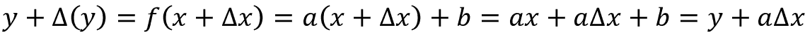
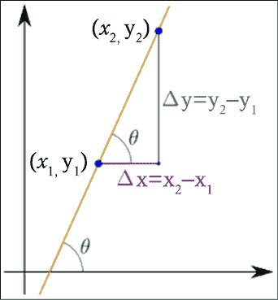
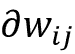
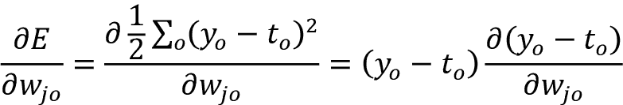
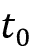
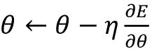
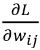
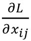

# 第十四章：深度学习背后的数学

在本章中，我们将讨论深度学习背后的数学。这个话题相当深入，可能并非所有从业者都需要掌握。然而，如果你有兴趣了解当你操作神经网络时，*背后的工作原理*，那么这篇内容是值得一读的。

你将学到的内容：

+   历史介绍

+   导数和梯度的概念

+   梯度下降和反向传播算法通常用于优化深度学习网络

让我们开始吧！

# 历史

连续反向传播的基本原理由亨利·J·凯利（Henry J. Kelley）于 1960 年提出，他使用了动态规划方法。斯图尔特·德雷福斯（Stuart Dreyfus）在 1962 年提出使用链式法则。保罗·韦尔博斯（Paul Werbos）是第一个在 1974 年博士论文中将反向传播（简称 backprop）应用于神经网络的人。然而，直到 1986 年，反向传播才在大卫·E·鲁梅尔哈特（David E. Rumelhart）、杰弗里·E·辛顿（Geoffrey E. Hinton）和罗纳德·J·威廉姆斯（Ronald J. Williams）在《自然》杂志上发表的论文中取得成功。1987 年，扬·勒昆（Yann LeCun）描述了现代版本的反向传播算法，现用于神经网络的训练。

**随机梯度下降**（**SGD**）的基本直觉由罗宾斯和蒙罗（Robbins and Monro）在 1951 年提出，这一概念的背景与神经网络不同。2012 年——即反向传播首次提出 52 年后——AlexNet [7]在 2012 年 ImageNet 挑战赛中使用 GPU 实现了 15.3%的前五名错误率。根据《经济学人》[8]的报道，*突然间，人们开始关注这一领域，不仅仅是 AI 社区，整个技术行业都开始关注。* 这一领域的创新并非一蹴而就，而是经历了超过 50 年的漫长探索！

# 一些数学工具

在介绍反向传播之前，我们需要回顾一些微积分中的数学工具。别担心，我们将简要回顾几个常见的数学领域，这些内容通常都在高中数学中涉及。

## 向量

我们将回顾两个在机器学习中非常有用的基本几何和代数概念：向量和角度的余弦。我们首先解释向量的概念。根本上，向量是一个数字列表。给定一个向量，我们可以将其解释为空间中的一个方向。数学家们通常将向量写成列向量 `x` 或行向量 `x`ᐪ。给定两个列向量 `u` 和 `v`，我们可以通过计算它们的点积来得到它们的结果！。可以很容易证明，！，其中！是两个向量之间的夹角。

这里有两个简单的问题：当两个向量非常接近时，结果是什么？当两个向量相同的时候，结果是什么？

## 处处都有导数和梯度

导数是一个强大的数学工具。我们将使用导数和梯度来优化我们的网络。让我们来看一下定义。函数`y` = `f(x)` 的导数是衡量函数值`y`相对于变量`x`变化的变化速率。

如果`x` 和 `y` 是实数，并且绘制了 `f` 与 `x` 的图像，则导数是该图像在每个点的“斜率”。

如果函数是线性的 ，则斜率为 。这是微积分的一个简单结果，可以通过考虑得到：

在*图 14.1*中，我们展示了 、 和角度  之间的几何意义，角度是线性函数与`x`-笛卡尔坐标轴之间的角度：

图 14.1：线性函数及其变化率示例

如果函数不是线性的，那么通过将差异的比值  作为  的数学极限值计算变化速率，即差异变得无限小。从几何角度来看，这就是*图 14.2*中所示的切线：

图 14.2： 的变化速率和当  时的切线

例如，考虑  和在给定点（比如`x` = 2）处的导数 ，我们可以看到导数为正 ，如*图 14.3*所示：

图 14.3： 和 

梯度是多个变量的导数的推广。请注意，单一变量的函数的导数是标量值函数，而多个变量的函数的梯度是向量值函数。梯度用倒三角符号  表示，称为“德尔”或来自希腊字母的*nabla*。这有道理，因为 delta 表示单一变量的变化，而梯度表示所有变量的变化。假设 （例如具有`m`维度的实数空间）且`f` 从  映射到 ；梯度定义如下：

在数学中，多个变量的函数的偏导数  是该函数相对于其中一个变量的导数，其他变量保持不变。

请注意，可以证明梯度是一个向量（移动的方向），它：

+   指向函数最大增量方向的点。

+   在局部最大值或局部最小值处为 0。这是因为如果它为 0，它就无法继续增大或减小。

证明留给有兴趣的读者作为练习。（提示：考虑 *图 14.2* 和 *图 14.3*。）

## 梯度下降

如果梯度指向一个函数的最大增量方向，那么只需沿着梯度的反方向移动，就有可能朝着函数的局部最小值前进。这是梯度下降算法的关键观察，接下来将会使用该算法。

*图 14.4* 中提供了一个例子：

图 14.4：三变量函数的梯度下降

## 链式法则

链式法则指出，如果我们有一个函数 `y` = `g(x)` 且 ，那么导数定义如下：

这种链式操作可以超越标量情况进行推广。假设  和  与 `g` 相关，`g` 将  映射到 ，而 `f` 将  映射到 。若 `y` = `g(x)` 且 `z` = `f(y)`，我们可以推导出：

使用偏导数的广义链式法则将在处理多变量函数时作为反向传播算法的基本工具。稍作停顿，确保你完全理解它。

## 一些求导法则

可能需要提醒自己一些将在后面使用的额外求导法则：

+   常数求导：*c' = 0*，其中 `c` 是常数。

+   变量求导：，用于求变量的导数。

+   线性求导：

+   倒数求导：

+   指数求导：

## 矩阵运算

关于矩阵微积分的书籍有很多。这里我们仅关注神经网络中使用的几种基本运算。回顾一下，矩阵  可用来表示权重 `w[ij]`，其中 、 与相邻两层之间的连接相关。请注意，通过调整权重，我们可以控制网络的“行为”，而且对特定的 `w[ij]` 的微小变化将沿着网络拓扑结构传播（见 *图 14.5*，其中粗体边是受特定 `w[ij]` 微小变化影响的边）：

图 14.5：通过粗体边传播 `w[ij]` 的变化

现在我们已经回顾了一些微积分的基本概念，让我们开始将它们应用于深度学习。第一个问题是如何优化激活函数。嗯，我敢肯定你正在考虑计算导数，所以我们来做吧！

# 激活函数

在 *第一章*，*神经网络基础与 TF* 中，我们看到了一些激活函数，包括 sigmoid、tanh 和 ReLU。在下面的部分中，我们将计算这些激活函数的导数。

## Sigmoid 的导数

记住，Sigmoid 函数定义为 （见 *图 14.6*）：

图 14.6：Sigmoid 激活函数

导数可以按如下方式计算：

因此， 的导数可以计算为一个非常简单的形式：。

## tanh 的导数

记住，arctan 函数定义为 ，如 *图 14.7* 所示：

图 14.7：Tanh 激活函数

如果你记得  和 ，那么导数可以计算为：

因此， 的导数可以计算为一个非常简单的形式：。

## ReLU 的导数

ReLU 函数定义为 （见 *图 14.8*）。ReLU 的导数是：

注意，ReLU 在零点处不可微分。然而，在其他地方它是可微分的，并且零点处的导数值可以任意选择为 0 或 1，如 *图 14.8* 中所示：

图 14.8：ReLU 激活函数

# 反向传播

现在我们已经计算了激活函数的导数，可以描述反向传播算法——深度学习的数学核心。有时，反向传播简称为 *backprop*。

记住，一个神经网络可以有多个隐藏层，以及一个输入层和一个输出层。

除此之外，请回想一下 *第一章*，*神经网络基础与 TF*，中提到的，反向传播可以被描述为一种在错误被发现后，逐步纠正错误的方式。为了减少神经网络的错误，我们必须训练网络。训练需要一个包含输入值及其相应真实输出值的数据集。我们希望使用这个网络来预测尽可能接近真实输出值的结果。反向传播算法的关键直觉是根据输出神经元的误差来更新连接的权重。在本节的剩余部分，我们将解释如何形式化这个直觉。

当反向传播开始时，所有权重都有一些随机赋值。然后，网络对训练集中的每个输入进行激活；值从输入阶段通过隐藏阶段传播到输出阶段，最终做出预测（请注意，为了简化示意图，我们只表示了一些带绿色虚线的值，但实际上所有值都会通过网络向前传播）：

图 14.9：反向传播中的正向步骤

由于我们知道训练集中的真实观察值，可以计算预测中所犯的错误。回溯的最简单方式是将错误反向传播（见*图 14.10*），使用合适的优化算法（如梯度下降）来调整神经网络的权重，目的是减少误差（为了简化起见，这里仅表示少量误差值）：

图 14.10：反向传播中的反向步骤

从输入到输出的正向传播和误差的反向传播过程会重复多次，直到误差降到预定的阈值以下。整个过程如*图 14.11*所示。选择一组特征作为机器学习模型的输入，模型根据这些输入生成预测结果。

将预测结果与（真实的）标签进行比较，生成的损失函数由优化器最小化，优化器更新模型的权重：

图 14.11：正向传播与反向传播

让我们详细看看正向和反向步骤是如何实现的。回顾一下*图 14.5*可能会有帮助，并回忆一下特定`w[ij]`的小变化将如何通过网络传播，遵循其拓扑结构（参见*图 14.5*，其中粗体的边是受特定权重小变化影响的部分）。

## 正向步骤

在正向步骤中，输入与权重相乘，然后所有结果加起来。接着应用激活函数（见*图 14.12*）。此步骤对每一层依次重复。第一层将输入特征作为输入并产生输出。然后，每一层的输入是前一层的输出：

图 14.12：正向传播

如果我们只看一个单独的层，数学上我们有两个方程：

+   转移方程 ，其中`xᵢ`为输入值，`wᵢ`为权重，`b`为偏置。以向量表示为 。注意，`b`可以通过设置  和  来*吸收*进求和式中。

+   激活函数： ，其中 是选择的激活函数。

一个人工神经网络由输入层`I`、输出层`O`以及位于输入层和输出层之间的任意数量的隐藏层`Hᵢ`组成。为了简化起见，假设只有一个隐藏层，因为结果可以很容易地推广。

如*图 14.12*所示，来自输入层的特征`xᵢ`与连接输入层和隐藏层的全连接权重`w[ij]`相乘（见*图 14.12*的左侧）。加权信号与偏置一起求和以计算结果 （见*图 14.12*的中间）。结果通过激活函数 传递，最终从隐藏层流向输出层（见*图 14.12*的右侧）。

总结一下，在前向传播过程中，我们需要执行以下操作：

1.  对于一层中的每个神经元，将每个输入乘以其对应的权重。

1.  然后对于层中的每个神经元，将所有输入权重加在一起。

1.  最后，对于每个神经元，对结果应用激活函数来计算新的输出。

在前向传播结束时，我们从输出层`o`获得一个预测向量 ，该向量是给定输入向量`x`的结果，输入向量在输入层给出。现在的问题是：预测向量 与真实值向量`t`有多接近？

这就是反向传播的作用。

## 反向传播

要了解预测向量 与真实值向量`t`有多接近，我们需要一个函数来衡量输出层`o`的误差。这就是书中早期定义的*损失函数*。损失函数有很多选择。例如，我们可以定义均方误差，如下所示：

注意，`E`是一个二次函数，因此，当`t`与 相距较远时，差值的平方会更大，且符号不重要。注意，这个二次误差（损失）函数并不是唯一可以使用的函数。稍后在本章中，我们将看到如何处理交叉熵。

现在，记住关键点是，在训练过程中，我们希望调整网络的权重，以最小化最终误差。如前所述，我们可以通过沿着梯度的反方向移动来接近局部最小值！。沿梯度的反方向移动是为什么这个算法叫做*梯度下降*的原因。因此，定义更新权重`w[ij]`的方程是合理的，如下所示：

对于多变量的函数，梯度通过偏导数来计算。我们引入超参数  —— 或者在机器学习术语中称为学习率 —— 来衡量在梯度的反方向上应该走多大的步长。

考虑误差 `E`，我们得到以下方程：

上述方程只是捕捉到一个微小变化将影响最终误差的事实，如*图 14.13*所示：

图 14.13：`w[ij]` 的小变化将影响最终的误差 `E`

让我们定义在剩余部分中方程中使用的符号：

+    是层 `l` 中节点 `j` 的输入。

+    是层 `l` 中神经元 `j` 的激活函数（应用于 ）。

+    是层 `l` 中神经元 `j` 的激活输出。

+    是连接层  中神经元 `i` 到层 `l` 中神经元 `j` 的权重矩阵。

+    是层 `l` 中单元 `j` 的偏置。

+    是输出层节点 `o` 的目标值。

现在我们需要计算当权重变化为  时，输出层  处误差的偏导数。这里有两种不同的情况：

+   **情况 1：** 从隐藏（或输入）层到输出层的神经元权重更新方程。

+   **情况 2：** 从隐藏（或输入）层到隐藏层的神经元权重更新方程。

我们将从情况 1 开始。

### 情况 1：从隐藏层到输出层

在这种情况下，我们需要考虑从隐藏层 `j` 到输出层 `o` 的神经元的方程。应用 `E` 的定义并对其求导，我们得到：

这里求和项消失了，因为当我们对 `j` 维度求偏导时，误差中唯一不为零的项是 `j` 维度。考虑到微分是线性操作，并且  —— 因为真实的  值不依赖于  —— 我们得到：

再次应用链式法则，并记住！，我们得到：

记住 ，我们再次得到 ，因为当我们对 `j` 维度求偏导时，误差中唯一不为零的项是 `j` 维度。根据定义，，因此将所有内容合并后我们得到：

因此，误差 `E` 相对于从隐藏层 `j` 到输出层 `o` 的权重 `wⱼ` 的梯度，实际上是三项的乘积：预测值  与真实值  之间的差值、输出层激活函数的导数 ，以及隐藏层节点 `j` 的激活输出 。为了简化，我们还可以定义 ，得到：

简而言之，对于案例 1，每个隐藏层-输出层连接的权重更新方程为：

注意：如果我们要显式计算相对于输出层偏置的梯度，遵循的步骤与上述类似，唯一的区别是：

所以在这种情况下，。

接下来，我们将查看案例 2。

### 案例 2：从隐藏层到隐藏层

在这种情况下，我们需要考虑从隐藏层（或输入层）到隐藏层的神经元方程。*图 14.13* 显示了隐藏层权重变化与输出误差之间的间接关系。这使得梯度的计算变得有些复杂。在这种情况下，我们需要考虑从隐藏层 `i` 到隐藏层 `j` 的神经元方程。

应用 `E` 的定义并进行微分，我们得到：

在这种情况下，和不会消失，因为隐藏层中权重的变化直接影响输出。替换  并应用链式法则，我们得到：

 和内部权重 `w[ij]` (*图 14.13*) 之间的间接关系可以通过以下展开式数学表达：

因为 。

这表明需要再次应用链式法则：

应用链式法则：

替换 ：

推导：

替换 ：

应用链式法则：

替换 ：

推导：

现在我们可以结合上述两个结果：

并得到：

记住定义：，我们得到：

这最后一个替代公式与  特别有趣，因为它反向传播了后续层中计算得到的信号 。相对于权重 `w[ij]` 的变化率  因此是三个因子的乘积：来自下面一层的输出激活值 `yᵢ`，隐藏层激活函数的导数 ，以及通过  权重加权的之前在后续层计算的反向传播信号 。我们可以通过定义  来利用这种反向传播误差信号的思想，从而得出 。这表明，为了计算深度神经网络中任何一层  的梯度，我们只需将反向传播的误差信号  与前馈信号  相乘，就能到达 `l` 层。注意，数学公式稍显复杂，但结果实际上是非常非常简单的！直观理解见 *图 14.14*。给定一个函数 ，在神经元处局部计算得到输入  和 ，梯度  被反向传播。然后，通过链式法则与局部梯度  和  结合，进一步进行反向传播。

这里，`L` 表示来自上一层的误差：

图 14.14：反向传播背后的数学示例

注意：如果我们想显式地计算输出层偏置的梯度，可以证明 。我们将这作为练习留给你。

简而言之，对于案例 2（隐藏层到隐藏层的连接），权重的变化量是 ，每个隐藏层连接的权重更新方程仅为：

我们已经到达本节的结尾，所有数学工具都已定义好，以便做出最终的陈述。反向传播的本质无非是从最后的输出层开始，一层一层地应用权重更新规则，一直到第一层输入层。虽然推导过程很困难，但一旦定义清楚，应用起来极其简单。深度学习的前向-反向算法的核心可以总结为以下内容：

1.  计算从输入到输出的前馈信号。

1.  根据预测值  和真实值 ，计算输出误差 `E`。

1.  反向传播误差信号；将它们与前一层的权重和相关激活函数的梯度相乘。

1.  计算所有参数  的梯度 ，基于反向传播的误差信号和来自输入的前向传播信号。

1.  使用计算出的梯度  更新参数。

请注意，上述算法适用于任何可微的误差函数 `E` 和任何可微的激活  函数。唯一的要求是它们都必须是可微的。

使用反向传播的梯度下降不能保证找到损失函数的全局最小值，而只是局部最小值。然而，这在实际应用中不一定是一个问题。

## 交叉熵及其导数

当交叉熵作为损失函数时，可以使用梯度下降。正如在 *第一章* 中讨论的，*《使用 TF 的神经网络基础》*，逻辑回归损失函数定义为：

其中 `c` 指的是独热编码类（或标签），而 `p` 指的是 softmax 应用后的概率。由于交叉熵应用于 softmax 应用后的概率和独热编码类，我们需要考虑计算相对于最终权重 *score*[i] 的梯度的链式法则。从数学上来说，我们有：

分别计算每一部分，让我们从  开始：

（注意，对于固定的 ，求和中的所有项都是常数，除了选择的项）。

因此，我们得到：

（将偏导数应用到求和式中，考虑到 ）

因此，我们得到：

现在让我们计算另一个部分 ，其中 `pᵢ` 是定义为以下的 softmax 函数：

导数是：

和

使用克罗内克 delta  我们得到：

因此，考虑到我们正在计算偏导数，除了一个分量外，所有其他分量都会归零，我们得到：

将结果结合起来，我们得到：

其中 `cᵢ` 表示独热编码类，而 `pᵢ` 指的是 softmax 概率。简而言之，导数既优雅又容易计算：

## 批量梯度下降、随机梯度下降和小批量

如果我们将之前的讨论进行概括，那么我们可以说优化神经网络的问题就是调整网络的权重 `w`，使得损失函数最小化。方便的是，我们可以将损失函数看作一个求和的形式，因为这种形式实际上代表了所有常用的损失函数：

在这种情况下，我们可以使用与之前讨论的步骤非常相似的推导方法，遵循更新规则，其中是学习率，是梯度：

在许多情况下，评估上述梯度可能需要对所有加和函数的梯度进行昂贵的评估。当训练集非常大时，这可能非常昂贵。如果我们有三百万个样本，我们就得循环三百万次或使用点积。这可真不简单！我们该如何简化这个过程呢？有三种梯度下降方法，它们在处理训练数据集的方式上各不相同。

### 批量梯度下降

**批量梯度下降**（**BGD**）计算误差的变化，但只有在整个数据集评估完之后，才会更新整个模型。从计算上讲，它非常高效，但需要将整个数据集的结果保存在内存中。

### 随机梯度下降

与在整个数据集评估完之后更新模型不同，**随机梯度下降**（**SGD**）在每个训练样本之后进行更新。其关键思想非常简单：SGD 在每一步都抽样一小部分加和函数。

### 小批量梯度下降

**小批量梯度下降**（**MBGD**）在深度学习中非常常用。MBGD（或小批量）将 BGD 和 SGD 结合在一个单一的启发式方法中。数据集被分成小批量，大小约为*bs*，通常为 64 到 256。然后，每个批量会单独进行评估。

请注意，*bs*是另一个需要在训练过程中微调的超参数。MBGD 位于 BGD 和 SGD 的两个极端之间——通过调整批量大小和学习率参数，我们有时可以找到比这两种极端方法更接近全局最小值的解。

与梯度下降平滑地最小化代价函数不同，小批量梯度下降具有较为噪声和崎岖的下降趋势，但代价函数仍然是下降的。噪声的原因在于小批量是所有示例的一个子集，这种抽样可能会导致损失函数出现波动。

## 思考反向传播和卷积神经网络（ConvNets）

在这一部分，我们将讨论反向传播和卷积神经网络。为了简化起见，我们将重点关注一个卷积例子，输入`X`大小为 3x3，一个大小为 2x2 的单一滤波器`W`，没有填充，步长为 1，且没有扩张（见*第三章*，*卷积神经网络*）。推广部分留作练习。

标准的卷积操作如*图 14.15*所示。简单来说，卷积操作是前向传播过程：

| **输入** **X11** **X12** **X13** **X21** **X22** **X23** **X31** **X32** **X33** | **权重** **W11** **W12** **W21** **W22** | **卷积** **W11X11+W12X12+W21X21+W22X22** **W11X12+W12X13+W21X21+W22X23** **W11X21+W12X22+W21X31+W22X32** **W11X22+W12X23+W21X32+W22X33** |
| --- | --- | --- |

图 14.15：ConvNet 范例的前向传播

在检查完 *图 14.15* 后，我们现在可以将注意力集中在当前层的反向传播上。关键假设是，我们接收到一个反向传播信号  作为输入，需要计算  和 。这个计算留作练习，请注意，滤波器中的每个权重都影响输出地图中的每个像素，或者说，滤波器权重的任何变化都会影响所有输出像素。

## 思考反向传播和 RNN

从 *第五章*，*递归神经网络*，我们记得一个 RNN 的基本方程是 ，第 `t` 步的最终预测是 ，正确值为 `yₜ`，误差 `E` 是交叉熵。这里 `U`、`V` 和 `W` 是用于 RNN 方程的学习参数。这些方程可以像 *图 14.16* 中展示的那样进行可视化，其中我们展开了递归。核心思想是总误差只是每个时间步的误差的总和。

如果我们使用 SGD，需要对给定训练样本的每个时间步骤的误差和梯度进行求和：

图 14.16：展开的 RNN 方程式

我们不打算详细写出所有梯度背后繁琐的数学计算，而是只专注于几个特殊情况。例如，通过与前几节相似的数学计算，可以使用链式法则证明 `V` 的梯度仅取决于当前时间步 `s₃`、`y₃` 和 ：

然而， 的依赖关系跨越时间步骤，因为例如， 依赖于 `s₂`，而 `s₂` 又依赖于 `W₂` 和 `s₁`。因此，梯度会稍微复杂一些，因为我们需要对每个时间步的贡献进行求和：

要理解上述方程，可以想象我们正在使用传统前馈神经网络用于 RNN 的标准反向传播算法，但需要额外添加跨时间步的 `W` 梯度。这是因为通过展开 RNN，我们可以有效地使时间上的依赖关系显式化。这也是为什么 RNN 的反向传播经常被称为**递归神经网络的时序反向传播**（**BPTT**）。

直觉在 *图 14.17* 中展示，其中显示了反向传播信号：

图 14.17：循环神经网络方程和反向传播信号

希望您迄今为止都有跟上，因为现在的讨论将会稍微困难一些。如果我们考虑：

然后我们注意到， 应该再次使用链式法则来计算，产生一系列的乘法。在这种情况下，我们需要计算一个向量函数关于另一个向量的导数，因此我们需要一个矩阵，其元素是所有逐点导数（在数学中，这个矩阵称为雅可比矩阵）。从数学上可以证明：

因此，我们得出：

上述方程中的乘法尤其具有问题，因为 sigmoid 和 tanh 在两端都会饱和，其导数会趋近于 0。当这种情况发生时，它们会使得前面层的其他梯度趋近于 0。这会导致梯度在几次迭代后完全消失，网络也就无法从“远距离”学习。

*第五章*，*循环神经网络*，讨论了如何使用**长短期记忆网络**（**LSTM**）和**门控循环单元**（**GRU**）来处理梯度消失问题，并高效地学习长期依赖关系。类似地，当雅可比矩阵中的某个单一项变得很大时，梯度也可能爆炸。*第五章*讨论了如何使用梯度裁剪来处理这个问题。

我们现在已经完成了这次旅程，你应该已经理解了反向传播的工作原理，以及它如何在密集网络、卷积神经网络（CNN）和循环神经网络（RNN）中应用。在接下来的章节中，我们将讨论 TensorFlow 如何计算梯度，以及为什么这对反向传播很有用。

# 关于 TensorFlow 和自动微分的说明

TensorFlow 可以自动计算导数，这一特性被称为自动微分。通过使用链式法则来实现这一功能。计算图中的每个节点都有一个附加的梯度操作，用于计算输入与输出之间的导数。之后，参数的梯度会在反向传播过程中自动计算。

自动微分是一个非常重要的特性，因为你不需要为每个新的神经网络模型手动编写新的反向传播变种。这使得快速迭代和进行许多实验变得更加高效。

# 总结

在本章中，我们讨论了深度学习背后的数学原理。简单来说，深度学习模型根据输入向量计算一个函数，进而生成输出。令人感兴趣的是，它实际上可能拥有数十亿个需要调整的参数（权重）。反向传播是深度学习中用于高效训练人工神经网络的核心数学算法，它采用梯度下降法，并利用链式法则。该算法基于两个交替重复的步骤：前向步骤和后向步骤。

在前向步骤中，输入通过网络传播以预测输出。这些预测可能与评估网络质量所需的真实值不同。换句话说，存在误差，我们的目标是最小化它。此时，反向传播发挥了作用，通过调整网络的权重来最小化误差。误差通过损失函数进行计算，如**均方误差**（**MSE**）或用于非连续值（如布尔值）的交叉熵（*第一章*，*使用 TF 的神经网络基础*）。一种梯度下降优化算法用于通过计算损失函数的梯度来调整神经元的权重。反向传播计算梯度，梯度下降使用梯度来训练模型。通过减少预测的误差率，可以提高准确性，使机器学习模型不断改进。SGD 是最简单的做法，通过在梯度方向上迈出一步来实现。此章节不涉及其他优化算法（如 Adam 和 RMSProp，*第一章*）背后的数学原理。然而，它们涉及使用梯度的第一阶和第二阶矩。第一阶矩涉及先前梯度的指数衰减平均，第二阶矩则涉及先前平方梯度的指数衰减平均。

有三个数据的主要特性证明了使用深度学习的必要性；否则，我们完全可以使用常规机器学习：

+   高维输入（如文本、图像、音频信号、视频和时间序列，通常是一个很好的例子）。

+   处理无法用低阶多项式函数近似的复杂决策面。

+   拥有大量可用的训练数据。

深度学习模型可以看作是由多个基本组件堆叠在一起的计算图，例如密集网络（*第一章*）、CNN（*第三章*）、嵌入层（*第四章*）、RNN（*第五章*）、GAN（*第九章*）、自编码器（*第八章*），有时还采用像“窥视孔”、“跳跃”和“残差”这样的捷径连接，因为它们有助于数据更平滑地流动。图中的每个节点接收张量作为输入，并生成张量作为输出。如前所述，训练通过调整每个节点中的权重来进行，使用反向传播，其中关键思想是通过梯度下降减少最终输出节点的误差。GPU 和 TPU（*第十五章*）可以显著加速优化过程，因为它本质上依赖于（数百万）矩阵计算。

还有一些其他数学工具可能有助于提高你的学习过程。正则化（L1, L2 和 Lasso (*第一章*)）可以通过保持权重归一化显著改善学习。批量归一化 (*第一章*) 基本上帮助追踪数据集在多个深度层次之间的均值和标准差。关键思想是使数据在通过计算图时呈现近似正态分布。丢弃法（*第一章*，*第三章*，*第五章*，*第六章*，*第九章*，和*第二十章*）通过在计算中引入一些冗余元素来帮助防止过拟合，从而提高泛化能力。

本章介绍了直觉背后的数学基础。如前所述，这个话题相当高级，并不一定是从业者必需的。然而，如果你有兴趣了解在玩转神经网络时，“引擎盖下”究竟发生了什么，建议阅读。

下一章将介绍**张量处理单元**（**TPU**），这是谷歌开发的一种特殊芯片，旨在超快执行本章描述的许多数学运算。

# 参考文献

1.  Kelley, Henry J. (1960). *最优飞行路径的梯度理论*. ARS Journal. 30 (10): 947–954\. Bibcode:1960ARSJ...30.1127B. doi:10.2514/8.5282.

1.  Dreyfus, Stuart. (1962). *变分问题的数值解法*. 《数学分析与应用杂志》. 5 (1): 30–45\. doi:10.1016/0022-247x(62)90004-5.

1.  Werbos, P. (1974). *超越回归：行为科学中的新预测与分析工具*. 哈佛大学博士论文.

1.  Rumelhart, David E.; Hinton, Geoffrey E.; Williams, Ronald J. (1986-10-09). *通过反向传播误差学习表示*. 《自然》. 323 (6088): 533–536\. Bibcode:1986Natur.323..533R. doi:10.1038/323533a0.

1.  LeCun, Y. (1987). *连接主义学习模型（Modèles Connexionnistes de l’apprentissage）*，博士论文，巴黎 P. et M. Curie 大学。

1.  Herbert Robbins 和 Sutton Monro. (1951). *一种随机逼近方法. 数学统计学年鉴, 第 22 卷, 第 3 期*. 第 400–407 页.

1.  Krizhevsky, Alex; Sutskever, Ilya; Hinton, Geoffrey E. (2017 年 6 月). *使用深度卷积神经网络进行 ImageNet 分类*（PDF）。《ACM 通讯》。60 (6): 84–90\. doi:10.1145/3065386\. ISSN 0001-0782\.

1.  *从无所作为到神经网络*. 《经济学人》. (2016 年 6 月 25 日)

# 加入我们书籍的 Discord 频道

加入我们的 Discord 社区，与志同道合的人一起学习，并与超过 2000 名成员一起成长，网址：[`packt.link/keras`](https://packt.link/keras)

