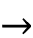
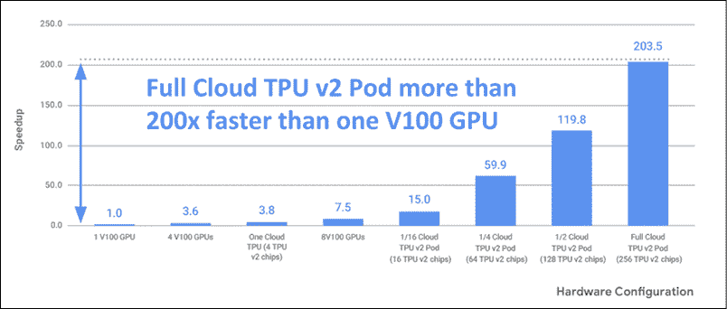

# 第十五章：张量处理单元

本章介绍了**张量处理单元**（**TPU**），这是谷歌开发的一种专用芯片，旨在超快速执行神经网络的数学运算。与**图形处理单元**（**GPU**）一样，这里的理念是拥有一个专门的处理器，只关注极其快速的矩阵运算，而不支持**中央处理单元**（**CPU**）通常支持的其他运算。然而，TPU 的额外改进在于，从芯片中去除了通常存在于 GPU 中的图形操作硬件支持（如光栅化、纹理映射、帧缓冲操作等）。可以把 TPU 看作是一个专门针对深度学习的协处理器，专注于矩阵或张量运算。本章将对比 CPU 和 GPU 与四代 TPU 及边缘 TPU 的性能。这些加速器在 2022 年 4 月已经推出。本章将包括使用 TPU 的代码示例。

本章将让你学习以下内容：

+   C/G/T 处理单元

+   四代 TPU 和边缘 TPU

+   TPU 性能

+   如何在 Colab 中使用 TPU

那么，让我们开始吧。

# C/G/T 处理单元

本节讨论 CPU、GPU 和 TPU。在讨论 TPU 之前，回顾一下 CPU 和 GPU 是很有帮助的。

## CPU 和 GPU

你可能对 CPU 的概念略有了解，它是每台计算机、平板电脑和智能手机中的通用芯片。CPU 负责所有计算：从逻辑控制到算术、从寄存器操作到内存操作等。CPU 遵循著名的摩尔定律[1]，即密集型集成电路中的晶体管数量大约每两年就会翻一番。

许多人认为我们现在正处于一个无法长期维持这一趋势的时代，事实上，它在过去十年中已经出现了衰退。因此，如果我们要支持日益增长的数据处理需求，我们需要一些额外的技术来支持越来越快的计算。

一个改进来源于 GPU，GPU 是专用芯片，完美适合于快速的图形操作，如矩阵乘法、光栅化、帧缓冲操作、纹理映射等。除了计算机图形学中矩阵乘法应用于图像像素外，GPU 也非常适合深度学习。这是一个偶然的幸运故事（幸运是指事件通过偶然的方式以愉快或有益的方式发生和发展）——这是一个技术为了一个目标创造出来，却在与最初设想目标无关的领域取得巨大成功的典型例子。

## TPU

使用 GPU 进行深度学习时遇到的一个问题是，这些芯片是为图形和游戏设计的，而不仅仅是为了快速的矩阵计算。考虑到 GPU 中的 G 代表图形，这种情况显然是可以理解的！GPU 极大地推动了深度学习的发展，但在神经网络的张量运算中，芯片的大部分部分根本没有被使用。对于深度学习来说，实际上不需要光栅化、不需要帧缓冲区操作，也不需要纹理映射。唯一需要的，是一种非常高效的矩阵和张量运算方式。因此，GPU 不一定是深度学习的理想解决方案也就不足为奇了，因为 CPU 和 GPU 的设计早于深度学习的成功。

在深入技术细节之前，我们先来讨论一下张量处理单元（Tensor Processing Unit，简称 TPU）版本 1 的迷人起源。2013 年，Google 大脑部门的负责人 Jeff Dean 估算（见*图 15.1*），如果所有拥有手机的人每天多通话 3 分钟，那么 Google 就需要两到三倍数量的服务器来处理这些数据。这将是一个无法承受的成功灾难案例，也就是说，巨大的成功导致了无法妥善管理的问题。显然，CPU 和 GPU 都不是合适的解决方案。因此，Google 决定需要一种全新的技术——一种能够在没有显著成本增加的情况下实现 10 倍性能增长的技术。这就是 TPU v1 诞生的背景！令人印象深刻的是，从最初设计到生产只花费了 15 个月的时间。你可以在 Jouppi 等人 2014 年的报告中找到更多关于这个故事的细节[3]，该报告还详细描述了 2013 年 Google 遇到的不同推理工作负载：


图 15.1：2013 年 Google 看到的不同推理工作负载（来源 [3]）

让我们来谈谈一些技术细节。TPU v1 是一种特殊的设备（或**特定应用集成电路**，简称**ASIC**），专为超高效的张量运算设计。TPU 遵循“*少即是多*”的理念。这个理念有一个重要的后果：TPU 没有 GPU 所需的所有图形组件。因此，从能效角度来看，TPU 非常高效，并且在很多情况下比 GPU 快得多。迄今为止，TPU 已经有四代产品。我们来回顾一下它们。

# 四代 TPU，以及 Edge TPU

如前所述，TPU 是专门针对矩阵运算进行优化的领域专用处理器。现在，你可能还记得矩阵乘法的基本操作是一个矩阵的行和另一个矩阵的列之间的点积。例如，给定一个矩阵乘法 ，计算 `Y`[`i`, 0] 的方法是：


该操作的顺序实现对于大矩阵来说是耗时的。蛮力计算的时间复杂度为 `O`(`n`³)，对于 `n` x `n` 矩阵来说，因此它不适用于进行大规模计算。

## 第一代 TPU

第一代 TPU（TPU v1）于 2016 年 5 月在 Google I/O 大会上发布。TPU v1 [1] 支持使用 8 位算术进行矩阵乘法。TPU v1 专门用于深度学习推理，但不适用于训练。训练需要执行浮点运算，正如下面段落中所讨论的那样。

TPU 的一个关键功能是“脉动”矩阵乘法。让我们来看看这是什么意思。请记住，深度学习的核心是一个核心产品 ，例如，计算 `Y`[`i`, 0] 的基本操作是：


“脉动”矩阵乘法允许多个 `Y`[`i`, `j`] 值并行计算。数据以协调的方式流动，实际上，在医学中，“脉动”一词指的是心脏收缩以及血液如何在我们的静脉中有节奏地流动。在这里，脉动指的是数据在 TPU 内部的脉冲流动。可以证明，脉动乘法算法比蛮力算法更节省成本 [2]。TPU v1 拥有 **矩阵乘法单元**（**MMU**），在 256 x 256 核心上运行脉动乘法，这样就可以在一次操作中并行计算 65,536 次乘法。此外，TPU v1 放置在机架中，不能直接访问。相反，CPU 作为主机，控制数据传输并向 TPU 发送指令，以执行张量乘法、计算卷积和应用激活函数。CPU  TPU v1 之间的通信通过标准 PCIe 3.0 总线进行。从这个角度来看，TPU v1 在本质上更接近 **浮点运算单元**（**FPU**）协处理器，而不是 GPU。然而，TPU v1 具备运行完整推理模型的能力，从而减少对主机 CPU 的依赖。*图 15.2* 展示了 TPU v1，如 [3] 中所示。如图所示，处理单元通过 PCI 端口连接，并通过标准 DDR4 DRAM 芯片获取权重。乘法操作在 MMU 内进行脉动处理。然后将激活函数应用于结果。MMU 和用于激活的统一缓冲区占据了大量空间。还有一个区域专门计算激活函数。


图 15.2：TPU v1 设计架构（来源 [3]）

TPU v1 采用 28 纳米工艺节点制造，芯片面积为≤331 mm²，时钟频率为 700 MHz，配备 28 MiB 的片上内存、4 MiB 的 32 位累加器，并且拥有 256 x 256 的 8 位乘法器心脏阵列。因此，我们可以得到 700 MHz*65,536（乘法器） 92 万亿次操作/秒。对于矩阵乘法来说，这是一个惊人的性能；*图 15.3*展示了 TPU 电路板及 MMU 执行心脏阵列矩阵乘法时的数据流。此外，TPU v1 还配备 8 GiB 的双通道 2133 MHz DDR3 SDRAM，带宽为 34 GB/s。外部内存是标准配置，主要用于存储和提取推理过程中使用的权重。另请注意，TPU v1 的热设计功耗为 28–40 瓦，这与 GPU 和 CPU 相比，消耗非常低。此外，TPU v1 通常安装在用于 SATA 硬盘的 PCI 插槽中，因此不需要对主机服务器进行任何修改[3]。每台服务器最多可以安装四张卡。*图 15.3*展示了 TPU v1 卡以及心脏阵列计算过程：


图 15.3：左侧为 TPU v1 电路板，右侧为心脏阵列计算过程中数据处理的示例

如果你想查看 TPU 与 GPU 和 CPU 的性能比较，可以参考[3]，并通过对数-对数坐标图查看，TPU 的性能比 Tesla K80 GPU 高出两个数量级。该图展示了一个“屋顶”性能，性能不断增长，直到达到峰值后保持不变。

屋顶越高，性能越好：


图 15.4：TPU v1 的峰值性能可达到 Tesla K80 的 3 倍

## 第二代 TPU

第二代 TPU（TPU2）于 2017 年发布。在这种情况下，内存带宽提高到 600 GB/s，性能达到 45 TFLOPS。四个 TPU2 被排列在一个模块中，性能为 180 TFLOPS。然后，将 64 个模块组合成一个 POD，性能达到 11.5 PFLOPS。TPU2 采用浮点运算，因此既适用于训练也适用于推理。

TPU2 拥有一个 128*128 核心的 MNU 用于矩阵乘法，并且配备**向量处理单元**（**VPU**）处理其他任务，如应用激活函数等。VPU 处理 float32 和 int32 运算。另一方面，MXU 在 16-32 位混合精度浮点格式下运行。

每个 TPU v2 芯片有两个核心，每块板上最多可以安装四个芯片。在 TPU v2 中，Google 采用了一种新的浮点模型，叫做 bfloat16，目的是牺牲一些精度，但仍然非常适合深度学习。这种精度的降低使得我们能够提升 TPU2 的性能，而 TPU2 比 TPU v1 更加节能。事实上，可以证明，较小的尾数有助于减少物理硅面积和乘法器功耗。因此，bfloat16 采用与 IEEE 754 单精度浮点格式相同的标准，但将尾数字段从 23 位截断为 7 位。

保留指数位使得该格式能够保持与 32 位单精度浮点数相同的范围。这使得两种数据类型之间的转换相对简单：


图 15.5：Cloud TPU v2 和 Cloud TPU v3

Google 通过**Google Compute Engine** (**GCE**) 和 **Google Kubernetes Engine** (**GKE**) 提供这些 TPU v2 和 TPU v3 的访问权限。此外，还可以通过 Colab 免费使用它们。

## 第三代 TPU

第三代 TPU（TPU3）于 2018 年发布[4]。TPU3 的速度是 TPU2 的两倍，并且它们被组合成 4 倍更大的集群。总体来说，这意味着性能提升了 8 倍。Cloud TPU v3 Pods 可以提供超过 100 petaflops 的计算能力。另一方面，2018 年以 alpha 版本发布的 Cloud TPU v2 Pods 可以达到 11.5 petaflops——这是另一个令人印象深刻的进步。到 2019 年，TPU2 和 TPU3 已投入生产，并有不同的定价：


图 15.6：Google 在 2019 年 Google I/O 上宣布了 TPU v2 和 v3 Pods 的 beta 版

一块 TPU v3 板有四个 TPU 芯片、八个核心，并且使用液冷系统。Google 采用了源自超级计算机技术的超高速互联硬件，将成千上万个 TPU 连接起来，具有非常低的延迟。

每次在单个 TPU 上更新参数时，所有其他 TPU 都会通过一种通常用于并行计算的 reduce-all 算法得到通知。所以，你可以把 TPU v3 看作是当今最快的超计算机之一，专门用于矩阵和张量运算，内部包含成千上万个 TPU。

## 第四代 TPU

Google 的第四代 TPU ASIC 的矩阵乘法 TFLOPs 是 TPU v3 的两倍多，内存带宽有了显著提升，并且在互联技术方面有更多进展。每个 TPU v4 芯片提供的计算能力是 TPU v3 芯片的 2 倍以上——最高可达 275 峰值 TFLOPS。每个 TPU v4 Pod 的峰值性能可达 1.1 exaflops/s。Google 声称，TPU v4 Pods 广泛用于开发如 MUM 和 LaMDA 等研究突破，并改进搜索、助手和翻译等核心产品（见[`blog.google/technology/developers/io21-helpful-google/`](https://blog.google/technology/developers/io21-helpful-google/)）。截至 2022 年 4 月，TPU v4 仅在预览版中提供（*图 15.7*）：


图 15.7：TPU v4 芯片及部分 TPU v4 Pod – 来源：[`twitter.com/google/status/1394785686683783170`](https://twitter.com/google/status/1394785686683783170)

在本节中，我们介绍了四代 TPU。在结束之前，我想提到，使用可抢占的云 TPU 进行容错机器学习工作负载可以节省成本。这些工作负载包括但不限于带检查点的长时间训练任务或大数据集上的批量预测。

## Edge TPU

除了已经讨论的三代 TPU 外，Google 在 2018 年宣布了一种专门用于边缘计算的 TPU。该 TPU 特别适用于**物联网**（**IoT**）以及支持移动设备和物联网中的 TensorFlow Lite。单个 Edge TPU 每秒可以执行 4 万亿（定点）操作（4 TOPS），仅消耗 2 瓦功率。Edge TPU 专为小型、低功耗设备设计，非常适合在设备端进行机器学习，且既快速又节能。Edge TPU 支持 TensorFlow Lite 开发框架（参见*图 15.8*）。2019 年底，Google 发布了 Pixel 4 智能手机，内置了一款名为 Pixel Neural Core 的 Edge TPU：


图 15.8：一分硬币上的两个 Edge TPU – 来源：[`coral.ai/docs/edgetpu/faq/#what-is-the-edge-tpu`](https://coral.ai/docs/edgetpu/faq/#what-is-the-edge-tpu)

通过这些内容，我们结束了 TPU v1、v2、v3、v4 及 Edge TPU 的介绍。在接下来的章节中，我们将简要讨论性能。

# TPU 性能

讨论性能总是很困难，因为首先需要定义我们要衡量的指标，以及我们将用作基准的工作负载集。例如，Google 在使用 ResNet-50 [4] 时报告了 TPU v2 的令人印象深刻的线性扩展性（参见*图 15.9* 和 *图 15.10*）：


图 15.9：增加图像数量时，TPU v2 的线性扩展性

此外，您可以在网上找到 ResNet-50 [4] 的比较，其中完整的 Cloud TPU v2 Pod 比 V100 NVIDIA Tesla GPU 在 ResNet-50 训练中快 >200 倍：



图 15.10：完整的 Cloud TPU v2 Pod 比 V100 NVIDIA Tesla GPU 在训练 ResNet-50 模型时快 >200 倍

根据 Google 的说法，TPU v4 在与 Nvidia A100 GPU 相比时，给出了 MLPerf1.0 [5] 的顶级结果（参见*图 15.11*）。事实上，这些加速器的设计考虑了最新的大型模型，涉及数十亿甚至数万亿的参数（比如 GPT-3、T5 和 Switch Transformer）：


图 15.11：MLPerf 1.0 TPU v4 Pod 性能 – 来源：[`cloud.google.com/blog/products/ai-machine-learning/google-wins-mlperf-benchmarks-with-tpu-v4`](https://cloud.google.com/blog/products/ai-machine-learning/google-wins-mlperf-benchmarks-with-tpu-v4)

# 如何在 Colab 中使用 TPU

在本节中，我们展示了如何在 Colab 中使用 TPU。只需将浏览器指向 [`colab.research.google.com/`](https://colab.research.google.com/) 并从**Runtime**菜单中更改运行时，如*图 15.12*所示。首先，你需要为笔记本启用 TPU，然后导航到**编辑**→**笔记本设置**并从**硬件加速器**下拉框中选择**TPU**：


图 15.12：将 TPU 设置为硬件加速器

## 检查 TPU 是否可用

首先，让我们通过使用这个简单的代码片段来检查是否有可用的 TPU，它会返回分配给 TPU 的 IP 地址。CPU 与 TPU 之间的通信是通过**gRPC**（**gRPC 远程过程调用**）进行的，gRPC 是一个现代的、开源的高性能**远程过程调用**（**RPC**）框架，可以在任何环境中运行：

```py
%tensorflow_version 2.x
import tensorflow as tf
print("Tensorflow version " + tf.__version__)
try:
  tpu = tf.distribute.cluster_resolver.TPUClusterResolver()  # TPU detection
  print('Running on TPU ', tpu.cluster_spec().as_dict()['worker'])
except ValueError:
  raise BaseException('ERROR: Not connected to a TPU runtime; please see the previous cell in this notebook for instructions!')
tf.config.experimental_connect_to_cluster(tpu)
tf.tpu.experimental.initialize_tpu_system(tpu)
tpu_strategy = tf.distribute.experimental.TPUStrategy(tpu) 
```

你应该会看到如下内容：

```py
Tensorflow version 2.8.0
Running on TPU  ['10.36.66.50:8470']
INFO:tensorflow:Deallocate tpu buffers before initializing tpu system.
INFO:tensorflow:Deallocate tpu buffers before initializing tpu system.
INFO:tensorflow:Initializing the TPU system: grpc://10.36.66.50:8470
INFO:tensorflow:Initializing the TPU system: grpc://10.36.66.50:8470
INFO:tensorflow:Finished initializing TPU system.
INFO:tensorflow:Finished initializing TPU system.
WARNING:absl:'tf.distribute.experimental.TPUStrategy' is deprecated, please use  the non experimental symbol 'tf.distribute.TPUStrategy' instead.
INFO:tensorflow:Found TPU system:
INFO:tensorflow:Found TPU system:
INFO:tensorflow:*** Num TPU Cores: 8
INFO:tensorflow:*** Num TPU Cores: 8
INFO:tensorflow:*** Num TPU Workers: 1
INFO:tensorflow:*** Num TPU Workers: 1
INFO:tensorflow:*** Num TPU Cores Per Worker: 8
INFO:tensorflow:*** Num TPU Cores Per Worker: 8 
```

我们确认 TPU 是可用的！

## Keras MNIST TPU 端到端训练

参考 Google Research Colab 上提供的笔记本（参见 [`colab.research.google.com/github/GoogleCloudPlatform/training-data-analyst/blob/master/courses/fast-and-lean-data-science/01_MNIST_TPU_Keras.ipynb#scrollTo=Hd5zB1G7Y9-7`](https://colab.research.google.com/github/GoogleCloudPlatform/training-data-analyst/blob/master/courses/fast-and-lean-data-science/01_MNIST_TPU_Keras.ipynb#scrollTo=Hd5zB1G7Y9-7)），我们可以查看如何使用这个代码片段检测 TPU 或 GPU，它会使用 TPU 或 GPU 作为回退：

```py
try: # detect TPUs
    tpu = tf.distribute.cluster_resolver.TPUClusterResolver.connect() # TPU detection
    strategy = tf.distribute.TPUStrategy(tpu)
except ValueError: # detect GPUs
    strategy = tf.distribute.MirroredStrategy() # for GPU or multi-GPU machines
    #strategy = tf.distribute.get_strategy() # default strategy that works on CPU and single GPU
    #strategy = tf.distribute.experimental.MultiWorkerMirroredStrategy() # for clusters of multi-GPU machines
print("Number of accelerators: ", strategy.num_replicas_in_sync) 
```

请注意，`tf.distribute.TPUStrategy(tpu)`是你在 TPU 和 TPU 集群上进行同步训练时，代码中唯一需要更改的部分。然后，要在 TPU 上运行 TF2 程序，你可以使用`tf.keras`中的`.compile`或`.fit`API 与`TPUStrategy`一起使用。

如果你愿意，你可以通过直接调用`strategy.run`编写你自己的自定义训练循环（参见 [`www.tensorflow.org/api_docs/python/tf/distribute/TPUStrategy`](https://www.tensorflow.org/api_docs/python/tf/distribute/TPUStrategy)）。

# 使用预训练的 TPU 模型

Google 在 GitHub 的`tensorflow/tpu`仓库中提供了一些预训练的 TPU 模型（[`github.com/tensorflow/tpu`](https://github.com/tensorflow/tpu)）。这些模型包括图像识别、物体检测、低资源模型、机器翻译和语言模型、语音识别以及图像生成。我的建议是，在可能的情况下，先从一个预训练模型[6]开始，然后进行微调或应用某种形式的迁移学习。截至 2022 年 4 月，以下模型可用：

| **图像识别、分割等** | **机器翻译和语言模型** | **语音识别** | **图像生成** |
| --- | --- | --- | --- |
| **图像识别**AmoebaNet-DResNet-50/101/152/2000Inception v2/v3/v4**物体检测**RetinaNetMask R-CNN**图像分割**Mask R-CNNDeepLabRetinaNet**低资源模型**MnasNetMobileNetSqueezeNet | **机器翻译**（基于 transformer）**情感分析**（基于 transformer）**问答**BERT | **语音识别**Transformer | **图像 Transformer**DCGANGAN |

表 15.1：在 GitHub 上可用的使用 TPU 预训练的最先进的模型集合

玩转这个代码库的最佳方式是通过 Google Cloud 控制台克隆它，并使用在 [`github.com/tensorflow/tpu/blob/master/README.md`](https://github.com/tensorflow/tpu/blob/master/README.md) 中提供的环境。你应该能够浏览 *图 15.13* 中展示的内容：


图 15.13：云 TPU

如果你点击 **OPEN IN GOOGLE CLOUD SHELL** 按钮，系统会将 Git 仓库克隆到你的云 Shell 中，然后打开 Shell（见 *图 15.14*）：


图 15.14：Google Cloud Shell 与为你克隆的 TPU Git 仓库

在那里，你可以通过一个不错的 Google Cloud TPU 演示，使用 TPU 群体——一个计算引擎虚拟机和云 TPU 配对，在 MNIST 上训练 ResNet-50（见 *图 15.15*）：


图 15.15：Google Cloud TPU 演示，使用 TPU 群体在 MNIST 上训练 ResNet-50

如果你有兴趣查看，我将为你保留这个训练演示。

# 总结

TPU 是 Google 为执行神经网络数学运算而开发的非常特殊的 ASIC 芯片，以超快的方式进行运算。计算的核心是一个 systolic multiplier，它并行计算多个点积（行 * 列），从而加速基础深度学习操作的计算。可以将 TPU 看作是一个专门用于深度学习的协处理器，专注于矩阵或张量操作。到目前为止，Google 已经发布了四代 TPU，并且还推出了一个针对物联网的 Edge TPU。Cloud TPU v1 是一个基于 PCI 的专用协处理器，提供 92 teraops，只支持推理。Cloud TPU v2 实现了 180 teraflops，支持训练和推理。2018 年发布的 Cloud TPU v2 Pods（测试版）可达到 11.5 petaflops。Cloud TPU v3 实现了 420 teraflops，支持训练和推理。Cloud TPU v3 Pods 可以提供超过 100 petaflops 的计算能力。每个 TPU v4 芯片提供超过 TPU v3 芯片 2 倍的计算能力——最高可达 275 peak TFLOPS。每个 TPU v4 Pod 可提供 1.1 exaflops/s 的峰值性能。

这就是一台世界级的张量操作超级计算机！

在下一章中，我们将介绍一些其他有用的深度学习库。

# 参考文献

1.  摩尔定律：[`en.wikipedia.org/wiki/Moore%27s_law`](https://en.wikipedia.org/wiki/Moore%27s_law)

1.  Milovanović, I. Ž. 等人（2010 年 5 月）。*43 种同步矩阵乘法方法*。刊登于《国际计算数学杂志》87(6):1264–1276。

1.  Jouppi, N. P. 等人（2014 年 6 月）。*数据中心内的张量处理单元性能分析*。第 44 届国际计算机架构研讨会（ISCA）。

1.  Google TPU v2 性能：[`storage.googleapis.com/nexttpu/index.xhtml`](https://storage.googleapis.com/nexttpu/index.xhtml)

1.  MLPerf 网站：[`mlperf.org/`](https://mlperf.org/)

1.  一些使用 TPU 预训练的模型：[`cloud.google.com/tpu`](https://cloud.google.com/tpu)

# 加入我们书籍的 Discord 社区

加入我们的 Discord 社区，结识志同道合的人，并与超过 2000 名成员一起学习，访问链接：[`packt.link/keras`](https://packt.link/keras)


