# 第十七章：图神经网络

在本章中，我们将讨论一种相对较新的神经网络类别——**图神经网络**（**GNN**），它非常适合处理图数据。许多现实生活中的问题，如社交媒体、生物化学、学术文献等，天生就是“图形化”的，意味着它们的输入由可以最适合用图表示的数据组成。我们将从数学角度讲解什么是图，然后解释“图卷积”这一概念，这是 GNN 的核心思想。接着，我们将介绍一些基于基本图卷积技术变体的流行 GNN 层。我们将描述 GNN 的三个主要应用，涵盖节点分类、图分类和边预测，并通过使用 TensorFlow 和**深度图书馆**（**DGL**）的示例来说明。DGL 提供了我们刚刚提到的 GNN 层以及更多的层。此外，它还提供了一些标准的图数据集，我们将在示例中使用这些数据集。随后，我们将展示如何从自己的数据构建一个与 DGL 兼容的数据集，以及如何使用 DGL 的低级消息传递 API 构建自己的层。最后，我们将探讨图的扩展，例如异构图和时间图。

本章将涵盖以下主题：

+   图的基础

+   图机器学习

+   图卷积

+   常见的图层

+   常见的图应用

+   图的定制

+   未来方向

本章的所有代码文件可以在 https://packt.link/dltfchp17 找到

让我们从基础开始。

# 图的基础

从数学上讲，一个图`G`是一个数据结构，包含一组顶点（也叫节点）`V`，这些顶点通过一组边`E`相互连接，即：

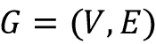

一个图可以等价地表示为一个邻接矩阵`A`，其大小为（`n`, `n`），其中`n`是集合`V`中顶点的数量。该邻接矩阵的元素*A[I, j]*表示顶点`i`和顶点`j`之间的边。因此，若顶点`i`和顶点`j`之间有一条边，则元素*A[I, j] = 1*，否则为 0。在加权图的情况下，边可能有自己的权重，邻接矩阵会通过将边的权重设置为元素*A[i, j]*来反映这一点。边可以是有向的或无向的。例如，表示节点`x`和节点`y`之间友谊的边是无向的，因为`x`是`y`的朋友意味着`y`也是`x`的朋友。相反，有向边可以是社交媒体中的关注网络，在这种情况下，`x`关注`y`并不意味着`y`关注`x`。对于无向图，*A[I, j] = A[j, i]*。

邻接矩阵`A`的另一个有趣特性是，`A`^n，即* A*的* n*次乘积，揭示了节点之间的`n`跳连接。

图到矩阵的等价性是双向的，这意味着邻接矩阵可以无损地转换回图的表示。由于**机器学习**（**ML**）方法，包括**深度学习**（**DL**）方法，消耗的输入数据是张量形式，因此这种等价性意味着图形可以有效地作为各种机器学习算法的输入表示。

每个节点还可以与其自己的特征向量关联，就像表格输入中的记录一样。假设特征向量的大小为`f`，那么节点集`X`可以表示为*(n, f)*。边也可以有自己的特征向量。由于图和矩阵之间的等价性，图通常由库表示为高效的基于张量的结构。我们将在本章后面详细讨论这一点。

# 图形机器学习

任何机器学习任务的目标都是学习从输入空间`X`到输出空间`y`的映射`F`。早期的机器学习方法需要特征工程来定义合适的特征，而深度学习方法则可以从训练数据本身推断特征。深度学习通过假设一个具有随机权重的模型`M`来工作！[](img/B18331_17_002.png)，并将任务表述为一个关于参数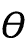的优化问题：

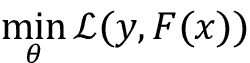

并使用梯度下降法在多次迭代中更新模型权重，直到参数收敛：

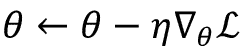

不出所料，图神经网络（**GNNs**）也遵循这一基本模型。

然而，正如你在前几章中所看到的，机器学习（**ML**）和深度学习（**DL**）通常是针对特定结构进行优化的。例如，在处理表格数据时，你可能会直观地选择一个简单的**前馈网络**（**FFN**）或“密集”网络，在处理图像数据时选择**卷积神经网络**（**CNN**），而在处理像文本或时间序列这样的序列数据时选择**递归神经网络**（**RNN**）。有些输入可能简化为像素格子或令牌序列这样的结构，但也不一定如此。在其自然形式下，图形是拓扑复杂、大小不确定的结构，并且不是置换不变的（即实例之间不是相互独立的）。

出于这些原因，我们需要特殊的工具来处理图数据。本章将介绍 DGL，它是一个跨平台的图形库，支持 MX-Net、PyTorch 和 TensorFlow 用户，通过使用可配置的后端，广泛被认为是最强大且易于使用的图形库之一。

# 图卷积——图神经网络的直觉

卷积算子有效地允许在二维平面上将相邻像素的值以特定方式聚合，这在计算机视觉中的深度神经网络中取得了成功。其一维变体在自然语言处理和音频处理领域也取得了类似的成功。正如你在*第三章*《卷积神经网络》中回忆的那样，网络在连续的层之间应用卷积和池化操作，并能够学习到足够多的全局特征，从而在它所训练的任务中获得成功。

从另一个角度来看，图像（或图像的每个通道）可以被视为一种网格形状的图，其中相邻的像素以特定的方式彼此连接。类似地，一串单词或音频信号也可以被看作是另一个线性图，其中相邻的词元彼此相连。在这两种情况下，深度学习架构会在输入图的相邻节点之间逐步应用卷积和池化操作，直到它学会执行任务，通常是分类任务。每一步卷积都涉及额外层次的邻居。例如，第一个卷积合并来自距离 1（直接）邻居的信号，第二个合并来自距离 2 的邻居的信号，以此类推。

*图 17.1* 显示了 CNN 中的 3 x 3 卷积与对应的“图卷积”操作之间的等价性。卷积算子将滤波器（本质上是一组九个可学习的模型参数）应用于输入，并通过加权和将它们合并。通过将像素邻域视为一个以中心像素为核心的九个节点的图，你可以达到相同的效果。

在这种结构上的图卷积将只是节点特征的加权和，这与 CNN 中的卷积算子相同：

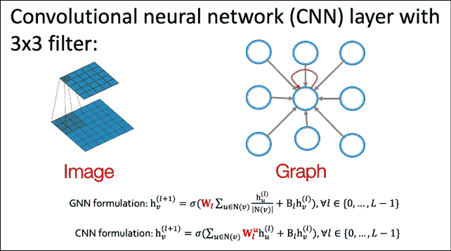

图 17.1：图像卷积和图卷积之间的相似之处。图像来源：CS-224W 机器学习与图，斯坦福大学。

CNN 中的卷积操作和图卷积的相应方程如下所示。正如你所看到的，在 CNN 中，卷积可以视为输入像素和它的每个邻居的加权线性组合。每个像素都以所应用的滤波器的形式带来了自己的权重。另一方面，图卷积也是输入像素和所有邻居的聚合加权线性组合。所有邻居的聚合效应会平均到卷积输出中：

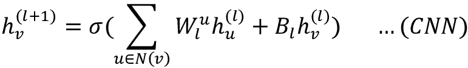

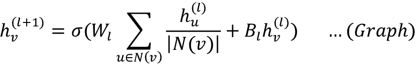

因此，图卷积是我们已经熟悉的卷积的一种变体。在接下来的部分中，我们将看到如何将这些卷积组合起来构建不同类型的 GCN 层。

# 常见的图层

本节讨论的所有图层都使用了上述描述的图卷积操作的某种变体。像 DGL 这样的图库贡献者，在学术论文提出这些层之后不久，就会提供许多这些层的预构建版本，因此实际上你永远不需要自己实现其中的一个。这部分信息主要是为了帮助理解其底层工作原理。

## 图卷积网络

**图卷积网络**（**GCN**）是由 Kipf 和 Welling 提出的图卷积层[1]。最初，它被提出作为一种可扩展的半监督学习方法，用于图结构数据上。他们将 GCN 描述为对节点特征向量`X`和底层图的邻接矩阵`A`的操作，并指出当`A`中的信息不包含在数据`X`中时，这种方法特别强大，例如在引文网络中，文档之间的引文链接，或在知识图谱中的关系。

GCN 结合了每个节点特征向量与其邻居的特征向量，通过一些权重（初始化为随机值）进行加权。因此，对于每个节点，邻居节点的特征之和会被加到一起。这个操作可以表示为如下：

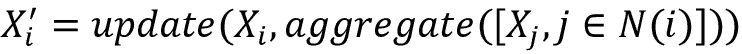

这里的*update*和*aggregate*是不同类型的求和函数。这种对节点特征的投影被称为消息传递机制。这个消息传递的单次迭代等同于对每个节点的直接邻居进行图卷积。如果我们希望结合来自更远节点的信息，可以多次重复这个操作。

以下方程描述了 GCN 在第*(l+1)*层对节点`i`的输出。这里，*N(i)*是节点`i`的邻居集合（包括它本身），`c`[ij]是节点度数平方根的乘积，sigma 是激活函数。*b(l)*项是一个可选的偏置项：

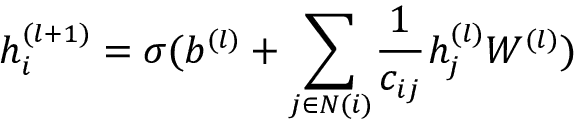

接下来，我们将讨论图注意力网络（Graph Attention Network，简称 GAT），它是 GCN 的一个变体，其中系数是通过注意力机制学习的，而不是显式定义的。

## 图注意力网络

**图注意力网络**（**GAT**）层是 Velickovic 等人提出的[2]。与 GCN 类似，GAT 也对其邻居的特征进行局部平均。不同之处在于，GAT 不是显式指定归一化项`c`[ij]，而是通过自注意力机制在节点特征上学习它。对应的归一化项写作，它是基于邻居节点的隐藏特征和学习到的注意力向量计算出来的。本质上，GAT 的理念是优先考虑来自相似邻居节点的特征信号，而非来自不相似邻居节点的信号。

每个邻居 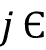 的邻域 `N`(`i`) 向节点 `i` 发送其自身的注意力系数向量 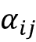。以下方程组描述了 GAT 在第 (*i+1*) 层对节点 `i` 的输出。注意力  是使用 Bahdanau 的注意力模型，通过前馈网络计算得到的：

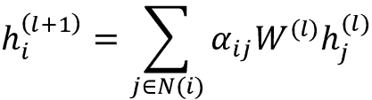

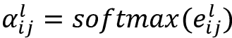

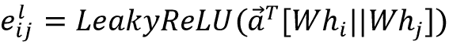

GCN 和 GAT 架构适用于小型到中型网络。下一节中描述的 GraphSAGE 架构则更适合于较大的网络。

## GraphSAGE（采样与聚合）

到目前为止，我们考虑的卷积要求图中的所有节点在训练时都必须出现，因此它们是传导式的，并且不能自然地推广到未见过的节点。Hamilton、Ying 和 Leskovec [3] 提出了 GraphSAGE，这是一个通用的、归纳式的框架，能够为之前未见过的节点生成嵌入。它通过从节点的本地邻域进行采样和聚合来实现这一点。GraphSAGE 已在动态演化的网络（如引用图和 Reddit 帖子数据）中的节点分类中取得了成功。

GraphSAGE 通过采样一部分邻居而不是使用全部邻居。它可以通过随机游走定义节点邻域，并汇总重要性分数来确定最佳样本。聚合函数可以是 MEAN、GCN、POOL 或 LSTM。均值聚合只是简单地取邻居向量的元素级平均值。LSTM 聚合更具表现力，但本质上是序列性的且不具对称性；它作用于从节点邻居的随机排列中得到的无序集合。POOL 聚合既具对称性又可训练；在这里，每个邻居向量独立地通过一个全连接神经网络，并对邻居集合中的信息应用最大池化。

这个方程组展示了如何从节点 `i` 和它在第 `l` 层的邻居 *N(i)* 生成节点 `i` 在第 *(l+1)* 层的输出：

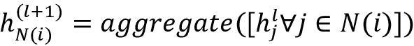

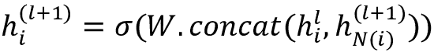

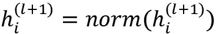

在了解了使用 GNN 处理大规模网络的策略后，我们将探讨如何利用图同构网络最大化 GNN 的表示能力（也就是区分能力）。

## 图同构网络

Xu 等人[4]提出了**图同构网络**（**GIN**），作为一种比现有图层具有更强表达能力的图层。具有高表达能力的图层应能够区分一对拓扑结构相似但不完全相同的图。研究表明，GCN 和 GraphSAGE 无法区分某些图结构。他们还展示了，在区分图结构方面，SUM 聚合优于 MEAN 和 MAX 聚合。因此，GIN 图层提供了一种比 GCN 和 GraphSAGE 更好的邻居聚合表示方法。

以下方程显示了节点`i`和层*(l+1)*的输出。在这里，函数`$1$2`是一个可调用的激活函数，*aggregate*是一个聚合函数，如 SUM、MAX 或 MEAN，且是一个可学习的参数，它将在训练过程中学习：

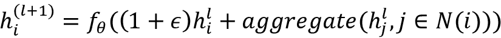

在介绍了几种流行的 GNN 架构后，让我们现在关注可以使用 GNN 完成的任务类型。

# 常见图应用

现在我们来看一下 GNN 的一些常见应用。通常，应用可以分为以下三个主要类别。在本节中，我们将展示如何使用 TensorFlow 和 DGL 构建和训练 GNN 以解决这些任务的代码示例：

+   节点分类

+   图分类

+   边分类（或链接预测）

GNN 还有其他应用，如图聚类或生成图模型，但它们较为少见，在这里我们不予考虑。

## 节点分类

节点分类是图数据中一个流行的任务。在这里，模型被训练来预测节点类别。非图分类方法可以仅使用节点特征向量来实现，而一些预 GNN 方法如 DeepWalk 和 node2vec 可以仅使用邻接矩阵，但 GNN 是第一类能够将节点特征向量和连接信息一起使用来进行节点分类的技术。

本质上，这个思想是将一个或多个图卷积（如前一节所述）应用于图中的所有节点，将节点的特征向量投影到一个对应的输出类别向量，以此来预测节点的类别。我们的节点分类示例将使用 CORA 数据集，这是一个包含 2,708 篇科学论文的数据集，每篇论文被分类为七个类别之一。这些论文被组织成一个引用网络，包含 5,429 个链接。每篇论文由一个大小为 1,433 的词向量描述。

我们首先设置导入。如果你还没有这样做，你需要通过`pip install dgl`将 DGL 库安装到你的环境中。你还需要将环境变量`DGLBACKEND`设置为 TensorFlow。在命令行中，可以通过命令`export DGLBACKEND=tensorflow`来实现，在笔记本环境中，你可以尝试使用魔法命令`%env DGLBACKEND=tensorflow`：

```py
import dgl
import dgl.data
import matplotlib.pyplot as plt
import numpy as np
import os
import tensorflow as tf
import tensorflow_addons as tfa
from dgl.nn.tensorflow import GraphConv 
```

CORA 数据集被预先包装为 DGL 数据集，因此我们使用以下调用将数据集加载到内存中：

```py
dataset = dgl.data.CoraGraphDataset() 
```

第一次调用时，它将记录正在下载并提取到本地文件。一旦完成，它将打印出一些关于 CORA 数据集的有用统计信息。正如你所看到的，图中有 2,708 个节点和 10,566 条边。每个节点有一个大小为 1,433 的特征向量，每个节点被分类为七个类别之一。此外，我们还看到它有 140 个训练样本、500 个验证样本和 1,000 个测试样本：

```py
 NumNodes: 2708
  NumEdges: 10556
  NumFeats: 1433
  NumClasses: 7
  NumTrainingSamples: 140
  NumValidationSamples: 500
  NumTestSamples: 1000
Done saving data into cached files. 
```

由于这是一个图数据集，它预计包含与一组图相关的数据。然而，CORA 是一个单一的引用图。你可以通过`len(dataset)`验证这一点，它将返回`1`。这也意味着下游代码将作用于由`dataset[0]`提供的图，而不是整个数据集。节点特征将包含在字典`dataset[0].ndata`中作为键值对，边特征则包含在`dataset[0].edata`中。`ndata`包含`train_mask`、`val_mask`和`test_mask`键，这些布尔掩码表示哪些节点属于训练集、验证集和测试集，另有一个`feat`键，其中包含图中每个节点的特征向量。

我们将构建一个包含两个`GraphConv`层的`NodeClassifier`网络。每一层将通过聚合邻居信息来计算新的节点表示。`GraphConv`层只是简单的`tf.keras.layers.Layer`对象，因此可以堆叠。第一层`GraphConv`将输入特征的大小（1,433）映射到一个大小为 16 的隐藏特征向量，第二层`GraphConv`将隐藏特征向量映射到一个大小为 2 的输出类别向量，从中可以读取类别。

请注意，`GraphConv`只是我们可以放入`NodeClassifier`模型中的众多图层之一。DGL 提供了多种图卷积层，如果需要，可以用它们替换`GraphConv`：

```py
class NodeClassifier(tf.keras.Model):
  def __init__(self, g, in_feats, h_feats, num_classes):
    super(NodeClassifier, self).__init__()
    self.g = g
    self.conv1 = GraphConv(in_feats, h_feats, activation=tf.nn.relu)
    self.conv2 = GraphConv(h_feats, num_classes)
  def call(self, in_feat):
    h = self.conv1(self.g, in_feat)
    h = self.conv2(self.g, h)
    return h
g = dataset[0]
model = NodeClassifier(
  g, g.ndata["feat"].shape[1], 16, dataset.num_classes) 
```

我们将使用以下代码在 CORA 数据集上训练该模型。我们将使用`AdamW`优化器（这是更流行的`Adam`优化器的变种，能够使模型具有更好的泛化能力），学习率设置为*1e-2*，权重衰减为*5e-4*。我们将训练 200 个周期。我们还将检测是否有可用的 GPU，如果有，我们会将图分配给 GPU。

如果检测到 GPU，TensorFlow 会自动将模型移动到 GPU 上：

```py
def set_gpu_if_available():
  device = "/cpu:0"
  gpus = tf.config.list_physical_devices("GPU")
  if len(gpus) > 0:
    device = gpus[0]
  return device
device = set_gpu_if_available()
g = g.to(device) 
```

我们还定义了一个`do_eval()`方法，它通过给定特征和用于评估拆分的布尔掩码来计算准确度：

```py
def do_eval(model, features, labels, mask):
  logits = model(features, training=False)
  logits = logits[mask]
  labels = labels[mask]
  preds = tf.math.argmax(logits, axis=1)
  acc = tf.reduce_mean(tf.cast(preds == labels, dtype=tf.float32))
  return acc.numpy().item() 
```

最后，我们准备好按照如下方式设置并运行我们的训练循环：

```py
NUM_HIDDEN = 16
LEARNING_RATE = 1e-2
WEIGHT_DECAY = 5e-4
NUM_EPOCHS = 200
with tf.device(device):
  feats = g.ndata["feat"]
  labels = g.ndata["label"]
  train_mask = g.ndata["train_mask"]
  val_mask = g.ndata["val_mask"]
  test_mask = g.ndata["test_mask"]
  in_feats = feats.shape[1]
  n_classes = dataset.num_classes
  n_edges = dataset[0].number_of_edges()
  model = NodeClassifier(g, in_feats, NUM_HIDDEN, n_classes)
  loss_fcn = tf.keras.losses.SparseCategoricalCrossentropy(from_logits=True)
  optimizer = tfa.optimizers.AdamW(
    learning_rate=LEARNING_RATE, weight_decay=WEIGHT_DECAY)
  best_val_acc, best_test_acc = 0, 0
  history = []
  for epoch in range(NUM_EPOCHS):
    with tf.GradientTape() as tape:
      logits = model(feats)
      loss = loss_fcn(labels[train_mask], logits[train_mask])
      grads = tape.gradient(loss, model.trainable_weights)
      optimizer.apply_gradients(zip(grads, model.trainable_weights))

    val_acc = do_eval(model, feats, labels, val_mask)
    history.append((epoch + 1, loss.numpy().item(), val_acc))
    if epoch % 10 == 0:
      print("Epoch {:3d} | train loss: {:.3f} | val acc: {:.3f}".format(
         epoch, loss.numpy().item(), val_acc)) 
```

训练运行的输出显示训练损失从`1.9`下降到`0.02`，验证准确率从`0.13`上升到`0.78`：

```py
Epoch   0 | train loss: 1.946 | val acc: 0.134
Epoch  10 | train loss: 1.836 | val acc: 0.544
Epoch  20 | train loss: 1.631 | val acc: 0.610
Epoch  30 | train loss: 1.348 | val acc: 0.688
Epoch  40 | train loss: 1.032 | val acc: 0.732
Epoch  50 | train loss: 0.738 | val acc: 0.760
Epoch  60 | train loss: 0.504 | val acc: 0.774
Epoch  70 | train loss: 0.340 | val acc: 0.776
Epoch  80 | train loss: 0.233 | val acc: 0.780
Epoch  90 | train loss: 0.164 | val acc: 0.780
Epoch 100 | train loss: 0.121 | val acc: 0.784
Epoch 110 | train loss: 0.092 | val acc: 0.784
Epoch 120 | train loss: 0.073 | val acc: 0.784
Epoch 130 | train loss: 0.059 | val acc: 0.784
Epoch 140 | train loss: 0.050 | val acc: 0.786
Epoch 150 | train loss: 0.042 | val acc: 0.786
Epoch 160 | train loss: 0.037 | val acc: 0.786
Epoch 170 | train loss: 0.032 | val acc: 0.784
Epoch 180 | train loss: 0.029 | val acc: 0.784
Epoch 190 | train loss: 0.026 | val acc: 0.784 
```

现在我们可以评估我们训练的节点分类器在保留测试集上的表现：

```py
test_acc = do_eval(model, feats, labels, test_mask)
print("Test acc: {:.3f}".format(test_acc)) 
```

这将输出模型在保留测试集上的总体准确度：

```py
Test acc: 0.779 
```

## 图分类

图分类是通过聚合所有节点特征并对其应用一个或多个图卷积来预测整个图的某个属性完成的。例如，在药物发现过程中，当试图将分子分类为具有某种特定治疗特性时，这可能会很有用。在本节中，我们将通过一个示例展示图分类。

为了运行该示例，请确保已经安装 DGL 并设置为使用 TensorFlow 后端；有关如何操作的信息，请参阅上一节中的节点分类部分。要开始示例，请导入必要的库：

```py
import dgl.data
import tensorflow as tf
import tensorflow_addons as tfa
from dgl.nn import GraphConv
from sklearn.model_selection import train_test_split 
```

我们将使用 DGL 提供的蛋白质数据集。该数据集是一组图，每个图都有节点特征和一个标签。每个图表示一个蛋白质分子，图中的每个节点表示分子中的一个原子。节点特征列出了原子的化学性质。标签表示该蛋白质分子是否是酶：

```py
dataset = dgl.data.GINDataset("PROTEINS", self_loop=True)
print("node feature dimensionality:", dataset.dim_nfeats)
print("number of graph categories:", dataset.gclasses)
print("number of graphs in dataset:", len(dataset)) 
```

上面的调用会将蛋白质数据集下载到本地，并打印出一些数据集的信息。如您所见，每个节点的特征向量大小为`3`，图的类别数量为`2`（酶或非酶），数据集中的图数量为`1113`：

```py
node feature dimensionality: 3
number of graph categories: 2
number of graphs in dataset: 1113 
```

我们将首先把数据集分为训练集、验证集和测试集。我们将使用训练集来训练我们的 GNN，使用验证集进行验证，并在测试集上发布最终模型的结果：

```py
tv_dataset, test_dataset = train_test_split(
  dataset, shuffle=True, test_size=0.2)
train_dataset, val_dataset = train_test_split(
  tv_dataset, test_size=0.1)
print(len(train_dataset), len(val_dataset), len(test_dataset)) 
```

这将数据集分成训练集、验证集和测试集，分别包含 801、89 和 223 个图。由于我们的数据集很大，我们需要使用小批量来训练网络，以免占满 GPU 内存。因此，本示例还将展示如何使用我们的数据进行小批量处理。

接下来，我们定义用于图分类的 GNN。它由两个`GraphConv`层堆叠而成，这些层将节点编码为它们的隐藏表示。由于目标是为每个图预测一个单一类别，我们需要将所有节点表示聚合为图级表示，我们通过使用`dgl.mean_nodes()`平均节点表示来实现：

```py
class GraphClassifier(tf.keras.Model):
  def __init__(self, in_feats, h_feats, num_classes):
    super(GraphClassifier, self).__init__()
    self.conv1 = GraphConv(in_feats, h_feats, activation=tf.nn.relu)
    self.conv2 = GraphConv(h_feats, num_classes)
  def call(self, g, in_feat):
    h = self.conv1(g, in_feat)
    h = self.conv2(g, h)
    g.ndata["h"] = h
    return dgl.mean_nodes(g, "h") 
```

对于训练，我们设置了训练参数和`do_eval()`函数：

```py
HIDDEN_SIZE = 16
BATCH_SIZE = 16
LEARNING_RATE = 1e-2
NUM_EPOCHS = 20
device = set_gpu_if_available()
def do_eval(model, dataset):
  total_acc, total_recs = 0, 0
  indexes = tf.data.Dataset.from_tensor_slices(range(len(dataset)))
  indexes = indexes.batch(batch_size=BATCH_SIZE)
  for batched_indexes in indexes:
    graphs, labels = zip(*[dataset[i] for i in batched_indexes])
    batched_graphs = dgl.batch(graphs)
    batched_labels = tf.convert_to_tensor(labels, dtype=tf.int64)
    batched_graphs = batched_graphs.to(device)
    logits = model(batched_graphs, batched_graphs.ndata["attr"])
    batched_preds = tf.math.argmax(logits, axis=1)
    acc = tf.reduce_sum(tf.cast(batched_preds == batched_labels,
                                dtype=tf.float32))
    total_acc += acc.numpy().item()
    total_recs += len(batched_labels)
  return total_acc / total_recs 
```

最后，我们定义并运行我们的训练循环来训练`GraphClassifier`模型。我们使用`Adam`优化器，学习率为`1e-2`，损失函数为`SparseCategoricalCrossentropy`，进行`20`轮训练：

```py
with tf.device(device):
  model = GraphClassifier(
    dataset.dim_nfeats, HIDDEN_SIZE, dataset.gclasses)
  optimizer = tf.keras.optimizers.Adam(learning_rate=LEARNING_RATE)
  loss_fcn = tf.keras.losses.SparseCategoricalCrossentropy(
    from_logits=True)
  train_indexes = tf.data.Dataset.from_tensor_slices(
    range(len(train_dataset)))
  train_indexes = train_indexes.batch(batch_size=BATCH_SIZE)
  for epoch in range(NUM_EPOCHS):
    total_loss = 0
    for batched_indexes in train_indexes:
      with tf.GradientTape() as tape:
        graphs, labels = zip(*[train_dataset[i] for i in batched_indexes])
        batched_graphs = dgl.batch(graphs)
        batched_labels = tf.convert_to_tensor(labels, dtype=tf.int32)
        batched_graphs = batched_graphs.to(device)
        logits = model(batched_graphs, batched_graphs.ndata["attr"])
        loss = loss_fcn(batched_labels, logits)
        grads = tape.gradient(loss, model.trainable_weights)
        optimizer.apply_gradients(zip(grads, model.trainable_weights))
        total_loss += loss.numpy().item()

    val_acc = do_eval(model, val_dataset)
    print("Epoch {:3d} | train_loss: {:.3f} | val_acc: {:.3f}".format(
        epoch, total_loss, val_acc)) 
```

输出显示，随着`GraphClassifier`模型训练了 20 轮，损失逐渐下降，验证准确度逐渐提高：

```py
Epoch   0 | train_loss: 34.401 | val_acc: 0.629
Epoch   1 | train_loss: 33.868 | val_acc: 0.629
Epoch   2 | train_loss: 33.554 | val_acc: 0.618
Epoch   3 | train_loss: 33.184 | val_acc: 0.640
Epoch   4 | train_loss: 32.822 | val_acc: 0.652
Epoch   5 | train_loss: 32.499 | val_acc: 0.663
Epoch   6 | train_loss: 32.227 | val_acc: 0.663
Epoch   7 | train_loss: 32.009 | val_acc: 0.697
Epoch   8 | train_loss: 31.830 | val_acc: 0.685
Epoch   9 | train_loss: 31.675 | val_acc: 0.685
Epoch  10 | train_loss: 31.580 | val_acc: 0.685
Epoch  11 | train_loss: 31.525 | val_acc: 0.708
Epoch  12 | train_loss: 31.485 | val_acc: 0.708
Epoch  13 | train_loss: 31.464 | val_acc: 0.708
Epoch  14 | train_loss: 31.449 | val_acc: 0.708
Epoch  15 | train_loss: 31.431 | val_acc: 0.708
Epoch  16 | train_loss: 31.421 | val_acc: 0.708
Epoch  17 | train_loss: 31.411 | val_acc: 0.708
Epoch  18 | train_loss: 31.404 | val_acc: 0.719
Epoch  19 | train_loss: 31.398 | val_acc: 0.719 
```

最后，我们在保留的测试数据集上评估训练好的模型：

```py
test_acc = do_eval(model, test_dataset)
print("test accuracy: {:.3f}".format(test_acc)) 
```

这会打印出训练好的`GraphClassifier`模型在保留的测试集上的准确度：

```py
test accuracy: 0.677 
```

准确度显示该模型可以成功地识别一个分子是酶还是非酶的概率略低于 70%。

## 链接预测

链接预测是一种边分类问题，任务是预测图中两个给定节点之间是否存在边。

许多应用程序，例如社交推荐，知识图完成等，可以被归纳为链接预测，即预测两个节点之间是否存在边缘关系，无论是引用还是被引用，在引用网络中的两篇论文之间。

通常的方法是将图中的所有边都视为正例，并采样一些不存在的边作为负例，并在这些正例和负例上训练链接预测分类器进行二元分类（边是否存在）。

在运行示例之前，请确保安装了 DGL 并设置为使用 TensorFlow 后端；请参考*节点分类*部分获取如何执行此操作的信息。让我们从导入必要的库开始：

```py
import dgl
import dgl.data
import dgl.function as fn
import tensorflow as tf
import itertools
import numpy as np
import scipy.sparse as sp
from dgl.nn import SAGEConv
from sklearn.metrics import roc_auc_score 
```

对于我们的数据，我们将重复使用我们之前用于节点分类示例的 DGL 数据集中的 CORA 引用图。我们已经知道数据集的样子，所以这里不会再详细解剖它。如果你想要刷新记忆，请参考节点分类示例获取相关细节：

```py
dataset = dgl.data.CoraGraphDataset()
g = dataset[0] 
```

现在，让我们准备我们的数据。为了训练我们的链接预测模型，我们需要一组正边和一组负边。正边是 CORA 引用图中已经存在的 10,556 条边之一，负边将从图的其余部分中采样的 10,556 对节点对。此外，我们需要将正边和负边分割为训练、验证和测试集：

```py
u, v = g.edges()
# positive edges
eids = np.arange(g.number_of_edges())
eids = np.random.permutation(eids)
test_size = int(len(eids) * 0.2)
val_size = int((len(eids) - test_size) * 0.1)
train_size = g.number_of_edges() - test_size - val_size
u = u.numpy()
v = v.numpy()
test_pos_u = u[eids[0:test_size]]
test_pos_v = v[eids[0:test_size]]
val_pos_u = u[eids[test_size:test_size + val_size]]
val_pos_v = v[eids[test_size:test_size + val_size]]
train_pos_u = u[eids[test_size + val_size:]]
train_pos_v = v[eids[test_size + val_size:]]
# negative edges
adj = sp.coo_matrix((np.ones(len(u)), (u, v)))
adj_neg = 1 - adj.todense() - np.eye(g.number_of_nodes())
neg_u, neg_v = np.where(adj_neg != 0)
neg_eids = np.random.choice(len(neg_u), g.number_of_edges())
test_neg_u = neg_u[neg_eids[:test_size]]
test_neg_v = neg_v[neg_eids[:test_size]]
val_neg_u = neg_u[neg_eids[test_size:test_size + val_size]]
val_neg_v = neg_v[neg_eids[test_size:test_size + val_size]]
train_neg_u = neg_u[neg_eids[test_size + val_size:]]
train_neg_v = neg_v[neg_eids[test_size + val_size:]]
# remove edges from training graph
test_edges = eids[:test_size]
val_edges = eids[test_size:test_size + val_size]
train_edges = eids[test_size + val_size:]
train_g = dgl.remove_edges(g, np.concatenate([test_edges, val_edges])) 
```

现在，我们构建一个 GNN，它将使用两个`GraphSAGE`层计算节点表示，每个层通过平均其邻居信息来计算节点表示：

```py
class LinkPredictor(tf.keras.Model):
  def __init__(self, g, in_feats, h_feats):
    super(LinkPredictor, self).__init__()
    self.g = g
    self.conv1 = SAGEConv(in_feats, h_feats, 'mean')
    self.relu1 = tf.keras.layers.Activation(tf.nn.relu)
    self.conv2 = SAGEConv(h_feats, h_feats, 'mean')
  def call(self, in_feat):
    h = self.conv1(self.g, in_feat)
    h = self.relu1(h)
    h = self.conv2(self.g, h)
    return h 
```

然而，链接预测要求我们计算节点对的表示，DGL 建议您将节点对视为另一个图，因为您可以将节点对定义为一条边。对于链接预测，我们将有一个包含所有正例作为边的正图，以及一个包含所有负例作为边的负图。正图和负图都包含与原始图相同的节点集：

```py
train_pos_g = dgl.graph((train_pos_u, train_pos_v), 
  num_nodes=g.number_of_nodes())
train_neg_g = dgl.graph((train_neg_u, train_neg_v), 
  num_nodes=g.number_of_nodes())
val_pos_g = dgl.graph((val_pos_u, val_pos_v), 
  num_nodes=g.number_of_nodes())
val_neg_g = dgl.graph((val_neg_u, val_neg_v), 
  num_nodes=g.number_of_nodes())
test_pos_g = dgl.graph((test_pos_u, test_pos_v), 
  num_nodes=g.number_of_nodes())
test_neg_g = dgl.graph((test_neg_u, test_neg_v), 
  num_nodes=g.number_of_nodes()) 
```

接下来，我们将定义一个预测器类，它将从`LinkPredictor`类中获取节点表示集，并使用`DGLGraph.apply_edges`方法计算边特征分数，这些分数是源节点特征和目标节点特征的点积（在这种情况下一起从`LinkPredictor`输出）：

```py
class DotProductPredictor(tf.keras.Model):
  def call(self, g, h):
    with g.local_scope():
      g.ndata['h'] = h
      # Compute a new edge feature named 'score' by a dot-product 
      # between the source node feature 'h' and destination node 
      # feature 'h'.
      g.apply_edges(fn.u_dot_v('h', 'h', 'score'))
      # u_dot_v returns a 1-element vector for each edge so you 
      # need to squeeze it.
      return g.edata['score'][:, 0] 
```

您还可以构建一个自定义预测器，例如具有两个密集层的多层感知器，如下面的代码所示。请注意，`apply_edges`方法描述了如何计算边缘分数：

```py
class MLPPredictor(tf.keras.Model):
  def __init__(self, h_feats):
    super().__init__()
    self.W1 = tf.keras.layers.Dense(h_feats, activation=tf.nn.relu)
    self.W2 = tf.keras.layers.Dense(1)
  def apply_edges(self, edges):
    h = tf.concat([edges.src["h"], edges.dst["h"]], axis=1)
    return {
      "score": self.W2(self.W1(h))[:, 0]
    }
  def call(self, g, h):
    with g.local_scope():
      g.ndata['h'] = h
      g.apply_edges(self.apply_edges)
      return g.edata['score'] 
```

我们实例化了之前定义的`LinkPredictor`模型，选择了`Adam`优化器，并声明我们的损失函数为`BinaryCrossEntropy`（因为我们的任务是二分类）。在我们的示例中，将使用的预测头是`DotProductPredictor`。但是，`MLPPredictor`也可以作为替代品使用；只需将下面的`pred`变量替换为指向`MLPPredictor`，而不是`DotProductPredictor`：

```py
HIDDEN_SIZE = 16
LEARNING_RATE = 1e-2
NUM_EPOCHS = 100
model = LinkPredictor(train_g, train_g.ndata['feat'].shape[1], 
    HIDDEN_SIZE)
optimizer = tf.keras.optimizers.Adam(learning_rate=LEARNING_RATE)
loss_fcn = tf.keras.losses.BinaryCrossentropy(from_logits=True)
pred = DotProductPredictor() 
```

我们还为训练循环定义了一些便利函数。第一个函数计算从正图和负图返回的得分之间的损失，第二个函数根据这两个得分计算**曲线下面积**（**AUC**）。AUC 是评估二分类模型的常用指标：

```py
def compute_loss(pos_score, neg_score):
    scores = tf.concat([pos_score, neg_score], axis=0)
    labels = tf.concat([
      tf.ones(pos_score.shape[0]),
      tf.zeros(neg_score.shape[0])
    ], axis=0
)
    return loss_fcn(labels, scores)
def compute_auc(pos_score, neg_score):
    scores = tf.concat([pos_score, neg_score], axis=0).numpy()
    labels = tf.concat([
      tf.ones(pos_score.shape[0]),
      tf.zeros(neg_score.shape[0])
    ], axis=0).numpy()
    return roc_auc_score(labels, scores) 
```

我们现在训练我们的`LinkPredictor` GNN，进行 100 个周期的训练，使用以下训练循环：

```py
for epoch in range(NUM_EPOCHS):
  in_feat = train_g.ndata["feat"]
  with tf.GradientTape() as tape:
    h = model(in_feat)
    pos_score = pred(train_pos_g, h)
    neg_score = pred(train_neg_g, h)
    loss = compute_loss(pos_score, neg_score)
    grads = tape.gradient(loss, model.trainable_weights)
    optimizer.apply_gradients(zip(grads, model.trainable_weights))
  val_pos_score = pred(val_pos_g, h)
  val_neg_score = pred(val_neg_g, h)
  val_auc = compute_auc(val_pos_score, val_neg_score)
  if epoch % 5 == 0:
    print("Epoch {:3d} | train_loss: {:.3f}, val_auc: {:.3f}".format(
      epoch, loss, val_auc)) 
```

这将返回以下训练日志：

```py
Epoch   0 | train_loss: 0.693, val_auc: 0.566
Epoch   5 | train_loss: 0.681, val_auc: 0.633
Epoch  10 | train_loss: 0.626, val_auc: 0.746
Epoch  15 | train_loss: 0.569, val_auc: 0.776
Epoch  20 | train_loss: 0.532, val_auc: 0.805
Epoch  25 | train_loss: 0.509, val_auc: 0.820
Epoch  30 | train_loss: 0.492, val_auc: 0.824
Epoch  35 | train_loss: 0.470, val_auc: 0.833
Epoch  40 | train_loss: 0.453, val_auc: 0.835
Epoch  45 | train_loss: 0.431, val_auc: 0.842
Epoch  50 | train_loss: 0.410, val_auc: 0.851
Epoch  55 | train_loss: 0.391, val_auc: 0.859
Epoch  60 | train_loss: 0.371, val_auc: 0.861
Epoch  65 | train_loss: 0.350, val_auc: 0.861
Epoch  70 | train_loss: 0.330, val_auc: 0.861
Epoch  75 | train_loss: 0.310, val_auc: 0.862
Epoch  80 | train_loss: 0.290, val_auc: 0.860
Epoch  85 | train_loss: 0.269, val_auc: 0.856
Epoch  90 | train_loss: 0.249, val_auc: 0.852
Epoch  95 | train_loss: 0.228, val_auc: 0.848 
```

现在，我们可以将训练好的模型与保留的测试集进行评估：

```py
pos_score = tf.stop_gradient(pred(test_pos_g, h))
neg_score = tf.stop_gradient(pred(test_neg_g, h))
print('Test AUC', compute_auc(pos_score, neg_score)) 
```

这将返回我们`LinkPredictor` GNN 的以下测试 AUC：

```py
Test AUC 0.8266960571287392 
```

这一点相当令人印象深刻，因为这意味着链接预测器可以正确预测测试集中作为真实标签呈现的 82%的链接。

# 图的自定义

我们已经看到了如何为常见的图 ML 任务构建和训练 GNN。然而，为了方便起见，我们选择在我们的模型中使用预构建的 DGL 图卷积层。虽然不太可能，但你可能需要一个 DGL 包中没有提供的图层。DGL 提供了一个消息传递 API，允许你轻松构建自定义图层。在本节的第一部分，我们将看一个示例，展示如何使用消息传递 API 构建一个自定义的图卷积层。

我们还加载了来自 DGL 数据包的数据集供我们的示例使用。但更有可能的是，我们需要使用自己的数据。因此，在本节的第二部分，我们将看到如何将自己的数据转换为 DGL 数据集。

## 自定义层和消息传递

尽管 DGL 提供了许多开箱即用的图层，但可能会有一些情况，现有的图层不完全满足我们的需求，我们需要构建自己的图层。

幸运的是，所有这些图层都基于图中节点之间消息传递的共同基本概念。因此，为了构建一个自定义的 GNN 层，你需要理解消息传递范式是如何工作的。这个范式也被称为**消息传递神经网络**（**MPNN**）框架[5]：

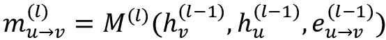

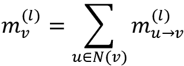

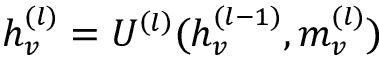

图中的每个节点`u`都有一个隐藏状态（最初是其特征向量），由`h[u]`表示。对于每对节点`u`和`v`，它们是邻居节点，即由边`e`[u->v]连接，我们应用一个称为*消息函数*的函数`M`。消息函数`M`会应用于图中的每个节点。然后，我们将`M`的输出与所有邻居节点的输出聚合，产生消息`m`。这里的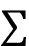被称为*reduce 函数*。注意，尽管我们用求和符号表示 reduce 函数，但它可以是任何聚合函数。最后，我们使用获得的消息和节点的前一个状态更新节点`v`的隐藏状态。此步骤中应用的函数`U`被称为*更新函数*。

消息传递算法会重复特定次数。之后，我们进入*读取阶段*，在该阶段我们从每个节点提取特征向量，表示整个图。例如，在节点分类的情况下，节点的最终特征向量可能代表节点的类别。

本节将使用 MPNN 框架实现一个 GraphSAGE 层。尽管 DGL 已经提供了实现这一功能的`dgl.nn.SAGEConv`，但本示例旨在展示如何使用 MPNN 创建自定义图层。GraphSAGE 层的消息传递步骤如下：

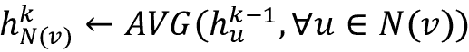

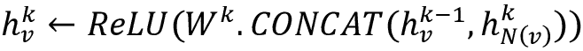

使用 MPNN 实现我们自定义 GraphSAGE 层的代码如下所示。DGL 函数`update_all`的调用允许你指定`message_fn`和`reduce_fn`，这也是 DGL 内置的函数，而`tf.concat`和`Dense`层则表示最终的更新函数：

```py
import dgl
import dgl.data
import dgl.function as fn
import tensorflow as tf
class CustomGraphSAGE(tf.keras.layers.Layer):
  def __init__(self, in_feat, out_feat):
    super(CustomGraphSAGE, self).__init__()
    # A linear submodule for projecting the input and neighbor 
    # feature to the output.
    self.linear = tf.keras.layers.Dense(out_feat, activation=tf.nn.relu)
  def call(self, g, h):
    with g.local_scope():
        g.ndata["h"] = h
        # update_all is a message passing API.
        g.update_all(message_func=fn.copy_u('h', 'm'),
                     reduce_func=fn.mean('m', 'h_N'))
        h_N = g.ndata['h_N']
        h_total = tf.concat([h, h_N], axis=1)
        return self.linear(h_total) 
```

在这里，我们看到`update_all`函数指定了一个`message_func`，该函数只是将节点当前的特征向量复制到消息向量`m`，然后对每个节点的邻域内所有消息向量进行平均。如你所见，这忠实地遵循了上述第一个 GraphSAGE 方程。DGL 提供了许多类似的内置函数（[`docs.dgl.ai/api/python/dgl.function.xhtml`](https://docs.dgl.ai/api/python/dgl.function.xhtml)）。

一旦在第一步中计算出了邻域向量*h_N*，它将与输入特征向量`h`拼接在一起，然后通过带有 ReLU 激活的`Dense`层，如上面第二个 GraphSAGE 方程所述。我们已经通过`CustomGraphSAGE`对象实现了 GraphSAGE 层。

下一步是将其放入 GNN 中以查看它的效果。以下代码展示了一个使用我们自定义`SAGEConv`实现的两层`CustomGNN`模型：

```py
class CustomGNN(tf.keras.Model):
  def __init__(self, g, in_feats, h_feats, num_classes):
    super(CustomGNN, self).__init__()
    self.g = g
    self.conv1 = CustomGraphSAGE(in_feats, h_feats)
    self.relu1 = tf.keras.layers.Activation(tf.nn.relu)
    self.conv2 = CustomGraphSAGE(h_feats, num_classes)
  def call(self, in_feat):
    h = self.conv1(self.g, in_feat)
    h = self.relu1(h)
    h = self.conv2(self.g, h)
    return h 
```

我们将运行该模型对 CORA 数据集进行节点分类，具体细节应该从之前的示例中有所了解。

上述代码假设是一个无权图，即节点之间的边具有相同的权重。这一条件适用于 CORA 数据集，其中每条边代表一篇论文对另一篇论文的引用。

然而，我们可以设想一些场景，其中边的权重可能基于某条边被触发的次数。例如，连接产品和用户的边可以用于用户推荐。

我们需要对代码进行的唯一修改是让权重在我们的消息函数中发挥作用。也就是说，如果节点`u`和邻居节点`v`之间的边发生了`k`次，我们应该将这条边考虑`k`次。以下代码展示了我们自定义的 GraphSAGE 层，它能够处理带权边：

```py
class CustomWeightedGraphSAGE(tf.keras.layers.Layer):
  def __init__(self, in_feat, out_feat):
    super(CustomWeightedGraphSAGE, self).__init__()
    # A linear submodule for projecting the input and neighbor 
    # feature to the output.
    self.linear = tf.keras.layers.Dense(out_feat, activation=tf.nn.relu)
  def call(self, g, h, w):
    with g.local_scope():
      g.ndata['h'] = h
      g.edata['w'] = w
      g.update_all(message_func=fn.u_mul_e('h', 'w', 'm'),
                   reduce_func=fn.mean('m', 'h_N'))
      h_N = g.ndata['h_N']
      h_total = tf.concat([h, h_N], axis=1)
      return self.linear(h_total) 
```

这段代码期望一个额外的边属性`w`，它包含边的权重。你可以通过以下方式在 CORA 数据集中模拟：

```py
g.edata["w"] = tf.cast(
   tf.random.uniform((g.num_edges(), 1), minval=3, maxval=10, 
                     dtype=tf.int32),
   dtype=tf.float32) 
```

`CustomWeightedGraphSAGE`中的`message_func`已经从简单地将特征向量`h`复制到消息向量`m`，变成了将`h`与`w`相乘以生成消息向量`m`。其他部分与`CustomGraphSAGE`中的代码相同。新的`CustomWeightedGraphSAGE`层现在可以简单地放入调用类`CustomGNN`中，替代最初调用的`CustomGraphSAGE`。

## 自定义图数据集

更常见的使用案例是使用你自己的数据来训练 GNN 模型。显然，在这种情况下，你不能使用 DGL 提供的数据集（正如我们在之前的所有示例中所使用的），你必须将自己的数据包装成自定义图数据集。

你的自定义图数据集应继承自 DGL 提供的`dgl.data.DGLDataset`对象，并实现以下方法：

+   `__getitem__(self, i)` – 从数据集中检索第`i`个示例。检索到的示例包含一个单一的 DGL 图及其标签（如果适用）。

+   `__len__(self)` – 数据集中的示例数量。

+   `process(self)` – 定义如何从磁盘加载和处理原始数据。

如我们之前所见，节点分类和链路预测操作在单一图上，而图分类则作用于一组图。虽然这两种情况的处理方法大致相同，但每种情况都有其特定的关注点，因此我们将在下文提供一个例子来分别演示这两种方法。

### 数据集中的单一图

在我们的例子中，我们将选择 Zachary 的空手道俱乐部图，它代表了一个空手道俱乐部的成员，观察了三年。随着时间的推移，管理员（Officer）和教练（Mr. Hi）之间发生了分歧，俱乐部成员在两人之间分裂并重新组合，分别在下图中以蓝色和红色节点表示。Zachary 空手道俱乐部网络可从 NetworkX 库中下载：

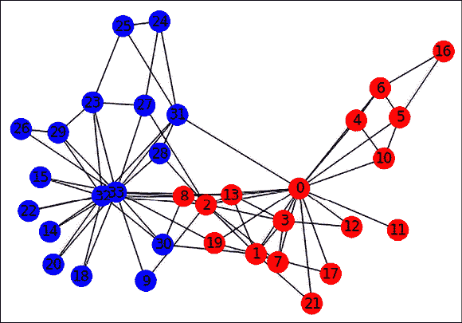

图 17.2：空手道俱乐部网络的图表示

该图包含 34 个节点，每个节点被标记为“Officer”或“Mr. Hi”，取决于它们在拆分后的分组。图中包含 78 条无向、无权重的边。两名成员之间的边表示他们在俱乐部外相互互动。为了使这个数据集在 GNN 使用中更具现实性，我们将为每个节点附加一个 10 维的随机特征向量，并将边权作为边特征。以下是将空手道俱乐部图转换为 DGL 数据集的代码，您可以将其用于后续的节点或边分类任务：

```py
class KarateClubDataset(DGLDataset):
  def __init__(self):
    super().__init__(name="karate_club")
  def __getitem__(self, i):
    return self.graph
  def __len__(self):
    return 1
  def process(self):
    G = nx.karate_club_graph()
    nodes = [node for node in G.nodes]
    edges = [edge for edge in G.edges]
    node_features = tf.random.uniform(
        (len(nodes), 10), minval=0, maxval=1, dtype=tf.dtypes.float32)
    label2int = {"Mr. Hi": 0, "Officer": 1}
    node_labels = tf.convert_to_tensor(
        [label2int[G.nodes[node]["club"]] for node in nodes])
    edge_features = tf.random.uniform(
        (len(edges), 1), minval=3, maxval=10, dtype=tf.dtypes.int32)
    edges_src = tf.convert_to_tensor([u for u, v in edges])
    edges_dst = tf.convert_to_tensor([v for u, v in edges])
    self.graph = dgl.graph((edges_src, edges_dst), num_nodes=len(nodes))
    self.graph.ndata["feat"] = node_features
    self.graph.ndata["label"] = node_labels
    self.graph.edata["weight"] = edge_features
    # assign masks indicating the split (training, validation, test)
    n_nodes = len(nodes)
    n_train = int(n_nodes * 0.6)
    n_val = int(n_nodes * 0.2)
    train_mask = tf.convert_to_tensor(
      np.hstack([np.ones(n_train), np.zeros(n_nodes - n_train)]),
      dtype=tf.bool)
    val_mask = tf.convert_to_tensor(
      np.hstack([np.zeros(n_train), np.ones(n_val), 
                 np.zeros(n_nodes - n_train - n_val)]),
      dtype=tf.bool)
    test_mask = tf.convert_to_tensor(
      np.hstack([np.zeros(n_train + n_val), 
                 np.ones(n_nodes - n_train - n_val)]),
      dtype=tf.bool)
    self.graph.ndata["train_mask"] = train_mask
    self.graph.ndata["val_mask"] = val_mask
    self.graph.ndata["test_mask"] = test_mask 
```

大部分逻辑在`process`方法中。我们调用 NetworkX 方法将空手道俱乐部图作为 NetworkX 图获取，然后将其转换为带有节点特征和标签的 DGL 图对象。尽管空手道俱乐部图没有定义节点和边特征，我们制造了一些随机数并将其设置为这些属性。请注意，这仅用于本示例，目的是展示如果您的图包含节点和边特征，这些特征需要更新的位置。需要注意的是，数据集中只包含一个图。

此外，我们还希望将图拆分为训练、验证和测试集，以用于节点分类任务。为此，我们为每个节点分配掩码，指示其是否属于这些拆分中的某一组。我们通过将图中的节点按 60/20/20 比例拆分，并为每个拆分分配布尔掩码来简单地完成这一操作。

为了从我们的代码中实例化这个数据集，我们可以这样写：

```py
dataset = KarateClubDataset()
g = dataset[0]
print(g) 
```

这将给我们以下输出（略作重新格式化以提高可读性）。主要的两个结构是`ndata_schemas`和`edata_schemas`，分别可以通过`g.ndata`和`g.edata`访问。在`ndata_schemas`中，我们有指向节点特征（`feats`）、节点标签（`label`）以及表示训练、验证和测试拆分的掩码（`train_mask`、`val_mask`和`test_mask`）的键。在`edata_schemas`下，有表示边权的`weight`属性：

```py
Graph(num_nodes=34, 
      num_edges=78,
      ndata_schemes={
        'feat': Scheme(shape=(10,), dtype=tf.float32),
        'label': Scheme(shape=(), dtype=tf.int32),
        'train_mask': Scheme(shape=(), dtype=tf.bool),
        'val_mask': Scheme(shape=(), dtype=tf.bool),
        'test_mask': Scheme(shape=(), dtype=tf.bool)
      }
      edata_schemes={
         'weight': Scheme(shape=(1,), dtype=tf.int32)
      }
) 
```

请参考节点分类和链路预测的示例，以了解如何使用这种自定义数据集。

### 数据集中多个图的集合

支持图分类任务的数据集将包含多个图及其关联标签，每个图对应一个标签。对于我们的示例，我们将考虑一个假设的数据集，包含作为图表示的分子，任务是预测分子是否有毒（一个二元预测）。

我们将使用 NetworkX 方法 `random_regular_graph()` 来生成具有随机节点数和节点度数的合成图。对于每个图的每个节点，我们将附加一个随机的 10 维特征向量。每个节点将有一个标签（0 或 1），表示图是否有毒。请注意，这仅仅是对真实数据可能样貌的模拟。对于真实数据，每个图的结构以及节点向量的值（在我们的案例中是随机的）将对目标变量产生实际影响，即分子是否有毒。

下图展示了一些合成“分子”可能的样子：

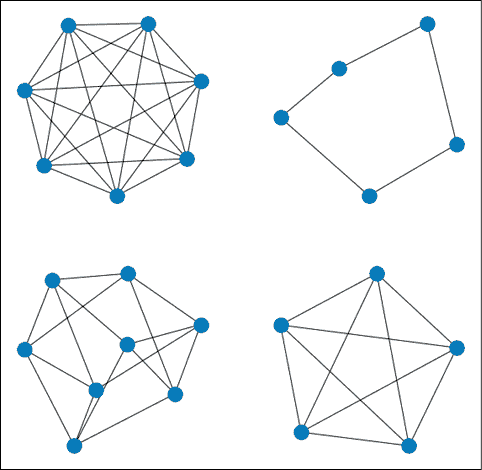

图 17.3：一些使用 NetworkX 生成的随机规则图的例子

这是将一组随机 NetworkX 图转换为 DGL 图数据集以进行图分类的代码。我们将生成 100 个这样的图，并将它们以 DGL 数据集的形式存储在一个列表中：

```py
from networkx.exception import NetworkXError
class SyntheticDataset(DGLDataset):
  def __init__(self):
    super().__init__(name="synthetic")
  def __getitem__(self, i):
    return self.graphs[i], self.labels[i]
  def __len__(self):
    return len(self.graphs)
  def process(self):
    self.graphs, self.labels = [], []
    num_graphs = 0
    while(True):
      d = np.random.randint(3, 10)
      n = np.random.randint(5, 10)
      if ((n * d) % 2) != 0:
        continue
      if n < d:
        continue
      try:
        g = nx.random_regular_graph(d, n)
      except NetworkXError:
        continue
      g_edges = [edge for edge in g.edges]
      g_src = [u for u, v in g_edges]
      g_dst = [v for u, v in g_edges]
      g_num_nodes = len(g.nodes)
      label = np.random.randint(0, 2)
      # create graph and add to list of graphs and labels
      dgl_graph = dgl.graph((g_src, g_dst), num_nodes=g_num_nodes)
      dgl_graph.ndata["feats"] = tf.random.uniform(
          (g_num_nodes, 10), minval=0, maxval=1, dtype=tf.dtypes.float32)
      self.graphs.append(dgl_graph)
      self.labels.append(label)
      num_graphs += 1
      if num_graphs > 100:
        break
    self.labels = tf.convert_to_tensor(self.labels, dtype=tf.dtypes.int64) 
```

一旦创建完成，我们可以像这样在代码中调用它：

```py
dataset = SyntheticDataset()
graph, label = dataset[0]   
print(graph)
print("label:", label) 
```

这为 DGL 数据集中的第一个图生成以下输出（稍作格式调整以便阅读）。如你所见，数据集中的第一个图有 `6` 个节点和 `15` 条边，并且包含一个大小为 `10` 的特征向量（通过 `feats` 键访问）。标签是一个 `0` 维张量（即标量），类型为 long（`int64`）：

```py
Graph(num_nodes=6, num_edges=15,
      ndata_schemes={
        'feats': Scheme(shape=(10,), dtype=tf.float32)}
      edata_schemes={})
label: tf.Tensor(0, shape=(), dtype=int64) 
```

如前所述，为了看到如何使用这个自定义数据集进行任务（如图分类），请参考本章早些时候关于图分类的示例。

# 未来方向

图神经网络是一个迅速发展的学科。到目前为止，我们已经介绍了如何在各种流行的图任务中处理静态同构图，这涵盖了许多现实世界的使用案例。然而，很可能一些图既不是同构的，也不是静态的，而且它们也不能轻易地简化成这种形式。在这一部分，我们将探讨如何处理异构和时序图。

## 异构图

异构图 [7]，也叫做异构图，区别于我们迄今所见的图，它们可能包含不同种类的节点和边。这些不同类型的节点和边可能还包含不同类型的属性，包括具有不同维度的表示。异构图的流行例子包括包含作者和论文的引用图、包含用户和产品的推荐图，以及可以包含多种不同类型实体的知识图谱。

你可以通过手动为每种边类型分别实现消息和更新函数，使用 MPNN 框架处理异构图。每种边类型由三元组（源节点类型、边类型和目标节点类型）定义。然而，DGL 提供了使用 `dgl.heterograph()` API 支持异构图，其中图是作为一系列图来指定的，每个边类型对应一个图。

与异构图相关的典型学习任务与同构图的任务相似，即节点分类与回归、图分类和边分类/链接预测。用于处理异构图的一个流行图层是**关系 GCN**或**R-GCN**，它作为 DGL 中的内置图层提供。

## 时序图

时序图[8]是 Twitter 开发的一个框架，用于处理随时间变化的动态图。虽然 GNN 模型主要关注不随时间变化的静态图，但加入时间维度使我们能够对社交网络、金融交易和推荐系统等许多本质上是动态的现象进行建模。在这些系统中，正是动态行为传递了重要的洞察。

动态图可以表示为一系列定时事件，例如节点和边的添加与删除。这些事件流输入到编码器网络中，编码器为图中的每个节点学习一个依赖于时间的编码。解码器基于该编码进行训练，以支持某些特定任务，如未来时刻的链接预测。目前，DGL 库对时序图尚不支持，主要是因为这是一个快速发展的研究领域。

从高层次来看，**时序图网络**（**TGN**）编码器通过基于节点的交互和时间更新创建节点的压缩表示。每个节点的当前状态存储在 TGN 内存中，作为 RNN 的隐藏状态`s[t]`；然而，对于每个节点`i`和时间点`t`，我们有一个单独的状态向量`s[t]`*(t)*。

类似于我们在 MPNN 框架中看到的消息函数，计算两节点`i`和`j`的两个消息`mᵢ`和`m[j]`，输入为状态向量及其交互。然后，使用记忆更新器将消息和状态向量组合在一起，通常该记忆更新器实现为 RNN。研究发现，TGNs 在未来边预测和动态节点分类任务中，无论在准确度还是速度上，都优于静态图方法。

# 概述

在本章中，我们介绍了图神经网络，这是一组令人兴奋的技术，可以从节点特征以及节点之间的交互中学习。我们讲解了图卷积为何有效的直觉，以及它们与计算机视觉中卷积的相似之处。我们描述了一些常见的图卷积，这些卷积作为层由 DGL 提供。我们展示了如何使用 DGL 处理常见的图任务，如节点分类、图分类和链接预测。此外，如果标准的 DGL 图层不能满足我们的需求，我们已经学习了如何利用 DGL 的消息传递框架实现自己的图卷积层。我们还介绍了如何构建适用于我们自己图数据的 DGL 数据集。最后，我们探讨了一些图神经网络的前沿方向，即异构图和时序图。这些内容应当能够为你提供使用 GNNs 解决该领域有趣问题的技能。

在下一章中，我们将关注学习与深度学习项目相关的一些最佳机器学习实践。

# 参考文献

1.  Kipf, T. 和 Welling, M. (2017). *使用图卷积网络进行半监督分类*。Arxiv 预印本，arXiv: 1609.02907 [cs.LG]。来自 [`arxiv.org/abs/1609.02907`](https://arxiv.org/abs/1609.02907)

1.  Velickovic, P., 等人 (2018). *图注意力网络*。Arxiv 预印本，arXiv 1710.10903 [stat.ML]。来自 [`arxiv.org/abs/1710.10903`](https://arxiv.org/abs/1710.10903)

1.  Hamilton, W. L., Ying, R., 和 Leskovec, J. (2017). *大规模图上的归纳表示学习*。Arxiv 预印本，arXiv: 1706.02216 [cs.SI]。来自 [`arxiv.org/abs/1706.02216`](https://arxiv.org/abs/1706.02216)

1.  Xu, K., 等人 (2018). *图神经网络有多强大？*。Arxiv 预印本，arXiv: 1810.00826 [cs.LG]。来自 [`arxiv.org/abs/1810.00826`](https://arxiv.org/abs/1810.00826)

1.  Gilmer, J., 等人 (2017). *量子化学中的神经信息传递*。Arxiv 预印本，arXiv: 1704.01212 [cs.LG]。来自 [`arxiv.org/abs/1704.01212`](https://arxiv.org/abs/1704.01212)

1.  Zachary, W. W. (1977). *小组冲突与分裂中的信息流模型*。人类学研究杂志。来自 [`www.journals.uchicago.edu/doi/abs/10.1086/jar.33.4.3629752`](https://www.journals.uchicago.edu/doi/abs/10.1086/jar.33.4.3629752)

1.  Pengfei, W. (2020). *在 DGL 中处理异构图*。博客文章。来自 [`www.jianshu.com/p/767950b560c4`](https://www.jianshu.com/p/767950b560c4)

1.  Bronstein, M. (2020). *时序图网络*。博客文章。来自 [`towardsdatascience.com/temporal-graph-networks-ab8f327f2efe`](https://towardsdatascience.com/temporal-graph-networks-ab8f327f2efe)

# 加入我们的书籍 Discord 社区

加入我们的 Discord 社区，与志同道合的人相遇，并与超过 2000 名成员一起学习，网址：[`packt.link/keras`](https://packt.link/keras)


