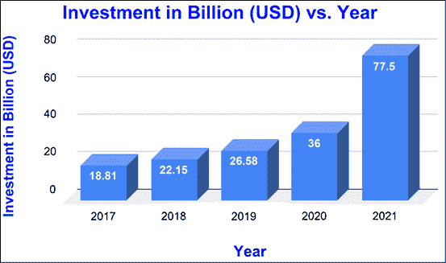
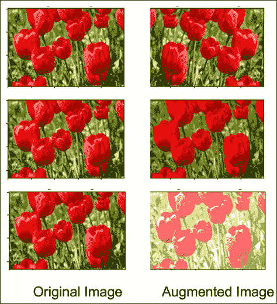
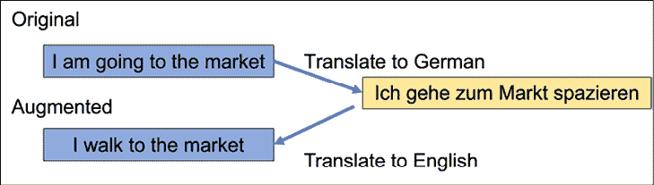
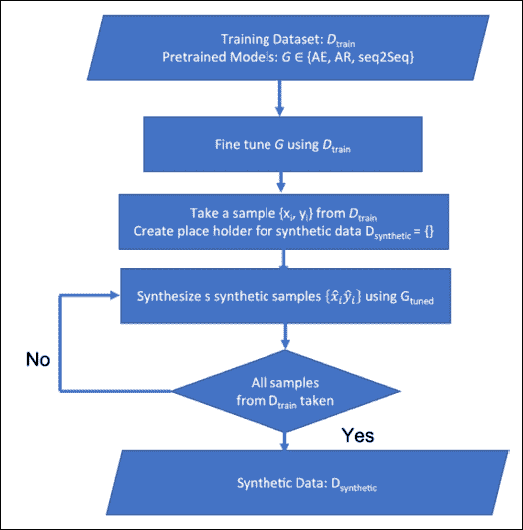

# 第十八章：机器学习最佳实践

机器学习不仅仅是构建和训练模型。到目前为止，在本书中，我们集中介绍了不同的深度学习算法，并介绍了最新的算法、它们的强大功能以及它们的局限性。在本章中，我们将焦点从机器学习/深度学习算法转向那些可以帮助我们成为更好的机器学习工程师和科学家的实践。

本章将包括：

+   对 AI/ML 最佳实践的需求

+   数据最佳实践

+   模型最佳实践

# 对最佳实践的需求

今天，深度学习算法不仅是一个活跃的研究领域，还成为许多商业系统和产品的重要组成部分。*图 18.1*展示了过去五年人工智能初创企业的投资情况。你可以看到对 AI 初创企业的兴趣持续增长。从医疗保健到虚拟助手，从清洁机器人到自动驾驶汽车，今天的人工智能是许多近期重要技术进步的推动力。AI 正在决定一个人是否应该被雇用，或者是否应该获得贷款。AI 正在创建你在社交媒体上看到的动态。有**自然语言处理**（**NLP**）机器人生成内容、图像、面孔——任何你能想到的东西——有人在努力将 AI 应用其中。由于大多数团队由多个成员组成，跨领域合作，因此建立最佳实践至关重要。什么是最佳实践呢？嗯，这个问题没有定论，因为机器学习的最佳实践取决于具体的问题领域和数据集。

然而，在本章中，我们将提供一些机器学习最佳实践的通用建议：



图 18.1：过去五年（2017–2022 年）AI 初创企业的投资情况

以下是一些机器学习中实施最佳实践的重要原因：

+   它可以确保模型的构建既有效又高效。

+   它有助于避免过拟合等问题，避免在未见过的数据上表现不佳。

+   它可以确保模型是可解释的，并且可以轻松地向非技术受众解释。

+   它有助于促进机器学习研究中的可重复性。

在接下来的部分中，您将了解一些**FAANG**（**Facebook**，**Amazon**，**Apple**，**Netflix**，和**Google**）公司以及 AI 影响者提倡的最佳实践。遵循这些建议可以帮助你避免常见错误，避免得出不准确或糟糕的结果。这些最佳实践将帮助确保你的 AI 服务是准确和可靠的。最后，最佳实践还可以帮助你优化 AI 服务的性能和效率。

# 数据最佳实践

数据在当今世界变得越来越重要。不仅是人工智能领域的人，许多世界领导者也将数据称为“新黄金”或“新石油”——基本上是将推动全球经济的商品。数据在决策过程中、交通管理、供应链问题处理、支持医疗等方面都起着重要作用。通过数据获得的洞察能够帮助企业提升效率和表现。

最重要的是，数据可以用来创造新的知识。例如，在商业领域，数据可以用来识别新的趋势。在医学领域，数据可以用来揭示疾病之间的新关系并开发新的治疗方法。然而，我们的模型只有在所训练数据的基础上才能发挥作用。因此，数据的重要性在未来可能会继续增加。随着数据变得更加易于访问和使用，它将在多个领域变得越来越重要。现在，让我们来看一些常见的瓶颈以及应对这些瓶颈的最佳方法。

## 特征选择

当我们开始解决任何 AI/ML 问题时，第一步是提出假设：哪些输入特征可以帮助我们分类或预测输出？选择正确的特征对任何机器学习模型至关重要，但有时很难知道选择哪些特征。如果你在模型中加入过多无关的特征，结果将不准确。如果加入的特征太少，模型可能无法从数据中学习。因此，特征选择是机器学习中的一个关键步骤，它帮助你减少噪声并提高模型的准确性：

+   一般来说，在使用任何特征工程之前，应该从直接观察和报告的特征开始，而不是从学习到的特征开始。学习到的特征是通过外部系统（如聚类算法）或通过深度模型本身生成的特征。简化可以帮助你实现一个稳固的基准性能，之后你可以尝试更多复杂的策略。

+   删除你未使用的特征。未使用的特征会增加技术债务，它们使代码更难阅读和维护，还可能导致意外的错误和安全漏洞。当然，跟踪哪些特征被使用、哪些没有被使用可能会很困难。然而，不要随意删除特征；要仔细进行数据分析和探索 – 理解这些特征。一个好的方法是为每个特征指定一个负责人。特征负责人将负责维护该特征并记录其理由，以便知识能够在团队之间共享。这也意味着，每当特征负责人离开团队时，责任将转交给其他成员。通过花时间理解并移除未使用的特征，你可以保持代码清晰，避免积累技术债务。

+   我们常常认为更多的特征意味着更好的模型，但事实远非如此。与其使用你不理解的数百万个特征，不如使用具体的特征；你可以通过正则化方法去除那些仅适用于少数样本的特征。

+   你还可以结合和修改特征来创建新的特征。你可以通过多种方式进行结合和修改。例如，你可以将连续值特征离散化为多个离散特征。你还可以通过交叉（乘法）两个或多个现有特征来创建新的合成特征。例如，如果你有“身高”和“体重”这两个特征，你可以通过将这两个特征结合起来，创建一个新的特征“BMI”。特征交叉能够提供比单个特征更强的预测能力。当两个特征各自对期望的结果具有一定的预测性时，结合后可能会显著提高预测性。这是因为合并后的特征捕捉到了单个特征无法捕捉的信息。特征交叉是一个强大的工具，有助于提高预测模型的准确性。

## 特征和数据

当我们从学习数据科学转向解决实际问题时，一个问题是缺乏数据。尽管互联网、移动设备和物联网设备生成了大量的数据，但获取高质量的标注数据仍然是一个大难题。标注的成本通常既高又费时，而且需要专业知识。

因此，我们需要确保有足够的数据来训练模型。根据经验法则，一个模型可以学习的输入特征数量（`n`）大致与你拥有的数据量（`N`）成正比（`n` << `N`）。在这种情况下，以下是一些可以遵循的建议：

+   将模型学习的规模与数据量相匹配。例如，如果我们只有 1,000 个标注样本，那么就使用高度人工设计的特征。对于 1,000 个标注样本，一个好的选择是使用一打精心挑选的特征。但如果我们有数百万个样本，那么我们就可以使用大约十万个特征。如果我们有数十亿的数据样本，那么我们可以建立一个包含数百万个特征的模型。

+   如果我们有过多的数据，我们不会随便丢弃它；相反，我们可以使用**重要性加权抽样**([`web.stanford.edu/class/archive/cs/cs224n/cs224n.1214/reports/final_reports/report247.pdf`](https://web.stanford.edu/class/archive/cs/cs224n/cs224n.1214/reports/final_reports/report247.pdf))。其思想是根据某些分布特征为每个样本分配一个重要性权重，这些特征能够捕捉与专业领域数据的相似性。

+   另一种应对数据不足的方法是使用数据增强。最初由 H. S. Baird 在他的文章《文档图像分析》中提出[7]，它已被证明是通过简单的图像变换（如水平翻转、垂直翻转、旋转、平移等）增加图像数据的好方法。大多数深度学习框架都提供了数据生成器，可以在运行时使用这些生成器进行数据增强，如 *图 18.2* 所示：



图 18.2：原始图像与增强图像

虽然增强图像数据在所有主要的深度学习框架中都有现成的工具，但增强文本数据和音频数据并不那么简单。接下来，我们将介绍一些可以用来增强文本和语音数据的技术。

### 增强文本数据

我们可以用来增强文本数据的一些简单方法包括：

+   **同义词替换**：在这种方法中，随机选择句子中的词语，并使用 WordNet 将它们替换为同义词。例如，如果我们有句子“这本书**专注**于使用 TensorFlow 和 Keras 的深度学习，适合**新手**和专家”，我们可以选择两个加粗的词进行同义词替换，得到以下句子：“这本书**聚焦**于使用 TensorFlow 和 Keras 的深度学习，适合**初学者**和专家。”

+   **反向翻译**：该方法由 Sennrich 等人在 2016 年提出。其基本思想是将一句话翻译成另一种语言，然后再翻译回原语言。我们可以使用语言翻译 API 或 Python 模块，如 `googletrans`。以下代码片段将一句话从英语翻译成德语并再翻译回英语。为了使代码能够工作，我们需要安装 `googletrans`：

```py
from googletrans import Translator
translator = Translator()
text = 'I am going to the market for a walk'
translated = translator.translate(text, src='en', dest='de')
synthetic_text = translator.translate(translated.text, src='de', dest='en')
print(f'text: {text}\nTranslated: {translated.text}\nSynthetic Text: {synthetic_text.text}') 
```

现在我们有两个句子：“I am going to the market”和“I walk to the market”，它们属于同一类别。*图 18.3* 详细说明了使用反向翻译进行数据增强的过程：



图 18.3：使用反向翻译的数据增强

在综述论文《NLP 数据增强方法综述》中，作者列出了许多其他增强方法。这篇论文对 NLP 数据增强进行了深入分析。

近年来，随着大规模语言模型和变换器的成功，研究人员尝试将它们应用于数据增强任务。在亚马逊 Alexa AI 团队的论文《使用预训练变换器进行数据增强》中，作者展示了如何仅使用每个类别 10 个训练样本，通过预训练变换器生成合成数据。

他们实验了三种不同的预训练模型：自动编码器 LM BERT、自动回归 LM GPT2，以及预训练的`seq2seq`模型 BART。*图 18.4*展示了他们使用预训练模型生成合成数据的算法：



图 18.4：使用预训练变换器生成合成文本数据的算法

语音数据也可以通过以下技术进行增强：

+   **时间扭曲**：这里随机选择一个点，并将数据向左或向右扭曲，距离为`w`。距离`w`不是固定的，而是从均匀分布[0, `W`]中选择的。

+   **频率掩码**：在这里，一范围频率通道[f[0], f[0]+f)]会被掩码；频率`f₀`和`f`的选择取决于频率通道的数量和频率掩码参数`F`。

+   **时间掩码**：在这种情况下，连续的时间步长会被掩码。

这些技术由谷歌团队在 2019 年提出，发表于他们的论文《SpecAugment：一种用于自动语音识别的简单数据增强方法》中。

# 模型最佳实践

模型的准确性和性能对任何机器学习和深度学习项目的成功至关重要。如果一个模型的准确性不足，相关的业务用例将无法成功。因此，关注模型的准确性和性能以提高成功的机会是非常重要的。影响模型准确性和性能的因素很多，因此理解所有这些因素对于优化准确性和性能至关重要。以下列出了一些模型最佳实践，可以帮助我们充分利用模型开发流程。

## 基准模型

基准模型是机器学习中用于评估其他模型的工具。它通常是最简单的模型，作为更复杂模型的比较基准。目标是查看更复杂的模型是否真的比基准模型提供了任何改进。如果没有，那么使用更复杂的模型就没有意义。基准模型还可以帮助检测数据泄露。数据泄露是指测试集中的信息渗透到训练集中，导致过拟合。通过将基准模型的表现与其他模型进行比较，可以检测到何时发生了数据泄露。基准模型是机器学习的重要组成部分，为更复杂模型的性能提供了有价值的视角。因此，每当我们开始处理一个新问题时，最好思考能够拟合数据并获得基准的最简单模型。

一旦我们构建了一个令人满意的基准模型，我们需要仔细审查它。

回顾关于数据集的初步假设和初步算法选择。例如，也许当我们第一次开始处理数据时，我们假设观察到的模式最适合用**高斯混合模型**（**GMM**）来解释。然而，在进一步探索后，我们可能会发现 GMM 并不能准确捕捉数据的潜在结构。在这种情况下，我们需要重新考虑我们的策略。最终，算法的选择由数据本身的性质决定。

确认模型是过拟合还是欠拟合。如果模型过拟合，可以尝试增加数据、减少模型复杂度、增加批处理大小，或者引入正则化方法，如**岭回归**、**套索回归**或**dropout**。如果模型欠拟合，可以尝试增加模型复杂度、添加更多特征，并训练更多的周期。

根据模型的性能指标分析模型。例如，如果我们构建了一个分类模型，就可以根据业务用例分析其混淆矩阵以及精度/召回率。识别出哪个类别模型预测不准确；这将帮助我们深入了解这些类别的数据。

执行超参数调优，以获得一个强有力的基准模型。建立一个强基准模型非常重要，因为它为未来的模型改进提供了基准。基准应包括所有业务和技术需求，并测试数据工程和模型部署管道。花时间开发一个强有力的基准模型，可以确保我们的机器学习项目从一开始就走在正确的轨道上。此外，一个好的基准模型可以帮助我们在模型迭代过程中识别潜在的改进领域。因此，投入时间和精力创建一个强大的基准模型是非常值得的。

## 预训练模型、模型 API 和 AutoML

当我们想要推出商业产品时，时间和精力往往是最重要的两个因素之一。在进行新项目时，从零开始训练一个基准模型可能非常耗时。然而，现在有很多资源可以找到预训练模型，帮助我们节省大量时间和精力。这些资源包括 GitHub、Kaggle，以及来自 Amazon、Google、OpenAI 和 Microsoft 等公司的各种基于云的 API。

此外，还有一些专业的初创公司，如 Scale AI 和 Hugging Face，提供适用于各种任务的预训练模型。通过利用这些资源，我们可以快速启动机器学习项目，而无需花费大量时间从头开始训练模型。因此，如果我们的问题是标准的分类或回归问题，或者我们拥有结构化的表格数据，我们可以使用预训练模型或由 Amazon、Google 和 Microsoft 等公司提供的 API。采用这些方法可以节省宝贵的时间和精力，并帮助我们快速开始项目。

另一个正在发展的解决方案是使用**AutoML**，即**自动机器学习**。通过使用 AutoML，我们可以创建更符合公司特定需求的定制模型。如果您的组织知识和资源有限，我们仍然可以通过利用 AutoML 在大规模上发挥机器学习的优势。这个解决方案已经帮助大小公司更高效、准确地实现其业务目标。未来，随着人们对其能力的认知不断提高，AutoML 可能会变得更加普及和受欢迎。

## 模型评估与验证

在本节中，我们讨论了评估模型的方法。这里我们不是在讨论传统的机器学习指标，而是专注于最终用户的体验：

+   **用户体验技巧**：当我们的模型接近生产时，我们应该进一步测试它。众包是一个在发布产品之前从观众那里获得反馈的好方法。我们可以支付给人们，或者使用真实用户进行现场实验，让他们提供关于最有效方案的宝贵意见。我们可以在过程初期创建用户角色，也就是创建假设用户——例如，如果我们是一个年龄介于 19 至 40 岁之间的团队，并且我们构建了一个推荐系统，我们可以为一个 60 多岁的人创建一个用户角色。随后，我们可以通过邀请实际用户并观察他们对我们网站的反应来进行可用性测试。

+   **使用模型差异**：当我们发布一个新模型时，衡量其成功的最佳方法之一就是计算它与生产中模型的差异。例如，如果我们的排序算法产生的结果比预期更好，但并不至于让人注意到或关心，那么我们应该让两个模型在整个系统中通过样本运行，并根据位置排名赋予权重。如果我们发现两个查询之间的差异非常小，那么我们知道变化不大。然而，如果差异较大，我们应该确保这种变化是积极的。在这种情况下，我们应当探索那些对称差异较大的查询；这将帮助您定性地理解变化。

+   **功利性效果比预测性效果更重要**：我们可能有一个精度最高、预测最好的模型，但这还不是最终目的；问题是我们如何利用这个预测。例如，如果我们建立一个模型来对文档进行语义排序，那么最终排序的质量比预测本身更为重要。我们再举一个例子：假设你建立了一个垃圾邮件过滤器，模型预测给定信息是垃圾邮件还是正常邮件的概率；接下来我们会设定一个阻止哪些文本通过的截断值。在这种情况下，最重要的是我们允许哪些信息通过。所以，可能我们得到一个具有更好对数损失的模型，但整体性能却没有改善。在这种情况下，我们应该寻找其他特征来提高性能。

+   **寻找测量误差中的模式**：在训练样本中，检查模型无法正确预测的样本。探索我们尚未考虑的特征；它们能改善对不正确样本的预测吗？不要对特征过于具体；我们可以添加十几个特征，让模型决定如何使用它们。为了可视化分类问题中的错误，我们可以使用混淆矩阵，对于回归任务，我们可以寻找损失较高的情况。

+   **在未见数据上测试**：为了衡量模型的性能，可以在模型训练后收集的数据上进行测试；这样我们可以估算在生产环境中的性能。虽然这样可能会导致性能下降，但下降不应该过于严重。

性能监控是模型开发中至关重要的一部分。训练数据和生产数据之间的性能可能会有很大差异，这意味着我们必须持续监控已部署模型的行为，以确保它们在系统中没有发生任何异常。我们应该建立一个监控管道，持续监控性能、质量和偏差指标、公平性指标、模型解释以及用户交互。

## 模型改进

一旦构建并部署了一个可靠的模型，工作并没有结束。由于数据漂移或概念漂移，模型可能需要进行更改。数据漂移是指数据的分布随时间变化，而概念漂移是指依赖（标记）变量的属性随时间发生变化。为了应对这些变化，模型必须在新数据上重新训练，并相应地进行更新。这个过程可能既耗时又昂贵，但对于维持高性能的机器学习模型至关重要。然而，在我们开始改进模型之前，识别并衡量低性能的原因非常重要——**“先测量，再优化”**：

**数据漂移**：机器学习模型的性能可能会因训练时间和部署时间的不同而有所变化。这是因为在训练和服务过程中使用的数据可能不同。为避免此问题，重要的是在部署时记录特征。这样可以帮助我们监控服务数据（生产数据）的变化。一旦数据漂移（训练数据与服务数据之间的差异）超过阈值，我们应该使用新数据重新训练模型。这将确保模型在与其部署时相同的数据上进行训练，从而提升其性能。

**训练与服务偏差**：训练与服务偏差可能是机器学习模型中的一个主要问题。如果模型的训练方式与实际使用方式之间存在差异，可能会导致性能不佳和不准确。训练与服务偏差的主要原因有三：训练数据和服务数据之间的差异、训练与服务之间数据的变化以及模型与算法之间的反馈循环。例如，如果我们构建了一个推荐系统来推荐电影，我们可以根据用户从推荐列表中看到的电影重新训练推荐系统。前两种原因可以通过精确的数据管理来解决，而第三种原因则需要在设计机器学习模型时特别注意。

即使经过充分的实验，我们也可能发现，在现有特性下，模型的性能已经无法进一步提升。然而，为了保持业务的持续发展，持续增长是必要的。因此，当我们发现模型性能已趋于平稳时，是时候寻找新的改进来源，而不是继续依赖现有特性。

软件开发过程从来不是“完成”的。即使产品已经发布，总会有新的特性可以添加，或者现有特性可以改进。机器学习模型也不例外。即使一个模型已经“完成”并部署到生产环境中，依然会有新的数据可以用于训练更好的模型。随着时间的推移，数据会发生变化，模型也需要在新数据上进行重新训练，以保持准确性。因此，重要的是要把机器学习模型看作是处于不断变化的状态。只有当你停止工作时，它才算“完成”。

在构建模型时，重要的是要考虑添加或删除特征的难易程度。我们能否轻松创建新的管道副本并验证其正确性？是否可以让两个或三个模型副本并行运行？这些都是在构建模型时需要考虑的重要问题。通过提前思考这些问题，我们可以节省大量后续时间和精力。

# 总结

本章我们重点介绍了获取模型最佳性能的策略和规则。这里的列表并非详尽无遗，由于人工智能技术仍在不断发展，未来几年可能会出现更多的规则和启发式方法。不过，如果你遵循本章中的建议，你将能够从人工智能模型的神秘性转向更可靠、稳健和可复现的行为。

在下一章中，我们将探索 TensorFlow 生态系统，并看看如何将本书中涉及的内容整合到实际的商业应用中。

# 参考文献

1.  Soni, N., Sharma, E. K., Singh, N., 和 Kapoor, A. (2020). *人工智能在商业中的应用：从研究和创新到市场部署*。Procedia Computer Science, *167*, 2200–2210。

1.  Feng, S. Y., Gangal, V., Wei, J., Chandar, S., Vosoughi, S., Mitamura, T., 和 Hovy, E. (2021). *自然语言处理中的数据增强方法综述*。arXiv 预印本 arXiv:2105.03075。

1.  Sennrich, R., Haddow, B., 和 Birch, A. (2016). *通过单语数据改进神经机器翻译模型*。在《第 54 届计算语言学年会论文集（第 1 卷：长篇论文）》中，页面 86-96，德国柏林。计算语言学协会。

1.  Kumar, V., Choudhary, A., 和 Cho, E. (2020). *使用预训练的变换器模型进行数据增强*。arXiv 预印本 arXiv:2003.02245。

1.  Park, D. S., Chan, W., Zhang, Y., Chiu, C. C., Zoph, B., Cubuk, E. D., 和 Le, Q. V. (2019). *SpecAugment：一种用于自动语音识别的简单数据增强方法*。arXiv 预印本 arXiv:1904.08779。

1.  机器学习规则：机器学习工程的最佳实践。Martin Zinkewich. [`developers.google.com/machine-learning/guides/rules-of-ml`](https://developers.google.com/machine-learning/guides/rules-of-ml)

1.  Baird, H. S. (1995). *文档图像分析*。章节：文档图像缺陷模型，页码 315–325。IEEE 计算机学会出版社，美国洛杉矶，CA。

# 加入我们的书籍 Discord 社区

加入我们的 Discord 社区，与志同道合的人们交流，并与超过 2000 名成员一起学习： [`packt.link/keras`](https://packt.link/keras)


