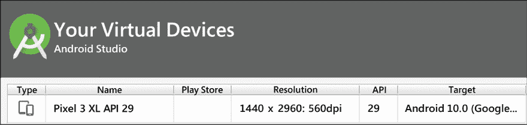

# 第十九章：TensorFlow 2 生态系统

在本章中，我们将学习 TensorFlow 生态系统的不同组件。章节将详细介绍 TensorFlow Hub——一个预训练深度学习模型的仓库——以及 TensorFlow Datasets——一个用于机器学习任务的现成数据集集合。还将介绍 TensorFlow JS，这是一个用于在 Web 上训练和部署机器学习模型的解决方案。我们还将了解 TensorFlow Lite，一个开源深度学习框架，专为移动和边缘设备设计。章节将讨论一些 Android、iOS 和 Raspberry Pi 应用的示例，以及部署预训练模型的示例，如 MobileNet v1、v2、v3（为移动和嵌入式视觉应用设计的图像分类模型）、PoseNet（用于姿势估计的视觉模型，能够估算图像或视频中人的姿势）、DeepLab 分割（一个图像分割模型，将语义标签（例如，狗、猫、汽车）分配给输入图像中的每个像素）以及 MobileNet SSD 目标检测（一个图像分类模型，能够检测多个对象并给出边界框）。本章的最后将介绍联邦学习的示例，这是一种去中心化的机器学习框架，旨在尊重用户隐私。章节内容包括：

+   TensorFlow Hub

+   TensorFlow Datasets

+   TensorFlow Lite 及其在移动和边缘应用中的使用

+   边缘的联邦学习

+   TensorFlow JS

+   使用 Node.js 与 TensorFlow 模型

本章的所有代码文件可以在 [`packt.link/dltfchp19`](https://packt.link/dltfchp19) 找到

让我们从 TensorFlow Hub 开始。

# TensorFlow Hub

即使你拥有一台强大的计算机，训练一个机器学习模型也可能需要几天或几周。而且，一旦你训练好模型，将其部署到不同的设备上可能既困难又费时。根据你要部署的平台，你可能需要不同的格式。

你可以把 TensorFlow Hub 当作一个包含许多预训练模型的库。它包含数百个经过训练、可以直接部署的深度学习模型。TensorFlow Hub 提供了图像分类、图像分割、目标检测、文本嵌入、文本分类、视频分类和生成等预训练模型。TF Hub 中的模型可以以 SavedModel、TFLite 和 TF.js 格式提供。我们可以直接使用这些预训练模型进行推理，或者对它们进行微调。随着用户和开发者社区的不断壮大，TensorFlow Hub 已成为寻找和分享机器学习模型的首选平台。要使用 TensorFlow Hub，我们首先需要安装它：

```py
pip install tensorflow_hub 
```

安装完成后，我们可以通过以下方式简单地导入它：

```py
import tensorflow_hub as hub 
```

并使用 `load` 函数加载模型：

```py
model = hub.load(handle) 
```

这里的 `handle` 是一个字符串，包含我们想要使用的模型链接。如果我们希望将其作为现有模型的一部分使用，可以将其包装为 Keras 层：

```py
hub.KerasLayer(
    handle,
    trainable=False,
    arguments=None,
    _sentinel=None,
    tags=None,
    signature=None,
    signature_outputs_as_dict=None,
    output_key=None,
    output_shape=None,
    load_options=None,
    **kwargs
) 
```

通过将参数 `trainable` 更改为 `True`，我们可以针对我们的特定数据对模型进行微调。

*图 19.1* 显示了 `tfhub.dev` 网站的易用 Web 界面，用于选择不同的模型。通过使用过滤器，我们可以轻松找到解决我们问题的模型。

我们可以选择需要的类型和格式，以及发布者！


图 19.1：显示不同过滤器的 tfhub.dev 网站

## 使用预训练模型进行推理

让我们看看如何利用 TensorFlow Hub 中的预训练模型。我们将考虑一个图像分类的示例：

1.  让我们导入必要的模块：

    ```py
    import tensorflow as tf
    import tensorflow_hub as hub
    import requests
    from PIL import Image
    from io import BytesIO
    import matplotlib.pyplot as plt
    import numpy as np 
    ```

1.  我们定义了一个从 URL 加载图像的函数。该函数从网页上获取图像，并通过添加批次索引进行推理。图像还根据所选的预训练模型进行了归一化和缩放：

    ```py
    def load_image_from_url(img_url, image_size):
      """Get the image from url. The image return has shape [1, height, width, num_channels]."""
      response = requests.get(img_url, headers={'User-agent': 'Colab Sample (https://tensorflow.org)'})
      image = Image.open(BytesIO(response.content))
      image = np.array(image)
      # reshape image
      img_reshaped = tf.reshape(image, [1, image.shape[0], image.shape[1], image.shape[2]]) 
      # Normalize by convert to float between [0,1]
      image = tf.image.convert_image_dtype(img_reshaped, tf.float32) 
      image_padded = tf.image.resize_with_pad(image, image_size, image_size)
      return image_padded, image 
    ```

1.  另一个辅助函数，用于显示图像：

    ```py
    def show_image(image, title=''):
      image_size = image.shape[1]
      w = (image_size * 6) // 320
      plt.figure(figsize=(w, w))
      plt.imshow(image[0], aspect='equal')
      plt.axis('off')
      plt.title(title)
      plt.show() 
    ```

1.  我们使用的模型是 EfficientNet-B2（[`arxiv.org/abs/1905.11946`](https://arxiv.org/abs/1905.11946)），该模型是在 ImageNet 数据集上训练的。它提供更好的准确性，体积更小，并且推理速度更快。为了方便起见，我们选择将图像调整为 330 x 330 像素。我们使用在第 2 步中定义的辅助函数从 Wikimedia 下载图像：

    ```py
    image_size = 330
    print(f"Images will be converted to {image_size}x{image_size}")
    img_url =  "https://upload.wikimedia.org/wikipedia/commons/c/c6/Okonjima_Lioness.jpg"
    image, original_image = load_image_from_url(img_url, image_size) 
    show_image(image, 'Scaled image') 
    ```


图 19.2：从网页上获取的用于分类的图像，缩放为 330 x 330 像素

1.  为了完整性，我们还获取了 ImageNet 数据集的所有标签，以便从模型预测中推断标签；我们从 TensorFlow 的公共存储库下载它：

    ```py
    labels_file = "https://storage.googleapis.com/download.tensorflow.org/data/ImageNetLabels.txt"
    #download labels and creates a maps
    downloaded_file = tf.keras.utils.get_file("labels.txt", origin=labels_file)
    classes = []
    with open(downloaded_file) as f:
      labels = f.readlines()
      classes = [l.strip() for l in labels] 
    ```

1.  现在所有的准备工作都完成了，我们从 `tfhub.dev` 下载模型：

    ```py
    classifier = hub.load("https://tfhub.dev/tensorflow/efficientnet/b2/classification/1") 
    ```

1.  我们获取图像在第 5 步下载后的所有类别的 Softmax 概率：

    ```py
    probabilities = tf.nn.softmax(classifier(image)).numpy() 
    ```

1.  让我们看看顶部的预测结果：

    ```py
    top_5 = tf.argsort(probabilities, axis=-1, direction="DESCENDING")[0][:5].numpy()
    show_image(image, f'{classes[top_5[0]+1]}: {probabilities[0][top_5][0]:.4f}') 
    ```


图 19.3：带有狮子标签预测的图像

如我们所见，通过几行代码，我们就能得到完美的推理结果——图像是一只母狮，而 ImageNet 数据集中最接近它的标签是狮子，模型正确地做出了预测。通过使用 TF Hub 的预训练模型，我们可以将精力集中在产品工作流上，从而获得更好的模型和更快的生产。

# TensorFlow 数据集

**TensorFlow 数据集** (**TFDS**) 是一个功能强大的工具，适用于所有从事机器学习的人。它提供了一系列现成可用的数据集，可以轻松地与 TensorFlow 或任何其他 Python ML 框架一起使用。所有数据集都作为 `tf.data.Datasets` 提供，便于在输入管道中使用。

使用 TFDS，您可以快速开始机器学习项目，节省时间，无需自行收集和准备数据。该库目前包含各种各样的数据集，包括图像分类、目标检测、文本分类等。此外，库还提供了从零开始创建新数据集的工具，这对于需要为自己项目创建自定义数据集的研究人员或开发人员非常有用。TFDS 是开源的，且以 Apache 2.0 许可证发布。要使用 TFDS，您需要安装它：

```py
pip install tensorflow-datasets 
```

安装后，您可以像这样导入它：

```py
import tensorflow_datasets as tfds 
```

在编写本书时，TFDS 包含了 224 个公共数据集，涵盖了广泛的任务：

```py
datasets = tfds.list_builders()
print(f"TFDS contains {len(datasets)} datasets") 
```

```py
### Output
TFDS contains 224 datasets 
```

在本节中，我们将向您介绍 TFDS，并展示它如何通过探索其底层结构来简化您的训练过程，并提供一些加载大量数据到机器学习模型中的最佳实践。

## 加载 TFDS 数据集

TFDS 中的每个数据集都有唯一的名称，并且每个数据集都与发布者和数据集版本相关联。要获取数据，您可以使用 TFDS 的 `load` 函数（这是一个功能强大的函数，具有很大的灵活性；您可以在[`www.tensorflow.org/datasets/api_docs/python/tfds/load`](https://www.tensorflow.org/datasets/api_docs/python/tfds/load)上查看更多关于此函数的内容）：

```py
tfds.load(
    name: str,
    *,
    split: Optional[Tree[splits_lib.SplitArg]] = None,
    data_dir: Optional[str] = None,
    batch_size: tfds.typing.Dim = None,
    shuffle_files: bool = False,
    download: bool = True,
    as_supervised: bool = False,
    decoders: Optional[TreeDict[decode.partial_decode.DecoderArg]] =
None,
    read_config: Optional[tfds.ReadConfig] = None,
    with_info: bool = False,
    builder_kwargs: Optional[Dict[str, Any]] = None,
    download_and_prepare_kwargs: Optional[Dict[str, Any]] = None,
    as_dataset_kwargs: Optional[Dict[str, Any]] = None,
    try_gcs: bool = False
) 
```

您只需要指定数据集名称，其余参数是可选的。您可以从 TFDS 文档中了解更多关于可选参数的内容。例如，下面我们将下载著名的 MNIST 数据集：

```py
data, info = tfds.load(name="mnist", as_supervised=True, split=['train', 'test'], with_info=True) 
```

上述语句将 MNIST 的训练和测试数据集都下载到变量数据中。由于 `as_supervised` 标志被设置为 `True`，标签会与数据一起下载，关于数据集的详细信息则会下载到 `info` 中。

首先让我们检查信息：

```py
print(info) 
```

```py
### output
tfds.core.DatasetInfo(
    name='mnist',
    version=3.0.1,
    description='The MNIST database of handwritten digits.',
    homepage='http://yann.lecun.com/exdb/mnist/',
    features=FeaturesDict({
        'image': Image(shape=(28, 28, 1), dtype=tf.uint8),
        'label': ClassLabel(shape=(), dtype=tf.int64, num_classes=10),
    }),
    total_num_examples=70000,
    splits={
        'test': 10000,
        'train': 60000,
    },
    supervised_keys=('image', 'label'),
    citation="""@article{lecun2010mnist,
      title={MNIST handwritten digit database},
      author={LeCun, Yann and Cortes, Corinna and Burges, CJ},
      journal={ATT Labs [Online]. Available: http://yann.lecun.com/exdb/mnist},
      volume={2},
      year={2010}
    }""",
    redistribution_info=,
) 
```

所以，我们可以看到信息是相当详细的。它告诉我们每个拆分中的样本数、如果用于监督学习时可用的键、引用细节等。这里的变量数据是一个包含两个 TFDS 数据集对象的列表——第一个是对应测试数据集，第二个是对应训练数据集。TFDS 数据集对象默认是 `dict` 类型。让我们从训练数据集中获取一个样本并进行探索：

```py
data_train = data[1].take(1)
for sample, label in data_train:
  print(sample.shape)
  print(label) 
```

```py
### output
(28, 28, 1)
tf.Tensor(2, shape=(), dtype=int64) 
```

您可以看到，样本是一个 28 x 28 x 1 形状的手写数字图像，其标签为 `2`。对于图像数据，TFDS 还提供了一个 `show_examples` 方法，您可以用它来查看数据集中的示例图像：

```py
fig = tfds.show_examples(data[0], info) 
```


图 19.4：MNIST 数据集的测试数据集样本

## 使用 TFDS 构建数据管道

让我们使用 TFDS 数据管道构建一个完整的端到端示例：

1.  和往常一样，我们首先导入必要的模块。由于我们将使用 TensorFlow 构建模型，并且使用 TFDS 获取数据集，因此现在只导入这两个：

    ```py
    import tensorflow as tf
    import tensorflow_datasets as tfds 
    ```

1.  使用 Keras 的顺序 API，我们构建了一个简单的卷积神经网络，包含三个卷积层和两个全连接层：

    ```py
    model = tf.keras.models.Sequential([ 
      tf.keras.layers.Conv2D(16, (3,3), activation='relu', input_shape=(300, 300, 3)), 
      tf.keras.layers.MaxPooling2D(2, 2),
      tf.keras.layers.Conv2D(32, (3,3), activation='relu'), 
      tf.keras.layers.MaxPooling2D(2,2), 
      tf.keras.layers.Conv2D(64, (3,3), activation='relu'), 
      tf.keras.layers.MaxPooling2D(2,2), 
      tf.keras.layers.Flatten(), 
      tf.keras.layers.Dense(256, activation='relu'), 
      tf.keras.layers.Dense(1, activation='sigmoid')
    ]) 
    ```

1.  我们将构建一个二分类器，因此选择二元交叉熵作为损失函数，Adam 作为优化器：

    ```py
    model.compile(optimizer='Adam', loss='binary_crossentropy',metrics=['accuracy']) 
    ```

1.  接下来，我们来处理数据集。我们使用`horses_or_humans`数据集，因此使用`tfds.load`函数获取训练数据和验证数据：

    ```py
    data = tfds.load('horses_or_humans', split='train', as_supervised=True) 
    val_data = tfds.load('horses_or_humans', split='test', as_supervised=True) 
    ```

1.  图像需要进行归一化；此外，为了提高性能，我们将在训练过程中对图像进行增强：

    ```py
    def normalize_img(image, label):
      """Normalizes images: 'uint8' -> 'float32'."""
      return tf.cast(image, tf.float32) / 255., label
    def augment_img(image, label):
      image, label = normalize_img(image, label)
      image = tf.image.random_flip_left_right(image)
      return image, label 
    ```

1.  现在我们开始构建数据管道；首先使用`cache`以提高内存效率，应用预处理步骤（归一化和增强），确保在训练时数据会被打乱，定义批次大小，并使用`prefetch`，以便在当前批次训练时下一个批次也已准备好。我们对验证数据执行相同的步骤，唯一的区别是验证数据不需要进行增强或打乱：

    ```py
    data = data.cache()
    data = data.map(augment_img, num_parallel_calls=tf.data.AUTOTUNE)
    train_data = data.shuffle(1024).batch(32)
    train_data = train_data.prefetch(tf.data.AUTOTUNE)
    val_data = val_data.map(normalize_img, num_parallel_calls=tf.data.AUTOTUNE)
    val_data = val_data.batch(32)
    val_data = val_data.cache()
    val_data = val_data.prefetch(tf.data.AUTOTUNE) 
    ```

1.  最后，我们开始训练模型：

    ```py
    %time history = model.fit(train_data, epochs=10, validation_data=val_data, validation_steps=1) 
    ```

尝试调整数据管道的不同参数，观察其如何影响训练时间。例如，可以尝试去除`prefetch`和`cache`，并且不指定`num_parallel_calls`。

# TensorFlow Lite

TensorFlow Lite 是一个由 TensorFlow 设计的轻量级平台。该平台专为移动设备和嵌入式设备（如 Android、iOS 和树莓派）设计。其主要目标是通过在设备上直接进行机器学习推理来实现高效能，重点关注三个主要特点：（1）小型二进制文件和模型大小以节省内存，（2）低能耗以节省电池，（3）低延迟以提高效率。不言而喻，电池和内存是移动设备和嵌入式设备的两项重要资源。为了实现这些目标，Lite 采用了一些技术，如量化、FlatBuffers、移动解释器和移动转换器，接下来我们将简要回顾这些技术。

## 量化

量化是指一套将由连续值（例如实数）组成的输入约束为离散集合（例如整数）的技术。其核心思想是通过使用整数而非实数来表示内部权重，从而减少**深度学习**（**DL**）模型的空间占用。当然，这意味着在空间节省的同时，模型的性能可能会有所牺牲。然而，许多实际情况已经证明，量化后的模型并不会出现显著的性能下降。TensorFlow Lite 在内部构建了一套核心操作符，支持量化和浮动点操作。

模型量化是一个应用量化的工具包。此操作应用于权重的表示，并可选择性地应用于激活，以便进行存储和计算。有两种量化类型：

+   训练后量化对权重和训练后的激活结果进行量化。

+   量化感知训练允许训练能够以最小精度损失进行量化的网络（仅适用于特定的 CNN）。由于这是一种相对实验性的技术，我们在本章中不讨论，但有兴趣的读者可以在[1]中找到更多信息。

TensorFlow Lite 支持将数值的精度从全浮点数降低到半精度浮点数（`float16`）或 8 位整数。TensorFlow 报告了关于精度、延迟和空间的多种权衡，适用于选定的 CNN 模型（见 *图 19.5*，来源：[`www.tensorflow.org/lite/performance/model_optimization`](https://www.tensorflow.org/lite/performance/model_optimization)）：


图 19.5：不同量化 CNN 模型的权衡

## FlatBuffers

FlatBuffers（[`google.github.io/flatbuffers/`](https://google.github.io/flatbuffers/)）是一种开源格式，经过优化用于在移动和嵌入式设备上序列化数据。该格式最初由 Google 为游戏开发和其他性能关键型应用创建。FlatBuffers 支持无需解析/解包即可访问序列化数据，以便进行快速处理。该格式通过避免在内存中进行不必要的多重复制，旨在提高内存效率和速度。FlatBuffers 支持跨多个平台和语言，如 C++、C#、C、Go、Java、JavaScript、Lobster、Lua、TypeScript、PHP、Python 和 Rust。

## 移动转换器

使用 TensorFlow 生成的模型需要转换为 TensorFlow Lite 模型。转换器可以引入优化，以提高二进制文件的大小和性能。例如，转换器可以去除计算图中与推理无关的所有节点，这些节点只是训练时需要的。

## 移动优化的解释器

TensorFlow Lite 运行在一个高度优化的解释器上，该解释器用于优化底层的计算图，而计算图又用于描述机器学习模型。在内部，解释器使用多种技术来优化计算图，通过引入静态图顺序并确保更好的内存分配。解释器核心本身大约为 ~100 KB，包含所有支持的内核时大约为 ~300 KB。

计算图是学习算法的图形表示；在这里，节点描述要执行的操作，连接节点的边表示数据的流动。这些图形为深度学习框架提供了性能效率，而如果我们在纯 NumPy 中构建神经网络，是无法实现这种效率的。

## 支持的平台

在 Android 上，TensorFlow Lite 推理可以使用 Java 或 C++ 执行。在 iOS 上，TensorFlow Lite 推理可以在 Swift 和 Objective-C 中运行。在 Linux 平台（如 Raspberry Pi）上，推理运行在 C++ 和 Python 中。TensorFlow Lite for microcontrollers 是 TensorFlow Lite 的一个实验性移植版，旨在运行基于 Arm Cortex-M（[`developer.arm.com/ip-products/processors/cortex-m`](https://developer.arm.com/ip-products/processors/cortex-m)）及系列处理器的微控制器上的机器学习模型，包括 Arduino Nano 33 BLE Sense（[`store.arduino.cc/nano-33-ble-sense-with-headers`](https://store.arduino.cc/nano-33-ble-sense-with-headers)）、SparkFun Edge（[`www.sparkfun.com/products/15170`](https://www.sparkfun.com/products/15170)）和 STM32F746 Discovery kit（[`www.st.com/en/evaluation-tools/32f746gdiscovery.xhtml`](https://www.st.com/en/evaluation-tools/32f746gdiscovery.xhtml)）。这些微控制器常用于物联网应用。

## 架构

TensorFlow Lite 的架构如 *图 19.6* 所示（来自 [`www.tensorflow.org/lite/convert/index`](https://www.tensorflow.org/lite/convert/index)）。如您所见，**tf.keras**（例如，TensorFlow 2.x）和 **低级 API** 都得到支持。可以通过 **TFLite Converter** 转换标准 TensorFlow 2.x 模型，然后保存为 **TFLite FlatBuffer** 格式（文件名为 `.tflite`），然后由 **TFLite 解释器** 在可用设备（GPU 和 CPU）以及本地设备 API 上执行。*图 19.6* 中的具体功能定义了一个可以转换为 TensorFlow Lite 模型或导出为 **SavedModel** 的图：


图 19.6：TensorFlow Lite 内部架构

## 使用 TensorFlow Lite

使用 TensorFlow Lite 包括以下步骤：

1.  **模型选择**：选择一个标准的 TensorFlow 2.x 模型来解决特定任务。这可以是一个自定义构建的模型，也可以是一个预训练模型。

1.  **模型转换**：选择的模型通过 TensorFlow Lite 转换器进行转换，通常只需几行 Python 代码即可调用。

1.  **模型部署**：转换后的模型部署到选定的设备上，无论是手机还是物联网设备，然后通过 TensorFlow Lite 解释器运行。如前所述，提供了多种语言的 API。

1.  **模型优化**：可以选择使用 TensorFlow Lite 优化框架对模型进行优化。

## 一个应用程序的通用示例

在本节中，我们将展示如何将模型转换为 TensorFlow Lite 并运行它。请注意，训练仍然可以在最适合您需求的环境中通过 TensorFlow 执行。然而，推理将在移动设备上运行。让我们通过以下 Python 代码片段来看看：

```py
import tensorflow as tf
converter = tf.lite.TFLiteConverter.from_saved_model(saved_model_dir)
tflite_model = converter.convert()
open("converted_model.tflite", "wb").write(tflite_model) 
```

代码本身很容易理解。通过使用 `tf.lite.TFLiteConverter.from_saved_model(saved_model_dir)` 打开并转换一个标准的 TensorFlow 2.x 模型。非常简单！请注意，您无需特定安装。我们只需使用 `tf.lite` API ([`www.tensorflow.org/api_docs/python/tf/lite`](https://www.tensorflow.org/api_docs/python/tf/lite))。还可以应用一些优化。例如，默认情况下可以应用训练后量化：

```py
import tensorflow as tf
converter = tf.lite.TFLiteConverter.from_saved_model(saved_model_dir)
converter.optimizations = [tf.lite.Optimize.DEFAULT]
tflite_quant_model = converter.convert()
open("converted_model.tflite", "wb").write(tflite_quant_model) 
```

一旦模型转换完成，就可以将其复制到特定的设备上。当然，这一步骤对于每个设备来说有所不同。然后，可以使用您偏好的编程语言来运行模型。例如，在 Java 中，调用的代码如下：

```py
try (Interpreter interpreter = new Interpreter(tensorflow_lite_model_file)) {
  interpreter.run(input, output);
} 
```

同样，非常简单！非常有用的是，您可以对异构的移动设备和物联网设备集群遵循相同的步骤。

## 使用 GPU 和加速器

现代手机通常配备加速器，能够加速浮动点矩阵运算。在这种情况下，解释器可以使用 Delegate 概念，特别是使用 `GpuDelegate()` 来利用 GPU。我们来看一个 Java 示例：

```py
GpuDelegate delegate = new GpuDelegate();
Interpreter.Options options = (new Interpreter.Options()).addDelegate(delegate);
Interpreter interpreter = new Interpreter(tensorflow_lite_model_file, options);
try {
  interpreter.run(input, output);
} 
```

同样，代码也是自注释的。首先创建一个新的 `GpuDelegate()`，然后由解释器使用该代理来在 GPU 上运行模型。

## 应用程序示例

在本节中，我们将使用 TensorFlow Lite 构建一个示例应用程序，后续将其部署到 Android 上。我们将使用 Android Studio ([`developer.android.com/studio/`](https://developer.android.com/studio/)) 来编译代码。第一步是克隆仓库，命令如下：

```py
git clone https://github.com/tensorflow/examples 
```

然后我们打开一个现有项目（见 *图 19.7*），路径为 `examples/lite/examples/image_classification/android`。

然后，您需要从 [`developer.android.com/studio/install`](https://developer.android.com/studio/install) 安装 Android Studio 和合适的 Java 版本。在我的情况下，我选择了 macOS 版本的 Android Studio，并通过 `brew` 使用以下命令安装了 Java：

```py
brew tap adoptopenjdk/openjdk
brew cask install  homebrew/cask-versions/adoptopenjdk8 
```

接下来，您可以启动 `sdkmanager` 并安装所需的包。在我的情况下，我决定使用内部模拟器，并将应用程序部署到模拟 Google Pixel 3 XL 的虚拟设备上。所需的包在*图 19.7*中列出：


图 19.7：使用 Google Pixel 3 XL 模拟器所需的包

然后，启动 Android Studio，选择 **打开现有的 Android Studio 项目**，如 *图 19.8* 所示：


图 19.8：打开一个新的 Android 项目

打开 **Adv Manager**（在 **工具** 菜单下）并按照如何创建虚拟设备的说明进行操作，如 *图 19.9* 所示：



图 19.9：创建虚拟设备

现在，您已经准备好了虚拟设备，让我们深入了解 TensorFlow Lite 模型，并看看如何使用它们。

# TensorFlow Lite 中的预训练模型

对于许多有趣的应用场景，可以使用已经适合移动计算的预训练模型。这是一个活跃的研究领域，每个月都会有新的提案。预训练的 TensorFlow Lite 模型可以在 TensorFlow Hub 上找到；这些模型已准备好使用（[`www.tensorflow.org/lite/models/`](https://www.tensorflow.org/lite/models/)）。截至 2022 年 8 月，这些模型包括：

+   **图像分类**：用于识别多个类别的对象，例如地点、植物、动物、活动和人物。

+   **目标检测**：用于检测多个带有边界框的对象。

+   **语音合成**：用于从文本生成语音。

+   **文本嵌入**：用于嵌入文本数据。

+   **分割**：识别对象的形状，并为人物、地点、动物和许多其他类别添加语义标签。

+   **风格迁移**：用于将艺术风格应用于任何给定的图像。

+   **文本分类**：用于将不同类别分配给文本内容。

+   **问答系统**：用于为用户提供问题的答案。

在本节中，我们将讨论截至 2022 年 8 月，TensorFlow Lite 中一些经过优化的预训练模型。这些模型可用于大量的移动和边缘计算应用场景。编译示例代码非常简单。

您只需从每个示例目录导入新项目，Android Studio 会使用 Gradle（[`gradle.org/`](https://gradle.org/)）同步代码并与仓库中的最新版本编译。

如果您编译了所有示例，应该能够在模拟器中看到它们（请参见*图 19.10*）。记得选择**Build** | **Make Project**，然后 Android Studio 会完成剩下的工作：


图 19.10：模拟的 Google Pixel 3 XL 运行 TensorFlow Lite 示例应用程序

边缘计算是一种分布式计算模型，将计算和数据带到需要它们的位置。

## 图像分类

截至 2022 年 8 月，预训练分类模型的可用列表相当庞大，且如*图 19.11*所示，它提供了在空间、准确性和性能之间进行权衡的机会（来源：[`www.tensorflow.org/lite/models/trained`](https://www.tensorflow.org/lite/models/trained)）：


图 19.11：各种移动模型的空间、准确性和性能的权衡

MobileNet V1 是在 Benoit Jacob [2] 中描述的量化 CNN 模型。MobileNet V2 是由 Google 提出的先进模型 [3]。在线上，您也可以找到浮点模型，这些模型在模型大小和性能之间提供了最佳平衡。请注意，GPU 加速需要使用浮点模型。最近，基于自动化的**移动神经架构搜索**（**MNAS**）方法提出了用于移动设备的 AutoML 模型 [4]，超过了人工设计的模型。

我们在*第十三章*“AutoML 简介”中讨论了 AutoML，并且感兴趣的读者可以参考参考文献中的 MNAS 文档 [4]，了解其在移动设备上的应用。

## 对象检测

TensorFlow Lite 格式的模型包含在 TF Hub 中。有大量预训练模型可以检测图像中的多个对象，并带有边界框。识别八十种不同类别的对象。该网络基于预训练的量化 COCO SSD MobileNet V1 模型。对于每个对象，模型提供类别、检测置信度和边界框的顶点（[`tfhub.dev/s?deployment-format=lite&module-type=image-object-detection`](https://tfhub.dev/s?deployment-format=lite&module-type=image-object-detection)）。

## 姿势估计

TF Hub 有一个 TensorFlow Lite 格式的预训练模型，用于在图像或视频中检测人体的各个部分。例如，可以检测鼻子、左/右眼、臀部、脚踝等许多部位。每个检测都附带一个关联的置信度分数（[`tfhub.dev/s?deployment-format=lite&module-type=image-pose-detection`](https://tfhub.dev/s?deployment-format=lite&module-type=image-pose-detection)）。

## 智能回复

TF Hub 还有一个 TensorFlow Lite 格式的预训练模型，用于生成聊天消息的回复。这些回复是上下文相关的，类似于 Gmail 上可用的内容（[`tfhub.dev/tensorflow/lite-model/smartreply/1/default/1`](https://tfhub.dev/tensorflow/lite-model/smartreply/1/default/1)）。

## 分割

有预训练模型（[`tfhub.dev/s?deployment-format=lite&module-type=image-segmentation`](https://tfhub.dev/s?deployment-format=lite&module-type=image-segmentation)）用于图像分割，目标是决定输入图像中每个像素分配的语义标签（例如人、狗和猫）。分割基于 DeepLab 算法 [5]。

## 风格转移

TensorFlow Lite 还支持艺术风格转移（见*第二十章*“高级卷积神经网络”），通过基于 MobileNet V2 的神经网络将输入的风格图像减少为 100 维度风格向量，并且应用风格转换模型，将风格向量应用于内容图像以创建风格化的图像（[`tfhub.dev/s?deployment-format=lite&module-type=image-style-transfer`](https://tfhub.dev/s?deployment-format=lite&module-type=image-style-transfer)）。

## 文本分类

有一些针对文本分类和情感分析的模型（[`tfhub.dev/s?deployment-format=lite&module-type=text-classification`](https://tfhub.dev/s?deployment-format=lite&module-type=text-classification)），这些模型在大型电影评论数据集 v1.0（[`ai.stanford.edu/~amaas/data/sentiment/`](http://ai.stanford.edu/~amaas/data/sentiment/)）上进行训练，数据集包含了正面或负面的 IMDb 电影评论。*图 19.12*给出了一个文本分类示例：


图 19.12：使用 TensorFlow Lite 在 Android 上的文本分类示例

## 大型语言模型

有基于变压器架构的预训练大型语言模型（[`tfhub.dev/s?deployment-format=lite&q=bert`](https://tfhub.dev/s?deployment-format=lite&q=bert)）。这些模型基于 BERT [6]的压缩变种（参见*第六章*，*变压器*），称为 MobileBERT [7]，其运行速度比原版快 4 倍，且模型大小减少 4 倍。*图 19.13*给出了一个问答示例：


图 19.13：使用 TensorFlow Lite 和 BERT 在 Android 上的问答示例

## 关于使用移动 GPU 的说明

本节总结了针对移动设备和物联网的预训练模型概述。请注意，现代手机配备了内置 GPU。例如，在 Pixel 3 上，TensorFlow Lite 的 GPU 推理可以将推理速度加速到比 CPU 快 2 到 7 倍（参见*图 19.14*，来源：[`blog.tensorflow.org/2019/01/tensorflow-lite-now-faster-with-mobile.xhtml`](https://blog.tensorflow.org/2019/01/tensorflow-lite-now-faster-with-mobile.xhtml)）：


图 19.14：在不同手机上运行的各种学习模型 GPU 加速与 CPU 的对比

# 边缘计算中的联邦学习概述

如前所述，边缘计算是一种分布式计算模型，它将计算和数据带到需求的地点。

现在，让我们介绍边缘的**联邦学习**（**FL**）[8]，从两个使用案例开始。

假设你为移动设备开发了一个播放音乐的应用，然后你想添加推荐功能，帮助用户发现他们可能喜欢的新歌曲。有没有一种方法可以构建一个分布式模型，利用每个用户的经验，而不泄露任何私人数据？

假设你是一家汽车制造商，生产数百万辆通过 5G 网络连接的汽车，然后你想要构建一个分布式模型，用于优化每辆车的燃油消耗。有没有一种方法可以在不泄露每个用户的驾驶行为的情况下构建这样的模型？

传统的机器学习要求你拥有一个集中式的训练数据存储库，无论是在你的桌面、数据中心还是云端。联邦学习通过将计算分配到数百万个移动设备上，将训练阶段推送到边缘。这些设备是短暂的，因为它们并非始终可用进行学习过程，并且它们可能会悄无声息地消失（例如，手机可能突然关机）。关键思想是利用每个参与 FL 计算的手机的 CPU 和 GPU。每个参与分布式 FL 训练的移动设备从中央服务器下载一个（预训练的）模型，并基于每个特定移动设备收集的本地训练数据进行本地优化。这个过程类似于迁移学习过程（见*第二十章*，*高级卷积神经网络*），但它是在边缘进行分布式的。每个本地更新的模型随后由数百万个边缘设备发送回中央服务器，以构建一个平均共享的模型。

当然，还有许多问题需要考虑。让我们回顾一下：

+   **电池使用**：每个参与 FL 计算的移动设备应尽量减少本地电池的使用。

+   **加密通信**：每个属于 FL 计算的移动设备必须使用加密通信与中央服务器更新本地构建的模型。

+   **高效通信**：通常，深度学习模型通过诸如 SGD（见*第一章*，*基于 TF 的神经网络基础*，以及*第十四章*，*深度学习背后的数学*）等优化算法进行优化。然而，FL 与数百万设备合作，因此强烈需要最小化通信模式。谷歌推出了一种联邦平均算法 [8]，据报道，与传统的 SGD 相比，这种算法可以将通信量减少 10 倍到 100 倍。此外，压缩技术 [9] 通过随机旋转和量化进一步将通信成本降低 100 倍。

+   **确保用户隐私**：这可能是最重要的一点。所有在边缘获取的本地训练数据必须保留在边缘。这意味着，在移动设备上获取的训练数据不能发送到中央服务器。同样重要的是，任何在本地训练模型中学习到的用户行为必须被匿名化，以确保无法识别出具体个体执行的任何特定操作。

*图 19.15* 显示了一个典型的 FL 架构 [10]。FL 服务器将模型和训练计划发送给数百万个设备。训练计划包含有关更新频率和其他元数据的信息。

每个设备都进行本地训练，并将模型更新发送回全球服务。请注意，每个设备都有一个 FL 运行时，为存储数据的本地示例库中的应用进程提供联邦学习服务。FL 运行时从示例库中获取训练示例：


图 19.15：联邦学习架构示例

## TensorFlow FL API

**TensorFlow Federated**（**TTF**）平台有两层：

+   **联邦学习**（**FL**），如前所述，是一个与`tf.keras`和非`tf.keras`模型配合良好的高级接口。在大多数情况下，我们将使用这个 API 进行隐私保护的分布式训练。

+   **联邦核心**（**FC**），一个高度可定制的低级接口，允许你与低级通信和联邦算法进行交互。只有在你打算实现新的和复杂的分布式学习算法时，你才需要这个 API。这个主题相当高级，我们在本书中不会详细讨论。如果你想了解更多，可以在线找到更多信息（[`www.tensorflow.org/federated/federated_core`](https://www.tensorflow.org/federated/federated_core)）。

FL API 有三个关键部分：

1.  **模型**：用于封装现有模型以启用联邦学习。这可以通过`tff.learning.from_keras_model()`实现，或者通过子类化`tff.learning.Model()`实现。例如，你可以使用以下代码片段：

    ```py
    keras_model = …
    keras_model.compile(...)
    keras_federated_model = tff.learning.from_compiled_keras_model(keras_model, ..) 
    ```

1.  **构建器**：这是联邦计算发生的层。该层有两个阶段：编译阶段，将学习算法序列化为计算的抽象表示；执行阶段，运行表示的计算。

1.  **数据集**：这是一个可以用于在本地模拟联邦学习的大型数据集——这是进行初步微调的有用步骤。

我们通过提到你可以在线找到 API 的详细描述以及许多编码示例来结束这个概述（[`www.tensorflow.org/federated/federated_learning`](https://www.tensorflow.org/federated/federated_learning)）。可以通过 Google 提供的 Colab 笔记本开始使用（[`colab.research.google.com/github/tensorflow/federated/blob/v0.10.1/docs/tutorials/federated_learning_for_image_classification.ipynb`](https://colab.research.google.com/github/tensorflow/federated/blob/v0.10.1/docs/tutorials/federated_learning_for_image_classification.ipynb)）。该框架允许我们在真实环境中运行之前模拟分布式训练。负责 FL 学习的库是`tensorflow_federated`。*图 19.16*讨论了在多个节点上进行联邦学习的所有步骤，可能有助于更好地理解本节讨论的内容：


图 19.16：带有多个节点的联邦学习示例（来源：[`upload.wikimedia.org/wikipedia/commons/e/e2/Federated_learning_process_central_case.png`](https://upload.wikimedia.org/wikipedia/commons/e/e2/Federated_learning_process_central_case.png)）

下一节将介绍 TensorFlow.js，这是一个 TensorFlow 的变种，可以在 JavaScript 中本地使用。

# TensorFlow.js

TensorFlow.js 是一个用于机器学习模型的 JavaScript 库，可以在常规模式或通过 Node.js 模式下工作。在本节中，我们将回顾这两种模式。

## 常规 TensorFlow.js

TensorFlow.js 是一个用于在浏览器中训练和使用机器学习模型的 JavaScript 库。它源自 deeplearn.js，这是一个开源的硬件加速库，用于在 JavaScript 中进行深度学习，现在它是 TensorFlow 的一个伴随库。

TensorFlow.js 最常见的用途是使预训练的机器学习/深度学习模型在浏览器中可用。这在一些情况下非常有用，比如由于网络带宽或安全问题，无法将客户端数据发送回服务器。然而，TensorFlow.js 是一个全栈的机器学习平台，除了可以构建和训练机器学习/深度学习模型外，还可以用新的客户端数据微调现有的预训练模型。

一个 TensorFlow.js 应用示例是 TensorFlow Projector ([`projector.tensorflow.org`](https://projector.tensorflow.org))，它允许客户端在三维空间中可视化他们自己的数据（作为词向量），并使用提供的几种降维算法之一。TensorFlow.js 演示页面上列出了其他一些 TensorFlow.js 应用示例 ([`www.tensorflow.org/js/demos`](https://www.tensorflow.org/js/demos))。

类似于 TensorFlow，TensorFlow.js 也提供了两个主要的 API——Ops API，它提供低级别的张量操作，如矩阵乘法；以及 Layers API，它提供了 Keras 风格的神经网络高级构建模块。

在撰写本文时，TensorFlow.js 在三种不同的后端上运行。最快的（也是最复杂的）是 WebGL 后端，它提供了对 WebGL 低级别 3D 图形 API 的访问，并且可以利用 GPU 硬件加速。另一个流行的后端是 Node.js 后端，它允许在服务器端应用中使用 TensorFlow.js。最后，作为备选方案，还有基于 CPU 的纯 JavaScript 实现，可以在任何浏览器中运行。

为了更好地理解如何编写 TensorFlow.js 应用程序，我们将通过一个示例来展示如何使用 TensorFlow.js 团队提供的卷积神经网络（CNN）对 MNIST 手写数字进行分类 ([`storage.googleapis.com/tfjs-examples/mnist/dist/index.xhtml`](https://storage.googleapis.com/tfjs-examples/mnist/dist/index.xhtml))。

这里的步骤与正常的监督学习模型开发流程类似——加载数据、定义、训练和评估模型。

JavaScript 在浏览器环境内工作，在 HTML 页面中。下面的 HTML 文件（命名为`index.xhtml`）表示该 HTML 页面。注意两个 TensorFlow.js（`tf.min.js`）和 TensorFlow.js 可视化库（`tfjs-vis.umd.min.js`）的导入——这些提供了我们在应用中使用的库函数。我们的应用程序的 JavaScript 代码来自`data.js`和`script.js`文件，位于与`index.xhtml`文件相同的目录中：

```py
<!DOCTYPE html>
<html>
<head>
  <meta charset="utf-8">
  <meta http-equiv="X-UA-Compatible" content="IE=edge">
  <meta name="viewport" content="width=device-width, initial-scale=1.0">
  <!-- Import TensorFlow.js -->
  <script src="img/tf.min.js"></script>
  <!-- Import tfjs-vis -->
  <script src="img/tfjs-vis.umd.min.js"></script>
  <!-- Import the data file -->
  <script src="img/data.js" type="module"></script>
  <!-- Import the main script file -->
  <script src="img/script.js" type="module"></script>
</head>
<body>
</body>
</html> 
```

对于部署，我们将这三个文件（`index.xhtml`、`data.js`和`script.js`）部署到一个网络服务器上，但对于开发，我们可以通过调用一个简单的、与 Python 发行版一起捆绑的 Web 服务器来启动一个 Web 服务器。这将在`localhost`的`8000`端口启动一个 Web 服务器，`index.xhtml`文件可以通过浏览器在`http://localhost:8000`上进行渲染：

```py
python -m http.server 
```

下一步是加载数据。幸运的是，Google 提供了一个 JavaScript 脚本，我们直接从`index.xhtml`文件中调用它。它从 GCP 存储中下载图像和标签，并返回已打乱并标准化的图像和标签对的批次，用于训练和测试。我们可以使用以下命令将其下载到与`index.xhtml`文件相同的文件夹中：

```py
wget -cO - https://storage.googleapis.com/tfjs-tutorials/mnist_data.js > data.js 
```

对于 Windows 用户，你需要首先下载 Wget：[`eternallybored.org/misc/wget/`](https://eternallybored.org/misc/wget/)

模型定义、训练和评估的代码都在`script.js`文件中指定。定义和构建网络的函数显示在下面的代码块中。正如你所看到的，它与使用`tf.keras`构建顺序模型的方法非常相似。唯一的不同是指定参数的方式，它使用的是名称-值对的字典，而不是参数列表。这个模型是一个顺序模型，也就是说，它是一个层的列表。最后，模型使用 Adam 优化器进行编译：

```py
function getModel() {
  const IMAGE_WIDTH = 28;
  const IMAGE_HEIGHT = 28;
  const IMAGE_CHANNELS = 1;  
  const NUM_OUTPUT_CLASSES = 10;

  const model = tf.sequential();
  model.add(tf.layers.conv2d({
    inputShape: [IMAGE_WIDTH, IMAGE_HEIGHT, IMAGE_CHANNELS],
    kernelSize: 5,
    filters: 8,
    strides: 1,
    activation: 'relu',
    kernelInitializer: 'varianceScaling'
  }));
  model.add(tf.layers.maxPooling2d({
    poolSize: [2, 2], strides: [2, 2]
  }));
  model.add(tf.layers.conv2d({
    kernelSize: 5,
    filters: 16,
    strides: 1,
    activation: 'relu',
    kernelInitializer: 'varianceScaling'
  }));
  model.add(tf.layers.maxPooling2d({
    poolSize: [2, 2], strides: [2, 2]
  }));
  model.add(tf.layers.flatten());
  model.add(tf.layers.dense({
    units: NUM_OUTPUT_CLASSES,
    kernelInitializer: 'varianceScaling',
    activation: 'softmax'
  }));
  const optimizer = tf.train.adam();
  model.compile({
    optimizer: optimizer,
    loss: 'categoricalCrossentropy',
    metrics: ['accuracy'],
  });
  return model;
} 
```

然后，模型将在 10 个 epochs 内使用来自训练数据集的批次进行训练，并使用来自测试数据集的批次进行内联验证。最佳实践是从训练集中创建一个单独的验证数据集。然而，为了保持我们专注于展示如何使用 TensorFlow.js 设计端到端 DL 管道的更重要方面，我们使用了 Google 提供的外部`data.js`文件，该文件提供了返回仅训练和测试批次的函数。在我们的示例中，我们将使用测试数据集进行验证，并稍后进行评估。

这可能会给我们带来比使用一个未见过的（在训练过程中未见过的）测试集时更好的准确度，但对于像这样说明性的示例来说，这并不重要：

```py
async function train(model, data) {
  const metrics = ['loss', 'val_loss', 'acc', 'val_acc'];
  const container = {
    name: 'Model Training', tab: 'Model', styles: { height: '1000px' }
  };
  const fitCallbacks = tfvis.show.fitCallbacks(container, metrics);

  const BATCH_SIZE = 512;
  const TRAIN_DATA_SIZE = 5500;
  const TEST_DATA_SIZE = 1000;
  const [trainXs, trainYs] = tf.tidy(() => {
    const d = data.nextTrainBatch(TRAIN_DATA_SIZE);
    return [
      d.xs.reshape([TRAIN_DATA_SIZE, 28, 28, 1]),
      d.labels
    ];
  });
  const [testXs, testYs] = tf.tidy(() => {
    const d = data.nextTestBatch(TEST_DATA_SIZE);
    return [
      d.xs.reshape([TEST_DATA_SIZE, 28, 28, 1]),
      d.labels
    ];
  });
  return model.fit(trainXs, trainYs, {
    batchSize: BATCH_SIZE,
    validationData: [testXs, testYs],
    epochs: 10,
    shuffle: true,
    callbacks: fitCallbacks
  });
} 
```

一旦模型完成训练，我们希望进行预测并评估模型的预测。以下函数将进行预测，并计算所有测试集示例中每个类别的总体准确性，同时生成整个测试集样本的混淆矩阵：

```py
const classNames = [
  'Zero', 'One', 'Two', 'Three', 'Four', 
  'Five', 'Six', 'Seven', 'Eight', 'Nine'];
function doPrediction(model, data, testDataSize = 500) {
  const IMAGE_WIDTH = 28;
  const IMAGE_HEIGHT = 28;
  const testData = data.nextTestBatch(testDataSize);
  const testxs = testData.xs.reshape(
    [testDataSize, IMAGE_WIDTH, IMAGE_HEIGHT, 1]);
  const labels = testData.labels.argMax([-1]);
  const preds = model.predict(testxs).argMax([-1]);
  testxs.dispose();
  return [preds, labels];
}
async function showAccuracy(model, data) {
  const [preds, labels] = doPrediction(model, data);
  const classAccuracy = await tfvis.metrics.perClassAccuracy(
    labels, preds);
  const container = {name: 'Accuracy', tab: 'Evaluation'};
  tfvis.show.perClassAccuracy(container, classAccuracy, classNames);
  labels.dispose();
}
async function showConfusion(model, data) {
  const [preds, labels] = doPrediction(model, data);
  const confusionMatrix = await tfvis.metrics.confusionMatrix(
    labels, preds);
  const container = {name: 'Confusion Matrix', tab: 'Evaluation'};
  tfvis.render.confusionMatrix(
      container, {values: confusionMatrix}, classNames);
  labels.dispose();
} 
```

最后，`run()`函数将按顺序调用所有这些函数，以构建端到端的机器学习管道：

```py
import {MnistData} from './data.js';
async function run() { 
  const data = new MnistData();
  await data.load();
  await showExamples(data);
  const model = getModel();
  tfvis.show.modelSummary({name: 'Model Architecture', tab: 'Model'}, model);
  await train(model, data);
  await showAccuracy(model, data);
  await showConfusion(model, data);
}
document.addEventListener('DOMContentLoaded', run); 
```

刷新浏览器位置`http://localhost:8000/index.xhtml`，将调用上面的`run()`方法。*图 19.17*展示了模型架构和训练进度的图表。

左侧显示的是每个批次结束时在验证数据集上的损失和准确度值，右侧显示的是每个时期结束时在训练数据集（蓝色）和验证数据集（红色）上的损失和准确度值：


图 19.17：模型损失和准确度在训练过程中的变化

此外，以下图表展示了我们训练的模型在测试数据集上进行预测时，不同类别的准确度，以及测试数据集样本的预测类别与实际类别的混淆矩阵：


图 19.18：通过训练后的模型获得的混淆矩阵和每个类别的准确度

读者可能会对 TensorFlow 团队在 MNIST 数据集上训练 TFJS 模型的这个实时示例感兴趣：[`storage.googleapis.com/tfjs-examples/mnist/dist/index.xhtml`](https://storage.googleapis.com/tfjs-examples/mnist/dist/index.xhtml)。

我们已经学习了如何在浏览器中使用 TensorFlow.js。下一节将解释如何将 Keras 模型转换为 TensorFlow.js 模型。

## 转换模型

有时将已经用`tf.keras`创建的模型转换成其他格式非常方便。这非常简单，可以离线使用以下命令完成，该命令将从`/tmp/model.h5`中获取 Keras 模型，并将 JavaScript 模型输出到`/tmp/tfjs_model`目录中：

```py
tensorflowjs_converter --input_format=keras /tmp/model.h5 /tmp/tfjs_model 
```

要使用此命令，您需要一个安装了 TensorFlow JS 的 Python 环境，可以使用以下命令进行安装：

```py
pip install tensorflowjs 
```

这将安装上述转换器。下一节将解释如何在 TensorFlow.js 中使用预训练模型。

## 预训练模型

TensorFlow.js 提供了大量的深度学习预训练模型，涵盖图像、视频和文本。由于这些模型托管在 npm 上，如果您熟悉 Node.js 开发，使用它们会非常简单。

*表 19.1*总结了截至 2022 年 8 月可用的一些预训练模型（来源：[`github.com/tensorflow/tfjs-models`](https://github.com/tensorflow/tfjs-models)）：

| **图片** |
| --- |
| **模型** | **详情** | **安装** |
| MobileNet ([`github.com/tensorflow/tfjs-models/tree/master/mobilenet`](https://github.com/tensorflow/tfjs-models/tree/master/mobilenet)) | 使用 ImageNet 数据库的标签进行图像分类。 | `npm i @tensorflow-models/mobilenet` |
| PoseNet ([`github.com/tensorflow/tfjs-models/tree/master/posenet`](https://github.com/tensorflow/tfjs-models/tree/master/posenet)) | 一个机器学习模型，允许在浏览器中实时进行人体姿势估计；详细描述请参见：[`medium.com/tensorflow/real-time-human-pose-estimation-in-the-browser-with-tensorflow-js-7dd0bc881cd5`](https://medium.com/tensorflow/real-time-human-pose-estimation-in-the-browser-with-tensorflow-js-7dd0bc881cd5)。 | `npm i @tensorflow-models/posenet` |
| Coco SSD ([`github.com/tensorflow/tfjs-models/tree/master/coco-ssd`](https://github.com/tensorflow/tfjs-models/tree/master/coco-ssd)) | 物体检测模型，旨在定位和识别单张图像中的多个物体；基于 TensorFlow 物体检测 API ([`github.com/tensorflow/models/blob/master/research/object_detection/README.md`](https://github.com/tensorflow/models/blob/master/research/object_detection/README.md))。 | `npm i @tensorflow-models/coco-ssd` |
| BodyPix ([`github.com/tensorflow/tfjs-models/tree/master/body-pix`](https://github.com/tensorflow/tfjs-models/tree/master/body-pix)) | 使用 TensorFlow.js 在浏览器中实时进行人体和身体部位分割。 | `npm i @tensorflow-models/body-pix` |
| DeepLab v3([`github.com/tensorflow/tfjs-models/tree/master/deeplab`](https://github.com/tensorflow/tfjs-models/tree/master/deeplab)) | 语义分割。 | `npm i @tensorflow-models/deeplab` |
| **音频** |
| **模型** | **详情** | **安装** |
| Speech Commands ([`github.com/tensorflow/tfjs-models/tree/master/speech-commands`](https://github.com/tensorflow/tfjs-models/tree/master/speech-commands)) | 对来自语音命令数据集的 1 秒音频片段进行分类 ([`github.com/tensorflow/docs/blob/master/site/en/r1/tutorials/sequences/audio_recognition.md`](https://github.com/tensorflow/docs/blob/master/site/en/r1/tutorials/sequences/audio_recognition.md))。 | `npm i @tensorflow-models/speech-commands` |
| **文本** |
| **模型** | **详情** | **安装** |
| Universal Sentence Encoder ([`github.com/tensorflow/tfjs-models/tree/master/universal-sentence-encoder`](https://github.com/tensorflow/tfjs-models/tree/master/universal-sentence-encoder)) | 将文本编码为 512 维度的嵌入，用于自然语言处理任务，如情感分类和文本相似度分析。 | `npm i @tensorflow-models/universal-sentence-encoder` |
| Text Toxicity ([`github.com/tensorflow/tfjs-models/tree/master/toxicity`](https://github.com/tensorflow/tfjs-models/tree/master/toxicity)) | 评估评论可能对对话产生的影响，从“非常有毒”到“非常健康”。 | `npm i @tensorflow-models/toxicity` |
| **通用工具** |
| **模型** | **详情** | **安装** |
| KNN 分类器 ([`github.com/tensorflow/tfjs-models/tree/master/knn-classifier`](https://github.com/tensorflow/tfjs-models/tree/master/knn-classifier)) | 该包提供了一个创建 K-近邻分类器的工具；它可以用于迁移学习。 | `npm i @tensorflow-models/knn-classifier` |

表 19.1：TensorFlow.js 上一些预训练模型的列表

每个预训练模型可以直接从 HTML 中使用。例如，这是一个使用 KNN 分类器的示例：

```py
<html>
  <head>
    <!-- Load TensorFlow.js -->
    <script src="img/tfjs"></script>
    <!-- Load MobileNet -->
    <script src="img/mobilenet"></script>
    <!-- Load KNN Classifier -->
    <script src="img/knn-classifier"></script>
  </head> 
```

下一节将解释如何在 Node.js 中使用预训练模型。

## Node.js

在这一节中，我们将概述如何在 Node.js 中使用 TensorFlow。让我们开始吧。

CPU 包通过以下代码行导入，这将适用于所有 macOS、Linux 和 Windows 平台：

```py
import * as tf from '@tensorflow/tfjs-node' 
```

GPU 包通过以下代码行导入（截至 2019 年 11 月，这仅适用于 CUDA 环境中的 GPU）：

```py
import * as tf from '@tensorflow/tfjs-node-gpu' 
```

以下是一个 Node.js 代码示例，用于定义和编译一个简单的全连接模型。代码不言自明：

```py
const model = tf.sequential();
model.add(tf.layers.dense({ units: 1, inputShape: [400] }));
model.compile({
  loss: 'meanSquaredError',
  optimizer: 'sgd',
  metrics: ['MAE']
}); 
```

然后可以使用典型的 Node.js 异步调用开始训练：

```py
const xs = tf.randomUniform([10000, 400]);
const ys = tf.randomUniform([10000, 1]);
const valXs = tf.randomUniform([1000, 400]);
const valYs = tf.randomUniform([1000, 1]);
async function train() {
  await model.fit(xs, ys, {
    epochs: 100,
    validationData: [valXs, valYs],
  });
}
train(); 
```

在这一节中，我们讨论了如何通过样例应用程序在浏览器和后端计算中使用 TensorFlow.js，涵盖了原生 JavaScript 和 Node.js 的使用方法。

# 总结

在本章中，我们讨论了 TensorFlow 生态系统的不同组件。我们从 TensorFlow Hub 开始，这是许多预训练模型的聚集地。接下来，我们介绍了 TensorFlow Datasets，并学习了如何使用 TFDS 构建数据管道。我们了解了如何使用 TensorFlow Lite 为移动设备和物联网设备提供服务，并在 Android 设备上部署了实际应用。然后，我们还讨论了针对成千上万（甚至百万）移动设备的联邦学习，以考虑隐私问题。本章的最后一节专门讨论了如何使用 TensorFlow.js 将 TensorFlow 与原生 JavaScript 或 Node.js 一起使用。

下一章将讨论高级 CNN，您将学习一些高级 CNN 架构及其应用。

# 参考文献

1.  量化感知训练：[`github.com/tensorflow/tensorflow/tree/r1.13/tensorflow/contrib/quantize`](https://github.com/tensorflow/tensorflow/tree/r1.13/tensorflow/contrib/quantize)

1.  Jacob, B., Kligys, S., Chen, B., Zhu, M., Tang, M., Howard, A., Adam, H., 和 Kalenichenko, D. (提交于 2017 年 12 月 15 日)。*量化和神经网络的训练，以实现高效的整数运算推理*。[`arxiv.org/abs/1712.05877`](https://arxiv.org/abs/1712.05877)

1.  Sandler, M., Howard, A., Zhu, M., Zhmoginov, A., Chen, L-C. (提交于 2018 年 1 月 13 日 (v1)，最后修订于 2019 年 3 月 21 日 (v4))。*MobileNetV2：倒残差和线性瓶颈*。[`arxiv.org/abs/1806.08342`](https://arxiv.org/abs/1806.08342)

1.  Tan, M., Chen, B., Pang, R., Vasudevan, V., Sandler, M., Howard, A., 和 Le, Q. V. *MnasNet：面向移动平台的神经网络架构搜索*。[`arxiv.org/abs/1807.11626`](https://arxiv.org/abs/1807.11626)

1.  Chen, L-C., Papandreou, G., Kokkinos, I., Murphy, K., 和 Yuille, A. L.（2017 年 5 月）。*DeepLab：使用深度卷积网络、空洞卷积和全连接 CRF 进行语义图像分割*。[`arxiv.org/pdf/1606.00915.pdf`](https://arxiv.org/pdf/1606.00915.pdf)

1.  Devlin, J., Chang, M-W., Lee, K., 和 Toutanova, K.（提交于 2018 年 10 月 11 日（v1），最后修改于 2019 年 5 月 24 日（v2））。*BERT：用于语言理解的深度双向变换器预训练*。[`arxiv.org/abs/1810.04805`](https://arxiv.org/abs/1810.04805)

1.  匿名作者，论文正在进行双盲审稿。（修改时间：2019 年 9 月 25 日）。*MOBILEBERT: BERT 的任务无关压缩通过渐进式知识迁移*。ICLR 2020 会议盲审提交，读者：所有人。[`openreview.net/pdf?id=SJxjVaNKwB`](https://openreview.net/pdf?id=SJxjVaNKwB)

1.  McMahan, H. B., Moore, E., Ramage, D., Hampson, S., Arcas, B. A. y.（提交于 2016 年 2 月 17 日（v1），最后修改于 2017 年 2 月 28 日（此版本，v3））。*从分散数据中高效学习深度网络*。[`arxiv.org/abs/1602.05629`](https://arxiv.org/abs/1602.05629)

1.  Konečný, J., McMahan, H. B., Yu, F. X., Richtárik, P., Suresh, A. T., 和 Bacon, D.（提交于 2016 年 10 月 18 日（v1），最后修改于 2017 年 10 月 30 日（此版本，v2））。*联邦学习：提高通信效率的策略*。[`arxiv.org/abs/1610.05492`](https://arxiv.org/abs/1610.05492)

1.  Bonawitz, K. 等人（2019 年 3 月 22 日）。*迈向大规模联邦学习：系统设计*。[`arxiv.org/pdf/1902.01046.pdf`](https://arxiv.org/pdf/1902.01046.pdf%20)

# 加入我们的书籍 Discord 空间

加入我们的 Discord 社区，结识志同道合的人，并与 2000 多名成员共同学习：[`packt.link/keras`](https://packt.link/keras)


