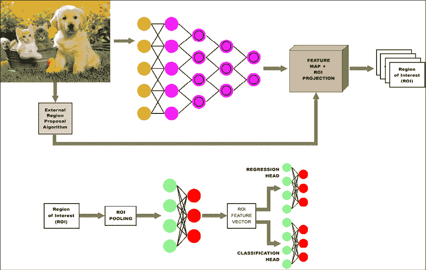

# 第二十章：高级卷积神经网络

本章中，我们将看到 CNN 的一些更高级的应用。我们将探索：

+   CNN 如何应用于计算机视觉、视频、文本文件、音频和音乐等领域

+   如何使用 CNN 进行文本处理

+   胶囊网络是什么

+   计算机视觉

本章的所有代码文件可以在 [`packt.link/dltfchp20`](https://packt.link/dltfchp20) 找到。

让我们从使用 CNN 进行复杂任务开始。

# 组合 CNN 进行复杂任务

我们在*第三章*《卷积神经网络》中已经详细讨论了 CNN，现在你可能已经深信 CNN 架构对于图像分类任务的有效性。然而，你可能会惊讶地发现，基本的 CNN 架构可以通过组合和扩展的方式，解决各种更复杂的任务。在本节中，我们将查看*图 20.1*中提到的计算机视觉任务，并展示如何通过将 CNN 转变为更大、更复杂的架构来解决它们。


图 20.1：不同的计算机视觉任务 – 来源：人工智能与计算机视觉革命介绍 (https://www.slideshare.net/darian_f/introduction-to-the-artificial-intelligence-and-computer-vision-revolution)

## 分类与定位

在分类和定位任务中，除了需要报告图像中物体的类别，还需要给出物体在图像中出现的边界框坐标。这类任务假设图像中只有一个物体实例。

这可以通过在典型的分类网络中，除了“分类头”外再附加一个“回归头”来实现。回想一下，在一个分类网络中，卷积和池化操作的最终输出，称为特征图，将被送入一个全连接网络，生成一个类别概率向量。这个全连接网络被称为分类头，并通过使用分类损失函数 (*L*[c])，如类别交叉熵，进行调优。

类似地，回归头是另一个全连接网络，它接收特征图并生成一个向量 (*x*, *y*, *w*, *h*)，表示左上角的 *x* 和 *y* 坐标，以及边界框的宽度和高度。它通过使用连续损失函数 (*L*[R])，如均方误差，进行调优。整个网络通过这两种损失的线性组合进行调优，即：


这里， 是一个超参数，可以取值在 0 到 1 之间。除非该值由一些关于问题的领域知识决定，否则可以设置为 0.5。

*图 20.2* 显示了一个典型的分类与定位网络架构：


图 20.2：图像分类与定位的网络架构

正如你所看到的，与典型的 CNN 分类网络的唯一区别是右上角额外的回归头。

## 语义分割

基于基本分类思想的另一类问题是“语义分割”。其目标是将图像中的每一个像素分类为属于某一类。

一种初步的实现方法可能是为每个像素构建一个分类网络，其中输入是每个像素周围的小邻域。实际上，这种方法的性能并不好，因此对该实现的改进可能是通过卷积操作处理图像，增加特征深度，同时保持图像的宽度和高度不变。每个像素会有一个特征图，可以通过一个全连接网络来预测该像素的类别。然而，实际上，这也相当昂贵，通常不被使用。

第三种方法是使用 CNN 编码器-解码器网络，其中编码器减小图像的宽度和高度，但增加其深度（特征数量），而解码器使用反卷积操作增加图像的尺寸并减少其深度。反卷积（或上采样）是进行与普通卷积相反的过程。该网络的输入是图像，输出是分割图。该编码器-解码器架构的一个流行实现是 U-Net（一个很好的实现可以在[`github.com/jakeret/tf_unet`](https://github.com/jakeret/tf_unet)找到），最初为生物医学图像分割开发，具有编码器和解码器之间额外的跳跃连接。

*图 20.3* 展示了 U-Net 架构：


图 20.3：U-Net 架构

## 目标检测

目标检测任务与分类和定位任务类似。最大的区别在于现在图像中有多个对象，并且对于每个对象，我们需要找到其类别和边界框坐标。此外，事先无法知道对象的数量或大小。正如你所想，这个问题非常复杂，且已经有大量的研究投入其中。

解决这个问题的第一种方法可能是创建许多输入图像的随机裁剪，对于每个裁剪，应用我们之前描述的分类和定位网络。然而，这种方法在计算上非常浪费，且不太可能非常成功。

更实用的方法是使用如选择性搜索（*Selective Search for Object Recognition*，由 Uijlings 等人编写，[`www.huppelen.nl/publications/selectiveSearchDraft.pdf`](http://www.huppelen.nl/publications/selectiveSearchDraft.pdf)）等工具，利用传统的计算机视觉技术来查找图像中可能包含物体的区域。这些区域被称为“区域建议”，用于检测这些区域的网络称为**基于区域的 CNN**，或称**R-CNN**。在原始的 R-CNN 中，区域被调整大小后输入网络，产生图像向量。然后，使用基于 SVM 的分类器对这些向量进行分类（见[`en.wikipedia.org/wiki/Support-vector_machine`](https://en.wikipedia.org/wiki/Support-vector_machine)），外部工具提出的边界框通过图像向量上的线性回归网络进行修正。R-CNN 网络的概念表示如 *图 20.4* 所示：


图 20.4：R-CNN 网络

R-CNN 网络的下一个迭代版本叫做 Fast R-CNN。Fast R-CNN 仍然从外部工具获取区域建议，但不再将每个区域建议分别输入 CNN，而是将整个图像输入 CNN，并将区域建议投影到生成的特征图上。每个感兴趣的区域会通过**感兴趣区域**（**ROI**）池化层，然后传递到一个全连接网络，生成该 ROI 的特征向量。

ROI 池化是使用 CNN 进行物体检测任务时广泛应用的一种操作。ROI 池化层使用最大池化将任何有效感兴趣区域内的特征转换为一个具有固定空间大小 *H* x *W*（其中 *H* 和 *W* 是两个超参数）的较小特征图。然后，将该特征向量输入两个全连接网络，一个用于预测 ROI 的类别，另一个用于修正区域建议的边界框坐标。如 *图 20.5* 所示：



图 20.5：Fast R-CNN 网络架构

Fast R-CNN 比 R-CNN 快约 25 倍。下一步的改进，称为 Faster R-CNN（实现代码可见 [`github.com/tensorpack/tensorpack/tree/master/examples/FasterRCNN`](https://github.com/tensorpack/tensorpack/tree/master/examples/FasterRCNN)），移除了外部区域建议机制，并用一个可训练组件 —— **区域建议网络**（**RPN**） —— 替代，嵌入到网络本身。该网络的输出与特征图结合，并通过与 Fast R-CNN 网络类似的管道传递，如 *图 20.6* 所示。

Faster R-CNN 网络的速度是 Fast R-CNN 网络的约 10 倍，使其比 R-CNN 网络快约 250 倍：


图 20.6：Faster R-CNN 网络架构

另一类稍微不同的物体检测网络是 **单次检测器**（**SSD**），例如 **YOLO**（**You Only Look Once**）。在这些情况下，每张图片都会被使用网格分割成预定义数量的部分。对于 YOLO 来说，使用的是一个 7 x 7 的网格，结果是 49 个子图像。每个子图像都会应用一组预定的不同纵横比的裁剪。给定 *B* 个边界框和 *C* 个物体类别，每张图片的输出是一个大小为  的向量。每个边界框都有一个置信度和坐标（*x*，*y*，*w*，*h*），每个网格会有一个预测概率，表示在其中检测到的不同物体。

YOLO 网络是一个 CNN，它执行这种转换。最终的预测和边界框通过聚合此向量中的结果来获得。在 YOLO 中，单个卷积网络预测边界框及相关类别概率。YOLO 是物体检测的更快解决方案。实现可以在 [`www.kaggle.com/aruchomu/yolo-v3-object-detection-in-tensorflow`](https://www.kaggle.com/aruchomu/yolo-v3-object-detection-in-tensorflow) 找到。

## 实例分割

实例分割与语义分割相似——即将图像的每个像素与一个类别标签关联——但有一些重要的区别。首先，它需要区分图像中同一类别的不同实例。其次，它不要求标记图像中的每一个像素。在某些方面，实例分割也类似于物体检测，不同之处在于我们不使用边界框，而是需要找到覆盖每个物体的二进制掩码。

第二个定义揭示了 Mask R-CNN 网络背后的直觉。Mask R-CNN 是一个带有额外 CNN 的 Faster R-CNN，该 CNN 位于回归头部之前，输入为为每个 ROI 报告的边界框坐标，并将其转换为二进制掩码 [11]：


图 20.7：Mask R-CNN 架构

2019 年 4 月，Google 开源发布了 Mask R-CNN，并且用 TPUs 进行了预训练。你可以在以下链接找到该模型：

[`colab.research.google.com/github/tensorflow/tpu/blob/master/models/official/mask_rcnn/mask_rcnn_demo.ipynb`](https://colab.research.google.com/github/tensorflow/tpu/blob/master/models/official/mask_rcnn/mask_rcnn_demo.ipynb)。

我建议你尝试一下 Colab 笔记本，看看结果如何。在 *图 20.8* 中，我们看到了一个图像分割的示例：


图 20.8：图像分割的一个示例

Google 还发布了另一个基于 TPUs 训练的模型，名为 DeepLab，你可以从演示中看到一张图片（*图 20.9*）。这个模型可以在以下链接找到：

[`colab.research.google.com/github/tensorflow/models/blob/master/research/deeplab/deeplab_demo.ipynb#scrollTo=edGukUHXyymr`](https://colab.research.google.com/github/tensorflow/models/blob/master/research/deeplab/deeplab_demo.ipynb#scrollTo=edGukUHXyymr)：


图 20.9：图像分割的示例

在本节中，我们大致介绍了几种在计算机视觉领域流行的网络架构。请注意，所有这些架构都由相同的基本 CNN 和全连接架构组成。这种可组合性是深度学习最强大的特性之一。希望这能给你一些启示，帮助你设计适合自己计算机视觉应用的网络。

# 使用 tf.Keras 和 TensorFlow Hub 的应用程序

转移学习的一个好处是可以重用预训练网络，从而节省时间和资源。市面上有许多现成的网络集合，但以下两个是最常用的。

## Keras 应用程序

Keras 应用程序（Keras 应用程序可以在 [`www.tensorflow.org/api_docs/python/tf/keras/applications`](https://www.tensorflow.org/api_docs/python/tf/keras/applications) 找到）包括了用于图像分类的模型，这些模型在 ImageNet 上训练过（Xception、VGG16、VGG19、ResNet、ResNetV2、ResNeXt、InceptionV3、InceptionResNetV2、MobileNet、MobileNetV2、DenseNet 和 NASNet）。此外，还有一些来自社区的其他参考实现，涉及目标检测和分割、序列学习、强化学习（见 *第十一章*）以及 GANs（见 *第九章*）。

## TensorFlow Hub

TensorFlow Hub（可访问 [`www.tensorflow.org/hub`](https://www.tensorflow.org/hub)）是一个预训练模型的替代集合。TensorFlow Hub 包含了文本分类、句子编码（见 *第四章*）、图像分类、特征提取、使用 GAN 生成图像以及视频分类的模块。目前，Google 和 DeepMind 都在为 TensorFlow Hub 做贡献。

让我们看一个使用 `TF.Hub` 的示例。在这个例子中，我们有一个使用 MobileNetv2 的简单图像分类器：

```py
import matplotlib.pylab as plt
import tensorflow as tf
import tensorflow_hub as hub
import numpy as np
import PIL.Image as Image
classifier_url ="https://tfhub.dev/google/tf2-preview/mobilenet_v2/classification/2" #@param {type:"string"}
IMAGE_SHAPE = (224, 224)
# wrap the hub to work with tf.keras
classifier = tf.keras.Sequential([
    hub.KerasLayer(classifier_url, input_shape=IMAGE_SHAPE+(3,))
])
grace_hopper = tf.keras.utils.get_file('image.jpg','https://storage.googleapis.com/download.tensorflow.org/example_images/grace_hopper.jpg')
grace_hopper = Image.open(grace_hopper).resize(IMAGE_SHAPE)
grace_hopper = np.array(grace_hopper)/255.0
result = classifier.predict(grace_hopper[np.newaxis, ...])
predicted_class = np.argmax(result[0], axis=-1)
print (predicted_class) 
```

确实很简单。只需记得使用 `hub.KerasLayer()` 来包装任何 Hub 层。在本节中，我们讨论了如何使用 TensorFlow Hub。

接下来，我们将重点介绍其他 CNN 架构。

# 回答关于图像的问题（视觉问答）

神经网络的一个优点是可以将不同类型的媒体结合在一起，以提供统一的解释。例如，**视觉问答**（**VQA**）结合了图像识别和文本自然语言处理。训练可以使用 VQA（VQA 数据集可以在[`visualqa.org/`](https://visualqa.org/)获取），它包含有关图像的开放式问题。这些问题需要理解视觉、语言和常识才能回答。以下图像来自于[`visualqa.org/`](https://visualqa.org/)上的一个演示。

请注意图像顶部的问题，以及随后的答案：


图 20.10：视觉问答示例

如果你想开始玩 VQA，首先需要获取适当的训练数据集，如 VQA 数据集、CLEVR 数据集（可在[`cs.stanford.edu/people/jcjohns/clevr/`](https://cs.stanford.edu/people/jcjohns/clevr/)获取）或 FigureQA 数据集（可在[`datasets.maluuba.com/FigureQA`](https://datasets.maluuba.com/FigureQA)获取）；或者，你可以参与 Kaggle 的 VQA 挑战（可在[`www.kaggle.com/c/visual-question-answering`](https://www.kaggle.com/c/visual-question-answering)参与）。然后，你可以构建一个结合 CNN 和 RNN 的模型并开始实验。例如，CNN 可以是这样的代码片段，它接受一个具有三个通道（224 x 224）的图像作为输入，并为图像生成一个特征向量：

```py
import tensorflow as tf
from tensorflow.keras import layers, models
# IMAGE
#
# Define CNN for visual processing
cnn_model = models.Sequential()
cnn_model.add(layers.Conv2D(64, (3, 3), activation='relu', padding='same', 
        input_shape=(224, 224, 3)))
cnn_model.add(layers.Conv2D(64, (3, 3), activation='relu'))
cnn_model.add(layers.MaxPooling2D(2, 2))
cnn_model.add(layers.Conv2D(128, (3, 3), activation='relu', padding='same'))
cnn_model.add(layers.Conv2D(128, (3, 3), activation='relu'))
cnn_model.add(layers.MaxPooling2D(2, 2))
cnn_model.add(layers.Conv2D(256, (3, 3), activation='relu', padding='same'))
cnn_model.add(layers.Conv2D(256, (3, 3), activation='relu'))
cnn_model.add(layers.Conv2D(256, (3, 3), activation='relu'))
cnn_model.add(layers.MaxPooling2D(2, 2))
cnn_model.add(layers.Flatten())
cnn_model.summary()
#define the visual_model with proper input
image_input = layers.Input(shape=(224, 224, 3))
visual_model = cnn_model(image_input) 
```

文本可以通过 RNN 进行编码；目前，可以将其视为一个黑盒，它接受一个文本片段（问题）作为输入，并为文本生成一个特征向量：

```py
# TEXT
#
#define the RNN model for text processing
question_input = layers.Input(shape=(100,), dtype='int32')
emdedding = layers.Embedding(input_dim=10000, output_dim=256, 
    input_length=100)(question_input)
encoded_question = layers.LSTM(256)(emdedding) 
```

然后，将两个特征向量（一个是图像的，另一个是文本的）合并为一个联合向量，该向量作为输入提供给密集网络，以生成组合网络：

```py
# combine the encoded question and visual model
merged = layers.concatenate([encoded_question, visual_model])
#attach a dense network at the end
output = layers.Dense(1000, activation='softmax')(merged)
#get the combined model
vqa_model = models.Model(inputs=[image_input, question_input], outputs=output)
vqa_model.summary() 
```

例如，如果我们有一组标记的图像，那么我们可以学习描述图像的最佳问题和答案。选择的数量非常庞大！如果你想了解更多，我建议你调查 Maluuba，一家提供 FigureQA 数据集的初创公司，该数据集包含 100,000 个图像和 1,327,368 对问答。Maluuba 最近被微软收购，实验室由深度学习的奠基人之一 Yoshua Bengio 担任顾问。

在本节中，我们讨论了如何实现视觉问答。下一节将介绍风格迁移，这是一种用于训练神经网络创作艺术的深度学习技术。

# 创建一个 DeepDream 网络

CNN 的另一个有趣应用是 DeepDream，一个由 Google [8] 创建的计算机视觉程序，它利用 CNN 在图像中寻找并增强模式。结果是梦幻般的迷幻效果。与之前的示例类似，我们将使用一个预训练的网络来提取特征。然而，在这种情况下，我们希望“增强”图像中的模式，这意味着我们需要最大化一些函数。这告诉我们需要使用梯度上升，而不是梯度下降。首先，让我们看一个来自 Google 画廊的示例（可在[`colab.research.google.com/github/tensorflow/docs/blob/master/site/en/tutorials/generative/deepdream.ipynb`](https://colab.research.google.com/github/tensorflow/docs/blob/master/site/en/tutorials/generative/deepdream.ipynb)获取），其中经典的西雅图景观被“接纳”了梦幻般的幻觉效果，如鸟类、卡片和奇怪的飞行物体。

Google 发布了 DeepDream 的开源代码（可在[`github.com/google/deepdream`](https://github.com/google/deepdream)获取），但我们将使用一个由随机森林生成的简化示例（可在[`www.tensorflow.org/tutorials/generative/deepdream`](https://www.tensorflow.org/tutorials/generative/deepdream)获取）：


图 20.11：深度梦境：西雅图

让我们从一些图像预处理开始：

```py
# Download an image and read it into a NumPy array, 
def download(url):
  name = url.split("/")[-1]
  image_path = tf.keras.utils.get_file(name, origin=url)
  img = image.load_img(image_path)
  return image.img_to_array(img)
# Scale pixels to between (-1.0 and 1.0)
def preprocess(img):
  return (img / 127.5) - 1

# Undo the preprocessing above
def deprocess(img):
  img = img.copy()
  img /= 2.
  img += 0.5
  img *= 255.
  return np.clip(img, 0, 255).astype('uint8')
# Display an image
def show(img):
  plt.figure(figsize=(12,12))
  plt.grid(False)
  plt.axis('off')
  plt.imshow(img)
# https://commons.wikimedia.org/wiki/File:Flickr_-_Nicholas_T_-_Big_Sky_(1).jpg
url = 'https://upload.wikimedia.org/wikipedia/commons/thumb/d/d0/Flickr_-_Nicholas_T_-_Big_Sky_%281%29.jpg/747px-Flickr_-_Nicholas_T_-_Big_Sky_%281%29.jpg'
img = preprocess(download(url))
show(deprocess(img)) 
```

现在让我们使用预训练的 Inception 网络来提取特征。我们使用多个层，目标是最大化它们的激活值。`tf.keras`函数式 API 在这里对我们非常有用：

```py
# We'll maximize the activations of these layers
names = ['mixed2', 'mixed3', 'mixed4', 'mixed5']
layers = [inception_v3.get_layer(name).output for name in names]
# Create our feature extraction model
feat_extraction_model = tf.keras.Model(inputs=inception_v3.input, outputs=layers)
def forward(img):

  # Create a batch
  img_batch = tf.expand_dims(img, axis=0)

  # Forward the image through Inception, extract activations
  # for the layers we selected above
  return feat_extraction_model(img_batch) 
```

损失函数是所有激活层的平均值，通过该层自身单元的数量进行归一化：

```py
def calc_loss(layer_activations):

  total_loss = 0

  for act in layer_activations:

    # In gradient ascent, we'll want to maximize this value
    # so our image increasingly "excites" the layer
    loss = tf.math.reduce_mean(act)
    # Normalize by the number of units in the layer
    loss /= np.prod(act.shape)
    total_loss += loss
  return total_loss 
```

现在让我们运行梯度上升：

```py
img = tf.Variable(img)
steps = 400
for step in range(steps):

  with tf.GradientTape() as tape:
    activations = forward(img)
    loss = calc_loss(activations)

  gradients = tape.gradient(loss, img)
  # Normalize the gradients
  gradients /= gradients.numpy().std() + 1e-8 

  # Update our image by directly adding the gradients
  img.assign_add(gradients)

  if step % 50 == 0:
    clear_output()
    print ("Step %d, loss %f" % (step, loss))
    show(deprocess(img.numpy()))
    plt.show()
# Let's see the result
clear_output()
show(deprocess(img.numpy())) 
```

这将把左侧的图像转换成右侧的迷幻图像：


图 20.12：深度梦境：绿地与云彩

# 检查网络学到了什么

一个特别有趣的研究方向是了解神经网络到底在学习什么，从而能够如此精准地识别图像。这被称为神经网络的“可解释性”。激活图谱是一种有前景的近期技术，旨在展示平均激活函数的特征可视化。通过这种方式，激活图谱生成了通过网络“眼睛”看到的全球地图。让我们来看一个可用的演示：[`distill.pub/2019/activation-atlas/`](https://distill.pub/2019/activation-atlas/)：


图 20.13：检查示例

在这张图片中，使用用于视觉分类的 InceptionV1 网络展示了许多完全实现的特征，例如电子产品、屏幕、宝丽来相机、建筑物、食物、动物耳朵、植物和水域背景。请注意，网格单元标注了它们给出最多支持的分类。网格单元的大小也根据其中平均激活的次数进行调整。这种表示方法非常强大，因为它允许我们检查网络的不同层以及激活函数如何响应输入进行激活。

在本节中，我们已经看到了许多用 CNN 处理图像的技术。接下来，我们将转向视频处理。

# 视频

在本节中，我们将讨论如何将 CNN 与视频结合使用，以及我们可以使用的不同技术。

## 用预训练网络以六种不同方式分类视频

视频分类是一个活跃的研究领域，因为处理这种类型的媒体需要大量的数据。内存需求通常会达到现代 GPU 的极限，可能需要在多台机器上进行分布式训练。目前，研究人员正在探索不同的研究方向，从第一种方法到第六种方法的复杂度逐步增加，具体如下所述。让我们来回顾一下：

+   **第一种方法**是逐帧对视频进行分类，将每一帧视为一个单独的图像，并用 2D 卷积神经网络（CNN）处理。这种方法简单地将视频分类问题简化为图像分类问题。每一帧视频“发出”一个分类输出，视频的分类通过考虑每一帧最常选择的类别来确定。

+   **第二种方法**是创建一个单一的网络，将 2D 卷积神经网络（CNN）与循环神经网络（RNN）结合起来（参见*第九章*，*生成模型*）。其思想是，CNN 将考虑图像的组成部分，而 RNN 则考虑每个视频的序列信息。这种类型的网络可能非常难以训练，因为它有大量需要优化的参数。

+   **第三种方法**是使用 3D 卷积网络（3D ConvNet），其中 3D 卷积网络是 2D 卷积网络的扩展，操作于 3D 张量（时间、图像宽度和图像高度）。这种方法是图像分类的另一种自然扩展。同样，3D 卷积网络也可能很难训练。

+   **第四种方法**基于一个巧妙的想法：不是直接使用 CNN 进行分类，而是将它们用于存储每一帧视频的离线特征。其思想是，特征提取可以通过迁移学习变得非常高效，如之前的食谱所示。在提取所有特征后，它们可以作为输入集传递给 RNN，RNN 将学习跨多个帧的序列并输出最终分类。

+   **第五种方法**是第四种方法的一种简单变体，其中最后一层是 MLP，而不是 RNN。在某些情况下，这种方法可能更简单，且在计算需求上更低。

+   **第六种方法**是第四种方法的一种变体，其中特征提取阶段是通过一个 3D 卷积神经网络（CNN）来实现的，该网络提取空间和视觉特征。这些特征随后传递给一个 RNN 或 MLP。

确定最佳方法完全取决于你的具体应用，并没有明确的答案。前三种方法通常计算开销较大且较为笨重，而后三种方法则开销较小，且经常能够取得更好的性能。

到目前为止，我们已经探讨了 CNN 如何用于图像和视频应用。接下来的部分，我们将把这些思想应用于基于文本的上下文中。

# 文本文档

文本和图像有什么共同点？乍一看，似乎没有什么共同点。然而，如果我们将一个句子或文档表示为一个矩阵，那么这个矩阵与图像矩阵没有太大区别，因为每个单元格就像图像中的一个像素。那么，下一个问题是，我们如何将一段文本表示为一个矩阵呢？

其实很简单：矩阵的每一行是一个表示文本基本单元的向量。当然，现在我们需要定义什么是基本单元。一个简单的选择是将基本单元定义为一个字符。另一个选择是将基本单元定义为一个单词；还有一种选择是将相似的单词聚合在一起，然后用一个代表性的符号来表示每个聚合（有时称为簇或嵌入）。

请注意，无论我们为基本单元选择什么，必须保证从基本单元到整数 ID 的 1:1 映射，以便将文本视为矩阵。例如，如果我们有一个包含 10 行文本的文档，每行是一个 100 维的嵌入，那么我们将用一个 10 x 100 的矩阵来表示文本。在这个非常特殊的“图像”中，只有当某个句子*X*包含位置*Y*表示的嵌入时，那个“像素”才会被点亮。你可能还会注意到，文本并不是真正的矩阵，更像是一个向量，因为位于相邻行的两个单词几乎没有什么关联。实际上，这与图像有很大的区别，因为图像中位于相邻列的两个像素可能会有某种程度的相关性。

现在你可能会想：*我理解我们将文本表示为一个向量，但这样做的话，我们失去了单词的位置。这个位置应该很重要，不是吗？* 结果证明，在许多实际应用中，知道一个句子是否包含某个特定的基本单元（字符、单词或聚合）是非常有用的信息，即使我们没有追踪这个基本单元在句子中的确切位置。

例如，CNN 在**情感分析**中取得了不错的结果，在情感分析中，我们需要理解一段文本是积极的还是消极的；在**垃圾邮件检测**中，我们需要判断一段文本是有用的信息还是垃圾邮件；在**主题分类**中，我们需要了解一段文本的主题是什么。然而，CNN 并不适合**词性分析**（**POS**），在词性分析中，目标是理解每个单词的逻辑角色是什么（例如，动词、副词、主语等）。CNN 也不太适合**实体提取**，在实体提取中，我们需要理解句子中相关实体的位置。

事实上，事实证明，位置对于最后两个使用案例非常有用。1D 卷积神经网络（ConvNets）与 2D 卷积神经网络非常相似。然而，前者操作的是单一向量，而后者操作的是矩阵。

## 使用 CNN 进行情感分析

让我们来看一下代码。首先，我们使用`tensorflow_datasets`加载数据集。在这个例子中，我们使用 IMDB，它是一个电影评论的集合：

```py
import tensorflow as tf
from tensorflow.keras import datasets, layers, models, preprocessing
import tensorflow_datasets as tfds
max_len = 200
n_words = 10000
dim_embedding = 256
EPOCHS = 20
BATCH_SIZE =500
def load_data():
    #load data
    (X_train, y_train), (X_test, y_test) = datasets.imdb.load_data(num_words=n_words)
    # Pad sequences with max_len
    X_train = preprocessing.sequence.pad_sequences(X_train, maxlen=max_len)
    X_test = preprocessing.sequence.pad_sequences(X_test, maxlen=max_len)
    return (X_train, y_train), (X_test, y_test) 
```

然后，我们构建一个合适的 CNN 模型。我们使用词嵌入（参见*第四章*，*词嵌入*）将文档中通常观察到的稀疏词汇映射到一个密集的特征空间，维度为`dim_embedding`。然后，我们使用`Conv1D`，接着是`GlobalMaxPooling1D`进行平均，再加上两个`Dense`层——最后一个只有一个神经元，用于输出二元选择（正面或负面评论）：

```py
def build_model():
    model = models.Sequential()
    #Input - Embedding Layer
    # the model will take as input an integer matrix of size (batch, input_length)
    # the model will output dimension (input_length, dim_embedding)
    # the largest integer in the input should be no larger
    # than n_words (vocabulary size).
    model.add(layers.Embedding(n_words,
        dim_embedding, input_length=max_len))
    model.add(layers.Dropout(0.3))
    model.add(layers.Conv1D(256, 3, padding='valid', 
        activation='relu'))
    #takes the maximum value of either feature vector from each of the n_words features
    model.add(layers.GlobalMaxPooling1D())
    model.add(layers.Dense(128, activation='relu'))
    model.add(layers.Dropout(0.5))
    model.add(layers.Dense(1, activation='sigmoid'))
    return model
(X_train, y_train), (X_test, y_test) = load_data()
model=build_model()
model.summary() 
```

该模型有超过 2,700,000 个参数，概述如下：

```py
_________________________________________________________________
 Layer (type)                Output Shape              Param #   
=================================================================
 embedding (Embedding)       (None, 200, 256)          2560000   

 dropout (Dropout)           (None, 200, 256)          0         

 conv1d (Conv1D)             (None, 198, 256)          196864    

 global_max_pooling1d (Globa  (None, 256)              0         
 lMaxPooling1D)                                                  

 dense (Dense)               (None, 128)               32896     

 dropout_1 (Dropout)         (None, 128)               0         

 dense_1 (Dense)             (None, 1)                 129       

=================================================================
Total params: 2,789,889
Trainable params: 2,789,889
Non-trainable params: 0 
```

然后，我们使用 Adam 优化器和二元交叉熵损失函数来编译并拟合模型：

```py
model.compile(optimizer = "adam", loss = "binary_crossentropy",
  metrics = ["accuracy"]
)
score = model.fit(X_train, y_train,
  epochs= EPOCHS,
  batch_size = BATCH_SIZE,
  validation_data = (X_test, y_test)
)
score = model.evaluate(X_test, y_test, batch_size=BATCH_SIZE)
print("\nTest score:", score[0])
print('Test accuracy:', score[1]) 
```

最终准确率为 88.21%，这表明成功使用卷积神经网络（CNN）进行文本处理是可能的：

```py
Epoch 19/20
25000/25000 [==============================] - 135s 5ms/sample - loss: 7.5276e-04 - accuracy: 1.0000 - val_loss: 0.5753 - val_accuracy: 0.8818
Epoch 20/20
25000/25000 [==============================] - 129s 5ms/sample - loss: 6.7755e-04 - accuracy: 0.9999 - val_loss: 0.5802 - val_accuracy: 0.8821
25000/25000 [==============================] - 23s 916us/sample - loss: 0.5802 - accuracy: 0.8821
Test score: 0.5801781857013703
Test accuracy: 0.88212 
```

请注意，许多其他非图像应用也可以转换为图像并使用 CNN 进行分类（例如，参见[`becominghuman.ai/sound-classification-using-images-68d4770df426`](https://becominghuman.ai/sound-classification-using-images-68d4770df426)）。

# 音频与音乐

我们已经将 CNN 应用于图像、视频和文本。现在，让我们来看看 CNN 的变种如何应用于音频。

所以，你可能会想，为什么学习合成音频这么困难。嗯，我们听到的每个数字声音都基于每秒 16,000 个样本（有时是 48K 或更多），并且构建一个预测模型，通过所有之前的样本来学习重现一个样本是一个非常困难的挑战。

## 扩张卷积神经网络（Dilated ConvNets）、WaveNet 和 NSynth

WaveNet 是一种用于生成原始音频波形的深度生成模型。这项突破性的技术由 Google DeepMind 提出（可在[`deepmind.com/blog/wavenet-a-generative-model-for-raw-audio/`](https://deepmind.com/blog/wavenet-a-generative-model-for-raw-audio/)查看），用于教计算机如何说话。其结果非常令人印象深刻，网上可以找到一些合成语音的示例，其中计算机学会了用像马特·达蒙等名人的声音进行对话。有实验表明，WaveNet 提高了现有的**文本转语音**（**TTS**）系统，将与人类语音的差异减少了 50%，适用于美国英语和普通话。这一比较使用的度量标准叫做**平均意见分数**（**MOS**），是一种主观的配对比较测试。在 MOS 测试中，听完每个声音刺激后，受试者被要求对刺激的自然度进行五分制评分，从“差”（1 分）到“优秀”（5 分）。

更酷的是，DeepMind 展示了 WaveNet 还可以用于教计算机如何生成像钢琴音乐这样的乐器声音。

现在一些定义。TTS 系统通常分为两类：拼接式和参数化式。

拼接式 TTS 是将单个语音片段先存储，然后在需要复现语音时重新组合。然而，这种方法无法扩展，因为只能重现已存储的语音片段，无法在没有重新记忆片段的情况下复现新的说话者或不同类型的音频。

参数化 TTS 是指创建一个模型，用来存储所有要合成音频的特征。在 WaveNet 之前，使用参数化 TTS 生成的音频不如拼接式 TTS 自然。WaveNet 通过直接建模音频声音的生成，显著改善了这一点，而不是像过去那样使用中间信号处理算法。

原则上，WaveNet 可以视为一堆具有恒定步幅为 1 且没有池化层的 1D 卷积层。注意，输入和输出在结构上具有相同的维度，因此卷积神经网络（ConvNets）非常适合建模像音频声音这样的序列数据。然而，研究表明，为了在输出神经元中达到较大的感受野，需要使用大量的大型滤波器或以不可接受的方式增加网络深度。记住，层中神经元的感受野是前一层的交叉部分，神经元从中接收输入。因此，纯粹的卷积神经网络在学习如何合成音频方面并不那么有效。

WaveNet 的关键直觉是所谓的**扩张因果卷积**[5]（有时也称为**空洞卷积**），这意味着在应用卷积层的滤波器时，一些输入值被跳过。“Atrous”是法语表达式“à trous”的变形，意思是“带孔的”。因此，空洞卷积就是带孔的卷积。例如，在一维情况下，一个大小为 3、扩张为 1 的滤波器*w*将计算以下和：*w*[0] *x*[0] + *w*[1] *x*[2] + *w*[2] *x*[4]。

简而言之，在 D-扩张卷积中，通常步幅为 1，但没有什么可以阻止你使用其他步幅。一个例子见*图 20.14*，展示了扩张（空洞）大小分别为 0、1、2 时的情况：


图 20.14：扩张与增大尺寸

由于引入*空洞*的这个简单思路，能够堆叠多个扩张卷积层，通过指数增长的滤波器学习长程输入依赖关系，而不需要一个过于深的网络。

因此，WaveNet 是一个卷积神经网络，其中卷积层具有不同的扩张因子，从而使感受野随着深度的增加而指数增长，进而有效地覆盖成千上万个音频时间步长。

在训练时，输入是来自人类发音者的录音。波形被量化为固定的整数范围。WaveNet 定义了一个初始卷积层，仅访问当前和先前的输入。然后是一个扩张卷积神经网络层的堆叠，依旧只访问当前和先前的输入。最后是一个密集层序列，结合先前的结果，接着是一个用于分类输出的 softmax 激活函数。

在每个步骤中，从网络中预测一个值并将其反馈到输入中。同时，计算下一步的预测值。损失函数是当前步骤的输出和下一步输入之间的交叉熵。*图 20.15* 展示了 Aaron van den Oord [9]介绍的 WaveNet 堆叠及其感受野的可视化。请注意，生成过程可能较慢，因为波形需要按顺序合成，因为* x*[t]必须首先被采样，以便获得，其中*x*是输入：


图 20.15：WaveNet 内部连接

在《Parallel WaveNet [10]》中，提出了一种并行采样的方法，实现了三个数量级的加速。该方法使用两个网络作为 WaveNet 教师网络，一个较慢但能确保正确结果的教师网络和一个试图模仿教师行为的 WaveNet 学生网络；学生网络可能精度较低，但速度更快。这种方法类似于 GAN（见*第九章*，*生成模型*）中使用的方法，但学生并不试图欺骗教师，正如通常在 GAN 中发生的那样。实际上，该模型不仅速度更快，而且精度更高，能够生成每秒 24,000 个采样的波形：


图 20.16：WaveNet 学生与教师的示例

该模型已经在 Google 的生产环境中部署，并且目前正在实时为数百万用户提供 Google Assistant 查询。在 2018 年 5 月的年度 I/O 开发者大会上，宣布由于 WaveNet，新版的 Google Assistant 语音已经上线。

目前有两个 TensorFlow 中的 WaveNet 模型实现。一个是 DeepMind 的原始 WaveNet 实现，另一个叫做 Magenta NSynth。原始 WaveNet 版本可以在 [`github.com/ibab/tensorflow-wavenet`](https://github.com/ibab/tensorflow-wavenet) 上获取。NSynth 是 WaveNet 的一种进化版，最近由 Google Brain 团队发布，它不同于传统的因果模型，而是旨在看到输入块的整个上下文。Magenta 可在 [`magenta.tensorflow.org/nsynth`](https://magenta.tensorflow.org/nsynth) 上获取。

神经网络确实很复杂，如下图所示，但为了本次入门讨论的方便，只需知道该网络通过减少编码/解码阶段的误差来学习如何再现其输入：


图 20.17：Magenta 内部架构

如果你有兴趣了解更多内容，建议查看在线 Colab 笔记本，你可以在其中使用 NSynth 生成的模型。NSynth Colab 可在 [`colab.research.google.com/notebooks/magenta/nsynth/nsynth.ipynb`](https://colab.research.google.com/notebooks/magenta/nsynth/nsynth.ipynb) 上访问。

MuseNet 是 OpenAI 开发的一个非常新的、令人印象深刻的音频生成工具。MuseNet 使用稀疏变换器训练一个具有 72 层和 24 个注意力头的网络。MuseNet 可在 [`openai.com/blog/musenet/`](https://openai.com/blog/musenet/) 上访问。*第六章*讨论的变换器非常擅长预测序列中的下一个元素——无论是文本、图像还是声音。

在变压器中，每个输出元素都与每个输入元素连接，它们之间的权重是根据一个叫做注意力的过程动态计算的。MuseNet 可以生成最多 4 分钟的音乐作品，包含 10 种不同的乐器，并能将乡村、莫扎特、披头士等风格相结合。例如，我生成了一首贝多芬《致爱丽丝》的翻版，以 Lady Gaga 风格演绎，使用了钢琴、鼓、吉他和贝斯。你可以通过**试用 MuseNet**部分下提供的链接亲自尝试：


图 20.18：使用 MuseNet 的示例

# 卷积操作总结

在这一节中，我们总结了不同卷积操作。卷积层有*I*个输入通道，并产生*O*个输出通道。使用了*I* x *O* x *K*个参数，其中*K*是核中值的数量。

## 基本 CNN

让我们简要回顾一下什么是 CNN。CNN 输入的是图像（二维）、文本（二维）或视频（三维），并对输入应用多个滤波器。每个滤波器就像一盏手电筒，滑过输入的区域，它照射到的区域叫做感受野。每个滤波器是与输入深度相同的张量（例如，如果图像深度为三，则滤波器的深度也必须为三）。

当滤波器滑动或卷积输入图像时，滤波器中的值会与输入的值相乘。然后，将乘积汇总成一个单一的值。这个过程会对每个位置重复，产生一个激活图（也叫特征图）。当然，也可以使用多个滤波器，每个滤波器作为特征识别器。例如，对于图像，滤波器可以识别边缘、颜色、线条和曲线。关键的直觉是将滤波器的值视为权重，并在训练过程中通过反向传播进行微调。

卷积层可以通过以下配置参数进行配置：

+   **核大小**：这是卷积的视野。

+   **步幅**：这是核在遍历图像时的步长。

+   **填充**：定义了我们如何处理样本的边界。

## 空洞卷积

空洞卷积（或称为 Atrous 卷积）引入了另一个配置参数：

+   **空洞率**：这是核中值之间的间隔。

空洞卷积被广泛应用于多个场景，包括使用 WaveNet 进行音频处理。

## 转置卷积

转置卷积是一种与正常卷积方向相反的变换。例如，这在将特征图投射到更高维空间时非常有用，或者用于构建卷积自编码器（见*第八章*，*自编码器*）。理解转置卷积的一种方式是，首先计算给定输入形状的正常 CNN 输出形状。然后，我们用转置卷积反转输入和输出形状。TensorFlow 2.0 支持转置卷积，通过 Conv2DTranspose 层可以使用它，例如，在生成对抗网络（GANs）（见*第九章*，*生成模型*）中生成图像。

## 可分离卷积

可分离卷积旨在将卷积核分成多个步骤。设卷积为 *y* = *conv*(*x*, *k*)，其中 *y* 是输出，*x* 是输入，*k* 是卷积核。假设卷积核是可分离的，*k* = *k*1.*k*2，其中“.”表示点积—在这种情况下，我们可以通过分别使用 *k*1 和 *k*2 做两个一维卷积来得到与 *k* 做二维卷积相同的结果。可分离卷积通常用于节省计算资源。

## 深度卷积

让我们考虑一个包含多个通道的图像。在正常的二维卷积中，滤波器的深度与输入相同，并且它允许我们混合通道来生成输出的每个元素。在深度卷积中，每个通道是分开处理的，滤波器被分割为多个通道，每个卷积分别应用，结果再重新堆叠成一个张量。

## 深度可分离卷积

这个卷积不应与可分离卷积混淆。在完成深度卷积后，会执行一个额外的步骤：跨通道进行 1x1 卷积。深度可分离卷积在 Xception 中得到了应用。它们也用于 MobileNet，这是一种特别适用于移动和嵌入式视觉应用的模型，因为它的模型尺寸和复杂度都较小。

在本节中，我们已经讨论了所有主要的卷积形式。下一节将讨论胶囊网络，这是一种在 2017 年提出的新型学习方法。

# 胶囊网络

胶囊网络（或 CapsNets）是近年来一种非常创新的深度学习网络类型。该技术在 2017 年 10 月底由 Sara Sabour、Nicholas Frost 和 Geoffrey Hinton 提出，并发布在题为《胶囊之间的动态路由》（*Dynamic Routing Between Capsules*）的开创性论文中（[`arxiv.org/abs/1710.09829`](https://arxiv.org/abs/1710.09829)）[14]。Hinton 是深度学习的奠基人，因此整个深度学习社区都为胶囊网络的进展感到兴奋。事实上，CapsNets 已经在 MNIST 分类任务中超越了最好的 CNN，这真是……令人印象深刻！！

## 卷积神经网络（CNN）有什么问题？

在 CNN 中，每一层“理解”图像的粒度逐渐增大。如我们在多个章节中讨论的那样，第一层最有可能识别直线、简单的曲线和边缘，而后续的层会开始理解更复杂的形状，如矩形，直到像人脸这样复杂的形式。

现在，卷积神经网络（CNN）中的一个关键操作是池化（pooling）。池化的目的是实现位置不变性，并且通常在每个 CNN 层之后使用，以便让任何问题在计算上变得可处理。然而，池化带来了一个显著的问题，因为它迫使我们丢失所有的位置信息。这是不可取的。想象一下一个面孔：它由两只眼睛、一张嘴和一个鼻子组成，重要的是这些部分之间有空间关系（例如，嘴巴在鼻子下方，而鼻子通常位于眼睛下方）。事实上，Hinton 曾说过：*卷积神经网络中使用的池化操作是一个重大错误，而它之所以能如此有效，简直是一场灾难*。从技术上讲，我们并不需要位置不变性，而是需要等变性（equivariance）。等变性是一个专业术语，表示我们希望理解图像中的旋转或比例变化，并希望网络能够做出相应的调整。这样，图像中不同组件之间的空间关系就不会丢失。

## 胶囊网络有什么新特点？

根据 Hinton 等人的说法，我们的大脑有一些叫做“胶囊”的模块，每个胶囊都专门处理某种特定类型的信息。特别地，有些胶囊在“理解”位置概念、大小概念、方向概念、变形概念、纹理等方面表现得非常好。除此之外，作者还建议，我们的大脑拥有特别高效的机制，能够动态地将每个信息片段传递给最适合处理该类型信息的胶囊。

因此，CNN 和胶囊网络（CapsNets）之间的主要区别在于，CNN 通过不断添加层来创建深度网络，而胶囊网络则是在每一层内部嵌套神经层。一个胶囊是一个神经元群体，它为网络引入了更多结构，并生成一个向量来表示图像中某个实体的存在。具体来说，Hinton 使用活动向量的长度来表示该实体存在的概率，而使用方向来表示实例化参数。当多个预测结果一致时，高层胶囊会被激活。对于每个可能的父胶囊，子胶囊会生成一个额外的预测向量。

现在出现了第二个创新：我们将在胶囊之间使用动态路由，不再使用传统的池化方法。低层胶囊更倾向于将其输出发送到与其活动向量有较大标量积的高层胶囊，预测来自低层胶囊。具有最大标量预测向量积的父胶囊将增加其胶囊联系。所有其他父胶囊将减少它们的联系。换句话说，这个想法是，如果高层胶囊同意低层胶囊的观点，它将请求发送更多这种类型的信息。如果没有达成一致，它将请求发送更少的信息。这种通过一致性方法进行的动态路由优于当前的机制，如最大池化，并且根据 Hinton 的说法，路由最终是一种解析图像的方法。实际上，最大池化忽略了除最大值以外的所有信息，而动态路由则根据低层和高层之间的一致性选择性地传播信息。

第三个不同之处是引入了新的非线性激活函数。与 CNN 中在每一层添加压缩函数不同，CapsNet 在一组嵌套的层次中添加了压缩函数。非线性激活函数在 *公式 1* 中表示，称为压缩函数：


其中 v[j] 是胶囊 *j* 的向量输出，s[j] 是其总输入。

此外，Hinton 等人表明，一个经过辨别训练的多层胶囊系统在 MNIST 上实现了最先进的性能，并且在识别高度重叠的数字方面显著优于卷积神经网络。

基于论文《胶囊间的动态路由》，一个简单的 CapsNet 架构如下所示：


图 20.19：CapsNet 示例

该架构较为浅层，仅包含两层卷积层和一层全连接层。Conv1 具有 256 个 9 x 9 的卷积核，步长为 1，并采用 ReLU 激活函数。该层的作用是将像素强度转换为局部特征检测器的活动，然后将这些活动作为输入传递到 PrimaryCapsules 层。PrimaryCapsules 是一个具有 32 个通道的卷积胶囊层；每个主胶囊包含 8 个 9 x 9 的卷积单元，步长为 2。总的来说，PrimaryCapsules 具有 [32, 6, 6] 的胶囊输出（每个输出为 8 维向量），且 [6, 6] 网格中的每个胶囊与其他胶囊共享权重。最终层（DigitCaps）为每个数字类别提供一个 16 维的胶囊，每个胶囊接收来自下层所有其他胶囊的输入。路由仅发生在两个连续的胶囊层之间（例如，PrimaryCapsules 和 DigitCaps）。

# 摘要

在本章中，我们已经看到 CNN 在不同领域中的许多应用，从传统的图像处理和计算机视觉，到接近的视频处理、相对较远的音频处理以及文本处理。在短短几年内，CNN 已经席卷了机器学习领域。

如今，看到多模态处理已经不再罕见，其中文本、图像、音频和视频会被一同考虑，以实现更好的性能，通常通过将 CNN 与其他技术（如 RNN 和强化学习）结合来完成。当然，还有很多需要考虑的方面，CNN 最近已被应用到许多其他领域，如基因推理[13]，这些领域至少从表面上看，与 CNN 的原始设计目标相距甚远。

# 参考文献

1.  Yosinski, J. 和 Clune, Y. B. J. *深度神经网络中的特征迁移性*。神经信息处理系统进展 27, 第 3320–3328 页。

1.  Szegedy, C., Vanhoucke, V., Ioffe, S., Shlens, J., 和 Wojna, Z. (2016). *重新思考计算机视觉中的 Inception 架构*。2016 年 IEEE 计算机视觉与模式识别会议（CVPR），第 2818–2826 页。

1.  Sandler, M., Howard, A., Zhu, M., Zhmonginov, A., 和 Chen, L. C. (2019). *MobileNetV2: 反向残差和线性瓶颈*。Google Inc.

1.  Krizhevsky, A., Sutskever, I., Hinton, G. E., (2012). *使用深度卷积神经网络进行 ImageNet 分类*。

1.  Huang, G., Liu, Z., van der Maaten, L., 和 Weinberger, K. Q. (2018 年 1 月 28 日). *密集连接卷积网络*。 [`arxiv.org/abs/1608.06993`](http://arxiv.org/abs/1608.06993)

1.  Chollet, F. (2017). *Xception: 深度学习与深度可分离卷积*。 [`arxiv.org/abs/1610.02357`](https://arxiv.org/abs/1610.02357)

1.  Gatys, L. A., Ecker, A. S., 和 Bethge, M. (2016). *艺术风格的神经算法*。 [`arxiv.org/abs/1508.06576`](https://arxiv.org/abs/1508.06576)

1.  Mordvintsev, A., Olah, C., 和 Tyka, M. (2015). *DeepDream - 可视化神经网络的代码示例*。Google 研究。

1.  van den Oord, A., Dieleman, S., Zen, H., Simonyan, K., Vinyals, O., Graves, A., Kalchbrenner, N., Senior, A., 和 Kavukcuoglu, K. (2016). *WaveNet: 一种原始音频的生成模型*。arXiv 预印本。

1.  van den Oord, A., Li, Y., Babuschkin, I., Simonyan, K., Vinyals, O., Kavukcuoglu, K., van den Driessche, G., Lockhart, E., Cobo, L. C., Stimberg, F., Casagrande, N., Grewe, D., Noury, S., Dieleman, S., Elsen, E., Kalchbrenner, N., Zen, H., Graves, A., King, H., Walters, T., Belov, D., 和 Hassabis, D. (2017). *Parallel WaveNet: 快速高保真语音合成*。

1.  He, K., Gkioxari, G., Dollár, P., 和 Girshick, R. (2018). *Mask R-CNN*。

1.  Chen, L-C., Zhu, Y., Papandreou, G., Schroff, F., 和 Adam, H. (2018). *基于空洞可分离卷积的编码器-解码器结构用于语义图像分割*。

1.  Flagel, L., Brandvain, Y., 和 Schrider, D.R. (2018). *卷积神经网络在群体遗传推断中的非凡有效性*。

1.  Sabour, S., Frosst, N., 和 Hinton, G. E. (2017). *胶囊网络中的动态路由* [`arxiv.org/abs/1710.09829`](https://arxiv.org/abs/1710.09829)

# 加入我们书籍的 Discord 空间

加入我们的 Discord 社区，结识志同道合的人，与超过 2000 名成员一起学习，网址：[`packt.link/keras`](https://packt.link/keras)


