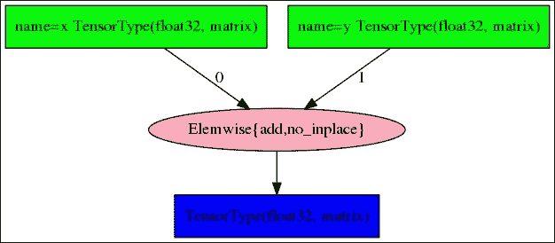
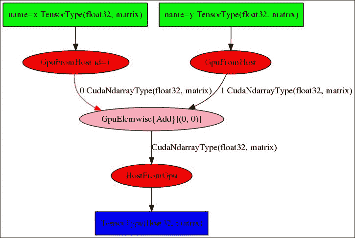
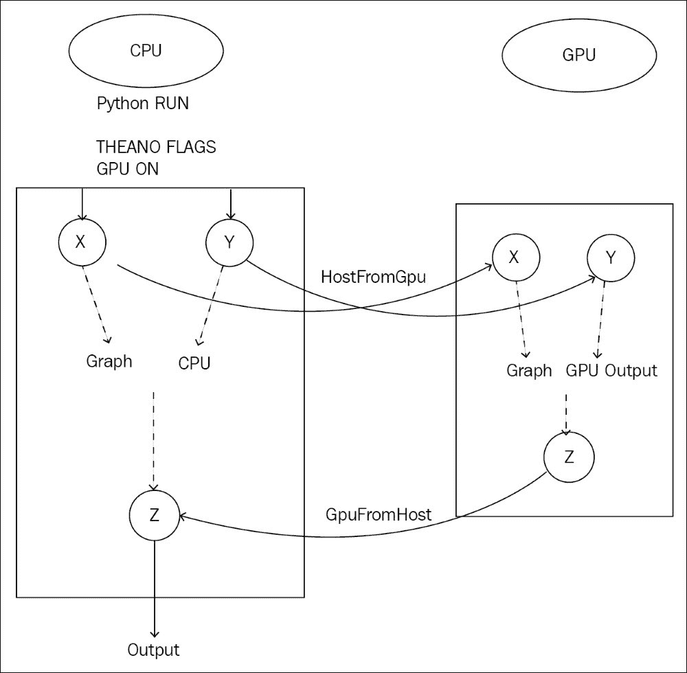
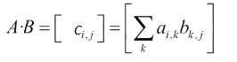
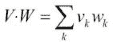
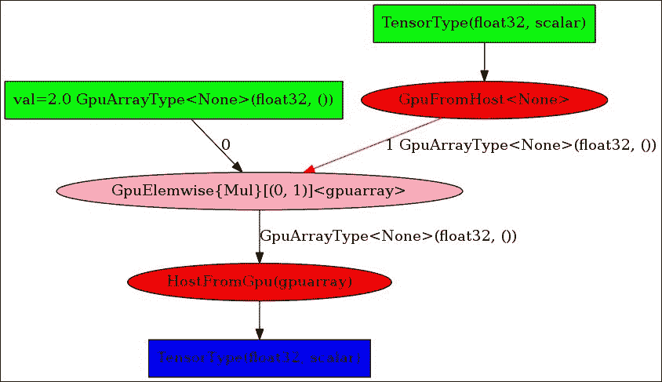
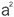
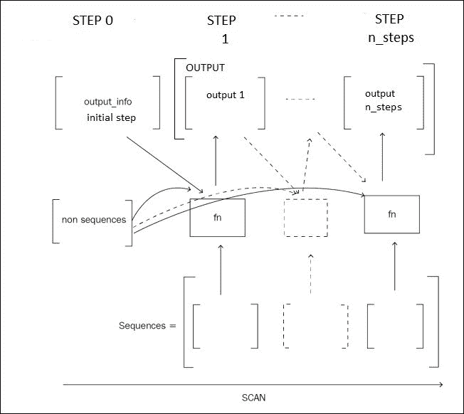

# 第一章：Theano 基础

本章将 Theano 作为计算引擎介绍，并为符号计算打下基础。符号计算由构建操作图组成，这些操作图将在以后为特定架构进行优化，使用适用于该架构的计算库。

尽管这一章看起来与实际应用相距甚远，但了解这些技术对于后续章节至关重要；它能做什么，它带来了什么价值？接下来的章节将讨论在构建各种深度学习架构时，Theano 的应用。

Theano 可以定义为一个科学计算库；自 2007 年起可用，特别适用于深度学习。两个核心特性是任何深度学习库的基础：张量操作和将代码运行在 CPU 或**图形计算单元**（**GPU**）上的能力。这两个特性使我们能够处理大量的多维数据。此外，Theano 还提供自动微分，这是一个非常有用的特性，可以解决比深度学习问题更广泛的数值优化问题。

本章涵盖以下主题：

+   Theano 安装与加载

+   张量与代数

+   符号编程

+   图

+   自动微分

+   GPU 编程

+   性能分析

+   配置

# 张量的需求

通常，输入数据通过多维数组表示：

+   **图像有三个维度**：通道数、宽度和高度

+   **声音和时间序列具有一个维度**：持续时间

+   **自然语言序列可以通过二维数组表示**：持续时间和字母表长度或词汇表长度

我们将在后续章节中看到更多关于输入数据数组的例子。

在 Theano 中，多维数组通过一个名为**张量**的抽象类实现，比 Python 等计算机语言中的传统数组有更多的变换功能。

在神经网络的每个阶段，诸如矩阵乘法等计算涉及对这些多维数组的多个操作。

编程语言中的经典数组没有足够的内建功能，无法快速有效地处理多维计算和操作。

对多维数组的计算有着悠久的优化历史，伴随着大量的库和硬件。速度提升的一个重要因素是 GPU 的大规模并行架构，利用数百到数千个核心的计算能力。

与传统的 CPU（例如四核、12 核或 32 核处理器）相比，GPU 的加速效果可以从 5 倍到 100 倍不等，即使部分代码仍然在 CPU 上执行（数据加载、GPU 控制和结果输出）。使用 GPU 的主要瓶颈通常是 CPU 内存与 GPU 内存之间的数据传输，但如果编程得当，GPU 的使用能够显著提高计算速度，缩短实验时间，从几个月缩短到几天，甚至几天缩短到几个小时，这是实验中的一项不可忽视的优势。

Theano 引擎从一开始就设计用于解决多维数组和架构抽象的挑战。

Theano 对科学计算的另一个不可忽视的好处是：自动对多维数组的函数进行微分，这是通过目标函数最小化进行模型参数推断的一个非常合适的功能。这样的特性可以通过免去计算导数的麻烦来促进实验，尽管导数计算本身可能并不复杂，但容易出错。

# 安装和加载 Theano

在本节中，我们将安装 Theano，分别在 CPU 和 GPU 设备上运行它，并保存配置。

## Conda 包管理和环境管理工具

安装 Theano 的最简单方法是使用 `conda`，一个跨平台的包和环境管理工具。

如果您的操作系统上尚未安装 `conda`，安装 `conda` 的最快方法是从 [`conda.io/miniconda.html`](https://conda.io/miniconda.html) 下载 `miniconda` 安装程序。例如，对于 `Linux 64 位和 Python 2.7` 下的 `conda`，使用以下命令：

```py
wget https://repo.continuum.io/miniconda/Miniconda2-latest-Linux-x86_64.sh
chmod +x Miniconda2-latest-Linux-x86_64.sh
bash ./Miniconda2-latest-Linux-x86_64.sh
```

Conda 使我们能够创建新的环境，其中 Python（2 或 3）的版本以及安装的包可能会有所不同。`conda` 根环境使用与安装 `conda` 的系统上相同版本的 Python。

## 在 CPU 上安装和运行 Theano

让我们来安装 Theano：

```py
conda install theano
```

启动一个 Python 会话并尝试以下命令来检查您的配置：

```py
>>> from theano import theano

>>> theano.config.device
'cpu'

>>> theano.config.floatX
'float64'

>>> print(theano.config)
```

最后一个命令打印出 Theano 的所有配置信息。`theano.config` 对象包含许多配置选项的键。

为了推断配置选项，Theano 会首先查看 `~/.theanorc` 文件，然后查看任何可用的环境变量，这些环境变量会覆盖前面的选项，最后查看代码中设置的变量，这些变量按优先级顺序排列：

```py
>>> theano.config.floatX='float32'
```

有些属性可能是只读的，无法在代码中更改，但 `floatX` 属性可以直接在代码中更改，它设置了浮点数的默认精度。

### 注意

建议使用 `float32`，因为 GPU 在历史上并没有广泛支持 `float64`。在 GPU 上运行 `float64` 的速度较慢，有时甚至非常慢（在最新的 Pascal 硬件上，可能慢 2 倍到 32 倍），而 `float32` 精度在实际应用中已经足够。

## GPU 驱动和库

Theano 启用 GPU 的使用，GPU 单元通常用于计算显示在计算机屏幕上的图形。

为了让 Theano 也能在 GPU 上工作，你的系统需要一个 GPU 后端库。

CUDA 库（仅适用于 NVIDIA GPU 卡）是进行 GPU 计算的主要选择。还有 OpenCL 标准，它是开源的，但远不如 CUDA 成熟，而且在 Theano 上的实现更为实验性和初步。

目前，大多数科学计算仍然发生在 NVIDIA 显卡上。如果你拥有 NVIDIA GPU 显卡，可以从 NVIDIA 官网[`developer.nvidia.com/cuda-downloads`](https://developer.nvidia.com/cuda-downloads)下载 CUDA 并安装。安装程序会首先安装最新版本的 GPU 驱动程序（如果尚未安装）。然后，它会将 CUDA 库安装到`/usr/local/cuda`目录。

安装 cuDNN 库，这是 NVIDIA 提供的一个库，它为 GPU 提供更快的某些操作实现。为了安装它，我通常会将`/usr/local/cuda`目录复制到一个新目录`/usr/local/cuda-{CUDA_VERSION}-cudnn-{CUDNN_VERSION}`，这样我可以根据所使用的深度学习技术及其兼容性来选择 CUDA 和 cuDNN 的版本。

在你的`.bashrc`配置文件中，添加以下行以设置`$PATH`和`$LD_LIBRARY_PATH`变量：

```py
export PATH=/usr/local/cuda-8.0-cudnn-5.1/bin:$PATH
export LD_LIBRARY_PATH=/usr/local/cuda-8.0-cudnn-5.1/lib64:/usr/local/cuda-8.0-cudnn-5.1/lib:$LD_LIBRARY_PATH
```

## 在 GPU 上安装并运行 Theano

N 维 GPU 数组已经在 Python 中通过六种不同的 GPU 库实现（`Theano/CudaNdarray,PyCUDA`/ `GPUArray,CUDAMAT`/ `CUDAMatrix`, `PYOPENCL`/`GPUArray`, `Clyther`, `Copperhead`），它们是`NumPy.ndarray`的一个子集。`Libgpuarray`是一个后端库，它提供了一个共同的接口，具有相同的属性。

要通过`conda`安装`libgpuarray`，使用以下命令：

```py
conda install pygpu
```

要在 GPU 模式下运行 Theano，需要在执行前配置`config.device`变量，因为该变量一旦代码运行后就为只读。可以通过设置`THEANO_FLAGS`环境变量来运行此命令：

```py
THEANO_FLAGS="device=cuda,floatX=float32" python
>>> import theano
Using cuDNN version 5110 on context None
Mapped name None to device cuda: Tesla K80 (0000:83:00.0)

>>> theano.config.device
'gpu'

>>> theano.config.floatX
'float32'
```

第一个返回值表明 GPU 设备已被正确检测，并指定了使用的 GPU。

默认情况下，Theano 会激活 CNMeM，这是一个更快的 CUDA 内存分配器。可以使用`gpuarra.preallocate`选项指定初始预分配。最后，我的启动命令将如下所示：

```py
THEANO_FLAGS="device=cuda,floatX=float32,gpuarray.preallocate=0.8" python
>>> from theano import theano
Using cuDNN version 5110 on context None
Preallocating 9151/11439 Mb (0.800000) on cuda
Mapped name None to device cuda: Tesla K80 (0000:83:00.0)
```

第一行确认 cuDNN 已激活，第二行确认内存预分配。第三行显示默认的**上下文名称**（当`flag device=cuda`被设置时为`None`），以及使用的 GPU 型号，而 CPU 的默认上下文名称始终为`cpu`。

可以指定与第一个 GPU 不同的 GPU，将设备设置为 `cuda0`、`cuda1` 等，用于多 GPU 计算机。在多个 GPU 上并行或顺序运行程序也是可能的（当一个 GPU 的内存不足时），尤其是在训练非常深的神经网络时，比如在第七章，*使用残差网络分类图像*中描述的完整图像分类的场景中。在这种情况下，`contexts=dev0->cuda0;dev1->cuda1;dev2->cuda2;dev3->cuda3` 标志会激活多个 GPU，而不是仅使用一个，并为代码中使用的每个 GPU 设备指定上下文名称。以下是一个 4-GPU 实例的示例：

```py
THEANO_FLAGS="contexts=dev0->cuda0;dev1->cuda1;dev2->cuda2;dev3->cuda3,floatX=float32,gpuarray.preallocate=0.8" python
>>> import theano
Using cuDNN version 5110 on context None
Preallocating 9177/11471 Mb (0.800000) on cuda0
Mapped name dev0 to device cuda0: Tesla K80 (0000:83:00.0)
Using cuDNN version 5110 on context dev1
Preallocating 9177/11471 Mb (0.800000) on cuda1
Mapped name dev1 to device cuda1: Tesla K80 (0000:84:00.0)
Using cuDNN version 5110 on context dev2
Preallocating 9177/11471 Mb (0.800000) on cuda2
Mapped name dev2 to device cuda2: Tesla K80 (0000:87:00.0)
Using cuDNN version 5110 on context dev3
Preallocating 9177/11471 Mb (0.800000) on cuda3
Mapped name dev3 to device cuda3: Tesla K80 (0000:88:00.0)
```

在这种多 GPU 设置中，为了将计算分配到特定的 GPU，我们选择的名称 `dev0`、`dev1`、`dev2` 和 `dev3` 已映射到每个设备（`cuda0`、`cuda1`、`cuda2`、`cuda3`）。

这种名称映射使得我们可以编写与底层 GPU 分配和库（CUDA 或其他）无关的代码。

若要在每个 Python 会话或执行过程中保持当前配置标志处于激活状态，而不使用环境变量，请将配置保存在`~/.theanorc`文件中，如下所示：

```py
 [global]
 floatX = float32
 device = cuda0
 [gpuarray]
 preallocate = 1
```

现在，你可以简单地运行 `python` 命令。你现在一切就绪。

# 张量

在 Python 中，一些科学库如 NumPy 提供了多维数组。Theano 并不取代 NumPy，而是与它协同工作。NumPy 被用于张量的初始化。

要在 CPU 和 GPU 上执行相同的计算，变量是符号的，并由张量类表示，张量类是一种抽象，编写数值表达式的过程包括构建一个包含变量节点和应用节点的计算图。根据将要编译计算图的平台，张量将被替换为以下任意一种：

+   一个必须位于 CPU 上的 `TensorType` 变量

+   一个必须位于 GPU 上的 `GpuArrayType` 变量

这样一来，代码就可以在不考虑平台的情况下编写，无论其将在哪个平台上执行。

以下是几个张量对象：

| 对象类别 | 维度数 | 示例 |
| --- | --- | --- |
| `theano.tensor.scalar` | 零维数组 | 1, 2.5 |
| `theano.tensor.vector` | 一维数组 | [0,3,20] |
| `theano.tensor.matrix` | 二维数组 | [[2,3][1,5]] |
| `theano.tensor.tensor3` | 三维数组 | [[[2,3][1,5]],[[1,2],[3,4]]] |

在 Python shell 中操作这些 Theano 对象，可以帮助我们更好地理解：

```py
>>> import theano.tensor as T

>>> T.scalar()
<TensorType(float32, scalar)>

>>> T.iscalar()
<TensorType(int32, scalar)>

>>> T.fscalar()
<TensorType(float32, scalar)>

>>> T.dscalar()
<TensorType(float64, scalar)>
```

在对象名称前加上 `i`、`l`、`f` 或 `d`，你可以初始化一个给定类型的张量，如 `integer32`、`integer64`、`float32` 或 `float64`。对于实值（浮动点）数据，建议使用直接形式 `T.scalar()`，而不是 `f` 或 `d` 的变体，因为直接形式会使用当前配置的浮动点数据：

```py
>>> theano.config.floatX = 'float64'

>>> T.scalar()
<TensorType(float64, scalar)>

>>> T.fscalar()
<TensorType(float32, scalar)>

>>> theano.config.floatX = 'float32'

>>> T.scalar()
<TensorType(float32, scalar)>
```

符号变量执行以下任一操作：

+   扮演占位符的角色，作为构建数字运算图（例如加法、乘法）的起点：它们在图形编译后评估时接收输入数据的流。

+   表示中间或输出结果

符号变量和操作都是计算图的一部分，该图将在 CPU 或 GPU 上编译，以实现快速执行。让我们编写第一个计算图，内容是一个简单的加法操作：

```py
>>> x = T.matrix('x')

>>> y = T.matrix('y')

>>> z = x + y

>>> theano.pp(z)
'(x + y)'

>>> z.eval({x: [[1, 2], [1, 3]], y: [[1, 0], [3, 4]]})
array([[ 2.,  2.],
       [ 4.,  7.]], dtype=float32)
```

首先，创建两个符号变量或*变量节点*，分别命名为`x`和`y`，并在它们之间应用加法操作，即一个*应用节点*，从而在计算图中创建一个新的符号变量`z`。

美化打印函数`pp`打印由 Theano 符号变量表示的表达式。`Eval`在初始化`x`和`y`这两个变量并给它们赋值为两个二维数组时，计算输出变量`z`的值。

以下示例展示了变量`x`和`y`以及它们的名称`x`和`y`之间的区别：

```py
>>> a = T.matrix()

>>> b = T.matrix()

>>> theano.pp(a + b)
'(<TensorType(float32, matrix)> + <TensorType(float32, matrix)>)'*.*

```

没有名称时，在大型图形中追踪节点会更加复杂。当打印计算图时，名称可以显著帮助诊断问题，而变量仅用于处理图中的对象：

```py
>>> x = T.matrix('x')

>>> x = x + x

>>> theano.pp(x)
*'(x + x)'*

```

在这里，原始的符号变量`x`没有改变，并且仍然是计算图的一部分。`x + x`创建了一个新的符号变量，我们将其赋值给 Python 变量`x`。

还要注意，使用名称时，复数形式会同时初始化多个张量：

```py
>>> x, y, z = T.matrices('x', 'y', 'z')
```

现在，让我们看看不同的函数来显示图形。

# 图形与符号计算

让我们回到简单加法的例子，并展示不同的方式来显示相同的信息：

```py
>>> x = T.matrix('x')

>>> y = T.matrix('y')

>>> z = x + y

>>> z

Elemwise{add,no_inplace}.0

>>> theano.pp(z)

*'(x + y)*

>>> theano.printing.pprint(z)

*'(x + y)'*

>>> theano.printing.debugprint(z)
Elemwise{add,no_inplace} [id A] ''   
 |x [id B]
 |y [id C]
```

在这里，`debugprint`函数打印的是预编译图形，即未优化的图形。在这种情况下，它由两个变量节点`x`和`y`组成，以及一个应用节点，即按元素加法，使用`no_inplace`选项。`inplace`选项将在优化后的图形中使用，以节省内存并重用输入的内存来存储操作结果。

如果已经安装了`graphviz`和`pydot`库，`pydotprint`命令将输出图形的 PNG 图像：

```py
>>> theano.printing.pydotprint(z)
The output file is available at ~/.theano/compiledir_Linux-4.4--generic-x86_64-with-Ubuntu-16.04-xenial-x86_64-2.7.12-64/theano.pydotprint.gpu.png.

```



你可能已经注意到，第一次执行`z.eval`命令时需要一些时间。这种延迟的原因是优化数学表达式并为 CPU 或 GPU 编译代码所需的时间，然后才会进行求值。

编译后的表达式可以显式获得并作为函数使用，行为与传统的 Python 函数类似：

```py
>>> addition = theano.function([x, y], [z])

>>> addition([[1, 2], [1, 3]], [[1, 0], [3, 4]])
[array([[ 2.,  2.],
       [ 4.,  7.]], dtype=float32)]
```

函数创建中的第一个参数是一个表示图形输入节点的变量列表。第二个参数是输出变量的数组。要打印编译后的图形，可以使用此命令：

```py
>>> theano.printing.debugprint(addition)
HostFromGpu(gpuarray) [id A] ''   3
 |GpuElemwise{Add}[(0, 0)]<gpuarray> [id B] ''   2
   |GpuFromHost<None> [id C] ''   1
   | |x [id D]
   |GpuFromHost<None> [id E] ''   0
     |y [id F]

>>> theano.printing.pydotprint(addition)

The output file is available at ~/.theano/compiledir_Linux-4.4--generic-x86_64-with-Ubuntu-16.04-xenial-x86_64-2.7.12-64/theano.pydotprint.gpu.png:
```



在使用 GPU 时打印了这个案例。在编译过程中，每个操作都选择了可用的 GPU 实现。主程序仍然运行在 CPU 上，数据驻留在 CPU，但 `GpuFromHost` 指令会将数据从 CPU 传输到 GPU 作为输入，而相反的操作 `HostFromGpu` 会将结果取回供主程序显示：



Theano 进行了一些数学优化，比如将逐元素操作进行分组，将新的值添加到之前的加法中：

```py
>>> z= z * x

>>> theano.printing.debugprint(theano.function([x,y],z))
HostFromGpu(gpuarray) [id A] ''   3
 |GpuElemwise{Composite{((i0 + i1) * i0)}}[(0, 0)]<gpuarray> [id B] ''   2
   |GpuFromHost<None> [id C] ''   1
   | |x [id D]
   |GpuFromHost<None> [id E] ''   0
     |y [id F]
```

图中的节点数量没有增加：两个加法操作被合并成了一个节点。这样的优化使得调试变得更加复杂，因此我们将在本章的最后部分向你展示如何禁用优化以便调试。

最后，让我们再看一下如何用 NumPy 设置初始值：

```py
>>> theano.config.floatX
'float32'

>>> x = T.matrix()

>>> x
<TensorType(float32, matrix)>

>>> y = T.matrix()

>>> addition = theano.function([x, y], [x+y])

>>> addition(numpy.ones((2,2)),numpy.zeros((2,2)))
Traceback (most recent call last):
  File "<stdin>", line 1, in <module>
  File "/usr/local/lib/python2.7/site-packages/theano/compile/function_module.py", line 786, in __call__
    allow_downcast=s.allow_downcast)

  File "/usr/local/lib/python2.7/site-packages/theano/tensor/type.py", line 139, in filter
    raise TypeError(err_msg, data)
TypeError: ('Bad input argument to theano function with name "<stdin>:1"  at index 0(0-based)', 'TensorType(float32, matrix) cannot store a value of dtype float64 without risking loss of precision. If you do not mind this loss, you can: 1) explicitly cast your data to float32, or 2) set "allow_input_downcast=True" when calling "function".', array([[ 1.,  1.],
       [ 1.,  1.]]))
```

在 NumPy 数组上执行函数时，抛出了与精度丧失相关的错误，因为这里的 NumPy 数组有 `float64` 和 `int64` 的 `dtype`，而 `x` 和 `y` 是 `float32`。对此有多种解决方案；第一种是使用正确的 `dtype` 创建 NumPy 数组：

```py
>>> import numpy

>>> addition(numpy.ones((2,2), dtype=theano.config.floatX),numpy.zeros((2,2), dtype=theano.config.floatX))
[array([[ 1.,  1.],
        [ 1.,  1.]], dtype=float32)]
```

另外，转换 NumPy 数组（特别是对于 `numpy.diag`，它不允许我们直接选择 `dtype`）：

```py
>>> addition(numpy.ones((2,2)).astype(theano.config.floatX),numpy.diag((2,3)).astype(theano.config.floatX))
[array([[ 3.,  1.],
        [ 1.,  4.]], dtype=float32)]
```

或者我们可以允许类型下转：

```py
>>> addition = theano.function([x, y], [x+y],allow_input_downcast=True)

>>> addition(numpy.ones((2,2)),numpy.zeros((2,2)))
[array([[ 1.,  1.],
        [ 1.,  1.]], dtype=float32)]
```

# 张量上的操作

我们已经看到了如何创建一个由符号变量和操作组成的计算图，并将结果表达式编译为评估或作为一个函数，既可以在 GPU 上也可以在 CPU 上执行。

由于张量在深度学习中非常重要，Theano 提供了许多操作符来操作张量。大多数科学计算库中的操作符，例如 NumPy 中的数值数组操作符，在 Theano 中都有对应的操作符，并且命名类似，以便让 NumPy 用户更熟悉。但与 NumPy 不同，使用 Theano 编写的表达式可以在 CPU 或 GPU 上编译执行。

例如，这就是张量创建的情况：

+   `T.zeros()`、`T.ones()`、`T.eye()` 操作符接受一个形状元组作为输入

+   `T.zeros_like()`、`T.one_like()`、`T.identity_like()` 使用张量参数的形状

+   `T.arange()`、`T.mgrid()`、`T.ogrid()` 用于范围和网格数组

让我们在 Python shell 中看看：

```py
>>> a = T.zeros((2,3))

>>> a.eval()
array([[ 0.,  0.,  0.],
       [ 0.,  0.,  0.]])

>>> b = T.identity_like(a)

>>> b.eval()
array([[ 1.,  0.,  0.],
        [ 0.,  1.,  0.]])

>>> c = T.arange(10)

>>> c.eval()
array([0, 1, 2, 3, 4, 5, 6, 7, 8, 9])
```

信息如维度数量，`ndim`，和类型，`dtype`，在张量创建时定义，且不能在之后修改：

```py
>>> c.ndim
*1*

>>> c.dtype
'int64'

>>> c.type
TensorType(int64, vector)
```

其他信息，如形状，通过计算图进行评估：

```py
>>> a = T.matrix()

>>> a.shape
Shape.0

>>> a.shape.eval({a: [[1, 2], [1, 3]]})
array([2, 2])

>>> shape_fct = theano.function([a],a.shape)

>>> shape_fct([[1, 2], [1, 3]])
array([2, 2])

>>> n = T.iscalar()

>>> c = T.arange(n)

>>> c.shape.eval({n:10})
array([10])
```

## 维度操作符

张量的第一个操作符是用于**维度操作**的。这类操作符以张量作为输入并返回一个新的张量：

| 操作符 | 描述 |
| --- | --- |
| `T.reshape` | 重新调整张量的维度 |
| `T.fill` | 用相同的值填充数组 |
| `T.flatten` | 返回一个一维张量（向量）中的所有元素 |
| `T.dimshuffle` | 改变维度的顺序，类似于 NumPy 的转置方法，主要区别在于可以添加或删除广播维度（长度为 1 的维度）。 |
| `T.squeeze` | 通过删除等于 1 的维度进行重塑 |
| `T.transpose` | 转置 |
| `T.swapaxes` | 交换维度 |
| `T.sort, T.argsort` | 对张量或排序索引进行排序 |

例如，重塑操作的输出表示一个新的张量，包含相同顺序的相同元素但具有不同形状：

```py
>>> a = T.arange(10)

>>> b = T.reshape( a, (5,2) )

>>> b.eval()
array([[0, 1],
       [2, 3], 
       [4, 5],
       [6, 7],
       [8, 9]])
```

运算符可以链式连接：

```py
>>> T.arange(10).reshape((5,2))[::-1].T.eval()
array([[8, 6, 4, 2, 0],
       [9, 7, 5, 3, 1]])
```

注意在 Python 中传统的 `[::-1]` 数组索引访问和 `.T` 用于 `T.transpose`。

## 逐元素操作

多维数组的第二类操作是逐元素操作。

第一类逐元素操作接受两个相同维度的输入张量，并逐元素应用函数 `f`，这意味着在各自张量中具有相同坐标的所有元素对上执行操作 `f([a,b],[c,d]) = [ f(a,c), f(b,d)]`。

```py
>>> a, b = T.matrices('a', 'b')

>>> z = a * b

>>> z.eval({a:numpy.ones((2,2)).astype(theano.config.floatX), b:numpy.diag((3,3)).astype(theano.config.floatX)})
array([[ 3.,  0.],
       [ 0.,  3.]])
```

同样的乘法可以写成：

```py
>>> z = T.mul(a, b)
```

`T.add` 和 `T.mul` 接受任意数量的输入：

```py
>>> z = T.mul(a, b, a, b)
```

一些逐元素操作仅接受一个输入张量 `f([a,b]) = [f(a),f(b)])`：

```py
>>> a = T.matrix()

>>> z = a ** 2 

>>> z.eval({a:numpy.diag((3,3)).astype(theano.config.floatX)})
array([[ 9.,  0.], 
       [ 0.,  9.]])
```

最后，我想介绍**广播机制**。当输入张量的维度不相同时，缺失的维度将被广播，这意味着张量将沿该维度重复以匹配另一个张量的维度。例如，取一个多维张量和一个标量（0 维）张量，标量将在一个与多维张量形状相同的数组中重复，从而最终形状将匹配并且逐元素操作将被应用，`f([a,b], c) = [ f(a,c), f(b,c) ]`：

```py
>>> a = T.matrix()

>>> b = T.scalar()

>>> z = a * b

>>> z.eval({a:numpy.diag((3,3)).astype(theano.config.floatX),b:3})
array([[ 6.,  0.],
       [ 0.,  6.]])
```

这是一些逐元素操作的列表：

| 操作符 | 其他形式 | 描述 |
| --- | --- | --- |
| `T.add, T.sub, T.mul, T.truediv` | `+, -, *, /` | 加法、减法、乘法、除法 |
| `T.pow, T.sqrt` | `**, T.sqrt` | 幂、平方根 |
| `T.exp, T.log` |   | 指数、对数 |
| `T.cos, T.sin, T.tan` |   | 余弦、正弦、正切 |
| `T.cosh, T.sinh, T.tanh` |   | 双曲三角函数 |
| `T.intdiv, T.mod` | `//, %` | 整数除法、求余 |
| `T.floor, T.ceil, T.round` |   | 舍入操作符 |
| `T.sgn` |   | 符号 |
| `T.and_, T.xor, T.or_, T.invert` | `&,^,&#124;,~` | 按位操作符 |
| `T.gt, T.lt, T.ge, T.le` | `>, <, >=, <=` | 比较操作符 |
| `T.eq, T.neq, T.isclose` |   | 等于、不等于或接近于某个值（带容差） |
| `T.isnan` |   | 与 NaN（不是一个数字）的比较 |
| `T.abs_` |   | 绝对值 |
| `T.minimum, T.maximum` |   | 逐元素的最小值和最大值 |
| `T.clip` |   | 将值限制在最大值和最小值之间 |
| `T.switch` |   | 开关 |
| `T.cast` |   | 张量类型转换 |

元素级别的运算符总是返回与输入数组相同大小的数组。`T.switch`和`T.clip`接受三个输入。

特别地，`T.switch`会逐元素地执行传统的`switch`运算符：

```py
>>> cond = T.vector('cond')

>>> x,y = T.vectors('x','y')

>>> z = T.switch(cond, x, y)

>>> z.eval({ cond:[1,0], x:[10,10], y:[3,2] })
array([ 10.,   2.], dtype=float32)
```

当`cond`张量为真时，结果为`x`值；否则，如果为假，则为`y`值。

对于`T.switch`运算符，有一个特定的等效运算符`ifelse`，它接受标量条件而不是张量条件。尽管如此，它并不是元素级的操作，且支持惰性求值（如果答案在完成之前已知，则不会计算所有元素）：

```py
>>> from theano.ifelse import ifelse

>>> z=ifelse(1, 5, 4)

>>> z.eval()
array(5, dtype=int8)
```

## 降维运算符

另一种对张量的操作是降维，将所有元素缩减为标量值，在大多数情况下，计算输出时需要扫描所有张量元素：

| 运算符 | 描述 |
| --- | --- |
| `T.max, T.argmax, T.max_and_argmax` | 最大值，最大值的索引 |
| `T.min, T.argmin` | 最小值，最小值的索引 |
| `T.sum, T.prod` | 元素的和或积 |
| `T.mean, T.var, T.std` | 均值、方差和标准差 |
| `T.all, T.any` | 对所有元素进行 AND 和 OR 操作 |
| `T.ptp` | 元素范围（最小值，最大值） |

这些操作也可以按行或按列进行，通过指定轴和执行降维的维度。

```py
>>> a = T.matrix('a')

>>> T.max(a).eval({a:[[1,2],[3,4]]})
array(4.0, dtype=float32)

>>> T.max(a,axis=0).eval({a:[[1,2],[3,4]]})
array([ 3.,  4.], dtype=float32)

>>> T.max(a,axis=1).eval({a:[[1,2],[3,4]]})
array([ 2.,  4.], dtype=float32)
```

## 线性代数运算符

第三类运算是线性代数运算符，如矩阵乘法：



也称为向量的内积：



| 运算符 | 描述 |
| --- | --- |
| `T.dot` | 矩阵乘法/内积 |
| `T.outer` | 外积 |

有一些广义版本（`T.tensordot`用来指定轴），或批量版本（`batched_dot, batched_tensordot`）的运算符。

最后，仍有一些运算符非常有用，但它们不属于任何前面的类别：`T.concatenate`沿指定维度连接张量，`T.stack`创建一个新维度来堆叠输入张量，`T.stacklist`创建新的模式将张量堆叠在一起：

```py
>>> a = T.arange(10).reshape((5,2))

>>> b = a[::-1]

>>> b.eval()
array([[8, 9],
       [6, 7],
       [4, 5],
       [2, 3],
       [0, 1]])
>>> a.eval()
array([[0, 1],
       [2, 3],
       [4, 5],
       [6, 7],
       [8, 9]])
>>> T.concatenate([a,b]).eval()
array([[0, 1],
       [2, 3],
       [4, 5],
       [6, 7],
       [8, 9],
       [8, 9],
       [6, 7],
       [4, 5],
       [2, 3],
       [0, 1]])
>>> T.concatenate([a,b],axis=1).eval()
array([[0, 1, 8, 9],
       [2, 3, 6, 7],
       [4, 5, 4, 5],
       [6, 7, 2, 3],
       [8, 9, 0, 1]])

>>> T.stack([a,b]).eval()
array([[[0, 1],
        [2, 3],
        [4, 5],
        [6, 7],
        [8, 9]],
       [[8, 9],
        [6, 7],
        [4, 5],
        [2, 3],
        [0, 1]]])
```

NumPy 表达式`a[5:] = 5`和`a[5:] += 5`的等效运算是两个函数：

```py
>>> a.eval()
array([[0, 1],
       [2, 3],
       [4, 5],
       [6, 7],
       [8, 9]])

>>> T.set_subtensor(a[3:], [-1,-1]).eval()

array([[ 0,  1],
       [ 2,  3],
       [ 4,  5],
       [-1, -1],
       [-1, -1]])

>>> T.inc_subtensor(a[3:], [-1,-1]).eval()
array([[0, 1],
       [2, 3],
       [4, 5],
       [5, 6],
       [7, 8]])
```

与 NumPy 的语法不同，原始张量不会被修改；相反，会创建一个新的变量，表示该修改的结果。因此，原始变量`a`仍然指向原始值，返回的变量（此处未赋值）表示更新后的值，用户应在其余计算中使用该新变量。

# 内存和变量

始终将浮点数组转换为`theano.config.floatX`类型是一个好习惯：

+   可以通过`numpy.array(array, dtype=theano.config.floatX)`在创建数组时指定类型

+   或通过将数组转换为`array.as_type(theano.config.floatX)`，以便在 GPU 上编译时使用正确的类型。

例如，手动将数据转移到 GPU（默认上下文为 None），为此我们需要使用`float32`值：

```py
>>> theano.config.floatX = 'float32'

>>> a = T.matrix()

>>> b = a.transfer(None)

>>> b.eval({a:numpy.ones((2,2)).astype(theano.config.floatX)})
gpuarray.array([[ 1\.  1.]
 [ 1\.  1.]], dtype=float32)

 >>> theano.printing.debugprint(b)
GpuFromHost<None> [id A] ''   
 |<TensorType(float32, matrix)> [id B]
```

`transfer(device)`函数，例如`transfer('cpu')`，使我们能够将数据从一个设备移动到另一个设备。当图的某些部分需要在不同设备上执行时，这尤其有用。否则，Theano 会在优化阶段自动向 GPU 添加转移函数：

```py
>>> a = T.matrix('a')

>>> b = a ** 2

>>> sq = theano.function([a],b)

>>> theano.printing.debugprint(sq)
HostFromGpu(gpuarray) [id A] ''   2
 |GpuElemwise{Sqr}[(0, 0)]<gpuarray> [id B] ''   1
   |GpuFromHost<None> [id C] ''   0
     |a [id D]
```

显式使用转移函数，Theano 去除了转移回 CPU 的操作。将输出张量保留在 GPU 上可以节省昂贵的传输：

```py
>>> b = b.transfer(None)

>>> sq = theano.function([a],b)

>>> theano.printing.debugprint(sq)
GpuElemwise{Sqr}[(0, 0)]<gpuarray> [id A] ''   1
 |GpuFromHost<None> [id B] ''   0
   |a [id C]
```

CPU 的默认上下文是`cpu`：

```py
>>> b = a.transfer('cpu')

>>> theano.printing.debugprint(b)
<TensorType(float32, matrix)> [id A]
```

数值与符号变量之间的混合概念是共享变量。它们还可以通过避免传输来提高 GPU 的性能。用标量零初始化共享变量：

```py
>>> state = shared(0)

>>> state

<TensorType(int64, scalar)>

>>> state.get_value()
array(0)

>>> state.set_value(1)

>>> state.get_value()
array(1)
```

共享值设计用于在函数之间共享。它们也可以看作是内部状态。它们可以无差别地用于 GPU 或 CPU 编译代码。默认情况下，共享变量是在默认设备（此处为`cuda`）上创建的，除非是标量整数值（如前面的例子所示）。

可以指定另一个上下文，例如`cpu`。在多个 GPU 实例的情况下，您需要在 Python 命令行中定义上下文，并决定在哪个上下文中创建共享变量：

```py
PATH=/usr/local/cuda-8.0-cudnn-5.1/bin:$PATH THEANO_FLAGS="contexts=dev0->cuda0;dev1->cuda1,floatX=float32,gpuarray.preallocate=0.8" python

```

```py
>>> from theano import theano
Using cuDNN version 5110 on context dev0
Preallocating 9151/11439 Mb (0.800000) on cuda0
Mapped name dev0 to device cuda0: Tesla K80 (0000:83:00.0)
Using cuDNN version 5110 on context dev1
Preallocating 9151/11439 Mb (0.800000) on cuda1
Mapped name dev1 to device cuda1: Tesla K80 (0000:84:00.0)

>>> import theano.tensor as T

>>> import numpy

>>> theano.shared(numpy.random.random((1024, 1024)).astype('float32'),target='dev1')
<GpuArrayType<dev1>(float32, (False, False))>
```

# 函数和自动微分

前一节介绍了`function`指令来编译表达式。在这一节中，我们将展开其签名中的一些参数：

```py
def theano.function(inputs, 
	outputs=None, updates=None, givens=None,
 allow_input_downcast=None, mode=None, profile=None,
  	)
```

我们已经使用了`allow_input_downcast`功能将数据从`float64`转换为`float32`，`int64`转换为`int32`，以此类推。`mode`和`profile`功能也会显示，因为它们将在优化和调试部分展示。

Theano 函数的输入变量应该包含在列表中，即使只有一个输入。

对于输出，在多个输出需要并行计算的情况下，可以使用列表：

```py
>>> a = T.matrix()

>>> ex = theano.function([a],[T.exp(a),T.log(a),a**2])

>>> ex(numpy.random.randn(3,3).astype(theano.config.floatX))
[array([[ 2.33447003,  0.30287042,  0.63557744],
       [ 0.18511547,  1.34327984,  0.42203984],
       [ 0.87083125,  5.01169062,  6.88732481]], dtype=float32),
array([[-0.16512829,         nan,         nan],
       [        nan, -1.2203927 ,         nan],
       [        nan,  0.47733498,  0.65735561]], dtype=float32),
array([[ 0.71873927,  1.42671108,  0.20540957],
       [ 2.84521151,  0.08709242,  0.74417454],
       [ 0.01912885,  2.59781313,  3.72367549]], dtype=float32)]
```

第二个有用的属性是`updates`属性，用于在表达式求值后设置共享变量的新值：

```py
>>> w = shared(1.0)

>>> x = T.scalar('x')

>>> mul = theano.function([x],updates=[(w,w*x)])

>>> mul(4)
[]

>>> w.get_value()
array(4.0)
```

这种机制可以作为内部状态使用。共享变量`w`已在函数外定义。

使用`givens`参数，可以更改图中任何符号变量的值，而无需更改图。新值将由所有指向它的其他表达式使用。

Theano 中最后也是最重要的特性是自动微分，这意味着 Theano 会计算所有先前张量操作符的导数。这样的微分通过`theano.grad`操作符完成：

```py
>>> a = T.scalar()

>>> pow = a ** 2

>>> g = theano.grad(pow,a)

>>> theano.printing.pydotprint(g)

>>> theano.printing.pydotprint(theano.function([a],g))
```



在优化图中，`theano.grad`已经计算了关于`a`的的梯度，这是一个等价于*2 * a*的符号表达式。

请注意，只有标量的梯度可以被求取，但*相对于*（wrt）变量可以是任意张量。

# 符号计算中的循环

Python 的`for`循环可以在符号图外部使用，就像在普通的 Python 程序中一样。但在图外，传统的 Python `for`循环不会被编译，因此它不会使用并行和代数库进行优化，也不能自动微分，并且如果计算子图已经为 GPU 优化，可能会引入昂贵的数据传输。

这就是为什么符号操作符`T.scan`设计为在图中创建`for`循环作为操作符的原因。Theano 会将这个循环展开到图结构中，整个展开后的循环会与其他计算图一起在目标架构上进行编译。其签名如下：

```py
def scan(fn,
         sequences=None,
         outputs_info=None,
         non_sequences=None,
         n_steps=None,
         truncate_gradient=-1,
         go_backwards=False,
         mode=None,
         name=None,
         profile=False,
         allow_gc=None,
         strict=False)
```

`scan`操作符非常有用，可以实现数组循环、归约、映射、多维导数（如 Jacobian 或 Hessian）以及递归。

`scan`操作符会重复运行`fn`函数，直到`n_steps`。如果`n_steps`是`None`，操作符将根据序列的长度来确定：

### 注意

步骤`fn`函数是构建符号图的函数，该函数只会被调用一次。然而，该图会被编译成另一个 Theano 函数，然后会被反复调用。一些用户尝试将已编译的 Theano 函数传递给`fn`，这是不可能的。

序列是循环中输入变量的列表。步数将对应于列表中最短的序列。让我们来看一下：

```py
>>> a = T.matrix()

>>> b = T.matrix()

>>> def fn(x): return x + 1

>>> results, updates = theano.scan(fn, sequences=a)

>>> f = theano.function([a], results, updates=updates)

>>> f(numpy.ones((2,3)).astype(theano.config.floatX))

array([[ 2.,  2.,  2.],
       [ 2.,  2.,  2.]], dtype=float32)
```

`scan`操作符已经在输入张量`a`的所有元素上运行该函数，并保持与输入张量相同的形状，`(2,3)`。

### 注意

即使这些更新为空，最好还是将`theano.scan`返回的更新添加到`theano.function`中。

传递给`fn`函数的参数可以更加复杂。`T.scan`会在每一步调用`fn`函数，并按以下顺序传入参数列表：

```py
fn( sequences (if any), prior results (if needed), non-sequences (if any) )
```

如下图所示，三个箭头指向`fn`步骤函数，代表循环中每个时间步的三种可能输入类型：



如果指定，`outputs_info`参数是用于开始递归的初始状态。该参数名听起来不太好，但初始状态也提供了最后一个状态的形状信息，以及所有其他状态。初始状态可以看作是第一个输出。最终输出将是一个状态数组。

例如，要计算一个向量的累积和，初始状态为`0`，可以使用以下代码：

```py
>>> a = T.vector()

>>> s0 = T.scalar("s0")

>>> def fn( current_element, prior ):
...   return prior + current_element

>>> results, updates = theano.scan(fn=fn,outputs_info=s0,sequences=a)

>>> f = theano.function([a,s0], results, updates=updates)

>>> f([0,3,5],0)
*array([ 0.,  3.,  8.], dtype=float32)*

```

当设置 `outputs_info` 时，`outputs_info` 和序列变量的第一个维度是时间步。第二个维度是每个时间步的数据维度。

特别地，`outputs_info` 包含计算第一步所需的先前时间步数。

这是相同的示例，但每个时间步使用一个向量，而不是标量作为输入数据：

```py
>>> a = T.matrix()

>>> s0 = T.scalar("s0")

>>> def fn( current_element, prior ):
...   return prior + current_element.sum()

>>> results, updates = theano.scan(fn=fn,outputs_info=s0,sequences=a)

>>> f = theano.function([a,s0], results, updates=updates)

>>> f(numpy.ones((20,5)).astype(theano.config.floatX),0)

array([   5.,   10.,   15.,   20.,   25.,   30.,   35.,   40.,   45.,
         50.,   55.,   60.,   65.,   70.,   75.,   80.,   85.,   90.,
         95.,  100.], dtype=float32)
```

沿着行（时间步）走了二十步，累计了所有元素的和。注意，由 `outputs_info` 参数给出的初始状态（此处为 `0`）不属于输出序列的一部分。

通过 `non_sequences` 扫描参数，递归函数 `fn` 可以在每次循环步骤中提供一些固定数据，独立于当前步骤：

```py
>>> a = T.vector()

>>> s0 = T.scalar("s0")

>>> def fn( current_element, prior, non_seq ):
...   return non_seq * prior + current_element

>>> results, updates = theano.scan(fn=fn,n_steps=10,sequences=a,outputs_info=T.constant(0.0),non_sequences=s0)

>>> f = theano.function([a,s0], results, updates=updates)

>>> f(numpy.ones((20)).astype(theano.),5)
array([  1.00000000e+00,   6.00000000e+00,   3.10000000e+01,
         1.56000000e+02,   7.81000000e+02,   3.90600000e+03,
         1.95310000e+04,   9.76560000e+04,   4.88281000e+05,
         2.44140600e+06], dtype=float32)
```

它将先前的值乘以 `5` 并添加新元素。

请注意，优化后的图在 GPU 上的 `T.scan` 不会并行执行循环的不同迭代，即使没有递归。

# 配置、分析和调试

为了调试目的，Theano 可以打印更详细的信息，并提供不同的优化模式：

```py
>>> theano.config.exception_verbosity='high'

>>> theano.config.mode
'Mode'

>>> theano.config.optimizer='fast_compile'
```

为了让 Theano 使用 `config.optimizer` 值，必须将模式设置为 `Mode`，否则将使用 `config.mode` 中的值：

| config.mode / 函数模式 | config.optimizer (*) | 描述 |
| --- | --- | --- |
| `FAST_RUN` | `fast_run` | 默认；最佳运行性能，编译较慢 |
| `FAST_RUN` | `None` | 禁用优化 |
| `FAST_COMPILE` | `fast_compile` | 减少优化次数，编译更快 |
| `None` |   | 使用默认模式，相当于 `FAST_RUN`；`optimizer=None` |
| `NanGuardMode` |   | NaN、Inf 和异常大的值将引发错误 |
| `DebugMode` |   | 编译过程中进行自检和断言 |

在函数编译中，`config.mode` 中相同的参数可以用于 `Mode` 参数：

```py
>>> f = theano.function([a,s0], results, updates=updates, mode='FAST_COMPILE')
```

禁用优化并选择高详细度输出有助于找到计算图中的错误。

对于 GPU 调试，您需要通过环境变量 `CUDA_LAUNCH_BLOCKING` 设置同步执行，因为 GPU 执行默认是完全异步的：

```py
  CUDA_LAUNCH_BLOCKING=1 python

```

要找出计算图中延迟的来源，Theano 提供了分析模式。

激活分析：

```py
>>> theano.config.profile=True 
```

激活内存分析：

```py
>>> theano.config.profile_memory=True
```

激活优化阶段的分析：

```py
>>> theano.config.profile_optimizer=True 
```

或者直接在编译期间：

```py
>>> f = theano.function([a,s0], results, profile=True)

>>> f.profile.summary()
Function profiling
==================
  Message: <stdin>:1
  Time in 1 calls to Function.__call__: 1.490116e-03s
  Time in Function.fn.__call__: 1.251936e-03s (84.016%)
  Time in thunks: 1.203537e-03s (80.768%)
  Total compile time: 1.720619e-01s
    Number of Apply nodes: 14
    Theano Optimizer time: 1.382768e-01s
       Theano validate time: 1.308680e-03s
    Theano Linker time (includes C, CUDA code generation/compiling): 2.405691e-02s
       Import time 1.272917e-03s
       Node make_thunk time 2.329803e-02s

Time in all call to theano.grad() 0.000000e+00s
Time since theano import 520.661s
Class
---
<% time> <sum %> <apply time> <time per call> <type> <#call> <#apply> <Class name>
  58.2%    58.2%       0.001s       7.00e-04s     Py       1       1   theano.scan_module.scan_op.Scan
  27.3%    85.4%       0.000s       1.64e-04s     Py       2       2   theano.sandbox.cuda.basic_ops.GpuFromHost
   6.1%    91.5%       0.000s       7.30e-05s     Py       1       1   theano.sandbox.cuda.basic_ops.HostFromGpu
   5.5%    97.0%       0.000s       6.60e-05s     C        1       1   theano.sandbox.cuda.basic_ops.GpuIncSubtensor
   1.1%    98.0%       0.000s       3.22e-06s     C        4       4   theano.tensor.elemwise.Elemwise
   0.7%    98.8%       0.000s       8.82e-06s     C        1       1   theano.sandbox.cuda.basic_ops.GpuSubtensor
   0.7%    99.4%       0.000s       7.87e-06s     C        1       1   theano.sandbox.cuda.basic_ops.GpuAllocEmpty
   0.3%    99.7%       0.000s       3.81e-06s     C        1       1   theano.compile.ops.Shape_i
   0.3%   100.0%       0.000s       1.55e-06s     C        2       2   theano.tensor.basic.ScalarFromTensor
   ... (remaining 0 Classes account for   0.00%(0.00s) of the runtime)

Ops
---
<% time> <sum %> <apply time> <time per call> <type> <#call> <#apply> <Op name>
  58.2%    58.2%       0.001s       7.00e-04s     Py       1        1   forall_inplace,gpu,scan_fn}
  27.3%    85.4%       0.000s       1.64e-04s     Py       2        2   GpuFromHost
   6.1%    91.5%       0.000s       7.30e-05s     Py       1        1   HostFromGpu
   5.5%    97.0%       0.000s       6.60e-05s     C        1        1   GpuIncSubtensor{InplaceSet;:int64:}
   0.7%    97.7%       0.000s       8.82e-06s     C        1        1   GpuSubtensor{int64:int64:int16}
   0.7%    98.4%       0.000s       7.87e-06s     C        1        1   GpuAllocEmpty
   0.3%    98.7%       0.000s       4.05e-06s     C        1        1   Elemwise{switch,no_inplace}
   0.3%    99.0%       0.000s       4.05e-06s     C        1        1   Elemwise{le,no_inplace}
   0.3%    99.3%       0.000s       3.81e-06s     C        1        1   Shape_i{0}
   0.3%    99.6%       0.000s       1.55e-06s     C        2        2   ScalarFromTensor
   0.2%    99.8%       0.000s       2.86e-06s     C        1        1   Elemwise{Composite{Switch(LT(i0, i1), i0, i1)}}
   0.2%   100.0%       0.000s       1.91e-06s     C        1        1   Elemwise{Composite{Switch(i0, i1, minimum(i2, i3))}}[(0, 2)]
   ... (remaining 0 Ops account for   0.00%(0.00s) of the runtime)

Apply
------
<% time> <sum %> <apply time> <time per call> <#call> <id> <Apply name>
  58.2%    58.2%       0.001s       7.00e-04s      1    12   forall_inplace,gpu,scan_fn}(TensorConstant{10}, GpuSubtensor{int64:int64:int16}.0, GpuIncSubtensor{InplaceSet;:int64:}.0, GpuFromHost.0)
  21.9%    80.1%       0.000s       2.64e-04s      1     3   GpuFromHost(<TensorType(float32, vector)>)
   6.1%    86.2%       0.000s       7.30e-05s      1    13   HostFromGpu(forall_inplace,gpu,scan_fn}.0)
   5.5%    91.6%       0.000s       6.60e-05s      1     4   GpuIncSubtensor{InplaceSet;:int64:}(GpuAllocEmpty.0, CudaNdarrayConstant{[ 0.]}, Constant{1})
   5.3%    97.0%       0.000s       6.41e-05s      1     0   GpuFromHost(s0)
   0.7%    97.7%       0.000s       8.82e-06s      1    11   GpuSubtensor{int64:int64:int16}(GpuFromHost.0, ScalarFromTensor.0, ScalarFromTensor.0, Constant{1})
   0.7%    98.4%       0.000s       7.87e-06s      1     1   GpuAllocEmpty(TensorConstant{10})
   0.3%    98.7%       0.000s       4.05e-06s      1     8   Elemwise{switch,no_inplace}(Elemwise{le,no_inplace}.0, TensorConstant{0}, TensorConstant{0})
   0.3%    99.0%       0.000s       4.05e-06s      1     6   Elemwise{le,no_inplace}(Elemwise{Composite{Switch(LT(i0, i1), i0, i1)}}.0, TensorConstant{0})
   0.3%    99.3%       0.000s       3.81e-06s      1     2   Shape_i{0}(<TensorType(float32, vector)>)
   0.3%    99.6%       0.000s       3.10e-06s      1    10   ScalarFromTensor(Elemwise{switch,no_inplace}.0)
   0.2%    99.8%       0.000s       2.86e-06s      1     5   Elemwise{Composite{Switch(LT(i0, i1), i0, i1)}}(TensorConstant{10}, Shape_i{0}.0)
   0.2%   100.0%       0.000s       1.91e-06s      1     7   Elemwise{Composite{Switch(i0, i1, minimum(i2, i3))}}(0, 2), i0, i1)}}.0, Shape_i{0}.0)
   0.0%   100.0%       0.000s       0.00e+00s      1     9   ScalarFromTensor(Elemwise{Composite{Switch(i0, i1, minimum(i2, i3))}}[(0, 2)].0)
   ... (remaining 0 Apply instances account for 0.00%(0.00s) of the runtime)
```

# 总结

第一个概念是符号计算，它是构建可以编译并在 Python 代码中任何地方执行的图。一个编译后的图就像一个函数，可以在代码中的任何地方调用。符号计算的目的是对图将执行的架构进行抽象，以及选择哪些库来进行编译。如前所述，符号变量在编译期间会根据目标架构进行类型化。

第二个概念是张量，以及用于操作张量的运算符。这些运算符大部分已经在基于 CPU 的计算库中提供，例如 NumPy 或 SciPy。它们只是被移植到符号计算中，需要在 GPU 上提供其等价物。它们使用底层加速库，如 BLAS、Nvidia Cuda 和 cuDNN。

Theano 引入的最后一个概念是自动微分——这是深度学习中非常有用的特性，用于反向传播误差并根据梯度调整权重，这一过程被称为*梯度下降*。另外，`scan` 运算符使我们能够在 GPU 上编程循环（`while...`、`for...`），并且与其他运算符一样，也通过反向传播提供，极大简化了模型的训练。

我们现在准备在接下来的几章中将这些应用到深度学习中，看看这些知识在实际中的应用。
