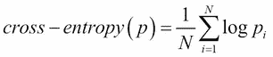
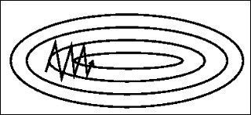

# 第二章：使用前馈网络分类手写数字

第一章介绍了 Theano 作为一个计算引擎，以及它的不同功能和特点。有了这些知识，我们将通过一个例子来介绍深度学习的一些主要概念，并构建三个神经网络，对手写数字分类问题进行训练。

深度学习是机器学习的一个领域，其中模块层被堆叠在彼此之上：本章介绍了一个简单的单线性层模型，然后在其上添加第二层来创建**多层感知器**（**MLP**），最后使用多个卷积层来创建**卷积神经网络**（**CNN**）。

与此同时，本章还为不熟悉数据科学的人回顾了基本的机器学习概念，如过拟合、验证和损失分析：

+   小型图像分类

+   手写数字识别挑战

+   层设计以构建神经网络

+   设计经典目标/损失函数

+   使用随机梯度下降的反向传播

+   在验证集上训练数据集

+   卷积神经网络

+   朝向手写数字分类的最新结果

# MNIST 数据集

**修改后的国家标准技术研究所**（**MNIST**）**数据集**是一个非常著名的手写数字数据集 {0,1,2,3,4,5,6,7,8,9}，用于训练和测试分类模型。

分类模型是一个根据输入预测类别观察概率的模型。

训练是*学习*参数，使模型尽可能适合数据，以便对于任何输入图像，都能预测出正确的标签。对于此训练任务，MNIST 数据集包含 60,000 个图像，每个示例有一个目标标签（介于 0 和 9 之间的数字）。

为了验证训练效果并决定何时停止训练，通常将训练数据集分成两个数据集：80%到 90%的图像用于训练，而剩余的 10%到 20%的图像则不会用于训练算法，而是用于验证模型在未观察数据上的泛化能力。

在训练过程中，应该避免看到的另一个单独的数据集，称为测试集，在 MNIST 数据集中包含 10,000 个图像。

在 MNIST 数据集中，每个示例的输入数据是一个 28x28 的归一化单色图像和一个标签，表示每个示例的简单整数介于 0 和 9 之间。让我们展示其中一些：

1.  首先，下载一个预打包版本的数据集，这样可以更容易地从 Python 中加载：

    ```py
    wget http://www.iro.umontreal.ca/~lisa/deep/data/mnist/mnist.pkl.gz -P /sharedfiles
    ```

1.  然后将数据加载到 Python 会话中：

    ```py
    import pickle, gzip
    with gzip.open("/sharedfiles/mnist.pkl.gz", 'rb') as f:
       train_set, valid_set, test_set = pickle.load(f)
    ```

    对于 `Python3`，由于其序列化方式，我们需要使用 `pickle.load(f, encoding='latin1')`。

    ```py
    train_set[0].shape
    *(50000, 784)*

    train_set[1].shape
    *(50000,)*

    import matplotlib

    import numpy 

    import matplotlib.pyplot as plt

    plt.rcParams['figure.figsize'] = (10, 10)

    plt.rcParams['image.cmap'] = 'gray'

    for i in range(9):
        plt.subplot(1,10,i+1)
        plt.imshow(train_set[0][i].reshape(28,28))
        plt.axis('off')
        plt.title(str(train_set[1][i]))

    plt.show()
    ```

数据集的前九个样本显示了相应的标签（*地面实况*，即分类算法预期的正确答案）：


为了避免过多的数据传输到 GPU，并且由于整个数据集足够小，能够适应 GPU 的内存，我们通常将整个训练集放入共享变量中：

```py
import theano
train_set_x = theano.shared(numpy.asarray(train_set[0], dtype=theano.config.floatX))
train_set_y = theano.shared(numpy.asarray(train_set[1], dtype='int32'))
```

避免这些数据传输可以让我们在 GPU 上更快地进行训练，尽管最近的 GPU 和高速 PCIe 连接也在帮助提升速度。

更多关于数据集的信息请访问 [`yann.lecun.com/exdb/mnist/`](http://yann.lecun.com/exdb/mnist/)。

# 训练程序结构

训练程序的结构总是包含以下步骤：

1.  **设置脚本环境**：例如包的导入、GPU 的使用等。

1.  **加载数据**：数据加载器类，用于在训练期间访问数据，通常是随机顺序，以避免出现过多相似类别的示例，但有时也可能是精确顺序，例如在课程学习中，先使用简单示例，最后使用复杂示例。

1.  **预处理数据**：一组转换操作，例如交换图像的维度、添加模糊或噪声。常见的做法是添加一些数据增强转换，比如随机裁剪、缩放、亮度或对比度波动，从而获得比原始数据更多的示例，并减少过拟合的风险。如果模型中自由参数的数量相对于训练数据集的大小过多，模型可能会仅从可用示例中学习。而且，如果数据集太小并且对同一数据进行了过多的迭代，模型可能会过于特定于训练示例，而在新的未见过的示例上泛化能力较差。

1.  **构建模型**：定义模型结构，并在持久变量（共享变量）中设置参数，以便在训练过程中更新其值，从而拟合训练数据。

1.  **训练**：有不同的算法，可以是对整个数据集进行训练，也可以是逐个示例进行逐步训练。通常，最佳的收敛效果是通过对批量进行训练实现的，批量是将一小部分示例分组在一起，数量从几十个到几百个不等。

    使用批量的另一个原因是提高 GPU 的训练速度，因为单独的数据传输成本较高，并且 GPU 内存不足以容纳整个数据集。GPU 是并行架构，因此处理一个批次的示例通常比逐个处理示例更快，直到达到某个点。一次性查看更多示例可以加速收敛（以墙时间为准），直到达到某个点。即使 GPU 内存足够大，可以容纳整个数据集，这一点也是成立的：批量大小的收益递减通常使得使用较小的批量比使用整个数据集更快。需要注意的是，这对于现代 CPU 也是成立的，但最优的批量大小通常较小。

    ### 注意

    一次迭代定义了对一个批次的训练。一个 epoch 是算法查看完整数据集所需的迭代次数。

1.  在训练过程中，在一定数量的迭代后，通常会使用训练数据的拆分或未用于学习的验证数据集进行**验证**。在该验证集上计算损失。尽管算法的目标是减少给定训练数据的损失，但它并不保证能在未见数据上进行泛化。验证数据是未见过的数据，用于估算泛化性能。当训练数据不具代表性、存在异常且未正确抽样，或模型过拟合训练数据时，可能会发生泛化不足的情况。

    验证数据验证一切是否正常，并在验证损失不再下降时停止训练，即使训练损失可能继续下降：进一步的训练已不再有价值，并可能导致过拟合。

1.  **保存模型参数**并显示结果，如最佳训练/验证损失值、用于收敛分析的训练损失曲线。

    在分类问题中，我们在训练过程中计算准确率（正确分类的百分比）或错误率（错误分类的百分比），以及损失。训练结束时，混淆矩阵有助于评估分类器的质量。

    让我们在实践中看看这些步骤，并在 Python shell 会话中启动 Theano 会话：

    ```py
    from theano import theano
    import theano.tensor as T
    ```

# 分类损失函数

损失函数是一个目标函数，在训练过程中最小化它以获得最佳模型。存在许多不同的损失函数。

在分类问题中，目标是在 k 个类别中预测正确类别，交叉熵通常被用作损失函数，因为它衡量的是每个类别的真实概率分布 `q` 和预测概率分布 `p` 之间的差异：


在这里，`i`是数据集中的样本索引，`n`是数据集中的样本数量，`k`是类别的数量。

虽然每个类别的真实概率  是未知的，但在实践中它可以通过经验分布来简单地近似，即按数据集顺序从数据集中随机抽取样本。同样，任何预测概率`p`的交叉熵也可以通过经验交叉熵来近似：



在这里， 是模型为正确类别示例  估算的概率。

准确率和交叉熵都朝着相同的方向发展，但衡量的是不同的内容。准确率衡量预测类别的正确性，而交叉熵衡量概率之间的距离。交叉熵的下降说明预测正确类别的概率变得更高，但准确率可能保持不变或下降。

虽然准确率是离散的且不可微分，但交叉熵损失是一个可微分的函数，便于用于模型训练。

# 单层线性模型

最简单的模型是线性模型，其中对于每个类别`c`，输出是输入值的线性组合：


这个输出是无界的。

为了得到一个概率分布，`pᵢ`，其总和为 1，线性模型的输出被传入 softmax 函数：


因此，类`c`对输入`x`的估计概率可以用向量重写：


在 Python 中的实现如下：

```py
batch_size = 600
n_in = 28 * 28
n_out = 10

x = T.matrix('x')
y = T.ivector('y')
W = theano.shared(
            value=numpy.zeros(
                (n_in, n_out),
                dtype=theano.config.floatX
            ),
            name='W',
            borrow=True
        )
b = theano.shared(
    value=numpy.zeros(
        (n_out,),
        dtype=theano.config.floatX
    ),
    name='b',
    borrow=True
)
model = T.nnet.softmax(T.dot(x, W) + b)
```

给定输入的预测由最可能的类别（最大概率）给出：

```py
y_pred = T.argmax(model, axis=1)
```

在这个单层线性模型中，信息从输入到输出流动：它是一个**前馈网络**。给定输入计算输出的过程称为**前向传播**。

这个层被称为全连接层，因为所有的输出，，是通过一个乘法系数将所有输入值的和连接在一起：


# 成本函数和错误

给定模型预测的概率，成本函数如下：

```py
cost = -T.mean(T.log(model)[T.arange(y.shape[0]), y])
```

错误是与真实类别不同的预测数量，按总值数量平均，可以写成一个均值：

```py
error = T.mean(T.neq(y_pred, y))
```

相反，准确率是正确预测的数量除以总预测数。错误和准确率的总和为 1。

对于其他类型的问题，以下是一些其他的损失函数及实现：

| **分类交叉熵**我们实现的等效版本 |
| --- |

```py
T.nnet.categorical_crossentropy(model, y_true).mean()
```

|

| **二元交叉熵**当输出只能取两个值{0,1}时，通常在使用 sigmoid 激活预测概率 p 后使用 |
| --- |

```py
T.nnet.binary_crossentropy(model, y_true).mean()
```

|

| **均方误差**回归问题的 L2 范数 |
| --- |

```py
T.sqr(model – y_true).mean()
```

|

| **均绝对误差**回归问题的 L1 范数 |
| --- |

```py
T.abs_(model - y_true).mean()
```

|

| **平滑 L1**L1 用于大值，L2 用于小值，通常作为回归问题中的抗异常值损失 |
| --- |

```py
T.switch(
   T.lt(T.abs_(model - y_true) , 1\. / sigma), 
   0.5 * sigma * T.sqr(model - y_true),
   T.abs_(model - y_true) – 0.5 / sigma )
.sum(axis=1).mean()
```

|

| **平方铰链损失**特别用于无监督问题 |
| --- |

```py
T.sqr(T.maximum(1\. - y_true * model, 0.)).mean()
```

|

| **铰链损失** |
| --- |

```py
T.maximum(1\. - y_true * model, 0.).mean()
```

|

# 反向传播和随机梯度下降

反向传播，或称为误差的反向传播，是最常用的监督学习算法，用于调整连接权重。

将错误或成本视为权重`W`和`b`的函数，可以通过梯度下降接近成本函数的局部最小值，梯度下降的过程是沿着负错误梯度改变权重：


这里，是学习率，一个正的常数，定义了下降的速度。

以下编译的函数在每次前馈运行后更新变量：

```py
g_W = T.grad(cost=cost, wrt=W)
g_b = T.grad(cost=cost, wrt=b)

learning_rate=0.13
index = T.lscalar()

train_model = theano.function(
    inputs=[index],
    outputs=[cost,error],
    updates=[(W, W - learning_rate * g_W),(b, b - learning_rate * g_b)],
    givens={
        x: train_set_x[index * batch_size: (index + 1) * batch_size],
        y: train_set_y[index * batch_size: (index + 1) * batch_size]
    }
)
```

输入变量是批次的索引，因为所有数据集已经通过一次传递转移到 GPU 中的共享变量。

训练过程包括将每个样本迭代地呈现给模型（迭代次数），并多次重复操作（训练周期）：

```py
n_epochs = 1000
print_every = 1000

n_train_batches = train_set[0].shape[0] // batch_size
n_iters = n_epochs * n_train_batches
train_loss = np.zeros(n_iters)
train_error = npzeros(n_iters)

for epoch in range(n_epochs):
    for minibatch_index in range(n_train_batches):
        iteration = minibatch_index + n_train_batches * epoch
        train_loss[iteration], train_error[iteration] = train_model(minibatch_index)
        if (epoch * train_set[0].shape[0] + minibatch_index) % print_every == 0 :
            print('epoch {}, minibatch {}/{}, training error {:02.2f} %, training loss {}'.format(
                epoch,
                minibatch_index + 1,
                n_train_batches,
                train_error[iteration] * 100,
                train_loss[iteration]
            ))
```

这只报告了一个小批次的损失和误差，最好还能够报告整个数据集上的平均值。

在前几次迭代中，误差率快速下降，然后逐渐放缓。

在一台 GPU GeForce GTX 980M 笔记本电脑上的执行时间是 67.3 秒，而在 Intel i7 CPU 上的时间为 3 分钟 7 秒。

经过一段时间后，模型收敛到 5.3% - 5.5% 的误差率，再进行几轮迭代可能会进一步下降，但也可能导致过拟合。过拟合是指模型很好地拟合了训练数据，但在未见过的数据上表现不佳，误差率较高。

在这种情况下，模型过于简单，无法对这些数据进行过拟合。

一个过于简单的模型无法很好地学习。深度学习的原则是添加更多的层，也就是增加深度，构建更深的网络，以获得更好的准确性。

我们将在接下来的部分看到如何计算模型准确度的更好估计以及训练停止的时机。

# 多层模型

**多层感知器**（**MLP**）是一个具有多层的前馈神经网络。在前面的例子中，增加了一个第二个线性层，称为隐藏层：


两个线性层紧跟在一起等同于一个线性层。

使用*非线性函数、非线性或转换函数*在各线性之间，模型不再简化为线性模型，并表示更多可能的函数，以捕捉数据中更复杂的模式：


激活函数有助于饱和（开-关），并重现生物神经元的激活。

**Rectified Linear Unit**（**ReLU**）的图形如下所示：

*(x + T.abs_(x)) / 2.0*


**Leaky Rectifier Linear Unit**（**Leaky ReLU**）的图形如下所示：

*((1 + leak) * x + (1 – leak) * T.abs_(x)) / 2.0*


在这里，`leak` 是一个参数，定义了负值部分的斜率。在泄漏整流器中，这个参数是固定的。

名为 PReLU 的激活函数考虑了需要学习的 `leak` 参数。

更一般地说，可以通过添加一个线性层，然后是 `n_pool` 单元的最大化激活，来学习分段线性激活：

```py
T.max([x[:, n::n_pool] for n in range(n_pool)], axis=0)
```

这将输出 `n_pool` 个值或单元，代表底层学习到的线性关系：

**Sigmoid**（T.nnet.sigmoid）


**HardSigmoid** 函数表示为：

*T.clip(X + 0.5, 0., 1.)*


**HardTanh** 函数表示为：

*T.clip(X, -1., 1.)*


**Tanh** 函数定义如下：

*T.tanh(x)*


这个用 Python 编写的两层网络模型如下：

```py
batch_size = 600
n_in = 28 * 28
n_hidden = 500
n_out = 10

def shared_zeros(shape, dtype=theano.config.floatX, name='', n=None):
    shape = shape if n is None else (n,) + shape
    return theano.shared(np.zeros(shape, dtype=dtype), name=name)

def shared_glorot_uniform(shape, dtype=theano.config.floatX, name='', n=None):
    if isinstance(shape, int):
        high = np.sqrt(6\. / shape)
    else:
        high = np.sqrt(6\. / (np.sum(shape[:2]) * np.prod(shape[2:])))
    shape = shape if n is None else (n,) + shape
    return theano.shared(np.asarray(
        np.random.uniform(
            low=-high,
            high=high,
            size=shape),
        dtype=dtype), name=name)

W1 = shared_glorot_uniform( (n_in, n_hidden), name='W1' )
b1 = shared_zeros( (n_hidden,), name='b1' )

hidden_output = T.tanh(T.dot(x, W1) + b1)

W2 = shared_zeros( (n_hidden, n_out), name='W2' )
b2 = shared_zeros( (n_out,), name='b2' )

model = T.nnet.softmax(T.dot(hidden_output, W2) + b2)
params = [W1,b1,W2,b2]
```

在深度网络中，如果权重通过 `shared_zeros` 方法初始化为零，信号将无法从头到尾正确流过网络。如果权重初始化为过大的值，经过几步后，大多数激活函数将会饱和。所以，我们需要确保在传播过程中值能够传递到下一层，并且在反向传播过程中，梯度能够传递到上一层。

我们还需要打破神经元之间的对称性。如果所有神经元的权重都为零（或者它们都相等），它们将以完全相同的方式发展，模型将无法学习到很多东西。

研究员 Xavier Glorot 研究了一种算法来以最优方式初始化权重。该算法通过从均值为零的高斯或均匀分布中抽取权重，方差如下：


这是前述公式中的变量：

+   `n[in]` 是该层在前向传播过程中接收到的输入数量

+   `n[out]` 是该层在反向传播过程中接收到的梯度数量

在线性模型中，形状参数是一个元组，`v` 就是 `numpy.sum(shape[:2])`（在这种情况下，`numpy.prod(shape[2:])` 为 `1`）。

均匀分布在 *[-a, a]* 上的方差为 `a`*2 / 3*，那么可以通过以下方式计算边界 `a`：


成本可以像以前一样定义，但梯度下降需要适应处理参数列表 `[W1,b1,W2,b2]`：

```py
g_params = T.grad(cost=cost, wrt=params)
```

训练循环需要一个更新的训练函数：

```py
learning_rate = 0.01
updates = [
        (param, param - learning_rate * gparam)
        for param, gparam in zip(params, g_params)
    ]

train_model = theano.function(
    inputs=[index],
    outputs=cost,
    updates=updates,
    givens={
        x: train_set_x[index * batch_size: (index + 1) * batch_size],
        y: train_set_y[index * batch_size: (index + 1) * batch_size]
    }
)
```

在这种情况下，学习率对整个网络是全局的，所有权重以相同的速率更新。学习率设置为 0.01，而不是 0.13。我们将在训练部分讨论超参数调优。

训练循环保持不变。完整的代码见`2-multi.py`文件。

在 GPU 上的执行时间为 5 分钟 55 秒，而在 CPU 上为 51 分钟 36 秒。

在 1000 次迭代后，误差降至 2%，比之前的 5% 错误率要好得多，但其中一部分可能是由于过拟合造成的。我们稍后会比较不同的模型。

# 卷积和最大池化层

在 MNIST 数据集上，卷积层的发明使得图像分类取得了巨大的进展：


与之前的全连接层对输入的所有值（图像的像素值）进行计算不同，2D 卷积层将仅考虑 2D 输入图像中 NxN 像素的小块、窗口或感受野来计算每个输出单元。该块的尺寸被称为卷积核尺寸，N 为卷积核大小，系数/参数即为卷积核。

在输入图像的每个位置，卷积核都会生成一个标量，所有位置的值将形成一个矩阵（2D 张量），称为 *特征图*。在输入图像上进行卷积操作，像滑动窗口一样，生成一个新的输出图像。卷积核的步幅定义了在图像上移动补丁/窗口的像素数：步幅为 2 时，卷积核每隔 2 个像素计算一次卷积。

例如，在一个 224 x 224 的输入图像上，我们得到如下结果：

+   一个 2x2 的卷积核，步幅为 1，将输出一个 223 x 223 的特征图。

+   一个 3x3 的卷积核，步幅为 1，将输出一个 222 x 222 的特征图。

为了保持输出特征图与输入图像相同的尺寸，有一种叫做 *same* 或 *half* 的零填充方法，可以实现以下效果：

+   在输入图像的末尾添加一行一列零，适用于步幅为 1 的 2x2 卷积核。

+   在输入图像的上下左右分别添加两行两列零，适用于步幅为 1 的 3x3 卷积核。

所以，输出的尺寸与原始尺寸相同，也就是一个 224 x 224 的特征图。

有零填充时：

+   一个 2x2 的卷积核，步幅为 2，并且有零填充，将输出一个 112 x 112 的特征图。

+   一个 3x3 的卷积核，步幅为 2，将输出一个 112 x 112 的特征图。

如果没有零填充，事情会变得更复杂：

+   一个 2x2 的卷积核，步幅为 2，将输出一个 112 x 112 的特征图。

+   一个 3x3 的卷积核，步幅为 2，将输出一个 111 x 111 的特征图。

请注意，卷积核的尺寸和步长在每个维度上可能不同。在这种情况下，我们说卷积核的宽度、卷积核的高度、步幅宽度或步幅高度。

在一个卷积层中，可能输出多个特征图，每个特征图是用不同的卷积核（和卷积核权重）计算出来的，表示一个特征。我们可以用输出、神经元、卷积核、特征、特征图、单元或输出通道来表示这些不同卷积的数量。严格来说，神经元通常指的是特征图中的一个特定位置。卷积核就是卷积核本身，其他的则是卷积操作的结果。它们的数量是相同的，这就是这些词常常用来描述相同内容的原因。我将使用通道、输出和特征这几个词。

常见的卷积运算符可以应用于多通道输入。这使得它们可以应用于三通道图像（例如 RGB 图像）或另一个卷积的输出，以便进行级联。

让我们在前面的 MLP 模型前面添加两个卷积层，卷积核大小为 5：


2D 卷积操作需要 4D 张量输入。第一维是批量大小，第二维是输入数量或输入通道数（采用“通道优先”格式），第三和第四维是特征图的两个维度（采用“通道后置”格式，通道是最后一个维度）。MNIST 灰度图像（一个通道）以一维向量存储，需要转换为 28x28 的矩阵，其中 28 是图像的高度和宽度：

```py
layer0_input = x.reshape((batch_size, 1, 28, 28))
```

然后，在变换后的输入上添加一个 20 通道的第一个卷积层，得到如下结果：

```py
from theano.tensor.nnet import conv2d

n_conv1 = 20

W1 = shared_glorot_uniform( (n_conv1, 1, 5, 5) )

conv1_out = conv2d(
    input=layer0_input,
    filters=W1,
    filter_shape=(n_conv1, 1, 5, 5),
    input_shape=(batch_size, 1, 28, 28)
)
```

在这种情况下，Xavier 初始化（以其发明者 Xavier Glorot 的名字命名）将输入/输出通道的数量与卷积核中的参数数量相乘，`numpy.prod(shape[2:]) = 5 x 5 = 25`，从而得到初始化公式中输入/输出梯度的总数。

在 28x28 的输入上使用大小为 5x5，步幅为 1 的 20 个卷积核将产生 20 个 24x24 的特征图。所以第一个卷积层的输出是（`batch_size,20,24,24`）。

最佳性能的网络使用最大池化层，以鼓励平移不变性并提高对噪声的稳定性。最大池化层在滑动窗口/补丁上执行最大操作，仅保留补丁中的一个值。除了提高速度性能外，它还减少了特征图的大小，总体计算复杂度和训练时间也因此降低：

```py
from theano.tensor.signal import pool
pooled_out = pool.pool_2d(input=conv1_out, ws=(2, 2), ignore_border=True)
```

2x2 最大池化层的输出将是（`batch_size,20,12,12`）。批量大小和通道数保持不变，只有特征图的大小发生了变化。

在前一个卷积层之上添加一个 50 通道的第二个卷积层和最大池化层，得到的输出尺寸为（`batch_size,50,4,4`）：

```py
n_conv2 = 50

W2 = shared_glorot_uniform( (n_conv2, n_conv1, 5, 5) )

conv2_out = conv2d(
    input=pooled_out,
    filters=W2,
    filter_shape=(n_conv2, n_conv1, 5, 5),
    input_shape=(batch_size, n_conv1, 12, 12)
)

pooled2_out = pool.pool_2d(input=conv2_out, ds=(2, 2),ignore_border=True)
```

为了创建分类器，我们在上面连接一个具有两个全连接线性层和一个 softmax 的 MLP，如前所示：

```py
hidden_input = pooled2_out.flatten(2)

n_hidden = 500

W3 = shared_zeros( (n_conv2 * 4 * 4, n_hidden), name='W3' )
b3 = shared_zeros( (n_hidden,), name='b3' )

hidden_output = T.tanh(T.dot(hidden_input, W3) + b3)

n_out = 10

W4 = shared_zeros( (n_hidden, n_out), name='W4' )
b4 = shared_zeros( (n_out,), name='b4' )

model = T.nnet.softmax(T.dot(hidden_output, W4) + b4)
params = [W1,W2,W3,b3,W4,b4]
```

这样的模型被称为**卷积神经网络**（**CNN**）。

完整的代码可以在`3-cnn.py`文件中找到。

训练速度大大变慢，因为参数数量又被乘以了，使用 GPU 变得更加有意义：在 GPU 上训练的总时间已增加至 1 小时 48 分钟 27 秒。若在 CPU 上训练，将需要数天。

经过几次迭代后，训练误差为零，部分原因是过拟合。接下来我们将看到如何计算测试损失和准确度，以更好地解释模型的效率。

# 训练

为了得到模型在训练过程中未见数据上的表现的良好度量，使用验证数据集来计算训练过程中的验证损失和准确度。

验证数据集使我们能够选择最佳模型，而测试数据集仅在最后用于获得模型的最终测试准确率/错误率。训练、测试和验证数据集是离散的数据集，没有共同的示例。验证数据集通常是测试数据集的十分之一，以尽量减少对训练过程的影响。测试数据集通常占训练数据集的 10%-20%。训练集和验证集都是训练程序的一部分，因为第一个用于学习，第二个则用于在训练时选择最佳模型，以便在未见数据上进行验证。

测试数据集完全独立于训练过程，仅用于获得经过训练和模型选择后的最终模型的准确性。

如果模型因在相同图像上训练次数过多而过拟合训练集，例如，那么验证集和测试集将不会受到这种行为的影响，并将提供模型准确性的真实估计。

通常，验证函数是编译时不更新模型梯度的，仅计算输入批次的成本和误差。

数据批次*(x,y)*通常在每次迭代时传输到 GPU，因为数据集通常太大，无法完全放入 GPU 的内存中。在这种情况下，我们仍然可以使用共享变量的技巧将整个验证数据集放入 GPU 的内存中，但让我们看看如果每步都必须将批次传输到 GPU 而不使用之前的技巧，我们该如何操作。我们将使用更常见的形式：

```py
validate_model = theano.function(
    inputs=[x,y],
    outputs=[cost,error]
)
```

这需要批次输入的传输。验证不是在每次迭代时计算，而是在训练的`for`循环中的`validation_interval`次迭代时计算：

```py
if iteration % validation_interval == 0 :
    val_index = iteration // validation_interval
    valid_loss[val_index], valid_error[val_index] = np.mean([
            validate_model(
                valid_set[0][i * batch_size: (i + 1) * batch_size],
                numpy.asarray(valid_set[1][i * batch_size: (i + 1) * batch_size], dtype="int32")
                )
                for i in range(n_valid_batches)
             ], axis=0)
```

让我们看看简单的第一个模型：

```py
epoch 0, minibatch 1/83, validation error 40.05 %, validation loss 2.16520105302

epoch 24, minibatch 9/83, validation error 8.16 %, validation loss 0.288349323906
epoch 36, minibatch 13/83, validation error 7.96 %, validation loss 0.278418215923
epoch 48, minibatch 17/83, validation error 7.73 %, validation loss 0.272948684171
epoch 60, minibatch 21/83, validation error 7.65 %, validation loss 0.269203903154
epoch 72, minibatch 25/83, validation error 7.59 %, validation loss 0.26624627877
epoch 84, minibatch 29/83, validation error 7.56 %, validation loss 0.264540277421
...
epoch 975, minibatch 76/83, validation error 7.10 %, validation loss 0.258190142922
epoch 987, minibatch 80/83, validation error 7.09 %, validation loss 0.258411859162
```

在完整的训练程序中，验证间隔与总的训练周期数相对应，且周期的平均验证得分更有意义。

为了更好地评估训练效果，让我们绘制训练损失和验证损失的曲线。为了显示早期迭代中的下降情况，我会在 100 次迭代时停止绘图。如果我在图中使用 1,000 次迭代，就看不到早期迭代的情况：


训练损失看起来像一条宽带，因为它在不同的值之间波动。每个值对应一个批次。该批次可能太小，无法提供稳定的损失值。通过整个周期的训练损失平均值，将提供一个更稳定的值，与验证损失进行比较，展示是否发生过拟合。

还需要注意，损失曲线提供了网络收敛情况的信息，但并不提供任何关于错误的有价值信息。因此，绘制训练误差和验证误差也非常重要。

对于第二个模型：

```py
epoch 0, minibatch 1/83, validation error 41.25 %, validation loss 2.35665753484
epoch 24, minibatch 9/83, validation error 10.20 %, validation loss 0.438846310601
epoch 36, minibatch 13/83, validation error 9.40 %, validation loss 0.399769391865
epoch 48, minibatch 17/83, validation error 8.85 %, validation loss 0.379035864025
epoch 60, minibatch 21/83, validation error 8.57 %, validation loss 0.365624915808
epoch 72, minibatch 25/83, validation error 8.31 %, validation loss 0.355733696371
epoch 84, minibatch 29/83, validation error 8.25 %, validation loss 0.348027150147
epoch 96, minibatch 33/83, validation error 8.01 %, validation loss 0.34150374867
epoch 108, minibatch 37/83, validation error 7.91 %, validation loss 0.335878048092
...
epoch 975, minibatch 76/83, validation error 2.97 %, validation loss 0.167824191041
epoch 987, minibatch 80/83, validation error 2.96 %, validation loss 0.167092795949
```

再次，训练曲线提供了更好的洞察：


对于第三个模型：

```py
epoch 0, minibatch 1/83, validation error 53.81 %, validation loss 2.29528842866
epoch 24, minibatch 9/83, validation error 1.55 %, validation loss 0.048202780541
epoch 36, minibatch 13/83, validation error 1.31 %, validation loss 0.0445762014715
epoch 48, minibatch 17/83, validation error 1.29 %, validation loss 0.0432346871821
epoch 60, minibatch 21/83, validation error 1.25 %, validation loss 0.0425786205451
epoch 72, minibatch 25/83, validation error 1.20 %, validation loss 0.0413943211024
epoch 84, minibatch 29/83, validation error 1.20 %, validation loss 0.0416557886347
epoch 96, minibatch 33/83, validation error 1.19 %, validation loss 0.0414686980075
...
epoch 975, minibatch 76/83, validation error 1.08 %, validation loss 0.0477593478863
epoch 987, minibatch 80/83, validation error 1.08 %, validation loss 0.0478142946085
```

请参阅下图：


这里我们看到训练和验证的损失差异，可能是由于稍微的过拟合训练数据，或者训练和测试数据集之间的差异。

过拟合的主要原因如下：

+   **数据集过小**：收集更多的数据。

+   **学习率过高**：网络在早期的样本上学习得太快。

+   **缺乏正则化**：添加更多的 dropout（参见下一节），或在损失函数中对权重的范数施加惩罚。

+   **模型过小**：增加不同层中滤波器/单元的数量。

验证损失和误差比训练损失和误差更能准确估计模型的效果，因为训练损失和误差噪声较大，并且在训练过程中，它们还用来决定哪个模型参数是最优的：

+   **简单模型**：在第 518 个周期时，损失为 6.96%。

+   **MLP 模型**：在第 987 个周期时，损失为 2.96%。

+   **CNN 模型**：在第 722 个周期时，损失为 1.06%。

这些结果也表明，模型在进一步训练后可能不会有太大改进。

这是三种模型验证损失的比较：


注意，MLP 模型仍在改进中，训练尚未结束，而 CNN 和简单网络已经收敛。

使用已选择的模型，您可以轻松计算测试数据集上的测试损失和误差，从而最终确定模型。

机器学习的最后一个重要概念是超参数调优。超参数定义了在训练过程中未学习到的模型参数。以下是一些示例：

```py
learning rate
number of hidden neurons
batch size
```

对于学习率，下降过慢可能会阻止找到更全局的最小值，而下降过快则会破坏最终的收敛。找到最佳的初始学习率至关重要。然后，通常会在多次迭代后降低学习率，以便更精确地微调模型。

超参数选择要求我们为不同的超参数值运行多次前面的实验；测试所有超参数的组合可以通过简单的网格搜索来实现。

这里有一个供读者练习的题目：

+   使用不同的超参数训练模型，并绘制训练损失曲线，以观察超参数如何影响最终损失。

+   在模型训练完成后，您可以可视化第一层神经元的内容，以查看神经元从输入图像中提取的特征。为此任务，编写一个特定的可视化函数：

    ```py
    visualize_layer1 = theano.function(
        inputs=[x,y],
        outputs=conv1_out
    )
    ```

# Dropout

Dropout 是一种广泛使用的技术，用于提高神经网络的收敛性和鲁棒性，并防止神经网络过拟合。它通过将一些随机值设置为零，应用于我们希望其作用的层。它在每个周期引入一些数据的随机性。

通常，dropout 用于全连接层之前，而在卷积层中使用得比较少。我们在两个全连接层之前添加以下代码：

```py
dropout = 0.5

if dropout > 0 :
    mask = srng.binomial(n=1, p=1-dropout, size=hidden_input.shape)
    # The cast is important because
    # int * float32 = float64 which make execution slower
    hidden_input = hidden_input * T.cast(mask, theano.config.floatX)
```

完整的脚本位于`5-cnn-with-dropout.py`。经过 1,000 次迭代后，带有 dropout 的 CNN 的验证误差降至 1.08%，而不带 dropout 的 CNN 的验证误差则停留在 1.22%。

想要深入了解 dropout 的读者，应该看看 maxout 单元。它们与 dropout 一起工作，并替换 tanh 非线性函数，以获得更好的结果。由于 dropout 执行了一种模型平均，maxout 单元试图找到问题的最佳非线性函数。

# 推理

推理是使用模型进行预测的过程。

对于推理，权重参数不需要更新，因此推理函数比训练函数更为简洁：

```py
infer_model = theano.function(
    inputs=[x],
    outputs=[y_pred]
)
```

# 优化和其他更新规则

学习率是一个非常重要的参数，必须正确设置。学习率过低会使得学习变得困难，且训练速度较慢；而学习率过高则会增加对异常值的敏感性，增加数据中的噪声，训练过快而无法进行有效的泛化，且可能陷入局部最小值：


当训练损失在一个或几个迭代后不再改进时，可以通过一个因子降低学习率：


它有助于网络学习数据中的细粒度差异，正如在训练残差网络时所展示的那样（第七章，*使用残差网络进行图像分类*）：


为了检查训练过程，通常会打印参数的范数、梯度和更新，以及 NaN 值。

本章中看到的更新规则是最简单的更新形式，称为**随机梯度下降法**（**SGD**）。为了避免饱和和 NaN 值，通常会将范数裁剪。传递给`theano`函数的更新列表如下：

```py
def clip_norms(gs, c):
    norm = T.sqrt(sum([T.sum(g**2) for g in gs]))
    return [ T.switch(T.ge(norm, c), g*c/norm, g) for g in gs]

updates = []
grads = T.grad(cost, params)
grads = clip_norms(grads, 50)
for p,g in zip(params,grads):
    updated_p = p - learning_rate * g
    updates.append((p, updated_p))
```

一些非常简单的变体已被尝试用来改进下降，并在许多深度学习库中提出。我们来看一下它们在 Theano 中的实现。

**动量**

对于每个参数，都会从累积的梯度中计算动量（`v`，作为速度），并使用时间衰减。之前的动量值会乘以一个介于 0.5 和 0.9 之间的衰减参数（需交叉验证），然后与当前的梯度相加，得到新的动量值。

梯度的动量在更新中起到了惯性力矩的作用，从而加速学习。其思路是，连续梯度中的振荡会在动量中被抵消，使得参数朝着解决方案的更直接路径移动：



介于 0.5 和 0.9 之间的衰减参数是一个超参数，通常被称为动量，这里存在一种语言上的滥用：

```py
updates = []
grads = T.grad(cost, params)
grads = clip_norms(grads, 50)
for p,g in zip(params,grads):
    m = theano.shared(p.get_value() * 0.)
    v = (momentum * m) - (learning_rate * g)
    updates.append((m, v))
    updates.append((p, p + v))
```

**Nesterov 加速梯度**

不是将`v`加到参数上，而是将动量`v - learning_rate g`的未来值直接加到参数上，以便在下一次迭代中直接计算下一位置的梯度：

```py
updates = []
grads = T.grad(cost, params)
grads = clip_norms(grads, 50)
for p, g in zip(params, grads):
    m = theano.shared(p.get_value() * 0.)
    v = (momentum * m) - (learning_rate * g)
    updates.append((m,v))
    updates.append((p, p + momentum * v - learning_rate * g))
```

**Adagrad**

这个更新规则，以及接下来的规则，包含了**逐参数**（对每个参数不同）地调整学习率。梯度的元素级平方和被积累到每个参数的共享变量中，以便按元素方式衰减学习率：

```py
updates = []
grads = T.grad(cost, params)
grads = clip_norms(grads, 50)
for p,g in zip(params,grads):
    acc = theano.shared(p.get_value() * 0.)
    acc_t = acc + g ** 2
    updates.append((acc, acc_t))
    p_t = p - (learning_rate / T.sqrt(acc_t + 1e-6)) * g
    updates.append((p, p_t))
```

`Adagrad`是一种激进的方法，接下来的两个规则，`AdaDelta`和`RMSProp`，尝试减少它的激进性。

**AdaDelta**

为每个参数创建两个累加器，用来积累平方梯度和移动平均中的更新，由衰减`rho`来参数化：

```py
updates = []
grads = T.grad(cost, params)
grads = clip_norms(grads, 50)
for p,g in zip(params,grads):
    acc = theano.shared(p.get_value() * 0.)
    acc_delta = theano.shared(p.get_value() * 0.)
    acc_new = rho * acc + (1 - rho) * g ** 2
    updates.append((acc,acc_new))
    update = g * T.sqrt(acc_delta + 1e-6) / T.sqrt(acc_new + 1e-6)
    updates.append((p, p - learning_rate * update))
    updates.append((acc_delta, rho * acc_delta + (1 - rho) * update ** 2))
```

**RMSProp**

这个更新规则在许多情况下非常有效。它是`Adagrad`更新规则的改进，使用移动平均（由`rho`参数化）来获得较少的激进衰减：

```py
updates = []
grads = T.grad(cost, params)
grads = clip_norms(grads, 50)
for p,g in zip(params,grads):
    acc = theano.shared(p.get_value() * 0.)
    acc_new = rho * acc + (1 - rho) * g ** 2
    updates.append((acc, acc_new))
    updated_p = p - learning_rate * (g / T.sqrt(acc_new + 1e-6))
    updates.append((p, updated_p))
```

**Adam**

这是带动量的`RMSProp`，是最好的学习规则选择之一。时间步长由共享变量`t`跟踪。计算了两个移动平均，一个用于过去的平方梯度，另一个用于过去的梯度：

```py
b1=0.9, b2=0.999, l=1-1e-8
updates = []
grads = T.grad(cost, params)
grads = clip_norms(grads, 50)  
t = theano.shared(floatX(1.))
b1_t = b1 * l **(t-1)

for p, g in zip(params, grads):
    m = theano.shared(p.get_value() * 0.)
    v = theano.shared(p.get_value() * 0.)
    m_t = b1_t * m + (1 - b1_t) * g
    v_t = b2 * v + (1 - b2) * g**2 
    updates.append((m, m_t))
    updates.append((v, v_t))
    updates.append((p, p - (learning_rate * m_t / (1 - b1**t)) / (T.sqrt(v_t / (1 - b2**t)) + 1e-6)) )
updates.append((t, t + 1.))
```

总结一下更新规则，许多最近的研究论文仍然更倾向于使用简单的 SGD 规则，并通过正确的学习率来调整网络架构和层的初始化。对于更复杂的网络，或者当数据稀疏时，适应性学习率方法更好，可以避免你在寻找合适学习率时的痛苦。

# 相关文章

你可以参考以下文档，获取更多关于本章涵盖主题的见解：

+   *Deeplearning.net Theano 教程：单层*（[`deeplearning.net/tutorial/logreg.html`](http://deeplearning.net/tutorial/logreg.html)），MLP（[`deeplearning.net/tutorial/mlp.html`](http://deeplearning.net/tutorial/mlp.html)），卷积（[`deeplearning.net/tutorial/lenet.html`](http://deeplearning.net/tutorial/lenet.html)）

+   所有损失函数：用于分类、回归和联合嵌入（[`christopher5106.github.io/deep/learning/2016/09/16/about-loss-functions-multinomial-logistic-logarithm-cross-entropy-square-errors-euclidian-absolute-frobenius-hinge.html`](http://christopher5106.github.io/deep/learning/2016/09/16/about-loss-functions-multinomial-logistic-logarithm-cross-entropy-square-errors-euclidian-absolute-frobenius-hinge.html)）

+   最后一个例子对应于 Yann Lecun 的五层网络，如在《基于梯度的学习应用于文档识别》一文中所示（[`yann.lecun.com/exdb/publis/pdf/lecun-98.pdf`](http://yann.lecun.com/exdb/publis/pdf/lecun-98.pdf)）

+   理解训练深度前馈神经网络的难度，Xavier Glorot, Yoshua Bengio，2010

+   Maxout 网络：Ian J. Goodfellow，David Warde-Farley，Mehdi Mirza，Aaron Courville，Yoshua Bengio 2013

+   梯度下降算法概述：[`sebastianruder.com/optimizing-gradient-descent/`](http://sebastianruder.com/optimizing-gradient-descent/)

+   CS231n 视觉识别卷积神经网络，[`cs231n.github.io/neural-networks-3/`](http://cs231n.github.io/neural-networks-3/)

+   是的，你应该理解反向传播，Andrej Karpathy，2016，[`medium.com/@karpathy/`](https://medium.com/@karpathy/)

+   追求简单：全卷积网络，Jost Tobias Springenberg，Alexey Dosovitskiy，Thomas Brox，Martin Riedmiller，2014

+   分数最大池化，Benjamin Graham，2014

+   批量归一化：通过减少内部协变量偏移加速深度网络训练，Sergey Ioffe，Christian Szegedy，2015

+   可视化与理解卷积网络，Matthew D Zeiler，Rob Fergus，2013

+   深入卷积，Christian Szegedy，Wei Liu，Yangqing Jia，Pierre Sermanet，Scott Reed，Dragomir Anguelov，Dumitru Erhan，Vincent Vanhoucke，Andrew Rabinovich，2014

# 摘要

分类是机器学习中一个非常广泛的话题。它包括预测一个类别或一个类，如我们在手写数字示例中所展示的那样。在第七章，*使用残差网络分类图像*，我们将看到如何分类更广泛的自然图像和物体。

分类可以应用于不同的问题，交叉熵/负对数似然是通过梯度下降解决这些问题的常见损失函数。对于回归问题（均方误差损失）或无监督联合学习（铰链损失）等问题，还有许多其他损失函数。

在本章中，我们使用了一个非常简单的更新规则作为梯度下降，命名为随机梯度下降，并介绍了其他一些梯度下降变体（`Momentum`、`Nesterov`、`RMSprop`、`ADAM`、`ADAGRAD`、`ADADELTA`）。有一些关于二阶优化的研究，例如 Hessian Free 或 K-FAC，它们在深度或循环网络中提供了更好的结果，但仍然复杂且代价高昂，直到现在仍未得到广泛采用。研究人员一直在寻找不需要这些优化技术的、更好的新架构。

在训练网络时，我强烈建议你使用以下两个 Linux 命令：

+   **Screen**：分离你的终端，运行服务器上的脚本，并稍后重新连接，因为训练通常需要几天时间。

+   **Tee**：将正在运行程序的输出传递给它，以便在继续在终端中显示输出的同时将显示的结果保存到文件中。这将减轻你的代码中日志功能和框架的负担。
