# 第三章：将单词编码为向量

在上一章中，神经网络的输入是图像，也就是连续数值的向量，**自然语言**是神经网络的语言。但是对于许多其他机器学习领域，输入可能是类别型的和离散的。

在本章中，我们将介绍一种叫做嵌入的技术，它学会将离散的输入信号转换为向量。这种输入表示是与神经网络其他处理兼容的重要第一步。

这些嵌入技术将通过一个自然语言文本的示例来说明，这些文本由属于有限词汇表的单词组成。

我们将介绍嵌入的不同方面：

+   嵌入的原理

+   不同类型的单词嵌入

+   独热编码与索引编码

+   构建一个网络将文本转换为向量

+   训练并发现嵌入空间的特性

+   保存和加载模型的参数

+   可视化的降维

+   评估嵌入的质量

+   嵌入空间的应用

+   权重绑定

# 编码与嵌入

每个单词可以通过词汇表中的索引来表示：

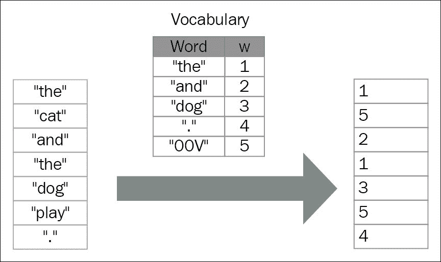

编码单词是将每个单词表示为一个向量的过程。编码单词的最简单方法称为独热编码或 1-of-K 向量表示法。在这种方法中，每个单词都表示为一个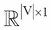向量，该向量的所有元素都是 0，只有在该单词在排序词汇表中的索引位置上为 1。在这种表示法中，|V|表示词汇表的大小。对于词汇表{**国王**, **女王**, **男人**, **女人**, **孩子**}，在这种类型的编码下，单词**女王**的编码示例如下：

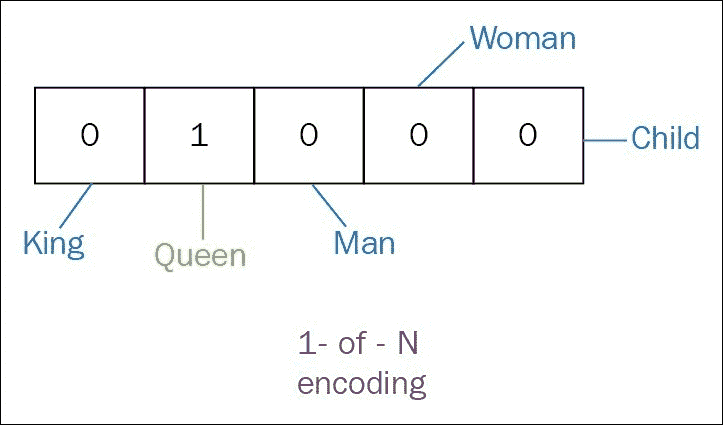

在独热向量表示方法中，每个单词与其他单词的距离相等。然而，它无法保留它们之间的任何关系，并且会导致数据稀疏性。使用单词嵌入可以克服这些缺点。

单词嵌入是一种分布式语义方法，它将单词表示为实数向量。这样的表示具有有用的聚类属性，因为它将语义和句法相似的单词聚集在一起。

例如，单词**海洋世界**和**海豚**将在创建的空间中非常接近。这一步的主要目的是将每个单词映射到一个连续的、低维的实值向量，并将其用作模型的输入，例如**循环神经网络**（**RNN**）、**卷积神经网络**（**CNN**）等：

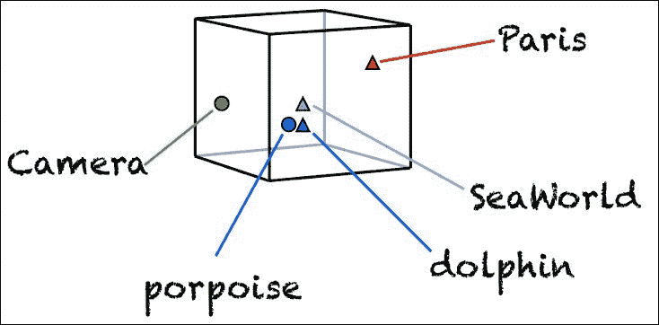

这种表示是**稠密的**。我们期望同义词和可互换的单词在该空间中接近。

本章中，我们将介绍一种非常流行的词嵌入模型——Word2Vec，它最初由 Mikolov 等人于 2013 年开发。Word2Vec 有两种不同的模型：**连续词袋模型**（**CBOW**）和**跳字模型**（**Skip-gram**）。

在 CBOW 方法中，目标是给定上下文来预测一个单词。而跳字模型则是根据单个单词预测周围的上下文（见下图）：

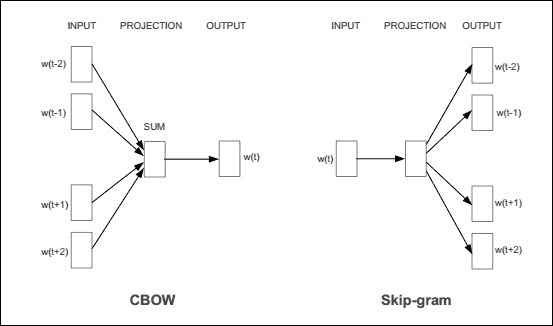

对于本章，我们将重点介绍 CBOW 模型。我们将从展示数据集开始，然后解释该方法背后的思想。之后，我们将使用 Theano 展示它的简单实现。最后，我们将提到词嵌入的一些应用。

# 数据集

在解释模型部分之前，让我们先通过创建词汇表来处理文本语料库，并将文本与词汇表整合，以便每个单词都可以表示为一个整数。作为数据集，可以使用任何文本语料库，如维基百科或网页文章，或来自社交网络（如 Twitter）的帖子。常用的数据集包括 PTB、text8、BBC、IMDB 和 WMT 数据集。

本章中，我们使用`text8`语料库。它由维基百科转储中前 1 亿个字符的预处理版本构成。我们先来下载该语料库：

```py
wget http://mattmahoney.net/dc/text8.zip -O /sharedfiles/text8.gz
gzip -d /sharedfiles/text8.gz -f
```

现在，我们构建词汇表，并用**UNKNOWN**替换稀有词汇。让我们先将数据读取为一个字符串列表：

1.  将数据读取为字符串列表：

    ```py
    words = []
    with open('data/text8') as fin:
      for line in fin:
        words += [w for w in line.strip().lower().split()]

    data_size = len(words)  
    print('Data size:', data_size)
    ```

    从字符串列表中，我们现在可以构建字典。我们首先在`word_freq`字典中统计单词的频率。接着，我们用符号替换那些在语料库中出现次数少于`max_df`的稀有单词。

1.  构建字典并用`UNK`符号替换稀有单词：

    ```py
    unkown_token = '<UNK>'
    pad_token = '<PAD>' # for padding the context
    max_df = 5 # maximum number of freq
    word_freq = [[unkown_token, -1], [pad_token, 0]]
    word_freq.extend(Counter(words).most_common())
    word_freq = OrderedDict(word_freq)
    word2idx = {unkown_token: 0, pad_token: 1}
    idx2word = {0: unkown_token, 1: pad_token}
    idx = 2
    for w in word_freq:
      f = word_freq[w]
      if f >= max_df:
        word2idx[w] = idx
        idx2word[idx] = w
        idx += 1
      else:
        word2idx[w] = 0 # map the rare word into the unkwon token
        word_freq[unkown_token] += 1 # increment the number of unknown tokens

    data = [word2idx[w] for w in words]

    del words # for reduce mem use

    vocabulary_size = len(word_freq)
    most_common_words = list(word_freq.items())[:5]
    print('Most common words (+UNK):', most_common_words)
    print('Sample data:', data[:10], [idx2word[i] for i in data[:10]])

    *Data size: 17005207*
    *Most common words (+UNK): [('<UNK>', 182564), ('the', 1061396), ('of', 593677), ('and', 416629), ('one', 411764)]*
    *Sample data: [5239, 3084, 12, 6, 195, 2, 3137, 46, 59, 156] ['anarchism', 'originated', 'as', 'a', 'term', 'of', 'abuse', 'first', 'used', 'against']*

    ```

1.  现在，让我们定义创建数据集的函数（即上下文和目标）：

    ```py
    def get_sample(data, data_size, word_idx, pad_token, c = 1):

      idx = max(0, word_idx - c)
      context = data[idx:word_idx]
      if word_idx + 1 < data_size:
        context += data[word_idx + 1 : min(data_size, word_idx + c + 1)]
      target = data[word_idx]
      context = [w for w in context if w != target]
      if len(context) > 0:
        return target, context + (2 * c - len(context)) * [pad_token]
      return None, None

    def get_data_set(data, data_size, pad_token, c=1):
      contexts = []
      targets = []
      for i in xrange(data_size):
        target, context =  get_sample(data, data_size, i, pad_token, c)
        if not target is None:
          contexts.append(context)
          targets.append(target)

      return np.array(contexts, dtype='int32'), np.array(targets, dtype='int32')
    ```

# 连续词袋模型

用于预测给定上下文中单词的神经网络设计如下图所示：

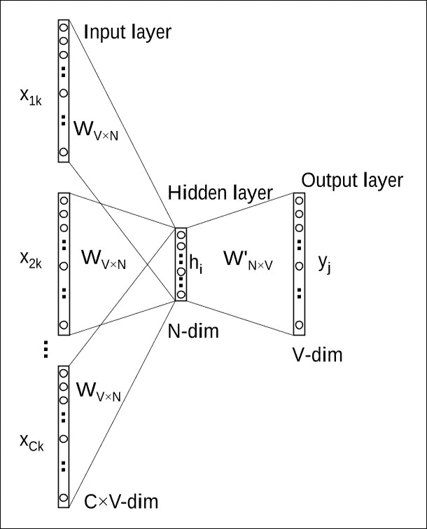

输入层接收上下文，而输出层预测目标单词。我们将用于 CBOW 模型的模型有三层：输入层、隐藏层（也称为投影层或嵌入层）和输出层。在我们的设置中，词汇表大小是 V，隐藏层大小是 N。相邻的单元是完全连接的。

输入和输出可以通过索引（一个整数，0 维）或一-hot-编码向量（1 维）表示。与一-hot-编码向量`v`相乘仅仅是取嵌入矩阵的第 j 行：

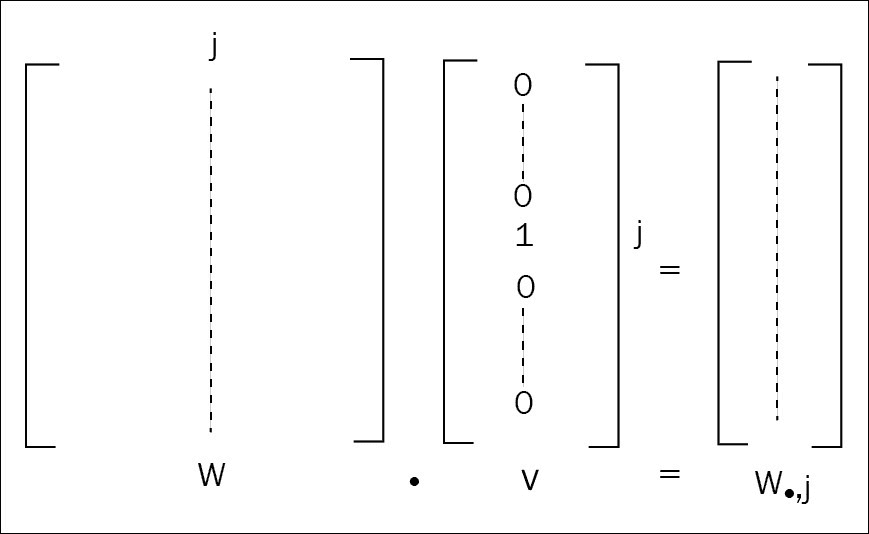

由于索引表示在内存使用上比 one-hot 编码表示更高效，而且 Theano 支持索引符号变量，因此尽可能采用索引表示是更可取的。

因此，输入（上下文）将是二维的，由一个矩阵表示，具有两个维度：批量大小和上下文长度。输出（目标）是一维的，由一个向量表示，具有一个维度：批量大小。

让我们定义 CBOW 模型：

```py
import theano
import theano.tensor as T
import numpy as np
import math
context = T.imatrix(name='context')
target = T.ivector('target')
```

上下文和目标变量是该模型的已知参数。CBOW 模型的未知参数是输入层和隐藏层之间的连接矩阵！连续词袋模型，以及隐藏层和输出层之间的连接矩阵！连续词袋模型：

```py
vocab_size = len(idx2word)
emb_size = 128
W_in_values = np.asarray(np.random.uniform(-1.0, 1.0, 
	(vocab_size, emb_size)),
dtype=theano.config.floatX)

W_out_values = np.asarray(np.random.normal(
	scale=1.0 / math.sqrt(emb_size),
   size=(emb_size, vocab_size)),
   dtype=theano.config.floatX)

W_in = theano.shared(value=W_in_values,
                      name='W_in',
                      borrow=True)

W_out = theano.shared(value=W_out_values,
                      name='W_out',
                      borrow=True)

params = [W_in, W_out]
```

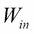的每一行是关联单词`i`在输入层的 N 维向量表示，`N`是隐藏层的大小。给定一个上下文，在计算隐藏层输出时，CBOW 模型会对输入上下文词的向量进行平均，然后使用`input -> hidden`权重矩阵与平均向量的乘积作为输出：

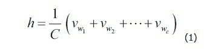

这里，`C`是上下文中的单词数，`w1, w2, w3,..., wc`是上下文中的单词，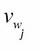是单词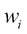的输入向量。输出层的激活函数是 softmax 层。方程 2 和 3 展示了我们如何计算输出层：

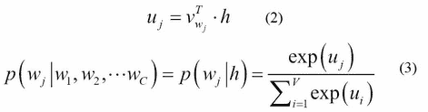

这里，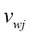是矩阵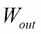的第 j 列，`V`是词汇表大小。在我们的设置中，词汇表大小是`vocab_size`，隐藏层大小是`emb_size`。损失函数如下：

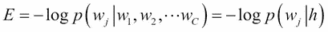

(4)

现在，让我们在 Theano 中翻译方程 1、2、3 和 4。

要计算隐藏层（投影层）输出：`input -> hidden (eq. 1)`

```py
h = T.mean(W_in[context], axis=1) 

For the hidden -> output layer (eq. 2)
uj = T.dot(h, W_out) 
```

softmax 激活（eq. 3）：

```py
p_target_given_contex = T.nnet.softmax(uj).dimshuffle(1, 0)
```

损失函数（eq. 4）：

```py
loss = -T.mean(T.log(p_target_given_contex)[T.arange(target.shape[0]), target]) 
```

使用 SGD 更新模型的参数：

```py
g_params = T.grad(cost=loss, wrt=params)
updates = [
        (param, param - learning_rate * gparam)
        for param, gparam in zip(params, g_params)
]
```

最后，我们需要定义训练和评估函数。

让我们将数据集设为共享，以便将其传递到 GPU。为简便起见，我们假设有一个名为`get_data_set`的函数，它返回目标集及其周围上下文：

```py
contexts, targets = get_data_set(data, data_size, word2idx[pad_token], c=2)

contexts = theano.shared(contexts)
targets = theano.shared(targets)

index = T.lscalar('index')

train_model = theano.function(
    inputs=[index],
    outputs=[loss],
    updates=updates,
    givens={
        context: contexts[index * batch_size: (index + 1) * batch_size],
        target: targets[index * batch_size: (index + 1) * batch_size]
    }
)
```

`train_model`的输入变量是批次的索引，因为整个数据集已经通过共享变量一次性传输到 GPU。

在训练过程中进行验证时，我们通过计算小批量示例与所有嵌入的余弦相似度来评估模型。

让我们使用一个`theano`变量来放置验证模型的输入：

```py
valid_samples = T.ivector('valid_samples') 
```

验证输入的标准化词嵌入：

```py
embeddings = params[0]
norm = T.sqrt(T.sum(T.sqr(embeddings), axis=1, keepdims=True))
normalized_embeddings = W_in / norm

valid_embeddings = normalized_embeddings[valid_samples]
```

相似度由余弦相似度函数给出：

```py
similarity = theano.function([valid_samples], T.dot(valid_embeddings, normalized_embeddings.T))
```

# 训练模型

现在我们可以开始训练模型了。在这个例子中，我们选择使用 SGD 进行训练，批大小为 64，训练 100 个周期。为了验证模型，我们随机选择了 16 个词，并使用相似度度量作为评估指标：

1.  让我们开始训练：

    ```py
    valid_size = 16     # Random set of words to evaluate similarity on.
    valid_window = 100  # Only pick dev samples in the head of the distribution.
    valid_examples = np.array(np.random.choice(valid_window, valid_size, replace=False), dtype='int32')

    n_epochs = 100
    n_train_batches = data_size // batch_size
    n_iters = n_epochs * n_train_batches
    train_loss = np.zeros(n_iters)
    average_loss = 0

    for epoch in range(n_epochs):
        for minibatch_index in range(n_train_batches):

            iteration = minibatch_index + n_train_batches * epoch
            loss = train_model(minibatch_index)
            train_loss[iteration] = loss
            average_loss += loss

            if iteration % 2000 == 0:

              if iteration > 0:
                average_loss /= 2000
                # The average loss is an estimate of the loss over the last 2000 batches.
                print("Average loss at step ", iteration, ": ", average_loss)
                average_loss = 0  

            # Note that this is expensive (~20% slowdown if computed every 500 steps)
            if iteration % 10000 == 0:

              sim = similarity(valid_examples)
              for i in xrange(valid_size):
                  valid_word = idx2word[valid_examples[i]]
                  top_k = 8 # number of nearest neighbors
                  nearest = (-sim[i, :]).argsort()[1:top_k+1]
                  log_str = "Nearest to %s:" % valid_word
                  for k in xrange(top_k):
                      close_word = idx2word[nearest[k]]
                      log_str = "%s %s," % (log_str, close_word)
                  print(log_str)
    ```

1.  最后，让我们创建两个通用函数，帮助我们将任何模型参数保存在可重用的 `utils.py` 工具文件中：

    ```py
    def save_params(outfile, params):
        l = []
        for param in params:
            l = l + [ param.get_value() ]
        numpy.savez(outfile, *l)
        print("Saved model parameters to {}.npz".format(outfile))

    def load_params(path, params):
        npzfile = numpy.load(path+".npz")
        for i, param in enumerate(params):
            param.set_value( npzfile["arr_" +str(i)] )
        print("Loaded model parameters from {}.npz".format(path))
    ```

1.  在 GPU 上运行时，前面的代码会打印以下结果：

    ```py
    *Using gpu device 1: Tesla K80 (CNMeM is enabled with initial size: 80.0% of memory, cuDNN 5105)*
    *Data size 17005207*
    *Most common words (+UNK) [('<UNK>', 182565), ('<PAD>', 0), ('the', 1061396), ('of', 593677), ('and', 416629)]*
    *Sample data [5240, 3085, 13, 7, 196, 3, 3138, 47, 60, 157] ['anarchism', 'originated', 'as', 'a', 'term', 'of', 'abuse', 'first', 'used', 'against']*
    *Average loss at step  0 :  11.2959747314*
    *Average loss at step  2000 :  8.81626828802*
    *Average loss at step  4000 :  7.63789177912*
    *Average loss at step  6000 :  7.40699760973*
    *Average loss at step  8000 :  7.20080085599*
    *Average loss at step  10000 :  6.85602856147*
    *Average loss at step  12000 :  6.88123817992*
    *Average loss at step  14000 :  6.96217652643*
    *Average loss at step  16000 :  6.53794862854*
    *...*

    *Average loss at step  26552000 :  4.52319500107*
    *Average loss at step  26554000 :  4.55709513521*
    *Average loss at step  26556000 :  4.62755958384*
    *Average loss at step  26558000 :  4.6266620369*
    *Average loss at step  26560000 :  4.82731778347*
    *Nearest to system: systems, network, device, unit, controller, schemes, vessel, scheme,*
    *Nearest to up: off, out, alight, forth, upwards, down, ordered, ups,*
    *Nearest to first: earliest, last, second, next, oldest, fourth, third, newest,*
    *Nearest to nine: apq, nineteenth, poz, jyutping, afd, apod, eurocents, zoolander,*
    *Nearest to between: across, within, involving, with, among, concerning, through, from,*
    *Nearest to state: states, provincial, government, nation, gaeltachta, reservation, infirmity, slates,*
    *Nearest to are: were, is, aren, was, include, have, weren, contain,*
    *Nearest to may: might, should, must, can, could, would, will, cannot,*
    *Nearest to zero: hundred, pounders, hadza, cest, bureaus, eight, rang, osr,*
    *Nearest to that: which, where, aurea, kessai, however, unless, but, although,*
    *Nearest to can: could, must, cannot, should, may, will, might, would,*
    *Nearest to s: his, whose, its, castletown, cide, codepoint, onizuka, brooklands,*
    *Nearest to will: would, must, should, could, can, might, shall, may,*
    *Nearest to their: its, his, your, our, her, my, the, whose,*
    *Nearest to but: however, though, although, which, while, whereas, moreover, unfortunately,*
    *Nearest to not: never, indeed, rarely, seldom, almost, hardly, unable, gallaecia,*
    *Saved model parameters to model.npz*

    ```

让我们注意到：

+   稀有词只更新少数几次，而频繁出现的词在输入和上下文窗口中更常出现。对频繁词进行下采样可以缓解这个问题。

+   所有权重都会在输出嵌入中更新，只有其中一部分，即对应于上下文窗口中的词汇，才会被正向更新。负采样有助于在更新中重新平衡正负样本。

# 可视化学习到的嵌入

我们将嵌入可视化为二维图形，以便了解它们如何捕捉相似性和语义。为此，我们需要将高维的嵌入降到二维，而不改变嵌入的结构。

降维称为流形学习，存在许多不同的技术，其中一些是线性的，如**主成分分析**（**PCA**）、**独立成分分析**（**ICA**）、**线性判别分析**（**LDA**）和**潜在语义分析** / **索引**（**LSA** / **LSI**），一些是非线性的，如**Isomap**、**局部线性嵌入**（**LLE**）、**海森矩阵特征映射**、**谱嵌入**、**局部切空间嵌入**、**多维尺度法**（**MDS**）和**t-分布随机邻域嵌入**（**t-SNE**）。

为了显示词嵌入，我们使用 t-SNE，这是一种适应高维数据的优秀技术，用于揭示局部结构和簇，而不会将点挤在一起：

1.  可视化嵌入：

    ```py
    def plot_with_labels(low_dim_embs, labels, filename='tsne.png'):
      assert low_dim_embs.shape[0] >= len(labels), "More labels than embeddings"
      plt.figure(figsize=(18, 18))  #in inches
      for i, label in enumerate(labels):
        x, y = low_dim_embs[i,:]
        plt.scatter(x, y)
        plt.annotate(label,
                     xy=(x, y),
                     xytext=(5, 2),
                     textcoords='offset points',
                     ha='right',
                     va='bottom')

      plt.savefig(filename)

    from sklearn.manifold import TSNE
    import matplotlib.pyplot as plt

    tsne = TSNE(perplexity=30, n_components=2, init='pca', n_iter=5000)
    plot_only = 500
    low_dim_embs = tsne.fit_transform(final_embeddings[:plot_only,:])
    labels = [idx2word[i] for i in xrange(plot_only)]
    plot_with_labels(low_dim_embs, labels)
    ```

    绘制的地图显示了具有相似嵌入的词语彼此靠近：

    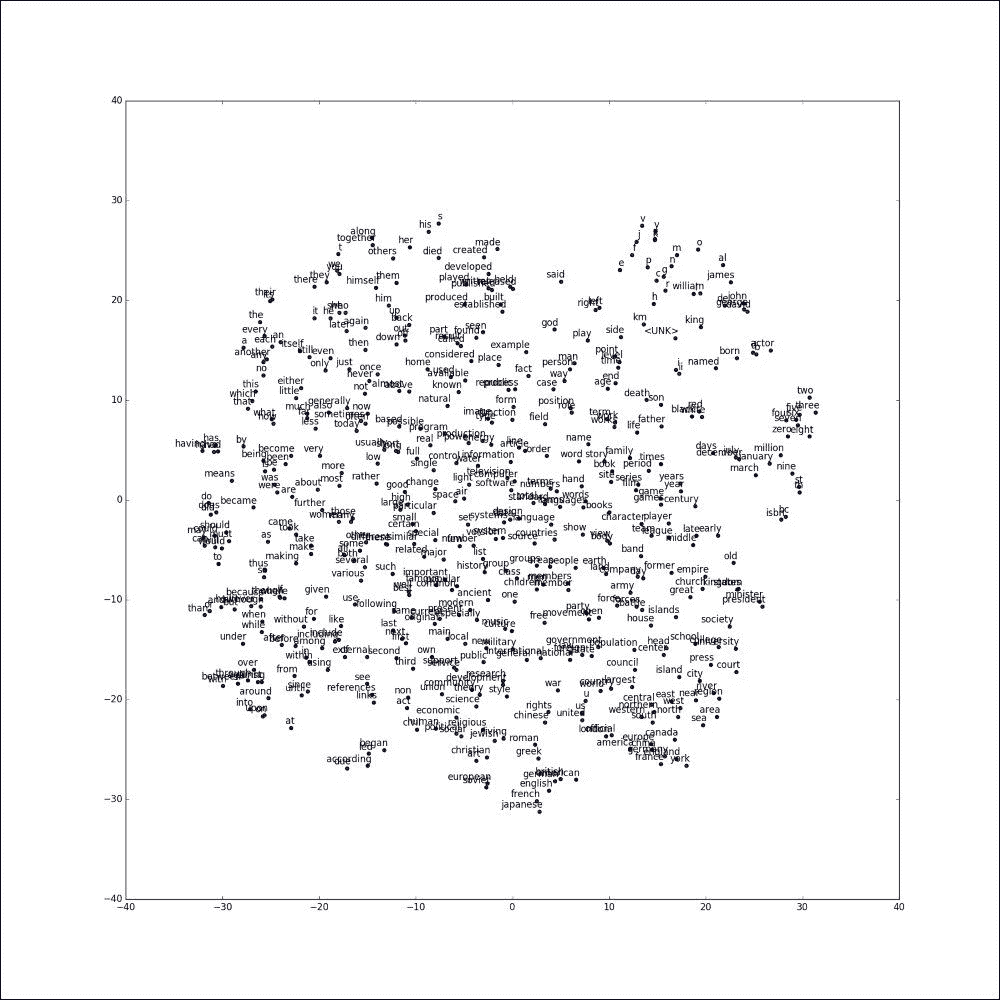

# 评估嵌入 – 类比推理

类比推理是一种简单有效的评估嵌入的方法，通过预测语法和语义关系，形式为*a 对 b 就像 c 对 _?*，记作 *a : b → c : ?*。任务是识别被省略的第四个单词，只有完全匹配的单词才被认为是正确的。

例如，单词*女人*是问题*国王对女王，如同男人对？*的最佳答案。假设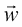是单词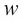的表示向量，并标准化为单位范数。那么，我们可以通过找到与表示向量最接近的单词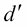来回答问题*a : b → c : ?*。

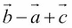

根据余弦相似度：

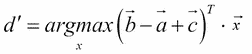

现在让我们使用 Theano 实现类比预测函数。首先，我们需要定义函数的输入。类比函数接收三个输入，即`a`、`b`和`c`的单词索引：

```py
analogy_a = T.ivector('analogy_a')  
analogy_b = T.ivector('analogy_b')  
analogy_c = T.ivector('analogy_c')
```

然后，我们需要将每个输入映射到单词嵌入向量。`a_emb`、`b_emb`、`c_emb`的每一行都是一个单词的嵌入向量：

```py
a_emb = embeddings[analogy_a]  # a's embs
b_emb = embeddings[analogy_b]  # b's embs
c_emb = embeddings[analogy_c]  # c's embs
```

现在我们可以计算每个目标和词汇对之间的余弦距离。我们预期`d`在单位超球上的嵌入向量接近：`c_emb + (b_emb - a_emb)`，其形状为`[bsz, emb_size]`。`dist`的形状为`[bsz, vocab_size]`。

```py
 dist = T.dot(target, embeddings.T)
```

在这个例子中，我们认为预测函数取前四个单词。因此，我们可以在 Theano 中定义函数如下：

```py
pred_idx = T.argsort(dist, axis=1)[:, -4:]
prediction = theano.function([analogy_a, analogy_b, analogy_c], pred_idx)
```

要运行上述函数，我们需要加载评估数据，在本例中是由 Google 定义的类比问题集。每个问题包含四个用空格分隔的单词。第一个问题可以解释为*雅典对希腊的关系，如同巴格达对 _？*，正确答案应为*伊拉克*：

```py
Athens Greece Baghdad Iraq
Athens Greece Bangkok Thailand
Athens Greece Beijing China
```

让我们使用以下代码中定义的`read_analogies`函数加载类比问题：

```py
def read_analogies(fname, word2idx):
    """Reads through the analogy question file.
    Returns:
      questions: a [n, 4] numpy array containing the analogy question's
                 word ids.
      questions_skipped: questions skipped due to unknown words.
    """
    questions = []
    questions_skipped = 0
    with open(fname, "r") as analogy_f:
      for line in analogy_f:
        if line.startswith(":"):  # Skip comments.
          continue
        words = line.strip().lower().split(" ")
        ids = [word2idx.get(w.strip()) for w in words]
        if None in ids or len(ids) != 4:
          questions_skipped += 1
        else:
          questions.append(np.array(ids))
    print("Eval analogy file: ", fname)
    print("Questions: ", len(questions))
    print("Skipped: ", questions_skipped)

    return np.array(questions, dtype=np.int32)
```

现在，我们可以运行评估模型：

```py
  """Evaluate analogy questions and reports accuracy."""

  # How many questions we get right at precision@1.
  correct = 0
  analogy_data = read_analogies(args.eval_data, word2idx)
  analogy_questions = analogy_data[:, :3]
  answers = analogy_data[:, 3]
  del analogy_data
  total = analogy_questions.shape[0]
  start = 0

  while start < total:
    limit = start + 200
    sub_questions = analogy_questions[start:limit, :]
    sub_answers = answers[start:limit]
    idx = prediction(sub_questions[:,0], sub_questions[:,1], sub_questions[:,2])

    start = limit
    for question in xrange(sub_questions.shape[0]):
      for j in xrange(4):
        if idx[question, j] == sub_answers[question]:
          # Bingo! We predicted correctly. E.g., [italy, rome, france, paris].
          correct += 1
          break
        elif idx[question, j] in sub_questions[question]:
          # We need to skip words already in the question.
          continue
        else:
          # The correct label is not the precision@1
          break
  print()
  print("Eval %4d/%d accuracy = %4.1f%%" % (correct, total,
                                            correct * 100.0 / total))
```

这导致了：

```py
*Eval analogy file:  questions-words.txt*
*Questions:  17827*
*Skipped:  1717*
*Eval   831/17827 accuracy =  4.7%*

```

# 评估嵌入 - 定量分析

仅几个单词可能足以表明嵌入的定量分析也是可能的。

一些单词相似度基准提出了概念之间基于人类的距离：Simlex999（Hill 等，2016）、Verb-143（Baker 等，2014）、MEN（Bruni 等，2014）、RareWord（Luong 等，2013）和 MTurk-771（Halawi 等，2012）。

我们的嵌入之间的相似度距离可以与这些人类距离进行比较，使用 Spearman 秩相关系数来定量评估所学习嵌入的质量。

# 单词嵌入的应用

单词嵌入捕捉单词的含义。它们将离散输入转换为神经网络可处理的输入。

嵌入是与语言相关的许多应用的起点：

+   生成文本，正如我们将在下一章看到的那样

+   翻译系统，其中输入和目标句子是单词序列，且其嵌入可以通过端到端的神经网络处理 (第八章, *使用编码解码网络进行翻译和解释*)

+   情感分析 (第五章, *使用双向 LSTM 分析情感*)

+   计算机视觉中的零-shot 学习；语言中的结构使我们能够找到没有训练图像的类别

+   图像标注/说明

+   神经精神病学，其中神经网络可以 100%准确预测某些人类精神障碍

+   聊天机器人，或回答用户问题 (第九章, *使用注意力机制选择相关输入或记忆*)

与单词一样，语义嵌入的原理可以用于任何具有类别变量（图像、声音、电影等类别）的任务，其中通过类别变量激活学习到的嵌入可以作为输入传递到神经网络，用于进一步的分类挑战。

由于语言塑造了我们的思维，词嵌入有助于构建或提高基于神经网络的系统性能。

# 权重绑定

使用了两个权重矩阵，和，分别用于输入或输出。虽然的所有权重在每次反向传播迭代时都会更新，但仅在与当前训练输入词对应的列上更新。

**权重绑定** (**WT**) 由仅使用一个矩阵 W 来进行输入和输出嵌入组成。Theano 然后计算相对于这些新权重的新导数，并且 W 中的所有权重在每次迭代时都会更新。参数减少有助于减少过拟合。

对于 Word2Vec 模型，这种技术并没有给出更好的结果，原因很简单：在 Word2Vec 模型中，找到输入单词在上下文中出现的概率是：

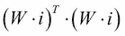

它应该尽量接近零，但不能为零，除非 W = 0。

但在其他应用中，例如在**神经网络语言模型**（**NNLM**）中的第四章，“用递归神经网络生成文本”，以及**神经机器翻译**（**NMT**）中的第八章，“用编码解码网络进行翻译和解释”，它可以显示[*使用输出嵌入来改进语言模型*]：

+   输入嵌入通常比输出嵌入差

+   WT 解决了这个问题

+   通过 WT 学习的常见嵌入在质量上接近于没有 WT 的输出嵌入

+   在输出嵌入之前插入一个正则化的投影矩阵 P，帮助网络使用相同的嵌入，并且在 WT 下导致更好的结果

# 进一步阅读

请参阅以下文章：

+   在向量空间中高效估计单词表示，Tomas Mikolov，Kai Chen，Greg Corrado，Jeffrey Dean，2013

+   基于因子的组合嵌入模型，Mo Yu，2014

+   字符级卷积网络用于文本分类，Xiang Zhang，Junbo Zhao，Yann LeCun，2015

+   单词和短语的分布式表示及其组合性，Tomas Mikolov，Ilya Sutskever，Kai Chen，Greg Corrado，Jeffrey Dean，2013

+   使用输出嵌入来改进语言模型，Ofir Press，Lior Wolf，2016 年 8 月

# 总结

本章介绍了一种非常常见的方法，特别是将离散的文本输入转换为数值嵌入，用于自然语言处理。

使用神经网络训练这些单词表示的技术不需要我们对数据进行标记，并直接从自然文本推断其嵌入。这样的训练称为*无监督学习*。

深度学习的主要挑战之一是将输入和输出信号转换为可以由网络处理的表示，特别是浮点向量。然后，神经网络提供所有工具来处理这些向量，学习、决策、分类、推理或生成。

在接下来的章节中，我们将使用这些嵌入来处理文本和更高级的神经网络。下一章中介绍的第一个应用是自动文本生成。
