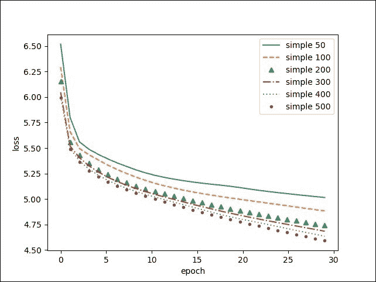

# 第四章 使用递归神经网络生成文本

在上一章中，你学习了如何将离散输入表示为向量，以便神经网络能够理解离散输入以及连续输入。

许多现实世界的应用涉及可变长度的输入，例如物联网和自动化（类似卡尔曼滤波器，已经更为进化）；自然语言处理（理解、翻译、文本生成和图像注释）；人类行为重现（文本手写生成和聊天机器人）；强化学习。

之前的网络，称为前馈网络，只能对固定维度的输入进行分类。为了将它们的能力扩展到可变长度的输入，设计了一个新的网络类别：**递归神经网络**（**RNN**），非常适合用于处理可变长度输入或序列的机器学习任务。

本章介绍了三种著名的递归神经网络（简单 RNN、GRU 和 LSTM），并以文本生成作为示例。 本章涵盖的主题如下：

+   序列的案例

+   递归网络的机制

+   如何构建一个简单的递归网络

+   时间反向传播

+   不同类型的 RNN、LSTM 和 GRU

+   困惑度和词错误率

+   在文本数据上进行训练以生成文本

+   递归网络的应用

# 递归神经网络的需求

深度学习网络在自然语言处理中的应用是数值化的，能够很好地处理多维数组的浮点数和整数作为输入值。对于类别值，例如字符或单词，上一章展示了一种称为嵌入（embedding）的技术，将它们转换为数值。

到目前为止，所有的输入都是固定大小的数组。在许多应用中，如自然语言处理中的文本，输入有一个语义含义，但可以通过可变长度的序列来表示。

需要处理可变长度的序列，如下图所示：


**递归神经网络**（**RNN**）是应对可变长度输入的解决方案。

递归可以看作是在不同时间步长上多次应用前馈网络，每次应用时使用不同的输入数据，但有一个重要区别，那就是存在与过去时间步长的连接，目标是通过时间不断优化输入的表示。

在每个时间步长，隐藏层的输出值代表网络的中间状态。

递归连接定义了从一个状态到另一个状态的转换，给定输入的情况下，以便不断优化表示：


递归神经网络适用于涉及序列的挑战，如文本、声音和语音、手写文字以及时间序列。

# 自然语言的数据集

作为数据集，可以使用任何文本语料库，例如 Wikipedia、网页文章，甚至是包含代码或计算机程序、戏剧或诗歌等符号的文本；模型将捕捉并重现数据中的不同模式。

在这种情况下，我们使用微型莎士比亚文本来预测新的莎士比亚文本，或者至少是风格上受到莎士比亚启发的新文本；有两种预测层次可以使用，但可以以相同的方式处理：

+   **在字符级别**：字符属于一个包含标点符号的字母表，给定前几个字符，模型从字母表中预测下一个字符，包括空格，以构建单词和句子。预测的单词不需要属于字典，训练的目标是构建接近真实单词和句子的内容。

+   **在单词级别**：单词属于一个包含标点符号的字典，给定前几个单词，模型从词汇表中预测下一个单词。在这种情况下，单词有强烈的约束，因为它们属于字典，但句子没有这种约束。我们期望模型更多地关注捕捉句子的语法和意义，而不是字符级别的内容。

在这两种模式下，token 表示字符/单词；字典、字母表或词汇表表示（token 的可能值的列表）；

流行的 NLTK 库，一个 Python 模块，用于将文本分割成句子并将其标记化为单词：

```py
conda install nltk
```

在 Python shell 中，运行以下命令以下载 `book` 包中的英语分词器：

```py
import nltk
nltk.download("book")
```

让我们解析文本以提取单词：

```py
from load import parse_text
X_train, y_train, index_to_word = parse_text("data/tiny-shakespear.txt", type="word")

for i in range(10):
  print "x", " ".join([index_to_word[x] for x in X_train[i]])
  print "y"," ".join([index_to_word[x] for x in y_train[i]])

*Vocabulary size 9000*
*Found 12349 unique words tokens.*
*The least frequent word in our vocabulary is 'a-fire' and appeared 1 times.*
*x START first citizen : before we proceed any further , hear me speak .*
*y first citizen : before we proceed any further , hear me speak . END*
*x START all : speak , speak .*
*y all : speak , speak . END*
*x START first citizen : you are all resolved rather to die than to famish ?*
*y first citizen : you are all resolved rather to die than to famish ? END*
*x START all : resolved .*
*y all : resolved . END*
*x START resolved .*
*y resolved . END*
*x START first citizen : first , you know caius marcius is chief enemy to the people .*
*y first citizen : first , you know caius marcius is chief enemy to the people . END*
*x START all : we know't , we know't .*
*y all : we know't , we know't . END*
*x START first citizen : let us kill him , and we 'll have corn at our own price .*
*y first citizen : let us kill him , and we 'll have corn at our own price . END*
*x START is't a verdict ?*
*y is't a verdict ? END*
*x START all : no more talking o n't ; let it be done : away , away !*
*y all : no more talking o n't ; let it be done : away , away ! END*

```

或者 `char` 库：

```py
from load import parse_text
X_train, y_train, index_to_char = parse_text("data/tiny-shakespear.txt", type="char")

for i in range(10):
  print "x",''.join([index_to_char[x] for x in X_train[i]])
  print "y",''.join([index_to_char[x] for x in y_train[i]])

*x ^first citizen: before we proceed any further, hear me speak*
*y irst citizen: before we proceed any further, hear me speak.$*
*x ^all: speak, speak*
*y ll: speak, speak.$*
*x ^first citizen: you are all resolved rather to die than to famish*
*y irst citizen: you are all resolved rather to die than to famish?$*
*x ^all: resolved*
*y ll: resolved.$*
*x ^resolved*
*y esolved.$*
*x ^first citizen: first, you know caius marcius is chief enemy to the people*
*y irst citizen: first, you know caius marcius is chief enemy to the people.$*
*x ^all: we know't, we know't*
*y ll: we know't, we know't.$*
*x ^first citizen: let us kill him, and we'll have corn at our own price*
*y irst citizen: let us kill him, and we'll have corn at our own price.$*
*x ^is't a verdict*
*y s't a verdict?$*
*x ^all: no more talking on't; let it be done: away, away*
*y ll: no more talking on't; let it be done: away, away!$*

```

额外的开始标记（`START` 单词和 `^` 字符）避免了预测开始时产生空的隐藏状态。另一种解决方案是用  初始化第一个隐藏状态。

额外的结束标记（`END` 单词和 `$` 字符）帮助网络学习在序列生成预测完成时预测停止。

最后，`out of vocabulary` 标记（`UNKNOWN` 单词）替换那些不属于词汇表的单词，从而避免使用庞大的词典。

在这个示例中，我们将省略验证数据集，但对于任何实际应用程序，将一部分数据用于验证是一个好的做法。

同时，请注意，第二章 中的函数，*使用前馈网络分类手写数字* 用于层初始化 `shared_zeros` 和 `shared_glorot_uniform`，以及来自第三章，*将单词编码为向量* 用于模型保存和加载的 `save_params` 和 `load_params` 已被打包到 `utils` 包中：

```py
from theano import *
import theano.tensor as T
from utils import shared_zeros, shared_glorot_uniform,save_params,load_params
```

# 简单的递归网络

RNN 是在多个时间步上应用的网络，但有一个主要的区别：与前一个时间步的层状态之间的连接，称为隐状态！简单递归网络：


这可以写成以下形式：


RNN 可以展开为一个前馈网络，应用于序列！简单递归网络作为输入，并在不同时间步之间共享参数。

输入和输出的第一个维度是时间，而后续维度用于表示每个步骤中的数据维度。正如上一章所见，某一时间步的值（一个单词或字符）可以通过索引（整数，0 维）或独热编码向量（1 维）表示。前者在内存中更加紧凑。在这种情况下，输入和输出序列将是 1 维的，通过一个向量表示，且该维度为时间：

```py
x = T.ivector()
y = T.ivector()
```

训练程序的结构与第二章中的*用前馈网络分类手写数字*相同，只是我们定义的模型与递归模块共享相同的权重，适用于不同的时间步：

```py
embedding_size = len(index_)
n_hidden=500
```

让我们定义隐状态和输入权重：

```py
U = shared_glorot_uniform(( embedding_size,n_hidden), name="U")
W = shared_glorot_uniform((n_hidden, n_hidden), name="W")
bh = shared_zeros((n_hidden,), name="bh")
```

以及输出权重：

```py
V = shared_glorot_uniform(( n_hidden, embedding_size), name="V")
by = shared_zeros((embedding_size,), name="by")

params = [U,V,W,by,bh]

def step(x_t, h_tm1):
    h_t = T.tanh(U[x_t] + T.dot( h_tm1, W) + bh)
    y_t = T.dot(h_t, V) + by
    return h_t, y_t
```

初始状态可以在使用开始标记时设为零：

```py
h0 = shared_zeros((n_hidden,), name='h0')
[h, y_pred], _ = theano.scan(step, sequences=x, outputs_info=[h0, None], truncate_gradient=10)
```

它返回两个张量，其中第一个维度是时间，第二个维度是数据值（在这种情况下为 0 维）。

通过扫描函数进行的梯度计算在 Theano 中是自动的，并遵循直接连接和递归连接到前一个时间步。因此，由于递归连接，某一特定时间步的错误会传播到前一个时间步，这种机制被称为**时间反向传播**（**BPTT**）。

已观察到，在过多时间步后，梯度会爆炸或消失。这就是为什么在这个例子中，梯度在 10 个步骤后被截断，并且错误不会反向传播到更早的时间步。

对于剩余的步骤，我们保持之前的分类方式：

```py
model = T.nnet.softmax(y_pred)
y_out = T.argmax(model, axis=-1)
cost = -T.mean(T.log(model)[T.arange(y.shape[0]), y])
```

这将在每个时间步返回一个值的向量。

## LSTM 网络

RNN 的主要困难之一是捕捉长期依赖关系，这是由于梯度消失/爆炸效应和截断反向传播。

为了克服这个问题，研究人员已经在寻找一长串潜在的解决方案。1997 年设计了一种新型的递归网络，带有一个记忆单元，称为*细胞状态*，专门用于保持和传输长期信息。

在每个时间步，单元值可以部分通过候选单元更新，并通过门控机制部分擦除。两个门，更新门和忘记门，决定如何更新单元，给定先前的隐藏状态值和当前输入值：


候选单元的计算方式相同：


新的单元状态的计算方式如下：


对于新的隐藏状态，输出门决定要输出单元值中的哪些信息：


其余部分与简单 RNN 保持相同：


该机制允许网络存储一些信息，并在未来比简单 RNN 更远的时间点使用这些信息。

许多 LSTM 设计的变体已经被设计出来，你可以根据你的问题来测试这些变体，看看它们的表现。

在这个例子中，我们将使用一种变体，其中门和候选值同时使用了先前的隐藏状态和先前的单元状态。

在 Theano 中，让我们为以下内容定义权重：

- 输入门：

```py
W_xi = shared_glorot_uniform(( embedding_size,n_hidden))
W_hi = shared_glorot_uniform(( n_hidden,n_hidden))
W_ci = shared_glorot_uniform(( n_hidden,n_hidden))
b_i = shared_zeros((n_hidden,))
```

- 忘记门：

```py
W_xf = shared_glorot_uniform(( embedding_size, n_hidden))
W_hf = shared_glorot_uniform(( n_hidden,n_hidden))
W_cf = shared_glorot_uniform(( n_hidden,n_hidden))
b_f = shared_zeros((n_hidden,))
```

- 输出门：

```py
W_xo = shared_glorot_uniform(( embedding_size, n_hidden))
W_ho = shared_glorot_uniform(( n_hidden,n_hidden))
W_co = shared_glorot_uniform(( n_hidden,n_hidden))
b_o = shared_zeros((n_hidden,))
```

- 单元：

```py
W_xc = shared_glorot_uniform(( embedding_size, n_hidden))
W_hc = shared_glorot_uniform(( n_hidden,n_hidden))
b_c = shared_zeros((n_hidden,))
```

- 输出层：

```py
W_y = shared_glorot_uniform(( n_hidden, embedding_size), name="V")
b_y = shared_zeros((embedding_size,), name="by")
```

所有可训练参数的数组：

```py
params = [W_xi,W_hi,W_ci,b_i,W_xf,W_hf,W_cf,b_f,W_xo,W_ho,W_co,b_o,W_xc,W_hc,b_c,W_y,b_y]
```

要放置在循环中的步进函数：

```py
def step(x_t, h_tm1, c_tm1):
    i_t = T.nnet.sigmoid(W_xi[x_t] + T.dot(W_hi, h_tm1) + T.dot(W_ci, c_tm1) + b_i)
    f_t = T.nnet.sigmoid(W_xf[x_t] + T.dot(W_hf, h_tm1) + T.dot(W_cf, c_tm1) + b_f)
    c_t = f_t * c_tm1 + i_t * T.tanh(W_xc[x_t] + T.dot(W_hc, h_tm1) + b_c)
    o_t = T.nnet.sigmoid(W_xo[x_t] + T.dot(W_ho, h_tm1) + T.dot(W_co, c_t) + b_o)
    h_t = o_t * T.tanh(c_t)
    y_t = T.dot(h_t, W_y) + b_y
    return h_t, c_t, y_t
```

让我们使用扫描操作符创建循环神经网络：

```py
h0 = shared_zeros((n_hidden,), name='h0')
c0 = shared_zeros((n_hidden,), name='c0')
[h, c, y_pred], _ = theano.scan(step, sequences=x, outputs_info=[h0, c0, None], truncate_gradient=10)
```

## 门控循环网络

GRU 是 LSTM 的替代方法，它简化了机制，不使用额外的单元：


构建门控循环网络的代码仅需定义权重和 `step` 函数，如前所述：

- 更新门的权重：

```py
W_xz = shared_glorot_uniform(( embedding_size,n_hidden))
W_hz = shared_glorot_uniform(( n_hidden,n_hidden))
b_z = shared_zeros((n_hidden,))
```

- 重置门的权重：

```py
W_xr = shared_glorot_uniform(( embedding_size,n_hidden))
W_hr = shared_glorot_uniform(( n_hidden,n_hidden))
b_r = shared_zeros((n_hidden,))
```

- 隐藏层的权重：

```py
W_xh = shared_glorot_uniform(( embedding_size,n_hidden))
W_hh = shared_glorot_uniform(( n_hidden,n_hidden))
b_h = shared_zeros((n_hidden,))
```

- 输出层的权重：

```py
W_y = shared_glorot_uniform(( n_hidden, embedding_size), name="V")
b_y = shared_zeros((embedding_size,), name="by")
```

可训练参数：

```py
params = [W_xz, W_hz, b_z, W_xr, W_hr, b_r, W_xh, W_hh, b_h, W_y, b_y]
```

步进函数：

```py
def step(x_t, h_tm1):
    z_t = T.nnet.sigmoid(W_xz[x_t] + T.dot(W_hz, h_tm1) + b_z)
    r_t = T.nnet.sigmoid(W_xr[x_t] + T.dot(W_hr, h_tm1) + b_r)
    can_h_t = T.tanh(W_xh[x_t] + r_t * T.dot(W_hh, h_tm1) + b_h)
    h_t = (1 - z_t) * h_tm1 + z_t * can_h_t
    y_t = T.dot(h_t, W_y) + b_y
    return h_t, y_t
```

循环神经网络：

```py
h0 = shared_zeros((n_hidden,), name='h0')
[h, y_pred], _ = theano.scan(step, sequences=x, outputs_info=[h0, None], truncate_gradient=10)
```

介绍了主要网络后，我们将看看它们在文本生成任务中的表现。

# 自然语言性能指标

**词错误率** (**WER**) 或 **字符错误率** (**CER**) 等同于自然语言准确度错误的定义。

语言模型的评估通常通过困惑度来表示，困惑度简单地定义为：


# 训练损失对比

在训练过程中，学习率在经过一定数量的 epochs 后可能会变强，用于微调。当损失不再减小时，减少学习率将有助于训练的最后步骤。为了减少学习率，我们需要在编译时将其定义为输入变量：

```py
lr = T.scalar('learning_rate')
train_model = theano.function(inputs=[x,y,lr], outputs=cost,updates=updates)
```

在训练过程中，我们调整学习率，如果训练损失没有改善，则减小学习率：

```py
if (len(train_loss) > 1 and train_loss[-1] > train_loss[-2]):
    learning_rate = learning_rate * 0.5
```

作为第一个实验，让我们看看隐藏层大小对简单 RNN 训练损失的影响：



更多的隐藏单元可以提高训练速度，最终可能表现更好。为了验证这一点，我们应该运行更多的 epochs。

比较不同网络类型的训练，在这种情况下，我们没有观察到 LSTM 和 GRU 有任何改善：


这可能是由于`truncate_gradient`选项，或者因为问题过于简单，不依赖于记忆。

另一个需要调整的参数是词汇出现在词典中的最小次数。更高的次数会学习到更频繁的词，这样更好。

# 预测示例

让我们用生成的模型预测一个句子：

```py
sentence = [0]
while sentence[-1] != 1:
    pred = predict_model(sentence)[-1]
    sentence.append(pred)
print(" ".join([ index_[w] for w in sentence[1:-1]]))
```

请注意，我们选择最有可能的下一个词（argmax），同时，为了增加一些随机性，我们必须根据预测的概率抽取下一个词。

在 150 个 epoch 时，虽然模型仍未完全收敛到我们对莎士比亚文笔的学习上，我们可以通过初始化几个单词来玩转预测，并看到网络生成句子的结尾：

+   **第一市民**：一句话，我知道一句话

+   **现在**怎么了！

+   **你**不觉得这样睡着了，我说的是这个吗？

+   **锡尼乌斯**：什么，你是我的主人吗？

+   **好吧**，先生，来吧。

+   **我自己**已经做过

+   **最**重要的是你在你时光中的状态，先生

+   **他将不会**这样做

+   **祈求你**，先生

+   **来吧**，来吧，你

+   **乌鸦**？

+   **我会给**你

+   **什么**，嘿！

+   **考虑你**，先生

+   **不再**！

+   **我们走吧**，或者你的未知未知，我做我该做的事

+   **我们现在**不是

从这些例子中，我们可以看出，模型学会了正确地定位标点符号，在正确的位置添加句点、逗号、问号或感叹号，从而正确地排序直接宾语、间接宾语和形容词。

原文由短句组成，风格类似莎士比亚。更长的文章，如维基百科页面，以及通过进一步训练并使用验证集来控制过拟合，将生成更长的文本。第十章，*使用先进的 RNN 预测时间序列*：将教授如何使用先进的 RNN 预测时间序列，并展示本章的进阶版本。

# RNN 的应用

本章介绍了简单的 RNN、LSTM 和 GRU 模型。这些模型在序列生成或序列理解中有广泛的应用：

+   文本生成，例如自动生成奥巴马的政治演讲（obama-rnn），例如使用关于工作的话题作为文本种子：

    > 下午好。愿上帝保佑你。美国将承担起解决美国人民面临的新挑战的责任，并承认我们创造了这一问题。他们受到了攻击，因此必须说出在战争最后日子里的所有任务，我无法完成。这是那些依然在努力的人们的承诺，他们将不遗余力，确保美国人民能够保护我们的部分。这是一次齐心协力的机会，完全寻找向美国人民借鉴承诺的契机。事实上，身着制服的男女和我们国家数百万人的法律系统应该是我们所能承受的力量的强大支撑，我们可以增加美国人民的精神力量，并加强我们国家领导层在美国人民生活中的作用。非常感谢。上帝保佑你们，愿上帝保佑美利坚合众国。

    你可以在[`medium.com/@samim/obama-rnn-machine-generated-political-speeches-c8abd18a2ea0#.4nee5wafe.`](https://medium.com/@samim/obama-rnn-machine-generated-political-speeches-c8abd18a2ea0#.4nee5wafe.)查看这个例子。

+   文本注释，例如，**词性**（**POS**）标签：名词、动词、助词、副词和形容词。

    生成手写字：[`www.cs.toronto.edu/~graves/handwriting.html`](http://www.cs.toronto.edu/~graves/handwriting.html)

    

+   使用 Sketch-RNN 绘图 ([`github.com/hardmaru/sketch-rnn`](https://github.com/hardmaru/sketch-rnn))

+   **语音合成**：递归网络将生成用于生成每个音素的参数。在下面的图像中，时间-频率同质块被分类为音素（或字形或字母）：

+   音乐生成：

    +   在[`github.com/tensorflow/magenta/tree/master/magenta/models/melody_rnn`](https://github.com/tensorflow/magenta/tree/master/magenta/models/melody_rnn)进行旋律生成。

    +   使用 Mozart-RNN 生成莫扎特风格的音乐，[`www.hexahedria.com/2015/08/03/composing-music-withrecurrent-neural-networks/`](http://www.hexahedria.com/2015/08/03/composing-music-withrecurrent-neural-networks/)。

+   任何序列的分类，如情感分析（积极、消极或中立情感），我们将在第五章中讨论，*使用双向 LSTM 分析情感*。

+   序列编码或解码，我们将在第六章中讨论，*使用空间变换网络进行定位*。

# 相关文章

你可以参考以下链接以获得更多深入的见解：

+   *递归神经网络的非理性有效性*，Andrej Karpathy，2015 年 5 月 21 日（[`karpathy.github.io/2015/05/21/rnn-effectiveness/`](http://karpathy.github.io/2015/05/21/rnn-effectiveness/))

+   *理解 LSTM 网络*，Christopher Colah 的博客，2015 年（[`colah.github.io/posts/2015-08-Understanding-LSTMs/`](http://colah.github.io/posts/2015-08-Understanding-LSTMs/)）

+   使用 LSTM 进行音频分类：*连接时序分类与深度语音：端到端语音识别的扩展*（[`arxiv.org/abs/1412.5567`](https://arxiv.org/abs/1412.5567)）

+   手写演示：[`www.cs.toronto.edu/~graves/handwriting.html`](http://www.cs.toronto.edu/~graves/handwriting.html)

+   *使用递归神经网络的通用序列学习*教程：[`www.youtube.com/watch?v=VINCQghQRuM`](https://www.youtube.com/watch?v=VINCQghQRuM)

+   关于训练递归神经网络的难点，Razvan Pascanu，Tomas Mikolov，Yoshua Bengio，2012 年

+   递归神经网络教程：

    +   RNN 简介

    +   使用 Python、NumPy 和 Theano 实现 RNN

    +   反向传播与时间和梯度消失问题

    +   使用 Python 和 Theano 实现 GRU/LSTM RNN，Denny Britz 2015 年，[`www.wildml.com/2015/09/recurrent-neural-networks-tutorial-part-1-introduction-to-rnns/`](http://www.wildml.com/2015/09/recurrent-neural-networks-tutorial-part-1-introduction-to-rnns/)

+   长短时记忆（LONG SHORT-TERM MEMORY），Sepp Hochreiter，Jürgen Schmidhuber，1997 年

# 概述

递归神经网络提供了处理离散或连续数据的变长输入和输出的能力。

在之前的前馈网络只能处理单一输入到单一输出（一对一方案）的情况下，本章介绍的递归神经网络提供了在变长和定长表示之间进行转换的可能性，新增了深度学习输入/输出的新操作方案：一对多、多对多，或多对一。

RNN 的应用范围广泛。因此，我们将在后续章节中更深入地研究它们，特别是如何增强这三种模块的预测能力，或者如何将它们结合起来构建多模态、问答或翻译应用。

特别地，在下一章中，我们将通过一个实际示例，使用文本嵌入和递归网络进行情感分析。此次还将有机会在另一个库 Keras 下复习这些递归单元，Keras 是一个简化 Theano 模型编写的深度学习库。
