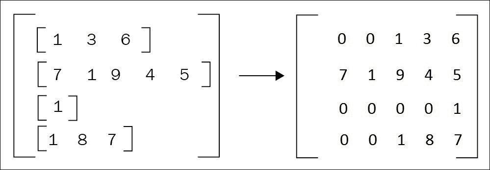
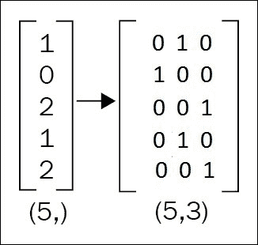
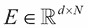
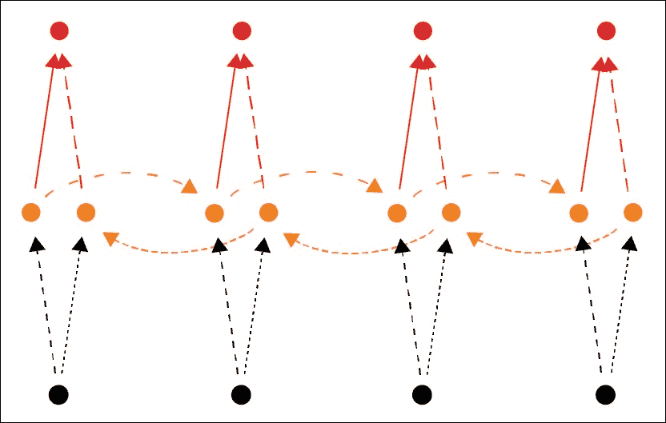

# 第五章：使用双向 LSTM 分析情感

本章更具实用性，以便更好地了解在前两章中介绍的常用循环神经网络和词嵌入。

这也是一个将读者引入深度学习新应用——情感分析的机会，这也是**自然语言处理**（**NLP**）的另一个领域。这是一个多对一的方案，其中一系列可变长度的单词必须分配到一个类别。一个类似可以使用这种方案的 NLP 问题是语言检测（如英语、法语、德语、意大利语等）。

虽然上一章展示了如何从零开始构建循环神经网络，但本章将展示如何使用基于 Theano 构建的高级库 Keras，帮助实现和训练使用预构建模块的模型。通过这个示例，读者应该能够判断何时在项目中使用 Keras。

本章将讨论以下几个要点：

+   循环神经网络和词嵌入的回顾

+   情感分析

+   Keras 库

+   双向循环神经网络

自动化情感分析是识别文本中表达的意见的问题。它通常涉及将文本分类为*积极*、*消极*和*中性*等类别。意见是几乎所有人类活动的核心，它们是我们行为的关键影响因素。

最近，神经网络和深度学习方法被用于构建情感分析系统。这些系统能够自动学习一组特征，以克服手工方法的缺点。

**循环神经网络**（**RNN**）在文献中已被证明是表示序列输入（如文本）的非常有用的技术。循环神经网络的一种特殊扩展——**双向循环神经网络**（**BRNN**）能够捕捉文本中的前后上下文信息。

在本章中，我们将展示一个示例，演示如何使用**长短时记忆**（**LSTM**）架构的双向循环神经网络来解决情感分析问题。我们的目标是实现一个模型，给定一段文本输入（即一系列单词），该模型试图预测其是积极的、消极的还是中性的。

# 安装和配置 Keras

Keras 是一个高级神经网络 API，用 Python 编写，可以在 TensorFlow 或 Theano 上运行。它的开发目的是让实现深度学习模型变得尽可能快速和简单，以便于研究和开发。你可以通过 conda 轻松安装 Keras，如下所示：

```py
conda install keras
```

在编写 Python 代码时，导入 Keras 会告诉你使用的是哪个后端：

```py
>>> import keras
*Using Theano backend.*
*Using cuDNN version 5110 on context None*
*Preallocating 10867/11439 Mb (0.950000) on cuda0*
*Mapped name None to device cuda0: Tesla K80 (0000:83:00.0)*
*Mapped name dev0 to device cuda0: Tesla K80 (0000:83:00.0)*
*Using cuDNN version 5110 on context dev1*
*Preallocating 10867/11439 Mb (0.950000) on cuda1*
*Mapped name dev1 to device cuda1: Tesla K80 (0000:84:00.0)*

```

如果你已经安装了 TensorFlow，它可能不会使用 Theano。要指定使用哪个后端，请编写一个 Keras 配置文件 `~/.keras/keras.json:`。

```py
{
    "epsilon": 1e-07,
    "floatx": "float32",
    "image_data_format": "channels_last",
    "backend": "theano"
}
```

也可以直接通过环境变量指定 Theano 后端：

```py
KERAS_BACKEND=theano python

```

请注意，所使用的设备是我们在 `~/.theanorc` 文件中为 Theano 指定的设备。也可以通过 Theano 环境变量来修改这些变量：

```py
KERAS_BACKEND=theano THEANO_FLAGS=device=cuda,floatX=float32,mode=FAST_RUN python

```

## 使用 Keras 编程

Keras 提供了一套数据预处理和构建模型的方法。

层和模型是对张量的可调用函数，并返回张量。在 Keras 中，层/模块和模型没有区别：一个模型可以是更大模型的一部分，并由多个层组成。这样的子模型作为模块运行，具有输入/输出。

让我们创建一个包含两个线性层、中间加入 ReLU 非线性层并输出 softmax 的网络：

```py
from keras.layers import Input, Dense
from keras.models import Model

inputs = Input(shape=(784,))

x = Dense(64, activation='relu')(inputs)
predictions = Dense(10, activation='softmax')(x)
model = Model(inputs=inputs, outputs=predictions)
```

`model` 模块包含用于获取输入和输出形状的方法，无论是单个输入/输出还是多个输入/输出，并列出我们模块的子模块：

```py
>>> model.input_shape
*(None, 784)*

>>> model.get_input_shape_at(0)
*(None, 784)*

>>> model.output_shape
*(None, 10)*

>>> model.get_output_shape_at(0)
*(None, 10)*

>>> model.name
*'sequential_1'*

>>> model.input
*/dense_3_input*

>>> model.output
*Softmax.0*

>>> model.get_output_at(0)
*Softmax.0*

>>> model.layers
*[<keras.layers.core.Dense object at 0x7f0abf7d6a90>, <keras.layers.core.Dense object at 0x7f0abf74af90>]*

```

为了避免为每一层指定输入，Keras 提出了通过 `Sequential` 模块编写模型的函数式方法，以构建由多个模块或模型组成的新模块或模型。

以下模型定义与之前展示的模型完全相同，使用 `input_dim` 来指定输入维度，否则将无法知道该维度并生成错误：

```py
from keras.models import Sequential
from keras.layers import Dense, Activation

model = Sequential()
model.add(Dense(units=64, input_dim=784, activation='relu'))
model.add(Dense(units=10, activation='softmax'))
```

`model` 被视为可以是更大模型的一部分的模块或层：

```py
model2 = Sequential()
model2.add(model)
model2.add(Dense(units=10, activation='softmax'))
```

每个模块/模型/层都可以进行编译，然后使用数据进行训练：

```py
model.compile(optimizer='rmsprop',
              loss='categorical_crossentropy',
              metrics=['accuracy'])
model.fit(data, labels)
```

让我们实践一下 Keras。

## SemEval 2013 数据集

让我们从准备数据开始。在本章中，我们将使用在 SemEval 2013 竞赛中用于监督任务的 Twitter 情感分类（消息级别）的标准数据集。该数据集包含 3662 条推文作为训练集，575 条推文作为开发集，1572 条推文作为测试集。该数据集中的每个样本包含推文 ID、极性（正面、负面或中性）和推文内容。

让我们下载数据集：

```py
wget http://alt.qcri.org/semeval2014/task9/data/uploads/semeval2013_task2_train.zip
wget http://alt.qcri.org/semeval2014/task9/data/uploads/semeval2013_task2_dev.zip
wget http://alt.qcri.org/semeval2014/task9/data/uploads/semeval2013_task2_test_fixed.zip
unzip semeval2013_task2_train.zip
unzip semeval2013_task2_dev.zip
unzip semeval2013_task2_test_fixed.zip
```

`A` 指的是子任务 A，即消息级情感分类 *我们本章研究的目标*，其中 `B` 指的是子任务 B 的术语级情感分析。

`input` 目录不包含标签，仅包含推文。`full` 目录包含更多级别的分类，*主观* 或 *客观*。我们的关注点是 `gold` 或 `cleansed` 目录。

让我们使用脚本来转换它们：

```py
pip install bs4
python download_tweets.py train/cleansed/twitter-train-cleansed-A.tsv > sem_eval2103.train
python download_tweets.py dev/gold/twitter-dev-gold-A.tsv > sem_eval2103.dev
python download_tweets.py SemEval2013_task2_test_fixed/gold/twitter-test-gold-A.tsv > sem_eval2103.test
```

# 文本数据预处理

正如我们所知，在 Twitter 上常常使用 URL、用户提及和话题标签。因此，我们首先需要按照以下步骤预处理推文。

确保所有的标记（tokens）之间使用空格分隔。每条推文都会被转换为小写字母。

URL、用户提及和话题标签分别被 `<url>`、`<user>` 和 `<hashtag>` 代替。此步骤通过 `process` 函数完成，它以推文为输入，使用 NLTK 的 `TweetTokenizer` 进行分词，进行预处理，并返回推文中的词汇（token）集合：

```py
import re
from nltk.tokenize import TweetTokenizer

def process(tweet):
  tknz = TweetTokenizer()
  tokens = tknz.tokenize(tweet)
  tweet = " ".join(tokens)
  tweet = tweet.lower()
  tweet = re.sub(r'http[s]?://(?:[a-z]|[0-9]|[$-_@.&amp;+]|[!*\(\),]|(?:%[0-9a-f][0-9a-f]))+', '<url>', tweet) # URLs
  tweet = re.sub(r'(?:@[\w_]+)', '<user>', tweet)  # user-mentions
  tweet = re.sub(r'(?:\#+[\w_]+[\w\'_\-]*[\w_]+)', '<hashtag>', tweet)  # hashtags
  tweet = re.sub(r'(?:(?:\d+,?)+(?:\.?\d+)?)', '<number>', tweet)  # numbers
  return tweet.split(" ")
```

例如，如果我们有推文 `RT @mhj: just an example! :D http://example.com #NLP`，该函数的处理过程如下：

```py
tweet = 'RT @mhj: just an example! :D http://example.com #NLP'
print(process(tweet))
```

返回值

```py
[u'rt', u'\<user\>', u':', u'just', u'an', u'example', u'!', u':d', u'\<url\>', u'\<hashtag\>']
```

以下函数用于读取数据集，并返回一个元组列表，每个元组表示一个样本（推文，类别），其中类别是一个整数，取值为 {0, 1 或 2}，定义了情感极性：

```py
def read_data(file_name):
  tweets = []
  labels = []
  polarity2idx = {'positive': 0, 'negative': 1, 'neutral': 2}
  with open(file_name) as fin:
    for line in fin:
      _, _, _, _, polarity, tweet = line.strip().split("\t")
      tweet = process(tweet)
      cls = polarity2idx[polarity]
      tweets.append(tweet)
      labels.append(cls)
  return tweets, labels

train_file = 'sem_eval2103.train'
dev_file = 'sem_eval2103.dev'

train_tweets, y_train = read_data(train_file)
dev_tweets, y_dev = read_data(dev_file)
```

现在，我们可以构建词汇表，它是一个字典，用于将每个单词映射到一个固定的索引。以下函数接收一个数据集作为输入，并返回词汇表和推文的最大长度：

```py
def get_vocabulary(data):
  max_len = 0
  index = 0
  word2idx = {'<unknown>': index}
  for tweet in data:
    max_len = max(max_len, len(tweet))
    for word in tweet:
      if word not in word2idx:
        index += 1
        word2idx[word] = index
  return word2idx, max_len

word2idx, max_len = get_vocabulary(train_tweets)
vocab_size = len(word2idx)
```

我们还需要一个函数，将每条推文或一组推文转换为基于词汇表的索引，如果单词存在的话，否则用未知标记（索引 0）替换**词汇表外**（**OOV**）的单词，具体如下：

```py
def transfer(data, word2idx):
  transfer_data = []
  for tweet in data:
    tweet2vec = []
    for word in tweet:
      if word in word2idx:
        tweet2vec.append(word2idx[word])
      else:
        tweet2vec.append(0)
    transfer_data.append(tweet2vec)
  return transfer_data

X_train = transfer(train_tweets, word2idx)
X_dev  = transfer(dev_tweets, word2idx)
```

我们可以节省一些内存：

```py
del train_tweets, dev_tweets
```

Keras 提供了一个辅助方法来填充序列，确保它们具有相同的长度，以便一批序列可以通过张量表示，并在 CPU 或 GPU 上对张量进行优化操作。

默认情况下，该方法会在序列开头进行填充，这有助于获得更好的分类结果：



```py
from keras.preprocessing.sequence import pad_sequences
X_train = pad_sequences(X_train, maxlen=max_len, truncating='post')
X_dev = pad_sequences(X_dev, maxlen=max_len, truncating='post')
```

最后，Keras 提供了一个方法，通过添加一个维度，将类别转换为它们的一热编码表示：



使用 Keras 的 `to_categorical` 方法：

```py
from keras.utils.np_utils import to_categorical
y_train = to_categorical(y_train)
y_dev = to_categorical(y_dev)
```

# 设计模型架构

本示例中的模型主要模块如下：

+   首先，输入句子的单词会被映射为实数向量。这个步骤称为词的向量表示或词嵌入（更多细节，请参见第三章，*将单词编码为向量*）。

+   然后，使用双向 LSTM 编码器将这组向量表示为一个固定长度的实值向量。这个向量总结了输入句子，并包含基于词向量的语义、句法和/或情感信息。

+   最后，这个向量通过一个 softmax 分类器，将句子分类为正面、负面或中立。

## 词的向量表示

词嵌入是分布式语义学的一种方法，它将单词表示为实数向量。这种表示具有有用的聚类特性，因为在语义和句法上相关的单词会被表示为相似的向量（参见第三章，*将单词编码为向量*）。

这一步的主要目的是将每个单词映射到一个连续的、低维的实值向量，这些向量可以作为任何模型的输入。所有单词向量被堆叠成一个矩阵 ；其中，`N` 是词汇表大小，d 是向量维度。这个矩阵被称为嵌入层或查找表层。嵌入矩阵可以使用预训练模型（如 **Word2vec** 或 **Glove**）进行初始化。

在 Keras 中，我们可以简单地定义嵌入层，如下所示：

```py
from keras.layers import Embedding
d = 100
emb_layer = Embedding(vocab_size + 1, output_dim=d, input_length=max_len)
```

第一个参数表示词汇表大小，`output_dim` 是向量维度，`input_length` 是输入序列的长度。

让我们将此层作为输入层添加到模型中，并声明模型为顺序模型：

```py
from keras.models import Sequential
model = Sequential()
model.add(emb_layer)
```

## 使用双向 LSTM 进行句子表示

循环神经网络具有表示序列（如句子）的能力。然而，在实际应用中，由于梯度消失/爆炸问题，使用普通的 RNN 学习长期依赖关系是困难的。如前一章所述，**长短期记忆**（**LSTM**）网络被设计为具有更持久的记忆（即状态），专门用于保持和传递长期信息，这使得它们在捕捉序列中元素之间的长期依赖关系方面非常有用。

LSTM 单元是本章所用模型的基本组件。

Keras 提供了一种方法 `TimeDistributed`，用于在多个时间步上克隆任何模型并使其具有递归性。但对于常用的递归单元，如 LSTM，Keras 中已经存在一个模块：

```py
from keras.layers import LSTM
rnn_size = 64
lstm = LSTM(rnn_size, input_shape=(max_len, d))
```

以下内容相同：

```py
lstm = LSTM(rnn_size, input_dim=d, input_length=max_len)
```

对于后续层，我们无需指定输入大小（这是因为 LSTM 层位于嵌入层之后），因此我们可以简单地定义 `lstm` 单元，如下所示：

```py
lstm = LSTM(rnn_size)
```

最后但同样重要的是，在这个模型中，我们希望使用双向 LSTM。它已经证明能够带来更好的结果，在给定前一个词的情况下捕捉当前词的含义，以及在之后出现的词：



为了让这个单元以双向方式处理输入，我们可以简单地使用 Bidirectional，这是一个针对 RNN 的双向封装器：

```py
from keras.layers import Bidirectional
bi_lstm = Bidirectional(lstm)
model.add(bi_lstm)
```

## 使用 softmax 分类器输出概率

最后，我们可以将从 `bi_lstm` 获得的向量传递给 softmax 分类器，如下所示：

```py
from keras.layers import Dense, Activation

nb_classes = 3
fc = Dense(nb_classes)
classifier = Activation('softmax')
model.add(fc)
model.add(classifier)
```

现在，让我们打印出模型的摘要：

```py
print(model.summary())
Which will end with the results:
Using Theano backend:
__________________________________________________________________________________________
Layer (type)                      Output Shape        Param #         Connected to                     
=========================================================================================
embedding_1 (Embedding)           (None, 30, 100)     10000100    embedding_input_1[0][0]          
_________________________________________________________________________________________
bidirectional_1 (Bidirectional)   (None, 128)            84480          embedding_1[0][0]                
__________________________________________________________________________________________
dense_1 (Dense)                   (None, 3)                387      bidirectional_1[0][0]            
__________________________________________________________________________________________
activation_1 (Activation)         (None, 3)                  0              dense_1[0][0]                    
=========================================================================================
Total params: 10,084,967
Trainable params: 10,084,967
Non-trainable params: 0
__________________________________________________________________________________________
```

# 编译和训练模型

现在，模型已定义，准备好进行编译。要在 Keras 中编译模型，我们需要确定优化器、损失函数，并可选地指定评估指标。如前所述，问题是预测推文是正面、负面还是中立的。这是一个多类别分类问题。因此，在这个示例中使用的损失（或目标）函数是 `categorical_crossentropy`。我们将使用 `rmsprop` 优化器和准确率评估指标。

在 Keras 中，您可以找到实现的最先进的优化器、目标函数和评估指标。使用编译函数在 Keras 中编译模型非常简单：

```py
model.compile(optimizer='rmsprop',
          loss='categorical_crossentropy',
          metrics=['accuracy'])
```

我们已经定义并编译了模型，现在它已经准备好进行训练。我们可以通过调用 fit 函数在定义的数据上训练或拟合模型。

训练过程会经过若干次数据集迭代，称为 epochs，可以通过`epochs`参数来指定。我们还可以使用`batch_size`参数设置每次训练时输入给模型的实例数。在本例中，我们将使用较小的`epochs` = `30`，并使用较小的批次大小`10`。我们还可以通过显式地使用`validation_data`参数输入开发集来在训练过程中评估模型，或者通过`validation_split`参数选择训练集的一个子集。在本例中，我们将使用之前定义的开发集：

```py
model.fit(x=X_train, y=y_train, batch_size=10, epochs=30, validation_data=[X_dev, y_dev])
```

# 评估模型

我们已经在训练集上训练了模型，现在可以评估网络在测试集上的性能。可以使用`evaluation()`函数来完成这一操作。该函数返回模型在测试模式下的损失值和指标值：

```py
test_file = 'sem_eval2103.test'
test_tweets, y_test = read_data(test_file)

X_test  = transfer(test_tweets, word2idx)

del test_twee 

X_test = pad_sequences(X_test, maxlen=max_len, truncating='post')

y_test = to_categorical(y_test)

test_loss, test_acc = model.evaluate(X_test, y_test)

print("Testing loss: {:.5}; Testing Accuracy: {:.2%}" .format(test_loss, test_acc))
```

# 保存和加载模型

要保存 Keras 模型的权重，只需调用`save`函数，模型将序列化为`.hdf5`格式：

```py
model.save('bi_lstm_sentiment.h5')
```

要加载模型，请使用 Keras 提供的`load_model`函数，如下所示：

```py
from keras.models import load_model
loaded_model = load_model('bi_lstm_sentiment.h5')
```

它现在已经准备好进行评估，并且无需重新编译。例如，在相同的测试集上，我们必须获得相同的结果：

```py
test_loss, test_acc = loaded_model.evaluate(X_test, y_test)
print("Testing loss: {:.5}; Testing Accuracy: {:.2%}" .format(test_loss, test_acc))
```

# 运行示例

要运行模型，我们可以执行以下命令行：

```py
python bilstm.py
```

# 进一步阅读

请参考以下文章：

+   *SemEval Sentiment Analysis in Twitter* [`www.cs.york.ac.uk/semeval-2013/task2.html`](https://www.cs.york.ac.uk/semeval-2013/task2.html)

+   *Personality insights with IBM Watson demo* [`personality-insights-livedemo.mybluemix.net/`](https://personality-insights-livedemo.mybluemix.net/)

+   *Tone analyzer* [`tone-analyzer-demo.mybluemix.net/`](https://tone-analyzer-demo.mybluemix.net/)

+   *Keras* [`keras.io/`](https://keras.io/)

+   Deep Speech: 扩展端到端语音识别，Awni Hannun, Carl Case, Jared Casper, Bryan Catanzaro, Greg Diamos, Erich Elsen, Ryan Prenger, Sanjeev Satheesh, Shubho Sengupta, Adam Coates, Andrew Y. Ng, 2014

+   深度递归神经网络语音识别，Alex Graves, Abdel-Rahman Mohamed, Geoffrey Hinton, 2013

+   Deep Speech 2：英语和普通话的端到端语音识别，作者：Dario Amodei, Rishita Anubhai, Eric Battenberg, Carl Case, Jared Casper, Bryan Catanzaro, Jingdong Chen, Mike Chrzanowski, Adam Coates, Greg Diamos, Erich Elsen, Jesse Engel, Linxi Fan, Christopher Fougner, Tony Han, Awni Hannun, Billy Jun, Patrick LeGresley, Libby Lin, Sharan Narang, Andrew Ng, Sherjil Ozair, Ryan Prenger, Jonathan Raiman, Sanjeev Satheesh, David Seetapun, Shubho Sengupta, Yi Wang, Zhiqian Wang, Chong Wang, Bo Xiao, Dani Yogatama, Jun Zhan, Zhenyao Zhu，2015

# 总结

本章回顾了前几章介绍的基本概念，同时介绍了一种新应用——情感分析，并介绍了一个高层次的库 Keras，旨在简化使用 Theano 引擎开发模型的过程。

这些基本概念包括循环网络、词嵌入、批量序列填充和类别独热编码。为了提高结果，提出了双向递归。

在下一章中，我们将看到如何将递归应用于图像，使用一个比 Keras 更轻量的库 Lasagne，它能让你更顺利地将库模块与自己的 Theano 代码结合。
