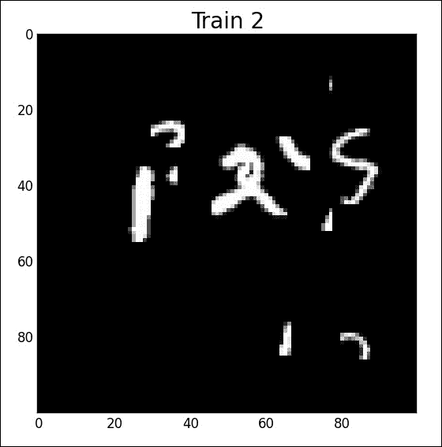

# 第六章：使用空间变换器网络进行定位

本章将 NLP 领域留到后面再回到图像，并展示递归神经网络在图像中的应用实例。在第二章，*使用前馈网络分类手写数字*中，我们处理了图像分类的问题，即预测图像的类别。在这里，我们将讨论对象定位，这是计算机视觉中的一个常见任务，旨在预测图像中对象的边界框。

而第二章，*使用前馈网络分类手写数字*通过使用线性层、卷积层和非线性激活函数构建的神经网络解决了分类任务，而空间变换器是一个新的模块，基于非常特定的方程，专门用于定位任务。

为了在图像中定位多个对象，空间变换器是通过递归网络构成的。本章借此机会展示如何在**Lasagne**中使用预构建的递归网络，Lasagne 是一个基于 Theano 的库，提供额外的模块，并通过预构建的组件帮助你快速开发神经网络，同时不改变你使用 Theano 构建和处理网络的方式。

总结来说，主题列表由以下内容组成：

+   Lasagne 库简介

+   空间变换器网络

+   带有空间变换器的分类网络

+   使用 Lasagne 的递归模块

+   数字的递归读取

+   使用铰链损失函数的无监督训练

+   基于区域的对象定位神经网络

# 使用 Lasagne 的 MNIST CNN 模型

Lasagne 库打包了层和工具，能够轻松处理神经网络。首先，让我们安装最新版本的 Lasagne：

```py
pip install --upgrade https://github.com/Lasagne/Lasagne/archive/master.zip
```

让我们使用 Lasagne 重新编写第二章，*使用前馈网络分类手写数字*中的 MNIST 模型：

```py
def model(l_input, input_dim=28, num_units=256, num_classes=10, p=.5):

    network = lasagne.layers.Conv2DLayer(
            l_input, num_filters=32, filter_size=(5, 5),
            nonlinearity=lasagne.nonlinearities.rectify,
            W=lasagne.init.GlorotUniform())

    network = lasagne.layers.MaxPool2DLayer(network, pool_size=(2, 2))

    network = lasagne.layers.Conv2DLayer(
            network, num_filters=32, filter_size=(5, 5),
            nonlinearity=lasagne.nonlinearities.rectify)

    network = lasagne.layers.MaxPool2DLayer(network, pool_size=(2, 2))

    if num_units > 0:
        network = lasagne.layers.DenseLayer(
                lasagne.layers.dropout(network, p=p),
                num_units=num_units,
                nonlinearity=lasagne.nonlinearities.rectify)

    if (num_units > 0) and (num_classes > 0):
        network = lasagne.layers.DenseLayer(
                lasagne.layers.dropout(network, p=p),
                num_units=num_classes,
                nonlinearity=lasagne.nonlinearities.softmax)

    return network
```

层包括`layer0_input`、`conv1_out`、`pooled_out`、`conv2_out`、`pooled2_out`、`hidden_output`。它们是通过预构建的模块构建的，例如，`InputLayer`、`Conv2DLayer`、`MaxPool2DLayer`、`DenseLayer`，以及诸如修正线性单元（rectify）或 softmax 的丢弃层非线性和`GlorotUniform`的初始化方式。

要连接由模块组成的网络图，将输入符号`var`与输出`var`连接，使用以下代码：

```py
input_var = T.tensor4('inputs')
l_input = lasagne.layers.InputLayer(shape=(None, 1, 28, 28), input_var=input_var)
network = mnist_cnn.model(l_input)
prediction = lasagne.layers.get_output(network)
```

或者使用这段代码：

```py
l_input = lasagne.layers.InputLayer(shape=(None, 1, 28, 28))
network = mnist_cnn.model(l_input)

input_var = T.tensor4('inputs')
prediction = lasagne.layers.get_output(network, input_var)
```

一个非常方便的功能是，你可以打印任何模块的输出形状：

```py
print(l_input.output_shape)
```

Lasagne 的`get_all_params`方法列出了模型的参数：

```py
params = lasagne.layers.get_all_params(network, trainable=True)
for p in params:
    print p.name
```

最后，Lasagne 提供了不同的学习规则，如`RMSprop`、`Nesterov` `Momentum`、`Adam`和`Adagrad`：

```py
target_var = T.ivector('targets')
loss = lasagne.objectives.categorical_crossentropy(prediction, target_var)
loss = loss.mean()

updates = lasagne.updates.nesterov_momentum(
        loss, params, learning_rate=0.01, momentum=0.9)

train_fn = theano.function([input_var, target_var], loss, updates=updates)
```

其他所有内容保持不变。

为了测试我们的 MNIST 模型，下载 MNIST 数据集：

```py
wget http://www.iro.umontreal.ca/~lisa/deep/data/mnist/mnist.pkl.gz -P /sharedfiles
```

训练一个 MNIST 分类器来进行数字分类：

```py
python 1-train-mnist.py
```

模型参数保存在 `model.npz` 中。准确率再次超过 99%。

# 一个定位网络

在 **空间变换网络** (**STN**) 中，想法不是直接将网络应用于输入图像信号，而是添加一个模块来预处理图像，对其进行裁剪、旋转和缩放以适应物体，从而辅助分类：


空间变换网络

为此，STNs 使用一个定位网络来预测仿射变换参数并处理输入：


空间变换网络

在 Theano 中，仿射变换的微分是自动完成的，我们只需通过仿射变换将定位网络与分类网络的输入连接起来。

首先，我们创建一个与 MNIST CNN 模型相差不远的定位网络，用于预测仿射变换的六个参数：

```py
l_in = lasagne.layers.InputLayer((None, dim, dim))
l_dim = lasagne.layers.DimshuffleLayer(l_in, (0, 'x', 1, 2))
l_pool0_loc = lasagne.layers.MaxPool2DLayer(l_dim, pool_size=(2, 2))
l_dense_loc = mnist_cnn.model(l_pool0_loc, input_dim=dim, num_classes=0)

b = np.zeros((2, 3), dtype=theano.config.floatX)
b[0, 0] = 1.0
b[1, 1] = 1.0

l_A_net = lasagne.layers.DenseLayer(
    l_dense_loc,
    num_units=6,
    name='A_net',
    b=b.flatten(),
    W=lasagne.init.Constant(0.0),
    nonlinearity=lasagne.nonlinearities.identity)
```

在这里，我们只需通过 `DimshuffleLayer` 向输入数组添加一个通道维度，该维度的值仅为 1。这样的维度添加被称为广播。

池化层将输入图像大小调整为 *50x50*，这足以确定数字的位置。

定位层的权重初始化为零，偏置则初始化为单位仿射参数；STN 模块在开始时不会产生任何影响，整个输入图像将被传输。

根据仿射参数进行裁剪：

```py
l_transform = lasagne.layers.TransformerLayer(
    incoming=l_dim,
    localization_network=l_A_net,
    downsample_factor=args.downsample)
```

`down_sampling_factor` 使我们能够根据输入定义输出图像的大小。在这种情况下，它的值是三，意味着图像将是 *33x33*——与我们的 MNIST 数字大小 *28x28* 相差不远。最后，我们简单地将 MNIST CNN 模型添加到分类输出中：

```py
l_out = mnist_cnn.model(l_transform, input_dim=dim, p=sh_drp, num_units=400)
```

为了测试分类器，让我们创建一些 *100x100* 像素的图像，带有一些变形和一个数字：

```py
python create_mnist_sequence.py --nb_digits=1
```

绘制前三个图像（对应 1、0、5）：

```py
python plot_data.py mnist_sequence1_sample_8distortions_9x9.npz
```


运行命令以训练模型：

```py
python 2-stn-cnn-mnist.py
```

在这里，当数字没有变形时，准确率超过 99%，这通常是仅用简单的 MNIST CNN 模型无法实现的，并且在有变形的情况下，准确率超过 96.9%。

绘制裁剪图像的命令是：

```py
python plot_crops.py res_test_2.npz
```

它给我们带来了以下结果：


带有变形的情况：


STN 可以被看作是一个模块，可以包含在任何网络中，位于两个层之间的任何地方。为了进一步提高分类结果，在分类网络的不同层之间添加多个 STN 有助于获得更好的结果。

这是一个包含两个分支的网络示例，每个分支都有自己的 SPN，它们在无监督的情况下将尝试捕捉图像的不同部分进行分类：


（空间变换网络论文，Jaderberg 等，2015 年）

## 应用于图像的递归神经网络

这个想法是使用递归来读取多个数字，而不仅仅是一个：


为了读取多个数字，我们只需将定位前馈网络替换为递归网络，它将输出多个仿射变换，分别对应于每个数字：


从前面的例子中，我们将全连接层替换为 GRU 层：

```py
l_conv2_loc = mnist_cnn.model(l_pool0_loc, input_dim=dim, p=sh_drp, num_units=0)

class Repeat(lasagne.layers.Layer):
    def __init__(self, incoming, n, **kwargs):
        super(Repeat, self).__init__(incoming, **kwargs)
        self.n = n

    def get_output_shape_for(self, input_shape):
        return tuple([input_shape[0], self.n] + list(input_shape[1:]))

    def get_output_for(self, input, **kwargs):
        tensors = [input]*self.n
        stacked = theano.tensor.stack(*tensors)
        dim = [1, 0] + range(2, input.ndim+1)
        return stacked.dimshuffle(dim)

l_repeat_loc = Repeat(l_conv2_loc, n=num_steps)
l_gru = lasagne.layers.GRULayer(l_repeat_loc, num_units=num_rnn_units,
unroll_scan=True)

l_shp = lasagne.layers.ReshapeLayer(l_gru, (-1, num_rnn_units))  
```

这将输出一个维度为(None, 3, 256)的张量，其中第一维是批量大小，3 是 GRU 中的步骤数，256 是隐藏层的大小。在这个层的上面，我们仅仅添加一个和之前一样的全连接层，输出三个初始的身份图像：

```py
b = np.zeros((2, 3), dtype=theano.config.floatX)
b[0, 0] = 1.0
b[1, 1] = 1.0

l_A_net = lasagne.layers.DenseLayer(
    l_shp,
    num_units=6,
    name='A_net',
    b=b.flatten(),
    W=lasagne.init.Constant(0.0),
    nonlinearity=lasagne.nonlinearities.identity)

l_conv_to_transform = lasagne.layers.ReshapeLayer(
    Repeat(l_dim, n=num_steps), [-1] + list(l_dim.output_shape[-3:]))

l_transform = lasagne.layers.TransformerLayer(
    incoming=l_conv_to_transform,
    localization_network=l_A_net,
    downsample_factor=args.downsample)

l_out = mnist_cnn.model(l_transform, input_dim=dim, p=sh_drp, num_units=400)
```

为了测试分类器，我们创建一些具有*100x100*像素的图像，并加入一些扭曲，这次包含三个数字：

```py
python create_mnist_sequence.py --nb_digits=3 --output_dim=100
```

绘制前三个图像（对应序列**296**、**490**、**125**）：

```py
python plot_data.py mnist_sequence3_sample_8distortions_9x9.npz
```



让我们运行命令来训练我们的递归模型：

```py
python 3-recurrent-stn-mnist.py
*Epoch 0 Acc Valid 0.268833333333, Acc Train = 0.268777777778, Acc Test = 0.272466666667*
*Epoch 1 Acc Valid 0.621733333333, Acc Train = 0.611116666667, Acc Test = 0.6086*
*Epoch 2 Acc Valid 0.764066666667, Acc Train = 0.75775, Acc Test = 0.764866666667*
*Epoch 3 Acc Valid 0.860233333333, Acc Train = 0.852294444444, Acc Test = 0.859566666667*
*Epoch 4 Acc Valid 0.895333333333, Acc Train = 0.892066666667, Acc Test = 0.8977*
*Epoch 53 Acc Valid 0.980433333333, Acc Train = 0.984261111111, Acc Test = 0.97926666666*

```

分类准确率为 99.3%。

绘制裁剪图：

```py
python plot_crops.py res_test_3.npz
```


# 带有共同定位的无监督学习

在第二章中训练的数字分类器的前几层，*使用前馈网络分类手写数字*作为编码函数，将图像表示为嵌入空间中的向量，就像对待单词一样：


通过最小化随机集的合页损失目标函数，有可能训练空间变换网络的定位网络，这些图像被认为包含相同的数字：


最小化这个和意味着修改定位网络中的权重，使得两个定位的数字比两个随机裁剪的数字更接近。

这是结果：


（空间变换网络论文，Jaderberg 等，2015 年）

# 基于区域的定位网络

历史上，目标定位的基本方法是使用分类网络在滑动窗口中；它的过程是将一个窗口在每个方向上逐像素滑动，并在每个位置和每个尺度上应用分类器。分类器学习判断目标是否存在且居中。这需要大量的计算，因为模型必须在每个位置和尺度上进行评估。

为了加速这一过程，Fast-R-CNN 论文中的**区域提议网络**（**RPN**）由研究员 Ross Girshick 提出，目的是将神经网络分类器的全连接层（如 MNIST CNN）转换为卷积层；事实上，在 28x28 的图像上，卷积层和线性层之间没有区别，只要卷积核的尺寸与输入相同。因此，任何全连接层都可以重写为卷积层，使用相同的权重和适当的卷积核尺寸，这使得网络能够在比 28x28 更大的图像上工作，输出在每个位置的特征图和分类得分。唯一的区别可能来自于整个网络的步幅，步幅可以设置为不同于 1，并且可以很大（例如几个 10 像素），通过将卷积核的步幅设置为不同于 1，以减少评估位置的数量，从而减少计算量。这样的转换是值得的，因为卷积非常高效：


Faster R-CNN：使用区域提议网络实现实时物体检测

已经设计了一种端到端网络，借鉴了解卷积原理，其中输出特征图一次性给出所有的边界框：**你只看一次**（**YOLO**）架构预测每个位置可能的 B 个边界框。每个边界框由其坐标（x, y, w, h）按比例表示为回归问题，并具有一个与**交并比**（**IOU**）相对应的置信度（概率），该交并比表示该框与真实框之间的重叠程度。类似的方式也提出了 SSD 模型。

最后，在第八章中介绍的分割网络，*使用编码-解码网络进行翻译和解释*，也可以看作是神经网络实现的目标定位方法。

# 进一步阅读

你可以进一步参考以下来源以获取更多信息：

+   空间变换网络，Max Jaderberg, Karen Simonyan, Andrew Zisserman, Koray Kavukcuoglu, 2015 年 6 月

+   循环空间变换网络，Søren Kaae Sønderby, Casper Kaae Sønderby, Lars Maaløe, Ole Winther, 2015 年 9 月

+   原始代码：[`github.com/skaae/recurrent-spatial-transformer-code`](https://github.com/skaae/recurrent-spatial-transformer-code)

+   谷歌街景字符识别，Jiyue Wang, Peng Hui How

+   使用卷积神经网络在野外读取文本，Max Jaderberg, Karen Simonyan, Andrea Vedaldi, Andrew Zisserman, 2014 年

+   使用深度卷积神经网络从街景图像中进行多位数字识别，Ian J. Goodfellow, Yaroslav Bulatov, Julian Ibarz, Sacha Arnoud, Vinay Shet, 2013

+   从谷歌街景图像中识别字符，Guan Wang, Jingrui Zhang

+   《用于自然场景文本识别的合成数据与人工神经网络》，Max Jaderberg，Karen Simonyan，Andrea Vedaldi，Andrew Zisserman，2014 年

+   去掉 R 的 R-CNN，Karel Lenc，Andrea Vedaldi，2015 年

+   Fast R-CNN，Ross Girshick，2015 年

+   Faster R-CNN：基于区域提议网络的实时物体检测，Shaoqing Ren，Kaiming He，Ross Girshick，Jian Sun，2015 年

+   你只需看一次：统一的实时物体检测，Joseph Redmon，Santosh Divvala，Ross Girshick，Ali Farhadi，2015 年 6 月

+   YOLO 实时演示 [`pjreddie.com/darknet/yolo/`](http://pjreddie.com/darknet/yolo/)

+   YOLO9000：更好、更快、更强，Joseph Redmon，Ali Farhadi，2016 年 12 月

+   SSD：单次多框检测器，Wei Liu，Dragomir Anguelov，Dumitru Erhan，Christian Szegedy，Scott Reed，Cheng-Yang Fu，Alexander C. Berg，2015 年 12 月

+   精确的物体检测和语义分割的丰富特征层次，Ross Girshick，Jeff Donahue，Trevor Darrell，Jitendra Malik，2013 年

+   文本流：一种统一的自然场景图像文本检测系统，Shangxuan Tian，Yifeng Pan，Chang Huang，Shijian Lu，Kai Yu，Chew Lim Tan，2016 年

# 总结

空间变换器层是一个原创模块，用于定位图像区域、裁剪并调整大小，帮助分类器集中注意图像中的相关部分，从而提高准确性。该层由可微分的仿射变换组成，参数通过另一个模型——定位网络进行计算，并且可以像往常一样通过反向传播进行学习。

使用循环神经单元可以推断出图像中读取多个数字的应用示例。为了简化工作，引入了 Lasagne 库。

空间变换器是众多定位方法中的一种；基于区域的定位方法，如 YOLO、SSD 或 Faster RCNN，提供了最先进的边界框预测结果。

在下一章中，我们将继续进行图像识别，探索如何对包含比数字更多信息的完整图像进行分类，例如室内场景和户外风景的自然图像。与此同时，我们将继续使用 Lasagne 的预构建层和优化模块。
