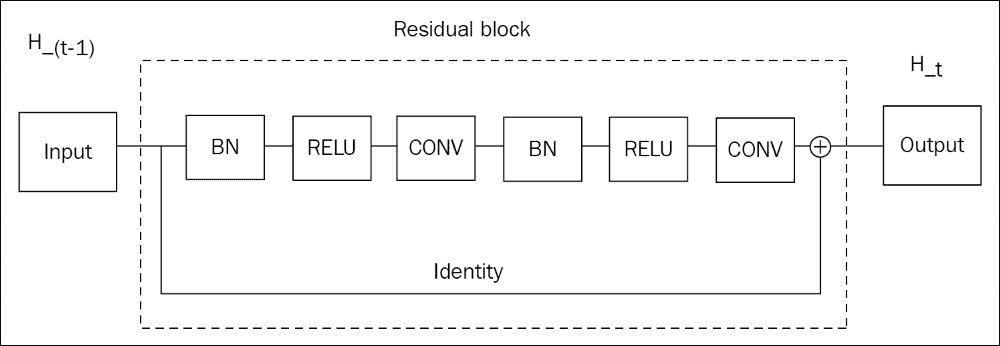

# 第七章：使用残差网络分类图像

本章介绍了用于图像分类的最先进的深度网络。

残差网络已成为最新的架构，准确性大幅提高，并且更为简洁。

在残差网络之前，已经有很长时间的架构历史，比如**AlexNet**、**VGG**、**Inception**（**GoogLeNet**）、**Inception v2、v3 和 v4**。研究人员一直在寻找不同的概念，并发现了一些潜在的规律来设计更好的架构。

本章将涉及以下主题：

+   图像分类评估的主要数据集

+   图像分类的网络架构

+   批量归一化

+   全局平均池化

+   残差连接

+   随机深度

+   密集连接

+   多 GPU

+   数据增强技术

# 自然图像数据集

图像分类通常包括比 MNIST 手写数字更广泛的物体和场景。它们大多数是自然图像，意味着人类在现实世界中观察到的图像，例如风景、室内场景、道路、山脉、海滩、人类、动物和汽车，而不是合成图像或计算机生成的图像。

为了评估图像分类网络在自然图像上的表现，研究人员通常使用三个主要数据集来比较性能：

+   Cifar-10 数据集包含 60,000 张小图像（32x32），仅分为 10 类，您可以轻松下载：

    ```py
    wget https://www.cs.toronto.edu/~kriz/cifar-10-python.tar.gz -P /sharedfiles
    tar xvzf /sharedfiles/cifar-10-python.tar.gz -C /sharedfiles/
    ```

    下面是每个类别的一些示例图像：

    

    Cifar 10 数据集类别及样本 [`www.cs.toronto.edu/~kriz/cifar.html`](https://www.cs.toronto.edu/~kriz/cifar.html)

+   Cifar-100 数据集包含 60,000 张图像，分为 100 类和 20 个超级类别

+   ImageNet 数据集包含 120 万张图像，标注了广泛的类别（1,000 类）。由于 ImageNet 仅供非商业用途，您可以下载 Food 101 数据集，该数据集包含 101 种餐食类别，每个类别有 1,000 张图像：

    ```py
    wget http://data.vision.ee.ethz.ch/cvl/food-101.tar.gz -P /sharedfiles
    tar xvzf food-101.tar.gz -C /sharedfiles/
    ```

在介绍残差架构之前，让我们讨论两种提高分类网络准确度的方法：批量归一化和全局平均池化。

## 批量归一化

更深的网络，超过 100 层，可以帮助图像分类多个类别。深度网络的主要问题是确保输入流以及梯度能够从网络的一端有效传播到另一端。

然而，网络中的非线性部分饱和，梯度变为零并不罕见。此外，网络中的每一层都必须适应其输入分布的持续变化，这一现象被称为**内部协变量偏移**。

已知，网络训练时，输入数据经过线性处理以使均值为零、方差为单位（称为**网络输入归一化**）能加速训练，并且每个输入特征应独立归一化，而不是联合归一化。

要规范化网络中每一层的输入，稍微复杂一些：将输入的均值归零会忽略前一层学习到的偏置，而当方差为单位时，问题更加严重。当该层的输入被归一化时，前一层的参数可能会无限增长，而损失保持不变。

因此，对于**层输入规范化**，**批量归一化层**在归一化后重新学习尺度和偏置：


它不使用整个数据集，而是使用批次来计算归一化的统计量，并通过移动平均来接近整个数据集的统计信息，同时进行训练。

一个批量归一化层具有以下好处：

+   它减少了不良初始化或过高学习率的影响

+   它提高了网络的准确性

+   它加速了训练

+   它减少了过拟合，起到正则化模型的作用

引入批量归一化层时，可以移除 dropout，增加学习率，并减少 L2 权重规范化。

小心将非线性激活放在 BN 层之后，并去除前一层的偏置：

```py
l = NonlinearityLayer(
      BatchNormLayer(
        ConvLayer(l_in,
          num_filters=n_filters[0],
          filter_size=(3,3),
          stride=(1,1),
          nonlinearity=None,
          pad='same',
          W=he_norm)
      ),
      nonlinearity=rectify
  )
```

## 全局平均池化

传统上，分类网络的最后两层是全连接层和 softmax 层。全连接层输出一个等于类别数量的特征数，softmax 层将这些值归一化为概率，且它们的和为 1。

首先，可以将步幅为 2 的最大池化层替换为步幅为 2 的新的卷积层：全卷积网络的表现更好。

其次，也可以移除全连接层。如果最后一个卷积层输出的特征图数量选择为类别数，全球空间平均池化将每个特征图缩减为一个标量值，表示在不同*宏观*空间位置上类的得分平均值：


# 残差连接

虽然非常深的架构（具有许多层）表现更好，但它们更难训练，因为输入信号在层与层之间逐渐减弱。有人尝试在多个阶段训练深度网络。

这种逐层训练的替代方法是向网络中添加一个附加连接，跳过一个块的层，称为**恒等连接**，它将信号传递而不作任何修改，除了经典的卷积层，称为**残差**，形成一个**残差块**，如下图所示：



这样的残差块由六层组成。

残差网络是由多个残差块组成的网络。输入经过第一层卷积处理，然后是批量归一化和非线性激活：


例如，对于由两个残差块组成的残差网络，且第一卷积层有八个特征图，输入图像的大小为 *28x28*，层的输出形状如下：

```py
InputLayer                       (None, 1, 28, 28)
Conv2DDNNLayer                   (None, 8, 28, 28)
BatchNormLayer                   (None, 8, 28, 28)
NonlinearityLayer                (None, 8, 28, 28)
Conv2DDNNLayer                   (None, 8, 28, 28)
BatchNormLayer                   (None, 8, 28, 28)
NonlinearityLayer                (None, 8, 28, 28)
Conv2DDNNLayer                   (None, 8, 28, 28)
ElemwiseSumLayer                 (None, 8, 28, 28)
BatchNormLayer                   (None, 8, 28, 28)
NonlinearityLayer                (None, 8, 28, 28)
Conv2DDNNLayer                   (None, 8, 28, 28)
BatchNormLayer                   (None, 8, 28, 28)
NonlinearityLayer                (None, 8, 28, 28)
Conv2DDNNLayer                   (None, 8, 28, 28)
ElemwiseSumLayer                 (None, 8, 28, 28)
BatchNormLayer                   (None, 8, 28, 28)
NonlinearityLayer                (None, 8, 28, 28)
Conv2DDNNLayer                   (None, 16, 14, 14)
BatchNormLayer                   (None, 16, 14, 14)
NonlinearityLayer                (None, 16, 14, 14)
Conv2DDNNLayer                   (None, 16, 14, 14)
Conv2DDNNLayer                   (None, 16, 14, 14)
ElemwiseSumLayer                 (None, 16, 14, 14)
BatchNormLayer                   (None, 16, 14, 14)
NonlinearityLayer                (None, 16, 14, 14)
Conv2DDNNLayer                   (None, 16, 14, 14)
BatchNormLayer                   (None, 16, 14, 14)
NonlinearityLayer                (None, 16, 14, 14)
Conv2DDNNLayer                   (None, 16, 14, 14)
ElemwiseSumLayer                 (None, 16, 14, 14)
BatchNormLayer                   (None, 16, 14, 14)
NonlinearityLayer                (None, 16, 14, 14)
Conv2DDNNLayer                   (None, 32, 7, 7)
BatchNormLayer                   (None, 32, 7, 7)
NonlinearityLayer                (None, 32, 7, 7)
Conv2DDNNLayer                   (None, 32, 7, 7)
Conv2DDNNLayer                   (None, 32, 7, 7)
ElemwiseSumLayer                 (None, 32, 7, 7)
BatchNormLayer                   (None, 32, 7, 7)
NonlinearityLayer                (None, 32, 7, 7)
Conv2DDNNLayer                   (None, 32, 7, 7)
BatchNormLayer                   (None, 32, 7, 7)
NonlinearityLayer                (None, 32, 7, 7)
Conv2DDNNLayer                   (None, 32, 7, 7)
ElemwiseSumLayer                 (None, 32, 7, 7)
BatchNormLayer                   (None, 32, 7, 7)
NonlinearityLayer                (None, 32, 7, 7)
GlobalPoolLayer                  (None, 32)
DenseLayer                       (None, 10)
```

输出特征图的数量增加，而每个输出特征图的大小减小：这种技术通过**减小特征图大小/增加维度的数量保持每层参数数量不变**，这是构建网络时常见的最佳实践。

为了增加维度，在三个不同位置进行了三次维度转换，第一次在第一个残差块之前，第二次在 n 个残差块之后，第三次在 *2xn* 个残差块之后。每个转换之间，过滤器的数量按数组定义：

```py
# 8 -> 8 -> 16 -> 32
n_filters = {0:8, 1:8, 2:16, 3:32}
```

维度增加是通过相应残差块的第一层进行的。由于输入的形状与输出不同，简单的恒等连接无法与块层的输出拼接，因此用维度投影代替，以将输出的大小调整为块输出的维度。这样的投影可以通过一个`1x1`的卷积核，步幅为`2`来实现：

```py
def residual_block(l, transition=False, first=False, filters=16):
    if transition:
        first_stride = (2,2)
    else:
        first_stride = (1,1)

    if first:
        bn_pre_relu = l
    else:
        bn_pre_conv = BatchNormLayer(l)
        bn_pre_relu = NonlinearityLayer(bn_pre_conv, rectify)

    conv_1 = NonlinearityLayer(BatchNormLayer(ConvLayer(bn_pre_relu, num_filters=filters, filter_size=(3,3), stride=first_stride, 
          nonlinearity=None, 
          pad='same', 
          W=he_norm)),nonlinearity=rectify)

    conv_2 = ConvLayer(conv_1, num_filters=filters, filter_size=(3,3), stride=(1,1), nonlinearity=None, pad='same', W=he_norm)

  # add shortcut connections
    if transition:
        # projection shortcut, as option B in paper
        projection = ConvLayer(bn_pre_relu, num_filters=filters, filter_size=(1,1), stride=(2,2), nonlinearity=None, pad='same', b=None)
    elif conv_2.output_shape == l.output_shape:
        projection=l
    else:
        projection = ConvLayer(bn_pre_relu, num_filters=filters, filter_size=(1,1), stride=(1,1), nonlinearity=None, pad='same', b=None)

    return ElemwiseSumLayer([conv_2, projection])
```

也有一些变种的残差块被发明出来。

一个宽版（Wide-ResNet）残差块是通过增加每个残差块的输出数量来构建的，当它们到达末端时，这个增加是通过一个倍数来实现的：

```py
n_filters = {0:num_filters, 1:num_filters*width, 2:num_filters`2`width, 3:num_filters`4`width}
```

一个瓶颈版本通过减少每层的参数数量来创建一个瓶颈，它具有降维效果，实施赫布理论 *共同发放的神经元会相互连接*，并帮助残差块捕获信号中的特定模式：


瓶颈是同时减少特征图大小和输出数量，而不是像之前的做法那样保持每层参数数量不变：

```py
def residual_bottleneck_block(l, transition=False, first=False, filters=16):
    if transition:
        first_stride = (2,2)
    else:
        first_stride = (1,1)

    if first:
        bn_pre_relu = l
    else:
        bn_pre_conv = BatchNormLayer(l)
        bn_pre_relu = NonlinearityLayer(bn_pre_conv, rectify)

    bottleneck_filters = filters / 4

    conv_1 = NonlinearityLayer(BatchNormLayer(ConvLayer(bn_pre_relu, num_filters=bottleneck_filters, filter_size=(1,1), stride=(1,1), nonlinearity=None, pad='same', W=he_norm)),nonlinearity=rectify)

    conv_2 = NonlinearityLayer(BatchNormLayer(ConvLayer(conv_1, num_filters=bottleneck_filters, filter_size=(3,3), stride=first_stride, nonlinearity=None, pad='same', W=he_norm)),nonlinearity=rectify)

    conv_3 = ConvLayer(conv_2, num_filters=filters, filter_size=(1,1), stride=(1,1), nonlinearity=None, pad='same', W=he_norm)

    if transition:
        projection = ConvLayer(bn_pre_relu, num_filters=filters, filter_size=(1,1), stride=(2,2), nonlinearity=None, pad='same', b=None)
    elif first:
        projection = ConvLayer(bn_pre_relu, num_filters=filters, filter_size=(1,1), stride=(1,1), nonlinearity=None, pad='same', b=None)
    else:
        projection = l

    return ElemwiseSumLayer([conv_3, projection])
```

现在，完整的三堆残差块网络已经构建完成：

```py
def model(shape, n=18, num_filters=16, num_classes=10, width=1, block='normal'):
  l_in = InputLayer(shape=(None, shape[1], shape[2], shape[3]))
  l = NonlinearityLayer(BatchNormLayer(ConvLayer(l_in, num_filters=n_filters[0], filter_size=(3,3), stride=(1,1), nonlinearity=None, pad='same', W=he_norm)),nonlinearity=rectify)

  l = residual_block(l, first=True, filters=n_filters[1])
 for _ in range(1,n):
      l = residual_block(l, filters=n_filters[1])

  l = residual_block(l, transition=True, filters=n_filters[2])
  for _ in range(1,n):
      l = residual_block(l, filters=n_filters[2])

  l = residual_block(l, transition=True, filters=n_filters[3])
  for _ in range(1,n):
      l = residual_block(l, filters=n_filters[3])

  bn_post_conv = BatchNormLayer(l)
  bn_post_relu = NonlinearityLayer(bn_post_conv, rectify)
  avg_pool = GlobalPoolLayer(bn_post_relu)
  return DenseLayer(avg_pool, num_units=num_classes, W=HeNormal(), nonlinearity=softmax)
```

用于 MNIST 训练的命令：

```py
 python train.py --dataset=mnist --n=1 --num_filters=8 --batch_size=500
```

这带来了 98%的 top-1 精度。

在 Cifar 10 上，残差网络层数超过 100 层时，需要将批量大小减少到 64，以适应 GPU 的内存：

+   对于 ResNet-110（6 x 18 + 2）：

    ```py
     python train.py --dataset=cifar10 --n=18 --num_filters=16 --batch_size=64
    ```

+   ResNet-164（6 x 27 + 2）：

    ```py
     python train.py --dataset=cifar10 --n=27 --num_filters=16 --batch_size=64
    ```

+   宽版 ResNet-110：

    ```py
     python train.py --dataset=cifar10 --n=18 --num_filters=16 --width=4 --batch_size=64
    ```

+   使用 ResNet-bottleneck-164：

    ```py
     python train.py --dataset=cifar10 --n=18 --num_filters=16 --block=bottleneck --batch_size=64
    ```

+   对于 Food-101，我进一步减少了 ResNet 110 的批量大小：

    ```py
     python train.py --dataset=food101 --batch_size=10 --n=18 --num_filters=16
    ```

# 随机深度

由于信号在层间传播时可能在任何一个残差块中出现错误，随机深度的想法是通过随机移除一些残差块并用恒等连接替代，来训练网络的鲁棒性。

首先，由于参数数量较少，训练速度更快。其次，实践证明它具有鲁棒性，并且能提供更好的分类结果：


# 密集连接

随机深度通过创建直接连接来跳过一些随机的层。更进一步地，除了移除一些随机层外，另一种实现相同功能的方法是为之前的层添加一个身份连接：


一个密集块（密集连接卷积网络）

至于残差块，一个密集连接的卷积网络由重复的密集块组成，以创建一堆层块：


具有密集块的网络（密集连接卷积网络）

这种架构选择遵循了在第十章中看到的相同原则，*使用高级 RNN 预测时间序列*，带有高速公路网络：身份连接有助于信息在网络中正确传播和反向传播，从而减少了在层数较高时出现的*梯度爆炸/消失*问题。

在 Python 中，我们将残差块替换为一个密集连接块：

```py
def dense_block(network, transition=False, first=False, filters=16):
    if transition:
        network = NonlinearityLayer(BatchNormLayer(network), nonlinearity=rectify)
        network = ConvLayer(network,network.output_shape[1], 1, pad='same', W=he_norm, b=None, nonlinearity=None)
        network = Pool2DLayer(network, 2, mode='average_inc_pad')

    network = NonlinearityLayer(BatchNormLayer(network), nonlinearity=rectify)
    conv = ConvLayer(network,filters, 3, pad='same', W=he_norm, b=None, nonlinearity=None)
    return ConcatLayer([network, conv], axis=1)
```

另请注意，批量归一化是逐特征进行的，由于每个块的输出已经归一化，因此不需要第二次归一化。用一个简单的仿射层替代批量归一化层，学习连接归一化特征的尺度和偏置即可：

```py
def dense_fast_block(network, transition=False, first=False, filters=16):
    if transition:
        network = NonlinearityLayer(BiasLayer(ScaleLayer(network)), nonlinearity=rectify)
        network = ConvLayer(network,network.output_shape[1], 1, pad='same', W=he_norm, b=None, nonlinearity=None)
        network = BatchNormLayer(Pool2DLayer(network, 2, mode='average_inc_pad'))

    network = NonlinearityLayer(BiasLayer(ScaleLayer(network)), nonlinearity=rectify)
    conv = ConvLayer(network,filters, 3, pad='same', W=he_norm, b=None, nonlinearity=None)
    return ConcatLayer([network, BatchNormLayer(conv)], axis=1)
```

用于训练 DenseNet-40：

```py
python train.py --dataset=cifar10 --n=13 --num_filters=16 --block=dense_fast --batch_size=64
```

# 多 GPU

Cifar 和 MNIST 图像仍然较小，低于 35x35 像素。自然图像的训练需要保留图像中的细节。例如，224x224 的输入大小就非常合适，这比 35x35 大了 40 倍。当具有如此输入大小的图像分类网络有几百层时，GPU 内存限制了批次大小，最多只能处理十几张图像，因此训练一个批次需要很长时间。

要在多 GPU 模式下工作：

1.  模型参数是共享变量，意味着在 CPU / GPU 1 / GPU 2 / GPU 3 / GPU 4 之间共享，和单 GPU 模式一样。

1.  批次被分成四个部分，每个部分被送到不同的 GPU 进行计算。网络输出在每个部分上计算，梯度被反向传播到每个权重。GPU 返回每个权重的梯度值。

1.  每个权重的梯度从多个 GPU 拉回到 CPU 并堆叠在一起。堆叠后的梯度代表了整个初始批次的梯度。

1.  更新规则应用于批次梯度，并更新共享的模型权重。

请参见下图：


Theano 稳定版本仅支持每个进程一个 GPU，因此在主程序中使用第一个 GPU，并为每个 GPU 启动子进程进行训练。请注意，前述图像中的循环需要同步模型的更新，以避免每个 GPU 在不同步的模型上进行训练。与其自己重新编程，不如使用 Platoon 框架（[`github.com/mila-udem/platoon`](https://github.com/mila-udem/platoon)），该框架专门用于在一个节点内跨多个 GPU 训练模型。

另外，值得注意的是，将多个 GPU 上的批量归一化均值和方差同步会更加准确。

# 数据增强

数据增强是提高分类精度的一个非常重要的技术。数据增强通过从现有样本创建新样本来实现，方法是添加一些抖动，例如：

+   随机缩放

+   随机大小裁剪

+   水平翻转

+   随机旋转

+   光照噪声

+   亮度抖动

+   饱和度抖动

+   对比抖动

这将帮助模型在现实生活中常见的不同光照条件下变得更加鲁棒。

模型每一轮都会发现不同的样本，而不是始终看到相同的数据集。

请注意，输入归一化对于获得更好的结果也很重要。

# 深入阅读

你可以参考以下标题以获得更多见解：

+   密集连接卷积网络，Gao Huang，Zhuang Liu，Kilian Q. Weinberger 和 Laurens van der Maaten，2016 年 12 月

+   代码灵感来源于 Lasagne 仓库：

    +   [`github.com/Lasagne/Recipes/blob/master/papers/deep_residual_learning/Deep_Residual_Learning_CIFAR-10.py`](https://github.com/Lasagne/Recipes/blob/master/papers/deep_residual_learning/Deep_Residual_Learning_CIFAR-10.py)

    +   [`github.com/Lasagne/Recipes/tree/master/papers/densenet`](https://github.com/Lasagne/Recipes/tree/master/papers/densenet)

+   Inception-v4，Inception-ResNet 和残差连接对学习的影响，Christian Szegedy，Sergey Ioffe，Vincent Vanhoucke 和 Alex Alemi，2016

+   图像识别的深度残差学习，Kaiming He，Xiangyu Zhang 和 Shaoqing Ren，Jian Sun，2015

+   重新思考计算机视觉中的 Inception 架构，Christian Szegedy，Vincent Vanhoucke，Sergey Ioffe，Jonathon Shlens 和 Zbigniew Wojna，2015

+   宽残差网络，Sergey Zagoruyko 和 Nikos Komodakis，2016

+   深度残差网络中的恒等映射，Kaiming He，Xiangyu Zhang，Shaoqing Ren 和 Jian Sun，2016 年 7 月

+   网络中的网络，Min Lin，Qiang Chen，Shuicheng Yan，2013

# 总结

已经提出了新技术来实现最先进的分类结果，如批量归一化、全局平均池化、残差连接和密集块。

这些技术推动了残差网络和密集连接网络的构建。

使用多个 GPU 有助于训练图像分类网络，这些网络具有多个卷积层、大的感受野，并且批量输入的图像在内存使用上较重。

最后，我们研究了数据增强技术如何增加数据集的大小，减少模型过拟合的可能性，并学习更稳健网络的权重。

在下一章中，我们将看到如何利用这些网络的早期层作为特征来构建编码器网络，以及如何反转卷积以重建输出图像，以进行像素级预测。
