# 第八章. 使用编码解码网络进行翻译与解释

编码解码技术在输入和输出属于同一空间时应用。例如，图像分割是将输入图像转换为新图像，即分割掩码；翻译是将字符序列转换为新的字符序列；问答则是以新的字词序列回答输入的字词序列。

为了应对这些挑战，编码解码网络由两部分对称组成：编码网络和解码网络。编码器网络将输入数据编码成一个向量，解码器网络则利用该向量生成输出，例如*翻译*、*回答*输入问题、*解释*或*输入句子或输入图像的注释*。

编码器网络通常由前几层组成，这些层属于前面章节中介绍的网络类型，但没有用于降维和分类的最后几层。这样一个截断的网络会生成一个多维向量，称为*特征*，它为解码器提供一个*内部状态表示*，用于生成输出表示。

本章分解为以下关键概念：

+   序列到序列网络

+   机器翻译应用

+   聊天机器人应用

+   反卷积

+   图像分割应用

+   图像标注应用

+   解码技术的改进

# 自然语言处理中的序列到序列网络

基于规则的系统正在被端到端神经网络所取代，因为后者在性能上有所提升。

端到端神经网络意味着网络直接通过示例推断所有可能的规则，而无需了解潜在的规则，如语法和词形变化；单词（或字符）直接作为输入喂入网络。输出格式也是如此，输出可以直接是单词索引本身。网络架构通过其系数负责学习这些规则。

适用于**自然语言处理**（**NLP**）的端到端编码解码网络架构是**序列到序列网络**，如以下图所示：

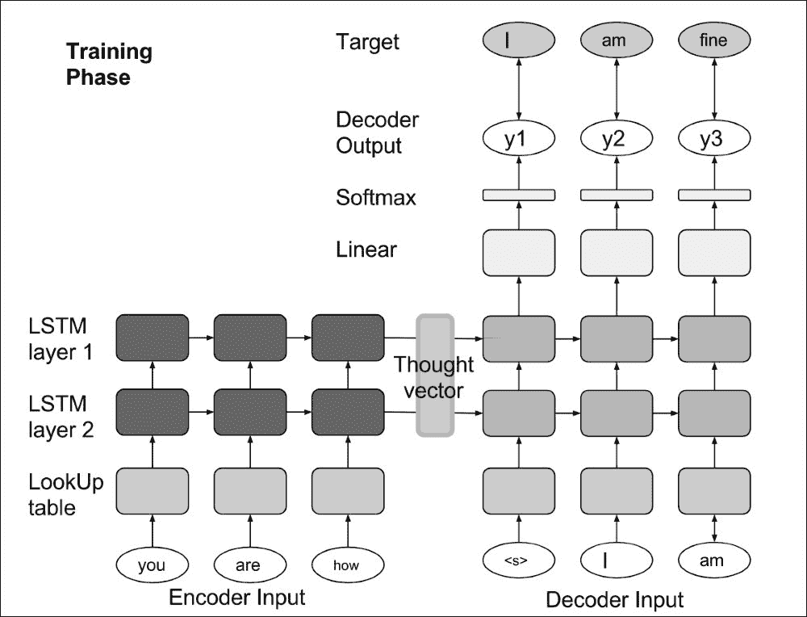

单词索引通过查找表转换为其在嵌入空间中的连续多维值。这一转换，详见第三章，*将单词编码为向量*，是将离散的单词索引编码到神经网络能够处理的高维空间中的关键步骤。

然后，首先对输入的单词嵌入执行一堆 LSTM 操作，用以编码输入并生成思维向量。第二堆 LSTM 以这个向量作为初始内部状态，并且期望为目标句子中的每个单词生成下一个单词。

在核心部分，是我们经典的 LSTM 单元步骤函数，包含输入、遗忘、输出和单元门：

```py
def LSTM( hidden_size):
  W = shared_norm((hidden_size, 4*hidden_size))
  U = shared_norm((hidden_size, 4*hidden_size))
  b = shared_zeros(4*hidden_size)

  params = [W, U, b]

  def forward(m, X, h_, C_ ):
    XW = T.dot(X, W)
    h_U = T.dot(h_, U)
    bfr_actv = XW + h_U + b

    f = T.nnet.sigmoid( bfr_actv[:, 0:hidden_size] )
    i = T.nnet.sigmoid( bfr_actv[:, 1*hidden_size:2*hidden_size] )
    o = T.nnet.sigmoid( bfr_actv[:, 2*hidden_size:3*hidden_size] )
    Cp = T.tanh( bfr_actv[:, 3*hidden_size:4*hidden_size] )

    C = i*Cp + f*C_
    h = o*T.tanh( C )
    C = m[:, None]*C + (1.0 - m)[:, None]*C_
    h = m[:, None]*h + (1.0 - m)[:, None]*h_

    h, C = T.cast(h, theano.config.floatX), T.cast(h, theano.config.floatX)
    return h, C

  return forward, params
```

一个简单的闭包比一个类更好。没有足够的方法和参数去写一个类。编写类要求添加许多`self`，并且每个变量之前都要有一个`__init__`方法。

为了减少计算成本，整个层栈被构建成一个一步函数，并且递归性被添加到整个栈步骤函数的顶部，该步骤函数会为每个时间步生成最后一层的输出。其他一些实现让每一层都独立递归，这样效率要低得多（慢于两倍以上）。

在*X*输入的顶部，使用一个掩码变量`m`，当设置为零时，停止递归：当没有更多数据时，隐藏状态和单元状态保持不变（掩码值为零）。由于输入是批量处理的，因此每个批次中的句子可能有不同的长度，并且借助掩码，所有批次中的句子都可以并行处理，步数与最大句子长度相同。递归会在批次中每行的不同位置停止。

类的闭包是因为模型不能像先前示例那样直接应用于某些符号输入变量：实际上，模型是应用于递归循环内的序列（使用扫描操作符）。因此，在许多高级深度学习框架中，每一层都被设计为一个模块，暴露出前向/反向方法，可以添加到各种架构中（并行分支和递归），正如本示例所示。

编码器/解码器的完整栈步骤函数，放置在它们各自的递归循环内，可以设计如下：

```py
def stack( voca_size, hidden_size, num_layers, embedding=None, target_voca_size=0):
    params = []

    if embedding == None:
        embedding = shared_norm( (voca_size, hidden_size) )
        params.append(embedding)

    layers = []
    for i in range(num_layers):
        f, p = LSTM(hidden_size)
        layers.append(f)
        params += p

    def forward( mask, inputs, h_, C_, until_symbol = None):
        if until_symbol == None :
            output = embedding[inputs]
        else:
            output = embedding[T.cast( inputs.argmax(axis=-1), "int32" )]

        hos = []
        Cos = []
      for i in range(num_layers):
            hs, Cs = layersi
            hos.append(hs)
            Cos.append(Cs)
            output = hs

        if target_voca_size != 0:
            output_embedding = shared_norm((hidden_size, target_voca_size))
            params.append(output_embedding)
            output = T.dot(output, output_embedding)

        outputs = (T.cast(output, theano.config.floatX),T.cast(hos, theano.config.floatX),T.cast(Cos, theano.config.floatX))

        if until_symbol != None:
            return outputs, theano.scan_module.until( T.eq(output.argmax(axis=-1)[0], until_symbol) )

        return outputs

    return forward, params
```

第一部分是将输入转换为嵌入空间。第二部分是 LSTM 层的堆栈。对于解码器（当`target_voca_size != 0`时），添加了一个线性层来计算输出。

现在我们有了我们的编码器/解码器步骤函数，让我们构建完整的编码器-解码器网络。

首先，编码器-解码器网络必须将输入编码成内部状态表示：

```py
encoderInputs, encoderMask = T.imatrices(2)
h0,C0 = T.tensor3s(2)

encoder, encoder_params = stack(valid_data.source_size, opt.hidden_size, opt.num_layers)

([encoder_outputs, hS, CS], encoder_updates) = theano.scan(
  fn = encoder,
  sequences = [encoderMask, encoderInputs],
  outputs_info = [None, h0, C0])
```

为了编码输入，编码栈步骤函数会在每个单词上递归地运行。

当`outputs_info`由三个变量组成时，扫描操作符认为扫描操作的输出由三个值组成。

这些输出来自编码栈步骤函数，并且对应于：

+   栈的输出

+   栈的隐藏状态，以及

+   栈的单元状态，对于输入句子的每个步骤/单词

在`outputs_info`中，`None`表示考虑到编码器将产生三个输出，但只有最后两个会被反馈到步骤函数中（`h0 -> h_` 和 `C0 -> C_`）。

由于序列指向两个序列，scan 操作的步骤函数必须处理四个参数。

然后，一旦输入句子被编码成向量，编码器-解码器网络将其解码：

```py
decoderInputs, decoderMask, decoderTarget = T.imatrices(3)

decoder, decoder_params = stack(valid_data.target_size, opt.hidden_size, opt.num_layers, target_voca_size=valid_data.target_size)

([decoder_outputs, h_vals, C_vals], decoder_updates) = theano.scan(
  fn = decoder,
  sequences = [decoderMask, decoderInputs],
  outputs_info = [None, hS[-1], CS[-1]])

params = encoder_params + decoder_params

```

编码器网络的最后状态`hS[-1]`和`CS[-1]`将作为解码器网络的初始隐藏状态和细胞状态输入。

在输出上计算对数似然度与上一章关于序列的内容相同。

对于评估，最后预测的单词必须输入解码器中，以预测下一个单词，这与训练有所不同，在训练中输入和输出序列是已知的：

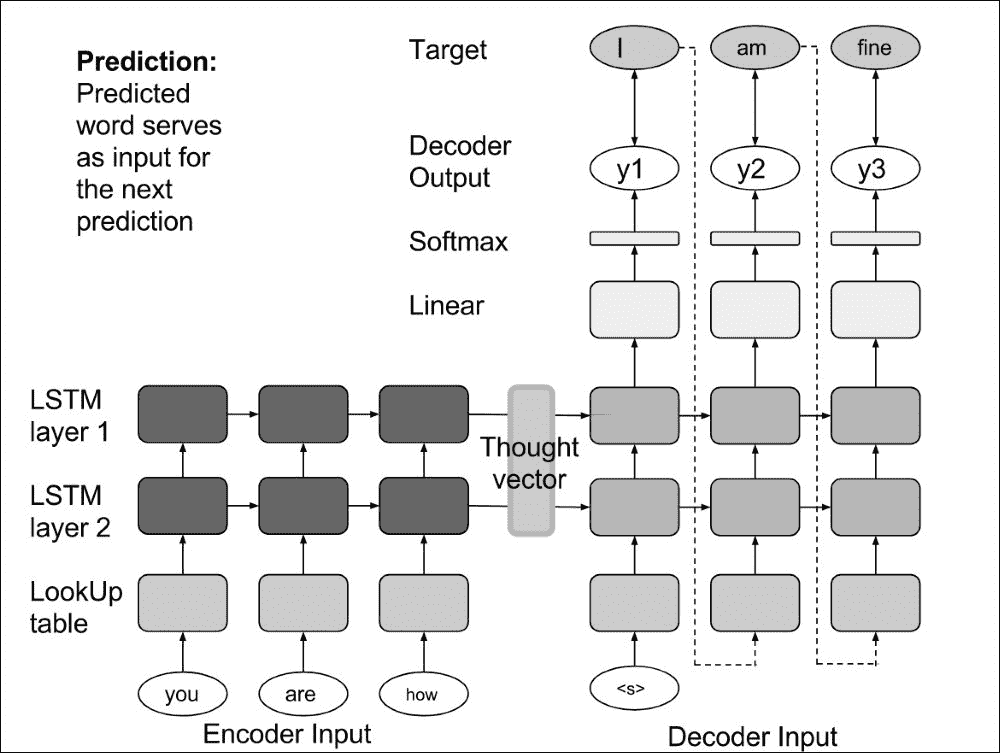

在这种情况下，`outputs_info`中的`None`可以替换为初始值`prediction_start`，即`start`标记。由于它不再是`None`，该初始值将被输入到解码器的步骤函数中，只要它与`h0`和`C0`一起存在。scan 操作符认为每个步骤都有三个先前的值输入到解码器函数（而不是像之前那样只有两个）。由于`decoderInputs`已从输入序列中移除，因此传递给解码器堆栈步骤函数的参数数量仍然是四个：先前预测的输出值将取代输入值。这样，同一个解码器函数可以同时用于训练和预测：

```py
prediction_mask = theano.shared(np.ones(( opt.max_sent_size, 1), dtype="int32"))

prediction_start = np.zeros(( 1, valid_data.target_size), dtype=theano.config.floatX)
prediction_start[0, valid_data.idx_start] = 1
prediction_start = theano.shared(prediction_start)

([decoder_outputs, h_vals, C_vals], decoder_updates) = theano.scan(
  fn = decoder,
  sequences = [prediction_mask],
  outputs_info = [prediction_start, hS[-1], CS[-1]],
  non_sequences = valid_data.idx_stop
  )
```

非序列参数`valid_data.idx_stop`告诉解码器步骤函数，它处于预测模式，这意味着输入不是单词索引，而是其先前的输出（需要找到最大索引）。

同样，在预测模式下，一次预测一个句子（批量大小为`1`）。当产生`end`标记时，循环停止，这得益于解码器堆栈步骤函数中的`theano.scan_module.until`输出，之后无需再解码更多单词。

# 用于翻译的 Seq2seq

**序列到序列**（**Seq2seq**）网络的第一个应用是语言翻译。

该翻译任务是为**计算语言学协会**（**ACL**）的会议设计的，数据集 WMT16 包含了不同语言的新闻翻译。此数据集的目的是评估新的翻译系统或技术。我们将使用德英数据集。

1.  首先，预处理数据：

    ```py
    python 0-preprocess_translations.py --srcfile data/src-train.txt --targetfile data/targ-train.txt --srcvalfile data/src-val.txt --targetvalfile data/targ-val.txt --outputfile data/demo
    First pass through data to get vocab...
    Number of sentences in training: 10000
    Number of sentences in valid: 2819
    Source vocab size: Original = 24995, Pruned = 24999
    Target vocab size: Original = 35816, Pruned = 35820
    (2819, 2819)
    Saved 2819 sentences (dropped 181 due to length/unk filter)
    (10000, 10000)
    Saved 10000 sentences (dropped 0 due to length/unk filter)
    Max sent length (before dropping): 127
    ```

1.  训练`Seq2seq`网络：

    ```py
    python 1-train.py  --dataset translation
    ```

    初看之下，你会注意到每个周期的 GPU 时间是*445.906425953*，因此比 CPU 快十倍（*4297.15962195*）。

1.  训练完成后，将英语句子翻译成德语，加载已训练的模型：

    ```py
    python 1-train.py  --dataset translation --model model_translation_e100_n2_h500
    ```

# 用于聊天机器人的 Seq2seq

序列到序列网络的第二个目标应用是问答系统或聊天机器人。

为此，下载 Cornell 电影对话语料库并进行预处理：

```py
wget http://www.mpi-sws.org/~cristian/data/cornell_movie_dialogs_corpus.zip -P /sharedfiles/
unzip /sharedfiles/cornell_movie_dialogs_corpus.zip  -d /sharedfiles/cornell_movie_dialogs_corpus

python 0-preprocess_movies.py
```

该语料库包含大量富含元数据的虚构对话，数据来自原始电影剧本。

由于源语言和目标语言的句子使用相同的词汇表，解码网络可以使用与编码网络相同的词嵌入：

```py
if opt.dataset == "chatbot":
    embeddings = encoder_params[0]
```

对于`chatbot`数据集，相同的命令也适用：

```py
python 1-train.py  --dataset chatbot # training
python 1-train.py  --dataset chatbot --model model_chatbot_e100_n2_h500 # answer my question
```

# 提高序列到序列网络的效率

在聊天机器人示例中，第一个值得注意的有趣点是输入序列的反向顺序：这种技术已被证明能改善结果。

对于翻译任务，使用双向 LSTM 来计算内部状态是非常常见的，正如在第五章中所看到的，*使用双向 LSTM 分析情感*：两个 LSTM，一个按正向顺序运行，另一个按反向顺序运行，两个并行处理序列，它们的输出被连接在一起：

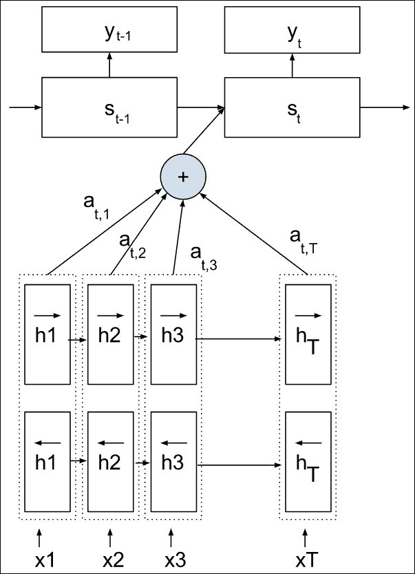

这种机制能够更好地捕捉给定未来和过去的信息。

另一种技术是*注意力机制*，这是下一章的重点。

最后，*精细化技术*已经开发并在二维 Grid LSTM 中进行了测试，这与堆叠 LSTM 相差不大（唯一的区别是在深度/堆叠方向上的门控机制）：

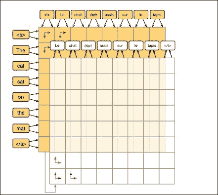

Grid 长短期记忆

精细化的原则是也在输入句子上按两种顺序运行堆栈，顺序进行。这个公式的思想是让编码器网络在正向编码之后重新访问或重新编码句子，并隐式地捕捉一些时间模式。此外，请注意，二维网格提供了更多可能的交互作用来进行这种重新编码，在每个预测步骤重新编码向量，使用之前输出的单词作为下一个预测单词的方向。所有这些改进与更大的计算能力有关，对于这个重新编码器网络，其复杂度为**O(n m)**（*n*和*m*分别表示输入和目标句子的长度），而对于编码-解码网络来说，其复杂度为**O(n+m)**。

所有这些技术都有助于降低困惑度。当模型训练时，还可以考虑使用**束搜索算法**，该算法会在每个时间步跟踪多个预测及其概率，而不是仅跟踪一个，以避免一个错误的预测排名第一时导致后续错误预测。

# 图像的反卷积

在图像的情况下，研究人员一直在寻找作为编码卷积逆操作的解码操作。

第一个应用是对卷积网络的分析与理解，如在第二章中所示，*使用前馈网络分类手写数字*，它由卷积层、最大池化层和修正线性单元组成。为了更好地理解网络，核心思想是可视化图像中对于网络某个单元最具判别性的部分：在高层特征图中的一个神经元被保持为非零，并且从该激活信号开始，信号会反向传播回二维输入。

为了通过最大池化层重建信号，核心思想是在正向传递过程中跟踪每个池化区域内最大值的位置。这种架构被称为**DeConvNet**，可以表示为：

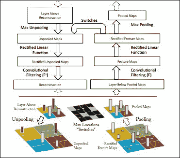

可视化和理解卷积网络

信号会被反向传播到在正向传递过程中具有最大值的位置。

为了通过 ReLU 层重建信号，已提出了三种方法：

+   *反向传播*仅反向传播到那些在正向传递过程中为正的位置。

+   *反向 DeConvNet*仅反向传播正梯度

+   *引导反向传播*仅反向传播到满足两个先前条件的位置：在正向传递过程中输入为正，并且梯度为正。

这些方法在下图中进行了说明：

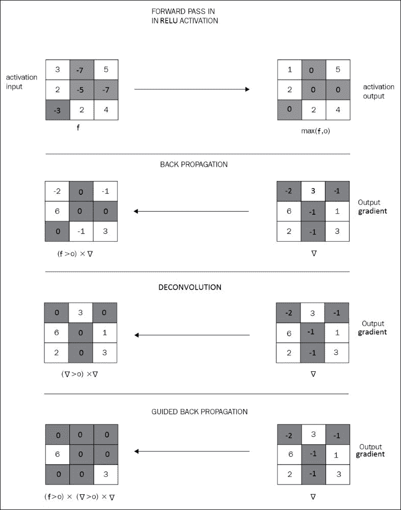

从第一层的反向传播给出了各种类型的滤波器：

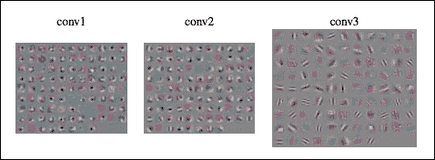

然而，从网络的更高层开始，引导反向传播给出了更好的结果：

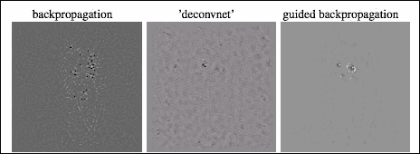

也可以将反向传播条件化为输入图像，这样将激活多个神经元，并从中应用反向传播，以获得更精确的输入可视化：

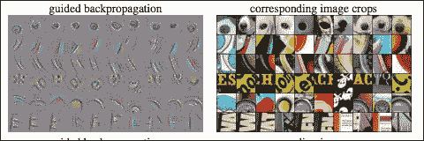

反向传播也可以应用于原始输入图像，而不是空白图像，这一过程被谷歌研究命名为**Inceptionism**，当反向传播用于增强输出概率时：

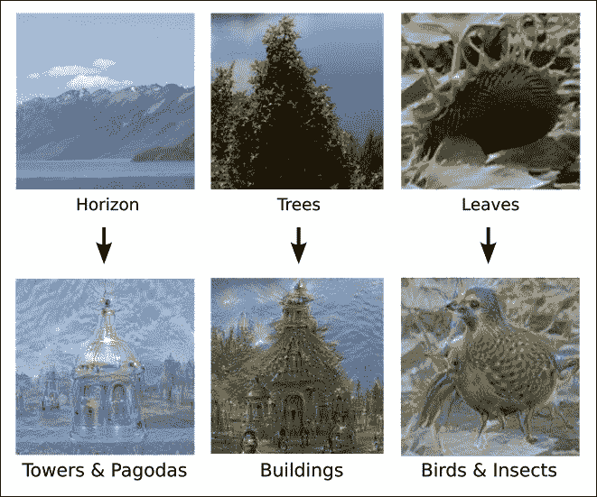

但反卷积的主要目的是用于场景分割或图像语义分析，其中反卷积被学习的上采样卷积所替代，如**SegNet 网络**中所示：

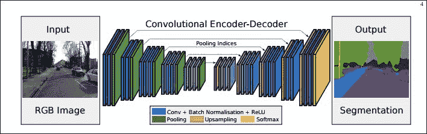

SegNet：一种用于图像分割的深度卷积编码器-解码器架构

在反卷积过程中，每一步通常会将较低输入特征与当前特征进行连接，以进行上采样。

**DeepMask 网络**采取一种混合方法，仅对包含对象的补丁进行反卷积。为此，它在包含对象的 224x224 输入补丁（平移误差±16 像素）上进行训练，而不是完整的图像：

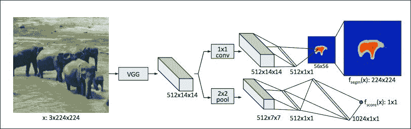

学习分割对象候选

编码器（VGG-16）网络的卷积层有一个 16 倍的下采样因子，导致特征图为 14x14。

一个联合学习训练两个分支，一个用于分割，一个用于评分，判断补丁中对象是否存在、是否居中以及是否在正确的尺度上。

相关分支是语义分支，它将 14x14 特征图中的对象上采样到 56x56 的分割图。上采样是可能的，如果：

+   一个全连接层，意味着上采样图中的每个位置都依赖于所有特征，并且具有全局视野来预测值。

+   一个卷积（或局部连接层），减少了参数数量，但也通过部分视图预测每个位置的分数。

+   一种混合方法，由两个线性层组成，二者之间没有非线性，旨在执行降维操作，如前图所示

输出掩膜随后通过一个简单的双线性上采样层被上采样回原始的 224x224 补丁维度。

为了处理完整的输入图像，可以将全连接层转换为卷积层，卷积核大小等于全连接层的输入大小，并使用相同的系数，这样网络在应用到完整图像时就变成了完全卷积的网络，步长为 16。

随着序列到序列网络通过双向重新编码机制得到改进，**SharpMask**方法通过在等效尺度上使用输入卷积特征来改善上采样反卷积过程的锐度：

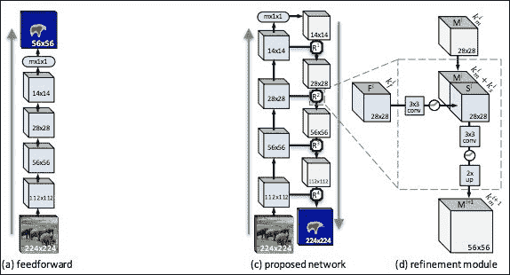

学习细化对象分割

而 SegNet 方法仅通过跟踪最大池化索引产生的上采样图来学习反卷积，SharpMask 方法直接重用输入特征图，这是一种非常常见的粗到细方法。

最后，请记住，通过应用**条件随机场**（**CRF**）后处理步骤，可以进一步改善结果，无论是对于一维输入（如文本），还是二维输入（如分割图像）。

# 多模态深度学习

为了进一步开放可能的应用，编码-解码框架可以应用于不同的模态，例如，图像描述。

图像描述是用文字描述图像的内容。输入是图像，通常通过深度卷积网络编码成一个思想向量。

用于描述图像内容的文本可以从这个内部状态向量中生成，解码器采用相同的 LSTM 网络堆栈，就像 Seq2seq 网络一样：

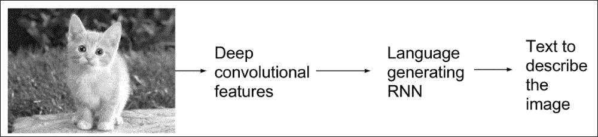

# 进一步阅读

请参考以下主题以获取更深入的见解：

+   *基于神经网络的序列到序列学习*，Ilya Sutskever，Oriol Vinyals，Quoc V. Le，2014 年 12 月

+   *使用 RNN 编码器-解码器的短语表示学习用于统计机器翻译*，Kyunghyun Cho，Bart van Merrienboer，Caglar Gulcehre，Dzmitry Bahdanau，Fethi Bougares，Holger Schwenk，Yoshua Bengio，2014 年 9 月

+   *通过联合学习对齐与翻译的神经机器翻译*，Dzmitry Bahdanau，Kyunghyun Cho，Yoshua Bengio，2016 年 5 月

+   *神经对话模型*，Oriol Vinyals，Quoc Le，2015 年 7 月

+   *快速而强大的神经网络联合模型用于统计机器翻译*，Jacob Devlin，Rabih Zbib，Zhongqiang Huang，Thomas Lamar，Richard Schwartz，John Mkahoul，2014 年

+   *SYSTRAN 的纯神经机器翻译系统*，Josep Crego，Jungi Kim，Guillaume Klein，Anabel Rebollo，Kathy Yang，Jean Senellart，Egor Akhanov，Patrice Brunelle，Aurelien Coquard，Yongchao Deng，Satoshi Enoue，Chiyo Geiss，Joshua Johanson，Ardas Khalsa，Raoum Khiari，Byeongil Ko，Catherine Kobus，Jean Lorieux，Leidiana Martins，Dang-Chuan Nguyen，Alexandra Priori，Thomas Riccardi，Natalia Segal，Christophe Servan，Cyril Tiquet，Bo Wang，Jin Yang，Dakun Zhang，Jing Zhou，Peter Zoldan，2016 年

+   *Blue：一种自动评估机器翻译的方法*，Kishore Papineni，Salim Roukos，Todd Ward，Wei-Jing Zhu，2002 年

+   ACL 2016 翻译任务

+   *变色龙在假想对话中的应用：一种理解对话中文本风格协调的新方法*，Cristian Danescu-NiculescuMizil 和 Lillian Lee，2011，见：[`research.googleblog.com/2015/06/inceptionism-going-deeper-into-neural.html`](https://research.googleblog.com/2015/06/inceptionism-going-deeper-into-neural.html)

+   *通过深度卷积网络和完全连接的 CRFs 进行语义图像分割*，Liang-Chieh Chen，George Papandreou，Iasonas Kokkinos，Kevin Murphy，Alan L.，Yuille，2014 年

+   *SegNet：一种用于图像分割的深度卷积编码器-解码器架构*，Vijay Badrinarayanan，Alex Kendall，Roberto Cipolla，2016 年 10 月

+   *R-FCN：基于区域的全卷积网络进行物体检测*，Jifeng Dai，Yi Li，Kaiming He，Jian Sun，2016 年

+   *学习分割物体候选框*，Pedro O. Pinheiro，Ronan Collobert，Piotr Dollar，2015 年 6 月

+   *学习优化物体分割*，Pedro O. Pinheiro，Tsung-Yi Lin，Ronan Collobert，Piotr Dollàr，2016 年 3 月

+   *可视化与理解卷积网络*，Matthew D Zeiler，Rob Fergus，2013 年 11 月

+   *展示与讲述：神经图像标题生成器*，Oriol Vinyals，Alexander Toshev，Samy Bengio，Dumitru Erhan，2014 年

# 摘要

至于爱情，头到脚的姿势提供了令人兴奋的新可能性：编码器和解码器网络使用相同的层堆栈，但方向相反。

尽管它没有为深度学习提供新的模块，但*编码-解码*技术非常重要，因为它使得网络能够进行“端到端”训练，也就是说，直接将输入和相应的输出喂入网络，而不需要为网络指定任何规则或模式，也不需要将编码训练和解码训练拆分成两个独立的步骤。

虽然图像分类是一个一对一的任务，情感分析是一个多对一的任务，但编码-解码技术展示了多对多的任务，比如翻译或图像分割。

在下一章中，我们将介绍一种*注意力机制*，它赋予编码-解码架构专注于输入的某些部分，以便生成更准确的输出的能力。
