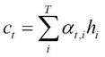
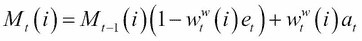
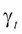
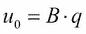
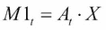

# 第九章：使用注意力机制选择相关的输入或记忆

本章介绍了一种注意力机制，通过这种机制，神经网络能够通过专注于输入或记忆的相关部分来提升其性能。

通过这种机制，翻译、注释、解释和分割等，在前一章中看到的，都能获得更高的准确性。

神经网络的输入和输出也可以与*读取*和*写入*外部记忆相关联。这些网络，**记忆网络**，通过外部记忆增强，并能够决定存储或检索哪些信息，以及从哪里存储或检索。

在本章中，我们将讨论：

+   注意力机制

+   对齐翻译

+   图像中的焦点

+   神经图灵机

+   记忆网络

+   动态记忆网络

# 可微分的注意力机制

在翻译句子、描述图像内容、注释句子或转录音频时，自然的做法是一次专注于输入句子或图像的某一部分，在理解该部分并转换后，再转向下一部分，按照一定的顺序进行全局理解。

例如，在德语中，在某些条件下，动词出现在句子的末尾。因此，在翻译成英语时，一旦主语被读取和翻译，好的机器翻译神经网络可以将注意力转向句子末尾以找到动词并将其翻译成英语。这种将输入位置与当前输出预测匹配的过程是通过*注意力机制*实现的。

首先，让我们回到设计了 softmax 层的分类网络（见 第二章, *使用前馈网络分类手写数字*），该层输出一个非负权重向量 ，对于输入 X，该向量的和为*1*：

然后：

分类的目标是使  尽可能接近*1*（对于正确的类别*k*），并对其他类别接近零。

但是  是一个概率分布，也可以作为一个权重向量，用来关注在位置*k*的记忆向量的某些值 ：

如果权重集中在位置*k*，则返回 。根据权重的锐度，输出将更清晰或更模糊。

在特定位置处理向量*m*值的这个机制就是**注意力机制**：也就是说，它是线性的、可微的，并且具有反向传播梯度下降，用于特定任务的训练。

## 更好的使用注意力机制进行翻译

注意力机制的应用范围非常广泛。为了更好地理解，首先让我们通过机器翻译的例子来说明它。注意力机制对齐源句子和目标句子（预测翻译），并避免长句子的翻译退化：

在上一章中，我们讨论了使用编码器-解码器框架的机器翻译，编码器提供给解码器一个固定长度的编码向量*c*。有了注意力机制，如果每一步的编码循环网络产生一个隐藏状态*h* *i*，那么在每个解码时间步*t*提供给解码器的向量将是可变的，并由以下公式给出：

使用通过 softmax 函数产生的对齐系数：

根据解码器的先前隐藏状态和编码器的隐藏状态，前一个解码器隐藏状态与每个编码器隐藏状态之间的嵌入式点积产生一个权重，描述它们应该如何匹配：

经过几个训练周期后，模型通过聚焦输入的某个部分来预测下一个词：

为了更好地学习对齐，可以使用数据集中存在的对齐注释，并为由注意力机制产生的权重添加交叉熵损失，这可以在训练的前几个周期中使用。

## 更好的使用注意力机制对图像进行注释

相同的注意力机制可以应用于图像注释或音频转录任务。

对于图像，注意力机制在每个预测时间步聚焦于特征的相关部分：

展示、关注和讲述：带有视觉注意力的神经图像字幕生成

让我们看一下经过训练的模型在图像上的注意力点：

(*Show, Attend and Tell: Neural Image Caption Generation with Visual Attention*，Kelvin Xu 等，2015 年)

# 在神经图灵机中存储和检索信息

注意力机制可以作为在记忆增强网络中访问部分记忆的方式。

神经图灵机中的记忆概念受到了神经科学和计算机硬件的启发。

RNN 的隐藏状态用来存储信息，但它无法存储足够大的数据量并进行检索，即使 RNN 已被增强了一个记忆单元，如 LSTM 中的情况。

为了解决这个问题，**神经图灵机**（**NTM**）首先设计了一个**外部记忆库**和读/写头，同时保留了通过梯度下降进行训练的神奇之处。

读取记忆库是通过对变量记忆库的注意力进行控制，类似于前面例子中对输入的注意力：

这可以通过以下方式进行说明：

而写入记忆库则通过另一个注意力机制将我们的新值分配到记忆的一部分：

描述需要存储的信息，并且是需要删除的信息，并且它们的大小与记忆库相同：

读写头的设计类似于硬盘，其移动性由注意权重和来想象。

记忆将在每个时间步演变，就像 LSTM 的单元记忆一样；但是，由于记忆库设计得很大，网络倾向于在每个时间步将传入的数据进行存储和组织，干扰比任何经典 RNN 都要小。

与记忆相关的处理过程自然是通过一个递归神经网络（RNN）在每个时间步充当**控制器**来驱动的：

控制器网络在每个时间步输出：

+   每个读/写头的定位或注意系数

+   写头需要存储或删除的值

原始的 NTM 提出了两种定义*头部定位*（也称为*寻址*）的方法，定义为权重：

+   基于内容的定位，用于将相似的内容放置在记忆的同一区域，这对于检索、排序或计数任务非常有用：

+   基于位置的定位，它依赖于头部的先前位置，可以在复制任务中使用。一个门控定义了先前权重与新生成权重之间的影响，以计算头部的位置。一个偏移权重定义了相对于该位置的位移量。

最后，一个锐化权重减少了头部位置的模糊：

所有操作都是可微分的。

可能不止两个头，特别是在一些任务中，如对两个存储值的加法运算，单个读取头将会受到限制。

这些 NTM 在任务中表现出比 LSTM 更强的能力，比如从输入序列中检索下一个项目、重复输入序列多次或从分布中采样。

# 记忆网络

给定一些事实或故事来回答问题或解决问题，促使设计出一种新型网络——**记忆网络**。在这种情况下，事实或故事被嵌入到一个记忆库中，就像它们是输入一样。为了完成需要排序事实或在事实之间创建转换的任务，记忆网络使用递归推理过程，在多个步骤或跳跃中操作记忆库。

首先，查询或问题*q*被转换成常量输入嵌入：

而在每个推理步骤中，回答问题的事实*X*被嵌入到两个记忆库中，其中嵌入系数是时间步长的函数：

为了计算注意力权重：

并且：

选择了带有注意力机制：

每个推理时间步骤的输出随后与身份连接组合，如前所述，以提高递归效率：

一个线性层和分类 softmax 层被添加到最后的：

## 具有动态记忆网络的情节记忆

另一种设计通过动态记忆网络被引入。首先，N 个事实与分隔符令牌连接在一起，然后通过 RNN 编码：RNN 在每个分隔符处的输出被用作输入嵌入。这样的编码方式更加自然，同时也保留了时间依赖性。问题也通过 RNN 进行编码以生成向量*q*。

其次，记忆库被替换为情节记忆，依赖于混合了 RNN 的注意力机制，以便保留事实之间的时间依赖关系：

门控 由多层感知器提供，依赖于推理的前一个状态 、问题和输入嵌入 作为输入。

推理过程与 RNN 相同：

以下图片展示了输入和输出之间的相互作用，以计算情节记忆：

问我任何事：自然语言处理的动态记忆网络

为了对这些网络进行基准测试，Facebook 研究通过合成 bAbI 数据集，使用 NLP 工具为一些随机建模的故事创建事实、问题和答案。该数据集由不同的任务组成，用于测试不同的推理技能，例如基于时间、大小或位置的单个、两个或三个事实推理、计数、列举或理解论点之间的关系、否定、动机以及路径查找。

至于机器翻译中的引导对齐，当数据集也包含了导致答案的事实注释时，也可以使用监督训练：

+   注意力机制

+   当推理循环停止时，生成一个停止标记，判断使用的事实数量是否足够回答问题

# 进一步阅读

您可以参考以下主题以获取更多见解：

+   *问我任何事：自然语言处理的动态记忆网络*，Ankit Kumar，Ozan Irsoy，Peter Ondruska，Mohit Iyyer，James Bradbury，Ishaan Gulrajani，Victor Zhong，Romain Paulus，Richard Socher，2015 年

+   *注意力与增强型循环神经网络*，Chris Olah，Shan Carter，2016 年 9 月 [`distill.pub/2016/augmented-rnns/`](http://distill.pub/2016/augmented-rnns/)

+   *面向话题的神经机器翻译的引导对齐训练*，陈文虎，Evgeny Matusov，Shahram Khadivi，Jan-Thorsten Peter，2016 年 7 月

+   *展示、注意与叙述：具有视觉注意力的神经图像字幕生成*，Kelvin Xu，Jimmy Ba，Ryan Kiros，Kyunghyun Cho，Aaron Courville，Ruslan Salakhutdinov，Richard Zemel，Yoshua Bengio，2015 年 2 月

+   *迈向 AI 完全问题回答：一组先决条件玩具任务*，Jason Weston，Antoine Bordes，Sumit Chopra，Alexander M. Rush，Bart van Merriënboer，Armand Joulin，Tomas Mikolov，2015 年

+   *记忆网络*，Jason Weston，Sumit Chopra，Antoine Bordes，2014 年

+   *端到端记忆网络*，Sainbayar Sukhbaatar，Arthur Szlam，Jason Weston，Rob Fergus，2015 年

+   *神经图灵机*，Alex Graves，Greg Wayne，Ivo Danihelka，2014 年

+   *深度视觉-语义对齐用于生成图像描述*，Andrej Karpathy，Li Fei-Fei，2014

# 总结

注意力机制是帮助神经网络选择正确信息并集中精力以生成正确输出的聪明选择。它可以直接应用于输入或特征（输入经过几层处理）。在翻译、图像标注和语音识别等任务中，尤其是在输入维度很重要时，准确率得到了提升。

注意力机制引入了增强了外部记忆的新型网络，作为输入/输出，可以从中读取或写入。这些网络已被证明在问答挑战中非常强大，几乎所有自然语言处理任务都可以转化为此类任务：标注、分类、序列到序列，或问答任务。

在下一章，我们将介绍更高级的技巧及其在更一般的递归神经网络中的应用，以提高准确性。
