# 第十章：使用高级 RNN 预测时间序列

本章涵盖了递归神经网络的高级技术。

在第二章中看到的技术，*使用前馈网络分类手写数字*，对于前馈网络，例如通过增加更多层次或添加 Dropout 层等，已经成为递归网络面临的挑战，并且需要一些新的设计原则。

由于增加新层会加剧消失/爆炸梯度问题，一种基于身份连接的新技术，如在第七章中所述，*使用残差网络分类图像*，已证明能够提供最先进的结果。

涵盖的主题包括：

+   变分 RNN

+   堆叠 RNN

+   深度过渡 RNN

+   高速公路连接及其在 RNN 中的应用

# RNN 的 Dropout

Dropout 在神经网络中的应用一直是研究的主题，因为简单地将 Dropout 应用于递归连接会引入更多的不稳定性和训练 RNN 的困难。

一种解决方案已经被发现，它源自变分**贝叶斯网络**理论。最终的思想非常简单， consiste of 保持相同的 Dropout 掩码用于整个 RNN 训练序列，如下图所示，并在每个新序列上生成新的 Dropout 掩码：

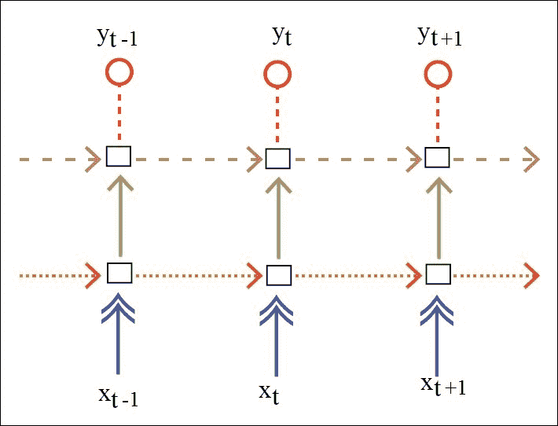

这种技术被称为**变分 RNN**。对于前图中具有相同箭头的连接，我们将为整个序列保持噪声掩码不变。

为此，我们将引入符号变量`_is_training`和`_noise_x`，在训练过程中为输入、输出和递归连接添加随机（变分）噪声（Dropout）：

```py
_is_training = T.iscalar('is_training')
_noise_x = T.matrix('noise_x')
inputs = apply_dropout(_is_training, inputs, T.shape_padright(_noise_x.T))
```

# RNN 的深度方法

深度学习的核心原理是通过增加更多层次来提升网络的表示能力。对于 RNN，增加层数有两种可能的方式：

+   第一个方法被称为**堆叠**或**堆叠递归网络**，其中第一个递归网络的隐藏层输出作为第二个递归网络的输入，依此类推，多个递归网络层叠在一起：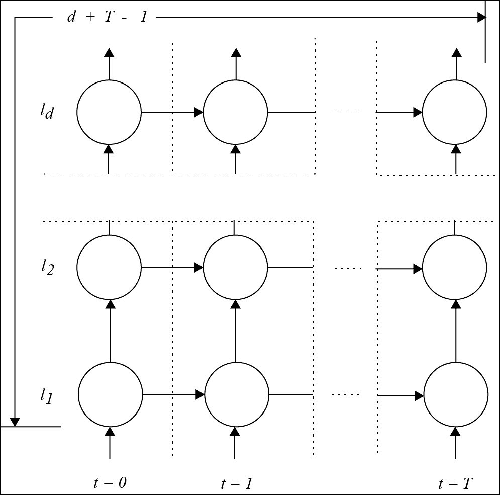

对于深度`d`和`T`时间步长，输入与输出之间的最大连接数为*d + T – 1*：

+   第二种方法是**深度过渡网络**，它通过向递归连接中添加更多层次来实现：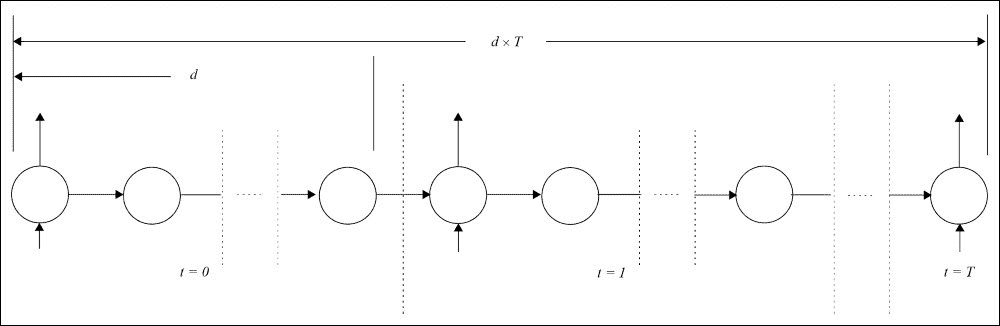

    图 2

在这种情况下，输入与输出之间的最大连接数为*d x T*，已被证明更加强大。

两种方法都能提供更好的结果。

然而，在第二种方法中，随着层数的增加，训练变得更加复杂和不稳定，因为信号会更快地消失或爆炸。我们将在稍后通过处理递归高速公路连接的原理来解决这个问题。

首先，像往常一样，将作为词汇索引值数组的单词序列，维度为（`batch_size, num_steps`），嵌入到维度为（`num_steps, batch_size, hidden_size`）的输入张量中：

```py
embedding = shared_uniform(( config.vocab_size,config.hidden_size), config.init_scale)
params = [embedding]
inputs = embedding[_input_data.T]
```

符号输入变量`_lr`使得在训练过程中可以减少学习率：

```py
_lr = theano.shared(cast_floatX(config.learning_rate), 'lr')
```

我们从第一种方法开始，即堆叠递归网络。

# 堆叠递归网络

要堆叠递归网络，我们将下一个递归网络的隐藏层连接到前一个递归网络的输入：

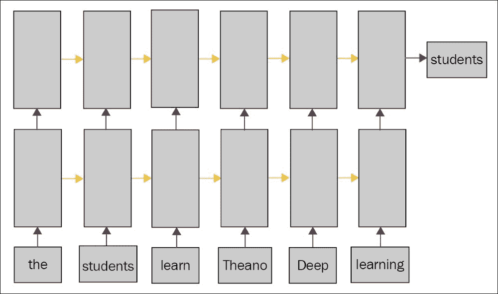

当层数为一时，我们的实现就是前一章中的递归网络。

首先，我们在简单的 RNN 模型中实现了 dropout：

```py
def model(inputs, _is_training, params, batch_size, hidden_size, drop_i, drop_s, init_scale, init_H_bias):
    noise_i_for_H = get_dropout_noise((batch_size, hidden_size), drop_i)
    i_for_H = apply_dropout(_is_training, inputs, noise_i_for_H)
    i_for_H = linear.model(i_for_H, params, hidden_size, 
                   hidden_size, init_scale, bias_init=init_H_bias)

    # Dropout noise for recurrent hidden state.
    noise_s = get_dropout_noise((batch_size, hidden_size), drop_s)

    def step(i_for_H_t, y_tm1, noise_s):
        s_lm1_for_H = apply_dropout(_is_training,y_tm1, noise_s)
        return T.tanh(i_for_H_t + linear.model(s_lm1_for_H, 
                  params, hidden_size, hidden_size, init_scale))

    y_0 = shared_zeros((batch_size, hidden_size), name='h0')
    y, _ = theano.scan(step, sequences=i_for_H, outputs_info=[y_0], non_sequences = [noise_s])

    y_last = y[-1]
    sticky_state_updates = [(y_0, y_last)]

    return y, y_0, sticky_state_updates
```

我们在 LSTM 模型中做同样的事情：

```py
def model(inputs, _is_training, params, batch_size, hidden_size, drop_i, drop_s, init_scale, init_H_bias, tied_noise):
    noise_i_for_i = get_dropout_noise((batch_size, hidden_size), drop_i)
    noise_i_for_f = get_dropout_noise((batch_size, hidden_size), drop_i) if not tied_noise else noise_i_for_i
    noise_i_for_c = get_dropout_noise((batch_size, hidden_size), drop_i) if not tied_noise else noise_i_for_i
    noise_i_for_o = get_dropout_noise((batch_size, hidden_size), drop_i) if not tied_noise else noise_i_for_i

    i_for_i = apply_dropout(_is_training, inputs, noise_i_for_i)
    i_for_f = apply_dropout(_is_training, inputs, noise_i_for_f)
    i_for_c = apply_dropout(_is_training, inputs, noise_i_for_c)
    i_for_o = apply_dropout(_is_training, inputs, noise_i_for_o)

    i_for_i = linear.model(i_for_i, params, hidden_size, hidden_size, init_scale, bias_init=init_H_bias)
    i_for_f = linear.model(i_for_f, params, hidden_size, hidden_size, init_scale, bias_init=init_H_bias)
    i_for_c = linear.model(i_for_c, params, hidden_size, hidden_size, init_scale, bias_init=init_H_bias)
    i_for_o = linear.model(i_for_o, params, hidden_size, hidden_size, init_scale, bias_init=init_H_bias)

    # Dropout noise for recurrent hidden state.
    noise_s = get_dropout_noise((batch_size, hidden_size), drop_s)
    if not tied_noise:
      noise_s = T.stack(noise_s, get_dropout_noise((batch_size, hidden_size), drop_s),
 get_dropout_noise((batch_size, hidden_size), drop_s), get_dropout_noise((batch_size, hidden_size), drop_s))

    def step(i_for_i_t,i_for_f_t,i_for_c_t,i_for_o_t, y_tm1, c_tm1, noise_s):
        noise_s_for_i = noise_s if tied_noise else noise_s[0]
        noise_s_for_f = noise_s if tied_noise else noise_s[1]
        noise_s_for_c = noise_s if tied_noise else noise_s[2]
        noise_s_for_o = noise_s if tied_noise else noise_s[3]

        s_lm1_for_i = apply_dropout(_is_training,y_tm1, noise_s_for_i)
        s_lm1_for_f = apply_dropout(_is_training,y_tm1, noise_s_for_f)
        s_lm1_for_c = apply_dropout(_is_training,y_tm1, noise_s_for_c)
        s_lm1_for_o = apply_dropout(_is_training,y_tm1, noise_s_for_o)

        i_t = T.nnet.sigmoid(i_for_i_t + linear.model(s_lm1_for_i, params, hidden_size, hidden_size, init_scale))
        f_t = T.nnet.sigmoid(i_for_o_t + linear.model(s_lm1_for_f, params, hidden_size, hidden_size, init_scale))
        c_t = f_t * c_tm1 + i_t * T.tanh(i_for_c_t + linear.model(s_lm1_for_c, params, hidden_size, hidden_size, init_scale))
        o_t = T.nnet.sigmoid(i_for_o_t + linear.model(s_lm1_for_o, params, hidden_size, hidden_size, init_scale))
        return o_t * T.tanh(c_t), c_t

    y_0 = shared_zeros((batch_size,hidden_size), name='h0')
    c_0 = shared_zeros((batch_size,hidden_size), name='c0')
    [y, c], _ = theano.scan(step, sequences=[i_for_i,i_for_f,i_for_c,i_for_o], outputs_info=[y_0,c_0], non_sequences = [noise_s])

  y_last = y[-1]
    sticky_state_updates = [(y_0, y_last)]

    return y, y_0, sticky_state_updates
```

运行我们的堆叠网络：

```py
python train_stacked.py --model=rnn
python train_stacked.py --model=lstm

```

对于 RNN，我们得到了 15,203,150 个参数，在 CPU 上的速度为 326 **每秒字数**（WPS），在 GPU 上的速度为 4,806 WPS。

对于 LSTM，参数数量为 35,882,600，在 GPU 上的速度为 1,445 WPS。

堆叠 RNN 没有收敛，正如我们预想的那样：随着深度增加，梯度消失/爆炸问题加剧。

LSTM，旨在减少此类问题，在堆叠时的收敛效果远好于单层网络。

# 深度转移递归网络

与堆叠递归网络相反，深度转移递归网络通过在递归连接中增加更多的层次或*微时间步*，来沿时间方向增加网络的深度。

为了说明这一点，让我们回到递归网络中转移/递归连接的定义：它以前一状态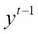和时间步`t`时的输入数据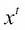为输入，预测其新状态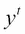。

在深度转移递归网络（图 2）中，递归转移通过多个层次开发，直到递归深度`L`：初始状态被设置为最后一个转移的输出：

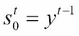

此外，在转移中，计算多个状态或步骤：

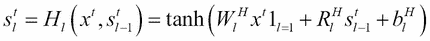

最终状态是转移的输出：

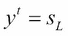

# 高速公路网络设计原理

在转移连接中增加更多层会在长时间依赖中增加梯度消失或爆炸问题，特别是在反向传播过程中。

在 第四章，*使用递归神经网络生成文本* 中，已经介绍了 LSTM 和 GRU 网络作为解决方案来应对这个问题。二阶优化技术也有助于克服这个问题。

一个更一般的原理，基于 **恒等连接**，用于改善深度网络的训练，第七章，*使用残差网络分类图像*，也可以应用于深度过渡网络。

这是理论上的原理：

给定一个输入 `x` 到隐藏层 `H`，并带有权重 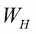：

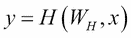

一个高速公路网络设计包括将原始输入信息（通过恒等层）添加到一层或一组层的输出，作为快捷通道：

*y = x*

两个混合门，*变换门* 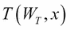 和 *传递门*，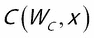 学会调节隐藏层中变换的影响，以及允许通过的原始信息量：

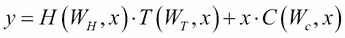

通常，为了减少总参数量以便加速训练网络，`carry` 门被设置为 `transform` 门的互补：

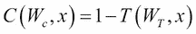

# 递归高速公路网络

因此，让我们将高速公路网络设计应用于深度过渡递归网络，从而定义 **递归高速公路网络**（**RHN**），并根据给定的过渡输入预测输出  和 ：


过渡是通过多个步骤的高速公路连接构建的：

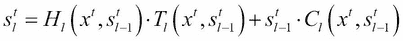

这里的变换门如下：

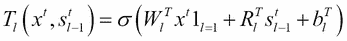

为了减少权重数量，`carry` 门被作为 `transform` 门的互补：


为了在 GPU 上更快地计算，最好将不同时间步长的输入上的线性变换通过单次大矩阵乘法计算，即一次性计算所有时间步长的输入矩阵 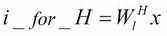 和 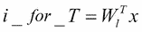，因为 GPU 会更好地并行化这些操作，并将这些输入提供给递归：

```py
y_0 = shared_zeros((batch_size, hidden_size))
y, _ = theano.scan(deep_step_fn, sequences = [i_for_H, i_for_T],
            outputs_info = [y_0], non_sequences = [noise_s])
```

每个步骤之间有深度过渡：

```py
def deep_step_fn(i_for_H_t, i_for_T_t, y_tm1, noise_s):
  s_lm1 = y_tm1
  for l in range(transition_depth):
    if l == 0:
      H = T.tanh(i_for_H_t + linear(s_lm1, params, hidden_size, hidden_size, init_scale))
      Tr = T.nnet.sigmoid(i_for_T_t + linear(s_lm1, params, hidden_size, hidden_size, init_scale))
    else:
      H = T.tanh(linear(s_lm1, params, hidden_size, hidden_size, init_scale, bias_init=init_H_bias))
      Tr = T.nnet.sigmoid(linear(s_lm1, params, hidden_size, hidden_size, init_scale, bias_init=init_T_bias))
    s_l = H * Tr + s_lm1 * ( 1 - Tr )
    s_lm1 = s_l
  y_t = s_l
  return y_t
```

RHN 的递归隐藏状态是粘性的（一个批次的最后一个隐藏状态会传递到下一个批次，作为初始隐藏状态使用）。这些状态被保存在一个共享变量中。

让我们运行模式：

```py
python train_stacked.py
```

堆叠的 RHN 的参数数量为*84,172,000*，其在 GPU 上的速度为*420* wps。

该模型是当前在文本上递归神经网络准确度的最新最先进模型。

# 深入阅读

您可以参考以下主题以获取更多见解：

+   *高速公路网络*： [`arxiv.org/abs/1505.00387`](https://arxiv.org/abs/1505.00387)

+   *深度门控 LSTM*： [`arxiv.org/abs/1508.03790`](https://arxiv.org/abs/1508.03790)

+   *学习递归神经网络中的长期记忆*： [`arxiv.org/abs/1412.7753`](https://arxiv.org/abs/1412.7753)

+   *网格长短期记忆*，Nal Kalchbrenner, Ivo Danihelka, Alex Graves

+   Zilly, J, Srivastava, R, Koutnik, J, Schmidhuber, J., *递归高速公路网络*，2016

+   Gal, Y, *递归神经网络中丢弃法的理论基础应用*，2015。

+   Zaremba, W, Sutskever, I, Vinyals, O, *递归神经网络正则化*，2014。

+   Press, O, Wolf, L, *利用输出嵌入改进语言模型*，2016。

+   门控反馈递归神经网络：Junyoung Chung, Caglar Gulcehre, Kyunghyun Cho, Yoshua Bengio 2015

+   时钟工作递归神经网络：Jan Koutník, Klaus Greff, Faustino Gomez, Jürgen Schmidhuber 2014

# 摘要

一种经典的丢弃法可用于提高网络的鲁棒性，避免递归转换的不稳定性和破坏，且可以在递归网络的序列或批次中应用。例如，当应用于单词输入/输出时，相当于从句子中去除相同的单词，将其替换为空值。

深度学习中堆叠层的原则，通过在深度方向堆叠递归网络而不产生负担，能够提高准确性。

将相同的原则应用于递归网络的转换中，会增加消失/爆炸问题，但通过引入具有身份连接的高速公路网络来抵消这一问题。

递归神经网络的高级技术在序列预测中给出了最先进的结果。
