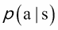

# 第十一章 从环境中学习强化

监督学习和无监督学习描述了训练过程中标签或目标的存在与否。对于代理来说，更自然的学习环境是在正确决策时获得奖励。在复杂环境中，这种奖励，例如*正确打网球*，可能是多个动作的结果，延迟或累积。

为了优化人工代理从环境中获取的奖励，**强化学习**（**RL**）领域出现了许多算法，如 Q 学习或蒙特卡洛树搜索，并且随着深度学习的出现，这些算法已经演变为新的方法，如深度 Q 网络，策略网络，值网络和策略梯度。

我们将首先介绍强化学习框架及其在虚拟环境中的潜在应用。然后，我们将发展其算法及其与深度学习的整合，后者解决了人工智能中最具挑战性的问题。

本章涵盖的要点如下：

+   强化学习

+   模拟环境

+   Q 学习

+   蒙特卡洛树搜索

+   深度 Q 网络

+   策略梯度

+   异步梯度下降

为了简化本章中神经网络的开发，我们将使用 Keras，这是基于我在第五章中介绍的 Theano 之上的高级深度学习库，*使用双向 LSTM 分析情感*。

# 强化学习任务

强化学习包括训练一个**代理**，它只需偶尔从**环境**中获得反馈，就可以学会在结束时获得最佳反馈。代理执行**动作**，修改环境的**状态**。

在环境中导航的动作可以表示为从一个状态到另一个状态的有向边，如下图所示：


一个机器人在真实环境中工作（步行机器人，电机控制等）或虚拟环境中（视频游戏，在线游戏，聊天室等），必须决定哪些动作（或按键）可以获得最大的奖励：


# 模拟环境

虚拟环境使得能够模拟数以万计甚至百万级的游戏过程，仅需计算成本。为了评估不同强化学习算法的性能，研究界开发了模拟环境。

为了找到能够很好地泛化的解决方案，Open-AI，一个由商业巨头埃隆·马斯克支持的非盈利人工智能研究公司，致力于以有益于全人类的方式小心推广和开发友好的人工智能，已经在其开源模拟环境**Open-AI Gym**（[`gym.openai.com/`](https://gym.openai.com/)）中收集了一系列强化学习任务和环境，供我们在其中测试自己的方法。在这些环境中，你会找到：

+   来自 Atari 2600 的视频游戏，Atari 公司于 1977 年发布的家庭视频游戏机，封装了来自街机学习环境的模拟器，这是最常见的强化学习基准环境之一：

+   MuJoCo，评估智能体在连续控制任务中的物理模拟器：

+   其他著名游戏，如 Minecraft、足球、Doom 等：

让我们安装 Gym 及其 Atari 2600 环境：

```py
pip install gym
pip install gym[atari]
```

也可以通过以下方式安装所有环境：

```py
pip install gym[all]
```

与 Gym 环境交互非常简单，只需使用`env.step()`方法，给定我们为智能体选择的动作，该方法返回新的状态、奖励，以及游戏是否已结束。

例如，让我们采样一个随机动作：

```py
import gym

env = gym.make('CartPole-v0')
env.reset()

for _ in range(1000):
    env.render()
    action = env.action_space.sample()
    next_state, reward, done, info = env.step(action)
    if done:
        env.reset()
```

Gym 还提供了复杂的监控方法，可以录制视频和算法表现。这些记录可以上传到 Open-AI API，与其他算法一起评分。

你也可以看看：

+   3D 赛车模拟器 Torcs（[`torcs.sourceforge.net/`](http://torcs.sourceforge.net/)），比起简单的 Atari 游戏，它在动作的离散化上更小，更加真实，但奖励更稀疏，而且比 MuJoCo 中的连续电机控制动作还少：

+   一个名为迷宫的 3D 环境，用于随机生成迷宫：

# Q 学习

解决游戏的一个主要方法是 Q 学习方法。为了完全理解这一方法，以下是一个简单的例子，环境的状态数限制为 6，状态**0**为入口，状态**5**为出口。在每个阶段，一些动作可以使智能体跳到另一个状态，如下图所示：


当智能体从状态**4**跳到状态**5**时，奖励是 100。在其他状态中没有奖励，因为在这个例子中游戏的目标是找到出口。奖励是时间延迟的，智能体必须从状态 0 滚动通过多个状态到达状态 4，才能找到出口。

在这种情况下，Q 学习的任务是学习一个 Q 矩阵，表示**状态-动作对的价值**：

+   Q 矩阵的每一行对应智能体可能处于的一个状态

+   每一列表示从该状态出发到达的目标状态

代表选择该状态中的行动将如何使我们接近出口的价值。如果从状态*i*到状态*j*没有任何行动，我们在 Q 矩阵的位置*(i,j)*定义为零或负值。如果从状态*i*到状态*j*有一个或多个可能的行动，那么 Q 矩阵中的值将被选择来表示状态*j*如何帮助我们实现目标。

例如，离开状态 3 到状态 0 将使代理远离出口，而离开状态 3 到状态 4 将使我们更接近目标。一个常用的算法，称为*贪婪*算法，在离散空间中估计**Q**，由递归的*贝尔曼方程*给出，已被证明收敛：


在这里，*S'*是在状态*S*上执行动作*a*后的新状态；*r*定义了从状态*S*到*S'*路径上的奖励（在这种情况下为空），是折扣因子，用于阻止到图中距离太远的状态的动作。多次应用该方程将导致以下 Q 值：


在 Q 学习中，*Q*代表质量，表示行动获得最佳奖励的能力。由于延迟奖励被折扣，这些值对应于每对（状态，行动）的**最大折扣未来奖励**。

注意，只要我们知道搜索子树的输出节点的状态值，完整图形的结果就不是必需的：


在这张图中，节点 1 和 3 的值为 10 是**最优状态值函数 v(s)**；也就是说，在完美游戏/最佳路径下的游戏结果。实际上，确切的值函数是未知的，但是是近似的。

这种近似与 DeepMind 算法 AlphaGo 中的**蒙特卡洛树搜索(MCTS)**结合使用，以击败围棋世界冠军。MCTS 包括在给定策略下对动作进行抽样，从而仅保留当前节点到估计其 Q 值的最可能动作在贝尔曼方程中：


# 深度 Q 网络

尽管可能的行动数量通常有限（键盘键数或移动数），但可能的状态数量可能极其庞大，搜索空间可能非常庞大，例如，在配备摄像头的机器人在真实环境或现实视频游戏中。自然而然地，我们会使用计算机视觉神经网络，例如我们在第七章中用于分类的那些网络，来代表给定输入图像（状态）的行动价值，而不是一个矩阵：


Q 网络被称为**状态-动作值网络**，它根据给定的状态预测动作值。为了训练 Q 网络，一种自然的方式是通过梯度下降使其符合贝尔曼方程：


请注意，被评估并固定，而下降是针对中的导数计算的，且每个状态的值可以估算为所有状态-动作值的最大值。

在用随机权重初始化 Q 网络后，初始预测是随机的，但随着网络的收敛，给定特定状态的动作将变得越来越可预测，因此对新状态的探索减少。利用在线训练的模型需要强迫算法**继续探索**： **贪心方法**包括以概率 epsilon 做一个随机动作，否则跟随 Q 网络给出的最大奖励动作。这是一种通过试错学习的方式。在经过一定数量的训练轮次后，会衰减，以减少探索。

# 训练稳定性

有不同的方法可以在训练过程中改善稳定性。**在线训练**，即在玩游戏时训练模型，遗忘之前的经验，只考虑最后一条经验，对于深度神经网络来说是根本不稳定的：时间上接近的状态（例如最新的状态）通常是高度相似或相关的，训练时使用最新的状态不容易收敛。

为了避免这种失败，一个可能的解决方案是将经验存储在**回放记忆**中，或者使用人类游戏记录数据库。批量处理和打乱从回放记忆或人类游戏记录数据库中抽取的随机样本能够实现更稳定的训练，但属于**离策略**训练。

改善稳定性的第二个解决方案是将参数的值固定在**目标评估**中，并进行数千次更新，以减少目标值和 Q 值之间的相关性：


通过 n 步 Q 学习，能够更高效地训练，将奖励传播到*n*个先前的动作，而不是一个：

Q 学习公式：


n 步 Q 学习公式：


在这里，每一步都会受益于*n*个后续奖励：


训练稳定性和效率的最终解决方案是**异步梯度下降**，通过多个代理并行执行，在环境的多个实例上进行，并采用不同的探索策略，这样每次梯度更新之间的相关性就更小：每个学习代理在同一台机器的不同线程中运行，与其他代理共享其模型和目标模型参数，但计算环境的不同部分的梯度。并行的行为体学习者具有稳定化效果，支持策略强化，减少训练时间，并在 GPU 或多核 CPU 上表现出可比的性能，这非常棒！

稳定化效果导致更好的**数据效率**：数据效率通过收敛到期望的训练损失或准确率所需的训练周期（一个周期是完整的训练数据集被算法展示一次）来衡量。总训练时间受数据效率、并行性（线程数或机器数）以及并行性开销（在给定核心数、机器数和算法分布效率的情况下，随着线程数增加呈亚线性增长）影响。

让我们实际看一下。为了实现多个代理探索环境的不同部分，我们将使用 Python 的多进程模块运行多个进程，其中一个进程用于更新模型（GPU），*n*个进程用于代理进行探索（CPU）。多进程模块的管理器对象控制一个持有 Q 网络权重的服务器进程，以便在进程之间共享。用于存储代理经验并在模型更新时一次性提供的通信通道，通过一个进程安全的队列实现：

```py
from multiprocessing import *
manager = Manager()
weight_dict = manager.dict()
mem_queue = manager.Queue(args.queue_size)

pool = Pool(args.processes + 1, init_worker)

for i in range(args.processes):
    pool.apply_async(generate_experience_proc, (mem_queue, weight_dict, i))

pool.apply_async(learn_proc, (mem_queue, weight_dict))

pool.close()
pool.join()
```

现在，让我们生成经验并将其排入公共队列对象中。

为了这个目的，在每个代理创建其游戏环境时，编译 Q 网络并从管理器加载权重：

```py
env = gym.make(args.game)

load_net = build_networks(observation_shape, env.action_space.n)

load_net.compile(optimizer='rmsprop', loss='mse', loss_weights=[0.5, 1.])

while 'weights' not in weight_dict:
    time.sleep(0.1)
load_net.set_weights(weight_dict['weights'])
```

为了生成一次经验，代理选择一个动作并在其环境中执行：

```py
observation, reward, done, _ = env.step(action)
```

每个代理的经验都存储在一个列表中，直到游戏结束或列表长度超过*n_step*，以便使用*n 步* Q 学习评估状态-动作值：

```py
if done or counter >= args.n_step:
    r = 0.
    if not done:
        r = value_net.predict(observations[None, ...])[0]
    for i in range(counter):
        r = n_step_rewards[i] + discount * r
        mem_queue.put((n_step_observations[i], n_step_actions[i], r))
```

偶尔，代理会从学习进程中更新其权重：

```py
load_net.set_weights(weight_dict['weights'])
```

现在，让我们看看如何更新学习代理中的权重。

# 带有 REINFORCE 算法的策略梯度

**策略梯度**（**PG**）/ REINFORCE 算法的想法非常简单：它在强化学习任务中，重新使用分类损失函数。

让我们记住，分类损失是由负对数似然给出的，使用梯度下降来最小化它时，遵循的是负对数似然相对于网络权重的导数：


这里，*y* 是选择的动作， 是给定输入 X 和权重  的该动作的预测概率。

REINFORCE 定理引入了强化学习中的等价物，其中 *r* 是奖励。以下是导数：


表示网络权重相对于预期奖励的导数的无偏估计：


因此，遵循导数将鼓励代理最大化奖励。

这样的梯度下降使我们能够优化我们代理的**策略网络**：策略  是一个合法动作的概率分布，用于在在线学习期间采样要执行的动作，并且可以通过参数化神经网络进行近似。

在连续案例中特别有用，例如在运动控制中，离散化的动作空间可能导致一些次优伪影，并且在无限动作空间下，无法对动作-值网络 Q 进行最大化。

此外，可以通过递归（LSTM，GRU）增强策略网络，使代理根据多个先前的状态选择其动作。

REINFORCE 定理为我们提供了一个梯度下降方法，用于优化参数化的策略网络。为了鼓励在这种基于策略的情况下进行探索，也可以向损失函数中添加正则化项——策略的熵。

在此策略下，可以计算每个状态的值 ：

+   可以通过使用该策略从该状态进行游戏

+   或者，如果通过梯度下降将其参数化为**状态价值网络**，当前参数作为目标，就像在上一节中看到的带有折扣奖励的状态-动作价值网络一样：

这个值通常作为强化基准 *b* 来减少策略梯度估计的方差，Q 值可以作为期望奖励：


REINFORCE 导数中的第一个因子：


被称为**动作 a 在状态** *s* 中的优势。

策略网络和价值网络的梯度下降可以通过我们的并行演员学习器异步执行。

让我们在 Keras 中创建我们的策略网络和状态价值网络，共享它们的第一层：

```py
from keras.models import Model
from keras.layers import Input, Conv2D, Flatten, Dense

def build_networks(input_shape, output_shape):
    state = Input(shape=input_shape)
    h = Conv2D(16, (8, 8) , strides=(4, 4), activation='relu', data_format="channels_first")(state)
    h = Conv2D(32, (4, 4) , strides=(2, 2), activation='relu', data_format="channels_first")(h)
    h = Flatten()(h)
    h = Dense(256, activation='relu')(h)

    value = Dense(1, activation='linear', name='value')(h)
    policy = Dense(output_shape, activation='softmax', name='policy')(h)

    value_network = Model(inputs=state, outputs=value)
    policy_network = Model(inputs=state, outputs=policy)
    train_network = Model(inputs=state, outputs=[value, policy])

    return value_network, policy_network, train_network
```

我们的学习过程还构建了模型，将权重共享给其他进程，并为训练编译它们，并计算各自的损失：

```py
_, _, train_network = build_networks(observation_shape, env.action_space.n)
weight_dict['weights'] = train_net.get_weights()

from keras import backend as K

def policy_loss(advantage=0., beta=0.01):
    def loss(y_true, y_pred):
        return -K.sum(K.log(K.sum(y_true * y_pred, axis=-1) + \K.epsilon()) * K.flatten(advantage)) + \
           	beta * K.sum(y_pred * K.log(y_pred + K.epsilon()))
    return loss

def value_loss():
    def loss(y_true, y_pred):
        return 0.5 * K.sum(K.square(y_true - y_pred))
    return loss

train_net.compile(optimizer=RMSprop(epsilon=0.1, rho=0.99),
            loss=[value_loss(), policy_loss(advantage, args.beta)])
```

策略损失是一个 REINFORCE 损失加上一个熵损失，以鼓励探索。值损失是一个简单的均方误差损失。

将经验队列化成一个批次，我们的学习过程会在这个批次上训练模型并更新权重字典：

```py
loss = train_net.train_on_batch([last_obs, advantage], [rewards, targets])
```

运行完整代码：

```py
pip install -r requirements.txt

python 1-train.py --game=Breakout-v0 --processes=16
python 2-play.py --game=Breakout-v0 --model=model-Breakout-v0-35750000.h5
```

学习大约花费了 24 小时。

基于策略的优势演员评论员通常优于基于值的方法。

# 相关文献

你可以参考以下文章：

+   *连接主义强化学习的简单统计梯度跟踪算法*，罗纳德·J·威廉姆斯，1992 年

+   *带有函数逼近的强化学习的策略梯度方法*，理查德·S·萨顿，戴维·麦卡勒斯特，萨廷德·辛格，伊沙·曼索尔，1999 年

+   *通过深度强化学习玩 Atari 游戏*，沃洛基米尔·姆尼赫，科雷·卡武克乔乌格，戴维·西尔弗，亚历克斯·格雷夫斯，伊欧尼斯·安东诺格鲁，丹·维尔斯特拉，马丁·里德米勒，2013 年

+   *通过深度神经网络和树搜索掌握围棋游戏*，戴维·西尔弗，阿贾·黄，克里斯·J·马迪森，阿瑟·格兹，洛朗·西弗，乔治·范登·德里斯切，朱利安·施里特维泽，伊欧尼斯·安东诺格鲁，维达·潘内谢尔瓦姆，马克·兰特托，桑德·迪尔曼，多米尼克·格雷韦，约翰·纳姆，纳尔·卡尔赫布雷纳，伊利亚·苏茨克弗，蒂莫西·利利克拉普，马德琳·利奇，科雷·卡武克乔乌格，托雷·格雷佩尔和德米斯·哈萨比斯，2016 年

+   *深度强化学习的异步方法*，沃洛基米尔·姆尼赫，阿德里亚·普伊格多梅内奇·巴迪亚，梅赫迪·米尔扎，亚历克斯·格雷夫斯，蒂姆·哈利，蒂莫西·P·利利克拉普，戴维·西尔弗，科雷·卡武克乔乌格，2016 年 2 月

+   *使用 KeRLym 进行深度强化学习无线电控制和信号检测*，Gym RL 代理蒂莫西·J·奥谢和 T·查尔斯·克兰西，2016 年

# 总结

强化学习描述了优化代理通过奖励偶然获得任务的过程。通过深度神经网络开发了在线、离线、基于值或基于策略的算法，应用于各种游戏和模拟环境。

策略梯度是一种强行求解方案，需要在训练过程中进行动作采样，适用于小的动作空间，尽管它们为连续搜索空间提供了初步的解决方案。

策略梯度也可以用于训练神经网络中的非可微随机层，并通过这些层进行反向传播梯度。例如，当通过一个模型的传播需要按照参数化子模型进行采样时，来自顶层的梯度可以被视为底层网络的奖励。

在更复杂的环境中，当没有明显的奖励时（例如，从环境中存在的物体推理和理解可能的动作），推理帮助人类优化他们的动作，目前的研究尚未提供任何解决方案。当前的强化学习算法特别适用于精确的操作、快速的反应，但没有长期规划和推理。此外，强化学习算法需要大量的数据集，而模拟环境能够轻松提供这些数据集。但这也引出了现实世界中扩展性的问题。

在下一章，我们将探讨最新的解决方案，用于生成与现实世界数据无法区分的新数据。
