# 第十二章：使用无监督生成网络学习特征

本章重点介绍一种新型模型——生成模型，包括 **限制玻尔兹曼机**、**深度信念网络**、**变分自编码器**、**自回归模型** 和 **生成对抗网络**。对于前者，我们将介绍其理论，而后者则通过实践代码和建议详细解释。

这些网络不需要任何标签进行训练，这就是所谓的 *无监督学习*。无监督学习帮助从数据中计算特征，而不受标签的偏差影响。这些模型是生成式的，因为它们经过训练以生成听起来真实的新数据。

以下内容将会涵盖：

+   生成模型

+   无监督学习

+   限制玻尔兹曼机

+   深度信念网络

+   生成对抗模型

+   半监督学习

# 生成模型

神经处理中的生成模型是一个模型，给定一个噪声向量 `z` 作为输入，生成数据：

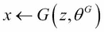

训练的目的是找到能够生成尽可能接近真实数据的数据的参数。

生成网络的应用包括数据维度减少、合成数据生成、无监督特征学习和预训练/训练效率。预训练有助于泛化，因为预训练侧重于数据中的模式，而不是数据与标签之间的关系。

## 限制玻尔兹曼机

限制玻尔兹曼机是最简单的生成网络，由一个完全连接的隐藏层组成，如图所示：

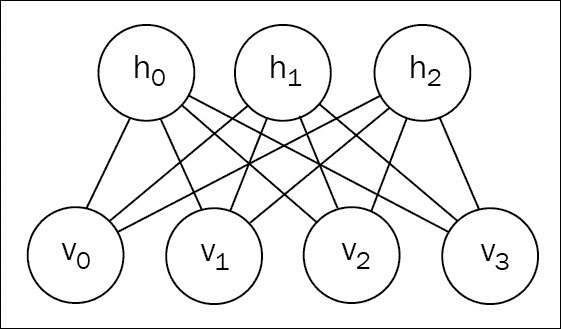

完全玻尔兹曼机还具有隐藏到隐藏和可见到可见的循环连接，而 *限制* 版本则没有任何这种连接。

在一般情况下，RBM 被定义为 *基于能量的模型*，这意味着它们通过能量函数定义了一个概率分布：

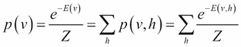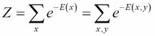

`Z` 是 **配分函数**，*E(v)* 是 **自由能** 函数（不依赖于隐藏状态）。

### 注意

最小化负对数似然等价于最小化能量函数。

RBM 定义了一个作为模型参数线性函数的能量函数：

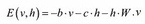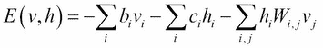

能量与自由能之间的关系由以下公式给出：

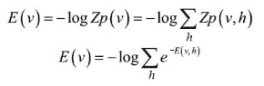

在 RBM 的情况下：

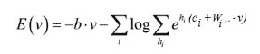

这里 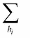 表示对第 i 个隐藏神经元的可能值进行求和。

RBM 通常考虑在特定情况下，其中 `v` 和 `h` 是 *{0,1}* 中的二项值，因此：

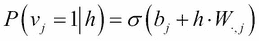

该模型是对称的，遵循模型中的对称性：隐藏层和可见层在能量函数中占据相同的位置：

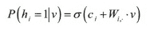

RBM 在两个方向上都作为一个简单的随机完全连接层工作（从输入到隐藏，从隐藏到输入）。

RBM 的负对数似然的梯度或导数有两个项，分别定义为**正相位**和**负相位**，其中第一项增加数据的概率，第二项减少生成样本的概率：

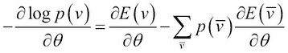

在这里，求和是对所有可能的输入 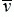 按其概率（期望）加权。在最小值处，任何自由能的增加都会减少总数据的期望。

实际上，负相位中的这种求和可以转化为对`V`观察到的*（v,h）*的求和：

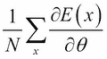

为了在实践中计算这样的求和，观察到的样本*（v,h）*的概率必须满足 *p(v | h)*，由上式给出，同时满足 *p(h | v)*。

采样是通过对比散度算法进行的，实践中：`v` 从数据集中采样，而 `h` 则根据上述分布在给定 `v` 的条件下绘制。这个操作会重复进行，以产生给定 `h` 的新 `v`，然后是给定 `v` 的新 `h`。在实践中，这足以生成与真实分布非常接近的样本。这些观察到的 `v` 和 `h` 样本被称为**负粒子**，成本函数中的第二项减少这些生成样本的概率，而第一项则增加数据的概率。

这里是计算带有负粒子的配分函数的结果：

```py
W = shared_glorot_uniform((n_visible, n_hidden), name='W')
hbias = shared_zeros(n_hidden, name='hbias')
vbias = shared_zeros(n_visible, name='vbias')
params = [W, hbias, vbias]

def sample_h_given_v(v0_sample):
    pre_sigmoid_h1 = T.dot(v0_sample, W) + hbias
    h1_mean = T.nnet.sigmoid(pre_sigmoid_h1)
    h1_sample = theano_rng.binomial(size=h1_mean.shape, n=1, p=h1_mean, dtype=theano.config.floatX)
    return [pre_sigmoid_h1, h1_mean, h1_sample]

def sample_v_given_h(h0_sample):
    pre_sigmoid_v1 = T.dot(h0_sample, W.T) + vbias
    v1_mean = T.nnet.sigmoid(pre_sigmoid_v1)
    v1_sample = theano_rng.binomial(size=v1_mean.shape, n=1, p=v1_mean, dtype=theano.config.floatX)
    return [pre_sigmoid_v1, v1_mean, v1_sample]

def gibbs_hvh(h0_sample):
    pre_sigmoid_v1, v1_mean, v1_sample = sample_v_given_h(h0_sample)
    pre_sigmoid_h1, h1_mean, h1_sample = sample_h_given_v(v1_sample)
    return [pre_sigmoid_v1, v1_mean, v1_sample,
            pre_sigmoid_h1, h1_mean, h1_sample]

chain_start = persistent_chain
(
    [
        pre_sigmoid_nvs,
        nv_means,
        nv_samples,
        pre_sigmoid_nhs,
        nh_means,
        nh_samples
    ],
    updates
) = theano.scan(
    gibbs_hvh,
    outputs_info=[None, None, None, None, None, chain_start],
    n_steps=k,
    name="gibbs_hvh"
)

chain_end = nv_samples[-1]

def free_energy(v_sample):
    wx_b = T.dot(v_sample, W) + hbias
    vbias_term = T.dot(v_sample, vbias)
    hidden_term = T.sum(T.log(1 + T.exp(wx_b)), axis=1)
    return -hidden_term - vbias_term

cost = T.mean(free_energy(x)) - T.mean(free_energy(chain_end))
```

在 MNIST 数据集上训练 15 轮后的过滤器图像：

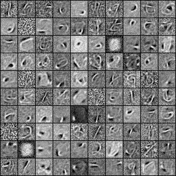

还有一小批负粒子（每行之间有 1,000 步的采样）：

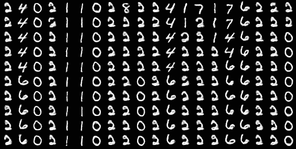

## 深度信念网络

**深度信念网络**（**DBN**）是多个 RBM 堆叠在一起，旨在增强它们的表示能力，更好地捕捉数据中的模式。

训练过程是逐层进行的，首先假设只有一个 RBM，带有隐藏状态 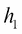。一旦 RBM 的权重被训练好，这些权重将保持固定，第一个 RBM 的隐藏层  被视为第二个 RBM 的可见层，第二个 RBM 有一个隐藏状态 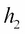。每个新的 RBM 将捕捉到之前的 RBM 没有捕捉到的模式，如下图所示：

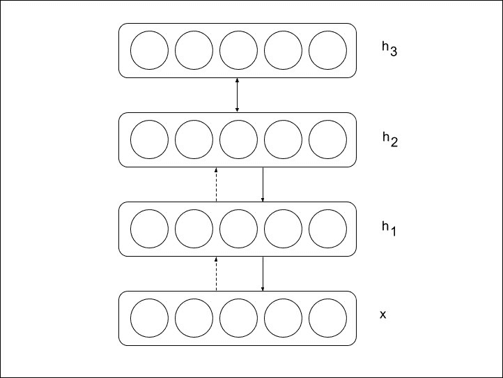

可以证明，在堆叠中每增加一个新的 RBM，会减少负对数似然值。

最后一步是可以将这些权重应用到分类网络中，通过在最终的隐藏状态上简单地添加一个线性层和一个 Softmax 层，然后像往常一样通过梯度下降训练微调所有权重。

对数据维度的应用保持不变，将所有层展开以产生解码器网络，权重等于编码器网络中的权重转置（初始多层 RBM）：

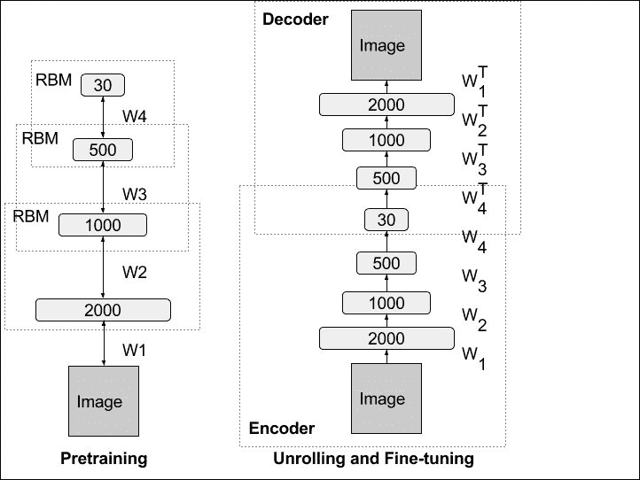

这种展开的网络被称为**自编码器**。

实际上，如果没有贪婪的逐层训练，直接通过梯度下降进行训练需要找到合适的初始化，这可能会更加棘手，因为权重初始化必须足够接近解决方案。这就是为什么常用的自编码器方法是分别训练每个 RBM。

## 生成对抗网络

由于之前模型中的分区函数不可解且需要使用吉布斯采样的对比散度算法，博弈论最近为学习生成模型提供了一类新方法，即**生成对抗网络**（**GANs**），并且这种方法今天取得了巨大成功。

生成对抗网络由两个模型组成，这两个模型交替训练以相互竞争。生成器网络*`G`*的优化目标是通过生成难以被判别器*`D`*与真实数据区分的数据，来重现真实数据的分布。与此同时，第二个网络 D 的优化目标是区分真实数据和由 G 生成的合成数据。总体而言，训练过程类似于一个双人博弈的最小-最大游戏，目标函数如下：

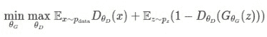

在这里，`x`是真实数据，来自真实数据分布，`z`是生成模型的噪声向量。从某种意义上来说，判别器和生成器可以看作是警察和小偷：为了确保训练正确进行，警察的训练次数是小偷的两倍。

让我们通过图像作为数据的案例来说明 GANs。特别地，仍然采用第二章的例子，*使用前馈网络分类手写数字*，关于 MNIST 数字，考虑训练一个生成对抗网络，根据我们想要的数字生成图像。

GAN 方法包括使用第二个模型——判别网络，来训练生成模型，判别输入数据是否为真实或伪造。在这种情况下，我们可以简单地重用我们的 MNIST 图像分类模型作为判别器，进行 `real` 或 `fake` 的预测输出，并且将其条件化为应生成的数字标签。为了将网络条件化为标签，数字标签与输入数据进行拼接：

```py
def conv_cond_concat(x, y):
    return T.concatenate([x, y*T.ones((x.shape[0], y.shape[1], x.shape[2], x.shape[3]))], axis=1)

def discrim(X, Y, w, w2, w3, wy):
    yb = Y.dimshuffle(0, 1, 'x', 'x')
    X = conv_cond_concat(X, yb)
    h = T.nnet.relu(dnn_conv(X, w, subsample=(2, 2), border_mode=(2, 2)), alpha=0.2 )
    h = conv_cond_concat(h, yb)
    h2 =  T.nnet.relu(batchnorm(dnn_conv(h, w2, subsample=(2, 2), border_mode=(2, 2))), alpha=0.2)
    h2 = T.flatten(h2, 2)
    h2 = T.concatenate([h2, Y], axis=1)
    h3 = T.nnet.relu(batchnorm(T.dot(h2, w3)))
    h3 = T.concatenate([h3, Y], axis=1)
    y = T.nnet.sigmoid(T.dot(h3, wy))
    return y
```

### 提示

注意使用了两个泄漏修正线性单元（leaky ReLU），泄漏系数为 0.2，作为前两个卷积的激活函数。

为了根据噪声和标签生成图像，生成器网络由一系列反卷积组成，使用一个包含 100 个从 0 到 1 之间的实数的输入噪声向量 z：

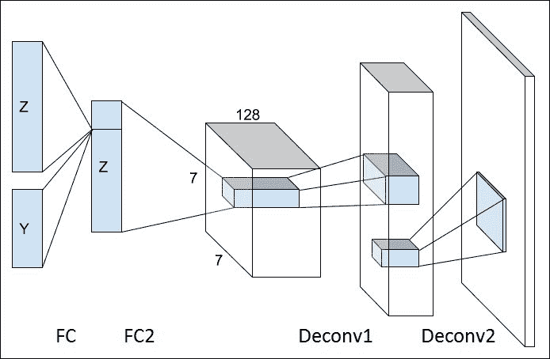

在 Theano 中创建反卷积时，创建一个虚拟的卷积前向传播，并将其梯度作为反卷积的使用。

```py
def deconv(X, w, subsample=(1, 1), border_mode=(0, 0), conv_mode='conv'):
    img = gpu_contiguous(T.cast(X, 'float32'))
    kerns = gpu_contiguous(T.cast(w, 'float32'))
    desc = GpuDnnConvDesc(border_mode=border_mode, subsample=subsample,
conv_mode=conv_mode)(gpu_alloc_empty(img.shape[0], kerns.shape[1], img.shape[2]*subsample[0], img.shape[3]*subsample[1]).shape, kerns.shape)
    out = gpu_alloc_empty(img.shape[0], kerns.shape[1], img.shape[2]*subsample[0], img.shape[3]*subsample[1])
    d_img = GpuDnnConvGradI()(kerns, img, out, desc)
    return d_img

def gen(Z, Y, w, w2, w3, wx):
    yb = Y.dimshuffle(0, 1, 'x', 'x')
    Z = T.concatenate([Z, Y], axis=1)
    h = T.nnet.relu(batchnorm(T.dot(Z, w)))
    h = T.concatenate([h, Y], axis=1)
    h2 = T.nnet.relu(batchnorm(T.dot(h, w2)))
    h2 = h2.reshape((h2.shape[0], ngf*2, 7, 7))
    h2 = conv_cond_concat(h2, yb)
    h3 = T.nnet.relu(batchnorm(deconv(h2, w3, subsample=(2, 2), border_mode=(2, 2))))
    h3 = conv_cond_concat(h3, yb)
    x = T.nnet.sigmoid(deconv(h3, wx, subsample=(2, 2), border_mode=(2, 2)))
    return x
```

真实数据由元组 (X,Y) 给出，而生成的数据则由噪声和标签 (Z,Y) 构建：

```py
X = T.tensor4()
Z = T.matrix()
Y = T.matrix()

gX = gen(Z, Y, *gen_params)
p_real = discrim(X, Y, *discrim_params)
p_gen = discrim(gX, Y, *discrim_params)
```

生成器和判别器模型在对抗学习中竞争：

+   判别器被训练为将真实数据标记为真实（`1`），并将生成数据标记为生成（`0`），从而最小化以下成本函数：

    ```py
    d_cost = T.nnet.binary_crossentropy(p_real, 								T.ones(p_real.shape)).mean() \
    	+ T.nnet.binary_crossentropy(p_gen, T.zeros(p_gen.shape)).mean()
    ```

+   生成器被训练成尽可能欺骗判别器。生成器的训练信号由判别器网络（p_gen）提供给生成器：

    ```py
    g_cost = T.nnet.binary_crossentropy(p_gen,T.ones(p_gen.shape)).mean()
    ```

和通常一样，计算每个模型的参数成本，并交替优化每个模型的权重，判别器的训练次数是生成器的两倍。在 GANs 的情况下，判别器和生成器之间的竞争不会导致每个损失的减少。

从第一轮开始：

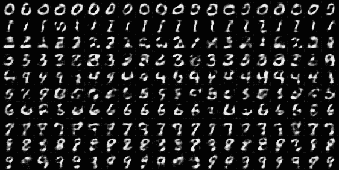

到第 45 轮：

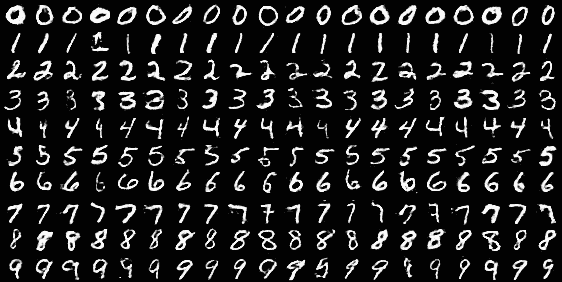

生成的示例看起来更接近真实数据：

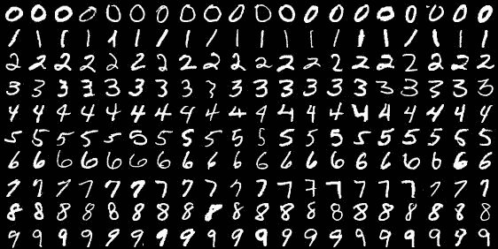

### 改进 GANs

GANs 是近期出现的、非常有前景的技术，但目前仍在进行深入研究。然而，仍然有方法可以改进之前的结果。

首先，和 RBM 及其他网络一样，GANs 可以通过堆叠来增加它们的生成能力。例如，StackGan 模型提出使用两个堆叠的 GANs 进行高质量图像生成：第一个 GAN 生成粗糙的低分辨率图像，而第二个 GAN 将这个生成的样本作为输入，生成更高定义和更具真实感的图像，其中物体的细节更加精确。

GAN 的一个主要问题是**模型崩溃**，这使得它们很难训练。模型崩溃发生在生成器开始忽视输入噪声并学习仅生成一个样本时，这个样本总是相同的。生成中的多样性崩溃了。解决这个问题的一种非常有效的方法来自 S-GAN 模型，它通过向生成器中添加一个第三个网络来进行训练。这个网络的目的是根据输入预测噪声：

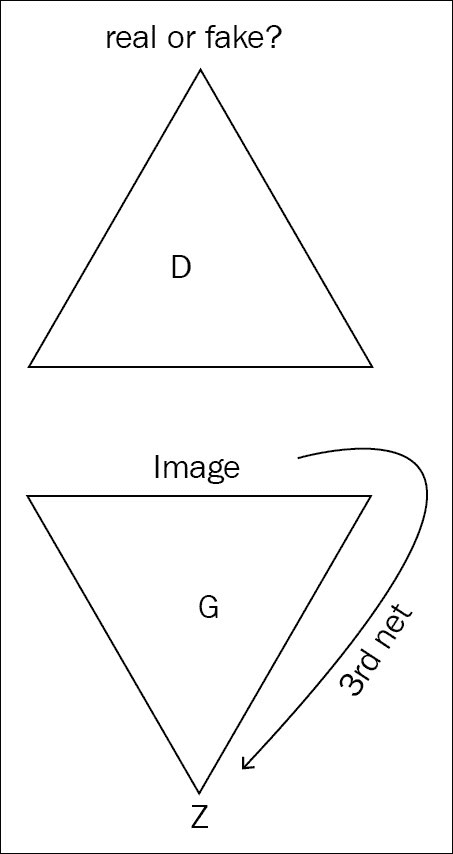

为了与生成器一起优化这个第三个网络，会向生成器损失中添加一个熵损失，以鼓励生成的图像 `x` 足够依赖噪声 `z`。换句话说，条件熵 *H(x | z)* 必须尽可能低：

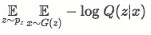

这个第三个网络预测一个辅助分布 Q，用来逼近真实后验 *P(z | x)*，并且可以证明它是 *H(x | z)* 的变分上界。这样的损失函数有助于生成器不忽视输入噪声。

# 半监督学习

最后但同样重要的是，这种生成对抗网络可以用来增强监督学习本身。

假设目标是分类 `K` 类，并且有一定数量的标记数据。可以将一些来自生成模型的生成样本添加到数据集中，并将它们视为属于 *(K+1)th* 类，即伪数据类。

将新分类器在两个数据集（真实数据和伪数据）之间的训练交叉熵损失分解为以下公式：

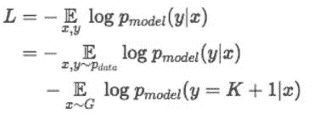

这里，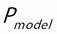 是模型预测的概率：

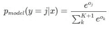

请注意，如果我们知道数据是真实的：

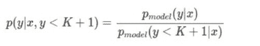

而在真实数据（K 类）上的训练会导致以下损失：

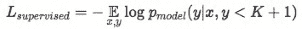

因此，全球分类器的损失可以重写为：

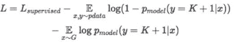

损失的第二项对应于 GAN 的标准无监督损失：

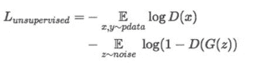

监督损失和无监督损失之间引入的交互作用仍然不完全理解，但当分类问题不简单时，无监督损失是有帮助的。

# 进一步阅读

您可以参考以下主题以获取更多见解：

+   *Deeplearning.net RBM 教程*：[`deeplearning.net/tutorial/rbm.html`](http://deeplearning.net/tutorial/rbm.html)

+   *Deeplearning.net 深度信念网络教程*：[`deeplearning.net/tutorial/DBN.html`](http://deeplearning.net/tutorial/DBN.html)

+   *Deeplearning.net 使用 RBM-RNN 生成的教程*：[`deeplearning.net/tutorial/rnnrbm.html`](http://deeplearning.net/tutorial/rnnrbm.html)

+   *建模高维序列中的时间依赖性：应用于多声部音乐生成与转录*，Nicolas Boulanger-Lewandowski，Yoshua Bengio，Pascal Vincent，2012

+   生成对抗网络，Ian J. Goodfellow，Jean Pouget-Abadie，Mehdi Mirza，Bing Xu，David Warde-Farley，Sherjil Ozair，Aaron Courville，Yoshua Bengio，2014

+   *生成对抗网络将* *改变世界*，Nikolai Yakovenko，2016 [`medium.com/@Moscow25/`](https://medium.com/@Moscow25/)

+   *像素递归神经网络*，Aaron van den Oord，Nal Kalchbrenner，Koray Kavukcuoglu，2016

+   *InfoGAN：通过信息最大化生成对抗网络进行可解释的表示学习*，Xi Chen，Yan Duan，Rein Houthooft，John Schulman，Ilya Sutskever，Pieter Abbeel，2016

+   *StackGAN：使用堆叠生成对抗网络将文本转换为逼真的图像合成*，Han Zhang，Tao Xu，Hongsheng Li，Shaoting Zhang，Xiaolei Huang，Xiaogang Wang，Dimitris Metaxas，2016

+   *堆叠生成对抗网络*，Xun Huang，Yixuan Li，Omid Poursaeed，John Hopcroft，Serge Belongie，2016

+   *神经对话生成的对抗学习*，Jiwei Li，Will Monroe，Tianlin Shi，Sébastien Jean，Alan Ritter，Dan Jurafsky，2017

+   *改进的 GAN 训练技术*，Tim Salimans，Ian Goodfellow，Wojciech Zaremba，Vicki Cheung，Alec Radford，Xi Chen，2016

+   *无监督表示学习与深度卷积生成对抗网络*，Alec Radford，Luke Metz，Soumith Chintala，2015

# 摘要

生成对抗网络如今是一个非常活跃的研究领域。它们属于生成模型家族，包括 RBM 和深度置信网络。

生成模型旨在生成更多数据，或以无监督的方式学习更好的特征，用于监督学习和其他任务。

生成模型可以根据一些环境输入进行条件化，并尝试找到真实数据背后的隐藏变量。

这些模型是最先进的，完成了与 Theano 的深度学习网络概述。下一章将介绍一些高级概念，以扩展 Theano 并探讨深度学习的未来。
