# 第十三章：使用 Theano 扩展深度学习

本章为进一步深入 Theano 和深度学习提供了线索。首先，它介绍了如何在 Python 或 C 语言中为 Theano 计算图创建新的操作符，无论是针对 CPU 还是 GPU。然后，研究了与其他深度学习框架的交互，借助代码库和库的支持，实现与其他技术的双向转换。

最后，为了完善 Theano 深度学习领域所提供的可能性，我们发展了一个新的**通用人工智能**领域的概念。

本章涵盖的主题如下：

+   为 Theano 计算图编写新操作符

+   针对 CPU 和 GPU 的 Python 代码

+   针对 CPU 和 GPU 的 C 语言 API

+   与其他深度学习框架共享模型

+   云 GPU

+   元学习、渐进学习和引导学习

+   一般人工智能

本章全面概述了使用 Theano 进行深度学习的内容。

# Python 中的 Theano 操作（针对 CPU）

作为一个数学编译引擎，Theano 的目的是以最优的方式为目标平台编译计算图。

新操作符的开发可以在 Python 或 C 语言中进行编写，进行 CPU 或 GPU 的编译。

首先，我们解决最简单的情况，在 CPU 的 Python 中，它将使你能够非常容易和快速地添加新操作。

为了固定概念，让我们实现一个简单的仿射操作符，执行仿射变换 *a * x + b*，其中 x 为输入。

操作符是通过从通用的`theano.Op`类派生的类来定义的：

```py
import theano, numpy

class AXPBOp(theano.Op):
    """
    This creates an Op that takes x to a*x+b.
    """
    __props__ = ("a", "b")

    def __init__(self, a, b):
        self.a = a
        self.b = b
        super(AXPBOp, self).__init__()

    def make_node(self, x):
        x = theano.tensor.as_tensor_variable(x)
        return theano.Apply(self, [x], [x.type()])

    def perform(self, node, inputs, output_storage):
        x = inputs[0]
        z = output_storage[0]
        z[0] = self.a * x + self.b

    def infer_shape(self, node, i0_shapes):
        return i0_shapes
    def grad(self, inputs, output_grads):
        return [self.a * output_grads[0]]

mult4plus5op = AXPBOp(4,5)

x = theano.tensor.matrix()
y = mult4plus5op(x)
f = theano.function([x], y)

res = f(numpy.random.rand(3,2))
```

让我们理解这个例子。

`__props__`属性被设置为操作符依赖的两个参数名，`a`和`b`。它将自动为我们生成`__eq__()`、`__hash__()`和`__str_()`方法，因此，如果我们创建两个具有相同`a`和`b`参数值的不同对象，Theano 会将它们视为相等的操作符：

```py
>>> mult4plus5op2 = AXPBOp(4,5)

>>> mult4plus5op == mult4plus5op2
True

>>> hash(mult4plus5op)
-292944955210390262

>>> hash(mult4plus5op2)
-292944955210390262
```

此外，打印操作时，参数`a`和`b`将会出现：

```py
>>> theano.printing.pprint(y)
AXPBOp{a=4, b=5}.0

>>> theano.printing.pydotprint(y)
```

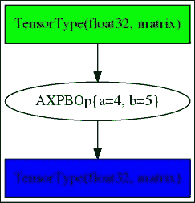

如果未指定`__props__`，则需要手动定义`__eq__()`、`__hash__()`和`__str_()`方法。

`make_node()`方法创建将被包含在计算图中的节点，并在将`mult4plus5op`对象应用于输入`x`时运行。节点创建通过`theano.Apply()`方法执行，该方法的参数是输入变量和输出类型。为了强制输入为变量，调用`as_tensor_variable()`方法，将任何 NumPy 数组转换为变量。这是我们定义输出类型的地方，给定输入时还需检查输入是否与操作符兼容，否则会引发 TypeError。

请注意，正如我们之前为 `__eq__()` 方法使用 `__props__` 属性那样，自动生成 `make_node()` 方法也是可能的，但在这种情况下，`itypes` 和 `otypes` 属性用于定义输入和输出的类型：

```py
itypes = [theano.tensor.dmatrix]
otypes = [theano.tensor.dmatrix]
```

`perform()` 方法定义了在 Python 中执行的该操作符的计算。由于可以实现多个输入并返回多个输出的操作符，因此输入和输出以列表形式给出。第二个输出将存储在 `output_storage[1][0]` 中。输出可能已经由前面的值分配，以便重用内存。它们将始终是合适的 `dtype` 对象，但不一定是正确的形状和步幅。它们不符合正确形状时，最好重新分配。

最后的两个方法，`infer_shape()` 和 `grad()`，是可选的。第一个方法用于输出无需计算时，仅需形状信息来进行计算的情况——这种情况通常发生在 Theano 优化过程中。第二个方法用于在 `grad()` 方法下对输出进行求导：

```py
>>> dy=theano.tensor.grad(y.sum(), x)

>>> theano.printing.pprint(dy)
'(TensorConstant{4} * fill(AXPBOp{a=4, b=5}(<TensorType(float32, matrix)>), fill(Sum{acc_dtype=float64}(AXPBOp{a=4, b=5}(<TensorType(float32, matrix)>)), TensorConstant{1.0})))'

>>> df = theano.function([x], dy)

>>> theano.printing.debugprint(df)
Alloc [id A] ''   2
 |TensorConstant{(1, 1) of 4.0} [id B]
 |Shape_i{0} [id C] ''   1
 | |<TensorType(float32, matrix)> [id D]
 |Shape_i{1} [id E] ''   0
   |<TensorType(float32, matrix)> [id D]
```

以相同的方式，可以定义操作符的 R-操作符函数。

# 用于 GPU 的 Theano 操作符（Op）

让我们看看在 GPU `config` 模式下运行该操作符时会发生什么：

```py
>>> y = mult4plus5op(2 * x) + 4 * x

>>> f = theano.function([x], y)

>>> theano.printing.debugprint(f)
HostFromGpu(gpuarray) [id A] ''   6
 |GpuElemwise{Composite{(i0 + (i1 * i2))}}[(0, 0)]<gpuarray> [id B] ''   5
   |GpuFromHost<None> [id C] ''   4
   | |AXPBOp{a=4, b=5} [id D] ''   3
   |   |HostFromGpu(gpuarray) [id E] ''   2
   |     |GpuElemwise{mul,no_inplace} [id F] ''   1
   |       |GpuArrayConstant{[[ 2.]]} [id G]
   |       |GpuFromHost<None> [id H] ''   0
   |         |<TensorType(float32, matrix)> [id I]
   |GpuArrayConstant{[[ 4.]]} [id J]
   |GpuFromHost<None> [id H] ''   0
```

由于我们仅在 Python 中定义了新操作符的 CPU 实现，而完整的图计算是在 GPU 上运行的，因此数据会在图的中间来回传输到 CPU，以应用我们新的 CPU 操作符：

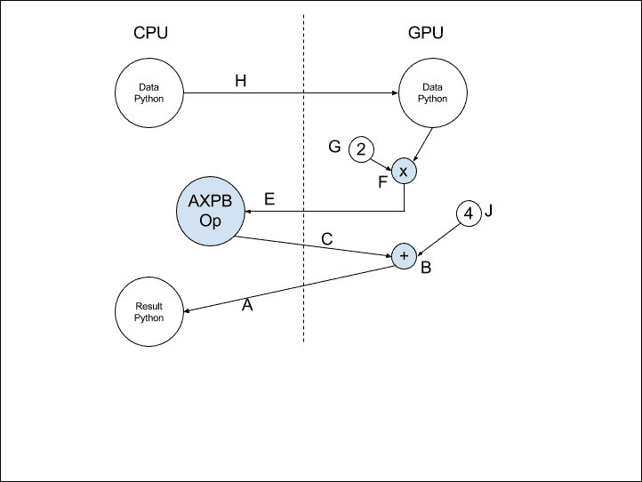

为了避免图中传输的不效率问题，让我们为 GPU 创建相同的 Python 操作符。

为此，您只需修改操作符的 `make_node()` 和 `perform()` 方法，如下所示：

```py
from theano.gpuarray.type import get_context

def make_node(self, x):
    x = as_gpuarray_variable(x, self.context_name)

    x_arg = pygpu.elemwise.arg('x', 'float32', read=True)
    c_arg = pygpu.elemwise.arg('c', 'float32', read=True, write=True)
    self.my_op = pygpu.elemwise.GpuElemwise(get_context(self.context_name), "c = " + str(self.a) + " * x + " + str(self.b), [x_arg, c_arg], convert_f16=True)

    return Apply(self, [x], [x.type()])

def perform(self, node, inputs, output_storage):
    x = inputs[0]
    z = output_storage[0]
    z[0] = pygpu.empty(x.shape, dtype=x.dtype, context=get_context(self.context_name))
    self.my_op( x, z[0])
```

没有太多变化。

在 `make_node()` 方法中，`as_tensor_variable()` 被 `as_gpuarray_variable()` 替换，后者需要上下文，这也是 GPU 变量类型定义的一部分。`get_context()` 方法将我们为设备选择的上下文名称转换为 `pygpu` 库中的 `GPUContext`。

在 `perform()` 方法中，计算在 GPU 上执行，得益于 `pygpu` 库，它包含了 GPU 上的逐元素操作符以及 **基本线性代数子程序** (**BLAS**) 方法，如 **通用矩阵乘矩阵运算** (**GEMM**) 和 **通用矩阵向量乘法** (**GEMV**) 操作。

现在，让我们看一下当这个新操作符在 GPU 上的更大图中时，编译后的图是什么样的：

```py
HostFromGpu(gpuarray) [id A] ''   4
 |GpuElemwise{Add}[(0, 1)]<gpuarray> [id B] ''   3
   |GpuArrayConstant{[[ 4.]]} [id C]
   |GpuAXPBOp{a=4, b=5, context_name='dev0'} [id D] ''   2
     |GpuElemwise{Mul}[(0, 1)]<gpuarray> [id E] ''   1
       |GpuArrayConstant{[[ 2.]]} [id F]
       |GpuFromHost<dev0> [id G] ''   0
         |<TensorType(float32, matrix)> [id H]
```

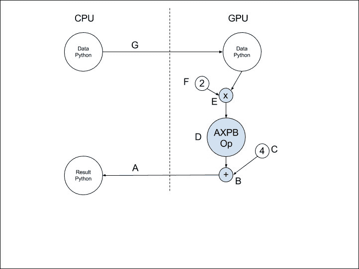

为了提高可读性，我们将操作符类的名称前缀加上了 Gpu，例如，GpuAXPBOp。

# 用于 CPU 的 Theano 操作符（Op）

另一个低效之处在于，操作符的 Python 实现每次执行计算时都会增加显著的开销，即在图中每次操作符实例化时都会发生这种情况。与图的其他部分不同，Python 代码不会像 Theano 将其他图部分用 C 编译一样进行编译，而是当 C 实现被包装到 Python 中并交换数据时，会发生这种开销。

为了弥补这一点，可以直接编写一些 C 代码，将其并入图的其他代码中并一起编译。

当直接用 C 实现操作符时，NumPy 是管理数组的底层库，NumPy-API 扩展了 Python C-API。定义新 C 操作符的 Python 类不必实现`perform()`方法；相反，它返回要并入`c_code()`、`c_support_code()`和`c_support_code_apply()`方法的 C 代码：

```py
def c_code_cache_version(self):
    return (6, 0)

def c_support_code(self):
    c_support_code = """
    bool same_shape(PyArrayObject* arr1, PyArrayObject* arr2)
    {
        if( PyArray_NDIM(arr1) != PyArray_NDIM(arr2)) {
            return false;
        }
        for(int i = 0; i < PyArray_NDIM(arr2) ; i++) {
            if (PyArray_DIMS(arr1)[0] == PyArray_DIMS(arr2)[0]) {
                return false;
            }
        }
        return true;
    }
    """

    return c_support_code

def c_support_code_apply(self, node, name):
    dtype_x = node.inputs[0].dtype
    dtype_z = node.outputs[0].dtype

    a = self.a
    b = self.b

    c_support_code = """
    void elemwise_op_%(name)s(npy_%(dtype_x)s* x_ptr, npy_intp* x_str, int itemsize_x,
        npy_%(dtype_z)s* z_ptr, npy_intp* z_str, int itemsize_z,
        int nbDims, npy_intp* dims)
    {
        npy_intp stride_x = (npy_intp)(1);
        npy_intp stride_z = (npy_intp)(1);
        for (int i = 0; i < nbDims; i ++) {
            stride_x = stride_x * x_str[i] / itemsize_x;
            stride_z = stride_z * z_str[i] / itemsize_z;
        }
        for (int i=0; i < dims[0]; i++)
            if (nbDims==1) {
                z_ptr[i * z_str[0]/itemsize_z] = x_ptr[i * x_str[0] / itemsize_x] * ((npy_%(dtype_z)s) %(a)s) + ((npy_%(dtype_z)s)%(b)s);
            } else {
                elemwise_op_%(name)s( x_ptr + i * stride_x , x_str + 1, itemsize_x,
                    z_ptr + i * stride_z , z_str + 1, itemsize_z,
                    nbDims - 1, dims + 1 );
            }
    }
    """

    return c_support_code % locals()

def c_code(self, node, name, inp, out, sub):
    x = inp[0]
    z = out[0]

    dtype_x = node.inputs[0].dtype
    dtype_z = node.outputs[0].dtype

    itemsize_x = numpy.dtype(dtype_x).itemsize
    itemsize_z = numpy.dtype(dtype_z).itemsize

    typenum_z = numpy.dtype(dtype_z).num

    fail = sub['fail']

    c_code = """
    // Validate that the output storage exists and has the same
    // dimension as x.
    if (NULL == %(z)s || !(same_shape(%(x)s, %(z)s)))
    {
        /* Reference received to invalid output variable.
        Decrease received reference's ref count and allocate new
        output variable */
        Py_XDECREF(%(z)s);
        %(z)s = (PyArrayObject*)PyArray_EMPTY(PyArray_NDIM(%(x)s),
                                            PyArray_DIMS(%(x)s),
                                            %(typenum_z)s,
                                            0);

        if (!%(z)s) {
            %(fail)s;
        }
    }

    // Perform the elemwise operation
    ((npy_%(dtype_z)s *)PyArray_DATA(%(z)s))[0] = 0;
    elemwise_op_%(name)s((npy_%(dtype_x)s*)PyArray_DATA(%(x)s), PyArray_STRIDES(%(x)s), %(itemsize_x)s,
                            (npy_%(dtype_z)s*)PyArray_DATA(%(z)s), PyArray_STRIDES(%(z)s), %(itemsize_z)s,
                            PyArray_NDIM(%(x)s), PyArray_DIMS(%(x)s) );

    """

    return c_code % locals()
```

现在我们来讨论不同的部分：

当实现`c_code_cache_version()`时，Theano 会缓存已编译的代码，以便下次将操作符纳入图中时节省一些编译时间，但每当我们修改 C 操作符的代码时，版本号必须递增。

放置在`c_support_code()`和`c_support_code_apply()`方法中的代码包含在 C 程序的全局作用域中。放置在`c_support_code_apply()`和`c_code()`方法中的代码必须是特定于图中每个操作符应用的；特别是，在这种情况下，它们取决于输入的类型。由于`c_support_code_apply()`代码包含在全局作用域中，方法的名称与操作符名称相同。

`PyArray_NDIM`、`PyArray_DIMS`、`PyArray_STRIDES`和`PyArray_DATA`是宏，用于访问每个 NumPy 数组（C 中的`PyArrayObject`）的维数、维度、步长和数据。`PyArray_EMPTY`是 C 中等同于 Python `numpy.empty()`方法的函数。

NumPy 的`PyArrayObject`类继承自 Python C-API 中的`PyObject`类。`Py_XDECREF`宏允许我们在为新的输出数组分配内存之前减少输出的引用计数。像 Python C-API 一样，NumPy C-API 要求正确计数对象的引用。Theano 不能保证输出数组已被分配，也不能保证它是否已经按正确的形状分配。这就是为什么在`c_code()`开始时会进行测试。

注意数组可以是有步长的，因为它们可以是数组（张量）的视图（或子张量）。也可以实现创建视图或修改输入的操作。

还有一些其他可能的方法可以进一步优化 C 实现：`c_libraries()`和`c_lib_dirs()`用于使用外部库，`c_code_cleanup()`用于销毁内存分配，`c_init_code()`用于在初始化时执行某些代码。

最后，也可以在代码中引用一些 C 文件，以减少 Python 类的负担。我们不详细说明这三种特性。

# Theano 在 C 中的 GPU 操作

正如你想象的那样，可以结合两种优化：

+   通过直接使用 C 编程减少 Python/C 开销

+   编写 GPU 代码

为 GPU 编写 CUDA 代码时，必须将要在 GPU 上多个核心并行运行的代码包装成一种特殊的函数类型，称为 **内核**。

为此，`__init__()`、`make_node()` 和 `c_code_cache_version()` 方法与我们在 GPU 上的 Python 示例相同，但新增了 `gpu_kernels()` 方法，用于定义新的 GPU 内核，以及 `c_code()` 方法（它再次替代了 `perform()` 方法），用于实现 C 代码，也称为 **主机代码**，该代码负责协调何时以及如何调用 GPU 上的不同内核：

```py
def gpu_kernels(self, node, name):
    code = """
KERNEL void axpb(GLOBAL_MEM %(ctype)s *x, GLOBAL_MEM  %(ctype)s *z, ga_size n, ga_size m) {
for (ga_size i = LID_0; i < n; i += LDIM_0) {
    for (ga_size j = LID_0; j < m; j += LDIM_0) {
        z[i*m + j] = %(write_a)s( 2 * x[i*m + j] );
    }
}
}""" % dict(ctype=pygpu.gpuarray.dtype_to_ctype(self.dtype),
        name=name, write_a=write_w(self.dtype))
    return [Kernel(
            code=code, name="axpb",
            params=[gpuarray.GpuArray, gpuarray.GpuArray, gpuarray.SIZE, gpuarray.SIZE],
            flags=Kernel.get_flags(self.dtype),
            objvar='k_axpb_' + name)]

def c_code(self, node, name, inp, out, sub):
    n, = inp
    z, = out
    dtype_n = node.inputs[0].dtype
    fail = sub['fail']
    ctx = sub['params']
    typecode = pygpu.gpuarray.dtype_to_typecode(self.dtype)
    sync = bool(config.gpuarray.sync)
    kname = self.gpu_kernels(node, name)[0].objvar
    s = """
    size_t dims[2] = {0, 0};
    size_t ls, gs;
    int err;
    dims[0] = %(n)s->ga.dimensions[0];
    dims[1] = %(n)s->ga.dimensions[1];
    Py_CLEAR(%(z)s);
    %(z)s = pygpu_zeros(2, dims,
                        %(typecode)s,
                        GA_C_ORDER,
                        %(ctx)s, Py_None);
    if (%(z)s == NULL) {
        %(fail)s
    }
    ls = 1;
    gs = 256;
    err = axpb_call(1, &gs, &ls, 0, %(n)s->ga.data, %(z)s->ga.data, dims[0], dims[1]);
    if (err != GA_NO_ERROR) {
        PyErr_Format(PyExc_RuntimeError,
                     "gpuarray error: kEye: %%s. n%%lu, m=%%lu.",
                     GpuKernel_error(&%(kname)s, err),
                     (unsigned long)dims[0], (unsigned long)dims[1]);
        %(fail)s;
    }
    if(%(sync)d)
        GpuArray_sync(&%(z)s->ga);
    """ % locals()

    return s
```

```py
A new GPU computation kernel is defined under the name axpb, and it is a simple C code with special GPU types and two macros: KERNEL to designate the kernel function (hiding the CUDA __global__ declaration for kernels) and GLOBAL_MEM for the variables defined globally, available both on the CPU and the GPU (in opposition to variables inside the kernel function that, by default, are local to the thread executed on a GPU core).
```

请注意，我只实现了矩阵（即二维）输入的操作符，256 个线程将并行执行相同的操作，而这些操作本可以被分成不同的组，并分配给不同的线程。

在 CPU 上运行的主机代码管理 CPU 和 GPU 上的内存，并启动在 GPU 设备上执行的内核函数。

新 GPU 数组的分配是通过 `pygpu_zeros()` 方法执行的，使用 CUDA 时，它会在后台调用 `cudamalloc()` 方法，直接在 GPU 内存中分配数组。操作符实例无需管理分配给输出的内存释放以及 GPU 和 CPU 之间的数据传输，因为这是 Theano 优化的职责，决定何时插入传输操作符 `HostFromGpu` 和 `GpuFromHost`。

在 C 代码中调用内核是通过 `axpb_call()` 来执行的，即内核的名称后面跟着 `_call()`。注意，调用中有四个参数，比定义内核方法时的参数多。这四个参数定义了 `libgpuarray` 如何在核心上执行或部署内核。

为了理解 GPU 的并行编程执行配置，首先让我们明确一些关于 GPU 的基本概念。CUDA GPU 由 **流式多处理器**（**SM**）组成，其规格由计算能力、波大小、网格大小、块大小、每个 SM 和每个块的最大线程数、共享和本地内存大小以及最大寄存器数等参数来定义：

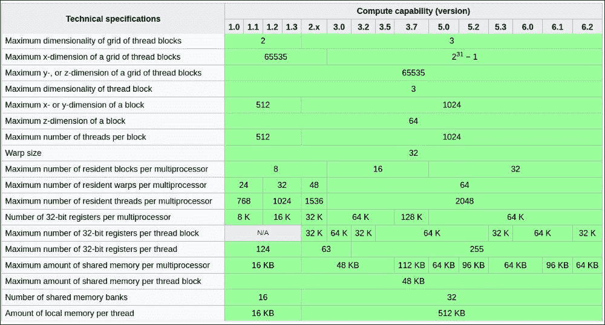

(来源：[`en.wikipedia.org/wiki/CUDA`](https://en.wikipedia.org/wiki/CUDA))

在执行过程中，多处理器以 **单指令多数据** (**SIMD**) 方式执行一组 32 个线程的指令（如前表所示）。在进行并行执行编程时，你需要将线程组织成尽可能接近底层架构的块。例如，对于矩阵的逐元素操作，比如我们的 AXPBOp，可以认为每个线程将对矩阵中的一个元素执行操作。所以，对一个 224 x 224 的图像进行计算将需要 50,176 个线程。假设 GPU 有 8 个多处理器，每个多处理器有 1024 个核心。在执行配置中，你可以定义一个 256 线程的块大小，并且执行完整计算所需的块数将是 196 个。为了简化并行程序的开发，块可以组织成一个多维网格（对于 CC 大于 2.0 的情况，最多支持 3 维，如前表所示），在图像输入的情况下，使用 14 x 14 块的二维网格是自然的。你可以自行组织线程到网格上的块中，但最佳的线程组织方式是遵循底层数据的维度，因为这样更容易将数据划分并分配给不同的线程。

每个线程执行时都会提供值，用于访问它在网格中的位置，这些值可以在代码中使用：

+   `gridDim.x`、`gridDim.y`、`gridDim.z` 线程块网格的维度

+   `blockIdx.x`、`blockIdx.y`、`blockIdx.z` 块在网格中的坐标

+   `blockDim.x`、`blockDim.y`、`blockDim.z` 块的维度

+   `threadIdx.x`、`threadIdx.y`、`threadIdx.z` 线程在块中的坐标

对于我们的逐元素 AXPBOp，每个线程处理一个元素，线程可以根据以下行索引获取数据元素：

```py
int i = blockIdx.x*blockDim.x + threadIdx.x;
```

部署时，内核调用中的前四个新参数对应于：

+   网格/块的维度，在本例中是 2，表示输入为图像/矩阵

+   启动网格的大小，在本例中是 {14, 14}。一旦每块线程的数量被定义（在本例中为 256），每个网格的块数就由问题的大小来决定（这里是矩阵的大小）。

+   启动块的大小，在本例中是 {16, 16}，用于每块 256 个线程，通常设置为 128 或 256。最好选择一个 warp 大小的倍数，因为执行是按 warp 进行的；如果你设置为 250，那么 201 个块将表现不佳：每个块的一个 warp 将无法充分发挥并行潜力。可以尝试不同的 32 的倍数，选择最有效的执行结果。

+   分配动态共享内存的数量，这是在定义共享内存（使用`LOCAL_MEM`宏）时需要的，尤其是在共享内存的大小在编译时未知的情况下。共享内存指定的是在同一线程块内共享的内存。在计算能力 2.x 和 3.x 的设备上，每个多处理器有 64KB 的片上内存，可以在 L1 缓存和共享内存之间进行分配（16K、32K 或 48K）。L1 缓存将线程在一个 warp 中的全局内存访问合并为尽可能少的缓存行。由于缓存的存在，每个线程之间的对齐差异对性能的影响可以忽略不计。第二和第三维度的跨步访问会引发效率问题；在这种情况下，使用共享内存使得你可以以合并的方式从全局内存中提取一个二维块到共享内存，并让连续的线程遍历共享内存块：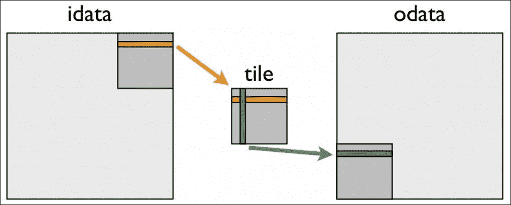

# 通过共享内存进行合并转置，NVIDIA 并行计算

当数据的维度不能整除为块大小与网格大小的乘积时，处理边界数据的线程将比其他线程执行得更快，并且内核代码必须以检查越界内存访问的方式编写。

在并行编程时，竞态条件、共享内存中的内存银行冲突以及数据无法保留在可用的寄存器中的情况是一些新的问题需要检查。合并全局内存访问是实现良好性能的最关键方面。NVIDIA® Nsight™ 工具将帮助你开发、调试和分析在 CPU 和 GPU 上执行的代码。

## 模型转换

当模型被保存时，得到的数据仅仅是一个数组列表，即权重向量（用于偏置）和矩阵（用于乘法运算）以及每一层的名称。将模型从一个框架转换到另一个框架非常简单：它包括加载一个数值数组并检查层的名称。以下是一些从 Caffe 深度学习框架（用 C++编写）到其他框架的转换示例：

+   [`github.com/an-kumar/caffe-theano-conversion`](https://github.com/an-kumar/caffe-theano-conversion)

+   [`github.com/kencoken/caffe-model-convert`](https://github.com/kencoken/caffe-model-convert)

+   [`github.com/piergiaj/caffe-to-theano`](https://github.com/piergiaj/caffe-to-theano)

要在 Torch 深度学习框架（用 Lua 编写）与 Theano 之间转换变量，你只需要一个工具将数据从 Lua 转换到 Python NumPy：

[`github.com/imodpasteur/lutorpy`](https://github.com/imodpasteur/lutorpy)

要在 Tensorflow 和 Theano 之间转换模型，我建议您使用 Keras 库，它将保持最新，并允许您在 Theano 或 Tensorflow 中训练模型。例如，要将模型从 Tensorflow 转换为 Theano，请保持您的 Keras 安装配置为 Theano，如我们在第五章中所见，*使用双向 LSTM 分析情感*，加载 Tensorflow 权重，并按如下方式修改层名称：

```py
from keras import backend as K
from keras.utils.conv_utils import convert_kernel
from keras.models import Model

# build your Keras model HERE
# then
model.load_weights('my_weights_tensorflow.h5')

for layer in model.layers:
   if layer.__class__.__name__ in ['Convolution1D', 'Convolution2D']:
      original_w = K.get_value(layer.W)
      converted_w = convert_kernel(original_w)
      K.set_value(layer.W, converted_w)

model.save_weights('my_weights_theano.h5')
```

一个镜像操作序列使我们能够反向操作，从 Theano 转换为 Tensorflow。

使用 Keras 设计网络的另一个优点是能够直接在云中进行训练，利用 Google Cloud 机器学习引擎，内置**张量处理单元**（**TPU**），作为 GPU 的替代方案，从底层为机器学习设计。

让我们以第五章中的示例为例，*使用双向 LSTM 分析情感*。

为了在云中训练模型，我在 Google 控制台中创建了一个名为*DeepLearning Theano*的项目，地址是[`console.cloud.google.com/iam-admin/projects`](https://console.cloud.google.com/iam-admin/projects)，并在项目的 API 管理器中启用了机器学习引擎 API。可能会有一些安装要求，您可以通过以下链接查看相关说明：[`cloud.google.com/ml-engine/docs/quickstarts/command-line`](https://cloud.google.com/ml-engine/docs/quickstarts/command-line)，例如 Google Cloud SDK 和项目配置。通过`gcloud` `init`命令，您可以重新初始化 SDK 配置，切换到*DeepLearning Theano*项目。

让我们将数据上传到云中新创建的存储桶，具体取决于您选择的区域（这里是`europe-west1`）：

```py
gsutil mb -l europe-west1 gs://keras_sentiment_analysis
gsutil cp -r sem_eval2103.train gs://keras_sentiment_analysis/sem_eval2103.train
gsutil cp -r sem_eval2103.dev gs://keras_sentiment_analysis/sem_eval2103.dev
gsutil cp -r sem_eval2103.test gs://keras_sentiment_analysis/sem_eval2103.test
```

由于模型是在云中的实例上执行的，因此需要：

+   修改 Python 脚本，使其从远程存储桶加载文件流，而不是从本地目录加载，使用库`tensorflow.python.lib.io.file_io.FileIO(train_file, mode='r')`，而不是标准方法`open(train_file, mode='r')`，两者的 mode 参数使用相同，'r'表示读取，`w`表示写入，

+   定义`setup.py`文件以配置云实例环境中所需的库：

    ```py
    from setuptools import setup, find_packages

    setup(name='example5',
      version='0.1',
      packages=find_packages(),
      description='keras on gcloud ml-engine',
      install_requires=[
          'keras',
          'h5py',
          'nltk'
      ],
      zip_safe=False)
    ```

+   定义云部署配置文件`cloudml-gpu.yaml`：

    ```py
      trainingInput:
        scaleTier: CUSTOM
        # standard_gpu provides 1 GPU. Change to complex_model_m_gpu for 4 GPUs
        masterType: standard_gpu
        runtimeVersion: "1.0"
    ```

在将训练提交给 Google ML Cloud 之前，先在本地检查训练是否正常工作，请运行以下命令：

```py
gcloud ml-engine local train --module-name 7-google-cloud.bilstm \
  --package-path ./7-google-cloud  -- --job-dir ./7-google-cloud \
  -t sem_eval2103.train -d sem_eval2103.dev -v sem_eval2103.test
```

如果本地一切正常，我们就可以将其提交到云端：

```py
JOB_NAME="keras_sentiment_analysis_train_$(date +%Y%m%d_%H%M%S)"

gcloud ml-engine jobs submit training $JOB_NAME \
          --job-dir gs://keras_sentiment_analysis/$JOB_NAME \
          --runtime-version 1.0 \
          --module-name 7-google-cloud.bilstm  \
          --package-path ./7-google-cloud \
          --region europe-west1 \
          --config=7-google-cloud/cloudml-gpu.yaml \
          -- \
          -t gs://keras_sentiment_analysis/sem_eval2103.train \
          -d gs://keras_sentiment_analysis/sem_eval2103.dev \
          -v gs://keras_sentiment_analysis/sem_eval2103.test

gcloud ml-engine jobs describe $JOB_NAME
```

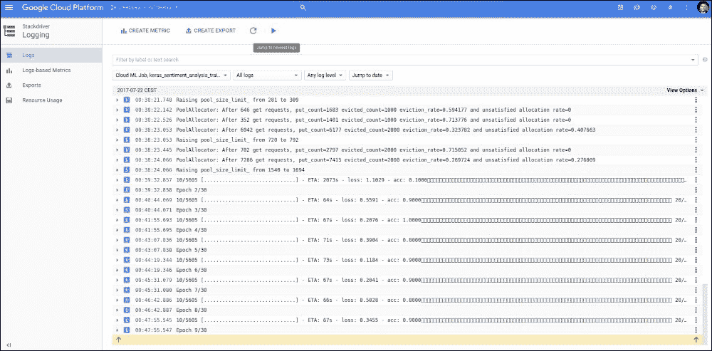

### 注意

请注意，Google ML Cloud 使用 Tensorflow 作为后端。

# 人工智能的未来

第二章，*使用前馈网络分类手写数字*介绍了多种优化技术（如 Adam、RMSProp 等），并提到了二阶优化技术。一个推广是还要学习更新规则：

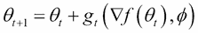

这里，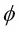是优化器的参数，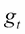用来从不同的问题实例中学习，类似于优化器从问题到问题的*泛化*或*迁移学习*，从而在新问题上学习得更好。在这种*学习如何学习*或*元学习*框架下，目标是最小化学习正确的时间，因此需要在多个时间步长上定义：

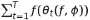

其中：

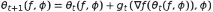

循环神经网络可以作为优化器模型来使用。这种解决多目标优化问题的泛化技术能提高神经网络的学习速度。

研究人员进一步探索，寻找通用人工智能，旨在实现具有人类水平技能的人工智能，具备自我提升的能力，并能以渐进的方式获得新技能，利用其**内在**的、之前学到的技能来寻找新的优化问题的解决方案。

**技能**可以被定义为一种智能工具，用于缩小或约束搜索空间，并限制机器人在无限可能性的世界中的行为。

构建**通用人工智能**要求你定义具有内在技能的智能架构，这些技能将由程序员硬编码到机器人中，并帮助解决较小的子问题，还需要定义新技能将被获得的顺序，即在**人工智能学校**中可以教授的**课程路线图**。而**渐进学习**是通过使用更简单的技能逐步学习技能，**引导学习**则涉及一个已经发现技能的教师，将这些技能教授给其他人工智能。

在自然语言翻译任务中，已经证明较小的网络能从较大的网络中更快、更好地学习，后者作为*导师*，已经学会了翻译并生成翻译供较小的网络学习，而不是直接从真实的人类翻译集学习。

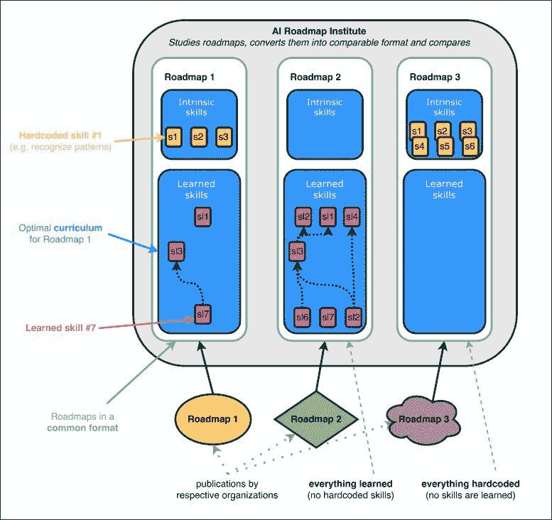

上图表示 GoodAI 路线图研究所，用于评估人工智能的学习路线图。

自我探索、与导师的沟通以及采纳负面和正面反馈是朝向自主智能发展的一些思想，这种智能将能够自我发展，而当前的深度学习网络为这一未来铺平了道路。

在朝着这一目标努力的公司中，值得一提的是 GoodAI 以及亚马逊及其 Echo 产品和其背后的语音控制助手技术 Alexa，后者已经学会了超过 10,000 项技能，帮助你组织生活。Alexa 的知识已经变得如此庞大，以至于很难深入了解并找出它的局限性。为开发者提供的测试环境使他们能够将这些技能集成到更高层次的智能工具中：


# 进一步阅读

你可以参考以下文章以了解更多：

+   *CUDA C 和 C++的简单介绍*，[`devblogs.nvidia.com/parallelforall/easy-introduction-cuda-c-and-c/`](https://devblogs.nvidia.com/parallelforall/easy-introduction-cuda-c-and-c/)

+   *如何高效访问 CUDA C/C++ 内核中的全局内存*，[`devblogs.nvidia.com/parallelforall/how-access-global-memory-efficiently-cuda-c-kernels/`](https://devblogs.nvidia.com/parallelforall/how-access-global-memory-efficiently-cuda-c-kernels/)

+   *在 CUDA C/C++ 中使用共享内存*，[`devblogs.nvidia.com/parallelforall/using-shared-memory-cuda-cc/`](https://devblogs.nvidia.com/parallelforall/using-shared-memory-cuda-cc/)

+   *另一个 Tensorflow 初学者指南（第**4 部分 - Google Cloud ML + GUP + Keras）*，[`liufuyang.github.io/2017/04/02/just-another-tensorflow-beginner-guide-4.html`](http://liufuyang.github.io/2017/04/02/just-another-tensorflow-beginner-guide-4.html)

+   通过梯度下降学习的学习，Marcin Andrychowicz、Misha Denil、Sergio Gomez、Matthew W. Hoffman、David Pfau、Tom Schaul、Brendan Shillingford 和 Nando de Freitas，2016

+   一种搜索通用人工智能的框架，Marek Rosa 和 Jan Feyereisl，The GoodAI Collective，2016

# 摘要

本章总结了我们对 Theano 深度学习概述的内容。

Theano 的第一组扩展，在 Python 和 C 中为 CPU 和 GPU 开发，已经在这里公开，用于为计算图创建新操作符。

将已学习的模型从一个框架转换到另一个框架并不是一项复杂的任务。Keras，这本书中多次提到的高层次库，作为 Theano 引擎之上的抽象层，提供了一种简单的方法来同时使用 Theano 和 Tensorflow，并推动模型在 Google ML Cloud 中的训练。

最后，本书中呈现的所有网络都是通用智能的基础，这些网络可以利用这些初步技能，如视觉或语言理解与生成，去学习更广泛的技能，这些技能仍然来自于现实世界数据或生成的数据的经验。
