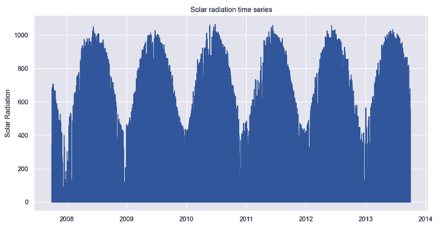
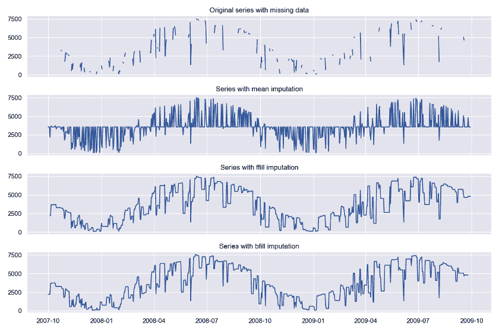
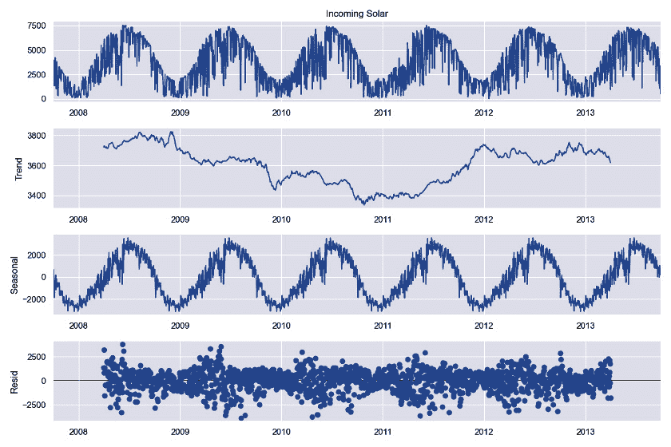
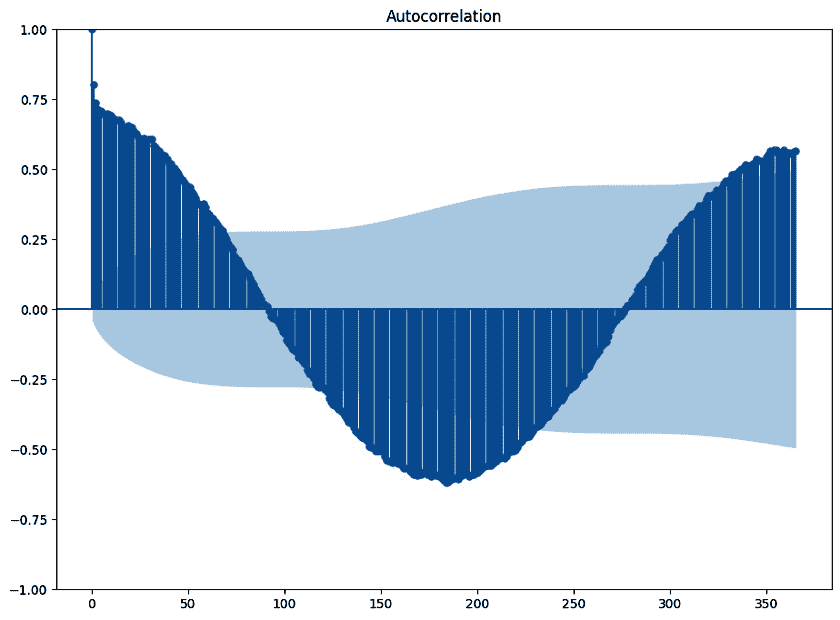
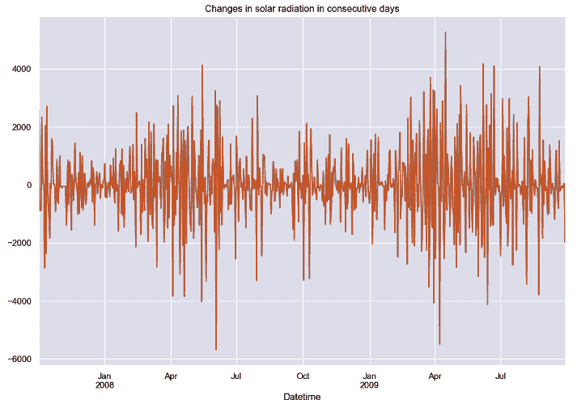
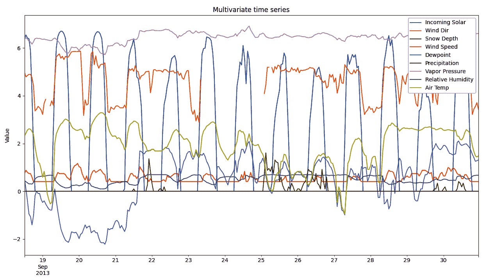
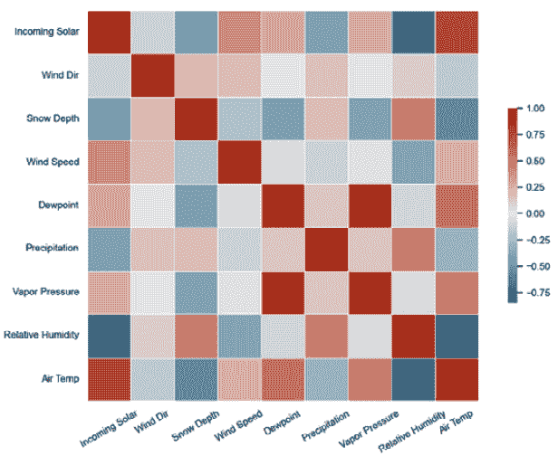

# 第一章：开始时间序列分析

本章介绍了时间序列分析中使用的主要概念和技术。本章首先定义时间序列并解释为什么分析这些数据集是数据科学中的一个重要话题。接下来，我们描述了如何使用 `pandas` 库加载时间序列数据。本章深入探讨了时间序列的基本组成部分，如趋势和季节性。本章涵盖的一个关键概念是平稳性。我们将探讨几种使用统计检验评估平稳性的方法。

本章将涵盖以下食谱：

+   使用 `pandas` 加载时间序列

+   可视化时间序列

+   重采样时间序列

+   处理缺失值

+   分解时间序列

+   计算自相关

+   检测平稳性

+   处理异方差性

+   加载并可视化多变量时间序列

+   重采样多变量时间序列

+   分析变量对之间的相关性

本章结束时，您将对时间序列分析的主要方面有一个扎实的基础。这包括加载和预处理时间序列数据、识别其基本组成部分、分解时间序列、检测平稳性，并将这些理解扩展到多变量设置。这些知识将为后续章节打下基础。

# 技术要求

要完成本章内容，您需要在计算机上安装 Python 3.9。我们将使用以下库：

+   `pandas` (2.1.4)

+   `numpy` (1.26.3)

+   `statsmodels` (0.14.1)

+   `pmdarima` (2.0.4)

+   `seaborn` (0.13.2)

您可以使用 `pip` 安装这些库：

```py
pip install pandas numpy statsmodels pmdarima seaborn
```

在我们的环境中，我们使用了 `pip` 版本 23.3.1。该章的代码可以在以下 GitHub URL 上找到：[`github.com/PacktPublishing/Deep-Learning-for-Time-Series-Data-Cookbook`](https://github.com/PacktPublishing/Deep-Learning-for-Time-Series-Data-Cookbook)

# 使用 pandas 加载时间序列

在本章的第一个食谱中，我们首先使用 `pandas` 在 Python 会话中加载数据集。在本书中，我们将使用 `pandas` 数据结构处理时间序列。`pandas` 是一个用于数据分析和处理的有用 Python 包。一元时间序列可以结构化为 `pandas` Series 对象，其中序列的值具有与 `pandas.Index` 结构相关联的索引或时间戳。

## 准备工作

我们将专注于一个与太阳辐射相关的数据集，该数据集由美国农业部收集。该数据包含关于太阳辐射（以每平方米瓦特为单位）的信息，数据跨度从 2007 年 10 月 1 日到 2013 年 10 月 1 日。数据以每小时为频率，共计 52,608 个观测值。

你可以从本章的*技术要求*部分提供的 GitHub URL 下载数据集。你也可以在以下 URL 找到原始数据源：[`catalog.data.gov/dataset/data-from-weather-snow-and-streamflow-data-from-four-western-juniper-dominated-experimenta-b9e22`](https://catalog.data.gov/dataset/data-from-weather-snow-and-streamflow-data-from-four-western-juniper-dominated-experimenta-b9e22)。

## 如何操作…

该数据集是一个`.csv`文件。在`pandas`中，我们可以使用`pd.read_csv``()`函数加载`.csv`文件：

```py
import pandas as pd
data = pd.read_csv('path/to/data.csv',
                   parse_dates=['Datetime'],
                   index_col='Datetime')
series = data['Incoming Solar']
```

在前面的代码中，注意以下几点：

+   首先，我们使用`import`关键字导入`pandas`。导入这个库是使其方法在 Python 会话中可用的必要步骤。

+   `pd.read_csv`的主要参数是文件位置。`parse_dates`参数会自动将输入变量（在此案例中是`Datetime`）转换为日期时间格式。`index_col`参数将数据的索引设置为`Datetime`列。

+   最后，我们使用方括号对`data`对象进行子集化，以获取`Incoming Solar`列，该列包含每个时间步长的太阳辐射信息。

## 如何操作…

以下表格显示了数据的一个样本。每行表示特定小时的时间序列水平。

| **日期时间** | **入射太阳辐射** |
| --- | --- |
| 2007-10-01 09:00:00 | 35.4 |
| 2007-10-01 10:00:00 | 63.8 |
| 2007-10-01 11:00:00 | 99.4 |
| 2007-10-01 12:00:00 | 174.5 |
| 2007-10-01 13:00:00 | 157.9 |
| 2007-10-01 14:00:00 | 345.8 |
| 2007-10-01 15:00:00 | 329.8 |
| 2007-10-01 16:00:00 | 114.6 |
| 2007-10-01 17:00:00 | 29.9 |
| 2007-10-01 18:00:00 | 10.9 |
| 2007-10-01 19:00:00 | 0.0 |

表 1.1：每小时单变量时间序列示例

包含时间序列的`series`对象是一个`pandas` Series 数据结构。该结构包含多个时间序列分析方法。我们也可以通过调用`pd.Series`，并提供数据集和相应的时间序列，来创建 Series 对象。以下是一个示例：`pd.Series(data=values, index=timestamps)`，其中`values`是时间序列的值，`timestamps`表示每个观测的时间戳。

# 可视化时间序列

现在，我们已经将时间序列加载到 Python 会话中。这个教程将带你完成在 Python 中可视化时间序列的过程。我们的目标是创建一个时间序列的折线图，图中日期位于*X*轴，系列的值位于*Y*轴。

## 准备工作

在 Python 中有多个数据可视化库。可视化时间序列有助于快速识别趋势或季节性影响等模式。图形是理解数据动态和发现其中异常的简便方式。

在本教程中，我们将使用两个不同的库创建时间序列图：`pandas`和`seaborn`。`seaborn`是一个流行的数据可视化 Python 库。

## 如何操作…

`pandas` Series 对象包含一个用于可视化时间序列的 `plot()` 方法。你可以按如下方式使用它：

```py
series.plot(figsize=(12,6), title='Solar radiation time series')
```

调用 `plot()` 方法并传入两个参数。我们使用 `figsize` 参数来更改图表的大小。在此案例中，我们将图表的宽度和高度分别设置为 `12` 英寸和 `6` 英寸。另一个参数是 `title`，我们将其设置为 `Solar radiation time series`。你可以查看 `pandas` 文档，获取完整的参数列表。

你可以按如下方式使用 `seaborn` 绘制时间序列图：

```py
import matplotlib.pyplot as plt
import seaborn as sns
series_df = series.reset_index()
plt.rcParams['figure.figsize'] = [12, 6]
sns.set_theme(style='darkgrid')
sns.lineplot(data=series_df, x='Datetime', y='Incoming Solar')
plt.ylabel('Solar Radiation')
plt.xlabel('')
plt.title('Solar radiation time series')
plt.show()
plt.savefig('assets/time_series_plot.png')
```

上述代码包括以下步骤：

1.  导入 `seaborn` 和 `matplotlib`，这两个是数据可视化库。

1.  通过调用 `reset_index()` 方法，将时间序列转换为 `pandas` DataFrame 对象。这个步骤是必须的，因为 `seaborn` 以 DataFrame 对象作为主要输入。

1.  使用 `plt.rcParams` 配置图形大小，设置宽度为 12 英寸，高度为 6 英寸。

1.  使用 `set_theme()` 方法将图表主题设置为 `darkgrid`。

1.  使用 `lineplot()` 方法构建图表。除了输入数据外，它还需要指定每个轴的列名：分别为 *x* 轴的 `Datetime` 和 *y* 轴的 `Incoming Solar`。

1.  配置图表参数，即 *y* 轴标签（`ylabel`）、*x* 轴标签（`xlabel`）和 `title`。

1.  最后，我们使用 `show` 方法来展示图表，并使用 `savefig` 方法将图表保存为 `.png` 文件。

## 它是如何工作的…

以下图表展示了从 `seaborn` 库获得的图形：



图 1.1：使用 seaborn 绘制的时间序列图

示例时间序列显示了强烈的年度季节性，其中年初的平均水平较低。除了部分波动和季节性因素外，时间序列的长期平均水平在时间上保持稳定。

我们学习了两种创建时间序列图的方法。一种使用 `pandas` 中的 `plot()` 方法，另一种使用 `seaborn`，这是一个专注于数据可视化的 Python 库。第一种方法提供了一种快速可视化数据的方式。而 `seaborn` 提供了更强大的可视化工具包，能够帮助你创建美观的图表。

## 还有更多内容……

本教程中创建的图表类型称为折线图。`pandas` 和 `seaborn` 都可以用来创建其他类型的图表。我们鼓励你阅读文档，了解更多类型的图表。

# 对时间序列进行重采样

时间序列重采样是改变时间序列频率的过程，例如将其从每小时调整为每日。这是时间序列分析中的一个常见预处理步骤，本教程展示了如何使用 `pandas` 完成此任务。

## 准备工作

更改时间序列的频率是分析前常见的预处理步骤。例如，前面章节中使用的时间序列具有每小时的粒度。然而，我们的目标可能是研究日常变化。在这种情况下，我们可以将数据重新采样为不同的周期。重新采样也是处理不规则时间序列的有效方法——那些在不规则间隔的时间段内收集的数据。

## 它是如何操作的……

我们将讨论重新采样时间序列可能有用的两种不同情况：改变采样频率和处理不规则时间序列。

以下代码将时间序列重新采样为每日粒度：

```py
series_daily = series.resample('D').sum()
```

每日粒度通过输入`D`到`resample()`方法中指定。每天的每个对应值通过`sum()`方法进行求和。

大多数时间序列分析方法假设时间序列是规则的；换句话说，它是按照规则的时间间隔（例如每天一次）收集的。但有些时间序列本身是自然不规则的。例如，零售产品的销售发生在任意时间戳，随着顾客进入商店。

让我们使用以下代码模拟销售事件：

```py
import numpy as np
import pandas as pd
n_sales = 1000
start = pd.Timestamp('2023-01-01 09:00')
end = pd.Timestamp('2023-04-01')
n_days = (end – start).days + 1
irregular_series = pd.to_timedelta(np.random.rand(n_sales) * n_days,
                                   unit='D') + start
```

上述代码创建了从`2023-01-01 09:00`到`2023-04-01`的`1000`个销售事件。此序列的示例如下表所示：

| **ID** | **时间戳** |
| --- | --- |
| 1 | 2023-01-01 15:18:10 |
| 2 | 2023-01-01 15:28:15 |
| 3 | 2023-01-01 16:31:57 |
| 4 | 2023-01-01 16:52:29 |
| 5 | 2023-01-01 23:01:24 |
| 6 | 2023-01-01 23:44:39 |

表 1.2：不规则时间序列示例

不规则时间序列可以通过重新采样转化为规则频率。在销售数据的情况下，我们将计算每天发生了多少销售：

```py
ts_sales = pd.Series(0, index=irregular_series)
tot_sales = ts_sales.resample('D').count()
```

首先，我们基于不规则的时间戳（`ts_sales`）创建一个零值时间序列。然后，我们将此数据集重新采样为每日频率（`D`），并使用`count`方法统计每天发生的观察次数。重建后的`tot_sales`时间序列可以用于其他任务，例如预测每日销售额。

## 它是如何工作的……

重建后的与太阳辐射相关的时间序列示例如下表所示：

| **日期时间** | **入射太阳辐射** |
| --- | --- |
| 2007-10-01 | 1381.5 |
| 2007-10-02 | 3953.2 |
| 2007-10-03 | 3098.1 |
| 2007-10-04 | 2213.9 |

表 1.3：重新采样后的太阳辐射时间序列

重新采样是时间序列分析中的一个基础预处理步骤。这项技术可以用来将时间序列转换为不同的粒度，或者将不规则时间序列转换为规则时间序列。

总结统计量是一个需要考虑的重要输入。在第一个案例中，我们使用`sum`来将每天观察到的小时太阳辐射值加总。在不规则时间序列的情况下，我们使用`count()`方法来计算每个周期内发生了多少事件。不过，您可以根据需求使用其他的总结统计量。例如，使用均值可以取每个周期的平均值来重新采样时间序列。

## 还有更多内容…

我们已将数据重新采样至日粒度。可用选项的列表在此：[`pandas.pydata.org/docs/user_guide/timeseries.html#dateoffset-objects`](https://pandas.pydata.org/docs/user_guide/timeseries.html#dateoffset-objects)。

# 处理缺失值

在这个教程中，我们将讨论如何对时间序列中的缺失值进行插补。我们将探讨不同的插补方法以及在选择方法时需要考虑的因素。我们还将展示如何使用`pandas`解决这个问题的示例。

## 准备工作

缺失值是困扰各种数据的问题，包括时间序列。由于传感器故障或标注错误等原因，观察值往往无法获取。在这种情况下，可以使用数据插补来克服这个问题。数据插补是通过根据某些规则（如均值或预定义值）分配一个值来实现的。

## 如何操作…

我们从模拟缺失数据开始。以下代码从一组两年的太阳辐射时间序列中移除了 60%的观察值：

```py
import numpy as np
sample_with_nan = series_daily.head(365 * 2).copy()
size_na=int(0.6 * len(sample_with_nan))
idx = np.random.choice(a=range(len(sample_with_nan)),
                       size=size_na,
                       replace=False)
sample_with_nan[idx] = np.nan
```

我们利用`numpy`中的`np.random.choice()`方法随机选择时间序列中的一部分样本。这些样本的观察值将被更改为缺失值（`np.nan`）。

在没有时间顺序的数据集中，通常使用中心统计量（如均值或中位数）来插补缺失值。可以按照如下方式进行：

```py
average_value = sample_with_nan.mean()
imp_mean = sample_with_nan.fillna(average_value)
```

时间序列插补必须考虑到观察值的时间特性。这意味着所分配的值应该遵循序列的动态。时间序列中更常见的方法是用最后一个已知的观察值来插补缺失数据。这个方法可以通过`ffill()`函数实现：

```py
imp_ffill = sample_with_nan.ffill()
```

另一种较不常见的方法是利用观察值的顺序，使用`bfill()`函数：

```py
imp_bfill = sample_with_nan.bfill()
```

`bfill()`方法使用数据集中下一个可用的观察值来插补缺失数据。

## 它的工作原理…

下图展示了使用每种方法插补后的重建时间序列：



图 1.2：使用不同策略插补缺失数据

`mean`插补方法忽略了时间序列的动态，而`ffill`和`bfill`则能保持时间序列与原始序列相似的动态。通常情况下，`ffill`更为优选，因为它不会打乱观察值的时间顺序，即不使用未来的信息来改变（插补）过去的值。

## 还有更多内容…

插补过程也可以在某些条件下进行，例如限制插补观测值的数量。您可以在这些函数的文档页面中了解更多信息，例如[`pandas.pydata.org/docs/reference/api/pandas.DataFrame.ffill.html`](https://pandas.pydata.org/docs/reference/api/pandas.DataFrame.ffill.html)。

# 时间序列分解

时间序列分解是将时间序列拆分成其基本组成部分的过程，如趋势或季节性。这个配方探讨了不同的技术来解决这个任务以及如何在它们之间做出选择。

## 准备工作

时间序列由三个部分组成——趋势、季节性和残差：

+   趋势描述了时间序列水平的长期变化。趋势可以是上升（水平增加）或下降（水平减少），并且它们可能随着时间变化。

+   季节性是指在固定时间周期内的规律性变化，比如每天一次。前面配方中绘制的太阳辐射时间序列显示了明显的年度季节性。夏季太阳辐射较高，冬季较低。

+   时间序列的残差（也称为不规则部分）是去除趋势和季节性成分后的剩余部分。

将时间序列分解成其组件有助于理解数据的基本结构。

我们将通过两种方法描述时间序列分解过程：经典分解方法和基于局部回归的方法。你还将学习如何将后者方法扩展到具有多个季节模式的时间序列。

## 如何操作…

有几种方法可以将时间序列分解成其基本部分。最简单的方法被称为经典分解。此方法在`statsmodels`库中实现，可以按如下方式使用：

```py
from statsmodels.tsa.seasonal import seasonal_decompose
result = seasonal_decompose(x=series_daily,
                            model='additive',
                            period=365)
```

除了数据集外，您还需要指定周期和模型类型。对于具有年度季节性的日常时间序列，周期应设置为`365`，即一年中的天数。`model`参数可以是`additive`（加法模型）或`multiplicative`（乘法模型）。我们将在下一部分详细讨论。

每个组件都作为结果对象的一个属性存储：

```py
result.trend
result.seasonal
result.resid
```

这些属性中的每一个都返回一个包含相应组件的时间序列。

可以说，时间序列分解中最流行的方法之一是`statsmodels`：

```py
from statsmodels.tsa.seasonal import STL
result = STL(endog=series_daily, period=365).fit()
```

对于`STL`方法，我们不需要像经典方法那样指定模型。

通常，时间序列分解方法假设数据集只包含单一的季节模式。然而，以高采样频率（如每小时或每天）收集的时间序列可能包含多个季节模式。例如，每小时的时间序列可能同时显示日常和每周的规律性变化。

`MSTL`方法（`period`参数的简称）如下代码所示：

```py
from statsmodels.tsa.seasonal import MSTL
result = MSTL(endog=series_daily, periods=(7, 365)).fit()
```

在之前的代码中，我们传递了两个周期作为输入：`7` 和 `365`。这些周期尝试捕捉日常时间序列中的每周和每年季节性。

## 它是如何工作的…

在给定的时间步 `i` 中，时间序列的值（`Y`i）可以使用加性模型进行分解，如下所示：

*Y*i *=* *趋势*i*+季节性*i*+残差*i

这种分解也可以是乘法性的：

*Y*i *=* *趋势*i*×季节性*i*×残差*i

最合适的方法，加性还是乘性，取决于输入数据。但你可以通过对数据应用对数函数，将乘法分解转换为加法分解。对数可以稳定方差，从而使得时间序列的成分在加性方面表现得更加一致。

类别分解的结果如下面的图所示：



图 1.3: 经典方法分解后的时间序列成分

在经典分解中，趋势是通过移动平均估算的，例如，最近 24 小时的平均值（对于每小时的序列）。季节性是通过对每个周期的值进行平均来估算的。`STL` 是一种更灵活的时间序列分解方法。它能够处理复杂的模式，如不规则的趋势或异常值。`STL` 利用**LOESS**（局部加权散点平滑法）来提取每个成分。

## 还有更多…

分解通常用于数据探索目的。但它也可以作为预测的预处理步骤。例如，一些研究表明，在训练神经网络之前去除季节性成分，可以提高预测性能。

## 另请参见

你可以通过以下参考文献了解更多信息：

+   Hewamalage, Hansika, Christoph Bergmeir, 和 Kasun Bandara. “基于递归神经网络的时间序列预测：现状与未来方向。” *国际预测期刊* 37.1 (2021): 388-427.

+   Hyndman, Rob J., 和 George Athanasopoulos. *Forecasting: Principles and Practice*. OTexts, 2018.

# 计算自相关

本教程将引导你计算自相关。自相关是衡量时间序列与自身在不同滞后期之间相关性的一种度量，它有助于理解时间序列的结构，特别是量化过去的值如何影响未来。

## 准备工作

相关性是衡量两个随机变量之间线性关系的统计量。自相关将这一概念扩展到时间序列数据。在时间序列中，给定时间步观察到的值通常与之前观察到的值相似。自相关函数量化了时间序列与其滞后版本之间的线性关系。滞后时间序列是指经过若干期移位后的时间序列。

## 如何操作…

我们可以使用 `statsmodels` 计算自相关函数：

```py
from statsmodels.tsa.stattools import acf
acf_scores = acf(x=series_daily, nlags=365)
```

该函数的输入是一个时间序列和要分析的滞后期数。在这个案例中，我们计算了直到`365`个滞后的自相关，即一整年的数据。

我们也可以使用`statsmodels`库计算偏自相关函数。这个度量通过控制时间序列在较短滞后期的相关性，扩展了自相关：

```py
from statsmodels.tsa.stattools import pacf
pacf_scores = pacf(x=series_daily, nlags=365)
```

`statsmodels`库还提供了绘制自相关分析结果的函数：

```py
from statsmodels.graphics.tsaplots import plot_acf, plot_pacf
plot_acf(series_daily, lags=365)
plot_pacf(series_daily, lags=365)
```

## 它是如何工作的…

下图展示了每日太阳辐射时间序列的自相关，滞后期数为`365`。



图 1.4：自相关分数至 365 个滞后。波动表示季节性

该图中的波动是由于年度季节性模式引起的。自相关分析是检测季节性的一种有效方法。

## 还有更多…

每个季节性滞后的自相关通常很大且为正。此外，有时自相关沿着滞后期逐渐衰减，这表明存在趋势。你可以通过以下网址了解更多信息：[`otexts.com/fpp3/components.html`](https://otexts.com/fpp3/components.html)。

偏自相关函数是识别自回归模型阶数的重要工具。其基本思路是选择偏自相关显著的滞后期数。

# 检测平稳性

平稳性是时间序列分析中的一个核心概念，也是许多时间序列模型的重要假设。本文将指导你如何测试一个时间序列的平稳性。

## 准备工作

一个时间序列是平稳的，如果它的统计特性不发生变化。这并不意味着序列随时间不变化，而是指其变化的方式本身不随时间变化。这包括时间序列的水平，在平稳条件下是恒定的。时间序列中的趋势或季节性会破坏平稳性。因此，在建模之前，处理这些问题可能会有所帮助。正如我们在*时间序列分解*一节中描述的那样，移除季节性会改善深度学习模型的预测。

我们可以通过差分来稳定时间序列的均值水平。差分是计算连续观测值之间差异的过程。这个过程分为两步：

1.  估计所需的差分步骤以实现平稳性。

1.  应用所需的差分操作次数。

## 如何做…

我们可以通过统计检验来估计所需的差分步骤，比如增强型迪基-富勒检验（Augmented Dickey-Fuller Test）或 KPSS 检验。这些检验可以通过`ndiffs()`函数在`pmdarima`库中实现：

```py
from pmdarima.arima import ndiffs
ndiffs(x=series_daily, test='adf')
```

除了时间序列，我们还传递了`test='adf'`作为输入，设置方法为增强型 Dickey-Fuller 检验。该函数的输出是差分步骤的次数，在这个例子中是`1`。然后，我们可以使用`diff()`方法对时间序列进行差分：

```py
series_changes = series_daily.diff()
```

差分也可以应用于季节性周期。在这种情况下，季节性差分涉及计算同一季节性周期之间连续观察值的差异：

```py
from pmdarima.arima import nsdiffs
nsdiffs(x=series_changes, test='ch', m=365)
```

除了数据和检验（`ch`表示 Canova-Hansen 检验），我们还指定了周期数。在此案例中，该参数设置为`365`（一年中的天数）。

## 它是如何工作的……

下图显示了差分后的时间序列。



图 1.5：差分后连续时期之间变化序列的示例

差分作为一种预处理步骤。首先，对时间序列进行差分，直到它变为平稳序列。然后，基于差分后的时间序列创建预测模型。通过反向差分操作，可以将模型提供的预测结果转换回原始尺度。

## 还有更多……

在这个食谱中，我们重点介绍了两种测试平稳性的方法。你可以在函数文档中查看其他选项：[`alkaline-ml.com/pmdarima/modules/generated/pmdarima.arima.ndiffs.html`](https://alkaline-ml.com/pmdarima/modules/generated/pmdarima.arima.ndiffs.html)。

# 处理异方差性

在这个食谱中，我们深入探讨了时间序列的方差。时间序列的方差是衡量数据分布程度以及这种分布如何随时间变化的指标。你将学习如何处理具有变化方差的数据。

## 准备工作

时间序列的方差可能会随时间变化，这也违反了平稳性。在这种情况下，时间序列被称为异方差性，通常显示长尾分布。这意味着数据是左偏或右偏的。这种情况是有问题的，因为它会影响神经网络和其他模型的训练。

## 如何做……

处理非恒定方差是一个两步过程。首先，我们使用统计检验来检查时间序列是否为异方差性。然后，我们使用如对数变换等方法来稳定方差。

我们可以使用统计检验方法，如 White 检验或 Breusch-Pagan 检验，来检测异方差性。以下代码基于`statsmodels`库实现了这些检验：

```py
import statsmodels.stats.api as sms
from statsmodels.formula.api import ols
series_df = series_daily.reset_index(drop=True).reset_index()
series_df.columns = ['time', 'value']
series_df['time'] += 1
olsr = ols('value ~ time', series_df).fit()
_, pval_white, _, _ = sms.het_white(olsr.resid, olsr.model.exog)
_, pval_bp, _, _ = sms.het_breuschpagan(olsr.resid, olsr.model.exog)
```

上述代码按照以下步骤执行：

1.  导入`statsmodels`模块`ols`和`stats`。

1.  根据时间序列的值和数据采集的行号（`1`表示第一次观察）创建一个 DataFrame。

1.  创建一个线性模型，将时间序列的值与`time`列相关联。

1.  运行`het_white`（White）和`het_breuschpagan`（Breusch-Pagan）来应用方差检验。

测试的输出是一个 p 值，其中原假设认为时间序列具有恒定方差。因此，如果 p 值低于显著性值，我们就拒绝原假设，并假设存在异方差性。

处理非恒定方差的最简单方法是使用对数变换数据。该操作可以按如下方式实现：

```py
import numpy as np
class LogTransformation:
    @staticmethod
    def transform(x):
        xt = np.sign(x) * np.log(np.abs(x) + 1)
        return xt
    @staticmethod
    def inverse_transform(xt):
        x = np.sign(xt) * (np.exp(np.abs(xt)) - 1)
        return x
```

上述代码是一个名为`LogTransformation`的 Python 类。它包含两个方法：`transform``()`和`inverse_transform``()`。第一个方法使用对数变换数据，第二个方法则恢复该操作。

我们将`transform``()`方法应用于时间序列，方法如下：

```py
series_log = LogTransformation.transform(series_daily)
```

对数是`scipy`库中可用的 Box-Cox 变换的特殊情况。你可以按如下方式实现该方法：

```py
series_transformed, lmbda = stats.boxcox(series_daily)
```

`stats.boxcox``()`方法估算一个变换参数`lmbda`，该参数可以用来恢复该操作。

## 它是如何工作的…

本节中概述的变换可以稳定时间序列的方差。它们还将数据分布拉近`正态`分布。这些变换对于神经网络特别有用，因为它们有助于避免饱和区。在神经网络中，当模型对不同输入变得不敏感时，就会发生饱和，从而影响训练过程。

## 还有更多…

Yeo-Johnson 幂变换类似于 Box-Cox 变换，但它允许时间序列中出现负值。你可以通过以下链接了解更多关于该方法的信息：[`docs.scipy.org/doc/scipy/reference/generated/scipy.stats.yeojohnson.html`](https://docs.scipy.org/doc/scipy/reference/generated/scipy.stats.yeojohnson.html)。

## 另见

你可以通过以下参考文献了解更多关于对数变换的重要性：

Bandara, Kasun, Christoph Bergmeir, 和 Slawek Smyl。“使用群体相似系列的递归神经网络进行跨时间序列数据库的预测：一种聚类方法。” *Expert Systems with Applications* 140 (2020): 112896。

# 加载和可视化多元时间序列

到目前为止，我们已学习如何分析单变量时间序列。然而，多元时间序列在现实问题中同样具有重要意义。本节将探讨如何加载多元时间序列。之前，我们使用了`pandas`的 Series 结构来处理单变量时间序列。而多元时间序列则更适合使用`pandas`的 DataFrame 对象来处理。

## 准备工作

多元时间序列包含多个变量。时间序列分析中的基本概念被扩展到多个变量随时间变化并彼此相互关联的情况。不同变量之间的关系可能难以建模，尤其是当这些变量的数量很大时。

在许多实际应用中，多个变量可能相互影响并表现出时间依赖性。例如，在天气建模中，入射太阳辐射与其他气象变量（如空气温度或湿度）相关联。将这些变量纳入单一的多变量模型中，可能对于建模数据的动态行为并获得更好的预测至关重要。

我们将继续研究太阳辐射数据集。这次时间序列通过添加额外的气象信息来扩展。

## 如何操作……

我们将从读取一个多变量时间序列开始。与 *使用 pandas 加载时间序列* 方法一样，我们依赖 `pandas` 来读取 `.csv` 文件并将其导入 DataFrame 数据结构：

```py
import pandas as pd
data = pd.read_csv('path/to/multivariate_ts.csv',
                   parse_dates=['datetime'],
                   index_col='datetime')
```

`parse_dates` 和 `index_col` 参数确保 DataFrame 的索引是一个 `DatetimeIndex` 对象。这一点非常重要，因为 `pandas` 会将这个对象视为时间序列。加载时间序列后，我们可以使用 `plot` `()` 方法对其进行转换和可视化：

```py
data_log = LogTransformation.transform(data)
sample = data_log.tail(1000)
mv_plot = sample.plot(figsize=(15, 8),
                      title='Multivariate time series',
                      xlabel='',
                      ylabel='Value')
mv_plot.legend(fancybox=True, framealpha=1)
```

上述代码遵循了以下步骤：

1.  首先，我们使用对数变换数据。

1.  我们选取最后 1,000 个观察值，以使得可视化图表不显得过于杂乱。

1.  最后，我们使用 `plot` `()` 方法创建可视化图表。我们还调用 `legend` 来配置图表的图例。

## 它是如何工作的……

以下图展示了一个多变量时间序列的示例：



图 1.6：多变量时间序列图

加载多变量时间序列的过程与单变量的情况类似。主要的区别是，多变量时间序列在 Python 中是作为 DataFrame 对象存储，而不是 Series 对象。

从前面的图表中，我们可以注意到，不同的变量遵循不同的分布，并且有着不同的平均值和离散程度。

# 重采样多变量时间序列

本方法回顾了重采样的主题，但重点讲解了多变量时间序列。我们将解释为什么重采样对多变量时间序列来说可能有点棘手，因为通常需要对不同的变量使用不同的汇总统计量。

## 准备工作

在重采样多变量时间序列时，可能需要根据不同的变量应用不同的汇总统计量。例如，您可能希望将每小时观察到的太阳辐射加总，以估算您能生成多少能量。然而，在总结风速时，取平均值而不是总和更为合理，因为风速变量不是累积的。

## 如何操作……

我们可以传递一个 Python 字典，详细说明每个变量应应用哪种统计量。然后，我们可以将这个字典传递给 `agg` `()` 方法，如下所示：

```py
stat_by_variable = {
    'Incoming Solar': 'sum',
    'Wind Dir': 'mean',
    'Snow Depth': 'sum',
    'Wind Speed': 'mean',
    'Dewpoint': 'mean',
    'Precipitation': 'sum',
    'Vapor Pressure': 'mean',
    'Relative Humidity': 'mean',
    'Air Temp': 'max',
}
data_daily = data.resample('D').agg(stat_by_variable)
```

我们使用不同的汇总统计量将时间序列聚合为日周期性。例如，我们想要汇总每天观察到的太阳辐射。对于空气温度变量（`Air Temp`），我们选择每天观察到的最大值。

## 它是如何工作的……

通过使用字典传递不同的汇总统计量，我们可以以更灵活的方式调整时间序列的频率。请注意，如果你希望对所有变量应用均值，则无需使用字典。更简单的方法是运行`data.resample('D').mean()`。

# 分析变量对之间的相关性

本教程将引导你通过使用相关性分析多变量时间序列的过程。这个任务对于理解系列中不同变量之间的关系，并进一步理解其动态特征非常有用。

## 准备工作

分析多个变量动态的常见方法是计算每对变量的相关性。你可以利用这些信息进行特征选择。例如，当变量对之间高度相关时，你可能只想保留其中一个。

## 如何做到……

首先，我们计算每对变量之间的相关性：

```py
corr_matrix = data_daily.corr(method='pearson')
```

我们可以使用`seaborn`库的热力图来可视化结果：

```py
import seaborn as sns
import matplotlib.pyplot as plt
sns.heatmap(data=corr_matrix,
            cmap=sns.diverging_palette(230, 20, as_cmap=True),
            xticklabels=data_daily.columns,
            yticklabels=data_daily.columns,
            center=0,
            square=True,
            linewidths=.5,
            cbar_kws={"shrink": .5})
plt.xticks(rotation=30)
```

热力图是可视化矩阵的常用方式。我们从`sns.diverging_palette`中选择一个渐变色调来区分负相关（蓝色）和正相关（红色）。

## 它是如何工作的……

下图显示了带有相关性结果的热力图：



图 1.7: 多变量时间序列的相关矩阵

`corr()`方法计算`data_daily`对象中每对变量之间的相关性。在这个例子中，我们使用的是皮尔逊相关性，并指定`method='pearson'`参数。Kendall 和 Spearman 是皮尔逊相关性的两种常见替代方法。
