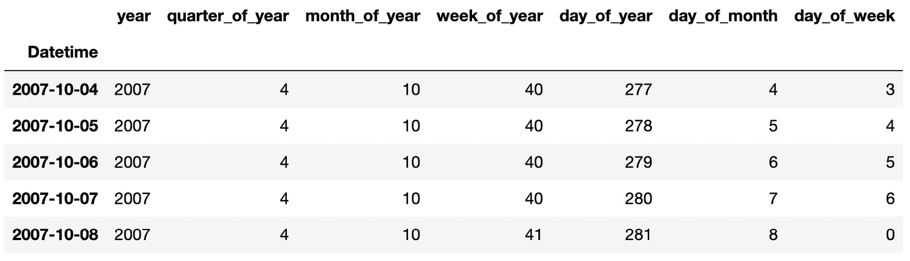
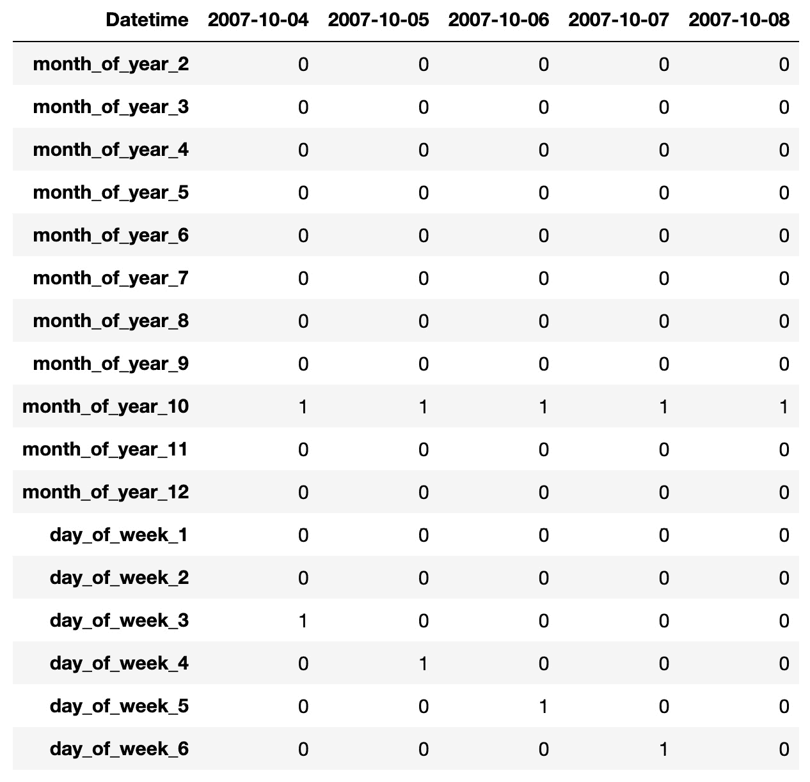
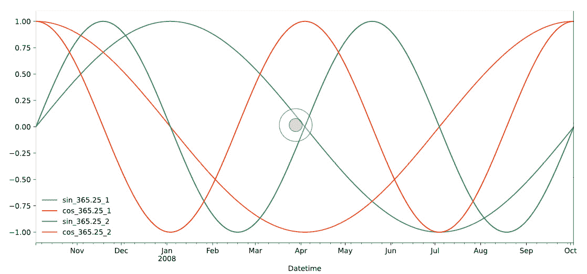
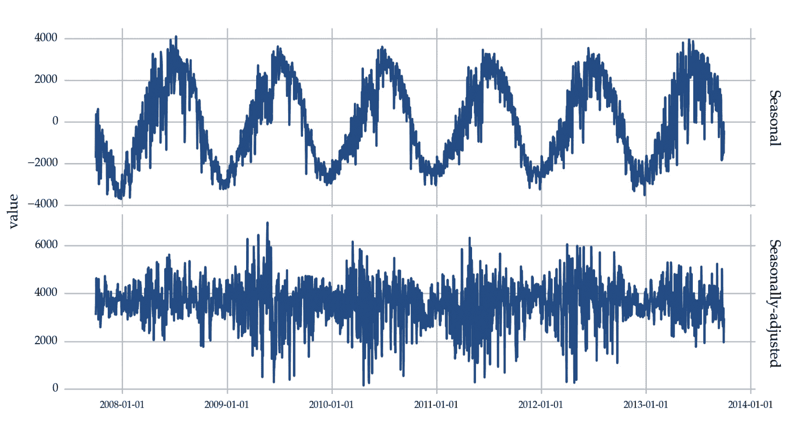

# 第三章：单变量时间序列预测

在本章中，我们将开发深度学习模型来解决单变量时间序列预测问题。我们将涉及时间序列预处理的几个方面，例如为监督学习准备时间序列以及处理趋势或季节性等情况。

我们将涵盖不同类型的模型，包括简单的基准模型，如天真预测或历史均值法。我们还将简要介绍一种流行的预测技术——**自回归积分滑动平均**（**ARIMA**）。接下来，我们将解释如何使用不同类型的深度学习方法创建预测模型。这些方法包括前馈神经网络、**长短期记忆**（**LSTM**）、**门控循环单元**（**GRU**）、堆叠**LSTM**和**卷积神经网络**（**CNNs**）。你还将学习如何解决时间序列建模中常见的问题，例如如何使用一阶差分处理趋势，如何通过对数变换稳定方差。通过本章的学习，你将能够解决单变量时间序列预测问题。

本章将引导你完成以下方案：

+   构建简单的预测模型

+   使用 ARIMA 进行单变量预测

+   为监督学习准备时间序列

+   使用前馈神经网络进行单变量预测

+   使用 LSTM 进行单变量预测

+   使用 GRU 进行单变量预测

+   使用堆叠 LSTM 进行单变量预测

+   将 LSTM 与多个全连接层结合

+   使用 CNN 进行单变量预测

+   处理趋势 – 采用一阶差分

+   处理季节性 – 季节虚拟变量和傅里叶级数

+   处理季节性 – 季节差分

+   处理季节性 – 季节分解

+   处理非恒定方差 – 对数变换

# 技术要求

在深入探讨单变量时间序列预测问题之前，我们需要确保系统中已安装适当的软件和库。这里，我们将讨论实现本章中描述的程序的主要技术要求：

+   我们主要需要 Python 3.9 或更高版本，`pip` 或 Anaconda，PyTorch 和 CUDA（可选）。你可以参考上一章的 *安装 PyTorch* 方案，了解有关这些工具的更多信息。

+   NumPy (1.26.3) 和 pandas (2.1.4)：这两个 `Python` 库提供了多种数据处理和分析方法。

+   `statsmodels` (0.14.1)：该库实现了几种统计方法，包括一些有用的时间序列分析技术。

+   `scikit-learn` (1.4.0)：`scikit-learn` 是一个流行的 `Python` 库，用于统计学习。它包含了几种解决不同任务的方法，例如分类、回归和聚类。

+   `sktime` (0.26.0)：一个 Python 库，提供了一个框架来处理涉及时间序列的多个问题。

你可以使用 `pip`，Python 的包管理器，来安装这些库。例如，要安装 `scikit-learn`，你可以运行以下代码：

```py
pip install -U scikit-learn
```

本章的代码可以在以下 GitHub URL 中找到：[`github.com/PacktPublishing/Deep-Learning-for-Time-Series-Data-Cookbook`](https://github.com/PacktPublishing/Deep-Learning-for-Time-Series-Data-Cookbook)。

# 构建简单的预测模型

在深入探讨更复杂的方法之前，让我们从一些简单的预测模型开始：朴素模型、季节性朴素模型和均值模型。

## 准备工作

在本章中，我们专注于涉及单变量时间序列的预测问题。让我们从加载我们在*第一章*中探索的一个数据集开始：

```py
import pandas as pd
serie = pd.read_csv(
    "assets/datasets/time_series_solar.csv",
    parse_dates=["Datetime"],
    index_col="Datetime",
)['Incoming Solar']
```

在前面的代码中，`series` 是一个 `pandas Series` 对象，包含单变量时间序列。

## 如何实现…

我们现在可以使用以下三种方法来预测我们的时间序列：

+   `Python` 中可以像下面这样简单实现：

    ```py
    series.shift(1)
    ```

+   `m`，在 `Python` 中，可以这样实现：

    ```py
    m = 12
    series.shift(m)
    ```

+   `Python`如下：

    ```py
    series.expanding().mean()
    ```

这三种方法是有用的基准，可以用来评估其他更复杂预测解决方案的表现。

## 它是如何工作的…

这些简单的模型对时间序列数据做了一些假设：

+   朴素模型假设序列是随机的，每个观测值与前一个观测值是独立的。

+   季节性朴素模型通过识别固定间隔或“季节”的模式，增加了一些复杂性。

+   均值模型假设序列围绕一个常数均值波动，未来的值将回归到该均值。

## 还有更多…

尽管这些简单模型看起来过于基础，但它们有两个关键作用：

+   **基准**：像这样的简单模型通常用作更复杂模型的基准。如果复杂模型无法超过这些简单方法的表现，那么就说明复杂模型可能存在问题，或者时间序列数据没有可预测的模式。

+   **理解数据**：这些模型还可以帮助我们理解数据。如果时间序列数据能够通过朴素模型或均值模型进行良好的预测，那么这表明数据可能是随机的，或围绕一个常数均值波动。

实现简单的预测模型，如朴素模型、季节性朴素模型和历史均值模型，可能非常简单，但利用现有的库来提供这些模型的现成实现可能会更有益。这些库不仅简化了实现过程，而且通常还提供了额外的功能，如内置模型验证、优化和其他实用工具。

这里有两个提供这些模型的库的示例：

+   GluonTS：GluonTS 是一个专注于时间序列概率模型的 `Python` 库。除了其他模型外，它还实现了季节性朴素模型，可以在以下链接找到：[`ts.gluon.ai/dev/api/gluonts/gluonts.model.seasonal_naive.html`](https://ts.gluon.ai/dev/api/gluonts/gluonts.model.seasonal_naive.html)。

+   `sktime`：这个库提供了一个框架，用于开发基于时间序列数据的不同类型模型。它包括一个 `NaiveForecaster` 方法，实现了几种基准模型。你可以在以下网址阅读更多关于此方法的信息：[`www.sktime.net/en/stable/api_reference/auto_generated/sktime.forecasting.naive.NaiveForecaster.html`](https://www.sktime.net/en/stable/api_reference/auto_generated/sktime.forecasting.naive.NaiveForecaster.html)。

+   PyTorch Forecasting：这个库专注于使用神经网络开发最先进的时间序列预测模型，适用于实际应用和研究。PyTorch Forecasting 提供了一个基准模型类，使用最后已知的目标值作为预测。这个类可以在以下链接找到：[`pytorch-forecasting.readthedocs.io/en/stable/api/pytorch_forecasting.models.baseline.Baseline.html`](https://pytorch-forecasting.readthedocs.io/en/stable/api/pytorch_forecasting.models.baseline.Baseline.html)。

上述库在进行预测任务时可以作为一个很好的起点。它们不仅提供了简单预测模型的实现，还包含了许多其他复杂的模型和工具，可以帮助简化开发和验证时间序列预测模型的过程。

在接下来的教程中，我们将看到如何放宽或扩展这些假设，以构建更复杂的模型。

# 使用 ARIMA 进行单变量预测

ARIMA 是一种基于两个组成部分的单变量时间序列预测方法：自回归部分和移动平均部分。在自回归中，**滞后**指的是时间序列数据中用于预测未来值的先前数据点。例如，如果我们使用一个滞后为 1，那么我们将使用前一个时间步的值来建模当前观测值。移动平均部分则使用过去的误差来建模时间序列的未来观测值。

## 准备工作

要使用 ARIMA 模型，如果尚未安装 `statsmodels` Python 包，则需要安装它。你可以使用 `pip` 安装：

```py
pip install -U statsmodels
```

对于本教程，我们将使用与前一个教程相同的数据集。

## 如何操作…

在 Python 中，你可以使用 `statsmodels` 库中的 ARIMA 模型。以下是如何拟合 ARIMA 模型的一个基本示例：

```py
import pandas as pd
from statsmodels.tsa.arima.model import ARIMA
series = pd.read_csv(
    "assets/datasets/time_series_solar.csv",
    parse_dates=["Datetime"],
    index_col="Datetime",
)['Incoming Solar']
model = ARIMA(series, order=(1, 1, 1), freq='H')
model_fit = model.fit()
forecasts = model_fit.predict(start=0, end=5, typ='levels')
```

## 工作原理…

ARIMA 模型基于时间序列的过去值来解释时间序列。它们结合了 **自回归**（**AR**）模型、**积分**（**I**）模型和 **移动平均**（**MA**）模型的特点：

+   AR 部分涉及回归，其中时间序列的下一个值是基于前 `p` 个滞后值来建模的。

+   ARIMA 是为平稳数据定义的，因此可能需要在建模前对数据进行预处理。这是通过 I 部分完成的，I 部分表示使序列平稳所需的差分操作次数（`d`）。

+   MA 组件是另一种回归模型，其中系列的下一个值是基于过去 `q` 个误差来建模的。

这些操作的顺序表示为一个元组（`p, d, q`）。最佳组合取决于输入数据。在这个例子中，我们使用了（`1, 1, 1`）作为示例。

通过 `model_fit.predict()` 函数对未来六个观察值进行预测。预测的起始和结束索引分别设置为 `0` 和 `5`。`typ='levels'` 参数用于直接返回预测值，而不是差分后的值。

## 还有更多……

确定 ARIMA 模型的正确顺序（`p, d, q`）可能具有挑战性。这通常涉及检查 `2` 测量时间序列与其在过去两个时间周期的值之间的相关性。另一方面，PACF 测量自相关，同时控制前一个滞后。这意味着，PACF 在滞后 `2` 时，测量的是系列与其两个时间周期前的值之间的相关性，但去除了一个时间周期滞后的线性依赖。你可以通过以下网址了解更多：[`otexts.com/fpp3/acf.html`](https://otexts.com/fpp3/acf.html)。通过检查 ACF 和 PACF 图，我们可以更好地理解时间序列的潜在模式，从而做出更准确的预测。

此外，ARIMA 模型假设时间序列是平稳的，但这并不总是正确的。因此，可能需要使用如差分或对数等转换方法来使时间序列平稳，从而适应 ARIMA 模型。

**季节性 ARIMA** 模型通常用于具有季节性成分的非平稳时间序列。该模型添加了一组参数，专门用来建模时间序列的季节性成分。

请注意，调节 ARIMA 参数有自动化的方法。一种常见的方法是使用 `pmdarima` 库中的 `auto_arima()` 函数。另一个有用的实现是 `statsforecast` 包中提供的实现。你可以通过以下网址了解更多：[`nixtlaverse.nixtla.io/statsforecast/index.html`](https://nixtlaverse.nixtla.io/statsforecast/index.html)。

除了 ARIMA，你还可以探索指数平滑方法，这是另一种流行的经典预测方法。指数平滑方法的实现也可以在 `statsmodels` 或 `statsforecast` 中找到，例如。

# 为监督学习准备时间序列

在这篇教程中，我们将重点介绍机器学习方法用于预测。我们首先描述将时间序列从一系列值转换为适合监督学习格式的过程。

## 准备工作

监督学习涉及一个包含解释变量（输入）和目标变量（输出）数据集。时间序列由一系列带有时间戳的值组成。因此，我们需要重构时间序列，以适应监督学习。常见的做法是使用滑动窗口。序列中的每个值基于其之前的最近值（也称为滞后值）。

在准备这一部分时，您需要确保时间序列数据可用，并以`pandas` DataFrame 的形式存在，同时安装了`pandas`和 NumPy 库。如果没有，您可以使用`pip`进行安装：

```py
pip install -U pandas numpy
```

我们还将单变量时间序列加载到 Python 会话中：

```py
series = pd.read_csv(
    "assets/datasets/time_series_solar.csv",
    parse_dates=["Datetime"],
    index_col="Datetime",
)['Incoming Solar']
```

## 如何实现…

以下 Python 函数接受单变量时间序列和窗口大小作为输入，并返回监督学习问题的输入（`X`）和输出（`y`）：

```py
import pandas as pd
def series_to_supervised(data, n_in=1, n_out=1, dropnan=True):
    n_vars = 1 if len(data.shape) == 1 else data.shape[1]
    df = pd.DataFrame(data)
    cols, names = list(), list()
    for i in range(n_in, 0, -1):
        cols.append(df.shift(i))
        names += [('var%d(t-%d)' % (j + 1, i)) for j in range(n_vars)]
     for i in range(0, n_out):
        cols.append(df.shift(-i))
        if i == 0:
            names += [('var%d(t)' % (j + 1)) for j in range(n_vars)]
        else:
            names += [('var%d(t+%d)' % (j + 1, i)) for j in range(n_vars)]
    agg = pd.concat(cols, axis=1)
    agg.columns = names
    if dropnan:
        agg.dropna(inplace=True)
     return agg
data = series_to_supervised(series, 3)
print(data)
```

`series_to_supervised`函数是此脚本的核心，它接受四个参数：时间序列数据、滞后观测值的数量（`n_in`）、作为输出的观测值数量（`n_out`），以及是否删除包含`NaN`值的行（`dropnan`）：

1.  函数首先检查数据类型，并为列（`cols`）及其名称（`names`）准备一个空列表。然后，它通过平移 DataFrame 并将这些列附加到`cols`中，以及将相应的列名附加到`names`中，创建输入序列（`t-n, ..., t-1`）。

1.  该函数继续以相似的方式创建预测序列`t, t+1 ..., t+n`，并将其附加到`cols`和`names`中。然后，它将所有列聚合到一个新的 DataFrame（`agg`）中，分配列名，并可选择删除包含`NaN`值的行。

1.  然后，脚本加载有关太阳辐射的时间序列数据集（`time_series_solar.csv`）到一个 DataFrame（`df`）中，提取`Incoming Solar`列到一个 NumPy 数组（`values`），并使用`series_to_supervised`函数将该数组转换为具有三个滞后观测值的监督学习数据集。

1.  最后，它会打印转换后的数据，其中包含作为输入的滞后观测序列，以及作为输出的相应未来观测值。该格式已准备好用于任何监督学习算法。

## 它是如何工作的…

在监督学习中，目标是训练一个模型，以学习输入变量与目标变量之间的关系。然而，在处理时间序列数据时，这种结构并不直接可用。数据通常是随时间变化的观测序列（例如，温度和股价）。因此，我们必须将时间序列数据转换为适合监督学习的格式。这正是`series_to_supervised`函数的作用。

转化过程涉及使用滑动窗口方法创建原始时间序列数据的滞后版本。这是通过将时间序列数据按一定步数（在代码中由`n_in`表示）进行平移来创建输入特征。这些滞后观察值作为解释变量（输入），其思想是过去的值会影响许多现实世界时间序列的未来值。

目标变量（输出）通过将时间序列按相反方向平移一定步数（预测跨度），由`n_out`表示。这意味着，对于每个输入序列，我们有相应的未来值，模型需要预测这些值。

例如，假设我们准备使用大小为`3`的滑动窗口来为一个简单的预测任务准备单变量时间序列。在这种情况下，我们可以将序列`[1, 2, 3, 4, 5, 6]`转化为以下监督学习数据集：

| **输入 (t-3,** **t-2, t-1)** | **输出 (t)** |
| --- | --- |
| 1, 2, 3 | 4 |
| 2, 3, 4 | 5 |
| 3, 4, 5 | 6 |

表 3.1：将时间序列转化为监督学习数据集的示例

`series_to_supervised()`函数接收一系列观察值作为输入，`n_in`指定作为输入的滞后观察值数量，`n_out`指定作为输出的观察值数量，还有一个布尔参数`dropnan`用于去除包含`NaN`值的行。它返回一个适用于监督学习的 DataFrame。

该函数通过在输入数据上迭代指定次数，每次平移数据并将其附加到列表（`cols`）中。然后将列表连接成一个 DataFrame，并适当地重命名列。如果`dropnan=True`，则删除任何包含缺失值的行。

## 还有更多…

窗口大小决定了我们应该使用多少过去的时间步来预测未来的时间步，这取决于具体问题和时间序列的性质。过小的窗口可能无法捕捉到重要的模式，而过大的窗口可能会包含不相关的信息。测试不同的窗口大小并比较模型性能是选择合适窗口大小的常见方法。

# 使用前馈神经网络进行单变量预测

本教程将引导你通过使用单变量时间序列构建前馈神经网络进行预测的过程。

## 准备就绪

在将时间序列数据转化为适用于监督学习的格式后，我们现在准备使用它来训练一个前馈神经网络。我们策略性地决定对数据集进行重采样，从每小时数据转为每日数据。这一优化显著加速了我们的训练过程：

```py
series = series.resample('D').sum()
```

## 如何操作…

以下是使用 PyTorch 构建和评估前馈神经网络的步骤：

1.  我们首先将数据拆分为训练集和测试集并进行归一化。需要注意的是，Scaler 应该在训练集上进行拟合，并用于转换训练集和测试集：

    ```py
    import pandas as pd
    from sklearn.model_selection import train_test_split
    from sklearn.preprocessing import MinMaxScaler
    scaler = MinMaxScaler(feature_range=(-1, 1))
    train, test = train_test_split(data, test_size=0.2, 
        shuffle=False)
    train = scaler.fit_transform(train)
    test = scaler.transform(test)
    X_train, y_train = train[:, :-1], train[:, -1]
    X_test, y_test = test[:, :-1], test[:, -1]
    X_train = torch.from_numpy(X_train).type(torch.Tensor)
    X_test = torch.from_numpy(X_test).type(torch.Tensor)
    y_train = torch.from_numpy(y_train).type(torch.Tensor).view(-1)
    y_test = torch.from_numpy(y_test).type(torch.Tensor).view(-1)
    ```

1.  然后，我们使用 PyTorch 创建一个简单的前馈神经网络，包含一个隐藏层。`input_dim` 代表滞后的数量，通常称为回溯窗口。`hidden_dim` 是神经网络隐藏层中的隐藏单元数量。最后，`output_dim` 是预测范围，在以下示例中设置为 `1`。我们使用 `ReLU` 激活函数，这是我们在上一章的 *训练前馈神经网络* 章节中描述的：

    ```py
    class FeedForwardNN(nn.Module):
        def __init__(self, input_dim, hidden_dim, output_dim):
            super(FeedForwardNN, self).__init__()
            self.fc1 = nn.Linear(input_dim, hidden_dim)
            self.fc2 = nn.Linear(hidden_dim, output_dim)
            self.activation = nn.ReLU()
        def forward(self, x):
            out = self.activation(self.fc1(x))
            out = self.fc2(out)
            return out
    model = FeedForwardNN(input_dim=X_train.shape[1],
                          hidden_dim=32,
                          output_dim=1)
    ```

1.  接下来，我们定义`loss`函数和`optimizer`，并训练模型：

    ```py
    loss_fn = nn.MSELoss()
    optimizer = torch.optim.Adam(model.parameters(), lr=0.001)
    epochs = 200
    for epoch in range(epochs):
        model.train()
        optimizer.zero_grad()
        out = model(X_train).reshape(-1,)
        loss = loss_fn(out, y_train)
        loss.backward()
        optimizer.step()
        if epoch % 10 == 0:
            print(f"Epoch: {epoch}, Loss: {loss.item()}")
    ```

1.  最后，我们在测试集上评估模型：

    ```py
    model.eval()
    y_pred = model(X_test).reshape(-1,)
    test_loss = loss_fn(y_pred, y_test)
    print(f"Test Loss: {test_loss.item()}")
    ```

## 它是如何工作的……

这个脚本首先将数据分为训练集和测试集。`MinMaxScaler` 用于将特征缩放到 `-1` 和 `1` 之间。需要注意的是，我们只在训练集上拟合 scaler，以避免数据泄漏。

接下来，我们定义一个简单的前馈神经网络模型，包含一个隐藏层。`FeedForwardNN`类继承自`nn.Module`，这是 PyTorch 中所有神经网络模块的基类。类构造函数定义了网络的层，`forward`方法指定了前向传播的过程。

然后，模型使用均方误差损失函数和 `Adam` 优化器进行训练。模型参数在多个迭代周期中不断更新。

最后，模型在测试集上进行评估，未见数据的损失衡量了模型在训练数据之外的泛化能力。

## 还有更多……

这是一个简单的例子，展示了如何使用前馈神经网络进行时间序列预测。你可以通过以下几种方式改进此模型：

+   你可以尝试不同的网络架构，例如，通过增加更多层或改变隐藏层中神经元的数量。你还可以尝试不同的激活函数、优化器和学习率。

+   使用更复杂的方法准备训练集和测试集可能会更有益；例如，使用滚动窗口验证策略。

+   另一个改进可以是使用早停法来防止过拟合。我们将在下一章学习这一技术。

+   最后但同样重要的是，**递归神经网络**（**RNNs**）和 LSTM 网络是专门为序列数据设计的，能够为时间序列预测提供更好的结果。

# 使用 LSTM 进行单变量预测

本食谱将引导你完成构建 LSTM 神经网络以进行单变量时间序列预测的过程。

## 准备开始

正如我们在*第二章*中看到的那样，LSTM 网络作为 RNN 的一种变体，因其在时间序列和序列数据上的表现而受到广泛关注。LSTM 网络特别适合这个任务，因为它们能够有效地捕捉输入数据中的长期时间依赖性，得益于其内在的记忆单元。

本节将使用 PyTorch 扩展我们的一元时间序列预测到 LSTM 网络。因此，我们继续使用前一个食谱中创建的对象（*使用前馈神经网络进行一元预测*）。

## 如何操作……

我们将使用前一部分中的相同训练集和测试集。对于 LSTM，我们必须将输入数据重塑为 3D 格式。正如我们在前一章中探讨的那样，LSTM 输入张量的三个维度分别表示以下内容：

+   **样本**：一个子序列（例如，过去五个滞后值）就是一个样本。一个批次是一组样本。

+   **时间步长**：窗口大小；每个时间点使用多少过去的观测值。

+   **特征**：模型中使用的变量数量。一元时间序列始终只有一个特征。

以下代码将输入的解释性变量转换为 3D 格式：

```py
X_train = X_train.view([X_train.shape[0], X_train.shape[1], 1])
X_test = X_test.view([X_test.shape[0], X_test.shape[1], 1])
```

在前面的代码行中，`X_train.shape[0]`和`X_test.shape[0]`表示样本的数量（即序列的数量），而`X_train.shape[1]`和`X_test.shape[1]`表示时间步长的数量（窗口大小）。重塑操作中的最后一个维度，设置为`1`，表示特征的数量。我们的一元时间序列只有一个特征，所以设置为`1`。如果我们有一个多元时间序列，这个值将对应于数据中的变量数量。

PyTorch 中的`view()`函数用于重塑`tensor`对象。它等同于 NumPy 中的`reshape()`函数，允许我们重新组织数据以匹配 LSTM 模型所需的输入形状。以这种方式重塑数据可以确保 LSTM 模型接收到期望格式的数据。这对于 LSTM 有效建模时间序列数据中的时间依赖性至关重要。

然后，我们定义 LSTM 模型：

```py
class LSTM(nn.Module):
    def __init__(self, input_dim, hidden_dim, num_layers, output_dim):
        super(LSTM, self).__init__()
        self.hidden_dim = hidden_dim
        self.num_layers = num_layers
        self.lstm = nn.LSTM(input_dim, hidden_dim, num_layers,
            batch_first=True)
        self.fc = nn.Linear(hidden_dim, output_dim)
    def forward(self, x):
        h0 = torch.zeros(self.num_layers, x.size(0),
            self.hidden_dim).requires_grad_()
        c0 = torch.zeros(self.num_layers, x.size(0),
            self.hidden_dim).requires_grad_()
        out, (hn, cn) = self.lstm(x, (h0.detach(), c0.detach()))
        out = self.fc(out[:, -1, :])
        return out
model = LSTM(input_dim=1,
             hidden_dim=32,
             output_dim=1,
             num_layers=1)
```

请注意，对于 LSTM，`input_dim`的输入维度是`1`，表示时间序列中的变量数量。这一点与我们在前一个食谱中传递给前馈神经网络的`input_dim`参数不同。在那个例子中，`input_dim`设置为`3`，表示滞后数或特征数。

现在，我们继续训练模型：

```py
epochs = 200
for epoch in range(epochs):
    model.train()
    optimizer.zero_grad()
    out = model(X_train).reshape(-1,)
    loss = loss_fn(out, y_train)
    loss.backward()
    optimizer.step()
    if epoch % 10 == 0:
        print(f"Epoch: {epoch}, Loss: {loss.item()}")
```

最后，我们评估模型：

```py
model.eval()
y_pred = model(X_test)
test_loss = loss_fn(y_pred, y_test)
print(f"Test Loss: {test_loss.item()}")
```

## 它是如何工作的……

在第一步中，我们将训练集和测试集重塑为 LSTM 所期望的输入形状，即`batch_size`、`sequence_length`和`number_of_features`。

`LSTM` 类继承自 `nn.Module`，这意味着它是 PyTorch 中的自定义神经网络。`LSTM` 模型具有指定数量的隐藏维度和层数的 `LSTM` 层，然后是一个全连接（线性）层，用于输出最终预测。

`forward()` 函数定义了 `LSTM` 模型的前向传播。我们首先用零初始化 `LSTM` 的隐藏状态 (`h0`) 和细胞状态 (`c0`)。然后，将输入数据和初始状态传入 `LSTM` 层，它会返回 `LSTM` 的输出以及最终的隐藏和细胞状态。请注意，我们只使用 `LSTM` 的最终时间步输出传入全连接层以生成输出。

然后，我们实例化模型，将 `loss()` 函数定义为用于训练网络的 `Adam` 优化器。

在训练过程中，我们首先将模型设置为训练模式，重置梯度，执行前向传播，计算损失，通过 `loss.backward` 执行反向传播，然后执行单一优化步骤。

最后，我们在测试数据上评估模型并打印测试损失。请注意，我们没有进行超参数调整，这在训练神经网络时是非常重要的步骤。我们将在下一章学习这个过程。

## 这还不止一点……

`LSTM` 模型特别适用于时间序列预测，因为它们能够捕捉长期依赖关系。然而，它们的性能可能会极大地依赖于超参数的选择。因此，进行超参数调优以找到最佳配置可能是有用的。一些重要的超参数包括隐藏维度的数量、`LSTM` 层的数量和学习率。

还要记住，像所有深度学习模型一样，如果模型复杂度过高，`LSTM` 也可能会过拟合。可以使用诸如 dropout、早停止或正则化（`L1`、`L2`）等技术来防止过拟合。

此外，还可以使用高级变体的 `LSTM`，如双向 `LSTM`，或其他类型的 `RNN`，如 `GRU`，来可能提升性能。

最后，尽管 `LSTM` 强大，但由于计算和内存需求，尤其是对于非常大的数据集或复杂模型，它们并不总是最佳选择。在这些情况下，可能更适合使用简单的模型或其他类型的神经网络。

# 使用 `GRU` 进行单变量预测

这个示例将引导你完成构建用于单变量时间序列预测的 `GRU` 神经网络的过程。

## 准备工作

现在我们已经看到了如何使用 `LSTM` 进行单变量时间序列预测，让我们现在把注意力转向另一种称为 `GRU` 的 `RNN` 架构。`GRU` 像 `LSTM` 一样，被设计用来有效地捕捉序列数据中的长期依赖关系，但其内部结构略有不同，更少复杂。这通常使得它们训练速度更快。

对于这一部分，我们将使用与前几部分相同的训练和测试数据集。同样，输入数据应重新调整为一个 `3D` 张量，维度分别表示观测值、时间步和特征：

```py
X_train = X_train.view([X_train.shape[0], X_train.shape[1], 1])
X_test = X_test.view([X_test.shape[0], X_test.shape[1], 1])
```

## 如何实现…

让我们通过以下步骤开始构建 GRU 网络：

1.  我们首先在 PyTorch 中构建 GRU 网络：

    ```py
    class GRUNet(nn.Module):
        def init(self, input_dim, hidden_dim, output_dim=1, 
            num_layers=2):
            super(GRUNet, self).init()
            self.hidden_dim = hidden_dim
            self.num_layers = num_layers
            self.gru = nn.GRU(input_dim, hidden_dim, num_layers, 
                batch_first=True)
            self.fc = nn.Linear(hidden_dim, output_dim)
            def forward(self, x):
            h0 = torch.zeros(self.num_layers, x.size(0), 
                self.hidden_dim).to(x.device)
            out, _ = self.gru(x, h0)
            out = self.fc(out[:, -1, :])
            return out
    model = GRUNet(input_dim=1,
                   hidden_dim=32,
                   output_dim=1,
                   num_layers=1)
    ```

1.  如同之前一样，我们定义了我们的 `loss` 函数和 `optimizer`：

    ```py
    loss_fn = nn.MSELoss()
    optimizer = torch.optim.Adam(model.parameters(), lr=0.01)
    ```

1.  我们训练我们的模型：

    ```py
    epochs = 200
    for epoch in range(epochs):
        model.train()
        optimizer.zero_grad()
        out = model(X_train).reshape(-1,)
        loss = loss_fn(out, y_train)
        loss.backward()
        optimizer.step()
        if epoch % 10 == 0:
            print(f"Epoch: {epoch}, Loss: {loss.item()}")
    ```

1.  最后，我们评估我们的模型：

    ```py
    model.eval()
    y_pred = model(X_test).reshape(-1,)
    test_loss = loss_fn(y_pred, y_test)
    print(f"Test Loss: {test_loss.item()}")
    ```

## 它是如何工作的…

类似于 LSTM，GRU 也需要 3D 输入数据。我们首先相应地调整输入数据的形状。接下来，我们定义我们的 GRU 模型。这个模型包含一个 GRU 层和一个线性层。GRU 的初始隐藏状态被定义并初始化为零。

然后，我们定义我们的 `loss` 函数和优化器，训练模型。模型在最后一个时间步的输出用于预测。最后，我们在测试集上评估我们的模型，并打印测试损失。

## 还有更多内容…

有许多方法可以改进这个模型：

+   尝试不同的 GRU 架构或调整 GRU 层数可能会得到更好的结果

+   使用不同的损失函数或优化器也可能改善模型性能

+   实现提前停止或其他正则化技术有助于防止过拟合

+   应用更复杂的数据准备技术，如序列填充或截断，可以更好地帮助模型处理不同长度的序列

+   更先进的模型，如序列到序列模型或 Transformer，可能会为更复杂的时间序列预测任务提供更好的结果

# 使用堆叠 LSTM 进行单变量预测

本配方将引导你完成使用多层 LSTM 神经网络进行单变量时间序列预测的过程。

## 准备开始

对于复杂的时间序列预测问题，单一的 LSTM 层可能不足以处理。在这种情况下，我们可以使用堆叠 LSTM，它本质上是多个 LSTM 层堆叠在一起。这可以提供更高层次的输入抽象，并可能提升预测性能。

我们将继续使用前一个配方中相同的重塑训练和测试数据集：

```py
X_train = X_train.view([X_train.shape[0], X_train.shape[1], 1])
X_test = X_test.view([X_test.shape[0], X_test.shape[1], 1])
```

我们还使用了在*单变量预测与* *LSTM* 配方中定义的 LSTM 神经网络：

```py
class LSTM(nn.Module):
    def __init__(self, input_dim, hidden_dim, num_layers, output_dim):
        super(LSTM, self).__init__()
        self.hidden_dim = hidden_dim
        self.num_layers = num_layers
        self.lstm = nn.LSTM(input_dim, hidden_dim, num_layers,
            batch_first=True)
        self.fc = nn.Linear(hidden_dim, output_dim)
    def forward(self, x):
        h0 = torch.zeros(self.num_layers, x.size(0),
            self.hidden_dim).requires_grad_()
        c0 = torch.zeros(self.num_layers, x.size(0),
            self.hidden_dim).requires_grad_()
        out, (hn, cn) = self.lstm(x, (h0.detach(), c0.detach()))
        out = self.fc(out[:, -1, :])
        return out
```

我们将使用这些元素来训练一个堆叠 LSTM 模型。

## 如何实现…

要在 PyTorch 中构建堆叠 LSTM，我们需要调用 `LSTM` 类，并输入 `num_layers=2`，如下所示：

```py
model = LSTM(input_dim=1, hidden_dim=32, output_dim=1, num_layers=2)
```

其余的训练过程与我们在前面配方中做的相似。我们定义了损失函数和 `optimizer`：

```py
loss_fn = nn.MSELoss()
optimizer = torch.optim.Adam(model.parameters(), lr=0.001)
```

我们训练模型：

```py
epochs = 200
for epoch in range(epochs):
    model.train()
    optimizer.zero_grad()
    out = model(X_train).reshape(-1,)
    loss = loss_fn(out, y_train)
    loss.backward()
    optimizer.step()
    if epoch % 10 == 0:
        print(f"Epoch: {epoch}, Loss: {loss.item()}")
```

最后，我们评估我们的模型：

```py
model.eval()
y_pred = model(X_test).reshape(-1,)
test_loss = loss_fn(y_pred, y_test)
print(f"Test Loss: {test_loss.item()}")
```

## 它是如何工作的…

堆叠 LSTM 模型的设置类似于单层 LSTM 模型。主要的区别在于 LSTM 层，我们指定要使用多个 LSTM 层。通过将 `num_layers` 设置为 `2` 或更多层来实现这一点。

堆叠 LSTM 的前向传递与单层 LSTM 相同。我们用零初始化隐藏状态`h0`和细胞状态`c0`，将输入和初始状态传入 LSTM 层，然后使用最后时间步的输出进行预测。

测试集的损失与之前的结果紧密对齐。多个因素可能导致了这一观察结果。可能是数据有限，或者数据的表达能力未能从我们模型的复杂性中受益。此外，我们没有进行任何超参数优化，这可能会进一步提高模型的性能。在随后的部分中，我们将更深入地探讨这些方面，探索潜在的解决方案和进一步改进的策略。

# 将 LSTM 与多个全连接层结合

有时，将不同类型的神经网络组合成一个模型可能是有价值的。在这个食谱中，你将学习如何将一个 LSTM 模块与全连接层结合，而全连接层是前馈神经网络的基础。

## 准备工作

在本节中，我们将使用一个混合模型，它将 LSTM 层与多个全连接（也称为密集）层结合。这使我们能够从序列中进一步抽象特征，然后学习到输出空间的复杂映射。

我们继续使用前几节中重塑过的训练和测试集。

## 如何做到……

为了在 PyTorch 中构建这个混合模型，我们在 LSTM 层后添加了两个全连接层：

```py
class HybridLSTM(nn.Module):
    def __init__(self, input_dim, hidden_dim, 
        output_dim=1, num_layers=1):
        super(HybridLSTM, self).__init__()
        self.hidden_dim = hidden_dim
        self.num_layers = num_layers
        self.lstm = nn.LSTM(input_dim, hidden_dim,
            num_layers, batch_first=True)
        self.fc1 = nn.Linear(hidden_dim, 50)
        self.fc2 = nn.Linear(50, output_dim)
    def forward(self, x):
        h0 = torch.zeros(self.num_layers, x.size(0),
            self.hidden_dim).to(x.device)
        c0 = torch.zeros(self.num_layers,x.size(0),
            self.hidden_dim).to(x.device)
        out, _ = self.lstm(x, (h0, c0))
        out = F.relu(self.fc1(out[:, -1, :]))
        out = self.fc2(out)
        return out
model = HybridLSTM(input_dim=1, hidden_dim=32, output_dim=1, 
    num_layers=1)
```

我们定义我们的损失函数和`optimizer`：

```py
loss_fn = nn.MSELoss()
optimizer = torch.optim.Adam(model.parameters(), lr=0.01)
```

我们像之前的食谱一样训练和评估我们的模型。

## 它是如何工作的……

混合 LSTM 模型的设置包括一个`LSTM`层，后跟两个全连接层。通过`LSTM`层后，最后时间步的输出被全连接层处理。在这些层之间使用`ReLU`()激活函数引入了非线性，使得我们的模型能够捕捉数据中的更复杂关系。

请注意，`LSTM`层的输出是一个形状为`(batch_size, seq_length, hidden_dim)`的张量。这是因为`LSTM`默认输出序列中每个时间步的隐藏状态，且每个批次项都如此。

在这个特定模型中，我们只关注最后一个时间步的隐藏状态，以输入到全连接层。我们通过`out[:, -1, :]`来实现这一点，有效地选择了批次中每个序列的最后一个时间步的隐藏状态。结果是一个形状为`(batch_size, hidden_dim)`的张量。

重塑后的输出通过`self.fc1(out[:, -1, :])`函数调用传递到第一个全连接（线性）层。该层有 50 个神经元，因此输出的形状变化为`(batch_size, 50)`。

在应用`ReLU`激活函数后，输出会传递到第二个全连接层`self.fc2(out)`，其大小等于`output_dim`，将张量的形状缩小为`(batch_size, output_dim)`。这是模型的最终输出。

记住，隐藏维度（`hidden_dim`）是 LSTM 的超参数，可以自由选择。第一个全连接层中的神经元数量（在本例中为`50`）也是一个超参数，可以根据特定任务进行调整。

## 还有更多…

在使用混合模型时，请考虑以下建议：

+   改变全连接层的数量及其大小，以探索不同的模型复杂度。

+   全连接层中使用不同的激活函数可能会导致不同的性能表现。

+   随着模型复杂度的增加，计算成本也会增加。请务必平衡复杂度和计算效率。

# 使用 CNN 进行单变量预测

现在，我们将注意力转向卷积神经网络，这些网络在时间序列数据中也表现出了有前景的结果。让我们学习如何将这些方法用于单变量时间序列预测。

## 准备就绪

CNN 通常用于处理图像相关问题，但它们也可以应用于时间序列预测任务。通过将时间序列数据视为“序列图像”，CNN 可以从数据中提取局部特征和依赖关系。为了实现这一点，我们需要像处理 LSTM 模型一样准备时间序列数据。

## 如何实现…

让我们在 PyTorch 中定义一个简单的 CNN 模型。在这个示例中，我们将使用一个卷积层，后面跟着一个全连接层：

```py
class CNNTimeseries(nn.Module):
    def __init__(self, input_dim, output_dim=1):
        super(CNNTimeseries, self).__init__()
        self.conv1 = nn.Conv1d(in_channels=input_dim,
                               out_channels=64,
                               kernel_size=3,
                               stride=1,
                               padding=1)
        self.fc = nn.Linear(in_features=64,
                            out_features=output_dim)
     def forward(self, x):
        x = F.relu(self.conv1(x))
        x = x.view(x.size(0), -1)
        x = self.fc(x)
        return x
model = CNNTimeseries(input_dim=3, output_dim=1)
```

我们像之前的章节一样训练和评估我们的模型。

## 它是如何工作的…

CNN 模型基于卷积层，这些层用于直接从输入数据中提取局部特征。这些特征随后被传递到一个或多个全连接层，用来建模时间序列的未来值。这种类型的神经网络的训练阶段与其他模型类似，例如 LSTM。

让我们来看看我们的神经网络架构。它具有以下特点：

+   一个输入层，接受形状为`(batch_size, sequence_length, number_of_features)`的时间序列数据。对于单变量时间序列预测，`number_of_features`是`1`。

+   一个具有`64`个滤波器和`3`大小卷积核的卷积层，在 PyTorch 中定义为`self.conv1 = nn.Conv1d(in_channels=1, out_channels=64, kernel_size=3)`。

+   一个全连接（或线性）层，将卷积层的输出映射到我们的预测值。

让我们看看这些层如何转换数据：

+   `(batch_size, sequence_length, 1)`。

+   `Conv1d`：对时间序列数据进行 `1D` 卷积。卷积核在序列上滑动，计算权重与输入的点积。经过这次卷积操作后，我们数据的形状为 `(batch_size, out_channels, sequence_length-kernel_size+1)`，或者在这个例子中是 `(batch_size, 64, sequence_length-3+1)`。

+   `(batch_size, remaining_dims)`。`remaining_dims` 是通过乘以张量的剩余维度（在我们例子中是 `64` 和 `sequence_length-2`）来计算的。最终的形状将是 `(batch_size, 64 * (sequence_length-2))`。我们可以通过使用 PyTorch 中的 `view()` 函数实现，如下所示：`x = x.view(x.size(0), -1)`。

现在，`x` 已经准备好输入到全连接层 `self.fc = nn.Linear(64 * (sequence_length-2), output_dim)`，其中 `output_dim` 是输出空间的维度，对于单变量时间序列预测来说是 `1`。该层的输出形状为 `(batch_size, output_dim)`，即 `(batch_size, 1)`，这些就是我们的最终预测结果。

这样，我们可以看到张量形状如何在通过每一层网络时得到处理和转换。理解这一过程对于故障排除和设计自己的架构至关重要。

## 还有更多…

CNN 可以通过多种方式进行扩展：

+   可以堆叠多个卷积层来构建更深的网络

+   卷积层后可以添加池化层，以减少维度和计算成本

+   可以应用 Dropout 或其他正则化技术来防止过拟合

+   模型可以扩展为 ConvLSTM，结合 CNN 和 LSTM 在处理空间和时间依赖性方面的优势

# 处理趋势——计算第一次差分

在 *第一章* 中，我们学习了不同的时间序列模式，如趋势或季节性。这个步骤描述了在训练深度神经网络之前处理时间序列趋势的过程。

## 准备就绪

正如我们在 *第一章* 中学到的，趋势是时间序列中的长期变化。当时间序列的平均值发生变化时，这意味着数据不是平稳的。非平稳时间序列更难建模，因此将数据转换为平稳序列非常重要。

趋势通常通过计算第一次差分来从时间序列中去除，直到数据变得平稳。

首先，让我们从将时间序列分成训练集和测试集开始：

```py
from sklearn.model_selection import train_test_split
train, test = train_test_split(series, test_size=0.2, shuffle=False)
```

我们将最后 20% 的观察数据留作测试。

## 如何操作…

我们可以使用 `pandas` 通过两种方式计算连续观察值之间的差异：

1.  让我们从使用 `diff()` 方法的标准方法开始：

    ```py
    train.diff(periods=1)
    test.diff(periods=1)
    ```

    `periods`参数指明了用于计算差分的步数。在本例中，`periods=1`意味着我们计算连续观测值之间的差分，也就是第一差分。例如，将周期数设置为`7`将计算每个观测值与前 7 个时间步骤的观测值之间的差值。对于每日时间序列来说，这是一种有效的去除季节性的方法。不过，稍后会详细介绍这一点。

    另一种对时间序列进行差分的方法是使用`shift()`方法：

    ```py
    train_shifted = train.shift(periods=1)
    train_diff = train - train_shifted
    test_shifted = test.shift(periods=1)
    test_diff = test - test_shifted
    ```

1.  我们创建了一个移位了所需周期数（在本例中为`1`）的第二个时间序列。然后，我们将这个序列从原始序列中减去，得到一个差分后的序列。

    差分能够稳定序列的水平。不过，我们仍然可以将数据标准化为一个统一的值范围：

    ```py
    scaler = MinMaxScaler(feature_range=(-1, 1))
    train_diffnorm = scaler.fit_transform(
        train_diff.values.reshape(-1, 1))
    test_diffnorm = scaler.transform(test_diff.values.reshape(-1,1))
    ```

1.  最后，我们像前面的步骤一样，使用`series_to_supervised()`函数将时间序列转换为监督学习格式：

    ```py
    train_df = series_to_supervised(train_diffnorm, n_in=3).values
    test_df = series_to_supervised(test_diffnorm, n_in=3).values
    ```

1.  模型训练阶段将与之前的步骤相同：

    ```py
    X_train, y_train = train_df[:, :-1], train_df[:, -1] 
    X_test, y_test = test_df[:, :-1], test_df[:, -1]
    X_train = torch.from_numpy(X_train).type(torch.Tensor)
    X_test = torch.from_numpy(X_test).type(torch.Tensor) 
    y_train = torch.from_numpy(y_train).type(torch.Tensor).view(-1) 
    y_test = torch.from_numpy(y_test).type(torch.Tensor).view(-1) 
    X_train = X_train.view([X_train.shape[0], X_train.shape[1], 1])
    X_test = X_test.view([X_test.shape[0], X_test.shape[1], 1])
    model = LSTM(input_dim=1, hidden_dim=32, output_dim=1, 
        num_layers=2)
    loss_fn = nn.MSELoss()
    optimizer = torch.optim.Adam(model.parameters(), lr=0.001)
    epochs = 200
    for epoch in range(epochs):
        model.train()
        optimizer.zero_grad()
        out = model(X_train).reshape(-1, )
        loss = loss_fn(out, y_train)
        loss.backward()
        optimizer.step()
        if epoch % 10 == 0:
            print(f"Epoch: {epoch}, Loss: {loss.item()}")
    ```

1.  但我们的工作还没有完成。前面提到的神经网络是基于差分数据训练的。因此，预测结果也是差分过的：

    ```py
    model.eval()
    y_pred = model(X_test).reshape(-1, )
    ```

1.  接下来，我们需要恢复数据转换过程，以便在时间序列的原始尺度上获取预测结果。

1.  首先，我们对时间序列进行反标准化：

    ```py
    y_pred_np = y_pred.detach().numpy().reshape(-1, 1)
    y_diff = scaler.inverse_transform(y_pred_np).flatten()
    ```

1.  然后，我们通过加回移位后的时间序列来恢复差分操作：

    ```py
    y_orig_scale = y_diff + test_shifted.values[4:]
    ```

在前面的代码中，我们跳过了前三个值，因为它们在通过`series_to_supervised()`函数进行转换过程中已经被使用。

## 其工作原理……

差分通过稳定时间序列的水平使其变为平稳。神经网络不直接建模序列的实际值，而是建模变化序列；即时间序列如何从一个时间步骤变化到另一个时间步骤。神经网络输出的原始预测结果代表了预测的变化。我们需要恢复差分过程，才能获得原始尺度上的预测结果。

## 还有更多内容……

你也可以通过在输入数据中加入时间信息来处理趋势。一个表示每个观测值收集时步骤的解释变量。例如，第一个观测值的值为`1`，第二个观测值的值为`2`。这种方法在趋势是确定性且我们不期望其发生变化时是有效的。差分提供了一种更通用的处理趋势的方法。

# 处理季节性——季节虚拟变量和傅里叶级数

在本篇中，我们将描述如何使用季节性虚拟变量和傅里叶级数处理时间序列中的季节性。

## 准备工作

季节性代表了在给定周期内重复出现的模式，例如每年一次。季节性是时间序列中的一个重要组成部分，捕捉季节性非常重要。文献中的共识是，神经网络无法最优地捕捉季节性效应。建模季节性最好的方法是通过特征工程或数据转换。处理季节性的一种方式是添加额外的信息，捕捉模式的周期性。这可以通过季节性虚拟变量或傅里叶级数来完成。

我们首先通过使用`series_to_supervised()`函数准备数据：

```py
train, test = train_test_split(series, test_size=0.2, shuffle=False)
scaler = MinMaxScaler(feature_range=(-1, 1))
train_norm = scaler.fit_transform(
    train.values.reshape(-1, 1)).flatten()
train_norm = pd.Series(train_norm, index=train.index)
test_norm = scaler.transform(test.values.reshape(-1, 1)).flatten()
test_norm = pd.Series(test_norm, index=test.index)
train_df = series_to_supervised(train_norm, 3)
test_df = series_to_supervised(test_norm, 3)
```

在这个食谱中，为了简单起见，我们将跳过趋势移除部分，专注于建模季节性。因此，`train_df`和`test_df`对象包含训练集和测试集的滞后值。

## 如何做……

季节性虚拟变量和傅里叶级数都可以作为额外的解释变量添加到输入数据中。让我们首先探索季节性虚拟变量。

### 季节性虚拟变量

季节性虚拟变量是描述每个观测周期的二进制变量。例如，给定的值是否在周一收集。

为了构建季节性虚拟变量，我们首先获取每个观测点的周期信息。这可以通过以下方式使用`sktime`的`DateTimeFeatures`类来完成：

```py
from sktime.transformations.series.date import DateTimeFeatures
date_features = DateTimeFeatures(ts_freq='D', 
    keep_original_columns=False, feature_scope='efficient')
train_dates = date_features.fit_transform(train_df.iloc[:, -1])
```

`DateTimeFeatures`的主要参数是`ts_freq`，我们将其设置为`D`。这意味着我们告诉此方法，我们的数据是按日粒度进行处理的。然后，我们使用训练集拟合`DateTimeFeatures`对象，传递该数据的前几期观察值（`train_df.iloc[:, -1]`）。这会生成一个包含以下表格中详细信息的`pandas` DataFrame：



表 3.2：每个观测周期的周期信息

为了简化操作，我们将继续使用包含星期几和年份月份信息的列。我们可以通过以下代码获取这些列：

```py
train_dates = train_dates[['month_of_year', 'day_of_week']]
```

然后，我们使用`sklearn`的一个热编码方法（`OneHotEncoder`）将这些数据转换为二进制变量：

```py
from sklearn.preprocessing import OneHotEncoder
encoder = OneHotEncoder(drop='first', sparse=False) 
encoded_train = encoder.fit_transform(train_dates) 
train_dummies = pd.DataFrame(encoded_train, 
    columns=encoder.get_feature_names_out(),dtype=int)
```

这会得到一组季节性虚拟变量，如下表所示：



表 3.3：每个观测周期的二进制变量信息

我们使用测试集重复此过程：

```py
test_dates = date_features.transform(test_df.iloc[:, -1]) 
test_dates = test_dates[['month_of_year', 'day_of_week']]
test_encoded_feats = encoder.transform(test_dates)
test_dummies = pd.DataFrame(test_encoded_feats,
                            columns=encoder.get_feature_names_out(),
                            dtype=int)
```

注意，我们在训练数据上使用`DateTimeFeatures`和`OneHotEncoder`进行拟合（使用`fit_transform()`方法）。对于测试集，我们可以使用相应对象的`transform()`方法。

### 傅里叶级数

傅里叶级数由确定性的正弦波和余弦波组成。这些波的振荡使得季节性能够建模为一种重复的模式。

我们可以通过以下方式使用`sktime`计算基于傅里叶的特征：

```py
from sktime.transformations.series.fourier import FourierFeatures
fourier = FourierFeatures(sp_list=[365.25],
                          fourier_terms_list=[2],
                          keep_original_columns=False)
train_fourier = fourier.fit_transform(train_df.iloc[:, -1]) 
test_fourier = fourier.transform(test_df.iloc[:, -1])
```

我们使用`FourierFeatures`转换器提取傅里叶特征。该操作器有两个主要参数：

+   `sp_list`：数据的周期性。在这个例子中，我们将该参数设置为`365.25`，它捕捉了年度变化。

+   `fourier_terms_list`：每个正弦和余弦函数的傅里叶波数。我们将此参数设置为`2`，即计算`2`个正弦序列加上`2`个余弦序列。

### 建模

在提取了季节性虚拟变量和傅里叶级数后，我们将额外的变量添加到数据集中：

```py
X_train = np.hstack([X_train, train_dummies, train_fourier])
X_test = np.hstack([X_test, test_dummies, test_fourier])
```

`np.hstack()`函数用于水平合并多个数组（按列合并）。在这种情况下，我们将季节性虚拟变量和傅里叶级数与使用`series_to_supervised()`函数计算的滞后特征合并。

最后，我们将这些数据输入神经网络，就像我们在之前的食谱中所做的那样：

```py
X_train = torch.from_numpy(X_train).type(torch.Tensor) 
X_test = torch.from_numpy(X_test).type(torch.Tensor) 
y_train = torch.from_numpy(y_train).type(torch.Tensor).view(-1) 
y_test = torch.from_numpy(y_test).type(torch.Tensor).view(-1)
X_train = X_train.view([X_train.shape[0], X_train.shape[1], 1])
X_test = X_test.view([X_test.shape[0], X_test.shape[1], 1])
model = LSTM(input_dim=1, hidden_dim=32, output_dim=1, num_layers=2)
loss_fn = nn.MSELoss()
optimizer = torch.optim.Adam(model.parameters(), lr=0.001) 
epochs = 200
for epoch in range(epochs):
    model.train()
    optimizer.zero_grad()
    out = model(X_train).reshape(-1, )
    loss = loss_fn(out, y_train)
    loss.backward()
    optimizer.step()
    if epoch % 10 == 0:
        print(f"Epoch: {epoch}, Loss: {loss.item()}")
model.eval()
y_pred = model(X_test).reshape(-1, )
test_loss = loss_fn(y_pred, y_test)
y_pred_np = y_pred.detach().numpy().reshape(-1, 1)
y_pred_orig = scaler.inverse_transform(y_pred_np).flatten()
```

在使用季节性虚拟变量或傅里叶级数时，推断步骤后无需执行任何额外的转换。在之前的代码中，我们逆转了标准化过程，以便在其原始尺度上获得预测结果。

## 它是如何工作的……

季节性虚拟变量和傅里叶级数是捕捉季节性模式重复的变量。它们作为解释变量，添加到输入数据中。傅里叶级数的周期性特征如下图所示：



图 3.1：捕捉季节性的傅里叶确定性序列

请注意，这一过程与用于训练的神经网络无关。在这个食谱中，我们使用了 TCN，但我们也可以选择任何用于多重回归的学习算法。

## 还有更多……

傅里叶级数或季节性虚拟变量的替代方法是重复基函数。与使用三角级数不同，季节性通过径向基函数来建模。这些在`sklego` `Python`包中实现。你可以查看以下链接的文档：[`scikit-lego.netlify.app/api/preprocessing.html#sklego.preprocessing.RepeatingBasisFunction`](https://scikit-lego.netlify.app/api/preprocessing.html#sklego.preprocessing.RepeatingBasisFunction)。

有时，时间序列可能会在多个周期内表现出季节性。例如，示例中的日度时间序列不仅每月会有重复的模式，还可能每年重复。在本例中，我们计算了季节性虚拟变量，这些变量提供了有关不同周期的信息，即月份和星期几。但你也可以通过传递多个周期来使用傅里叶级数。以下是如何使用傅里叶级数捕捉每周和每年的季节性：

```py
fourier = FourierFeatures(sp_list=[7, 365.25],
                          fourier_terms_list=[2, 2],
                          keep_original_columns=False)
```

上述代码将为每个周期计算`四`个傅里叶级数（每个周期`两个`正弦和`两个`余弦波）。

另一个在时间序列中常见的重要现象是节假日，其中一些节假日是每年变动的（例如复活节）。一种常见的建模这些事件的方法是使用二元虚拟变量。

# 处理季节性 – 季节性差分

在这个方法中，我们展示了如何使用差分来建模时间序列中的季节性模式。

## 准备工作

我们已经学会了使用第一次差分来去除时间序列中的趋势。差分也可以用于季节性。但是，不是取连续观察值之间的差异，而是对每个点，从同一季节中减去前一年的相应观测值。例如，假设你正在建模月度数据。你通过从当前年 2 月的值中减去上一年 2 月的值来执行季节性差分。

该过程与我们通过第一次差分去除趋势时做的相似。我们首先加载数据：

```py
time_series = df["Incoming Solar"]
train, test = train_test_split(time_series, test_size=0.2, shuffle=False)
```

在这个方法中，我们将使用季节性差分来去除每年的季节性。

## 如何操作…

我们使用`shift()`方法来应用差分操作：

```py
periods = 365
train_shifted = train.shift(periods=periods)
train_diff = train - train_shifted
test_shifted = test.shift(periods=periods)
test_diff = test - test_shifted
scaler = MinMaxScaler(feature_range=(-1, 1))
train_diffnorm = scaler.fit_transform(train_diff.values.reshape(-1,1))
test_diffnorm = scaler.transform(test_diff.values.reshape(-1, 1))
train_df = series_to_supervised(train_diffnorm, 3).values
test_df = series_to_supervised(test_diffnorm, 3).values
```

差分序列后，我们使用`series_to_supervised`将其转化为监督学习格式。然后，我们可以用差分后的数据训练神经网络：

```py
X_train, y_train = train_df[:, :-1], train_df[:, -1] 
X_test, y_test = test_df[:, :-1], test_df[:, -1]
X_train = torch.from_numpy(X_train).type(torch.Tensor) 
X_test = torch.from_numpy(X_test).type(torch.Tensor) 
y_train = torch.from_numpy(y_train).type(torch.Tensor).view(-1) 
y_test = torch.from_numpy(y_test).type(torch.Tensor).view(-1)
X_train = X_train.view([X_train.shape[0], X_train.shape[1], 1])
X_test = X_test.view([X_test.shape[0], X_test.shape[1], 1])
model = LSTM(input_dim=1, hidden_dim=32, output_dim=1, num_layers=2)
loss_fn = nn.MSELoss()
optimizer = torch.optim.Adam(model.parameters(), lr=0.001)
epochs = 200
for epoch in range(epochs):
    model.train()
    optimizer.zero_grad()
    out = model(X_train).reshape(-1, )
    loss = loss_fn(out, y_train)
    loss.backward()
    optimizer.step()
    if epoch % 10 == 0:
        print(f"Epoch: {epoch}, Loss: {loss.item()}")
```

在这种情况下，我们需要反转差分操作，以便获得原始时间序列尺度上的预测值。我们按以下方式操作：

```py
model.eval()
y_pred = model(X_test).reshape(-1, )
y_diff = scaler.inverse_transform(
    y_pred.detach().numpy().reshape(-1, 1)).flatten()
y_original = y_diff + test_shifted.values[(periods+3):]
```

本质上，我们将位移后的测试序列添加回去，与去标准化后的预测值结合。

## 它是如何工作的…

季节性差分去除了周期性变化，从而稳定了序列的水平，使其平稳。

当季节性模式在幅度和周期性上发生变化时，季节性差分特别有效。在这种情况下，季节性差分通常比季节性虚拟变量或傅里叶级数更有效。

# 处理季节性 – 季节性分解

这个方法描述了另一种建模季节性的方法，这次使用时间序列分解方法。

## 准备工作

我们在*第一章*中学习了时间序列分解方法。分解方法旨在提取组成时间序列的各个部分。

我们可以使用这种方法来处理季节性。其思想是将季节性成分与其余部分（趋势加残差）分开。我们可以使用深度神经网络来建模季节调整后的序列。然后，使用简单模型来预测季节成分。

再次，我们将从日常太阳辐射时间序列开始。这一次，我们不拆分训练和测试数据，以展示预测是如何在实践中获得的。

## 如何操作…

我们首先使用 STL 对时间序列进行分解。在*第一章*中我们学习了这种方法：

```py
from statsmodels.tsa.api import STL
series_decomp = STL(series, period=365).fit()
seas_adj = series – series_decomp.seasonal
```

季节调整后的序列和季节成分如下图所示：



图 3.2：季节性部分和剩余的季节性调整序列

然后，我们使用 LSTM 模型对季节性调整后的序列进行建模。我们将采用类似于之前在其他配方中的方法：

```py
scaler = MinMaxScaler(feature_range=(-1, 1))
train_norm = scaler.fit_transform(
    seas_adj.values.reshape(-1, 1)).flatten()
train_norm = pd.Series(train_norm, index=time_series.index)
train_df = series_to_supervised(train_norm, 3)
X_train, y_train = train_df.values[:, :-1], train_df.values[:, -1]
X_train = torch.from_numpy(X_train).type(torch.Tensor)
y_train = torch.from_numpy(y_train).type(torch.Tensor).view(-1)
X_train = X_train.view([X_train.shape[0], X_train.shape[1], 1])
model = LSTM(input_dim=1, hidden_dim=32, output_dim=1, num_layers=2)
loss_fn = nn.MSELoss()
optimizer = torch.optim.Adam(model.parameters(), lr=0.001)
epochs = 200
for epoch in range(epochs):
    model.train()
    optimizer.zero_grad()
    out = model(X_train).reshape(-1, )
    loss = loss_fn(out, y_train)
    loss.backward()
    optimizer.step()
```

上述代码在季节性调整后的序列上训练了 LSTM 模型。现在，我们用它来预测接下来 14 天的数据：

```py
latest_obs = train_norm.tail(3)
latest_obs = latest_obs.values.reshape(1, 3, -1)
latest_obs_t = torch.from_numpy(latest_obs).type(torch.Tensor)
model.eval()
y_pred = model(latest_obs_t).reshape(-1, ).detach().numpy()
y_denorm = scaler.inverse_transform(y_pred.reshape(-1,1)).flatten()
```

这就是我们在前面的代码中看到的：

1.  我们获取时间序列中的最新`三个`滞后值，并将其结构化为输入数据

1.  我们使用模型预测序列的下一个值

1.  然后，我们使用`scaler`对象对预测结果进行去归一化处理

现在，我们需要预测季节性成分。这通常通过季节性简单方法来完成。在本节中，我们将使用`sktime`包中的实现：

```py
from sktime.forecasting.naive import NaiveForecaster
seas_forecaster = NaiveForecaster(stra'egy='last', sp=365)
seas_forecaster.fit(series_decomp.seasonal)
seas_preds = seas_forecaster.predict(fh=[1])
```

`NaiveForecaster`对象与季节性成分拟合。该方法的思路是使用来自同一季节的已知前一个值来预测未来的观测值。

最后，我们通过加上这两个预测结果得到最终的预测值：

```py
preds = y_denorm + seas_preds
```

这个加法操作恢复了之前执行的分解过程，我们得到了原始序列尺度下的预测值。

## 它是如何工作的…

使用分解方法建模季节性，涉及去除季节性部分，并使用神经网络对季节性调整后的时间序列进行建模。另一个更简单的模型用于预测季节性部分的未来。

这个过程不同于使用季节性虚拟变量、傅里叶级数或季节差分的情况。季节性虚拟变量或傅里叶级数作为额外的输入变量，用于神经网络建模。而在分解或差分的情况下，时间序列会在建模之前进行变换。这意味着在使用神经网络进行预测后，我们需要恢复这些变换。对于分解来说，这意味着要加上季节性部分的预测值。差分也是通过加回来自同一季节的前一个值来恢复的。

# 处理非恒定方差 – 对数变换

我们已经学会了如何处理由于趋势或季节性模式导致的时间序列水平变化。在本节中，我们将处理时间序列方差的变化。

## 准备工作

我们在*第一章*中已经学到，一些时间序列是异方差的，这意味着方差随时间变化。非恒定方差是一个问题，因为它使得学习过程更加困难。

让我们开始将太阳辐射时间序列分割为训练集和测试集：

```py
train, test = train_test_split(time_series, test_size=0.2, 
    shuffle=False)
```

再次，我们将最后的 20%的观测值留作测试。

## 如何操作…

我们将展示如何使用对数变换和 Box-Cox 幂变换来稳定时间序列的方差。

### 对数变换

在*第一章*中，我们定义了应用对数变换的`LogTransformation`类：

```py
import numpy as np
class LogTransformation:
    @staticmethod
    def transform(x):
        xt = np.sign(x) * np.log(np.abs(x) + 1)
        return xt
    @staticmethod
    def inverse_transform(xt):
        x = np.sign(xt) * (np.exp(np.abs(xt)) - 1)
        return x
```

你可以按照如下方式应用变换：

```py
train_log = LogTransformation.transform(train)
test_log = LogTransformation.transform(test)
```

`train_log`和`test_log`对象是具有稳定方差的转换后的数据集。

### Box-Cox 转换

对数通常是稳定方差的有效方法，它是 Box-Cox 方法的一个特例。你可以使用`scipy`中的`boxcox()`函数应用这种方法：

```py
from scipy import stats
train_bc, bc_lambda = stats.boxcox(train)
train_bc = pd.Series(train_bc, index=train.index)
```

Box-Cox 方法依赖于`lambda`参数（`bc_lambda`），我们使用训练集来估算该参数。然后，我们也用它来转换测试集：

```py
test_bc = stats.boxcox(test, lmbda=bc_lambda)
test_bc = pd.Series(test_bc, index=test.index)
```

在使用对数或 Box-Cox 转换后，我们将训练一个神经网络。

### 建模

训练过程与我们在之前的配方中所做的完全相同。我们将继续使用经过对数转换的系列进行该配方（但 Box-Cox 情况下的过程也是相同的）：

```py
scaler = MinMaxScaler(feature_range=(-1, 1))
train_norm = scaler.fit_transform(train_log.values.reshape(-1, 1))
test_norm = scaler.transform(test_log.values.reshape(-1, 1))
train_df = series_to_supervised(train_norm, 3).values
test_df = series_to_supervised(test_norm, 3).values
X_train, y_train = train_df[:, :-1], train_df[:, -1]
X_test, y_test = test_df[:, :-1], test_df[:, -1]
X_train = torch.from_numpy(X_train).type(torch.Tensor)
X_test = torch.from_numpy(X_test).type(torch.Tensor)
y_train = torch.from_numpy(y_train).type(torch.Tensor).view(-1)
y_test = torch.from_numpy(y_test).type(torch.Tensor).view(-1)
X_train = X_train.view([X_train.shape[0], X_train.shape[1], 1])
X_test = X_test.view([X_test.shape[0], X_test.shape[1], 1])
model = LSTM(input_dim=1, hidden_dim=32, output_dim=1, num_layers=2)
loss_fn = nn.MSELoss()
optimizer = torch.optim.Adam(model.parameters(), lr=0.001)
epochs = 200
for epoch in range(epochs):
    model.train()
    optimizer.zero_grad()
    out = model(X_train).reshape(-1, )
    loss = loss_fn(out, y_train)
    loss.backward()
    optimizer.step()
```

训练完毕后，我们会在测试集上运行模型。预测结果需要恢复到时间序列的原始尺度。这可以通过以下代码完成：

```py
model.eval()
y_pred = model(X_test).reshape(-1, )
y_pred_np = y_pred.detach().numpy().reshape(-1, 1)
y_pred_denorm = scaler.inverse_transform(y_pred_np).flatten()
y_pred_orig = LogTransformation.inverse_transform(y_pred_denorm)
```

在将预测结果去归一化后，我们还使用`inverse_transform()`方法来恢复对数转换。对于 Box-Cox 转换，以下是可以执行的步骤：

```py
from scipy.special import inv_boxcox
y_pred_orig = inv_boxcox(y_pred_denorm, bc_lambda)
```

在前面的代码中，我们传入了转换后的预测结果和`bc_lambda`转换参数，以获取原始尺度下的预测值。

## 它是如何工作的…

本文中进行的处理旨在缓解方差不稳定的问题。对数转换和 Box-Cox 方法都可以用来稳定方差。这些方法还可以将数据拉近`正态`分布。这种转换有助于神经网络的训练，因为它有助于避免优化过程中的饱和区域。

转换方法直接作用于输入数据，因此它们与学习算法无关。模型使用转换后的数据，这意味着预测结果需要转换回时间序列的原始尺度。
