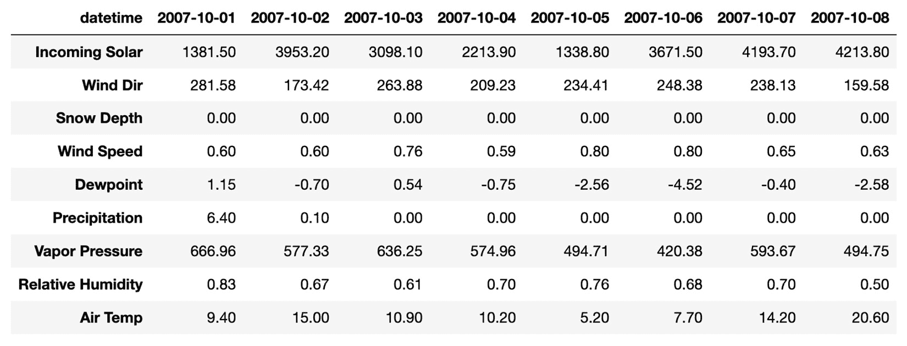
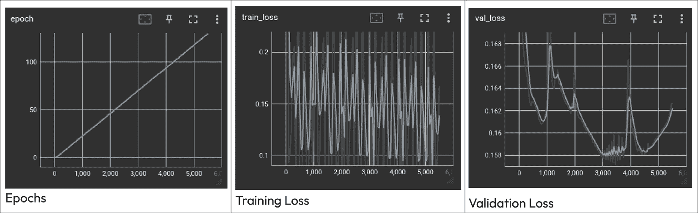

# 第四章：使用 PyTorch Lightning 进行预测

在本章中，我们将使用 PyTorch Lightning 构建预测模型。我们将探讨该框架的几个方面，例如创建数据模块来处理数据预处理，或创建 `LightningModel` 结构来封装神经网络的训练过程。我们还将探索 **TensorBoard** 来监控神经网络的训练过程。接下来，我们将描述几种用于评估深度神经网络预测效果的指标，如 **均方绝对缩放误差** (**MASE**) 和 **对称平均绝对百分比误差** (**SMAPE**)。在本章中，我们将重点讨论多变量时间序列，这些序列包含多个变量。

本章将引导你完成以下几个实例：

+   准备多变量时间序列进行监督学习

+   使用多变量时间序列训练线性回归预测模型

+   用于多变量时间序列预测的前馈神经网络

+   用于多变量时间序列预测的 LSTM 神经网络

+   评估深度神经网络的预测效果

+   使用 Tensorboard 监控训练过程

+   使用回调函数 – `EarlyStopping`

# 技术要求

在本章中，我们将使用以下 Python 库，所有这些库都可以通过 `pip` 安装：

+   PyTorch Lightning (2.1.4)

+   PyTorch Forecasting (1.0.0)

+   `torch` (2.2.0)

+   `ray` (2.9.2)

+   `numpy` (1.26.3)

+   `pandas` (2.1.4)

+   `scikit-learn` (1.4.0)

+   `sktime` (0.26.0)

本章的代码可以在本书的 GitHub 仓库找到：[`github.com/PacktPublishing/Deep-Learning-for-Time-Series-Data-Cookbook`](https://github.com/PacktPublishing/Deep-Learning-for-Time-Series-Data-Cookbook)。

# 准备多变量时间序列进行监督学习

本章的第一个实例解决了如何准备多变量时间序列进行监督学习的问题。我们将展示在上一章中使用的滑动窗口方法如何扩展来解决这个任务。接着，我们将演示如何使用 `TimeSeriesDataSet`（一个 PyTorch Forecasting 类，用于处理时间序列的预处理步骤）来准备时间序列数据。

## 准备工作

我们将使用在 *第一章* 中分析的相同时间序列。我们需要使用以下代码，通过 `pandas` 加载数据集：

```py
import pandas as pd
data = pd.read_csv('assets/daily_multivariate_timeseries.csv',
                   parse_dates=['Datetime'],
                   index_col='Datetime')
```

下图展示了时间序列的示例。请注意，为了便于可视化，坐标轴已被转置：



图 4.1：多变量时间序列示例。系列的变量显示在 x 轴上，以便于可视化

上述数据集包含九个与气象条件相关的变量。就像在 *第三章* 中一样，目标是预测下一个太阳辐射值。我们将使用额外可用变量的滞后值作为输入解释变量。在下一章中，你将学习如何为需要预测多个变量的情况准备多变量时间序列。

## 如何做到这一点……

我们将对多变量时间序列进行监督学习的转换。首先，我们将描述如何使用我们在 *第三章* 中使用的滑动窗口方法。然后，我们将展示如何使用基于 PyTorch 的 `TimeSeriesDataSet` 数据结构简化此过程。

### 使用滑动窗口

在上一章中，我们使用滑动窗口方法将单变量时间序列从一个序列转换为矩阵格式。为监督学习准备多变量时间序列需要类似的过程：我们对每个变量应用滑动窗口技术，然后将结果合并。这个过程可以按以下方式进行：

```py
TARGET = 'Incoming Solar'
N_LAGS = 7
HORIZON = 1
input_data = []
output_data = []
for i in range(N_LAGS, data.shape[0]-HORIZON+1):
    input_data.append(data.iloc[i - N_LAGS:i].values)
    output_data.append(data.iloc[i:(i+HORIZON)][TARGET])
input_data, output_data = np.array(input_data), np.array(output_data)
```

上述代码遵循以下步骤：

1.  首先，我们定义滞后数和预测视野。我们将滞后数设置为 `7`（`N_LAGS=7`），预测视野设置为 `1`（`HORIZON=1`），目标变量设置为 `Incoming Solar.`。

1.  然后，我们遍历多变量时间序列中的每个时间步骤。在每个点，我们检索前 `N_LAGS` 的数据，将其添加到 `input_data` 中，并将下一个太阳辐射值添加到输出数据中。这意味着我们将使用每个变量的过去 `7` 个值来预测下一个太阳辐射值。

1.  最后，我们将输入和输出数据从 `Python` 列表转换为 `NumPy` `array` 结构。

`output_data` 是一个一维向量，表示未来的太阳辐射值。`input_data` 有三个维度：第一个维度表示样本数量，第二个维度表示滞后数量，第三个维度表示序列中的变量数量。

### 使用 `TimeSeriesDataSet` 类

到目前为止，我们一直在使用滑动窗口方法来预处理时间序列，供监督学习使用。这个功能和训练神经网络所需的其他预处理任务都通过 `TimeSeriesDataSet` 类进行了自动化，该类可在 PyTorch Forecasting 库中找到。

`TimeSeriesDataSet` 提供了一种简单且有效的方法来准备数据并将其传递给模型。让我们来看一下如何使用这个结构来处理多变量时间序列。首先，我们需要将时间序列组织成一个包含三种主要信息的 pandas DataFrame 结构：

+   `group_id`：一个列，用于标识时间序列的名称。如果数据集包含单一时间序列，该列将显示一个常量值。有些数据集涉及多个时间序列，可以通过此变量区分。

+   `time_index`：存储某一时间点上给定序列捕获的值。

+   **其他变量**：存储时间序列值的额外变量。多变量时间序列包含多个变量。

我们的时间序列已经包含了多个变量。现在，我们需要添加关于`time_index`和`group_id`的信息，可以通过如下方式完成：

```py
mvtseries['group_id'] = 0
mvtseries['time_index'] = np.arange(mvtseries.shape[0])
```

`group_id`的值始终为`0`，因为我们正在处理单个时间序列。我们随便使用`0`。你可以使用任何适合的名称。我们使用`np.arange``()`函数来创建这个时间序列的`time_index`。这会创建一个变量，对第一个观察值给出`0`，对第二个观察值给出`1`，依此类推。

然后，我们必须创建`TimeSeriesDataSet`类的一个实例，如下所示：

```py
dataset = TimeSeriesDataSet(
    data=mvtseries,
    group_ids=["group_id"],
    target="Incoming Solar",
    time_idx="time_index",
    max_encoder_length=7,
    max_prediction_length=1,
    time_varying_unknown_reals=['Incoming Solar',
                                'Wind Dir',
                                'Snow Depth',
                                'Wind Speed',
                                'Dewpoint',
                                'Precipitation',
                                'Vapor Pressure',
                                'Relative Humidity',
                                'Air Temp'],
)
```

我们可以将`TimeSeriesDataSet`数据集转换为`DataLoader`类，如下所示：

```py
data_loader = dataset.to_dataloader(batch_size=1, shuffle=False)
```

`DataLoader`用于将观察值传递给模型。以下是一个观察值的示例：

```py
x, y = next(iter(data_loader))
x['encoder_cont']
y
```

我们使用`next``()`和`iter``()`方法从数据加载器中获取一个观察值。这个观察值被存储为`x`和`y`，分别表示输入和输出数据。主要的输入是`encoder_cont`项，表示每个变量的`7`个滞后值。这个数据是一个 PyTorch 张量，形状为(`1`, `7`, `9`)，表示（批量大小、滞后数、变量数）。批量大小是一个参数，表示神经网络每次训练迭代中使用的样本数。输出数据是一个浮动值，表示太阳辐射变量的下一个值。

## 它是如何工作的……

`TimeSeriesDataSet`构造函数需要一些参数：

+   `data`：一个包含之前描述的三个元素的时间序列数据集

+   `group_ids`：`data`中标识数据集每个时间序列的列

+   `target`：`data`中我们想要预测的列（目标变量）

+   `time_idx`：`data`中包含每个观察值的时间信息的列

+   `max_encoder_length`：用于构建自回归模型的滞后数

+   `max_prediction_length`：预测视野——即，应该预测多少未来时间步长

+   `time_varying_unknown_reals`：`data`中列出的描述哪些数值变量随时间变化的列

还有其他与`time_varying_unknown_reals`相关的参数。这个特定的输入详细描述了所有未来值对用户未知的数值观测值，例如我们想要预测的变量。然而，在某些情况下，我们知道一个观测值的未来值，例如产品价格。这类变量应该包含在`time_varying_known_reals`输入中。还有`time_varying_known_categoricals`和`time_varying_unknown_categoricals`输入，可用于代替数值型变量的分类变量。

关于预测任务，我们在这个示例中进行的转换是名为**自回归分布滞后模型**（**ARDL**）的一种建模方法的基础。ARDL 是自回归的扩展，也包括外生变量的滞后作为输入。

# 使用多元时间序列训练线性回归模型进行预测

在这个示例中，我们将使用 PyTorch 训练一个线性回归模型，作为我们第一个在多元时间序列上拟合的预测模型。我们将展示如何使用`TimeSeriesDataSet`处理训练模型的数据预处理步骤，并将数据传递给模型。

## 准备工作

我们将从之前示例中使用的`mvtseries`数据集开始：

```py
import pandas as pd
mvtseries = pd.read_csv('assets/daily_multivariate_timeseries.csv',
            parse_dates=['datetime'],
            index_col='datetime')
```

现在，让我们看看如何使用这个数据集来训练一个 PyTorch 模型。

## 如何做到这一点…

在接下来的代码中，我们将描述准备时间序列和构建线性回归模型所需的步骤：

1.  我们从预处理时间序列开始。这包括创建组标识符和时间索引列：

    ```py
    mvtseries["target"] = mvtseries["Incoming Solar"]
    mvtseries["time_index"] = np.arange(mvtseries.shape[0])
    mvtseries["group_id"] = 0
    ```

1.  然后，我们必须将数据划分为不同的部分。对于这个示例，我们只保留训练集的索引：

    ```py
    time_indices = data["time_index"].values
    train_indices, _ = train_test_split(
        time_indices,
        test_size=test_size,
        shuffle=False)
    train_indices, _ = train_test_split(train_indices,
                                        test_size=0.1,
                                        shuffle=False)
    train_df = data.loc[data["time_index"].isin(train_indices)]
     train_df_mod = train_df.copy()
    ```

1.  然后，我们必须使用`StandardScaler`操作符对时间序列进行标准化：

    ```py
    target_scaler = StandardScaler()
    target_scaler.fit(train_df_mod[["target"]])
    train_df_mod["target"] = target_scaler.transform
        (train_df_mod[["target"]])
    train_df_mod = train_df_mod.drop("Incoming Solar", axis=1)
     feature_names = [
        col for col in data.columns
        if col != "target" and col != "Incoming Solar"
    ]
    ```

1.  预处理后的时间序列被传递给一个`TimeSeriesDataSet`实例：

    ```py
    training_dataset = TimeSeriesDataSet(
        train_df_mod,
        time_idx="time_index",
        target="target",
        group_ids=["group_id"],
        max_encoder_length=n_lags,
        max_prediction_length=horizon,
        time_varying_unknown_reals=feature_names,
        scalers={name: StandardScaler()
                 for name in feature_names},
    )
    loader = training_dataset.to_dataloader(batch_size=batch_size,
                                            shuffle=False)
    ```

    `TimeSeriesDataSet`对象被转换成一个数据加载器，可以用于将样本批次传递给模型。这是通过`to_dataloader()`方法完成的。我们将所有这些数据准备步骤封装成一个名为`create_training_set`的函数。你可以在本书的 GitHub 仓库中查看该函数的源代码。

1.  接下来，我们调用`create_training_set()`函数来创建训练数据集：

    ```py
    N_LAGS = 7
    HORIZON = 1
    BATCH_SIZE = 10
    data_loader = create_training_set(
        data=mvtseries,
        n_lags=N_LAGS,
        horizon=HORIZON,
        batch_size=BATCH_SIZE,
        test_size=0.3
    )
    ```

1.  然后，我们必须使用 PyTorch 定义线性回归模型，如下所示：

    ```py
    import torch
    from torch import nn
    class LinearRegressionModel(nn.Module):
        def __init__(self, input_dim, output_dim):
            super(LinearRegressionModel, self).__init__()
            self.linear = nn.Linear(input_dim, output_dim)
        def forward(self, X):
            X = X.view(X.size(0), -1)
            return self.linear(X)
    ```

    在这里，我们定义了一个名为`LinearRegressionModel`的类，来实现多元线性回归模型。它包含一个线性变换层（`nn.Linear`）。这个类接受输入和输出的大小作为输入，分别对应`train_input`和`train_output`对象的第二维。我们通过传入这些参数来创建该模型。

1.  现在，我们将按照以下方式创建这个模型的一个实例：

    ```py
    num_vars = mvtseries.shape[1] + 1
    model = LinearRegressionModel(N_LAGS * num_vars, HORIZON)
    ```

    `num_vars`包含时间序列中的变量数量。然后，我们将模型的输入定义为`num_vars`乘以`N_LAGS`，输出则定义为预测时长。

1.  我们可以使用以下代码进行训练过程：

    ```py
    criterion = nn.MSELoss()
    optimizer = torch.optim.Adam(model.parameters(), lr=0.001)
    num_epochs = 10
    for epoch in range(num_epochs):
        for batch in data_loader:
            x, y = batch
            X = x["encoder_cont"].squeeze(-1)
            y_pred = model(X)
            y_pred = y_pred.squeeze(1)
            y_actual = y[0].squeeze(1)
            loss = criterion(y_pred, y_actual)
            loss.backward()
            optimizer.step()
            optimizer.zero_grad()
        print(f"epoch: {epoch + 1}, loss = {loss.item():.4f}")
    ```

    在这里，我们将学习率设置为`0.001`，优化器设置为 Adam。Adam 是一个常见的替代方法，比 SGD 等方法具有更好的收敛特性。

    在每个训练周期，我们从数据加载器中获取每个批次的滞后，并使用模型对其进行处理。注意，每个批次都会被重新调整为线性模型所需的二维格式。这是在`LinearRegressionModel`类的`forward()`方法中完成的。

## 它是如何工作的…

我们使用`TimeSeriesDataSet`类来处理数据准备过程。然后，我们通过`to_dataloader()`方法将数据集转换为`DataLoader`类。这个数据加载器为模型提供数据批次。虽然我们没有显式定义它，但每个批次都遵循自回归的建模方式。输入基于时间序列的过去几次观测，输出代表未来的观测值。

我们将线性回归模型实现为一个类，以便它遵循与上一章相同的结构。为了简化，我们可以通过`model = nn.Linear(input_size, output_size)`来创建模型。

# 用于多变量时间序列预测的前馈神经网络

在这个食谱中，我们将重新关注深度神经网络。我们将展示如何使用深度前馈神经网络为多变量时间序列构建预测模型。我们将描述如何将`DataModule`类与`TimeSeriesDataSet`结合，以封装数据预处理步骤。我们还将把`PyTorch`模型放在`LightningModule`结构中，这样可以标准化神经网络的训练过程。

## 准备就绪

我们将继续使用与太阳辐射预测相关的多变量时间序列：

```py
import pandas as pd
mvtseries = pd.read_csv('assets/daily_multivariate_timeseries.csv',
                        parse_dates=['datetime'],
                        index_col='datetime')
n_vars = mvtseries.shape[1]
```

在这个食谱中，我们将使用来自`pytorch_lightning`的数据模块来处理数据预处理。数据模块是包含所有数据预处理步骤并与模型共享数据的类。以下是数据模块的基本结构：

```py
import lightning.pytorch as pl
class ExampleDataModule(pl.LightningDataModule):
    def __init__(self,
                 data: pd.DataFrame,
                 batch_size: int):
        super().__init__()
        self.data = data
        self.batch_size = batch_size
    def setup(self, stage=None):
        pass
    def train_dataloader(self):
        pass
    def val_dataloader(self):
        pass
    def test_dataloader(self):
        pass
    def predict_dataloader(self):
        pass
```

所有数据模块都继承自`LightningDataModule`类。我们需要实现几个关键方法：

+   `setup()`：此方法包含所有主要的数据预处理步骤

+   `train_dataloader()`、`val_dataloader()`、`test_dataloader()`和`predict_dataloader()`：这些是获取相应数据集（训练、验证、测试和预测）数据加载器的一组方法

除了`DataModule`类外，我们还将利用`LightningModule`类来封装所有模型过程。这些模块具有以下结构：

```py
class ExampleModel(pl.LightningModule):
    def __init__(self):
        super().__init__()
        self.network = ...
    def forward(self, x):
        pass
    def training_step(self, batch, batch_idx):
        pass
    def validation_step(self, batch, batch_idx):
        pass
    def test_step(self, batch, batch_idx):
        pass
    def predict_step(self, batch, batch_idx, dataloader_idx=0):
        pass
    def configure_optimizers(self):
        pass
```

让我们更仔细地看看`ExampleModel`：

+   我们在类的属性中定义任何必要的神经网络元素（例如`self.network`）

+   `forward()`方法定义了网络元素如何相互作用并建模时间序列

+   `training_step`、`validation_step`和`testing_step`分别描述了网络的训练、验证和测试过程

+   `predict_step`详细描述了获取最新观测值并进行预测的过程，模拟了部署场景

+   最后，`configure_optimizers()`方法详细描述了网络的优化设置

让我们看看如何创建一个数据模块来预处理多变量时间序列，以及它如何与`TimeSeriesDataSet`结合。然后，我们将实现一个`LightningModule`结构来处理前馈神经网络的训练和测试过程。

## 如何进行…

以下代码展示了如何定义数据模块以处理预处理步骤。首先，让我们看一下类的构造函数：

```py
from pytorch_forecasting import TimeSeriesDataSet
from sklearn.model_selection import train_test_split
from sklearn.preprocessing import StandardScaler
class MultivariateSeriesDataModule(pl.LightningDataModule):
    def __init__(
            self,
            data: pd.DataFrame,
            n_lags: int,
            horizon: int,
            test_size: float,
            batch_size: int
    ):
        super().__init__()
        self.data = data
        self.feature_names = 
            [col for col in data.columns if col != "Incoming Solar"]
        self.batch_size = batch_size
        self.test_size = test_size
        self.n_lags = n_lags
        self.horizon = horizon
        self.target_scaler = StandardScaler()
        self.training = None
        self.validation = None
        self.test = None
        self.predict_set = None
```

在构造函数中，我们定义了所有必要的数据准备元素，如滞后数、预测时间跨度和数据集。这包括初始化`target_scaler`属性，该属性用于标准化时间序列的值。

然后，我们创建`setup()`方法，其中包括数据预处理逻辑：

```py
def setup(self, stage=None):
    self.preprocess_data()
    train_indices, val_indices, test_indices = self.split_data()
    train_df = self.data.loc
        [self.data["time_index"].isin(train_indices)]
    val_df = self.data.loc[self.data["time_index"].isin(val_indices)]
    test_df = self.data.loc
        [self.data["time_index"].isin(test_indices)]
     self.target_scaler.fit(train_df[["target"]])
    self.scale_target(train_df, train_df.index)
    self.scale_target(val_df, val_df.index)
    self.scale_target(test_df, test_df.index)
    train_df = train_df.drop("Incoming Solar", axis=1)
    val_df = val_df.drop("Incoming Solar", axis=1)
    test_df = test_df.drop("Incoming Solar", axis=1)
    self.training = TimeSeriesDataSet(
        train_df,
        time_idx="time_index",
        target="target",
        group_ids=["group_id"],
        max_encoder_length=self.n_lags,
        max_prediction_length=self.horizon,
        time_varying_unknown_reals=self.feature_names,
        scalers={name: StandardScaler() for name in 
            self.feature_names},
    )
    self.validation = TimeSeriesDataSet.from_dataset
        (self.training, val_df)
    self.test = TimeSeriesDataSet.from_dataset(self.training, test_df)
    self.predict_set = TimeSeriesDataSet.from_dataset(
    self.training, self.data, predict=True)
```

一些方法，如`self.preprocess_data()`，已被省略以简化内容。你可以在本书的 GitHub 仓库中找到它们的源代码。

最后，我们必须构建数据加载器，负责将数据传递给模型：

```py
    def train_dataloader(self):
        return self.training.to_dataloader
            (batch_size=self.batch_size, shuffle=False)
    def val_dataloader(self):
        return self.validation.to_dataloader
            (batch_size=self.batch_size, shuffle=False)
    def test_dataloader(self):
        return self.test.to_dataloader
            (batch_size=self.batch_size, shuffle=False)
    def predict_dataloader(self):
        return self.predict_set.to_dataloader
            (batch_size=1, shuffle=False)
```

让我们仔细看看这个数据模块：

+   数据预处理步骤在`setup()`方法中完成。这包括通过包括`time_index`和`group_id`变量来转换时间序列，以及训练、验证和测试拆分。数据集使用`TimeSeriesDataSet`类来构建。请注意，我们只需要为其中一个数据集定义一个`TimeSeriesDataSet`实例。我们可以使用`from_dataset()`方法为另一个数据集设置一个现有的`TimeSeriesDataSet`实例。

+   预处理步骤的信息可以通过`DataModule`类的构造函数传递，例如滞后数（`n_lags`）或预测的`horizon`。

+   数据加载器可以通过在相应的数据集上使用`to_dataloader()`方法获得。

然后，我们可以设计神经网络架构。我们将创建一个名为`FeedForwardNet`的类，来实现一个包含三层的前馈神经网络：

```py
import torch
from torch import nn
class FeedForwardNet(nn.Module):
    def __init__(self, input_size, output_size):
        super().__init__()
        self.net = nn.Sequential(
            nn.Linear(input_size, 16),
            nn.ReLU(),
            nn.Linear(16, 8),
            nn.ReLU(),
            nn.Linear(8, output_size),
        )
    def forward(self, X):
        X = X.view(X.size(0), -1)
        return self.net(X)
```

网络架构在`self.net`属性中定义。网络的各层通过`nn.Sequential`容器堆叠在一起：

+   第一层接收大小为`input_size`的输入数据。这是一个线性变换（`nn.Linear`），包含`16`个单元，并使用`ReLU()`激活函数（`nn.ReLU`）。

+   结果会传递到第二层，这一层也是线性变换类型和激活函数。该层包含`8`个单元。

+   最后一层也是对来自前一层的输入进行线性变换。其大小与`output_size`相同，在时间序列的情况下，指的是预测的时间跨度。

然后，我们将此神经网络插入到`LightningModule`模型类中。首先，让我们看一下类的构造函数和`forward()`方法：

```py
from pytorch_forecasting.models import BaseModel
class FeedForwardModel(BaseModel):
    def __init__(self, input_dim: int, output_dim: int):
        self.save_hyperparameters()
        super().__init__()
        self.network = FeedForwardNet(
            input_size=input_dim,
            output_size=output_dim,
        )
        self.train_loss_history = []
        self.val_loss_history = []
        self.train_loss_sum = 0.0
        self.val_loss_sum = 0.0
        self.train_batch_count = 0
        self.val_batch_count = 0
    def forward(self, x):
        network_input = x["encoder_cont"].squeeze(-1)
        prediction = self.network(network_input)
        output = self.to_network_output(prediction=prediction)
        return output
```

构造函数存储网络元素，而`forward()`方法详细说明了这些元素在网络前向传播中的交互方式。`forward()`方法还使用`to_network_output()`方法将输出转化为原始数据尺度。训练步骤和网络优化器定义如下：

```py
def training_step(self, batch, batch_idx):
    x, y = batch
    y_pred = self(x).prediction
    y_pred = y_pred.squeeze(1)
    y_actual = y[0].squeeze(1)
    loss = F.mse_loss(y_pred, y_actual)
    self.train_loss_sum += loss.item()
    self.train_batch_count += 1
    self.log("train_loss", loss)
    return loss
def configure_optimizers(self):
    return torch.optim.Adam(self.parameters(), lr=0.01)
```

`configure_optimizers()`方法是我们设置优化过程的地方。在训练步骤中，我们获取一批样本，将输入传递给神经网络，然后使用实际数据计算均方误差。然后，我们将误差信息存储在不同的属性中。

验证和测试步骤与训练阶段的工作方式类似：

```py
def validation_step(self, batch, batch_idx):
    x, y = batch
    y_pred = self(x).prediction
    y_pred = y_pred.squeeze(1)
    y_actual = y[0].squeeze(1)
    loss = F.mse_loss(y_pred, y_actual)
    self.val_loss_sum += loss.item()
    self.val_batch_count += 1
    self.log("val_loss", loss)
    return loss
def test_step(self, batch, batch_idx):
    x, y = batch
    y_pred = self(x).prediction
    y_pred = y_pred.squeeze(1)
    y_actual = y[0].squeeze(1)
    loss = F.mse_loss(y_pred, y_actual)
    self.log("test_loss", loss)
```

在预测步骤中，我们只需将输入数据传递给神经网络，然后获取其输出：

```py
def predict_step(self, batch, batch_idx):
    x, y = batch
    y_pred = self(x).prediction
    y_pred = y_pred.squeeze(1)
    return y_pred
```

让我们看一下前面的`FeedForwardModel`模块：

+   基于`PyTorch`的神经网络在`self.network`属性中定义

+   `forward()`方法描述了神经网络如何处理从数据加载器获取的实例

+   优化器设置为`Adam`，学习率为`0.01`

+   最后，我们使用`Trainer`类来训练模型：

```py
datamodule = MultivariateSeriesDataModule(data=mvtseries,
                                          n_lags=7,
                                          horizon=1,
                                          batch_size=32,
                                          test_size=0.3)
model = FeedForwardModel(input_dim=N_LAGS * n_vars, output_dim=1)
trainer = pl.Trainer(max_epochs=30)
trainer.fit(model, datamodule)
```

训练过程运行`30`个周期。为了测试模型，我们可以使用`Trainer`实例中的`test()`方法：

```py
trainer.test(model=model, datamodule=datamodule)
forecasts = trainer.predict(model=model, datamodule=datamodule)
```

未来的观察结果通过`predict()`方法进行预测。在这两种情况下，我们将模型和数据模块都传递给`Trainer`实例。

## 它是如何工作的……

数据模块封装了所有准备步骤。任何需要在数据集上执行的特定转换都可以包含在`setup()`方法中。与模型相关的逻辑由`LightningModule`实例处理。使用`DataModule`和`LightningModule`方法提供了一种模块化、更整洁的深度学习模型开发方式。

`TimeSeriesDataSet`类中的`scalers`参数用于传递应该用于预处理时间序列的解释变量的缩放器。在这种情况下，我们使用了以下内容：

```py
scalers={name: StandardScaler() for name in self.feature_names}
```

在这里，我们使用`StandardScaler`将所有解释变量转换为一个共同的数值范围。我们通过`self.target_scaler`属性标准化了时间序列的目标变量，其中包括一个`StandardScaler`操作符。我们在`TimeSeriesDataSet`之外对目标变量进行了归一化，以便对目标变量拥有更多的控制权。这可以作为一个示例，展示如何进行那些在软件包中可能不可用的转换。

## 还有更多内容……

我们使用`nn.Sequential`容器定义了前馈神经网络。另一种可能的方法是将每个元素定义为自己的类属性，并在`forward`方法中显式调用它们：

```py
class FeedForwardNetAlternative(nn.Module):
    def __init__(self, input_size, output_size):
        super().__init__()
        self.l1 = nn.Linear(input_size, 16)
        self.relu_l1 = nn.ReLU()
        self.l2 = nn.Linear(16, 8)
        self.relu_l2 = nn.ReLU()
        self.l3 = nn.Linear(8, output_size)
    def forward(self, x):
        X = X.view(X.size(0), -1)
        l1_output = self.l1(x)
        l1_actf_output = self.relu_l1(l1_output)
        l2_output = self.l2(l1_actf_output)
        l2_actf_output = self.relu_l2(l2_output)
        l3_output = self.l3(l2_actf_output)
        return l3_output
```

两种方法是等效的。虽然第一种方法更加整洁，但第二种方法更具灵活性。

# 用于多变量时间序列预测的 LSTM 神经网络

在这个示例中，我们将继续构建一个模型，利用多变量时间序列预测太阳辐射的下一个值。这一次，我们将训练一个 LSTM 递归神经网络来解决这个任务。

## 准备就绪

数据设置与我们在前面的食谱中所做的类似。所以，我们将使用之前定义的数据模块。现在，让我们学习如何使用`LightningModule`类构建 LSTM 神经网络。

## 如何操作……

使用 PyTorch Lightning 训练 LSTM 神经网络的工作流程是相似的，但有一个小而重要的细节。对于 LSTM 模型，我们将输入数据保持在一个三维结构中，形状为（样本数、滞后数、特征数）。以下是模块的代码，从构造函数和`forward()`方法开始：

```py
class MultivariateLSTM(pl.LightningModule):
    def __init__(self, input_dim, hidden_dim, num_layers, output_dim):
        super().__init__()
        self.hidden_dim = hidden_dim
        self.lstm = nn.LSTM(input_dim, hidden_dim, num_layers, 
            batch_first=True)
        self.fc = nn.Linear(hidden_dim, output_dim)
    def forward(self, x):
        h0 = torch.zeros(self.lstm.num_layers, x.size(0), 
            self.hidden_dim).to(self.device)
        c0 = torch.zeros(self.lstm.num_layers, x.size(0), 
            self.hidden_dim).to(self.device)
        out, _ = self.lstm(x, (h0, c0))
        out = self.fc(out[:, -1, :])
        return out
```

这一次，我们不需要将网络的输入压缩成二维向量，因为 LSTM 接受的是三维输入。LSTM 背后的逻辑在`forward()`方法中实现。其余的方法与我们在前面食谱中所做的完全相同。以下是`training_step`的示例：

```py
    def training_step(self, batch, batch_idx):
        x, y = batch
        y_pred = self(x['encoder_cont'])
        y_pred = y_pred.squeeze(1)
        loss = F.mse_loss(y_pred, y[0])
        self.log('train_loss', loss)
        return loss
```

你可以在本书的 GitHub 仓库中找到其余的方法。

定义完模型后，我们可以按如下方式使用它：

```py
n_vars = mvtseries.shape[1] - 1
model = MultivariateLSTM(input_dim=n_vars,
                         hidden_dim=10,
                         num_layers=1,
                         output_dim=1)
trainer = pl.Trainer(max_epochs=10)
trainer.fit(model, datamodule)
trainer.test(model, datamodule.test_dataloader())
forecasts = trainer.predict(model=model, datamodule=datamodule)
```

如前面的代码所示，PyTorch Lightning 使得测试和预测过程在各个模型中保持一致。

## 它是如何工作的……

LSTM 是一种递归神经网络架构，旨在对时间序列等顺序数据进行建模。这类网络相较于前馈神经网络，包含一些额外的元素，如额外的输入维度或隐藏单元状态。在本节中，我们在 LSTM 层上堆叠了两个全连接层。LSTM 层通常会传递给全连接层，因为前者的输出是一个内部状态。因此，全连接层会在我们所需的特定维度上处理该输出。

LSTM 的类构造函数接收四个输入参数——时间序列中的变量数目（`input_size`）、预测的时间范围（`output_size`）、`LSTM`层的数量（`num_layers`）以及每个`LSTM`层中的隐藏单元数（`hidden_size`）。

我们在`__init__`构造函数方法中定义了三层。除了`LSTM`外，我们创建了两个全连接层，其中一个代表输出层。

网络的前向传播如下工作：

1.  使用零初始化隐藏状态（`h0`）和单元状态（`c0`）。这是通过调用`init_hidden_state()`方法来完成的。

1.  将输入数据传递给 LSTM 堆栈。LSTM 返回它的输出以及每个 LSTM 层的隐藏状态和单元状态。

1.  接下来，我们获取最后一个 LSTM 层的隐藏状态，将其传递给`ReLU()`激活函数。

1.  `ReLU`的输出被传递到第一个全连接层，其输出再次通过`ReLU`函数进行转换。最后，输出被传递到一个线性全连接输出层，该层提供预测结果。

这一逻辑在`LightningModule`实例的`forward()`方法中进行了编写。

## 还有更多内容……

我们创建了一个具有单个 LSTM 层的深度神经网络（`num_layers=1`）。然而，我们可以根据需要增加该值。具有多个 LSTM 层的模型被称为**堆叠** **LSTM**模型。

# 使用 Tensorboard 监控训练过程

训练深度学习模型通常需要调整多个超参数、评估不同的架构等。为了便于这些任务，必须使用可视化和监控工具。`tensorboard`是一个强大的工具，可以在训练过程中追踪和可视化各种指标。本节将指导你如何将`tensorboard`与 PyTorch Lightning 集成，用于监控训练过程。

## 准备工作

在使用`tensorboard`与 PyTorch Lightning 之前，你需要先安装`tensorboard`。你可以使用以下命令进行安装：

```py
pip install -U tensorboard
```

安装完成后，确保你正在利用 PyTorch Lightning 内置的`tensorboard`日志记录功能。

## 如何实现……

以下是如何使用`tensorboard`来监控训练过程：

1.  首先，确保`tensorboard`已导入到你的脚本中。

1.  接下来，你需要创建一个`tensorboard`日志记录器，并将其传递给 PyTorch Lightning 的`Trainer`：

    ```py
    from lightning.pytorch.loggers import TensorBoardLogger
    import lightning.pytorch as pl
    logger = TensorBoardLogger('logs/')
    trainer = pl.Trainer(logger=logger)
    ```

1.  然后，你可以通过在终端运行以下命令来启动`tensorboard`：

    ```py
    tensorboard --logdir=logs/
    ```

1.  在你的网页浏览器中打开`tensorboard`，通过访问终端中显示的 URL；通常是`http://localhost:6006`。你将看到实时更新的各种指标，例如周期数、训练、验证和测试损失等。

以下图展示了上一章节中 LSTM 性能的一些图示。在此案例中，我们可以看到周期数以及训练和验证损失是如何变化的：



图 4.2：周期、训练损失和验证损失的比较

## 它是如何工作的……

`tensorboard`提供了各种训练指标、超参数调优、模型图形等的可视化。当与 PyTorch Lightning 集成时，以下内容会发生：

+   在训练过程中，日志记录器将指定的指标发送到`tensorboard`

+   `tensorboard`读取日志并提供交互式可视化

+   用户可以实时监控训练的各个方面

## 还有更多……

以下是一些需要注意的额外细节：

+   你可以记录其他信息，例如图像、文本、直方图等

+   通过探索不同的可视化内容，你可以深入了解模型的表现，并进行必要的调整

+   Tensorboard 与 PyTorch Lightning 的集成简化了监控过程，使得模型开发更加高效

使用`tensorboard`与 PyTorch Lightning 提供了一个强大的解决方案，用于监控和可视化训练过程，使得在模型开发中可以做出更明智的决策。

# 评估用于预测的深度神经网络

评估预测模型的表现对于理解它们如何对未见数据进行泛化至关重要。常用的评估指标包括**均方根误差**（**RMSE**）、**平均绝对百分比误差**（**MAPE**）、**平均绝对缩放误差**（**MASE**）和**对称平均绝对百分比误差**（**SMAPE**）等。我们将使用 Python 实现这些指标，并向您展示如何应用它们来评估模型的表现。

## 准备好了吗

我们需要来自训练模型的预测值和相应的真实值，以计算这些指标。因此，我们必须先在测试集上运行我们的模型，以获取预测结果。

为了简化实现，我们将使用`scikit-learn`和`sktime`库，因为它们提供了有用的类和方法来帮助我们完成这个任务。由于我们还没有安装`sktime`，请运行以下命令：

```py
pip install sktime
```

现在，是时候导入用于不同评估指标的类和方法了：

```py
from sklearn.metrics import mean_squared_error
from sktime.performance_metrics.forecasting 
import mean_absolute_scaled_error, MeanAbsolutePercentageError
import numpy as np
```

## 如何实现…

为了评估我们的模型表现，我们必须计算`scikit-learn`库中的相关指标。对于`sktime`库，它提供了现成可用的函数来计算这些指标。

以下是计算这些指标的代码：

```py
def mean_absolute_percentage_error(y_true, y_pred):
    y_true, y_pred = np.array(y_true), np.array(y_pred)
    return np.mean(np.abs((y_true - y_pred) / y_true)) * 100
y_pred = model(X_test).detach().numpy()
y_true = y_test.detach().numpy()
rmse_sklearn = np.sqrt(mean_squared_error(y_true, y_pred)) print(f"RMSE (scikit-learn): {rmse_sklearn}")
mape = mean_absolute_percentage_error(y_true, y_pred) 
print(f"MAPE: {mape}")
mase_sktime = mean_absolute_scaled_error(y_true, y_pred) 
print(f"MASE (sktime): {mase_sktime}")
smape_sktime = symmetric_mean_absolute_percentage_error
    (y_true, y_pred)
 print(f"SMAPE (sktime): {smape_sktime}")
```

## 它是如何工作的…

这些指标各自评估模型表现的不同方面：

+   **RMSE**：该指标计算预测值与实际值之间的平均平方差的平方根。它对较大误差给予更高的惩罚。

+   `1`表示与朴素预测相等的表现，而 MASE 值小于`1`则表示模型表现优于朴素预测。

+   **MAPE**：该指标计算实际值与预测值之间绝对百分比差异的平均值。它以百分比的形式表达平均绝对误差，这在您想了解相对预测误差时非常有用。

+   **SMAPE**：该指标计算平均绝对百分比误差，处理低估和高估的误差时给予同等的权重。它将误差表示为实际值的百分比，这对于比较模型和预测不同规模的数据非常有用。

## 还有更多内容…

记住，评估指标的选择取决于具体问题和业务需求。例如，如果低估模型的成本高于高估模型的成本，那么一个区分这两种误差类型的指标可能更合适。根据问题的不同，其他指标，如 MAE，也可以使用。使用多种指标评估模型始终是个好主意，这样可以更全面地了解模型的表现。

# 使用回调——EarlyStopping

在 PyTorch Lightning 中，回调是可重用的组件，允许你在训练、验证和测试的各个阶段注入自定义行为。它们提供了一种将功能与主训练逻辑分离的方式，提供了一个模块化和可扩展的方法来管理辅助任务，例如记录指标、保存检查点、早停等。

通过定义一个自定义类继承自 PyTorch Lightning 的基础`Callback`类，你可以重写与训练过程中的不同阶段相对应的特定方法，例如`on_epoch_start`或`on_batch_end`。当训练器初始化时，如果传入一个或多个这些回调对象，定义的行为将自动在训练过程中的相应阶段执行。这使得回调成为组织训练管道的强大工具，能够增加灵活性而不使主训练代码变得混乱。

## 准备工作

在定义并训练 LSTM 模型后，如上一节所述，我们可以通过引入早停技术进一步增强训练过程。该技术通过在指定的指标停止改进时暂停训练过程来避免过拟合。为此，PyTorch Lightning 提供了一个早停回调，我们将把它集成到现有的训练代码中。

## 如何操作…

要应用早停，我们需要通过添加`EarlyStopping`回调来修改现有的 PyTorch Lightning `Trainer`。下面是实现该功能的代码：

```py
import lightning.pytorch as pl
from lightning.pytorch.callbacks import EarlyStopping
early_stop_callback = EarlyStopping(
    monitor="val_loss",
    min_delta=0.00,
    patience=3,
    verbose=False,
    mode="min"
)
trainer = pl.Trainer(max_epochs=100,
                     callbacks=[early_stop_callback]) 
trainer.fit(model, datamodule)
```

在这段代码中，`monitor`设置为验证损失（`val_loss`），如果该值在`patience`连续的验证周期中没有至少减少`min_delta`，训练过程将停止。

## 它是如何工作的…

早停是一种正则化技术，可以防止神经网络的过拟合。它监控一个指定的指标（在这里是验证损失），并在该指标停止改进时暂停训练过程。

这是在我们 LSTM 模型中的工作方式：

+   `val_loss`）在验证阶段。

+   对于`patience`连续的训练周期，若`min_delta`未达到要求，训练过程将被暂停。

+   `mode`参数可以设置为`min`或`max`，表示被监控的指标应该最小化还是最大化。在我们的案例中，我们希望最小化验证损失。

通过提前停止训练过程，我们可以节省时间和资源，并且可能获得一个在未见数据上泛化更好的模型。

## 还有更多内容…

让我们看看一些进一步的细节：

+   早停回调（early stopping callback）是高度可配置的，允许你根据特定需求调整其行为——例如，你可以更改`patience`参数，使得停止标准更加严格或宽松。

+   早停可以与其他回调和技术结合使用，例如模型检查点（model checkpointing），以创建一个强大而高效的训练管道。

+   适当地使用早停可以使模型在未见数据上表现更好，因为它能防止模型过拟合训练数据。

这个`EarlyStopping`回调与 PyTorch Lightning 以及我们现有的 LSTM 模型完美集成，展示了 PyTorch Lightning 回调系统的可扩展性和易用性。
