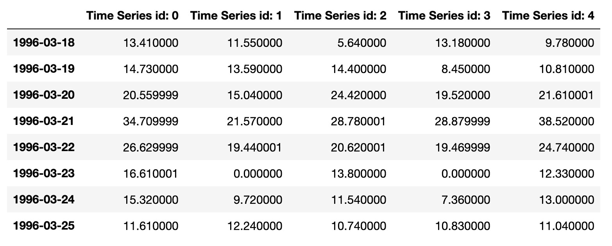
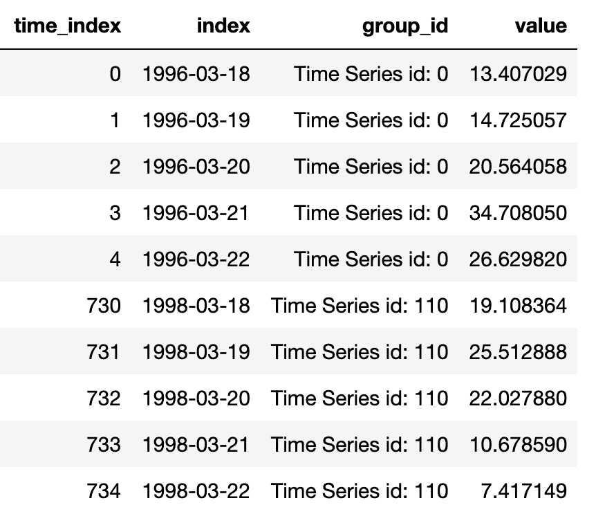

# 第五章：全球预测模型

在本章中，我们将探讨各种时间序列预测场景，并学习如何使用深度学习处理这些场景。这些场景包括多步和多输出预测任务，以及涉及多个时间序列的问题。我们将涵盖这些案例，解释如何准备数据、训练适当的神经网络模型，并对其进行验证。

本章结束时，你应该能够为不同的时间序列数据集构建深度学习预测模型。这包括超参数优化，这是模型开发中的重要阶段。

本章将引导你完成以下配方：

+   多变量时间序列的多步预测

+   多变量时间序列的多步和多输出预测

+   为全局模型准备多个时间序列

+   使用多个时间序列训练全局 LSTM

+   季节性时间序列的全球预测模型

+   使用 Ray Tune 进行超参数优化

# 技术要求

本章需要以下 Python 库：

+   `numpy`（1.26.3）

+   `pandas`（2.0.3）

+   `scikit-learn`（1.4.0）

+   `sktime`（0.26.0）

+   `torch`（2.2.0）

+   `pytorch-forecasting`（1.0.0）

+   `pytorch-lightning`（2.1.4）

+   `gluonts`（0.14.2）

+   `ray`（2.9.2）

你可以使用 `pip` 一次性安装这些库：

```py
pip install -U pandas numpy scikit-learn sktime torch pytorch-forecasting pytorch-lightning gluonts
```

本章中的配方将遵循基于 PyTorch Lightning 的设计理念，这种理念提供了一种模块化和灵活的方式来构建和部署 PyTorch 模型。有关本章代码，可以在以下 GitHub URL 中找到：[`github.com/PacktPublishing/Deep-Learning-for-Time-Series-Data-Cookbook`](https://github.com/PacktPublishing/Deep-Learning-for-Time-Series-Data-Cookbook)。

# 多变量时间序列的多步预测

到目前为止，我们一直在处理单一变量时间序列的下一个值预测。预测下一个观测值的值被称为一步预测。在本配方中，我们将扩展上一章中开发的模型，以进行多步预测。

## 准备工作

多步预测是提前预测多个观测值的过程。这个任务对于减少时间序列的长期不确定性非常重要。

事实证明，我们之前所做的大部分工作也适用于多步预测的设置。`TimeSeriesDataSet` 类使得将一步预测问题扩展到多步预测变得非常简单。

在本配方中，我们将预测范围设置为 `7`，并将滞后期数设置为 `14`：

```py
N_LAGS = 7
HORIZON = 14
```

实际上，这意味着预测任务是基于过去 14 天的数据来预测未来 7 天的太阳辐射。

## 如何实现…

对于多步预测问题，需要改变两件事：

+   其中一项是神经网络模型的输出维度。与表示下一个值的`1`不同，输出维度需要与预测步数相匹配。这可以通过模型中的 `output_dim` 变量来实现。

+   数据模块的预测长度需要设置为预测时段。这可以通过`TimeSeriesDataSet`类中的`max_prediction_length`参数来完成。

这两个输入可以按如下方式传递给数据和模型模块：

```py
datamodule = MultivariateSeriesDataModule(data=mvtseries,
    n_lags=N_LAGS,
    horizon=HORIZON,
    batch_size=32,
    test_size=0.3)
model = MultivariateLSTM(input_dim=n_vars,
    hidden_dim=32,
    num_layers=1,
    output_dim=HORIZON)
```

然后，模型的训练和测试保持不变：

```py
early_stop_callback = EarlyStopping(monitor="val_loss",
    min_delta=1e-4,
    patience=10,
    verbose=False,
    mode="min")
trainer = Trainer(max_epochs=20, callbacks=[early_stop_callback])
trainer.fit(model, datamodule)
trainer.test(model=model, datamodule=datamodule)
```

我们训练了模型 20 个周期，然后在测试集上评估了它，测试集通过数据模块中定义的数据加载器进行获取。

## 它是如何工作的…

传统的监督学习模型通常从一维目标变量中学习。在预测问题中，这个变量可以是，例如，下一个时间段时间序列的值。然而，多步预测问题需要在每个时间点预测多个值。深度学习模型天生就是多输出算法。因此，它们可以使用一个模型处理多个目标变量。

其他针对多步预测的方法通常涉及创建多个模型或将相同的模型用于不同的预测时段。然而，多输出方法更为可取，因为它能够捕捉不同预测时段之间的依赖关系。这可能带来更好的预测性能，正如以下文章所记录的那样：Taieb, Souhaib Ben 等，*基于 NN5 预测竞赛的多步时间序列预测策略回顾与比较*。《专家系统与应用》39.8（2012）：7067-7083

## 还有更多…

我们可以使用深度学习神经网络进行多步预测的其他方法有很多。以下是另外三种流行的方法：

+   `递归`: 训练一个神经网络进行一步预测，并通过递归方式使用它进行多步预测

+   `直接`: 为每个预测时段训练一个神经网络

+   `DirRec`: 为每个预测时段训练一个神经网络，并将前一个预测结果作为输入传递给下一个预测

# 使用多元时间序列进行多步和多输出预测

在这个案例中，我们将扩展 LSTM 模型，以预测多元时间序列的多个变量的多个时间步。

## 准备工作

到目前为止，在这一章节中，我们已经构建了多个模型来预测某一特定变量——太阳辐射的未来。我们利用时间序列中的额外变量来改善太阳辐射的建模。

然而，在处理多元时间序列时，我们通常关心的是预测多个变量，而不仅仅是一个。一个常见的例子是在处理时空数据时出现的。时空数据集是多元时间序列的一个特例，其中在不同位置观察到一个现实世界的过程。在这种数据集中，目标是预测所有这些位置的未来值。同样，我们可以利用神经网络是多输出算法的特点，在一个模型中处理多个目标变量。

在这个例子中，我们将继续使用太阳辐射数据集，和之前的例子一样。不过，我们的目标是预测三个变量的未来值——太阳辐射、蒸气压和气温：

```py
N_LAGS = 14
HORIZON = 7
TARGET = ['Incoming Solar', 'Air Temp', 'Vapor Pressure']
mvtseries = pd.read_csv('assets/daily_multivariate_timeseries.csv',
    parse_dates=['datetime'],
    index_col='datetime')
```

关于数据准备，过程与我们之前所做的类似。不同之处在于，我们将目标变量（`TARGET`）设置为前面列出的变量，而不是仅仅设置为太阳辐射。`TimeSeriesDataSet`类和数据模块会处理所有的预处理和数据共享工作。

## 如何实现…

我们首先调整数据模块，以处理多个目标变量。下面的代码展示了我们所做的必要更改。让我们从定义模块的构造函数开始：

```py
class MultivariateSeriesDataModule(pl.LightningDataModule):
    def __init__(
            self,
            data: pd.DataFrame,
            target_variables: List[str],
            n_lags: int,
            horizon: int,
            test_size: float = 0.2,
            batch_size: int = 16,
    ):
        super().__init__()
        self.data = data
        self.batch_size = batch_size
        self.test_size = test_size
        self.n_lags = n_lags
        self.horizon = horizon
        self.target_variables = target_variables
        self.target_scaler = {k: MinMaxScaler() 
            for k in target_variables}
        self.feature_names = [col for col in data.columns
            if col not in self.target_variables]
        self.training = None
        self.validation = None
        self.test = None
        self.predict_set = None
        self.setup()
```

构造函数包含了一个新的参数`target_variables`，我们用它来传递目标变量的列表。除此之外，我们还对`self.target_scaler`属性做了小改动，现在它是一个字典对象，包含了每个目标变量的缩放器。接着，我们构建了如下的`setup()`方法：

```py
def setup(self, stage=None):
    self.preprocess_data()
    train_indices, val_indices, test_indices = self.split_data()
    train_df = self.data.loc
        [self.data["time_index"].isin(train_indices)]
    val_df = self.data.loc[self.data["time_index"].isin(val_indices)]
    test_df = self.data.loc
        [self.data["time_index"].isin(test_indices)]
    for c in self.target_variables:
        self.target_scaler[c].fit(train_df[[c]])
    self.scale_target(train_df, train_df.index)
    self.scale_target(val_df, val_df.index)
    self.scale_target(test_df, test_df.index)
    self.training = TimeSeriesDataSet(
        train_df,
        time_idx="time_index",
        target=self.target_variables,
        group_ids=["group_id"],
        max_encoder_length=self.n_lags,
        max_prediction_length=self.horizon,
        time_varying_unknown_reals=self.feature_names + 
            self.target_variables,
        scalers={name: MinMaxScaler() for name in self.feature_names},
    )
    self.validation = TimeSeriesDataSet.from_dataset
        (self.training, val_df)
    self.test = TimeSeriesDataSet.from_dataset(self.training, test_df)
    self.predict_set = TimeSeriesDataSet.from_dataset(
        self.training, self.data, predict=True
    )
```

与之前的例子相比，主要的不同点如下。我们将目标变量的列表传递给`TimeSeriesDataSet`类的目标输入。目标变量的缩放过程也变更为一个`for`循环，遍历每个目标变量。

我们还更新了模型模块，以处理多个目标变量。让我们从构造函数和`forward()`方法开始：

```py
class MultiOutputLSTM(LightningModule):
    def __init__(self, input_dim, hidden_dim, num_layers, 
        horizon, n_output):
        super().__init__()
        self.n_output = n_output
        self.horizon = horizon
        self.hidden_dim = hidden_dim
        self.input_dim = input_dim
        self.output_dim = int(self.n_output * self.horizon)
        self.lstm = nn.LSTM(input_dim, hidden_dim,
            num_layers, batch_first=True)
        self.fc = nn.Linear(hidden_dim, self.output_dim)
    def forward(self, x):
        h0 = torch.zeros(self.lstm.num_layers, x.size(0),
            self.hidden_dim).to(self.device)
        c0 = torch.zeros(self.lstm.num_layers, x.size(0),
            self.hidden_dim).to(self.device)
        out, _ = self.lstm(x, (h0, c0))
        out = self.fc(out[:, -1, :])
        return out
```

`forward()`方法与上一章相同。我们在构造函数中存储了一些额外的元素，比如预测时间跨度（`self.horizon`），因为它们在后续步骤中是必要的：

```py
    def training_step(self, batch, batch_idx):
        x, y = batch
        y_pred = self(x['encoder_cont'])
        y_pred = y_pred.unsqueeze(-1).view(-1, self.horizon, 
            self.n_output)
        y_pred = [y_pred[:, :, i] for i in range(self.n_output)]
        loss = [F.mse_loss(y_pred[i], 
            y[0][i]) for i in range(self.n_output)]
        loss = torch.mean(torch.stack(loss))
        self.log('train_loss', loss)
        return loss
    def test_step(self, batch, batch_idx):
        x, y = batch
        y_pred = self(x['encoder_cont'])
        y_pred = y_pred.unsqueeze(-1).view(-1, self.horizon, 
            self.n_output)
        y_pred = [y_pred[:, :, i] for i in range(self.n_output)]
        loss = [F.mse_loss(y_pred[i],
            y[0][i]) for i in range(self.n_output)]
        loss = torch.mean(torch.stack(loss))
        self.log('test_loss', loss)
    def predict_step(self, batch, batch_idx, dataloader_idx=0):
        x, y = batch
        y_pred = self(x['encoder_cont'])
        y_pred = y_pred.unsqueeze(-1).view(-1,
            self.horizon, self.n_output)
        y_pred = [y_pred[:, :, i] for i in range(self.n_output)]
        return y_pred
    def configure_optimizers(self):
        return torch.optim.Adam(self.parameters(), lr=0.001)
```

让我们来分析一下前面的代码：

+   我们向构造函数添加了一个`n_output`参数，详细说明了目标变量的数量（在本例中是`3`）

+   输出维度设置为目标变量数乘以预测时间跨度（`self.n_output * self.horizon`）

+   在训练和测试步骤中处理数据时，预测结果会被重新调整为合适的格式（批大小、时间跨度和变量数）

+   我们为每个目标变量计算 MSE 损失，然后使用`torch.mean(torch.stack(loss))`对它们取平均。

然后，剩余的过程与我们在之前基于 PyTorch Lightning 的例子中所做的类似：

```py
model = MultiOutputLSTM(input_dim=n_vars,
    hidden_dim=32,
    num_layers=1,
    horizon=HORIZON,
    n_vars=len(TARGET))
datamodule = MultivariateSeriesDataModule(data=mvtseries,
    n_lags=N_LAGS,
    horizon=HORIZON,
    target_variables=TARGET)
early_stop_callback = EarlyStopping(monitor="val_loss",
    min_delta=1e-4,
    patience=10,
    verbose=False,
    mode="min")
trainer = pl.Trainer(max_epochs=20, callbacks=[early_stop_callback])
trainer.fit(model, datamodule)
trainer.test(model=model, datamodule=datamodule)
forecasts = trainer.predict(model=model, datamodule=datamodule)
```

## 工作原理…

本例中使用的建模方法遵循了**向量自回归**（**VAR**）的思想。VAR 通过将多元时间序列中各变量的未来值建模为这些变量过去值的函数来工作。预测多个变量在多个场景下可能很有意义，例如时空预测。

在本节中，我们将 VAR 原理应用于深度学习环境，特别是通过使用 LSTM 网络。与传统的 VAR 模型根据过去的观察线性预测未来值不同，我们的深度学习模型能够捕捉多时间步和多个变量之间的非线性关系和时间依赖性。

为了计算我们模型的`loss`函数——这对于训练和评估模型性能至关重要——我们需要对`training_step()`和`test_step()`方法做一些修改。在网络生成预测后，我们按变量对输出进行分段。这种分段允许我们分别计算每个变量的 MSE 损失。然后，这些单独的损失会被聚合，形成一个复合损失度量，指导模型的优化过程。

# 为全球模型准备多个时间序列

现在，是时候开始处理涉及多个时间序列的时间序列问题了。在本节中，我们将学习全球预测模型的基本原理及其工作方式。我们还将探索如何为预测准备包含多个时间序列的数据集。同样，我们利用`TimeSeriesDataSet`和`DataModule`类的功能来帮助我们完成这项任务。

## 准备开始

到目前为止，我们一直在处理涉及单一数据集的时间序列问题。现在，我们将学习全球预测模型，包括以下内容：

+   **从本地模型到全球模型的过渡**：最初，我们在时间序列预测中只处理单一数据集，其中模型根据一个系列的历史数据预测未来值。这些所谓的本地模型是针对特定时间序列量身定制的，而全球模型则涉及处理多个相关的时间序列，并捕捉它们之间的相关信息。

+   **利用神经网络**：神经网络在数据丰富的环境中表现出色，使其成为全球预测的理想选择。这在零售等领域尤为有效，在这些领域中，了解不同产品销售之间的关系可以带来更准确的预测。

我们将学习如何使用一个关于运输的数据集构建全球预测模型，名为**NN5**。这个数据集曾在一个先前的预测竞赛中使用，包括 111 个不同的时间序列。

数据可以通过`gluonts` Python 库获得，并可以通过以下方式加载：

```py
N_LAGS = 7
HORIZON = 7
from gluonts.dataset.repository.datasets import get_dataset
dataset = get_dataset('nn5_daily_without_missing', regenerate=False)
```

这里是数据集中五个时间序列的样本：



图 5.1：NN5 时间序列数据集样本

此数据集的原始来源可以在以下链接找到：[`zenodo.org/records/3889750`](https://zenodo.org/records/3889750)。

现在，让我们构建一个`DataModule`类来处理数据预处理步骤。

## 如何实现……

我们将构建一个`LightningDataModule`类，处理包含多个时间序列的数据集，并将其传递给模型。以下是构造函数的样子：

```py
import lightning.pytorch as pl
class GlobalDataModule(pl.LightningDataModule):
    def __init__(self,
                 data,
                 n_lags: int,
                 horizon: int,
                 test_size: float,
                 batch_size: int):
        super().__init__()
        self.data = data
        self.batch_size = batch_size
        self.test_size = test_size
        self.n_lags = n_lags
        self.horizon = horizon
        self.training = None
        self.validation = None
        self.test = None
        self.predict_set = None
        self.target_scaler = LocalScaler()
```

本质上，我们存储了训练和使用模型所需的元素。这包括基于`LocalScaler`类的`self.target_scaler`属性。

`LocalScaler`类的主要方法是`transform()`：

```py
def transform(self, df: pd.DataFrame):
    df = df.copy()
    df["value"] = LogTransformation.transform(df["value"])
    df_g = df.groupby("group_id")
    scaled_df_l = []
    for g, df_ in df_g:
        df_[["value"]] = self.scalers[g].transform(df_[["value"]])
        scaled_df_l.append(df_)
    scaled_df = pd.concat(scaled_df_l)
    scaled_df = scaled_df.sort_index()
    return scaled_df
```

此方法对数据集应用了两种预处理操作：

+   对时间序列进行对数转换以稳定方差

+   对数据集中每个时间序列进行标准化

你可以扩展此类，以包括你需要对数据集执行的任何转换。`LocalScaler`类的完整实现可以在 GitHub 仓库中找到。

接着，我们在`setup()`函数中对数据进行了预处理：

```py
def setup(self, stage=None):
    data_list = list(self.data.train)
    data_list = [pd.Series(ts['target'],
        index=pd.date_range(start=ts['start'].to_timestamp(),
        freq=ts['start'].freq,
        periods=len(ts['target'])))
        for ts in data_list]
    tseries_df = pd.concat(data_list, axis=1)
    tseries_df['time_index'] = np.arange(tseries_df.shape[0])
    ts_df = tseries_df.melt('time_index')
    ts_df = ts_df.rename(columns={'variable': 'group_id'})
    unique_times = ts_df['time_index'].sort_values().unique()
    tr_ind, ts_ind = \
        train_test_split(unique_times,
            test_size=self.test_size,
            shuffle=False)
    tr_ind, vl_ind = \
        train_test_split(tr_ind,
            test_size=0.1,
            shuffle=False)
    training_df = ts_df.loc[ts_df['time_index'].isin(tr_ind), :]
    validation_df = ts_df.loc[ts_df['time_index'].isin(vl_ind), :]
    test_df = ts_df.loc[ts_df['time_index'].isin(ts_ind), :]
    self.target_scaler.fit(training_df)
    training_df = self.target_scaler.transform(training_df)
    validation_df = self.target_scaler.transform(validation_df)
    test_df = self.target_scaler.transform(test_df)
    self.training = TimeSeriesDataSet(
        data=training_df,
        time_idx='time_index',
        target='value',
        group_ids=['group_id'],
        max_encoder_length=self.n_lags,
        max_prediction_length=self.horizon,
        time_varying_unknown_reals=['value'],
    )
    self.validation = TimeSeriesDataSet.from_dataset
        (self.training, validation_df)
    self.test = TimeSeriesDataSet.from_dataset(self.training, test_df)
    self.predict_set = TimeSeriesDataSet.from_dataset
        (self.training, ts_df, predict=True)
```

在前面的代码中，我们将数据分成了训练集、验证集、测试集和预测集，并设置了相应的`TimeSeriesDataSet`实例。最后，数据加载器与我们在之前的实例中做的类似：

```py
    def train_dataloader(self):
        return self.training.to_dataloader(batch_size=self.batch_size,
            shuffle=False)
    def val_dataloader(self):
        return self.validation.to_dataloader
            (batch_size=self.batch_size, shuffle=False)
    def test_dataloader(self):
        return self.test.to_dataloader(batch_size=self.batch_size,
            shuffle=False)
    def predict_dataloader(self):
        return self.predict_set.to_dataloader(batch_size=1,
            shuffle=False)
```

我们可以像下面这样调用数据模块：

```py
datamodule = GlobalDataModule(data=dataset,
    n_lags=N_LAGS,
    horizon=HORIZON,
    test_size=0.2,
    batch_size=1)
```

使用此模块，数据集中的每个独立时间序列都将以使用最后`N_LAGS`个值来预测下一个`HORIZON`个观察值的方式进行处理。

## 它是如何工作的……

全局方法在多个时间序列上进行训练。其思路是不同时间序列之间存在共同模式。因此，神经网络可以利用这些序列的观察值来训练更好的模型。

在前一节中，我们通过`get_dataset()`函数从`gluonts` Python 库中检索了一个包含多个时间序列的数据集。准备一个包含多个时间序列的监督学习数据集的过程与我们之前做的类似。`TimeSeriesDataSet`实例的关键输入是`group_id`变量，它详细说明了每个观察值所属的实体。

主要的工作发生在`setup()`方法中。首先，我们将数据集转换为具有长格式的`pandas` DataFrame。以下是该数据的示例：



图 5.2：NN5 时间序列数据集的长格式示例

在这种情况下，`group_id`列不是常量，它详细说明了观察值所对应的时间序列。由于每个时间序列是单变量的，因此有一个名为`value`的数值变量。

# 使用多个时间序列训练全局 LSTM

在前一个实例中，我们学习了如何为全局预测模型准备多个时间序列的监督学习数据集。在本实例中，我们将继续这一主题，描述如何训练一个全局 LSTM 神经网络进行预测。

## 准备工作

我们将继续使用在前一个实例中使用的数据模块：

```py
N_LAGS = 7
HORIZON = 7
from gluonts.dataset.repository.datasets import get_dataset, dataset_names
dataset = get_dataset('nn5_daily_without_missing', regenerate=False)
datamodule = GlobalDataModule(data=dataset,
    n_lags=N_LAGS,
    horizon=HORIZON,
    batch_size=32,
    test_size=0.3)
```

让我们看看如何创建一个 LSTM 模块来处理包含多个时间序列的数据模块。

## 如何做到……

我们创建了一个包含 LSTM 实现的`LightningModule`类。首先，让我们看一下类的构造函数和`forward()`方法：

```py
class GlobalLSTM(pl.LightningModule):
    def __init__(self, input_dim, hidden_dim, num_layers, output_dim):
        super().__init__()
        self.hidden_dim = hidden_dim
        self.lstm = nn.LSTM(input_dim, hidden_dim, num_layers, 
            batch_first=True)
        self.fc = nn.Linear(hidden_dim, output_dim)
    def forward(self, x):
        h0 = torch.zeros(self.lstm.num_layers, x.size(0), 
            self.hidden_dim).to(self.device)
        c0 = torch.zeros(self.lstm.num_layers, x.size(0), 
            self.hidden_dim).to(self.device)
        out, _ = self.lstm(x, (h0, c0))
        out = self.fc(out[:, -1, :])
        return out
```

神经网络的逻辑与我们之前处理单一时间序列数据集时所做的相似。对于剩下的方法也是如此：

```py
    def training_step(self, batch, batch_idx):
        x, y = batch
        y_pred = self(x['encoder_cont'])
        loss = F.mse_loss(y_pred, y[0])
        self.log('train_loss', loss)
        return loss
    def validation_step(self, batch, batch_idx):
        x, y = batch
        y_pred = self(x['encoder_cont'])
        loss = F.mse_loss(y_pred, y[0])
        self.log('val_loss', loss)
        return loss
    def test_step(self, batch, batch_idx):
        x, y = batch
        y_pred = self(x['encoder_cont'])
        loss = F.mse_loss(y_pred, y[0])
        self.log('test_loss', loss)
    def predict_step(self, batch, batch_idx, dataloader_idx=0):
        x, y = batch
        y_pred = self(x['encoder_cont'])
        return y_pred
    def configure_optimizers(self):
        return torch.optim.Adam(self.parameters(), lr=0.01)
```

接下来，我们可以调用模型并进行训练，如下所示：

```py
model = GlobalLSTM(input_dim=1,
    hidden_dim=32,
    num_layers=1,
    output_dim=HORIZON)
early_stop_callback = EarlyStopping(monitor="val_loss",
    min_delta=1e-4,
    patience=10,
    verbose=False,
    mode="min")
trainer = pl.Trainer(max_epochs=20, callbacks=[early_stop_callback])
trainer.fit(model, datamodule)
trainer.test(model=model, datamodule=datamodule)
forecasts = trainer.predict(model=model, datamodule=datamodule)
```

使用 PyTorch Lightning 设计，训练、测试和预测步骤与我们在其他基于该框架的食谱中所做的类似。

## 它是如何工作的…

如您所见，包含 LSTM 的`LightningModule`类与我们为单一多变量时间序列构建的完全相同。这个类仅处理模型定义的部分，因此无需更改。主要工作是在数据预处理阶段完成的。因此，我们只需要修改数据模块中的`setup()`方法，以反映之前食谱中所解释的必要更改。

我们从一个本地 LSTM 模型过渡到了一个全球 LSTM 模型，后者能够同时处理多个时间序列。主要的区别在于数据的准备和呈现方式，而不是神经网络架构本身的变化。无论是本地模型还是全球模型，都使用相同的 LSTM 结构，其特点是能够处理数据序列并预测未来值。

在本地 LSTM 设置中，模型的输入通常遵循结构[`batch_size`，`sequence_length`，`num_features`]，输出的形状与预测的时间跨度匹配，通常为[`batch_size`，`horizon`]。此设置非常直观，因为它处理的是来自单一序列的数据。

转向全球 LSTM 模型后，输入和输出配置在维度上保持基本一致。然而，现在输入聚合了多个时间序列的信息。它增强了神经网络学习新模式和依赖关系的能力，不仅限于单一序列，还跨越多个序列。因此，全球 LSTM 模型的输出旨在同时为多个时间序列生成预测，反映整个数据集的预测结果。

# 全球预测模型用于季节性时间序列

本食谱展示了如何扩展数据模块，将额外的解释变量包含在`TimeSeriesDataSet`类和`DataModule`类中。我们将使用一个关于季节性时间序列的特定案例。

## 准备工作

我们加载了在上一个食谱中使用的那个数据集：

```py
N_LAGS = 7
HORIZON = 7
from gluonts.dataset.repository.datasets import get_dataset
dataset = get_dataset('nn5_daily_without_missing', regenerate=False)
```

该数据集包含了日粒度的时间序列。在这里，我们将使用`Fourier`级数建模周季节性。与我们在上一章中所做的不同（在*处理季节性：季节虚拟变量和 Fourier 级数*一节中），我们将学习如何使用`TimeSeriesDataSet`框架来包含这些特征。

## 如何操作…

这是更新后的`DataModule`，包含了`Fourier`级数。为了简洁起见，我们只描述了`setup()`方法的一部分，其余方法保持不变，您可以在 GitHub 仓库中查看：

```py
from sktime.transformations.series.fourier import FourierFeatures
def setup(self, stage=None):
    […]
    fourier = FourierFeatures(sp_list=[7],
        fourier_terms_list=[2],
        keep_original_columns=False)
    fourier_features = fourier.fit_transform(ts_df['index'])
    ts_df = pd.concat
        ([ts_df, fourier_features], axis=1).drop('index', axis=1)
    […]
    self.training = TimeSeriesDataSet(
        data=training_df,
        time_idx='time_index',
        target='value',
        group_ids=['group_id'],
        max_encoder_length=self.n_lags,
        max_prediction_length=self.horizon,
        time_varying_unknown_reals=['value'],
        time_varying_known_reals=['sin_7_1', 'cos_7_1',
            'sin_7_2', 'cos_7_2']
    )
```

在`setup()`方法中，我们使用数据集的日期和时间信息计算`Fourier`项。这样会生成四个确定性变量：`sin_7_1`、`cos_7_1`、`sin_7_2`和`cos_7_2`。这些是我们用来建模季节性的`Fourier`级数。将它们通过`pd.concat([tseries_long, fourier_features], axis=1)`加入数据集后，我们使用`time_varying_known_reals`参数来告知这些特征随时间变化，但变化是可预测的。

在 LSTM 中，我们需要将输入维度更新为`5`，以反映数据集中变量的数量（目标变量加上四个`Fourier`级数）。这一步骤如下所示：

```py
model = GlobalLSTM(input_dim=5,
    hidden_dim=32,
    num_layers=1,
    output_dim=HORIZON)
datamodule = GlobalDataModuleSeas(data=dataset,
    n_lags=N_LAGS,
    horizon=HORIZON,
    batch_size=128,
    test_size=0.3)
early_stop_callback = EarlyStopping(monitor="val_loss",
    min_delta=1e-4,
    patience=10,
    verbose=False,
    mode="min")
trainer = pl.Trainer(max_epochs=20, callbacks=[early_stop_callback])
trainer.fit(model, datamodule)
trainer.test(model=model, datamodule=datamodule)
forecasts = trainer.predict(model=model, datamodule=datamodule)
```

再次强调，训练和推理阶段与之前的步骤类似，因为这里唯一的不同是在数据模块处理的数据预处理阶段。

## 它是如何工作的……

使用`Fourier`级数建模季节性涉及通过傅里叶变换从数据集中提取额外变量来丰富数据集。这种方法在`DataModule`实例的`setup()`方法中实现，将这些变量并入到`TimeSeriesDataSet`对象中。

`Fourier`级数分解使我们能够通过将复杂的周期性模式分解成更简单的正弦波来捕捉季节性。`Fourier`级数的每个组件对应于不同的频率，捕捉时间序列数据中的不同季节性周期。这对神经网络特别有益，原因有几点：

+   `Fourier`级数作为自动特征工程，创建了直接编码周期性行为的有信息特征。这可以显著提升模型识别和预测季节性模式的能力，哪怕在复杂或嘈杂的数据中也能发挥作用。由于`Fourier`特征是加入到输入数据中的，它们可以与任何神经网络算法或架构兼容。

+   `Fourier`级数可以同时建模这些多重季节性水平，提供一种更为细致的数据表示，这种表示是传统季节性分解方法难以实现的。

+   **改进泛化能力**：通过提供季节性的明确数学表示，`Fourier`特征帮助神经网络更好地从观测数据推断到未见的未来时期。这减少了过拟合噪声和数据异常的风险，使模型的学习更加专注于潜在的周期性趋势。

## 还有更多……

你可以访问以下网址，学习如何将额外的类别变量（如节假日）包含到数据集中：[`pytorch-forecasting.readthedocs.io/en/stable/tutorials/stallion.html#Load-data`](https://pytorch-forecasting.readthedocs.io/en/stable/tutorials/stallion.html#Load-data)。

# 使用 Ray Tune 进行超参数优化

神经网络有一些超参数，这些超参数定义了其结构和学习过程。超参数包括学习率、隐藏层的数量和单元数等。不同的超参数值会影响学习过程和模型的准确性。不恰当的值可能导致欠拟合或过拟合，从而降低模型的性能。因此，优化超参数值以最大限度地发挥深度学习模型的作用非常重要。在本教程中，我们将探讨如何使用 Ray Tune 进行超参数优化，包括学习率、正则化参数、隐藏层的数量等。这些参数的优化对于我们模型的表现至关重要。往往，由于超参数选择不当，我们在拟合神经网络模型时会得到较差的结果，这可能导致欠拟合或过拟合未见数据。

## 准备工作

在我们开始进行超参数优化之前，如果尚未安装 Ray Tune，我们需要先进行安装。可以使用以下命令：

```py
pip install -U 'ray[data,train,tune,serve]'
```

我们将使用相同的数据和 LSTM 模型进行优化：

```py
class GlobalDataModule(pl.LightningDataModule):
    ...
class GlobalLSTM(pl.LightningModule):
    ...
from ray.train.lightning import RayTrainReportCallback
from ray import tune
from ray.tune.schedulers import ASHAScheduler
from ray.train import RunConfig, ScalingConfig, CheckpointConfig
from ray.train.torch import TorchTrainer
```

在上述代码中，我们还导入了所有本教程所需的库。

## 如何实现…

让我们讨论一下如何使用 Ray Tune 实现超参数优化：

1.  **定义搜索空间**：首先，定义你想要探索的超参数空间。

1.  **配置 Ray Tune**：初始化 Tune 实验，设置所需的设置，例如试验次数、资源等。

1.  **运行优化**：通过传递训练函数和定义的搜索空间来执行实验。

1.  **分析结果**：利用 Ray Tune 的工具分析结果，并确定最佳超参数。

让我们首先定义搜索空间：

```py
search_space = {
    "hidden_dim": tune.choice([8, 16, 32]),
    "num_layers": tune.choice([1, 2]),
}
```

在这个示例中，我们只优化两个参数：LSTM 神经网络中隐藏单元的数量和层数。

然后，我们在一个函数中定义训练循环：

```py
def train_tune(config_hyper):
    hidden_dim = config_hyper["hidden_dim"]
    num_layers = config_hyper["num_layers"]
    model = GlobalLSTM(input_dim=1,
        hidden_dim=hidden_dim,
        output_dim=HORIZON,
        num_layers=num_layers)
    data_module = GlobalDataModule(dataset,
        n_lags=N_LAGS,
        horizon=HORIZON,
        batch_size=128,
        test_size=0.3)
    trainer = Trainer(callbacks=[RayTrainReportCallback()])
    trainer.fit(model, data_module)
```

定义完训练函数后，我们将其传递给 `TorchTrainer` 类实例，并与运行配置一起使用：

```py
scaling_config = ScalingConfig(
    num_workers=2, use_gpu=False, 
        resources_per_worker={"CPU": 1, "GPU": 0}
)
run_config = RunConfig(
    checkpoint_config=CheckpointConfig(
        num_to_keep=1,
        checkpoint_score_attribute="val_loss",
        checkpoint_score_order="min",
    ),
)
ray_trainer = TorchTrainer(
    train_tune,
    scaling_config=scaling_config,
    run_config=run_config,
)
```

在 `ScalingConfig` 实例中，我们配置了计算环境，指定了该过程是否应在 GPU 或 CPU 上运行、分配的工作节点数量以及每个工作节点的资源。同时，`RunConfig` 实例用于定义优化过程，包括在此过程中应监控的指标。

然后，我们创建一个 `Tuner` 实例，将这些信息结合在一起：

```py
scheduler = ASHAScheduler(max_t=30, grace_period=1, reduction_factor=2)
tuner = tune.Tuner(
    ray_trainer,
    param_space={"train_loop_config": search_space},
    tune_config=tune.TuneConfig(
        metric="val_loss",
        mode="min",
        num_samples=10,
        scheduler=scheduler,
    ),
)
```

`Tuner` 实例需要一个调度器作为其输入之一。为此，我们使用 `ASHAScheduler`，它采用**异步成功折半算法**（**ASHA**）高效地在不同配置之间分配资源。这种方法通过根据性能反复缩小搜索空间来帮助识别最有效的配置。最终，通过运行这个过程，我们可以确定最佳配置：

```py
results = tuner.fit()
best_model_conf = \
    results.get_best_result(metric='val_loss', mode='min')
```

在前面的代码中，我们获得了最小化验证损失的配置。

在根据验证损失选择最佳超参数后，我们可以在测试集上评估模型。从检查点中获取模型权重，并加载调优过程中的最佳超参数。然后，使用这些参数加载模型并在测试数据上进行评估：

```py
path = best_model_conf.get_best_checkpoint(metric='val_loss',
    mode='min').path
config = best_model_conf.config['train_loop_config']
best_model = \
    GlobalLSTM.load_from_checkpoint(checkpoint_path=f'{path}/
        checkpoint.ckpt',
        **config)
data_module = GlobalDataModule(dataset, n_lags=7, horizon=3)
trainer = Trainer(max_epochs=30)
trainer.test(best_model, datamodule=data_module)
```

在前面的代码中，我们加载了具有最佳配置的模型，并在`DataModule`类中定义的测试集上进行测试。

## 它是如何工作的……

我们的超参数优化过程包括定义搜索空间、配置和执行优化，以及分析结果。本节共享的代码片段提供了一个逐步指南，说明如何将 Ray Tune 集成到任何机器学习工作流中，从而帮助我们探索并找到最适合模型的超参数：

+   `search_space`字典定义了超参数搜索空间。

+   `train_tune()`函数封装了训练过程，包括模型配置、数据准备和拟合。

+   `ScalingConfig`类定义了优化过程的计算环境，例如是否在 GPU 或 CPU 上运行。

+   `RunConfig`类设置了优化的执行方式，例如在此过程中应跟踪的指标。

+   `ASHAScheduler`类是一个调度器，定义了如何从不同的可能配置中进行选择。

Ray Tune 通过使用诸如随机搜索、网格搜索或更先进的算法（如 ASHA）等多种算法，高效地探索超参数空间。它并行化试验以有效利用可用资源，从而加速搜索过程。

## 还有更多……

Ray Tune 提供了几个额外的功能和优势。它可以与其他库集成，使其与流行的机器学习框架（如 PyTorch、TensorFlow 和 Scikit-Learn）兼容。此外，它还提供了先进的搜索算法，如贝叶斯优化和基于群体的训练，使用户能够灵活地尝试不同的优化策略。最后，Ray Tune 支持可视化工具，允许用户利用 TensorBoard 或 Ray 提供的自定义工具有效地可视化和分析超参数搜索过程。
