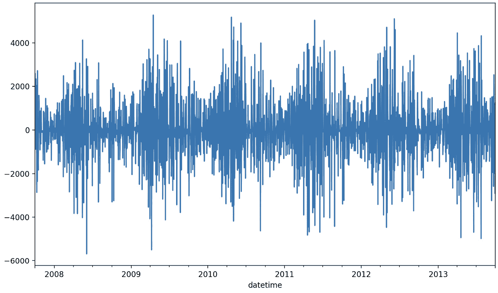

# 第七章：概率时间序列预测

在前几章中，我们从点预测的角度探讨了时间序列问题。点预测模型预测的是一个单一值。然而，预测本质上是充满不确定性的，因此量化预测的不确定性是有意义的。这就是概率预测的目标，它可以作为一种有价值的方法，帮助做出更明智的决策。

在本章中，我们将重点介绍三种类型的概率预测设置。我们将深入探讨超限概率预测，它帮助我们估计时间序列超过预定阈值的可能性。我们还将讨论预测区间，它提供一个可能值的范围，未来的观测值可能会落在该范围内。最后，我们将探讨预测概率预测，它提供了对单个结果的概率评估，从而为未来的可能性提供更细致的视角。

本章涵盖以下食谱：

+   超限概率预测简介

+   使用 LSTM 进行超限概率预测

+   使用符合预测法创建预测区间

+   使用 LSTM 进行概率预测

+   使用 DeepAR 进行概率预测

+   高斯过程简介

+   使用 Prophet 进行概率预测

# 技术要求

本章将重点介绍 PyTorch 生态系统。以下是本章将使用的库的完整列表：

+   NumPy (1.26.2)

+   pandas (2.1.3)

+   scikit-learn (1.3.2)

+   PyTorch Forecasting (1.0.0)

+   PyTorch Lightning (2.1.2)

+   torch (2.1.1)

+   statsforecast (1.6.0)

+   GluonTS (0.14.2)

+   gpytorch (1.11)

+   prophet (1.1.5)

你可以使用 `pip`，Python 的包管理器，来安装这些库。例如，要安装 `scikit-learn`，你可以运行以下命令：

```py
pip install -U scikit-learn
```

本章的代码可以在本书的 GitHub 仓库中找到：[`github.com/PacktPublishing/Deep-Learning-for-Time-Series-Data-Cookbook`](https://github.com/PacktPublishing/Deep-Learning-for-Time-Series-Data-Cookbook)。

# 超限概率预测简介

本食谱介绍了超限概率预测问题。超限事件发生在时间序列在预定的未来时期超过预定义的阈值。这类问题在时间序列分布的尾部可能对领域产生重大影响时尤为相关。例如，考虑到经济中的通货膨胀率。中央银行利用这种预测评估通货膨胀率可能超过某个临界阈值的可能性，如果超过该阈值，它们可能考虑提高利率。

从数据科学的角度来看，超限事件是二分类问题。因此，通常使用二元概率分类模型来处理这些问题。一个挑战是，代表超限事件的类别是稀有的，这使得学习任务更加困难。

## 准备工作

我们将使用一个多变量时间序列作为示例，描述什么是超越概率任务，以及它们为什么重要。具体来说，我们将使用前几章中使用的太阳辐射数据集（例如，参见*为监督学习准备多变量时间序列*食谱，来自*第四章*）。

让我们首先使用`pandas`加载数据集：

```py
import pandas as pd
mvtseries = pd.read_csv
    ('assets/data/daily_multivariate_timeseries.csv',
    parse_dates=['datetime'],
    index_col='datetime')
```

现在，让我们看看如何使用这个时间序列定义一个超越问题。

## 如何做...

超越概率预测是预测一个时间序列在未来某一时期超过某个临界阈值的概率的过程。我们将使用来自 PyTorch Lightning 的数据模块，它可以处理定义任务所需的所有步骤。

这个模块的主要组件是`setup()`方法。大部分步骤已经在*多变量时间序列预测中的前馈神经网络*食谱中解释过了。为了创建超越任务，我们必须首先定义新的二元目标变量，具体如下：

```py
mvtseries['target'] = 
    \(mvtseries['Incoming Solar'].diff() < -2000).astype(int)
```

在上述代码中，我们使用`diff()`方法计算连续观测中太阳辐射值的变化。然后，我们检查总日太阳辐射（单位：瓦特/平方米）是否在一天到第二天之间下降了`2000`。这个值是随意设定的。直觉上，这应该是我们感兴趣的重大事件。对于这个案例研究，太阳辐射的这种显著下降意味着电力系统将无法从光伏设备中产生大量太阳能。因此，及时预测这些事件可以使电力系统更加高效地从替代能源源中产生能源。

这是差分序列和所选阈值的图表：



图 7.1：连续观测中总日太阳辐射的差异

之后，我们将此变量作为目标变量传递给数据模块中的`TimeSeriesDataSet`实例。让我们首先加载所需的库并构建数据模块的构造函数：

```py
import numpy as np
from sklearn.model_selection import train_test_split
from sklearn.preprocessing import MinMaxScaler
from pytorch_forecasting import TimeSeriesDataSet
from pytorch_lightning import LightningDataModule
class ExceedanceDataModule(LightningDataModule):
    def __init__(self,
                 data: pd.DataFrame,
                 test_size: float = 0.2,
                 batch_size: int = 1):
        super().__init__()
        self.data = data
        self.var_names = self.data.columns.tolist()
        self.batch_size = batch_size
        self.test_size = test_size
        self.training = None
        self.validation = None
        self.test = None
        self.predict_set = None
```

在构造函数中，我们存储了数据预处理阶段中使用的所有元素。该类的`setup()`方法在以下代码中实现：

```py
    def setup(self, stage=None):
        self.data['target'] = (
            self.data['Incoming Solar'].diff() < -2000).astype(int)
        self.data['time_index'] = np.arange(self.data.shape[0])
        self.data['group_id'] = 0
        unique_times = self.data['time_index'].sort_values().unique()
        tr_ind, ts_ind = \
            train_test_split(unique_times,
                test_size=self.test_size,
                shuffle=False)
        tr_ind, vl_ind = train_test_split(tr_ind,
                test_size=0.1, shuffle=False)
        training_df = self.data.loc[
            self.data['time_index'].isin(tr_ind), :]
        validation_df = self.data.loc[
            self.data['time_index'].isin(vl_ind), :]
        test_df = self.data.loc[
            self.data['time_index'].isin(ts_ind), :]
        self.training = TimeSeriesDataSet(
            data=training_df,
            time_idx="time_index",
            target="target",
            group_ids=['group_id'],
            max_encoder_length=14,
            max_prediction_length=7,
            time_varying_unknown_reals=self.var_names,
            scalers={k: MinMaxScaler()
                     for k in self.var_names
                     if k != 'target'}
        )
        self.validation = TimeSeriesDataSet.from_dataset(
            self.training, validation_df)
        self.test = TimeSeriesDataSet.from_dataset(
            self.training, test_df)
        self.predict_set = TimeSeriesDataSet.from_dataset(
            self.training, self.data, predict=True)
```

这个函数的工作方式类似于标准的自回归管道。关键的不同之处在于，我们将目标变量设置为一个二元变量，表示是否发生了超越事件。我们还设置了训练、验证和测试集，用于构建和评估模型。我们将滞后数设置为`14`（`max_encoder_length`），预测时长设置为`7`（`max_prediction_length`）。

`LightningDataModule`实例的其余方法与我们在上一章中构建的类似（例如，参见*多变量时间序列预测中的前馈神经网络*食谱）：

```py
    def train_dataloader(self):
        return self.training.to_dataloader(
            batch_size=self.batch_size, shuffle=False)
    def val_dataloader(self):
        return self.validation.to_dataloader(
            batch_size=self.batch_size, shuffle=False)
    def test_dataloader(self):
        return self.test.to_dataloader(
            batch_size=self.batch_size, shuffle=False)
    def predict_dataloader(self):
        return self.predict_set.to_dataloader(
            batch_size=1, shuffle=False)
```

以下是如何使用该数据模块获取单个观测值：

```py
datamodule = ExceedanceDataModule(data=mvtseries)
datamodule.setup()
x, y = next(iter(datamodule.train_dataloader()))
```

在前面的代码中，我们创建了一个`ExceedanceDataModule`的实例，随后使用`iter()`和`next()`方法从中获取观测值。

## 工作原理…

超越问题也可以通过自回归方法来解决。因此，我们可以基于时间序列最近观测值的值来预测超越事件的概率。

超越概率预测问题是一种特定类型的二分类任务，可以使用时间序列来定义，其中事件是由超越定义的。然而，也可以定义其他类型的事件，这些事件不一定基于超越事件，可以据此构建概率模型。所需的逻辑都设置在`setup()`方法中，该方法封装了所有的预处理步骤。

## 还有更多内容…

在本示例中，我们使用单一的多变量时间序列来描述超越任务。然而，我们强调，我们的方法可以通过数据模块框架轻松地为涉及多个时间序列的数据集定义。

与超越概率预测任务相关的一个问题是**时间序列分类**，其中给定的时间序列有一个关联标签。我们将在下一章中学习这个问题。

# 使用 LSTM 进行超越概率预测

本示例描述了如何创建一个概率深度学习模型，通过多变量时间序列解决超越任务。

## 准备工作

我们将继续使用太阳辐射数据集作为示例。以下是我们在之前的示例中定义的数据模块：

```py
N_LAGS = 14
HORIZON = 7
mvtseries = pd.read_csv('assets/daily_multivariate_timeseries.csv',
        parse_dates=['datetime'],
        index_col='datetime')
datamodule = ExceedanceDataModule(data=mvtseries,
        batch_size=64, test_size=0.3)
```

现在，让我们看看如何使用 LSTM 神经网络和 PyTorch 的`LightningModule`创建一个分类器。

## 如何操作…

我们将使用 PyTorch Lightning 的`LightningModule`来设置一个二分类任务。以下是构造函数和`forward()`方法：

```py
import torch.nn as nn
import lightning.pytorch as pl
class ExceedanceLSTM(pl.LightningModule):
    def __init__(self, input_dim, hidden_dim, num_layers):
        super().__init__()
        self.hidden_dim = hidden_dim
        self.lstm = nn.LSTM(input_dim, self.hidden_dim,
                    num_layers, batch_first=True)
        self.fc = nn.Linear(self.hidden_dim, 1)
    def forward(self, x):
        h0 = torch.zeros(self.lstm.num_layers, x.size(0),
            self.hidden_dim).to(self.device)
        c0 = torch.zeros(self.lstm.num_layers, x.size(0),
            self.hidden_dim).to(self.device)
        out, _ = self.lstm(x, (h0, c0))
        out = self.fc(out[:, -1, :])
        out = torch.sigmoid(out)
        return out
```

LSTM 架构与我们在*第四章*中学习的类似——我们基于 PyTorch 创建一个 LSTM 层，并设置关于层数、单元数和输入维度（时间序列变量的数量）的配置。在前向传播过程中，LSTM 层的输出会传递给一个线性层。在之前涉及预测未来观测值数值的示例中，这将是网络的最后一层。然而，对于分类任务，我们添加了一个 sigmoid 层（`torch.sigmoid`），它将模型的输出转换为介于`0`和`1`之间的值。

模块的训练和验证步骤的代码如下：

```py
    def training_step(self, batch, batch_idx):
        x, y = batch
        y_bin = (y[0] > 0).any(axis=1).long().type(torch.FloatTensor)
        y_pred = self(x['encoder_cont'])
        loss = F.binary_cross_entropy(y_pred.squeeze(-1), y_bin)
        self.log('train_loss', loss)
        return loss
    def validation_step(self, batch, batch_idx):
        x, y = batch
        y_bin = (y[0] > 0).any(axis=1).long().type(torch.FloatTensor)
        y_pred = self(x['encoder_cont'])
        loss = F.binary_cross_entropy(y_pred.squeeze(-1), y_bin)
        self.log('val_loss', loss)
        return loss
    def configure_optimizers(self):
        return torch.optim.Adam(self.parameters(), lr=0.001)
```

在前面的代码中，训练和验证方法遵循相似的步骤：

1.  首先，我们检查预测时间范围内的任何观测值是否为正（在`y[0] > 0).any(axis=1).long()`代码片段中）。实际上，我们正在构建一个神经网络，用于建模未来`7`个观测值中是否存在超越事件。

1.  我们将此测试的输出转换为`torch.FloatTensor`数据结构，这是`loss()`函数工作的必需结构。

1.  然后，我们使用二元交叉熵（`F.binary_cross_entropy`）比较预测值和实际值，这是用于训练模型的方式。

除了这些方法，我们还将优化器设置为 Adam，并使用 0.001 的学习率。最后，我们设置了测试方法：

```py
    def test_step(self, batch, batch_idx):
        x, y = batch
        y_bin = (y[0] > 0).any(axis=1).long().type(torch.FloatTensor)
        y_pred = self(x['encoder_cont'])
        loss = F.binary_cross_entropy(y_pred.squeeze(-1), y_bin)
        auroc = AUROC(task='binary')
        auc_score = auroc(y_pred, y_bin)
        self.log('test_bce', loss)
        self.log('test_auc', auc_score)
```

在上述代码中，我们增加了`ROC`曲线下面积作为评估指标，这是常用于测试二分类模型的一个指标。

最后，我们必须训练和测试模型：

```py
model = ExceedanceLSTM(input_dim=10, hidden_dim=32, num_layers=1)
early_stop_callback = EarlyStopping(monitor="val_loss",
                                    min_delta=1e-4,
                                    patience=10,
                                    verbose=False,
                                    mode="min")
trainer = pl.Trainer(
    max_epochs=100,
    accelerator="cpu",
    callbacks=[early_stop_callback]
)
trainer.fit(model, datamodule)
trainer.test(model, datamodule)
```

如你所见，工作流遵循 PyTorch Lightning 风格，其中`Trainer`实例使用神经网络模型和数据模块进行训练和测试。

## 工作原理…

我们在前几章中构建的深度学习模型可以扩展用于分类预测任务。在这种情况下，我们增加了一个 sigmoid 层，该层将前一层的输出映射到`0–1`的值范围内。这个值可以解释为观察值属于正类的概率，在我们这里即为超越事件。

分类模型不再通过均方误差等指标进行优化。对于二分类问题，我们使用二元交叉熵。在测试阶段，我们增加了`ROC`曲线下面积作为辅助评估指标，这有助于理解模型如何区分两个类别。下图展示了 ROC 曲线的结果：


图 7.2：超越概率模型在 ROC 曲线中的结果

ROC 曲线提供了一种可视化方法，用于展示不同决策阈值下概率分类器的性能。位于对角线上的结果表示与随机猜测相同的性能。当曲线朝左上角移动时，表示模型的表现越好。

除了这些管道调整，PyTorch Lightning 提供的设计模式使得整体代码类似于我们在前几章中构建点预测模型时所用的代码。

## 还有更多…

我们注意到，尽管这里重点讨论的是 LSTM，但其他架构也可以使用，例如前馈神经网络或卷积神经网络。

# 使用符合预测创建预测区间

在这个教程中，我们将探索如何创建预测区间。预测区间描述了一个范围，在这个范围内，未来的观察值很可能会落入某个置信水平。所需的置信度越高，区间就越大。

在实践中，模型不仅预测一个单一的点，而是为未来的观察值预测一个分布。构建这些区间的方法有很多种，包括假设误差服从特定分布的参数方法，以及使用经验数据估计区间的非参数方法。

我们将采用符合预测方法，这种方法在数据科学从业者中越来越流行。

## 准备工作

我们将为 ARIMA 模型构建预测区间，这是一个流行的预测方法。然而，符合预测方法与底层模型无关，可以应用于其他预测方法。

让我们从加载一个时间序列开始。在这个例子中，我们将处理一个单变量时间序列：

```py
import pandas as pd
dataset = pd.read_csv(
    "assets/daily_multivariate_timeseries.csv",
    parse_dates=["datetime"],
)
```

让我们看看如何使用这个数据集创建预测区间。

## 如何操作……

数据被分为训练集和测试集，用于拟合 ARIMA 模型。我们将重点使用`statsforecast` Python 库，因此我们需要将时间序列转换为包含三列的`pandas` DataFrame：

+   `ds`：对应观测值的时间步长

+   `unique_id`：时间序列的标识符，由于我们处理的是单一时间序列，因此它是常数。

+   `y`：观测值

这个过程如下所示：

```py
series = dataset[['Incoming Solar']].reset_index()
series['id'] = 'Solar'
series = series.rename(columns={'index': 'ds', 'Incoming Solar': 'y', 
    'id': 'unique_id'})
```

接下来，我们必须将数据分为训练集和测试集：

```py
from sklearn.model_selection import train_test_split
HORIZON = 7
train, test = train_test_split(series, test_size=HORIZON)
```

测试集由最后`7`个观测值组成。

现在，我们必须使用`statsforecast`中的`ConformalIntervals`类设置符合方法。我们还需要创建一个 ARIMA 模型，并将符合实例传递给它：

```py
from statsforecast.utils import ConformalIntervals
intervals = ConformalIntervals(h=HORIZON)
models = [
    ARIMA(order=(2, 0, 2),
          season_length=365,
          prediction_intervals=intervals),
]
```

在前面的代码中，我们将季节长度设置为`365`，因为我们的数据是按日记录的，我们预期太阳辐射会呈现出重复的年度变化。

最后，我们必须使用`StatsForecast`类的实例来获取模型的预测值：

```py
sf = StatsForecast(
    df=train,
    models=models,
    freq='D',
)
forecasts = sf.forecast(h=HORIZON, level=[95])
```

在这里，我们将预测区间的水平设置为`95`。这意味着我们期望实际值以 95%的置信度位于相应的区间内。

这是我们获得的预测区间的图示：


图 7.3：ARIMA 模型预测及其相应的区间

## 它是如何工作的……

符合预测方法通过使用历史数据的一个子集来拟合 ARIMA 模型。然后，使用另一个子集来校准符合预测，通常是通过计算不符合性分数来衡量实际观测值与模型预测之间的偏差。校准步骤允许确定一个阈值，该阈值对应于所需的置信水平（例如，95%）。这个阈值将用于未来的预测，以便在预测值周围构建区间，提供一个范围，在该范围内，实际值预计将以指定的置信水平落入其中。

符合预测有助于量化点预测背后的不确定性，通过在这些预测周围构建区间。在这个例子中，我们训练了一个 ARIMA 模型，并使用符合预测构建了它的预测区间。我们将置信水平设置为`95`，但我们也可以同时探索多个值。例如，你可以通过将`level`参数改为`level=[80, 95]`来实现。

总体而言，这个食谱遵循一个简单的训练加测试周期，使用 `statsforecast` Python 库框架。

# 使用 LSTM 进行概率预测

本食谱将引导你构建一个用于概率预测的 LSTM 神经网络，使用 PyTorch Lightning。

## 准备工作

在这个食谱中，我们将介绍使用 LSTM 网络进行概率预测。这种方法结合了 LSTM 模型在捕捉序列数据中长期依赖关系方面的优势和概率预测的细致视角。这种方法超越了传统的点估计，通过预测一系列可能的未来结果，每个结果都附带一个概率。这意味着我们在预测中加入了不确定性。

这个食谱使用了与我们在*第四章*的 *多变量时间序列预测的前馈神经网络* 食谱中相同的数据集。我们还将使用在该食谱中创建的相同数据模块，名为 `MultivariateSeriesDataModule`。

让我们探索如何使用这个数据模块来构建一个用于概率预测的 LSTM 模型。

## 如何操作…

在本小节中，我们将定义一个概率 LSTM 模型，该模型输出时间序列每个预测点的预测均值和标准差。此技术涉及设计 LSTM 模型以预测定义未来结果概率分布的参数，而不是输出单一值。该模型通常配置为输出特定分布的参数，如高斯分布的均值和方差。这些分别描述了未来值的期望值和分布：

1.  让我们首先定义一个回调函数：

    ```py
    class LossTrackingCallback(Callback):
        def __init__(self):
            self.train_losses = []
            self.val_losses = []
        def on_train_epoch_end(self, trainer, pl_module):
            if trainer.logged_metrics.get("train_loss_epoch"):
                self.train_losses.append(
                    trainer.logged_metrics["train_loss_epoch"].item())
        def on_validation_epoch_end(self, trainer, pl_module):
            if trainer.logged_metrics.get("val_loss_epoch"):
                self.val_losses.append(
                    trainer.logged_metrics["val_loss_epoch"].item())
    ```

    `LossTrackingCallback` 类用于监控整个训练过程中的训练和验证损失。这对于诊断模型的学习过程、识别过拟合以及决定何时停止训练至关重要。

1.  接下来，我们必须基于 PyTorch Lightning 的 `LightningModule` 类构建 LSTM 模型：

    ```py
    class ProbabilisticLSTM(LightningModule):
        def __init__(self, input_size,
                     hidden_size, seq_len,
                     num_layers=2):
            super().__init__()
            self.save_hyperparameters()
            self.lstm = nn.LSTM(input_size, hidden_size,
                num_layers, batch_first=True)
            self.fc_mu = nn.Linear(hidden_size, 1)
            self.fc_sigma = nn.Linear(hidden_size, 1)
            self.hidden_size = hidden_size
            self.softplus = nn.Softplus()
        def forward(self, x):
            lstm_out, _ = self.lstm(x)
            lstm_out = lstm_out[:, -1, :]
            mu = self.fc_mu(lstm_out)
            sigma = self.softplus(self.fc_sigma(lstm_out))
            return mu, sigma
    ```

    `ProbabilisticLSTM` 类定义了我们用于概率预测的 LSTM 架构。该类包括计算预测均值（`fc_mu`）和预测分布标准差（`fc_sigma`）的层。标准差通过 `Softplus` `()` 激活函数传递，以确保其始终为正，反映了标准差的特性。

1.  以下代码实现了训练和验证步骤，以及网络配置参数：

    ```py
        def training_step(self, batch, batch_idx):
            x, y = batch[0]["encoder_cont"], batch[1][0]
            mu, sigma = self.forward(x)
            dist = torch.distributions.Normal(mu, sigma)
            loss = -dist.log_prob(y).mean()
            self.log(
                "train_loss", loss, on_step=True,
                on_epoch=True, prog_bar=True, logger=True
            )
            return {"loss": loss, "log": {"train_loss": loss}}
        def validation_step(self, batch, batch_idx):
            x, y = batch[0]["encoder_cont"], batch[1][0]
            mu, sigma = self.forward(x)
            dist = torch.distributions.Normal(mu, sigma)
            loss = -dist.log_prob(y).mean()
            self.log(
                "val_loss", loss, on_step=True,
                on_epoch=True, prog_bar=True, logger=True
            )
            return {"val_loss": loss}
        def configure_optimizers(self):
            optimizer = optim.Adam(self.parameters(), lr=0.0001)
            scheduler = optim.lr_scheduler.ReduceLROnPlateau(
                optimizer, "min")
            return {
                "optimizer": optimizer,
                "lr_scheduler": scheduler,
                "monitor": "val_loss",
            }
    ```

1.  在定义模型架构后，我们初始化数据模块并设置训练回调函数。正如我们之前看到的，`EarlyStopping`回调函数是一个有效的工具，通过在模型在验证集上停止改进时终止训练过程，防止过拟合。`ModelCheckpoint`回调函数确保我们根据模型在验证集上的表现捕获并保存最佳模型。结合这些回调函数，它们优化了训练过程，有助于开发出一个强大且调优良好的模型：

    ```py
    datamodule = ContinuousDataModule(data=mvtseries)
    datamodule.setup()
    model = ProbabilisticLSTM(
        input_size = input_size, hidden_size=hidden_size,
        seq_len=seq_len
    )
    early_stop_callback = EarlyStopping(monitor="val_loss", 
        patience=5)
    checkpoint_callback = ModelCheckpoint(
        dirpath="./model_checkpoint/", save_top_k=1, 
        monitor="val_loss"
    )
    loss_tracking_callback = LossTrackingCallback()
    trainer = Trainer(
        max_epochs=100,
        callbacks=[early_stop_callback, checkpoint_callback,
        loss_tracking_callback],
    )
    trainer.fit(model, datamodule)
    ```

    使用 PyTorch Lightning 中的`Trainer`类简化了训练过程，内部处理复杂的训练循环，让我们能够专注于定义模型及其行为。它提高了代码的可读性和可维护性，使得尝试不同模型配置变得更加容易。

1.  训练完成后，评估模型的性能并可视化其概率性预测非常重要。预测均值的图形表示，与其不确定性区间相结合，并与实际值对比，清晰地展示了模型的预测能力以及预测中固有的不确定性。我们构建了一个可视化框架来绘制预测图。你可以在以下链接查看相关函数：[`github.com/PacktPublishing/Deep-Learning-for-Time-Series-Data-Cookbook`](https://github.com/PacktPublishing/Deep-Learning-for-Time-Series-Data-Cookbook)。

下图展示了我们时间序列的真实值（蓝色），预测均值由虚线红色线条表示：


图 7.4：带有不确定性区间和真实值的概率性预测

阴影区域表示不确定性区间，其计算方法是以预测均值为基础的标准差。相比于点估计，这种概率性预测方法提供了更为全面的图景，因为它考虑了时间序列数据中固有的变异性和不确定性。不确定性区间与实际值的重叠区域表明模型在这些区域内对预测的信心较高。相反，较宽的区间可能表示更大的不确定性，可能是由于数据中的固有噪声或模型更难捕捉的复杂潜在动态。

此外，下图提供了我们概率性 LSTM 模型训练动态的深入分析：


图 7.5：训练和验证损失随训练轮次的变化，展示了概率性 LSTM 模型的学习进展

相对稳定且较低的验证损失表明我们的模型能够很好地泛化，而不会对训练数据过拟合。

## 它是如何工作的……

概率 LSTM 模型超越了传统的点预测模型。与输出单一期望值的点预测不同，该模型预测一个由均值和标准差参数特征化的完整分布。

这种概率方法通过捕捉数据中固有的不确定性，提供了更丰富的表示。分布的均值给出了预测的期望值，而标准差则量化了对预测的信心，表达了围绕均值的预期波动性。

为了训练这个模型，我们使用与点预测模型不同的损失函数。与最小化预测值和实际值之间差异的 MSE 或 MAE 不同，概率 LSTM 使用负对数似然损失函数。这个损失函数，通常称为概率损失，最大化预测分布下观察到数据的似然。

这种概率损失函数特别适用于不确定性估计，因为它直接惩罚预测概率分布与观察值之间的偏差。当预测分布给实际观察值分配较高的概率时，负对数似然值较低，因此损失较低。

# 使用`DeepAR`进行概率预测

这次，我们将重点关注`DeepAR`，一种用于概率预测的最先进方法。我们还将利用`neuralforecast`框架，示范如何应用`DeepAR`来完成这个任务。

## 准备工作

我们将继续使用之前食谱中的相同数据集。

由于我们使用了不同的 Python 包，我们需要更改预处理步骤，将数据转换为合适的格式。现在，每一行对应于给定时间点某个特定时间序列的单个观察值。这与我们在*使用符合预测* *的预测区间*食谱中所做的类似：

```py
def load_and_prepare_data(file_path, time_column, series_column, 
    aggregation_freq):
    """Load the time series data and prepare it for modeling."""
    dataset = pd.read_csv(file_path, parse_dates=[time_column])
    dataset.set_index(time_column, inplace=True)
    target_series = (
        dataset[series_column].resample(aggregation_freq).mean()
    )
    return target_series
def add_time_features(dataframe, date_column):
    """Add time-related features to the DataFrame."""
    dataframe["week_of_year"] = (
        dataframe[date_column].dt.isocalendar().week.astype(float)
    )
    dataframe["month"] = dataframe[date_column].dt.month.astype(float)
    dataframe["sin_week"] = np.sin(
        2 * np.pi * dataframe["week_of_year"] / 52
    )
    dataframe["cos_week"] = np.cos(
        2 * np.pi * dataframe["week_of_year"] / 52
    )
    dataframe["sin_2week"] = np.sin(
        4 * np.pi * dataframe["week_of_year"] / 52
    )
    dataframe["cos_2week"] = np.cos(
        4 * np.pi * dataframe["week_of_year"] / 52
    )
    dataframe["sin_month"] = np.sin(
        2 * np.pi * dataframe["month"] / 12
    )
    dataframe["cos_month"] = np.cos(
        2 * np.pi * dataframe["month"] / 12
    )
    return dataframe
def scale_features(dataframe, feature_columns):
    """Scale features."""
    scaler = MinMaxScaler()
    dataframe[feature_columns] = (
        scaler.fit_transform(dataframe[feature_columns])
    )
    return dataframe, scaler
FILE_PATH = "assets/daily_multivariate_timeseries.csv"
TIME_COLUMN = "datetime"
TARGET_COLUMN = "Incoming Solar"
AGGREGATION_FREQ = "W"
weekly_data = load_and_prepare_data(
    FILE_PATH, TIME_COLUMN, TARGET_COLUMN, AGGREGATION_FREQ
)
weekly_data = (
    weekly_data.reset_index().rename(columns={TARGET_COLUMN: "y"})
)
weekly_data = add_time_features(weekly_data, TIME_COLUMN)
numerical_features = [
    "y",
    "week_of_year",
    "sin_week",
    "cos_week",
    "sin_2week",
    "cos_2week",
    "sin_month",
    "cos_month",
]
features_to_scale = ["y", "week_of_year"]
weekly_data, scaler = scale_features(weekly_data, features_to_scale)
```

在这种情况下，我们选择数据集中的目标序列，并将其重新采样为每周频率，使用均值聚合数据点。

接下来，我们展示如何通过添加与时间相关的特征来增强数据集。我们引入了与年份的周和月相关的傅里叶级数成分。通过结合正弦和余弦变换，我们捕捉了数据中的时间周期性。此外，我们使用`MinMaxScaler`对目标进行缩放。

最后，我们将数据集分为训练集和测试集：

```py
def split_data(dataframe, date_column, split_time):
    """Split the data into training and test sets."""
    train = dataframe[dataframe[date_column] <= split_time]
    test = dataframe[dataframe[date_column] > split_time]
    return train, test
SPLIT_TIME = weekly_data["ds"].max() - pd.Timedelta(weeks=52)
train, test = split_data(weekly_data, "ds", SPLIT_TIME)
```

现在，让我们看看如何使用`neuralforecast`构建一个`DeepAR`模型。

## 如何实现……

数据准备好后，我们可以定义并训练`DeepAR`模型。`NeuralForecast`类接受一个模型列表作为输入。在这个例子中，我们只定义了`DeepAR`类。该库提供了一种简便的方式来指定模型的架构和训练行为。训练后，我们使用`predict()`方法生成预测：

```py
nf = NeuralForecast(
    models=[
        DeepAR(
            h=52,
            input_size=52,
            lstm_n_layers=3,
            lstm_hidden_size=128,
            trajectory_samples=100,
            loss=DistributionLoss(
                distribution="Normal", level=[80, 90], 
                    return_params=False
            ),
            futr_exog_list=[
                "week_of_year",
                "sin_week",
                "cos_week",
                "sin_2week",
                "cos_2week",
                "sin_month",
                "cos_month",
            ],
            learning_rate=0.001,
            max_steps=1000,
            val_check_steps=10,
            start_padding_enabled=True,
            early_stop_patience_steps=30,
            scaler_type="identity",
            enable_progress_bar=True,
        ),
    ],
    freq="W",
)
nf.fit(df=train, val_size=52)
Y_hat_df = nf.predict(
    futr_df=test[
        [
            "ds",
            "unique_id",
            "week_of_year",
            "sin_week",
            "cos_week",
            "sin_2week",
            "cos_2week",
            "sin_month",
            "cos_month",
        ]
    ]
)
```

下图展示了由`DeepAR`生成的概率预测：


图 7.6：DeepAR 概率预测，显示均值预测和相关的不确定性

实线代表均值预测，而阴影区域显示了 80% 和 95% 置信区间的不确定性范围。该图展示了可能的未来值范围，相比单一预测值，它为不确定性下的决策提供了更多信息。

## 它是如何工作的……

`DeepAR` 是一种概率预测方法，它为每个未来时间点生成一个概率分布，如正态分布或负二项分布。再次强调，我们关注的是捕捉预测中的不确定性，而不仅仅是生成点预测。

`DeepAR` 模型使用自回归递归网络结构，并基于过去的观察值、协变量以及时间序列的嵌入进行条件化。输出是一组参数，通常是均值和方差，定义了未来值的分布。在训练过程中，模型最大化在给定这些参数下观测数据的似然。

`DeepAR` 旨在处理多个相关的时间序列，使其能够学习跨相似序列的复杂模式，并通过利用跨序列信息提高预测准确性。

# 高斯过程简介

在本节中，我们将介绍**高斯过程**（**GP**），一种强大的概率性机器学习算法。

## 准备工作

高斯过程（GP）提供了一种灵活的、概率性的机器学习建模方法。本节介绍了高斯过程的概念，并为使用 GP 模型进行预测做好了必要的环境准备。

我们需要导入一个新库来拟合 GP，即 `gpytorch`：

```py
import torch
import gpytorch
import numpy as np
import pandas as pd
from sklearn.model_selection import train_test_split
from sklearn.preprocessing import StandardScaler
from pytorch_lightning import LightningDataModule
```

然后，我们必须读取多元时间序列数据并进行处理，缩放特征和目标变量，因为缩放后的数据通常能显著提高 GP 建模的性能。

## 如何操作……

我们将使用 `gpytorch` 库来实现 GP 模型：

1.  GP 模型中的关键组件是均值和协方差函数，它们在 `GPModel` 类中定义：

    ```py
    class GPModel(gpytorch.models.ExactGP):
        def init(self, train_x, train_y, likelihood):
            super(GPModel, self).init(train_x, train_y, likelihood)
            self.mean_module = gpytorch.means.ConstantMean()
            self.covar_module = gpytorch.kernels.ScaleKernel(gpytorch.kernels.RBFKernel()) + gpytorch.kernels.ScaleKernel(gpytorch.kernels.PeriodicKernel())
        def forward(self, x):
            mean_x = self.mean_module(x)
            covar_x = self.covar_module(x)
            return gpytorch.distributions.MultivariateNormal(
                mean_x, covar_x)
    ```

1.  然后使用标准的 PyTorch 训练循环对模型进行训练，优化边际对数似然：

    ```py
    likelihood = GaussianLikelihood()
    model = GPModel(datamodule.train_x[:, 0], datamodule.train_y, 
        likelihood)
    model.train()
    likelihood.train()
    optimizer = torch.optim.Adam(model.parameters(), lr=0.01)
    mll = ExactMarginalLogLikelihood(likelihood, model)
    training_iter = 100
    for i in range(training_iter):
        optimizer.zero_grad()
        output = model(datamodule.train_x[:, 0])
        loss = -mll(output, datamodule.train_y)
        loss.backward()
        optimizer.step()
    ```

    训练后，GP 模型可以对新的数据点进行预测。GP 的主要优势在于它能够量化这些预测中的不确定性。以下代码片段演示了如何使用训练好的 GP 模型进行预测：

    ```py
    with torch.no_grad(), gpytorch.settings.fast_pred_var():
        observed_pred = likelihood
            (model(datamodule.original_x[:, 0]))
    ```

    这里是模型拟合值的可视化：


图 7.7：GP 模型预测的可视化

上面的图示展示了 GP 模型如何拟合历史数据，并以量化的不确定性预测未来值。预测值周围的阴影区域直观地表示了模型的预测置信度，间隔越宽，表示不确定性越大。

## 工作原理…

GP 提供了一种复杂的方式来分析和理解复杂的数据集。它与典型的模型不同，因为它不依赖固定数量的参数来描述数据。相反，GP 使用无限可能的函数范围，这使得它能非常灵活地适应任何类型的数据生成过程。

GP 是一组随机变量。这些变量的关键特性在于一个变量会影响或与其他变量的值相关联。它们之间的依赖关系由高斯分布决定。GP 可以建模多种不同类型的函数（例如，非线性、噪声等）。这种方法在我们当前的应用场景中尤其有用，因为它采用了概率方法进行建模。GP 不仅可以预测最可能的结果，还能量化这些预测的“不确定性”。

GP 由均值和核函数定义：

+   **均值函数**：函数值的基准期望值。它为预测提供了起始点，通常设置为零。

+   **核函数**：GP 的核心，它通过编码函数的属性（例如，平滑性、周期性等）来确定数据点之间的关系。它影响着如何通过评估数据点之间的相似性来进行预测。

核函数是 GP 模型预测准确性的关键组成部分，它将模型适应于数据的潜在结构。在实际应用中，可以混合不同的核函数来捕捉数据的各种特征。例如，将适用于平滑数据的核与适用于周期性数据的核结合，可以帮助建模同时具有这两种特征的数据。

训练一个 GP 涉及微调核函数中的特定参数，以使其最好地拟合你的数据。通常使用优化技术，如梯度下降，来完成这一过程。一旦 GP 训练完成，它就可以预测新的数据点。

# 使用 Prophet 进行概率预测

在本教程中，我们将展示如何使用 Prophet 进行概率预测。

## 准备工作

Prophet 是 Facebook 开发的一个工具，用于时间序列数据的预测。它特别擅长处理具有强季节性模式和不规则事件（如节假日）的数据。要开始使用 Prophet，我们需要准备好数据和环境。

过程从加载和预处理时间序列数据开始，使其符合 Prophet 所要求的格式。Prophet 中的每个时间序列必须有两列——`ds`（时间戳）和 `y`（我们希望预测的值）：

```py
import pandas as pd
from prophet import Prophet
import matplotlib.pyplot as plt
from sklearn.model_selection import train_test_split
from sklearn.preprocessing import StandardScaler
mvtseries = pd.read_csv(
"assets/daily_multivariate_timeseries.csv",
parse_dates=["datetime"],
)
mvtseries['ds'] = mvtseries['datetime']
mvtseries['y'] = mvtseries['Incoming Solar']
```

现在，让我们来看一下如何构建 Prophet 模型。

## 操作步骤…

按照以下步骤构建 Prophet 模型：

1.  经过预处理后，我们必须将数据集分为训练集和测试集。然后，使用 Prophet 对训练数据进行拟合：

    ```py
    train_data, test_data = train_test_split(mvtseries, 
        test_size=0.2, shuffle=False)
    ```

1.  然后，我们必须创建一个 Prophet 实例并进行训练，如下所示：

    ```py
    model = Prophet()
    model.fit(train_data[['ds', 'y']])
    ```

1.  一旦模型训练完成，我们可以使用该模型进行未来预测。这涉及到创建一个用于预测期的未来 `dataframe`，然后使用模型进行值的预测：

    ```py
    future = model.make_future_dataframe(periods=len(test_data))
    forecast = model.predict(future)
    ```

1.  这是如何可视化预测的：

    ```py
    fig = model.plot(forecast)
    plt.show()
    ```

    这些预测结果展示在下图中：


图 7.8：带有不确定性区间和观测数据的 Prophet 预测

除了基本的预测模型外，Prophet 还提供了功能来分解和理解时间序列的各个组件。这对于深入了解数据的潜在模式特别有用。以下是如何按各个组件可视化预测结果：

```py
fig = model.plot_components(forecast)
plt.show()
```

这是该图：


图 7.9：展示趋势以及每周和每年季节性的 Prophet 模型组件

顶部图展示了数据随时间的总体趋势。在这里，我们可以看到一个大致的上升趋势，表明我们预测的值在逐年增加。中间的图展示了每周季节性。这张图表明了一周中的每一天如何影响我们的预测值。例如，某些特定的日子可能会因每周事件或习惯而出现峰值。底部图表示了每年季节性，展示了一年中的不同时间如何影响预测。这可能会捕捉到某些月份或季节性效应的活动增加。

## 它是如何工作的……

Prophet 是一个加性模型，将时间序列分解为多个组件：趋势、季节性和假期。在本食谱中，我们使用了模型的默认参数。然而，你可以通过多个参数来调整 Prophet。更多信息，请查看文档 [`facebook.github.io/prophet/docs/quick_start.html`](https://facebook.github.io/prophet/docs/quick_start.html)。

`prophet` 库要求数据采用特定格式：一个包含两列的 `pandas` DataFrame：`ds`（时间戳）和 `y`（值）。然后，通过使用 `fit()` 方法和 `predict()` 方法分别进行训练和推断。你还可以按组件可视化预测结果，这使得模型更具可解释性。

## 还有更多……

Prophet 模型有一个更新版叫做 `NeuralProphet`。它结合了神经网络模型，以改善预测，特别是在复杂模式和多季节性场景下。
