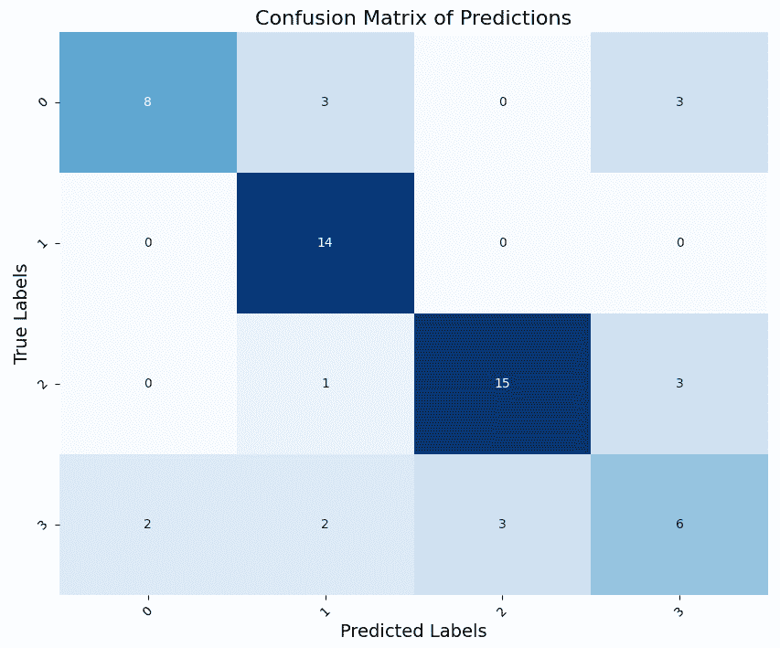

# 第八章：深度学习在时间序列分类中的应用

在本章中，我们将使用深度学习解决 **时间序列分类** (**TSC**) 问题。顾名思义，TSC 是一个涉及时间序列数据的分类任务。数据集包含多个时间序列，每个序列都有一个相关的分类标签。这个问题类似于标准的分类任务，但输入的解释变量是时间序列。我们将探索如何使用不同的方法来处理这个问题。除了使用 **K-最近邻** 模型来处理这个任务外，我们还将开发不同的神经网络，比如 **残差神经网络** (**ResNet**) 和卷积神经网络。

在本章结束时，你将能够使用 PyTorch Lightning 数据模块设置 TSC 任务，并用不同的模型解决它。你还将学习如何使用 `sktime` Python 库来解决这个问题。

本章包含以下食谱：

+   使用 K-最近邻解决 TSC 问题

+   为 TSC 构建一个 `DataModule` 类

+   时间序列分类的卷积神经网络

+   使用 ResNet 解决 TSC 问题

+   使用`sktime`解决时间序列分类问题

# 技术要求

我们将专注于 PyTorch Lightning 生态系统来构建深度学习模型。此外，我们还将使用 scikit-learn 来创建基准模型。总体而言，本包中使用的库列表如下：

+   scikit-learn (1.3.2)

+   `pandas` (2.1.3)

+   NumPy (1.26.2)

+   Torch (2.1.1)

+   PyTorch Lightning (2.1.2)

+   `sktime` (0.24.1)

+   `keras-self-attention` (0.51.0)

作为示例，我们将使用以下链接中提供的`Car`数据集：[`www.timeseriesclassification.com`](https://www.timeseriesclassification.com)。你可以在以下文献中了解更多关于该数据集的信息：

Thakoor, Ninad, 和 Jean Gao. *基于广义概率下降方法和隐马尔可夫描述符的形状分类器*。第十届 IEEE **计算机视觉国际会议** (**ICCV**’05) 第 1 卷。IEEE，2005 年。

本章中使用的代码和数据集可以在以下 GitHub 链接中找到：[`github.com/PacktPublishing/Deep-Learning-for-Time-Series-Data-Cookbook`](https://github.com/PacktPublishing/Deep-Learning-for-Time-Series-Data-Cookbook)。

# 使用 K-最近邻解决 TSC 问题

在这个食谱中，我们将展示如何使用一种叫做 K-最近邻的流行方法来处理 TSC 任务。本食谱的目标是向你展示如何使用标准的机器学习模型来解决这个问题。

## 准备工作

首先，让我们使用 `pandas` 来加载数据：

```py
import pandas as pd
data_directory = 'assets/datasets/Car'
train = pd.read_table(f'{data_directory}/Car_TRAIN.tsv', header=None)
test = pd.read_table(f'{data_directory}/Car_TEST.tsv', header=None)
```

数据集已经分为训练集和测试集，因此我们会分别读取它们。现在，让我们看看如何使用这个数据集构建一个 K-最近邻模型。

## 如何实现……

在这里，我们描述了使用 scikit-learn 构建时间序列分类器所需的步骤：

1.  首先，我们将目标变量从解释变量中分离出来：

    ```py
    y_train = train.iloc[:, 0]
    y_test = test.iloc[:, 0]
    X_train = train.iloc[:, 1:]
    X_test = test.iloc[:, 1:]
    ```

    每个数据集的第一列（索引 `0`）包含目标变量，我们将其分配给 `y_train` 和 `y_test` 对象，用于训练集和测试集。`X_train` 和 `X_test` 对象包含相应数据集的输入解释时间序列。

    这个特定的数据集包含四个不同的类别。以下是它们的分布情况：


图 8.1: 数据集中四个类别的分布

1.  接下来，我们需要对时间序列进行标准化。我们使用 scikit-learn 中的 `MinMaxScaler` 方法来实现这一点，它将所有值压缩到 `0` 和 `1` 之间：

    ```py
    from sklearn.preprocessing import MinMaxScaler
    scaler = MinMaxScaler()
    X_train = scaler.fit_transform(X_train)
    X_test = scaler.transform(X_test)
    ```

    在前面的代码中，我们使用训练集拟合标准化器，然后用它来转换两个数据集中的数据。

1.  最后，我们准备创建一个 K-最近邻分类模型：

    ```py
    classifier = KNeighborsTimeSeriesClassifier()
    classifier.fit(X_train, y_train)
    predictions = classifier.predict(X_test)
    ```

    在前面的代码中，我们创建了一个 `KNeighborsTimeSeriesClassifier` 实例，它实现了 K-最近邻算法，并使用训练集对其进行拟合。然后，我们通过调用 `predict()` 方法将此模型应用于测试集。

    以下图显示了 K-最近邻模型预测的混淆矩阵：


图 8.2: K-最近邻模型预测的混淆矩阵

## 它是如何工作的……

时间序列分类（TSC）问题类似于标准分类任务，其中输入的解释变量是时间序列。因此，解决该问题的过程类似。在将解释变量（`X`）与目标变量（`y`）分开后，我们使用标准化函数等操作符对解释变量进行预处理。然后，我们可以使用任何分类器来解决这个任务。在本节中，我们使用了 K-最近邻模型，这是一种简单而有效的方法。

请注意，使用 `MinMaxScaler` 进行标准化步骤是非常重要的，能够将所有观测值映射到一个共同的值范围内。

## 还有更多内容……

`sktime` Python 库提供了多种解决 TSC 问题的方法。这里是文档的链接：[`www.sktime.net/en/stable/examples/02_classification.html`](https://www.sktime.net/en/stable/examples/02_classification.html)。

在本节中，我们使用了默认参数的 K-最近邻模型。例如，我们使用了明科夫斯基度量（Minkowski metric），但这可能不是最好的选择。对于时间序列，像动态时间规整（dynamic time warping）这样的距离度量通常是更好的选择。

# 为 TSC 构建 DataModule 类

在本节中，我们将回到 PyTorch Lightning 框架。我们将构建一个 `DataModule` 类来封装数据预处理和将观测值传递给模型的过程。

## 准备就绪

让我们从前面的食谱中加载数据集：

```py
import pandas as pd
data_directory = 'assets/datasets/Car'
train = pd.read_table(f'{data_directory}/Car_TRAIN.tsv', header=None)
test = pd.read_table(f'{data_directory}/Car_TEST.tsv', header=None)
```

接下来，我们将构建一个 `DataModule` 类来处理这个数据集。

## 如何操作……

在前面的章节中，我们使用了 PyTorch Forecasting 中的`TimeSeriesDataSet`来处理数据准备工作。这个类管理了多个步骤，包括数据的归一化和转化，供监督学习使用。然而，在 TSC 中，一个观察值使用整个时间序列作为输入：

1.  我们将开始创建一个更简化的`TimeSeriesDataSet`变体，以便将观察值传递给模型：

    ```py
    from torch.utils.data import Dataset
    class TSCDataset(Dataset):
        def __init__(self, X_data, y_data):
            self.X_data = X_data
            self.y_data = y_data
        def __getitem__(self, index):
            return self.X_data[index], self.y_data[index]
        def __len__(self):
            return len(self.X_data)
    ```

    `__getitem__``()`方法在内部用于从数据集中获取观察值并将其传递给模型，而`__len__``()`方法则输出数据集的大小。

1.  然后，我们准备好构建`LightningDataModule`类了。这里是构造函数：

    ```py
    from torch.utils.data import Dataset, DataLoader
    import lightning.pytorch as pl
    from sklearn.preprocessing import MinMaxScaler, OneHotEncoder
    class TSCDataModule(pl.LightningDataModule):
        def __init__(self, train_df, test_df, batch_size=1):
            super().__init__()
            self.train_df = train_df
            self.test_df = test_df
            self.batch_size = batch_size
            self.scaler = MinMaxScaler()
            self.encoder = OneHotEncoder(categories='auto',
                sparse_output=False)
            self.train = None
            self.validation = None
            self.test = None
    ```

    `TSCDataModule`包含了`self.train`、`self.validation`和`self.test`数据集属性，这些属性将在`setup``()`方法中填充。此外，构造函数还会基于`MinMaxScaler`设置归一化方法，并使用名为`OneHotEncoder`的独热编码器。我们使用独热编码器将目标变量转换为一组二元变量。这一过程是训练神经网络所必需的。

1.  然后，`setup``()`方法的实现如下：

    ```py
    def setup(self, stage=None):
        y_train = self.encoder.fit_transform(
            self.train_df.iloc[:, 0].values.reshape(-1, 1)
        )
        y_test = self.encoder.transform(
            self.test_df.iloc[:,0].values.reshape(-1, 1))
        X_train = train.iloc[:, 1:]
        X_test = test.iloc[:, 1:]
        X_train = self.scaler.fit_transform(X_train)
        X_test = self.scaler.transform(X_test)
        X_train, X_val, y_train, y_val = train_test_split(
            X_train, y_train, test_size=0.2, stratify=y_train
        )
        X_train, X_val, X_test = [
            torch.tensor(arr, dtype=torch.float).unsqueeze(1)
            for arr in [X_train, X_val, X_test]
        ]
        y_train, y_val, y_test = [
            torch.tensor(arr, dtype=torch.long)
            for arr in [y_train, y_val, y_test]
        ]
        self.train = TSCDataset(X_train, y_train)
        self.validation = TSCDataset(X_val, y_val)
        self.test = TSCDataset(X_test, y_test)
    ```

    在前面的代码中，我们使用编码器转换目标变量，并使用归一化方法对解释变量进行相同的转换。然后，我们基于训练实例创建验证集。我们还使用`torch.tensor()`方法将数据对象转换为 torch 数据结构。最后，我们基于训练、验证和测试集创建`TSCDataset`实例。

1.  我们直接在相应数据集上使用`DataLoader`类创建数据加载方法：

    ```py
        def train_dataloader(self):
            return DataLoader(self.train, 
                batch_size=self.batch_size)
        def val_dataloader(self):
            return DataLoader(self.validation, 
                batch_size=self.batch_size)
        def test_dataloader(self):
            return DataLoader(self.test, batch_size=self.batch_size)
    ```

1.  最后，这里是如何使用这个数据模块获取一个观察值的示例：

    ```py
    datamodule = TSCDataModule(train_df=train, test_df=test)
    datamodule.setup()
    x, y = next(iter(datamodule.train_dataloader()))
    ```

在下一个教程中，我们将学习如何使用这个数据模块构建一个分类模型。

## 它是如何工作的…

我们创建了一个针对 TSC 分类问题定制的`DataModule`类。我们将数据逻辑封装在`setup``()`方法中，从而使我们能够使用 PyTorch Lightning 生态系统来构建深度学习模型。

在这种情况下，TSC 问题不涉及自回归。因此，我们创建了一个简单变体的`TimeSeriesDataSet`类，用于处理将数据传递给模型的过程。

# 用于 TSC 的卷积神经网络

在这个教程中，我们将带你构建一个卷积神经网络来解决 TSC 问题。我们将使用前面教程中创建的`DataModule`类来实现这一目标。

## 准备工作

我们首先再次导入前面教程中使用的数据集：

```py
import pandas as pd
data_directory = 'assets/datasets/Car'
train = pd.read_table(f'{data_directory}/Car_TRAIN.tsv', header=None)
test = pd.read_table(f'{data_directory}/Car_TEST.tsv', header=None)
datamodule = TSCDataModule(train_df=train,
                           test_df=test,
                           batch_size=8)
```

我们还创建了一个`TSCDataModule`数据模块的实例，它是在前面的教程中定义的。让我们看看如何创建一个卷积神经网络分类器来处理这个任务。

## 如何做到这一点…

在这里，我们将通过以下步骤为 TSC 问题构建一个卷积神经网络，使用 PyTorch 实现：

1.  我们先从基于 PyTorch 创建神经网络开始：

    ```py
    from torch import nn
    class ConvolutionalTSC(nn.Module):
        def __init__(self, input_dim, output_dim=1):
            super(ConvolutionalTSC, self).__init__()
            self.conv1 = nn.Conv1d(in_channels=input_dim,
                                   out_channels=64,
                                   kernel_size=3,
                                   stride=1,
                                   padding=1)
            self.conv2 = nn.Conv1d(in_channels=64,
                                   out_channels=32,
                                   kernel_size=3,
                                   stride=1,
                                   padding=1)
            self.conv3 = nn.Conv1d(in_channels=32,
                                   out_channels=16,
                                   kernel_size=3,
                                   stride=1,
                                   padding=1)
            self.maxp = nn.MaxPool1d(kernel_size=3)
            self.fc1 = nn.Linear(in_features=336, out_features=32)
            self.fc2 = nn.Linear(in_features=32, 
                out_features=output_dim)
        def forward(self, x):
            x = F.relu(self.conv1(x))
            x = self.maxp(x)
            x = F.relu(self.conv2(x))
            x = self.maxp(x)
            x = F.relu(self.conv3(x))
            x = self.maxp(x)
            x = x.view(x.size(0), -1)
            x = self.fc1(x)
            x = self.fc2(x)
            return x
    ```

1.  然后，我们将该模型封装在一个来自 PyTorch Lightning 的 `LightningModule` 类 `TSCCnnModel` 中：

    ```py
    import torch.nn.functional as F
    import lightning.pytorch as pl
    class TSCCnnModel(pl.LightningModule):
        def __init__(self, output_dim):
            super().__init__()
            self.network = ConvolutionalTSC(
                input_dim=1,
                output_dim=output_dim,
            )
        def forward(self, x):
            x = x.type(torch.FloatTensor)
            return self.network(x)
    ```

    该模块还包含了常见的训练、验证和测试步骤，具体实现如下：

    ```py
        def training_step(self, batch, batch_idx):
            x, y = batch
            y_pred = self.forward(x)
            loss = F.cross_entropy(y_pred, 
                y.type(torch.FloatTensor))
            self.log('train_loss', loss)
            return loss
        def validation_step(self, batch, batch_idx):
            x, y = batch
            y_pred = self(x)
            loss = F.cross_entropy(y_pred, 
                y.type(torch.FloatTensor))
            self.log('val_loss', loss)
            return loss
        def test_step(self, batch, batch_idx):
            x, y = batch
            y_pred = self(x)
            loss = F.cross_entropy(y_pred, 
                y.type(torch.FloatTensor))
            self.log('test_loss', loss)
        def configure_optimizers(self):
            return torch.optim.Adam(self.parameters(), lr=0.01)
    ```

    这些步骤与为预测问题开发的步骤类似，但在这种情况下，我们使用交叉熵作为 `loss()` 函数。

1.  现在我们已经准备好训练模型，接下来我们通过 `Trainer` 实例进行训练，如下所示：

    ```py
    import lightning.pytorch as pl
    from lightning.pytorch.callbacks import EarlyStopping
    model = TSCCnnModel(output_dim=4)
    early_stop_callback = EarlyStopping(monitor="val_loss",
        min_delta=1e-4,
        patience=10,
        verbose=False,
        mode="min")
    trainer = pl.Trainer(
        max_epochs=30,
        accelerator='cpu',
        log_every_n_steps=2,
        enable_model_summary=True,
        callbacks=[early_stop_callback],
    )
    trainer.fit(model, datamodule)
    ```

    在前面的代码中，我们在创建 `TSCCnnModel` 类的实例时，将输出维度设置为 `4`，这代表了数据集中的类别数。我们还设置了一个提前停止回调，用以推动网络的训练过程。

## 它是如何工作的……

卷积神经网络已成功应用于时间序列分类（TSC）问题。在本示例中，我们探索了基于 PyTorch Lightning 的 `LightningModule` 开发分类器。我们创建了一个扩展自 `nn.Module` 类的 `ConvolutionalTSC` 类。在该类的构造函数中，我们定义了网络的层次：三个卷积层（`conv1`、`conv2` 和 `conv3`），以及两个全连接层（`fc1` 和 `fc2`）。`forward()` 方法详细说明了这些层是如何组合在一起的。然后，卷积层依次堆叠，并在每个卷积后应用最大池化操作（`MaxPool1d`）。最后，我们堆叠了两个全连接层，其中最后一层是输出层。

下图显示了卷积神经网络的混淆矩阵：



图 8.3：卷积神经网络的混淆矩阵

使用神经网络得到的结果优于使用 K 最近邻（K-NN）模型的结果。

该模型的工作流与基于 PyTorch Lightning 的其他示例遵循相同的逻辑。需要注意的主要区别是我们正在处理分类问题。因此，我们需要设置一个处理该问题的损失函数。交叉熵是训练神经网络用于分类任务时通常使用的函数。神经网络的输出维度也根据类别的数量进行设置。基本上，每个数据集中的类别都会有一个输出单元。

# 用于 TSC 的 ResNet

本示例演示了如何训练一个用于 TSC 任务的 ResNet。ResNet 是一种广泛用于计算机视觉问题（如图像分类或目标检测）的深度神经网络架构。在这里，你将学习如何将其应用于时间序列数据建模。

## 准备工作

我们将继续使用与前一个示例中相同的数据集和数据模块：

```py
import pandas as pd
data_directory = 'assets/datasets/Car'
train = pd.read_table(f'{data_directory}/Car_TRAIN.tsv', header=None)
test = pd.read_table(f'{data_directory}/Car_TEST.tsv', header=None)
datamodule = TSCDataModule(train_df=train,
    test_df=test,
    batch_size=8)
```

让我们看看如何使用 PyTorch Lightning 构建并训练 ResNet。

## 如何做…

本节中，我们描述了为 TSC 任务创建 ResNet 的过程：

1.  首先，使用 `torch` 库中的 `nn.Module` 创建一个 ResNet：

    ```py
    class ResidualNeuralNetworkModel(nn.Module):
        def __init__(self,
                     in_channels: int,
                     out_channels: int = 64,
                     num_classes: int = 1):
            super().__init__()
            self.input_args = {
                'in_channels': in_channels,
                'num_classes': num_classes
            }
            self.layers = nn.Sequential(*[
                ResNNBlock(in_channels=in_channels,
                    out_channels=out_channels),
                ResNNBlock(in_channels=out_channels,
                    out_channels=out_channels * 2),
                ResNNBlock(in_channels=out_channels * 2,
                    out_channels=out_channels * 2),
            ])
            self.fc = nn.Linear(mid_channels * 2, num_classes)
        def forward(self, x):
            x = self.layers(x)
            return self.fc(x.mean(dim=-1))
    ```

    然后，我们将 `ResidualNeuralNetworkModel` 封装在 `pl.LightningModule` 中：

    ```py
    class TSCResNet(pl.LightningModule):
        def __init__(self, output_dim):
            super().__init__()
            self.resnet = \
                ResidualNeuralNetworkModel(in_channels=1,
                    num_pred_classes=output_dim)
        def forward(self, x):
            out = self.resnet.forward(x)
            return out
    ```

1.  训练、验证和测试步骤的实现与前面食谱中的实现完全相同：

    ```py
        def training_step(self, batch, batch_idx):
            x, y = batch
            x = x.type(torch.FloatTensor)
            y = y.type(torch.FloatTensor)
            y_pred = self.forward(x)
            loss = F.cross_entropy(y_pred, y)
            self.log('train_loss', loss)
            return loss
        def validation_step(self, batch, batch_idx):
            x, y = batch
            x = x.type(torch.FloatTensor)
            y = y.type(torch.FloatTensor)
            y_pred = self(x)
            loss = F.cross_entropy(y_pred, y)
            self.log('val_loss', loss)
            return loss
        def test_step(self, batch, batch_idx):
            x, y = batch
            x = x.type(torch.FloatTensor)
            y = y.type(torch.FloatTensor)
            y_pred = self(x)
            loss = F.cross_entropy(y_pred, y)
            acc = Accuracy(task='multiclass', num_classes=4)
            acc_score = acc(y_pred, y)
            self.log('acc_score', acc_score)
            self.log('test_loss', loss)
        def configure_optimizers(self):
            return torch.optim.Adam(self.parameters(), lr=0.01)
    ```

    请注意，我们将预测值和实际值转换为 `torch.FloatTensor` 结构，以计算 `loss` `()` 函数。我们将交叉熵设置为 `loss` `()` 函数，这是分类问题中常用的函数。在测试阶段，我们还评估模型的准确性。

1.  最后，这是基于 PyTorch Lightning 的 `Trainer` 进行模型训练和测试的工作流程：

    ```py
    model = TSCResNet(output_dim=4)
    datamodule = TSCDataModule(train_df=train, test_df=test, 
        batch_size=8)
    early_stop_callback = EarlyStopping(monitor="val_loss",
        min_delta=1e-4,
        patience=20,
        verbose=False,
        mode="min")
    trainer = pl.Trainer(
        max_epochs=100,
        accelerator='cpu',
        log_every_n_steps=2,
        enable_model_summary=True,
        callbacks=[early_stop_callback],
    )
    trainer.fit(model, datamodule)
    trainer.test(model, datamodule)
    ```

    本质上，在定义模型之后，使用 PyTorch Lightning 的 `Trainer` 进行训练和测试的过程与前面食谱中展示的类似。

## 它是如何工作的……

ResNet 在 TSC 问题中表现出了良好的效果。其思想是学习原始输入和通过卷积层得到的转换输出之间的差异（残差）。在前面的代码中，我们创建了一个神经网络，该网络以三个参数作为输入：

+   `in_channels`：输入通道的数量，由于我们的时间序列是单变量的，因此等于 1。

+   `out_channels`：每个残差块的输出通道数量

+   `num_classes`：数据集中类别的数量

神经网络的层由三个名为 `ResNNBlock` 的残差块组成。残差块是 ResNet 的基石，旨在解决梯度消失问题。你可以在以下网址查看名为 `ResNNBlock` 的残差块实现：[`github.com/PacktPublishing/Deep-Learning-for-Time-Series-Data-Cookbook`](https://github.com/PacktPublishing/Deep-Learning-for-Time-Series-Data-Cookbook)。残差块的输出传递给一个线性层。

下图展示了 ResNet 的混淆矩阵：


图 8.4：ResNet 的混淆矩阵

与前一个食谱类似，我们将 ResNet 的实现与 PyTorch Lightning 框架结合。在此食谱的测试阶段，我们还包含了准确率度量，告诉我们模型正确预测的案例百分比。这个度量通常用于 TSC 问题，尽管对于目标分布不平衡的数据集，它可能不是很有意义。

# 使用 sktime 解决 TSC 问题

在这个食谱中，我们探索了 PyTorch 的替代方法——`sktime`。`sktime` 是一个专门用于时间序列建模的 Python 库，其中包括几个用于 TSC 的神经网络模型。

## 准备工作

你可以使用 `pip` 安装 `sktime`。你还需要安装 `keras-self-attention` 库，其中包含运行 `sktime` 中某些方法所需的自注意力方法：

```py
pip install 'sktime[dl]'
pip install keras-self-attention
```

在安装 `sktime` 时，方括号中的 `dl` 标签表示你希望包括该库中提供的可选深度学习模型。

在这个食谱中，我们将使用 `sktime` 中提供的一个示例数据集。我们将在下一节加载它。

## 如何操作……

正如其名称所示，`sktime`库遵循类似于 scikit-learn 的设计模式。因此，我们使用`sktime`构建深度学习模型的方法将类似于*使用 K 近邻解决 TSC 问题*方案中描述的工作流程。

让我们从加载数据集开始：

```py
from sktime.datasets import load_italy_power_demand
X_train, y_train = \
    load_italy_power_demand(split="train", return_type="numpy3D")
X_test, y_test = load_italy_power_demand(split="test",
    return_type="numpy3D")
```

在前面的代码中，我们加载了关于意大利能源需求的数据集。你可以查看以下链接以获取更多关于此数据集的信息：[`www.timeseriesclassification.com/description.php?Dataset=ItalyPowerDemand`](https://www.timeseriesclassification.com/description.php?Dataset=ItalyPowerDemand)。

数据最初用于以下工作：

Keogh, Eamonn 等人。*智能图标：将轻量级数据挖掘与可视化集成到 GUI 操作系统中*。第六届**国际数据挖掘会议**（**ICDM**'06）。IEEE，2006 年。

我们使用`load_italy_power_demand`来加载训练集和测试集，作为`numpy`数据结构。

现在，让我们看看如何使用这个数据集构建不同类型的神经网络。

### 全连接神经网络

我们从训练一个全连接神经网络开始。该网络的配置，包括`loss``()`和`activation``()`函数，作为参数传递给`FCNClassifier`实例：

```py
from sktime.classification.deep_learning.fcn import FCNClassifier
fcn = FCNClassifier(n_epochs=200,
    loss='categorical_crossentropy',
    activation='sigmoid',
    batch_size=4)
fcn.fit(X_train, y_train)
fcn_pred = fcn.predict(X_test)
```

训练和推断步骤分别使用`fit``()`和`predict``()`方法完成。如果你熟悉 scikit-learn 的方法，这种方式应该对你来说很熟悉。

### 卷积神经网络

正如我们在*卷积神经网络用于 TSC*方案中学到的，卷积模型可以是分类时间序列的有效方法。这里是`sktime`中使用`CNNClassifier`的实现：

```py
from sktime.classification.deep_learning.cnn import CNNClassifier
cnn = CNNClassifier(n_epochs=200,
    loss='categorical_crossentropy',
    activation='sigmoid',
    kernel_size=7,
    batch_size=4)
cnn.fit(X_train, y_train)
cnn_pred = cnn.predict(X_test)
```

你还可以设置与卷积相关的其他参数，如`avg_pool_size`或`n_conv_layers`。查看文档以获取完整的参数列表，链接如下：[`www.sktime.net/en/stable/api_reference/auto_generated/sktime.classification.deep_learning.CNNClassifier.html`](https://www.sktime.net/en/stable/api_reference/auto_generated/sktime.classification.deep_learning.CNNClassifier.html)。

### LSTM-FCN 神经网络

循环神经网络对这个问题也很有用。这里是一个将 LSTM 与全连接层结合的模型，能够在`LSTMFCNClassifier`中使用：

```py
from sktime.classification.deep_learning.lstmfcn import( 
    LSTMFCNClassifier)
lstmfcn = LSTMFCNClassifier(n_epochs=200,
                            attention=True,
                            batch_size=4)
lstmfcn.fit(X_train, y_train)
lstmfcn_pred = lstmfcn.predict(X_test)
```

该方法还包含一个注意力机制，显著提高了分类准确性。

### TapNet 模型

`sktime`：

```py
from sktime.classification.deep_learning.tapnet import(
    TapNetClassifier)
tapnet = TapNetClassifier(n_epochs=200,
                          loss='categorical_crossentropy',
                          batch_size=4)
tapnet.fit(X_train, y_train)
tapnet_pred = tapnet.predict(X_test)
```

该模型可以处理低维空间（特征数较少），并且在半监督设置下表现良好——即，当有大量未标记的观察数据时。

### InceptionTime 模型

`InceptionTime`是解决 TSC 问题的最先进深度学习方法。实际上，`InceptionTime`是一个深度卷积神经网络的集成，灵感来自于为计算机视觉任务创建的 Inception 架构：

```py
from sktime.classification.deep_learning import( 
    InceptionTimeClassifier)
inception = InceptionTimeClassifier(n_epochs=200,
        loss='categorical_crossentropy',
        use_residual=True,
        batch_size=4)
inception.fit(X_train, y_train)
inception_pred = inception.predict(X_test)
```

该模型还包括可选的残差连接，在前面的代码中，我们通过将 `use_residual` 参数设置为 `True` 来使用它。

### 评估

我们可以使用标准的分类指标来评估 TSC 模型的性能。以下是如何计算我们在这个食谱中训练的模型的准确性：

```py
from sklearn.metrics import accuracy_score
perf = {
    'FCN': accuracy_score(y_test, fcn_pred),
    'CNN': accuracy_score(y_test, cnn_pred),
    'InceptionTime': accuracy_score(y_test, inception_pred),
    'TapNet': accuracy_score(y_test, tapnet_pred),
    'LSTMFCN': accuracy_score(y_test, lstmfcn_pred),
}
```

结果如下面的图所示：


图 8.5：模型的准确性

总的来说，`InceptionTime` 似乎是解决这个特定问题的最佳方法。

## 工作原理……

在这个食谱中，我们使用 `sktime` Python 库来构建深度学习模型以解决 TSC 问题。虽然你可以像我们在本章的其他食谱中展示的那样使用 PyTorch，`sktime` 提供了一个广泛的工具包来处理 TSC 任务。由于 `sktime` 遵循 scikit-learn 的理念，大部分工作是通过相应类的 `fit` 和 `predict` 方法完成的。

## 还有更多……

你可以查看 `sktime` 的文档，了解其他模型，包括一些非深度学习的模型。这里是链接：[`www.sktime.net/en/stable/users.html`](https://www.sktime.net/en/stable/users.html)。

在我们使用的这个食谱中的大多数模型中，我们将参数设置为默认值。但是，你可以创建一个验证集并优化模型的配置，以获得更好的性能。
