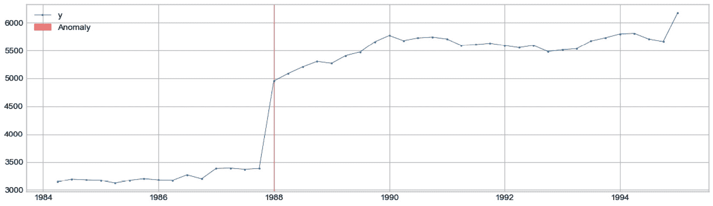
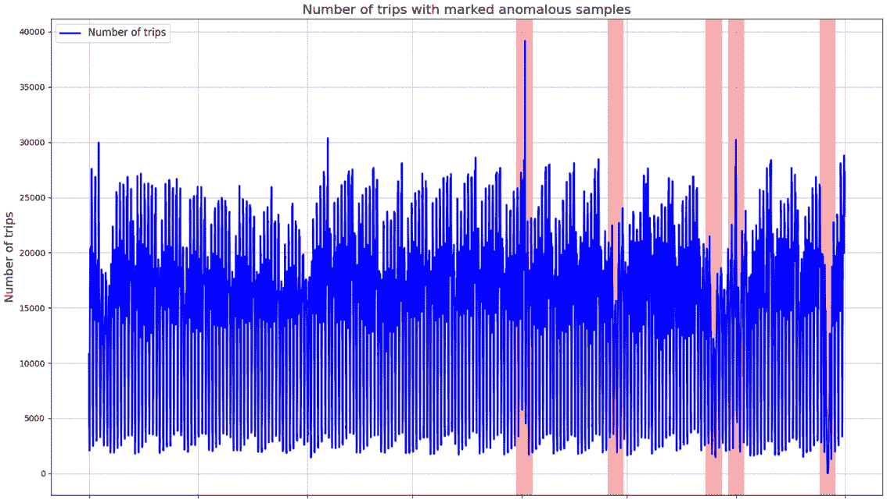
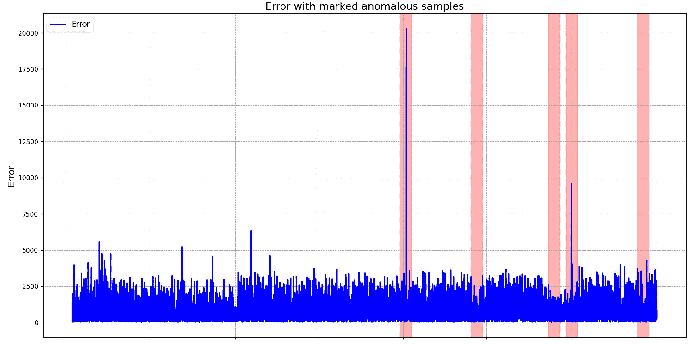
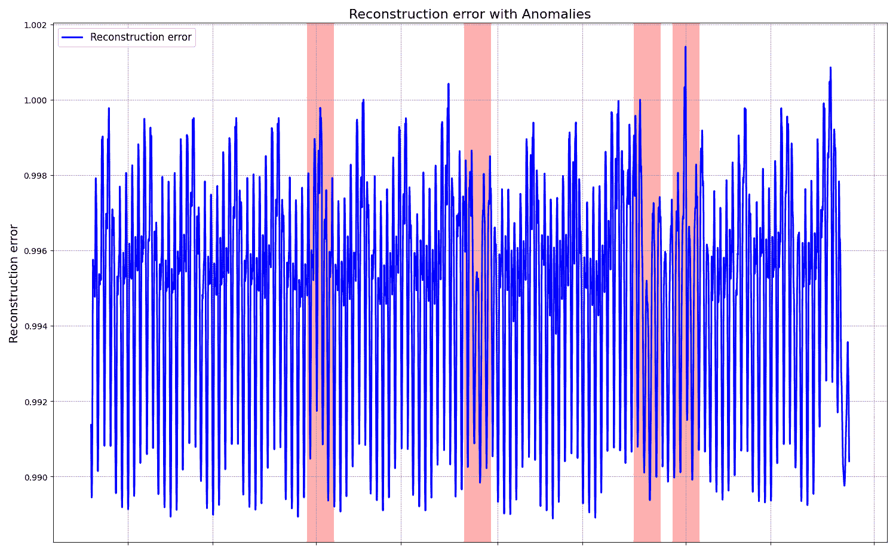
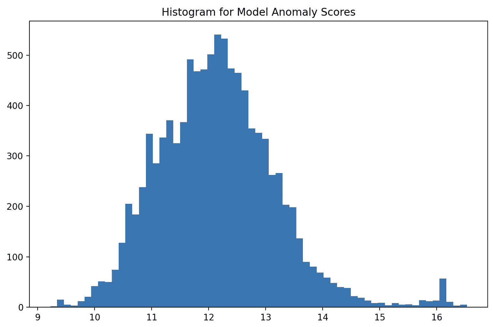
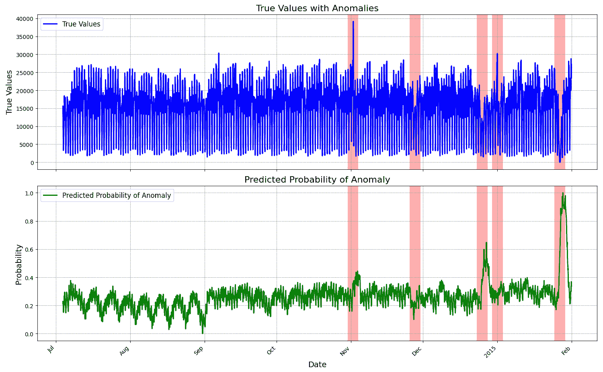
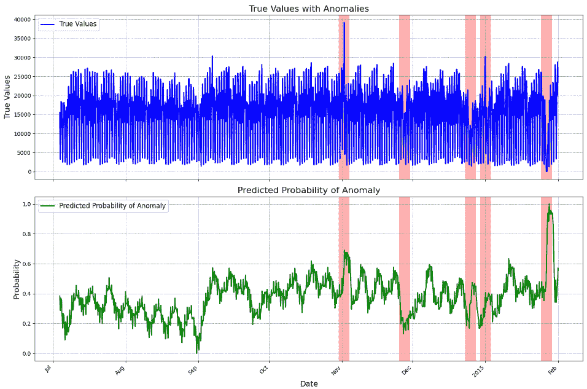
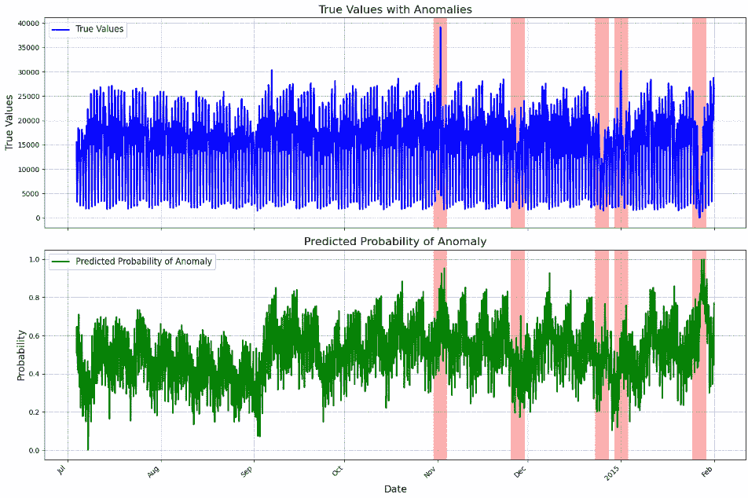

# 第九章：深度学习在时间序列异常检测中的应用

本章我们将深入探讨使用时间序列数据进行异常检测问题。这个任务涉及到检测与数据集中大部分样本显著不同的稀有观测值。我们将探索不同的方法来解决这个问题，比如基于预测的方法或基于重构的方法。包括使用强大的方法，如**自编码器**（**AEs**）、**变分自编码器**（**VAEs**）或**生成对抗网络**（**GANs**）。

到本章结束时，你将能够使用不同的方法在 Python 中定义时间序列异常检测问题。

本章包含以下内容：

+   使用**自回归积分滑动平均**（**ARIMA**）进行时间序列异常检测

+   基于预测的异常检测使用**深度学习**（**DL**）

+   使用**长短期记忆**（**LSTM**）自编码器进行异常检测

+   使用 PyOD 构建自编码器

+   为时间序列异常检测创建 VAE

+   使用 GANs 进行时间序列异常检测

# 技术要求

本章中开发的模型基于不同的框架。首先，我们展示如何使用 `statsforecast` 和 `neuralforecast` 库开发基于预测的方法。其他方法，如 LSTM 自编码器，将使用 PyTorch Lightning 生态系统进行探索。最后，我们还将使用 PyOD 库创建基于 GANs 或 VAEs 等方法的异常检测模型。当然，我们也依赖于典型的数据处理库，如 `pandas` 或 NumPy。以下列表包含本章所需的所有库：

+   `scikit-learn` (1.3.2)

+   `pandas` (2.1.3)

+   NumPy (1.26.2)

+   `statsforecast` (1.6.0)

+   `datasetsforecast` (0.08)

+   `0neuralforecast` (1.6.4)

+   `torch` (2.1.1)

+   PyTorch Lightning (2.1.2)

+   PyTorch Forecasting (1.0.0)

+   PyOD (1.1.2)

本章中使用的代码和数据集可以在以下 GitHub URL 中找到：[`github.com/PacktPublishing/Deep-Learning-for-Time-Series-Data-Cookbook`](https://github.com/PacktPublishing/Deep-Learning-for-Time-Series-Data-Cookbook)。

# 使用 ARIMA 进行时间序列异常检测

时间序列异常检测是诸如医疗保健或制造业等应用领域中的一项重要任务。异常检测方法旨在识别不符合数据集典型行为的观测值。在实际操作中，异常可能代表机器故障或欺诈行为等现象。异常检测是**机器学习**（**ML**）中的一项常见任务，尤其是在涉及时间序列数据时，它有一些专门的方法。这种类型的数据集及其中的模式可能会随时间演变，这使得建模过程和检测器的有效性变得更加复杂。用于时间序列异常检测问题的统计学习方法通常采用基于预测的方法或基于重构的方法。在本食谱中，我们将描述如何使用 ARIMA 方法为单变量时间序列创建一个基于预测的异常检测系统。

## 准备工作

我们将专注于来自`M3`数据集的单变量时间序列，该数据集可以在`datasetsforecast`库中找到。以下是获取此数据的方法：

```py
from datasetsforecast.m3 import M3
dataset, *_ = M3.load('./data', 'Quarterly')
q1 = dataset.query('unique_id=="Q1"')
```

在前面的代码中，我们首先使用`load()`方法加载`M3`数据集。然后，我们使用`query()`方法获取标识符为`Q1`的单变量时间序列（`unique_id`列）。现在，让我们看看如何在这个数据集中检测异常。

## 如何操作…

我们将构建一个预测模型，并使用相应的预测区间来检测异常。

1.  我们从创建一个预测模型开始。虽然任何模型都能工作，但在这个例子中，我们专注于 ARIMA。以下是如何使用`statsforecast`库定义该模型：

    ```py
    from statsforecast import StatsForecast
    from statsforecast.models import AutoARIMA
    models = [AutoARIMA(season_length=4)]
    sf = StatsForecast(
        df=q1,
        models=models,
        freq='Q',
        n_jobs=1,
    )
    ```

1.  现在，我们准备好拟合模型并获取预测：

    ```py
    forecasts = sf.forecast(h=8, level=[99], 
        fitted=True).reset_index()
    insample_forecasts = sf.forecast_fitted_values().reset_index()
    ```

    首先，我们使用`forecast()`方法获取预测结果。在此示例中，我们将预测时间设定为`8`（`h=8`）。我们还传递了两个额外的参数：`level=[99]`，这意味着我们还希望模型预测具有`99`%置信度的区间；`fitted=True`，这告诉模型计算训练预测。我们使用`forecast_fitted_values()`方法从训练集获取预测结果。

1.  然后，我们根据预测点是否在模型所做的预测区间内来识别异常。具体操作如下：

    ```py
    anomalies = insample_forecasts.loc[
        (
            insample_forecasts['y'] >= 
            insample_forecasts['AutoARIMA-hi-99']
        ) | (
            insample_forecasts['y'] <= 
            insample_forecasts['AutoARIMA-lo-99'])]
    ```

    前面的代码检查训练预测（`insample_forecasts['y']`对象）是否在`99`%预测区间内。任何未通过此检查的观测值都被视为异常。

1.  最后，我们使用`StatsForecast`类中的`plot()`方法来绘制异常：

    ```py
    StatsForecast.plot(insample_forecasts, unique_ids=['Q1'], 
        plot_anomalies=True)
    ```

    下面是该图的样子：



图 9.1：ARIMA 识别的异常示例

## 其工作原理…

我们使用了`statsforecast`库中可用的`AutoARIMA`实现来创建 ARIMA 模型。这种方法会自动选择模型的最佳参数。由于数据是季度数据，我们将季节性长度设置为`4`。拟合过程通过一个`StatsForecast`类实例来执行。

基于预测的方法通过将给定模型的预测值与时间序列的实际值进行比较来工作。在这种情况下，我们使用 ARIMA 模型，但也可以使用其他方法。此外，我们还考虑了基于预测区间的方法。具体来说，如果观察值的数值超出了预测区间，就认为该值是异常值。在前面一节中的代码中，我们考虑了 99%置信度的预测区间，但你可以根据你的问题测试不同的值。

## 还有更多内容……

在本食谱中，我们专注于使用 ARIMA 来获取预测区间，但你也可以使用任何具有此功能的其他模型。

你可以通过以下网址查看更多关于如何使用`statsforecast`库进行基于预测的异常检测的详细信息：[`nixtla.github.io/statsforecast/docs/tutorials/anomalydetection.html`](https://nixtla.github.io/statsforecast/docs/tutorials/anomalydetection.html)。

# 基于预测的异常检测方法，使用深度学习（DL）

在本食谱中，我们继续探索基于预测的方法。这一次，我们将创建一个基于深度学习（DL）的预测模型。此外，我们还将使用点预测的误差作为检测异常的参考。

## 准备工作

我们将使用纽约市出租车行程数的时间序列数据集。这个数据集被认为是时间序列异常检测任务的基准问题。你可以通过以下链接查看源数据：[`databank.illinois.edu/datasets/IDB-9610843`](https://databank.illinois.edu/datasets/IDB-9610843)。

让我们首先使用`pandas`加载时间序列：

```py
from datetime import datetime
import pandas as pd
dataset = pd.read_csv('assets/datasets/taxi/taxi_data.csv')
labels = pd.read_csv('assets/datasets/taxi/taxi_labels.csv')
dataset['ds'] = pd.Series([datetime.fromtimestamp(x) 
    for x in dataset['timestamp']])
dataset = dataset.drop('timestamp', axis=1)
dataset['unique_id'] = 'NYT'
dataset = dataset.rename(columns={'value': 'y'})
is_anomaly = []
for i, r in labels.iterrows():
    dt_start = datetime.fromtimestamp(r.start)
    dt_end = datetime.fromtimestamp(r.end)
    anomaly_in_period = [dt_start <= x <= dt_end 
        for x in dataset['ds']]
    is_anomaly.append(anomaly_in_period)
dataset['is_anomaly']=pd.DataFrame(is_anomaly).any(axis=0).astype(int)
dataset['ds'] = pd.to_datetime(dataset['ds'])
```

上述代码包含几个步骤：

1.  使用`pd.read_csv()`函数加载数据集及其对应的标签。

1.  将数据集处理为一个表格格式，包含三个主要信息：时间序列标识符（`unique_id`）、时间戳（`ds`）和观察值的数值（`y`）。

1.  将标签处理成一个新的布尔型列`is_anomaly`，用于标记相应的观察值是否为异常。

    下面是该时间序列的样子：



图 9.2：标记异常的纽约市数据集

## 如何执行…

现在，我们使用出租车行程数据集来训练一个预测模型。在本食谱中，我们将使用`neuralforecast`库，它包含了多个深度学习算法的实现：

1.  让我们开始定义模型，如下所示：

    ```py
    from neuralforecast import NeuralForecast
    from neuralforecast.models import NHITS
    horizon = 1
    n_lags = 144
    models = [NHITS(h=horizon,
        input_size=n_lags,
        max_steps=30,
        n_freq_downsample=[2, 1, 1],
        mlp_units=3 * [[128, 128]],
        accelerator='cpu')]
    nf = NeuralForecast(models=models, freq='30T')
    ```

    我们使用`144`作为输入大小（`n_lags`），这对应于 3 天的数据，因为时间序列每`30`分钟收集一次数据（`freq='30T'`）。

1.  在定义模型之后，我们可以使用`fit()`方法来训练它：

    ```py
    nf.fit(df=dataset.drop('is_anomaly', axis=1), val_size=n_lags)
    ```

    在拟合过程之前，我们会删除包含异常信息的`is_anomaly`变量。现在的想法是使用该模型来预测时间序列的值。任何与实际值有显著偏差的情况都被视为异常。让我们看看训练预测结果。

1.  通过调用`predict_insample()`方法，我们可以获取训练（或样本内）预测，如下所示：

    ```py
    insample = nf.predict_insample()
    insample = insample.tail(-n_lags)
    abs_error = (insample['NHITS'] - insample['y']).abs()
    ```

    在上述代码中，我们获取训练样本，并移除最初的`n_lag`观察以将预测与实际数据对齐。然后，通过模型的绝对误差来衡量模型的性能。

1.  可视化训练数据中的绝对误差以及标记的异常：

    ```py
    preds = pd.DataFrame(
        {
            "Error": abs_error.values,
            "ds": dataset["ds"].tail(-n_lags),
            "is_anomaly": dataset["is_anomaly"].tail(-n_lags),
        }
    )
    preds = preds.set_index("ds")
    predicted_anomaly_periods = find_anomaly_periods(
        preds["is_anomaly"])
    setup_plot(preds.rename(columns={"Error": "y"}), 
        predicted_anomaly_periods, "Error")
    ```

    为了简洁起见，绘图功能未显示。您可以在 GitHub 存储库中查看它们。图表显示在以下图中：



图 9.3：神经分层时间序列实现（NHITS）模型的绝对误差和标记的异常

在两个异常情况下会发生较大的误差，尽管模型也会错过一些异常情况。

## 工作原理…

如前一示例所示，我们使用预测模型来识别时间序列中的异常。在这种情况下，我们不使用预测区间，而是依赖模型的绝对误差。较大的误差表明时间序列中可能存在异常。

我们使用`neuralforecast`框架基于 NHITS 方法构建 DL 预测模型。NHITS 是一种扩展**神经基础扩展分析**（**NBEATS**）的模型，基于**多层感知器**（**MLP**）类型的架构。

这涉及将数据转换为适当的格式，并使用自回归方法训练模型。

## 还有更多…

在本示例中，我们专注于单变量时间序列数据集和特定的预测方法（NHITS）。然而，重要的是注意，基于预测的异常检测方法可以应用于不同的设置（例如多变量时间序列）和其他预测方法。

在训练阶段，我们需要定义一个误差阈值，超过这个阈值的观测值将被标记为异常。我们将在后续的示例中探讨几种带有此功能的实现。

# 使用 LSTM AE 进行异常检测

在本示例中，我们将构建一个 AE 来检测时间序列中的异常。AE 是一种**神经网络**（**NN**）类型，试图重构输入数据。使用此类模型进行异常检测的动机在于，异常数据的重构过程比典型观测更为困难。

## 准备工作

在这个示例中，我们将继续使用纽约市出租车的时间序列数据。在框架方面，我们将展示如何使用 PyTorch Lightning 构建 AE 模型。这意味着我们将构建一个数据模块来处理数据预处理，另一个模块则用于处理神经网络的训练和推理。

## 如何实现…

这个示例分为三部分。首先，我们基于 PyTorch 构建数据模块。然后，我们创建 AE 模块。最后，我们将这两个部分结合起来，构建一个异常检测系统：

1.  让我们从构建数据模块开始。我们创建一个名为`TaxiDataModule`的类，它继承自`pl.LightningDataModule`。以下是该类的构造函数：

    ```py
    Import numpy as np
    import pandas as pd
    import lightning.pytorch as pl
    from pytorch_forecasting import TimeSeriesDataSet
    from sklearn.model_selection import train_test_split
    class TaxiDataModule(pl.LightningDataModule):
        def __init__(self,
                     data: pd.DataFrame,
                     n_lags: int,
                     batch_size: int):
            super().__init__()
            self.data = data
            self.batch_size = batch_size
            self.n_lags = n_lags
            self.train_df = None
            self.test_df = None
            self.training = None
            self.validation = None
            self.predict_set = None
    ```

    `TaxiDataModule`类除了数据集外，还接受两个输入：滞后数（上下文长度）和批次大小。

1.  接下来，我们编写`setup()`方法，在该方法中准备训练和测试模型所需的数据：

    ```py
        def setup(self, stage=None):
            self.data['timestep'] = np.arange(self.data.shape[0])
            unique_times = \
                self.data['timestep'].sort_values().unique()
            tr_ind, ts_ind = \
                train_test_split(unique_times, test_size=0.4,
                    shuffle=False)
            tr_ind, vl_ind = \
                train_test_split(tr_ind, test_size=0.1,
                    shuffle=False)
            self.train_df = \
                self.data.loc[self.data['timestep'].isin(tr_ind), :]
            self.test_df = \
                self.data.loc[self.data['timestep'].isin(ts_ind), :]
            validation_df = \
                self.data.loc[self.data['timestep'].isin(vl_ind), :]
            self.training = TimeSeriesDataSet(
                data=self.train_df,
                time_idx="timestep",
                target="y",
                group_ids=['unique_id'],
                max_encoder_length=self.n_lags,
                max_prediction_length=1,
                time_varying_unknown_reals=['y'],
            )
            self.validation = \
                TimeSeriesDataSet.from_dataset(
                    self.training, validation_df)
            self.test = \
                TimeSeriesDataSet.from_dataset(
                    self.training, self.test_df)
            self.predict_set = \
                TimeSeriesDataSet.from_dataset(
                    self.training, self.data, predict=True)
    ```

    在前面的代码中，我们首先将数据拆分为训练集、验证集和测试集。每个数据集都被转换为`TimeSeriesDataSet`类的实例。

1.  数据加载器的实现如下：

    ```py
        def train_dataloader(self):
            return self.training.to_dataloader(
                batch_size=self.batch_size, shuffle=False)
        def val_dataloader(self):
            return self.validation.to_dataloader(
                batch_size=self.batch_size, shuffle=False)
        def predict_dataloader(self):
            return self.predict_set.to_dataloader(
                batch_size=1, shuffle=False)
    ```

    本质上，数据加载过程与我们之前在预测任务中所做的类似。例如，你可以查看*第五章*中的*多步多输出的多变量时间序列预测*示例。

1.  现在，我们关注 AE 模型，它分为两部分：编码器和解码器。以下是名为`Encoder`的类中的编码器实现：

    ```py
    from torch import nn
    import torch
    class Encoder(nn.Module):
        def __init__(self, context_len, n_variables, 
            embedding_dim=2):
            super(Encoder, self).__init__()
            self.context_len, self.n_variables = \
                context_len, n_variables
            self.embedding_dim, self.hidden_dim = \
                embedding_dim, 2 * embedding_dim
            self.lstm1 = nn.LSTM(
                input_size=self.n_variables,
                hidden_size=self.hidden_dim,
                num_layers=1,
                batch_first=True
            )
            self.lstm2 = nn.LSTM(
                input_size=self.hidden_dim,
                hidden_size=embedding_dim,
                num_layers=1,
                batch_first=True
            )
        def forward(self, x):
            batch_size = x.shape[0]
            x, (_, _) = self.lstm1(x)
            x, (hidden_n, _) = self.lstm2(x)
            return hidden_n.reshape((batch_size, 
                self.embedding_dim))
    ```

1.  解码器在一个名为`Decoder`的类中实现，该类也继承自`nn.Module`：

    ```py
    class Decoder(nn.Module):
        def __init__(self, context_len, n_variables=1, input_dim=2):
            super(Decoder, self).__init__()
            self.context_len, self.input_dim = \
                context_len, input_dim
            self.hidden_dim, self.n_variables = \
                2 * input_dim, n_variables
            self.lstm1 = nn.LSTM(
                input_size=input_dim,
                hidden_size=input_dim,
                num_layers=1,
                batch_first=True
            )
            self.lstm2 = nn.LSTM(
                input_size=input_dim,
                hidden_size=self.hidden_dim,
                num_layers=1,
                batch_first=True
            )
            self.output_layer = nn.Linear(self.hidden_dim, 
                self.n_variables)
        def forward(self, x):
            batch_size = x.shape[0]
            x = x.repeat(self.context_len, self.n_variables)
            x = x.reshape((batch_size, self.context_len, 
                self.input_dim))
            x, (hidden_n, cell_n) = self.lstm1(x)
            x, (hidden_n, cell_n) = self.lstm2(x)
            x = x.reshape((batch_size, self.context_len, 
                self.hidden_dim))
            return self.output_layer(x)
    ```

1.  这两个部分被结合在一个名为`AutoencoderLSTM`的类中，该类继承自`pl.LightningModule`：

    ```py
    import torch
    class AutoencoderLSTM(pl.LightningModule):
        def __init__(self, context_len, n_variables, embedding_dim):
            super().__init__()
            self.encoder = Encoder(context_len, n_variables, 
                embedding_dim)
            self.decoder = Decoder(context_len, n_variables, 
                embedding_dim)
        def forward(self, x):
            xh = self.encoder(x)
            rec_x = self.decoder(xh)
            return rec_x
        def configure_optimizers(self):
            return torch.optim.Adam(self.parameters(), lr=0.001)
    ```

    在`forward()`方法中，编码器部分接收原始输入（`self.encoder(x)`）并将其转换为降维后的表示（`xh`对象）。然后，解码器基于`xh`重建原始输入数据。

1.  然后，我们实现训练、验证和预测步骤：

    ```py
        import torch.nn.functional as F
        def training_step(self, batch, batch_idx):
            x, y = batch
            y_pred = self(x['encoder_cont'])
            loss = F.mse_loss(y_pred, x['encoder_cont'])
            self.log('train_loss', loss)
            return loss
        def validation_step(self, batch, batch_idx):
            x, y = batch
            y_pred = self(x['encoder_cont'])
            loss = F.mse_loss(y_pred, x['encoder_cont'])
            self.log('val_loss', loss)
            return loss
        def predict_step(self, batch, batch_idx):
            x, y = batch
            y_pred = self(x['encoder_cont'])
            loss = F.mse_loss(y_pred, x['encoder_cont'])
            return loss
    ```

1.  我们使用 PyTorch Lightning 中的`Trainer`类训练神经网络。我们使用`144`个滞后，这相当于 3 天的数据。同时，我们应用了提前停止机制来指导训练过程：

    ```py
    N_LAGS = 144
    N_VARIABLES = 1
    from lightning.pytorch.callbacks import EarlyStopping
    datamodule = \
        TaxiDataModule(
            data=dataset.drop('is_anomaly', axis=1),
            n_lags=N_LAGS,
            batch_size=32)
    model = AutoencoderLSTM(n_variables=1,
            context_len=N_LAGS,
            embedding_dim=4)
    early_stop_callback = EarlyStopping(monitor="val_loss",
        min_delta=1e-4,
        patience=5,
        verbose=False,
        mode="min")
    trainer = pl.Trainer(max_epochs=20,
        accelerator='cpu',
        callbacks=[early_stop_callback])
    trainer.fit(model, datamodule)
    ```

1.  训练后，我们可以按如下方式将模型应用于测试数据：

    ```py
    dl = datamodule.test.to_dataloader(batch_size=1, shuffle=False)
    preds = trainer.predict(model, dataloaders=dl)
    preds = pd.Series(np.array([x.numpy() for x in preds]))
    ```

    在前面的代码中，我们将数据模块中的`test`对象转换为数据加载器。我们使用批次大小为`1`，不进行洗牌，以便按顺序处理每个实例。然后，我们使用`trainer`对象获取预测。以下图表展示了测试集中的重建误差：



图 9.4：AE 的重建误差和标记的异常点

在大多数情况下，重建误差的峰值与异常点重合。

## 它是如何工作的…

数据模块中的工作流程可能很熟悉，因为它遵循了我们在其他章节构建的预测模型的相同思路；例如，在 *多步多输出的多变量时间序列预测* 食谱中 *第五章*。但在这种情况下，我们并不关心预测序列的未来值。相反，在每个时间步，模型的输入和输出都是序列的最近滞后值。

AE 由两个主要部分组成：编码器和解码器。编码器的目标是将输入数据压缩成一个小维度，这个小维度被称为瓶颈。将输入数据转化为小维度对于使神经网络（NN）聚焦于数据中的最重要模式、忽略噪音至关重要。然后，解码器接收在压缩维度中编码的数据，并尝试重建原始输入数据。编码器和解码器的神经网络均基于堆叠 LSTM AE。不过，你也可以使用不同的架构来构建这些组件。

`Encoder` 类继承自 `torch` 的 `nn.Module` 类。这个特定的编码器由两层 LSTM 组成，这些层像在 `forward()` 方法中详细说明的那样堆叠在一起。`Decoder` 类也包含两层堆叠的 LSTM 层，后面接一个密集连接的层。

在 AE 的训练步骤中，我们将一批滞后的时间序列（`x['encoder_cont']`）传递给模型。它会生成一个名为 `y_pred` 的对象，即重建后的输入数据。然后，我们计算 `F.mse_loss`，它用于比较原始输入和重建后的输入。

# 使用 PyOD 构建 AE

PyOD 是一个专门用于异常检测的 Python 库。它包含了多个基于重建的算法，如 AE。在本食谱中，我们将使用 PyOD 构建 AE 来检测时间序列中的异常。

## 准备就绪

你可以使用以下命令安装 PyOD：

```py
pip install pyod
```

我们将使用与前一个食谱相同的数据集。因此，我们从在 *基于预测的异常检测使用深度学习* 食谱中创建的数据集对象开始。让我们看看如何转换这些数据来使用 PyOD 构建 AE。

## 操作步骤...

以下步骤展示了如何构建 AE 并预测异常的概率：

1.  我们首先通过以下代码使用滑动窗口转换时间序列：

    ```py
    import pandas as pd
    from sklearn.preprocessing import StandardScaler
    N_LAGS = 144
    series = dataset['y']
    input_data = []
    for i in range(N_LAGS, series.shape[0]):
        input_data.append(series.iloc[i - N_LAGS:i].values)
    input_data = np.array(input_data)
    input_data_n = StandardScaler().fit_transform(input_data)
    input_data_n = pd.DataFrame(input_data_n)
    ```

    在前面的代码中：

    +   我们获取时间序列的值列，并将其存储在系列对象中。

    +   然后，我们通过类似自回归方法的滑动窗口遍历数据集。这样，时间序列在每个时间步上都由其过去的滞后值（`N_LAGS`）表示。

    +   我们使用 `scikit-learn` 中的 `StandardScaler` 来标准化数据，这是训练神经网络（如 AE）时非常重要的一步。

1.  在预处理数据后，我们根据 PyOD 定义 AE 并使用数据集进行拟合：

    ```py
    from pyod.models.auto_encoder_torch import AutoEncoder
    model = AutoEncoder(
        hidden_neurons=[144, 4, 4, 144],
        hidden_activation="relu",
        epochs=20,
        batch_norm=True,
        learning_rate=0.001,
        batch_size=32,
        dropout_rate=0.2,
    )
    model.fit(input_data_n)
    anomaly_scores = model.decision_scores_
    ```

    这是分数的分布：



图 9.5：AE 生成的异常分数直方图

1.  关于推断步骤，我们可以使用 `predict()` 和 `predict_proba()` 方法。`predict()` 方法的工作原理如下：

    ```py
    predictions = model.predict(input_data_n)
    ```

1.  `predict_proba()` 方法的工作原理如下：

    ```py
    probs = model.predict_proba(input_data_n)[:, 1]
    probabilities = pd.Series(probs, \
        index=series.tail(len(probs)).index)
    ```

1.  概率表示每个观察值是异常值的概率。你可以使用以下代码绘制概率图：

    ```py
    ds = dataset.tail(-144)
    ds['Predicted Probability'] = probabilities
    ds = ds.set_index('ds')
    anomaly_periods = find_anomaly_periods(ds['is_anomaly'])
    setup_plot(ds, anomaly_periods)
    ```

    这是训练集中的概率分布：



图 9.6：AE 生成的异常概率分数

同样，异常概率分数的峰值与一些异常值重合。

## 它的工作原理…

PyOD 库遵循与 `scikit-learn` 类似的设计模式。因此，每个方法，如 `AutoEncoder`，都使用 `fit()` 方法进行训练，并基于 `predict` 或 `predict_proba()` 方法进行预测。

我们使用来自 `auto_encoder_torch` 模块的 `AutoEncoder` 类实例。该库还包含相应的方法，但具有 TensorFlow 后端。我们创建模型的实例并设置一些参数：

+   `hidden_neurons=[144, 2, 2, 144]`：这些参数详细说明了每层的隐藏单元数。输入层和输出层的单元数与输入大小相等，即滞后数。AE 的隐藏层通常具有较少的单元数，以便在重建之前压缩输入数据。

+   `hidden_activation`：激活函数，设置为修正线性函数。

+   `batch_norm`：一个布尔值，表示是否应用批量归一化。你可以通过以下链接了解更多信息：[`pytorch.org/docs/stable/generated/torch.nn.BatchNorm1d.html`](https://pytorch.org/docs/stable/generated/torch.nn.BatchNorm1d.html)。

+   `learning_rate`：学习率，设置为 `0.001`。

+   `batch_size`：批处理大小，设置为 `64`。

+   `dropout_rate`：层之间的 dropout 率，用于正则化，设置为 `0.3`。

在这个示例中，我们创建了另一个用于异常检测的 AE。这涉及使用滑动窗口转换时间序列，类似于我们为自回归模型构建预测模型时所做的。该模型基于异常值分数预测每个观察值是否为异常。阈值由模型自动设置，当然你也可以自定义阈值。

## 还有更多内容…

判断一个观察值是否为异常涉及分析模型的异常分数。你可以使用不同的方法，如百分位数或标准差。例如，如果重建误差超过某个百分位数（例如 95），或者重建误差超过两个标准差，则可以认为该观察值为异常。

注意

我们使用训练数据的预测进行说明。使用测试数据的方法类似。

# 创建用于时间序列异常检测的 VAE

在前一个例子的基础上，我们现在将注意力转向 VAE，这是在时间序列数据中进行异常检测的一种更复杂且概率性的方式。与传统的自动编码器不同，VAE 引入了概率解释，使其更擅长处理现实世界数据中的固有不确定性。

## 准备工作

本例中的代码基于 PyOD。我们还使用与前一个例子相同的数据集：

```py
N_LAGS = 144
series = dataset['y']
```

现在，让我们看看如何为时间序列异常检测创建 VAE。

## 如何操作……

我们首先准备数据集，如同在前一个例子中所做的那样：

1.  数据集首先使用滑动窗口进行转换，这是一种帮助模型理解时间序列内时间依赖性的技术：

    ```py
    import pandas as pd
    from sklearn.preprocessing import StandardScaler
    import numpy as np
    input_data = []
    for i in range(N_LAGS, series.shape[0]):
        input_data.append(series.iloc[i - N_LAGS:i].values)
        input_data = np.array(input_data)
        input_data_n = StandardScaler().fit_transform(input_data)
        input_data_n = pd.DataFrame(input_data_n)
    ```

1.  转换数据集后，我们使用 PyOD 的 `VAE` 类来定义和拟合 VAE 模型。`VAE` 类的配置包括指定编码器和解码器网络的架构以及各种训练参数：

    ```py
    from pyod.models.vae import VAE
    from tensorflow.keras.losses import mean_squared_error
    model = VAE(encoder_neurons=[144, 4],
            decoder_neurons=[4, 144],
            latent_dim=2,
            hidden_activation='relu',
            output_activation='sigmoid',
            loss=mean_squared_error,
            optimizer='adam',
            epochs=20,
            batch_size=32,
            dropout_rate=0.2,
            l2_regularizer=0.1,
            validation_size=0.1,
            preprocessing=True,
            verbose=1)
    model.fit(input_data_n)
    ```

1.  经过拟合的 VAE 模型随后被用来生成异常分数。这些分数反映了每个数据点与模型学习到的模式的一致性。分数较高的点更可能是异常值：

    ```py
    anomaly_scores = model.decision_scores_
    ```

## 工作原理……

VAE 是一种神经网络模型，因其能够处理数据的潜在或隐藏方面而突出。与传统的自动编码器（AE）不同，后者将输入映射到潜在空间中的固定点，VAE 将输入转换为概率分布，通常是正态分布，特征包括均值和方差。通过这种方式，每个输入与潜在空间中的一个区域相关联，而不是一个单一的点，从而引入了随机性和变异性。

解码器网络从这些估计的分布中采样点，并尝试重建原始输入数据。训练过程涉及两个关键目标：

+   最小化重建误差确保解码器能够准确地从潜在表示重建输入数据。

+   正则化潜在空间分布，使其接近标准正态分布。通常通过最小化 Kullback-Leibler 散度来实现这一点。正则化过程可以防止过拟合，并确保潜在空间结构良好且连续。

训练完成后，可以使用 VAE 进行异常检测。VAE 应该能够以较低的误差重建正常数据（类似于它训练时使用的数据）。相反，训练集之外的数据点（潜在异常值）可能会以较高的误差重建。因此，重建误差可以作为异常分数。

高重建误差表明数据点与学习到的数据分布不太一致，将其标记为异常：



图 9.7：真实值、真实异常值，以及 VAE 预测的异常概率

这个比较帮助我们评估 VAE 在现实场景中的表现。

## 还有更多内容…

VAE 最有趣的方面之一是它们能够生成新的数据点。通过从潜在空间中学习到的分布进行采样，我们可以生成与训练数据相似的新实例。这个特性在需要数据增强的场景中特别有用。

此外，VAE 的概率性质提供了一种自然的方式来量化不确定性。这在需要评估模型预测置信度的场景中尤为有用。

# 使用 GAN 进行时间序列异常检测

GAN 在机器学习的各个领域中获得了显著的关注，特别是在图像生成和修改方面。然而，它们在时间序列数据中的应用，尤其是在异常检测方面，仍然是一个新兴的研究和实践领域。在这篇文档中，我们专注于利用 GAN，特别是 **生成对抗网络进行异常检测** (**AnoGAN**)，来检测时间序列数据中的异常。

## 正在准备中…

在开始实现之前，请确保已经安装了 PyOD 库。我们将继续使用出租车行程数据集，该数据集为时间序列异常检测提供了一个真实的背景。

## 如何实现…

实现涉及多个步骤：数据预处理、定义和训练 AnoGAN 模型，最后进行异常检测：

1.  我们首先加载数据集并为 AnoGAN 模型做准备。数据集通过滑动窗口方法进行转换，与之前的方法相同：

    ```py
    import pandas as pd
    from sklearn.preprocessing import StandardScaler
    import numpy as np
    N_LAGS = 144
    series = dataset['y']
    input_data = []
    for i in range(N_LAGS, series.shape[0]):
        input_data.append(series.iloc[i - N_LAGS:i].values)
        input_data = np.array(input_data)
        input_data_n = StandardScaler().fit_transform(input_data)
        input_data_n = pd.DataFrame(input_data_n)
    ```

1.  然后，AnoGAN 在特定的超参数下进行定义，并在预处理后的数据上进行训练：

    ```py
    from pyod.models.anogan import AnoGAN
    model = AnoGAN(activation_hidden='tanh',
        dropout_rate=0.2,
        latent_dim_G=2,
        G_layers=[20, 10, 3, 10, 20],
        verbose=1,
        D_layers=[20, 10, 5],
        index_D_layer_for_recon_error=1,
        epochs=20,
        preprocessing=False,
        learning_rate=0.001,
        learning_rate_query=0.01,
        epochs_query=1,
        batch_size=32,
        output_activation=None,
        contamination=0.1)
    model.fit(input_data_n)
    ```

1.  一旦模型训练完成，我们就使用它来预测数据中的异常：

    ```py
    anomaly_scores = model.decision_scores_
    predictions = model.predict(input_data_n)
    ```

1.  最后，我们通过可视化结果，将模型预测与实际异常进行比较：



图 9.8：真实值、真实异常和 GAN 预测的异常概率

## 它是如何工作的…

AnoGAN 是一个利用 GAN 原理进行时间序列数据异常检测的模型。AnoGAN 的核心思想是生成器和判别器之间的相互作用。

生成器的任务是创建与真实时间序列数据相似的合成数据。它学习捕捉输入数据的潜在模式和分布，努力生成与真实数据无法区分的输出。

判别器，另一方面，充当评论员。它的角色是辨别它审查的数据是否真实（来自数据集的实际数据点）或虚假（由生成器生成的输出）。在训练过程中，这两个组件进行着一场持续的博弈：生成器提高其生成真实数据的能力，而判别器则在识别伪造数据方面变得更加精确。

重建误差再次被用来识别异常。生成器只在正常数据上进行训练，因此在重建异常值或离群点时会遇到困难。因此，当数据点的重建版本与原始数据显著偏离时，我们就能发现潜在的异常。

在实际应用中，重建误差可以通过各种方法来计算，例如均方误差（MSE）或其他距离度量，具体取决于数据的性质和任务的具体要求。

## 还有更多……

虽然 AnoGAN 提供了一种新颖的时间序列异常检测方法，但值得探索其变种和改进。例如，可以考虑调整模型的架构，或尝试不同类型的 GAN，如**条件生成对抗网络**（**CGANs**）或**Wasserstein 生成对抗网络**（**WGANs**）。
