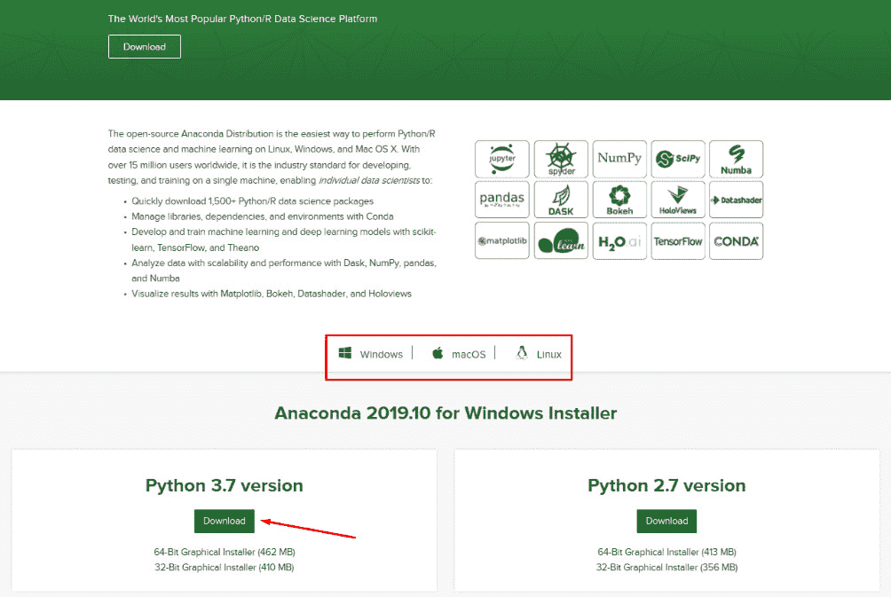
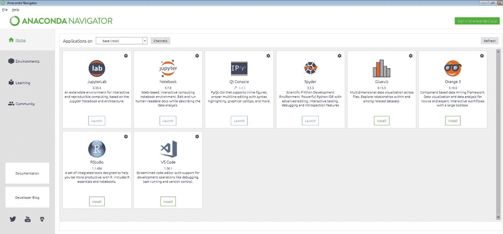
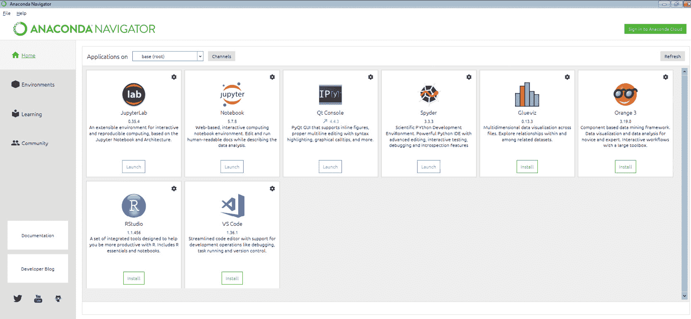
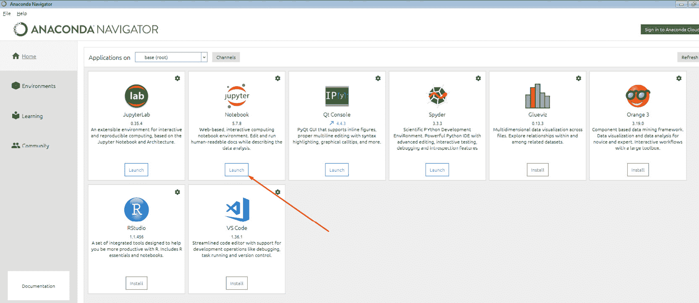

# 序言

# 关于本书

你是否对深度学习如何驱动智能应用程序感到着迷，例如自动驾驶汽车、虚拟助手、人脸识别设备和聊天机器人，用于处理数据并解决复杂问题？无论你是否熟悉机器学习，或是初学者，*《深度学习工作坊》*都将通过有趣的示例和练习，帮助你轻松理解深度学习。

本书首先强调了深度学习、机器学习和人工智能之间的关系，并通过实践练习帮助你熟悉 TensorFlow 2.0 的编程结构。你将了解神经网络、感知器的结构以及如何使用 TensorFlow 创建和训练模型。随后，本书将让你通过使用 Keras 进行图像识别练习，探索计算机视觉的基础知识。随着进展，你将能够通过实现文本嵌入和使用流行的深度学习解决方案进行数据排序，使你的模型更加强大。最后，你将掌握双向**递归神经网络**（**RNNs**），并构建**生成对抗网络**（**GANs**）用于图像合成。

在本书的最后，你将掌握使用 TensorFlow 和 Keras 构建深度学习模型所需的关键技能。

## 受众

如果你对机器学习感兴趣，并希望使用 TensorFlow 和 Keras 创建和训练深度学习模型，这个工作坊非常适合你。掌握 Python 及其包，并具备基本的机器学习概念，将帮助你快速学习这些主题。

## 章节概览

*第一章*，*深度学习的构建块*，讨论了深度学习的实际应用。一个这样的应用包括一个可以立即运行的动手代码示例，用于识别互联网上的图像。通过实践练习，你还将学习到 TensorFlow 2.0 的关键代码实现，这将帮助你在接下来的章节中构建令人兴奋的神经网络模型。

*第二章*，*神经网络*，教你人工神经网络的结构。通过使用 TensorFlow 2.0，你不仅会实现一个神经网络，还会训练它。你将建立多个不同配置的深度神经网络，从而亲身体验神经网络的训练过程。

*第三章*，*卷积神经网络（CNNs）与图像分类*，涵盖了图像处理、其工作原理以及如何将这些知识应用于卷积神经网络（CNNs）。通过实践练习，你将创建和训练 CNN 模型，用于识别手写数字甚至水果的图像。你还将学习一些关键概念，如池化层、数据增强和迁移学习。

*第四章*，*文本的深度学习 - 嵌入层*，带你进入自然语言处理的世界。你将首先进行文本预处理，这是处理原始文本数据时的一项重要技能。你将实现经典的文本表示方法，如独热编码和 TF-IDF 方法。在本章的后续部分，你将学习嵌入层，并使用 Skip-gram 和连续词袋算法生成你自己的词嵌入。

*第五章*，*序列的深度学习*，展示了如何处理一个经典的序列处理任务——股票价格预测。你将首先创建一个基于递归神经网络（RNN）的模型，然后实现一个基于 1D 卷积的模型，并将其与该 RNN 模型的表现进行比较。你将通过结合 RNN 和 1D 卷积，创建一个混合模型。

*第六章*，*LSTM，GRU 和高级 RNN*，回顾了 RNN 的实际缺点，以及长短期记忆（LSTM）模型如何帮助克服这些问题。你将构建一个分析电影评论情感的模型，并研究门控循环单元（GRU）的内部工作原理。在本章中，你将创建基于普通 RNN、LSTM 和 GRU 的模型，并在章末比较它们的表现。

*第七章*，*生成对抗网络*，介绍了生成对抗网络（GANs）及其基本组件。通过实践练习，你将使用 GANs 生成一个模拟由正弦函数生成的数据分布。你还将了解深度卷积 GANs，并在练习中实现它们。章节的后期，你将创建能够以令人信服的准确度复制图像的 GANs。

## 约定

文本中的代码词汇、数据库表名、文件夹名称、文件名、文件扩展名、路径名、虚拟网址、用户输入和 Twitter 用户名的显示方式如下：

"使用 `mnist.load_data()` 加载 MNIST 数据集"

屏幕上看到的词汇（例如，在菜单或对话框中）以相同的格式显示。

一块代码设置如下：

```py
from sklearn.preprocessing import MinMaxScaler
scaler = MinMaxScaler()
train_scaled = scaler.fit_transform(train_data)
test_scaled = scaler.transform(test_data)
```

新术语和重要单词的显示方式如下：

预处理的第一步不可避免是**分词**—将原始输入文本序列分割为**词元**。长代码片段会被截断，GitHub 上相应的代码文件名称会被放置在截断代码的顶部。指向完整代码的永久链接会被放置在代码片段下方。应如下所示：

```py
Exercise7.04.ipynb
# Function to generate real samples
def realData(loc,batch):
    """
    loc is the random location or mean 
    around which samples are centered
    """
    # Generate numbers to right of the random point
    xr = np.arange(loc,loc+(0.1*batch/2),0.1)
    xr = xr[0:int(batch/2)]
    # Generate numbers to left of the random point
    xl = np.arange(loc-(0.1*batch/2),loc,0.1)
The complete code for this step can be found at https://packt.live/3iIJHVS.
```

## 代码展示

跨多行的代码通过反斜杠（` \ `）分割。当代码执行时，Python 会忽略反斜杠，并将下一行的代码视为当前行的直接延续。

例如：

```py
history = model.fit(X, y, epochs=100, batch_size=5, verbose=1, \
                    validation_split=0.2, shuffle=False)
```

在代码中加入注释，帮助解释特定的逻辑。单行注释使用 `#` 符号表示，如下所示：

```py
# Print the sizes of the dataset
print("Number of Examples in the Dataset = ", X.shape[0])
print("Number of Features for each example = ", X.shape[1])
```

多行注释使用三引号括起来，如下所示：

```py
"""
Define a seed for the random number generator to ensure the 
result will be reproducible
"""
seed = 1
np.random.seed(seed)
random.set_seed(seed)
```

## 设置你的环境

在我们详细了解本书内容之前，我们需要设置一些特定的软件和工具。在接下来的部分中，我们将展示如何完成这些设置。

## 硬件要求

为了获得最佳的用户体验，我们推荐至少 8 GB 的内存。

## 在你的系统上安装 Anaconda

本书中的所有练习和活动将在 Jupyter Notebooks 中执行。要在 Windows、macOS 或 Linux 上安装 Jupyter，我们首先需要安装 Anaconda。安装 Anaconda 还将安装 Python。

1.  前往 [`www.anaconda.com/distribution/`](https://www.anaconda.com/distribution/) 安装 Anaconda Navigator，它是你可以访问本地 Jupyter Notebook 的界面。

1.  现在，根据你的操作系统（Windows、macOS 或 Linux），你需要下载 Anaconda 安装程序。首先选择你的操作系统，然后选择 Python 版本。本书推荐使用最新版本的 Python。

    图 0.1：Anaconda 主屏幕

1.  要检查 Anaconda Navigator 是否正确安装，请在应用程序中查找 `Anaconda Navigator`。查找下面显示的图标。然而，请注意，图标的外观可能会根据你的操作系统有所不同。

    图 0.2 Anaconda Navigator 图标

1.  点击图标打开 Anaconda Navigator。首次加载可能需要一些时间，但安装成功后，你应该会看到一个类似的界面：



图 0.3 Anaconda Navigator 图标

## 启动 Jupyter Notebook

要通过 Anaconda Navigator 启动 Jupyter Notebook，请按照以下步骤操作：

1.  打开 Anaconda Navigator。你应该会看到如下屏幕：

    图 0.4：Anaconda 安装屏幕

1.  现在，点击 `Jupyter Notebook` 面板下的 `Launch` 按钮以启动本地系统上的 notebook：



图 0.5：Jupyter Notebook 启动选项

你已经成功将 Jupyter Notebook 安装到你的系统中。你也可以通过在终端或 Anaconda 提示符中运行命令`jupyter notebook`来打开 Jupyter Notebook。

## 安装库

`pip` 会随 Anaconda 一起预安装。一旦 Anaconda 安装在你的计算机上，所有必需的库可以通过 `pip` 安装，例如 `pip install numpy`。或者，你也可以使用 `pip install –r requirements.txt` 安装所有必需的库。你可以在 [`packt.live/303E4dD`](https://packt.live/303E4dD) 找到 `requirements.txt` 文件。

练习和活动将在 Jupyter Notebooks 中执行。Jupyter 是一个 Python 库，可以像其他 Python 库一样安装——也就是使用 `pip install jupyter`，但幸运的是，它已经随 Anaconda 一起预安装。要打开一个 notebook，只需在终端或命令提示符中运行 `jupyter notebook` 命令。

## 安装 TensorFlow 2.0

在安装 TensorFlow 2.0 之前，请确保你已经在系统中安装了最新版本的 `pip`。你可以通过以下命令检查：

```py
pip --version
```

要安装 TensorFlow 2.0，你系统中的 `pip` 版本必须大于 `19.0`。你可以在 Windows、Linux 或 macOS 上使用以下命令升级 `pip` 版本：

```py
pip install --upgrade pip
```

升级后，使用以下命令在 Windows、Linux 或 macOS 上安装 TensorFlow：

```py
pip install --upgrade tensorflow
```

在 Linux 和 macOS 上，如果需要提升权限，请使用以下命令：

```py
sudo pip install --upgrade tensorflow
```

注意

TensorFlow 不支持 Windows 上的 Python 2.7。

## 安装 Keras

要在 Windows、macOS 或 Linux 上安装 Keras，请使用以下命令：

```py
pip install keras
```

在 Linux 和 macOS 上，如果需要提升权限，请使用以下命令：

```py
sudo pip install keras
```

## 访问代码文件

你可以在 [`packt.live/3edmwj4`](https://packt.live/3edmwj4) 找到本书的完整代码文件。你还可以通过使用位于 [`packt.live/2CGCWUz`](https://packt.live/2CGCWUz) 的互动实验环境，在浏览器中直接运行许多活动和练习。

我们尽力支持所有活动和练习的交互式版本，但我们也推荐进行本地安装，以防该支持不可用的情况。

注意

本书包含某些从 CSV 文件读取数据的代码片段。假设这些 CSV 文件与 Jupyter Notebook 存储在同一文件夹中。如果你将它们存储在其他位置，你需要修改路径。

如果你在安装过程中遇到任何问题或有疑问，请通过电子邮件联系我们：`workshops@packt.com`。
