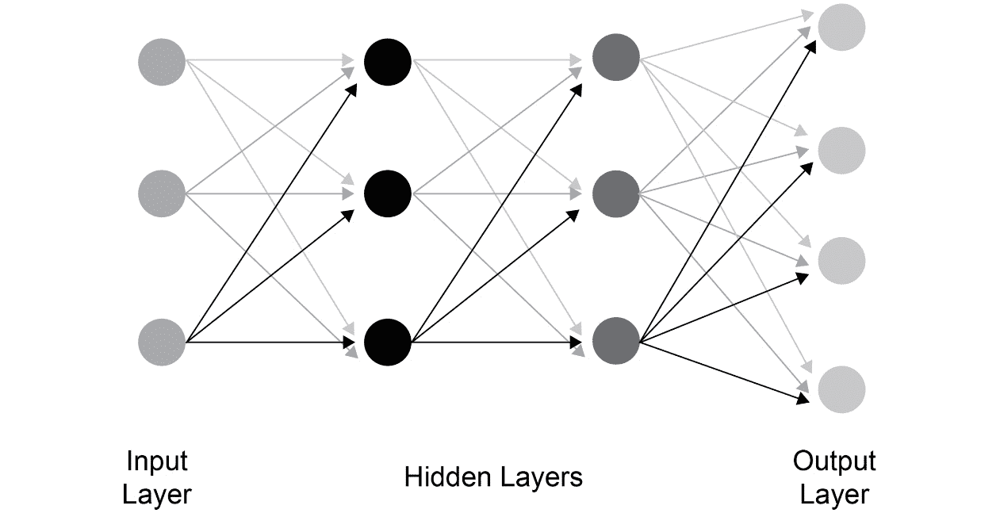

# 第一章：1\. 深度学习的构建模块

介绍

在本章中，你将了解深度学习及其与人工智能和机器学习的关系。我们还将学习一些重要的深度学习架构，如多层感知器、卷积神经网络、递归神经网络和生成对抗网络。随着我们深入学习，你将通过实践体验 TensorFlow 框架，并使用它来实现一些线性代数操作。最后，我们将了解优化器的概念。通过利用它们来解决二次方程式，我们将理解优化器在深度学习中的作用。到本章结束时，你将对深度学习的概念和如何使用 TensorFlow 进行编程有一个清晰的了解。

# 介绍

你刚刚从每年的假期回来。作为一个活跃的社交媒体用户，你忙着将照片上传到你最喜欢的社交媒体应用。当照片上传后，你注意到应用会自动识别你的面部并几乎瞬间标记你。事实上，它甚至在群体照片中也能做到这一点。即使在一些光线较差的照片中，你也注意到应用大多数时候能正确标记你。那应用程序是如何学习做这些事情的呢？

要在照片中识别一个人，应用程序需要准确的信息，如此人的面部结构、骨骼结构、眼睛颜色以及许多其他细节。但当你使用这个照片应用程序时，你并不需要将所有这些细节明确地提供给应用程序。你所做的只是上传照片，应用程序就会自动开始识别你。那应用程序是如何知道这些细节的呢？

当你第一次将照片上传到应用时，应用程序会要求你标记自己。当你手动标记自己时，应用程序会自动“学习”关于你面部的所有信息。然后，每次你上传照片时，应用程序就会利用它学到的信息来识别你。当你在应用错误标记你时，手动标记自己能够帮助它改进。

该应用程序能够在最小化人工干预的情况下学习新细节并自我改进，这得益于**深度学习**（**DL**）的强大功能。深度学习是**人工智能**（**AI**）的一部分，通过识别标记数据中的模式帮助机器学习。但等一下，这不就是**机器学习**（**ML**）的功能吗？那么，深度学习和机器学习之间有什么区别呢？人工智能、机器学习和深度学习等领域之间的交集点是什么？让我们快速了解一下。

## 人工智能、机器学习与深度学习

人工智能是计算机科学的一个分支，旨在开发能够模拟人类智能的机器。人类智能可以简化为基于来自我们五感——视力、听力、触觉、嗅觉和味觉——的输入来做出决策。AI 并不是一个新领域，自 1950 年代以来就已有发展。此后，这个领域经历了多次高潮与低谷。进入 21 世纪，随着计算能力的飞跃、数据的丰富和对理论基础的更好理解，AI 迎来了复兴。机器学习和深度学习是 AI 的子领域，并且越来越多地被交替使用。

下图展示了 AI、ML 和 DL 之间的关系：


图 1.1：AI、ML 和 DL 之间的关系

## 机器学习

机器学习是 AI 的一个子集，通过识别数据中的模式并提取推论来执行特定任务。从数据中得出的推论随后用于预测未知数据的结果。机器学习与传统计算机编程在解决特定任务的方法上有所不同。在传统的计算机编程中，我们编写并执行特定的业务规则和启发式算法来获得期望的结果。然而，在机器学习中，这些规则和启发式算法并没有被明确编写。这些规则和启发式算法是通过提供数据集进行学习的。用于学习这些规则和启发式算法的数据集称为**训练数据集**。整个学习和推断的过程称为**训练**。

学习规则和启发式算法是通过使用不同的算法来完成的，这些算法采用统计模型来实现这一目的。这些算法利用多种数据表示方式进行学习。每种数据的表示方式称为**示例**。示例中的每个元素称为**特征**。以下是著名的 IRIS 数据集的一个示例（[`archive.ics.uci.edu/ml/datasets/Iris`](https://archive.ics.uci.edu/ml/datasets/Iris)）。该数据集表示了不同种类的鸢尾花，基于不同的特征，如萼片和花瓣的长度与宽度：


图 1.2：IRIS 数据集的样本数据

在前面的数据集中，每一行数据代表一个例子，每一列是一个特征。机器学习算法利用这些特征从数据中推断出结论。模型的准确性，以及预测结果的可靠性，很大程度上依赖于数据的特征。如果提供给机器学习算法的特征能够很好地代表问题陈述，那么得到好结果的机会就会很高。一些常见的机器学习算法包括*线性回归*、*逻辑回归*、*支持向量机*、*随机森林*和*XGBoost*。

尽管传统的机器学习算法在许多应用场景中都很有用，但它们在获得优异结果时，非常依赖于特征的质量。特征的创建是一门耗时的艺术，且需要大量的领域知识。然而，即便拥有全面的领域知识，仍然存在将这些知识转化为特征的局限性，进而无法很好地封装数据生成过程中的细微差别。此外，随着机器学习所解决问题的复杂性增加，特别是非结构化数据（如图像、语音、文本等）的出现，几乎不可能创建能够表示复杂函数的特征，这些复杂函数反过来又生成数据。因此，往往需要找到一种不同的方法来解决复杂问题，这时深度学习就派上了用场。

## 深度学习

深度学习是机器学习的一个子集，是一种称为人工神经网络（ANN）的算法的扩展。神经网络并不是一种新现象。神经网络的创建可以追溯到 20 世纪 40 年代的上半期。神经网络的开发灵感来自于对人类大脑运作方式的了解。从那时起，这一领域经历了几次高潮和低谷。一个重新激发人们对神经网络兴趣的关键时刻是由该领域的巨头们，如 Geoffrey Hinton，提出的反向传播算法。正因为如此，Hinton 被广泛认为是“深度学习的教父”。我们将在*第二章*《神经网络》中深入讨论神经网络。

多层（深层）人工神经网络（ANNs）是深度学习的核心。深度学习模型的一个显著特点是其能够从输入数据中学习特征。与传统的机器学习不同，后者需要手动创建特征，深度学习擅长从多个层次学习不同的特征层级。例如，假设我们使用一个深度学习模型来检测人脸。模型的初始层会学习面部的低级近似特征，如面部的边缘，如*图 1.3*所示。每个后续层会将前一层的特征组合起来，形成更复杂的特征。在人脸检测的例子中，如果初始层学会了检测边缘，后续层将这些边缘组合起来，形成面部的一部分，如鼻子或眼睛。这个过程在每一层继续进行，直到最后一层生成一个完整的人脸图像：


图 1.3：用于检测人脸的深度学习模型

注意

上述图片来自于一篇流行的研究论文：Lee, Honglak & Grosse, Roger & Ranganath, Rajesh & Ng, Andrew. (2011). *无监督学习层次表示与卷积深度置信网络.* Commun. ACM. 54\. 95-103\. 10.1145/2001269.2001295.

深度学习技术在过去十年中取得了巨大的进步。多个因素促使了深度学习技术的指数增长，其中最重要的因素是大量数据的可用性。数字时代，随着越来越多设备的互联，产生了大量数据，特别是非结构化数据。这反过来促进了深度学习技术的大规模应用，因为它们非常适合处理大量的非结构化数据。

深度学习崛起的另一个重要因素是计算基础设施的进步。深度学习模型通常包含大量层次和数百万个参数，因此需要强大的计算能力。图形处理单元（**GPU**）和张量处理单元（**TPU**）等计算层次的进步，以合理的成本提供了强大的计算能力，从而推动了深度学习的广泛应用。

深度学习的普及还得益于不同框架的开源，这些框架用于构建和实现深度学习模型。2015 年，Google Brain 团队开源了 TensorFlow 框架，自那时以来，TensorFlow 已成长为最受欢迎的深度学习框架之一。其他主要的框架包括 PyTorch、MXNet 和 Caffe。本书将使用 TensorFlow 框架。

在我们深入探讨深度学习的构建块之前，让我们通过一个简短的演示来实际体验深度学习模型的强大功能。你不需要了解演示中的所有代码。只需按照指示操作，你就能快速了解深度学习的基本能力。

## 使用深度学习分类图像

在接下来的练习中，我们将分类一个披萨的图像，并将分类结果的文本转换为语音。为了对图像进行分类，我们将使用一个预训练的模型。文本转语音将使用一个免费提供的 API——**Google 文本转语音**（**gTTS**）来完成。在开始之前，让我们先了解一些这个演示的关键构建块。

### 预训练模型

训练一个深度学习模型需要大量的计算资源和时间，并且需要庞大的数据集。然而，为了促进研究和学习，深度学习社区也提供了在大数据集上训练好的模型。这些预训练模型可以下载并用于预测，或者用于进一步训练。在本次演示中，我们将使用一个名为`ResNet50`的预训练模型。这个模型与 Keras 包一起提供。这个预训练模型能够预测我们日常生活中遇到的 1,000 种不同类型的物体，比如鸟类、动物、汽车等。

### Google 文本转语音 API

Google 已经将其文本转语音算法开放供有限使用。我们将使用这个算法将预测的文本转换为语音。

### 演示所需的先决条件包

为了让这个演示正常工作，你需要在机器上安装以下包：

+   TensorFlow 2.0

+   Keras

+   gTTS

请参考*前言*以了解安装前两个包的过程。安装 gTTS 将在练习中展示。接下来，让我们深入了解演示。

## 练习 1.01：图像和语音识别演示

在本次练习中，我们将演示使用深度学习模型进行图像识别和语音转文本的转换。此时，你可能无法理解代码中的每一行，这将在后续讲解中解释。现在，只需执行代码，了解使用 TensorFlow 构建深度学习和人工智能应用程序有多么简单。按照以下步骤完成本次练习：

1.  打开一个 Jupyter Notebook 并命名为*练习 1.01*。关于如何启动 Jupyter Notebook 的详细信息，请参阅前言。

1.  导入所有必需的库：

    ```py
    from tensorflow.keras.preprocessing.image import load_img
    from tensorflow.keras.preprocessing.image import img_to_array
    from tensorflow.keras.applications.resnet50 import ResNet50
    from tensorflow.keras.preprocessing import image
    from tensorflow.keras.applications.resnet50 \
    import preprocess_input
    from tensorflow.keras.applications.resnet50 \
    import decode_predictions
    \ ) to split the logic across multiple lines. When the code is executed, Python will ignore the backslash, and treat the code on the next line as a direct continuation of the current line.
    ```

    这里简要描述我们将要导入的包：

    `load_img`：将图像加载到 Jupyter Notebook 中

    `img_to_array`：将图像转换为 NumPy 数组，这是 Keras 所需的格式

    `preprocess_input`：将输入转换为模型可以接受的格式

    `decode_predictions`：将模型预测的数值输出转换为文本标签

    `Resnet50`：这是一个预训练的图像分类模型

1.  创建一个预训练的`Resnet`模型实例：

    ```py
    mymodel = ResNet50()
    ```

    下载过程中你应收到类似以下的消息：

    

    图 1.4：加载 Resnet50

    `Resnet50`是一个预训练的图像分类模型。对于首次使用者，下载模型到你的环境中需要一些时间。

1.  从互联网上下载一张披萨的图片，并将其保存在运行 Jupyter Notebook 的同一文件夹中。将图片命名为`im1.jpg`。

    注意

    你还可以通过此链接下载我们使用的图片：[`packt.live/2AHTAC9`](https://packt.live/2AHTAC9)

1.  使用以下命令加载待分类的图片：

    ```py
    myimage = load_img('im1.jpg', target_size=(224, 224))
    ```

    如果你将图片保存在另一个文件夹中，则必须提供图片所在位置的完整路径，代替`im1.jpg`命令。例如，如果图片保存在`D:/projects/demo`中，代码应如下所示：

    ```py
    myimage = load_img('D:/projects/demo/im1.jpg', \
                       target_size=(224, 224))
    ```

1.  我们通过以下命令来显示图片：

    ```py
    myimage
    ```

    上述命令的输出将如下所示：

    

    图 1.5：加载图片后显示的输出

1.  将图片转换为`numpy`数组，因为模型期望它是这种格式：

    ```py
    myimage = img_to_array(myimage)
    ```

1.  将图片调整为四维格式，因为这是模型期望的格式：

    ```py
    myimage = myimage.reshape((1, 224, 224, 3))
    ```

1.  通过运行`preprocess_input()`函数准备图片以供提交：

    ```py
    myimage = preprocess_input(myimage)
    ```

1.  运行预测：

    ```py
    myresult = mymodel.predict(myimage)
    ```

1.  预测结果是一个数字，需要将其转换为相应的文本格式标签：

    ```py
    mylabel = decode_predictions(myresult)
    ```

1.  接下来，键入以下代码以显示标签：

    ```py
    mylabel = mylabel[0][0]
    ```

1.  使用以下代码打印标签：

    ```py
    print("This is a : " + mylabel[1])
    ```

    如果到目前为止你已正确按照步骤操作，输出结果将如下所示：

    ```py
    This is a : pizza
    ```

    模型已成功识别我们的图片。很有趣，不是吗？接下来的几个步骤，我们将进一步处理，将这个结果转化为语音。

    小贴士

    虽然我们在这里使用了一张披萨的图片，但你可以使用任何图片来进行模型测试。我们建议你多次尝试使用不同的图片进行此练习。

1.  准备要转换为语音的文本：

    ```py
    sayit="This is a "+mylabel[1]
    ```

1.  安装`gtts`包，该包用于将文本转换为语音。可以在 Jupyter Notebook 中按如下方式实现：

    ```py
    !pip install gtts
    ```

1.  导入所需的库：

    ```py
    from gtts import gTTS
    import os
    ```

    上述代码将导入两个库。一个是`gTTS`，即 Google 文本转语音服务，这是一个基于云的开源 API，用于将文本转换为语音。另一个是`os`库，用于播放生成的音频文件。

1.  调用`gTTS` API 并将文本作为参数传递：

    ```py
    myobj = gTTS(text=sayit)
    ```

    注意

    运行上述步骤时，你需要保持在线状态。

1.  保存生成的音频文件。该文件将保存在运行 Jupyter Notebook 的主目录中。

    ```py
    myobj.save("prediction.mp3")
    ```

    注意

    你还可以通过在文件名之前指定绝对路径来设置保存位置；例如，`(myobj.save('D:/projects/prediction.mp3')`。

1.  播放音频文件：

    ```py
    os.system("prediction.mp3")
    ```

    如果你正确地遵循了前面的步骤，你将听到`This is a pizza`的语音。

    注

    要访问此特定部分的源代码，请参考[`packt.live/2ZPZx8B`](https://packt.live/2ZPZx8B)。

    你也可以在[`packt.live/326cRIu`](https://packt.live/326cRIu)在线运行这个示例。你必须执行整个笔记本才能获得预期的结果。

在这个练习中，我们学习了如何通过使用公共可用的模型并用几行代码在 TensorFlow 中构建深度学习模型。现在你已经体验了深度学习，让我们继续前进，了解深度学习的不同构建块。

## 深度学习模型

大多数流行的深度学习模型的核心是人工神经网络（ANN），其灵感来源于我们对大脑工作原理的认识。虽然没有任何单一模型可以称为完美，但不同的模型在不同的场景下表现更好。在接下来的章节中，我们将了解一些最突出的模型。

### 多层感知器

**多层感知器**（**MLP**）是一种基本的神经网络类型。MLP 也被称为前馈网络。以下图所示可以看到 MLP 的表示：



图 1.6：MLP 表示

多层感知器（MLP，或任何神经网络）的基本构建块之一是神经元。一个网络由多个神经元连接到后续的层。非常基础的 MLP 由输入层、隐藏层和输出层组成。输入层的神经元数量与输入数据相等。每个输入神经元将与隐藏层的所有神经元相连接。最终的隐藏层将与输出层连接。MLP 是一个非常有用的模型，可以尝试应用于各种分类和回归问题。MLP 的概念将在*第二章*，*神经网络*中详细介绍。

### 卷积神经网络

卷积神经网络（CNN）是一类深度学习模型，主要用于图像识别。当我们讨论 MLP 时，我们看到每一层的神经元都与后续层的每个神经元相连接。然而，CNN 采用了不同的方法，并没有使用这种完全连接的架构。相反，CNN 从图像中提取局部特征，然后将这些特征传递到后续层。

CNN 在 2012 年崭露头角，当时名为 AlexNet 的架构在一个名为**ImageNet 大规模视觉识别挑战赛**（**ILSVRC**）的顶级竞赛中获胜。ILSVRC 是一个大规模计算机视觉竞赛，全球各地的团队竞相争夺最佳计算机视觉模型的奖项。在 2012 年的研究论文《*ImageNet 分类与深度卷积神经网络*》([`papers.nips.cc/paper/4824-imagenet-classification-with-deep-convolutional-neural-networks`](https://papers.nips.cc/paper/4824-imagenet-classification-with-deep-convolutional-neural-networks))中，Alex Krizhevsky 等人（多伦多大学）展示了 CNN 架构的真正强大力量，最终赢得了 2012 年 ILSVRC 挑战赛。下图展示了*AlexNet*模型的结构，这是一个 CNN 模型，其卓越的性能使得 CNN 在深度学习领域声名鹊起。尽管这个模型的结构看起来可能对你来说比较复杂，但在*第三章*《卷积神经网络图像分类》中，这种 CNN 网络的工作原理会被详细讲解：


图 1.7：AlexNet 模型的 CNN 架构

注意

上述图表来源于著名的研究论文：Krizhevsky, Alex & Sutskever, Ilya & Hinton, Geoffrey. (2012). *ImageNet 分类与深度卷积神经网络*。神经信息处理系统。25. 10.1145/3065386。

自 2012 年以来，许多突破性的 CNN 架构扩展了计算机视觉的可能性。一些著名的架构有 ZFNet、Inception（GoogLeNet）、VGG 和 ResNet。

CNN 应用最为显著的一些用例如下：

+   图像识别和**光学字符识别**（**OCR**）

+   社交媒体上的人脸识别

+   文本分类

+   自动驾驶汽车的物体检测

+   医疗健康领域的图像分析

使用深度学习的另一个巨大好处是，你不必总是从零开始构建模型——你可以使用他人已经构建的模型，并将其用于自己的应用。这就是所谓的“迁移学习”，它使你能够从活跃的深度学习社区中受益。

我们将在*第三章*《卷积神经网络图像分类》中应用迁移学习于图像处理，并详细了解 CNN 及其动态。

### 循环神经网络

在传统的神经网络中，输入与输出是相互独立的。然而，在语言翻译等场景中，单词前后存在依赖关系，因此需要理解单词出现顺序的动态特性。这个问题通过一种被称为**循环神经网络**（**RNNs**）的网络类别得到了解决。RNNs 是一类深度学习网络，其中前一步的输出作为当前步骤的输入。RNN 的一个显著特点是隐藏层，它能够记住序列中其他输入的信息。以下图可以看到 RNN 的高级表示。你将在*第五章*，*深度学习与序列*中深入了解这些网络的内部工作原理：


图 1.8：RNN 的结构

RNN 架构有不同的类型。其中一些最著名的类型是**长短时记忆网络**（**LSTM**）和**门控循环单元**（**GRU**）。

RNN 的一些重要应用案例如下：

+   语言建模与文本生成

+   机器翻译

+   语音识别

+   生成图像描述

RNN 将在*第五章*，*深度学习与序列*和*第六章*，*LSTMs、GRUs 及高级 RNN*中详细讲解。

## 生成对抗网络

**生成对抗网络**（**GANs**）是一种能够生成与任何真实数据分布相似的数据分布的网络。深度学习的先驱之一 Yann LeCun 曾表示，GANs 是过去十年中深度学习领域最具前景的想法之一。

举个例子，假设我们想从随机噪声数据生成狗的图像。为此，我们训练一个 GAN 网络，使用真实的狗的图像和噪声数据，直到我们生成的图像看起来像真实的狗的图像。以下图解释了 GAN 的基本概念。在这个阶段，你可能还不完全理解这个概念。它将在*第七章*，*生成对抗网络*中详细讲解。


图 1.9：GANs 的结构

注意

上述图表来源于一篇流行的研究论文：Barrios, Buldain, Comech, Gilbert & Orue (2019)。*利用深度学习方法进行局部放电分类——最近进展综述*（[`doi.org/10.3390/en12132485`](https://doi.org/10.3390/en12132485)）。

GANs 是一个重要的研究领域，并且有许多应用案例。以下是一些 GANs 的有用应用：

+   图像翻译

+   文本到图像合成

+   生成视频

+   艺术修复

GANs 将在*第七章*，*生成对抗网络*中详细讲解。

深度学习的可能性和前景是巨大的。深度学习应用已无处不在，成为我们日常生活的一部分。以下是一些显著的例子：

+   聊天机器人

+   机器人

+   智能音响（例如 Alexa）

+   虚拟助手

+   推荐引擎

+   无人机

+   自动驾驶汽车或自动化车辆

这种不断扩展的可能性画布使它成为数据科学家工具箱中的一个重要工具。本书将逐步引导你进入深度学习的奇妙世界，并使你能够将其应用于现实世界的场景。

# TensorFlow 简介

TensorFlow 是由 Google 开发的深度学习库。在撰写本书时，TensorFlow 是迄今为止最流行的深度学习库。最初，它由 Google 内部的一个团队——Google Brain 团队开发，用于内部使用，并于 2015 年开源。Google Brain 团队开发了像 Google Photos 和 Google Cloud Speech-to-Text 这样的流行应用，这些应用基于 TensorFlow，属于深度学习应用。TensorFlow 1.0 于 2017 年发布，并在短时间内超越了其他现有的库，如 Caffe、Theano 和 PyTorch，成为最受欢迎的深度学习库。它被认为是行业标准，几乎每个从事深度学习的组织都在使用它。TensorFlow 的一些关键特点如下：

+   它可以与所有常见的编程语言一起使用，如 Python、Java 和 R。

+   它可以部署在多个平台上，包括 Android 和 Raspberry Pi。

+   它可以以高度分布的模式运行，因此具有高度的可扩展性。

在经历了长时间的 Alpha/Beta 发布后，TensorFlow 2.0 的最终版本于 2019 年 9 月 30 日发布。TF2.0 的重点是使深度学习应用的开发更加简便。接下来我们将一起了解 TensorFlow 2.0 框架的基础知识。

**张量**

在 TensorFlow 程序中，每个数据元素都叫做**张量**。张量是向量和矩阵在更高维度下的表示。张量的秩表示其维度。以下是一些常见的数据形式，以张量的形式表示：

**标量**

标量是秩为 0 的张量，它只有大小。

例如，`[ 12 ]` 是一个大小为 12 的标量。

**向量**

向量是秩为 1 的张量。

例如，`[ 10 , 11, 12, 13]`。

**矩阵**

矩阵是秩为 2 的张量。

例如，`[ [10,11] , [12,13] ]`。这个张量有两行两列。

**秩为 3 的张量**

这是一个三维张量。例如，图像数据通常是一个三维张量，具有宽度、高度和通道数作为其三个维度。以下是一个三维张量的例子，即它有两行、三列和三个通道：


图 1.10：三维张量

张量的形状由一个数组表示，表示每个维度中的元素个数。例如，如果一个张量的形状是 [2,3,5]，这意味着该张量有三个维度。如果这是图像数据，则此形状表示该张量有两行、三列和五个通道。我们还可以从形状中获取秩。在这个例子中，张量的秩是三，因为有三个维度。下面的图示进一步说明了这一点：


图 1.11：张量的秩和形状示例

## 常量

常量用于存储在程序执行过程中不会被改变或修改的值。创建常量有多种方式，最简单的一种如下：

```py
a = tf.constant (10)
```

这将创建一个初始化为 10 的张量。请记住，常量的值不能通过重新赋值来更新或修改。另一个示例如下：

```py
s = tf.constant("Hello")
```

在这一行中，我们正在将一个字符串实例化为常量。

## 变量

变量用于存储在程序执行过程中可以更新和修改的数据。我们将在*第二章*，*神经网络*中详细讨论这一点。创建变量有多种方式，最简单的一种如下：

```py
b=tf.Variable(20)
```

在前面的代码中，变量`b`被初始化为`20`。请注意，在 TensorFlow 中，与常量不同，`Variable` 这个术语的首字母是大写的。

变量可以在程序执行过程中重新赋予不同的值。变量可以用于赋值任何类型的对象，包括标量、向量和多维数组。以下是如何在 TensorFlow 中创建一个维度为 3 x 3 的数组的示例：

```py
C = tf.Variable([[1,2,3],[4,5,6],[7,8,9]])
```

这个变量可以初始化为一个 3 x 3 的矩阵，如下所示：


图 1.12：3 x 3 矩阵

现在我们已经了解了 TensorFlow 的一些基本概念，接下来让我们学习如何将它们付诸实践。

### 在 TensorFlow 中定义函数

在 Python 中可以使用以下语法创建函数：

```py
def myfunc(x,y,c):
    Z=x*x*y+y+c
    return Z
```

使用特殊运算符`def`来初始化一个函数，接着是函数的名称`myfunc`，以及函数的参数。在前面的示例中，函数体位于第二行，最后一行返回输出。

在接下来的练习中，我们将学习如何使用之前定义的变量和常量来实现一个简单的函数。

## 练习 1.02：实现一个数学方程

在本练习中，我们将使用 TensorFlow 求解以下数学方程：


图 1.13：使用 TensorFlow 求解的数学方程

我们将使用 TensorFlow 来求解它，如下所示：

```py
X=3
Y=4
```

虽然有多种方法可以实现这一点，但在本练习中我们只会探索其中的一种方法。按照以下步骤完成此练习：

1.  打开一个新的 Jupyter Notebook，并将其重命名为*Exercise 1.02*。

1.  使用以下命令导入 TensorFlow 库：

    ```py
    import tensorflow as tf
    ```

1.  现在，让我们解这个方程。为此，你需要创建两个变量，`X`和`Y`，并分别将它们初始化为给定的值`3`和`4`：

    ```py
    X=tf.Variable(3)
    Y=tf.Variable(4)
    ```

1.  在我们的方程中，`2`的值没有变化，因此我们将它作为常量存储，代码如下：

    ```py
    C=tf.constant(2)
    ```

1.  定义一个函数来解决我们的方程：

    ```py
    def myfunc(x,y,c):
        Z=x*x*y+y+c
        return Z
    ```

1.  通过传递`X`，`Y`和`C`作为参数来调用该函数。我们将把该函数的输出存储在一个名为`result`的变量中：

    ```py
    result=myfunc(X,Y,C)
    ```

1.  使用`tf.print()`函数打印结果：

    ```py
    tf.print(result)
    ```

    输出结果如下：

    ```py
    42
    ```

    注意

    若要访问该部分的源代码，请参阅[`packt.live/2ClXKjj`](https://packt.live/2ClXKjj)。

    你也可以在[`packt.live/2ZOIN1C`](https://packt.live/2ZOIN1C)上运行这个示例。你必须执行整个 Notebook 才能得到预期的结果。

在这个练习中，我们学习了如何定义和使用一个函数。熟悉 Python 编程的人会注意到，这与正常的 Python 代码没有太大区别。

在本章的其余部分，我们将通过学习一些基本的线性代数，并熟悉一些常见的向量运算，为下一章的神经网络做准备，这样理解神经网络就会更加容易。

## 使用 TensorFlow 进行线性代数

在神经网络中使用的最重要的线性代数主题是矩阵乘法。在这一节中，我们将解释矩阵乘法的原理，并使用 TensorFlow 的内置函数解决一些矩阵乘法的示例。这对下一章神经网络的准备工作至关重要。

矩阵乘法是如何工作的？你可能在高中时学过这个内容，但让我们快速回顾一下。

假设我们需要执行两个矩阵 A 和 B 之间的矩阵乘法，其中我们有以下内容：


图 1.14：矩阵 A


图 1.15：矩阵 B

第一步是检查一个 2x3 的矩阵乘以一个 3x2 的矩阵是否可能。矩阵乘法有一个前提条件。记住 C=R，即第一个矩阵的列数(C)应当等于第二个矩阵的行数(R)。并且要记住顺序很重要，这也是为什么 A x B 不等于 B x A。在这个例子中，C=3，R=3。所以，乘法是可能的。

结果矩阵的行数将与 A 相同，列数将与 B 相同。因此，在这种情况下，结果将是一个 2x2 的矩阵。

要开始乘法运算，取 A 的第一行（R1）和 B 的第一列（C1）的元素：


图 1.16：矩阵 A(R1)


图 1.17：矩阵 B(C1)

获取按元素乘积的和，即 (1 x 7) + (2 x 9) + (3 x 11) = 58。这个将是结果 2 x 2 矩阵中的第一个元素。我们暂时称这个为不完整矩阵 D(i)：


图 1.18：不完整矩阵 D(i)

重复此操作，使用 A 的第一行（R1）和 B 的第二列（C2）：


图 1.19：矩阵 A 的第一行


图 1.20：矩阵 B 的第二列

获取对应元素的乘积之和，即 (1 x 8) + (2 x 10) + (3 x 12) = 64。这个将是结果矩阵中的第二个元素：


图 1.21：矩阵 D(i) 的第二个元素

使用第二行重复相同的操作，以得到最终结果：


图 1.22：矩阵 D

相同的矩阵乘法可以通过 TensorFlow 中的内置方法 `tf.matmul()` 来执行。需要相乘的矩阵必须作为变量传递给模型，如下例所示：

```py
C = tf.matmul(A,B)
```

在前面的例子中，A 和 B 是我们要进行乘法运算的矩阵。我们通过使用 TensorFlow 来练习这个方法，进行我们手动计算过的两个矩阵的乘法。

## 练习 1.03：使用 TensorFlow 进行矩阵乘法

在这个练习中，我们将使用 `tf.matmul()` 方法通过 `tensorflow` 进行两个矩阵的乘法运算。按照以下步骤完成此练习：

1.  打开一个新的 Jupyter Notebook，并将其重命名为 *Exercise 1.03*。

1.  导入 `tensorflow` 库并创建两个变量 `X` 和 `Y`，它们是矩阵。`X` 是一个 2 x 3 的矩阵，`Y` 是一个 3 x 2 的矩阵：

    ```py
    import tensorflow as tf
    X=tf.Variable([[1,2,3],[4,5,6]])
    Y=tf.Variable([[7,8],[9,10],[11,12]])
    ```

1.  打印并显示 `X` 和 `Y` 的值，确保矩阵正确创建。我们首先打印 `X` 的值：

    ```py
    tf.print(X)
    ```

    输出结果如下：

    ```py
    [[1 2 3]
     [4 5 6]]
    ```

    现在，让我们打印 `Y` 的值：

    ```py
    tf.print(Y)
    ```

    输出结果如下：

    ```py
    [[7 8]
     [9 10]
     [11 12]]
    ```

1.  通过调用 TensorFlow 的 `tf.matmul()` 函数执行矩阵乘法：

    ```py
    c1=tf.matmul(X,Y)
    ```

    为了显示结果，打印 `c1` 的值：

    ```py
    tf.print(c1)
    ```

    输出结果如下：

    ```py
    [[58 64]
     [139 154]]
    ```

1.  让我们通过改变矩阵的顺序来执行矩阵乘法：

    ```py
    c2=tf.matmul(Y,X)
    ```

    为了显示结果，让我们打印 `c2` 的值：

    ```py
    tf.print(c2)
    ```

    结果输出如下：

    ```py
    [[39 54 69]
     [49 68 87]
     [59 82 105]]
    ```

    请注意，由于我们改变了顺序，结果不同。

    注意

    要访问该特定部分的源代码，请参考 [`packt.live/3eevyw4`](https://packt.live/3eevyw4)。

    你还可以在线运行这个示例，网址为 [`packt.live/2CfGGvE`](https://packt.live/2CfGGvE)。你必须执行整个 Notebook 才能得到预期的结果。

在这个练习中，我们学习了如何在 TensorFlow 中创建矩阵，以及如何执行矩阵乘法。这在我们创建自己的神经网络时将会非常有用。

## reshape 函数

如名称所示，`reshape` 函数可以改变张量的形状，将其从当前形状转换为新的形状。例如，你可以将一个 2 × 3 的矩阵重塑为 3 × 2 的矩阵，如下所示：


图 1.23：重塑后的矩阵

让我们考虑以下 2 × 3 的矩阵，它是我们在前一个练习中定义的：

```py
X=tf.Variable([[1,2,3],[4,5,6]])
```

我们可以使用以下代码打印矩阵的形状：

```py
X.shape
```

从以下输出中，我们可以看到形状，这是我们已经知道的：

```py
TensorShape([2, 3])
```

现在，要将 `X` 重塑为一个 3 × 2 的矩阵，TensorFlow 提供了一个方便的函数，叫做 `tf.reshape()`。该函数通过以下参数来实现：

```py
tf.reshape(X,[3,2])
```

在前面的代码中，`X` 是需要重塑的矩阵，`[3,2]` 是 `X` 矩阵需要重塑成的新形状。

重塑矩阵是实现神经网络时常用的操作。例如，在使用 CNN 处理图像时，图像必须是 3 维的，也就是说，它必须有三个维度：宽度、高度和深度。如果我们的图像是一个只有两个维度的灰度图像，那么 `reshape` 操作就能派上用场，来添加第三个维度。在这种情况下，第三个维度的大小将是 1：


图 1.24：使用 reshape() 改变维度

在前面的图中，我们将一个形状为 `[5,4]` 的矩阵重新调整为形状为 `[5,4,1]` 的矩阵。在接下来的练习中，我们将使用 `reshape()` 函数将一个 `[5,4]` 矩阵进行重塑。

在实现 `reshape()` 函数时，有一些重要的注意事项：

+   新形状中的元素总数应与原始形状中的元素总数相等。例如，你可以将一个 2 × 3 的矩阵（总共 6 个元素）重塑为 3 × 2 的矩阵，因为新形状也有 6 个元素。但是，你不能将它重塑为 3 × 3 或 3 × 4。

+   `reshape()` 函数不应与 `transpose()` 混淆。在 `reshape()` 中，矩阵元素的顺序保持不变，元素在新形状中按照相同的顺序重新排列。然而，在 `transpose()` 的情况下，行变成列，列变成行。因此，元素的顺序会发生变化。

+   `reshape()` 函数不会改变原始矩阵，除非你将新形状赋值给它。否则，它只是显示新形状，而并不会实际更改原始变量。例如，假设 `x` 的形状是 [2,3]，你只是执行了 `tf.reshape(x,[3,2])`。当你再次检查 `x` 的形状时，它依然是 [2,3]。为了实际改变形状，你需要将新形状赋值给它，像这样：

    ```py
    x=tf.reshape(x,[3,2])
    ```

让我们在接下来的练习中尝试在 TensorFlow 中实现 `reshape()`。

## 练习 1.04：使用 TensorFlow 中的 reshape() 函数重塑矩阵

在本练习中，我们将使用`reshape()`函数将一个`[5,4]`的矩阵重塑为`[5,4,1]`的形状。这个练习将帮助我们理解如何使用`reshape()`来改变张量的秩。按照以下步骤完成此练习：

1.  打开一个 Jupyter Notebook 并将其重命名为*练习 1.04*。然后，导入`tensorflow`并创建我们想要重塑的矩阵：

    ```py
    import tensorflow as tf
    A=tf.Variable([[1,2,3,4], \
                   [5,6,7,8], \
                   [9,10,11,12], \
                   [13,14,15,16], \
                   [17,18,19,20]])
    ```

1.  首先，我们将打印变量`A`，以检查它是否已正确创建，使用以下命令：

    ```py
    tf.print(A)
    ```

    输出结果如下：

    ```py
    [[1 2 3 4]
     [5 6 7 8]
     [9 10 11 12]
     [13 14 15 16]
     [17 18 19 20]]
    ```

1.  让我们打印一下`A`的形状，以确保正确：

    ```py
    A.shape
    ```

    输出结果如下：

    ```py
    TensorShape([5, 4])
    ```

    当前它的秩是 2。我们将使用`reshape()`函数将其秩更改为 3。

1.  现在，我们将使用以下命令将`A`重塑为形状`[5,4,1]`。我们加入了`print`命令，以便查看输出结果：

    ```py
    tf.print(tf.reshape(A,[5,4,1]))
    ```

    我们将得到以下输出：

    ```py
    [[[1]
      [2]
      [3]
      [4]]
     [[5]
      [6]
      [7]
      [8]]
     [[9]
      [10]
      [11]
      [12]]
     [[13]
      [14]
      [15]
      [16]]
     [[17]
      [18]
      [19]
      [20]]]
    ```

    这按预期工作。

1.  让我们看看`A`的新形状：

    ```py
    A.shape
    ```

    输出结果如下：

    ```py
    TensorShape([5, 4])
    ```

    我们可以看到`A`仍然具有相同的形状。记得我们讨论过，为了保存新的形状，我们需要将其赋值给自己。我们将在下一步中执行此操作。

1.  在这里，我们将新的形状赋给`A`：

    ```py
    A = tf.reshape(A,[5,4,1])
    ```

1.  让我们再检查一次`A`的新形状：

    ```py
    A.shape
    ```

    我们将看到以下输出：

    ```py
    TensorShape([5, 4, 1])
    ```

    到目前为止，我们不仅重新塑造了矩阵，还将其秩从 2 更改为 3。在下一步中，让我们打印出`A`的内容，以确保无误。

1.  让我们看看`A`现在包含了什么：

    ```py
    tf.print(A)
    ```

    输出结果，如预期的那样，将如下所示：

    ```py
    [[[1]
      [2]
      [3]
      [4]]
     [[5]
      [6]
      [7]
      [8]]
     [[9]
      [10]
      [11]
      [12]]
     [[13]
      [14]
      [15]
      [16]]
     [[17]
      [18]
      [19]
      [20]]]
    ```

    注意

    要访问此特定部分的源代码，请参考[`packt.live/3gHvyGQ`](https://packt.live/3gHvyGQ)。

    您也可以在[`packt.live/2ZdjdUY`](https://packt.live/2ZdjdUY)上在线运行这个例子。您必须执行整个 Notebook 才能获得所需的结果。

在本练习中，我们学习了如何使用`reshape()`函数。通过`reshape()`，我们可以改变张量的秩和形状。我们还了解到，重塑矩阵会改变矩阵的形状，但不会改变矩阵中元素的顺序。另一个我们学到的重要内容是，重塑的维度必须与矩阵中的元素数量对齐。了解了`reshape`函数后，我们将继续学习下一个函数——`Argmax`。

## argmax 函数

现在，让我们了解`argmax`函数，它在神经网络中经常使用。`argmax`返回矩阵或张量沿某个特定轴的最大值位置。需要注意的是，它并不会返回最大值本身，而是返回最大值的索引位置。

例如，如果`x` = `[1,10,3,5]`，那么`tf.argmax(x)`将返回 1，因为最大值（在这种情况下是 10）位于索引位置 1。

注意

在 Python 中，索引是从 0 开始的。所以，考虑到前面的`x`例子，元素 1 的索引为 0，10 的索引为 1，依此类推。

现在，假设我们有以下内容：


图 1.25：示例矩阵

在这种情况下，`argmax`必须与`axis`参数一起使用。当`axis`等于 0 时，它返回每列中最大值的位置，如下图所示：


图 1.26：沿轴 0 进行的 argmax 操作

如您所见，第一列的最大值是 9，因此在这种情况下，索引为 2。同样，若我们查看第二列，最大值是 5，其索引为 0。在第三列，最大值为 8，因此索引为 1。如果我们在前述矩阵上运行`argmax`函数并将`axis`设置为 0，我们将得到以下输出：

```py
[2,0,1]
```

当`axis` = 1 时，`argmax`返回每行最大值的位置，如下所示：


图 1.27：沿轴 1 进行的 argmax 操作

沿着行移动，我们在索引 1 处有 5，在索引 2 处有 8，在索引 0 处有 9。如果我们在前述矩阵上运行`argmax`函数，并将`axis`设置为 1，我们将得到以下输出：

```py
[1,2,0]
```

现在，让我们尝试在矩阵上实现`argmax`。

## 练习 1.05：实现 argmax()函数

在这个练习中，我们将使用`argmax`函数在给定矩阵的轴 0 和轴 1 上找到最大值的位置。请按照以下步骤完成此练习：

1.  导入`tensorflow`并创建以下矩阵：

    ```py
    import tensorflow as tf
    X=tf.Variable([[91,12,15], [11,88,21],[90, 87,75]])
    ```

1.  让我们打印`X`并查看矩阵的样子：

    ```py
    tf.print(X)
    ```

    输出将如下所示：

    ```py
    [[91 12 15]
     [11 88 21]
     [90 87 75]]
    ```

1.  打印`X`的形状：

    ```py
    X.shape
    ```

    输出将如下所示：

    ```py
    TensorShape([3, 3])
    ```

1.  现在，让我们使用`argmax`在保持`axis`为`0`的情况下找到最大值的位置：

    ```py
    tf.print(tf.argmax(X,axis=0))
    ```

    输出将如下所示：

    ```py
    [0 1 2]
    ```

    参考*步骤 2*中的矩阵，我们可以看到，沿着列移动，第一列中最大值（91）的索引是 0。同样，第二列中最大值（88）的索引是 1。最后，第三列中最大值（75）的索引是 2。因此，我们得到了上述输出。

1.  现在，让我们将`axis`改为`1`：

    ```py
    tf.print(tf.argmax(X,axis=1))
    ```

    输出将如下所示：

    ```py
    [0 1 0]
    ```

再次参考*步骤 2*中的矩阵，如果我们沿着行移动，第一行中的最大值是 91，索引为 0。同样，第二行中的最大值是 88，索引为 1。最后，第三行的最大值是 75，索引又是 0。

注意

要访问此特定部分的源代码，请参阅[`packt.live/2ZR5q5p`](https://packt.live/2ZR5q5p)。

您还可以在[`packt.live/3eewhNO`](https://packt.live/3eewhNO)在线运行此示例。您必须执行整个 Notebook 才能获得所需的结果。

在本次练习中，我们学习了如何使用`argmax`函数来找到张量给定轴上最大值的位置。这将在后续章节中用于使用神经网络进行分类时。

## 优化器

在我们研究神经网络之前，让我们先了解另一个重要的概念，那就是优化器。优化器广泛应用于训练神经网络，因此理解其应用非常重要。在本章中，让我们对优化器的概念做一个基本的介绍。正如你可能已经知道的，机器学习的目的是找到一个函数（以及它的参数），该函数将输入映射到输出。

举个例子，假设一个数据分布的原始函数是以下形式的线性函数（线性回归）：

```py
Y = mX + b
```

在这里，`Y`是因变量（标签），`X`是自变量（特征），`m`和`b`是模型的参数。使用机器学习解决这个问题就是学习`m`和`b`这两个参数，从而得出将`X`与`Y`联系起来的函数形式。一旦这些参数被学习到，如果我们给定一个新的`X`值，我们就可以计算或预测`Y`的值。在学习这些参数的过程中，优化器发挥了作用。学习过程包括以下几个步骤：

1.  假设`m`和`b`是一些任意的随机值。

1.  在这些假设的参数下，对于给定的数据集，估算每个`X`变量的`Y`值。

1.  找到`Y`的预测值和与`X`变量相关的实际值之间的差异。这个差异称为**损失函数**或**代价函数**。损失的大小将取决于我们最初假设的参数值。如果假设与实际值相差甚远，那么损失就会很大。通过改变或调整参数的初始假设值，使得损失函数最小化，就能接近正确的参数。这一改变参数值以减少损失函数的过程称为优化。

在深度学习中，有不同类型的优化器。一些最常用的优化器包括随机梯度下降、Adam 和 RMSprop。优化器的详细功能和内部工作原理将在*第二章，神经网络*中进行描述，但在这里，我们将看到它们如何应用于解决一些常见问题，比如简单线性回归。在本章中，我们将使用一个非常流行的优化器——Adam。我们可以使用以下代码在 TensorFlow 中定义 Adam 优化器：

```py
tf.optimizers.Adam()
```

一旦定义了优化器，我们可以使用以下代码来最小化损失：

```py
optimizer.minimize(loss,[m,b])
```

`[m,b]`是优化过程中会被改变的参数。现在，让我们使用优化器通过 TensorFlow 训练一个简单的线性回归模型。

## 练习 1.06：使用优化器进行简单线性回归

在这个练习中，我们将学习如何使用优化器训练一个简单的线性回归模型。我们将首先假设一个线性方程 `w*x + b` 中的任意值（`w` 和 `b`）。通过优化器，我们将观察这些参数值是如何变化的，以便得到正确的参数值，从而映射输入值（`x`）与输出（`y`）之间的关系。使用优化后的参数值，我们将预测一些给定输入值（`x`）的输出（`y`）。完成此练习后，我们将看到，由优化参数预测的线性输出与实际输出值非常接近。按照以下步骤完成此练习：

1.  打开一个 Jupyter Notebook 并将其重命名为 *Exercise 1.06*。

1.  导入 `tensorflow`，创建变量并将其初始化为 0。这里，我们假设这两个参数的值都为零：

    ```py
    import tensorflow as tf
    w=tf.Variable(0.0)
    b=tf.Variable(0.0)
    ```

1.  定义一个线性回归模型的函数。我们之前学习了如何在 TensorFlow 中创建函数：

    ```py
    def regression(x):
        model=w*x+b
        return model
    ```

1.  准备数据，以特征（`x`）和标签（`y`）的形式呈现：

    ```py
    x=[1,2,3,4]
    y=[0,-1,-2,-3]
    ```

1.  定义 `loss` 函数。在此案例中，`loss` 是预测值与标签值之间差的绝对值：

    ```py
    loss=lambda:abs(regression(x)-y)
    ```

1.  创建一个学习率为 `.01` 的 `Adam` 优化器实例。学习率定义了优化器应以多快的速度改变假设的参数。我们将在后续章节中讨论学习率：

    ```py
    optimizer=tf.optimizers.Adam(.01)
    ```

1.  通过运行优化器 1,000 次迭代来训练模型，以最小化损失：

    ```py
    for i in range(1000):
        optimizer.minimize(loss,[w,b])
    ```

1.  打印训练好的 `w` 和 `b` 参数的值：

    ```py
    tf.print(w,b)
    ```

    输出将如下所示：

    ```py
    -1.00371706 0.999803364
    ```

    我们可以看到，`w` 和 `b` 参数的值已经从假设的原始值 0 发生了变化。这正是优化过程中的操作。更新后的参数值将用于预测 `Y` 的值。

    注意

    优化过程是随机的（具有随机概率分布），因此你可能得到与这里打印的值不同的 `w` 和 `b` 的值。

1.  使用训练好的模型通过输入 `x` 值来预测输出。模型预测的值与标签值（`y`）非常接近，这意味着模型已经训练得非常精确：

    ```py
    tf.print(regression([1,2,3,4]))
    ```

    上述命令的输出将如下所示：

    ```py
    [-0.00391370058 -1.00763083 -2.01134801 -3.01506495]
    ```

    注意

    要访问此特定部分的源代码，请参考 [`packt.live/3gSBs8b`](https://packt.live/3gSBs8b)。

    你也可以在线运行这个示例，链接地址是 [`packt.live/2OaFs7C`](https://packt.live/2OaFs7C)。你必须执行整个 Notebook 才能得到期望的结果。

在本次练习中，我们学习了如何使用优化器来训练一个简单的线性回归模型。在此过程中，我们看到初始假设的参数值如何更新，以获得真实的参数值。通过使用真实的参数值，我们能够得到接近实际值的预测。理解如何应用优化器将帮助你后续训练神经网络模型。

现在我们已经看过优化器的使用，让我们将学到的知识应用到下一个活动中，通过优化函数来解一个二次方程。

## 活动 1.01：使用优化器解二次方程

在本次活动中，你将使用优化器来解下面的二次方程：


图 1.28：一个二次方程

完成本活动所需的高层次步骤如下：

1.  打开一个新的 Jupyter Notebook，并导入必要的包，就像我们在之前的练习中所做的那样。

1.  初始化变量。请注意，在此示例中，`x` 是你需要初始化的变量。你可以将其初始化为 0。

1.  使用 `lambda` 函数构造 `loss` 函数。`loss` 函数将是你要解的二次方程。

1.  使用学习率为 `.01` 的 `Adam` 优化器。

1.  在不同的迭代中运行优化器并最小化损失。你可以从 1,000 次迭代开始，然后在随后的试验中增加迭代次数，直到获得你想要的结果。

1.  打印优化后的 `x` 值。

预期的输出如下：

```py
4.99919891
```

请注意，虽然你的实际输出可能略有不同，但它应该接近于 5。

注意

本活动的详细步骤、解决方案和附加评论，请参见第 388 页。

# 总结

本章到此结束。让我们回顾一下我们迄今为止学到的内容。我们首先了解了 AI、机器学习和深度学习之间的关系。接着，我们通过分类一张图片实现了深度学习的演示，并利用 Google API 实现了文本到语音的转换。随后，我们简要介绍了不同的深度学习应用场景和类型，如 MLP、CNN、RNN 和 GANs。

在下一部分中，我们介绍了 TensorFlow 框架，并了解了其中的一些基本构件，如张量及其秩和形状。我们还使用 TensorFlow 实现了不同的线性代数操作，如矩阵乘法。在本章后半部分，我们执行了一些有用的操作，如 `reshape` 和 `argmax`。最后，我们介绍了优化器的概念，并使用优化器解决了数学表达式问题。

现在我们已经为深度学习打下了基础，并向你介绍了 TensorFlow 框架，接下来你将可以深入探索神经网络的迷人世界。在下一章中，你将接触到神经网络，接下来的章节将深入探讨更多深度学习的概念。我们希望你能享受这段迷人的旅程。
