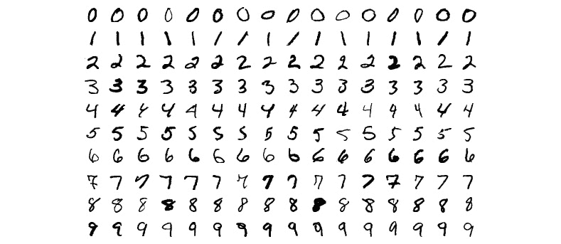
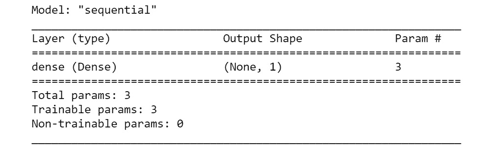

# 第二章：2. 神经网络

概述

本章从介绍生物神经元开始，看看人工神经网络如何受生物神经网络的启发。我们将研究一个简单的单层神经元（称为感知器）的结构和内部工作原理，并学习如何在 TensorFlow 中实现它。接着，我们将构建多层神经网络来解决更复杂的多类分类任务，并讨论设计神经网络时的实际考虑。随着我们构建深度神经网络，我们将转向 Keras，在 Python 中构建模块化且易于定制的神经网络模型。到本章结束时，你将能熟练地构建神经网络来解决复杂问题。

# 介绍

在上一章中，我们学习了如何在 TensorFlow 中实现基本的数学概念，如二次方程、线性代数和矩阵乘法。现在，我们已经掌握了基础知识，让我们深入了解**人工神经网络**（**ANNs**），它们是人工智能和深度学习的核心。

深度学习是机器学习的一个子集。在监督学习中，我们经常使用传统的机器学习技术，如支持向量机或基于树的模型，其中特征是由人工明确设计的。然而，在深度学习中，模型会在没有人工干预的情况下探索并识别标记数据集中的重要特征。人工神经网络（ANNs），受生物神经元的启发，具有分层表示，这有助于它们从微小的细节到复杂的细节逐步学习标签。以图像识别为例：在给定的图像中，ANN 能够轻松识别诸如明暗区域这样的基本细节，也能识别更复杂的结构，如形状。尽管神经网络技术在识别图像中的物体等任务中取得了巨大成功，但它们的工作原理是一个黑箱，因为特征是隐式学习的。深度学习技术已经证明在解决复杂问题（如语音/图像识别）方面非常强大，因此被广泛应用于行业，如构建自动驾驶汽车、Google Now 和许多其他应用。

现在我们已经了解了深度学习技术的重要性，我们将采取一种务实的逐步方法，结合理论和实际考虑来理解构建基于深度学习的解决方案。我们将从神经网络的最小组件——人工神经元（也称为感知器）开始，逐步增加复杂性，探索**多层感知器**（**MLPs**）以及更先进的模型，如**递归神经网络**（**RNNs**）和**卷积神经网络**（**CNNs**）。

# 神经网络与感知器的结构

神经元是人类神经系统的基本构建块，它在全身传递电信号。人脑由数十亿个相互连接的生物神经元组成，它们通过开启或关闭自己，不断发送微小的电二进制信号互相通信。神经网络的普遍含义是相互连接的神经元的网络。在当前的背景下，我们指的是人工神经网络（ANNs），它们实际上是基于生物神经网络的模型。人工智能这一术语源自于自然智能存在于人脑（或任何大脑）这一事实，而我们人类正在努力模拟这种自然智能。尽管人工神经网络受到生物神经元的启发，但一些先进的神经网络架构，如卷积神经网络（CNNs）和递归神经网络（RNNs），并没有真正模仿生物神经元的行为。然而，为了便于理解，我们将首先通过类比生物神经元和人工神经元（感知机）来开始。

生物神经元的简化版本在*图 2.1*中表示：


图 2.1：生物神经元

这是一个高度简化的表示。它有三个主要组件：

+   树突，接收输入信号

+   细胞体，信号在其中以某种形式进行处理

+   尾部状的轴突，通过它神经元将信号传递到下一个神经元

感知机也可以用类似的方式表示，尽管它不是一个物理实体，而是一个数学模型。*图 2.2*展示了人工神经元的高级表示：


图 2.2：人工神经元的表示

在人工神经元中，和生物神经元一样，有一个输入信号。中央节点将所有信号合并，如果信号超过某个阈值，它将触发输出信号。感知机的更详细表示在*图 2.3*中展示。接下来的章节将解释这个感知机的每个组件：


图 2.3：感知机的表示

感知机有以下组成部分：

+   输入层

+   权重

+   偏置

+   网络输入函数

+   激活函数

让我们通过考虑一个`OR`表格数据集，详细查看这些组件及其 TensorFlow 实现。

### 输入层

每个输入数据的示例都会通过输入层传递。参考*图 2.3*中的表示，根据输入示例的大小，节点的数量将从*x*1 到*x*m 不等。输入数据可以是结构化数据（如 CSV 文件）或非结构化数据，如图像。这些输入，*x*1 到*x*m，被称为特征（`m`表示特征的数量）。我们通过一个例子来说明这一点。

假设数据以如下表格形式呈现：


图 2.4：样本输入和输出数据——OR 表

在这里，神经元的输入是列 *x*1 和 *x*2，它们对应于一行。此时可能很难理解，但暂时可以接受这样一个事实：在训练过程中，数据是以迭代的方式，一次输入一行。我们将使用 TensorFlow `Variable` 类如下表示输入数据和真实标签（输出 `y`）：

```py
X = tf.Variable([[0.,0.],[0.,1.],\
                 [1.,0.],[1.,1.]], \
                 tf.float32)
y = tf.Variable([0, 1, 1, 1], tf.float32)
```

### 权重

权重与每个神经元相关联，输入特征决定了每个输入特征在计算下一个节点时应有的影响力。每个神经元将与所有输入特征连接。在这个例子中，由于有两个输入（*x*1 和 *x*2），且输入层与一个神经元连接，所以会有两个与之相关联的权重：*w*1 和 *w*2。权重是一个实数，可以是正数或负数，数学上表示为 `Variable` 类，如下所示：

```py
number_of_features = x.shape[1]
number_of_units = 1
Weight = tf.Variable(tf.zeros([number_of_features, \
                               number_of_units]), \
                               tf.float32)
```

权重的维度如下：*输入特征的数量 × 输出大小*。

### 偏置

在*图 2.3*中，偏置由 *b* 表示，称为加性偏置。每个神经元都有一个偏置。当 *x* 为零时，也就是说没有来自自变量的信息输入时，输出应该仅为 *b*。像权重一样，偏置也是一个实数，网络必须学习偏置值才能得到正确的预测结果。

在 TensorFlow 中，偏置与输出大小相同，可以表示如下：

```py
B = tf.Variable(tf.zeros([1, 1]), tf.float32)
```

### 净输入函数

净输入函数，也常被称为输入函数，可以描述为输入与其对应权重的乘积之和，再加上偏置。数学上表示如下：


图 2.5：数学形式的净输入函数

这里：

+   *x*i：输入数据——*x*1 到 *x*m

+   *w*i：权重——*w*1 到 *w*m

+   *b*：加性偏置

如你所见，这个公式涉及到输入及其相关的权重和偏置。可以以向量化的形式写出，我们可以使用矩阵乘法，这是我们在*第一章*《深度学习基础》中学过的内容。我们将在开始代码演示时看到这一点。由于所有变量都是数字，净输入函数的结果只是一个数字，一个实数。净输入函数可以通过 TensorFlow 的 `matmul` 功能轻松实现，如下所示：

```py
z = tf.add(tf.matmul(X, W), B)
```

`W` 代表权重，`X` 代表输入，`B` 代表偏置。

### 激活函数（G）

网络输入函数（`z`）的输出作为输入传递给激活函数。激活函数将网络输入函数（`z`）的输出压缩到一个新的输出范围，具体取决于激活函数的选择。有各种激活函数，如 Sigmoid（逻辑函数）、ReLU 和 tanh。每个激活函数都有其优缺点。我们将在本章稍后深入探讨激活函数。现在，我们先从 Sigmoid 激活函数开始，也叫逻辑函数。使用 Sigmoid 激活函数时，线性输出`z`被压缩到一个新的输出范围（0,1）。激活函数在层与层之间提供了非线性，这使得神经网络能够逼近任何连续函数。

Sigmoid 函数的数学公式如下，其中*G(z)*是 Sigmoid 函数，右边的公式详细说明了关于*z*的导数：


图 2.6：Sigmoid 函数的数学形式

如你在*图 2.7*中所见，Sigmoid 函数是一个大致为 S 形的曲线，其值介于 0 和 1 之间，无论输入是什么：


图 2.7：Sigmoid 曲线

如果我们设定一个阈值（比如`0.5`），我们可以将其转换为二进制输出。任何大于或等于`.5`的输出被视为`1`，任何小于`.5`的值被视为`0`。

TensorFlow 提供了现成的激活函数，如 Sigmoid。可以如下在 TensorFlow 中实现 Sigmoid 函数：

```py
output = tf.sigmoid(z)
```

现在我们已经看到了感知机的结构以及其在 TensorFlow 中的代码表示，让我们把所有组件结合起来，构建一个感知机。

### TensorFlow 中的感知机

在 TensorFlow 中，可以通过定义一个简单的函数来实现感知机，如下所示：

```py
def perceptron(X):
    z = tf.add(tf.matmul(X, W), B)
    output = tf.sigmoid(z)
    return output
```

在一个非常高的层次上，我们可以看到输入数据通过网络输入函数。网络输入函数的输出会传递给激活函数，激活函数反过来给我们预测的输出。现在，让我们逐行看一下代码：

```py
z = tf.add(tf.matmul(X, W), B)
```

网络输入函数的输出存储在`z`中。让我们通过进一步分解，将结果分为两部分来看，即`tf.matmul`中的矩阵乘法部分和`tf.add`中的加法部分。

假设我们将`X`和`W`的矩阵乘法结果存储在一个名为`m`的变量中：

```py
m = tf.matmul(X, W)
```

现在，让我们考虑一下如何得到这个结果。例如，假设`X`是一个行矩阵，如[ X1 X2 ]，而`W`是一个列矩阵，如下所示：


图 2.8：列矩阵

回想一下上一章提到的，`tf.matmul`会执行矩阵乘法。因此，结果是这样的：

```py
m = x1*w1 + x2*w2
```

然后，我们将输出`m`与偏置`B`相加，如下所示：

```py
z = tf.add(m, B)
```

请注意，我们在前一步所做的与简单地将两个变量 `m` 和 `b` 相加是一样的：

```py
m + b
```

因此，最终的输出是：

```py
z = x1*w1 + x2*w2 + b
```

`z` 将是净输入函数的输出。

现在，让我们考虑下一行：

```py
output= tf.sigmoid(z)
```

正如我们之前学到的，`tf.sigmoid` 是 Sigmoid 函数的现成实现。前一行计算的净输入函数的输出（`z`）作为输入传递给 Sigmoid 函数。Sigmoid 函数的结果就是感知器的输出，范围在 0 到 1 之间。在训练过程中，稍后将在本章中解释，我们将数据批量地输入到这个函数中，函数将计算预测值。

## 练习 2.01：感知器实现

在本练习中，我们将为 `OR` 表格实现一个感知器。在 TensorFlow 中设置输入数据并冻结感知器的设计参数：

1.  让我们导入必要的包，在我们的案例中是 `tensorflow`：

    ```py
    import tensorflow as tf
    ```

1.  在 TensorFlow 中设置 `OR` 表格数据的输入数据和标签：

    ```py
    X = tf.Variable([[0.,0.],[0.,1.],\
                     [1.,0.],[1.,1.]], \
                     dtype=tf.float32)
    print(X)
    ```

    正如你在输出中看到的，我们将得到一个 4 × 2 的输入数据矩阵：

    ```py
    <tf.Variable 'Variable:0' shape=(4, 2) dtype=float32, 
    numpy=array([[0., 0.],
                 [0., 1.],
                 [1., 0.],
                 [1., 1.]], dtype=float32)>
    ```

1.  我们将在 TensorFlow 中设置实际的标签，并使用 `reshape()` 函数将 `y` 向量重塑为一个 4 × 1 的矩阵：

    ```py
    y = tf.Variable([0, 1, 1, 1], dtype=tf.float32)
    y = tf.reshape(y, [4,1])
    print(y)
    ```

    输出是一个 4 × 1 的矩阵，如下所示：

    ```py
    tf.Tensor(
    [[0.]
     [1.]
     [1.]
     [1.]], shape=(4, 1), dtype=float32)
    ```

1.  现在让我们设计感知器的参数。

    *神经元数量（单位） = 1*

    *特征数量（输入） = 2（示例数量 × 特征数量）*

    激活函数将是 Sigmoid 函数，因为我们正在进行二元分类：

    ```py
    NUM_FEATURES = X.shape[1]
    OUTPUT_SIZE = 1
    ```

    在上面的代码中，`X.shape[1]` 将等于 `2`（因为索引是从零开始的，`1` 指的是第二个索引，它的值是 `2`）。

1.  在 TensorFlow 中定义连接权重矩阵：

    ```py
    W = tf.Variable(tf.zeros([NUM_FEATURES, \
                              OUTPUT_SIZE]), \
                              dtype=tf.float32)
    print(W)
    ```

    权重矩阵本质上将是一个列矩阵，如下图所示。它将具有以下维度：*特征数量（列数） × 输出大小*：

    

    ](img/B15385_02_09.jpg)

    ```py
    <tf.Variable 'Variable:0' shape=(2, 1) dtype=float32, \
    numpy=array([[0.], [0.]], dtype=float32)>
    ```

1.  现在创建偏置的变量：

    ```py
    B = tf.Variable(tf.zeros([OUTPUT_SIZE, 1]), dtype=tf.float32)
    print(B)
    ```

    每个神经元只有一个偏置，因此在这种情况下，偏置只是一个单元素数组中的一个数字。然而，如果我们有一个包含 10 个神经元的层，那么它将是一个包含 10 个数字的数组——每个神经元对应一个。

    这将导致一个零行矩阵，包含一个单一元素，如下所示：

    ```py
    <tf.Variable 'Variable:0' shape=(1, 1) dtype=float32, 
    numpy=array([[0.]], dtype=float32)>
    ```

1.  现在我们已经有了权重和偏置，下一步是执行计算，得到净输入函数，将其输入到激活函数中，然后得到最终输出。让我们定义一个名为 `perceptron` 的函数来获取输出：

    ```py
    def perceptron(X):
        z = tf.add(tf.matmul(X, W), B)
        output = tf.sigmoid(z)
        return output
    print(perceptron(X))
    ```

    输出将是一个 4 × 1 的数组，包含我们感知器的预测结果：

    ```py
    tf.Tensor(
    [[0.5]
     [0.5]
     [0.5]
     [0.5]], shape=(4, 1), dtype=float32)
    ```

    如我们所见，预测结果并不十分准确。我们将在接下来的章节中学习如何改进结果。

    注意

    要访问该特定部分的源代码，请参考 [`packt.live/3feF7MO`](https://packt.live/3feF7MO)。

    你也可以在[`packt.live/2CkMiEE`](https://packt.live/2CkMiEE)上运行这个示例。你必须执行整个 Notebook 才能获得预期的结果。

在这个练习中，我们实现了一个感知机，它是单个人工神经元的数学实现。请记住，这只是模型的实现，我们还没有进行任何训练。在下一节中，我们将看到如何训练感知机。

# 训练感知机

要训练一个感知机，我们需要以下组件：

+   数据表示

+   层

+   神经网络表示

+   损失函数

+   优化器

+   训练循环

在前一节中，我们讲解了大部分前面的组件：`perceptron()`，它使用线性层和 sigmoid 层来执行预测。我们在前一节中使用输入数据和初始权重与偏差所做的工作被称为**前向传播**。实际的神经网络训练涉及两个阶段：前向传播和反向传播。我们将在接下来的几步中详细探讨它们。让我们从更高的层次来看训练过程：

+   神经网络遍历所有训练样本的训练迭代被称为一个 Epoch。这是需要调整的超参数之一，以便训练神经网络。

+   在每一轮传递中，神经网络都会进行前向传播，其中数据从输入层传输到输出层。正如在*练习 2.01*，*感知机实现*中所看到的，输入被馈送到感知机。输入数据通过网络输入函数和激活函数，生成预测输出。预测输出与标签或真实值进行比较，计算误差或损失。

+   为了让神经网络学习（即调整权重和偏差以做出正确预测），需要有一个**损失函数**，它将计算实际标签和预测标签之间的误差。

+   为了最小化神经网络中的误差，训练循环需要一个**优化器**，它将基于损失函数来最小化损失。

+   一旦计算出误差，神经网络就会查看网络中哪些节点对误差产生了影响，以及影响的程度。这对于在下一轮训练中提高预测效果至关重要。这个向后传播误差的方式被称为**反向传播**（backpropagation）。反向传播利用微积分中的链式法则，以反向顺序传播误差（误差梯度），直到达到输入层。在通过网络反向传播误差时，它使用梯度下降法根据之前计算的误差梯度对网络中的权重和偏差进行微调。

这个循环会持续进行，直到损失最小化。

让我们在 TensorFlow 中实现我们讨论过的理论。回顾一下 *练习 2.01*，*感知机实现*，在该练习中，我们创建的感知机只进行了一个前向传播。我们得到了以下预测结果，并且发现我们的感知机没有学到任何东西：

```py
tf.Tensor(
[[0.5]
 [0.5]
 [0.5]
 [0.5]], shape=(4, 1), dtype=float32)
```

为了让我们的感知机学习，我们需要一些额外的组件，例如训练循环、损失函数和优化器。让我们看看如何在 TensorFlow 中实现这些组件。

## TensorFlow 中的感知机训练过程

在下一个练习中，当我们训练模型时，我们将使用 **随机梯度下降**（**SGD**）优化器来最小化损失。TensorFlow 提供了一些更高级的优化器。我们将在后续部分讨论它们的优缺点。以下代码将使用 TensorFlow 实例化一个随机梯度下降优化器：

```py
learning_rate = 0.01
optimizer = tf.optimizers.SGD(learning_rate)
```

`perceptron` 函数负责前向传播。对于误差的反向传播，我们使用了一个优化器。`Tf.optimizers.SGD` 创建了一个优化器实例。SGD 会在每个输入数据的示例上更新网络的参数——权重和偏置。我们将在本章后续部分更详细地讨论梯度下降优化器的工作原理。我们还会讨论 `0.01` 参数的意义，该参数被称为学习率。学习率是 SGD 为了达到损失函数的全局最优解而采取的步伐的大小。学习率是另一个超参数，需要调节以训练神经网络。

以下代码可用于定义训练周期、训练循环和损失函数：

```py
no_of_epochs = 1000
for n in range(no_of_epochs):
    loss = lambda:abs(tf.reduce_mean(tf.nn.\
           sigmoid_cross_entropy_with_logits\
           (labels=y,logits=perceptron(X))))
    optimizer.minimize(loss, [W, B])
```

在训练循环中，损失是通过损失函数计算的，损失函数被定义为一个 lambda 函数。

`tf.nn.sigmoid_cross_entropy_with_logits` 函数计算每个观测值的损失值。它接受两个参数：`Labels = y` 和 `logit = perceptron(x)`。

`perceptron(X)` 返回预测值，这是输入 `x` 的前向传播结果。这个结果与存储在 `y` 中的相应标签值进行比较。使用 `Tf.reduce_mean` 计算平均值，并取其大小。使用 `abs` 函数忽略符号。`Optimizer.minimize` 会根据损失值调整权重和偏置，这是误差反向传播的一部分。

使用新的权重和偏置值再次执行前向传播。这个前向和反向过程会持续进行，直到我们定义的迭代次数结束。

在反向传播过程中，只有当损失小于上一个周期的损失时，权重和偏置才会被更新。否则，权重和偏置保持不变。通过这种方式，优化器确保尽管它会执行所需的迭代次数，但只会存储那些损失最小的 `w` 和 `b` 值。

我们将训练的轮数设置为 1,000 次迭代。设置训练轮数没有固定的经验法则，因为轮数是一个超参数。那么，我们如何知道训练是否成功呢？

当我们看到权重和偏置的值发生变化时，我们可以得出结论，训练已经发生。假设我们使用了*练习 2.01*中的`OR`数据进行训练，并应用了感知机实现，我们会看到权重大致等于以下值：

```py
[[0.412449151]
[0.412449151]]
```

偏置值可能是这样的：

```py
0.236065879
```

当网络已经学习，即权重和偏置已经更新时，我们可以使用`scikit-learn`包中的`accuracy_score`来查看它是否做出了准确的预测。我们可以通过如下方式来测量预测的准确性：

```py
from sklearn.metrics import accuracy_score
print(accuracy_score(y, ypred))
```

在这里，`accuracy_score`接收两个参数——标签值（`y`）和预测值（`ypred`）——并计算准确率。假设结果是`1.0`，这意味着感知机的准确率为 100%。

在下一个练习中，我们将训练感知机来执行二分类任务。

## 练习 2.02：感知机作为二分类器

在上一节中，我们学习了如何训练感知机。在本练习中，我们将训练感知机来近似一个稍微复杂一些的函数。我们将使用随机生成的外部数据，数据有两个类别：类别`0`和类别`1`。我们训练后的感知机应该能够根据类别来分类这些随机数：

注意

数据存储在名为`data.csv`的 CSV 文件中。你可以通过访问[`packt.live/2BVtxIf`](https://packt.live/2BVtxIf)从 GitHub 下载该文件。

1.  导入所需的库：

    ```py
    import tensorflow as tf
    import pandas as pd
    from sklearn.metrics import confusion_matrix
    from sklearn.metrics import accuracy_score
    import matplotlib.pyplot as plt
    %matplotlib inline
    ```

    除了`tensorflow`，我们还需要`pandas`来从 CSV 文件读取数据，`confusion_matrix`和`accuracy_score`来衡量训练后感知机的准确性，以及`matplotlib`来可视化数据。

1.  从`data.csv`文件中读取数据。该文件应与运行此练习代码的 Jupyter Notebook 文件在同一路径下。否则，在执行代码之前你需要更改路径：

    ```py
    df = pd.read_csv('data.csv')
    ```

1.  检查数据：

    ```py
    df.head()
    ```

    输出将如下所示：

    

    图 2.10：DataFrame 的内容

    如你所见，数据有三列。`x1`和`x2`是特征，而`label`列包含每个观测的标签`0`或`1`。查看这种数据的最佳方式是通过散点图。

1.  使用`matplotlib`绘制图表来可视化数据：

    ```py
    plt.scatter(df[df['label'] == 0]['x1'], \
                df[df['label'] == 0]['x2'], \
                marker='*')
    plt.scatter(df[df['label'] == 1]['x1'], \
                df[df['label'] == 1]['x2'], marker='<')
    ```

    输出将如下所示：

    

    图 2.11：外部数据的散点图

    这显示了数据的两个不同类别，通过两种不同的形状来表示。标签为`0`的数据用星号表示，而标签为`1`的数据用三角形表示。

1.  准备数据。这一步骤不仅仅是神经网络特有的，你在常规机器学习中也一定见过。在将数据提交给模型进行训练之前，你需要将数据分割为特征和标签：

    ```py
    X_input = df[['x1','x2']].values
    y_label = df[['label']].values
    ```

    `x_input`包含特征`x1`和`x2`。末尾的值将其转换为矩阵格式，这是创建张量时所期望的输入格式。`y_label`包含矩阵格式的标签。

1.  创建 TensorFlow 变量用于特征和标签，并将它们转换为`float`类型：

    ```py
    x = tf.Variable(X_input, dtype=tf.float32)
    y = tf.Variable(y_label, dtype=tf.float32)
    ```

1.  剩下的代码是用来训练感知器的，我们在*练习 2.01*，*感知器实现*中看过：

    ```py
    Exercise2.02.ipynb
    Number_of_features = 2
    Number_of_units = 1
    learning_rate = 0.01
    # weights and bias
    weight = tf.Variable(tf.zeros([Number_of_features, \
                                   Number_of_units]))
    bias = tf.Variable(tf.zeros([Number_of_units]))
    #optimizer
    optimizer = tf.optimizers.SGD(learning_rate)
    def perceptron(x):
        z = tf.add(tf.matmul(x,weight),bias)
        output = tf.sigmoid(z)
        return output
    The complete code for this step can be found at https://packt.live/3gJ73bY.
    ```

    注意

    上述代码片段中的`#`符号表示代码注释。注释被添加到代码中以帮助解释特定的逻辑部分。

1.  显示`weight`和`bias`的值，以展示感知器已经被训练过：

    ```py
    tf.print(weight, bias)
    ```

    输出结果如下：

    ```py
    [[-0.844034135]
     [0.673354745]] [0.0593947917]
    ```

1.  将输入数据传递进去，检查感知器是否正确分类：

    ```py
    ypred = perceptron(x)
    ```

1.  对输出结果进行四舍五入，转换成二进制格式：

    ```py
    ypred = tf.round(ypred)
    ```

1.  使用`accuracy_score`方法来衡量准确性，正如我们在之前的练习中所做的那样：

    ```py
    acc = accuracy_score(y.numpy(), ypred.numpy())
    print(acc)
    ```

    输出结果如下：

    ```py
    1.0
    ```

    该感知器给出了 100%的准确率。

1.  混淆矩阵帮助评估模型的性能。我们将使用`scikit-learn`包来绘制混淆矩阵。

    ```py
    cnf_matrix = confusion_matrix(y.numpy(), \
                                  ypred.numpy())
    print(cnf_matrix)
    ```

    输出结果将如下所示：

    ```py
    [[12  0]
    [ 0  9]]
    ```

    所有的数字都位于对角线上，即，12 个值对应于类别 0，9 个值对应于类别 1，这些都被我们训练好的感知器正确分类（该感知器已达到 100%的准确率）。

    注意

    要查看这个具体部分的源代码，请参考[`packt.live/3gJ73bY`](https://packt.live/3gJ73bY)。

    你也可以在网上运行这个示例，访问[`packt.live/2DhelFw`](https://packt.live/2DhelFw)。你必须执行整个 Notebook 才能得到预期的结果。

在本练习中，我们将感知器训练成了一个二分类器，并且表现得相当不错。在下一个练习中，我们将看到如何创建一个多分类器。

## 多分类器

一个可以处理两类的分类器被称为**二分类器**，就像我们在之前的练习中看到的那样。一个可以处理多于两类的分类器被称为**多分类器**。我们无法使用单一神经元来构建多分类器。现在我们从一个神经元转变为一个包含多个神经元的层，这对于多分类器是必需的。

一层多个神经元可以被训练成一个多分类器。这里详细列出了一些关键点。你需要的神经元数量等于类别的数量；也就是说，对于一个 3 类的分类器，你需要 3 个神经元；对于一个 10 类的分类器，你需要 10 个神经元，依此类推。

如我们在二分类中看到的，我们使用 sigmoid（逻辑层）来获取 0 到 1 范围内的预测。在多类分类中，我们使用一种特殊类型的激活函数，称为**Softmax**激活函数，以获得每个类别的概率，总和为 1。使用 sigmoid 函数进行多类分类时，概率不一定加起来为 1，因此更倾向使用 Softmax。

在实现多类分类器之前，让我们先探索 Softmax 激活函数。

### Softmax 激活函数

Softmax 函数也被称为**归一化指数函数**。正如**归一化**一词所暗示的，Softmax 函数将输入归一化为一个总和为 1 的概率分布。从数学角度来看，它表示为：


图 2.12：Softmax 函数的数学形式

为了理解 Softmax 的作用，让我们使用 TensorFlow 内置的`softmax`函数并查看输出。

所以，对于以下代码：

```py
values = tf.Variable([3,1,7,2,4,5], dtype=tf.float32)
output = tf.nn.softmax(values)
tf.print(output)
```

输出结果将是：

```py
[0.0151037546 0.00204407098 0.824637055 
 0.00555636082 0.0410562605 0.111602485]
```

如您所见，输出中`values`输入被映射到一个概率分布，且总和为 1。注意，`7`（原始输入值中的最大值）获得了最高的权重，`0.824637055`。这正是 Softmax 函数的主要用途：专注于最大值，并抑制低于最大值的值。此外，如果我们对输出求和，结果将接近 1。

详细说明该示例，假设我们想构建一个包含 3 个类别的多类分类器。我们将需要连接到 Softmax 激活函数的 3 个神经元：


图 2.13：在多类分类设置中使用的 Softmax 激活函数

如*图 2.13*所示，`x`1、`x`2 和`x`3 是输入特征，它们经过每个神经元的网络输入函数，这些神经元具有与之相关的权重和偏置（`W`i，j 和 `b`i）。最后，神经元的输出被送入通用的 Softmax 激活函数，而不是单独的 sigmoid 函数。Softmax 激活函数输出 3 个类别的概率：`P1`、`P2`和`P3`。由于 Softmax 层的存在，这三个概率的总和将为 1。

正如我们在前一部分看到的，Softmax 突出最大值并抑制其余的值。假设一个神经网络被训练来将输入分类为三个类别，对于给定的输入集，输出为类别 2；那么它会说`P2`具有最高值，因为它经过了 Softmax 层。如下面的图所示，`P2`具有最高值，这意味着预测是正确的：


图 2.14：概率 P2 最大

相关概念是独热编码。由于我们有三个不同的类别，`class1`、`class2`和`class3`，我们需要将类别标签编码为便于操作的格式；因此，应用独热编码后，我们会看到如下输出：


图 2.15：三个类别的独热编码数据

这样可以使结果快速且容易解释。在这种情况下，值最高的输出被设置为 1，所有其他值设置为 0。上述例子的独热编码输出将如下所示：


图 2.16：独热编码的输出概率

训练数据的标签也需要进行独热编码。如果它们格式不同，则需要在训练模型之前将其转换为独热编码格式。让我们进行一次关于独热编码的多类分类练习。

## 练习 2.03：使用感知机进行多类分类

为了执行多类分类，我们将使用鸢尾花数据集（[`archive.ics.uci.edu/ml/datasets/Iris`](https://archive.ics.uci.edu/ml/datasets/Iris)），该数据集包含 3 个类别，每个类别有 50 个实例，每个类别代表一种鸢尾花。我们将使用一个包含三个神经元的单层，采用 Softmax 激活函数：

注意

你可以通过这个链接从 GitHub 下载数据集：[`packt.live/3ekiBBf`](https://packt.live/3ekiBBf)。

1.  导入所需的库：

    ```py
    import tensorflow as tf
    import pandas as pd
    from sklearn.metrics import confusion_matrix
    from sklearn.metrics import accuracy_score
    import matplotlib.pyplot as plt
    %matplotlib inline
    from pandas import get_dummies
    ```

    你应该熟悉所有这些导入，因为它们在前一个练习中已使用过，除了`get_dummies`。此函数将给定的标签数据转换为相应的独热编码格式。

1.  加载`iris.csv`数据：

    ```py
    df = pd.read_csv('iris.csv')
    ```

1.  让我们查看数据的前五行：

    ```py
    df.head()
    ```

    输出结果如下：

    

    图 2.17：DataFrame 的内容

1.  使用散点图可视化数据：

    ```py
    plt.scatter(df[df['species'] == 0]['sepallength'],\
                df[df['species'] == 0]['sepalwidth'], marker='*')
    plt.scatter(df[df['species'] == 1]['sepallength'],\
                df[df['species'] == 1]['sepalwidth'], marker='<')
    plt.scatter(df[df['species'] == 2]['sepallength'], \
                df[df['species'] == 2]['sepalwidth'], marker='o')
    ```

    结果图如下所示。*x*轴表示花萼长度，*y*轴表示花萼宽度。图中的形状表示三种鸢尾花的品种，setosa（星形）、versicolor（三角形）和 virginica（圆形）：

    

    图 2.18：鸢尾花数据散点图

    如可视化所示，共有三个类别，用不同的形状表示。

1.  将特征和标签分开：

    ```py
    x = df[['petallength', 'petalwidth', \
            'sepallength', 'sepalwidth']].values
    y = df['species'].values
    ```

    `values`将把特征转换为矩阵格式。

1.  通过对类别进行独热编码来准备数据：

    ```py
    y = get_dummies(y)
    y = y.values
    ```

    `get_dummies(y)`将把标签转换为独热编码格式。

1.  创建一个变量来加载特征，并将其类型转换为`float32`：

    ```py
    x = tf.Variable(x, dtype=tf.float32)
    ```

1.  使用三个神经元实现`感知机`层：

    ```py
    Number_of_features = 4
    Number_of_units = 3 

    # weights and bias
    weight = tf.Variable(tf.zeros([Number_of_features, \
                                   Number_of_units]))
    bias = tf.Variable(tf.zeros([Number_of_units]))   
    def perceptron(x):
        z = tf.add(tf.matmul(x, weight), bias)
        output = tf.nn.softmax(z)
        return output
    ```

    这段代码看起来与单一感知机实现非常相似。只是将`Number_of_units`参数设置为`3`。因此，权重矩阵将是 4 x 3，偏置矩阵将是 1 x 3。

    另一个变化是在激活函数中：

    `Output=tf.nn.softmax(x)`

    我们使用的是`softmax`而不是`sigmoid`。

1.  创建一个`optimizer`实例。我们将使用`Adam`优化器。在这一点上，你可以将`Adam`视为一种改进版的梯度下降法，它收敛速度更快。我们将在本章稍后详细讲解：

    ```py
    optimizer = tf.optimizers.Adam(.01)
    ```

1.  定义训练函数：

    ```py
    def train(i):
        for n in range(i):
            loss=lambda: abs(tf.reduce_mean\
                            (tf.nn.softmax_cross_entropy_with_logits(\
                             labels=y, logits=perceptron(x))))
            optimizer.minimize(loss, [weight, bias])
    ```

    再次说明，代码看起来与单神经元实现非常相似，唯一的不同是损失函数。我们使用的是`softmax_cross_entropy_with_logits`，而不是`sigmoid_cross_entropy_with_logits`。

1.  运行训练`1000`次迭代：

    ```py
    train(1000)
    ```

1.  打印权重值以查看它们是否发生了变化。这也是我们感知器在学习的一个标志：

    ```py
    tf.print(weight) 
    ```

    输出显示我们感知器学习到的权重：

    ```py
    [[0.684310317 0.895633 -1.0132345]
     [2.6424644 -1.13437736 -3.20665336]
     [-2.96634197 -0.129377216 3.2572844]
     [-2.97383809 -3.13501668 3.2313652]]
    ```

1.  为了测试准确率，我们将特征输入以预测输出，然后使用`accuracy_score`计算准确率，就像在前面的练习中一样：

    ```py
    ypred=perceptron(x)
    ypred=tf.round(ypred)
    accuracy_score(y, ypred)
    ```

    输出为：

    ```py
    0.98
    ```

    它的准确率达到了 98%，非常不错。

    注意

    若要访问此特定部分的源代码，请参考[`packt.live/2Dhes3U`](https://packt.live/2Dhes3U)。

    你也可以在线运行此示例，网址是[`packt.live/3iJJKkm`](https://packt.live/3iJJKkm)。你必须执行整个 Notebook 才能得到期望的结果。

在这个练习中，我们使用感知器进行了多类分类。接下来，我们将进行一个更复杂、更有趣的手写数字识别数据集的案例研究。

## MNIST 案例研究

现在，我们已经了解了如何训练单个神经元和单层神经网络，接下来让我们看看更现实的数据。MNIST 是一个著名的案例研究。在下一个练习中，我们将创建一个 10 类分类器来分类 MNIST 数据集。不过，在那之前，你应该对 MNIST 数据集有一个充分的了解。

**修改版国家标准与技术研究院**（**MNIST**）是指由 Yann LeCun 领导的团队在 NIST 使用的修改数据集。这个项目的目标是通过神经网络进行手写数字识别。

在开始编写代码之前，我们需要了解数据集。MNIST 数据集已经集成到 TensorFlow 库中。它包含了 70,000 张手写数字 0 到 9 的图像：



图 2.19：手写数字

当我们提到图像时，你可能会认为它们是 JPEG 文件，但实际上它们不是。它们是以像素值的形式存储的。从计算机的角度来看，图像就是一堆数字。这些数字是从 0 到 255 之间的像素值。这些图像的维度是 28 x 28。图像是以 28 x 28 矩阵的形式存储的，每个单元包含从 0 到 255 之间的实数。这些是灰度图像（通常称为黑白图像）。0 表示白色，1 表示完全黑色，中间的值表示不同深浅的灰色。MNIST 数据集分为 60,000 张训练图像和 10,000 张测试图像。

每张图片都有一个标签，标签范围从 0 到 9。下一次练习中，我们将构建一个 10 类分类器来分类手写的 MNIST 图片。

## 练习 2.04：分类手写数字

在本练习中，我们将构建一个由 10 个神经元组成的单层 10 类分类器，采用 Softmax 激活函数。它将有一个 784 像素的输入层：

1.  导入所需的库和包，就像我们在前面的练习中做的那样：

    ```py
    import tensorflow as tf
    import pandas as pd
    from sklearn.metrics import accuracy_score
    import matplotlib.pyplot as plt
    %matplotlib inline
    from pandas import get_dummies
    ```

1.  创建 MNIST 数据集的实例：

    ```py
    mnist = tf.keras.datasets.mnist
    ```

1.  加载 MNIST 数据集的`train`和`test`数据：

    ```py
    (train_features, train_labels), (test_features, test_labels) = \
    mnist.load_data()
    ```

1.  对数据进行归一化：

    ```py
    train_features, test_features = train_features / 255.0, \
                                    test_features / 255.0
    ```

1.  将二维图像展平为行矩阵。因此，一个 28 × 28 像素的图像将被展平为`784`，使用`reshape`函数：

    ```py
    x = tf.reshape(train_features,[60000, 784])
    ```

1.  创建一个`Variable`，并将其类型转换为`float32`：

    ```py
    x = tf.Variable(x)
    x = tf.cast(x, tf.float32)
    ```

1.  创建标签的独热编码并将其转换为矩阵：

    ```py
    y_hot = get_dummies(train_labels)
    y = y_hot.values
    ```

1.  创建一个包含`10`个神经元的单层神经网络，并训练`1000`次：

    ```py
    Exercise2.04.ipynb
    #defining the parameters
    Number_of_features = 784
    Number_of_units = 10  
    # weights and bias
    weight = tf.Variable(tf.zeros([Number_of_features, \
                                   Number_of_units]))
    bias = tf.Variable(tf.zeros([Number_of_units]))
    The complete code for this step can be accessed from https://packt.live/3efd7Yh.
    ```

1.  准备测试数据以评估准确率：

    ```py
    # Prepare the test data to measure the accuracy. 
    test = tf.reshape(test_features, [10000, 784])
    test = tf.Variable(test)
    test = tf.cast(test, tf.float32)
    test_hot = get_dummies(test_labels)
    test_matrix = test_hot.values
    ```

1.  通过将测试数据传入网络来进行预测：

    ```py
    ypred = perceptron(test)
    ypred = tf.round(ypred)
    ```

1.  计算准确率：

    ```py
    accuracy_score(test_hot, ypred)
    ```

    预测的准确率是：

    ```py
    0.9304
    ```

    注意

    若要访问此部分的源代码，请参考[`packt.live/3efd7Yh`](https://packt.live/3efd7Yh)。

    你也可以在线运行此示例，地址是[`packt.live/2Oc83ZW`](https://packt.live/2Oc83ZW)。你必须执行整个 Notebook 才能获得期望的结果。

在这个练习中，我们展示了如何创建一个单层多神经元神经网络，并将其训练为一个多类分类器。

下一步是构建一个多层神经网络。然而，在此之前，我们必须了解 Keras API，因为我们使用 Keras 来构建密集神经网络。

# Keras 作为高级 API

在 TensorFlow 1.0 中，有多个 API，比如 Estimator、Contrib 和 layers。而在 TensorFlow 2.0 中，Keras 与 TensorFlow 紧密集成，提供了一个用户友好的、高级的 API，具有模块化、可组合且易于扩展的特性，可以用来构建和训练深度学习模型。这也使得开发神经网络代码变得更加简单。让我们来看它是如何工作的。

## 练习 2.05：使用 Keras 进行二分类

在这个练习中，我们将使用 Keras API 实现一个非常简单的二分类器，只有一个神经元。我们将使用与*练习 2.02*、*感知机作为二分类器*中相同的`data.csv`文件：

注意

数据集可以通过访问以下 GitHub 链接进行下载：https://packt.live/2BVtxIf。

1.  导入所需的库：

    ```py
    import tensorflow as tf
    import pandas as pd
    import matplotlib.pyplot as plt
    %matplotlib inline
    # Import Keras libraries
    from tensorflow.keras.models import Sequential
    from tensorflow.keras.layers import Dense
    ```

    在代码中，`Sequential`是我们将使用的 Keras 模型类型，因为它非常容易向其中添加层。`Dense`是将要添加的层类型。这些是常规的神经网络层，而不是稍后将使用的卷积层或池化层。

1.  导入数据：

    ```py
    df = pd.read_csv('data.csv')
    ```

1.  检查数据：

    ```py
    df.head()
    ```

    以下是输出结果：

    

    图 2.20：DataFrame 的内容

1.  使用散点图可视化数据：

    ```py
    plt.scatter(df[df['label'] == 0]['x1'], \
                df[df['label'] == 0]['x2'], marker='*')
    plt.scatter(df[df['label'] == 1]['x1'], \
                df[df['label'] == 1]['x2'], marker='<')
    ```

    生成的图形如下，*x*轴表示`x1`值，y 轴表示`x2`值：

    

    图 2.21：数据的散点图

1.  通过分离特征和标签并设置`tf`变量来准备数据：

    ```py
    x_input = df[['x1','x2']].values
    y_label = df[['label']].values
    ```

1.  创建一个神经网络模型，由一个神经元和一个 sigmoid 激活函数组成：

    ```py
    model = Sequential()
    model.add(Dense(units=1, input_dim=2, activation='sigmoid'))
    ```

    `mymodel.add(Dense())`中的参数如下：`units`是该层神经元的数量；`input_dim`是特征的数量，在此案例中为`2`；`activation`是`sigmoid`。

1.  一旦模型创建完成，我们使用`compile`方法传入训练所需的额外参数，如优化器类型、损失函数等：

    ```py
    model.compile(optimizer='adam', \
                  loss='binary_crossentropy',\
                  metrics=['accuracy'])
    ```

    在这个案例中，我们使用了`adam`优化器，这是梯度下降优化器的增强版，损失函数是`binary_crossentropy`，因为这是一个二分类器。

    `metrics`参数几乎总是设置为`['accuracy']`，用于显示如训练轮数、训练损失、训练准确度、测试损失和测试准确度等信息。

1.  现在模型已准备好进行训练。然而，使用`summary`函数检查模型配置是个好主意：

    ```py
    model.summary()
    ```

    输出将如下所示：

    

    图 2.22：顺序模型摘要

1.  通过调用`fit()`方法来训练模型：

    ```py
    model.fit(x_input, y_label, epochs=1000)
    ```

    它接受特征和标签作为数据参数，并包含训练的轮数，在此案例中为`1000`。模型将开始训练，并会持续显示状态，如下所示：

    

    图 2.23：使用 Keras 的模型训练日志

1.  我们将使用 Keras 的`evaluate`功能来评估模型：

    ```py
    model.evaluate(x_input, y_label)
    ```

    输出结果如下：

    ```py
    21/21 [==============================] - 0s 611us/sample - loss:  0.2442 - accuracy: 1.0000
    [0.24421504139900208, 1.0]
    ```

    如你所见，我们的 Keras 模型训练得非常好，准确率达到了 100%。

    注意

    要访问此特定章节的源代码，请参考[`packt.live/2ZVV1VY`](https://packt.live/2ZVV1VY)。

    你也可以在线运行此示例，网址是[`packt.live/38CzhTc`](https://packt.live/38CzhTc)。你必须执行整个笔记本才能得到期望的结果。

在本练习中，我们学习了如何使用 Keras 构建感知机。正如你所见，Keras 使代码更加模块化、更具可读性，而且参数调整也更为简便。在下一节中，我们将学习如何使用 Keras 构建多层或深度神经网络。

## 多层神经网络或深度神经网络

在前面的示例中，我们开发了一个单层神经网络，通常称为浅层神经网络。其示意图如下所示：


](img/B15385_02_24.jpg)

图 2.24：浅层神经网络

一层神经元不足以解决更复杂的问题，如人脸识别或物体检测。你需要堆叠多个层，这通常被称为创建深度神经网络。其示意图如下所示：


](img/B15385_02_26.jpg)

图 2.25：深度神经网络

在我们跳入代码之前，让我们试着理解一下这个过程是如何工作的。输入数据被馈送到第一层的神经元。需要注意的是，每个输入都会馈送到第一层的每个神经元，并且每个神经元都有一个输出。第一层每个神经元的输出会被馈送到第二层的每个神经元，第二层每个神经元的输出会被馈送到第三层的每个神经元，依此类推。

因此，这种网络也被称为密集神经网络或全连接神经网络。还有其他类型的神经网络，其工作原理不同，比如卷积神经网络（CNN），但这些内容我们将在下一章讨论。每一层中神经元的数量没有固定规则，通常通过试错法来确定，这个过程叫做超参数调优（我们将在本章后面学习）。然而，在最后一层神经元的数量上，是有一些限制的。最后一层的配置如下所示：


](img/B15385_02_26.jpg)

图 2.26：最后一层配置

## ReLU 激活函数

在我们实现深度神经网络的代码之前，最后需要了解一下 ReLU 激活函数。这是多层神经网络中最常用的激活函数之一。

**ReLU** 是 **Rectified Linear Unit（修正线性单元）**的缩写。ReLU 函数的输出总是一个非负值，且大于或等于 0：


](img/B15385_02_27.jpg)

图 2.27：ReLU 激活函数

ReLU 的数学表达式是：


](img/B15385_02_25.jpg)

图 2.28：ReLU 激活函数

ReLU 收敛速度比 sigmoid 激活函数快得多，因此它是目前最广泛使用的激活函数。几乎所有的深度神经网络都使用 ReLU。它被应用于除最后一层外的所有层，最后一层则使用 sigmoid 或 Softmax。

ReLU 激活函数是 TensorFlow 内置提供的。为了了解它是如何实现的，我们给 ReLU 函数输入一些示例值，看看输出：

```py
values = tf.Variable([1.0, -2., 0., 0.3, -1.5], dtype=tf.float32)
output = tf.nn.relu(values)
tf.print(output)
```

输出如下：

```py
[1 0 0 0.3 0]
```

如你所见，所有正值都被保留，负值被压制为零。接下来我们将在下一个练习中使用这个 ReLU 激活函数来完成多层二分类任务。

## 练习 2.06：多层二分类器

在本次练习中，我们将使用在*练习 2.02*中使用的`data.csv`文件来实现一个多层二分类器，*感知机作为二分类器*。

我们将构建一个深度神经网络二分类器，配置如下：输入层有 2 个节点，包含 2 个隐藏层，第一个层有 50 个神经元，第二个层有 20 个神经元，最后是一个神经元，用于进行最终的二分类预测：

注意

数据集可以通过以下链接从 GitHub 下载：https://packt.live/2BVtxIf .

1.  导入所需的库和包：

    ```py
    import tensorflow as tf
    import pandas as pd 
    import matplotlib.pyplot as plt
    %matplotlib inline
    ##Import Keras libraries
    from tensorflow.keras.models import Sequential
    from tensorflow.keras.layers import Dense
    ```

1.  导入并检查数据：

    ```py
    df = pd.read_csv('data.csv')
    df.head()
    ```

    输出如下：

    

    图 2.29：数据的前五行

1.  使用散点图可视化数据：

    ```py
    plt.scatter(df[df['label'] == 0]['x1'], \
                df[df['label'] == 0]['x2'], marker='*')
    plt.scatter(df[df['label'] == 1]['x1'], \
                df[df['label'] == 1]['x2'], marker='<')
    ```

    结果输出如下，*x* 轴显示 `x1` 值，*y* 轴显示 `x2` 值：

    

    图 2.30：给定数据的散点图

1.  通过分离特征和标签并设置 `tf` 变量来准备数据：

    ```py
    x_input = df[['x1','x2']].values
    y_label = df[['label']].values
    ```

1.  构建 `Sequential` 模型：

    ```py
    model = Sequential()
    model.add(Dense(units = 50,input_dim=2, activation = 'relu'))
    model.add(Dense(units = 20 , activation = 'relu'))
    model.add(Dense(units = 1,input_dim=2, activation = 'sigmoid'))
    ```

    以下是几个需要考虑的要点。我们提供了第一层的输入细节，然后对所有中间层使用 ReLU 激活函数，如前所述。此外，最后一层只有一个神经元，并且使用 sigmoid 激活函数来进行二分类。

1.  使用 `compile` 方法提供训练参数：

    ```py
    model.compile(optimizer='adam', \
                  loss='binary_crossentropy', metrics=['accuracy'])
    ```

1.  使用 `summary` 函数检查 `model` 配置：

    ```py
    model.summary()
    ```

    输出将如下所示：

    

    图 2.31：使用 Keras 深度神经网络模型总结

    在模型总结中，我们可以看到，总共有 `1191` 个参数——权重和偏置——需要在隐藏层到输出层之间进行学习。

1.  通过调用 `fit()` 方法训练模型：

    ```py
    model.fit(x_input, y_label, epochs=50)
    ```

    请注意，在这种情况下，模型在 `50` 个 epoch 内达到了 100% 的准确率，而单层模型大约需要 1,000 个 epoch：

    

    图 2.32：多层模型训练日志

1.  让我们评估模型的性能：

    ```py
    model.evaluate(x_input, y_label)
    ```

    输出如下：

    ```py
    21/21 [==============================] - 0s 6ms/sample - loss:   0.1038 - accuracy: 1.0000
    [0.1037961095571518, 1.0]
    ```

    我们的模型现在已经训练完成，并且展示了 100% 的准确率。

    注意

    要访问此特定部分的源代码，请参阅 [`packt.live/2ZUkM94`](https://packt.live/2ZUkM94)。

    你也可以在 [`packt.live/3iKsD1W`](https://packt.live/3iKsD1W) 在线运行这个示例。你必须执行整个 Notebook 才能获得期望的结果。

在这个练习中，我们学习了如何使用 Keras 构建一个多层神经网络。这是一个二分类器。在下一个练习中，我们将为 MNIST 数据集构建一个深度神经网络，用于多类分类器。

## 练习 2.07：使用 Keras 在 MNIST 上实现深度神经网络

在这个练习中，我们将通过实现一个深度神经网络（多层）来对 MNIST 数据集进行多类分类，其中输入层包含 28 × 28 的像素图像，展平成 784 个输入节点，后面有 2 个隐藏层，第一个隐藏层有 50 个神经元，第二个隐藏层有 20 个神经元。最后，会有一个 Softmax 层，包含 10 个神经元，因为我们要将手写数字分类为 10 个类别：

1.  导入所需的库和包：

    ```py
    import tensorflow as tf
    import pandas as pd 
    import matplotlib.pyplot as plt
    %matplotlib inline
    # Import Keras libraries
    from tensorflow.keras.models import Sequential
    from tensorflow.keras.layers import Dense
    from tensorflow.keras.layers import Flatten
    ```

1.  加载 MNIST 数据：

    ```py
    mnist = tf.keras.datasets.mnist
    (train_features,train_labels), (test_features,test_labels) = \
    mnist.load_data()
    ```

    `train_features` 包含的是 28 x 28 像素值形式的训练图像。

    `train_labels` 包含训练标签。类似地，`test_features` 包含 28 x 28 像素值形式的测试图像，`test_labels` 包含测试标签。

1.  对数据进行归一化：

    ```py
    train_features, test_features = train_features / 255.0, \
                                    test_features / 255.0
    ```

    图像的像素值范围为 0-255。我们需要通过将它们除以 255 来对这些值进行归一化，使其范围从 0 到 1。

1.  构建 `sequential` 模型：

    ```py
    model = Sequential()
    model.add(Flatten(input_shape=(28,28)))
    model.add(Dense(units = 50, activation = 'relu'))
    model.add(Dense(units = 20 , activation = 'relu'))
    model.add(Dense(units = 10, activation = 'softmax'))
    ```

    有几点需要注意。首先，在这个案例中，第一层实际上并不是一层神经元，而是一个 `Flatten` 函数。它将 28 x 28 的图像展平成一个包含 `784` 的一维数组，这个数组会输入到第一个隐藏层，隐藏层有 `50` 个神经元。最后一层有 `10` 个神经元，对应 10 个类别，并使用 `softmax` 激活函数。

1.  使用 `compile` 方法提供训练参数：

    ```py
    model.compile(optimizer = 'adam', \
                  loss = 'sparse_categorical_crossentropy', \
                  metrics = ['accuracy'])
    ```

    注意

    这里使用的损失函数与二分类器不同。对于多分类器，使用以下损失函数：`sparse_categorical_crossentropy`，当标签未经过 one-hot 编码时使用，如本例所示；以及 `categorical_crossentropy`，当标签已进行 one-hot 编码时使用。

1.  使用 `summary` 函数检查模型配置：

    ```py
    model.summary()
    ```

    输出如下：

    

    ](img/B15385_02_33.jpg)

    图 2.33：深度神经网络摘要

    在模型摘要中，我们可以看到总共有 40,480 个参数——权重和偏差——需要在隐藏层到输出层之间进行学习。

1.  通过调用 `fit` 方法来训练模型：

    ```py
    model.fit(train_features, train_labels, epochs=50)
    ```

    输出将如下所示：

    

    ](img/B15385_02_34.jpg)

    图 2.34：深度神经网络训练日志

1.  通过调用 `evaluate()` 函数来测试模型：

    ```py
    model.evaluate(test_features, test_labels)
    ```

    输出将是：

    ```py
    10000/10000 [==============================] - 1s 76us/sample - loss:   0.2072 - accuracy: 0.9718
    [0.20719025060918111, 0.9718]
    ```

    现在模型已经训练并测试完成，在接下来的几个步骤中，我们将用一些随机选择的图像进行预测。

1.  从测试数据集中加载一张随机图像。我们选择第 200 张图像：

    ```py
    loc = 200
    test_image = test_features[loc]
    ```

1.  让我们使用以下命令查看图像的形状：

    ```py
    test_image.shape
    ```

    输出结果为：

    ```py
    (28,28)
    ```

    我们可以看到图像的形状是 28 x 28。然而，模型期望的是三维输入。我们需要相应地重塑图像。

1.  使用以下代码来重塑图像：

    ```py
    test_image = test_image.reshape(1,28,28)
    ```

1.  让我们调用模型的`predict()`方法，并将输出存储在一个名为`result`的变量中：

    ```py
    result = model.predict(test_image)
    print(result)
    ```

    `result`以 10 个概率值的形式输出，如下所示：

    ```py
    [[2.9072076e-28 2.1215850e-29 1.7854708e-21 
      1.0000000e+00 0.0000000e+00 1.2384960e-15 
      1.2660366e-34 1.7712217e-32 1.7461657e-08 
      9.6417470e-29]]
    ```

1.  最高值的位置就是预测结果。让我们使用在上一章中学到的`argmax`函数来查找预测结果：

    ```py
    result.argmax()
    ```

    在这个例子中，它是`3`：

    ```py
    3
    ```

1.  为了检查预测是否正确，我们检查相应图像的标签：

    ```py
    test_labels[loc]
    ```

    再次，值是`3`：

    ```py
    3
    ```

1.  我们也可以使用`pyplot`可视化图像：

    ```py
    plt.imshow(test_features[loc])
    ```

    输出将如下所示：

    

图 2.35：测试图像可视化

这表明预测是正确的。

注意

要访问该部分的源代码，请参考[`packt.live/2O5KRgd`](https://packt.live/2O5KRgd)。

你也可以在[`packt.live/2O8JHR0`](https://packt.live/2O8JHR0)上在线运行这个示例。你必须执行整个 Notebook 才能获得期望的结果。

在本练习中，我们使用 Keras 创建了一个多层多类神经网络模型，用于对 MNIST 数据进行分类。通过我们构建的模型，我们能够正确预测一个随机的手写数字。

# 探索神经网络的优化器和超参数

训练神经网络以获得良好的预测结果需要调整许多超参数，例如优化器、激活函数、隐藏层的数量、每层神经元的数量、训练轮次和学习率。让我们逐一讨论每一个超参数，并详细解释它们。

## 梯度下降优化器

在之前名为*TensorFlow 中的感知机训练过程*的部分中，我们简要提到了梯度下降优化器，但没有深入讨论其工作原理。现在是时候稍微详细了解一下梯度下降优化器了。我们将提供一个直观的解释，而不涉及数学细节。

梯度下降优化器的作用是最小化损失或误差。为了理解梯度下降是如何工作的，可以这样类比：想象一个人站在山顶，想要到达山脚。训练开始时，损失很大，就像山顶的高度。优化器的工作就像这个人从山顶走到山谷底部，或者说，走到山的最低点，而不是走到山的另一边。

记得我们在创建优化器时使用的学习率参数吗？它可以与人们下坡时采取的步伐大小进行比较。如果这些步伐很大，刚开始时是没问题的，因为这样可以更快地下坡，但一旦接近山谷底部，如果步伐过大，就会跨过山谷的另一边。然后，为了重新下到山谷底部，这个人会尝试回到原地，但又会再次跨越到另一边。结果就是在两边来回移动，始终无法到达山谷底部。

另一方面，如果一个人采取非常小的步伐（非常小的学习率），他们将永远无法到达山谷底部；换句话说，模型将永远无法收敛。因此，找到一个既不太小也不太大的学习率非常重要。然而，不幸的是，目前没有一种经验法则可以提前知道正确的值应该是多少——我们只能通过试验和错误来找到它。

梯度基优化器主要有两种类型：批量梯度下降和随机梯度下降。在我们深入讨论这两种之前，先回顾一下一个训练周期（epoch）的含义：它表示神经网络遍历所有训练样本的一次训练迭代。

+   在一个训练周期内，当我们减少所有训练样本的损失时，这就是**批量梯度下降**。它也被称为**全批量梯度下降**。简单来说，遍历完一个完整批次后，我们会采取一步来调整网络的权重和偏置，以减少损失并改善预测。还有一种类似的方法叫做小批量梯度下降，它是在遍历数据集的一个子集后调整权重和偏置的过程。

+   与批量梯度下降不同，当我们每次迭代只取一个样本时，就有了**随机梯度下降**（**SGD**）。*随机*一词告诉我们这里涉及随机性，在这种情况下，就是随机选择的批量。

尽管随机梯度下降（SGD）相对有效，但还有一些先进的优化器可以加速训练过程。它们包括带动量的 SGD、Adagrad 和 Adam。

## 消失梯度问题

在*感知机训练*部分，我们了解了神经网络的前向传播和反向传播。当神经网络进行前向传播时，误差梯度是相对于真实标签计算的，之后进行反向传播，查看神经网络的哪些参数（权重和偏置）对误差的贡献以及贡献的大小。误差梯度从输出层传播到输入层，计算每个参数的梯度，最后一步是执行梯度下降步骤，根据计算得到的梯度调整权重和偏置。随着误差梯度的反向传播，计算得出的每个参数的梯度逐渐变小，直到更低（初始）层次。这种梯度的减小意味着权重和偏置的变化也变得越来越小。因此，我们的神经网络很难找到全局最小值，并且结果不好。这就是所谓的梯度消失问题。这个问题出现在使用 sigmoid（逻辑）函数作为激活函数时，因此我们使用 ReLU 激活函数来训练深度神经网络模型，以避免梯度问题并改善结果。

## 超参数调优

像机器学习中的其他模型训练过程一样，我们可以进行超参数调优，以提高神经网络模型的性能。其中一个参数是学习率。其他参数如下：

+   **迭代次数**：增加迭代次数通常能提高准确性并降低损失

+   **层数**：增加层数可以提高准确性，正如我们在 MNIST 练习中看到的那样

+   **每层的神经元数量**：这也会提高准确性

再次强调，我们无法事先知道正确的层数或每层神经元的数量。必须通过试错法来找出。需要注意的是，层数越多，每层的神经元数量越多，所需的计算能力就越大。因此，我们从最小的数字开始，逐步增加层数和神经元数量。

## 过拟合与 Dropout

神经网络具有复杂的架构和过多的参数，容易在所有数据点上进行过拟合，包括噪声标签，从而导致过拟合问题，并使神经网络无法在未见过的数据集上进行良好的泛化。为了解决这个问题，有一种技术叫做**dropout**：


图 2.36：Dropout 说明

在该技术中，训练过程中会随机停用一定数量的神经元。要停用的神经元数量通过百分比的形式作为参数提供。例如，`Dropout = .2` 表示该层中 20% 的神经元将在训练过程中随机停用。相同的神经元不会被多次停用，而是在每个训练周期中停用不同的神经元。然而，在测试过程中，所有神经元都会被激活。

下面是我们如何使用 Keras 将 `Dropout` 添加到神经网络模型中的示例：

```py
model.add(Dense(units = 300, activation = 'relu')) #Hidden layer1
model.add(Dense(units = 200, activation = 'relu')) #Hidden Layer2
model.add(Dropout(.20))
model.add(Dense(units = 100, activation = 'relu')) #Hidden Layer3
```

在这种情况下，`Hidden Layer2` 添加了 20% 的 dropout。并不需要将 dropout 添加到所有层。作为数据科学家，您可以进行实验并决定 `dropout` 值应该是多少，以及需要多少层。

注意

有关 dropout 的更详细解释可以在 Nitish Srivastava 等人的论文中找到，点击此链接即可查看：[`www.jmlr.org/papers/volume15/srivastava14a/srivastava14a.pdf`](http://www.jmlr.org/papers/volume15/srivastava14a/srivastava14a.pdf)。

随着我们进入本章的尾声，让我们通过以下活动来测试目前为止学到的内容。

# 活动 2.01：构建一个多层神经网络来分类声纳信号

在此活动中，我们将使用 Sonar 数据集（[`archive.ics.uci.edu/ml/datasets/Connectionist+Bench+(Sonar,+Mines+vs.+Rocks)`](https://archive.ics.uci.edu/ml/datasets/Connectionist+Bench+(Sonar,+Mines+vs.+Rocks))），该数据集通过将声纳信号以不同角度和条件反射到金属圆柱体上获得。您将构建一个基于神经网络的分类器，用于区分从金属圆柱体反射回来的声纳信号（矿物类）和从大致圆柱形的岩石反射回来的声纳信号（岩石类）。我们建议使用 Keras API 来使您的代码更加易读和模块化，这样您可以轻松地尝试不同的参数：

注意

您可以通过以下链接下载 sonar 数据集：[`packt.live/31Xtm9M`](https://packt.live/31Xtm9M)。

1.  第一步是理解数据，以便您能确定这是二分类问题还是多分类问题。

1.  一旦您理解了数据和需要执行的分类类型，下一步就是网络配置：神经元的数量、隐藏层的数量、使用哪个激活函数等等。

    回顾我们迄今为止讨论的网络配置步骤。让我们再强调一个关键点——激活函数部分：对于输出（最后一层），我们使用 sigmoid 进行二分类，使用 Softmax 进行多分类。

1.  打开 `sonar.csv` 文件以探索数据集，并查看目标变量是什么。

1.  分离输入特征和目标变量。

1.  对数据进行预处理，使其兼容神经网络。提示：one-hot 编码。

1.  使用 Keras 定义一个神经网络，并使用正确的损失函数进行编译。

1.  打印出模型总结以验证网络参数和 注意事项。

你应通过使用这些步骤设计一个合适的多层神经网络，以期获得 95%以上的准确率。

注意

本活动的详细步骤、解决方案和额外评论已在第 390 页呈现。

# 总结

在本章中，我们首先研究了生物神经元，然后转向人工神经元。我们了解了神经网络的工作原理，并采用实践的方法构建了单层和多层神经网络来解决监督学习任务。我们研究了感知机的工作原理，它是神经网络的一个单元，直到可以进行多类分类的深度神经网络。我们看到 Keras 如何使得使用最少的代码轻松创建深度神经网络。最后，我们研究了在构建成功的神经网络时需要考虑的实际因素，这涉及了诸如梯度下降优化器、过拟合和 Dropout 等重要概念。

在下一章，我们将进入更高层次，构建一个更复杂的神经网络，称为 CNN，它广泛应用于图像识别。
