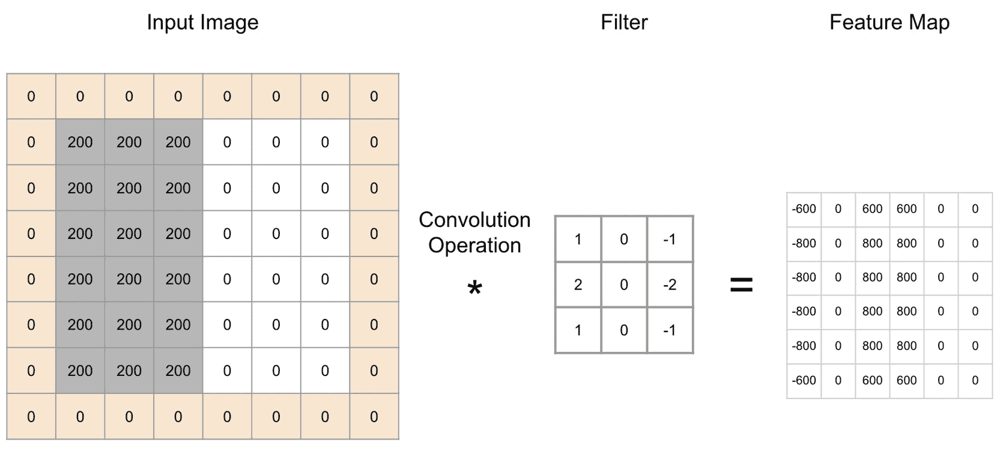

# 第三章：3\. 卷积神经网络（CNNs）进行图像分类

介绍

在本章中，我们将学习**卷积神经网络**（**CNNs**）和图像分类。首先，我们将介绍 CNN 的架构以及如何实现它们。接着，我们将通过实践，使用 TensorFlow 开发图像分类器。最后，我们将讨论迁移学习和微调的概念，并了解如何使用最先进的算法。

到本章结束时，你将对 CNN 有一个清晰的理解，并了解如何使用 TensorFlow 进行编程。

# 介绍

在前几章中，我们学习了传统的神经网络和一些模型，比如感知机。我们了解了如何在结构化数据上训练这些模型，以进行回归或分类任务。现在，我们将学习如何将这些模型应用扩展到计算机视觉领域。

不久前，计算机被认为是只能处理明确定义和逻辑任务的计算引擎。另一方面，人类则更加复杂，因为我们拥有五种基本感官，帮助我们看事物、听声音、触摸物体、品尝食物和闻气味。计算机只是可以进行大量逻辑操作的计算器，但它们无法处理复杂的数据。与人类的能力相比，计算机有着明显的局限性。

曾经有一些原始的尝试，通过处理和分析数字图像来“*赋予计算机视觉*”。这个领域被称为计算机视觉。但直到深度学习的出现，我们才看到了一些令人难以置信的进展和成果。如今，计算机视觉领域已经取得了如此显著的进展，以至于在某些情况下，计算机视觉 AI 系统能够比人类更快、更准确地处理和解释某些类型的图像。你可能听说过这样一个实验：中国的 15 位医生与 BioMind AI 公司的深度学习系统进行比赛，试图从 X 光片中识别脑肿瘤。AI 系统用了 15 分钟准确预测了 225 张输入图像中的 87%，而医生们用了 30 分钟，在同一组图像上获得了 66%的准确率。

我们都听说过自动驾驶汽车，它们可以根据交通状况自动做出正确决策，或者无人机可以检测到鲨鱼并自动向救生员发送警报。所有这些令人惊叹的应用都要归功于 CNN 的最新发展。

计算机视觉可以分为四个不同的领域：

+   **图像分类**，我们需要在图像中识别主要物体。

+   **图像分类和定位**，我们需要在图像中识别并用边界框定位主要物体。

+   **目标检测**，我们需要在图像中识别多个物体并用边界框进行标注。

+   **图像分割**，我们需要识别图像中物体的边界。

下图显示了四个领域之间的差异：


图 3.1：计算机视觉四个领域之间的差异

本章我们将只讨论图像分类，它是卷积神经网络（CNN）最广泛应用的领域。这包括车牌识别、手机拍摄图片的自动分类，或为搜索引擎在图像数据库中创建元数据等内容。

注意

如果您正在阅读本书的印刷版，可以通过访问以下链接下载并浏览本章中部分图像的彩色版本：[`packt.live/2ZUu5G2`](https://packt.live/2ZUu5G2)

# 数字图像

人类通过眼睛看到事物，将光转化为电信号，然后由大脑处理。但计算机没有物理眼睛来捕捉光线。它们只能处理由位（0 或 1）组成的数字信息。因此，为了“看到”，计算机需要图像的数字化版本。

数字图像是由二维像素矩阵构成的。对于灰度图像，每个像素的值介于 0 到 255 之间，表示其强度或灰度级别。数字图像可以由一个通道（用于黑白图像）或三个通道（红、蓝、绿通道，用于彩色图像）组成：


图 3.2：图像的数字表示

数字图像的特点是其尺寸（高度、宽度和通道）：

+   **高度：** 表示垂直方向上的像素数量。

+   **宽度：** 表示水平方向上的像素数量。

+   **通道：** 表示通道的数量。如果只有一个通道，图像将是灰度图。如果有三个通道，图像将是彩色图。

以下数字图像的尺寸为（512，512，3）。


图 3.3：数字图像的尺寸

# 图像处理

现在我们知道了数字图像是如何表示的，接下来讨论计算机如何利用这些信息找到用于分类图像或定位物体的模式。因此，为了从图像中获取任何有用或可操作的信息，计算机必须将图像解析为可识别或已知的模式。与任何机器学习算法一样，计算机视觉需要一些特征来学习模式。

与结构化数据不同，结构化数据中的每个特征在预先定义并存储在不同的列中，而图像并没有遵循任何特定模式。例如，无法说第三行总是包含动物的眼睛，或者左下角总是表示一个红色的圆形物体。图像可以是任何东西，并不遵循任何结构。因此，它们被视为非结构化数据。

然而，图像确实包含特征。它们包含不同的形状（线条、圆圈、矩形等）、颜色（红色、蓝色、橙色、黄色等）以及与不同类型物体相关的特定特征（头发、车轮、叶子等）。我们的眼睛和大脑可以轻松分析和解释所有这些特征，并识别图像中的对象。因此，我们需要为计算机模拟相同的分析过程。这就是**图像滤波器**（也称为卷积核）发挥作用的地方。

图像滤波器是专用于检测定义模式的小型矩阵。例如，我们可以有一个仅检测垂直线条的滤波器，另一个仅用于水平线条。计算机视觉系统在图像的每个部分运行这些滤波器，并生成一个新图像，突出显示检测到的模式。这类生成的图像称为**特征图**。使用边缘检测滤波器的特征图示例如下图所示：


图 3.4：垂直边缘特征图示例

这些滤波器广泛应用于图像处理中。如果您以前使用过 Adobe Photoshop（或任何其他图像处理工具），您很可能已经使用过诸如*高斯*和*锐化*之类的滤镜。

## 卷积运算

现在我们了解了图像处理的基础知识，我们可以开始我们的 CNN 之旅。正如我们之前提到的，计算机视觉依赖于将滤波器应用于图像的像素，以识别不同的模式或特征并生成特征图。但是这些滤波器是如何应用到图像的像素上的呢？您可以猜测这背后有某种数学操作，您是完全正确的。这个操作被称为卷积。

卷积操作由两个阶段组成：

+   两个矩阵的逐元素乘积

+   矩阵元素的总和

让我们看一个如何对矩阵 A 和 B 进行卷积的示例：


图 3.5：矩阵示例

首先，我们需要对矩阵 A 和 B 进行逐元素乘法。结果将得到另一个矩阵 C，其数值如下：

+   第一行，第一列：5 × 1 = 5

+   第一行，第二列：10 × 0 = 0

+   第一行，第三列：15 × (-1) = -15

+   第二行，第一列：10 × 2 = 20

+   第二行，第二列：20 × 0 = 0

+   第二行，第三列：30 × (-2) = -60

+   第三行，第一列：100 × 1 = 100

+   第三行，第二列：150 × 0 = 0

+   第三行，第三列：200 × (-1) = -200

    注意

    逐元素乘法与标准矩阵乘法不同，后者在行和列级别操作而不是在每个元素上操作。

最后，我们只需对矩阵 C 的所有元素进行求和，得到如下结果：

5+0-15+20+0-60+100+0-200 = -150

在矩阵 A 和 B 的整个卷积操作的最终结果如下图所示，为-150：


图 3.6：卷积操作的顺序

在这个例子中，矩阵 B 实际上是一个叫做 Sobel 的滤波器（或卷积核），用于检测垂直线条（还有一个变体用于检测水平线条）。矩阵 A 将是图像的一部分，其尺寸与滤波器相同（这是执行逐元素相乘所必须的）。

注意

滤波器通常是一个方阵，例如(3,3)或(5,5)。

对于 CNN，滤波器实际上是训练过程中学习到的参数（即由 CNN 定义的）。因此，将要使用的每个滤波器的值将由 CNN 本身设置。这是我们在学习如何训练 CNN 之前需要了解的一个重要概念。

## 练习 3.01：实现卷积操作

在本次练习中，我们将使用 TensorFlow 对两个矩阵：`[[1,2,3],[4,5,6],[7,8,9]]`和`[[1,0,-1],[1,0,-1],[1,0,-1]]`实现卷积操作。请按照以下步骤完成此练习：

1.  打开一个新的 Jupyter Notebook 文件，并命名为`Exercise 3.01`。

1.  导入`tensorflow`库：

    ```py
    import tensorflow as tf
    ```

1.  从第一个矩阵`([[1,2,3],[4,5,6],[7,8,9]])`创建一个名为`A`的张量，并打印它的值：

    ```py
    A = tf.Variable([[1, 2, 3], [4, 5, 6], [7, 8, 9]])
    A
    ```

    输出将如下所示：

    ```py
    <tf.Variable 'Variable:0' shape=(3, 3) dtype=int32, 
    numpy=array([[1, 2, 3],
                 [4, 5, 6],
                 [7, 8, 9]])>
    ```

1.  从第一个矩阵`([[1,0,-1],[1,0,-1],[1,0,-1]])`创建一个名为`B`的张量，并打印它的值：

    ```py
    B = tf.Variable([[1, 0, -1], [1, 0, -1], [1, 0, -1]])
    B
    ```

    输出将如下所示：

    ```py
    <tf.Variable 'Variable:0' shape=(3, 3) dtype=int32, 
    numpy=array([[ 1,  0, -1],
                 [ 1,  0, -1],
                 [ 1,  0, -1]])>
    ```

1.  使用`tf.math.multiply()`对`A`和`B`进行逐元素相乘。将结果保存到`mult_out`并打印出来：

    ```py
    mult_out = tf.math.multiply(A, B)
    mult_out
    ```

    预期的输出将如下所示：

    ```py
    <tf.Tensor: id=19, shape=(3, 3), dtype=int32, 
    numpy=array([[ 1,  0, -3],
                 [ 4,  0, -6],
                 [ 7,  0, -9]])>
    ```

1.  使用`tf.math.reduce_sum()`对`mult_out`进行逐元素求和。将结果保存到`conv_out`并打印出来：

    ```py
    conv_out = tf.math.reduce_sum(mult_out)
    conv_out
    ```

    预期的输出将如下所示：

    ```py
    <tf.Tensor: id=21, shape=(), dtype=int32, numpy=-6>
    ```

    对两个矩阵`[[1,2,3],[4,5,6],[7,8,9]]`和`[[1,0,-1],[1,0,-1],[1,0,-1]]`进行卷积操作的结果是`-6`。

    注意

    要访问此特定部分的源代码，请参考[`packt.live/320pEfC`](https://packt.live/320pEfC)。

    你也可以在[`packt.live/2ZdeLFr`](https://packt.live/2ZdeLFr)上在线运行此示例。你必须执行整个 Notebook 才能得到期望的结果。

在本次练习中，我们使用了 TensorFlow 的内置函数对两个矩阵进行了卷积操作。

## 步幅

到目前为止，我们已经学会了如何执行单次卷积操作。我们了解到，卷积操作使用一个特定大小的滤波器，例如(3, 3)，即 3×3，并将其应用于相似大小的图像部分。如果我们有一个大图像，比如(512, 512)大小，我们实际上只需要看图像的一个非常小的部分。

在一次次处理图像的过程中，我们需要对整个图像空间进行相同的卷积操作。为此，我们将应用一个叫做滑动的技术。顾名思义，滑动就是将滤波器应用到上次卷积操作的相邻区域：我们只需要滑动滤波器并继续应用卷积。

如果我们从图像的左上角开始，我们可以每次将滤波器滑动一个像素到右边。当我们到达右边缘时，可以将滤波器向下滑动一个像素。我们重复这个滑动操作，直到对图像的整个区域应用卷积：


图 3.7：步长示例

我们不仅可以每次滑动 1 个像素，还可以选择更大的滑动窗口，比如 2 个或 3 个像素。定义此滑动窗口大小的参数称为**步长（stride）**。步长值越大，重叠的像素就越少，但得到的特征图尺寸会更小，因此会丢失一些信息。

在前面的示例中，我们在一幅水平分割的图像上应用了 Sobel 滤波器，左边有深色值，右边有白色值。得到的特征图中间有较高的值（800），这表示 Sobel 滤波器在该区域找到了垂直线。这就是滑动卷积如何帮助检测图像中特定模式的方式。

## 填充

在前一节中，我们学习了如何通过像素滑动使滤波器遍历图像的所有像素。结合卷积操作，这个过程有助于检测图像中的模式（即提取特征）。

对图像应用卷积将导致一个特征图，其尺寸比输入图像小。可以使用一种叫做填充（padding）的技术，确保特征图与输入图像具有相同的尺寸。它通过在图像边缘添加一个像素值为`0`的像素层来实现：


图 3.8：填充示例

在前面的示例中，输入图像的尺寸是（6,6）。一旦填充，它的尺寸增加到（8,8）。现在，我们可以使用大小为（3,3）的滤波器在其上应用卷积：



图 3.9：填充卷积示例

对填充图像进行卷积后的结果图像，其尺寸为（6,6），这与原始输入图像的尺寸完全相同。得到的特征图在图像的中间有较高的值，正如前面的未填充示例一样。因此，滤波器仍然可以在图像中找到相同的模式。但现在你可能会注意到，在左边缘有非常低的值（-800）。这实际上是可以接受的，因为较低的值意味着滤波器在该区域没有找到任何模式。

以下公式可以用来计算卷积后特征图的输出尺寸：


图 3.10：计算特征图输出尺寸的公式

在这里，我们有以下内容：

+   `w`：输入图像的宽度

+   `h`：输入图像的高度

+   `p`：每个边缘用于填充的像素数量

+   `f`：滤波器大小

+   `s`：步幅中的像素数

让我们将这个公式应用到前面的例子中：

+   `w` = 6

+   `h` = 6

+   `p` = 1

+   `f` = 3

+   `s` = 1

然后，按照以下方式计算输出维度：


图 3.11：输出—特征图的维度

所以，结果特征图的维度是（6，6）。

# 卷积神经网络

在*第二章*，*神经网络*中，你学习了传统的神经网络，比如感知机，这些网络由全连接层（也叫稠密层）组成。每一层由执行矩阵乘法的神经元组成，然后进行非线性变换，使用激活函数。

CNN 实际上与传统的神经网络非常相似，但它们使用的是卷积层，而不是全连接层。每个卷积层会有一定数量的滤波器（或称为核），这些滤波器会对输入图像执行卷积操作，步幅固定，可以选择是否填充，并且可以在后面跟上激活函数。

CNN 广泛应用于图像分类，在这种情况下，网络需要预测给定输入的正确类别。这与传统机器学习算法中的分类问题完全相同。如果输出只能来自两个不同的类别，那么就是**二分类**，例如识别狗与猫。如果输出可以是多个类别，那么就是**多分类**，例如识别 20 种不同的水果。

为了进行这样的预测，CNN 模型的最后一层需要是一个全连接层，并根据预测问题的类型使用相应的激活函数。你可以使用以下激活函数列表作为经验法则：


图 3.12：激活函数列表

为了更好地理解其结构，下面是一个简单 CNN 模型的示意图：


图 3.13：简单 CNN 模型的结构

我们已经学到了很多关于卷积神经网络（CNN）的知识。在开始第一个练习之前，我们还需要了解一个概念，以便缩短 CNN 的训练时间：池化层。

# 池化层

池化层用于减少卷积层特征图的维度。那么，为什么我们需要进行这种下采样呢？一个主要原因是减少网络中计算的数量。添加多层不同滤波器的卷积操作会显著影响训练时间。此外，减少特征图的维度可以消除一些噪声，帮助我们专注于检测到的模式。通常，我们会在每个卷积层后面添加池化层，以减少特征图的大小。

池化操作的作用与滤波器非常相似，但与卷积操作不同，它使用诸如平均值或最大值（最大值是当前 CNN 架构中最广泛使用的函数）等聚合函数。例如，**最大池化**会查看特征图的一个特定区域，并找出其像素的最大值。然后，它会执行一个步幅操作，找到邻近像素中的最大值。它会重复这个过程，直到处理完整个图像：


图 3.14：在输入图像上使用步幅为 2 的最大池化

在上述示例中，我们使用了大小为（2，2）、步幅为 2 的最大池化（这是最常用的池化函数）。我们查看特征图的左上角，并从像素值 6、8、1 和 2 中找出最大值，得到结果 8。然后，我们按照步幅 2 滑动最大池化，针对像素值 6、1、7 和 4 执行相同的操作。我们重复对底部组的相同操作，得到了一个大小为（2，2）的新特征图。

带有最大池化的 CNN 模型将如下所示：


图 3.15：带有最大池化的 CNN 架构示例

例如，上述模型可用于识别手写数字（从 0 到 9）。这个模型有三层卷积层，后面跟着一个最大池化层。最后的几层是全连接层，负责做出检测到的数字的预测。

添加池化层的开销远小于计算卷积。这就是它们能加速训练时间的原因。

## 使用 TensorFlow 和 Keras 的 CNN

到目前为止，你已经了解了很多关于 CNN 如何在背后工作的信息。现在，终于到了展示如何实现我们所学的内容的时候了。我们将使用 TensorFlow 2.0 中的 Keras API。

Keras API 提供了一个高层次的 API，用于构建你自己的 CNN 架构。我们来看看我们将在 CNN 中使用的主要类。

首先，为了创建一个卷积层，我们需要实例化一个`Conv2D()`类，并指定卷积核的数量、大小、步幅、填充方式和激活函数：

```py
from tensorflow.keras import layers
layers.Conv2D(64, kernel_size=(3, 3), stride=(2,2), \
              padding="same", activation="relu")
```

在前面的示例中，我们创建了一个卷积层，使用了`64`个大小为`(3, 3)`的卷积核，步幅为`2`，填充方式为`same`，使得输出维度与输入维度相同，并且激活函数为 ReLU。

注意

你可以通过访问 TensorFlow 的文档网站，了解更多关于这个类的信息：[`www.tensorflow.org/api_docs/python/tf/keras/layers/Conv2D`](https://www.tensorflow.org/api_docs/python/tf/keras/layers/Conv2D)

为了添加一个最大池化层，你需要使用`MaxPool2D()`类，并指定其维度和步幅，如下所示的代码片段：

```py
from tensorflow.keras import layers
layers.MaxPool2D(pool_size=(3, 3), strides=1)
```

在上面的代码片段中，我们实例化了一个大小为`(3,3)`，步幅为`1`的最大池化层。

注意

你可以通过访问 TensorFlow 的文档网站了解更多关于这个类的信息：[`www.tensorflow.org/api_docs/python/tf/keras/layers/MaxPool2D`](https://www.tensorflow.org/api_docs/python/tf/keras/layers/MaxPool2D)

对于全连接层，我们将使用`Dense()`类并指定单元数量和激活函数：

```py
from tensorflow.keras import layers
layers.Dense(units=1, activation='sigmoid')
```

上述代码向我们展示了如何创建一个具有`1`个输出单元并使用`sigmoid`作为激活函数的全连接层。

最后，在操作输入数据时，我们可能需要在将其输入到 CNN 模型之前更改其维度。如果我们使用 NumPy 数组，可以使用`reshape`方法（如在*第一章*，*深度学习的构建模块*中所示），具体如下：

```py
features_train.reshape(60000, 28, 28, 1)
```

在这里，我们已经将`features_train`的维度转换为`(60000, 28, 28, 1)`，这对应于格式（观察数量，高度，宽度，通道）。在处理灰度图像时，需要添加通道维度。本例中，灰度图像的维度`(28,28)`将被重塑为`(28,28,1)`，总共有`60000`张图像。

在 TensorFlow 中，你可以使用`reshape`方法，如下所示：

```py
from tensorflow.keras import layers
layers.Reshape((60000, 28, 28, 1))
```

现在我们已经学习了如何在 TensorFlow 中设计一个 CNN，接下来是将这些知识应用于著名的 MNIST 数据集。

注意

你可以通过访问 TensorFlow 的文档网站了解更多关于 Reshape 的信息：[`www.tensorflow.org/api_docs/python/tf/keras/layers/Reshape`](https://www.tensorflow.org/api_docs/python/tf/keras/layers/Reshape)

## 练习 3.02：使用 KERAS 和 CNN 识别手写数字（MNIST）

在本练习中，我们将处理 MNIST 数据集（在*第二章，神经网络*中我们已经用过它），该数据集包含手写数字的图像。不过这一次，我们将使用 CNN 模型。这个数据集最初由深度学习领域最著名的研究者之一 Yann Lecun 分享。我们将构建一个 CNN 模型，并训练它识别手写数字。这个 CNN 模型将由两个卷积层组成，每个卷积层有 64 个卷积核，后面接着两个全连接层，分别包含 128 和 10 个单元。

TensorFlow 直接通过其 API 提供此数据集。执行以下步骤以完成此练习：

注意

你可以通过访问 TensorFlow 的网站了解更多关于这个数据集的信息：[`www.tensorflow.org/datasets/catalog/mnist`](https://www.tensorflow.org/datasets/catalog/mnist)

1.  打开一个新的 Jupyter Notebook 文件，并将其命名为`Exercise 3.02`。

1.  导入`tensorflow.keras.datasets.mnist`为`mnist`：

    ```py
    import tensorflow.keras.datasets.mnist as mnist
    ```

1.  使用`mnist.load_data()`加载`mnist`数据集，并将结果保存到`(features_train, label_train), (features_test, label_test)`中：

    ```py
    (features_train, label_train), (features_test, label_test) = \
    mnist.load_data()
    ```

1.  打印`label_train`的内容：

    ```py
    label_train
    ```

    预期输出将如下所示：

    ```py
    array([5, 0, 4, ..., 5, 6, 8], dtype=uint8)
    ```

    标签列包含与 10 个手写数字对应的数字值：`0` 到 `9`。

1.  打印训练集的形状：

    ```py
    features_train.shape
    ```

    预期输出如下所示：

    ```py
    (60000, 28, 28)
    ```

    训练集由`60000`个形状为`28`×`28`的观测数据组成。

1.  打印测试集的`shape`：

    ```py
    features_test.shape
    ```

    预期输出如下所示：

    ```py
    (10000, 28, 28)
    ```

    测试集由`10000`个形状为`28`×`28`的观测数据组成。

1.  将训练集和测试集的形状调整为`(number_observations, 28, 28, 1)`：

    ```py
    features_train = features_train.reshape(60000, 28, 28, 1)
    features_test = features_test.reshape(10000, 28, 28, 1)
    ```

1.  通过将`features_train`和`features_test`除以`255`来标准化它们：

    ```py
    features_train = features_train / 255.0
    features_test = features_test / 255.0
    ```

1.  导入`numpy`作为`np`，`tensorflow`作为`tf`，并从`tensorflow.keras`导入`layers`：

    ```py
    import numpy as np
    import tensorflow as tf
    from tensorflow.keras import layers
    ```

1.  使用`np.random_seed()`和`tf.random.set_seed()`分别将`8`设为`numpy`和`tensorflow`的种子：

    ```py
    np.random.seed(8)
    tf.random.set_seed(8)
    ```

    注意

    设置种子后，结果可能仍然会略有不同。

1.  实例化一个`tf.keras.Sequential()`类，并将其保存到名为`model`的变量中：

    ```py
    model = tf.keras.Sequential()
    ```

1.  实例化一个`layers.Conv2D()`类，设定`64`个形状为`(3,3)`的卷积核，`activation='relu'`，`input_shape=(28,28,1)`，并将其保存到名为`conv_layer1`的变量中：

    ```py
    conv_layer1 = layers.Conv2D(64, (3,3), activation='relu', \
                                input_shape=(28, 28, 1))
    ```

1.  实例化一个`layers.Conv2D()`类，设定`64`个形状为`(3,3)`的卷积核，`activation='relu'`，并将其保存到名为`conv_layer2`的变量中：

    ```py
    conv_layer2 = layers.Conv2D(64, (3,3), activation='relu')
    ```

1.  实例化一个`layers.Flatten()`类，设定`128`个神经元，`activation='relu'`，并将其保存到名为`fc_layer1`的变量中：

    ```py
    fc_layer1 = layers.Dense(128, activation='relu')
    ```

1.  实例化一个`layers.Flatten()`类，设定`10`个神经元，`activation='softmax'`，并将其保存到名为`fc_layer2`的变量中：

    ```py
    fc_layer2 = layers.Dense(10, activation='softmax')
    ```

1.  使用`.add()`将你刚刚定义的四个层添加到模型中，在每个卷积层之间添加一个大小为`(2,2)`的`MaxPooling2D()`层，并在第一个全连接层之前添加一个`Flatten()`层来展平特征图：

    ```py
    model.add(conv_layer1)
    model.add(layers.MaxPooling2D(2, 2))
    model.add(conv_layer2)
    model.add(layers.MaxPooling2D(2, 2))
    model.add(layers.Flatten())
    model.add(fc_layer1)
    model.add(fc_layer2)
    ```

1.  实例化一个`tf.keras.optimizers.Adam()`类，设置学习率为`0.001`，并将其保存到名为`optimizer`的变量中：

    ```py
    optimizer = tf.keras.optimizers.Adam(0.001)
    ```

1.  使用`.compile()`编译神经网络，设置`loss='sparse_categorical_crossentropy'`，`optimizer=optimizer`，`metrics=['accuracy']`：

    ```py
    model.compile(loss='sparse_categorical_crossentropy', \
                  optimizer=optimizer, metrics=['accuracy'])
    ```

1.  打印模型摘要：

    ```py
    model.summary()
    ```

    预期输出如下所示：

    

    图 3.16：模型摘要

    上述摘要显示该模型有超过 240,000 个需要优化的参数。

1.  使用训练集拟合神经网络，并指定`epochs=5`，`validation_split=0.2`，`verbose=2`：

    ```py
    model.fit(features_train, label_train, epochs=5,\
              validation_split = 0.2, verbose=2)
    ```

    预期输出如下所示：

    

    图 3.17：训练输出

    我们在 48,000 个样本上训练了我们的 CNN，并使用了 12,000 个样本作为验证集。在训练了五个 epoch 后，我们在训练集上获得了`0.9951`的准确率，在验证集上获得了`0.9886`的准确率。我们的模型有些过拟合。

1.  让我们评估模型在测试集上的表现：

    ```py
    model.evaluate(features_test, label_test)
    ```

    预期输出如下所示：

    ```py
    10000/10000 [==============================] - 1s 86us/sample - 
    loss: 0.0312 - accuracy: 0.9903 [0.03115778577708088, 0.9903]
    ```

    通过这个，我们在测试集上达到了`0.9903`的准确率。

    注意

    要访问此特定部分的源代码，请参考[`packt.live/2W2VLYl`](https://packt.live/2W2VLYl)。

    您还可以在 [`packt.live/3iKAVGZ`](https://packt.live/3iKAVGZ) 上在线运行此示例。您必须执行整个 Notebook 才能获得期望的结果。

在本次练习中，我们设计并训练了一个 CNN 架构，用于识别来自 MNIST 数据集的手写数字图像，并取得了几乎完美的成绩。

## 数据生成器

在之前的练习中，我们在 MNIST 数据集上构建了第一个多类 CNN 分类器。我们将整个数据集加载到模型中，因为数据集并不大。但是对于更大的数据集，我们无法这样做。幸运的是，Keras 提供了一个名为 **data generator** 的 API，允许我们以批次的方式加载和转换数据。

数据生成器在图像分类中也非常有用。有时，图像数据集以文件夹的形式存在，并且为训练集、测试集和不同的类别预定义了结构（属于同一类别的所有图像将存储在同一个文件夹中）。数据生成器 API 能够理解这种结构，并将相关图像和对应的信息正确地提供给 CNN 模型。这将为您节省大量时间，因为您不需要构建自定义管道来从不同的文件夹加载图像。

此外，数据生成器可以将图像划分为多个批次，并按顺序将它们提供给模型。您不必将整个数据集加载到内存中就可以进行训练。让我们看看它们是如何工作的。

首先，我们需要从 `tensorflow.keras.preprocessing` 中导入 `ImageDataGenerator` 类：

```py
from tensorflow.keras.preprocessing.image \
import ImageDataGenerator
```

然后，我们可以通过提供所有想要执行的图像转换来实例化它。在以下示例中，我们将仅通过将所有训练集图像除以 `255` 来对图像进行归一化，这样所有像素值都将在 `0` 到 `1` 之间：

```py
train_imggen = ImageDataGenerator(rescale=1./255)
```

在这一步骤中，我们将通过使用 `.flow_from_directory()` 方法来创建一个数据生成器，并指定训练目录的路径、`batch_size`、图像的 `target_size`、是否打乱数据以及类别类型：

```py
train_datagen = train_imggen.\
                flow_from_directory(batch_size=32, \
                                    directory=train_dir, \
                                    shuffle=True, \
                                    target_size=(100, 100), \
                                    class_mode='binary')
```

注意

您需要为验证集创建一个单独的数据生成器。

最后，我们可以通过提供训练集和验证集的数据生成器、训练周期数和每个周期的步数来使用 `.fit_generator()` 方法训练我们的模型，步数是图像总数除以批次大小（取整）的结果：

```py
model.fit_generator(train_data_gen, \
                    steps_per_epoch=total_train // batch_size, \
                    epochs=5, validation_data=val_data_gen, \
                    validation_steps=total_val // batch_size)
```

该方法与您之前看到的 `.fit()` 方法非常相似，但不同之处在于，它不是一次性将整个数据集训练完，而是通过我们定义的数据生成器按批次训练图像。步数定义了处理整个数据集所需的批次数量。

数据生成器非常适合从文件夹中加载数据，并按批次将图像输入到模型中。但它们也可以执行一些数据处理操作，如以下章节所示。

## 练习 3.03：使用数据生成器分类猫狗图像

在本练习中，我们将使用猫狗数据集，该数据集包含狗和猫的图像。我们将为训练集和验证集构建两个数据生成器，并构建一个 CNN 模型来识别狗或猫的图像。请按照以下步骤完成本练习：

注意

我们使用的数据集是 Kaggle 猫狗数据集的修改版：[`www.kaggle.com/c/dogs-vs-cats/data`](https://www.kaggle.com/c/dogs-vs-cats/data)。这个修改版只使用了 25,000 张图像的子集，并由 Google 提供，链接为[`storage.googleapis.com/mledu-datasets/cats_and_dogs_filtered.zip`](https://storage.googleapis.com/mledu-datasets/cats_and_dogs_filtered.zip)。

1.  打开一个新的 Jupyter Notebook 文件，并将其命名为`Exercise 3.03`：

1.  导入`tensorflow`库：

    ```py
    import tensorflow as tf
    ```

1.  创建一个名为`file_url`的变量，包含数据集的链接：

    ```py
    file_url = 'https://github.com/PacktWorkshops'\
               '/The-Deep-Learning-Workshop/raw/master'\
               '/Chapter03/Datasets/Exercise3.03'\
               '/cats_and_dogs_filtered.zip'
    ```

    注意

    在上述步骤中，我们使用的是存储在[`packt.live/3jZKRNw`](https://packt.live/3jZKRNw)的数据库。如果您将数据集存储在其他 URL，请相应地更改高亮的路径。注意下面字符串中的斜杠。记住，反斜杠(`\`)用于跨多行分隔代码，而正斜杠(`/`)是 URL 的一部分。

1.  使用`tf.keras.get_file`下载数据集，参数为`'cats_and_dogs.zip'`、`origin=file_url`、`extract=True`，并将结果保存到一个名为`zip_dir`的变量中：

    ```py
    zip_dir = tf.keras.utils.get_file('cats_and_dogs.zip', \
                                       origin=file_url, extract=True)
    ```

1.  导入`pathlib`库：

    ```py
    import pathlib
    ```

1.  创建一个名为`path`的变量，使用`pathlib.Path(zip_dir).parent`获取`cats_and_dogs_filtered`目录的完整路径：

    ```py
    path = pathlib.Path(zip_dir).parent / 'cats_and_dogs_filtered'
    ```

1.  创建两个变量，分别命名为`train_dir`和`validation_dir`，它们分别保存训练集和验证集文件夹的完整路径：

    ```py
    train_dir = path / 'train'
    validation_dir = path / 'validation'
    ```

1.  创建四个变量，分别命名为`train_cats_dir`、`train_dogs_dir`、`validation_cats_dir`和`validation_dogs_dir`，它们分别保存训练集和验证集中猫狗文件夹的完整路径：

    ```py
    train_cats_dir = train_dir / 'cats'
    train_dogs_dir = train_dir /'dogs'
    validation_cats_dir = validation_dir / 'cats'
    validation_dogs_dir = validation_dir / 'dogs'
    ```

1.  导入`os`包。我们将在下一步中需要它来统计文件夹中的图像数量：

    ```py
    import os
    ```

1.  创建两个变量，分别命名为`total_train`和`total_val`，它们将获取训练集和验证集中的图像数量：

    ```py
    total_train = len(os.listdir(train_cats_dir)) \
                      + len(os.listdir(train_dogs_dir))
    total_val = len(os.listdir(validation_cats_dir)) \
                    + len(os.listdir(validation_dogs_dir))
    ```

1.  从`tensorflow.keras.preprocessing`导入`ImageDataGenerator`：

    ```py
    from tensorflow.keras.preprocessing.image\
    import ImageDataGenerator
    ```

1.  实例化两个`ImageDataGenerator`类并命名为`train_image_generator`和`validation_image_generator`。这两个生成器将通过将图像像素值除以`255`来进行重缩放：

    ```py
    train_image_generator = ImageDataGenerator(rescale=1./255)
    validation_image_generator = ImageDataGenerator(rescale=1./255)
    ```

1.  创建三个变量，分别命名为`batch_size`、`img_height`和`img_width`，它们的值分别为`16`、`100`和`100`：

    ```py
    batch_size = 16
    img_height = 100
    img_width = 100
    ```

1.  使用`.flow_from_directory()`创建一个名为`train_data_gen`的数据生成器，并指定批量大小、训练文件夹的路径、`shuffle=True`、目标大小为`(img_height, img_width)`，并将类模式设置为`binary`：

    ```py
    train_data_gen = train_image_generator.flow_from_directory\
                     (batch_size=batch_size, directory=train_dir, \
                      shuffle=True, \
                      target_size=(img_height, img_width), \
                      class_mode='binary')
    ```

1.  使用`.flow_from_directory()`创建一个名为`val_data_gen`的数据生成器，并指定批量大小、验证文件夹的路径、`shuffle=True`、目标大小为`(img_height, img_width)`，以及类别模式为`binary`：

    ```py
    val_data_gen = validation_image_generator.flow_from_directory\
                  (batch_size=batch_size, \
                   directory=validation_dir, \
                   target_size=(img_height, img_width), \
                   class_mode='binary')
    ```

1.  导入`numpy`为`np`，`tensorflow`为`tf`，以及从`tensorflow.keras`导入`layers`：

    ```py
    import numpy as np
    import tensorflow as tf
    from tensorflow.keras import layers
    ```

1.  使用`np.random_seed()`和`tf.random.set_seed()`分别将`8`（这个值完全是任意的）设置为`numpy`和`tensorflow`的`seed`：

    ```py
    np.random.seed(8)
    tf.random.set_seed(8)
    ```

1.  实例化一个`tf.keras.Sequential()`类到一个名为`model`的变量中，包含以下层：一个具有`64`个`3`形状卷积核的卷积层，`ReLU`作为激活函数，并指定所需的输入维度；一个最大池化层；一个具有`128`个`3`形状卷积核的卷积层，`ReLU`作为激活函数；一个最大池化层；一个展平层；一个具有`128`个单元的全连接层，`ReLU`作为激活函数；一个具有`1`个单元的全连接层，`sigmoid`作为激活函数。

    代码如下所示：

    ```py
    model = tf.keras.Sequential([
        layers.Conv2D(64, 3, activation='relu', \
                      input_shape=(img_height, img_width ,3)),\
        layers.MaxPooling2D(),\
        layers.Conv2D(128, 3, activation='relu'),\
        layers.MaxPooling2D(),\
        layers.Flatten(),\
        layers.Dense(128, activation='relu'),\
        layers.Dense(1, activation='sigmoid')])
    ```

1.  实例化一个`tf.keras.optimizers.Adam()`类，学习率为`0.001`，并将其保存为名为`optimizer`的变量：

    ```py
    optimizer = tf.keras.optimizers.Adam(0.001)
    ```

1.  使用`.compile()`编译神经网络，设置`loss='binary_crossentropy', optimizer=optimizer, metrics=['accuracy']`：

    ```py
    model.compile(loss='binary_crossentropy', \
                  optimizer=optimizer, metrics=['accuracy'])
    ```

1.  使用`.summary()`打印模型摘要：

    ```py
    model.summary()
    ```

    预期输出将如下所示：

    

    图 3.18：模型总结

    前面的摘要显示该模型有超过`8,700,000`个参数需要优化。

1.  使用`fit_generator()`训练神经网络，并提供训练和验证数据生成器，`epochs=5`，每个 epoch 的步骤数，以及验证步骤数：

    ```py
    model.fit_generator(train_data_gen, \
                        steps_per_epoch=total_train // batch_size, \
                        epochs=5, \
                        validation_data=val_data_gen,\
                        validation_steps=total_val // batch_size)
    ```

    预期输出将如下所示：

    

图 3.19：训练输出

注意

预期的输出将接近所示的结果。由于权重初始化时存在一些随机性，你的准确度值可能会有所不同。

我们已经训练了我们的 CNN 五个 epoch，训练集的准确率为`0.85`，验证集的准确率为`0.7113`。我们的模型过拟合严重。你可能需要尝试不同的架构进行训练，看看是否能够提高这个分数并减少过拟合。你还可以尝试给模型输入你选择的猫狗图片，并查看输出的预测结果。

注意

要访问该特定部分的源代码，请参考[`packt.live/31XQmp9`](https://packt.live/31XQmp9)。

你也可以在线运行这个例子，网址是[`packt.live/2ZW10tW`](https://packt.live/2ZW10tW)。你必须执行整个 Notebook 才能得到预期的结果。

# 数据增强

在前面的部分中，您已经了解到数据生成器可以完成大量繁重的工作，例如从文件夹而不是列数据中为神经网络处理数据。到目前为止，我们已经看到了如何创建它们，从结构化文件夹加载数据，并按批次将数据提供给模型。我们仅对其执行了一个图像转换：重新缩放。然而，数据生成器可以执行许多其他图像转换。

但是为什么我们需要执行数据增强呢？答案非常简单：为了防止过拟合。通过进行数据增强，我们增加了数据集中的图像数量。例如，对于一张图像，我们可以生成 10 种不同的变体。因此，您的数据集大小将增加 10 倍。

此外，通过数据增强，我们拥有一组具有更广泛视觉范围的图像。例如，自拍照可以从不同角度拍摄，但是如果您的数据集只包含方向直的自拍照片，您的 CNN 模型将无法正确解释具有不同角度的其他图像。通过执行数据增强，您帮助模型更好地泛化到不同类型的图像。然而，正如您可能已经猜到的那样，它也有一个缺点：数据增强会增加训练时间，因为您需要执行额外的数据转换。

让我们快速看一下我们可以做的一些不同类型的数据增强。

## 水平翻转

水平翻转会返回一个水平翻转的图像：


图 3.20: 水平翻转示例

## 垂直翻转

垂直翻转会垂直翻转图像：


图 3.21: 垂直翻转示例

## 缩放

图像可以被放大，并提供不同大小的图像对象：


图 3.22: 缩放示例

## 水平移动

水平移动，顾名思义，将在水平轴上移动图像，但保持图像尺寸不变。通过这种转换，图像可能会被裁剪，需要生成新像素来填补空白。常见的技术是复制相邻像素或用黑色像素填充该空间：


图 3.23: 水平移动示例

## 垂直移动

垂直移动与水平移动类似，但是沿垂直轴：


图 3.24: 垂直移动示例

## 旋转

图像可以像这样以特定角度旋转：


图 3.25: 旋转示例

## 剪切

剪切变换是通过沿边缘轴移动图像的一边来实现的。执行此操作后，图像会从矩形变形为平行四边形：


图 3.26：剪切示例

使用 `Keras`，所有这些数据变换技术都可以添加到 `ImageDataGenerator` 中：

```py
from tensorflow.keras.preprocessing.image import ImageDataGenerator
ImageDataGenerator(rescale=1./255, \
                   horizontal_flip=True, zoom_range=0.2, \
                   width_shift_range=0.2, \
                   height_shift_range=0.2, \
                   shear_range=0.2, rotation_range=40, \
                   fill_mode='nearest')
```

现在我们对数据增强有了大致的了解，接下来让我们看看如何在以下练习中将其应用到模型中。

## 练习 3.04：使用数据增强进行图像分类（CIFAR-10）

在这个练习中，我们将使用 CIFAR-10 数据集（加拿大高级研究院数据集），该数据集包含了 60,000 张属于 10 个不同类别的图像：飞机、汽车、鸟类、猫、鹿、狗、青蛙、马、船和卡车。我们将构建一个 CNN 模型并使用数据增强来识别这些类别。请按照以下步骤完成这个练习：

注意

你可以在 TensorFlow 的官方网站上了解更多关于此数据集的信息：[`www.tensorflow.org/api_docs/python/tf/keras/datasets/cifar10`](https://www.tensorflow.org/api_docs/python/tf/keras/datasets/cifar10)。

1.  打开一个新的 Jupyter Notebook 文件，并将其命名为 `Exercise 3.04`。

1.  导入 `tensorflow.keras.datasets.cifar10`：

    ```py
    from tensorflow.keras.datasets import cifar10
    ```

1.  使用 `cifar10.load_data()` 加载 CIFAR-10 数据集，并将结果保存到 `(features_train, label_train), (features_test, label_test)`：

    ```py
    (features_train, label_train), (features_test, label_test) = \
    cifar10.load_data()
    ```

1.  打印 `features_train` 的形状：

    ```py
    features_train.shape
    ```

    预期输出将如下所示：

    ```py
     (50000, 32, 32, 3)
    ```

    训练集包含了 `50000` 张尺寸为 `(32,32,3)` 的图像。

1.  创建三个变量，分别命名为 `batch_size`、`img_height` 和 `img_width`，并将它们的值分别设置为 `16`、`32` 和 `32`：

    ```py
    batch_size = 16
    img_height = 32
    img_width = 32
    ```

1.  从 `tensorflow.keras.preprocessing` 导入 `ImageDataGenerator`：

    ```py
    from tensorflow.keras.preprocessing.image import ImageDataGenerator
    ```

1.  创建一个名为 `train_img_gen` 的 `ImageDataGenerator` 实例，并应用数据增强：重缩放（除以 255）、`width_shift_range=0.1`、`height_shift_range=0.1` 以及水平翻转：

    ```py
    train_img_gen = ImageDataGenerator\
                    (rescale=1./255, width_shift_range=0.1, \
                     height_shift_range=0.1, horizontal_flip=True)
    ```

1.  创建一个名为 `val_img_gen` 的 `ImageDataGenerator` 实例，并应用重缩放（除以 255）：

    ```py
    val_img_gen = ImageDataGenerator(rescale=1./255)
    ```

1.  使用 `.flow()` 方法创建一个名为 `train_data_gen` 的数据生成器，并指定训练集的批量大小、特征和标签：

    ```py
    train_data_gen = train_img_gen.flow\
                     (features_train, label_train, \
                     batch_size=batch_size)
    ```

1.  使用 `.flow()` 方法创建一个名为 `val_data_gen` 的数据生成器，并指定测试集的批量大小、特征和标签：

    ```py
    val_data_gen = train_img_gen.flow\
                   (features_test, label_test, \
                    batch_size=batch_size)
    ```

1.  导入 `numpy` 为 `np`，`tensorflow` 为 `tf`，以及从 `tensorflow.keras` 导入 `layers`：

    ```py
    import numpy as np
    import tensorflow as tf
    from tensorflow.keras import layers
    ```

1.  使用 `np.random_seed()` 和 `tf.random.set_seed()` 设置 `8` 作为 `numpy` 和 `tensorflow` 的随机种子：

    ```py
    np.random.seed(8)
    tf.random.set_seed(8)
    ```

1.  实例化一个 `tf.keras.Sequential()` 类，并将其赋值给名为 `model` 的变量，使用以下层：一个具有 `64` 个 `3` 核心的卷积层，ReLU 激活函数，以及必要的输入维度；一个最大池化层；一个具有 `128` 个 `3` 核心的卷积层，ReLU 激活函数；一个最大池化层；一个展平层；一个具有 `128` 单元和 ReLU 激活函数的全连接层；一个具有 `10` 单元和 Softmax 激活函数的全连接层。

    代码如下所示：

    ```py
    model = tf.keras.Sequential([
            layers.Conv2D(64, 3, activation='relu', \
                          input_shape=(img_height, img_width ,3)), \
            layers.MaxPooling2D(), \
            layers.Conv2D(128, 3, activation='relu'), \
            layers.MaxPooling2D(), \
            layers.Flatten(), \
            layers.Dense(128, activation='relu'), \
            layers.Dense(10, activation='softmax')])
    ```

1.  实例化一个 `tf.keras.optimizers.Adam()` 类，设置学习率为 `0.001`，并将其保存为名为 `optimizer` 的变量：

    ```py
    optimizer = tf.keras.optimizers.Adam(0.001)
    ```

1.  使用 `.compile()` 编译神经网络，参数为 `loss='sparse_categorical_crossentropy', optimizer=optimizer, metrics=['accuracy']`：

    ```py
    model.compile(loss='sparse_categorical_crossentropy', \
                  optimizer=optimizer, metrics=['accuracy'])
    ```

1.  使用 `fit_generator()` 训练神经网络，并提供训练和验证数据生成器，`epochs=5`，每个 epoch 的步数，以及验证步数：

    ```py
    model.fit_generator(train_data_gen, \
                        steps_per_epoch=len(features_train) \
                                        // batch_size, \
                        epochs=5, \
                        validation_data=val_data_gen, \
                        validation_steps=len(features_test) \
                                         // batch_size)
    ```

    预期输出将如下所示：

    

    ](img/B15385_03_27.jpg)

图 3.27：模型的训练日志

注意

要访问该特定部分的源代码，请参考 [`packt.live/31ZLyQk`](https://packt.live/31ZLyQk)。

你也可以在线运行这个示例，访问 [`packt.live/2OcmahS`](https://packt.live/2OcmahS)。你必须执行整个 Notebook 才能获得预期的结果。

在这个练习中，我们在 5 个 epoch 上训练了我们的 CNN，并在训练集上获得了 `0.6713` 的准确度，在验证集上获得了 `0.6582` 的准确度。我们的模型略微过拟合，但准确度相当低。你可能希望尝试不同的架构，看看是否可以通过例如增加卷积层来提高这个分数。

注意

上述练习的预期输出将接近于图示（图 3.27）。由于权重初始化中的一些随机性，你可能会看到略有不同的准确度值。

## 活动 3.01：基于 Fashion MNIST 数据集构建多类分类器

在这个活动中，你将训练一个卷积神经网络（CNN）来识别属于 10 个不同类别的服装图像。你将应用一些数据增强技术来减少过拟合的风险。你将使用由 TensorFlow 提供的 Fashion MNIST 数据集。请执行以下步骤来完成该活动：

注意

原始数据集由 Han Xiao 分享。你可以在 TensorFlow 网站上阅读更多关于该数据集的信息：[`www.tensorflow.org/datasets/catalog/mnist`](https://www.tensorflow.org/datasets/catalog/mnist)

1.  从 TensorFlow 导入 Fashion MNIST 数据集。

1.  重塑训练集和测试集。

1.  创建一个数据生成器，并应用以下数据增强：

    ```py
    rescale=1./255, 
    rotation_range=40, 
    width_shift_range=0.1, 
    height_shift_range=0.1, 
    shear_range=0.2, 
    zoom_range=0.2, 
    horizontal_flip=True, 
    fill_mode='nearest'
    ```

1.  创建神经网络架构，包含以下层次：一个卷积层`Conv2D(64, (3,3), activation='relu')`，后接`MaxPooling2D(2,2)`；一个卷积层`Conv2D(64, (3,3), activation='relu')`，后接`MaxPooling2D(2,2)`；一个展平层；一个全连接层`Dense(128, activation=relu)`；一个全连接层`Dense(10, activation='softmax')`。

1.  指定一个学习率为`0.001`的 Adam 优化器。

1.  训练模型。

1.  在测试集上评估模型。

预期的输出如下：


图 3.28：模型的训练日志

训练集和验证集的预期准确率应该在`0.82`左右。

注意

本活动的详细步骤、解决方案及附加评论会在第 394 页展示。

# 保存和恢复模型

在上一节中，我们学习了如何使用数据增强技术生成图像的不同变体。这将增加数据集的大小，但也有助于模型在更多样化的图像上训练，并帮助它更好地泛化。

一旦你训练完模型，你很可能希望将其部署到生产环境中并使用它进行实时预测。为此，你需要将模型保存为文件。然后，预测服务可以加载该文件，并将其作为 API 或数据科学工具进行使用。

模型有不同的组件可以保存：

+   模型的架构，包括所有使用的网络和层

+   模型的训练权重

+   包含损失函数、优化器和度量标准的训练配置

在 TensorFlow 中，你可以保存整个模型或将这些组件分别保存。接下来我们来学习如何操作。

### 保存整个模型

要将所有组件保存为一个单独的文件，可以使用以下代码：

```py
model.save_model(filepath='path_to_model/cnn_model')
```

要加载保存的模型，可以使用以下代码：

```py
loaded_model = tf.keras.models.load_model\
              (filepath='path_to_model/cnn_model')
```

### 仅保存架构

你可以仅保存模型的架构作为`json`对象。然后，你需要使用`json`包将其保存到文件中，如下所示的代码片段所示：

```py
import json
config_json = model.to_json()
with open('config.json', 'w') as outfile:
    json.dump(config_json, outfile)
```

然后，你将使用`json`包将其加载回来：

```py
import json
with open('config.json') as json_file:
    config_data = json.load(json_file)
loaded_model = tf.keras.models.model_from_json(config_data)
```

### 仅保存权重

你可以仅保存模型的权重，方法如下：

```py
model.save_weights('path_to_weights/weights.h5')
```

然后，在实例化新模型的架构后，你将加载保存的权重：

```py
new_model.load_weights('path_to_weights/weights.h5')
```

如果你希望将来进一步训练模型，这尤其有用。你可以加载保存的权重，并继续训练你的模型，进一步更新其权重。

注意

.h5 是 TensorFlow 默认使用的文件扩展名。

# 迁移学习

到目前为止，我们已经学到了很多关于设计和训练我们自己 CNN 模型的知识。但正如你可能已经注意到的那样，我们的一些模型表现得并不好。这可能有多个原因，例如数据集太小，或者我们的模型需要更多的训练。

但是，训练一个 CNN 需要大量的时间。如果我们能重用一个已经训练好的现有架构，那就太好了。幸运的是，确实存在这样的选项，它被称为迁移学习。TensorFlow 提供了多个在 ImageNet 数据集（超过 1400 万张图片）上训练的最先进模型的实现。

注意

你可以在 TensorFlow 文档中找到可用的预训练模型列表：[`www.tensorflow.org/api_docs/python/tf/keras/applications`](https://www.tensorflow.org/api_docs/python/tf/keras/applications)

为了使用预训练模型，我们需要导入它实现的类。这里，我们将导入一个`VGG16`模型：

```py
import tensorflow as tf
from tensorflow.keras.applications import VGG16
```

接下来，我们将定义我们数据集中图像的输入维度。假设我们有`(100,100, 3)`尺寸的图像：

```py
img_dim = (100, 100, 3)
```

然后，我们将实例化一个`VGG16`模型：

```py
base_model = VGG16(input_shape=img_dim, \
                   weights='imagenet', include_top=True)
```

现在，我们有了一个在`ImageNet`数据集上训练的`VGG16`模型。`include_top=True`参数用于指定我们将使用相同的最后几层来预测 ImageNet 的 20,000 个类别的图像。

现在，我们可以使用这个预训练模型进行预测：

```py
base_model.predict(input_img)
```

但是，如果我们想使用这个预训练模型来预测与 ImageNet 不同的类别怎么办？在这种情况下，我们需要替换预训练模型中用于预测的最后几个全连接层，并在新的类别上进行训练。这些最后的几层被称为模型的顶部（或头部）。我们可以通过指定`include_top=False`来实现：

```py
base_model = VGG16(input_shape=img_dim, \
                   weights='imagenet', include_top=False)
```

之后，我们需要冻结这个模型，以防止它被训练（也就是说，它的权重将不会被更新）：

```py
base_model.trainable = False
```

然后，我们将创建一个新的全连接层，参数由我们选择。在这个示例中，我们将添加一个具有`20`个单元和`softmax`激活函数的`Dense`层：

```py
prediction_layer = tf.keras.layers.Dense(20, activation='softmax')
```

然后，我们将把新的全连接层添加到我们的基础模型中：

```py
new_model = tf.keras.Sequential([base_model, prediction_layer])
```

最后，我们将训练这个模型，但只有最后一层的权重会被更新：

```py
optimizer = tf.keras.optimizers.Adam(0.001)
new_model.compile(loss='sparse_categorical_crossentropy', \
                  optimizer=optimizer, metrics=['accuracy'])
new_model.fit(features_train, label_train, epochs=5, \
              validation_split = 0.2, verbose=2)
```

我们刚刚从一个预训练模型创建了一个新模型，并进行了适应，使其能够对我们自己的数据集进行预测。我们通过根据我们想要进行的预测替换最后几层来实现这一点。然后，我们仅训练这些新层来做出正确的预测。通过迁移学习，我们利用了`VGG16`模型在 ImageNet 上训练得到的现有权重。这为我们节省了大量的训练时间，并且可以显著提高模型的性能。

# 微调

在上一部分中，我们学习了如何应用迁移学习并使用预训练模型在我们自己的数据集上进行预测。通过这种方法，我们冻结了整个网络，仅训练了最后几层，它们负责做出预测。卷积层保持不变，因此所有的滤波器都是预先设置好的，你只需要重用它们。

但是，如果您使用的数据集与 ImageNet 差异很大，这些预训练的过滤器可能并不相关。在这种情况下，即使使用迁移学习，也无法帮助您的模型准确预测正确的结果。对此有一种解决方案，即只冻结网络的一部分，并训练模型的其他部分，而不仅仅是冻结顶层，就像我们使用**迁移学习**时一样。

在网络的早期层中，过滤器通常非常通用。例如，在这个阶段，您可能会找到检测水平或垂直线的过滤器。靠近网络末端（靠近顶部或头部）的过滤器通常更具体地适应您正在训练的数据集。因此，这些就是我们希望重新训练的层。让我们来看看如何在 TensorFlow 中实现这一点。

首先，让我们实例化一个预训练的`VGG16`模型：

```py
base_model = VGG16(input_shape=img_dim, \
                   weights='imagenet', include_top=False)
```

我们需要设置层的阈值，以便它们被冻结。在本例中，我们将冻结前 10 层：

```py
frozen_layers = 10
```

然后，我们将遍历这些层，并逐个冻结它们：

```py
for layer in base_model.layers[:frozen_layers]:
  layer.trainable = False
```

然后，我们将向基础模型中添加自定义的全连接层：

```py
prediction_layer = tf.keras.layers.Dense(20, activation='softmax')
new_model = tf.keras.Sequential([base_model, prediction_layer])
```

最后，我们将训练这个模型：

```py
optimizer = tf.keras.optimizers.Adam(0.001)
new_model.compile(loss='sparse_categorical_crossentropy', \
                  optimizer=optimizer, metrics=['accuracy'])
new_model.fit(features_train, label_train, epochs=5, \
              validation_split = 0.2, verbose=2)
```

在这种情况下，我们的模型将训练并更新我们定义的阈值层中的所有权重。它们将使用预训练的权重作为第一次迭代的初始化值。

通过这种被称为微调的技术，您仍然可以利用预训练模型，通过部分训练使其适应您的数据集。

## 活动 3.02：使用迁移学习进行水果分类

在本活动中，我们将训练一个卷积神经网络（CNN）来识别属于 120 个不同类别的水果图片。我们将使用迁移学习和数据增强来完成此任务。我们将使用 Fruits 360 数据集（[`arxiv.org/abs/1712.00580`](https://arxiv.org/abs/1712.00580)），该数据集最初由 Horea Muresan、Mihai Oltean 共享，*Fruit recognition from images using deep learning, Acta Univ. Sapientiae, Informatica Vol. 10, Issue 1, pp. 26-42, 2018*。

它包含了超过 82,000 张不同类型水果的 120 种图片。我们将使用这个数据集的一个子集，包含超过 16,000 张图片。请按照以下步骤完成本活动：

注意

数据集可以在这里找到：[`packt.live/3gEjHsX`](https://packt.live/3gEjHsX)

1.  使用 TensorFlow 导入数据集并解压文件。

1.  创建一个数据生成器，并应用以下数据增强：

    ```py
    rescale=1./255, 
    rotation_range=40, 
    width_shift_range=0.1, 
    height_shift_range=0.1, 
    shear_range=0.2, 
    zoom_range=0.2, 
    horizontal_flip=True, 
    fill_mode='nearest'
    ```

1.  从 TensorFlow 加载一个预训练的`VGG16`模型。

1.  在`VGG16`的顶部添加两个全连接层：一个带有`Dense(1000, activation='relu')`的全连接层和一个带有`Dense(120, activation='softmax')`的全连接层。

1.  指定一个学习率为`0.001`的 Adam 优化器。

1.  训练模型。

1.  在测试集上评估模型。

期望的准确率应该在训练集和验证集上大约为`0.89`到`0.91`。输出结果将类似于此：


图 3.29：活动的预期输出

注意

本活动的详细步骤，以及解决方案和额外的评论，已在第 398 页展示。

# 总结

在本章中，我们从计算机视觉和图像处理的介绍开始，了解了这种技术的不同应用、数字图像的表示方式，并通过滤波器对其进行了分析。

然后，我们深入探讨了 CNN 的基本元素。我们了解了卷积操作是什么，滤波器在检测模式中的作用，以及步幅和填充的用途。在理解这些构建块之后，我们学习了如何使用 TensorFlow 设计 CNN 模型，并构建了自己的 CNN 架构来识别手写数字。

之后，我们学习了数据生成器，并了解了它们如何将图像批次输入到我们的模型中，而不是加载整个数据集。我们还学习了它们如何执行数据增强变换，以扩展图像的多样性，帮助模型更好地进行泛化。

最后，我们了解了如何保存模型及其配置，还学习了如何应用迁移学习和微调。这些技术对于重用预训练模型并将其调整为适应自己的项目和数据集非常有用。这将为你节省大量时间，因为你无需从头开始训练模型。

在下一章中，你将学习另一个非常有趣的主题，它用于自然语言处理：嵌入（embeddings）。
