# 第四章：4\. 深度学习与文本——嵌入

概述

在本章中，我们将开始深入探讨**自然语言处理**（NLP）在文本中的应用。我们将通过使用**自然语言工具包**（Natural Language Toolkit）对原始文本数据进行预处理，过程中我们会对原始文本进行分词，并去除标点符号和停用词。随着本章内容的展开，我们将实现经典的文本表示方法，如独热编码（one-hot encoding）和**TF-IDF**方法。本章展示了词嵌入（word embeddings）的强大功能，并解释了基于深度学习的嵌入方法。我们将使用**Skip-gram**和**Continuous Bag of Words**算法来生成我们自己的词嵌入。我们将探讨嵌入的特性、算法的不同参数，并生成短语的向量。到本章结束时，你将能够处理文本数据，开始使用预训练模型的词嵌入，甚至创建你自己的嵌入模型。

# 介绍

Siri 是如何知道在你要求她“*播放 80 年代的一首轻柔歌曲*”时该做什么的？谷歌是如何在不到一秒钟的时间里找到与你搜索的关键词最相关的结果的？你的翻译应用是如何几乎瞬间将德语翻译成英语的？你的电子邮件客户端是如何保护你并自动识别所有那些恶意的垃圾邮件/网络钓鱼邮件的？所有这些问题的答案，以及驱动许多其他惊人应用的技术，都归功于**自然语言处理**（**NLP**）。

到目前为止，我们一直在处理结构化的数字数据——例如作为数字矩阵的图像。在本章中，我们将开始讨论如何处理文本数据，并解锁所需的技能，以利用这片未结构化信息的“金矿”。本章将讨论一个关键的概念——表示，特别是使用嵌入（embeddings）。我们将讨论表示的注意事项并实现相关方法。我们将从最简单的表示方法开始，最终讨论词嵌入——这是一种表示文本数据的强大方法。词嵌入将帮助你在结合深度学习方法时，在 NLP 任务中获得最先进的结果。

自然语言处理（NLP）是一个旨在帮助机器理解自然（人类）语言的领域。如以下图所示，NLP 处于语言学、计算机科学和人工智能的交汇点：

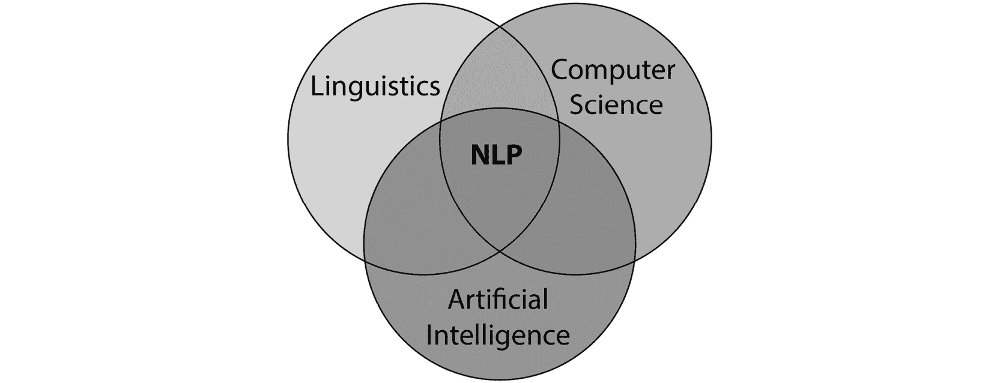

图 4.1：NLP 的应用场景

这是一个广泛的领域——想一想语言（口语和书面语言）使用的所有地方。NLP 使得并推动了前述图中列举的各类应用，包括以下内容：

+   将文档分类到不同类别（文本分类）

+   语言之间的翻译，例如，从德语到英语（序列到序列学习）

+   自动分类推文或电影评论的情感（情感分析）

+   24/7 即时回复你的查询的聊天机器人

在我们继续之前，我们需要承认并欣赏，NLP 不是一项简单的任务。考虑以下句子：“*The boy saw a man with a telescope.*”

谁拿着望远镜？男孩是用望远镜看见那个人的吗？还是那个人身上带着望远镜？这句话本身有歧义，我们无法单凭它解决这个问题，也许更多的上下文能帮助我们搞清楚。

让我们再考虑一下这个句子：“*Rahim convinced Mohan to buy a television for himself.*” 这台电视是给谁买的——是给 Rahim 还是 Mohan？这又是一个歧义问题，我们或许可以通过更多的上下文来解决，但对于机器/程序来说，依然可能非常困难。

让我们再看一个例子：“*Rahim has quit skydiving.*” 这句话意味着 Rahim 曾做过相当多的跳伞。句子中有一个假设，这对机器来说很难推断出来。

语言是一个复杂的系统，使用符号（单词/术语），并以多种方式将它们组合起来传达思想。理解语言并不总是那么容易，其中有很多原因。歧义无疑是最大的问题：单词在不同的语境中可能有不同的含义。再加上潜台词、不同的视角等等，我们永远无法确定不同的人是否以相同的方式理解同样的词语。一首诗可以被不同的读者以多种方式解读，每个读者都带着自己独特的视角和对世界的理解来解读这首诗。

# 深度学习与自然语言处理

深度学习的兴起对许多领域产生了积极的影响，NLP（自然语言处理）也不例外。现在你可以理解，深度学习方法为我们带来了前所未有的高准确度，这帮助我们在许多领域取得了进步。NLP 中有多个任务从深度学习方法中获益匪浅。过去，情感预测、机器翻译和聊天机器人等应用需要大量人工干预。而现在，借助深度学习和 NLP，这些任务已经完全自动化，并且展现出了令人印象深刻的表现。*图 4.2* 中展示的简单高层次视图表明了深度学习如何用于处理自然语言。深度学习不仅为我们提供了机器可以理解的自然语言的优秀表示，还为 NLP 任务提供了非常强大的建模方法。

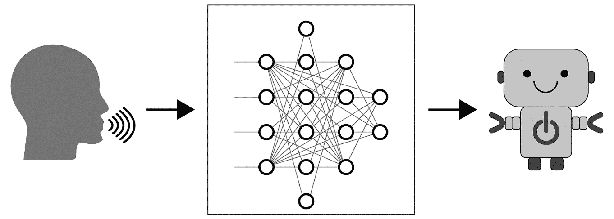

图 4.2：深度学习在自然语言处理中的应用

话虽如此，我们需要小心，避免低估让机器执行涉及人类语言任务的难度以及 NLP 领域的挑战。深度学习并未解决 NLP 中的所有挑战，但它的确在许多 NLP 任务的处理方式上带来了范式的转变，并推动了一些应用的发展，使得本来困难的任务变得对任何人来说都易于操作和实现。我们将在*第五章*，*序列的深度学习*中执行其中的一些任务。

其中一个关键任务是文本数据表示——简单来说，就是将原始文本转换为模型可以理解的形式。词嵌入是一种基于深度学习的方法，它改变了游戏规则，并提供了非常强大的文本表示。我们将在本章后面详细讨论嵌入，并创建我们自己的嵌入。首先，让我们动手处理一些文本，进行一些非常重要的数据准备。

## 开始处理文本数据

让我们开始将一些测试数据导入 Python。首先，我们将创建一些自己的玩具数据，熟悉工具。然后，我们将使用路易斯·卡罗尔的经典作品《*爱丽丝梦游仙境*》，该作品可以通过古腾堡计划（[gutenberg.org](http://gutenberg.org)）获取。幸运的是，我们可以通过**自然语言工具包**（**NLTK**）轻松访问它，这是一款用于从零开始进行 NLP 的极佳库。

注意

本章的代码实现可以在[`packt.live/3gEgkSP`](https://packt.live/3gEgkSP)找到。本章中的所有代码都必须在一个单一的 Jupyter Notebook 中运行。

NLTK 应该包含在 Anaconda 发行版中。如果没有，你可以在命令行中使用以下命令安装 NLTK：

```py
pip install nltk
```

这个方法在 Windows 上应该可行。对于 macOS 和 Linux，你可以使用以下命令：

```py
$ sudo pip install -U nltk
```

我们的虚拟数据可以通过以下命令创建（这里我们使用 Jupyter Notebooks；你也可以使用任何界面）：

```py
raw_txt = """Welcome to the world of Deep Learning for NLP! \
             We're in this together, and we'll learn together. \
             NLP is amazing, \
             and Deep Learning makes it even more fun. \
             Let's learn!"""
```

我们有一个名为`raw_txt`的字符串变量，其中存储了文本，因此，现在我们已经准备好开始处理它。

## 文本预处理

文本预处理是指将文本数据准备好以进行主要分析/建模的过程。无论你的最终目标是什么——可能是情感分析、分类、聚类或其他众多目标——你都需要清理原始文本数据并准备好进行分析。这是任何涉及自然语言处理（NLP）的应用的第一步。

我们所说的**清理**是什么意思？什么时候文本数据算是准备好了？我们知道，在日常生活中遇到的文本数据往往非常杂乱（想一想社交媒体、产品评论、服务评论等等），并且存在各种各样的不完美之处。根据手头的任务和你正在处理的数据类型，你关心的不完美之处会有所不同，而**清理**的意义也会有所不同。举个例子，在某些应用中，预处理可能仅仅意味着“将句子分割成单独的术语”。你在这里采取的步骤将对最终分析结果产生影响。让我们更详细地讨论这一点。

### 分词

预处理的第一步不可避免的是**分词**——将原始输入文本序列拆分成**词元**。简单来说，它就是将原始文本拆分成你想要处理的基本元素。这个词元可以是段落、句子、单词，甚至是字符。如果你想将段落拆分成句子，那么你会将段落分词成句子。如果你想将句子中的单词分开，那么你会将句子分词成单词。

对于我们的原始文本，首先，我们想要将句子分开。为此，我们在 Python 中有多种选择——这里，我们将使用 NLTK 中的 tokenize API。

注意

本书中我们将始终使用 Jupyter Notebooks，这是我们推荐的工具。不过，随时可以使用任何你喜欢的 IDE。

在使用 API 之前，我们必须`import nltk`并下载`punkt`句子分词器。然后，我们需要导入`tokenize`库。所有这些可以通过以下命令完成：

```py
import nltk
nltk.download('punkt')
from nltk import tokenize
```

tokenize API 提供了提取不同级别词元（句子、单词或字符）的工具，适用于不同类型的数据（也有一个非常实用的推文分词器）。我们将在这里使用`sent_tokenize()`方法。`sent_tokenize()`方法将输入文本拆分成句子。让我们看看它的实际效果：

```py
tokenize.sent_tokenize(raw_txt)
```

这应该会给我们以下的独立句子：

```py
['Welcome to the world of Deep Learning for NLP!',
 "We're in this together, and we'll learn together.",
 'NLP is amazing, and Deep Learning makes it even more fun.',
 "Let's learn!"]
```

从输出结果来看，`sent_tokenize()`似乎做得相当不错。它正确地识别了句子边界，并如预期般给出了四个句子。为了方便处理，我们将结果赋给一个变量，并检查结果及其组成部分的数据类型：

```py
txt_sents = tokenize.sent_tokenize(raw_txt)
type(txt_sents), len(txt_sents)
```

以下是前面代码的输出：

```py
(list, 4)
```

如我们所见，它是一个包含四个元素的列表，每个元素都是一个字符串，表示一个句子。

我们可以尝试使用`word_tokenize()`方法将句子拆分为单个单词。这个方法将给定的句子拆分成其组成的单词。它使用智能规则来判断单词的边界。为了方便起见，我们可以使用列表推导（在 Python 中，推导是一种简洁构建新序列的方法）：

```py
txt_words = [tokenize.word_tokenize(sent) for sent in txt_sents]
type(txt_words), type(txt_words[0])
```

上面的命令会给我们以下输出：

```py
(list, list)
```

输出如预期 - 结果列表的元素本身是列表，其中包含组成句子的单词。让我们也打印出结果的前两个元素：

```py
print(txt_words[:2])
```

输出将如下所示：

```py
[['Welcome', 'to', 'the', 'world', 'of', 
  'Deep', 'Learning', 'for', 'NLP', '!'], 
  ['We', "'re", 'in', 'this', 'together', 
  ',', 'and', 'we', "'ll", 'learn', 'together', '.']]
```

句子已被分解为单独的单词。我们还可以看到像“we'll”这样的缩写已被分解为组成部分，即“we”和“'ll”。所有标点符号（逗号、句号、感叹号等）都是单独的标记。如果我们希望删除它们，这对我们非常方便，我们稍后会这样做。

### 标准化大小写

另一个常见的步骤是标准化大小写 - 我们通常不希望“car”、“CAR”、“Car”和“caR”被视为不同的实体。为此，我们通常将所有文本转换为小写（如果需要，我们也可以将其转换为大写）。

在 Python 中，所有字符串都有一个`lower()`方法，因此将字符串变量（`strvar`）转换为小写就像`strvar.lower()`这样简单。

注意

我们本可以在分词之前一开始就使用这个方法，这将非常简单，比如`raw_txt = raw_txt.lower()`。

我们将在将数据分词为单独的句子后使用`lower()`方法来标准化我们的数据。我们将通过以下命令来实现这一点：

```py
txt_sents  = [sent.lower() for sent in txt_sents]
txt_words = [tokenize.word_tokenize(sent) for sent in txt_sents]
```

让我们打印几个句子，看看结果是什么样的：

```py
print(txt_words[:2])
```

输出将如下所示：

```py
[['welcome', 'to', 'the', 'world', 'of', 
  'deep', 'learning', 'for', 'nlp', '!'], 
 ['we', "'re", 'in', 'this', 'together', 
  ',', 'and', 'we', "'ll", 'learn', 'together', '.']]
```

我们可以看到，输出这次所有的术语都是小写的。我们已经取得了原始文本，将其分成句子，标准化大小写，然后将其分解成单词。现在，我们拥有了所有我们需要的标记，但我们似乎仍然有很多标点符号作为标记，我们需要摆脱它们。让我们继续进行更多的“清理工作”。

### 删除标点符号

我们可以看到，数据目前所有标点符号都作为单独的标记存在。再次提醒，可能会有标点符号很重要的任务。例如，在进行情感分析时，也就是预测文本的情感是积极的还是消极的时候，感叹号可能会增加价值。对于我们的任务，让我们去掉这些标点符号，因为我们只关心语言的表达。为此，我们需要一个列表，其中包含我们要删除的所有标点符号。幸运的是，Python 的字符串基础库中有这样一个列表，我们可以简单地导入并分配给一个列表变量：

```py
from string import punctuation
list_punct = list(punctuation)
print(list_punct)
```

你应该得到以下输出：

```py
['!', '"', '#', '$', '%', '&', "'", '(', ')', '*', '+', ',', 
 '-', '.', '/', ':', ';', '<', '=', '>', '?', '@', 
 '[', '\\', ']', '^', '_', '`', '{', '|', '}', '~']
```

所有通常的标点符号都在这里。如果有任何其他要删除的标点符号，您可以简单地将它们添加到`list_punct`变量中。

我们可以定义一个函数来从给定的标记列表中删除标点符号。该函数将期望一个标记列表，从中将可用于`list_punct`变量的标记删除：

```py
def drop_punct(input_tokens):
    return [token for token in input_tokens \
            if token not in list_punct]
```

我们可以使用以下命令在一些虚拟标记上测试这个：

```py
drop_punct(["let",".","us",".","go","!"])
```

我们得到了以下结果：

```py
['let', 'us', 'go']
```

该功能按预期工作。现在，我们需要将我们在上一部分中修改的`txt_words`变量传递给刚刚创建的`drop_punct`函数。我们将把结果存储在一个名为`txt_words_nopunct`的新变量中：

```py
txt_words_nopunct = [drop_punct(sent) for sent in txt_words]
print(txt_words_nopunct)
```

我们将得到以下输出：

```py
[['welcome', 'to', 'the', 'world', 'of', 
  'deep', 'learning', 'for', 'nlp'], 
 ['we', "'re", 'in', 'this', 'together', 'and', 
  'we', "'ll", 'learn', 'together'], 
 ['nlp', 'is', 'amazing', 'and', 
  'deep', 'learning', 'makes', 'it', 'even', 'more', 'fun'], 
 ['let', "'s", 'learn']]
```

如前面的输出所示，我们创建的函数已经从原始文本中删除了所有标点符号。现在，数据看起来更干净了，因为没有了标点符号，但我们仍然需要去除无信息的词汇。我们将在下一部分讨论这个问题。

### 删除停用词

在日常语言中，我们有很多词汇，它们并没有增加太多的信息/价值*。这些通常被称为“停用词”。我们可以将这些词分为两大类：

1.  **一般/功能性**：这些是语言中的填充词，它们并没有提供很多信息，但帮助连接其他有信息的词汇，以形成有意义的句子，例如“the”、“an”、“of”等等。

1.  **上下文**：这些不是一般的功能性词汇，但鉴于上下文，它们并没有提供很多信息。如果你正在处理关于手机的评论，而所有评论都在讨论手机，那么“手机”这个词本身可能没有太多信息。

    注意

    *“价值”的概念在每个任务中有所不同。像“the”和“and”这样的功能性词汇可能对于自动文档分类到主题中并不重要，但对于其他应用，比如词性标注（识别动词、形容词、名词、代词等）则非常重要。*

功能性停用词已经方便地集成到 NLTK 中。我们只需要导入它们，然后可以将它们存储在一个变量中。一旦存储，就可以像访问 Python 列表一样访问它们。让我们导入它们并看看我们有多少个这样的词：

```py
import nltk
nltk.download("stopwords")
from nltk.corpus import stopwords
list_stop = stopwords.words("english")
len(list_stop)
```

我们将看到以下输出：

```py
179
```

我们可以看到我们有 179 个内置的停用词。让我们也打印出其中一些：

```py
print(list_stop[:50])
```

输出将如下所示：

```py
['i', 'me', 'my', 'myself', 'we', 'our', 'ours', 'ourselves', 
 'you', "you're", "you've", "you'll", "you'd", 'your', 
 'yours', 'yourself', 'yourselves', 'he', 'him', 'his', 
 'himself', 'she', "she's", 'her', 'hers', 'herself', 
 'it', "it's", 'its', 'itself', 'they', 'them', 
 'their', 'theirs', 'themselves', 'what', 'which', 'who', 'whom', 
 'this', 'that', "that'll", 'these', 'those', 'am', 'is', 'are', 
 'was', 'were', 'be']
```

我们可以看到这些术语大多数是非常常用的“填充”词，它们在语言中有“功能性”作用，并没有提供太多信息。

现在，删除停用词的方法与我们删除标点符号的方法相同。

## 练习 4.01：分词、大小写规范化、标点符号和停用词移除

在这个练习中，我们将从数据中删除停用词，并应用我们到目前为止学到的所有内容。我们将首先执行分词（句子和单词）；然后执行大小写规范化，接着是标点符号和停用词的删除。

注意

在开始这个练习之前，请确保你正在使用一个 Jupyter Notebook，并且已经下载了`punkt`句子分词器和`stopwords`语料库，如*文本预处理*部分所示。

这次我们将保持代码简洁。我们将定义和处理`raw_txt`变量。让我们开始吧：

1.  运行以下命令来导入`nltk`及其`tokenize`模块：

    ```py
    import nltk
    from nltk import tokenize
    ```

1.  定义`raw_txt`变量，使其包含文本"`欢迎来到深度学习与自然语言处理的世界！我们一起前行，一起学习。自然语言处理令人惊叹，深度学习让它更有趣。让我们开始学习！`"：

    ```py
    raw_txt = """Welcome to the world of deep learning for NLP! \
                 We're in this together, and we'll learn together. \
                 NLP is amazing, \
                 and deep learning makes it even more fun. \
                 Let's learn!"""
    ```

1.  使用`sent_tokenize()`方法将原始文本分割为单独的句子，并将结果存储在一个变量中。在分词之前，使用`lower()`方法将字符串转换为小写：

    ```py
    txt_sents = tokenize.sent_tokenize(raw_txt.lower())
    ```

    注意

    我们刚创建的`txt_sents`变量将在本章后续部分中继续使用。

1.  使用列表推导式，应用`word_tokenize()`方法将每个句子分解成其组成单词：

    ```py
    txt_words = [tokenize.word_tokenize(sent) for sent in txt_sents]
    ```

1.  从`string`模块导入`punctuation`并将其转换为列表：

    ```py
    from string import punctuation
    stop_punct = list(punctuation)
    ```

1.  从 NLTK 导入英语的内建停用词，并将其保存到一个变量中：

    ```py
    from nltk.corpus import stopwords
    stop_nltk = stopwords.words("english")
    ```

1.  创建一个包含标点符号和 NLTK 停用词的组合列表。请注意，我们可以一次性删除它们：

    ```py
    stop_final = stop_punct + stop_nltk
    ```

1.  定义一个函数，移除输入句子中的停用词和标点符号，输入为一个标记集合：

    ```py
    def drop_stop(input_tokens):
        return [token for token in input_tokens \
                if token not in stop_final]
    ```

1.  通过对分词后的句子应用函数来移除冗余的标记，并将结果存储在一个变量中：

    ```py
    txt_words_nostop = [drop_stop(sent) for sent in txt_words]
    ```

1.  打印数据中第一个清理后的句子：

    ```py
    print(txt_words_nostop[0])
    ```

    停用词被移除后，结果将如下所示：

    ```py
    ['welcome', 'world', 'deep', 'learning', 'nlp']
    ```

    注意

    要访问此特定部分的源代码，请参阅[`packt.live/2VVNEgf`](https://packt.live/2VVNEgf)。

    您还可以在[`packt.live/38Gr54r`](https://packt.live/38Gr54r)上在线运行这个示例。您必须执行整个 Notebook 才能获得期望的结果。

在这个练习中，我们完成了迄今为止学到的所有清理步骤。这次我们将某些步骤结合起来，使代码更加简洁。这些是处理文本数据时非常常见的步骤。您可以尝试通过定义一个返回处理结果的函数，进一步优化和模块化代码。我们鼓励您尝试一下。

到目前为止，清理过程中的步骤是移除了我们评估中不太有用的标记。但我们还有一些事情可以做，以进一步改善我们的数据——我们可以尝试运用对语言的理解来合并标记，识别具有相同含义的标记，并去除更多冗余。两种常见的做法是词干提取（stemming）和词形还原（lemmatization）。

注意

在本练习中创建的变量将在本章的后续部分中继续使用。确保先完成本练习再继续进行接下来的练习和活动。

## 词干提取与词形还原

"Eat"、"eats"、"eating"、"ate"——它们不都是同一个单词的变体吗，都指的是同一个动作？在大多数文本和口语中，我们通常会遇到同一个单词的多个形式。通常情况下，我们不希望这些形式被当作独立的词项来处理。如果查询是"red shoes"或"red shoe"，搜索引擎需要返回相似的结果——否则会带来糟糕的搜索体验。我们承认这种情况非常常见，因此我们需要一种策略来处理这些情况。那么，我们应该如何处理一个单词的变体呢？一种合理的方法是将它们映射到一个共同的词项，这样它们就会被视为相同。

词干提取是一种基于规则的方法，通过将单词简化为其“词干”来实现标准化。词干是单词在加上任何词缀（用于形成变体的元素）之前的根本形式。这种方法相当简单——去掉后缀就得到词干。一个流行的算法是**Porter 词干提取**算法，它应用一系列这样的规则：


图 4.3：Porter 词干提取算法基于规则的方法示例

注意

Porter 词干提取算法的完整规则集可以在[`snowball.tartarus.org/algorithms/porter/stemmer.html`](http://snowball.tartarus.org/algorithms/porter/stemmer.html)找到。

让我们看看 Porter 词干提取算法的实际操作。我们从 NLTK 的 `'stem'` 模块导入 `PorterStemmer` 函数并创建一个实例：

```py
from nltk.stem import PorterStemmer
stemmer_p = PorterStemmer()
```

请注意，词干提取器是作用于单个词项的，而不是整个句子的。让我们看看词干提取器如何处理单词"driving"：

```py
print(stemmer_p.stem("driving"))
```

输出结果如下：

```py
drive
```

让我们看看如何将这个方法应用于整个句子。请注意，我们需要先对句子进行分词：

```py
txt = "I mustered all my drive, drove to the driving school!"
```

以下代码用于对句子进行分词，并对每个词项应用词干提取器：

```py
tokens = tokenize.word_tokenize(txt)
print([stemmer_p.stem(word) for word in tokens])
```

输出结果如下：

```py
['I', 'muster', 'all', 'my', 'drive', ',', 'drove', 'to', 
 'the', 'drive', 'school', '!']
```

我们可以看到，词干提取器已经正确地将"mustered"减少为"muster"并将"driving"减少为"drive"，而" drove"则没有被改变。此外，请注意，词干提取器的结果不一定是一个有效的英语单词。

词形还原是一种更复杂的方法，它参考词典并找到单词的有效词根形式（词形）。词形还原在提供单词词性时效果最佳——它考虑到单词的角色并返回适当的形式。词形还原的输出总是有效的英语单词。然而，词形还原的计算代价非常高，而且为了使其效果良好，需要词性标签，而词性标签通常在数据中是不可用的。我们来看一下它的简要使用。首先，从`nltk.stem`导入`WordNetLemmatizer`并实例化它：

```py
nltk.download('wordnet')
from nltk.stem import WordNetLemmatizer
lemmatizer = WordNetLemmatizer()
```

让我们在词项`ponies`上应用`lemmatizer`：

```py
lemmatizer.lemmatize("ponies")
```

以下是输出结果：

```py
'pony'
```

对于我们的讨论，词干提取就足够了。词干提取的结果可能并不总是有效的单词。例如，`poni`是`ponies`的词干，但它不是一个有效的英语单词。此外，可能会有一些不准确之处，但对于将单词映射到共同词形的目标而言，这种粗略的方法是完全有效的。

## 练习 4.02：对我们的数据进行词干提取

在这个练习中，我们将继续进行数据预处理。在之前的练习中，我们去除了停用词和标点符号。现在，我们将使用 Porter 词干提取算法来提取词干。由于我们将使用之前创建的`txt_words_nostop`变量，让我们继续使用在*练习 4.01*中创建的同一个 Jupyter Notebook，*标记化、大小写规范化、标点符号和停用词移除*。此时，该变量将包含以下文本：

```py
[['welcome', 'world', 'deep', 'learning', 'nlp'],
 ["'re", 'together', "'ll", 'learn', 'together'],
 ['nlp', 'amazing', 'deep', 'learning', 'makes', 'even', 'fun'],
 ['let', "'s", 'learn']]
```

完成此练习的步骤如下：

1.  使用以下命令从 NLTK 导入`PorterStemmer`：

    ```py
    from nltk.stem import PorterStemmer
    ```

1.  实例化词干提取器：

    ```py
    stemmer_p = PorterStemmer()
    ```

1.  对`txt_words_nostop`中的第一句话应用词干提取器：

    ```py
    print([stemmer_p.stem(token) for token in txt_words_nostop[0]])
    ```

    当我们打印结果时，得到以下输出：

    ```py
    ['welcome has been changed to welcom and learning to learn. This is consistent with the rules of the Porter stemming algorithm.
    ```

1.  对数据中的所有句子应用词干提取器。你可以使用循环，或者使用嵌套列表推导：

    ```py
    txt_words_stem = [[stemmer_p.stem(token) for token in sent] \
                       for sent in txt_words_nostop]
    ```

1.  使用以下命令打印输出：

    ```py
    txt_words_stem
    ```

    输出将如下所示：

    ```py
    [['welcom', 'world', 'deep', 'learn', 'nlp'],
     ["'re", 'togeth', "'ll", 'learn', 'togeth'],
     ['nlp', 'amaz', 'deep', 'learn', 'make', 'even', 'fun'],
     ['let', "'s", 'learn']]
    ```

看起来词干提取器已经做了很多修改。许多单词已经不再有效，但仍然可以识别，这没关系。

注意

若要访问此特定部分的源代码，请参考[`packt.live/2VVNEgf`](https://packt.live/2VVNEgf)。

你也可以在线运行此示例，访问[`packt.live/38Gr54r`](https://packt.live/38Gr54r)。你必须执行整个 Notebook 才能获得预期的结果。

在这个练习中，我们使用了 Porter 词干提取算法来提取我们标记化数据的词干。词干提取作用于单个词，因此需要在标记化成词之后进行。词干提取将一些词语缩减为其基本形式，这些形式不一定是有效的英语单词。

### 词干提取与词形还原之外的内容

除了词干提取和词形还原之外，还有许多特定的方法可以处理单词变体。我们有像语音哈希这样的方法来识别由发音引起的单词拼写变体。接着，还有拼写校正来识别和纠正拼写错误。另一个潜在的步骤是缩写处理，使得*television*和*TV*被视为相同的单词。这些步骤的结果可以通过进行领域特定的术语处理进一步增强。你大概明白了……有很多可能的步骤，具体是否使用，取决于你的数据和应用的关键性。

不过，一般来说，我们一起完成的这些步骤已经足够了——大小写规范化、标记化、停用词和标点符号移除，接着是词干提取/词形还原。这些是大多数 NLP 应用程序中常见的步骤。

### 使用 NLTK 下载文本语料库

到目前为止，我们已经在我们创建的虚拟数据上执行了这些步骤。现在，是时候在一个更大、更真实的文本上尝试我们新学到的技能了。首先，让我们获取这个文本——路易斯·卡罗尔的经典作品《爱丽丝梦游仙境》，它通过古腾堡计划提供并可通过 NLTK 访问。

你可能需要通过 NLTK 下载 `'gutenberg'` 语料库。首先，使用以下命令导入 NLTK：

```py
import nltk
```

然后，使用 `nltk.download()` 命令打开一个应用程序，也就是 **NLTK 下载器** 界面（如下截图所示）：

```py
nltk.download()
```

我们可以看到该应用程序有多个标签。点击 **语料库** 标签：

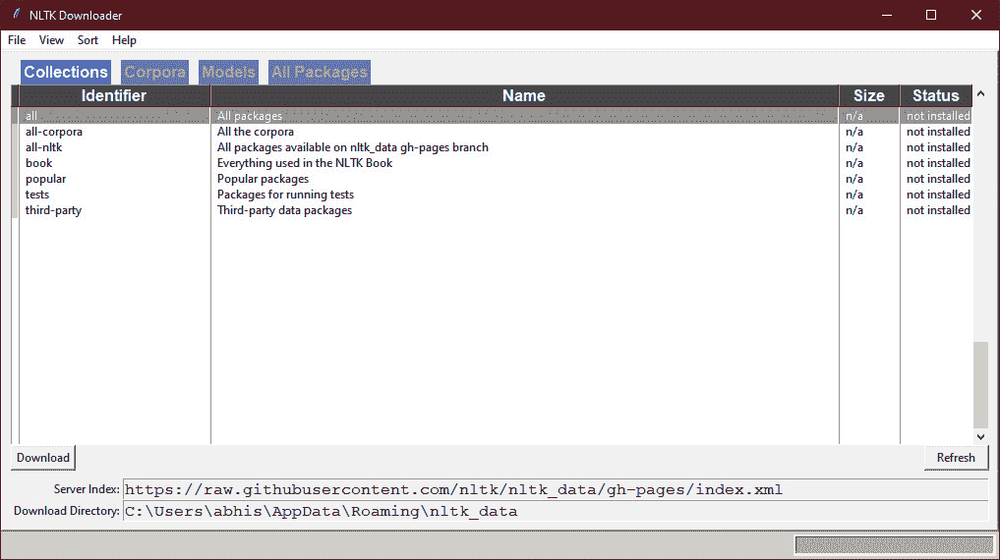

图 4.4：NLTK 下载器

在 `语料库` 标签中，向下滚动直到找到 `gutenberg`。如果状态是 `未安装`，请点击左下角的 `下载` 按钮。那将安装 `gutenberg` 语料库：

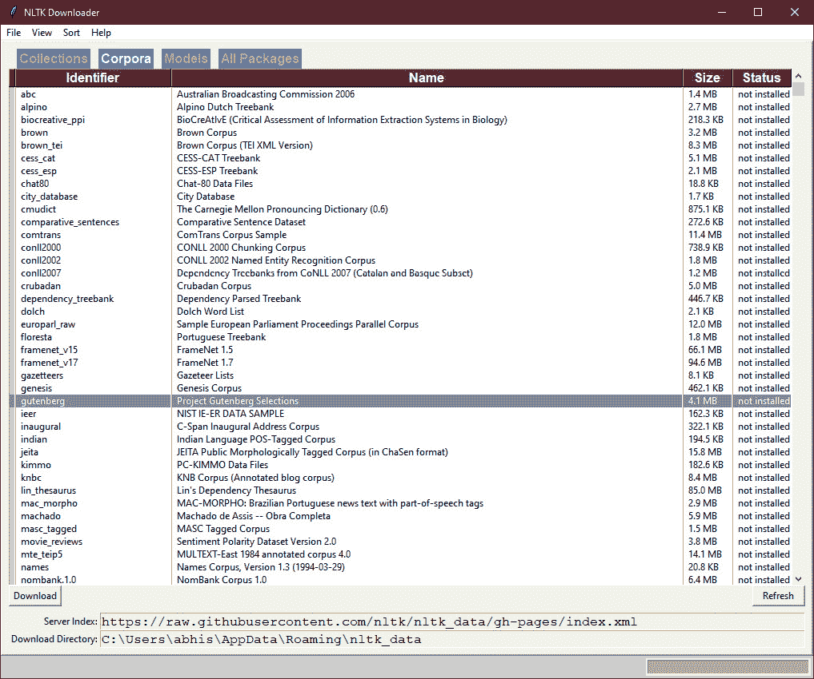

图 4.5：NLTK 下载器的语料库标签

关闭界面。现在，你可以直接从 NLTK 获取一些经典文本。我们将读取文本并将其存储在一个变量中：

```py
alice_raw = nltk.corpus.gutenberg.raw('carroll-alice.txt')
```

该文本存储在 `alice_raw` 中，这是一个大字符串。我们来看一下这个字符串的前几个字符：

```py
alice_raw[:800]
```

输出结果如下：

```py
"[Alice's Adventures in Wonderland by Lewis Carroll 1865]
  \n\nCHAPTER I. Down the Rabbit-Hole\n\nAlice was beginning
  to get very tired of sitting by her sister on the\nbank, 
  and of having nothing to do: once or twice she had peeped 
  into the\nbook her sister was reading, but it had no pictures 
  or conversations in\nit, 'and what is the use of a book,' 
  thought Alice 'without pictures or\nconversation?'
  \n\nSo she was considering in her own mind 
  (as well as she could, for the\nhot day made her feel 
  very sleepy and stupid), whether the pleasure\nof making 
  a daisy-chain would be worth the trouble of getting up 
  and\npicking the daisies, when suddenly a White Rabbit 
  with pink eyes ran\nclose by her.\n\nThere was nothing 
  so VERY remarkable in that; nor did Alice think 
  it so\nVERY much out of the way to hear the Rabbit"
```

我们可以在输出中看到原始文本，它包含了我们预期的常见不完美——大小写不一、停用词、标点符号等等。

我们准备好了。让我们通过一个活动来测试我们的技能。

## 活动 4.01：‘爱丽丝梦游仙境’文本的文本预处理

在这个活动中，你将把到目前为止学到的所有预处理步骤应用到一个更大、更真实的文本中。我们将处理存储在 `alice_raw` 变量中的《爱丽丝梦游仙境》文本：

```py
alice_raw[:800]
```

当前的文本看起来是这样的：

```py
"[Alice's Adventures in Wonderland by Lewis Carroll 1865]
  \n\nCHAPTER I. Down the Rabbit-Hole\n\nAlice was beginning 
  to get very tired of sitting by her sister on the\nbank, 
  and of having nothing to do: once or twice she had peeped 
  into the\nbook her sister was reading, but it had no pictures 
  or conversations in\nit, 'and what is the use of a book,' 
  thought Alice 'without pictures or\nconversation?
  '\n\nSo she was considering in her own mind 
  (as well as she could, for the\nhot day made her feel 
  very sleepy and stupid), whether the pleasure\nof making 
  a daisy-chain would be worth the trouble of getting up 
  and\npicking the daisies, when suddenly a White Rabbit 
  with pink eyes ran\nclose by her.\n\nThere was nothing 
  so VERY remarkable in that; nor did Alice think 
  it so\nVERY much out of the way to hear the Rabbit"
```

在这个活动结束时，你将完成数据的清洗和分词，去除许多不完美之处，去除停用词和标点符号，并对数据应用词干提取。

注意

在开始这个活动之前，确保你已经安装了 `gutenberg` 语料库，并创建了 `alice_raw` 变量，正如前一节 *使用 NLTK 下载文本语料库* 所示。

以下是你需要执行的步骤：

1.  在同一个 Jupyter Notebook 中，使用 `'alice_raw'` 变量中的原始文本。将原始文本转换为小写。

1.  对句子进行分词。

1.  从 `string` 模块导入标点符号，从 NLTK 导入停用词。

1.  创建一个变量，用于保存上下文中的停用词，即 `--` 和 `said`。

1.  创建一个包含标点符号、NLTK 停用词和上下文停用词的主停用词列表，以便去除这些词。

1.  定义一个函数，从任何输入的句子（已分词）中删除这些标记。

1.  使用 NLTK 的 `PorterStemmer` 算法对结果进行词干提取。

1.  打印出结果中的前五个句子。

    注意

    本活动的详细步骤、解决方案和额外的评论内容在第 405 页上有介绍。

预期的输出结果是这样的：

```py
[['alic', "'s", 'adventur', 'wonderland', 'lewi', 'carrol', 
  '1865', 'chapter', 'i.', 'rabbit-hol', 'alic', 'begin', 
  'get', 'tire', 'sit', 'sister', 'bank', 'noth', 'twice', 
  'peep', 'book', 'sister', 'read', 'pictur', 'convers', 
  "'and", 'use', 'book', 'thought', 'alic', "'without", 
  'pictur', 'convers'], 
 ['consid', 'mind', 'well', 'could', 'hot', 'day', 'made', 
  'feel', 'sleepi', 'stupid', 'whether', 'pleasur', 'make', 
  'daisy-chain', 'would', 'worth', 'troubl', 'get', 'pick', 
  'daisi', 'suddenli', 'white', 'rabbit', 
  'pink', 'eye', 'ran', 'close'], 
 ['noth', 'remark', 'alic', 'think', 'much', 'way', 'hear', 
  'rabbit', 'say', "'oh", 'dear'], 
 ['oh', 'dear'], 
 ['shall', 'late']]
```

让我们看看到目前为止我们取得了哪些成果，以及未来还有哪些挑战。

到目前为止，我们已经学习了如何进行文本预处理——即为我们的主要分析/模型准备文本数据的过程。我们从原始文本数据开始，这些数据可能存在许多不完美的地方。我们学习了如何处理这些不完美，现在已经能够熟练地处理文本数据，并为进一步的分析做好准备。这是任何自然语言处理应用中的重要第一步。因此，我们从原始文本数据开始，得到了清洁的数据。接下来呢？

接下来的部分非常重要，因为它对你的分析质量有着极大的影响。它被称为表示（Representation）。让我们来讨论一下这个问题。

## 文本表示的考虑因素

我们已经将原始输入数据处理成了干净的文本。现在，我们需要将这些干净的文本转换为预测模型可以理解的格式。那么，预测模型到底能理解什么呢？它能理解不同的单词吗？它能像我们一样阅读单词吗？它能处理我们提供的文本吗？

到现在为止，你应该明白模型是通过数字来工作的。模型的输入是一串数字。它不理解图像，但可以处理表示图像的矩阵和数字。处理图像的关键思想是将图像转换为数字，并从中生成特征。对于文本来说，想法是一样的：我们需要将文本转换为数字，这些数字将作为模型的特征。

**表示（Representation）**的核心就是将文本转换为模型能够理解的数字/特征。这听起来似乎没什么难的，对吧？如果你这么认为，那么请考虑一下：输入特征对于任何建模任务都至关重要，而表示正是创建这些特征的过程。它对模型的结果有着极为重要的影响，是你应当特别关注的一个过程。

那么，你应该如何进行文本表示呢？如果有的话，什么是“最佳”的文本表示方法？让我们来讨论几种方法。

# 文本表示的经典方法

文本表示方法随着时间的推移经历了显著的演变，神经网络和深度神经网络的出现对我们当前的文本表示方式产生了重大影响（稍后会详细讲解）。我们确实走过了很长的一段路：从手工构建特征，标记某个单词是否出现在文本中，到创建强大的表示方法，如词嵌入。尽管有许多方法，其中一些更适合特定任务，我们将在 Python 中讨论几种主要的经典方法，并实际操作它们。

## 独热编码（One-Hot Encoding）

一热编码可能是文本表示中最直观的方法之一。一个词的一热编码特征是该术语是否出现在文本中的二进制指示符。这是一种简单且容易解释的方法——判断一个词是否存在。为了更好地理解这一点，让我们看看我们去除词干之前的示例文本，并观察一热编码如何作用于特定的目标术语，例如 `nlp`。

让我们使用以下命令查看当前文本的样子：

```py
txt_words_nostop
```

我们可以看到文本如下所示：

```py
[['welcome', 'world', 'deep', 'learning', 'nlp'],
 ["'re", 'together', "'ll", 'learn', 'together'],
 ['nlp', 'amazing', 'deep', 'learning', 'makes', 'even', 'fun'],
 ['let', "'s", 'learn']]
```

我们感兴趣的词是 `nlp`。它的一热编码特征将如下所示：

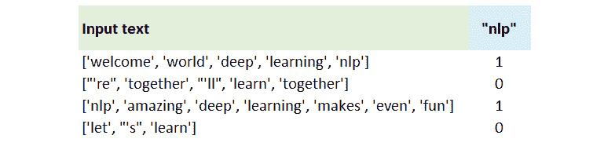

](img/B15385_04_06.jpg)

图 4.6：'nlp' 的一热编码特征

我们可以看到该特征为 `1`，但仅在包含术语 `nlp` 的句子中为 `1`，否则为 `0`。我们可以为每个我们感兴趣的词创建这样的指示变量。所以，如果我们对三个术语感兴趣，我们可以为每个术语创建这样的特征：

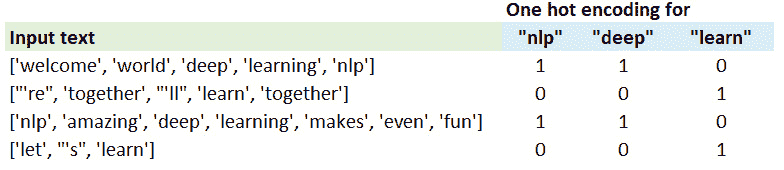

](img/B15385_04_07.jpg)

图 4.7：'nlp'、'deep' 和 'learn' 的一热编码特征

让我们通过一个练习使用 Python 重新创建这个过程。

## 练习 4.03：为我们的数据创建一热编码

在这个练习中，我们将复制前面的示例。目标术语是 `nlp`、`deep` 和 `learn`。我们将使用我们自己的函数为这些术语创建一热编码特征，并将结果存储在一个 `numpy` 数组中。

同样，我们将使用在 *练习 4.01* 中创建的 `txt_words_nostop` 变量，即 *分词、大小写标准化、标点符号处理和停用词移除*。所以，你需要在同一个 Jupyter Notebook 中继续进行此练习。按照以下步骤完成本练习：

1.  打印出 `txt_words_nostop` 变量，看看我们正在处理的内容：

    ```py
    print(txt_words_nostop)
    ```

    输出将如下所示：

    ```py
    [['welcome', 'world', 'deep', 'learning', 'nlp'], 
     ["'re", 'together', "'ll", 'learn', 'together'], 
     ['nlp', 'amazing', 'deep', 'learning', 'makes', 'even', 'fun'], 
     ['let', "'s", 'learn']]
    ```

1.  定义一个包含目标术语的列表，即 `"nlp"`, `"deep"`, `"learn"`：

    ```py
    target_terms = ["nlp","deep","learn"]
    ```

1.  定义一个函数，该函数接受一个单一的分词句子，并根据目标术语是否出现在文本中返回 `0` 或 `1`。注意，输出的长度固定为 `3`：

    ```py
    def get_onehot(sent):
        return [1 if term in sent else 0 for term in target_terms]
    ```

    我们正在遍历目标术语，并检查它们是否出现在输入句子中。

1.  对文本中的每个句子应用该函数，并将结果存储在一个变量中：

    ```py
    one_hot_mat = [get_onehot(sent) for sent in txt_words_nostop]
    ```

1.  导入 `numpy`，根据结果创建一个 `numpy` `array`，并打印出来：

    ```py
    import numpy as np
    np.array(one_hot_mat)
    ```

    数组的输出如下：

    ```py
    array([[1, 1, 0],
           [0, 0, 1],
           [1, 1, 0],
           [0, 0, 1]])
    ```

我们可以看到输出包含四行，每行对应一个句子。数组中的每一列包含一个目标术语的一热编码。对于 "learn" 来说，其值是 0, 1, 0, 1，这与我们的预期一致。

注意

要访问此特定部分的源代码，请参见 [`packt.live/2VVNEgf`](https://packt.live/2VVNEgf)。

你也可以在 [`packt.live/38Gr54r`](https://packt.live/38Gr54r) 上在线运行这个示例。你必须执行整个笔记本才能获得预期的结果。

在这个练习中，我们展示了如何使用独热编码从文本中生成特征。示例使用了一个目标术语列表。当你有一个非常明确的目标，知道哪些术语是有用的时，这种方法可能会有效。事实上，直到几年前，这正是人们广泛采用的方法，人们从文本中手工提取特征。在许多情况下，这并不可行——因为我们并不确切知道哪些术语是重要的，所以我们对大量术语（5000、10000，甚至更多）使用独热编码。

另一个方面是术语的存在/缺失是否足以应对大多数情况。我们是否不想包含更多的信息？也许是术语的频率，而不仅仅是它的存在，或者甚至可能是其他更智能的度量？让我们看看这如何工作。

## 术语频率

我们讨论过，独热编码只是表示某个术语是否存在。这里有一个合理的观点：术语的频率也很重要。可能在文档中出现次数更多的术语对该文档更为重要。也许通过术语的频率来表示比仅仅通过指示符更好。频率方法很简单——对于每个术语，统计它在特定文本中出现的次数。如果某个术语在文档/文本中缺失，它的频率为 0。我们对词汇表中的所有术语都做这个处理。因此，我们的特征数等于词汇表中单词的数量（这个数量我们可以选择；它可以被看作是一个超参数）。我们应该注意，在预处理步骤后，我们正在处理的“*术语*”是可能在语言中不是真正有效单词的标记（token）：

注意：

*词汇表*是我们最终模型中将使用的所有术语的超集。词汇表大小是指词汇表中唯一术语的数量。你可能在原始文本中有 20000 个唯一的术语，但选择使用最频繁的 10000 个术语；这就是有效的词汇表大小。

考虑以下图像；如果我们有*N*个文档，并且在我们的工作词汇表中有*V*（`t1, t2, t3` … `tV`）个词，那么数据的表示将是一个*N × V*维度的矩阵。

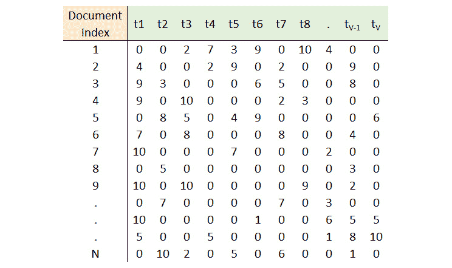

图 4.8：文档-术语矩阵

这个矩阵就是我们的**文档-术语矩阵**（**DTM**）——其中每一行代表一个文档，每一列代表一个术语。单元格中的值可以代表某种度量（计数或其他任何度量）。在这一部分，我们将处理术语频率。

我们可以再次创建自己的函数，但我们有一个非常方便的工具叫做`'CountVectorizer'`，它在`scikit-learn`中可用，我们将使用它。让我们先通过导入该工具来熟悉它：

```py
from sklearn.feature_extraction.text import CountVectorizer
```

向量化器可以处理原始文本，也可以处理分词后的数据（如我们的案例）。为了处理原始文本，我们将使用以下代码，在其中我们将从原始文本（`txt_sents`）创建一个包含词频的文档-术语矩阵（DTM）。

在我们开始之前，先快速查看一下这个变量的内容：

```py
txt_sents
```

输出应该如下所示：

```py
['welcome to the world of deep learning for nlp!',
 "we're in this together, and we'll learn together.",
 'nlp is amazing, and deep learning makes it even more fun.',
 "let's learn!"]
```

注意

如果在处理*活动 4.01*时，`txt_sents`变量的内容被覆盖了，*《爱丽丝梦游仙境》文本的文本预处理*，你可以重新访问*练习 4.01*的*第 3 步*，*标记化、大写规范化、标点符号和停用词去除*，并重新定义该变量，使其内容与前面的输出匹配。

现在，让我们实例化矢量化器。请注意，我们需要提供词汇表的大小。这样会从数据中选择前* n *个术语来创建矩阵：

```py
vectorizer = CountVectorizer(max_features = 5)
```

我们在这里选择了五个术语；结果将包含矩阵中的五列。让我们在数据上训练（`'fit'`）矢量化器：

```py
vectorizer.fit(txt_sents)
```

现在，矢量化器已经学习了一个词汇表——前五个术语，并为词汇表中的每个术语创建了一个索引。让我们看看这个词汇表：

```py
vectorizer.vocabulary_
```

前面的属性给出了如下输出：

```py
{'deep': 1, 'we': 4, 'together': 3, 'and': 0, 'learn': 2}
```

我们可以看到已经选择的术语（前五个）。

现在，让我们将矢量化器应用于数据以创建 DTM。一个小细节：矢量化器的结果是一个稀疏矩阵。为了查看它，我们将其转换为数组：

```py
txt_dtm = vectorizer.fit_transform(txt_sents)
txt_dtm.toarray()
```

看一下输出：

```py
array([[0, 1, 0, 0, 0],
       [1, 0, 1, 2, 2],
       [1, 1, 0, 0, 0],
       [0, 0, 1, 0, 0]], dtype=int64)
```

第二个文档（第二行）的最后两个术语的频率为`2`。那两个术语是什么呢？索引 3 和 4 分别是术语`'together'`和`'we'`。让我们打印出原始文本，看看输出是否符合预期：

```py
txt_sents
```

输出将如下所示：

```py
['welcome to the world of deep learning for nlp!',
 "we're in this together, and we'll learn together.",
 'nlp is amazing, and deep learning makes it even more fun.',
 "let's learn!"]
```

这正如我们预期的那样，看起来计数矢量化器工作得很好。

请注意，矢量化器也对句子进行了标记化。如果你不想这样，并且希望使用预处理过的标记（`txt_words_stem`），只需要传递一个虚拟的标记化器和预处理器给`CountVectorizer`。让我们看看这样做的效果。首先，我们创建一个什么都不做的函数，它只会返回标记化后的句子/文档：

```py
def do_nothing(doc):
    return doc
```

现在，我们将实例化矢量化器，使用这个函数作为预处理器和标记化器：

```py
vectorizer = CountVectorizer(max_features=5,
                             preprocessor=do_nothing,
                             tokenizer=do_nothing)
```

在这里，我们使用标记化器的`fit_transform()`方法一步完成数据拟合和转换，然后查看结果。该方法在对数据进行拟合时，会将唯一的术语识别为*词汇表*，然后在转换时统计并返回每个文档中每个术语的出现次数。让我们看看它是如何工作的：

```py
txt_dtm = vectorizer.fit_transform(txt_words_stem)
txt_dtm.toarray()
```

输出数组将如下所示：

```py
array([[0, 1, 1, 1, 0],
       [1, 0, 1, 0, 2],
       [0, 1, 1, 1, 0],
       [0, 0, 1, 0, 0]], dtype=int64)
```

我们可以看到，输出与之前的结果不同。这种差异是预期的吗？为了理解，我们来看一下矢量化器的词汇：

```py
vectorizer.vocabulary_
```

输出将如下所示：

```py
{'deep': 1, 'learn': 2, 'nlp': 3, 'togeth': 4, "'ll": 0}
```

我们正在处理预处理后的数据，记得吗？我们已经移除了停用词并进行了词干提取。让我们试着打印一下输入数据，确保没有问题：

```py
txt_words_stem
```

输出将如下所示：

```py
[['welcom', 'world', 'deep', 'learn', 'nlp'],
 ["'re", 'togeth', "'ll", 'learn', 'togeth'],
 ['nlp', 'amaz', 'deep', 'learn', 'make', 'even', 'fun'],
 ['let', "'s", 'learn']]
```

我们可以看到，DTM（文档-词项矩阵）是根据新词汇表和预处理后获得的词频进行工作的。

所以，这是第二种从文本数据生成特征的方法，即使用术语的频率。在下一部分，我们将介绍另一种非常流行的方法。

## TF-IDF 方法

文档中术语的高频率是否意味着该词对文档非常重要？不一定。如果该术语在所有文档中都很常见呢？在文本数据处理中有一个常见的假设：如果一个术语出现在所有文档中，那么它对于当前文档的区分度可能不大，或者说它对当前文档的意义不大。这个假设看起来是合理的。再举个例子，假设我们在处理手机评论时遇到“*手机*”这个词。这个词可能出现在大多数评论中。但如果你的任务是识别评论中的情感，这个词可能不会提供太多有用的信息。

我们可以提高在文档中出现但在整个数据中较为罕见的术语的重要性，降低在大多数文档中出现的术语的重要性。

TF-IDF 方法，即*词频-逆文档频率*，将**逆文档频率**（**IDF**）定义如下：


图 4.9：TF-IDF 的公式

*n*是文档的总数，而*df(t)*是包含术语*t*的文档数。这作为一个因子来调整术语频率。可以看出，它正如我们所期望的那样工作——它增加了稀有术语的重要性，减少了常见术语的重要性。请注意，这个公式有不同的变体，但我们将坚持使用`scikit-learn`所采用的方法。像`CountVectorizer`一样，TF-IDF 向量化器对句子进行分词并学习词汇表，但它返回的是调整后的（乘以 IDF 的）术语频率，而不是文档中术语的原始计数。

现在，让我们将这个有趣的新方法应用到我们的数据上。

## 练习 4.04：使用 TF-IDF 生成文档-词矩阵

在本次练习中，我们将实现从文本生成特征的第三种方法——TF-IDF。我们将使用 scikit-learn 的`TfidfVectorizer`工具，并为我们的原始文本数据创建文档-词矩阵（DTM）。由于我们使用的是本章之前创建的`txt_sents`变量，因此我们需要使用相同的 Jupyter Notebook。当前变量中的文本如下所示：

```py
['welcome to the world of deep learning for nlp!',
 "we're in this together, and we'll learn together.",
 'nlp is amazing, and deep learning makes it even more fun.',
 "let's learn!"]
```

注意

如果在处理*活动 4.01*（*《爱丽丝梦游仙境》文本的文本预处理*）时，`txt_sents`变量的内容被覆盖，可以重新访问*练习 4.01*的*步骤 3*（*分词、大小写标准化、标点符号和停用词移除*），并重新定义该变量，以便其内容与之前的输出匹配。

以下是需要执行的步骤：

1.  从`scikit learn`导入`TfidfVectorizer`工具：

    ```py
    from sklearn.feature_extraction.text import TfidfVectorizer
    ```

1.  使用词汇表大小为`5`来实例化`vectorizer`：

    ```py
    vectorizer_tfidf = TfidfVectorizer(max_features=5)
    ```

1.  在原始数据`txt_sents`上拟合`vectorizer`：

    ```py
    vectorizer_tfidf.fit(txt_sents)
    ```

1.  打印出`vectorizer`学习到的词汇表：

    ```py
    vectorizer_tfidf.vocabulary_
    ```

    训练后的词汇表如下所示：

    ```py
    {'deep': 1, 'we': 4, 'together': 3, 'and': 0, 'learn': 2}
    ```

    请注意，词汇表与计数向量化器的词汇表相同。这是预期的。我们并没有改变词汇表；我们只是调整了它在文档中的重要性。

1.  使用训练好的向量化器转换数据：

    ```py
    txt_tfidf = vectorizer_tfidf.transform(txt_sents)
    ```

1.  打印出结果的文档-术语矩阵（DTM）：

    ```py
    txt_tfidf.toarray()
    ```

    输出结果如下：

    ```py
    array([[0\.        , 1\.        , 
            0\.        , 0\.        , 0\.        ],
           [0.25932364, 0\.        , 0.25932364, 
            0.65783832, 0.65783832],
           [0.70710678, 0.70710678, 0\.        , 
            0\.        , 0\.        ],
           [0\.        , 0\.        , 1\.        , 
            0\.        , 0\.        ]])
    ```

    我们可以清楚地看到，输出值与频率不同，并且小于 1 的值表明在与 IDF 相乘后，许多值已经降低。

1.  我们还需要查看每个词汇表中术语的 IDF 值，以检查该因子是否如我们预期的那样起作用。使用`idf_`属性打印术语的 IDF 值：

    ```py
    vectorizer_tfidf.idf_
    ```

    输出结果如下：

    ```py
    array([1.51082562, 1.51082562, 1.51082562, 
           1.91629073, 1.91629073])
    ```

术语`'and'`、`'deep'`和`'learn'`的 IDF 较低，而术语`'together'`和`'we'`的 IDF 较高。这正如我们所预期的——术语`'together'`和`'we'`只出现在一个文档中，而其他词汇出现在两个文档中。因此，TF-IDF 方法确实赋予了稀有词汇更高的重要性。

注意

要访问此特定部分的源代码，请参考 [`packt.live/2VVNEgf`](https://packt.live/2VVNEgf)。

你也可以在网上运行此示例，访问 [`packt.live/38Gr54r`](https://packt.live/38Gr54r)。你必须执行整个 Notebook 才能获得所需的结果。

在这个练习中，我们看到了如何使用 TF-IDF 方法来表示文本。我们还看到了该方法如何通过注意到 IDF 值在高频词汇中的较低值来降低更频繁的术语的重要性。最后，我们得到了一个包含术语 TF-IDF 值的文档-术语矩阵（DTM）。

## 总结经典方法

我们刚刚看了三种经典的文本表示方法。我们从独热编码开始，其中术语的特征只是标记其在文档中的存在。基于计数/频率的方法试图通过使用术语在文档中的频率来增加术语的重要性。TF-IDF 方法试图使用术语的"归一化"重要性值，考虑术语在文档中的常见程度。

到目前为止我们讨论的三种方法都属于"*词袋模型*"表示方法。那么，为什么它们被称为"*词袋模型*"呢？原因有几个。第一个原因是它们不会保留词汇的顺序——一旦进入词袋，术语/词汇的位置就不重要。第二个原因是这种方法保留了每个单独术语的特征。所以，对于每个文档来说，从某种意义上讲，你有一个"混合的词汇袋"，或者为了简单起见，称为"*词袋*"。

所有三种方法的结果具有*N × V*的维度，其中*N*是文档数量，*V*是词汇表的大小。请注意，三种表示方式都非常稀疏——一个典型的句子非常短（可能只有 20 个单词），但词汇表的大小通常在数千个单词左右，导致大多数 DTM 的单元格都是 0。这看起来并不理想。好吧，还有这种表示方法的其他几个缺点，稍后我们会看到，这些缺点导致了基于深度学习的表示方法的成功。接下来，我们来讨论这些思想。

# 文本的分布式表示

为什么词嵌入如此受欢迎？为什么我们说它们非常强大？是什么让它们如此特别？为了理解和欣赏词嵌入，我们需要承认迄今为止表示方法的不足之处。

"*人行道*"和"*侧道*"是同义词。你认为我们迄今为止讨论的方法能够捕捉到这一信息吗？好吧，你可以手动将"*侧道*"替换为"*人行道*"，这样两者最终就会有相同的词标记，但你能为语言中的所有同义词做这件事吗？

"*热*"和"*冷*"是反义词。之前的词袋模型表示能够捕捉到这一点吗？那么"*狗*"是"*动物*"的一种类型呢？"*驾驶舱*"是"*飞机*"的一部分呢？区分狗的叫声和树皮的声音呢？你能手动处理所有这些情况吗？

上述所有例子都是术语之间的“**语义关联**”——简而言之，它们的含义在某种程度上是相互关联的。词袋模型无法捕捉到这些关联。这就是分布式语义学的作用所在。分布式语义学的核心思想是，具有相似分布的词语具有相似的含义。

一个快速、有趣的小测验：从以下文本中猜测*小毛孩*这个词的意思：

"*我一个月前收养了一只年轻的波斯小毛孩。像所有的小毛孩一样，它喜欢抓背部，讨厌水，但和其他小毛孩不同，它在抓老鼠方面完全失败了。*"

你可能猜得对：*小毛孩*是指猫。这个很简单，对吧？

但你是怎么做到的呢？文中从未使用过“猫”这个词。你查看了上下文（围绕“*小毛孩*”的词语），并根据你对语言和世界的理解，推测这些词通常和猫相关。你直觉地运用了这个概念：具有相似意义的词语出现在相似的语境中。如果“*小毛孩*”和“猫”出现在相似的语境中，它们的意思一定相似。

"*你将通过一个词所处的环境了解这个词的含义。*"

这句由约翰·弗斯（John Firth）所说的名言很经典，现在已被过度使用，但正因为如此它才被过度使用。让我们看看这个概念是如何在词嵌入中运用的。

## 词嵌入与词向量

词嵌入是将每个术语表示为一个低维度的向量。术语的独热编码表示也是一个向量，但其维度通常达到几千。词嵌入/词向量具有更低的维度，并且来自基于分布语义的方法——本质上，表示捕捉到的是这样一种观念：具有相似意义的词语出现在相似的上下文中。

词向量试图捕捉术语的含义。这一思想使得它们非常强大，当然，前提是它们已经被正确创建。使用词向量时，像加法/减法向量和点积这样的向量操作是可能的，而且有一些非常有趣的意义。另一个非常棒的特性是，含义相似的项在空间上更接近。这一切都导致了一些令人惊奇的结果。

一个非常有趣的结果是，词向量可以在类比任务上表现得非常好。类比任务被定义为这种格式的任务——“*a* 与 *b* 之关系，*x* 与 ? 的关系是？”——也就是说，找到一个与 *x* 之间关系相同的实体，正如 *b* 与 *a* 之间的关系。举个例子，如果你问“man 对 uncle 如 woman 对 ?”，结果会是 "`aunt`"（稍后会详细讲解）。你还可以发现术语之间的语义规律——术语与术语集之间的关系。让我们看看下图，它基于词向量/嵌入，帮助我们更好地理解：

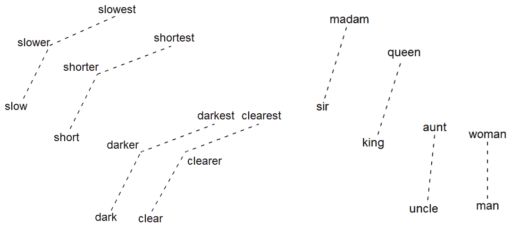

图 4.10：术语之间的语义关系

上述图示展示了一些例子。向量可以具有很高的维度（最多可达 300 甚至更多），因此进行二维的降维处理以便进行可视化。两个术语之间的虚线连接表示术语之间的关系。连接的方向是关键。在左侧面板中，我们可以看到，连接 `slow` 和 `slower` 的线段与连接 `short` 和 `shorter` 的线段是平行的。这是什么意思？这意味着词嵌入学到的知识是，`short` 和 `shorter` 之间的关系与 `slow` 和 `slower` 之间的关系是相同的。同样，嵌入学习到的知识是，`clearer` 和 `clearest` 之间的关系与 `darker` 和 `darkest` 之间的关系是相同的。很有趣吧？

类似地，*图 4.10* 的右侧展示了嵌入学到的知识：`sir` 和 `madam` 之间的关系与 `king` 和 `queen` 之间的关系是相同的。嵌入还捕捉到了术语之间的其他语义关联，这些我们在上一节中已经讨论过了。是不是很棒？

这在我们之前讨论过的方法中是做不到的。词嵌入真正围绕术语的“意义”进行工作。希望你已经能够欣赏到词向量的实用性和强大功能。如果你还不相信，我们很快就会用它们，并亲自看到这一切。

要生成词嵌入，我们可以使用几种不同的算法。我们将讨论两种主要的算法，并介绍一些其他常见的算法。我们将看到分布式语义方法是如何被用来推导这些词嵌入的。

### word2vec

在学校时，为了测试我们是否理解某些词汇的意思，语言老师常常使用一种非常流行的技巧：“*填空题*”。根据周围的词汇，我们需要找出最适合填补空白的词。如果你理解了词汇的意思，你就能做得很好。想一想——这不正是分布式语义吗？

在 *‘furbaby’* 示例中，你可以预测出词汇`'cat'`，因为你理解了与之相关的上下文和词汇。这个练习实际上就是一个“填空”练习。你能填补这个空白，因为你理解了`'cat'`的意思。

如果你能够根据某个词汇周围的上下文预测出该词，那么你就理解了这个词的意思。

这个简单的思想正是`word2vec`算法背后的公式。`word2vec`算法/过程实际上是一个预测练习，一种庞大的“填空”练习。简而言之，算法的工作原理如下：

给定上下文词汇，预测缺失的目标词。

就是这样。`word2vec`算法根据上下文预测目标词。接下来我们来理解这些是如何被定义的。

以句子“*波斯猫吃鱼并讨厌洗澡*”为例。我们将上下文定义为目标词左右一定数量的词，对于本例来说，假设`'cat'`是目标词，我们选择其左右两边的两个词作为上下文：

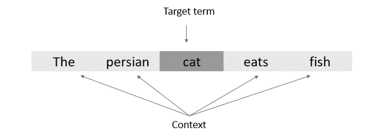

图 4.11：“cat”作为目标词

这五个词汇共同形成一个“窗口”，目标词位于中央，上下文词汇则围绕其周围。在这个例子中，由于我们选择了目标词左右各两个词作为上下文，因此窗口大小为 2（稍后会详细介绍这些参数）。窗口是滑动的，它会在句子中的词汇上滑动。下一个窗口将以`'eats'`为中心，而`'cat'`则成为新的上下文词汇：

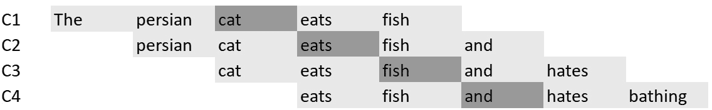

图 4.12：目标词的窗口

`C1`、`C2`、`C3` 和 `C4` 表示每个窗口的上下文。在 `C3` 中，“fish”是目标词，它是通过“cat”、“eats”、“and”和“hates”这些词汇预测出来的。公式已经很清楚了，但模型是如何学习这些表示的呢？我们接下来讨论这个问题：

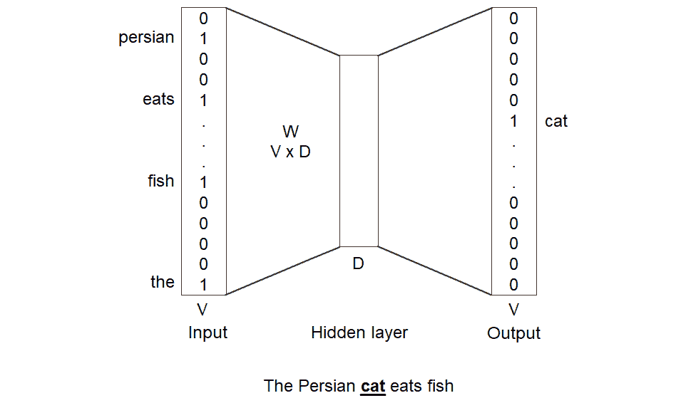

图 4.13：带有示例的 CBOW 架构

上图所示的模型使用了一个带有单一隐藏层的神经网络。输出层是用于目标词的，并且是通过*V*个输出进行独热编码，每个词一个输出——预测的词是`'cat'`，它会在输出中变成`'hot'`。上下文词的输入层大小也是*V*，但它对上下文中的所有词都会有响应。隐藏层的维度是*V x D*（其中*D*是向量的维度）。这个隐藏层就是学习这些神奇词表示的地方。请注意，只有一个输入层，正如权重矩阵*W*所示。

在网络训练的过程中，随着每次迭代，预测目标词的准确性逐步提高，隐藏层的参数也在不断更新。这些参数实际上是每个词的 D 维向量。这个 D 维向量就是我们该词的词嵌入。当迭代完成后，我们将学到词汇表中所有词的词嵌入。很棒，不是吗？

我们刚才讨论的方法是用于训练词向量的 CBOW 方法。上下文是一个简单的词袋（正如我们在上一节讨论的经典方法中提到的；顺序不重要，记住这一点），因此得名。还有另一种流行的方法，叫做 Skip-gram 方法，它与 CBOW 方法相反——它是根据中心词来预测上下文词汇。这个方法一开始可能看起来不太直观，但效果很好。稍后我们会在本章中讨论 CBOW 和 Skip-gram 方法的结果差异：

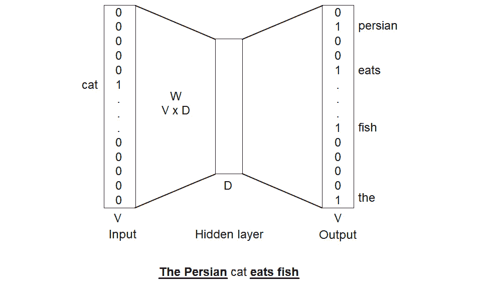

图 4.14：Skip-gram 架构

让我们在 Python 中实际操作一下 CBOW 方法。我们将创建自己的词嵌入，并评估是否能够得到我们之前所声称的惊人结果。

## 训练我们自己的词嵌入

`word2vec`算法有许多不同的软件包实现。我们将使用**Gensim**中的实现，它是处理许多自然语言处理任务的优秀工具包。Gensim 中的 word2vec 实现接近 Mikolov 等人在 2013 年发布的原始论文（[`arxiv.org/pdf/1301.3781.pdf`](https://arxiv.org/pdf/1301.3781.pdf)）。Gensim 还支持其他词嵌入算法；稍后我们会详细讨论。

如果你没有安装 Gensim，可以通过在 Jupyter Notebook 中输入以下命令来安装：

```py
!pip install gensim
```

我们将使用的数据集是`text8`语料库（[`mattmahoney.net/dc/textdata.html`](http://mattmahoney.net/dc/textdata.html)），它来自维基百科的前十亿个字符。因此，它应该涵盖各种主题的数据，而不是某一个特定领域。方便的是，Gensim 提供了一个工具（`downloader` API）来读取这些数据。在从 Gensim 导入`downloader`工具后，让我们来读取这些数据：

```py
import gensim.downloader as api
dataset = api.load("text8")
```

此步骤下载`text8`数据，下载时间可能较长，具体取决于您的网络连接情况。或者，数据可以通过以下链接下载并使用 Gensim 中的`Text8Corpus`工具读取，如以下代码所示：[`packt.live/3gKXU2D`](https://packt.live/3gKXU2D)。

```py
from gensim.models import word2vec
dataset = word2vec.Text8Corpus("text8")
```

`text8`数据现在作为一个可迭代对象，可以直接传递给`word2vec`算法。

在训练嵌入之前，为了使结果具有可重复性，我们使用 NumPy 将随机数生成的种子设置为`1`：

```py
np.random.seed(1)
```

注意

尽管我们已设置了种子，但结果的变化仍然有其他原因。其中一些是由于您的系统上 Python 版本可能使用的内部哈希种子。使用多个核心也可能导致结果变化。无论如何，尽管您看到的值可能不同，结果的顺序可能有所变化，但您看到的输出应该与我们的输出大致一致。请注意，这适用于本章中与词向量相关的所有实际操作。

现在，让我们通过使用`word2Vec`方法来训练我们的第一个词嵌入：

```py
model = word2vec.Word2Vec(dataset)
```

这可能需要一两分钟，或者更短，具体取决于您的系统。完成后，我们将得到训练好的词向量，并可以使用多个方便的工具来处理这些词向量。让我们来访问某个术语的词向量/嵌入表示：

```py
print(model.wv["animal"])
```

输出结果如下所示：

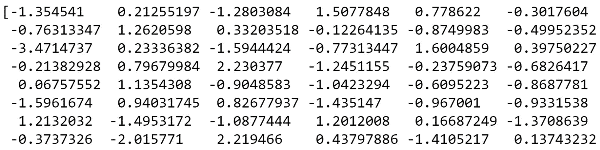

图 4.15: "动物"的嵌入表示

你拥有一系列的数字——表示该术语的向量。让我们来计算这个向量的长度：

```py
len(model.wv["animal"])
```

向量的长度如下所示：

```py
100
```

每个术语的表示现在是一个长度为 100 的向量（这个长度是一个超参数，我们可以更改；我们使用了默认设置来开始）。任何术语的向量都可以像之前那样访问。另一个方便的工具是`most_similar()`方法，它帮助我们找到与目标术语最相似的术语。让我们看看它的实际应用：

```py
model.wv.most_similar("animal")
```

输出结果如下所示：

```py
[('insect', 0.7598186135292053),
 ('animals', 0.729228138923645),
 ('aquatic', 0.6679497957229614),
 ('insects', 0.6522265672683716),
 ('organism', 0.6486647725105286),
 ('mammal', 0.6478426456451416),
 ('eating', 0.6435647010803223),
 ('ants', 0.6415578722953796),
 ('humans', 0.6414449214935303),
 ('feces', 0.6313734650611877)]
```

输出结果是一个元组列表，每个元组包含一个术语及其与“animal”术语的相似度得分。

我们可以看到`insect`（昆虫）、`animals`（动物）、`insects`（昆虫）、和`mammal`（哺乳动物）是与“animal”（动物）最相似的术语。这看起来是一个非常好的结果，对吧？但相似度是如何计算的呢？单词是通过向量来表示的，而这些向量试图捕捉意义——术语之间的相似度实际上是它们对应向量之间的相似度。`most_similar()`方法使用**余弦相似度**来计算向量之间的相似度，并返回具有最高值的术语。结果中每个术语对应的值是与目标词向量的余弦相似度。

在这里，余弦相似度测量很合适，因为我们期望在意义上相似的术语在空间上是在一起的。余弦相似度是向量之间夹角的余弦值。具有相似意义和表示的术语将具有接近 0 的角度和接近 1 的相似度分数，而完全无关的意义将具有接近 90 的角度和接近 0 的余弦相似度。让我们看看模型在"幸福"相关的顶级术语上学到了什么：

```py
model.wv.most_similar("happiness")
```

最相似的项目结果如下（最相似的排在前面）：

```py
[('humanity', 0.7819231748580933),
 ('perfection', 0.7699881792068481),
 ('pleasure', 0.7422512769699097),
 ('righteousness', 0.7402842044830322),
 ('desires', 0.7374188899993896),
 ('dignity', 0.7189303040504456),
 ('goodness', 0.7103697657585144),
 ('fear', 0.7047020196914673),
 ('mankind', 0.7046756744384766),
 ('salvation', 0.6990150213241577)]
```

人类，人类，善良，正义和同情 -- 我们在这里学到了一些生活经验。看起来它已经学到了许多人似乎一辈子也搞不清楚的东西。请记住，这只是一系列矩阵乘法。

## 词嵌入中的语义规律

我们之前提到这些表示捕捉到了语言中的规律，并且很擅长解决简单的类比任务。向量嵌入之间的偏移似乎捕捉到了单词之间的类比关系。因此，例如，*"king" - "man" + "woman"* 期望结果是 "*queen*"。让我们看看我们在`text8`语料库上训练的模型是否也理解了一些规律。

我们将在这里使用`most_similar()`方法，该方法允许我们相互添加和减去向量。我们将提供'king'和'woman'作为要添加的向量，使用'man'来从结果中减去，然后查看与生成向量最相似的五个术语：

```py
model.wv.most_similar(positive=['woman', 'king'], \
                      negative=['man'], topn=5)
```

输出将如下所示：

```py
[('queen', 0.6803990602493286),
 ('empress', 0.6331825852394104),
 ('princess', 0.6145625114440918),
 ('throne', 0.6131302714347839),
 ('emperor', 0.6064509153366089)]
```

最高结果是'queen'。看起来模型捕捉到了这些规律。让我们试试另一个例子。"Man" 对应 "uncle"，就如同 "woman" 对应于？或者用数学形式表达，*uncle - man + woman = ?* 的结果是最接近的向量是什么？

```py
model.wv.most_similar(positive=['uncle', 'woman'], \
                      negative=['man'], topn=5)
```

以下是前述代码的输出：

```py
[('aunt', 0.8145735263824463),
 ('grandmother', 0.8067640066146851),
 ('niece', 0.7993890643119812),
 ('wife', 0.7965766787528992),
 ('widow', 0.7914236187934875)]
```

看起来效果不错。请注意，所有前五个结果都是女性性别的。因此，我们取出了'uncle'，去除了男性元素，添加了女性元素，现在我们得到了一些非常好的结果。

让我们看看一些其他矢量算术的例子。我们也可以对两个不同术语的矢量进行平均，以得到短语的矢量。让我们自己试试吧。

注意

通过对个体向量的平均值来创建短语向量仅仅是到达短语向量的众多方式之一。变化范围从加权平均到更复杂的数学函数。

## 练习 4.05：短语的向量

在这个练习中，我们将通过对两个不同短语`get happy`和`make merry`的个体向量取平均值来创建向量。我们将找到这些短语表示之间的相似性。您需要在我们已经在本章节中使用的同一个 Jupyter Notebook 中继续这个练习。按照以下步骤完成此练习：

1.  提取术语"*get*"的向量并将其存储在一个变量中：

    ```py
    v1 = model.wv['get']
    ```

1.  提取"*happy*"的向量并将其存储在一个变量中：

    ```py
    v2 = model.wv['happy']
    ```

1.  将两个向量的元素逐项平均，创建一个向量，`(v1 + v2)/2`。这是我们整个短语“get happy”的向量：

    ```py
    res1 = (v1+v2)/2
    ```

1.  类似地，提取"*make*"和"*merry*"的向量：

    ```py
    v1 = model.wv['make']
    v2 = model.wv['merry']
    ```

1.  通过对单个向量取平均值来创建该短语的向量：

    ```py
    res2 = (v1+v2)/2
    ```

1.  使用模型中的`cosine_similarities()`方法，计算这两个向量之间的余弦相似度：

    ```py
    model.wv.cosine_similarities(res1, [res2])
    ```

    余弦相似度的结果如下：

    ```py
    array([0.5798107], dtype=float32)
    ```

结果是一个大约为`0.58`的余弦相似度，这是一个正值，比`0`要高得多。这意味着模型认为短语“get happy”和“make merry”的含义相似。还不错吧？我们不仅仅用了简单的平均值，还可以使用加权平均，或者提出更复杂的方法来组合单个向量。

注意

要访问此特定部分的源代码，请参考[`packt.live/2VVNEgf`](https://packt.live/2VVNEgf)。

你也可以在线运行这个示例，网址是[`packt.live/38Gr54r`](https://packt.live/38Gr54r)。你必须执行整个笔记本才能获得期望的结果。

在这个练习中，我们看到如何使用向量运算来表示短语，而不是单个术语，我们发现含义仍然被捕捉到了。这带来了一个非常重要的教训——*词嵌入的向量运算是有意义的*。

这些向量运算操作作用于术语的含义，产生了一些非常有趣的结果。

我们希望你现在能理解词嵌入的强大功能。我们意识到这些结果仅来自一些矩阵乘法，并且只需要花费一分钟时间来训练我们的数据集。词嵌入几乎是神奇的，令人愉快的是，简单的预测公式竟然能产生如此强大的表示。

当我们之前创建单词向量时，并没有过多关注控制项/参数。它们有很多，但只有一些对表示质量有显著影响。接下来我们将了解`word2vec`算法的不同参数，并亲自查看更改这些参数的效果。

### 参数的影响 —— 向量的“大小”

`word2vec`算法的`size`参数是每个术语向量的长度。默认情况下，正如我们之前看到的，这个长度是 100。我们将尝试减少这个参数，并评估结果的差异（如果有的话）。这次我们将`size`设置为 30 并重新训练词嵌入：

```py
model = word2vec.Word2Vec(dataset, size=30)
```

现在，让我们检查之前的类比任务，也就是`king - man + woman`：

```py
model.wv.most_similar(positive=['woman', 'king'], \
                      negative=['man'], topn=5)
```

这应该会给我们以下输出：

```py
[('emperor', 0.8314059972763062),
 ('empress', 0.8250986933708191),
 ('son', 0.8157491683959961),
 ('prince', 0.8060941696166992),
 ('archbishop', 0.8003251552581787)]
```

我们可以看到`queen`没有出现在前五个结果中。看起来，使用非常低的维度时，我们没有在表示中捕捉到足够的信息。

### 参数的影响 —— “窗口大小”

`window size` 参数定义了上下文；具体来说，窗口大小是指在构建上下文时，目标词左右两侧的词汇数量。这个参数的影响并不是特别明显。一般观察是，当你使用更大的窗口大小（比如 20）时，最相似的词似乎是与目标词一起使用的词，并不一定具有相似的意义。另一方面，减少窗口大小（比如设为 2）会返回那些在意义上非常相似的词，并且在很多情况下是同义词。

## Skip-gram 与 CBOW

选择 Skip-gram 和 CBOW 作为学习算法的方式是通过设置 `sg = 1` 来选择 Skip-gram（默认值是 `sg = 0`，即 CBOW）。回顾一下，Skip-gram 方法是基于中心目标词来预测上下文词。而这正好与 CBOW 相反，CBOW 是通过上下文词来预测目标词。那么我们该如何在两者之间做出选择呢？一个比另一个有什么优势吗？为了亲自验证，让我们使用 Skip-gram 训练词嵌入，并将一些结果与 CBOW 的结果进行比较。首先，拿 CBOW 的一个具体例子来说。我们将通过不指定 size 参数来重新创建默认向量大小的 CBOW 词向量。Oeuvre 是指艺术家/表演者的创作总和。我们将查看不常见词 `oeuvre` 的最相似词：

```py
model = word2vec.Word2Vec(dataset)
model.wv.most_similar("oeuvre", topn=5)
```

以下是最相似的词汇：

```py
[('baglione', 0.7203884124755859),
 ('chateaubriand', 0.7119786143302917),
 ('kurosawa', 0.6956337690353394),
 ('swinburne', 0.6926312446594238),
 ('poetess', 0.6910216808319092)]
```

我们可以看到，大多数结果是艺术家的名字（`swinburne`、`kurosawa` 和 `baglione`）或食物菜肴（chateaubriand）。前五个结果中没有任何一个与目标词的意义相近。现在，让我们使用 Skip-gram 方法重新训练我们的向量，并查看在同一任务上的结果：

```py
model_sg = word2vec.Word2Vec(dataset, sg=1)
model_sg.wv.most_similar("oeuvre", topn=5)
```

这给我们带来了以下输出：

```py
[('masterful', 0.8347533345222473),
 ('orchestration', 0.8149941563606262),
 ('mussorgsky', 0.8116796016693115),
 ('showcasing', 0.8080146312713623),
 ('lithographs', 0.805435299873352)]
```

我们可以看到，最相似的词在意义上要更接近（`masterful`、`orchestration`、`showcasing`）。因此，Skip-gram 方法似乎对于稀有词更有效。

为什么会这样呢？CBOW 方法通过有效地对所有上下文词进行平均，平滑了大量的分布统计（记住，所有上下文词一起作为输入），而 Skip-gram 则没有。在数据集较小的情况下，CBOW 进行的平滑处理是值得期待的。如果你拥有一个小型或中等大小的数据集，并且你关心稀有词的表示，那么 Skip-gram 是一个不错的选择。

### 训练数据的影响

在训练词向量时，一个非常重要的决定是使用的基础数据。模式和相似性将从你提供给算法的数据中学习，我们预期模型会从不同领域、不同设置等的数据中以不同的方式学习。为了更好地理解这一点，我们加载来自不同背景的不同语料库，看看嵌入是如何变化的。

Brown 语料库是一个通用文本集合，收集自 15 个不同的主题，使其具有广泛性（包括政治、宗教、书籍、音乐及其他许多主题）。它包含 500 个文本样本和约 100 万字。 "电影"语料库包含来自 IMDb 的电影评论数据。这两个语料库都可以在 NLTK 中使用。

## 练习 4.06：在不同数据集上训练词向量

在本练习中，我们将基于 Brown 语料库和 IMDb 电影评论语料库训练我们自己的词向量。我们将评估所学习的表示法差异及其底层训练数据的影响。按照以下步骤完成本练习：

1.  从 NLTK 导入 Brown 和 IMDb 电影评论语料库：

    ```py
    nltk.download('brown')
    nltk.download('movie_reviews')
    from nltk.corpus import brown, movie_reviews
    ```

1.  这些语料库提供了一个方便的方法 `sent()` 来提取单独的句子和单词（已标记的句子，可以直接传递给 `word2vec` 算法）。由于这两个语料库比较小，我们使用 Skip-gram 方法来创建嵌入：

    ```py
    model_brown = word2vec.Word2Vec(brown.sents(), sg=1)
    model_movie = word2vec.Word2Vec(movie_reviews.sents(), sg=1)
    ```

    现在我们有了两个在不同上下文中学习到的相同术语的词嵌入。让我们看看在 Brown 语料库上训练的模型中，`money` 的最相似词是什么。

1.  打印出从 Brown 语料库中学习到的模型中，与 `money` 最相似的 *前五个词*：

    ```py
    model_brown.wv.most_similar('money', topn=5)
    ```

    以下是前面代码的输出：

    ```py
    [('job', 0.8477444648742676),
     ('care', 0.8424298763275146),
     ('friendship', 0.8394286632537842),
     ('risk', 0.8268661499023438),
     ('permission', 0.8243911862373352)]
    ```

    我们可以看到，排名第一的词是 `'job'`，这也合理。让我们看看该模型在电影评论中学到了什么。

1.  打印出与 `money` 最相似的五个词，它们来自从电影语料库学习的模型：

    ```py
    model_movie.wv.most_similar('money', topn=5)
    ```

    以下是排名靠前的词：

    ```py
    [('cash', 0.7299771904945374),
     ('ransom', 0.7130625247955322),
     ('record', 0.7028014063835144),
     ('risk', 0.6977001428604126),
     ('paid', 0.6940697431564331)]
    ```

排名靠前的词是 `cash` 和 `ransom`。考虑到电影评论中使用的语言，这一点并不令人惊讶。

注意

要访问此部分的源代码，请参阅 [`packt.live/2VVNEgf`](https://packt.live/2VVNEgf)。

你也可以在线运行这个示例，网址为 [`packt.live/38Gr54r`](https://packt.live/38Gr54r)。你必须执行整个 Notebook 才能获得期望的结果。

在本练习中，我们使用不同的数据集创建了词向量，并发现相同术语的表示和所学习的关联很大程度上受到底层数据的影响。因此，选择数据时要谨慎。

## 使用预训练的词向量

到目前为止，我们使用可访问的小数据集训练了我们自己的词嵌入。斯坦福 NLP 小组已经在 60 亿个标记和 40 万个词汇表项上训练了词嵌入。单独来说，我们可能没有足够的资源来处理这样的规模。幸运的是，斯坦福 NLP 小组慷慨地将这些训练好的词嵌入公开，使像我们这样的人可以从他们的工作中受益。这些训练好的嵌入可以在 GloVe 页面上找到 ([`nlp.stanford.edu/projects/glove/`](https://nlp.stanford.edu/projects/glove/))。

关于 GloVe 的简要说明：用于训练的方法略有不同。目标已经修改，使得相似的词汇在空间中更为接近，以一种更为显式的方式。你可以在 GloVe 项目页面上阅读详细信息（[`nlp.stanford.edu/projects/glove/`](https://nlp.stanford.edu/projects/glove/)），该页面也链接到原始的提案论文。最终结果，然而，在性能上与 word2vec 非常相似。

我们将从 GloVe 项目页面下载`glove.6B.zip`文件。该文件包含 50D、100D、200D 和 300D 向量。我们在这里将使用 100D 向量。请解压文件，并确保你在工作目录中有文本文件。这些训练好的向量以文本文件形式提供，格式略有不同。我们将使用 Gensim 中可用的`glove2word2vec`工具，将其转换为 Gensim 可以轻松加载的格式：

```py
from gensim.scripts.glove2word2vec import glove2word2vec
glove_input_file = 'glove.6B.100d.txt'
word2vec_output_file = 'glove.6B.100d.w2vformat.txt'
glove2word2vec(glove_input_file, word2vec_output_file)
```

我们指定了输入和输出文件，并运行了`glove2word2vec`工具。顾名思义，该工具将 GloVe 格式的词向量转换为`word2vec`格式。之后，`word2vec`模型就可以轻松理解这些嵌入。现在，我们来加载从文本文件（已重新格式化）中获取的`keyed`词向量：

```py
from gensim.models.keyedvectors import KeyedVectors
glove_model = KeyedVectors.load_word2vec_format\
              ("glove.6B.100d.w2vformat.txt", binary=False)
```

完成这一步后，我们已经在模型中加入了 GloVe 嵌入，并且拥有了与 word2vec 嵌入模型相同的所有实用工具。接下来，我们来看看与`"money"`最相似的前几个词：

```py
glove_model.most_similar("money", topn=5)
```

输出结果如下：

```py
[('funds', 0.8508071899414062),
 ('cash', 0.848483681678772),
 ('fund', 0.7594833374023438),
 ('paying', 0.7415367364883423),
 ('pay', 0.740767240524292)]
```

为了收尾，我们还检查一下这个模型在 king 和 queen 任务上的表现：

```py
glove_model.most_similar(positive=['woman', 'king'], \
                         negative=['man'], topn=5)
```

以下是前述代码的输出：

```py
[('queen', 0.7698541283607483),
 ('monarch', 0.6843380928039551),
 ('throne', 0.6755737066268921),
 ('daughter', 0.6594556570053101),
 ('princess', 0.6520533561706543)]
```

现在我们已经将这些嵌入加入模型中，我们可以像之前处理我们创建的嵌入那样操作它们，并可以受益于贡献组织提供的更大数据集、词汇库和处理能力。

## 嵌入中的偏差——警告

在讨论规律性和类比时，我们看到了以下例子：

*king – man + woman = queen*

很高兴看到这些嵌入通过学习文本数据来捕捉这些规律性。我们再试一个与职业相关的例子。让我们看看与*doctor – man + woman*最接近的词：

```py
model.wv.most_similar(positive=['woman', 'doctor'], \
                      negative=['man'], topn=5)
```

关于前五个结果的输出将如下所示：

```py
[('nurse', 0.6464251279830933),
 ('child', 0.5847542881965637),
 ('teacher', 0.569127082824707),
 ('detective', 0.5451491475105286),
 ('boyfriend', 0.5403486490249634)]
```

结果不是我们想要的。医生是男性，而女性则是护士？我们再试另一个例子。这次，让我们看看模型对于女性和“聪明”对应男性的看法：

```py
model.wv.most_similar(positive=['woman', 'smart'], \
                      negative=['man'], topn=5)
```

我们得到了以下前五个结果：

```py
[('cute', 0.6156168580055237),
 ('dumb', 0.6035820245742798),
 ('crazy', 0.5834532976150513),
 ('pet', 0.582811713218689),
 ('fancy', 0.5697714686393738)]
```

我们可以看到，前几个词是'cute'、'dumb'和'crazy'。这实在不好。

这里发生了什么？这个看似很棒的表示方法是性别歧视吗？word2vec 算法是否存在性别歧视？结果的词向量中确实存在偏见，但想想这些偏见是从哪里来的。问题出在基础数据上，它在使用`'nurse'`表示女性的上下文中，而`'doctor'`则用于男性。因此，偏见来源于基础文本，而不是算法本身。

这个话题最近引起了广泛关注，围绕如何评估并消除学习到的嵌入中的偏见的研究仍在进行中，但一个好的方法是从一开始就避免数据中的偏见。如果你在 YouTube 评论上训练词嵌入，不要惊讶于它们包含各种极端的偏见。最好避免使用你怀疑包含偏见的文本数据。

## 其他值得注意的词嵌入方法

我们主要使用了 word2vec 方法，并简要了解了 GloVe 方法。虽然这些是最流行的方法，但还有一些其他值得一提的方法：

**FastText**：由**Facebook 的人工智能研究**（**FAIR**）实验室创建，它利用子词信息来丰富词嵌入。你可以在官方页面上阅读更多内容（[`research.fb.com/downloads/fasttext/`](https://research.fb.com/downloads/fasttext/)）。

**WordRank**：将嵌入问题视为词排名问题。它在多个任务中的表现与 word2vec 相似。你可以在[`arxiv.org/abs/1506.02761`](https://arxiv.org/abs/1506.02761)上阅读更多相关内容。

除了这些，一些流行的库现在已经提供了预训练的嵌入（SpaCy 就是一个很好的例子）。选择很多。我们不能在这里详细讨论这些选择，但请务必探索这些选项。

在本章中，我们讨论了许多关于表示的观点。现在，让我们通过一个活动来实现这些想法。

## 活动 4.02：爱丽丝梦游仙境的文本表示

在前一个活动中，我们对文本进行了分词和基本的预处理。在本活动中，我们将通过使用文本表示方法来推进这一过程。你将从数据中创建自己的嵌入，并查看我们所拥有的关系类型。你还将利用预训练的嵌入来表示文本中的数据。

注意

请注意，在继续本活动之前，你需要完成*活动 4.01*、*《爱丽丝梦游仙境》文本预处理*。在该活动中，我们对文本进行了停用词移除。

你需要执行以下步骤：

我们将继续使用之前在*活动 4.01*、*《爱丽丝梦游仙境》文本预处理*中使用的相同 Jupyter Notebook。我们将处理在该活动中获得的去除停用词步骤的结果（假设它存储在名为`alice_words_nostop`的变量中）。打印出结果中的前三个句子。

1.  从 Gensim 中导入`word2vec`并使用默认参数训练你的词嵌入。

1.  查找与`rabbit`最相似的词语。

1.  使用窗口大小为 2，重新训练词向量。

1.  查找与`rabbit`最相似的词语。

1.  使用 Skip-gram 方法，并将窗口大小设为`5`，重新训练词向量。

1.  查找与`rabbit`最相似的词语。

1.  通过对`white`和`rabbit`的词向量进行平均，找到`white rabbit`这个短语的表示。

1.  通过对`mad`和`hatter`的词向量进行平均，找到`mad hatter`的表示。

1.  计算这两个短语之间的余弦相似度。

1.  加载预训练的 100 维 GloVe 词嵌入。

1.  查找`white rabbit`和`mad hatter`的表示。

1.  计算这两个短语之间的余弦相似度。余弦相似度有变化吗？

通过本次活动，我们将得到自己训练的词向量，这些词向量基于《爱丽丝梦游仙境》进行训练，并且可以表示文本中出现的术语。

注意

本活动的详细步骤、解决方案以及额外的评论内容可以在 407 页找到。

# 总结

本章开始时，我们讨论了文本数据的特殊性，以及歧义性如何使自然语言处理（NLP）变得困难。我们提到，处理文本时有两个关键的概念——预处理和表示。我们讨论了预处理中的许多任务，即如何清理和准备数据以便进行分析。我们还看到了去除数据中不完美部分的各种方法。

表示是下一个重要方面——我们理解了表示文本时需要考虑的因素，以及如何将文本转化为数字。我们回顾了各种方法，从经典方法开始，包括独热编码、基于计数的方法和 TF-IDF 方法。

词嵌入是一种全新的文本表示方法，借鉴了分布式语义学的思想——在相似上下文中出现的术语具有相似的含义。word2vec 算法巧妙地利用了这个思想，通过设定预测问题来预测目标词语，给定上下文来预测目标词语。它使用神经网络进行预测，并在此过程中学习词汇的向量表示。

我们发现这些表示非常令人惊讶，因为它们似乎能够捕捉到意义，而且简单的算术运算给出了非常有趣且富有意义的结果。你甚至可以通过词向量来创建短语，甚至是句子或文档的表示。这为后续我们在更复杂的深度学习架构中使用词嵌入技术处理 NLP 任务打下了基础。

在下一章，我们将继续探索序列，应用深度学习方法，如递归神经网络（RNN）和一维卷积（1D 卷积）。
