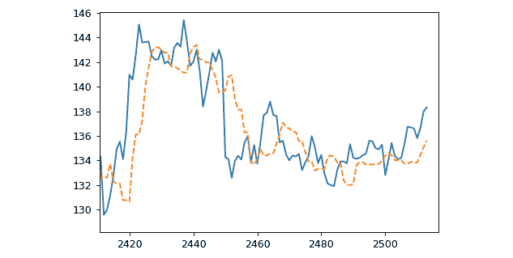

# 第五章：5\. 深度学习在序列中的应用

概述

在本章中，我们将实现基于深度学习的序列建模方法，在了解处理序列时需要注意的事项后开始。我们将从**递归神经网络**（**RNNs**）开始，这是一个直观的序列处理方法，已提供了最先进的结果。接着我们将讨论并实现 1D 卷积作为另一种方法，并对比其与 RNN 的效果。我们还将把 RNN 与 1D 卷积结合在一个混合模型中。我们将在一个经典的序列处理任务——股票价格预测上使用这些模型。到本章结束时，你将能够熟练地实现深度学习序列方法，特别是普通 RNN 和 1D 卷积，并为更先进的基于 RNN 的模型奠定基础。

# 引言

假设你正在处理文本数据，目标是构建一个模型，检查一个句子是否语法正确。考虑以下句子：*“words? while sequence be this solved of can the ignoring”。* 这个问题没有意义，对吧？那么，下面的句子怎么样？*“Can this be solved while ignoring the sequence of words?”*

突然间，文本变得完全有意义。那么，关于处理文本数据我们得出什么结论呢？序列很重要。

在评估一个句子是否语法正确的任务中，序列是非常重要的。忽略序列的模型会在任务中惨败。这个任务的性质要求你分析术语的顺序。

在上一章中，我们处理了文本数据，讨论了表示的相关思想，并创建了我们自己的词向量。文本和自然语言数据有一个重要的特性——它们具有顺序性。文本数据是序列数据的一种例子，但序列无处不在：从语音到股价，从音乐到全球气温。在本章中，我们将开始以一种考虑元素顺序的方式处理顺序数据。我们将从 RNN 开始，这是一种深度学习方法，利用数据的序列性为诸如机器翻译、情感分析、推荐系统和时间序列预测等任务提供有见地的结果。然后，我们将研究如何使用卷积处理序列数据。最后，我们将看到如何将这些方法结合在一个强大的深度学习架构中。过程中，我们还将构建一个基于 RNN 的股票价格预测模型。

# 与序列的工作

让我们看一个例子，以更清楚地说明序列建模的重要性。任务是预测某公司未来 30 天的股票价格。提供给你的数据是今天的股票价格。你可以在以下图表中看到，*y 轴*表示股票价格，*x 轴*表示日期。这样的数据足够吗？


图 5.1：仅用 1 天数据的股票价格

当然，单一数据点，即某一天的价格，无法预测接下来 30 天的价格。我们需要更多的信息。特别是，我们需要关于过去的信息——股票价格在过去几天/月/年的走势。因此，我们请求并获得了三年的数据：


图 5.2：使用历史数据的股票价格预测

这样看起来更有用，对吧？通过观察过去的趋势和数据中的一些模式，我们可以对未来的股票价格进行预测。因此，通过观察过去的趋势，我们可以大致了解股票在接下来几天的走势。如果没有序列，这是无法做到的。再次强调，序列很重要。

在实际应用中，比如机器翻译，你需要考虑数据中的序列。忽略序列的模型只能在某些任务中起到有限作用；你需要一种真正能够充分利用序列中信息的方法。但在讨论这些架构的工作原理之前，我们需要回答一个重要问题：*序列到底是什么*？

虽然词典中的“*序列*”定义是相当直白的，但我们需要能够自己识别序列，并决定是否需要考虑序列。为了理解这个概念，让我们回到我们看到的第一个例子：“*words? while sequence be this solved of can the ignoring*” 和 “*can this be solved while ignoring the sequence of words?*”

当你将有意义的句子中的词语顺序打乱时，它就变得没有意义，丧失了所有或大部分信息。这可以是测试序列的一种简单有效的方法：如果你打乱了元素，它还合理吗？如果答案是否定的，那你手中就有一个序列。虽然序列无处不在，这里有一些序列数据的例子：语言、音乐、电影剧本、音乐视频、时间序列数据（股票价格、商品价格等），以及患者的生存概率。

## 时间序列数据——股票价格预测

我们将开始构建自己的股票价格预测模型。股票价格预测任务的目标是构建一个基于历史价格能够预测第二天股票价格的模型。正如我们在前一节中看到的，这个任务要求我们考虑数据中的顺序。我们将预测苹果公司（Apple Inc.）的股票价格。

注意

我们将使用从纳斯达克网站获取的经过清理的苹果历史股票数据：[`www.nasdaq.com/market-activity/stocks/aapl/historical`](https://www.nasdaq.com/market-activity/stocks/aapl/historical)。数据集可以从以下链接下载：[`packt.live/325WSKR`](https://packt.live/325WSKR)。

确保将文件（`AAPL.csv`）放在你的工作目录中，并开始一个新的 Jupyter Notebook 来编写代码。你必须在同一个 Jupyter Notebook 中运行所有练习和主题部分的代码。

让我们从理解数据开始。我们将加载所需的库，然后加载并绘制数据。你可以使用以下命令加载必要的库，并使用单元格魔法命令（`%matplotlib inline`）将图像内联显示：

```py
import pandas as pd, numpy as np
import matplotlib.pyplot as plt
%matplotlib inline
```

接下来，我们将使用 Pandas 的 `read_csv()` 方法加载 `.csv` 文件到一个 DataFrame（`inp0`），并通过 pandas DataFrame 的 `head` 方法查看一些记录：

```py
inp0 = pd.read_csv('AAPL.csv')
inp0.head()
```

你应该得到以下输出：


图 5.3：AAPL 数据集的前五条记录

我们可以看到，第一条记录是 2020 年 1 月 17 日，是数据中最接近的日期（截至本书写作时的最新数据）。按照 pandas DataFrame 的惯例，第一条记录的索引为 0（索引是行的标识符，每一行都有一个索引值）。`Open` 表示股票开盘时的价格，`High` 表示当天股票的最高价格，而 `Low` 和 `Close` 分别代表最低价格和收盘价。我们还记录了当天的交易量。

让我们还通过以下命令查看数据集的最后几条记录：

```py
inp0.tail()
```

记录如下所示：


图 5.4：AAPL 数据集的底部五条记录

从前面的表格中我们可以看到，我们有从 2010 年 1 月 25 日到 2020 年 1 月 17 日的每日开盘价、最高价、最低价和收盘价，以及成交量。对于我们的目的，我们关心的是收盘价。

## 练习 5.01：可视化我们的时间序列数据

在这个练习中，我们将从数据中提取收盘价，进行必要的格式化，并绘制时间序列图，以更好地理解数据。确保你已经阅读了前面的章节并加载了数据，同时导入了相关库。按照以下步骤完成本练习：

1.  如果你还没有导入所需的库，可以使用以下命令：

    ```py
    import pandas as pd, numpy as np
    import matplotlib.pyplot as plt
    %matplotlib inline
    ```

1.  从 GitHub 下载名为`AAPL.csv`的文件 ([`packt.live/325WSKR`](https://packt.live/325WSKR)) 并将其加载到一个 DataFrame 中：

    ```py
    inp0 = pd.read_csv('AAPL.csv')
    ```

1.  使用 `plot` 方法将 `Close` 列绘制成折线图，观察其模式，并指定 `Date` 列为 *X 轴*：

    ```py
    inp0.plot("Date", "Close")
    plt.show()
    ```

    这个图的绘制如下，*X 轴*显示的是收盘价，*Y 轴*表示日期：

    

    图 5.5：收盘价图

    从图中可以看到，最新的值首先被绘制（在左侧）。为了便于绘制和处理，我们将反转数据。我们将通过按索引（记住索引为最新记录的 0）降序排列 DataFrame 来实现这一点。

1.  通过按索引排序 DataFrame 反转数据。重新绘制收盘价，并将`Date`作为*X 轴*：

    ```py
    inp0 = inp0.sort_index(ascending=False)
    inp0.plot("Date", "Close")
    plt.show()
    ```

    收盘价将按以下方式绘制：

    

    图 5.6：反转数据后的趋势

    这按预期工作。我们可以看到最新的值已被绘制到右侧。

1.  从 DataFrame 中提取`Close`列的值，作为`numpy`数组，并通过`array.reshape(-1,1)`调整为一列：

    ```py
    ts_data = inp0.Close.values.reshape(-1,1)
    ```

1.  使用 matplotlib 绘制值的线形图。无需担心标记日期；数据的顺序是清楚的（matplotlib 会使用索引，起始点为 0）：

    ```py
    plt.figure(figsize=[14,5])
    plt.plot(ts_data)
    plt.show()
    ```

    得到的趋势如下，*X 轴*表示索引，*Y 轴*显示收盘价：

    

图 5.7：每日股价趋势

这就是我们的序列数据的样子。数据没有明显的连续趋势；价格曾在一段时间内上涨，之后股价波动不定。模式不简单。我们可以看到在短期内（可能是按月）有一定的季节性变化。总体来说，模式相当复杂，数据中没有明显且易于识别的周期性变化可以利用。这个复杂的序列就是我们要处理的——使用历史数据预测某一天的股价。

注意

要访问此特定部分的源代码，请参考[`packt.live/2ZctArW`](https://packt.live/2ZctArW)。

您也可以在[`packt.live/38EDOEA`](https://packt.live/38EDOEA)上在线运行此示例。必须执行整个 Notebook 才能获得期望的结果。

在这个练习中，我们加载了股价数据。为了便于处理，我们反转了数据，并提取了收盘价（`Close`列）。我们绘制了数据图，以直观地检查数据中的趋势和模式，意识到数据中并没有明显的模式可以利用。

注意

是否将数据视为序列也取决于当前的任务。如果任务不需要序列中的信息，那么可能就不需要将其视为序列。

本章将专注于那些需要或能从数据序列中获益的任务。这是如何实现的？我们将在接下来的章节中找出答案，讨论 RNN 背后的直觉和方法。

# 循环神经网络

我们的大脑如何处理一个句子？让我们试着理解一下我们的大脑在阅读句子时如何处理它。你看到句子中的一些词汇，然后需要识别句子中包含的情感（正面、负面、中性）。让我们来看第一个词汇—— "`I`"：


图 5.8：第一个词汇的情感分析

"`I`" 是中性的，因此我们的分类（中性）是合适的。让我们看一下下一个词汇：


图 5.9：包含两个词汇的情感分析

加入了 "`can't`" 这个词后，我们需要更新对情感的评估。"`I`" 和 "`can't`" 一起通常具有负面含义，因此我们当前的评估被更新为“负面”，并标记为一个叉号。让我们看一下接下来的几个词汇：


图 5.10：包含四个词汇的情感分析

在增加两个词汇之后，我们仍然预测句子具有负面情感。根据目前的信息，"`I can't find any`" 是一个合理的判断。让我们看一下最后一个词汇：


图 5.11：添加最终词汇后的情感分析

随着最后一个词汇的加入，我们的预测完全被推翻了。突然间，我们现在认为这是一个积极的表达。每加入一个新词汇，你的评估都会更新，是不是？你的大脑收集所有现有的信息，并做出评估。当新词汇到达时，当前的评估会被更新。这个过程正是 RNN 模拟的过程。

那么，是什么使网络“具有递归性”？关键思想是*不仅处理新信息，还保留迄今为止接收到的信息*。在 RNN 中，通过使输出不仅依赖于新的输入值，还依赖于当前的“状态”（即迄今为止捕获的信息），从而实现这一点。为了更好地理解这一点，让我们看看标准的前馈神经网络如何处理一个简单的句子，并与 RNN 的处理方式进行比较。

考虑情感分类任务（正面或负面），例如输入句子“*life is good*”。在标准前馈网络中，句子中所有词汇对应的输入会一起传递给网络。如下面的图示所示，输入数据是句子中所有词汇的组合表示，这些词汇已经传递到网络的隐藏层中。所有的词汇一起被考虑，用于将句子的情感分类为正面：


图 5.12：用于情感分类的标准前馈网络

相比之下，RNN 会逐字处理句子。如以下图所示，词项 "*life*" 的第一个输入在 *t=0* 时传递给隐藏层。隐藏层提供了一些输出值，但这还不是句子的最终分类，而只是隐藏层的中间值。此时尚未进行分类：


图 5.13: RNN 在 t=0 时处理第一个词项

下一项 "`is`" 及其对应的输入在 *t=1* 时被处理，并传递给隐藏层。如以下图所示，此时，隐藏层还会考虑 *t=0* 时隐藏层的中间输出，这实际上是对应于 "`life`" 这一项的输出。此时，隐藏层的输出将有效地考虑新的输入（"`is`"）和前一时间步的输入（"`life`"）：


图 5.14: t=1 时的网络

在 *t=1* 时步之后，隐藏层的输出有效地包含了来自 "`life`" 和 "`is`" 的信息，实际上保持了迄今为止的输入信息。在 *t=2* 时，下一项数据，即 "`good`"，被传递到隐藏层。以下图所示，隐藏层将使用新的输入数据，以及来自 *t=1* 时隐藏层的输出，生成一个输出。这个输出有效地考虑了到目前为止的所有输入，并按照它们在输入文本中的出现顺序进行处理。直到整个句子被处理完毕，才会做出最终的分类（在此为“积极”）：


图 5.15: 在 t=2 时处理整个句子的输出

## 循环 – RNN 的核心部分

RNN 的一个常见部分是使用“循环”，如以下图所示。所谓循环，是指一种保留“状态”值的机制，包含迄今为止的信息，并将其与新的输入一起使用：


图 5.16: 带循环的 RNN

如以下图所示，这是通过简单地虚拟复制隐藏层并在下一个时间步使用它来完成的，即在处理下一个输入时。如果逐词处理句子，这意味着对于每个词项，保存隐藏层的输出（时间 *t-1*），当新词项在时间 *t* 到来时，将处理隐藏层的输出（时间 *t*）及其前一状态（时间 *t-1*）。实际上，过程就是如此简单：


图 5.17: 复制隐藏层状态

为了更清楚地了解 RNN 的工作原理，让我们扩展视图，从*图 5.15*开始，我们可以看到输入句子是如何按词处理的。我们将理解 RNN 与标准前馈网络有何不同。

被虚线框突出显示的部分应该对你很熟悉——它代表了带有隐藏层（虚线矩形）的标准前馈网络。输入数据从左到右流经网络的深度，使用前馈权重 WF 来提供输出——这与标准的前馈网络完全相同。递归部分是数据从底部到顶部的流动，跨越时间步：


图 5.18：RNN 架构

对于所有隐藏层，输出也沿着时间维度传播到下一个时间步。或者，对于时间步 *t* 和深度 *l* 的隐藏层，输入如下：

+   来自同一时间步的前一个隐藏层的数据

+   来自前一个时间步的相同隐藏层的数据

仔细查看前面的图示，以理解 RNN 的工作原理。隐藏层的输出可以通过以下方式推导出来：


图 5.19：在 RNN 中计算激活值

公式的第一部分，*W*F(l)at(l-1)，对应于前馈计算的结果，也就是将前馈权重 (*W*F) 应用于来自前一层的输出 (*a*t(l-1))。第二部分对应于递归计算，即将递归权重 (*W*R(l)) 应用于来自前一个时间步的同一层的输出 (*a*t-1(l))。此外，与所有神经网络层一样，还有一个偏置项。应用激活函数后，该结果成为时间 *t* 和深度 *l* 层的输出 (*a*t(l))。

为了使这个概念更加具体，我们将使用 TensorFlow 实现一个简单 RNN 的前馈步骤。

## 练习 5.02：使用 TensorFlow 实现简单 RNN 的前馈传递

在这个练习中，我们将使用 TensorFlow 执行一个简单 RNN 的操作，其中有一个隐藏层和两个时间步。通过执行一次传递，我们的意思是计算时间步 *t=0* 时隐藏层的激活值，然后使用该输出以及 *t=1* 时的新输入（应用适当的递归和前馈权重）来获得 *t=1* 时的输出。启动一个新的 Jupyter Notebook 进行此练习并执行以下步骤：

1.  导入 TensorFlow 和 NumPy。使用 `numpy` 设置随机种子为 `0` 以使结果具有可复现性：

    ```py
    import numpy as np
    import tensorflow as tf
    np.random.seed(0)
    tf.random.set_seed(0)
    ```

1.  定义 `num_inputs` 和 `num_neurons` 常量，分别表示输入的数量（2）和隐藏层中神经元的数量（3）：

    ```py
    num_inputs = 2
    num_neurons = 3
    ```

    在每个时间步，我们将有两个输入。我们将它们称为 `xt0` 和 `xt1`。

1.  定义权重矩阵的变量。我们需要两个——一个用于前馈权重，另一个用于递归权重。随机初始化它们：

    ```py
    Wf = tf.Variable(tf.random.normal\
                    (shape=[num_inputs, num_neurons]))
    Wr = tf.Variable(tf.random.normal\
                    (shape=[num_neurons, num_neurons]))
    ```

    注意递归权重的维度——它是一个方阵，行/列的数量等于隐藏层神经元的数量。

1.  添加偏置变量（以使激活函数更好地拟合数据），其值为隐藏层神经元数量的零：

    ```py
    b = tf.Variable(tf.zeros([1,num_neurons]))
    ```

1.  创建数据——`xt0` 的三个示例（两个输入，三个示例），为 `[[0,1], [2,3], [4,5]]`，`xt1` 为 `[[100,101], [102,103], [104,105]]`——作为 `numpy` 数组，类型为 `float32`（与 TensorFlow 默认浮动表示的 `dtype` 一致）：

    ```py
    xt0_batch = np.array([[0,1],[2,3],[4,5]]).astype(np.float32)
    xt1_batch = np.array([[100, 101],[102, 103],\
                          [104,105]]).astype(np.float32)
    ```

1.  定义一个名为 `forward_pass` 的函数，用于对给定数据（即 `xt0`，`xt1`）应用前向传播。使用 `tanh` 作为激活函数。时间 *t=0* 时的输出应该仅由 `Wf` 和 `xt0` 得到。时间 *t=1* 时的输出必须使用 `yt0` 和递归权重 `Wf`，并且使用新的输入 `xt1`。该函数应返回两个时间步的输出：

    ```py
    def forward_pass(xt0, xt1):
        yt0 = tf.tanh(tf.matmul(xt0, Wf) + b)
        yt1 = tf.tanh(tf.matmul(yt0, Wr) + tf.matmul(xt1, Wf) + b)
        return yt0, yt1
    ```

    注意，在时间步 0 时这里没有递归权重；它只会在第一个时间步之后才会起作用。

1.  通过调用 `forward_pass` 函数并传入创建的数据（`xt0_batch`，`xt1_batch`），执行前向传播，并将输出存储在变量 `yt0_output` 和 `yt1_output` 中：

    ```py
    yt0_output, yt1_output = forward_pass(xt0_batch, xt1_batch)
    ```

1.  使用 TensorFlow 的 `print` 函数打印输出值 `yt0_output` 和 `yt1_output`：

    ```py
    tf.print(yt0_output)
    ```

    时间 *t=0* 时的输出如下所示。注意，由于 TensorFlow 执行随机初始化，您看到的结果可能会略有不同：

    ```py
    [[-0.776318431 -0.844548464 0.438419849]
     [-0.0857750699 -0.993522227 0.516408086]
     [0.698345721 -0.999749422 0.586677969]]
    ```

1.  现在，打印 `yt1_output` 的值：

    ```py
    tf.print(yt1_output)
    ```

    时间 *t=1* 时的输出如下所示。再次说明，由于随机初始化值的不同，您看到的结果可能会略有不同，但所有值应接近 1 或 -1：

    ```py
     [[1 -1 0.999998629]
     [1 -1 0.999998331]
     [1 -1 0.999997377]]
    ```

    我们可以看到，时间 *t=1* 时的最终输出是一个 3x3 的矩阵——表示三种数据实例的隐藏层三个神经元的输出。

    注意

    要访问该特定部分的源代码，请参阅 [`packt.live/2ZctArW`](https://packt.live/2ZctArW)。

    您也可以在 [`packt.live/38EDOEA`](https://packt.live/38EDOEA) 在线运行此示例。您必须执行整个 Notebook 才能获得期望的结果。

    注意

    尽管我们已为 `numpy` 和 `tensorflow` 设置了种子以实现可复现的结果，但仍然有许多因素会导致结果的变化。尽管您看到的值可能不同，但您看到的输出应该与我们的结果大致一致。

在这个练习中，我们手动执行了一个简单 RNN 的两个时间步的前向传播。我们看到，它仅仅是将前一个时间步的隐藏层输出作为输入传递给下一个时间步。现在，您实际上不需要手动执行这些步骤——Keras 使得构建 RNN 非常简单。我们将使用 Keras 来进行股票价格预测模型。

## RNN 的灵活性和多样性

在*练习 5.2*，*使用 TensorFlow 实现简单 RNN 的前向传递*中，我们在每个时间步使用了两个输入，并且每个时间步都有一个输出。但这并不总是必须的。RNN 提供了很多灵活性。首先，你可以有单个/多个输入以及输出。此外，你不必在每个时间步都有输入和输出。

你可以有以下情况：

+   在不同时间步的输入，输出仅在最后一步得到

+   单个输入，多个时间步的输出

+   在多个时间步，输入和输出（长度相等或不等）

RNN 架构具有巨大的灵活性，这种灵活性使其非常多才多艺。让我们看看一些可能的架构以及它们的一些潜在应用：


图 5.20：多个时间步的输入，输出仅在最后一步得到

你可以在多个时间步输入数据，例如在一个序列中（或一个或多个输入），并且输出仅在最后一个时间步生成预测，如前面的图所示。在每个时间步，隐藏层基于上一层的前馈输出和上一时间步副本的循环输出进行操作。但是在中间时间步并不会进行预测。预测只会在处理完整个输入序列后进行——这与我们在*图 5.15*（"*生活是美好*"的例子）中看到的过程相同。文本分类应用广泛使用这种架构——情感分类（正面/负面）、将邮件分类为垃圾邮件/正常邮件、识别评论中的仇恨言论、自动审核购物平台上的产品评论等。

时间序列预测（例如，股票价格）也利用这种架构，其中处理过去的几个值来预测一个未来的值：


图 5.21：单步输入，多步输出

前面的图示例了另一种架构，其中输入在一个时间步接收，但输出是在多个时间步得到的。围绕生成的应用——根据给定关键词生成图像、根据给定关键词生成音乐（作曲家）或根据给定关键词生成一段文本——都基于这种架构。

你也可以在每个时间步产生与输入相对应的输出，如下图所示。从本质上讲，这种模型将帮助你对序列中的每个输入元素进行预测。这样任务的一个例子是词性标注——对于句子中的每个词，我们识别该词是名词、动词、形容词还是其他词性。

来自自然语言处理的另一个例子是**命名实体识别**（**NER**），在这里，对于文本中的每个词语，目标是检测它是否代表一个命名实体，然后将其分类为组织、人物、地点或其他类别（如果是的话）：


图 5.22：每个时间步的多个输出

在前面的架构中，我们为每个输入元素都提供了一个输出。在许多情况下，这种方法并不适用，我们需要一种架构，能够处理输入和输出长度不同的情况，如下图所示。想想语言之间的翻译。一句英语在德语中是否一定有相同数量的词汇？通常答案是否定的。对于这种情况，下面的架构提供了“编码器”和“解码器”的概念。输入序列对应的信息存储在编码器网络的最终隐藏层中，该层本身包含循环层。

这个表示/信息由解码器网络处理（同样，这也是递归的），它输出翻译后的序列：


图 5.23：输入和输出长度不同的架构

对于所有这些架构，你还可以有多个输入，使得 RNN 模型更加多功能。例如，在进行股票价格预测时，你可以在多个时间步长内提供多个输入（公司过去的股价、股市指数、原油价格以及你认为相关的任何其他信息），RNN 将能够处理并利用所有这些输入。这也是 RNN 广受欢迎的原因之一，它们改变了我们今天处理序列数据的方式。当然，你还可以利用深度学习的所有预测能力。

## 股票价格预测数据的准备

对于我们的股票价格预测任务，我们将使用过去几天的数据，通过输入到 RNN 中来预测某一天给定股票的价值。在这里，我们有一个单一的输入（单一特征），跨越多个时间步，并且只有一个输出。我们将采用*图 5.20*中的 RNN 架构。

注

在本章中，我们将继续使用同一个 Jupyter Notebook 来绘制我们的时间序列数据（除非另有说明）。

到目前为止，我们已经查看了数据并理解了我们处理的内容。接下来，我们需要为模型准备数据。第一步是对数据进行训练集和测试集的划分。由于这是时间序列数据，我们不能随意选择点来分配训练集和测试集。我们需要保持顺序。对于时间序列数据，我们通常保留数据的前一部分用于训练，最后一部分用于测试。在我们的案例中，我们将前 75%的记录作为训练数据，最后 25%的记录作为测试数据。以下命令将帮助我们获得所需的训练集大小：

```py
train_recs = int(len(ts_data) * 0.75)
```

这是我们在训练集中的记录数量。我们可以按以下方式分割数据集：

```py
train_data = ts_data[:train_recs]
test_data = ts_data[train_recs:]
len(train_data), len(test_data)
```

训练集和测试集的长度如下所示：

```py
(1885, 629)
```

接下来，我们需要对股票数据进行缩放。为此，我们可以使用`sklearn`中的 min-max 缩放器。`MinMaxScaler`将数据缩放到 0 到 1（包括 0 和 1）之间——数据中的最高值映射为 1。我们将在训练数据上拟合并转换缩放器，然后只对测试数据进行转换：

```py
from sklearn.preprocessing import MinMaxScaler
scaler = MinMaxScaler()
train_scaled = scaler.fit_transform(train_data)
test_scaled = scaler.transform(test_data)
```

下一个重要步骤是格式化数据，以获取每个实例的“特征”。我们需要定义一个“回溯期”——即从历史数据中用来预测下一个值的天数。以下代码将帮助我们定义一个返回目标值`y`（某一天的股票价格）和`X`（回溯期内每天的值）的函数：

```py
def get_lookback(inp, look_back):
    y = pd.DataFrame(inp)
    dataX = [y.shift(i) for i in range(1, look_back+1)]
    dataX = pd.concat(dataX, axis=1)
    dataX.fillna(0, inplace = True)
    return dataX.values, y.values
```

这个函数接收一个数据集（实际上是一个数字序列），并根据提供的回溯期，添加历史中的相应值。它通过每次移动序列并将其与结果连接来完成此操作。该函数返回当天的股票价格作为*y*，以及回溯期内的值（已偏移的值）作为我们的特征。现在，我们可以定义一个回溯期，并查看将该函数应用于我们的数据后的结果：

```py
look_back = 10
trainX, trainY = get_lookback(train_scaled, look_back=look_back)
testX, testY = get_lookback(test_scaled, look_back= look_back)
```

尝试以下命令来检查结果数据集的形状：

```py
trainX.shape, testX.shape
```

输出结果如下：

```py
((1885, 10), (629, 10))
```

如预期，每个样本有 10 个特征，分别对应过去 10 天的数据。我们拥有训练数据和测试数据的历史数据。有了这些，数据准备工作就完成了。在开始构建第一个 RNN 模型之前，让我们进一步了解一下 RNN。

注意

我们在这里创建的`trainX`和`trainY`变量将在接下来的练习中使用。所以，请确保你在同一个 Jupyter Notebook 中运行本章节的代码。

## RNN 中的参数

要计算 RNN 层中的参数数量，我们来看看一个通用的隐藏层：


图 5.24：递归层的参数

隐藏层从前一个隐藏层的同一时间步获取输入，同时也从自身的先前时间步获取输入。如果输入层（前一个隐藏层）是 m 维的，那么我们需要*n×m*个权重/参数，其中*n*是 RNN 层中神经元的数量。对于输出层，如果输出的维度是*k*，则权重的维度为*n×k*。递归权重始终是一个维度为*n×n*的方阵——因为输入的维度与该层本身相同。

因此，任何 RNN 层的参数数量为`n`² `+ nk + nm`，其中我们有以下内容：

+   `n`：隐藏（当前）层的维度

+   `m`：输入层的维度

+   `k`：输出层的维度

## 训练 RNN

如何在 RNN 中前向传播信息现在应该已经很清楚。如果不清楚，请参考*图 5.19*中的方程式。新的信息沿着网络的深度以及时间步传播，使用每个步骤的前一个隐藏状态。训练 RNN 的另外两个关键方面如下：

+   **定义损失**：我们知道如何为标准神经网络定义损失；也就是说，它只有一个输出。对于 RNN，如果输出是单一时间步（例如，文本分类），则损失的计算方式与标准神经网络相同。但我们知道，RNN 可以在多个时间步上有输出（例如，在词性标注或机器翻译中）。那么，如何在多个时间步上定义损失呢？一种非常简单且流行的方法是将所有步骤的损失加总。整个序列的损失计算为所有时间步损失的总和。

+   **反向传播**：反向传播误差现在需要我们跨越时间步进行，因为还有时间维度。我们已经看到，损失被定义为每个时间步的损失之和。通常的链式法则应用有助于我们解决这个问题；我们还需要将每个时间步的梯度在时间上进行求和。这个过程有一个非常吸引人的名字：**通过时间的反向传播**（**BPTT**）。

    注意

    训练过程的详细处理和涉及的数学超出了本书的范围。我们需要理解的基本概念就足够了。

现在，让我们继续使用 Keras 构建我们的第一个 RNN 模型。在本章中，我们将介绍 Keras 中可用的两个新层，并理解它们的功能和用途。我们需要的第一个层是`SimpleRNN`层。

要从 Keras 导入所有必要的工具，您可以使用以下代码：

```py
from tensorflow.keras.models import Sequential
from tensorflow.keras.layers \
import SimpleRNN, Activation, Dropout, Dense, Reshape
```

SimpleRNN 层是最简单的基本 RNN 层。它接受一个序列，并将神经元的输出反馈作为输入。此外，如果我们希望在这个 RNN 层后跟随另一个 RNN 层，我们可以选择将序列作为输出。让我们来看一下其中的一些选项。

+   `?SimpleRNN`：SimpleRNN 层的签名如下：


](img/B15385_05_25.jpg)

图 5.25：SimpleRNN 层的签名

我们可以看到，Keras 的层也具有所有常规/标准层的选项，可以让你指定激活函数、初始化、丢弃等。

RNN 层期望输入数据具有特定格式。由于我们可能有多个特征的多时间步输入数据，输入格式应该能够明确表达这一要求。期望的输入形状是 (look_back, 特征数量)。它期望每个特征都有相同的回溯历史。

在我们的案例中，我们只有一个特征，回溯期为 10。因此，预期的输入形状是 (10, 1)。请注意，我们当前每个输入都是一个包含 10 个值的列表，所以我们需要确保它被理解为 (10, 1)。我们将使用重塑层来完成此操作。重塑层需要输入形状和目标形状。让我们通过实例化并添加重塑层来开始构建模型。

注意

即使我们已经设置了 `numpy` 和 `tensorflow` 的种子以实现可重复的结果，但仍然有许多变化的因素，因此你可能会得到与我们不同的结果。这适用于我们将在此处使用的所有模型。虽然你看到的值可能不同，但你看到的输出应该与我们大致相符。如果模型表现差异很大，你可能需要调整训练轮数 —— 原因在于神经网络中的权重是随机初始化的，因此你和我们可能从不同的起点开始，经过不同的轮次训练后可能会达到相似的状态。

## 练习 5.03：构建我们的第一个普通 RNN 模型

在这个练习中，我们将构建我们的第一个普通 RNN 模型。我们将有一个重塑层，接着是一个 `SimpleRNN` 层，最后是一个用于预测的全连接层。我们将使用之前创建的格式化数据 `trainX` 和 `trainY`，以及从 Keras 初始化的层。请执行以下步骤来完成此练习：

1.  从 Keras 中收集必要的工具。使用以下代码进行操作：

    ```py
    from tensorflow.keras.models import Sequential
    from tensorflow.keras.layers \
    import SimpleRNN, Activation, Dropout, Dense, Reshape
    ```

1.  实例化 `Sequential` 模型：

    ```py
    model = Sequential()
    ```

1.  添加一个 `Reshape` 层，以使数据符合 (`look_back`, `1`) 的格式：

    ```py
    model.add(Reshape((look_back,1), input_shape = (look_back,)))
    ```

    注意 `Reshape` 层的参数。目标形状是（`lookback, 1`），正如我们所讨论的。

1.  添加一个具有 32 个神经元的 `SimpleRNN` 层，并指定输入形状。请注意，我们选择了一个任意数量的神经元，因此你可以尝试不同的数量：

    ```py
    model.add(SimpleRNN(32, input_shape=(look_back, 1)))
    ```

1.  添加一个大小为 1 的 `Dense` 层：

    ```py
    model.add(Dense(1))
    ```

1.  添加一个 `Activation` 层，并使用线性激活函数：

    ```py
    model.add(Activation('linear'))
    ```

1.  使用 `adam` 优化器和 `mean_squared_error`（因为我们预测的是一个实数值量）来编译模型：

    ```py
    model.compile(loss='mean_squared_error', optimizer='adam')
    ```

1.  打印模型的摘要：

    ```py
    model.summary()
    ```

    摘要将如下所示：


](img/B15385_05_26.jpg)

图 5.26：SimpleRNN 模型总结

请注意`SimpleRNN`层中的参数数量。结果正如我们预期的那样。

注意

要访问此特定部分的源代码，请参考[`packt.live/2ZctArW`](https://packt.live/2ZctArW)。

您还可以在线运行这个示例，网址为[`packt.live/38EDOEA`](https://packt.live/38EDOEA)。您必须执行整个 Notebook 才能获得预期结果。

在本次练习中，我们使用单层普通 RNN 架构定义了我们的模型结构。与我们之前为图像数据构建的模型相比，这确实是一个非常简单的模型。接下来，让我们看看这个模型在当前任务中的表现如何。

## 模型训练和性能评估

我们已经定义并编译了模型。下一步是通过在训练数据上拟合模型来学习模型参数。我们可以使用批量大小为 1，验证集比例为 10%，并且只训练三轮（epoch）。我们尝试了不同的轮次值，发现三轮时模型效果最佳。以下代码将帮助我们使用`fit()`方法训练模型：

```py
model.fit(trainX, trainY, epochs=3, batch_size=1, \
          verbose=2, validation_split=0.1)
```

输出如下：


图 5.27：训练输出

我们可以看到，损失值已经相当低了。我们在这里训练了模型，并没有做任何仔细的超参数调优。可以看到，对于这个数据集，三轮就足够了，而且我们这里尽量保持简单。模型训练完成后，我们现在需要评估在训练集和测试集上的表现。

为了使我们的代码更模块化，我们将定义两个函数——一个用于打印训练集和测试集上的 RMS 误差，另一个函数用于绘制测试数据的预测值以及数据中的原始值。我们首先定义第一个函数，使用`math`中的`sqrt`函数来获取模型`evaluate`方法提供的`mean_squared_error`的平方根。函数定义如下：

```py
import math
def get_model_perf(model_obj):
    score_train = model_obj.evaluate(trainX, trainY, verbose=0)
    print('Train RMSE: %.2f RMSE' % (math.sqrt(score_train)))
    score_test = model_obj.evaluate(testX, testY, verbose=0)
    print('Test RMSE: %.2f RMSE' % (math.sqrt(score_test)))
```

要查看我们的模型表现如何，我们需要将`model`对象提供给此方法。可以按如下方式进行：

```py
get_model_perf(model)
```

输出如下：

```py
Train RMSE: 0.02 RMSE
Test RMSE: 0.03 RMSE
```

这些值看起来相当低（坦率地说，我们这里没有真正的基准，但考虑到我们的输出值范围从 0 到 1，这些值似乎是不错的）。但这是一个汇总统计值，我们已经知道数据中的值变化相当大。更好的做法是通过视觉评估模型的表现，将实际值与测试期的预测值进行比较。以下代码将帮助我们定义一个函数，用来绘制给定模型对象的预测值：

```py
def plot_pred(model_obj):
    testPredict = \
    scaler.inverse_transform(model_obj.predict(testX))
    pred_test_plot = ts_data.copy()
    pred_test_plot[:train_recs+look_back,:] = np.nan
    pred_test_plot[train_recs+look_back:,:] = \
    testPredict[look_back:]
    plt.plot(ts_data)
    plt.plot(pred_test_plot, "--")
```

首先，函数对测试数据进行预测。由于这些数据已经进行了缩放，因此在绘制图表之前，我们需要应用逆变换将数据恢复到原始尺度。该函数以实线绘制实际值，虚线绘制预测值。让我们使用这个函数来直观评估模型的表现。我们只需将模型对象传递给`plot_pred`函数，如以下代码所示：

```py
%matplotlib inline
plt.figure(figsize=[10,5])
plot_pred(model)
```

显示的图表如下所示：


图 5.28：预测值与实际值的对比

上图展示了模型的预测值（虚线）与实际值（实线）的对比。看起来不错，对吧？在这个尺度下，预测值和实际值几乎完全重叠——预测曲线几乎完美地拟合了实际值。乍一看，似乎模型表现得非常好。

但在我们自我庆祝之前，让我们回顾一下我们工作的粒度——我们正在使用 10 个数据点来预测第二天的股价。当然，在这个尺度下，即使我们仅仅取简单的平均值，图表看起来也会很惊人。我们需要大大放大，以便更好地理解。让我们放大一下，使得各个数据点能够清晰可见。我们将使用`%matplotlib notebook`单元魔法命令来使图表具有互动性，并放大图表中对应于索引`2400`至`2500`的数值：

```py
%matplotlib notebook
plot_pred(model)
```

注意

如果下面呈现的图表因某种原因未正确显示，请多运行几次包含`%matplotlib notebook`的单元。或者，你也可以使用`%matplotlib inline`来代替`%matplotlib notebook`。

输出结果如下，虚线表示预测值，实线表示实际值：


图 5.29：预测的放大视图

即使在放大后，结果依然相当不错。所有的变化都被很好地捕捉到。仅使用一个含 32 个神经元的 RNN 层就能获得这样的结果，非常不错。那些使用传统方法进行时间序列预测的人会对 RNN 在这个任务中的效果感到兴奋（就像我们一样）。

我们已经了解了什么是 RNN，并通过我们的股价预测模型，看到即便是一个非常简单的模型也能在序列预测任务中展现出强大的预测能力。我们之前提到，使用 RNN 是一种处理序列的方式。还有另一种值得注意的处理序列的方法，那就是使用卷积。我们将在下一节中进行探讨。

## 一维卷积用于序列处理

在前面的章节中，你已经看到深度神经网络是如何通过卷积受益的——你了解了卷积神经网络（ConvNets）以及它们是如何用于图像处理的，并且你看到了它们如何帮助解决以下问题：

+   减少参数的数量

+   学习图像的“局部特征”

有趣的是，这一点可能不太明显，卷积神经网络在序列处理任务中也能发挥很大的作用。与 2D 卷积不同，我们可以对序列数据使用 1D 卷积。1D 卷积是如何工作的呢？让我们来看一下：


图 5.30：使用 1D 卷积生成特征

在*第三章*，*使用卷积神经网络进行图像分类*中，我们看到过滤器在图像的情况下如何工作，从输入图像中提取“补丁”，并为我们提供输出“特征”。在 1D 的情况下，过滤器从输入序列中提取子序列，并将它们与权重相乘，以给出输出特征的值。如前图所示，过滤器从序列的开始到结束（从上到下）移动。这样，1D 卷积神经网络就提取了局部补丁。与 2D 情况一样，在这里学到的补丁/特征也可以在序列中的不同位置识别出来。当然，和 2D 卷积一样，你也可以选择 1D 卷积的过滤器大小和步幅。如果使用步幅大于 1，1D 卷积神经网络也可以显著减少特征的数量。

注意

当作为第一层应用于文本数据时，1D 卷积提取的“局部特征”是针对词组的特征。过滤器大小为 2 时，可以提取二元词组（bi-grams），为 3 时提取三元词组（tri-grams），依此类推。较大的过滤器大小会学习更大的词组。

你还可以对 1D 数据应用池化操作——最大池化或平均池化，以进一步对特征进行下采样。这样，你可以显著减少处理序列时的有效长度。长输入序列可以被缩减到更小、更易管理的长度。这无疑有助于提高速度。

我们知道这在速度上带来了好处。但 1D 卷积神经网络（convnets）在处理序列时表现如何呢？1D 卷积神经网络在翻译和文本分类等任务中取得了非常好的结果。它们在音频生成和其他基于序列预测的任务中也表现出色。

1D 卷积神经网络在我们进行股票价格预测的任务中表现如何？想一想——考虑一下我们能获得什么样的特征，以及我们是如何处理序列的。如果你不确定，那也没关系——我们将使用基于 1D 卷积神经网络的模型来完成任务，并在接下来的练习中亲自验证。

## 练习 5.04：构建基于 1D 卷积的模型

在这个练习中，我们将构建第一个基于 1D 卷积神经网络的模型，并评估其性能。我们将使用一个 `Conv1D` 层，后跟 `MaxPooling1D`。我们将继续使用之前的同一数据集和笔记本。请执行以下步骤以完成这个练习：

1.  从 Keras 中导入与 1D 卷积相关的层：

    ```py
    from tensorflow.keras.layers import Conv1D, MaxPooling1D, Flatten
    ```

1.  初始化一个 `Sequential` 模型，并添加一个 `Reshape` 层，将每个实例重塑为一个向量（`look_back, 1`）：

    ```py
    model_conv = Sequential()
    model_conv.add(Reshape((look_back,1), \
                   input_shape = (look_back,)))
    ```

1.  添加一个包含五个滤波器（大小为 5）并使用`relu`作为激活函数的 Conv1D 层：

    ```py
    model_conv.add(Conv1D(5, 5, activation='relu'))
    ```

    请注意，我们使用的滤波器比序列长度少。在许多其他应用中，序列可能远长于我们的示例。滤波器的数量通常远低于输入序列的长度。

1.  添加一个池化大小为 5 的 Maxpooling1D 层：

    ```py
    model_conv.add(MaxPooling1D(5))
    ```

1.  使用`Flatten`层将输出展平：

    ```py
    model_conv.add(Flatten())
    ```

1.  添加一个包含单个神经元的`Dense`层，并添加一个线性激活层：

    ```py
    model_conv.add(Dense(1))
    model_conv.add(Activation('linear'))
    ```

1.  打印出模型的摘要：

    ```py
    model_conv.summary()
    ```

    模型的摘要如下：

    

    图 5.31: 模型摘要

    注意 Conv1D 层输出的维度——6 x 5。这是预期的——对于大小为 5 的滤波器，我们得到 6 个特征。另外，看看参数的总数。只有 36，确实是一个非常小的数字。

1.  将模型编译，损失函数为`mean_squared_error`，优化器为`adam`，然后在训练数据上训练 5 个 epoch：

    ```py
    model_conv.compile(loss='mean_squared_error', optimizer='adam')
    model_conv.fit(trainX, trainY, epochs=5, \
                   batch_size=1, verbose=2, validation_split=0.1)
    ```

    您应该看到以下输出：

    

    图 5.32: 训练和验证损失

    从前面的截图中，我们可以看到 1D 卷积模型的验证损失也相当低。我们需要查看这种性能是否与普通 RNN 的性能相当。让我们评估一下模型的性能，看看是否符合我们的预期。

1.  使用`get_model_perf`函数获取训练集和测试集的 RMSE：

    ```py
    get_model_perf(model_conv)
    ```

    输出如下：

    ```py
    Train RMSE: 0.04 RMSE
    Test RMSE: 0.05 RMSE
    ```

    这略高于普通 RNN 模型的性能。接下来，让我们可视化一下预测结果。

1.  使用`plot_pred`函数，绘制预测值和实际值：

    ```py
    %matplotlib inline
    plt.figure(figsize=[10,5])
    plot_pred(model_conv)
    ```

    模型的输出如下，虚线表示预测值，实线表示实际值：

    

    图 5.33: 绘制预测值和实际值

    这与 RNN 模型的预测图非常相似（*图 5.29*）。但我们现在认识到，更好的评估需要交互式可视化，并放大到每个点都可见的尺度。让我们使用 matplotlib 的交互式绘图功能，通过 notebook 后端并使用`%matplotlib`单元格魔法命令来进行放大。

1.  再次绘制，并进行交互式操作，放大最后 100 个数据点：

    ```py
    %matplotlib notebook
    plot_pred(model_conv)
    ```

    输出如下：

    

图 5.34: 放大显示预测值

注意

如果前面的图表由于某些原因没有正确显示，请运行包含`%matplotlib notebook`的单元格几次。或者，您也可以使用`%matplotlib inline`来代替`%matplotlib notebook`。

上图显示了预测（虚线）和实际值（实线）的更详细视图。在这个尺度上看，情况并不太好。输出非常平滑，几乎看起来像某种平均化。发生了什么？这符合您的预期吗？能解释一下这个输出吗？

注意

要访问此特定部分的源代码，请参阅[`packt.live/2ZctArW`](https://packt.live/2ZctArW)。

您也可以在[`packt.live/38EDOEA`](https://packt.live/38EDOEA)在线运行此示例。为了获得预期的结果，您必须执行整个笔记本。

在这个练习中，我们为股价预测构建并训练了基于 1D 卷积的模型。我们发现参数数量非常低，训练时间也大大缩短。

## 1D 卷积网络的性能

要解释上一个练习的结果，我们需要理解在使用 Conv1D 层提取子序列后发生了什么。数据中的序列正在被捕获，也就是说，在各个过滤器中。但是在此之后，序列是否被保留，我们是否真正利用了数据中的序列？不，我们没有。一旦提取了补丁，它们就被独立处理了。因此，性能并不是很好的原因就在于此。

那么，为什么我们之前说 1D 卷积网络在序列任务上表现出色？如何使它们在我们的任务中表现良好？1D 卷积网络在文本等任务中表现非常好，特别是分类任务，其中短而局部的序列非常重要，而在整个序列（比如 200 个项）的顺序中遵循并不会带来巨大的好处。对于时间序列任务，我们需要整个序列的顺序。有方法可以诱导序列考虑，例如对时间序列任务，但效果不是很好。

## 使用 1D 卷积网络与 RNN

我们看到了 1D 卷积网络的优势 – 速度快、特征减少、参数数量少、学习局部特征等等。我们也看到了 RNN 提供了非常强大和灵活的序列处理架构，但参数很多，训练成本高昂。一种可能的方法是结合两者 – 在初始层中利用 1D 卷积网络的表征和特征减少的优势，在后续层中利用 RNN 的序列处理能力。让我们尝试一下适用于我们的任务。

## Exercise 5.05: 构建混合模型（1D 卷积和 RNN）

在这个练习中，我们将构建一个模型，结合使用 1D 卷积和 RNN，并评估性能变化。创建一个混合模型非常简单——我们从卷积层开始，卷积层的输出是一个序列的特征。这个序列可以直接输入到 RNN 层中。因此，结合 1D 卷积和 RNN 就像在 Conv1D 层后面接一个 RNN 层一样简单。我们将在同一个 Jupyter Notebook 中继续这个练习。按照以下步骤完成本次练习：

1.  初始化一个顺序模型，添加一个 `Reshape` 层（如前面的练习所示），然后添加一个包含五个过滤器和过滤器大小为 3 的 `Conv1D` 层：

    ```py
    model_comb = Sequential()
    model_comb.add(Reshape((look_back,1), \
                            input_shape = (look_back,)))
    model_comb.add(Conv1D(5, 3, activation='relu'))
    ```

1.  接下来，添加一个包含 32 个神经元的 `SimpleRNN` 层，后跟一个 `Dense` 层和一个 `Activation` 层：

    ```py
    model_comb.add(SimpleRNN(32))
    model_comb.add(Dense(1))
    model_comb.add(Activation('linear'))
    ```

1.  打印出模型摘要：

    ```py
    model_comb.summary()
    ```

    输出将如下所示：

    

    图 5.35：混合（1D 卷积和 RNN）模型的摘要

    Conv1D 层的输出是 8 × 5——来自 5 个过滤器的 8 个特征。总体参数数量略高于纯 RNN 模型。这是因为我们处理的序列大小非常小。如果处理更大的序列，我们将看到参数的减少。现在，让我们编译并训练模型。

1.  编译并在训练数据上训练模型，训练 3 个周期：

    ```py
    model_comb.compile(loss='mean_squared_error', optimizer='adam')
    model_comb.fit(trainX, trainY, epochs=3, \
                   batch_size=1, verbose=2, validation_split=0.1)
    ```

    模型训练输出如下：

    

    图 5.36：训练和验证损失

    让我们首先通过查看 RMSE 来评估性能。我们不指望这对我们的例子有太大帮助，但作为一种良好的实践，还是将其打印出来。

1.  使用 `get_model_perf` 函数打印训练集和测试集的 RMSE：

    ```py
    get_model_perf(model_comb)
    ```

    你将得到以下输出：

    ```py
    Train RMSE: 0.02 RMSE
    Test RMSE: 0.03 RMSE
    ```

    这些值看起来较低，但只有仔细观察才能帮助我们评估模型的性能。

1.  在交互模式下绘制预测与实际值的对比，并放大最后 100 个点：

    ```py
    %matplotlib notebook
    plot_pred(model_comb)
    ```

    前面命令的输出将如下所示：

    

图 5.37：混合模型的绘图

以下是预测结果的放大视图：


图 5.38：预测结果的放大视图

注意

如果下面展示的图形由于某些原因没有正确显示，请多次运行包含 `%matplotlib notebook` 的单元。或者，你也可以使用 `%matplotlib inline` 代替 `%matplotlib notebook`。

该结果非常好。对于测试数据，预测（虚线）与实际值（实线）非常接近——不仅捕捉了水平变化，还很好地捕捉了细微的变化。当 1D 卷积网络从序列中提取补丁时，也有一些有效的正则化发生。这些特征被按序列输入到 RNN 中，RNN 利用其强大的计算能力提供我们看到的输出。将 1D 卷积网络与 RNN 结合确实是有价值的。

注意

要访问该特定部分的源代码，请参考[`packt.live/2ZctArW`](https://packt.live/2ZctArW)。

你也可以在[`packt.live/38EDOEA`](https://packt.live/38EDOEA)上在线运行这个示例。你必须执行整个 Notebook 才能得到期望的结果。

在本次练习中，我们看到如何将 1D 卷积网络和 RNN 结合形成一个混合模型，该模型能够提供高性能。我们承认，尝试这种组合在序列处理任务中是有价值的。

## 活动 5.01：使用普通 RNN 模型预测 IBM 股票价格

我们已经看到 RNN 的实际应用，现在可以欣赏它们在序列预测任务中所带来的强大能力。我们还看到，RNN 与 1D 卷积网络结合能够提供出色的结果。接下来，让我们将这些思路应用到另一个股票价格预测任务中，这次预测 IBM 的股票价格。数据集可以从[`packt.live/3fgmqIL`](https://packt.live/3fgmqIL)下载。你将可视化数据并理解其中的模式。根据你对数据的理解，选择一个回溯期并构建一个基于 RNN 的预测模型。该模型将包含 1D 卷积网络和普通 RNN 层。你还将使用 dropout 来防止过拟合。

执行以下步骤以完成此练习：

1.  加载`.csv`文件，反转索引，并绘制时间序列（`Close`列）以便可视化检查。

1.  从 DataFrame 中提取`Close`的值作为`numpy`数组，并使用`matplotlib`进行绘制。

1.  将最后 25%的数据指定为测试数据，前 75%的数据作为训练数据。

1.  使用`sklearn`中的`MinMaxScaler`对训练数据和测试数据进行缩放。

1.  使用我们在本章定义的`get_lookback`函数，通过 15 的回溯期获取训练数据和测试数据的回溯数据。

1.  从 Keras 导入所有必要的层来使用普通 RNN（`SimpleRNN`、`Activation`、`Dropout`、`Dense`和`Reshape`）和 1D 卷积（Conv1D）。另外，导入`mean_squared_error`。

1.  构建一个包含 1D 卷积层（5 个大小为 3 的滤波器）和一个具有 32 个神经元的 RNN 层的模型。在 RNN 层之后添加 25%的 dropout。打印模型的摘要。

1.  使用`mean_squared_error`损失函数和`adam`优化器编译模型。在训练数据上进行五个 epochs 的拟合，验证集划分比例为 10%，批大小为 1。

1.  使用`get_model_perf`方法，打印模型的 RMSE。

1.  绘制预测结果——展示整体视图以及一个放大的视图以便更精细地评估性能。

预测结果（虚线）与实际结果（实线）的放大视图应如下所示：


图 5.39：预测结果的放大视图

注意

本活动的详细步骤以及解决方案和附加评论，详见第 410 页。

# 总结

在本章中，我们讨论了处理序列时的注意事项。有几个任务要求我们利用序列中包含的信息，而对于这些任务，序列无关模型的表现会很差。我们看到，使用 RNN 是进行序列建模的一种非常强大的方法——该架构显式地处理序列，并考虑到迄今为止积累的信息和新输入，以生成输出。即使是非常简单的 RNN 架构，在我们的股价预测任务中也表现得非常好。我们得到了使用经典方法需要付出大量努力才能取得的那种结果。

我们还看到，1D 卷积可以应用于序列预测任务。像 2D 卷积用于图像一样，1D 卷积可以学习序列中的局部特征。我们建立了一个 1D 卷积模型，但在我们的任务中表现不太理想。最终我们建立的模型结合了 1D 卷积和 RNN，并在股价预测任务中取得了优异的结果。

在下一章中，我们将讨论一些变种的 RNN 模型，它们更加强大。我们还将讨论提取 RNN 概念潜在能力的架构。我们将把这些“强化版 RNN”应用于自然语言处理中的一个重要任务——情感分类。
