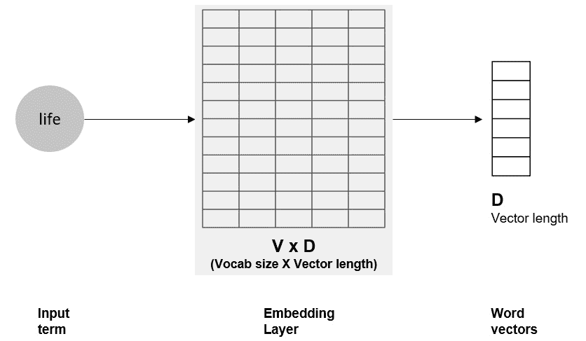
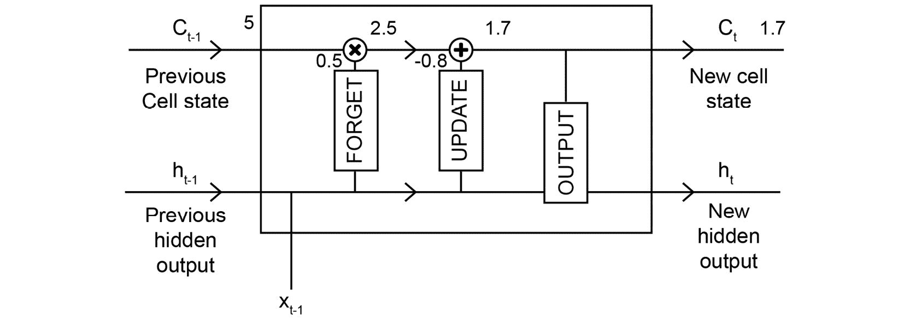

# 第六章：6\. LSTM、GRU 和高级 RNN

概述

在本章中，我们将研究并实现一些高级模型和普通**循环神经网络**（**RNN**）的变体，这些模型克服了 RNN 的一些实际缺点，并且目前是表现最好的深度学习模型之一。我们将从理解普通 RNN 的缺点开始，看看**长短期记忆网络**（**LSTM**）这一新颖的理念是如何克服这些缺点的。接着，我们将实现一个基于**门控循环单元**（**GRU**）的模型。我们还将研究双向 RNN 和堆叠 RNN，并探索基于注意力机制的模型。到本章结束时，您将构建并评估这些模型在情感分类任务中的表现，并亲自观察选择不同模型时的权衡。

# 介绍

假设您正在处理一款手机的产品评论，任务是将评论中的情感分类为正面或负面。您遇到了一条评论说：“*这款手机没有很好的相机，也没有令人惊艳的显示效果，没有优秀的电池续航，没有良好的连接性，也没有其他让它成为最棒的特性*。”现在，当您读到这条评论时，您可以轻松识别出评论的情感是负面的，尽管其中有许多正面的词句，比如*“优秀的电池续航”*和*“让它成为最棒的”*。您理解到，文本开头的*“没有”*一词否定了之后的所有内容。

到目前为止，我们创建的模型能否识别出这种情况中的情感？可能不能，因为如果您的模型没有意识到句子开头的*“没有”*一词是很重要的，并且需要与几词之后的输出强相关，那么它们就无法正确识别情感。这不幸的是，普通 RNN 的一个重大缺点。

在上一章中，我们探讨了几种用于处理序列的深度学习方法，即一维卷积和 RNN。我们看到，RNN 是极为强大的模型，能够为我们提供灵活性，处理各种序列任务。我们看到的普通 RNN 已经进行了大量研究。现在，我们将研究一些基于 RNN 的进阶方法，创建出新的、强大的模型，克服 RNN 的缺点。我们将研究 LSTM、GRU、堆叠和双向 LSTM，以及基于注意力机制的模型。我们将把这些模型应用于情感分类任务，结合*第四章：文本的深度学习—词嵌入*和*第五章：序列的深度学习*中讨论的概念。

# 长期依赖/影响

我们在上一节看到的手机评论示例就是一个长期依赖/影响的例子——一个序列中的术语/值对后续许多术语/值的评估产生影响。考虑以下示例，你需要填补一个缺失的国家名称：“*在一所顶尖的德国大学为她的牙科硕士课程提供录取后，Hina 非常兴奋，迫不及待地想要开始这一新的人生阶段，并且等不及要在月底前订机票去 ____。*”

正确答案当然是**德国**，要得出这个答案，你需要理解“German”一词的重要性，这个词出现在句子的开头，并影响句子结尾的结果。这是另一个长期依赖的例子。下图展示了答案“*Germany*”如何受到句子开头出现的“*German*”一词的长期依赖：


图 6.1：长期依赖

为了获得最佳结果，我们需要能够处理长期依赖问题。在深度学习模型和 RNN 的背景下，这意味着学习（或误差反向传播）需要在多个时间步长上平稳且有效地进行。说起来容易做起来难，主要是因为消失梯度问题。

# 消失梯度问题

训练标准前馈深度神经网络时面临的最大挑战之一是消失梯度问题（如*第二章，神经网络*所讨论的）。随着模型层数的增加，将误差从输出层反向传播到最初的层变得越来越困难。接近输出层的层将“学习”/更新得较快，但当误差传播到最初的层时，其值会大大减少，对初始层的参数几乎没有或完全没有影响。

对于 RNN 来说，这个问题更为复杂，因为参数不仅需要沿深度更新，还需要在时间步长上更新。如果输入有一百个时间步长（这在处理文本时并不罕见），网络需要将误差（在第 100 个时间步长计算出的）一直反向传播到第一个时间步长。对于普通的 RNN，这项任务可能有些难以应对。这时，RNN 的变体就显得尤为重要。

注意

训练深度网络的另一个实际问题是梯度爆炸问题，其中梯度值变得非常高——高到系统无法表示的程度。这个问题有一个相当简单的解决方法，叫做“**梯度裁剪**”，即限制梯度值的范围。

# 文本分类的序列模型

在*第五章，序列的深度学习*中，我们了解到 RNN 在序列建模任务中表现非常出色，并且在与文本相关的任务中提供了高性能。在本章中，我们将使用普通的 RNN 和 RNN 的变体来进行情感分类任务：处理输入序列并预测情感是正面还是负面。

我们将使用 IMDb 评论数据集进行此任务。该数据集包含 50,000 条电影评论及其情感——25,000 条极具极性（polar）的电影评论用于训练，25,000 条用于测试。使用该数据集的原因如下：

+   只需一个命令，就可以方便地加载 Keras（分词版本）。

+   该数据集通常用于测试新方法/模型。这应该帮助你轻松地将自己的结果与其他方法进行比较。

+   数据中的较长序列（IMDb 评论可能非常长）帮助我们更好地评估 RNN 变体之间的差异。

让我们开始构建第一个模型，使用普通的 RNN，然后将未来的模型表现与普通 RNN 的表现进行基准比较。我们从数据预处理和模型格式化开始。

## 加载数据

注意

确保你在本章中的所有练习和示例代码都在同一个 Jupyter Notebook 中进行。请注意，本节的代码将加载数据集。为了确保后续的所有练习和示例代码都能正常工作，请确保不要跳过这一节。你可以通过[`packt.live/31ZPO2g`](https://packt.live/31ZPO2g)访问完整的练习代码。

首先，你需要启动一个新的 Jupyter Notebook，并从 Keras 数据集中导入`imdb`模块。请注意，除非另有说明，本章其余的代码和练习应继续在同一个 Jupyter Notebook 中进行：

```py
from tensorflow.keras.datasets import imdb
```

导入该模块后，加载数据集（已分词并分为训练集和测试集）就像运行`imdb.load_data`一样简单。我们需要提供的唯一参数是我们希望使用的词汇表大小。回顾一下，词汇表大小是我们希望在建模过程中考虑的独特词汇数量。当我们指定词汇表大小`V`时，我们就会使用数据中排名前`V`的词汇。在这里，我们将为我们的模型指定一个 8,000 的词汇表大小（一个任意选择；你可以根据需要修改）并使用`load_data`方法加载数据，如下所示：

```py
vocab_size = 8000
(X_train, y_train), (X_test, y_test) = imdb.load_data\
                                       (num_words=vocab_size)
```

让我们检查一下`X_train`变量，看看我们正在处理什么。让我们打印出它的类型和构成元素的类型，并查看其中一个元素：

```py
print(type(X_train))
print(type(X_train[5]))
print(X_train[5])
```

我们将看到以下输出：

```py
<class 'numpy.ndarray'>
<class 'list'>
[1, 778, 128, 74, 12, 630, 163, 15, 4, 1766, 7982, 1051, 
 2, 32, 85, 156, 45, 40, 
 148, 139, 121, 664, 665, 10, 10, 1361, 173, 4, 749, 2, 16, 
 3804, 8, 4, 226, 65,
 12, 43, 127, 24, 2, 10, 10]
```

`X_train`变量是一个`numpy`数组——数组的每个元素都是表示单个评论文本的列表。文本中的词汇以数字令牌的形式出现，而不是原始令牌。这是一种非常方便的格式。

下一步是定义序列的最大长度，并将所有序列限制为这个最大长度。我们将使用`200`——在这种情况下是一个任意选择——来快速开始模型构建过程，以避免网络变得过于庞大，而且`200`个时间步长足以展示不同的 RNN 方法。让我们定义`maxlen`变量：

```py
maxlen = 200
```

下一步是使用 Keras 的`pad_sequences`工具将所有序列调整为相同的长度。

注意

*****理想情况下，我们会分析序列的长度并找出一个覆盖大多数评论的长度。在本章结束时的活动中，我们将执行这些步骤，结合当前章节的内容，还将结合*第四章，文本的深度学习——嵌入*和*第五章，序列的深度学习*的概念，最终将这些内容整合到一个活动中。

## 数据的分阶段处理与预处理

Keras 中`sequences`模块的`pad_sequences`工具帮助我们将所有序列调整到指定长度。如果输入序列短于指定长度，该工具会用保留的标记（表示空白/缺失）对序列进行填充。如果输入序列长于指定长度，工具会截断序列以限制其长度。在以下示例中，我们将对测试集和训练集应用`pad_sequences`工具：

```py
from tensorflow.keras import preprocessing
X_train = preprocessing.sequence.pad_sequences\
          (X_train, maxlen=maxlen)
X_test = preprocessing.sequence.pad_sequences\
         (X_test, maxlen=maxlen)
```

为了理解这些步骤的结果，我们来看一下训练数据中特定实例的输出：

```py
print(X_train[5])
```

处理后的实例如下：


图 6.2：pad_sequences 的结果

我们可以看到结果的开头有很多`0`。正如你可能已经推测的，这些是`pad_sequences`工具进行的填充，因为输入序列短于`200`。默认情况下，填充会加在序列的开头。对于小于指定限制的序列，默认情况下会从左侧进行截断——也就是说，最后的`200`个术语将被保留。输出中的所有实例现在都有`200`个术语。数据集现在已经准备好进行建模。

注意

该工具的默认行为是将填充添加到序列的开头，并从左侧截断。这些可能是重要的超参数。如果你认为序列的前几个术语对预测最为重要，可以通过将"`truncating`"参数设置为"`post`"来截断后面的术语。同样，若希望在序列的末尾进行填充，可以将"`padding`"设置为"`post`"。

# 嵌入层

在*第四章，深度学习文本——嵌入*中，我们讨论过不能将文本直接输入神经网络，因此需要良好的表示。我们讨论过嵌入（低维度、密集的向量）是表示文本的好方法。为了将嵌入传递到神经网络的层中，我们需要使用嵌入层。

嵌入层的功能是双重的：

+   对于任何输入词项，进行查找并返回其词嵌入/向量

+   在训练过程中，学习这些词嵌入

查找部分很简单——词嵌入以`V × D`的矩阵形式存储，其中`V`是词汇表的大小（考虑的唯一词项的数量），`D`是每个向量的长度/维度。下图展示了嵌入层。输入词项“`life`”被传递到嵌入层，嵌入层进行查找并返回相应长度为`D`的向量。这个表示`life`的向量被传递到隐藏层。

那么，训练预测模型时，学习这些嵌入是什么意思呢？难道词嵌入不是通过使用像`word2vec`这样的算法学习的吗？它尝试基于上下文词汇预测中心词（记得我们在*第四章，深度学习文本——嵌入*中讨论的 CBOW 架构）？嗯，既是又不是：



图 6.3：嵌入层

`word2vec`方法的目标是学习一个能够捕捉词义的表示。因此，基于上下文预测目标词是一个完美的目标设定。在我们的例子中，目标不同——我们希望学习有助于我们最好地预测文本情感的表示。因此，学习一个明确朝着我们目标工作的表示是有意义的。

嵌入层始终是模型中的第一层。你可以根据需要选择任意架构（在我们的例子中是 RNN）。我们会随机初始化嵌入层中的向量，实际上就是嵌入层中的权重。在训练过程中，权重会根据预测结果进行更新，以便更好地预测结果。学习到的权重，因此也学习到的词向量，随后会根据任务进行调整。这是一个非常有用的步骤——为什么要使用通用表示，而不是将其调整到你的任务上呢？

Keras 中的嵌入层有两个主要参数：

+   `input_dim` ：词汇表中唯一词项的数量，即词汇表的大小

+   `output_dim` : 嵌入的维度/词向量的长度

`input_dim` 参数需要设置为所使用词汇表的大小。`output_dim` 参数指定每个词项的嵌入向量的长度。

请注意，Keras 中的嵌入层也允许你使用自定义的权重矩阵。这意味着你可以在嵌入层中使用预训练的词嵌入（例如 `GloVe`，或你在其他模型中训练的词嵌入）。`GloVe` 模型已经在数十亿个词汇上进行了训练，因此利用这一强大的通用表示可能会非常有用。

注意

如果你使用预训练的词嵌入，你还可以选择使其在模型中可训练——本质上，使用 `GloVe` 词嵌入作为起点，并对其进行微调，以适应你的任务。这是文本迁移学习的一个很好的例子。

# 构建普通 RNN 模型

在下一个练习中，我们将使用普通的 RNN 构建我们的第一个情感分类模型。我们将使用的模型架构如下图所示，图中展示了模型如何处理输入句子 "`Life is good`"，其中单词 "`Life`" 出现在时间步 `T=0`，而 "`good`" 则出现在时间步 `T=2`。模型将逐个处理输入，使用嵌入层查找词嵌入，并将其传递到隐层。当最后一个单词 "`good`" 在时间步 `T=2` 被处理时，分类操作将完成。我们将使用 Keras 来构建并训练模型：


图 6.4：使用嵌入层和 RNN 的架构

## 练习 6.01：构建并训练一个用于情感分类的 RNN 模型

在这个练习中，我们将构建并训练一个用于情感分类的 RNN 模型。最初，我们将定义递归层和预测层的架构，并评估模型在测试数据上的表现。接着，我们将添加嵌入层和一些 dropout，并通过添加 RNN 层、dropout 和一个全连接层来完成模型定义。然后，我们将检查模型在测试数据上的预测准确度，以评估模型的泛化能力。请按照以下步骤完成这个练习：

1.  我们首先设置 `numpy` 和 `tensorflow` 的随机数生成种子，以尽可能地获得可复现的结果。我们将导入 `numpy` 和 `tensorflow`，并使用以下命令设置种子：

    ```py
    import numpy as np
    import tensorflow as tf
    np.random.seed(42)
    tf.random.set_seed(42)
    ```

    注意

    尽管我们已经为 `numpy` 和 `tensorflow` 设置了种子，以实现可复现的结果，但仍有许多因素会导致结果的变化，因此你可能得到与我们不同的结果。这适用于我们今后使用的所有模型。虽然你看到的数值可能不同，但你看到的输出应该在很大程度上与我们的输出一致。如果模型的性能差异较大，你可能需要调整训练的轮次——这是因为神经网络中的权重是随机初始化的，所以你和我们的初始点可能会有所不同，而通过训练不同轮次，可能会达到类似的结果。

1.  现在，让我们继续通过导入所有必要的包和层，并使用以下命令初始化一个名为`model_rnn`的顺序模型：

    ```py
    from tensorflow.keras.models import Sequential
    from tensorflow.keras.layers \
    import SimpleRNN, Flatten, Dense, Embedding, \
    SpatialDropout1D, Dropout
    model_rnn = Sequential()
    ```

1.  现在，我们需要指定嵌入层。`input_dim`参数需要设置为`vocab_size`变量。对于`output_dim`参数，我们选择`32`。回顾*第四章，文本的深度学习——嵌入*，这是一个超参数，你可能需要对其进行实验以获得更好的结果。让我们通过以下命令指定嵌入层并使用丢弃层（以减少过拟合）：

    ```py
    model_rnn.add(Embedding(vocab_size, output_dim=32))
    model_rnn.add(SpatialDropout1D(0.4))
    ```

    请注意，这里使用的丢弃层是`SpatialDropout1D`——该版本执行与常规丢弃层相同的功能，但它不是丢弃单个元素，而是丢弃整个一维特征图（在我们的案例中是向量）。

1.  向模型中添加一个包含`32`个神经元的`SimpleRNN`层（该选择是随意的；另一个可调节的超参数）：

    ```py
    model_rnn.add(SimpleRNN(32))
    ```

1.  接下来，添加一个`40%`丢弃率的丢弃层（再次，这是一个随意的选择）：

    ```py
    model_rnn.add(Dropout(0.4))
    ```

1.  添加一个带有`sigmoid`激活函数的全连接层，以完成模型架构。这是输出层，用于进行预测：

    ```py
    model_rnn.add(Dense(1, activation='sigmoid'))
    ```

1.  编译模型并查看模型总结：

    ```py
    model_rnn.compile(loss='binary_crossentropy', \
                      optimizer='rmsprop', metrics=['accuracy'])
    model_rnn.summary()
    ```

    模型总结如下：

    

    图 6.5：简单 RNN 模型的总结

    我们可以看到共有`258,113`个参数，其中大部分位于嵌入层。这是因为在训练过程中，词嵌入被学习——因此我们在学习嵌入矩阵，其维度为`vocab_size(8000) × output_dim(32)`。

    接下来，我们继续训练模型（使用我们观察到的在此数据和架构中提供最佳结果的超参数）。

1.  使用批量大小为`128`的训练数据对模型进行训练，训练`10`个 epoch（这两个都是你可以调节的超参数）。使用`0.2`的验证集分割比例——监控这个过程将帮助我们了解模型在未见数据上的表现：

    ```py
    history_rnn = model_rnn.fit(X_train, y_train, \
                                batch_size=128, \
                                validation_split=0.2, \
                                epochs = 10)
    ```

    最后五个 epoch 的训练输出如下。根据你的系统配置，这一步可能需要的时间会长于或短于我们所用的时间：

    

    图 6.6：训练简单 RNN 模型——最后五个 epoch

    从训练输出中可以看到，验证准确率达到了大约 86%。接下来，我们对测试集进行预测并检查模型的性能。

1.  使用模型的`predict_classes`方法对测试数据进行预测，并使用`sklearn`的`accuracy_score`方法：

    ```py
    y_test_pred = model_rnn.predict_classes(X_test)
    from sklearn.metrics import accuracy_score
    print(accuracy_score(y_test, y_test_pred))
    ```

    测试的准确率如下：

    ```py
    0.85128
    ```

    我们可以看到，模型表现得相当不错。我们使用了一个简单的架构，`32`个神经元，词汇表大小仅为`8000`。调整这些和其他超参数可能会得到更好的结果，我们鼓励你这样做。

    注意

    若要访问此特定部分的源代码，请参考[`packt.live/31ZPO2g`](https://packt.live/31ZPO2g)。

    您也可以在[`packt.live/2Oa2trm`](https://packt.live/2Oa2trm)上在线运行此示例。您必须执行整个 Notebook 才能获得预期的结果。

在这个练习中，我们已经了解了如何构建基于 RNN 的文本模型。我们看到了如何使用嵌入层为当前任务推导单词向量。这些单词向量是每个传入术语的表示，它们会被传递到 RNN 层。我们已经看到，甚至一个简单的架构也能给我们带来良好的结果。现在，让我们讨论一下如何使用该模型对新的、未见过的评论进行预测。

# 对未见数据进行预测

现在，您已经在一些数据上训练了模型并评估了它在测试数据上的表现，接下来要学习的是如何使用此模型来预测新数据的情感。毕竟，这就是模型的目的——能够预测模型从未见过的数据的情感。实际上，对于任何以原始文本形式存在的新评论，我们都应该能够对其情感进行分类。

关键步骤是创建一个流程/管道，将原始文本转换为预测模型能够理解的格式。这意味着新文本需要经过与用于训练模型的文本数据相同的预处理步骤。预处理函数需要为任何输入的原始文本返回格式化后的文本。该函数的复杂性取决于对训练数据执行的步骤。如果分词是唯一的预处理步骤，那么该函数只需要执行分词操作。

我们的模型（`model_rnn`）是在 IMDB 评论数据集上训练的，这些评论数据已经经过分词、大小写转换、去除标点、定义词汇表大小并转换为索引序列。我们为 RNN 模型准备数据的函数/管道需要执行相同的步骤。让我们着手创建我们自己的函数。首先，让我们创建一个新变量，名为"`inp_review`"，它包含文本"*An excellent movie*"，使用以下代码。这是包含原始评论文本的变量：

```py
inp_review = "An excellent movie!"
```

文本中的情感是积极的。如果模型工作得足够好，它应该将情感预测为积极的。

首先，我们必须将文本分词为其组成术语，规范化大小写并去除标点符号。为此，我们需要使用以下代码从 Keras 导入`text_to_word_sequence`工具：

```py
from tensorflow.keras.preprocessing.text \
import text_to_word_sequence
```

为了检查它是否按预期工作，我们可以将其应用于`inp_review`变量，如下所示的代码：

```py
text_to_word_sequence(inp_review)
```

分词后的句子如下所示：

```py
['an', 'excellent', 'movie']
```

我们可以看到，它的效果正如预期——大小写已经被标准化，句子已经被分词，标点符号也已从输入文本中移除。下一步将是为数据使用一个定义好的词汇表。这将需要使用我们在加载数据时 TensorFlow 使用的相同词汇表。词汇表和术语到索引的映射可以通过`imdb`模块中的`get_word_index`方法加载（我们使用该方法加载代码）。以下代码可以用来将词汇表加载到名为`word_map`的字典中：

```py
word_map = imdb.get_word_index()
```

这个字典包含了大约 88.6K 个术语的映射，这些术语在原始评论数据中是可用的。我们加载了一个词汇表大小为`8000`的数据，从而使用了映射中的前`8000`个索引。让我们创建一个有限词汇表的映射，这样我们就可以使用与训练数据相同的术语/索引。我们将通过根据索引对`word_map`变量进行排序，并选择前`8000`个术语来限制映射，如下所示：

```py
vocab_map = dict(sorted(word_map.items(), \
                 key=lambda x: x[1])[:vocab_size])
```

词汇映射将是一个包含`8000`个术语词汇表索引映射的字典。使用这个映射，我们将通过查找每个术语并返回相应的索引，将分词后的句子转换为术语索引序列。通过以下代码，我们将定义一个接受原始文本、应用`text_to_word_sequence`工具、从`vocab_map`进行查找，并返回相应整数序列的函数：

```py
def preprocess(review):
    inp_tokens = text_to_word_sequence(review)
    seq = []
    for token in inp_tokens:
        seq.append(vocab_map.get(token))
    return seq
```

我们可以像这样将此函数应用于`inp_review`变量：

```py
preprocess(inp_review)
```

输出如下：

```py
[32, 318, 17]
```

这是与原始文本对应的术语索引序列。请注意，数据现在与我们加载的 IMDb 数据格式相同。这个索引序列可以被输入到 RNN 模型中（使用`predict_classes`方法）以分类情感，如下所示。如果模型的表现足够好，它应该预测情感为正面：

```py
model_rnn.predict_classes([preprocess(inp_review)])
```

输出预测为`1`（正面），正如我们预期的那样：

```py
array([[1]])
```

让我们将此函数应用于另一条原始文本评论，并将其提供给模型进行预测。我们将更新`inp_review`变量，使其包含文本"`Don't watch this movie – poor acting, poor script, bad direction.`" 这条评论的情感是负面的。我们希望模型将其分类为负面情感：

```py
inp_review = "Don't watch this movie"\
             " - poor acting, poor script, bad direction."
```

让我们将预处理函数应用于`inp_review`变量，并使用以下代码进行预测：

```py
model_rnn.predict_classes([preprocess(inp_review)])
```

预测结果为`0`，如图所示：

```py
array([[0]])
```

预测的情感是负面的，这正是我们期望模型的行为。

我们以函数的形式将此流程应用于单条评论，但你可以很容易地将其应用于一整个评论集合，以使用模型进行预测。现在，你已经准备好使用我们训练的 RNN 模型来分类任何新的评论的情感。

注意

我们在这里构建的管道是专门针对这个数据集和模型的。这不是一个通用的处理功能，不能用于任何模型的预测。使用的词汇、进行的清理、模型学习到的模式——这些都是针对这个任务和数据集的。对于任何其他模型，你需要根据情况创建自己的管道。

这种高级方法同样可以用于为其他模型构建处理管道。根据数据、预处理步骤以及模型部署的设置，管道可能会有所不同。所有这些因素也会影响你可能想要在模型构建过程中包括的步骤。因此，我们鼓励你在开始整个建模过程时就立即开始考虑这些方面。

我们已经看到了如何使用训练好的 RNN 模型对未见过的数据进行预测，从而让我们理解了端到端的过程。在接下来的部分，我们将开始研究 RNN 的变种。到目前为止我们讨论的实现相关的思路适用于所有后续的模型。

# LSTM、GRU 及其他变种

普通 RNN 的理念非常强大，并且架构已经展现出巨大的潜力。正因如此，研究人员对 RNN 架构进行了实验，寻找克服一个主要缺陷（梯度消失问题）并充分发挥 RNN 优势的方法。这导致了 LSTM 和 GRU 的出现，它们如今实际上已经取代了 RNN。事实上，现在我们提到 RNN 时，通常指的是 LSTM、GRU 或它们的变种。

这是因为这些变种专门设计来处理梯度消失问题并学习长距离依赖。两种方法在大多数序列建模任务中显著优于普通 RNN，特别是对于长序列，差异更为明显。题为 *使用 RNN 编码器-解码器进行统计机器翻译学习短语表示* 的论文（可在 [`arxiv.org/abs/1406.1078`](https://arxiv.org/abs/1406.1078) 获取）对普通 RNN、LSTM 和 GRU 的性能进行了实证分析。这些方法是如何克服普通 RNN 缺陷的呢？我们将在下一节中详细讨论 LSTM 时理解这一点。

## LSTM

让我们思考一下这个问题。了解了普通 RNN 的架构后，我们如何调整它，或者说，能做什么改变以捕捉长期依赖关系呢？我们不能增加更多的层；这样做肯定会适得其反，因为每增加一层都会加重问题。一个想法（可以参考 [`pubmed.ncbi.nlm.nih.gov/9377276`](https://pubmed.ncbi.nlm.nih.gov/9377276)），由 Sepp Hochreiter 和 Jurgen Schmidhuber 于 1997 年提出，是使用一个显式的值（状态），它不经过激活函数。如果我们有一个自由流动且不经过激活函数的单元（对应于普通 RNN 的神经元）值，这个值可能会帮助我们建模长期依赖性。这就是 LSTM 的第一个关键区别——一个显式的单元状态。

单元状态可以被视为一种在多个时间步中识别和存储信息的方式。本质上，我们将某个值识别为网络的长期记忆，它帮助我们更好地预测输出，并且我们会小心地保持这个值，直到需要为止。

那么，我们如何调节单元状态的流动呢？我们如何决定何时更新其值以及更新多少呢？为此，Hochreiter 和 Schmidhuber 提出了使用 *门控机制* 来调节何时以及如何更新单元状态的值。这是 LSTM 的另一个关键区别。自由流动的单元状态与调节机制的结合，使得 LSTM 在处理长序列时表现极为出色，赋予了它强大的预测能力。

注释

对于 LSTM 的内部工作原理和相关的数学处理，本书无法做出详细的讨论。对于那些有兴趣深入阅读的读者，[`packt.live/3gL42Ib`](https://packt.live/3gL42Ib) 是一个很好的参考资料，可以帮助你更好地理解 LSTM。

让我们理解一下 LSTM 工作原理背后的直觉。下图展示了 LSTM 单元的内部结构。除了通常的输出——隐藏状态，LSTM 单元还会输出一个单元“状态”。隐藏状态保存的是短期记忆，而单元状态则保存的是长期记忆：


图 6.7：LSTM 单元

这种对内部结构的看法可能会让人感到畏惧，因此我们将从一个更抽象的角度来理解，正如在*图 6.8*中所示。首先需要注意的是，对单元状态进行的唯一操作是两个线性操作——乘法和加法。单元状态并没有经过任何激活函数。这就是我们之前所说的单元状态自由流动的原因。这个自由流动的设置也叫做“常数误差旋转”（Constant Error Carousel）——这个名称你*不*需要记住。

`FORGET` 模块的输出与单元状态相乘。由于这个模块的输出值介于 `0` 和 `1` 之间（由 Sigmoid 激活函数建模），将其与单元状态相乘将调节前一个单元状态应忘记多少。如果 `FORGET` 模块输出 `0`，则前一个单元状态会完全被遗忘；如果输出 `1`，则单元状态完全保留。需要注意的是，`FORGET` 门的输入包括来自前一时间步的隐层输出 (`h`t-1`) 和当前时间步的新输入 `x`t（对于网络中的深层，可能是来自前一隐层的输出）：


图 6.8: LSTM 单元的抽象视图

在前面的图中，我们可以看到，在单元状态与 `FORGET` 模块的结果相乘之后，接下来的决策是要更新单元状态的多少。这一部分来自于 `UPDATE` 模块的输出，并将其加到（注意加号）处理后的单元状态上。这样，处理后的单元状态就会被更新。这就是对前一个单元状态 `(C`t-1`)` 执行的所有操作，最终得出新的单元状态 `(C`t`)` 作为输出。这就是如何调节单元的长期记忆。单元还需要更新隐状态。这个操作发生在 `OUTPUT` 模块，基本上与普通 RNN 中的更新相同。唯一的区别是，显式的单元状态会与 Sigmoid 输出相乘，形成最终的隐状态 `h`t`。

现在我们已经理解了各个独立的模块/门控机制，接下来让我们在以下详细图中标出它们。这将帮助我们理解这些门控机制如何共同作用，调控 LSTM 中信息的流动：


图 6.9: LSTM 单元解释

为了使这个示例更具具体性，我们来看下图，了解单元状态是如何更新的。我们假设前一个单元状态 `(C`t-1`)` 为 `5`。这个值有多少应被传递，取决于 `FORGET` 门的输出值。`FORGET` 门的输出值会与前一个单元状态 `C`t-1` 相乘。在这种情况下，`FORGET` 模块的输出值是 `0.5`，结果是传递 `2.5` 作为处理后的单元状态。接着，这个值 (`2.5`) 会遇到来自 `UPDATE` 门的加法。由于 `UPDATE` 门的输出值为 `-0.8`，所以加法的结果是 `1.7`。这就是最终更新的单元状态 `C`t`，它会传递给下一个时间步：



图 6.10: LSTM 单元状态更新示例

# LSTM 中的参数

LSTM 是基于普通 RNN 构建的。如果你简化 LSTM 并移除所有门，仅保留`tanh`函数用于隐藏状态的更新，你将得到一个普通 RNN。在 LSTM 中，信息——即时间`t`的新输入数据和时间`t-1`的先前隐藏状态（`x`t 和`h`t-1）——通过的激活数量是普通 RNN 中通过的激活数量的四倍。激活分别在遗忘门中应用一次，在更新门中应用两次，在输出门中应用一次。因此，LSTM 中的权重/参数数量是普通 RNN 的四倍。

在*第五章*，*深度学习与序列*，在标题为*循环神经网络（RNN）中的参数*的章节中，我们计算了一个普通 RNN 的参数数量，并发现我们已经有了相当多的参数可以使用（`n`² `+ nk + nm`，其中`n`是隐藏层神经元的数量，`m`是输入的数量，`k`是输出层的维度）。使用 LSTM 时，我们看到这个数字是普通 RNN 的四倍。无需多言，LSTM 中有大量的参数，这不一定是件好事，尤其是在处理较小的数据集时。

## 练习 6.02：基于 LSTM 的情感分类模型

在这个练习中，我们将构建一个简单的基于 LSTM 的模型来预测我们数据的情感。我们将继续使用之前的设置（即单元数、嵌入维度、dropout 等）。因此，你必须在相同的 Jupyter Notebook 中继续这个练习。按照以下步骤完成此练习：

1.  从 Keras `layers`导入 LSTM 层：

    ```py
    from tensorflow.keras.layers import LSTM
    ```

1.  实例化顺序模型，添加适当维度的嵌入层，并添加 40%的空间 dropout：

    ```py
    model_lstm = Sequential()
    model_lstm.add(Embedding(vocab_size, output_dim=32))
    model_lstm.add(SpatialDropout1D(0.4))
    ```

1.  添加一个包含`32`单元的 LSTM 层：

    ```py
    model_lstm.add(LSTM(32))
    ```

1.  添加 dropout 层（`40%`的 dropout）和全连接层，编译模型并打印模型概述：

    ```py
    model_lstm.add(Dropout(0.4))
    model_lstm.add(Dense(1, activation='sigmoid'))
    model_lstm.compile(loss='binary_crossentropy', \
                       optimizer='rmsprop', metrics=['accuracy'])
    model_lstm.summary()
    ```

    模型概述如下：

    

    图 6.11：LSTM 模型概述

    从模型概述中我们可以看到，LSTM 层中的参数数量为`8320`。快速检查可以确认，这正是我们在*练习 6.01*中看到的普通 RNN 层参数数量的四倍，*构建与训练用于情感分类的 RNN 模型*，这与我们的预期一致。接下来，让我们用训练数据来拟合模型。

1.  在训练数据上拟合`5`个周期（这为模型提供了最佳结果），批量大小为`128`：

    ```py
    history_lstm = model_lstm.fit(X_train, y_train, \
                                  batch_size=128, \
                                  validation_split=0.2, \
                                  epochs=5)
    ```

    训练过程的输出如下：

    

    图 6.12：LSTM 训练输出

    请注意，LSTM 的训练时间比普通 RNN 要长得多。考虑到 LSTM 的架构和庞大的参数数量，这是可以预期的。另外，值得注意的是，验证集上的准确率明显高于普通 RNN。接下来，让我们查看测试数据上的表现，看看准确率得分。

1.  对测试集进行预测并打印准确率得分：

    ```py
    y_test_pred = model_lstm.predict_classes(X_test)
    print(accuracy_score(y_test, y_test_pred))
    ```

    准确率如下所示：

    ```py
    0.87032
    ```

    我们得到的准确率（87%）比使用普通 RNN（85.1%）得到的准确率有了显著提高。看起来，额外的参数和来自单元状态的额外预测能力对于我们的任务非常有帮助。

    注意

    要访问此部分的源代码，请参考[`packt.live/31ZPO2g`](https://packt.live/31ZPO2g)。

    你也可以在线运行这个例子，网址是[`packt.live/2Oa2trm`](https://packt.live/2Oa2trm)。你必须执行整个 Notebook 才能获得期望的结果。

在这个练习中，我们展示了如何使用 LSTM 进行文本的情感分类。训练时间明显较长，参数的数量也更多。但最终，即使是这个简单的架构（没有进行任何超参数调优）也比普通的 RNN 得到了更好的结果。我们鼓励你进一步调优超参数，以充分发挥强大的 LSTM 架构的优势。

# LSTM 与普通 RNN 的对比

我们看到，LSTM 是在普通 RNN 的基础上构建的，主要目的是解决梯度消失问题，以便能够建模长范围的依赖关系。从下图可以看出，普通 RNN 仅传递隐藏状态（短期记忆），而 LSTM 同时传递隐藏状态和显式的单元状态（长期记忆），这赋予了它更多的能力。因此，当 LSTM 处理词语“`good`”时，递归层还会传递持有长期记忆的单元状态：


图 6.13：普通 RNN（左）和 LSTM（右）

实际上，这是否意味着你总是需要使用 LSTM？这个问题的答案，正如数据科学尤其是深度学习中的大多数问题一样，是“取决于情况”。为了理解这些考虑，我们需要了解 LSTM 与普通 RNN 相比的优缺点。

**LSTM 的优点：**

+   更强大，因为它使用了更多的参数和一个显式的单元状态

+   更好地建模长范围的依赖关系

**LSTM 的缺点：**

+   更多的参数

+   训练时间更长

+   更容易发生过拟合

如果你需要处理长序列，LSTM 会是一个不错的选择。如果你有一个小数据集，而且你处理的序列很短（<10），那么使用普通的 RNN 可能是可以的，因为它具有较少的参数（尽管你也可以尝试 LSTM，确保使用正则化来避免过拟合）。一个拥有大量数据且包含长序列的数据集，可能会从像 LSTM 这样的强大模型中提取最大价值。请注意，训练 LSTM 计算开销大且耗时，因此如果你有一个非常大的数据集，训练 LSTM 可能不是最实际的方法。当然，所有这些陈述仅作为指导——最好的方法是根据你的数据和任务选择最合适的方式。

# 门控循环单元

在前面的章节中，我们看到 LSTM 有很多参数，看起来比普通的 RNN 复杂得多。你可能在想，这些明显的复杂性真的有必要吗？LSTM 能不能在不失去显著预测能力的情况下简化一点？研究人员曾经也有同样的疑问，并且在 2014 年，Kyunghyun Cho 和他们的团队在他们的论文中提出了 GRU，作为 LSTM 在机器翻译中的替代方案（[`arxiv.org/abs/1406.1078`](https://arxiv.org/abs/1406.1078)）。

GRU 是 LSTM 的简化形式，旨在减少参数数量，同时保留 LSTM 的强大功能。在语音建模和语言建模任务中，GRU 提供与 LSTM 相同的性能，但具有更少的参数和更快的训练时间。

在 GRU 中做出的一个重要简化是省略了显式的单元状态。这听起来有些违反直觉，因为自由流动的单元状态正是赋予 LSTM 其强大能力的因素，对吧？其实，赋予 LSTM 强大能力的并不是单元状态本身，而是单元状态的自由流动性？确实，如果单元状态也要经过激活函数，LSTM 可能不会取得如此大的成功：


图 6.14：门控循环单元

所以，自由流动的值是关键的区分思想。GRU 通过允许隐藏状态自由流动来保留这一思想。让我们看看前面的图，以理解这意味着什么。GRU 允许隐藏状态自由地通过。换句话说，GRU 实际上将单元状态（如 LSTM 中的单元状态）的思想带到了隐藏状态。

我们仍然需要调节隐藏状态的流动，因此我们仍然需要门控机制。GRU 将遗忘门和更新门合并成一个更新门。为了理解背后的动机，请考虑这一点——如果我们忘记了一个单元状态，并且没有更新它，我们到底在做什么？也许拥有一个单一的更新操作是有意义的。这是架构中的第二个主要区别。

由于这两个变化，GRU 使数据经过了三个激活层，而不是 LSTM 中的四个激活层，从而减少了参数的数量。虽然 GRU 仍然拥有普通 RNN 的三倍参数，但它只有 LSTM 的 75% 的参数，这是一项值得欢迎的改进。我们仍然可以让信息在网络中自由流动，这应该能帮助我们建模长程依赖。

让我们看看基于 GRU 的模型在情感分类任务上的表现如何。

## 练习 6.03：基于 GRU 的情感分类模型

在本练习中，我们将构建一个简单的基于 GRU 的模型来预测数据中的情感。我们将继续使用之前的相同设置（即单元数、嵌入维度、丢弃率等）。在模型中使用 GRU 代替 LSTM 就像在添加层时将 "`LSTM`" 替换为 "`GRU`" 一样简单。按照以下步骤完成本练习：

1.  从 Keras `layers` 中导入 `GRU` 层：

    ```py
    from tensorflow.keras.layers import GRU
    ```

1.  实例化顺序模型，添加适当维度的嵌入层，并加入 40% 的空间丢弃层：

    ```py
    model_gru = Sequential()
    model_gru.add(Embedding(vocab_size, output_dim=32))
    model_gru.add(SpatialDropout1D(0.4))
    ```

1.  添加一个具有 32 个单元的 GRU 层。将 `reset_after` 参数设置为 `False`（这是 TensorFlow 2 实现的一个小细节，为了与普通 RNN 和 LSTM 的实现保持一致）：

    ```py
    model_gru.add(GRU(32, reset_after=False))
    ```

1.  添加丢弃层（40%）和全连接层，编译模型，并打印模型摘要：

    ```py
    model_gru.add(Dropout(0.4))
    model_gru.add(Dense(1, activation='sigmoid'))
    model_gru.compile(loss='binary_crossentropy', \
                      optimizer='rmsprop', metrics=['accuracy'])
    model_gru.summary()
    ```

    模型摘要如下：

    

    ](img/B15385_06_15.jpg)

    图 6.15：GRU 模型总结

    从 GRU 模型的摘要中，我们可以看到 GRU 层的参数数量为 `6240`。你可以检查，这正好是我们在 *练习 6.01*，《构建与训练情感分类的 RNN 模型》中看到的普通 RNN 层参数的三倍，也是我们在 *练习 6.02*，《基于 LSTM 的情感分类模型》中看到的 LSTM 层参数的 0.75 倍——这再次符合我们的预期。接下来，让我们在训练数据上拟合模型。

1.  在训练数据上训练四个 epoch（这给我们最佳结果）：

    ```py
    history_gru = model_gru.fit(X_train, y_train, \
                                batch_size=128, \
                                validation_split=0.2, \
                                epochs = 4)
    ```

    训练过程的输出如下所示：

    

    ](img/B15385_06_16.jpg)

    图 6.16：GRU 训练输出

    注意，训练 GRU 的时间比普通 RNN 长，但比 LSTM 快。验证准确度优于普通 RNN，并且接近 LSTM 的水平。让我们看看模型在测试数据上的表现如何。

1.  在测试集上进行预测并打印准确度评分：

    ```py
    y_test_pred = model_gru.predict_classes(X_test)
    accuracy_score(y_test, y_test_pred)
    ```

    准确度如下所示：

    ```py
    0.87156
    ```

    我们可以看到，GRU 模型的准确度（87.15%）与 LSTM 模型（87%）非常相似，且高于普通 RNN。这是一个重要的点——GRU 是 LSTM 的简化版本，旨在以更少的参数提供类似的准确性。我们的练习表明这一点是正确的。

    注意

    若要访问此特定部分的源代码，请参阅[`packt.live/31ZPO2g`](https://packt.live/31ZPO2g)。

    你也可以在线运行这个示例，访问[`packt.live/2Oa2trm`](https://packt.live/2Oa2trm)。你必须执行整个 Notebook 才能得到预期结果。

在本次练习中，我们看到如何使用 GRU 进行文本情感分类。训练时间稍低于 LSTM 模型，而且参数数量也更少。即使是这个简单的架构（没有任何超参数调整）也给出了比普通 RNN 模型更好的结果，并且与 LSTM 模型的结果相似。

## LSTM 与 GRU

那么，你应该选择哪个呢？LSTM 有更多的参数，并且设计了一个显式的单元状态来存储长期记忆。GRU 参数较少，这意味着训练更快，同时它也具有自由流动的单元状态，使其能够建模长距离的依赖关系。

2014 年，Junyoung Chung、Yoshua Bengio 及其团队对音乐建模和语音建模任务进行的实证评估（可在[`arxiv.org/abs/1412.3555`](https://arxiv.org/abs/1412.3555)获取）表明，LSTM 和 GRU 都明显优于普通的 RNN。他们还发现，在性能方面，GRU 与 LSTM 不分上下。他们指出，调整超参数，如层大小，可能比选择 LSTM 或 GRU 更为重要。

2018 年，Gail Weiss、Yoav Goldberg 及其团队展示并得出结论：LSTM 在需要无限计数的任务中优于 GRU，也就是说，处理任意长度序列的任务。2018 年，Google Brain 团队也展示了 LSTM 在机器翻译任务中的表现优于 GRU。这让我们思考，LSTM 所带来的额外优势可能在某些应用中非常有用。

# 双向 RNN

我们刚刚看的 RNN 模型——LSTM、GRU——确实很强大，并且在序列处理任务中提供了极好的结果。现在，让我们讨论如何让它们更强大，以及那些带来深度学习惊人成就的方法，你一定听说过。

让我们从双向 RNN 的概念开始。这个概念适用于所有类型的 RNN，包括但不限于 LSTM 和 GRU。双向 RNN 可以同时处理序列的正向和反向，使网络可以获得关于序列的前向和后向信息，提供更加丰富的上下文：


图 6.17：双向 LSTM

双向模型本质上是并行使用两个 RNN——一个作为"**前向层**"，另一个作为"**后向层**"。如前图所示，前向层按元素顺序处理序列。对于句子"*Life is good*"，前向层首先处理"*Life*"，然后是"*is*"，接着是"*good*"——这与常规的 RNN 层没有区别。后向层则反转这个顺序——它首先处理"good"，然后是"is"，最后是"Life"。在每一步中，前向层和后向层的状态会被连接起来形成输出。

哪种任务最能从这种架构中受益？查看上下文的两个方面有助于解决当前词语的歧义。当我们阅读类似"*The stars*"的句子时，我们不确定这里的"*stars*"指的是什么——是天空中的星星，还是电影明星？但当我们看到后续的词语并阅读"*The stars at the movie premiere*"时，我们就能确定这句话是指电影明星。那些最能从这种设置中受益的任务包括机器翻译、词性标注、命名实体识别和词预测等。双向 RNN 在一般文本分类任务中也表现出了性能提升。让我们将基于双向 LSTM 的模型应用到情感分类任务中。

## 练习 6.04：基于双向 LSTM 的情感分类模型

在这个练习中，我们将使用双向 LSTM 来预测我们数据的情感。我们将使用 Keras 的双向包装器来创建 LSTM 的双向层（你也可以通过简单地将`LSTM`替换为`GRU`来创建一个双向 GRU 模型）。请按照以下步骤完成这个练习：

1.  从 Keras `layers`中导入`Bidirectional`层。这个层本质上是一个包装器，可以用于其他 RNN：

    ```py
    from tensorflow.keras.layers import Bidirectional
    ```

1.  实例化顺序模型，添加具有适当维度的嵌入层，并添加 40%的空间丢弃：

    ```py
    model_bilstm = Sequential()
    model_bilstm.add(Embedding(vocab_size, output_dim=32))
    model_bilstm.add(SpatialDropout1D(0.4))
    ```

1.  将`Bidirectional`包装器添加到一个具有`32`单元的 LSTM 层：

    ```py
    model_bilstm.add(Bidirectional(LSTM(32)))
    ```

1.  添加丢弃层（40%）和密集层，编译模型，并打印模型摘要：

    ```py
    model_bilstm.add(Dropout(0.4))
    model_bilstm.add(Dense(1, activation='sigmoid'))
    model_bilstm.compile(loss='binary_crossentropy', \
                         optimizer='rmsprop', metrics=['accuracy'])
    model_bilstm.summary()
    ```

    总结如下：

    

    图 6.18：双向 LSTM 模型总结

    请注意前面截图中显示的模型参数。不出所料，双向 LSTM 层有`16640`个参数——是 LSTM 层（`8320`个参数）数量的两倍，正如*练习 6.02，基于 LSTM 的情感分类模型*所展示的。这是普通 RNN 参数数量的八倍。接下来，让我们在训练数据上拟合该模型。

1.  用`128`的批大小训练数据四个周期：

    ```py
    history_bilstm = model_bilstm.fit(X_train, y_train, \
                                      batch_size=128, \
                                      validation_split=0.2, \
                                      epochs = 4)
    ```

    训练的输出如下：

    

    图 6.19：双向 LSTM 训练输出

    请注意，正如我们预期的那样，训练双向 LSTM 比常规 LSTM 花费的时间要长得多，比普通 RNN 的时间还要长好几倍。验证准确度似乎更接近 LSTM 的准确度。

1.  在测试集上进行预测并打印准确度得分：

    ```py
    y_test_pred = model_bilstm.predict_classes(X_test)
    accuracy_score(y_test, y_test_pred)
    ```

    准确度如下：

    ```py
    0.877
    ```

我们在这里得到的准确度（87.7%）比 LSTM 模型的准确度略有提高，LSTM 的准确度为 87%。同样，你可以进一步调整超参数，以最大限度地发挥这种强大架构的优势。请注意，我们的参数数量是 LSTM 模型的两倍，是普通 RNN 的八倍。使用大型数据集可能会使性能差异更加明显。

注意

要访问此特定章节的源代码，请参考[`packt.live/31ZPO2g`](https://packt.live/31ZPO2g)。

你也可以在线运行这个示例，网址是[`packt.live/2Oa2trm`](https://packt.live/2Oa2trm)。你必须执行整个笔记本才能获得期望的结果。

# 堆叠 RNN

现在，让我们看看我们可以采取的另一种方法，以从 RNN 中提取更多的能力。在本章中我们查看的所有模型中，我们都使用了单层 RNN 层（普通 RNN、LSTM 或 GRU）。深入学习，即添加更多层，通常有助于前馈网络，这样我们可以在更深的层中学习更复杂的模式/特征。尝试这种思路在递归网络中也有其价值。事实上，堆叠 RNN 确实似乎为我们提供了更多的预测能力。

以下图示例了一个简单的两层堆叠 LSTM 模型。堆叠 RNN 仅仅意味着将一个 RNN 层的输出馈送到另一个 RNN 层。RNN 层可以输出序列（即在每个时间步的输出），这些输出可以像任何输入序列一样传递给后续的 RNN 层。在代码实现方面，堆叠 RNN 就是简单地从一层返回序列，并将其作为输入提供给下一个 RNN 层，即紧接着的下一层：


图 6.20：两层堆叠 RNN

让我们通过在情感分类任务中使用堆叠 RNN（LSTM）来看看它的实际效果。

## 练习 6.05：基于堆叠 LSTM 的情感分类模型

在本练习中，我们将通过堆叠两个 LSTM 层，进一步深入 RNN 架构，以预测我们数据的情感。我们将继续使用之前练习中的相同设置（单元数量、嵌入维度、丢弃率等）用于其他层。请按照以下步骤完成本练习：

1.  实例化顺序模型，添加具有适当维度的嵌入层，并添加 40% 的空间丢弃：

    ```py
    model_stack = Sequential()
    model_stack.add(Embedding(vocab_size, output_dim=32))
    model_stack.add(SpatialDropout1D(0.4))
    ```

1.  添加一个具有 `32` 个单元的 LSTM 层。确保在 LSTM 层中将 `return_sequences` 设置为 `True`。这样将返回 LSTM 在每个时间步的输出，之后可以将其传递到下一个 LSTM 层：

    ```py
    model_stack.add(LSTM(32, return_sequences=True))
    ```

1.  增加一个具有`32`个单元的 LSTM 层。这次，你不需要返回序列。你可以将`return_sequences`选项设置为`False`，或者完全跳过该选项（默认值是`False`）：

    ```py
    model_stack.add(LSTM(32, return_sequences=False))
    ```

1.  添加 dropout（50%的 dropout；这是因为我们正在构建一个更复杂的模型）和 dense 层，编译模型并打印模型摘要：

    ```py
    model_stack.add(Dropout(0.5))
    model_stack.add(Dense(1, activation='sigmoid'))
    model_stack.compile(loss='binary_crossentropy', \
                        optimizer='rmsprop', \
                        metrics=['accuracy'])
    model_stack.summary()
    ```

    汇总如下：

    

    图 6.21：堆叠 LSTM 模型概述

    请注意，堆叠 LSTM 模型的参数数量与双向模型相同。让我们在训练数据上拟合模型。

1.  在训练数据上进行四个 epoch 的拟合：

    ```py
    history_stack = model_stack.fit(X_train, y_train, \
                                    batch_size=128, \
                                    validation_split=0.2, \
                                    epochs = 4)
    ```

    训练的输出如下：

    

    图 6.22：堆叠 LSTM 训练输出

    训练堆叠 LSTM 花费的时间比训练双向 LSTM 少。验证准确率似乎接近双向 LSTM 模型的准确率。

1.  在测试集上进行预测并打印准确率：

    ```py
    y_test_pred = model_stack.predict_classes(X_test)
    accuracy_score(y_test, y_test_pred)
    ```

    准确率如下所示：

    ```py
    0.87572
    ```

`87.6%`的准确率比 LSTM 模型（`87%`）有所提高，且几乎与双向模型（`87.7%`）相同。考虑到我们使用的是相对较小的数据集，这对于常规 LSTM 模型的性能来说是一个相当显著的提升。数据集越大，越能从这些复杂的架构中获益。尝试调整超参数，以便最大限度地发挥这种强大架构的优势。

注意

要访问此特定部分的源代码，请参考[`packt.live/31ZPO2g`](https://packt.live/31ZPO2g)。

你也可以在[`packt.live/2Oa2trm`](https://packt.live/2Oa2trm)上在线运行此示例。你必须执行整个 Notebook 才能获得预期的结果。

# 汇总所有模型

在本章中，我们研究了不同变种的 RNN——从普通 RNN 到 LSTM 再到 GRU。我们还看了双向方法和堆叠方法在使用 RNN 时的应用。现在是时候全面地回顾一下，并对这些模型进行比较了。让我们看下表，它比较了五种模型在参数、训练时间和性能（即在我们的数据集上的准确性水平）方面的差异：


图 6.23：比较五个模型

注意

如本章前面所提到的，在实际操作过程中，你可能会得到与上面显示的不同的数值；然而，你获得的测试准确率应该与我们的结果大致相符。如果模型的表现差异较大，你可能需要调整 epoch 的数量。

普通的 RNN 在参数量和训练时间上是最低的，但其准确性也是所有模型中最低的。这与我们的预期一致——我们正在处理的是 200 字符长的序列，我们知道普通 RNN 不太可能表现好，而门控 RNN（LSTM、GRU）更为适合。实际上，LSTM 和 GRU 的表现明显优于普通 RNN。但这种准确性是以显著更高的训练时间和几倍的参数量为代价的，使得这些模型更容易过拟合。

堆叠和双向处理的方式似乎在预测能力上提供了增量效益，但这需要以显著更长的训练时间和几倍的参数为代价。堆叠和双向的方式为我们提供了最高的准确性，即使是在这个小数据集上。

尽管性能结果特定于我们的数据集，但我们在这里看到的性能梯度是相当常见的。堆叠和双向模型在今天许多解决方案中都出现了，这些解决方案在各种任务中提供了最先进的结果。随着数据集的增大以及处理更长序列时，我们预计模型性能差异会更大。

# 注意力模型

注意力模型最早由 Dzmitry Bahdanau、KyungHyun Cho 和 Yoshua Bengio 在 2015 年底的具有影响力的开创性论文中提出（[`arxiv.org/abs/1409.0473`](https://arxiv.org/abs/1409.0473)），该论文展示了英法翻译的最先进结果。从那时起，这一思想已被广泛应用于许多序列处理任务，并取得了巨大的成功，注意力模型也变得越来越流行。尽管本书不涉及详细的解释和数学处理，但我们可以理解这一思想的直觉，这一思想被许多深度学习领域的大佬视为我们对序列建模方法的重大进展。

注意力背后的直觉可以通过它最初为翻译任务开发的例子来最好地理解。当一个新手翻译长句子时，他们并不会一次性翻译整个句子，而是将原始句子拆分成更小、更易管理的部分，从而按顺序为每个部分生成翻译。对于每个部分，都有一部分是最重要的，需要特别关注的部分，即你需要集中注意力的地方：


图 6.24：简化的注意力概念

上面的图展示了一个简单的例子，我们将句子“`Azra is moving to Berlin`”翻译成法语。法语翻译是“`Azra déménage à Berlin`”。为了得到法语翻译中的第一个词“`Azra`”，我们需要主要关注原句中的第一个词（由浅灰色线条标示），或许稍微关注第二个词（由深灰色线条标示）——这些词被赋予了更高的重要性（权重）。剩余的部分并不相关。类似地，为了生成输出中的词“`déménage`”，我们需要关注词“`is`”和“`moving`”。每个词对输出词的影响程度由权重表示。这就是所谓的**对齐**。

以下图展示了这些对齐关系，来源于原始论文（[`arxiv.org/abs/1409.0473`](https://arxiv.org/abs/1409.0473)）。它美妙地展示了模型识别出输出中每个词项最重要的部分。网格中单元格的浅色表示该列对应输入词项的权重较高。我们可以看到，对于输出词项"`marin`"，模型正确地识别出"`marine`"是最重要的输入词项。类似地，它识别出"`environment`"是"`environnement`"的最重要词项，"`known`"是"`connu`"的最重要词项，依此类推。挺酷的，不是吗？


图 6.25：模型学习到的对齐

尽管注意力模型最初是为翻译任务设计的，但这些模型已经成功地应用于许多其他任务。需要注意的是，注意力模型的参数非常多。这些模型通常应用于双向 LSTM 层，并为重要性值添加额外的权重。参数数量庞大使得模型更容易过拟合，这意味着它们需要更大的数据集才能发挥其强大的能力。

# 更多 RNN 变种

在本章中，我们已经看到了许多 RNN 的变种——涵盖了所有主要的变种以及一些未来可能会流行的变种。序列建模及其相关架构是一个热门的研究领域，每年都有很多新进展。许多变种旨在创建更轻量的模型，具有更少的参数，且不像当前的 RNN 那样对硬件要求高。**时钟型 RNN**（**CWRNNs**）是最近的一项发展，并且取得了巨大成功。还有**层次化注意力网络**，该网络基于注意力机制的思想，但最终也提出不应将 RNN 作为构建模块。在这个激动人心的领域里，充满了各种新动向，所以一定要保持警觉，关注下一个重要的想法。

## 活动 6.01：亚马逊产品评论情感分析

到目前为止，我们已经看过 RNN 的变体，并用它们来预测 IMDb 数据集上的电影评论情感。在这个活动中，我们将构建一个基于亚马逊产品评论的情感分类模型。数据包含了多个类别产品的评论。原始数据集可以在[`snap.stanford.edu/data/web-Amazon.html`](https://snap.stanford.edu/data/web-Amazon.html)找到，它非常庞大，因此我们为本次活动采样了 50,000 条评论。

注意

采样的数据集已经被分割为训练集和测试集，可以在[`packt.live/3iNTUjN`](https://packt.live/3iNTUjN)找到。

本次活动将汇总我们在本章中讨论的概念和方法，以及*第四章，文本的深度学习——嵌入*和*第五章，序列的深度学习*中讨论的内容。你将从进行详细的文本清理和预处理开始，为深度学习模型做好准备。你还将使用嵌入来表示文本。在预测部分，你将使用堆叠 LSTM（两层）和两个全连接层。

为了方便（并且有意识地处理），你还将使用 TensorFlow（Keras）中的`Tokenizer` API 将清理后的文本转换为相应的序列。`Tokenizer`结合了`NLTK`中的分词器功能和`vectorizer`（`CountVectorizer` / `TfIdfVectorizer`），它首先对文本进行分词，然后从数据集中学习词汇表。让我们通过以下命令创建一些玩具数据来实际操作：

```py
sents = ["life is good", "good life", "good"]
```

可以通过以下命令导入`Tokenizer`，实例化它并在玩具数据上进行拟合：

```py
tok = Tokenizer()
tok.fit_on_texts(sents)
```

一旦词汇表在玩具数据上进行训练（每个术语的索引已经学习），我们就可以将输入文本转换为相应的术语索引序列。让我们使用分词器的`texts_to_sequences`方法将玩具数据转换为相应的索引序列：

```py
tok.texts_to_sequences(sents)
```

我们将得到以下输出：

```py
[[2, 3, 1], [1, 2], [1]]
```

现在，数据格式与我们在本章中使用的 IMDb 数据集相同，可以以类似的方式进行处理。

有了这些，你现在准备好开始了。以下是你需要遵循的高层步骤，来完成本次活动：

1.  读取训练集和测试集的数据文件（`Amazon_reviews_train.csv` 和 `Amazon_reviews_test.csv`）。检查数据集的形状，并打印出训练数据中的前五条记录。

1.  为了便于处理，请将训练集和测试集的原始文本和标签分开。打印出训练文本中的前两个评论。你应该有以下四个变量：`train_raw` 包含训练数据的原始文本，`train_labels` 是训练数据的标签，`test_raw` 包含测试数据的原始文本，`test_labels` 是测试数据的标签。

1.  使用 NLTK 的`word_tokenize`标准化大小写并对测试和训练文本进行分词（当然，在使用之前需要先导入——提示：使用列表推导式可以使代码更简洁）。打印训练数据中的第一条评论，检查分词是否成功。如果之前没有使用过分词器，请从 NLTK 下载`punkt`。

1.  导入 NLTK 内置的`stopwords`和字符串模块中的标点符号。定义一个函数（`drop_stop`）以从任何输入的分词句子中移除这些标记。如果之前没有使用过`stopwords`，请从 NLTK 下载它。

1.  使用定义的函数（`drop_stop`），从训练和测试文本中移除冗余的停用词。打印处理后的训练文本中的第一条评论，检查函数是否生效。

1.  使用 NLTK 中的`Porter Stemmer`对训练和测试数据的标记进行词干提取。

1.  为训练和测试评论创建字符串。这将帮助我们利用 Keras 中的工具创建和填充序列。创建`train_texts`和`test_texts`变量。打印经过处理的训练数据中的第一条评论以确认它。

1.  从 Keras 的文本预处理工具（`keras.preprocessing.text`）中导入`Tokenizer`模块。定义词汇表大小为`10000`，并用此词汇表实例化分词器。

1.  在训练文本上拟合分词器。这个过程与*第四章 深度学习文本——词嵌入*中的`CountVectorizer`类似，训练词汇表。拟合后，使用分词器的`texts_to_sequences`方法对训练和测试集进行序列化。打印训练数据中第一条评论的序列。

1.  我们需要找到在模型中处理的最佳序列长度。获取训练集评论的长度，并绘制长度的直方图。

1.  数据现在与我们在本章中使用的 IMDb 数据格式相同。使用`100`的序列长度（定义`maxlen = 100`变量），使用 Keras 预处理工具中的`sequence`模块的`pad_sequences`方法（`keras.preprocessing.sequence`）将训练和测试数据的序列长度限制为`100`。检查训练数据的结果形状。

1.  为了构建模型，从 Keras 中导入所有必要的层（`embedding`、`spatialdropout`、`LSTM`、`dropout`和`dense`），并导入`Sequential`模型。初始化`Sequential`模型。

1.  添加一个包含`32`向量大小（`output_dim`）的嵌入层。添加一个`40%`的空间 Dropout。

1.  构建一个堆叠的 LSTM 模型，包含`2`层，每层`64`个单元。添加一个`40%` Dropout 层。

1.  添加一个包含`32`个神经元、`relu`激活函数的全连接层，然后是一个`50%`的 Dropout 层，接着是另一个包含`32`个神经元、`relu`激活函数的全连接层，再跟随一个`50%`的 Dropout 层。

1.  添加最后一个包含一个神经元的全连接层，使用`sigmoid`激活函数，并编译模型。打印模型摘要。

1.  使用`20%`的验证集和`128`的批量大小，在训练数据上拟合模型，训练`5`个周期。

1.  使用模型的`predict_classes`方法在测试集上进行预测。然后，使用`scikit-learn`中的`accuracy_score`方法计算测试集上的准确率，并打印出混淆矩阵。

使用前述的参数，你应该能够得到大约`86%`的准确率。通过调整超参数，你应该能够获得显著更高的准确率。

注意

本活动的详细步骤，以及解决方案和额外的评论，已在第 416 页呈现。

# 总结

在本章中，我们首先了解了为什么普通 RNN 对于非常长的序列不实用——主要原因是消失梯度问题，它使得建模长范围依赖关系变得不切实际。我们看到 LSTM 作为一种更新，它在处理长序列时表现非常好，但它相当复杂，并且有大量的参数。GRU 是一个很好的替代方案，它是 LSTM 的简化版，并且在较小的数据集上表现良好。

然后，我们开始探索如何通过使用双向 RNN 和堆叠的 RNN 层来从这些 RNN 中提取更多的能力。我们还讨论了注意力机制，这是一种重要的新方法，在翻译中提供了最先进的结果，但也可以应用于其他序列处理任务。所有这些都是极其强大的模型，改变了许多任务的执行方式，并为产生最先进结果的模型奠定了基础。随着该领域的积极研究，我们预计随着更多新颖的变种和架构的发布，情况只会变得更好。

现在我们已经讨论了各种强大的建模方法，在下一章中，我们将准备好讨论深度学习领域中一个非常有趣的话题，它使得人工智能能够具有创造力——**生成对抗网络**。
