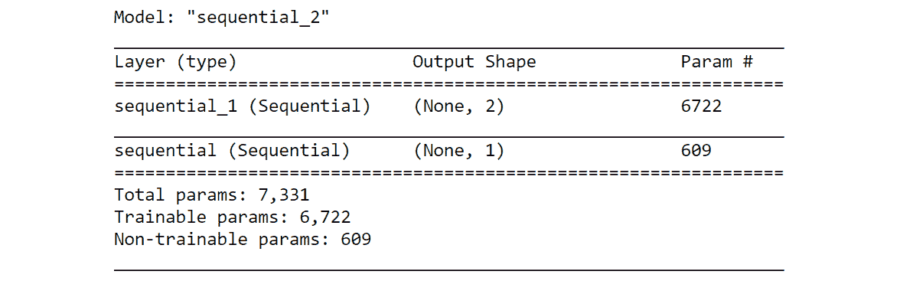

# 第七章：7\. 生成对抗网络

引言

在本章中，您将探索深度学习领域中另一个有趣的主题：**生成对抗网络**（**GANs**）。您将介绍 GANs 及其基本组件，以及它们的一些用例。本章将通过创建一个 GAN 来生成由正弦函数产生的数据分布，为您提供实践经验。您还将介绍深度卷积 GANs，并进行一个生成 MNIST 数据分布的练习。通过本章的学习，您将测试您对 GANs 的理解，生成 MNIST 时尚数据集。

# 引言

创造力的力量一直是人类思维的专属领域。这是被宣称为人类思维与人工智能领域之间主要差异之一的事实。然而，在最近的过去，深度学习一直在迈向创造力之路上迈出婴儿步伐。想象一下，你在梵蒂冈的西斯廷教堂，目瞪口呆地仰望米开朗基罗永恒不朽的壁画，希望你的深度学习模型能够重新创作出类似的作品。嗯，也许 10 年前，人们会嗤之以鼻。但现在不同了——深度学习模型在重现不朽作品方面取得了巨大进展。这类应用得益于一类称为**生成对抗网络**（**GANs**）的网络。

许多应用都依靠 GANs 实现。请看下面的图像：


图 7.1：使用 GANs 进行图像翻译

注意：

上述图像来源于标题为《带条件对抗网络的图像到图像翻译》的研究论文：Phillip Isola、Jun-Yan Zhu、Tinghui Zhou、Alexei A. Efros，详见[`arxiv.org/pdf/1611.07004.pdf`](https://arxiv.org/pdf/1611.07004.pdf)。

上述图像展示了输入图像如何通过 GAN 转换为看起来与真实图像非常相似的图像。这种 GAN 的应用称为图像翻译。

除了这些例子，许多其他用例也开始受到关注。其中一些显著的用例如下：

+   用于数据增强的合成数据生成

+   生成卡通人物

+   文本到图像翻译

+   三维对象生成

无论时间如何流逝，GANs 的应用越来越成为主流。

那么，GANs 究竟是什么？GANs 的内在动态是什么？如何从完全不相关的分布中生成图像或其他数据分布？在本章中，我们将找到这些问题的答案。

在上一章，我们学习了**循环神经网络**（**RNNs**），一种用于序列数据的深度学习网络。在本章中，我们将开启一场关于 GAN 的精彩探索之旅。首先，我们将介绍 GAN。然后，我们将重点介绍生成一个与已知数学表达式相似的数据分布。接下来，我们将介绍**深度卷积 GANs**（**DCGANs**）。为了验证我们的生成模型的效果，我们将生成一个类似于 MNIST 手写数字的数据分布。我们将从学习 GAN 开始这段旅程。

注意

根据你的系统配置，本章中的一些练习和活动可能需要较长时间才能执行完成。

## 生成对抗网络的关键组件

GANs 用于从随机噪声数据中创建一个数据分布，并使其看起来类似于真实的数据分布。GANs 是一类深度神经网络，由两个相互竞争的网络组成。其中一个网络叫做**生成器网络**，另一个叫做**判别器网络**。这两个网络的功能是相互竞争，生成一个尽可能接近真实概率分布的概率分布。举一个生成新概率分布的例子，假设我们有一组猫狗的图片（真实图片）。使用 GAN，我们可以从一个非常随机的数字分布中生成一组不同的猫狗图片（虚假图片）。GAN 的成功之处在于生成最佳的猫狗图片集，以至于人们很难分辨虚假图片和真实图片。

另一个 GAN 可以派上用场的例子是在数据隐私领域。尤其是在金融和医疗等领域，公司的数据非常敏感。然而，在某些情况下，可能需要将数据共享给第三方进行研究。为了保持数据的机密性，公司可以使用 GAN 生成与现有数据集相似的数据集。在许多业务场景中，GAN 都可以发挥重要作用。

让我们通过绘制一些 GAN 的组件来更好地理解 GAN，如下图所示：


](img/B15385_07_02.jpg)

图 7.2：GAN 结构示例

上面的图提供了 GAN 组件的简要概述，并展示了它们如何帮助从真实图片生成虚假图片。让我们在前述图的背景下理解这个过程：

1.  前面图中左上角的图片集合代表了真实数据的概率分布（例如，MNIST、猫狗图片、人脸图片等）。

1.  图表左下部分显示的生成网络从随机噪声分布中生成虚假图像（概率分布）。

1.  经过训练的鉴别网络对输入的图像进行分类，判断其真伪。

1.  反馈循环（菱形框）通过反向传播算法向生成器网络提供反馈，从而优化生成模型的参数。

1.  参数会持续优化，直到鉴别网络无法区分虚假图像和真实图像为止。

现在我们已经对每个组件有了概述，让我们通过问题陈述更深入地理解它们。

## 问题陈述 – 生成与给定数学函数类似的分布

在这个问题中，我们将使用 GAN 生成类似于数学函数数据分布的分布。我们将使用简单的**正弦波**函数来生成真实数据，训练 GAN 生成与从已知数学函数生成的数据类似的虚假数据分布。在解决这个问题陈述的过程中，我们将逐步构建每个所需的组件。

我们将按照以下图解中详细说明的步骤，采用教学方法来执行该过程：


图 7.3：从已知函数构建 GAN 的四步过程

现在，让我们逐个探索这些过程。

## 过程 1 – 从已知函数生成真实数据

要开始我们的旅程，我们需要一个真实数据分布。这个数据分布将包括两个特征 – 第一个是序列，第二个是序列的正弦值。第一个特征是等间隔的数据点序列。为了生成这个序列，我们需要从正态分布随机生成一个数据点，然后找到等间隔序列中的其他数值。第二个特征将是第一个特征的`sine()`。这两个特征将构成我们的真实数据分布。在进入生成真实数据集的练习之前，让我们看一下我们将在此过程中使用的`numpy`库中的一些函数。

**随机数生成**

首先，我们将使用以下函数从正态分布中生成一个随机数：

```py
numpy.random.normal(loc,scale,size)
```

此函数接受三个参数：

+   `loc`: 这是数据分布的均值。

+   `scale`: 这是数据分布的标准差。

+   `size`: 这定义了我们想要的数据点数量。

**将数据排列成序列**

要将数据排列成序列，我们使用以下函数：

```py
numpy.arange(start,end,spacing)
```

参数如下：

+   `start`: 序列应从此点开始。

+   `end`: 序列结束的点。

+   `spacing`：序列中每个连续数字之间的间隔。例如，如果我们从 1 开始，生成一个间隔为`0.1`的序列，那么序列将如下所示：

```py
 1, 1.1,1.2 …….. 
```

**生成正弦波**

要生成一个数字的正弦值，我们使用以下命令：

```py
numpy.sine()
```

让我们在接下来的练习中使用这些概念，学习如何生成一个真实的数据分布。

## 练习 7.01：从已知函数生成数据分布

在本练习中，我们将从一个简单的正弦函数生成数据分布。通过完成此练习，你将学习如何从正态分布中生成一个随机数，并使用这个随机数作为中心生成一个等间隔的数据序列。这个序列将是第一个特征。第二个特征将通过计算第一个特征的`sin()`值来创建。按照以下步骤完成此练习：

1.  打开一个新的 Jupyter Notebook，并将其命名为`Exercise 7.01`。运行以下命令以导入必要的库：

    ```py
    # Importing the necessary library packages
    import numpy as np
    ```

1.  从均值为 3、标准差为 1 的正态分布中生成一个随机数：

    ```py
    """
    Generating a random number from a normal distribution 
    with mean 3 and sd = 1
    """
    np.random.seed(123)
    loc = np.random.normal(3,1,1)
    loc
    array([1.9143694])
    ```

1.  使用之前生成的随机数作为中点，我们将在中点的左右两侧生成相等数量的数字序列。我们将生成 128 个数字。因此，我们在中点的左右两侧各取 64 个数字，间隔为 0.1。以下代码生成了中点右侧的序列：

    ```py
    # Generate numbers to right of the mid point
    xr = np.arange(loc,loc+(0.1*64),0.1)
    ```

1.  生成中点左侧的 64 个数字：

    ```py
    # Generate numbers to left of the random point
    xl = np.arange(loc-(0.1*64),loc,0.1)
    ```

1.  将这两个序列连接起来，生成第一个特征：

    ```py
    # Concatenating both these numbers 
    X1 = np.concatenate((xl,xr))
    print(X1)
    ```

    你应该得到类似下面的输出：

    

    ](img/B15385_07_04.jpg)

    图 7.4：等间隔数字序列

    上述是`128`个等间隔数字的分布。这个序列将成为我们数据分布的第一个特征。

1.  生成第二个特征，即第一个特征的`sin()`值：

    ```py
    # Generate second feature
    X2 = np.sin(X1)
    ```

1.  绘制分布图：

    ```py
    # Plot the distribution 
    import matplotlib.pyplot as plot
    plot.plot(X1, X2)
    plot.xlabel('Data Distribution')
    plot.ylabel('Sine of data distribution')
    plot.show()
    ```

    你应该得到以下输出：

    

    ](img/B15385_07_05.jpg)

    图 7.5：正弦函数的图表

    上述图表显示了你试图使用 GANs 模仿的分布。

1.  在连接这些特征之前，先对每个特征进行重塑：

    ```py
    # Reshaping the individual data sets
    X1 = X1.reshape(128,1)
    X2 = X2.reshape(128,1)
    ```

1.  将这两个特征连接起来，形成一个单一的 DataFrame：

    ```py
    # Concatenate both features to form the real data set
    realData = np.concatenate((X1,X2),axis=1)
    realData.shape
    ```

    你应该得到以下输出：

    ```py
    (128, 2)
    ```

    注意

    要访问此特定部分的源代码，请参考[`packt.live/3gHhv42`](https://packt.live/3gHhv42)。

    你也可以在[`packt.live/2O62M6r`](https://packt.live/2O62M6r)在线运行此示例。你必须执行整个 Notebook 才能得到期望的结果。

在这个练习中，我们从一个数学函数创建了一个数据分布。稍后我们将使用这个数据分布来训练 GAN 生成类似的分布。在生产环境中，你会获得一个真实的数据集，类似于 MNIST 或`Imagenet`数据集。在本例中，我们的真实数据集是一个已知的数学函数。稍后在本章中，我们将使用一些随机噪声数据，并训练 GAN 使这些随机噪声数据类似于这个真实的数据分布。  

现在我们已经看到真实数据分布，接下来的部分将专注于创建一个基本的生成网络。  

## 过程 2 – 创建一个基本的生成网络  

在之前的过程里，我们做了一个例子来生成来自已知函数的分布。正如我们之前提到的，生成网络的目的是从任意分布中采样数据，并将这些数据转换为生成的样本，使其看起来与已知分布相似。  

生成网络实现这一点的方式是通过生成器、判别器和训练过程的动态关系。生成网络的成功取决于它能否创建出判别器无法区分的数据分布——换句话说，判别器无法判断这个分布是否是假的。生成网络能够创建可以欺骗判别器的分布的能力，是通过训练过程获得的。我们稍后会详细讲解判别器和训练过程。现在，让我们看看如何构建一个生成器网络，以便从某些随机分布中生成虚假的数据分布。

## 构建生成网络  

生成网络是通过训练神经网络将任意分布转换为类似已知分布的网络。我们可以使用任何类型的神经网络来构建这个生成器网络，比如**多层感知机**（**MLPs**）、**卷积神经网络**（**CNNs**）等。输入这些网络的数据是我们从任意分布中采样得到的样本。在这个例子中，我们将使用 MLP 来构建生成网络。在我们开始构建网络之前，让我们回顾一下你在前几章中学到的一些神经网络的基本构件。我们将使用 Keras 库来构建网络。  

## `Sequential()`  

如你所知，神经网络由不同层次的节点组成，这些节点之间有连接。`Sequential()` API 是你在 Keras 中创建这些层的机制。`Sequential()` API 可以通过以下代码实例化：  

```py
from tensorflow.keras import Sequential
Genmodel= Sequential()
```

在代码的第一部分，`Sequential()` 类从 `tensorflow.Keras` 模块中导入。然后，它在第二行代码中被实例化为变量 model。  

### 核心初始化器  

在*第二章*，*神经网络*中，你已经学习过训练过程涉及更新神经网络的权重和偏置，以便有效地学习将输入映射到输出的函数。在训练过程的第一步，我们初始化权重和偏置的某些值。这些值将在反向传播阶段进一步更新。在接下来的练习中，权重和偏置的初始化通过一个名为`he_uniform`的参数完成。一个核初始化器将作为参数添加到网络中。

### 密集层

神经网络中每一层的基本动态是层的权重与层输入的矩阵乘法（点积），并进一步加上偏置。这可以通过`dot(X,W) + B`方程表示，其中`X`是输入，`W`是权重或核，`B`是偏置。神经网络的这个操作是通过 Keras 中的密集层实现的，代码实现如下：

```py
from tensorflow.keras.layers import Dense 
Genmodel.add(Dense(hidden_layer,activation,\
                   kernel_initializer,input_dim))
Genmodel.add(Dense(hidden_layer,activation,kernel_initializer))
```

注意

上面的代码块仅用于解释代码是如何实现的。以当前形式运行时，可能无法得到理想的输出。目前，尝试完全理解语法；我们将在*练习 7.02*中实际应用这段代码，*构建生成网络*。

如你所见，我们在之前创建的`Sequential()`类（`Genmodel`）实例化时添加了一个密集层。定义一个密集层时需要给出的关键参数如下：

+   `(hidden_layer)`：如你所知，隐藏层是神经网络中的中间层。隐藏层的节点数定义为第一个参数。

+   `(activation)`：另一个参数是将要使用的激活函数类型。激活函数将在下一节中详细讨论。

+   `(kernel_initializer)`：用于层的核初始化器的种类在密集层中定义。

+   `(input_dim)`：对于网络的第一层，我们必须定义输入的维度（`input_dim`）。对于后续的层，这个值会根据每层的输出维度自动推导出来。

### 激活函数

如你所知，激活函数为神经元的输出引入了非线性。在神经网络中，激活函数会紧跟在密集层之后。密集层的输出就是激活函数的输入。接下来的练习中会使用不同的激活函数，具体如下：

+   **ReLU**：这代表**修正线性单元**。这种激活函数只输出正值，所有负值将输出为零。这是最广泛使用的激活函数之一。

+   **ELU**：这代表**指数线性单元**。它与 ReLU 非常相似，不同之处在于它也能输出负值。

+   **线性**：这是一种直线型激活函数。在这个函数中，激活值与输入成正比。

+   **SELU**：这代表**缩放指数线性单元**。这种激活函数是一种相对较少使用的函数。它启用了一个叫做内部归一化的理念，确保前一层的均值和方差保持不变。

+   **Sigmoid**：这是一种非常标准的激活函数。Sigmoid 函数将任何输入压缩到 0 和 1 之间。因此，Sigmoid 函数的输出也可以被视为概率分布，因为其值在 0 和 1 之间。

现在我们已经了解了一些网络的基本构建模块，接下来让我们在下一个练习中构建我们的生成网络。

在开始练习之前，让我们看看下一个练习在整体结构中所处的位置。在*练习 7.01*，*从已知函数生成数据分布*中，我们从已知的数学函数（即 `sine()` 函数）生成了数据分布。我们通过将第一个特征按等间距排列，然后使用第一个特征的 `sine()` 函数创建第二个特征，从而生成了整个分布。所以我们实际上控制了这个数据集的创建过程。这就是为什么这被称为真实数据分布，因为数据是从已知函数生成的。生成对抗网络（GAN）的最终目标是将随机噪声分布转化为看起来像真实数据分布的东西；即将一个随机分布转化为结构化的 `sine()` 分布。这将在以后的练习中实现。然而，作为第一步，我们将创建一个生成网络，用于生成随机噪声分布。这就是我们在下一个练习中要做的事情。

## 练习 7.02：构建生成网络

在这个练习中，我们将构建一个生成网络。生成网络的目的是从随机噪声数据生成虚假的数据分布。我们将通过生成随机数据点作为生成器网络的输入来实现这一点。然后，我们将逐层构建一个六层网络。最后，我们将预测网络的输出并绘制输出分布。这些数据分布将是我们的虚假分布。按照以下步骤完成此练习：

1.  打开一个新的 Jupyter Notebook，并将其命名为 `练习 7.02`。导入以下库包：

    ```py
    # Importing the library packages
    import tensorflow as tf
    import numpy as np
    from numpy.random import randn
    from tensorflow.keras.models import Sequential
    from tensorflow.keras.layers import Dense
    from matplotlib import pyplot
    ```

1.  在这一步，我们定义网络的输入特征和输出特征的数量：

    ```py
    # Define the input features and output features
    infeats = 10
    outfeats = 2
    ```

    我们将有 10 个特征作为输入，输出将是两个特征。输入特征 `10` 是随意选择的。输出特征 `2` 是根据我们的真实数据集选择的，因为我们的真实数据集包含两个特征。

1.  现在，我们将生成一批随机数。我们的批处理大小将为 `128`：

    ```py
    # Generate a batch of random numbers
    batch = 128
    genInput = randn(infeats * batch)
    ```

    我们可以选择任何批次大小。选择 `128` 作为批次大小，以考虑到我们现有的计算资源。由于输入大小为 10，我们应生成 128 × 10 个随机数。此外，在前面的代码中，`randn()` 是生成随机数的函数。在该函数内部，我们指定需要多少数据点，在我们的例子中是 (128 × 10)。

1.  让我们使用以下代码将随机数据重新塑形为我们想要的输入格式：

    ```py
    # Reshape the data 
    genInput = genInput.reshape(batch,infeats)
    print(genInput.shape)
    ```

    你应该会得到以下输出：

    ```py
    (128, 10)
    ```

1.  在此步骤中，我们将定义生成器。该网络将包含六层：

    ```py
    # Defining the Generator model
    Genmodel = Sequential()
    Genmodel.add(Dense(32,activation = 'linear',\
                       kernel_initializer='he_uniform',\
                       input_dim=infeats))
    Genmodel.add(Dense(32,activation = 'relu',\
                       kernel_initializer='he_uniform'))
    Genmodel.add(Dense(64,activation = 'elu',\
                       kernel_initializer='he_uniform'))
    Genmodel.add(Dense(32,activation = 'elu',\
                       kernel_initializer='he_uniform'))
    Genmodel.add(Dense(32,activation = 'selu',\
                       kernel_initializer='he_uniform'))
    Genmodel.add(Dense(outfeats,activation = 'selu'))
    ```

    从网络中，我们可以看到，在第一层，我们定义了输入的维度，即 10；而在最后一层，我们定义了输出维度，即 2\。这基于我们在 *步骤 4* 中生成的输入数据维度（10）以及我们想要的输出特征，这与真实数据分布的特征数量相似。

1.  我们可以使用 `model.summary()` 函数调用查看该网络的概述：

    ```py
    # Defining the summary of the network
    Genmodel.summary()
    ```

    你应该会得到以下输出：

    

    图 7.6：生成器网络概述

    从总结中，你可以看到每一层输出的形状。例如，密集层的输出形状为 (*批次大小*，`32`)，因为第一隐藏层有 `32` 个神经元。形状层中的 `None` 表示示例的数量，在本例中指的是输入批次大小。第一层的 352 是参数的大小，包括权重和偏差。权重矩阵的大小为 (10 × 32)，因为第一层的输入数量是 10，而下一层（隐藏层 1）有 32 个神经元。偏差的数量是 (32 × 1)，这将等于第一层中隐藏层神经元的数量。因此，总共有 320 + 32 = 352 个参数。第二层则为 (32 × 32) + (32 × 1) = 1,056，以此类推，后续层也是如此。

1.  现在我们已经定义了生成器网络，接下来让我们从网络中生成输出。我们可以使用 `predict()` 函数来实现：

    ```py
    # Generating fake samples from network
    fakeSamps = Genmodel.predict(genInput)
    fakeSamps.shape
    ```

    你应该会得到以下输出：

    ```py
    (128, 2)
    ```

    我们可以看到，生成器函数的输出会生成一个具有两个特征的样本，以及与给定批次大小相等的多个示例。

1.  绘制分布图：

    ```py
    # Plotting the fake distribution
    from matplotlib import pyplot
    pyplot.scatter(fakeSamps[:,0],fakeSamps[:,1])
    pyplot.xlabel('Feature 1 of the distribution')
    pyplot.ylabel('Feature 2 of the distribution')
    pyplot.show()
    ```

    你应该得到类似于以下的输出。请注意，建模将是随机的，因此你可能不会得到相同的输出：

    

图 7.7：虚假数据分布图

正如我们所看到的，已经生成了非常随机的数据。正如你将在接下来的练习中看到的，这些随机数据将被转换，以便看起来像真实的数据分布。

注意

要访问该部分的源代码，请参阅 [`packt.live/2W0FxyZ`](https://packt.live/2W0FxyZ)。

你也可以在[`packt.live/2WhZpOn`](https://packt.live/2WhZpOn)上在线运行这个示例。你必须执行整个 Notebook 才能得到预期的结果。

在这个练习中，我们定义了一个包含六层的生成器网络，并从生成器网络中生成了第一个假样本。你可能在想我们是如何得到这六层的。那么，激活函数的选择呢？其实，网络架构是在大量实验之后得出的，目的是解决这个问题。找到合适的架构没有真正的捷径。我们必须通过实验不同的参数，如层数、激活函数类型等，来确定最优架构。

## 为判别器网络奠定基础

在之前的练习中，我们定义了生成器网络。现在，在定义判别器网络之前，是时候为此做一些准备了。看一下我们从生成器网络得到的输出，可以看到数据点是随机分布的。让我们退后一步，评估一下我们真正的方向。在我们介绍生成网络时，我们提到我们希望生成网络的输出与我们试图模仿的真实分布相似。换句话说，我们希望生成网络的输出看起来与真实分布的输出相似，如下图所示：


图 7.8：真实数据分布

我们可以看到，生成器网络当前生成的分布与我们希望模仿的分布相差甚远。你认为这是什么原因呢？嗯，原因很明显；我们还没有进行任何训练。你可能也注意到，网络中没有包含优化器函数。Keras 中的优化器函数是通过`compile()`函数定义的，如以下代码所示，其中我们定义了损失函数的类型以及我们希望采用的优化器：

```py
model.compile(loss='binary_crossentropy',\
              optimizer='adam',metrics=['accuracy'])
```

我们故意排除了`compile()`函数。稍后，当我们介绍 GAN 模型时，我们将使用`compile()`函数来优化生成器网络。所以，请耐心等待。现在，我们将继续进行过程的下一步，即定义判别器网络。

## 过程 3 – 判别器网络

在之前的过程中，我们介绍了生成网络，一个生成假样本的神经网络。鉴别器网络也是另一个神经网络，尽管它的功能与生成器网络不同。鉴别器的作用是识别给定样本是真实的还是假的。用一个类比来说，如果生成器网络是一个制造假币的骗子，那么鉴别器网络就是识别假币的超级警察。一旦被超级警察抓住，骗子将尝试完善他们的伎俩，制作更好的伪币，以便能欺骗超级警察。然而，超级警察也会接受大量训练，了解不同货币的细微差别，并努力完善识别假币的技能。我们可以看到，这两个主角始终处于对立的状态。这也是为什么这个网络被称为*生成对抗网络*的原因。

从前面的类比中获得启示，训练鉴别器类似于超级警察经过更多训练来识别假币。鉴别器网络就像你在机器学习中学到的任何二分类器。在训练过程中，鉴别器将提供两类样本，一类来自真实分布，另一类来自生成器分布。每一类样本都会有各自的标签。真实分布的标签是“1”，而假分布的标签是“0”。经过训练后，鉴别器必须正确地分类样本是来自真实分布还是假分布，这是一个典型的二分类问题。

### 实现鉴别器网络

鉴别器网络的核心结构与我们在前一部分实现的生成器网络相似。构建鉴别器网络的完整过程如下：

1.  生成真实分布的批次。

1.  使用生成器网络，生成假分布的批次。

1.  用这两种分布的样本训练鉴别器网络。真实分布的标签是 1，而假分布的标签是 0。

1.  评估鉴别器的性能。

在*步骤 1* 和 *步骤 2* 中，我们需要生成真实和假分布的批次。这就需要利用我们在*练习 7.01*中构建的真实分布，*从已知函数生成数据分布*，以及我们在*练习 7.02*中开发的生成器网络，*构建生成网络*。由于我们需要使用这两种分布，因此将它们打包成两种函数类型，以便高效地训练鉴别器网络会更方便。让我们来看看我们将要构建的两种函数类型。

### 生成真实样本的函数

这个用于生成真实样本的函数内容与我们在 *练习 7.01* 中开发的代码相同，*从已知函数生成数据分布*。唯一需要注意的补充内容是输入数据的标签。正如我们之前所述，真实样本的标签将是 1。因此，作为标签，我们将生成一个大小与批量大小相同的 1 的数组。`numpy` 中有一个实用函数可以用来生成一系列 1，叫做 `np.ones((batch,1))`。这将生成一个大小等于批量大小的 1 的数组。我们来回顾一下这个函数中的不同步骤：

1.  生成均匀分布的数字，位于随机数的左右两侧。

1.  将两组特征合并，得到一个与我们所需批量大小相等的序列。这是我们的第一个特征。

1.  通过对我们在 *步骤 2* 中生成的第一个特征应用 `sine()` 函数来生成第二个特征。

1.  将两个特征的形状调整为 `(batch,1)`，然后沿列连接它们。这将得到一个形状为 `(batch,2)` 的数组。

1.  使用 `np.ones((batch,1))` 函数生成标签。标签数组的维度将是 `(batch,1)`。

我们将提供给函数的参数是随机数和批量大小。在 *步骤 1* 中需要注意一个细微的变化，由于我们希望生成一个长度等于批量大小的序列，我们将取与批量大小的一半（batch size /2）等长的均匀分布的数字。这样，当我们将左右两边的序列组合起来时，我们就得到了一个等于所需批量大小的序列。

### 生成假样本的函数

生成假样本的函数将与我们在 *练习 7.02* 中开发的函数相同，*构建生成对抗网络*。不过，我们将把它分成三个独立的函数。将 *练习 7.02* 中的代码分成三个独立的函数是为了在训练过程中提高便利性和效率。我们来看看这三个函数：

+   `randn()` 函数。输出将是一个形状为 (`batch,input features`) 的数组。该函数的参数是 `batch size` 和 `input feature size`。

+   `输入特征大小` 和 `输出特征大小`。

+   使用 `numpy` 生成 0，即 `np.zeros((batch,1))`。

我们来看看这三个函数的完整过程：

1.  使用 *函数 1* 生成假输入。

1.  使用生成器模型函数（*函数 2*）来预测假输出。

1.  使用 `np.zeros()` 函数生成标签，即一系列 0。这是 *函数 3* 的一部分。

第三个函数的参数是 `生成器模型`、`批量大小` 和 `输入特征大小`。

### 构建判别器网络

判别器网络将按照与生成器网络相同的方式构建；也就是说，它将使用`Sequential()`类、全连接层、激活函数和初始化函数来创建。唯一值得注意的例外是，我们还将在`compile()`函数中添加优化层。在优化层中，我们将定义损失函数，这里将使用`binary_crossentropy`，因为判别器网络是一个二分类网络。对于优化器，我们将使用`adam optimizer`，因为它非常高效且是一个非常流行的选择。

### 训练判别器网络

现在我们已经了解了实现判别器网络的所有组件，接下来让我们看看训练判别器网络的步骤：

1.  生成一个随机数，然后使用生成真实样本的函数生成一批真实样本及其标签。

1.  使用第三个函数生成虚假样本及其标签，该函数将使用前面定义的其他函数来生成虚假样本。

1.  使用`train_on_batch()`函数，用一批真实样本和虚假样本来训练判别器模型。

1.  步骤*1*到*3*会针对我们希望训练运行的轮数重复执行。这是通过一个`for`循环来实现的，循环的次数是训练的轮数。

1.  在每个中间步骤中，我们使用`evaluate()`函数计算模型在虚假样本和真实样本上的准确性，并打印出模型的准确度。

现在我们已经了解了实现判别器网络的步骤，接下来我们将在下一个练习中实现它。

## 练习 7.03：实现判别器网络

在本次练习中，我们将构建判别器网络，并在真实样本和虚假样本上训练该网络。请按照以下步骤完成此练习：

1.  打开一个新的 Jupyter Notebook，并命名为`Exercise 7.03`。导入以下库包：

    ```py
    # Import the required library functions
    import tensorflow as tf
    import numpy as np
    from numpy.random import randn
    from tensorflow.keras.models import Sequential
    from tensorflow.keras.layers import Dense
    from matplotlib import pyplot
    ```

1.  让我们定义一个函数，生成我们真实数据分布的特征。此函数的返回值将是真实数据集及其标签：

    ```py
    Exercise7.03.ipynb
    # Function to generate real samples
    def realData(loc,batch):
        """
        loc is the random location or mean around which samples are centred
        """
        """
        Generate numbers to right of the random point
        """
        xr = np.arange(loc,loc+(0.1*batch/2),0.1)
        xr = xr[0:int(batch/2)]
        """
        Generate numbers to left of the random point
        """
        xl = np.arange(loc-(0.1*batch/2),loc,0.1)
    The complete code for this step can be found at https://packt.live/3fe02j3.
    ```

    我们在这里定义的函数包含了在*练习 7.01*中用于生成`sine()`波形数据集的代码，*练习 7.01*是*从已知函数生成数据分布*部分的内容。这个函数的输入是随机数和批次大小。一旦提供了随机数，系列将按照我们在*练习 7.01*中遵循的相同过程生成。我们还会为真实数据分布生成标签，这些标签为 1。最终的返回值将是两个特征和标签。

1.  让我们定义一个名为`fakeInputs`的函数，用于为生成器函数生成输入（这是*函数 1*，我们在*生成虚假样本的函数*部分中进行了说明）：

    ```py
    # Function to generate inputs for generator function
    def fakeInputs(batch,infeats):
        """
        Sample data points equal to (batch x input feature size) 
        from a random distribution
        """
        genInput = randn(infeats * batch)
        # Reshape the input
        X = genInput.reshape(batch ,infeats)
        return X
    ```

    在这个函数中，我们正在生成我们需要的格式的随机数 `([batch size , input features])`。这个函数生成的是从随机分布中采样的伪数据作为返回值。

1.  接下来，我们将定义一个函数，该函数将返回一个生成器模型：

    ```py
    # Function for the generator model
    def genModel(infeats,outfeats):
        #Defining the Generator model
        Genmodel = Sequential()
        Genmodel.add(Dense(32,activation = 'linear',\
                           kernel_initializer='he_uniform',\
                           input_dim=infeats))
        Genmodel.add(Dense(32,activation = 'relu',\
                           kernel_initializer='he_uniform'))
        Genmodel.add(Dense(64,activation = 'elu',\
                           kernel_initializer='he_uniform'))
        Genmodel.add(Dense(32,activation = 'elu',\
                           kernel_initializer='he_uniform'))
        Genmodel.add(Dense(32,activation = 'selu',\
                           kernel_initializer='he_uniform'))
        Genmodel.add(Dense(outfeats,activation = 'selu'))
        return Genmodel
    ```

    这与我们在 *练习 7.02* 中实现的模型相同，*构建生成对抗网络*。该函数的返回值将是生成器模型。

1.  以下函数将用于使用生成器模型创建伪样本：

    ```py
    # Function to create fake samples using the generator model
    def fakedataGenerator(Genmodel,batch,infeats):
        # first generate the inputs to the model
        genInputs = fakeInputs(batch,infeats)
        """
        use these inputs inside the generator model 
        to generate fake distribution
        """
        X_fake = Genmodel.predict(genInputs)
        # Generate the labels of fake data set
        y_fake = np.zeros((batch,1))
        return X_fake,y_fake
    ```

    在上述代码中，我们正在实现 *函数 3*，该函数在 *生成伪样本的函数* 部分中已经介绍过。如你所见，我们调用了在 *步骤 4* 中定义的生成器模型作为输入，同时包括了批次大小和输入特征。这个函数的返回值是生成的伪数据及其标签（`0`）。

1.  现在，让我们定义在刚刚创建的函数中将使用的参数：

    ```py
    """
    Define the arguments like batch size,input feature size 
    and output feature size
    """
    batch = 128
    infeats = 10
    outfeats = 2
    ```

1.  让我们使用以下代码构建判别器模型：

    ```py
    # Define the discriminator model
    Discmodel = Sequential()
    Discmodel.add(Dense(16, activation='relu',\
                        kernel_initializer = 'he_uniform',\
                        input_dim=outfeats))
    Discmodel.add(Dense(16,activation='relu' ,\
                        kernel_initializer = 'he_uniform'))
    Discmodel.add(Dense(16,activation='relu' ,\
                        kernel_initializer = 'he_uniform'))
    Discmodel.add(Dense(1,activation='sigmoid'))
    # Compiling the model
    Discmodel.compile(loss='binary_crossentropy',\
                      optimizer='adam', metrics=['accuracy'])
    ```

    判别模型的构建方式类似于我们在生成器网络中所做的。请注意，最后一层的激活函数将是 Sigmoid，因为我们需要一个关于输出是实际网络还是伪网络的概率。

1.  打印判别网络的摘要：

    ```py
    # Print the summary of the discriminator model
    Discmodel.summary()
    ```

    你应该获得以下输出：

    

    图 7.9：模型摘要

    从摘要中，我们可以看到基于我们定义的架构，网络的大小。我们可以看到前面三层全连接层每层有 16 个神经元，这是我们在 *步骤 7* 中构建判别网络时定义的。最后一层只有一个输出，因为这是一个 Sigmoid 层。它输出的是数据分布是否真实的概率（`1` 表示真实，`0` 表示伪造）。

1.  调用将在训练过程中使用的生成器模型函数：

    ```py
    # Calling the Generator model function
    Genmodel = genModel(infeats,outfeats)
    Genmodel.summary()
    ```

    你应该获得以下输出：

    

    图 7.10：模型摘要

    你会注意到，架构与我们在 *练习 7.02* 中开发的完全相同，*构建生成对抗网络*。

1.  现在，我们需要定义训练网络的周期数，如下所示：

    ```py
    # Defining the number of epochs
    nEpochs = 20000
    ```

1.  现在，让我们开始训练判别网络：

```py
Exercise7.03.ipynb
# Train the discriminator network
for i in range(nEpochs):
    # Generate the random number for generating real samples
    loc = np.random.normal(3,1,1)
    """
    Generate samples equal to the bath size 
    from the real distribution
    """
    x_real, y_real = realData(loc,batch)
    #Generate fake samples using the fake data generator function
    x_fake, y_fake = fakedataGenerator(Genmodel,batch,infeats)
The complete code for this step can be found at https://packt.live/3fe02j3.
```

在这里，我们对真实数据和伪数据的训练进行 20,000 次周期的迭代。周期数是通过一定的实验得出的。我们应该尝试不同的周期值，直到得到较好的准确度。每经过 4,000 次周期，我们打印模型在真实数据集和伪数据集上的准确度。打印频率是任意的，基于你希望看到的图表数量，以检查训练进度。训练后，你将看到判别器达到非常好的准确率。

你应该获得类似于以下的输出：

```py
Real accuracy:0.265625,Fake accuracy:0.59375
Real accuracy:1.0,Fake accuracy:0.828125
Real accuracy:1.0,Fake accuracy:0.90625
Real accuracy:1.0,Fake accuracy:0.9453125
Real accuracy:1.0,Fake accuracy:0.9453125
```

注意

由于我们在这里使用的是随机值，因此你得到的输出可能与这里看到的不同，每次运行结果也会有所不同。

从准确度水平来看，我们可以看到判别器最初在识别真实数据集时非常优秀（准确度 = 1），而对假数据集的准确度较低。经过大约 4,000 个周期后，我们看到判别器已经能够很好地区分假数据集和真实数据集，因为它们的准确度都接近 1.0。

注意

要访问这个特定部分的源代码，请参考[`packt.live/3fe02j3`](https://packt.live/3fe02j3)。

你也可以在线运行这个示例，访问[`packt.live/2ZYiYMG`](https://packt.live/2ZYiYMG)。你必须执行整个 Notebook 才能获得预期的结果。

在这个练习中，我们定义了不同的辅助函数，并构建了判别器函数。最后，我们在真实数据和假数据上训练了判别器模型。在训练过程结束时，我们看到判别器能够非常好地区分真实数据集和假数据集。训练完判别器网络后，接下来就是构建 GAN 的高潮部分。

## 过程 4 – 实现 GAN

我们终于到了我们一直在等待的时刻。在之前的三个过程中，我们逐步构建了 GAN 的所有构建模块，如假数据生成器、真实数据生成器、生成器网络和判别器网络。GAN 实际上是这些构建模块的整合。GAN 中的真正难题是我们如何将这些组件互相整合。我们现在就来处理这个问题。

### 整合所有构建模块

在构建鉴别器网络时，我们生成了真实样本和假样本，并在训练过程中将它们输入到鉴别器中。训练过程使得鉴别器变得“聪明”，从而能够正确地识别什么是假的，什么是真的。从概率的角度来看，这意味着当鉴别器接收到假样本时，它会预测接近“0”的概率，而当样本是真实的时，它会预测接近“1”的概率。然而，使鉴别器变聪明并不是我们的最终目标。我们的最终目标是让生成器模型变聪明，使它开始生成看起来像真实样本的例子，并在此过程中欺骗鉴别器。这可以通过训练生成器并更新其参数（即权重和偏置）来实现，使它能够生成看起来像真实样本的样本。然而，仍然存在一个问题，因为在生成器网络中，我们没有包括优化器步骤，因此生成器网络本身无法进行训练。解决这个问题的方法是构建另一个网络（我们称之为**Ganmodel**），它将生成器和鉴别器按顺序连接起来，然后在新网络中包含一个优化器函数，使其在反向传播时更新其组成部分的参数。用伪代码表示，这个网络大致如下：

```py
Ganmodel = Sequential()
# First adding the generator model
Ganmodel.add(Genmodel)
"""
Next adding the discriminator model 
without training the parameters
"""
Ganmodel.add(Discmodel)
# Compile the model for loss to optimise the Generator model
Ganmodel.compile(loss='binary_crossentropy',optimizer = 'adam')
```

在这个模型中，生成器模型将生成假样本并输入到鉴别器模型中，鉴别器模型将根据样本生成一个概率，判断该样本是假的还是现实的。根据样本的标签，它会有一定的损失，这个损失会通过鉴别器传播到生成器，更新两个模型的参数。换句话说，基于损失，反向传播算法将根据损失对每个参数的梯度来更新该参数。因此，这将解决我们没有为生成器定义优化器函数的问题。

然而，这个网络还有一个问题。我们的鉴别器网络已经训练过，并且在我们单独训练鉴别器网络时已经变得非常聪明。我们不希望在这个新网络中再次训练鉴别器模型并让它变得更聪明。这个问题可以通过定义我们不希望训练鉴别器参数来解决。经过这个新修改，**Ganmodel**将如下所示：

```py
# First define that discriminator model cannot be trained
Discmodel.trainable = False
Ganmodel = Sequential()
# First adding the generator model
Ganmodel.add(Genmodel)
"""
Next adding the discriminator model 
without training the parameters
"""
Ganmodel.add(Discmodel)
# Compile the model for loss to optimise the Generator model
Ganmodel.compile(loss='binary_crossentropy',optimizer = 'adam')
```

通过设置 `Discmodel.trainable = False`，我们告诉网络在反向传播时不更新鉴别器网络的参数。因此，鉴别器网络将在反向传播阶段充当传递错误的中介，传递给生成器网络。

如果你认为我们所有的问题都已经解决，那你可能会大吃一惊。我们知道，当判别器模型遇到假分布时，它会将概率预测为接近`0`的值。我们也知道，假数据集的标签也是`0`。所以，从损失的角度来看，传播回生成器的损失会非常小。由于损失非常小，随后的生成器模型参数更新也会非常微小。这将无法使生成器生成类似真实样本的样本。生成器只有在生成了较大损失并将其传播到生成器时，才能学习，从而使得其参数朝着真实参数的方向更新。那么，如何使损失变大呢？如果我们不将假样本的标签定义为`0`，而是将其定义为`1`，会怎么样呢？如果我们这么做，判别器模型像往常一样会预测假样本的概率接近 0。然而，现在我们有了一个情况，即损失函数会变大，因为标签是 1。当这个大的损失函数被传播回生成器网络时，参数会显著更新，这将使生成器变得更聪明。随后，生成器将开始生成更像真实样本的样本，这也就达到了我们的目标。

这个概念可以通过下图来解释。在这里，我们可以看到，在训练的初始阶段，假数据的概率接近零（`0.01`），而我们为假数据指定的标签是`1`。这将确保我们获得一个较大的损失，这个损失会反向传播到生成器网络：


图 7.11：GAN 过程

现在我们已经看过了 GAN 模型的动态，接下来我们将把所有部分结合起来，定义我们将遵循的过程，以构建 GAN。

## 构建 GAN 的过程

GAN 的完整过程就是将我们构建的所有部分结合成一个合乎逻辑的顺序。我们将使用我们在定义判别器函数时构建的所有函数。此外，我们还将创建新的函数，例如用于判别器网络的函数和用于 GAN 模型的另一个函数。所有这些函数将在特定的时刻被调用，以构建 GAN 模型。端到端的过程将如下所示：

1.  定义生成真实数据分布的函数。这个函数与我们在*练习 7.03*中为判别器网络开发的**判别器网络实现**函数相同。

1.  定义为生成假样本创建的三个函数。这些函数包括用于生成假输入的函数、用于生成器网络的函数，以及用于生成假样本和标签的函数。这些函数与我们在*练习 7.03*中为判别器网络开发的**判别器网络实现**函数相同。

1.  创建一个新的判别器网络函数，就像我们在*Exercise 7.03*中创建的*判别器网络的实现*一样。此函数将以输出特征（2）作为输入，因为真实数据集和假数据集都有两个特征。此函数将返回判别器模型。

1.  按照我们在上一节中开发的伪代码，创建一个新的 GAN 模型函数（*过程 4 – 构建 GAN*）。此函数将以生成器模型和判别器模型作为输入。

1.  启动训练过程。

## 训练过程

这里的训练过程类似于我们在*Exercise 7.03*中实现的*判别器网络的实现*，用于判别器网络的训练过程。训练过程的步骤如下：

1.  生成一个随机数，然后使用生成真实样本的函数生成一批真实样本及其标签。

1.  使用我们描述的关于生成假样本的第三个函数，生成一批假样本及其标签。第三个函数将使用其他函数来生成假样本。

1.  使用`train_on_batch()`函数训练判别器模型，使用真实样本和假样本的批次。

1.  生成另一批假输入来训练 GAN 模型。这些假样本是通过假样本生成过程中的*函数 1*生成的。

1.  为假样本生成标签，目的是欺骗判别器。这些标签将是 1，而不是 0。

1.  使用`train_on_batch()`函数训练 GAN 模型，使用假样本及其标签，如*步骤 4*和*5*中所述。

1.  *步骤 1* 到 *6* 会根据我们希望训练运行的周期数重复。这是通过在周期数上使用`for`循环完成的。

1.  在每个中间步骤中，我们使用`evaluate()`函数计算模型在假样本和真实样本上的准确性。模型的准确度也会打印出来。

1.  我们还会在某些时期生成输出图。

现在我们已经看到了训练 GAN 的完整过程，让我们深入到*Exercise 7.04*，*实现 GAN*，并实现这一过程。

## 练习 7.04：实现 GAN

在本练习中，我们将通过实现我们在上一节讨论的过程来构建和训练 GAN。按照以下步骤完成此练习：

1.  打开一个新的 Jupyter Notebook 并命名为`Exercise 7.04`。导入以下库：

    ```py
    # Import the required library functions
    import tensorflow as tf
    import numpy as np
    from numpy.random import randn
    from tensorflow.keras.models import Sequential
    from tensorflow.keras.layers import Dense
    from matplotlib import pyplot
    ```

1.  让我们创建一个函数来生成真实样本：

    ```py
    Exercise7.04.ipynb
    # Function to generate real samples
    def realData(loc,batch):
        """
        loc is the random location or mean 
        around which samples are centred
        """
        # Generate numbers to right of the random point
        xr = np.arange(loc,loc+(0.1*batch/2),0.1)
        xr = xr[0:int(batch/2)]
        # Generate numbers to left of the random point
        xl = np.arange(loc-(0.1*batch/2),loc,0.1)
    The complete code for this step can be found on https://packt.live/3iIJHVS
    ```

    我们在这里创建的函数遵循与我们在*Exercise 7.01*中实现的*从已知函数生成数据分布*相同的过程。此函数的输入是随机数和批次大小。我们从此函数中获得包含我们特征的真实数据分布，以及真实数据分布的标签作为返回值。此函数的返回值是实际数据集及其标签。

1.  在这里，让我们定义一个生成输入给生成器网络的函数：

    ```py
    # Function to generate inputs for generator function
    def fakeInputs(batch,infeats):
    """
        Sample data points equal to (batch x input feature size)
     from a random distribution
        """
        genInput = randn(infeats * batch)
        # Reshape the input
        X = genInput.reshape(batch ,infeats)
        return X
    ```

    该函数生成从随机分布采样的虚假数据作为输出。

1.  现在，让我们继续定义构建生成器网络的函数：

    ```py
    # Function for the generator model
    def genModel(infeats,outfeats):
        # Defining the Generator model
        Genmodel = Sequential()
        Genmodel.add(Dense(32,activation = 'linear',\
                           kernel_initializer='he_uniform',\
                           input_dim=infeats))
        Genmodel.add(Dense(32,activation = 'relu',\
                           kernel_initializer='he_uniform'))
        Genmodel.add(Dense(64,activation = 'elu',\
                           kernel_initializer='he_uniform'))
        Genmodel.add(Dense(32,activation = 'elu',\
                           kernel_initializer='he_uniform'))
        Genmodel.add(Dense(32,activation = 'selu',\
                           kernel_initializer='he_uniform'))
        Genmodel.add(Dense(outfeats,activation = 'selu'))
        return Genmodel
    ```

    这是我们在*练习 7.02*，*构建生成网络*中构建的相同函数。此函数返回生成器模型。

1.  在此步骤中，我们将定义一个函数，使用生成器网络创建虚假样本：

    ```py
    # Function to create fake samples using the generator model
    def fakedataGenerator(Genmodel,batch,infeats):
        # first generate the inputs to the model
        genInputs = fakeInputs(batch,infeats)
        """
        use these inputs inside the generator model 
        to generate fake distribution
        """
        X_fake = Genmodel.predict(genInputs)
        # Generate the labels of fake data set
        y_fake = np.zeros((batch,1))
        return X_fake,y_fake
    ```

    我们在这里定义的函数将随机数据分布作为输入（传递给我们在前一步定义的生成器网络），并生成虚假分布。虚假分布的标签是 0，它也在函数内部生成。换句话说，来自此函数的输出是虚假数据集及其标签。

1.  现在，让我们定义将在不同函数中使用的参数：

    ```py
    """
    Define the arguments like batch size,input feature size 
    and output feature size
    """
    batch = 128
    infeats = 10
    outfeats = 2
    ```

1.  接下来，让我们将鉴别器模型构建为一个函数：

    ```py
    # Discriminator model as a function
    def discModel(outfeats):
        Discmodel = Sequential()
        Discmodel.add(Dense(16, activation='relu',\
                            kernel_initializer = 'he_uniform',\
                            input_dim=outfeats))
        Discmodel.add(Dense(16,activation='relu' ,\
                            kernel_initializer = 'he_uniform'))
        Discmodel.add(Dense(16,activation='relu' ,\
                            kernel_initializer = 'he_uniform'))
        Discmodel.add(Dense(1,activation='sigmoid'))
        # Compiling the model
        Discmodel.compile(loss='binary_crossentropy',\
                          optimizer='adam',metrics=['accuracy'])
        return Discmodel
    ```

    网络架构将类似于我们在*练习 7.03*，*实现鉴别器网络*中开发的架构。此函数将返回鉴别器。

1.  打印鉴别器网络的摘要：

    ```py
    # Print the summary of the discriminator model
    Discmodel = discModel(outfeats)
    Discmodel.summary()
    ```

    你应该得到以下输出：

    

    图 7.12：鉴别器模型摘要

    该输出与我们在*练习 7.03*，*实现鉴别器网络*中实现的网络所收到的输出相同，我们在其中定义了鉴别器函数。

1.  调用生成器模型函数以供训练过程使用：

    ```py
    # Calling the Generator model function
    Genmodel = genModel(infeats,outfeats)
    Genmodel.summary()
    ```

    你应该得到以下输出：

    

    图 7.13：生成器模型摘要

    你会注意到，架构与我们在*练习 7.02*，*构建生成网络*中开发的相同。

1.  在开始训练之前，让我们可视化虚假数据分布。为此，我们使用`fakedataGenerator()`函数生成虚假数据集，然后使用`pyplot`可视化它：

    ```py
    # Let us visualize the initial fake data
    x_fake, _ = fakedataGenerator(Genmodel,batch,infeats)
    # Plotting the fake data using pyplot
    pyplot.scatter(x_fake[:, 0], x_fake[:, 1], color='blue')
    # Adding x and y labels
    pyplot.xlabel('Feature 1 of the distribution')
    pyplot.ylabel('Feature 2 of the distribution')
    pyplot.show()
    ```

    你应该得到类似于以下的输出。请注意，数据生成本质上是随机的，因此你可能不会得到相同的图：

    

    图 7.14：来自虚假输入分布的图

    从前面的图表中可以看到，数据分布相当随机。我们需要将这些随机数据转换为类似于正弦波的形式，这才是我们的真实数据分布。

1.  现在，让我们将 GAN 模型定义为一个函数。该函数类似于我们在*过程 4*中开发的伪代码，在那里我们定义了 GAN。GAN 是生成器模型和鉴别器模型的包装模型。请注意，我们在此函数中将鉴别器模型定义为**不可训练**：

    ```py
    """
    Define the combined generator and discriminator model, 
    for updating the generator
    """
    def ganModel(Genmodel,Discmodel):
        # First define that discriminator model cannot be trained
        Discmodel.trainable = False
        Ganmodel = Sequential()
        # First adding the generator model
        Ganmodel.add(Genmodel)
        """
        Next adding the discriminator model 
        without training the parameters
        """
        Ganmodel.add(Discmodel)
        # Compile the model for loss to optimise the Generator model
        Ganmodel.compile(loss='binary_crossentropy',optimizer = 'adam')
        return Ganmodel
    ```

    该函数将返回 GAN 模型。

1.  现在，让我们调用 GAN 函数。请注意，GAN 模型的输入是先前定义的生成器模型和判别器模型：

    ```py
    # Initialise the gan model
    gan_model = ganModel(Genmodel,Discmodel)
    ```

1.  打印 GAN 模型的总结：

    ```py
    # Print summary of the GAN model
    gan_model.summary()
    ```

    你应该得到以下输出：

    

    图 7.15：GAN 模型的总结

    请注意，GAN 模型中每一层的参数等同于生成器和判别器模型的参数。GAN 模型仅仅是对这两个模型的包装。

1.  让我们定义训练网络的轮数（epochs）：

    ```py
    # Defining the number of epochs
    nEpochs = 20000
    ```

1.  现在，我们开始训练网络的过程：

```py
Exercise7.04.ipynb
# Train the GAN network
for i in range(nEpochs):
    # Generate the random number for generating real samples
    loc = np.random.normal(3,1,1)
    """
    Generate samples equal to the bath size 
    from the real distribution
    """
    x_real, y_real = realData(loc,batch)
    #Generate fake samples using the fake data generator function
    x_fake, y_fake = fakedataGenerator(Genmodel,batch,infeats)
    # train the  discriminator on the real samples
    Discmodel.train_on_batch(x_real, y_real)
    # train the discriminator on the fake samples
    Discmodel.train_on_batch(x_fake, y_fake)
The complete code for this step can be found at https://packt.live/3iIJHVS
```

需要注意的是，判别器模型与假样本和真实样本的训练，以及 GAN 模型的训练是同时进行的。唯一的区别是，训练 GAN 模型时不会更新判别器模型的参数。另一个需要注意的是，在 GAN 内部，假样本的标签将为 1。这是为了生成大的损失项，这些损失项会通过判别器网络进行反向传播，从而更新生成器的参数。

注意：

请注意，底部倒数第三行代码（`filename = 'GAN_Training_Plot%03d.png' % (i)`）每隔 2,000 个轮次保存一次图表。图表将保存在与你的 Jupyter Notebook 文件位于同一文件夹中。你也可以指定保存图表的路径。可以通过以下方式完成：

`filename = 'D:/Project/GAN_Training_Plot%03d.png' % (i)`

你可以通过[`packt.live/2W1FjaI`](https://packt.live/2W1FjaI)访问通过本练习生成的图表。

你应该得到类似以下所示的输出。由于预测是随机的（也就是说，它们是随机的），你可能无法得到与本示例中相同的图表。你的值可能会有所不同；然而，它们会与这里显示的结果相似：

```py
Real accuracy:0.2421875,Fake accuracy:0.0234375
Real accuracy:0.625,Fake accuracy:0.609375
Real accuracy:0.6484375,Fake accuracy:0.9609375
Real accuracy:0.84375,Fake accuracy:0.734375
Real accuracy:0.3671875,Fake accuracy:0.734375
Real accuracy:0.53125,Fake accuracy:0.703125
Real accuracy:0.578125,Fake accuracy:0.640625
Real accuracy:0.640625,Fake accuracy:0.8203125
Real accuracy:0.515625,Fake accuracy:0.7109375
Real accuracy:0.5625,Fake accuracy:0.859375
```

从前面的输出可以看出，真实数据集的准确率逐渐下降，而假数据集的准确率则在上升。在理想情况下，判别器网络的准确率应该在 0.5 左右，这意味着判别器对于一个样本是假的还是现实的感到非常困惑。现在，让我们看看在不同轮次下生成的一些图表，了解数据点如何收敛并趋近于真实的函数。以下是输入到生成对抗网络（GAN）之前的随机数据点的分布图（*步骤 10*）：


图 7.16：来自假输入分布的图表

注意数据的分布，数据点大多集中在均值为 0 的地方。这是因为这些随机点是从均值为 0、标准差为 1 的正态分布中生成的。现在，使用这些原始数据，让我们研究随着生成器训练，假数据集的变化过程。

注意

要访问此部分的源代码，请参考[`packt.live/3iIJHVS`](https://packt.live/3iIJHVS)。

你也可以在线运行这个例子，网址是[`packt.live/3gF5DPW`](https://packt.live/3gF5DPW)。你必须执行整个 Notebook 才能获得期望的结果。

以下三个图展示了虚假数据分布与真实数据分布的进展情况。*x*轴表示特征 1，而*y*轴表示特征 2。在图中，红色点表示真实数据分布的数据，蓝色点表示虚假数据分布的数据。从以下图中可以看到，在`2000`代时，虚假数据的分布已经进入了该范围，但仍未与真实数据分布的形态对齐。


图 7.17：在`2000`代时，虚假数据分布与真实数据分布的对比图

到了`10000`代时，即生成器已经训练到一半左右，数据已经趋向与真实数据分布的汇聚：


图 7.18：在`10000`代时，虚假数据分布与真实数据分布的对比图

到了`18000`代时，我们可以看到大多数数据点已经与真实数据分布对齐，这表明 GAN 模型的训练效果相当不错。


图 7.19：在`18000`代时，虚假数据分布与真实数据分布的对比图

然而，我们可以看到在`x = 4`之后的数据点比左边的更多噪声。造成这种情况的原因之一可能是我们在训练*GAN（第 10 步）*之前生成的随机数据分布，数据主要集中在`-2`和`4`之间。这些数据与目标分布（正弦波）在相同范围内对齐，并且在`x = 4`右侧目标分布的对齐稍显不稳定。然而，你还应注意，完全对齐目标分布是一个极其困难的任务，涉及到不同模型架构的实验以及更多的实验。我们鼓励你在架构的不同组件中进行实验和创新，以使分布更好地对齐。

注意

我们在上述实验中获得的结果每次运行代码时都会有所不同。

这标志着我们逐步构建 GAN 的完整过程的结束。通过一系列的实验，我们了解了 GAN 的定义、组成部分，以及它们如何协同工作来训练一个 GAN。接下来，我们将运用所学的知识，利用不同的数据集开发更先进的 GAN。

# 深度卷积 GAN

在前面的章节中，我们实现了一个基于**多层感知器**（**MLP**）的生成对抗网络（GAN）。如你在前几章中所学，MLP 具有全连接层，这意味着每一层的所有神经元都与下一层的所有神经元相连接。因此，MLP 也被称为全连接层。我们在前一节开发的 GAN 也可以称为**全连接生成对抗网络**（**FCGAN**）。在本节中，我们将学习另一种架构，称为**深度卷积生成对抗网络**（**DCGANs**）。顾名思义，这种架构基于你在*第四章*《文本深度学习——嵌入》中学到的**卷积神经网络**（**CNN**）。让我们重新回顾一下 DCGAN 的一些基本构建块。

## DCGAN 的构建块

DCGAN 的大多数构建块与在*第三章*《卷积神经网络的图像分类》中引入 CNN 时学到的类似。让我们回顾一下其中的一些重要内容。

**卷积层**

如你在*第三章*《卷积神经网络的图像分类》中所学，卷积操作涉及过滤器或卷积核在输入图像上移动，以生成一组特征图。在 Keras 中，卷积层可以通过以下代码实现：

```py
from tensorflow.keras import Sequential
model = Sequential()
model.add(Conv2D(64, kernel_size=(5, 5),\
                 strides=(2,2), padding='same'))
```

注意

上面的代码块仅用于解释代码是如何实现的。以当前的形式运行时，可能不会得到理想的输出。目前，尽量完全理解语法，我们很快将把这段代码付诸实践。

在前面的代码中，`Sequential()`类是从`tensorflow.keras`模块中导入的。然后，在第二行代码中将其实例化为一个变量 model。通过定义过滤器的数量、核的大小、所需的步幅和填充指示器，将卷积层添加到`Sequential()`类中。在前面的代码行中，64 表示特征图的数量。`kernel_size`值为`(5,5)`表示将用于卷积输入图像并生成特征图的过滤器的大小。`strides`值为`(2,2)`表示在生成特征图的过程中，过滤器每次水平和垂直地移动两个单元格。`padding = 'same'`表示我们希望卷积操作的输出与输入具有相同的大小。

注意：

选择使用的架构，例如过滤器的数量、卷积核的大小、步幅等，是一种艺术形式，可以通过大量的实验在特定领域中掌握。

**激活函数**

在前一部分中，我们实现了一些激活函数，如 ReLU、ELU、SELU 和线性激活函数。在本节中，我们将介绍另一种叫做 LeakyReLU 的激活函数。LeakyReLU 是 ReLU 的另一种变体。与 ReLU 不允许任何负值不同，LeakyReLU 允许一个由因子`α`控制的小的非零梯度。这个因子`α`控制负值的梯度斜率。

**上采样操作**

在 CNN 中，图像通过最大池化和卷积操作等方式被下采样到更低的维度。然而，在 GAN 中，生成器网络的动态运作方向与卷积操作相反；也就是说，从较低或较粗的维度开始，我们需要将图像转换为更密集的形式（即，更多的维度）。一种实现方法是通过一种叫做`UpSampling`的操作。在此操作中，输入维度被加倍。让我们通过一个小例子来更详细地了解这个操作。

以下代码可用于导入所需的库文件。专门用于`UpSampling`的函数是`keras.layers`中的`UpSampling2D`：

```py
from tensorflow.keras.models import Sequential
from tensorflow.keras.layers import UpSampling2D
```

以下代码创建了一个简单的模型，在`UpSampling`层中接受形状为`(3,3,1)`的数组作为输入：

```py
# A model for UpSampling2d
model = Sequential()
model.add(UpSampling2D(input_shape=(3,3,1)))
model.summary()
```

输出将如下所示：


图 7.20：UpSampling2D 模型摘要

从摘要中，我们可以看到输出已经被加倍至`(None, 6,6,1)`，其中中间的两个维度被加倍。为了理解这一变化如何影响形状为`(3,3,1)`的数组，我们需要定义一个`(3,3)`大小的数组，如下所示：

```py
# Defining an array of shape (3,3)
import numpy as np
X = np.array([[1,2,3],[4,5,6],[7,8,9]])
X.shape
```

输出将如下所示：

```py
(3, 3)
```

我们定义的数组只有两个维度。然而，模型输入需要四个维度，维度的顺序是（`examples, width, height, channels`）。我们可以使用`reshape()`函数来创建额外的维度，如下所示：

```py
# Reshaping the array
X = X.reshape((1,3,3,1))
X.shape
```

输出将如下所示：

```py
(1, 3, 3, 1)
```

我们可以使用以下代码通过我们创建的`UpSampling`模型进行一些预测，并观察结果数组的维度：

```py
# Predicting with the model
y = model.predict(X)
# Printing the output shape
y[0,:,:,0]
```

输出将如下所示：


图 7.21：未采样模型的输出形状

从前面的输出中，我们可以看到结果数组是如何被转换的。正如我们所见，每个输入都被加倍以得到结果数组。我们将在*练习 7.05*中使用`UpSampling`方法，*实现 DCGAN*。

**转置卷积**

转置卷积与我们刚才看到的`UpSampling`方法不同。`UpSampling`更多的是输入值的简单翻倍。然而，转置卷积在训练阶段学习到的权重。转置卷积的工作方式类似于卷积操作，但方向相反。转置卷积通过核大小和步幅的组合来扩展输入的维度，而不是减小维度。正如*第三章*《*卷积神经网络的图像处理*》中所学，步幅是我们卷积或移动过滤器以获得输出时的步长。我们还可以通过`padding = 'same'`参数来控制转置卷积的输出，就像在卷积操作中一样。

让我们看看一个代码示例，了解转置卷积是如何工作的。

首先，我们需要导入必要的库文件。与转置卷积操作相关的函数是`keras.layers`中的`Conv2DTranspose`：

```py
from tensorflow.keras.models import Sequential
from tensorflow.keras.layers import Conv2DTranspose
```

现在，我们可以创建一个简单的模型，在转置卷积层中处理形状为`(3,3,1)`的图像：

```py
# A model for transpose convolution
model = Sequential()
model.add(Conv2DTranspose(1,(4,4),(2,2),\
          input_shape=(3,3,1),padding='same'))
model.summary()
```

在转置卷积层中，第一个参数`(1)`是滤波器的数量。第二个参数`(4,4)`是核的大小，最后一个参数`(2,2)`是步幅。使用`padding = 'same'`时，输出将不依赖于核的大小，而是步幅和输入维度的倍数。前面的代码生成的摘要如下：


](img/B15385_07_22.jpg)

图 7.22：模型摘要

从摘要中，我们可以看到输出已经翻倍为`(None, 6,6,1)`，这就像是将步幅与输入维度相乘一样（None, 2 × 3, 2 × 3, 1）。

现在，让我们看看一个形状为`(1,3,3,1)`的实际数组发生了什么变化。记住，我们之前也创建过这个数组：

```py
# Defining an array of shape (3,3)
X = np.array([[1,2,3],[4,5,6],[7,8,9]])
X = X.reshape((1,3,3,1))
X.shape
```

输出结果如下：

```py
(1, 3, 3, 1)
```

为了生成转置数组，我们需要使用我们创建的转置卷积模型进行一些预测。通过打印形状，我们还可以观察到结果数组的维度：

```py
 # Predicting with the model
y = model.predict(X)
# Printing the shape
print(y.shape)
# Printing the output shape
y[0,:,:,0]
```

输出结果如下：


](img/B15385_07_22.jpg)

图 7.23：变换后的数组

注意

你得到的输出可能与我们上面展示的不同。

从前面的输出中，我们可以看到生成的数组是如何被转化的。生成数组中的值是内核权重与输入图像之间动态关系的最终结果。

现在我们已经看过一些 DCGAN 的基本构建块，接下来我们将在下一个练习中构建它。

## 使用 DCGAN 生成手写图像

现在，我们将尝试使用 DCGAN 生成一个类似于手写数字数据的数据分布。我们将使用 MNIST 手写数字数据集作为真实数据集。这个数据集包含 60,000 个训练样本，所有样本都是从 0 到 9 的手写数字图像。这个 GAN 的实现过程将与*练习 7.04*，*实现 GAN*中的过程相似，我们在其中实现了已知函数的 GAN。让我们来看一下我们将遵循的步骤来解决这个问题。

首先，我们需要定义一个用于生成真实数据分布的函数：

```py
# Get the MNIST data 
    (X_train, _), (_, _) = mnist.load_data()
```

上述函数将从 MNIST 数据集生成真实数据分布。训练集和测试集可以通过 `mnist.load_data()` 函数生成。使用该函数，我们将获得所有相关数据集，格式为 `(X_train,y_train)`,`(X_test,y_test)`。由于我们只需要 `X_train` 数据，因此我们不会将其他数据集存储在变量中。

MNIST 数据是二维的，即 (宽度，高度)。由于我们需要三维数据 (宽度，高度，通道) 进行卷积操作，因此我们需要使用 `np.newaxis` 函数创建第三维。请注意，第一个维度将是样本的数量：

```py
# Reshaping the input data to include channel
    X = X_train[:,:,:,np.newaxis]
# Generating a batch of data
    imageBatch = X[np.random.randint(0, X.shape[0], size=batch)]
```

另一个过程是生成训练数据的批次。为了生成数据批次，我们需要在 0 和训练集中的样本数量之间随机抽取一些整数。样本的大小将等于我们希望的批次大小。其实现如下：

```py
# Generating a batch of data
    imageBatch = X[np.random.randint(0, X.shape[0], size=batch)]
```

我们只会返回 `X` 变量。批次的标签值将是 1，并将在训练过程中单独生成。

然后，我们需要定义三个函数，用于生成假样本。这些函数包括生成假输入的函数、生成器网络的函数以及生成假样本和标签的函数。大多数这些函数与我们在*练习 7.04*，*实现 GAN*中开发的函数相同。生成器模型将被构建为一个卷积模型，并间歇性地使用**Up-Sampling/Converse2Dtranspose**操作。

接下来，我们需要为判别器网络创建一个新函数。这个判别器模型将再次是一个卷积模型，最后一层是一个 sigmoid 层，在其中输出一个概率值，即图像为真实图像还是假图像的概率。判别器模型的输入维度将是从 MNIST 生成的图像和假图像的维度，这些维度为(batch size, 28, 28, 1)。

GAN 模型将与我们在*练习 7.04*，*实现 GAN*中创建的模型相同。此函数将以生成器模型和判别器模型作为输入。

### 训练过程

训练过程将与我们在*练习 7.04*，*实现 GAN*中实现的过程类似。训练过程的步骤如下：

1.  使用生成真实数据集的函数，生成一批 MNIST 数据。

1.  使用*函数 3*，生成一个假样本批次，假样本生成函数中有详细描述。

1.  将真实样本和假样本拼接成一个 DataFrame。这将成为判别模型的输入变量。

1.  标签将是一系列的 1 和 0，对应于之前拼接的真实数据和假数据。

1.  使用 `train_on_batch()` 函数，通过`X`变量和标签训练判别模型。

1.  为训练 GAN 模型生成另一个批次的假输入。这些假样本是使用假样本生成过程中*函数 1*生成的。

1.  为假样本生成标签，这些标签的目的是欺骗判别器。这些标签将是 1，而不是 0。

1.  使用`train_on_batch()`函数，利用假样本及其标签训练 GAN 模型，如*步骤 6*和*7*所述。

1.  *步骤 1*到*步骤 8*会根据我们希望训练运行的 epoch 数量重复。这是通过对 epoch 数量进行 `for` 循环实现的。

1.  在每个中间步骤中，我们都会计算判别模型的准确性。

1.  我们还会在某些 epoch 时生成输出图。

现在我们已经了解了训练 DCGAN 背后的完整过程，让我们深入到下一个练习中，实际实现这个过程。

## 练习 7.05：实现 DCGAN

在本练习中，我们将构建并训练一个 DCGAN，使用 MNIST 数据集。我们将使用 MNIST 数据集作为真实数据分布，然后从随机分布中生成假数据。之后，我们将训练 GAN 生成类似 MNIST 数据集的内容。按照以下步骤完成本练习：

1.  打开一个新的 Jupyter Notebook，并命名为`练习 7.05`。导入以下库包和 MNIST 数据集：

    ```py
    # Import the required library functions
    import numpy as np
    import matplotlib.pyplot as plt
    from matplotlib import pyplot
    import tensorflow as tf
    from tensorflow.keras.layers import Input
    from tensorflow.keras.initializers import RandomNormal
    from tensorflow.keras.models import Model, Sequential
    from tensorflow.keras.layers \
    import Reshape, Dense, Dropout, Flatten,Activation
    from tensorflow.keras.layers import LeakyReLU,BatchNormalization
    from tensorflow.keras.layers \
    import Conv2D, UpSampling2D,Conv2DTranspose
    from tensorflow.keras.datasets import mnist
    from tensorflow.keras.optimizers import Adam 
    ```

1.  定义一个函数，用于生成真实数据集。真实数据集是从 MNIST 数据中生成的：

    ```py
    # Function to generate real data samples
    def realData(batch):
        # Get the MNIST data 
        (X_train, _), (_, _) = mnist.load_data()
        # Reshaping the input data to include channel
        X = X_train[:,:,:,np.newaxis]
        # normalising the data
        X = (X.astype('float32') - 127.5)/127.5
        # Generating a batch of data
        imageBatch = X[np.random.randint(0, X.shape[0], size=batch)]
        return imageBatch
    ```

    该函数的返回值是 MNIST 数据的批次。请注意，我们通过减去`127.5`（这是像素值的最大值 255 的一半）并除以相同的数值来对输入数据进行归一化。这有助于更快地收敛解决方案。

1.  现在，让我们从 MNIST 数据集中生成一组图像：

    ```py
    # # Generating a batch of images
    mnistData = realData(25) 
    ```

1.  接下来，让我们使用 `matplotlib` 可视化这些图：

    ```py
    # Plotting the image
    for j in range(5*5):
        pyplot.subplot(5,5,j+1)
        # turn off axis 
        pyplot.axis('off') 
        pyplot.imshow(mnistData[j,:,:,0],cmap='gray_r')
    ```

    你应该会得到类似于以下的输出：

    

    图 7.24：可视化数据 – 来自数据集的数字

    从输出中，我们可以看到一些数字的可视化。我们可以看到图像在白色背景中居中显示。

    注意

    当你运行代码时，所显示的数字会与我们在这里展示的有所不同。

1.  定义一个函数，用于为生成器网络生成输入。假数据将是从均匀分布中生成的随机数据点：

    ```py
    # Function to generate inputs for generator function
    def fakeInputs(batch,infeats):
        #Generate random noise data with shape (batch,input features)
        x_fake = np.random.uniform(-1,1,size=[batch,infeats])
        return x_fake
    ```

1.  让我们定义构建生成器网络的函数。构建生成器网络类似于构建任何 CNN 网络。在这个生成器网络中，我们将使用`UpSampling`方法：

    ```py
    Exercise7.05.ipynb
    # Function for the generator model
    def genModel(infeats):
        # Defining the Generator model
        Genmodel = Sequential()
        Genmodel.add(Dense(512,input_dim=infeats))
        Genmodel.add(Activation('relu'))
        Genmodel.add(BatchNormalization())
        # second layer of FC => RElu => BN layers
        Genmodel.add(Dense(7*7*64))
        Genmodel.add(Activation('relu'))
    The complete code for this step can be found on https://packt.live/2ZPg8cJ.
    ```

    在模型中，我们可以看到逐步使用转置卷积操作。初始输入的维度为 100。通过一系列转置卷积操作，这个维度逐渐增加，最终达到所需的图像大小：batch size x 28 x 28。

1.  接下来，我们定义一个函数来创建假样本。在这个函数中，我们只返回`X`变量：

    ```py
    # Function to create fake samples using the generator model
    def fakedataGenerator(Genmodel,batch,infeats):
        # first generate the inputs to the model
        genInputs = fakeInputs(batch,infeats)
        """
        use these inputs inside the generator model 
        to generate fake distribution
        """
        X_fake = Genmodel.predict(genInputs)   

        return X_fake
    ```

    这个函数的返回值是伪造的数据集。

1.  定义我们将使用的参数，并给出生成器网络的总结：

    ```py
    # Define the arguments like batch size and input feature
    batch = 128
    infeats = 100
    Genmodel = genModel(infeats)
    Genmodel.summary()
    ```

    你应该得到以下输出：

    

    图 7.25 模型总结

    从总结中，请注意每次转置卷积操作后输入维度的变化。最终，我们得到了一个与真实数据集维度相同的输出：(None, 28, 28, 1)。

1.  在训练之前，让我们使用生成器函数生成一个假样本：

    ```py
    # Generating a fake sample and printing the shape
    fake = fakedataGenerator(Genmodel,batch,infeats)
    fake.shape
    ```

    你应该得到以下输出：

    ```py
    (128, 28, 28, 1)
    ```

1.  现在，让我们绘制生成的假样本：

    ```py
    # Plotting the fake sample
    plt.imshow(fake[1, :, :, 0], cmap='gray_r')
    plt.xlabel('Fake Sample Image')
    ```

    你应该得到一个类似下面的输出：

    

    图 7.26：假样本图像的绘制

    这是训练前假样本的图像。训练后，我们希望这些样本看起来像我们之前在本练习中可视化的 MNIST 样本。

1.  现在，让我们把判别器模型作为函数来构建。这个网络将是一个 CNN 网络，就像你在*第三章*中学习的内容，*使用卷积神经网络进行图像分类*：

    ```py
    Exercise7.05.ipynb
    # Descriminator model as a function
    def discModel():
        Discmodel = Sequential()
        Discmodel.add(Conv2D(32,kernel_size=(5,5),strides=(2,2), \
                             padding='same',input_shape=(28,28,1)))
        Discmodel.add(LeakyReLU(0.2))
        # second layer of convolutions
        Discmodel.add(Conv2D(64, kernel_size=(5,5), \
                             strides=(2, 2), padding='same'))
    The complete code for this step can be found on https://packt.live/2ZPg8cJ.
    ```

    在判别器网络中，我们包含了所有必要的层，比如卷积操作和 LeakyReLU 激活函数。请注意，最后一层是一个 sigmoid 层，因为我们希望输出是一个样本为真实（1）或假（0）的概率。

1.  打印判别器网络的总结：

    ```py
    # Print the summary of the discriminator model
    Discmodel = discModel()
    Discmodel.summary()
    ```

    你应该得到以下输出：

    

    图 7.27：模型架构总结

    上面的截图展示了模型架构的总结。这是基于我们使用`Sequential`类实现的不同层。例如，我们可以看到第一层有 32 个滤波器图，第二层有 64 个滤波器图，最后一层有一个输出，对应于 sigmoid 激活函数。

1.  接下来，将 GAN 模型定义为一个函数：

    ```py
    """
    Define the combined generator and discriminator model, 
    for updating the generator
    """
    def ganModel(Genmodel,Discmodel):
        # First define that discriminator model cannot be trained
        Discmodel.trainable = False
        Ganmodel = Sequential()
        # First adding the generator model
        Ganmodel.add(Genmodel)
        """
        Next adding the discriminator model 
        without training the parameters
        """
        Ganmodel.add(Discmodel)
        # Compile the model for loss to optimise the Generator model
        Ganmodel.compile(loss='binary_crossentropy',\
                         optimizer = 'adam')
        return Ganmodel
    ```

    GAN 模型的结构与我们在*练习 7.04*中开发的结构类似，*实现 GAN*。

1.  现在，是时候调用 GAN 函数了。请注意，GAN 模型的输入是之前定义的生成器和判别器模型：

    ```py
    # Initialise the gan model
    gan_model = ganModel(Genmodel,Discmodel)
    # Print summary of the GAN model
    gan_model.summary()
    ```

    从前面的代码中，我们可以看到 GAN 模型的输入是先前定义的生成器和判别器模型。你应该得到如下输出：

    

    图 7.28：模型摘要

    请注意，GAN 模型每一层的参数等同于生成器和判别器模型的参数。GAN 模型只是我们先前定义的模型的一个封装。

1.  定义训练网络的周期数：

    ```py
    # Defining the number of epochs
    nEpochs = 5000
    ```

1.  现在，让我们训练 GAN：

    ```py
    Exercise7.05.ipynb
    # Train the GAN network
    for i in range(nEpochs):
        """
        Generate samples equal to the bath size 
        from the real distribution
        """
        x_real = realData(batch)
        #Generate fake samples using the fake data generator function
        x_fake = fakedataGenerator(Genmodel,batch,infeats)
        # Concatenating the real and fake data 
        X = np.concatenate([x_real,x_fake])
        #Creating the dependent variable and initializing them as '0'
        Y = np.zeros(batch * 2)
    The full code for this step can be found at https://packt.live/2ZPg8cJ.
    ```

    从前面的代码中，我们可以看到，判别器模型使用假样本和真实样本进行训练，而 GAN 模型的训练是同时进行的。唯一的区别是 GAN 模型的训练在不更新判别器模型参数的情况下继续进行。另一个需要注意的点是，在 GAN 内部，假样本的标签将是 1，以生成较大的损失项，这些损失项将通过判别器网络反向传播以更新生成器参数。我们还显示了每 10 个训练周期后 GAN 的预测概率。在计算概率时，我们将真实数据和假数据样本结合在一起，然后取预测概率的平均值。我们还保存了一份生成图像的副本。

    ```py
    Discriminator probability:0.6213402152061462
    Discriminator probability:0.7360671758651733
    Discriminator probability:0.6130768656730652
    Discriminator probability:0.5046337842941284
    Discriminator probability:0.5005484223365784
    Discriminator probability:0.50015789270401
    Discriminator probability:0.5000558495521545
    Discriminator probability:0.5000174641609192
    Discriminator probability:0.5000079274177551
    Discriminator probability:0.4999823570251465
    Discriminator probability:0.5000027418136597
    Discriminator probability:0.5000032186508179
    Discriminator probability:0.5000043511390686
    Discriminator probability:0.5000077486038208
    ```

    注意

    前面代码的输出可能与您运行代码时得到的结果不完全一致。

    从测试数据的预测概率中，我们可以看到，值徘徊在`.55`附近。这表明判别器对于图像是假的还是实的感到困惑。如果判别器确定图像是真的，它会预测接近 1 的概率，而如果确定图像是假的，它则会预测接近 0 的概率。在我们的案例中，概率大约在.55 附近，表明生成器正在学习生成与真实图像相似的图像，这使得判别器感到困惑。*判别器的准确率接近 50%的值是理想值。*

1.  现在，让我们在训练过程后生成假图像并可视化它们：

    ```py
    # Images predicted after training
    x_fake = fakedataGenerator(Genmodel,25,infeats)
    # Visualizing the plots
    for j in range(5*5):
        pyplot.subplot(5,5,j+1)
        # turn off axis 
        pyplot.axis('off')
        pyplot.imshow(x_fake[j,:,:,0],cmap='gray_r')
    ```

    输出结果如下：

    

图 7.29：训练后预测的图像

我们可以看到，从训练后的生成器模型生成的图像与真实的手写数字非常相似。

注意

若要访问此部分的源代码，请参考[`packt.live/2ZPg8cJ`](https://packt.live/2ZPg8cJ)。

本节目前没有在线交互示例，需在本地运行。

在这个练习中，我们开发了一个 GAN，用于生成类似 MNIST 手写数字的分布。在接下来的部分，我们将分析在每个训练周期生成的图像。

## 样本图分析

现在，让我们看看前一个练习的输出样本图，看看生成的图像是什么样子的。完成前一个练习后，这些图像应该已经保存在与你的 Jupyter Notebook 位于同一路径下的一个名为 `handwritten` 的子文件夹中：


图 7.30: 经过 10 次迭代后的样本图

上述图像是经过 10 次迭代后的生成结果。我们可以看到这些图像更像是随机噪声。然而，我们也可以看到图像中开始形成一些白色斑块，这表明 GAN 正在学习真实图像的一些特征：


图 7.31: 经过 500 次迭代后的样本图

上述图像是经过 500 次迭代后的结果。从这些图像中，我们可以看到一些类似真实图像的特征。我们可以看到，真实图像的白色背景正在形成。我们还可以看到图像中的分布开始集中在图像的中央：


图 7.32: 经过 2,000 次迭代后的样本图

上图是经过 2,000 次迭代后的结果。我们可以看到，许多数字开始出现；例如，8、5、3、9、4、7、0 等等。我们还可以看到，图像的暗色区域开始变得更加明显。现在，让我们看看最后一次迭代生成的图像：


图 7.33: 经过 5,000 次迭代后的样本图

在这个阶段需要问的一个问题是，这些图像完美吗？绝对不是。继续训练更多的轮次会进一步改善结果吗？不一定。要获得完美的图像需要长时间的训练，并且需要对不同的模型架构进行实验。你可以将此作为一个挑战，通过选择架构和模型参数来改善输出。

GANs 是一个非常活跃的研究领域，它们所打开的可能性指向了计算机逐渐变得具有创造力的方向。然而，在实现 GANs 时存在一些常见问题。让我们来看一下其中的一些。

## GANs 的常见问题

GANs 是难以训练和稳定的网络。GANs 有不同的失败模式。让我们来看看一些常见的失败模式。

### 模式崩溃

GANs 中一种非常常见的失败模式，尤其是在多模态数据上，是所谓的 **模式崩溃**。这指的是生成器仅学习数据分布中的某些特定种类。例如，在 MNIST 数据分布中，如果 GAN 训练后只生成一个特定的数字（比如 5），那么这就是模式崩溃的表现。

对抗模式崩溃的一种方法是根据不同的类别对数据进行分组，并相应地训练判别器。这样可以使判别器具备识别数据中不同模式的能力。

### 收敛失败

GAN 中的另一个显著故障模式是收敛失败。在这种故障模式下，网络无法收敛，损失值在训练阶段始终无法稳定。一些研究人员为解决这一问题，采用的方法包括向判别网络添加噪声，并通过正则化技术对判别器权重进行惩罚。

尽管训练和构建 GAN 面临许多挑战，但它仍然是深度学习领域最活跃的研究领域之一。GAN 所带来的承诺和应用使其成为深度学习中最受追捧的领域之一。现在我们已经为 GAN 奠定了一些基础，让我们用所学的知识为一个不同的数据集构建一个 GAN。

## 活动 7.01：为 MNIST 时尚数据集实现 DCGAN

在这个活动中，你将实现一个 DCGAN 来生成类似于 MNIST 时尚数据集中图像的图像。MNIST 时尚数据集与*练习 7.05*中实现的手写数字图像数据集类似。该数据集由 10 种不同的时尚配饰的灰度图像组成，共有 60,000 个训练样本。以下是该数据集中包含的图像样本：


图 7.34：MNIST 时尚数据集样本

本活动的目标是构建一个 GAN 并生成类似于时尚数据集的图像。这个活动的高层次步骤将类似于*练习 7.05*中的步骤，即你实现了一个用于手写数字的 DCGAN。你将分两部分完成这个活动，首先是创建相关函数，然后是训练模型。

**生成关键函数**：在这里，你将创建所需的函数，如生成器函数和判别器函数：

1.  定义一个生成真实数据分布的函数。这个函数必须从 MNIST 时尚数据集中生成真实的数据分布。可以使用以下代码导入时尚数据集：

    ```py
    from tensorflow.keras.datasets import fashion_mnist
    ```

    训练集可以使用`fashion_mnist.load_data()`函数生成。

    注意：

    或者，你可以从[`packt.live/2X4xeCL`](https://packt.live/2X4xeCL)下载数据集。

1.  定义三个函数，用于生成假样本；即生成假输入的函数、生成器网络的函数以及生成假样本和标签的函数。在生成器函数中使用*Converse2Dtranspose*操作。

1.  为判别网络创建一个新函数。

1.  创建 GAN 模型。你可以参考*练习 7.05*，*实现 DCGAN*，了解如何实现这一点。

**训练过程**：你将遵循与*练习 7.05*，*实现 DCGAN*类似的过程：

1.  使用生成真实数据集的函数生成一批 MNIST 数据。

1.  使用生成假样本的第三个函数生成一批假样本。

1.  将真实样本和假样本合并成一个 DataFrame，并生成它们的标签。

1.  使用`train_on_batch()`函数训练判别器模型，使用`X`变量和标签。

1.  生成另一批用于训练 GAN 模型的假输入，以及它们的标签。

1.  使用`train_on_batch()`函数训练 GAN 模型，使用假样本及其标签。

1.  重复训练约 5,000 个周期。

1.  在每一个中间步骤中，计算判别器模型的准确性。

你得到的判别器概率应该接近`0.5`。预期的输出将是一个生成的图像，看起来与这里展示的图像相似：


图 7.35：此活动的预期输出

注意：

本活动的详细步骤，包含解决方案和额外的注释，见第 426 页。

# 总结

你已经从了解深度学习中最有前景的领域之一，走了很长一段路。让我们回顾一下本章中学到的一些概念。

我们从了解 GAN 是什么及其主要应用开始了这一章。然后，我们进一步了解了 GAN 的各种构建模块，如真实数据集、假数据集、判别器操作、生成器操作和 GAN 操作。

我们执行了一个问题陈述，逐步构建了一个**全连接 GAN**（**FCGAN**）来解决一个实际的函数问题。在构建 GAN 的过程中，我们还实现了创建真实数据集、创建假数据集、创建生成器网络、创建判别器网络的练习，最后将所有这些单独的组件组合成 GAN。我们可视化了不同的图形，并理解了生成的数据分布如何模仿真实数据分布。

在下一节中，我们了解了 DCGAN 的概念。我们还学习了 DCGAN 中的一些独特概念，如上采样和转置卷积。我们实现了一个用于 MNIST 数字手写图像的 GAN，并使用 DCGAN 可视化了我们生成的假图像。最后，我们还在一个活动中为 MNIST 时尚数据集实现了 DCGAN。

在打下基础后，接下来的问题是，我们从哪里开始？生成对抗网络（GAN）本身就是一个庞大的领域，最近围绕它有很多热议。首先，调整你已经学习过的模型会是一个不错的起点，可以通过调整架构、激活函数以及尝试其他参数（如批量归一化）来进行优化。在尝试不同变种的现有模型后，接下来就可以探索其他网络，例如**最小二乘生成对抗网络**（**LSGAN**）和**瓦瑟斯坦生成对抗网络**（**WGAN**）。接着，还有一个大领域是条件生成对抗网络（conditional GAN），比如**条件生成对抗网络**（**cGan**）、InfoGAN、**辅助分类器生成对抗网络**（**AC-GAN**）和**半监督生成对抗网络**（**SGAN**）。完成这些后，你将为学习更高级的主题，如 CycleGAN、BigGAN 和 StyleGAN，奠定基础。

本章也为你在本书中的精彩旅程画上了句号。首先，你了解了什么是深度学习以及深度学习可以实现的不同应用场景。随后，你学习了神经网络的基础知识，神经网络是深度学习的基础。从那里，你开始学习诸如卷积神经网络（CNN）等高级技术，它们是图像识别等应用场景的主要技术。与此同时，你还学习了循环神经网络（RNN），它们可以用于处理序列数据。最后，你接触了生成对抗网络（GAN），这一类网络正在该领域掀起波澜。现在，你已经掌握了这套工具，是时候将所学应用到你的领域了。可能性和机会是无穷无尽的。我们需要做的就是巩固当前的学习，并一步步向前迈进。祝你在深度学习领域的旅程中不断攀登新高峰，取得成功。
