# 附录

# 1\. 深度学习的构建模块

## 活动 1.01：使用优化器求解二次方程

## 解决方案

让我们来解以下二次方程：


图 1.29：需要解的二次方程

我们已经知道，这个二次方程的解是 `x=5`。

我们可以使用优化器来解决这个问题。对于优化器，`x` 是变量，代价函数是左侧表达式，如下所示：


图 1.30：左侧表达式

优化器将找到 `x` 的值，使得表达式最小——在这种情况下是 `0`。请注意，这仅适用于像这种完美平方的二次方程。左侧的表达式是一个完美的平方，可以通过以下方程来解释：


图 1.31：完美的平方

现在，让我们来看一下解决这个问题的代码：

1.  打开一个新的 Jupyter Notebook 并将其重命名为 *Activity 1.01*。

1.  导入 `tensorflow`：

    ```py
    import tensorflow as tf
    ```

1.  创建变量 `x` 并将其初始化为 0.0：

    ```py
    x=tf.Variable(0.0)
    ```

1.  将 `loss` 函数构建为一个 `lambda` 函数：

    ```py
    loss=lambda:abs(x**2-10*x+25)
    ```

1.  创建一个学习率为 `.01` 的优化器实例：

    ```py
    optimizer=tf.optimizers.Adam(.01)
    ```

1.  运行优化器进行 10,000 次迭代。您可以从较小的数字开始，如 1,000，然后逐渐增加迭代次数，直到得到解：

    ```py
    for i in range(10000):
        optimizer.minimize(loss,x)
    ```

1.  打印 `x` 的值：

    ```py
    tf.print(x)
    ```

    输出结果如下：

    ```py
    4.99919891
    ```

这是我们二次方程的解。需要注意的是，无论迭代次数多少，您永远不会得到一个完美的 5。

注意

要访问这个特定部分的源代码，请参考 [`packt.live/3gBTFGA`](https://packt.live/3gBTFGA)。

您还可以在线运行此示例，网址是 [`packt.live/2Dqa2Id`](https://packt.live/2Dqa2Id)。您必须执行整个 Notebook 才能获得预期的结果。

# 2\. 神经网络

## 活动 2.01：构建一个多层神经网络来分类声呐信号

## 解决方案

让我们看看解决方案是怎样的。记住——这是一个解，但可能会有许多变种：

1.  导入所有需要的库：

    ```py
    import tensorflow as tf
    import pandas as pd
    from sklearn.preprocessing import LabelEncoder
    # Import Keras libraries
    from tensorflow.keras.models import Sequential
    from tensorflow.keras.layers import Dense
    ```

1.  加载并检查数据：

    ```py
    df = pd.read_csv('sonar.csv')
    df.head()
    ```

    输出结果如下：

    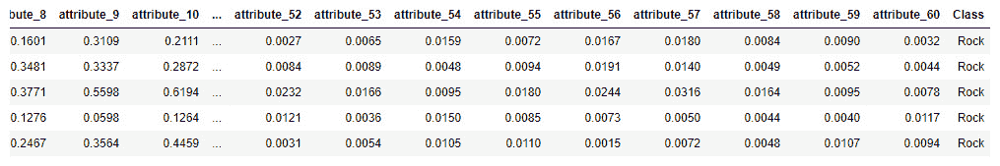

    图 2.37：sonar.csv 的内容

    可以观察到，有 60 个特征，目标变量有两个值——Rock 和 Mine。

    这意味着这是一个二元分类问题。让我们在构建神经网络之前先准备数据。

1.  分离特征和标签：

    ```py
    X_input = df.iloc[:, :-1]
    Y_label = df['Class'].values
    ```

    在这段代码中，`X_input`选择了所有列中的所有行，除了`Class`列，而`Y_label`仅选择了`Class`列。

1.  标签是文本格式的。我们需要将它们编码为数字，然后才能在模型中使用：

    ```py
    labelencoder_Y = LabelEncoder() 
    Y_label = labelencoder_Y.fit_transform(Y_label)
    Y_label = Y_label.reshape([208, 1])
    ```

    最后的 `reshape` 函数会将标签转换为矩阵格式，这是模型所期望的。

1.  使用 Keras 构建多层模型：

    ```py
    model = Sequential()
    model.add(Dense(300,input_dim=60, activation = 'relu'))
    model.add(Dense(200, activation = 'relu'))
    model.add(Dense(100, activation = 'relu'))
    model.add(Dense(1, activation = 'sigmoid'))
    ```

    你可以尝试调整层数和神经元数量，但最后一层只能有一个神经元，并使用 sigmoid 激活函数，因为这是一个二分类器。

1.  设置训练参数：

    ```py
    model.compile(optimizer='adam',loss='binary_crossentropy', \
                  metrics=['accuracy'])
    ```

1.  训练模型：

    ```py
    model.fit(X_input, Y_label, epochs=30)
    ```

    截断的输出结果大致如下：

    ```py
    Train on 208 samples
    Epoch 1/30
    208/208 [==============================] - 0s 205us/sample - 
    loss: 
      0.1849 - accuracy: 0.9038
    Epoch 2/30
    208/208 [==============================] - 0s 220us/sample – 
    loss: 
      0.1299 - accuracy: 0.9615
    Epoch 3/30
    208/208 [==============================] - 0s 131us/sample – 
    loss: 
      0.0947 - accuracy: 0.9856
    Epoch 4/30
    208/208 [==============================] - 0s 151us/sample – 
    loss: 
      0.1046 - accuracy: 0.9712
    Epoch 5/30
    208/208 [==============================] - 0s 171us/sample – 
    loss: 
      0.0952 - accuracy: 0.9663
    Epoch 6/30
    208/208 [==============================] - 0s 134us/sample – 
    loss: 
      0.0777 - accuracy: 0.9856
    Epoch 7/30
    208/208 [==============================] - 0s 129us/sample – 
    loss: 
      0.1043 - accuracy: 0.9663
    Epoch 8/30
    208/208 [==============================] - 0s 142us/sample – 
    loss: 
      0.0842 - accuracy: 0.9712
    Epoch 9/30
    208/208 [==============================] - 0s 155us/sample – 
    loss: 
      0.1209 - accuracy: 0.9423
    Epoch 10/30
    208/208 [==============================] - ETA: 0s - loss: 
      0.0540 - accuracy: 0.98 - 0s 334us/sample - los
    ```

1.  让我们评估训练好的模型并检查其准确性：

    ```py
    model.evaluate(X_input, Y_label)
    ```

    输出如下：

    ```py
    208/208 [==============================] - 0s 128us/sample – 
    loss: 
      0.0038 - accuracy: 1.0000
     [0.003758653004367191, 1.0]
    ```

    如你所见，我们成功训练了一个多层二分类神经网络，并在 30 个周期内达到了 100%的准确率。

    注意

    要访问该部分的源代码，请参考[`packt.live/38EMoDi`](https://packt.live/38EMoDi)。

    你还可以在线运行这个示例，网址为[`packt.live/2W2sygb`](https://packt.live/2W2sygb)。你必须执行整个 Notebook 才能获得预期的结果。

# 3\. 使用卷积神经网络（CNN）进行图像分类

## 活动 3.01：基于 Fashion MNIST 数据集构建多分类器

## 解决方案

1.  打开一个新的 Jupyter Notebook。

1.  从`tensorflow.keras.datasets.fashion_mnist`导入：

    ```py
    from tensorflow.keras.datasets import fashion_mnist
    ```

1.  使用`fashion_mnist.load_data()`加载 Fashion MNIST 数据集，并将结果保存到`(features_train, label_train), (features_test, label_test)`：

    ```py
    (features_train, label_train), (features_test, label_test) = \
    fashion_mnist.load_data()
    ```

1.  打印训练集的形状：

    ```py
    features_train.shape
    ```

    输出结果如下：

    ```py
    (60000, 28, 28)
    ```

    训练集包含`60000`张大小为`28`乘`28`的图像。我们需要对其进行重塑并添加通道维度。

1.  打印测试集的形状：

    ```py
    features_test.shape
    ```

    输出结果如下：

    ```py
    (10000, 28, 28)
    ```

    测试集包含`10000`张大小为`28`乘`28`的图像。我们需要对其进行重塑并添加通道维度。

1.  将训练集和测试集重塑为维度`(number_rows, 28, 28, 1)`：

    ```py
    features_train = features_train.reshape(60000, 28, 28, 1)
    features_test = features_test.reshape(10000, 28, 28, 1)
    ```

1.  创建三个变量`batch_size`、`img_height`和`img_width`，分别赋值为`16`、`28`和`28`：

    ```py
    batch_size = 16
    img_height = 28
    img_width = 28
    ```

1.  从`tensorflow.keras.preprocessing`导入`ImageDataGenerator`：

    ```py
    from tensorflow.keras.preprocessing.image \
    import ImageDataGenerator
    ```

1.  创建一个名为`train_img_gen`的`ImageDataGenerator`，并进行数据增强：`rescale=1./255, rotation_range=40, width_shift_range=0.1, height_shift_range=0.1, shear_range=0.2, zoom_range=0.2, horizontal_flip=True, fill_mode='nearest'`：

    ```py
    train_img_gen = ImageDataGenerator(rescale=1./255, \
                                       rotation_range=40, \
                                       width_shift_range=0.1, \
                                       height_shift_range=0.1, \
                                       shear_range=0.2, \
                                       zoom_range=0.2, \
                                       horizontal_flip=True, \
                                       fill_mode='nearest')
    ```

1.  创建一个名为`val_img_gen`的`ImageDataGenerator`，进行重缩放（除以 255）：

    ```py
    val_img_gen = ImageDataGenerator(rescale=1./255)
    ```

1.  创建一个名为`train_data_gen`的数据生成器，使用`.flow()`并指定批量大小、特征和来自训练集的标签：

    ```py
    train_data_gen = train_img_gen.flow(features_train, \
                                        label_train, \
                                        batch_size=batch_size)
    ```

1.  创建一个名为`val_data_gen`的数据生成器，使用`.flow()`并指定批量大小、特征和来自测试集的标签：

    ```py
    val_data_gen = train_img_gen.flow(features_test, \
                                      label_test, \
                                      batch_size=batch_size)
    ```

1.  导入`numpy`为`np`，导入`tensorflow`为`tf`，并从`tensorflow.keras`导入`layers`：

    ```py
    import numpy as np
    import tensorflow as tf
    from tensorflow.keras import layers
    ```

1.  使用`np.random_seed()`和`tf.random.set_seed()`将`8`设置为`numpy`和`tensorflow`的随机种子：

    ```py
    np.random.seed(8)
    tf.random.set_seed(8)
    ```

1.  将 `tf.keras.Sequential()` 类实例化为名为 `model` 的变量，具有以下层：具有形状为 `3` 的 `64` 个核的卷积层，`ReLU` 作为激活函数和必要的输入维度；一个最大池化层；具有形状为 `3` 的 `128` 个核的卷积层和 `ReLU` 作为激活函数；一个最大池化层；一个展平层；一个具有 `128` 单元和 `ReLU` 作为激活函数的全连接层；一个具有 `10` 单元和 `softmax` 作为激活函数的全连接层。

    代码应如下所示：

    ```py
    model = tf.keras.Sequential\
            ([layers.Conv2D(64, 3, activation='relu', \
                            input_shape=(img_height, \
                                         img_width ,1)), \
                            layers.MaxPooling2D(), \
                            layers.Conv2D(128, 3, \
                                          activation='relu'), \
                            layers.MaxPooling2D(),\
                            layers.Flatten(), \
                            layers.Dense(128, \
                                         activation='relu'), \
                            layers.Dense(10, \
                                         activation='softmax')])
    ```

1.  将 `tf.keras.optimizers.Adam()` 类实例化为名为 `optimizer` 的变量，并将学习率设置为 `0.001`：

    ```py
    optimizer = tf.keras.optimizers.Adam(0.001)
    ```

1.  使用 `.compile()` 编译神经网络，参数为 `loss='sparse_categorical_crossentropy', optimizer=optimizer, metrics=['accuracy']`：

    ```py
    model.compile(loss='sparse_categorical_crossentropy', \
                  optimizer=optimizer, metrics=['accuracy'])
    ```

1.  使用 `fit_generator()` 拟合神经网络，并提供训练和验证数据生成器，`epochs=5`，每个 epoch 的步数以及验证步数：

    ```py
    model.fit_generator(train_data_gen, \
                        steps_per_epoch=len(features_train) \
                                        // batch_size, \
                        epochs=5, \
                        validation_data=val_data_gen, \
                        validation_steps=len(features_test) \
                                         // batch_size)
    ```

    预期输出如下：

    。

您还可以在 [`packt.live/3fiyyJi`](https://packt.live/3fiyyJi) 上在线运行此示例。必须执行整个 Notebook 才能获得所需的结果。

## 活动 3.02：使用迁移学习进行水果分类

## 解决方案

1.  打开一个新的 Jupyter Notebook。

1.  导入 `tensorflow` 并将其命名为 `tf`：

    ```py
    import tensorflow as tf
    ```

1.  创建一个名为 `file_url` 的变量，其中包含指向数据集的链接：

    ```py
    file_url = 'https://github.com/PacktWorkshops'\
               '/The-Deep-Learning-Workshop'\
               '/raw/master/Chapter03/Datasets/Activity3.02'\
               '/fruits360.zip'
    ```

    注意

    在上述步骤中，我们使用的是存储在 [`packt.live/3eePQ8G`](https://packt.live/3eePQ8G) 的数据集。如果您将数据集存储在其他任何 URL，请相应更改突出显示的路径。

1.  使用 `tf.keras.get_file` 并将 `'fruits360.zip', origin=file_url, extract=True` 作为参数下载数据集，并将结果保存到名为 `zip_dir` 的变量中：

    ```py
    zip_dir = tf.keras.utils.get_file('fruits360.zip', \
                                      origin=file_url, \
                                      extract=True)
    ```

1.  导入 `pathlib` 库：

    ```py
    import pathlib
    ```

1.  使用 `pathlib.Path(zip_dir).parent` 创建一个名为 `path` 的变量，其中包含到 `fruits360_filtered` 目录的完整路径：

    ```py
    path = pathlib.Path(zip_dir).parent / 'fruits360_filtered'
    ```

1.  创建两个名为 `train_dir` 和 `validation_dir` 的变量，分别指向训练 (`Training`) 和验证 (`Test`) 文件夹的完整路径：

    ```py
    train_dir = path / 'Training'
    validation_dir = path / 'Test'
    ```

1.  创建两个名为 `total_train` 和 `total_val` 的变量，分别获取训练集和验证集的图像数量，即 `11398` 和 `4752`：

    ```py
    total_train = 11398
    total_val = 4752
    ```

1.  从 `tensorflow.keras.preprocessing` 导入 `ImageDataGenerator`：

    ```py
    from tensorflow.keras.preprocessing.image \
    import ImageDataGenerator
    ```

1.  创建一个名为`train_img_gen`的`ImageDataGenerator`，并进行数据增强：`rescale=1./255, rotation_range=40, width_shift_range=0.1, height_shift_range=0.1, shear_range=0.2, zoom_range=0.2, horizontal_flip=True, fill_mode='nearest'`：

    ```py
    train_img_gen = ImageDataGenerator(rescale=1./255, \
                                       rotation_range=40, \
                                       width_shift_range=0.1, \
                                       height_shift_range=0.1, \
                                       shear_range=0.2, \
                                       zoom_range=0.2, \
                                       horizontal_flip=True, \
                                       fill_mode='nearest')
    ```

1.  创建一个名为`val_img_gen`的`ImageDataGenerator`，并进行重新缩放（通过除以 255）：

    ```py
    val_img_gen = ImageDataGenerator(rescale=1./255)
    ```

1.  创建四个变量，分别为`batch_size`、`img_height`、`img_width`和`channel`，其值分别为`16`、`100`、`100`和`3`：

    ```py
    batch_size=16
    img_height = 100
    img_width = 100
    channel = 3
    ```

1.  使用`.flow_from_directory()`创建一个名为`train_data_gen`的数据生成器，并指定批量大小、训练文件夹和目标尺寸：

    ```py
    train_data_gen = train_image_generator.flow_from_directory\
                     (batch_size=batch_size, \
                     directory=train_dir, \
                     target_size=(img_height, img_width))
    ```

1.  使用`.flow_from_directory()`创建一个名为`val_data_gen`的数据生成器，并指定批量大小、验证文件夹和目标尺寸：

    ```py
    val_data_gen = validation_image_generator.flow_from_directory\
                   (batch_size=batch_size, \
                   directory=validation_dir, \
                   target_size=(img_height, img_width))
    ```

1.  导入`numpy`为`np`，`tensorflow`为`tf`，以及从`tensorflow.keras`导入`layers`：

    ```py
    import numpy as np
    import tensorflow as tf
    from tensorflow.keras import layers
    ```

1.  使用`np.random_seed()`和`tf.random.set_seed()`将`8`设置为`numpy`和`tensorflow`的种子：

    ```py
    np.random.seed(8)
    tf.random.set_seed(8)
    ```

1.  从`tensorflow.keras.applications`导入`VGG16`：

    ```py
    from tensorflow.keras.applications import VGG16
    ```

1.  使用以下参数将`VGG16`模型实例化为一个名为`base_model`的变量：

    ```py
    base_model = VGG16(input_shape=(img_height, \
                                    img_width, channel), \
                                    weights='imagenet', \
                                    include_top=False)
    ```

1.  使用`.trainable`属性将此模型设置为不可训练：

    ```py
    base_model.trainable = False
    ```

1.  打印此`VGG16`模型的摘要：

    ```py
    base_model.summary()
    ```

    预期的输出将如下所示：

    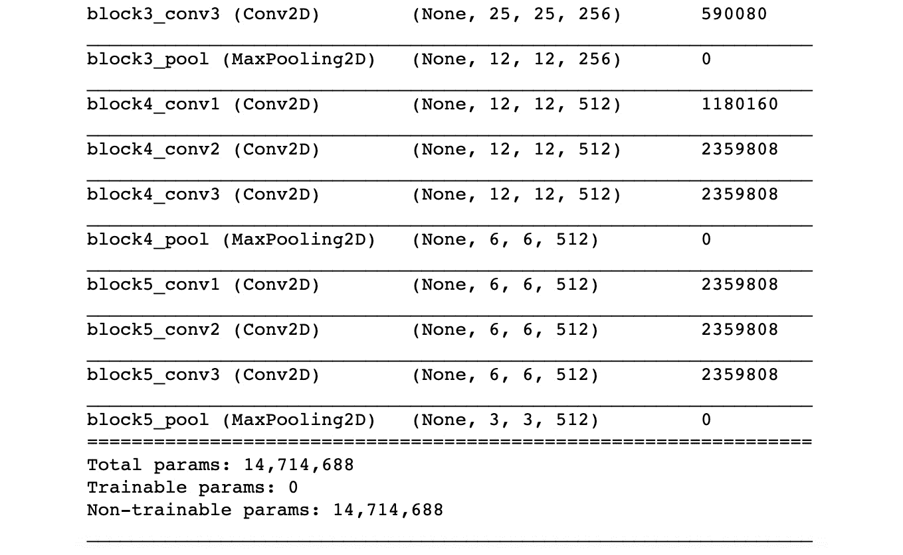

    图 3.31：模型概述

    此输出显示了`VGG16`的架构。我们可以看到总共有`14,714,688`个参数，但没有可训练的参数。这是预期的，因为我们已经冻结了模型的所有层。

1.  使用`tf.keras.Sequential()`创建一个新模型，通过添加基础模型和以下层：`Flatten()`、`Dense(1000, activation='relu')`以及`Dense(120, activation='softmax')`。将此模型保存到名为`model`的变量中：

    ```py
    model = tf.keras.Sequential([base_model, \
                                 layers.Flatten(), \
                                 layers.Dense(1000, \
                                              activation='relu'), \
                                 layers.Dense(120, \
                                              activation='softmax')])
    ```

1.  使用`0.001`作为学习率实例化`tf.keras.optimizers.Adam()`类，并将其保存到名为`optimizer`的变量中：

    ```py
    optimizer = tf.keras.optimizers.Adam(0.001)
    ```

1.  使用`.compile()`编译神经网络，设置`loss='categorical_crossentropy', optimizer=optimizer, metrics=['accuracy']`：

    ```py
    model.compile(loss='categorical_crossentropy', \
                  optimizer=optimizer, metrics=['accuracy'])
    ```

1.  使用`fit_generator()`训练神经网络，并提供训练和验证数据生成器、`epochs=5`、每个 epoch 的步数以及验证步数。此模型的训练可能需要几分钟时间：

    ```py
    model.fit_generator(train_data_gen, \
                        steps_per_epoch=len(features_train) \
                                        // batch_size, \
                        epochs=5, \
                        validation_data=val_data_gen, \
                        validation_steps=len(features_test) \
                                         // batch_size)
    ```

    预期的输出将如下所示：

    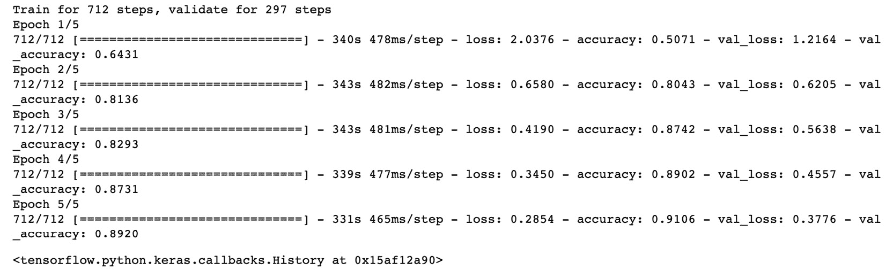

图 3.32：预期输出

在这里，我们使用迁移学习对预训练的`VGG16`模型进行定制，以便其适应我们的水果分类数据集。我们用自己的全连接层替换了模型的头部，并在五个 epoch 上训练了这些层。我们在训练集上获得了`0.9106`的准确率，在测试集上获得了`0.8920`的准确率。考虑到训练此模型所用的时间和硬件，这些结果相当显著。你可以尝试微调此模型，看看是否能获得更好的分数。

注意

若要访问此特定部分的源代码，请参阅[`packt.live/2DsVRCl`](https://packt.live/2DsVRCl)。

本节目前没有在线交互示例，需要在本地运行。

# 4. 深度学习文本 - 词嵌入

## 活动 4.01：‘爱丽丝梦游仙境’文本的预处理

## 解决方案

你需要执行以下步骤：

注意

在开始这个活动之前，请确保你已经定义了`alice_raw`变量，正如在*使用 NLTK 下载文本语料库*这一节中所示。

1.  将数据转换为小写并拆分成句子：

    ```py
    txt_sents = tokenize.sent_tokenize(alice_raw.lower())
    ```

1.  对句子进行分词：

    ```py
    txt_words = [tokenize.word_tokenize(sent) for sent in txt_sents]
    ```

1.  从`string`模块导入`punctuation`，从 NLTK 导入`stopwords`：

    ```py
    from string import punctuation
    stop_punct = list(punctuation)
    from nltk.corpus import stopwords
    stop_nltk = stopwords.words("english")
    ```

1.  创建一个变量来存储上下文停用词`--`和`said`：

    ```py
    stop_context = ["--", "said"]
    ```

1.  创建一个主列表，用于去除包含标点符号、NLTK 停用词和上下文停用词的词语：

    ```py
    stop_final = stop_punct + stop_nltk + stop_context
    ```

1.  定义一个函数，从任何输入句子（已分词）中删除这些标记：

    ```py
    def drop_stop(input_tokens):
        return [token for token in input_tokens \
                if token not in stop_final]
    ```

1.  从分词后的文本中删除`stop_final`中的词语：

    ```py
    alice_words_nostop = [drop_stop(sent) for sent in txt_words]
    print(alice_words_nostop[:2])
    ```

    下面是前两句的样子：

    ```py
    [['alice', "'s", 'adventures', 'wonderland', 'lewis', 'carroll', '1865', 'chapter', 'i.', 'rabbit-hole', 'alice', 'beginning', 'get', 'tired', 'sitting', 'sister', 'bank', 'nothing', 'twice', 'peeped', 'book', 'sister', 'reading', 'pictures', 'conversations', "'and", 'use', 'book', 'thought', 'alice', "'without", 'pictures', 'conversation'], ['considering', 'mind', 'well', 'could', 'hot', 'day', 'made', 'feel', 'sleepy', 'stupid', 'whether', 'pleasure', 'making', 'daisy-chain', 'would', 'worth', 'trouble', 'getting', 'picking', 'daisies', 'suddenly', 'white', 'rabbit', 'pink', 'eyes', 'ran', 'close']]
    ```

1.  使用 NLTK 的`PorterStemmer`算法，对结果进行词干提取。打印出前五个句子：

    ```py
    from nltk.stem import PorterStemmer
    stemmer_p = PorterStemmer()
    alice_words_stem = [[stemmer_p.stem(token) for token in sent] \
                         for sent in alice_words_nostop]
    print(alice_words_stem[:5])
    ```

    输出结果如下：

    ```py
    [['alic', "'s", 'adventur', 'wonderland', 'lewi', 'carrol', '1865', 'chapter', 'i.', 'rabbit-hol', 'alic', 'begin', 'get', 'tire', 'sit', 'sister', 'bank', 'noth', 'twice', 'peep', 'book', 'sister', 'read', 'pictur', 'convers', "'and", 'use', 'book', 'thought', 'alic', "'without", 'pictur', 'convers'], ['consid', 'mind', 'well', 'could', 'hot', 'day', 'made', 'feel', 'sleepi', 'stupid', 'whether', 'pleasur', 'make', 'daisy-chain', 'would', 'worth', 'troubl', 'get', 'pick', 'daisi', 'suddenli', 'white', 'rabbit', 'pink', 'eye', 'ran', 'close'], ['noth', 'remark', 'alic', 'think', 'much', 'way', 'hear', 'rabbit', 'say', "'oh", 'dear'], ['oh', 'dear'], ['shall', 'late']]
    ```

    注意

    要访问这一部分的源代码，请参阅[`packt.live/2VVNEgf`](https://packt.live/2VVNEgf)。

    你也可以在线运行这个示例，网址是[`packt.live/38Gr54r`](https://packt.live/38Gr54r)。你必须执行整个笔记本才能得到预期的结果。

## 活动 4.02：‘爱丽丝梦游仙境’的文本表示

## 解决方案

你需要执行以下步骤：

1.  从*活动 4.01*，*‘爱丽丝梦游仙境’文本预处理*中，打印删除停用词后的前三个句子。这是你将要处理的数据：

    ```py
    print(alice_words_nostop[:3])
    ```

    输出结果如下：

    ```py
    [['alice', "'s", 'adventures', 'wonderland', 'lewis', 'carroll', '1865', 'chapter', 'i.', 'rabbit-hole', 'alice', 'beginning', 'get', 'tired', 'sitting', 'sister', 'bank', 'nothing', 'twice', 'peeped', 'book', 'sister', 'reading', 'pictures', 'conversations', "'and", 'use', 'book', 'thought', 'alice', "'without", 'pictures', 'conversation'], ['considering', 'mind', 'well', 'could', 'hot', 'day', 'made', 'feel', 'sleepy', 'stupid', 'whether', 'pleasure', 'making', 'daisy-chain', 'would', 'worth', 'trouble', 'getting', 'picking', 'daisies', 'suddenly', 'white', 'rabbit', 'pink', 'eyes', 'ran', 'close'], ['nothing', 'remarkable', 'alice', 'think', 'much', 'way', 'hear', 'rabbit', 'say', "'oh", 'dear']]
    ```

1.  从 Gensim 导入`word2vec`并使用默认参数训练词向量：

    ```py
    from gensim.models import word2vec
    model = word2vec.Word2Vec(alice_words_nostop)
    ```

1.  找到与`rabbit`最相似的`5`个词：

    ```py
    model.wv.most_similar("rabbit", topn=5)
    ```

    输出结果如下：

    ```py
    [('alice', 0.9963310360908508),
     ('little', 0.9956872463226318),
     ('went', 0.9955698251724243),
     ("'s", 0.9955658912658691),
     ('would', 0.9954401254653931)]
    ```

1.  使用`window`大小为`2`，重新训练词向量：

    ```py
    model = word2vec.Word2Vec(alice_words_nostop, window=2)
    ```

1.  找到与`rabbit`最相似的词：

    ```py
    model.wv.most_similar("rabbit", topn=5)
    ```

    输出结果如下：

    ```py
    [('alice', 0.9491485357284546),
     ("'s", 0.9364748001098633),
     ('little', 0.9345826506614685),
     ('large', 0.9341927170753479),
     ('duchess', 0.9341296553611755)]
    ```

1.  使用窗口大小为`5`的 Skip-gram 方法重新训练词向量：

    ```py
    model = word2vec.Word2Vec(alice_words_nostop, window=5, sg=1)
    ```

1.  找到与`rabbit`最相似的词：

    ```py
    model.wv.most_similar("rabbit", topn=5)
    ```

    输出结果如下：

    ```py
    [('gardeners', 0.9995723366737366),
     ('end', 0.9995588064193726),
     ('came', 0.9995309114456177),
     ('sort', 0.9995298385620117),
     ('upon', 0.9995272159576416)]
    ```

1.  通过平均`white`和`rabbit`的词向量，找到`white rabbit`的表示：

    ```py
    v1 = model.wv['white']
    v2 = model.wv['rabbit']
    res1 = (v1+v2)/2
    ```

1.  通过平均`mad`和`hatter`的词向量，找到`mad hatter`的表示：

    ```py
    v1 = model.wv['mad']
    v2 = model.wv['hatter']
    res2 = (v1+v2)/2
    ```

1.  计算这两个短语之间的余弦相似度：

    ```py
    model.wv.cosine_similarities(res1, [res2])
    ```

    这给我们以下的值：

    ```py
    array([0.9996213], dtype=float32)
    ```

1.  使用格式化的键值向量加载预训练的 100 维 GloVe 词向量：

    ```py
    from gensim.models.keyedvectors import KeyedVectors
    glove_model = KeyedVectors.load_word2vec_format\
    ("glove.6B.100d.w2vformat.txt", binary=False)
    ```

1.  找到`white rabbit`和`mad hatter`的表示：

    ```py
    v1 = glove_model['white']
    v2 = glove_model['rabbit']
    res1 = (v1+v2)/2
    v1 = glove_model['mad']
    v2 = glove_model['hatter']
    res2 = (v1+v2)/2
    ```

1.  计算这两个短语之间的`cosine`相似度。`cosine`相似度有变化吗？

    ```py
    glove_model.cosine_similarities(res1, [res2])
    ```

    以下是前面代码的输出结果：

    ```py
    array([0.4514577], dtype=float32)
    ```

在这里，我们可以看到，两个短语 "`mad hatter`" 和 "`white rabbit`" 之间的余弦相似度在 GloVe 模型中较低。这是因为 GloVe 模型在其训练数据中看到这些术语的次数没有书中那么多。在书中，`mad` 和 `hatter` 经常一起出现，因为它们组成了一个重要角色的名字。当然，在其他上下文中，我们不会经常看到 `mad` 和 `hatter` 一起出现。

注意

要访问此特定部分的源代码，请参考 [`packt.live/2VVNEgf`](https://packt.live/2VVNEgf)。

本节目前没有在线互动示例，需在本地运行。

# 5. 深度学习与序列

## 活动 5.01：使用普通 RNN 模型预测 IBM 股票价格

## 解决方案

1.  导入必要的库，加载 `.csv` 文件，反转索引，并绘制时间序列（`Close` 列）以进行可视化检查：

    ```py
    import pandas as pd, numpy as np
    import matplotlib.pyplot as plt
    inp0 = pd.read_csv("IBM.csv")
    inp0 = inp0.sort_index(ascending=False)
    inp0.plot("Date", "Close")
    plt.show()
    ```

    输出将如下所示，收盘价绘制在 *Y 轴* 上：

    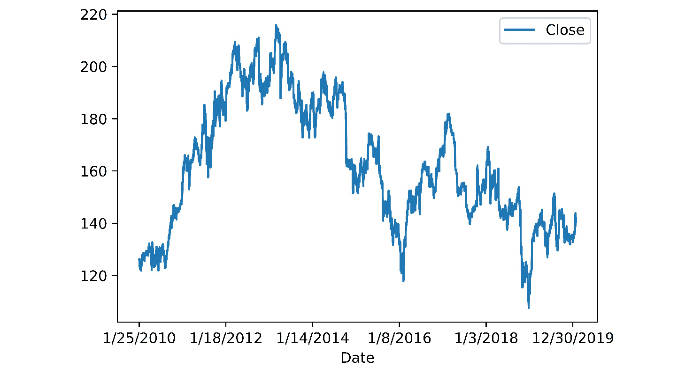

    图 5.40：IBM 股票价格趋势

1.  从 DataFrame 中提取 `Close` 值作为 `numpy` 数组，并使用 `matplotlib` 绘制它们：

    ```py
    ts_data = inp0.Close.values.reshape(-1,1)
    plt.figure(figsize=[14,5])
    plt.plot(ts_data)
    plt.show()
    ```

    结果趋势如下，索引绘制在 *X 轴* 上：

    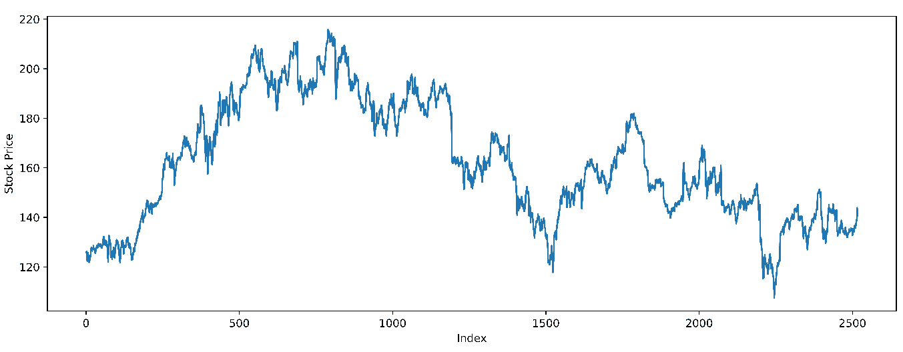

    图 5.41：股票价格数据可视化

1.  将最后 25% 的数据分配为测试数据，前 75% 的数据分配为训练数据：

    ```py
    train_recs = int(len(ts_data) * 0.75)
    train_data = ts_data[:train_recs]
    test_data = ts_data[train_recs:]
    len(train_data), len(test_data)
    ```

    输出将如下所示：

    ```py
    (1888, 630)
    ```

1.  使用 `sklearn` 中的 `MinMaxScaler`，对训练数据和测试数据进行缩放：

    ```py
    from sklearn.preprocessing import MinMaxScaler
    scaler = MinMaxScaler()
    train_scaled = scaler.fit_transform(train_data)
    test_scaled = scaler.transform(test_data)
    ```

1.  使用我们在本章前面定义的 `get_lookback` 函数（参见 *准备股票价格预测数据* 部分），使用 10 的回溯期获取训练集和测试集的回溯数据：

    ```py
    look_back = 10
    trainX, trainY = get_lookback(train_scaled, look_back=look_back)
    testX, testY = get_lookback(test_scaled, look_back= look_back)
    trainX.shape, testX.shape
    ```

    输出将如下所示：

    ```py
    ((1888, 10), (630, 10))
    ```

1.  从 Keras 中导入所有必要的层，用于使用普通 RNN（`SimpleRNN`、`Activation`、`Dropout`、`Dense` 和 `Reshape`）和 1D 卷积（Conv1D）。同时从 `sklearn` 导入 `mean_squared_error` 度量：

    ```py
    from tensorflow.keras.models import Sequential
    from tensorflow.keras.layers import SimpleRNN, Activation, Dropout, Dense, Reshape, Conv1D
    from sklearn.metrics import mean_squared_error
    ```

1.  使用一个包含 5 个 3x3 卷积核的 1D 卷积层和一个包含 32 个神经元的 RNN 层构建模型。在 RNN 层后添加 25% 的 dropout。打印模型摘要：

    ```py
    model_comb = Sequential()
    model_comb.add(Reshape((look_back,1), \
                            input_shape = (look_back,)))
    model_comb.add(Conv1D(5, 3, activation='relu'))
    model_comb.add(SimpleRNN(32))
    model_comb.add(Dropout(0.25))
    model_comb.add(Dense(1))
    model_comb.add(Activation('linear'))
    model.summary()
    ```

    输出将如下所示：

    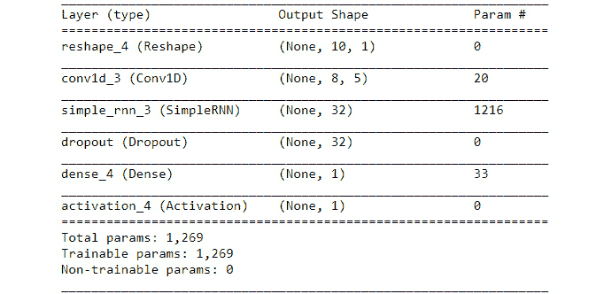

    图 5.42：模型摘要

1.  使用 `mean_squared_error` 损失函数和 `adam` 优化器编译模型。在训练数据上进行五个周期的训练，验证集占 10%，批量大小为 1：

    ```py
    model_comb.compile(loss='mean_squared_error', \
                       optimizer='adam')
    model_comb.fit(trainX, trainY, epochs=5, \
                   batch_size=1, verbose=2, \
                   validation_split=0.1)
    ```

    输出将如下所示：

    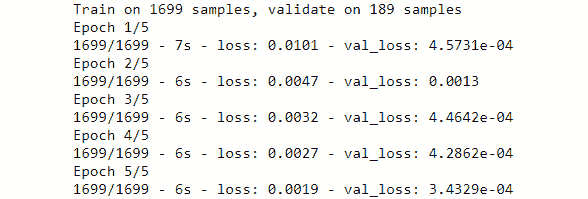

    图 5.43：训练和验证损失

1.  使用 `get_model_perf` 方法，打印模型的 RMSE：

    ```py
    get_model_perf(model_comb)
    ```

    输出将如下所示：

    ```py
    Train RMSE: 0.03 RMSE
    Test RMSE: 0.03 RMSE
    ```

1.  绘制预测结果——整体视图和放大视图：

    ```py
    %matplotlib notebook
    plt.figure(figsize=[10,5])
    plot_pred(model_comb)
    ```

    我们应该看到以下的预测图（虚线）与实际值图（实线）对比：

    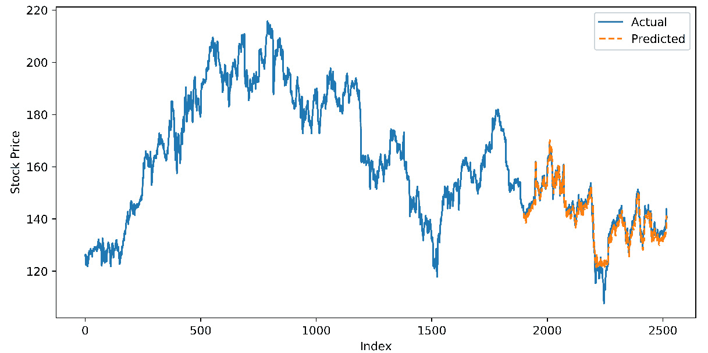

图 5.44：预测值与实际值的对比

放大的视图如下：

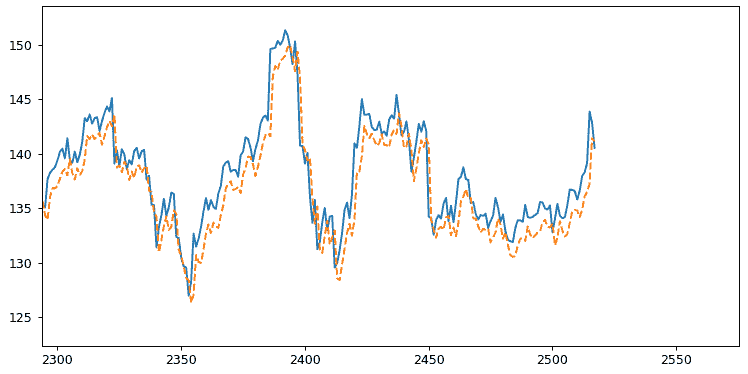

图 5.45：预测值（虚线）与实际值（实线）对比——详细视图

我们可以看到，模型在捕捉细微的模式上做得非常出色，并且在预测每日股票价格方面表现非常好。

注意

若要访问本节的源代码，请参阅 [`packt.live/2ZctArW`](https://packt.live/2ZctArW)。

你还可以在线运行此示例，网址为 [`packt.live/38EDOEA`](https://packt.live/38EDOEA)。你必须执行整个 Notebook 才能获得预期的结果。

# 6. LSTM、GRU 及高级 RNN

## 活动 6.01：亚马逊产品评论的情感分析

## 解决方案

1.  读取 `train` 和 `test` 数据集的文件。检查数据集的形状，并打印出 `train` 数据的前 `5` 条记录：

    ```py
    import pandas as pd, numpy as np
    import matplotlib.pyplot as plt
    %matplotlib inline
    train_df = pd.read_csv("Amazon_reviews_train.csv")
    test_df = pd.read_csv("Amazon_reviews_test.csv")
    print(train_df.shape, train_df.shape)
    train_df.head(5)
    ```

    数据集的形状和头部信息如下：

    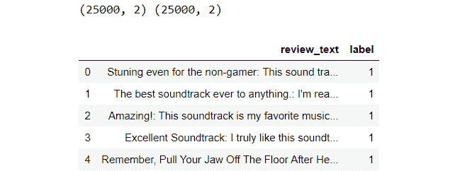

    图 6.26：训练数据集中的前五条记录

1.  为了方便处理，在处理时将原始文本和标签从 `train` 和 `test` 数据集中分开。你应该有 `4` 个变量，如下：`train_raw` 包含训练数据的原始文本，`train_labels` 包含训练数据的标签，`test_raw` 包含测试数据的原始文本，`test_labels` 包含测试数据的标签。打印出 `train` 文本中的前两条评论。

    ```py
    train_raw = train_df.review_text.values
    train_labels = train_df.label.values
    test_raw = test_df.review_text.values
    test_labels = test_df.label.values
    train_raw[:2]
    ```

    前述代码的输出结果如下：

    

    图 6.27：来自训练数据集的原始文本

1.  使用 NLTK 的 `word_tokenize` 来规范化大小写并对测试和训练文本进行分词（当然，记得先导入它——提示：使用列表推导式使代码更简洁）。如果你之前没有使用过分词器，可以从 `nltk` 下载 `punkt`。打印训练数据集中的第一条评论，检查分词是否正常工作。

    ```py
    import nltk
    nltk.download('punkt')
    from nltk.tokenize import word_tokenize
    train_tokens = [word_tokenize(review.lower()) \
                    for review in train_raw]
    test_tokens = [word_tokenize(review.lower()) \
                   for review in test_raw]
    print(train_tokens[0])
    ```

    分词后的数据如下所示：

    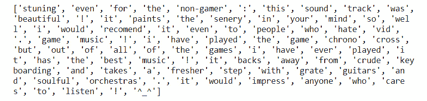

    图 6.28：来自 `train` 数据集的分词评论

1.  导入任何停用词（内建于 NLTK）和来自 string 模块的标点符号。定义一个函数（`drop_stop`）来从任何输入的分词句子中移除这些标记。如果你之前没有使用过 `stopwords`，可以从 NLTK 下载它：

    ```py
    from string import punctuation
    stop_punct = list(punctuation)
    nltk.download("stopwords")
    from nltk.corpus import stopwords
    stop_nltk = stopwords.words("english")
    stop_final = stop_punct + stop_nltk
    def drop_stop(input_tokens):
        return [token for token in input_tokens \
                if token not in stop_final]
    ```

1.  使用定义的函数（`drop_stop`）从 `train` 和 `test` 文本中移除多余的停用词。打印出处理后的 `train` 文本中的第一条评论，检查该函数是否有效：

    ```py
    train_tokens_no_stop = [drop_stop(sent) \
                            for sent in train_tokens]
    test_tokens_no_stop = [drop_stop(sent) \
                           for sent in test_tokens]
    print(train_tokens_no_stop[0])
    ```

    我们将得到如下输出：

    ```py
    ['stuning', 'even', 'non-gamer', 'sound', 'track', 'beautiful', 
     'paints', 'senery', 'mind', 'well', 'would', 'recomend', 'even', 
     'people', 'hate', 'vid', 'game', 'music', 'played', 'game', 
     'chrono', 'cross', 'games', 'ever', 'played', 'best', 'music', 
     'backs', 'away', 'crude', 'keyboarding', 'takes', 'fresher', 
     'step', 'grate', 'guitars', 'soulful', 'orchestras', 'would', 
     'impress', 'anyone', 'cares', 'listen', '^_^']
    ```

1.  使用 NLTK 的 `PorterStemmer` 对 `train` 和 `test` 数据的标记进行词干提取：

    ```py
    from nltk.stem import PorterStemmer
    stemmer_p = PorterStemmer()
    train_tokens_stem = [[stemmer_p.stem(token) for token in sent] \
                         for sent in train_tokens_no_stop]
    test_tokens_stem = [[stemmer_p.stem(token) for token in sent] \
                         for sent in test_tokens_no_stop]
    print(train_tokens_stem[0])
    ```

    结果应按如下方式打印：

    ```py
    ['stune', 'even', 'non-gam', 'sound', 'track', 'beauti', 'paint', 
     'seneri', 'mind', 'well', 'would', 'recomend', 'even', 'peopl', 
     'hate', 'vid', 'game', 'music', 'play', 'game', 'chrono', 'cross', 
     'game', 'ever', 'play', 'best', 'music', 'back', 'away', 'crude', 
     'keyboard', 'take', 'fresher', 'step', 'grate', 'guitar', 'soul', 
     'orchestra', 'would', 'impress', 'anyon', 'care', 'listen', '^_^']
    ```

1.  为 `train` 和 `text` 评论创建字符串。这将帮助我们使用 Keras 中的工具来创建和填充序列。创建 `train_texts` 和 `test_texts` 变量。打印处理后的 `train` 数据中的第一条评论，以确认这一点：

    ```py
    train_texts = [" ".join(txt) for txt in train_tokens_stem]
    test_texts = [" ".join(txt) for txt in test_tokens_stem]
    print(train_texts[0])
    ```

    上述代码的结果如下：

    ```py
    stune even non-gam sound track beauti paint seneri mind well would recommend even peopl hate vid game music play game chrono cross game ever play best music back away crude keyboard take fresher step grate guitar soul orchestra would impress anyon care listen ^_^
    ```

1.  从 Keras 的文本预处理工具（`keras.preprocessing.text`）中导入 `Tokenizer` 模块。定义一个 `10000` 的词汇量大小，并使用此词汇量实例化 tokenizer：

    ```py
    from tensorflow.keras.preprocessing.text import Tokenizer
    vocab_size = 10000
    tok = Tokenizer(num_words=vocab_size)
    ```

1.  在 `train` 文本上拟合 tokenizer。这与 *第四章 深度学习用于文本 – 嵌入* 中的 `CountVectorizer` 类似，并训练词汇表。拟合后，使用 tokenizer 的 `texts_to_sequences` 方法对 `train` 和 `test` 数据集进行处理，生成它们的序列。打印训练数据中第一条评论的序列：

    ```py
    tok.fit_on_texts(train_texts)
    train_sequences = tok.texts_to_sequences(train_texts)
    test_sequences = tok.texts_to_sequences(test_texts)
    print(train_sequences[0])
    ```

    编码后的序列如下：

    ```py
     [22, 514, 7161, 85, 190, 184, 1098, 283, 20, 11, 1267, 22, 
      56, 370, 9682, 114, 41, 71, 114, 8166, 1455, 114, 51, 71, 
      29, 41, 58, 182, 2931, 2153, 75, 8167, 816, 2666, 829, 719, 
      3871, 11, 483, 120, 268, 110]
    ```

1.  我们需要找到处理模型的序列的最佳长度。获取 `train` 数据集中评论的长度列表，并绘制长度的直方图：

    ```py
    seq_lens = [len(seq) for seq in train_sequences]
    plt.hist(seq_lens)
    plt.show()
    ```

    长度分布如下：

    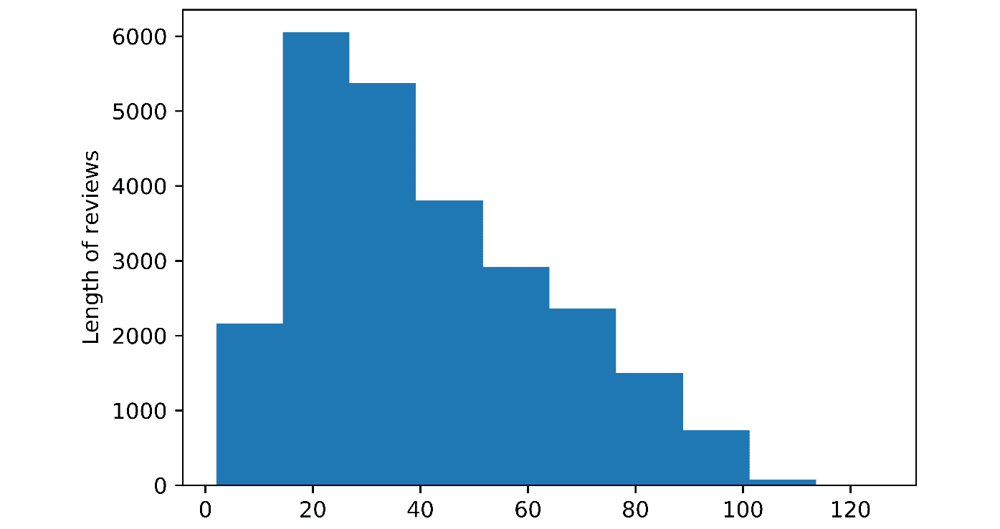

    图 6.29: 文本长度直方图

1.  现在，数据与我们在本章中使用的 IMDb 数据格式相同。使用 `100` 的序列长度（定义 `maxlen = 100` 变量），并使用 Keras 的预处理工具（`keras.preprocessing.sequence`）中的 `pad_sequences` 方法，将 `train` 和 `test` 数据的序列限制为 `100`。检查训练数据结果的形状：

    ```py
    maxlen = 100
    from tensorflow.keras.preprocessing.sequence import pad_sequences
    X_train = pad_sequences(train_sequences, maxlen=maxlen)
    X_test = pad_sequences(test_sequences, maxlen=maxlen)
    X_train.shape
    ```

    形状如下：

    ```py
    (25000, 100)
    ```

1.  要构建模型，从 Keras 导入所有必要的层（`embedding`，`spatial dropout`，`LSTM`，`dropout` 和 `dense`），并导入 `Sequential` 模型。初始化 `Sequential` 模型：

    ```py
    from tensorflow.keras.models import Sequential
    from tensorflow.keras.layers import Dense, Embedding, SpatialDropout1D, Dropout, GRU, LSTM
    model_lstm = Sequential()
    ```

1.  添加一个 `32` 维向量大小（`output_dim`）的嵌入层。添加一个 `40%` 丢弃率的空间丢弃层：

    ```py
    model_lstm.add(Embedding(vocab_size, output_dim=32))
    model_lstm.add(SpatialDropout1D(0.4))
    ```

1.  构建一个具有 `2` 层，每层 `64` 个单元的堆叠 LSTM 模型。添加一个 `40%` 丢弃率的 dropout 层：

    ```py
    model_lstm.add(LSTM(64, return_sequences=True))
    model_lstm.add(LSTM(64, return_sequences=False))
    model_lstm.add(Dropout(0.4))
    ```

1.  添加一个具有 `32` 个神经元的 dense 层，使用 `relu` 激活函数，然后是一个 `50%` 丢弃率的 dropout 层，接着是另一个具有 `32` 个神经元的 dense 层，使用 `relu` 激活函数，最后再添加一个丢弃率为 `50%` 的 dropout 层：

    ```py
    model_lstm.add(Dense(32, activation='relu'))
    model_lstm.add(Dropout(0.5))
    model_lstm.add(Dense(32, activation='relu'))
    model_lstm.add(Dropout(0.5))
    ```

1.  添加一个最终的 dense 层，包含一个具有 `sigmoid` 激活函数的神经元，并编译模型。打印模型摘要：

    ```py
    model_lstm.add(Dense(1, activation='sigmoid'))
    model_lstm.compile(loss='binary_crossentropy', \
                       optimizer='rmsprop', \
                       metrics=['accuracy'])
    model_lstm.summary()
    ```

    模型的摘要如下：

    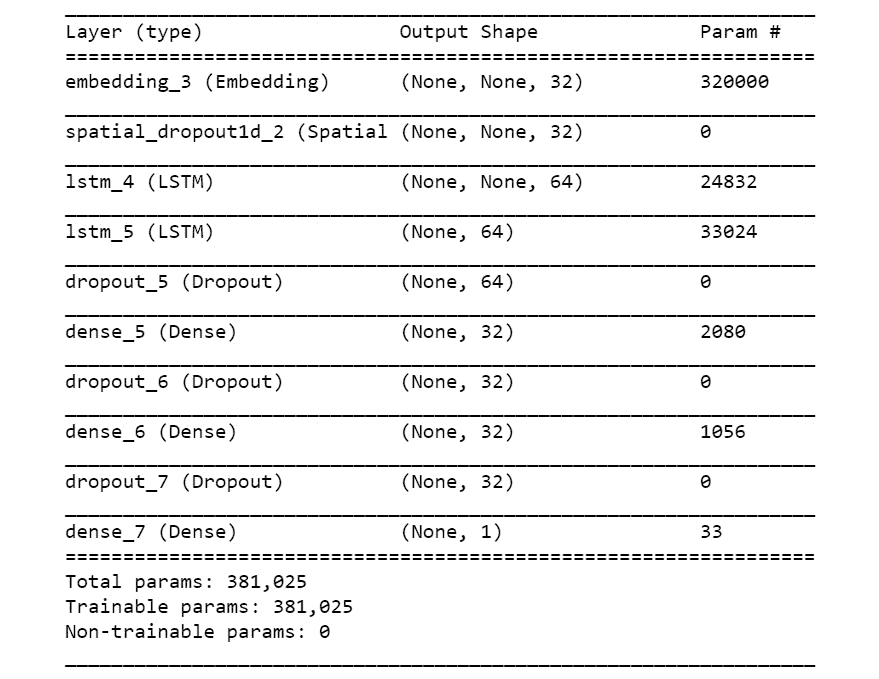

    图 6.30: 堆叠 LSTM 模型摘要

1.  使用 `20%` 的验证集拆分和 `128` 的批量大小在训练数据上拟合模型。训练 `5` 个 `epochs`：

    ```py
    history_lstm = model_lstm.fit(X_train, train_labels, \
                                  batch_size=128, \
                                  validation_split=0.2, \
                                  epochs = 5)
    ```

    我们将获得以下训练输出：

    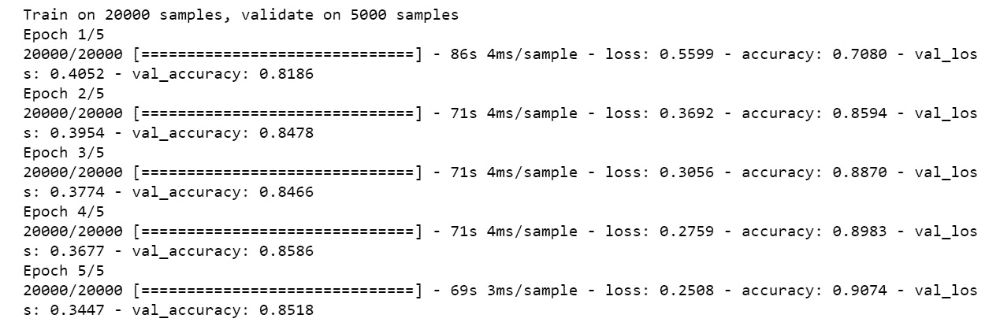

    图 6.31: 堆叠 LSTM 模型训练输出

1.  使用模型的 `predict_classes` 方法对测试集进行预测。然后，打印混淆矩阵：

    ```py
    from sklearn.metrics import accuracy_score, confusion_matrix
    test_pred = model_lstm.predict_classes(X_test)
    print(confusion_matrix(test_labels, test_pred))
    ```

    我们将获得以下结果：

    ```py
    [[10226,  1931],
     [ 1603, 11240]]
    ```

1.  使用`scikit-learn`中的`accuracy_score`方法，计算测试集的准确率。

    ```py
    print(accuracy_score(test_labels, test_pred))
    ```

    我们得到的准确率是：

    ```py
    0.85864
    ```

如我们所见，准确率约为 `86%`，并且查看混淆矩阵（*步骤 18*的输出），模型在预测两类时都做得相当不错。我们在没有进行任何超参数调优的情况下得到了这个准确率。你可以调整超参数，以获得显著更高的准确率。

注意

要访问该特定部分的源代码，请参考[`packt.live/3fpo0YI`](https://packt.live/3fpo0YI)。

你也可以在 [`packt.live/2Wi75QH`](https://packt.live/2Wi75QH) 上在线运行这个例子。你必须执行整个 Notebook，才能得到所需的结果。

# 7. 生成对抗网络

## 活动 7.01：为 MNIST 时尚数据集实现 DCGAN

## 解决方案

1.  打开一个新的 Jupyter Notebook，并将其命名为`Activity 7.01`。导入以下库包：

    ```py
    # Import the required library functions
    import numpy as np
    import matplotlib.pyplot as plt
    from matplotlib import pyplot
    import tensorflow as tf
    from tensorflow.keras.layers import Input
    from tensorflow.keras.initializers import RandomNormal
    from tensorflow.keras.models import Model, Sequential
    from tensorflow.keras.layers \
    import Reshape, Dense, Dropout, Flatten,Activation
    from tensorflow.keras.layers import LeakyReLU,BatchNormalization
    from tensorflow.keras.layers import Conv2D, UpSampling2D,Conv2DTranspose
    from tensorflow.keras.datasets import fashion_mnist
    from tensorflow.keras.optimizers import Adam
    ```

1.  创建一个函数，用于从时尚 MNIST 数据中生成真实数据样本：

    ```py
    # Function to generate real data samples
    def realData(batch):
        # Get the MNIST data 
        (X_train, _), (_, _) = fashion_mnist.load_data()
        # Reshaping the input data to include channel
        X = X_train[:,:,:,np.newaxis]
        # normalising the data to be between 0 and 1
        X = (X.astype('float32') - 127.5)/127.5
        # Generating a batch of data
        imageBatch = X[np.random.randint(0, X.shape[0], \
                                         size=batch)]
        return imageBatch
    ```

    该函数的输出是 MNIST 数据批次。请注意，我们通过减去`127.5`（这是最大像素值的一半）并除以相同的值来规范化输入数据。这有助于更快地收敛解决方案。

1.  现在，让我们从 MNIST 数据集生成一组图像：

    ```py
    # Generating a set of  sample images 
    fashionData = realData(25)
    ```

    你应该得到以下输出：

    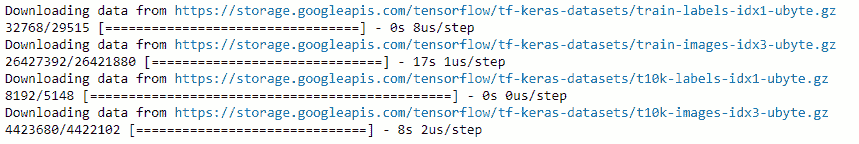

    图 7.36：从 MNIST 生成图像

1.  现在，让我们使用`matplotlib`来可视化这些图像：

    ```py
     # for j in range(5*5):
        pyplot.subplot(5,5,j+1)
        # turn off axis 
        pyplot.axis('off') 
        pyplot.imshow(fashionData[j,:,:,0],cmap='gray_r')
    ```

    你应该得到一个类似于这里所示的输出：

    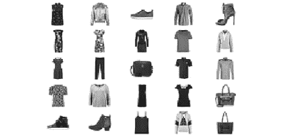

    图 7.37：绘制的图像

    从输出中，我们可以看到几件时尚商品的可视化。我们可以看到这些图像位于白色背景的中央。这些图像就是我们将尝试重建的对象。

1.  现在，让我们定义生成生成器网络输入的函数。输入是从随机均匀分布中生成的随机数据点：

    ```py
    # Function to generate inputs for generator function
    def fakeInputs(batch,infeats):
        # Generate random noise data with shape (batch,input features)
        x_fake = np.random.uniform(-1,1,size=[batch,infeats])
        return x_fake
    ```

    这个函数生成的是从随机分布中采样的假数据作为输出。

1.  让我们定义一个构建生成器网络的函数：

    ```py
    Activity7.01.ipynb
    # Function for the generator model
    def genModel(infeats):
        # Defining the Generator model
        Genmodel = Sequential()
        Genmodel.add(Dense(512,input_dim=infeats))
        Genmodel.add(Activation('relu'))
        Genmodel.add(BatchNormalization())
        # second layer of FC => RElu => BN layers
        Genmodel.add(Dense(7*7*64))
        Genmodel.add(Activation('relu'))
        Genmodel.add(BatchNormalization())
    The complete code for this step can be found at https://packt.live/3fpobDm
    ```

    构建生成器网络与构建任何 CNN 网络类似。在这个生成器网络中，我们将使用转置卷积方法来对图像进行上采样。在这个模型中，我们可以看到转置卷积的逐步使用。最初的输入维度是 100，这就是我们的输入特征。MNIST 数据集的维度是批量大小 x 28 x 28。因此，我们已经对数据进行了两次上采样，以便得到输出为批量大小 x 28 x 28。

1.  接下来，我们定义一个将用于创建假样本的函数：

    ```py
    # Function to create fake samples using the generator model
    def fakedataGenerator(Genmodel,batch,infeats):
        # first generate the inputs to the model
        genInputs = fakeInputs(batch,infeats)
        """
        use these inputs inside the generator model \
        to generate fake distribution
        """
        X_fake = Genmodel.predict(genInputs)
        return X_fake
    ```

    在这个函数中，我们只返回`X`变量。该函数的输出是假的数据集。

1.  定义我们将在许多函数中使用的参数，并附上生成器网络的摘要：

    ```py
    # Define the arguments like batch size and input feature
    batch = 128
    infeats = 100
    Genmodel = genModel(infeats,)
    Genmodel.summary()
    ```

    你应该得到以下输出：

    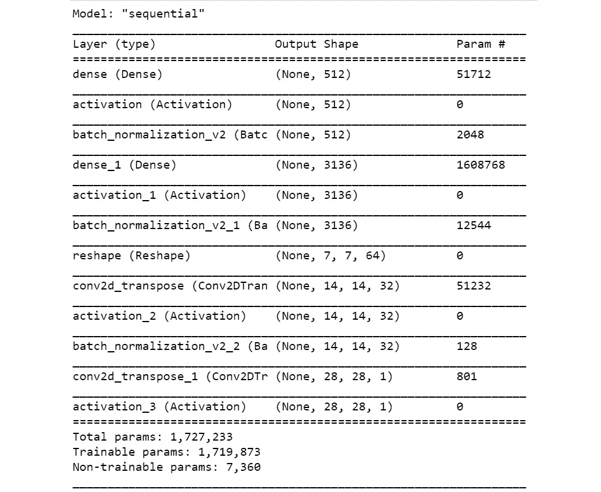

    图 7.38：生成模型总结

    从总结中可以看到，每次转置卷积操作时输入噪声的维度是如何变化的。最终，我们得到的输出维度与真实数据集相同，`(None, 28, 28, 1)`。

1.  让我们使用生成器函数生成一个训练前的假样本：

    ```py
    # Generating a fake sample and printing the shape
    fake = fakedataGenerator(Genmodel,batch,infeats)
    fake.shape
    ```

    你应该得到以下输出：

    ```py
    (128, 28, 28, 1)
    ```

1.  现在，让我们绘制生成的假样本：

    ```py
    # Plotting the fake sample
    plt.imshow(fake[1, :, :, 0], cmap='gray_r')
    ```

    你应该得到类似以下的输出：

    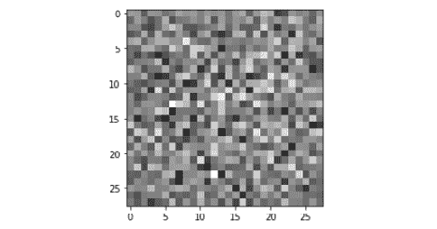

    图 7.39：假样本的输出

    这是训练前假样本的图像。在训练之后，我们希望这些样本看起来像我们在本活动中之前可视化的 MNIST 时尚样本。

1.  将判别器模型构建为一个函数。网络架构将类似于 CNN 架构：

    ```py
    Activity7.01.ipynb
    # Descriminator model as a function
    def discModel():
        Discmodel = Sequential()
        Discmodel.add(Conv2D(32,kernel_size=(5,5),strides=(2,2),\
                      padding='same',input_shape=(28,28,1)))
        Discmodel.add(LeakyReLU(0.2))
        # second layer of convolutions
        Discmodel.add(Conv2D(64, kernel_size=(5,5), strides=(2, 2), \
                      padding='same'))
        Discmodel.add(LeakyReLU(0.2))
    The full code for this step can be found at https://packt.live/3fpobDm
    ```

    在判别器网络中，我们已经包含了所有必要的层，如卷积操作和`LeakyReLU`。请注意，最后一层是 sigmoid 层，因为我们希望输出的是样本是否真实的概率（1 表示真实，0 表示假）。

1.  打印判别器网络的总结：

    ```py
    # Print the summary of the discriminator model
    Discmodel = discModel()
    Discmodel.summary()
    ```

    你应该得到以下输出：

    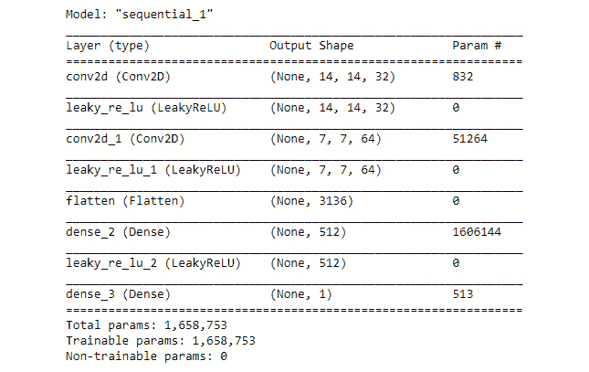

    图 7.40：判别器模型总结

1.  将 GAN 模型定义为一个函数：

    ```py
    # Define the combined generator and discriminator model, for updating the generator
    def ganModel(Genmodel,Discmodel):
        # First define that discriminator model cannot be trained
        Discmodel.trainable = False
        Ganmodel = Sequential()
        # First adding the generator model
        Ganmodel.add(Genmodel)
        """
        Next adding the discriminator model 
        without training the parameters
        """
        Ganmodel.add(Discmodel)
        """
        Compile the model for loss to optimise the Generator model
        """
        Ganmodel.compile(loss='binary_crossentropy',\
                         optimizer = 'adam')
        return Ganmodel
    ```

    GAN 模型的结构与我们在*练习 7.05*中开发的结构相似，*实现 DCGAN*。

1.  现在，是时候调用 GAN 函数了：

    ```py
    # Initialise the GAN model
    gan_model = ganModel(Genmodel,Discmodel)
    # Print summary of the GAN model
    gan_model.summary()
    ```

    请注意，GAN 模型的输入是之前定义的生成器模型和判别器模型。你应该得到以下输出：

    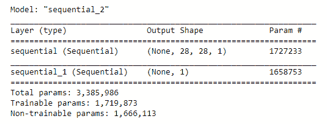

    图 7.41：GAN 模型总结

    请注意，GAN 模型中每一层的参数等同于生成器和判别器模型的参数。GAN 模型只是我们之前定义的两个模型的封装器。

1.  使用以下代码定义训练网络的 epoch 数：

    ```py
    # Defining the number of epochs
    nEpochs = 5000
    ```

1.  现在，我们可以开始训练网络的过程：

    ```py
    Activity7.01.ipynb
    # Train the GAN network
    for i in range(nEpochs):
        """
        Generate samples equal to the batch size 
        from the real distribution
        """
        x_real = realData(batch)
        #Generate fake samples using the fake data generator function
        x_fake = fakedataGenerator(Genmodel,batch,infeats)
        # Concatenating the real and fake data 
        X = np.concatenate([x_real,x_fake])
        #Creating the dependent variable and initializing them as '0'
        Y = np.zeros(batch * 2)
    The complete code for this step can be found on https://packt.live/3fpobDm
    ```

    这里需要注意的是，判别器模型使用真实和假样本的训练与 GAN 模型的训练是同时进行的。唯一的区别是，GAN 模型的训练不会更新判别器模型的参数。另一个需要注意的是，在 GAN 内部，假样本的标签将是 1，以生成较大的损失项，这些损失项将通过判别器网络反向传播，以更新生成器参数。我们还会在每 50 个 epochs 时显示 GAN 的预测概率。在计算概率时，我们结合一个真实数据样本和一个假数据样本，然后取预测概率的均值。我们还会保存生成的图像副本。

    你应该得到类似以下的输出：

    ```py
    Discriminator probability:0.5276428461074829
    Discriminator probability:0.5038391351699829
    Discriminator probability:0.47621315717697144
    Discriminator probability:0.48467564582824707
    Discriminator probability:0.5270703434944153
    Discriminator probability:0.5247280597686768
    Discriminator probability:0.5282968282699585
    ```

    我们还来看一下在不同训练周期生成的一些图表：

    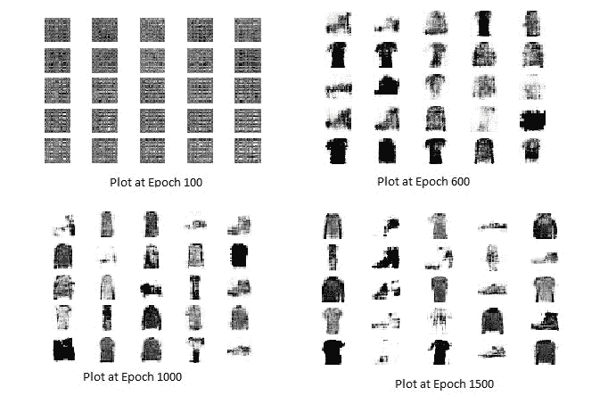

    图 7.42：训练过程中生成的图像

    从前面的图表中，我们可以看到训练过程的进展。我们看到在第 100 个周期时，图表大部分仍是噪声；到第 600 个周期时，时尚物品的形态开始变得更加明显；在第 1,500 个周期时，我们可以看到假图像与时尚数据集非常相似。

    注意：

    你可以通过访问[`packt.live/2W1FjaI`](https://packt.live/2W1FjaI)更仔细地查看这些图像。

1.  现在，让我们看看训练后生成的图像：

    ```py
     # Images generated after training
    x_fake = fakedataGenerator(Genmodel,25,infeats)
    # Displaying the plots
    for j in range(5*5):
    pyplot.subplot(5,5,j+1)
        # turn off axis 
        pyplot.axis('off')
        pyplot.imshow(x_fake[j,:,:,0],cmap='gray_r')
    ```

    你应该得到类似以下的输出：

    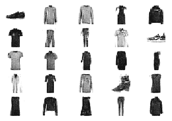

图 7.43：训练过程后生成的图像

从训练准确率水平可以看到，判别器模型的准确率大约在 0.50 左右，这就是理想的范围。生成器的目的是创造看起来像真实图像的假图像。当生成器生成的图像与真实图像非常相似时，判别器会混淆图像是来自真实分布还是假分布。这一现象体现在判别器的准确率大约为 50%，这是理想的水平。

注意：

要访问此特定部分的源代码，请参考[`packt.live/3fpobDm`](https://packt.live/3fpobDm)。

本节目前没有在线互动示例，需要在本地运行。
