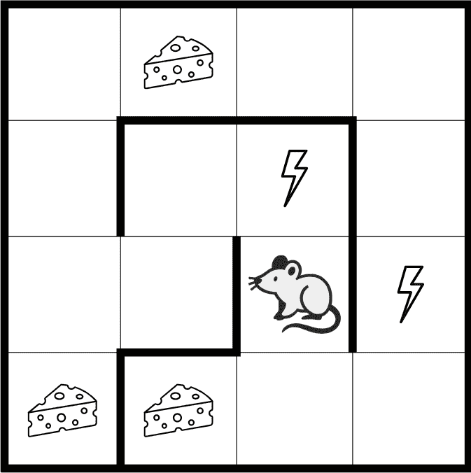
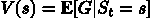

# 第一章：什么是强化学习？

自动学习最优决策的问题是一个普遍且常见的问题，已经在许多科学和工程领域中得到了研究。在我们不断变化的世界中，即使是看似静态的输入输出问题，如果考虑时间因素，也可能变得动态。例如，假设你想解决一个简单的监督学习问题——宠物图片分类，目标类别为狗和猫。你收集训练数据集，并使用你最喜欢的深度学习工具包实现分类器。在训练和验证之后，模型表现非常好。太棒了！你将其部署并让它运行一段时间。然而，经过一段海边度假的时间后，你回到工作中，发现狗狗美容风格发生了变化，导致你的一部分查询被错误分类，因此你需要更新训练图像并重新进行训练。并不是那么棒！

这个例子旨在展示即使是简单的机器学习（ML）问题，往往也有一个隐藏的时间维度。这通常被忽视，且可能在生产系统中成为一个问题。这可以通过强化学习（RL）来解决，强化学习是机器学习的一个子领域，是一种将额外维度（通常是时间，但不一定是）自然融入学习方程的方法。这使得强化学习更接近人类理解人工智能（AI）的方式。在本章中，我们将详细讨论强化学习，并让你熟悉以下内容：

+   强化学习（RL）与其他机器学习（ML）学科的关系与区别：监督学习与无监督学习

+   强化学习的主要形式及其相互关系

+   强化学习的理论基础：马尔科夫过程（MPs）、马尔科夫奖励过程（MRPs）和马尔科夫决策过程（MDPs）

# 监督学习

你可能熟悉监督学习的概念，这是最常见且研究最深入的机器学习问题。它的基本问题是，当给定一组示例对时，如何自动构建一个函数，将输入映射到输出？听起来很简单，但这个问题包含了许多计算机最近才开始成功解决的棘手问题。监督学习问题有很多例子，包括以下几种：

+   文本分类：这封电子邮件是垃圾邮件吗？

+   图像分类与物体定位：这张图片是猫、狗，还是其他东西？

+   回归问题：根据天气传感器提供的信息，明天的天气如何？

+   情感分析：这条评论的客户满意度如何？

这些问题看起来可能不同，但它们共享相同的思想——我们有许多输入和期望的输出示例，我们想要学习如何为一些未来的、当前看不见的输入生成输出。监督学习这一名称来源于我们从“真实数据”源提供的已知答案中学习。

# 无监督学习

在另一个极端，我们有所谓的无监督学习，它假设没有监督，也没有已知的标签分配给我们的数据。其主要目标是学习手头数据集的一些隐藏结构。一个常见的无监督学习方法是数据聚类。当我们的算法尝试将数据项合并成一组簇时，就会揭示数据中的关系。例如，你可能想要找到相似的图像或具有共同行为模式的客户。

另一种越来越流行的无监督学习方法是生成对抗网络（GANs）。当我们有两个相互竞争的神经网络（NNs）时，第一个网络试图生成假数据来欺骗第二个网络，而第二个网络试图区分人工生成的数据和从我们数据集中采样的数据。随着时间的推移，两个网络通过捕捉数据集中的微妙特定模式，变得越来越擅长其任务。

# 强化学习

强化学习（RL）是第三种方法，位于完全监督和完全没有预定义标签之间。一方面，它使用许多已建立的监督学习方法，如深度神经网络用于函数逼近、随机梯度下降和反向传播，来学习数据表示。另一方面，它通常以不同的方式应用这些方法。

在本章的接下来的两节中，我们将探讨 RL 方法的具体细节，包括其严格数学形式中的假设和抽象。现在，为了将 RL 与监督学习和无监督学习进行比较，我们将采取一种不那么正式但更易于理解的方式。

想象一下，你有一个代理需要在某个环境中采取行动。接下来，“代理”和“环境”将在本章中详细定义。一个迷宫中的机器人老鼠就是一个很好的例子，但你也可以想象一个自动直升机试图进行滚转，或者一个国际象棋程序学习如何打败一位国际象棋大师。为了简便，我们就以机器人老鼠为例。

图 1.1：机器人老鼠迷宫世界

在这个例子中，环境是一个迷宫，某些地方有食物，其他地方有电击。机器人老鼠是能够采取行动的代理（agent），比如向左/右转或向前移动。在每一时刻，它可以观察迷宫的完整状态，以决定要采取什么行动。机器人老鼠试图尽可能多地找到食物，同时尽量避免电击。食物和电击信号作为环境对代理（机器人老鼠）行为的额外反馈，充当了奖励的角色。奖励是强化学习中一个非常重要的概念，我们将在本章后面讨论。现在你只需要知道代理的最终目标是尽可能最大化它的奖励。在我们的这个具体例子中，机器人老鼠可能会因为短期的电击而遭遇一点挫折，以便在长期内到达一个食物丰富的地方——对机器人老鼠来说，这将是比停在原地一动不动且什么都得不到更好的结果。

我们不希望在机器人老鼠中硬编码有关环境和每种特定情况最佳行动的知识——这样做会非常费力，而且即使迷宫稍有变化也可能变得毫无用处。我们想要的是一套神奇的方法，使我们的机器人老鼠能够自主学习如何避免电击，并尽可能多地收集食物。强化学习正是这套神奇的工具箱，它与监督学习和无监督学习方法的行为不同；它不像监督学习那样依赖于预定义的标签。没有人会给机器人标注它看到的所有图像是好是坏，也没有人会告诉它应该转向哪个方向。

然而，我们并不像无监督学习那样完全盲目——我们有一个奖励系统。奖励可以是正面的，比如获取食物，负面的，比如电击，或者当什么特别的事情没有发生时是中立的。通过观察奖励并将其与采取的行动联系起来，我们的代理（agent）学习如何更好地执行某个行动，收集更多的食物，减少电击。当然，强化学习（RL）的普遍性和灵活性是有代价的。强化学习被认为是比监督学习或无监督学习更具挑战性的领域。我们来快速讨论一下是什么让强化学习变得棘手。

# 强化学习中的复杂性

首先需要注意的是，强化学习中的观察结果取决于代理的行为，并在某种程度上是该行为的结果。如果你的代理决定做一些低效的事情，那么观察结果将无法告诉你它做错了什么，以及应该采取什么措施来改进结果（代理将一直得到负面反馈）。如果代理固执己见，持续犯错，那么观察结果会给人一种错误的印象，认为无法获得更大的奖励——生活充满了痛苦——这完全可能是错误的。

在 ML 术语中，这可以重新表述为拥有非 IID 数据。缩写 iid 代表独立同分布，这是大多数监督学习方法的一个要求。

使我们的代理生活变得复杂的第二个因素是，它不仅需要利用已经学到的知识，还需要主动探索环境，因为也许改变做事的方式会显著改善结果。问题是，过多的探索也可能严重降低奖励（更不用说代理可能会忘记之前学到的东西），因此我们需要在这两种活动之间找到某种平衡。这个探索/利用的困境是 RL 中一个开放的基础性问题。人们总是面临这个选择——我应该去一个已经知道的地方吃饭，还是尝试这个新开的餐厅？我应该多频繁地换工作？我应该学习一个新领域，还是继续在我的专业领域工作？这些问题没有普遍的答案。

第三个复杂性在于奖励可能在行动后被严重延迟。例如，在国际象棋中，一步强有力的走棋可能在游戏中段改变局势。在学习过程中，我们需要发现这样的因果关系，而在时间流逝和我们的行动中，辨别这些关系可能非常棘手。

然而，尽管存在这些障碍和复杂性，RL 在近年来取得了巨大的进展，成为了一个越来越活跃的研究和实际应用领域。

想了解更多吗？让我们深入探讨 RL 的形式化理论和游戏规则。

# RL 形式化理论

每个科学和工程领域都有其假设和限制。在本章前面，我们讨论了监督学习，在这种方法中，假设是输入输出对的知识。如果你的数据没有标签？你需要弄清楚如何获得标签，或者尝试使用其他理论。这并不意味着监督学习好或不好；它只是让它无法应用于你的问题。

有许多历史上的实际和理论突破，都是当某人试图以创造性方式挑战规则时发生的。然而，我们也必须理解我们的局限性。了解并理解各种方法的游戏规则非常重要，因为这可以帮助你提前节省大量时间。当然，RL 也有相应的形式化理论，我们将在本书的剩余部分从不同角度分析它们。

以下图示展示了两个主要的 RL 实体——代理和环境——以及它们的通信渠道——行动、奖励和观察：

图 1.2：RL 实体及其通信渠道

我们将在接下来的几个章节中详细讨论它们。

## 奖励

首先，让我们回到奖励的概念。在强化学习中，奖励只是我们从环境中定期获得的一个标量值。如前所述，奖励可以是正的也可以是负的，大小不一，但它只是一个数字。奖励的目的是告诉智能体它的行为有多好。我们并不定义智能体获得奖励的频率；它可以是每秒一次，也可以是智能体一生中仅有一次，尽管通常做法是每固定时间戳或每次与环境交互时给予奖励，以便于操作。在一次性奖励系统的情况下，除了最后一个奖励之外，所有奖励都为零。

正如我所说，奖励的目的是给智能体提供关于其成功的反馈，这是强化学习中的核心概念。基本上，“强化”一词源自于这样一个事实：智能体获得的奖励应该以积极或消极的方式强化其行为。奖励是局部的，意味着它反映了智能体到目前为止所获得的利益和损失。当然，某个动作获得了大奖励并不意味着，过一秒钟后，你就不会因之前的决策面临剧烈后果。这就像抢银行——在你想到后果之前，它看起来可能是个好主意。

智能体试图实现的目标是其一系列动作中累计的最大奖励。为了帮助你更好地理解奖励，这里列出了一些具体的例子及其奖励：

+   财务交易：一笔利润是交易员买卖股票的奖励。

+   国际象棋：奖励在游戏结束时获得，可能是胜利、失败或平局。当然，这取决于解释。例如，对我来说，在与国际象棋大师对弈时取得平局就是一个巨大的奖励。实际上，我们需要指定准确的奖励值，但这可能是一个相当复杂的表达式。例如，在国际象棋中，奖励可能与对手的强度成比例。

+   大脑中的多巴胺系统：大脑中有一部分（边缘系统）每当需要向大脑其他部分发送积极信号时，会产生多巴胺。高浓度的多巴胺会带来愉悦感，这会强化大脑认为有益的活动。不幸的是，边缘系统在它所认为“有益”的事物上非常古老——食物、繁衍和安全——但这是完全不同的故事！

+   电脑游戏：它们通常会给玩家提供明显的反馈，通常是击杀的敌人数或者收集的分数。在这个例子中需要注意的是，奖励已经累计，所以街机游戏中的强化学习奖励应该是分数的导数，也就是说，每当击杀一个敌人时奖励+1，玩家被敌人击杀时奖励- N，其余时间奖励为 0。

+   网络导航：有一些问题，具有很高的实际价值，需要自动提取网络上的信息。搜索引擎通常在尝试解决这一任务，但有时，为了获得所需的数据，你需要填写一些表单、通过一系列链接导航，或完成验证码，这对于搜索引擎来说可能是困难的。针对这些任务，有一种基于强化学习的方法，其中的奖励是你所需的 信息或结果。

+   神经网络架构搜索：强化学习（RL）可用于神经网络架构优化，在这种情况下，模型的质量至关重要，人们努力提升目标指标的额外 1%。在这一应用场景中，目标是通过调整层数或其参数、添加额外的旁路连接或对神经网络架构做出其他更改，从而在某些数据集上获得最佳的性能指标。此时的奖励是性能（准确度或其他衡量神经网络预测准确性的指标）。

+   狗狗训练：如果你曾经尝试训练一只狗，你就知道每当它做对了你要求的事情时，你需要给它一些美味的东西（但不要太多）。当它不听从指令时，惩罚它一点（负奖励）也是常见的做法，尽管近期的研究表明，这种做法并不像正向奖励那样有效。

+   学校成绩：我们都有过这样的经历！学校成绩是一种奖励系统，旨在为学生提供关于他们学习情况的反馈。

正如从前面的例子中可以看出的那样，奖励的概念是智能体表现的一个非常普遍的指示，它可以在我们周围的许多实际问题中找到或人为地注入。

## 智能体

智能体是指通过执行特定的行动、做出观察，并因此获得最终奖励的人或物。在大多数实际的强化学习场景中，智能体是我们的软件部分，它旨在以或多或少高效的方式解决某个问题。对于我们最初的六个例子，智能体如下：

+   金融交易：一个交易系统或交易员在执行订单（买入、卖出或不做任何操作）时作出的决策。

+   国际象棋：一个玩家或计算机程序。

+   多巴胺系统：大脑本身，根据感官数据决定这是否是一次好的体验。

+   电子游戏：享受游戏或计算机程序的玩家。（Andrej Karpathy 曾在推特上写道：“我们原本是要让 AI 完成所有工作，我们自己玩游戏，但实际上我们做了所有工作，而 AI 正在玩游戏！”）。

+   网络导航：告诉浏览器点击哪些链接、移动鼠标到哪里或输入哪些文本的软件。

+   神经网络架构搜索：控制被评估的神经网络具体架构的软件。

+   狗狗训练：你做出关于行动的决策（喂食/训斥），所以，代理人是你。但原则上，你的狗也可以被视为代理人——狗狗试图通过正确的行为来最大化奖励（食物和/或关注）。严格来说，这里是一个“多代理强化学习”（multi-agent RL）设置，相关内容在第二十二章有简要讨论。

+   学校：学生/学员。

## 环境

环境是代理之外的一切。从最广义上讲，它是宇宙的其余部分，但这稍微有些夸张，甚至超出了即使是明天的计算机的处理能力，所以我们通常在这里遵循一般意义上的理解。

代理人与环境的互动仅限于奖励（从环境中获得）、行动（由代理执行并发送到环境）和观察（代理从环境中获得的除奖励之外的一些信息）。我们已经讨论了奖励，接下来我们来谈谈行动和观察。我们将在讨论观察时确定每个例子的环境。

## 行动

行动是代理人在环境中可以执行的事情。例如，行动可以是棋盘上的棋子移动（如果是棋类游戏），或者是做作业（在学校的情况下）。它们可以像将兵前进一格那样简单，也可以像建立一家盈利的初创公司那样复杂。

在强化学习（RL）中，我们区分两种类型的行动——离散的或连续的。离散行动形成了代理可以执行的一组有限的、相互排斥的事情，比如向左或向右移动。连续行动则附带一些数值，例如汽车转动方向盘时有一个角度和方向。不同的角度可能会导致一秒钟后不同的情景，因此单纯的“转动方向盘”肯定不够。

给出具体例子，让我们看看六种情境中的行动：

+   金融交易：行动是买入或卖出股票的决策。“什么也不做，等待”也是一种行动。

+   国际象棋：行动是根据当前棋盘位置进行的有效棋子移动。

+   多巴胺系统：行动是你正在做的事情。

+   电子游戏：行动是按按钮。它们也可以是连续的，比如在汽车模拟器中转动方向盘。

+   网络浏览：行动可能是鼠标点击、滚动和文字输入。

+   神经网络架构搜索：行动是神经网络架构的变化，这些变化可以是离散的（网络中的层数）或连续的（丢弃层中的概率）。

+   狗狗训练：行动是你与狗狗可以做的一切——给它一块美味的食物、抚摸它，甚至用温柔的声音说“乖狗狗！”

+   学校：行动是成绩和其他非正式的信号，比如表扬成功或布置额外的作业。

## 观察

环境的观察构成了代理的第二个信息通道，第一个通道是奖励。你可能会想，为什么我们需要一个单独的数据源？答案是方便。观察是环境提供给代理的、指示代理周围发生情况的信息。

观察可能与即将到来的奖励相关（例如看到银行通知自己已收到薪水），也可能无关。观察甚至可能以某种模糊或隐晦的形式包含奖励信息，例如计算机游戏屏幕上的得分数字。得分数字只是像素，但我们有可能将它们转化为奖励值；对于现代计算机视觉技术来说，这并不是一个复杂的任务。

另一方面，奖励不应被视为次要或不重要的东西——奖励是驱动代理学习过程的主要力量。如果奖励是错误的、噪声大的，或者与主要目标稍有偏离，那么训练可能会朝着错误的方向发展。

同时，区分环境的状态和观察也很重要。环境的状态大多数时候是环境内部的，可能包括宇宙中的每一个原子，这使得我们不可能测量环境中的所有信息。即使我们将环境的状态限制得足够小，大多数情况下，我们也不可能获得关于它的完整信息，或者我们的测量会包含噪声。然而，这完全没问题，强化学习（RL）就是为了原生支持这种情况而设计的。为了说明这种区别，我们回到我们的示例集：

+   金融交易：在这里，环境是整个金融市场及其一切影响因素。这是一个庞大的清单，包含最新的新闻、经济和政治条件、天气、食物供应、Twitter/X 趋势等。甚至你今天决定待在家里，也可能间接影响世界金融系统（如果你相信“蝴蝶效应”）。然而，我们的观察仅限于股价、新闻等。我们无法访问大部分环境状态，这使得金融预测成为一项非常复杂的任务。

+   国际象棋：这里的环境是你的棋盘加上你的对手，包括他们的棋艺、情绪、大脑状态、选择的战术等。观察是你所看到的（你当前的棋盘局面），但是，在某些层次的比赛中，心理学知识和读取对手情绪的能力可能会提高你的胜算。

+   多巴胺系统：这里的环境是你的大脑、神经系统、器官状态以及你能感知到的整个世界。观察是来自你感官的内在大脑状态和信号。

+   电脑游戏：在这里，环境是你电脑的状态，包括所有内存和磁盘数据。对于联网游戏，你需要包括其他电脑以及它们和你机器之间的所有互联网基础设施。观察数据仅限于屏幕的像素和声音。这些像素并不是少量的信息（有估算认为，所有可能的中等大小图像（1024×768）的总数量远远大于我们银河系中原子的数量），但整个环境状态肯定更大。

+   网络浏览：这里的环境是互联网，包括所有在你代理工作的计算机和网页服务器之间的网络基础设施，这是一个真正庞大的系统，包含了成千上万不同的组件。观察通常是加载在浏览器中的网页。

+   神经网络架构搜索：在这个例子中，环境相对简单，包括执行特定神经网络评估的神经网络工具包，以及用于获得性能度量的数据集。与互联网相比，这看起来像是一个微小的玩具环境。观察数据可能有所不同，包括一些关于测试的信息，例如损失收敛动态或从评估步骤中获得的其他度量。

+   狗狗训练：这里，环境是你的狗（包括它几乎无法观察到的内心反应、情绪和生活经验）以及周围的一切，包括其他狗甚至是藏在灌木丛中的猫。观察数据来自你的感官和记忆。

+   学校：这里的环境是学校本身、国家的教育系统、社会和文化遗产。观察数据与狗狗训练示例中的相同——学生的感官和记忆。

这是我们的“场景布置”，在本书的其余部分我们将围绕它进行讨论。你应该已经注意到，强化学习（RL）模型极其灵活和通用，可以应用于多种场景。现在，让我们在深入探讨 RL 模型的细节之前，先看看强化学习与其他学科的关系。

还有许多其他领域为强化学习做出贡献或与其相关。最重要的几个领域显示在以下图示中，其中包括六个相互重叠的主要领域，这些领域涉及与决策相关的方法和具体话题（显示在内圈内）。

图 1.3：强化学习中的各个领域

在所有这些相关但仍然不同的科学领域的交集处坐落着强化学习（RL），它如此通用和灵活，可以从这些不同的领域中汲取最好的可用信息：

+   机器学习（ML）：作为机器学习（ML）的一个子领域，强化学习（RL）借鉴了许多机器学习的工具、技巧和技术。基本上，RL 的目标是学习在给定不完美的观察数据时，代理应如何行动。

+   工程（特别是最优控制）：这有助于采取一系列最优的行动，以获得最佳结果。

+   神经科学：我们以多巴胺系统为例，研究表明人类大脑的工作方式与 RL 模型非常相似。

+   心理学：这研究人在各种条件下的行为，比如人们如何反应和适应，这与 RL 主题有很大关联。

+   经济学：经济学中的一个重要话题是如何在不完全知识和现实世界变化条件下最大化回报。

+   数学：这与理想化系统一起工作，并且在运筹学领域也特别关注寻找并达到最优条件。

在本章的下一部分，你将熟悉强化学习（RL）的理论基础，这将使你能够开始朝着解决 RL 问题的方法迈进。接下来的部分对理解本书的其余部分非常重要。

# 强化学习的理论基础

在这一部分，我将向你介绍我们刚刚讨论的形式化模型（回报、代理、动作、观察和环境）的数学表示和符号。然后，基于这些知识，我们将探讨 RL 语言中的二阶概念，包括状态、回合、历史、价值和收益，这些概念将在本书后续的不同方法中反复使用。

## 马尔可夫决策过程

在此之前，我们将介绍马尔可夫决策过程（MDPs），它将像俄罗斯套娃一样被描述：我们将从最简单的马尔可夫过程（MP）开始，然后通过加入回报扩展它，变成马尔可夫回报过程（MRP）。接着，我们通过加入动作，再次将这个想法放入一个额外的框架，这样我们就得到了 MDP。

MPs 和 MDPs 在计算机科学和其他工程领域广泛应用。因此，阅读这一章不仅对你在 RL 方面有帮助，也对更广泛的主题有益。如果你已经熟悉 MDPs，那么你可以快速浏览这一章，只关注术语定义，因为我们稍后会用到它们。

### 马尔可夫过程

让我们从马尔可夫家族中最简单的概念开始：MP，也就是马尔可夫链。假设你面前有一个系统，你只能观察它。你观察到的叫做状态，系统可以根据某些动态法则（大多数情况下你并不知道这些法则）在状态之间切换。再次强调，你不能影响系统，只能观察状态的变化。一个系统的所有可能状态组成一个叫做状态空间的集合。对于 MP，我们要求这个状态集合是有限的（但它可以非常大以弥补这一限制）。你的观察形成一系列状态或链（这也是为什么 MPs 也被称为马尔可夫链）。

例如，考虑某个城市最简单的天气模型，我们可以观察当前是晴天还是雨天，这就是我们的状态空间。随着时间的推移，观察序列形成了一个状态链，如 [晴天, 晴天, 雨天, 晴天, ...]，这就是所谓的历史。要将这样的系统称为马尔可夫过程，它需要满足马尔可夫性质，这意味着未来的系统动态仅取决于当前状态，而不取决于历史状态。马尔可夫性质的主要观点是使每个可观察的状态能够独立地描述系统的未来。换句话说，马尔可夫性质要求系统的各个状态彼此可区分且唯一。在这种情况下，仅需一个状态来建模系统的未来动态，而不是整个历史或说最近的 N 个状态。

在我们的天气示例中，马尔可夫性质将我们的模型限制为仅表示晴天之后可能是雨天，且两者的概率相同，不管过去我们经历了多少个晴天。这并不是一个非常现实的模型，因为从常理来看，我们知道第二天的降雨概率不仅取决于当前的天气状况，还取决于许多其他因素，如季节、纬度以及周围是否有山脉或海洋。最近有研究证明，太阳活动也对天气有重要影响。所以，我们的示例其实是很天真的，但它有助于理解模型的局限性，并做出有意识的决策。

当然，如果我们希望让我们的模型更复杂，可以通过扩展状态空间来实现，这样可以在模型中捕获更多的依赖关系，代价是增加了状态空间的规模。例如，如果你想分别捕捉夏季和冬季的雨天概率，那么你可以将季节纳入你的状态空间。

在这种情况下，你的状态空间将是 [晴天+夏季, 晴天+冬季, 雨天+夏季, 雨天+冬季]，依此类推。

由于你的系统模型符合马尔可夫性质，你可以通过一个转移矩阵来捕获转移概率，转移矩阵是一个 N × N 的方阵，其中 N 是我们模型中状态的数量。矩阵中第 i 行、第 j 列的每个单元格包含系统从状态 i 转移到状态 j 的概率。

例如，在我们的晴天/雨天示例中，转移矩阵可能如下所示：

|  | 晴天 | 雨天 |
| --- | --- | --- |
| 晴天 | 0.8 | 0.2 |
| 雨天 | 0.1 | 0.9 |

在这种情况下，如果我们是晴天，那么第二天晴天的概率是 80%，雨天的概率是 20%。如果我们观察到雨天，那么天气变好的概率是 10%，第二天仍然是雨天的概率是 90%。

所以，就是这样。马尔可夫过程的正式定义如下：

+   系统可以处于的一组状态（S）

+   转移矩阵 (T)，包含转移概率，定义了系统的动态

MP 的一个有用的可视化表示是一个图，节点代表系统的状态，边缘则用表示可能从一个状态到另一个状态的转移概率来标注。如果某个转移的概率是 0，我们就不画边（意味着无法从一个状态转移到另一个状态）。这种表示方法在有限状态机表示中也被广泛使用，而有限状态机又是自动机理论中的一个研究领域。对于我们的晴天/雨天天气模型，图示如下：

图 1.4：晴天/雨天天气模型

再次强调，我们仅仅是在谈论观察。我们无法影响天气，只能观察它并记录我们的观察结果。

为了给你一个更复杂的例子，我们来考虑一个名为“办公室员工”的模型（《Dilbert》中的主角迪尔伯特就是一个很好的例子）。在我们的示例中，他的状态空间包括以下状态：

+   家里：他不在办公室

+   计算机：他在办公室使用电脑工作

+   咖啡：他在办公室喝咖啡

+   聊天：他正在与办公室的同事讨论某些事情

状态转移图如下面的图示所示：

图 1.5：我们办公室员工的状态转移图

我们假设我们办公室员工的工作日通常从“家里”状态开始，而且他毫无例外地从“咖啡”状态开始一天（没有“家里 → 计算机”边缘，也没有“家里 → 聊天”边缘）。前面的图示还表明，工作日总是从“计算机”状态结束（也就是说，回到“家里”状态）。

上面图示的转移矩阵如下：

|  | 家里 | 咖啡 | 聊天 | 计算机 |
| --- | --- | --- | --- | --- |
| 家里 | 60% | 40% | 0% | 0% |
| 咖啡 | 0% | 10% | 70% | 20% |
| 聊天 | 0% | 20% | 50% | 30% |
| 计算机 | 20% | 20% | 10% | 50% |

转移概率可以直接标注在状态转移图上，如图 1.6 所示。

图 1.6：带有转移概率的状态转移图

在实际操作中，我们很少有机会知道确切的转移矩阵。一个更为现实的情况是，当我们只能观察到系统的状态，这些状态也称为“情节”时：

+   家里 → 咖啡 → 咖啡 → 聊天 → 聊天 → 咖啡 → 计算机 → 计算机 → 家里

+   计算机 → 计算机 → 聊天 → 聊天 → 咖啡 → 计算机 → 计算机 → 计算机

+   家里 → 家里 → 咖啡 → 聊天 → 计算机 → 咖啡 → 咖啡

从我们的观察中估计转移矩阵并不复杂——我们只需计算每个状态的所有转移，并将它们标准化，使其总和为 1。我们拥有的观察数据越多，我们的估计就会越接近真实的底层模型。

还值得注意的是，马尔可夫性质意味着平稳性（即任何状态的潜在转移分布随时间变化）。非平稳性意味着有某种隐藏因素影响着我们的系统动态，而这个因素未包含在观察中。然而，这与马尔可夫性质相矛盾，后者要求相同状态下的基础概率分布在任何转移历史中都是相同的。

重要的是理解我们在一集观察到的实际转移与转移矩阵中给出的潜在分布之间的差异。我们观察到的具体集是从模型的分布中随机抽样得到的，因此它们可能在每一集之间有所不同。然而，具体转移被抽样的概率保持不变。如果不是这样，马尔可夫链形式化就不适用了。

现在我们可以进一步扩展 MP 模型，使其更接近我们的 RL 问题。让我们在图中加入奖励！

### 马尔可夫奖励过程

为了引入奖励，我们需要稍微扩展我们的 MP 模型。首先，我们需要为状态之间的转换添加值。我们已经有了概率，但概率用于捕捉系统的动态，所以现在我们额外增加了一个标量数值，且不会增加额外负担。

奖励可以以多种形式表示。最通用的方式是另有一个方阵，类似于转移矩阵，表示从状态 i 到状态 j 的转换奖励，存储在第 i 行第 j 列。

如前所述，奖励可以是正数或负数，可以是大或小。在某些情况下，这种表示是多余的，可以简化。例如，如果无论起始状态如何，达到某个状态都会获得奖励，我们可以仅保留（状态，奖励）对，这是一种更紧凑的表示。然而，只有当奖励值仅依赖于目标状态时，这种表示才适用，但这并不总是成立。

我们添加到模型中的第二个内容是折扣因子 γ（希腊字母“gamma”），它是一个介于 0 到 1 之间的数字（包含 0 和 1）。在定义了我们 MRP 的额外特性后，我们会解释它的意义。

正如你会记得的那样，我们在 MP 中观察到的是一系列状态转移。在 MRP 中也是如此，但对于每一个转移，我们都有额外的量——奖励。因此，现在我们所有的观察都有一个与系统每次转移相关的奖励值。

对于每一集，我们定义在时刻 t 的回报为 G[t]：

上述公式中的 γ 在 RL 中非常重要，我们在接下来的章节中将经常遇到它。目前，可以将它理解为衡量我们预计未来回报时，观察多远未来的一个参数。它的值越接近 1，我们就越会考虑未来更多的步骤。

现在让我们试着理解回报公式的含义。对于每个时间点，我们将回报计算为后续奖励的总和，但距离起始点 t 越远的奖励，会被折扣因子乘以，并且这个折扣因子会根据我们距离起始点的步数的幂次进行调整。折扣因子代表了智能体的远见性。如果 γ = 1，那么回报 G[t]仅仅等于所有后续奖励的总和，代表智能体可以完美预见所有后续奖励。如果 γ = 0，G[t]则只会是立即奖励，没有任何后续状态，代表绝对的短视。

这些极端值仅在特殊情况下有用，大多数时候，γ会设置为介于两者之间的某个值，如 0.9 或 0.99。在这种情况下，我们会展望未来的奖励，但不会太远。γ = 1 的值可能适用于短期有限的情境。

这个回报量在实践中不是很有用，因为它是针对我们从马尔可夫奖励过程（MRP）观察到的每一个特定链定义的，因此即使是相同的状态，它也可能有很大差异。然而，如果我们走到极端，计算任何状态的回报的数学期望（通过对大量链求平均），我们将得到一个更实用的量，这就是状态的价值：

这个解释很简单——对于每个状态 s，值 V(s)是我们通过遵循马尔可夫奖励过程获得的平均（或期望）回报。

为了将这些理论知识实际应用，让我们扩展我们的办公室工作者（Dilbert）过程，加入奖励并将其转化为 Dilbert 奖励过程（DRP）。我们的奖励值将如下所示：

+   家庭 → 家庭：1（因为待在家里是好事）

+   家庭 → 咖啡：1

+   计算机 → 计算机：5（努力工作是好事）

+   计算机 → 聊天：−3（分心不好）

+   聊天 → 计算机：2

+   计算机 → 咖啡：1

+   咖啡 → 计算机：3

+   咖啡 → 咖啡：1

+   咖啡 → 聊天：2

+   聊天 → 咖啡：1

+   聊天 → 聊天：-1（长时间的对话变得无聊）

这一图示见于图 1.7。

图 1.7：带有转移概率和奖励的状态转移图

让我们回到我们的 γ 参数，思考不同 γ 值下状态的值。我们从一个简单的情况开始：γ = 0。如何计算这里的状态值呢？为了解答这个问题，我们固定状态为 Chat。那么接下来的转移可能是什么？答案是这取决于概率。根据我们 Dilbert 过程的转移矩阵，下一状态为 Chat 的概率是 50%，为 Coffee 的概率是 20%，为 Computer 的概率是 30%。当 γ = 0 时，我们的回报只等于下一个即时状态的值。因此，如果我们想计算前面图表中 Chat 状态的值，我们需要将所有转移值相加，并乘以它们的概率：

| V (chat) | = | − 1 ⋅ 0.5 + 2 ⋅ 0.3 + 1 ⋅ 0.2 = 0.3 |
| --- | --- | --- |
| V (coffee) | = | 2 ⋅ 0.7 + 1 ⋅ 0.1 + 3 ⋅ 0.2 = 2.1 |
| V (home) | = | 1 ⋅ 0.6 + 1 ⋅ 0.4 = 1.0 |
| V (computer) | = | 5 ⋅ 0.5 + (−3) ⋅ 0.1 + 1 ⋅ 0.2 + 2 ⋅ 0.2 = 2.8 |

所以，计算机是最有价值的状态（如果我们只关心即时奖励），这并不奇怪，因为计算机 → 计算机是频繁的，且奖励较大，且中断的比例不高。

那么，这是一个更棘手的问题——当 γ = 1 时，值是多少？仔细思考一下。答案是，对于所有状态，值是无限的。我们的图表中没有沉没状态（没有外部转移的状态），而当我们的折扣因子等于 1 时，我们关心的是未来可能的无限次转移。正如你在 γ = 0 的情况下所见，我们的所有值在短期内都是正的，所以无限多个正值的总和将给我们一个无限的值，无论起始状态是什么。

这个无限的结果展示了为何在 MRP 中引入 γ 的原因，而不是仅仅将所有未来奖励加总。在大多数情况下，过程可能有无限（或大量）转移。由于处理无限值并不实际，我们希望限制我们计算值的范围。值小于 1 的 γ 提供了这样的限制，我们将在本书后续部分讨论这一点。另一方面，如果你处理的是有限时域环境（例如井字游戏，最多只有九步），那么使用 γ = 1 是完全可以的。

作为另一个例子，存在一种重要的环境类别，只有一步叫做多臂赌博机 MDP。这意味着在每一步，你需要选择一个替代行为，它会给你一些奖励，然后这一回合结束。

你可以在 Tor Lattimore 和 Csaba Szepesvari 的书《Bandit Algorithms》中了解更多关于赌博算法的方法（[`tor-lattimore.com/downloads/book/book.pdf`](https://tor-lattimore.com/downloads/book/book.pdf)）。

如我之前提到的 MRP，γ通常设置为 0 到 1 之间的值。然而，使用这样的值，手动计算几乎变得不可能，即使是像我们的 Dilbert 示例这样的简单 MRP，因为这将需要求和数百个值。计算机擅长处理这类繁琐的任务，并且有几种简单的方法可以快速计算给定转移和奖励矩阵的 MRP 值。我们将在第五章看到并实现其中的一种方法，在这一章我们将开始探讨 Q-learning 方法。

现在，让我们在我们的马尔科夫奖励过程中再增加一层复杂性，引入最后一个缺失的部分：动作。

### 向 MDP 中添加动作

你可能已经有了如何将我们的 MDP 扩展到包括动作的想法。首先，我们必须添加一组有限的动作（A）。这就是我们的代理的动作空间。其次，我们需要用动作来调整我们的转移矩阵，这基本上意味着我们的矩阵需要额外的动作维度，这使得它变成一个形状为|S|×|S|×|A|的立方体，其中 S 是我们的状态空间，A 是动作空间。

如果你记得，在 MPs 和 MRPs 的情况下，转移矩阵是方阵，源状态在行中，目标状态在列中。因此，每一行 i 包含跳转到每个状态的概率列表，如图 1.8 所示。

图 1.8：马尔科夫过程的转移矩阵

在 MDP 的情况下，代理不再是被动地观察状态转移，而是可以在每次状态转移时主动选择一个动作。因此，对于每个源状态，我们不再只有一个数字列表，而是有一个矩阵，其中深度维度包含代理可以采取的动作，而另一个维度是代理执行动作后目标状态系统将跳转到的状态。以下图表展示了我们新的转移表，它变成了一个立方体，其中源状态是高度维度（由 i 索引），目标状态是宽度（j），而代理可以采取的动作是深度（k）维度：

图 1.9：MDP 的转移概率

因此，通常通过选择一个动作，代理可以影响目标状态的概率，这是一个有用的能力。

为了让你理解为什么我们需要这么多复杂性，假设有一个小型机器人，生活在一个 3×3 的网格中，可以执行左转、右转和前进这些动作。世界的状态是机器人的位置加上方向（上、下、左、右），这给我们 36 个状态（机器人可以在任何位置并处于任何方向），即 3×3×4 = 36 个状态。

此外，请想象机器人具有不完美的电机（在现实世界中经常发生），当它执行左转或右转时，有 90%的概率会发生预期的转向，但有时（10%的概率），车轮会打滑，机器人的位置保持不变。前进时也是一样 —— 在 90%的情况下会成功，但剩下的 10%中，机器人会停留在原地。

在图 1.10 中，显示了转移图的一个小部分，显示了从状态(1, 1)向上的机器人可能的转移。如果机器人试图向前移动，有 90%的概率它会最终处于状态(0, 1)向上，但有 10%的概率车轮会打滑，目标位置将保持为(1, 1)向上。

图 1.10：一个网格世界环境

为了准确捕捉关于环境的所有细节以及对代理动作可能反应的描述，一般的 MDP 具有一个三维过渡矩阵，其维度为源状态、动作和目标状态。

最后，为了将我们的 MRP 转换为 MDP，我们需要以与过渡矩阵相同的方式向我们的奖励矩阵添加动作。我们的奖励矩阵将不仅取决于状态，还取决于动作。换句话说，代理获得的奖励现在不仅取决于它最终处于的状态，还取决于导致该状态的动作。现在，有了一个正式定义的 MDP，我们终于准备好探讨 MDP 和 RL 最重要的事情：策略。

## 策略

策略的简单定义是一组定义代理行为的规则。即使对于相当简单的环境，我们也可以有多种策略。例如，在前述的网格世界中，代理可以有不同的策略，这将导致不同的访问状态集合。例如，机器人可以执行以下操作：

+   无视一切盲目向前移动

+   通过检查之前的前进动作是否失败来试图绕过障碍物

+   滑稽地绕圈转动，总是向右转以取悦其创造者

+   选择一个动作是随机的，不考虑位置和方向，模拟一个在网格世界场景中的醉酒机器人。

您可能记得，RL 代理的主要目标是尽可能收集更多回报。因此，不同的策略可以带来不同数量的回报，这使得找到一个好策略变得很重要。这就是策略的重要概念。

形式上，策略被定义为每个可能状态下的动作概率分布：

![π (a |s) = P[At = a|St = s] ](img/eq3.png)

这被定义为概率，而不是具体的动作，以引入随机性到代理的行为中。在本书的第三部分中，我们将讨论为什么这既重要又有用。确定性策略是概率策略的一种特殊情况，所需的动作其概率为 1。

另一个有用的概念是，如果我们的策略在训练过程中是固定的，并且在训练期间没有变化（即，当策略对相同的状态总是返回相同的动作时），那么我们的 MDP 就变成了 MRP，因为我们可以通过策略的概率简化转移矩阵和奖励矩阵，从而去掉动作维度。

恭喜你达到了这一阶段！本章虽然具有挑战性，但对于理解接下来的实践内容非常重要。在关于 OpenAI Gym 和深度学习的两章入门内容之后，我们将最终开始解决这个问题——我们如何教代理解决实际任务？

# 总结

在本章中，你通过学习强化学习（RL）为何与众不同以及它如何与监督学习和无监督学习范式相关，开始了你的 RL 世界之旅。接着我们学习了基本的 RL 形式化方法以及它们之间的相互作用，之后我们介绍了 MPs、MRPs 和 MDPs。这些知识将为本书接下来部分内容打下基础。

在下一章中，我们将从强化学习的形式化理论转向实际应用。我们将介绍所需的设置和库，然后你将编写你的第一个代理。

# 加入我们的 Discord 社区

与其他读者、深度学习专家以及作者本人一起阅读本书。提出问题，为其他读者提供解决方案，通过“问我任何问题”环节与作者互动，还有更多内容。扫描二维码或访问链接加入社区。[`packt.link/rl`](https://packt.link/rl)

