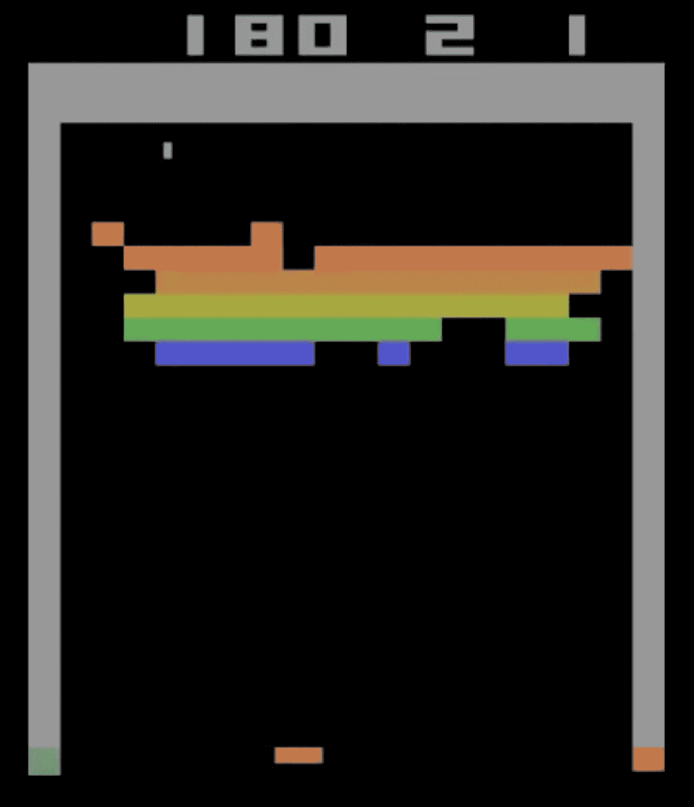
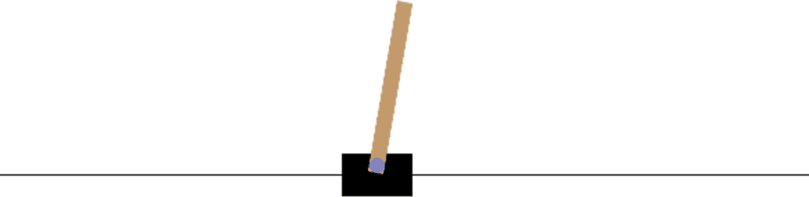
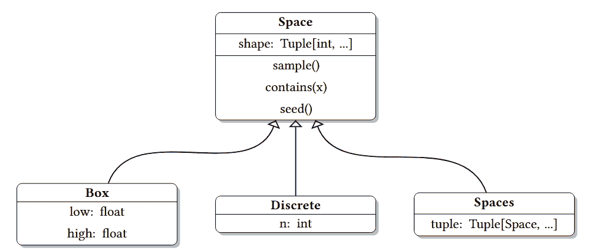
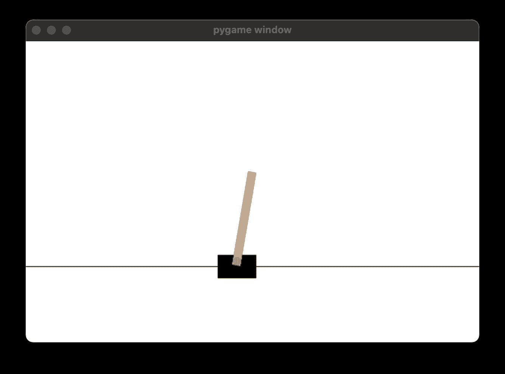

# 第二章：OpenAI Gym API 和 Gymnasium

在第一章中，我们讨论了强化学习（RL）的理论概念后，接下来让我们开始一些实际操作。在本章中，你将学习 Gymnasium 的基础知识，这是一种为 RL 智能体和大量 RL 环境提供统一 API 的库。最初，这个 API 是在 OpenAI Gym 库中实现的，但它不再维护。在本书中，我们将使用 Gymnasium——OpenAI Gym 的一个分支，实现在同一 API 下的功能。无论如何，统一的 API 让环境的细节无须担心，避免了编写冗余代码，从而可以用更通用的方式实现智能体。

你还将编写第一个随机行为的智能体，并进一步熟悉我们迄今为止覆盖的强化学习基本概念。到本章结束时，你将理解：

+   需要实现的高级要求，以便将智能体接入强化学习框架

+   一个基础的纯 Python 实现的随机强化学习智能体

+   OpenAI Gym API 及其实现 —— Gymnasium 库

# 智能体的结构

如你在上一章中学到的，强化学习中有几个基本概念：

+   智能体：执行主动角色的事物或人。在实践中，智能体是实现某种策略的一段代码。基本上，这个策略决定了在每个时间步上，根据我们的观察需要采取什么行动。

+   环境：一切外部于智能体的事物，负责提供观察和奖励。环境根据智能体的行为改变其状态。

让我们探索如何在 Python 中实现这两者，针对一个简单的情况。我们将定义一个环境，它会根据智能体的行为，在有限的步骤内给智能体随机奖励。这个场景在现实世界中并不十分有用，但它将帮助我们集中精力在环境和智能体类中的特定方法上。

请注意，本书中展示的代码片段并不是完整示例。你可以在 GitHub 页面找到完整的示例：[`github.com/PacktPublishing/Deep-Reinforcement-Learning-Hands-On-Third-Edition`](https://github.com/PacktPublishing/Deep-Reinforcement-Learning-Hands-On-Third-Edition) 并运行它们。

让我们从环境开始：

```py
class Environment: 
    def __init__(self): 
        self.steps_left = 10
```

在前面的代码中，我们允许环境初始化其内部状态。在我们的例子中，状态只是一个计数器，限制了智能体与环境交互的时间步数。

get_observation() 方法应该返回当前环境的观察信息给智能体。它通常实现为环境内部状态的某种函数：

```py
 def get_observation(self) -> List[float]: 
        return [0.0, 0.0, 0.0]
```

如果你对`-> List[float]`的含义感到好奇，那是 Python 类型注解的一个示例，这一功能是在 Python 3.5 中引入的。你可以在[`docs.python.org/3/library/typing.xhtml`](https://docs.python.org/3/library/typing.xhtml)中了解更多信息。在我们的示例中，观察向量始终为零，因为环境基本上没有内部状态。`get_actions()`方法允许代理查询它可以执行的动作集合：

```py
 def get_actions(self) -> List[int]: 
        return [0, 1]
```

通常，动作集合不会随时间变化，但某些动作在不同状态下可能变得不可行（例如，在井字棋的任何位置并不是每一步都可以走）。在我们的简单示例中，代理能执行的动作只有两种，它们分别用整数 0 和 1 表示。

以下方法向代理发出回合结束的信号：

```py
 def is_done(self) -> bool: 
        return self.steps_left == 0
```

正如你在第一章中看到的，环境与代理之间的一系列交互被分为一系列步骤，称为回合（episodes）。回合可以是有限的，比如棋局中的回合，或者是无限的，比如“旅行者 2 号”任务（这是一项著名的太空探测任务，发射已超过 46 年，且已越过我们的太阳系）。为了涵盖这两种情况，环境提供了一种方法，用来检测回合何时结束，并且无法再与其通信。

`action()`方法是环境功能的核心部分：

```py
 def action(self, action: int) -> float: 
        if self.is_done(): 
            raise Exception("Game is over") 
        self.steps_left -= 1 
        return random.random()
```

它做了两件事——处理代理的动作并返回该动作的奖励。在我们的示例中，奖励是随机的，其动作被丢弃。此外，我们更新了步骤计数，并且不会继续已经结束的回合。

现在，查看代理的部分会简单得多，仅包括两个方法：构造函数和执行环境中一步操作的方法：

```py
class Agent: 
    def __init__(self): 
        self.total_reward = 0.0
```

在构造函数中，我们初始化了一个计数器，用于记录代理在回合过程中累积的总奖励。

`step()`函数接受环境实例作为参数：

```py
 def step(self, env: Environment): 
        current_obs = env.get_observation() 
        actions = env.get_actions() 
        reward = env.action(random.choice(actions)) 
        self.total_reward += reward
```

该功能允许代理执行以下操作：

+   观察环境

+   根据观察结果做出关于采取哪种动作的决策

+   将动作提交给环境

+   获取当前步骤的奖励

对于我们的示例，代理很迟钝，在做出采取哪个动作的决策过程中忽略了获得的观察结果。相反，每个动作都是随机选择的。最后一部分是粘合代码，它创建了两个类并运行一个回合：

```py
if __name__ == "__main__": 
    env = Environment() 
    agent = Agent() 
    while not env.is_done(): 
        agent.step(env) 
    print("Total reward got: %.4f" % agent.total_reward)
```

你可以在本书的 GitHub 仓库中找到完整的代码，地址是 [`github.com/PacktPublishing/Deep-Reinforcement-Learning-Hands-On-Third-Edition`](https://github.com/PacktPublishing/Deep-Reinforcement-Learning-Hands-On-Third-Edition)，文件位于 Chapter02/01_agent_anatomy.py 中。它没有外部依赖，并且应该能在任何相对现代的 Python 版本中运行。通过多次运行，你将获得代理收集的不同数量的奖励。以下是我在我的机器上得到的输出：

```py
Chapter02$ python 01_agent_anatomy.py 
Total reward got: 5.8832
```

前述代码的简洁性展示了强化学习（RL）模型中重要的基本概念。环境可以是一个极其复杂的物理模型，而代理可以轻松地是一个大型神经网络（NN），实现最新的 RL 算法，但基本模式始终不变——在每一步，代理会从环境中获取一些观测，进行计算，并选择要执行的动作。这个动作的结果将是一个奖励和一个新的观测。

你可能会问，如果模式是一样的，为什么我们需要从头开始编写它？如果已经有人实现了它并且可以作为库使用呢？当然，确实存在这样的框架，但在我们花时间讨论它们之前，让我们先准备好你的开发环境。

# 硬件和软件要求

本书中的示例是使用 Python 3.11 版本实现并测试的。我假设你已经熟悉该语言以及虚拟环境等常见概念，因此我不会详细介绍如何安装软件包以及如何以隔离的方式进行操作。示例将使用之前提到的 Python 类型注解，这将使我们能够为函数和类方法提供类型签名。

目前，市面上有很多机器学习（ML）和强化学习（RL）库，但在本书中，我尽量将依赖项的数量保持在最低限度，优先考虑我们自己实现的方法，而不是盲目导入第三方库。

我们在本书中使用的外部库都是开源软件，包括以下内容：

+   NumPy：这是一个用于科学计算和实现矩阵运算及常用函数的库。

+   OpenCV Python 绑定：这是一个计算机视觉库，提供了许多图像处理功能。

+   来自 Farama Foundation 的 Gymnasium（[`farama.org`](https://farama.org)）：这是 OpenAI Gym 库（[`github.com/openai/gym`](https://github.com/openai/gym)）的一个维护版本，它是一个 RL 框架，拥有可以以统一方式进行通信的各种环境。

+   PyTorch：这是一个灵活且富有表现力的深度学习（DL）库。第三章将简要介绍它。

+   PyTorch Ignite: 这是一个基于 PyTorch 的高层次工具集，用于减少样板代码。在第三章中将简要介绍。完整文档可在此处查看：[`pytorch-ignite.ai/`](https://pytorch-ignite.ai/)。

+   PTAN: ([`github.com/Shmuma/ptan`](https://github.com/Shmuma/ptan)): 这是我创建的一个开源扩展，用于支持现代深度强化学习方法和构建模块。所有使用的类将详细描述，并附带源代码。

其他库将用于特定章节；例如，我们将使用 Microsoft TextWorld 来玩基于文本的游戏，PyBullet 和 MuJoCo 用于机器人仿真，Selenium 用于基于浏览器的自动化问题，等等。那些专门的章节将包括这些库的安装说明。

本书的很大一部分内容（第 2、3 和 4 部分）专注于过去几年中开发的现代深度强化学习（RL）方法。在这个上下文中，“深度”一词意味着深度学习（DL）的广泛应用。你可能已经知道，深度学习方法对计算资源的需求很高。一块现代图形处理单元（GPU）可以比即使是最快的多核中央处理单元（CPU）系统快 10 到 100 倍。实际上，这意味着在一个 GPU 系统上训练一小时的代码，即使是在最快的 CPU 系统上也可能需要半天到一周的时间。这并不意味着没有 GPU 你就不能尝试本书中的示例，但时间会更长。为了自己进行代码实验（学习任何东西最有用的方式），最好使用有 GPU 的机器。你可以通过以下几种方式来实现：

+   购买适合 CUDA 并支持 PyTorch 框架的现代 GPU。

+   使用云实例。Amazon Web Services 和 Google Cloud Platform 都可以提供 GPU 驱动的实例。

+   Google Colab 提供免费的 GPU 访问权限，适用于其 Jupyter 笔记本。

系统设置的说明超出了本书的范围，但互联网上有很多手册可以参考。在操作系统（OS）方面，你应该使用 Linux 或 macOS。Windows 被 PyTorch 和 Gymnasium 支持，但本书中的示例未在 Windows 操作系统上经过充分测试。

为了给你提供本书中将使用的外部依赖项的准确版本，以下是一个 requirements.txt 文件（请注意，它是用 Python 3.11 测试过的；不同版本可能需要调整依赖项或根本无法工作）：

```py
gymnasium[atari]==0.29.1 
gymnasium[classic-control]==0.29.1 
gymnasium[accept-rom-license]==0.29.1 
moviepy==1.0.3 
numpy<2 
opencv-python==4.10.0.84 
torch==2.5.0 
torchvision==0.20.0 
pytorch-ignite==0.5.1 
tensorboard==2.18.0 
mypy==1.8.0 
ptan==0.8.1 
stable-baselines3==2.3.2 
torchrl==0.6.0 
ray[tune]==2.37.0 
pytest
```

本书中的所有示例都是用 PyTorch 2.5.0 编写和测试的，可以通过访问[`pytorch.org`](https://pytorch.org) 网站上的说明进行安装（通常，只需使用 conda install pytorch torchvision -c pytorch 命令，或者根据你的操作系统，直接使用 pip install torch 命令）。

现在，让我们深入了解 OpenAI Gym API，它为我们提供了从简单到挑战性强的各种环境。

# OpenAI Gym API 与 Gymnasium

由 OpenAI 开发的 Python 库 Gym ([www.openai.com](https://www.openai.com))。第一个版本发布于 2017 年，从那时起，许多环境都已被开发或适配到这个原始 API，后者也成为了强化学习（RL）的事实标准。

在 2021 年，开发 OpenAI Gym 的团队将开发工作转移到了 Gymnasium ([github.com/Farama-Foundation/Gymnasium](https://github.com/Farama-Foundation/Gymnasium))——原始 Gym 库的一个分支。Gymnasium 提供相同的 API，并被认为是 Gym 的“直接替代品”（你可以写`import gymnasium as gym`，大部分情况下你的代码将正常运行）。

本书中的示例使用的是 Gymnasium，但为了简洁起见，文中会使用“Gym”。在极少数情况下，当差异确实重要时，我会使用“Gymnasium”。

Gym 的主要目标是通过统一的接口为 RL 实验提供丰富的环境集合。因此，库中的核心类是环境类，称为 Env。该类的实例暴露了几个方法和字段，提供关于其功能的必要信息。从高层次来看，每个环境都提供这些信息和功能：

+   允许在环境中执行的动作集合。Gym 支持离散和连续动作，以及它们的组合。

+   环境向代理提供的观察的形状和边界。

+   一个名为 step 的方法用于执行一个动作，该方法返回当前的观察、奖励以及指示该回合是否结束的标志。

+   一个名为 reset 的方法，它将环境恢复到初始状态并获取第一个观察。

现在，我们来详细讨论一下环境的这些组件。

## 动作空间

如前所述，代理可以执行的动作可以是离散的、连续的，或者是两者的组合。

离散动作是一组固定的、代理可以执行的动作，例如，在一个网格中的方向：左、右、上或下。另一个例子是按钮，按钮可以是按下或释放。两个状态是互斥的，这是离散动作空间的主要特征，在该空间中，每次只能从有限的动作集合中选择一个动作。

连续动作附带一个值，例如，方向盘可以转动到特定角度，或油门踏板可以以不同的力量踩下。连续动作的描述包括该动作可能具有的值的边界。对于方向盘来说，可能的值范围是-720 度到 720 度。对于油门踏板，通常范围是从 0 到 1。

当然，我们不仅仅局限于单个动作；环境可以执行多个动作，例如同时按下多个按钮或同时转动方向盘和踩两个踏板（刹车和油门）。为了支持这种情况，Gym 定义了一个特殊的容器类，允许将多个动作空间嵌套成一个统一的动作。

## 观测空间

如第一章所讨论，观测是环境在每个时间戳提供给智能体的信息，除了奖励之外。观测可以像一堆数字一样简单，或者像几个多维张量一样复杂，这些张量包含来自多个相机的彩色图像。观测甚至可以是离散的，类似于动作空间。离散观测空间的一个例子是灯泡，它可以处于两种状态——开或关——并以布尔值的形式给我们提供。

因此，您可以看到动作和观测之间的相似性，这就是它们在 Gym 类中表示的方式。让我们来看一个类图：

![tsuhpalpee::Dl TsaioSuSTmsnBwpppupc:o:alaplrxcecleeinfleeettos[S[(eapin)tatc,e .,..]...] cohnigtha:inflso(axt) seed () ](img/B22150_02_01.png)

图 2.1：Gym 中 Space 类的层级结构

基本的抽象 Space 类包括一个属性和三个对我们有用的方法：

+   shape：此属性包含空间的形状，与 NumPy 数组相同。

+   sample()：此方法返回空间中的一个随机样本。

+   contains(x)：此方法检查参数 x 是否属于该空间的领域。

+   seed()：此方法允许我们为空间及其所有子空间初始化一个随机数生成器。如果您希望在多个运行中获得可重复的环境行为，这非常有用。

所有这些方法都是抽象方法，并在每个 Space 子类中重新实现：

+   Discrete 类表示一个互斥的项目集合，编号从 0 到 n-1。如果需要，您可以通过可选的构造函数参数 start 重新定义起始索引。值 n 是我们 Discrete 对象描述的项目数量。例如，Discrete(n=4)可以用于四个方向的动作空间[左、右、上、下]。

+   Box 类表示一个具有区间[low, high]的有理数 n 维张量。例如，这可以是一个油门踏板，其值介于 0.0 和 1.0 之间，可以通过 Box(low=0.0, high=1.0, shape=(1,), dtype=np.float32)来编码。在这里，shape 参数被赋值为长度为 1 的元组，元组中只有一个值 1，这样就给我们一个一维的张量，其中包含一个值。dtype 参数指定空间的值类型，在这里，我们指定它为 NumPy 32 位浮动类型。另一个 Box 的例子可能是 Atari 屏幕的观察（稍后我们会涉及许多 Atari 环境），它是一个大小为 210 × 160 的 RGB（红色、绿色和蓝色）图像：Box(low=0, high=255, shape=(210, 160, 3), dtype=np.uint8)。在这种情况下，shape 参数是一个包含三个元素的元组：第一个维度是图像的高度，第二个是宽度，第三个是 3，分别对应于红色、绿色和蓝色的三个色彩通道。因此，总体来说，每个观察是一个具有 100,800 字节的三维张量。

+   空间的最终子类是 Tuple 类，它允许我们将多个 Space 类实例组合在一起。这使我们能够创建我们想要的任何复杂度的动作和观察空间。例如，假设我们想为一辆汽车创建一个动作空间的规范。汽车有多个控制项，每个控制项都可以在每个时间戳进行改变，包括方向盘角度、刹车踏板位置和油门踏板位置。这三个控制项可以通过一个单独的 Box 实例中的三个浮动值来指定。除了这些基本的控制项外，汽车还有额外的离散控制项，如转向信号（可以是关闭、右转或左转）或喇叭（开或关）。为了将这一切组合成一个动作空间规范类，我们可以使用以下代码：

    ```py
     Tuple(spaces=( 
        Box(low=-1.0, high=1.0, shape=(3,), dtype=np.float32), 
        Discrete(n=3), 
        Discrete(n=2) 
      ))
    ```

    这种灵活性很少被使用；例如，在本书中，你只会看到 Box 和离散的动作和观察空间，但在某些情况下，Tuple 类会很有用。

在 Gym 中还定义了其他的 Space 子类，例如 Sequence（表示可变长度序列）、Text（字符串）和 Graph（空间是一个节点集合，节点之间有连接）。但我们所描述的这三个子类是最常用的。

每个环境都有两个类型为 Space 的成员：action_space 和 observation_space。这使我们能够创建通用代码，可以与任何环境一起使用。当然，处理屏幕的像素与处理离散观察不同（因为在前一种情况下，我们可能希望通过卷积层或计算机视觉工具箱中的其他方法来预处理图像）；因此，大多数时候，这意味着要为特定环境或环境组优化代码，但 Gym 并不禁止我们编写通用代码。

## 环境

环境在 Gym 中由 Env 类表示，该类具有以下成员：

+   action_space：这是 Space 类的字段，提供有关环境中允许执行的动作的规范。

+   observation_space：这个字段属于相同的 Space 类，但指定了环境提供的观察。

+   reset()：此方法将环境重置为初始状态，返回初始观察向量以及来自环境的额外信息字典。

+   step()：这个方法允许智能体采取行动并返回有关行动结果的信息：

    +   下一个观察

    +   本地奖励

    +   回合结束标志

    +   标志，指示回合是否被截断

    +   一个包含环境额外信息的字典

    这个方法有点复杂，我们稍后会在本节中详细讨论。

在 Env 类中有额外的实用方法，比如 render()，它允许我们以人类友好的形式获取观察数据，但我们不会使用它们。你可以在 Gym 的文档中找到完整列表，但我们将专注于核心的 Env 方法：reset() 和 step()。

由于 reset 方法相对简单，我们将从它开始。reset() 方法没有参数；它指示环境重置为初始状态并获取初始观察。请注意，在创建环境后，你必须调用 reset()。正如你在第一章中记得的那样，智能体与环境的交互可能会有结束（比如“游戏结束”屏幕）。这种会话称为回合，在回合结束后，智能体需要重新开始。此方法返回的值是环境的第一次观察。

除了观察外，reset() 返回第二个值——包含额外环境特定信息的字典。大多数标准环境在此字典中不返回任何内容，但更复杂的环境（如 TextWorld——一个交互式小说游戏的模拟器；我们将在本书后面了解它）可能会返回一些不适合标准观察的数据。

step() 方法是环境功能的核心部分。它在一次调用中执行多个操作，具体如下：

+   告诉环境我们将在下一步执行的动作

+   获取这个行动后从环境中得到的新观察

+   获取智能体通过此步获得的奖励

+   获取回合是否结束的指示

+   获取信号，指示一个回合是否已被截断（例如启用时间限制时）

+   获取包含额外环境特定信息的字典

前述列表中的第一个项目（action）作为唯一参数传递给 step() 方法，其余内容由此方法返回。更准确地说，这是一个包含五个元素（observation, reward, done, truncated 和 info）的元组（Python 元组，而不是我们在上一节讨论的 Tuple 类）。它们具有以下类型和含义：

+   observation：这是一个包含观察数据的 NumPy 向量或矩阵。

+   reward：这是奖励的浮动值。

+   done: 这是一个布尔指示符，当回合结束时值为 True。如果这个值为 True，我们必须在环境中调用 reset()，因为不再可能进行任何动作。

+   truncated: 这是一个布尔指示符，当回合被截断时值为 True。对于大多数环境，这通常是一个 TimeLimit（限制回合时长的方式），但在某些环境中它可能有不同的含义。这个标志与 done 标志分开，因为在某些场景下，区分“代理到达回合结束”与“代理到达环境时间限制”可能会很有用。如果 truncated 为 True，我们还需要在环境中调用 reset()，就像处理 done 标志一样。

+   info: 这可能是与环境特定的额外信息，通常做法是在一般强化学习方法中忽略此值。

你可能已经对环境在代理代码中的使用方式有了一些了解——在循环中，我们调用 step()方法并执行一个动作，直到 done 或 truncated 标志变为 True。然后，我们可以调用 reset()重新开始。还有一个部分缺失——我们如何首先创建 Env 对象。

## 创建环境

每个环境都有一个唯一的名称，格式为 EnvironmentName-vN，其中 N 是区分同一环境不同版本的数字（例如，当修复了某些错误或做了其他重大更改时）。为了创建一个环境，gymnasium 包提供了 make(name)函数，其唯一参数是环境的名称字符串。

在撰写本文时，Gymnasium 版本 0.29.1（安装了[atari]扩展）包含了 1,003 个不同名称的环境。当然，并非所有这些环境都是独立的，因为这个列表包括了环境的所有版本。此外，相同的环境也可能在设置和观察空间中有所不同。例如，Atari 游戏 Breakout 有以下这些环境名称：

+   Breakout-v0, Breakout-v4: 原版 Breakout，球的位置和方向是随机的。

+   BreakoutDeterministic-v0, BreakoutDeterministic-v4: 初始位置和球速向量相同的 Breakout。

+   BreakoutNoFrameskip-v0, BreakoutNoFrameskip-v4: 每帧都展示给代理的 Breakout 环境。没有这个设置时，每个动作会执行多个连续帧。

+   Breakout-ram-v0, Breakout-ram-v4: 使用完整 Atari 模拟内存（128 字节）而非屏幕像素的 Breakout。

+   Breakout-ramDeterministic-v0, Breakout-ramDeterministic-v4: 使用相同初始状态的内存观察。

+   Breakout-ramNoFrameskip-v0, Breakout-ramNoFrameskip-v4: 无跳帧的内存观察。

总共为一个游戏有 12 个环境。如果你之前没见过，这是它的游戏截图：



图 2.2：Breakout 的游戏画面

即便去除这些重复项，Gymnasium 依然提供了一个令人印象深刻的 198 个独特环境的列表，这些环境可以分为几个组：

+   经典控制问题：这些是玩具任务，用于最优控制理论和强化学习论文中的基准测试或演示。它们通常简单，观察和动作空间的维度较低，但在实现算法时，它们作为快速检查是非常有用的。可以把它们看作是强化学习领域的“MNIST”（MNIST 是 Yann LeCun 提供的手写数字识别数据集，网址是 [`yann.lecun.com/exdb/mnist/`](http://yann.lecun.com/exdb/mnist/)）。

+   Atari 2600：这些是来自 1970 年代经典游戏平台的游戏，共有 63 款独特游戏。

+   算法问题：这些是旨在执行小型计算任务的问题，如复制观察到的序列或加法运算。

+   Box2D：这些是使用 Box2D 物理仿真器来学习行走或汽车控制的环境。

+   MuJoCo：这是另一种物理仿真器，用于解决多个连续控制问题。

+   参数调整：这是利用强化学习来优化神经网络参数。

+   玩具文本：这些是简单的网格世界文本环境。

当然，支持 Gym API 的强化学习环境的总数要大得多。例如，Farama 基金会维护了多个与特殊强化学习主题相关的代码库，如多智能体强化学习、3D 导航、机器人技术和网页自动化。此外，还有许多第三方代码库。你可以查看 [`gymnasium.farama.org/environments/third_party_environments`](https://gymnasium.farama.org/environments/third_party_environments) 了解相关信息。

够了！让我们来看看一个 Python 会话，演示如何使用 Gym 的环境。

## CartPole 会话

让我们应用我们的知识，探索 Gym 提供的最简单的强化学习（RL）环境之一。

```py
$ python 
>>> import gymnasium as gym 
>>> e = gym.make("CartPole-v1")
```

这里，我们导入了 gymnasium 包并创建了一个名为 CartPole 的环境。这个环境来自经典控制组，核心思想是控制底部附有杆子的平衡平台（见下图）。

这里的难点在于，这根杆子容易向左或向右倒，你需要通过每一步将平台移动到右侧或左侧来保持平衡。



图 2.3：CartPole 环境

这个环境的观察结果是包含有关杆质心 x 坐标、速度、与平台的角度以及角速度的四个浮点数。当然，通过一些数学和物理知识，将这些数字转换为动作来平衡杆并不复杂，但我们的问题是不同的——在不知道观察到的数字确切含义的情况下，只通过获取奖励来学习如何平衡这个系统。这个环境中的奖励为 1，在每个时间步上都会给出。本集结束直到杆子倒下，因此为了获得更多的累积奖励，我们需要以一种避免杆子倒下的方式平衡平台。

这个问题看起来可能很难，但在仅仅两章之内，我们将编写一个算法，能够在几分钟内轻松解决 CartPole，而不需要理解观察到的数字意味着什么。我们将只通过试错和一点强化学习的魔法来完成。

但现在，让我们继续我们的会话。

```py
>>> obs, info = e.reset() 
>>> obs 
array([ 0.02100407,  0.02762252, -0.01519943, -0.0103739 ], dtype=float32) 
>>> info 
{}
```

在这里，我们重置了环境并获得了第一个观察结果（我们始终需要重置新创建的环境）。正如我所说，观察结果是四个数字，所以这里没有什么意外。现在让我们来检查一下环境的动作和观察空间：

```py
>>> e.action_space 
Discrete(2) 
>>> e.observation_space 
Box([-4.8000002e+00 -3.4028235e+38 -4.1887903e-01 -3.4028235e+38], [4.8000002e+00 3.4028235e+38 4.1887903e-01 3.4028235e+38], (4,), float32)
```

action_space 字段是离散类型，所以我们的动作只能是 0 或 1，其中 0 表示向左推动平台，1 表示向右推动。观察空间是 Box(4,)，意味着一个四个数字的向量。在 observation_space 字段中显示的第一个列表是参数的低边界，第二个列表是高边界。

如果你好奇的话，你可以查看 Gymnasium 仓库中 cartpole.py 文件中的环境源代码，位于 [`github.com/Farama-Foundation/Gymnasium/blob/main/gymnasium/envs/classic_control/cartpole.py#L40`](https://github.com/Farama-Foundation/Gymnasium/blob/main/gymnasium/envs/classic_control/cartpole.py#L40)。CartPole 类的文档字符串提供了所有细节，包括观察的语义：

+   小车位置：值在 −4.8…4.8 范围内

+   小车速度：值在 −∞…∞ 范围内

+   杆角度：弧度值在 −0.418…0.418 范围内

+   杆角速度：值在 −∞…∞ 范围内

Python 使用 float32 的最大和最小值来表示无穷大，这就是为什么边界向量中的某些条目具有 10³⁸ 规模值的内部细节。这些内部细节很有趣，但绝对不需要使用 RL 方法来解决环境问题。让我们进一步发送一个动作到环境中：

```py
>>> e.step(0) 
(array([-0.01254663, -0.22985364, -0.01435183,  0.24902613], dtype=float32), 1.0, False, False, {})
```

在这里，我们通过执行动作 0 将平台向左推动，并得到了一个五个元素的元组：

+   一个新的观察结果，即一个新的四个数字的向量

+   奖励为 1.0

+   done 标志值为 False，表示本集尚未结束，我们对平衡杆的掌握还算可以。

+   截断标志值为 False，表示本集未被截断

+   关于环境的额外信息，这是一个空字典

接下来，我们将使用 Space 类的 sample() 方法，分别作用于 action_space 和 observation_space。

```py
>>> e.action_space.sample() 
0 
>>> e.action_space.sample() 
1 
>>> e.observation_space.sample() 
array([-4.05354548e+00, -1.13992760e+38, -1.21235274e-01,  2.89040989e+38], 
     dtype=float32) 
>>> e.observation_space.sample() 
array([-3.6149189e-01, -1.0301251e+38, -2.6193827e-01, -2.6395525e+36], 
     dtype=float32)
```

这个方法返回了底层空间的一个随机样本，对于我们的离散动作空间来说，意味着一个随机的 0 或 1，而对于观测空间来说，意味着一个四个数字的随机向量。观测空间的随机样本并不特别有用，但来自动作空间的样本可以在我们不确定如何执行某个动作时使用。这个功能特别方便，因为你还不懂任何强化学习方法，但我们仍然想在 Gym 环境中玩玩。既然你已经学到了足够的知识来实现你的第一个随机行为的 CartPole 智能体，那么我们开始吧。

# 随机 CartPole 智能体

尽管环境比我们在 2.1 节中第一个例子要复杂得多，但智能体的代码要简短得多。这就是可重用性、抽象和第三方库的强大之处！

下面是代码（你可以在 Chapter02/02_cartpole_random.py 中找到它）：

```py
import gymnasium as gym 

if __name__ == "__main__": 
    env = gym.make("CartPole-v1") 
    total_reward = 0.0 
    total_steps = 0 
    obs, _ = env.reset()
```

在这里，我们创建了环境并初始化了步数计数器和奖励累加器。在最后一行，我们重置了环境以获得第一个观测值（我们不会使用它，因为我们的智能体是随机的）：

```py
 while True: 
        action = env.action_space.sample() 
        obs, reward, is_done, is_trunc, _ = env.step(action) 
        total_reward += reward 
        total_steps += 1 
        if is_done: 
            break 

    print("Episode done in %d steps, total reward %.2f" % (total_steps, total_reward))
```

在上面的循环中，采样一个随机动作后，我们要求环境执行该动作并返回下一个观测值（obs）、奖励、is_done 和 is_trunc 标志。如果回合结束，我们就停止循环，并显示我们走了多少步，累计了多少奖励。如果你运行这个示例，你会看到类似这样的输出（虽然不完全相同，因为智能体是随机的）：

```py
Chapter02$ python 02_cartpole_random.py 
Episode done in 12 steps, total reward 12.00
```

平均而言，我们的随机智能体在杆子倒下并且回合结束之前大约需要 12 到 15 步。Gym 中的大多数环境都有一个“奖励边界”，这是智能体在 100 个连续回合中应获得的平均奖励，以“解决”该环境。对于 CartPole，这个边界是 195，这意味着，平均而言，智能体必须保持杆子 195 个时间步长或更长时间。用这个角度来看，我们的随机智能体表现得很差。然而，不要失望；我们才刚刚开始，很快你就能解决 CartPole 和许多更有趣、更具挑战性的环境。

# 额外的 Gym API 功能

到目前为止，我们讨论的内容涵盖了 Gym 核心 API 的三分之二以及开始编写智能体所需的基本功能。其余的 API 你可以不使用，但它会让你的生活更轻松，代码更简洁。所以，让我们简要地讲解一下剩下的 API。

## 包装器

很多时候，你可能希望以某种通用的方式扩展环境的功能。例如，假设一个环境给你一些观察结果，但你希望将这些结果积累到某个缓冲区中，并提供给智能体最近的 N 个观察结果。这是动态计算机游戏中的常见场景，因为单一的帧画面不足以获取游戏状态的完整信息。另一个例子是，当你希望能够裁剪或预处理图像的像素，使其更方便智能体处理，或者你希望以某种方式对奖励分数进行归一化处理。这类情况有很多，它们的结构相同——你想“包装”现有的环境，并添加一些额外的逻辑来完成某些操作。Gym 提供了一个方便的框架——Wrapper 类。

类的结构如图 2.4 所示。



图 2.4：Gym 中 Wrapper 类的层次结构

Wrapper 类继承自 Env 类。它的构造函数接受一个参数——要“包装”的 Env 类实例。为了添加额外的功能，你需要重新定义想要扩展的方法，例如 step() 或 reset()。唯一的要求是调用父类的原始方法。为了简化对被包装环境的访问，Wrapper 类有两个属性：env，表示我们正在包装的直接环境（它也可以是另一个 wrapper），以及 unwrapped，表示没有任何包装器的 Env 环境。

为了处理更具体的需求，例如一个只想处理环境中的观察结果或仅仅处理动作的 Wrapper 类，Gym 提供了一些 Wrapper 的子类，它们允许过滤特定的信息部分。它们如下所示：

+   ObservationWrapper：你需要重新定义父类的 observation(obs) 方法。obs 参数是来自被包装环境的观察结果，该方法应返回将提供给智能体的观察值。

+   RewardWrapper：这个类暴露了 reward(rew) 方法，可以修改赋予智能体的奖励值，例如，将其缩放到所需的范围，基于某些之前的动作添加折扣，或类似的操作。

+   ActionWrapper：你需要重写 action(a) 方法，它可以调整智能体传递给被包装环境的动作。

为了使其稍微更具实用性，让我们想象一种情况，我们希望干预智能体发送的动作流，并且以 10%的概率将当前动作替换为随机动作。这可能看起来是一个不明智的做法，但这个简单的技巧是我们在第一章提到的探索/利用问题的最实用和最强大的解决方法之一。通过发出随机动作，我们让智能体探索环境，并时不时地偏离其策略的固有轨迹。这是一个通过使用 ActionWrapper 类（完整示例见 Chapter02/03_random_action_wrapper.py）轻松实现的事情：

```py
import gymnasium as gym 
import random 

class RandomActionWrapper(gym.ActionWrapper): 
    def __init__(self, env: gym.Env, epsilon: float = 0.1): 
        super(RandomActionWrapper, self).__init__(env) 
        self.epsilon = epsilon
```

在这里，我们通过调用父类的 __init__ 方法并保存 epsilon（随机动作的概率）来初始化我们的包装器。

以下是我们需要从父类重写的方法，用于调整智能体的动作：

```py
 def action(self, action: gym.core.WrapperActType) -> gym.core.WrapperActType: 
        if random.random() < self.epsilon: 
            action = self.env.action_space.sample() 
            print(f"Random action {action}") 
            return action 
        return action
```

每次我们掷骰子时，凭借 epsilon 的概率，我们从动作空间中采样一个随机动作并返回，而不是返回智能体发送给我们的动作。请注意，使用 action_space 和包装器抽象，我们能够编写抽象代码，这段代码可以与 Gym 中的任何环境一起工作。我们还在控制台上打印了消息，仅仅是为了说明我们的包装器正在工作。在生产代码中，当然不需要这么做。

现在是时候应用我们的包装器了。我们将创建一个普通的 CartPole 环境，并将其传递给我们的 Wrapper 构造函数：

```py
if __name__ == "__main__": 
    env = RandomActionWrapper(gym.make("CartPole-v1"))
```

从现在起，我们将把我们的包装器当作一个普通的 Env 实例来使用，而不是原始的 CartPole。由于 Wrapper 类继承了 Env 类并暴露了相同的接口，我们可以根据需要将包装器嵌套得很深。这是一个强大、优雅和通用的解决方案。

这里的代码几乎与随机智能体中的代码相同，只不过每次我们发出相同的动作 0，所以我们的智能体显得呆板，一直做同样的事情：

```py
 obs = env.reset() 
    total_reward = 0.0 

    while True: 
        obs, reward, done, _, _ = env.step(0) 
        total_reward += reward 
        if done: 
            break 

    print(f"Reward got: {total_reward:.2f}")
```

运行代码后，你应该能看到包装器确实在工作：

```py
Chapter02$ python 03_random_action_wrapper.py 
Random action 0 
Random action 0 
Reward got: 9.00
```

现在我们应该继续，看看在执行期间如何渲染你的环境。

## 渲染环境

另一个你应该了解的可能性是渲染环境。它是通过两个包装器实现的：HumanRendering 和 RecordVideo。

这两个类替代了 OpenAI Gym 库中已被移除的原始 Monitor 包装器。这个类能够将有关智能体表现的信息记录到文件中，并可选地记录智能体动作的视频。

使用 Gymnasium 库，你可以通过两个类来检查环境内部的情况。第一个是 HumanRendering，它打开一个单独的图形窗口，在该窗口中，环境中的图像会以交互方式显示。为了能够渲染环境（在我们的例子中是 CartPole），必须使用 render_mode="rgb_array" 参数进行初始化。这个参数告诉环境返回来自其 render() 方法的像素，而该方法由 HumanRendering 包装器调用。

因此，要使用 HumanRenderer 包装器，你需要修改随机代理的代码（完整代码位于 Chapter02/04_cartpole_random_monitor.py）：

```py
if __name__ == "__main__": 
    env = gym.make("CartPole-v1", render_mode="rgb_array") 
    env = gym.wrappers.HumanRendering(env)
```

如果你启动代码，带有环境渲染的窗口将会出现。由于我们的代理无法保持平衡杆太长时间（最多 10-30 步），一旦调用 env.close() 方法，窗口会很快消失。



图 2.5：通过 HumanRendering 渲染的 CartPole 环境

另一个可能有用的包装器是 RecordVideo，它捕获环境中的像素并生成一个展示代理行为的视频文件。它与 human renderer 的使用方式相同，但需要一个额外的参数来指定存储视频文件的目录。如果目录不存在，它会被创建：

```py
if __name__ == "__main__": 
    env = gym.make("CartPole-v1", render_mode="rgb_array") 
    env = gym.wrappers.RecordVideo(env, video_folder="video")
```

启动代码后，它会报告所生成视频的名称：

```py
Chapter02$ python 04_cartpole_random_monitor.py 
Moviepy - Building video Chapter02/video/rl-video-episode-0.mp4\. 
Moviepy - Writing video Chapter02/video/rl-video-episode-0.mp4 

Moviepy - Done ! 
Moviepy - video ready Chapter02/video/rl-video-episode-0.mp4 
Episode done in 30 steps, total reward 30.00
```

这个包装器特别有用，当你在没有 GUI 的远程机器上运行代理时。

## 更多包装器

Gymnasium 提供了许多其他的包装器，我们将在接下来的章节中使用。它可以对 Atari 游戏图像进行标准化预处理，进行奖励归一化，堆叠观察帧，进行环境向量化，设置时间限制等。

可用的完整包装器列表可以在文档中找到，[`gymnasium.farama.org/api/wrappers/`](https://gymnasium.farama.org/api/wrappers/)，也可以在源代码中查看。

# 总结

你已经开始学习强化学习的实践部分！在这一章中，我们使用了 Gymnasium，探索了其众多可以使用的环境。我们研究了它的基本 API，并创建了一个随机行为的代理。

你还学习了如何以模块化的方式扩展现有环境的功能，并且熟悉了通过包装器渲染代理活动的方式。这将在接下来的章节中得到广泛应用。

在下一章中，我们将使用 PyTorch 进行快速的深度学习回顾，PyTorch 是最广泛使用的深度学习工具包之一。
