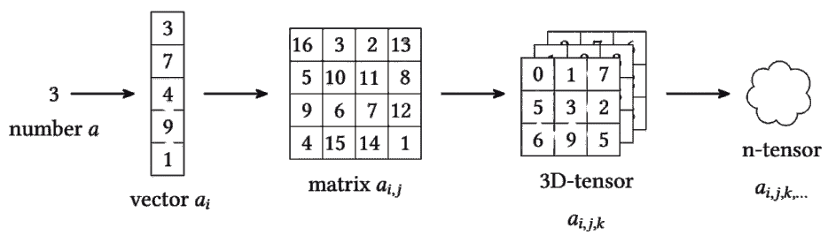
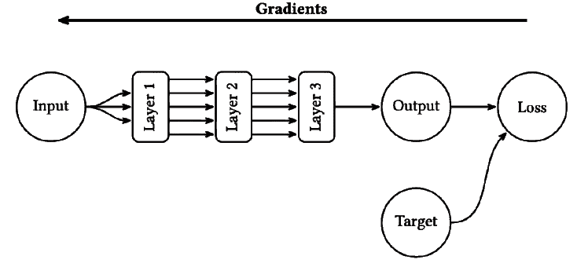
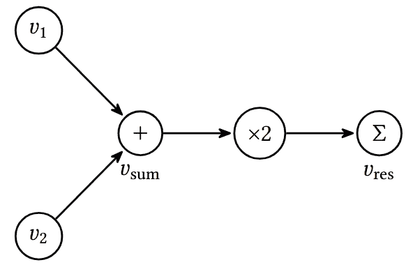
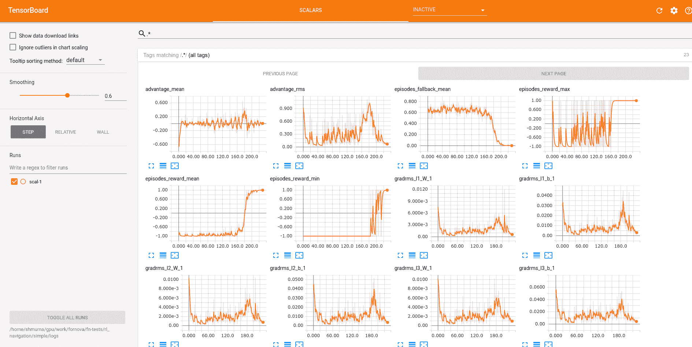
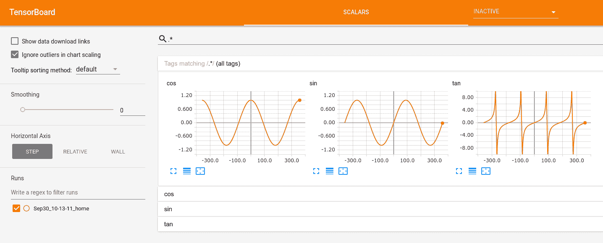
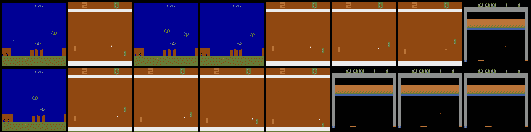

# 第三章：使用 PyTorch 进行深度学习

在前一章中，你已经熟悉了开源库，它们为你提供了一系列强化学习（RL）环境。然而，强化学习的最新发展，特别是与深度学习（DL）结合后，使得现在可以解决比以往更具挑战性的问题。这在某种程度上归功于深度学习方法和工具的发展。本章专门介绍了其中一个工具——PyTorch，它使我们能够用少量的 Python 代码实现复杂的深度学习模型。

本章并不假设自己是一本完整的深度学习手册，因为这一领域非常广泛且动态；然而，我们将涵盖：

+   PyTorch 库的具体细节和实现方式（假设你已经熟悉深度学习的基础）

+   基于 PyTorch 的高级库，旨在简化常见的深度学习问题

+   本章示例中将使用 PyTorch Ignite 库

本章中的所有示例都已更新为最新的（在写作时）PyTorch 2.3.1，相较于第二版书中使用的 1.3.0 版本有所变化。如果你还在使用旧版 PyTorch，建议升级。在本章中，我们将讨论最新版本中的差异。

# 张量

张量是所有深度学习工具包的基本构建块。这个名字听起来有些神秘，但其背后的基本思想是，张量只是一个多维数组。借用学校数学的类比，一个数字像一个点，是零维的；向量像一个线段，是一维的；矩阵是一个二维对象。三维的数字集合可以通过一个立方体的数字表示，但它们不像矩阵那样有一个独立的名称。我们可以保留“张量”这个术语来表示更高维度的集合。



图 3.1：从一个数字到 n 维张量的转换

关于深度学习中使用的张量，还有一个需要注意的点是，它们与张量微积分或张量代数中使用的张量仅部分相关。在深度学习中，张量是任何多维数组，但在数学中，张量是向量空间之间的映射，在某些情况下可能表现为多维数组，但其背后有更丰富的语义负载。数学家通常会对那些用已建立的数学术语命名不同事物的人表示不满，因此需要警惕！

# 张量的创建

由于本书中会到处使用张量，我们需要熟悉它们的基本操作，而最基本的操作就是如何创建一个张量。创建张量有几种方式，你的选择可能会影响代码的可读性和性能。

如果你熟悉 NumPy 库（而且你应该熟悉），那么你已经知道它的主要目的是以通用方式处理多维数组。尽管在 NumPy 中，这些数组没有被称为张量，但它们实际上就是张量。张量在科学计算中被广泛使用，作为数据的通用存储方式。例如，一张彩色图像可以被编码为一个三维张量，维度分别是宽度、高度和颜色通道。除了维度，张量还由其元素的类型来表征。PyTorch 支持 13 种类型：

+   四种浮点类型：16 位、32 位和 64 位。16 位浮点数有两种变体：`float16` 提供更多的精度位，而 `bfloat16` 具有更大的指数部分。

+   三种复杂类型：32 位、64 位和 128 位

+   五种整数类型：8 位有符号、8 位无符号、16 位有符号、32 位有符号和 64 位有符号

+   布尔类型

也有四种“量化数值”类型，但它们使用的是前面提到的类型，只是采用不同的位表示和解释方式。

不同类型的张量由不同的类表示，最常用的有 `torch.FloatTensor`（对应 32 位浮点数）、`torch.ByteTensor`（8 位无符号整数）和 `torch.LongTensor`（64 位有符号整数）。你可以在文档中查找其他张量类型的名称。

在 PyTorch 中，有三种创建张量的方法：

+   通过调用所需类型的构造函数来创建。

+   通过让 PyTorch 为你创建一个包含特定数据的张量。例如，你可以使用 `torch.zeros()` 函数创建一个填充零值的张量。

+   通过将 NumPy 数组或 Python 列表转换为张量。在这种情况下，张量的类型将取决于数组的类型。

为了给你展示这些方法的例子，让我们看一个简单的会话：

```py
$ python 
>>> import torch 
>>> import numpy as np 
>>> a = torch.FloatTensor(3, 2) 
>>> a 
tensor([[0., 0.], 
       [0., 0.], 
       [0., 0.]])
```

在这里，我们导入了 PyTorch 和 NumPy，并创建了一个新的大小为 3 × 2 的浮点张量。正如你所看到的，PyTorch 会用零来初始化内存，这与以前的版本不同。之前，它只是分配了内存并保持未初始化状态，虽然这样更快，但不太安全（因为可能会引入棘手的 bug 和安全问题）。不过，你不应该依赖这种行为，因为它可能会发生变化（或在不同硬件后端上表现不同），所以始终应该初始化张量的内容。为此，你可以使用其中一种张量构造操作符：

```py
>>> torch.zeros(3, 4) 
tensor([[0., 0., 0., 0.], 
       [0., 0., 0., 0.], 
       [0., 0., 0., 0.]])
```

或者你可以调用张量修改方法：

```py
>>> a.zero_() 
tensor([[0., 0.], 
       [0., 0.], 
       [0., 0.]])
```

张量有两种操作类型：原地操作和函数式操作。原地操作会在名称后附加一个下划线，并对张量的内容进行操作。操作完成后，返回的是原始对象本身。函数式操作则会创建张量的一个副本，并进行修改，原始张量保持不变。从性能和内存角度看，原地操作通常更高效，但修改现有张量（尤其是当它在不同代码片段中共享时）可能会引发潜在的 bug。

通过构造函数创建张量的另一种方法是提供一个 Python 可迭代对象（例如，列表或元组），该对象将作为新创建的张量的内容：

```py
>>> torch.FloatTensor([[1,2,3],[3,2,1]]) 
tensor([[1., 2., 3.], 
       [3., 2., 1.]])
```

在这里，我们通过 NumPy 数组创建相同的零张量：

```py
>>> n = np.zeros(shape=(3, 2)) 
>>> n 
array([[0., 0.], 
      [0., 0.], 
      [0., 0.]]) 
>>> b = torch.tensor(n) 
>>> b 
tensor([[0., 0.], 
       [0., 0.], 
       [0., 0.]], dtype=torch.float64)
```

torch.tensor 方法接受 NumPy 数组作为参数，并从中创建一个适当形状的张量。在前面的示例中，我们创建了一个初始化为零的 NumPy 数组，默认创建了一个双精度（64 位浮动）数组。因此，生成的张量具有 DoubleTensor 类型（在示例中通过 dtype 值显示）。通常，在深度学习中，不需要双精度，并且它会增加额外的内存和性能开销。常见做法是使用 32 位浮动类型，甚至 16 位浮动类型，这已经足够。要创建这样的张量，您需要明确指定 NumPy 数组的类型：

```py
>>> n = np.zeros(shape=(3, 2), dtype=np.float32) 
>>> torch.tensor(n) 
tensor([[0., 0.], 
       [0., 0.], 
       [0., 0.]])
```

作为一种选择，所需张量的类型可以通过 dtype 参数提供给 torch.tensor 函数。然而，请小心，因为此参数期望的是 PyTorch 类型规范，而不是 NumPy 类型规范。PyTorch 类型存储在 torch 包中，例如 torch.float32、torch.uint8 等。

```py
>>> n = np.zeros(shape=(3,2)) 
>>> torch.tensor(n, dtype=torch.float32) 
tensor([[0., 0.], 
       [0., 0.], 
       [0., 0.]])
```

兼容性说明

torch.tensor()方法和显式的 PyTorch 类型指定功能是在 0.4.0 版本中添加的，这是简化张量创建的一个步骤。在之前的版本中，推荐使用 torch.from_numpy()函数来转换 NumPy 数组，但它在处理 Python 列表和 NumPy 数组组合时存在问题。为了向后兼容，这个 from_numpy()函数仍然存在，但它已被弃用，推荐使用更灵活的 torch.tensor()方法。

## 标量张量

从 0.4.0 版本开始，PyTorch 支持零维张量，这些张量对应标量值（如图 3.1 左侧所示）。这类张量可以是某些操作的结果，例如对张量中所有值的求和。此前，此类情况通过创建一个维度为 1 的单维张量（也称为向量）来处理。

这个解决方案有效，但并不简单，因为需要额外的索引才能访问值。现在，零维张量已被原生支持，并由相应的函数返回，可以通过 torch.tensor()函数创建。要访问此类张量的实际 Python 值，可以使用特殊的 item()方法：

```py
>>> a = torch.tensor([1,2,3]) 
>>> a 
tensor([1, 2, 3]) 
>>> s = a.sum() 
>>> s 
tensor(6) 
>>> s.item() 
6 
>>> torch.tensor(1) 
tensor(1)
```

## 张量操作

你可以对张量执行许多操作，操作种类太多，无法一一列举。通常，只需在 PyTorch 文档中搜索[`pytorch.org/docs/`](http://pytorch.org/docs/)即可。我需要提到的是，有两个地方可以查找操作：

+   torch 包：该函数通常接受张量作为参数。

+   tensor 类：该函数操作于被调用的张量。

大多数时候，PyTorch 中的张量操作都是试图与其 NumPy 对应的功能相匹配，因此，如果 NumPy 中有一些不太特殊的函数，那么很有可能 PyTorch 也会有类似的函数。比如 torch.stack()、torch.transpose() 和 torch.cat()。这非常方便，因为 NumPy 是一个广泛使用的库（尤其在科学界），因此你的 PyTorch 代码可以被任何熟悉 NumPy 的人读取，而无需查阅文档。

## GPU 张量

PyTorch 透明地支持 CUDA GPU，这意味着所有操作都有两个版本——CPU 和 GPU——并且会自动选择。这个选择是基于你正在操作的张量类型来决定的。

我提到的每种张量类型都是针对 CPU 的，并且都有其 GPU 对应版本。唯一的区别是，GPU 张量位于 torch.cuda 包中，而不是仅仅在 torch 中。例如，torch.FloatTensor 是一个 32 位浮动张量，驻留在 CPU 内存中，但 torch.cuda.FloatTensor 是它的 GPU 对应张量。

实际上，在 PyTorch 的底层，不仅支持 CPU 和 CUDA，还引入了后端的概念，这是一种带有内存的抽象计算设备。张量可以分配到后端的内存中，并且可以在其上进行计算。例如，在苹果硬件上，PyTorch 支持作为名为 mps 的后端的 Metal 性能着色器（MPS）。在本章中，我们将重点讨论 CPU 和 GPU 作为最常用的后端，但你的 PyTorch 代码也可以在更高级的硬件上执行，而无需做重大修改。

要从 CPU 转换到 GPU，可以使用张量方法 to(device)，该方法会将张量的副本创建到指定的设备（可以是 CPU 或 GPU）。如果张量已经在该设备上，则什么也不发生，原始张量将被返回。设备类型可以通过不同方式指定。首先，你可以直接传递设备的字符串名称，对于 CPU 内存是 "cpu"，对于 GPU 是 "cuda"。GPU 设备可以在冒号后面指定一个可选的设备索引；例如，系统中的第二张 GPU 卡可以通过 "cuda:1" 来表示（索引是从零开始的）。

在 to() 方法中，指定设备的另一种略微更高效的方式是使用 torch.device 类，它接受设备名称和可选的索引。要访问张量当前所在的设备，可以使用设备属性：

```py
>>> a = torch.FloatTensor([2,3]) 
>>> a 
tensor([2., 3.]) 
>>> ca = a.to(’cuda’) 
>>> ca 
tensor([2., 3.], device=’cuda:0’)
```

在这里，我们创建了一个位于 CPU 上的张量，然后将其复制到 GPU 内存中。两个副本都可以用于计算，并且所有与 GPU 相关的机制对用户是透明的：

```py
>>> a+1 
tensor([3., 4.]) 
>>> ca + 1 
tensor([3., 4.], device=’cuda:0’) 
>>> ca.device 
device(type=’cuda’, index=0)
```

`to()` 方法和 `torch.device` 类在 0.4.0 版本中引入。在早期版本中，CPU 和 GPU 之间的复制是通过单独的张量方法 `cpu()` 和 `cuda()` 来完成的，这需要添加额外的代码行来显式地将张量转换为它们的 CUDA 版本。在新的 PyTorch 版本中，你可以在程序开始时创建一个所需的 `torch.device` 对象，并在每个创建的张量上使用 `to(device)`。旧的张量方法 `cpu()` 和 `cuda()` 仍然存在，并且如果你希望确保张量在 CPU 或 GPU 内存中，不管它原来的位置在哪里，它们仍然可能会派上用场。

# 梯度

即使有透明的 GPU 支持，所有这些与张量的“跳舞”也毫无意义，除非有一个“杀手级功能” —— 自动计算梯度。这个功能最早在 Caffe 工具包中实现，后来成为了深度学习库中的事实标准。

早期，手动计算梯度是一个非常痛苦的过程，甚至对于最简单的神经网络（NN）来说也是如此。你需要为所有的函数计算导数，应用链式法则，然后实现计算结果，祈祷一切都能正确完成。这可能是理解深度学习核心机制的一个有用练习，但它绝对不是你愿意通过不断尝试不同的神经网络架构来反复做的事。

幸运的是，那些日子已经过去了，就像用烙铁和真空管编程硬件一样！现在，定义一个有数百层的神经网络，仅需要将它从预定义的构建块中组装起来，或者在你做一些特别的事情时，手动定义变换表达式。

所有的梯度将会被仔细计算、反向传播，并应用到网络中。为了实现这一点，你需要使用深度学习库的基本组件来定义你的网络架构。在图 3.2 中，我概述了数据和梯度在优化过程中的流动方向：



图 3.2：数据和梯度流经神经网络

产生根本性差异的因素可能是你计算梯度的方式。这里有两种方法：

+   静态图：在这种方法中，你需要提前定义你的计算过程，并且之后无法更改它们。图形将在任何计算执行之前由深度学习库处理和优化。这种模型在 TensorFlow（2.0 之前的版本）、Theano 和许多其他深度学习工具包中实现。

+   动态图：你不需要提前精确定义你的图形如何执行；你只需要在实际数据上执行你希望用于数据转换的操作。在此过程中，库会记录执行操作的顺序，当你要求它计算梯度时，它会展开其操作历史，累积网络参数的梯度。这个方法也叫做笔记本梯度，它在 PyTorch、Chainer 和其他一些框架中得到了实现。

两种方法各有优缺点。例如，静态图通常更快，因为所有计算可以移动到 GPU 上，从而最小化数据传输开销。此外，在静态图中，库在优化计算顺序，甚至删除图形的一部分时，拥有更多的自由度。

另一方面，尽管动态图具有更高的计算开销，但它为开发者提供了更多的自由度。例如，开发者可以说，“对于这一块数据，我可以应用这个网络两次，而对于另一块数据，我会使用完全不同的模型，并且对梯度进行批均值裁剪”。动态图模型的另一个非常吸引人的优点是，它允许你以更自然、更“Pythonic”的方式表达转换。最终，这不过是一个包含一堆函数的 Python 库，所以只需要调用它们，让库来完成魔法。

自 2.0 版本以来，PyTorch 引入了 torch.compile 函数，通过 JIT 编译将代码转化为优化后的内核，从而加速 PyTorch 代码的执行。这是早期版本中 TorchScript 和 FX Tracing 编译方法的演变。

从历史角度来看，这非常有趣，最初完全不同的 TensorFlow（静态图）和 PyTorch（动态图）方法如何随着时间推移逐渐融合在一起。如今，PyTorch 支持 compile()，而 TensorFlow 则有了“急切执行模式”。

## 张量与梯度

PyTorch 张量具有内建的梯度计算和跟踪机制，所以你只需要将数据转换为张量，并使用 torch 提供的张量方法和函数进行计算。当然，如果你需要访问底层的细节，也可以，但大多数情况下，PyTorch 会按照你的预期工作。

每个张量都有几个与梯度相关的属性：

+   grad：一个属性，保存一个形状相同的张量，包含计算出的梯度。

+   is_leaf：如果该张量是用户构造的，则为 True；如果该对象是函数转换的结果（换句话说，计算图中有父节点），则为 False。

+   requires_grad：如果这个张量需要计算梯度，则为 True。这个属性从叶张量继承而来，叶张量在构造时就会得到这个值（如 torch.zeros() 或 torch.tensor() 等）。默认情况下，构造函数的 requires_grad=False，因此如果你希望为张量计算梯度，你需要明确指定。

为了让所有这些梯度-叶节点机制更加清晰，让我们考虑一下这个会话：

```py
>>> v1 = torch.tensor([1.0, 1.0], requires_grad=True) 
>>> v2 = torch.tensor([2.0, 2.0])
```

在这里，我们创建了两个张量。第一个需要计算梯度，第二个则不需要。

接下来，我们对两个向量按元素加法（即向量 [3, 3]）进行了操作，随后将每个元素乘以 2 并相加：

```py
>>> v_sum = v1 + v2 
>>> v_sum 
tensor([3., 3.], grad_fn=<AddBackward0>) 
>>> v_res = (v_sum*2).sum() 
>>> v_res 
tensor(12., grad_fn=<SumBackward0>)
```

结果是一个零维张量，其值为 12。好的，到目前为止这只是一个简单的数学运算。现在，让我们来看看我们表达式所创建的底层图：



图 3.3：表达式的图表示

如果我们检查张量的属性，就会发现 v1 和 v2 是唯一的叶节点，并且除 v2 外的每个变量都需要计算梯度：

```py
>>> v1.is_leaf, v2.is_leaf 
(True, True) 
>>> v_sum.is_leaf, v_res.is_leaf 
(False, False) 
>>> v1.requires_grad 
True 
>>> v2.requires_grad 
False 
>>> v_sum.requires_grad 
True 
>>> v_res.requires_grad 
True
```

如你所见，属性 requires_grad 是有“粘性”的：如果参与计算的变量之一将其设置为 True，那么所有后续节点也将继承这个属性。这是合乎逻辑的行为，因为我们通常需要对计算过程中的所有中间步骤计算梯度。但是，“计算”并不意味着它们会被保留在 .grad 字段中。为了内存效率，只有要求计算梯度的叶节点会保存梯度。如果你希望在非叶节点中保留梯度，你需要调用它们的 retain_grad() 方法，这样 PyTorch 就会告诉它们保留梯度。

现在，让我们告诉 PyTorch 计算我们图的梯度：

```py
>>> v_res.backward() 
>>> v1.grad 
tensor([2., 2.])
```

通过调用 backward 函数，我们让 PyTorch 计算 v_res 变量相对于图中其他变量的数值导数。换句话说，v_res 变量的小幅变化对图中其他部分的影响是什么？在我们的这个例子中，v1 梯度中的值 2 表示通过将 v1 的任何元素增加 1，v_res 的结果值将增加 2。

如前所述，PyTorch 只计算要求计算梯度的叶张量的梯度。事实上，如果我们尝试检查 v2 的梯度，我们将不会得到任何结果：

```py
>>> v2.grad
```

这样做的原因是为了提高计算和内存的效率。在实际应用中，我们的网络可能会有数百万个优化参数，并对它们执行数百次中间操作。在梯度下降优化过程中，我们并不关心任何中间矩阵乘法的梯度；我们只关心模型中损失函数相对于模型参数（权重）的梯度。当然，如果你想计算输入数据的梯度（如果你想生成一些对抗样本来欺骗现有的神经网络或调整预训练的词嵌入，这可能是有用的），那么你可以通过在创建张量时传递`requires_grad=True`来轻松实现。

基本上，你现在已经具备了实现自己神经网络优化器所需的一切。本章的剩余部分将介绍一些额外的、便捷的功能，它们将为你提供更高层次的神经网络架构模块、流行的优化算法和常见的损失函数。然而，不要忘记你可以轻松地以任何方式重新实现所有这些花里胡哨的功能。这就是为什么 PyTorch 在深度学习研究人员中如此受欢迎——因为它的优雅与灵活性。

兼容性

张量中梯度计算的支持是 PyTorch 0.4.0 版本的重大变化之一。在之前的版本中，图追踪和梯度积累是在一个独立且非常薄的类——Variable 中完成的。它作为张量的包装器，自动保存计算历史，以便能够进行反向传播。这个类在 2.2.0 版本中仍然存在（可在 torch.autograd 中找到），但它已被弃用，并将很快被移除，因此新代码应避免使用它。从我的角度来看，这个变化非常好，因为 Variable 的逻辑非常薄弱，但它仍然需要额外的代码以及开发者的注意来包装和解包装张量。现在，梯度已成为张量的内建属性，这使得 API 变得更加简洁。

# 神经网络构建模块

在 torch.nn 包中，你会发现许多预定义的类，为你提供了基本的功能模块。所有这些类都是从实践出发设计的（例如，它们支持小批量处理，拥有合理的默认值，并且权重得到了适当初始化）。所有模块遵循可调用的约定，这意味着任何类的实例在应用于其参数时可以充当函数。例如，Linear 类实现了一个前馈层，带有可选的偏置：

```py
>>> l = nn.Linear(2, 5) 
>>> v = torch.FloatTensor([1, 2]) 
>>> l(v) 
tensor([-0.1039, -1.1386,  1.1376, -0.3679, -1.1161], grad_fn=<ViewBackward0>)
```

在这里，我们创建了一个随机初始化的前馈层，具有两个输入和五个输出，并将其应用于我们的浮动张量。torch.nn 包中的所有类都继承自 nn.Module 基类，你可以使用它来实现自己的更高层次的神经网络模块。你将在下一节中看到如何做到这一点，但现在，让我们先来看看所有 nn.Module 子类提供的有用方法。它们如下：

+   parameters()：此函数返回一个迭代器，包含所有需要计算梯度的变量（即模块权重）。

+   zero_grad()：此函数将所有参数的梯度初始化为零。

+   to(device)：此函数将所有模块参数移动到给定设备（CPU 或 GPU）。

+   state_dict()：此函数返回包含所有模块参数的字典，对于模型序列化非常有用。

+   load_state_dict()：此函数使用状态字典初始化模块。

所有可用类的完整列表可以在文档中找到，网址是[`pytorch.org/docs`](http://pytorch.org/docs)。

现在，我应该提到一个非常方便的类，它允许你将其他层组合到管道中：Sequential。通过一个示例展示 Sequential 的最佳方式如下：

```py
>>> s = nn.Sequential( 
... nn.Linear(2, 5), 
... nn.ReLU(), 
... nn.Linear(5, 20), 
... nn.ReLU(), 
... nn.Linear(20, 10), 
... nn.Dropout(p=0.3), 
... nn.Softmax(dim=1)) 
>>> s 
Sequential( 
  (0): Linear(in_features=2, out_features=5, bias=True) 
  (1): ReLU() 
  (2): Linear(in_features=5, out_features=20, bias=True) 
  (3): ReLU() 
  (4): Linear(in_features=20, out_features=10, bias=True) 
  (5): Dropout(p=0.3, inplace=False) 
  (6): Softmax(dim=1) 
)
```

这里，我们定义了一个三层神经网络，输出使用 softmax，沿维度 1 进行应用（维度 0 是批样本），使用修正线性单元（ReLU）非线性激活函数，以及 dropout。让我们通过它推送一些数据：

```py
>>> s(torch.FloatTensor([[1,2]])) 
tensor([[0.0847, 0.1145, 0.1063, 0.1458, 0.0873, 0.1063, 0.0864, 0.0821, 0.0894, 
        0.0971]], grad_fn=<SoftmaxBackward0>)
```

所以，我们的一个向量的迷你批次成功地通过了网络！

# 自定义层

在前面的部分，我简要提到过 nn.Module 类，它是 PyTorch 暴露的所有神经网络构建块的基类。它不仅仅是现有层的统一父类——它远不止于此。通过子类化 nn.Module 类，你可以创建自己的构建块，这些构建块可以被堆叠在一起，稍后可以重复使用，并无缝地集成到 PyTorch 框架中。

从本质上讲，nn.Module 为其子类提供了非常丰富的功能。

+   它跟踪当前模块包含的所有子模块。例如，你的构建块可能有两个前馈层，用于某种方式执行该块的变换。为了跟踪（注册）子模块，你只需将其分配给类的字段。

+   它提供了处理已注册子模块所有参数的功能。你可以获取模块参数的完整列表（parameters() 方法）、将其梯度归零（zero_grads() 方法）、移动到 CPU 或 GPU（to(device) 方法）、序列化和反序列化模块（state_dict() 和 load_state_dict() 方法），甚至可以使用你自己的可调用函数执行通用变换（apply() 方法）。

+   它建立了模块应用于数据的约定。每个模块都需要通过重写 forward()方法来执行数据变换。

+   还有一些其他功能，比如注册钩子函数以调整模块的变换或梯度流，但这些更多用于高级用例。

这些功能使我们能够以统一的方式将子模型嵌套到更高级别的模型中，这在处理复杂性时非常有用。无论是简单的一层线性变换，还是一个 1001 层的残差神经网络（ResNet）怪兽，只要它们遵循 nn.Module 的约定，那么这两者就可以用相同的方式处理。这对于代码的重用和简化（通过隐藏不相关的实现细节）非常方便。

为了简化我们的工作，遵循上述约定时，PyTorch 的作者通过精心设计和大量 Python 魔法简化了模块的创建。所以，创建自定义模块时，通常只需要做两件事——注册子模块和实现 forward()方法。

让我们看看如何以更通用和可重用的方式来完成之前章节中我们用到的 Sequential 示例（完整示例见 Chapter03/01_modules.py）。以下是我们的模块类，它继承自 nn.Module：

```py
class OurModule(nn.Module): 
    def __init__(self, num_inputs, num_classes, dropout_prob=0.3): 
        super(OurModule, self).__init__() 
        self.pipe = nn.Sequential( 
            nn.Linear(num_inputs, 5), 
            nn.ReLU(), 
            nn.Linear(5, 20), 
            nn.ReLU(), 
            nn.Linear(20, num_classes), 
            nn.Dropout(p=dropout_prob), 
            nn.Softmax(dim=1) 
        )
```

在构造函数中，我们传入三个参数：输入大小、输出大小和可选的 dropout 概率。我们需要做的第一件事是调用父类的构造函数，让它初始化自己。

在前面代码的第二步中，我们创建了一个已经熟悉的 nn.Sequential，并用一堆层来初始化它，然后将其赋值给我们名为 pipe 的类字段。通过将 Sequential 实例赋值给对象的字段，我们将自动注册这个模块（nn.Sequential 继承自 nn.Module，就像 nn 包中的所有模块一样）。为了注册它，我们不需要调用任何东西，只需要将子模块赋值给字段。构造函数完成后，所有这些字段将自动注册。如果你真的需要，也可以通过 nn.Module 中的 add_module()函数来注册子模块。如果你的模块有可变数量的层，且需要通过编程方式创建这些层，这个函数可能会非常有用。

接下来，我们必须用数据转换的实现重写 forward 函数：

```py
 def forward(self, x): 
        return self.pipe(x)
```

由于我们的模块只是 Sequential 类的一个非常简单的封装，我们只需要让 self.pipe 来转换数据。请注意，要将一个模块应用于数据，我们需要像调用函数一样调用模块（也就是说，将模块实例当作函数来调用，并传入参数），而不是使用 nn.Module 类的 forward()方法。这是因为 nn.Module 重载了 __call__()方法，当我们将实例当作可调用对象时，这个方法会被使用。这个方法做了一些 nn.Module 的魔法，并调用了我们的 forward()方法。如果直接调用 forward()，我们会干扰 nn.Module 的职责，可能会得到错误的结果。

所以，这就是我们定义自己模块所需要做的事情。现在，让我们使用它：

```py
if __name__ == "__main__": 
    net = OurModule(num_inputs=2, num_classes=3) 
    print(net) 
    v = torch.FloatTensor([[2, 3]]) 
    out = net(v) 
    print(out) 
    print("Cuda’s availability is %s" % torch.cuda.is_available()) 
    if torch.cuda.is_available(): 
        print("Data from cuda: %s" % out.to(’cuda’))
```

我们创建我们的模块，提供所需数量的输入和输出，然后创建一个张量并要求我们的模块对其进行转换，按照将其作为可调用对象的相同约定进行操作。之后，我们打印网络的结构（nn.Module 重写了 __str__() 和 __repr__()），以以一种清晰的方式表示内部结构。最后我们展示的是网络转换的结果。我们代码的输出应如下所示：

```py
Chapter03$ python 01_modules.py 
OurModule( 
  (pipe): Sequential( 
   (0): Linear(in_features=2, out_features=5, bias=True) 
   (1): ReLU() 
   (2): Linear(in_features=5, out_features=20, bias=True) 
   (3): ReLU() 
   (4): Linear(in_features=20, out_features=3, bias=True) 
   (5): Dropout(p=0.3, inplace=False) 
   (6): Softmax(dim=1) 
  ) 
) 
tensor([[0.3297, 0.3854, 0.2849]], grad_fn=<SoftmaxBackward0>) 
Cuda’s availability is False
```

当然，关于 PyTorch 动态特性的所有说法仍然适用。每处理一批数据，都会调用 forward() 方法，所以如果您想根据需要处理的数据执行一些复杂的转换，例如层次化 Softmax 或随机选择应用的网络，那么没有什么能阻止您这样做。您模块的参数个数也不局限于一个参数。因此，如果您愿意，您可以编写一个需要多个必需参数和数十个可选参数的模块，它也完全没问题。

接下来，我们需要熟悉 PyTorch 库中的两个重要部分，这将简化我们的工作：损失函数和优化器。

# 损失函数和优化器

将输入数据转换为输出的网络并不是我们训练所需的唯一部分。我们还需要定义学习目标，该目标必须是一个接受两个参数的函数——网络的输出和期望的输出。它的职责是返回一个单一的数值——网络的预测与期望结果的差距。这个函数称为损失函数，它的输出即为损失值。通过损失值，我们计算网络参数的梯度，并调整这些参数以减少损失值，从而推动模型未来取得更好的结果。损失函数和通过梯度调整网络参数的方法如此常见，且以多种形式存在，以至于它们成为 PyTorch 库的重要组成部分。我们从损失函数开始。

## 损失函数

损失函数位于 nn 包中，并作为 nn.Module 的子类实现。通常，它们接受两个参数：来自网络的输出（预测值）和期望的输出（真实数据，也称为数据样本的标签）。截至本文编写时，PyTorch 2.3.1 包含了超过 20 种不同的损失函数，当然，您也可以编写任何自定义的函数来进行优化。

最常用的标准损失函数有：

+   nn.MSELoss：计算两个参数之间的均方误差，这是回归问题的标准损失。

+   nn.BCELoss 和 nn.BCEWithLogits：二元交叉熵损失。第一种版本期望一个单一的概率值（通常是 Sigmoid 层的输出），而第二种版本假设原始分数作为输入并自行应用 Sigmoid。第二种方式通常在数值上更稳定且更高效。这些损失函数（如其名称所示）通常用于二元分类问题。

+   nn.CrossEntropyLoss 和 nn.NLLLoss：在多类分类问题中使用的著名“最大似然”标准。第一个版本期望每个类的原始得分，并在内部应用 LogSoftmax，而第二个版本期望输入的是对数概率。

还有其他损失函数可供选择，您可以随时编写自己的模块子类来比较输出和目标。现在，让我们看看优化过程的第二部分。

## 优化器

基本优化器的职责是获取模型参数的梯度，并更改这些参数以减少损失值。通过减少损失值，我们将模型推向期望的输出，这为未来模型表现的提升带来希望。改变参数听起来很简单，但这里有很多细节，优化过程仍然是一个热门的研究课题。在 torch.optim 包中，PyTorch 提供了许多流行的优化器实现，其中最广为人知的如下：

+   SGD：一种常规的随机梯度下降算法，带有可选的动量扩展

+   RMSprop：Geoffrey Hinton 提出的优化器

+   Adagrad：一种自适应梯度优化器

+   Adam：RMSprop 和 Adagrad 的成功且流行的组合

所有优化器都公开统一接口，这使得尝试不同的优化方法变得更加容易（有时候，优化方法确实会对收敛动态和最终结果产生影响）。在构造时，您需要传递一个张量的可迭代对象，这些张量将在优化过程中被修改。通常做法是传递上层 nn.Module 实例的 params()调用结果，该调用将返回所有叶张量（包含梯度）的可迭代对象。

现在，让我们讨论训练循环的常见蓝图：

```py
for batch_x, batch_y in iterate_batches(data, batch_size=N): 
    batch_x_t = torch.tensor(batch_x) 
    batch_y_t = torch.tensor(batch_y) 
    out_t = net(batch_x_t) 
    loss_t = loss_function(out_t, batch_y_t). 
    loss_t.backward() 
    optimizer.step() 
    optimizer.zero_grad()
```

通常，您需要反复遍历数据（对整个示例集进行一次迭代称为一个 epoch）。数据通常过大，无法一次性加载到 CPU 或 GPU 内存中，因此它被拆分成大小相等的小批次。每个小批次包含数据样本和目标标签，它们都必须是张量（第 2 行和第 3 行）。

您将数据样本传递给网络（第 4 行），并将网络的输出和目标标签传递给损失函数（第 5 行）。损失函数的结果显示了网络结果相对于目标标签的“差距”。由于网络的输入和权重都是张量，网络的所有变换无非是一个包含中间张量实例的操作图。损失函数也是如此——其结果也是一个单一损失值的张量。

计算图中的每个张量都会记住它的父节点，因此，要计算整个网络的梯度，您只需要对损失函数的结果调用 `backward()` 函数（第 6 行）。这个调用的结果是展开已执行计算的图并为每个 `require_grad=True` 的叶子张量计算梯度。通常，这些张量是我们模型的参数，比如前馈网络的权重和偏置，以及卷积滤波器。每次计算梯度时，梯度都会累积到 `tensor.grad` 字段中，因此一个张量可以参与多次变换，并且它的梯度会被正确地加总。例如，一个单独的递归神经网络（RNN）单元可能会应用于多个输入项。

在调用 `loss.backward()` 后，我们已经积累了梯度，现在该轮到优化器发挥作用了——它会从构造时传入的参数中获取所有梯度并应用它们。所有这些操作都通过 `step()` 方法完成（第 7 行）。

训练循环中的最后一步，但并非最不重要的一步，是我们需要将参数的梯度归零。这可以通过在我们的网络上调用 `zero_grad()` 来完成，但为了方便起见，优化器也提供了这样一个调用，完成相同的操作（第 8 行）。有时，`zero_grad()` 会被放在训练循环的开始，但这其实并没有太大关系。

上述方案是一种非常灵活的优化方法，即使在复杂的研究中也能满足需求。例如，您可以让两个优化器在相同的数据上调整不同模型的选项（这是生成对抗网络（GAN）训练中的一个真实场景）。

所以，我们已经完成了 PyTorch 中训练神经网络所需的基本功能。本章最后将通过一个实际的中等规模的示例，来展示所有涵盖的概念，但在此之前，我们需要讨论一个对神经网络实践者至关重要的话题——监控学习过程。

# 使用 TensorBoard 进行监控

如果你曾尝试过自己训练神经网络（NN），那么你一定知道这有多么痛苦和不确定。我并不是说在跟随现有的教程和示范时，那时所有的超参数已经为你调好，而是说从一些数据开始，创造一些全新的东西。即使使用现代深度学习（DL）高层工具包，在这些工具包中，所有最佳实践（如适当的权重初始化；优化器的β、γ及其他选项设置为合理的默认值；以及大量其他隐藏的配置）都已做好准备，但你仍然需要做出许多决策，因此仍有许多可能出错的地方。结果是，你的代码几乎总是在第一次运行时就不工作，这是你必须习惯的事情。

当然，随着实践和经验的积累，你会对问题的可能原因有深入的理解，但这需要有关网络内部情况的输入数据。所以，你需要能够以某种方式窥视你的训练过程，并观察其动态。即使是小型网络（如微型 MNIST 教程网络）也可能拥有数十万参数，且训练动态相当非线性。

深度学习从业者已经开发出了一份你在训练过程中应该观察的事项清单，通常包括以下内容：

+   损失值，通常由几个组件组成，如基础损失和正则化损失。你应该随时间监控总损失和各个组成部分。

+   训练集和测试集上的验证结果。

+   关于梯度和权重的统计信息。

+   网络产生的值。例如，如果你在解决分类问题，肯定希望衡量预测类别概率的熵。如果是回归问题，原始的预测值可以提供大量关于训练的数据。

+   学习率和其他超参数，如果它们随时间调整的话。

这个清单可以更长，包含领域特定的度量指标，比如词嵌入投影、音频样本和 GAN 生成的图像。你也可能想要监控与训练速度相关的值，比如每个 epoch 的时间，以查看优化效果或硬件问题。

长话短说，你需要一个通用的解决方案，来跟踪大量的值，并将它们表示出来以供分析，最好是专门为深度学习开发的（想象一下用 Excel 电子表格查看这些统计数据）。幸运的是，这样的工具是存在的，我们接下来将对它们进行探讨。

## TensorBoard 101

当本书的第一版写作时，神经网络监控的选择并不多。随着时间的推移，越来越多的人和公司投入到机器学习和深度学习的追求中，出现了更多的新工具，例如 MLflow [`mlflow.org/`](https://mlflow.org/)。在本书中，我们仍然会聚焦于 TensorFlow 的 TensorBoard 工具，但你可能会考虑尝试其他替代方案。

从第一个公开版本开始，TensorFlow 就包含了一个名为 TensorBoard 的特别工具，旨在解决我们正在讨论的问题——如何在训练过程中及训练后观察和分析各种神经网络特征。TensorBoard 是一个功能强大的通用解决方案，拥有庞大的社区，界面也相当漂亮：



图 3.4：TensorBoard 的网页界面（为了更好的可视化效果，请参考 https://packt.link/gbp/9781835882702）

从架构的角度来看，TensorBoard 是一个 Python Web 服务，你可以在自己的计算机上启动它，传递包含训练过程保存的值的目录。然后，你可以将浏览器指向 TensorBoard 的端口（通常是 6006），它会显示一个交互式的 Web 界面，实时更新显示数值，如图 3.4 所示。这非常方便，尤其是在你的训练是在云中的远程机器上进行时。

最初，TensorBoard 是作为 TensorFlow 的一部分发布的，但经过一段时间后，它被移到了一个独立的项目中（仍由 Google 维护），并且拥有了自己的包名。不过，TensorBoard 仍然使用 TensorFlow 的数据格式，因此我们需要从 PyTorch 程序中写入这些数据。几年前，这需要安装第三方库，但现在，PyTorch 已经原生支持这种数据格式（可以在 torch.utils.tensorboard 包中找到）。

## 绘制指标

为了让你了解使用 TensorBoard 有多简单，让我们考虑一个与神经网络无关的小例子，主要目的是将数值写入 TensorBoard（完整的示例代码在 Chapter03/02_tensorboard.py 中）。

在下面的代码中，我们导入所需的包，创建数据写入器，并定义我们要可视化的函数：

```py
import math 
from torch.utils.tensorboard.writer import SummaryWriter 

if __name__ == "__main__": 
    writer = SummaryWriter() 
    funcs = {"sin": math.sin, "cos": math.cos, "tan": math.tan}
```

默认情况下，SummaryWriter 会为每次启动在 runs 目录中创建一个唯一的目录，以便比较不同轮次的训练。新目录的名称包括当前日期、时间和主机名。要覆盖此行为，你可以将 log_dir 参数传递给 SummaryWriter。你还可以通过传递 comment 参数来为目录名称添加后缀，例如捕获不同实验的语义，如 dropout=0.3 或 strong_regularisation。

接下来，我们循环遍历角度范围（以度为单位）：

```py
 for angle in range(-360, 360): 
        angle_rad = angle * math.pi / 180 
        for name, fun in funcs.items(): 
            val = fun(angle_rad) 
            writer.add_scalar(name, val, angle) 

    writer.close()
```

在这里，我们将角度范围转换为弧度并计算函数值。每个值都会通过 add_scalar 函数添加到写入器中，该函数需要三个参数：参数名称、值和当前迭代（必须是整数）。在循环结束后，我们需要做的最后一件事是关闭写入器。请注意，写入器会定期刷新（默认情况下，每两分钟一次），因此即使在优化过程很长的情况下，你也能看到你的数值。如果你需要显式刷新 SummaryWriter 数据，它有 flush() 方法。

运行此代码的结果是控制台没有输出，但你会看到在 runs 目录内创建了一个新目录，其中包含一个文件。要查看结果，我们需要启动 TensorBoard：

```py
Chapter03$ tensorboard --logdir runs 
TensorFlow installation not found - running with reduced feature set. 
Serving TensorBoard on localhost; to expose to the network, use a proxy or pass --bind_all 
TensorBoard 2.15.1 at http://localhost:6006/ (Press CTRL+C to quit)
```

如果你在远程服务器上运行 TensorBoard，你需要添加 --bind_all 命令行选项，以便从其他机器访问它。现在你可以在浏览器中打开 http://localhost:6006 来查看类似的内容：



图 3.5：示例生成的图表（欲获得更好的可视化效果，请参考 [`packt.link/gbp/9781835882702`](https://packt.link/gbp/9781835882702)）

图表是交互式的，因此你可以用鼠标悬停在图表上查看实际值，并选择区域进行放大查看细节。要缩小视图，可以在图表内双击。如果你多次运行程序，你会在左侧的“运行”列表中看到多个项目，可以任意组合启用和禁用，方便你比较多个优化过程的动态。TensorBoard 允许你分析不仅是标量值，还包括图像、音频、文本数据和嵌入，并且它甚至可以显示你的网络结构。有关所有这些功能的详细信息，请参阅 TensorBoard 的文档。现在，是时候将本章学到的所有内容结合起来，使用 PyTorch 查看一个真实的神经网络优化问题了。

# Atari 图像上的 GAN

几乎每本关于深度学习的书籍都会使用 MNIST 数据集来展示深度学习的强大，而多年来，这个数据集已经变得极其乏味，像是遗传学研究者眼中的果蝇。为了打破这一传统，并给书籍增添一些趣味，我尝试避免老生常谈的路径，并用一些不同的内容来展示 PyTorch。我在本章早些时候简要提到了生成对抗网络（GAN）。在这个例子中，我们将训练一个 GAN 来生成各种 Atari 游戏的屏幕截图。

最简单的 GAN 架构是这样的：我们有两个神经网络，其中第一个充当“作弊者”（也称为生成器），另一个充当“侦探”（另一个名字是判别器）。两个网络相互竞争——生成器试图生成伪造数据，判别器则很难将其与数据集中的真实数据区分开，而判别器则尝试检测生成的数据样本。随着时间的推移，两个网络都在提高它们的技能——生成器生成的伪造数据越来越逼真，判别器则发明了更复杂的方法来区分假数据。

GAN 的实际应用包括图像质量提升、逼真图像生成和特征学习。在我们的示例中，实际的实用性几乎为零，但它将是一个很好的展示，展示我们迄今为止学到的关于 PyTorch 的所有内容。

那么，我们开始吧。整个示例代码在文件 Chapter03/03_atari_gan.py 中。在这里，我们只看代码中最重要的部分，省略了导入部分和常量声明。以下类是对 Gym 游戏的封装：

```py
class InputWrapper(gym.ObservationWrapper): 
    """ 
    Preprocessing of input numpy array: 
    1\. resize image into predefined size 
    2\. move color channel axis to a first place 
    """ 
    def __init__(self, *args): 
        super(InputWrapper, self).__init__(*args) 
        old_space = self.observation_space 
        assert isinstance(old_space, spaces.Box) 
        self.observation_space = spaces.Box( 
            self.observation(old_space.low), self.observation(old_space.high), 
            dtype=np.float32 
        ) 

    def observation(self, observation: gym.core.ObsType) -> gym.core.ObsType: 
        # resize image 
        new_obs = cv2.resize( 
            observation, (IMAGE_SIZE, IMAGE_SIZE)) 
        # transform (w, h, c) -> (c, w, h) 
        new_obs = np.moveaxis(new_obs, 2, 0) 
        return new_obs.astype(np.float32)
```

上述类包括几个转换：

+   将输入图像从 210×160（标准 Atari 分辨率）调整为 64 × 64 的正方形大小

+   将图像的颜色平面从最后的位置移到第一个位置，以符合 PyTorch 卷积层的惯例，这要求输入张量的形状为通道、高度和宽度

+   将图像从字节转换为浮动类型

然后，我们定义了两个 nn.Module 类：判别器和生成器。第一个类将我们缩放后的彩色图像作为输入，并通过五层卷积将其转换为一个通过 Sigmoid 非线性函数的单一数字。Sigmoid 的输出被解读为判别器认为输入图像来自真实数据集的概率。

生成器则接受一个随机数向量（潜在向量）作为输入，并通过“反卷积”操作（也称为转置卷积），将该向量转换为原始分辨率的彩色图像。由于这些类较长且与我们的示例不太相关，这里我们不再详细介绍；你可以在完整的示例文件中找到它们。

作为输入，我们将使用几个 Atari 游戏的截图，这些截图由一个随机代理同时播放。图 3.6 展示了输入数据的样子。



图 3.6：来自三款 Atari 游戏的截图样本

图像通过以下函数按批次进行组合：

```py
def iterate_batches(envs: tt.List[gym.Env], 
                    batch_size: int = BATCH_SIZE) -> tt.Generator[torch.Tensor, None, None]: 
    batch = [e.reset()[0] for e in envs] 
    env_gen = iter(lambda: random.choice(envs), None) 

    while True: 
        e = next(env_gen) 
        action = e.action_space.sample() 
        obs, reward, is_done, is_trunc, _ = e.step(action) 
        if np.mean(obs) > 0.01: 
            batch.append(obs) 
        if len(batch) == batch_size: 
            batch_np = np.array(batch, dtype=np.float32) 
            # Normalising input to [-1..1] 
            yield torch.tensor(batch_np * 2.0 / 255.0 - 1.0) 
            batch.clear() 
        if is_done or is_trunc: 
            e.reset()
```

这个函数会从提供的列表中无限地采样环境，发出随机动作，并将观察结果保存在批次列表中。当批次达到所需大小时，我们对图像进行归一化，将其转换为张量，并从生成器中输出。由于某个游戏中的一个 bug，检查观察值的非零均值是必需的，以防止图像闪烁。

现在，让我们看看我们的主函数，它准备了模型并运行训练循环：

```py
if __name__ == "__main__": 
    parser = argparse.ArgumentParser() 
    parser.add_argument("--dev", default="cpu", help="Device name, default=cpu") 
    args = parser.parse_args() 

    device = torch.device(args.dev) 
    envs = [ 
        InputWrapper(gym.make(name)) 
        for name in (’Breakout-v4’, ’AirRaid-v4’, ’Pong-v4’) 
    ] 
    shape = envs[0].observation_space.shape
```

在这里，我们处理命令行参数（可能只有一个可选参数 `--dev`，它指定用于计算的设备），并创建我们的环境池，应用了包装器。这个环境数组稍后会传递给 `iterate_batches` 函数来生成训练数据。

在接下来的部分，我们创建了我们的类——一个总结写入器、两个网络、一个损失函数和两个优化器：

```py
 net_discr = Discriminator(input_shape=shape).to(device) 
    net_gener = Generator(output_shape=shape).to(device) 

    objective = nn.BCELoss() 
    gen_optimizer = optim.Adam(params=net_gener.parameters(), lr=LEARNING_RATE, 
                               betas=(0.5, 0.999)) 
    dis_optimizer = optim.Adam(params=net_discr.parameters(), lr=LEARNING_RATE, 
                               betas=(0.5, 0.999)) 
    writer = SummaryWriter()
```

为什么我们需要两个优化器？这是因为 GANs 的训练方式：训练判别器时，我们需要给它展示真实和虚假的数据样本，并附上适当的标签（真实为 1，虚假为 0）。在这一过程中，我们只更新判别器的参数。

之后，我们再次将真实和虚假样本传入判别器，但这一次，所有样本的标签都是 1，我们只更新生成器的权重。第二次传递教会生成器如何欺骗判别器，并将真实样本与生成的样本混淆。

然后我们定义数组，用来累积损失、迭代器计数器和带有真实与虚假标签的变量。我们还存储当前的时间戳，以便在训练 100 次迭代后报告经过的时间：

```py
 gen_losses = [] 
    dis_losses = [] 
    iter_no = 0 

    true_labels_v = torch.ones(BATCH_SIZE, device=device) 
    fake_labels_v = torch.zeros(BATCH_SIZE, device=device) 
    ts_start = time.time()
```

在接下来的训练循环开始时，我们生成一个随机向量，并将其传递给生成器网络：

```py
 for batch_v in iterate_batches(envs): 
        # fake samples, input is 4D: batch, filters, x, y 
        gen_input_v = torch.FloatTensor(BATCH_SIZE, LATENT_VECTOR_SIZE, 1, 1) 
        gen_input_v.normal_(0, 1) 
        gen_input_v = gen_input_v.to(device) 
        batch_v = batch_v.to(device) 
        gen_output_v = net_gener(gen_input_v)
```

然后，我们通过对判别器应用两次训练来训练它，一次用于批次中的真实数据样本，一次用于生成的数据样本：

```py
 dis_optimizer.zero_grad() 
        dis_output_true_v = net_discr(batch_v) 
        dis_output_fake_v = net_discr(gen_output_v.detach()) 
        dis_loss = objective(dis_output_true_v, true_labels_v) + \ 
                   objective(dis_output_fake_v, fake_labels_v) 
        dis_loss.backward() 
        dis_optimizer.step() 
        dis_losses.append(dis_loss.item())
```

在前面的代码中，我们需要在生成器的输出上调用 detach()函数，以防止这一轮训练的梯度流入生成器（detach()是 tensor 的一个方法，它会创建一个副本，但不与父操作关联，也就是将 tensor 从父图中分离出来）。

现在是生成器的训练时间：

```py
 gen_optimizer.zero_grad() 
        dis_output_v = net_discr(gen_output_v) 
        gen_loss_v = objective(dis_output_v, true_labels_v) 
        gen_loss_v.backward() 
        gen_optimizer.step() 
        gen_losses.append(gen_loss_v.item())
```

我们将生成器的输出传递给判别器，但现在我们不再停止梯度传播。相反，我们应用带有真实标签的目标函数。这会推动我们的生成器朝着一个方向发展，使它生成的样本能让判别器混淆为真实数据。以上是与训练相关的代码，接下来的几行则报告损失并将图像样本传输到 TensorBoard：

```py
 iter_no += 1 
        if iter_no % REPORT_EVERY_ITER == 0: 
            dt = time.time() - ts_start 
            log.info("Iter %d in %.2fs: gen_loss=%.3e, dis_loss=%.3e", 
                     iter_no, dt, np.mean(gen_losses), np.mean(dis_losses)) 
            ts_start = time.time() 
            writer.add_scalar("gen_loss", np.mean(gen_losses), iter_no) 
            writer.add_scalar("dis_loss", np.mean(dis_losses), iter_no) 
            gen_losses = [] 
            dis_losses = [] 
        if iter_no % SAVE_IMAGE_EVERY_ITER == 0: 
            img = vutils.make_grid(gen_output_v.data[:64], normalize=True) 
            writer.add_image("fake", img, iter_no) 
            img = vutils.make_grid(batch_v.data[:64], normalize=True) 
            writer.add_image("real", img, iter_no)
```

这个示例的训练过程相当漫长。在一块 GTX 1080Ti GPU 上，100 次迭代大约需要 2.7 秒。刚开始时，生成的图像完全是随机噪声，但在经过 10k 到 20k 次迭代后，生成器变得越来越熟练，生成的图像也越来越像真实的游戏截图。

还值得注意的是，软件库的性能改进。在本书的第一版和第二版中，完全相同的示例在我拥有的相同硬件上运行速度要慢得多。在 GTX 1080Ti 上，100 次迭代大约需要 40 秒。而现在，使用 PyTorch 2.2.0 在相同的 GPU 上，100 次迭代仅需 2.7 秒。因此，从原本需要 3-4 小时的时间，现在只需要大约 30 分钟就能获得良好的生成图像。

我的实验在 40k 到 50k 次训练迭代后（大约半小时，在 1080 GPU 上）产生了以下图像：


图 3.7：生成器网络生成的示例图像

如你所见，我们的网络能够很好地再现 Atari 的截图。在接下来的部分，我们将探讨如何通过使用 PyTorch 的附加库 Ignite 来简化代码。

# PyTorch Ignite

PyTorch 是一个优雅且灵活的库，这使得它成为成千上万的研究人员、深度学习爱好者、行业开发者等的首选。但灵活性也有其代价：需要编写大量代码来解决你的问题。有时，这种灵活性是非常有益的，比如当你实现一些尚未包含在标准库中的新优化方法或深度学习技巧时。那时，你只需使用 Python 实现公式，而 PyTorch 魔法会为你处理所有的梯度和反向传播机制。另一个例子是当你需要在非常低层次工作时，需要调试梯度、优化器的细节，或者调整神经网络处理数据的方式。

然而，有时你不需要这种灵活性，特别是当你处理常规任务时，比如简单的图像分类器的监督训练。对于这类任务，标准的 PyTorch 可能过于底层，特别是当你需要一遍又一遍地处理相同代码时。以下是一些常见的深度学习（DL）训练过程中必不可少的话题，但需要编写一些代码：

+   数据准备和转换，以及批次的生成

+   计算训练度量指标，如损失值、准确率和 F1 值

+   定期在测试集和验证集上对正在训练的模型进行测试

+   在若干迭代后，或者当达到新的最佳度量时，进行模型检查点保存

+   将度量数据发送到像 TensorBoard 这样的监控工具中

+   超参数随着时间变化，如学习率的下降/上升计划

+   在控制台上写出训练进度信息

当然，使用 PyTorch 完全可以实现这些任务，但可能需要编写大量代码。由于这些任务出现在任何 DL 项目中，重复编写相同的代码很快就会变得繁琐。解决这个问题的常见方法是一次性编写功能，将其封装成库，之后再重用。如果这个库是开源且高质量的（易于使用、提供良好的灵活性、编写得当等），它将随着越来越多的人在项目中使用而变得流行。这个过程不仅仅是深度学习特有的；它在软件行业的各个领域都在发生。

有几个 PyTorch 库可以简化常见任务的解决方案：ptlearn、fastai、ignite 等。当前的“PyTorch 生态系统项目”列表可以在这里找到：[`pytorch.org/ecosystem`](https://pytorch.org/ecosystem)。

一开始就使用这些高级库可能很有吸引力，因为它们可以通过几行代码解决常见问题，但这里存在一定的风险。如果你只知道如何使用高级库，而不了解底层细节，可能会在遇到无法仅通过标准方法解决的问题时陷入困境。在机器学习这个高度动态的领域中，这种情况非常常见。

本书的主要重点是确保你理解强化学习（RL）方法、它们的实现和应用性，因此我们将采用逐步推进的方式。最开始，我们将仅使用 PyTorch 代码来实现方法，但随着进展，示例将使用高级库进行实现。对于 RL，我们将使用我编写的小型库：PTAN（[`github.com/Shmuma/ptan/`](https://github.com/Shmuma/ptan/)），并将在第七章介绍。

为了减少深度学习的样板代码，我们将使用一个名为 PyTorch Ignite 的库：[`pytorch-ignite.ai`](https://pytorch-ignite.ai)。在本节中，我们将简要介绍 Ignite，然后我们会查看重写为 Ignite 的 Atari GAN 示例。

## Ignite 的概念

从高层次来看，Ignite 简化了 PyTorch 深度学习训练循环的编写。在本章的前面部分（在损失函数和优化器部分），你看到最小的训练循环包括：

+   从训练数据中采样一个批次

+   将神经网络应用于该批次以计算损失函数——我们想要最小化的单一值

+   运行反向传播以获取网络参数相对于损失函数的梯度

+   要求优化器将梯度应用到网络中

+   重复进行，直到我们满意或厌烦等待为止

Ignite 的核心部分是 Engine 类，它循环遍历数据源，将处理函数应用于数据批次。除此之外，Ignite 还提供了在训练循环的特定条件下调用函数的功能。这些条件被称为事件（Events），可能发生在以下几个时刻：

+   整个训练过程的开始/结束

+   单次训练周期的开始/结束（对数据的迭代）

+   单次批次处理的开始/结束

此外，还有自定义事件，它们允许你指定在每 N 次事件时调用你的函数。例如，如果你希望每 100 个批次或每个第二个周期进行一些计算，可以使用自定义事件。

Ignite 在实际应用中的一个非常简单的例子如下所示：

```py
from ignite.engine import Engine, Events 

def training(engine, batch): 
    optimizer.zero_grad() 
    x, y = prepare_batch() 
    y_out = model(x) 
    loss = loss_fn(y_out, y) 
    loss.backward() 
    optimizer.step() 
    return loss.item() 

engine = Engine(training) 
engine.run(data)
```

这段代码不能直接运行，因为缺少很多细节，比如数据源、模型和优化器的创建，但它展示了 Ignite 使用的基本思想。Ignite 的主要优势在于它提供了通过现有功能扩展训练循环的能力。你希望每 100 个批次平滑损失值并写入 TensorBoard？没问题！加两行代码就能完成。你希望每 10 个周期运行模型验证？好吧，写一个函数来运行测试并将其附加到 Engine 实例，它就会被调用。

对 Ignite 功能的完整描述超出了本书的范围，但你可以在官方网站上阅读文档：[`pytorch-ignite.ai`](https://pytorch-ignite.ai)。

## 使用 Ignite 在 Atari 上进行 GAN 训练

为了给你一个 Ignite 的示例，我们将改变 Atari 图像上的 GAN 训练示例。完整的示例代码在 Chapter03/04_atari_gan_ignite.py 中；在这里，我只会展示与前一部分不同的代码。

首先，我们导入几个 Ignite 类：

```py
from ignite.engine import Engine, Events 
from ignite.handlers import Timer 
from ignite.metrics import RunningAverage 
from ignite.contrib.handlers import tensorboard_logger as tb_logger
```

`Engine`和`Events`类已经概述过。`ignite.metrics`包包含与训练过程性能指标相关的类，如混淆矩阵、精确度和召回率。在我们的示例中，我们将使用`RunningAverage`类，它提供了一种平滑时间序列值的方法。在之前的示例中，我们通过对损失数组调用`np.mean()`来实现这一点，但`RunningAverage`提供了一种更方便（且在数学上更正确）的方法。此外，我们还从 Ignite 贡献包中导入了 TensorBoard 日志记录器（其功能由其他人贡献）。我们还将使用`Timer`处理程序，它提供了一种简单的方式来计算某些事件之间经过的时间。

下一步，我们需要定义我们的处理函数：

```py
 def process_batch(trainer, batch): 
        gen_input_v = torch.FloatTensor(BATCH_SIZE, LATENT_VECTOR_SIZE, 1, 1) 
        gen_input_v.normal_(0, 1) 
        gen_input_v = gen_input_v.to(device) 
        batch_v = batch.to(device) 
        gen_output_v = net_gener(gen_input_v) 

        # train discriminator 
        dis_optimizer.zero_grad() 
        dis_output_true_v = net_discr(batch_v) 
        dis_output_fake_v = net_discr(gen_output_v.detach()) 
        dis_loss = objective(dis_output_true_v, true_labels_v) + \ 
                   objective(dis_output_fake_v, fake_labels_v) 
        dis_loss.backward() 
        dis_optimizer.step() 

        # train generator 
        gen_optimizer.zero_grad() 
        dis_output_v = net_discr(gen_output_v) 
        gen_loss = objective(dis_output_v, true_labels_v) 
        gen_loss.backward() 
        gen_optimizer.step() 

        if trainer.state.iteration % SAVE_IMAGE_EVERY_ITER == 0: 
            fake_img = vutils.make_grid(gen_output_v.data[:64], normalize=True) 
            trainer.tb.writer.add_image("fake", fake_img, trainer.state.iteration) 
            real_img = vutils.make_grid(batch_v.data[:64], normalize=True) 
            trainer.tb.writer.add_image("real", real_img, trainer.state.iteration) 
            trainer.tb.writer.flush() 
        return dis_loss.item(), gen_loss.item()
```

该函数接收数据批次，并对该批次中的判别器和生成器模型进行更新。此函数可以返回任何在训练过程中需要跟踪的数据；在我们的例子中，它将返回两个模型的损失值。在这个函数中，我们还可以保存图像，以便在 TensorBoard 中显示。

完成这一步后，我们需要做的就是创建一个引擎实例，附加所需的处理程序，并运行训练过程：

```py
 engine = Engine(process_batch) 
    tb = tb_logger.TensorboardLogger(log_dir=None) 
    engine.tb = tb 
    RunningAverage(output_transform=lambda out: out[1]).\ 
        attach(engine, "avg_loss_gen") 
    RunningAverage(output_transform=lambda out: out[0]).\ 
        attach(engine, "avg_loss_dis") 

    handler = tb_logger.OutputHandler(tag="train", metric_names=[’avg_loss_gen’, ’avg_loss_dis’]) 
    tb.attach(engine, log_handler=handler, event_name=Events.ITERATION_COMPLETED) 

    timer = Timer() 
    timer.attach(engine)
```

在前面的代码中，我们创建了引擎，传入了处理函数并附加了两个`RunningAverage`变换，用于计算两个损失值。每次附加时，`RunningAverage`会产生一个所谓的“指标”——在训练过程中保持的派生值。我们平滑后的指标名称分别为`avg_loss_gen`（来自生成器的平滑损失）和`avg_loss_dis`（来自判别器的平滑损失）。这两个值将在每次迭代后写入到 TensorBoard 中。

我们还附加了定时器，定时器在没有构造函数参数的情况下创建，作为一个简单的手动控制定时器（我们手动调用它的`reset()`方法），但也可以通过不同的配置选项以更灵活的方式工作。

最后一段代码附加了另一个事件处理程序，这将是我们的函数，并且在每次迭代完成时由引擎调用：

```py
 @engine.on(Events.ITERATION_COMPLETED) 
    def log_losses(trainer): 
        if trainer.state.iteration % REPORT_EVERY_ITER == 0: 
            log.info("%d in %.2fs: gen_loss=%f, dis_loss=%f", 
                     trainer.state.iteration, timer.value(), 
                     trainer.state.metrics[’avg_loss_gen’], 
                     trainer.state.metrics[’avg_loss_dis’]) 
            timer.reset() 

    engine.run(data=iterate_batches(envs))
```

它将记录一行日志，包含迭代索引、所用时间以及平滑后的指标值。最后一行启动了我们的引擎，将已定义的函数作为数据源传入（`iterate_batches`函数是一个生成器，返回正常的批次迭代器，因此，将其输出作为数据参数传入是完全可以的）。就这样。如果你运行`Chapter03/04_atari_gan_ignite.py`示例，它将像我们之前的示例一样工作，这对于这么一个小示例可能不太令人印象深刻，但在实际项目中，Ignite 的使用通常能通过使代码更简洁、更具可扩展性而带来回报。

# 总结

在本章中，你看到了 PyTorch 功能和特性的快速概览。我们讨论了基本的基础知识，如张量和梯度，并且你了解了如何利用这些基础构建块构建一个神经网络，接着学习了如何自己实现这些构建块。

我们讨论了损失函数和优化器，以及如何监控训练动态。最后，你还了解了 PyTorch Ignite，这是一个用于提供更高层次训练循环接口的库。本章的目标是对 PyTorch 做一个非常快速的介绍，这将在书中的后续章节中使用。

在下一章，我们将开始处理本书的主题：强化学习方法。
