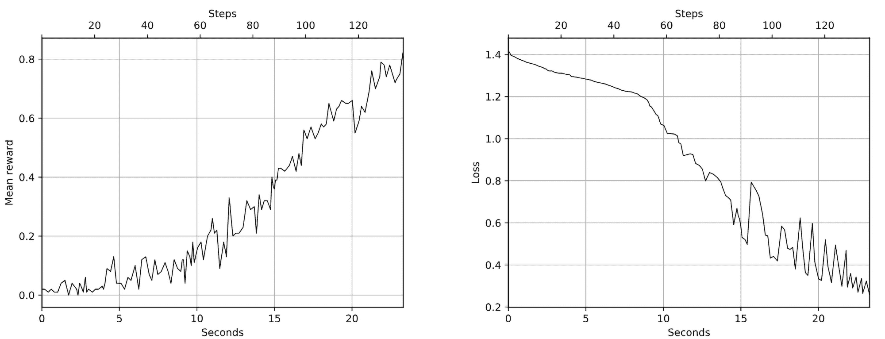

# 第四章：交叉熵方法

在上一章节，您已经了解了 PyTorch。在本章中，我们将结束本书的第一部分，您将熟悉其中一种强化学习方法：交叉熵。

尽管与 RL 从业者工具箱中其他工具（如深度 Q 网络（DQN）或优势演员-评论家（A2C））相比，交叉熵方法的知名度要低得多，但它也有其自身的优势。首先，交叉熵方法非常简单，这使得它成为一种易于遵循的方法。例如，在 PyTorch 上的实现不到 100 行代码。

其次，该方法具有良好的收敛性。在不需要学习复杂、多步策略且具有频繁奖励的简单环境中，交叉熵方法通常表现得非常出色。当然，许多实际问题不属于这一类，但有时候会出现。在这种情况下，交叉熵方法（单独使用或作为更大系统的一部分）可能是完美的选择。

在本章中，我们将涵盖：

+   交叉熵方法的实际应用

+   在 Gym 中两个环境（熟悉的 CartPole 和 FrozenLake 的网格世界）中交叉熵方法的工作原理

+   交叉熵方法的理论背景。本节内容是可选的，需要一些概率和统计知识，但如果您想要理解该方法的工作原理，那么您可以深入研究一下。

# RL 方法的分类

交叉熵方法属于无模型、基于策略以及在线策略方法的范畴。这些概念很新，所以让我们花点时间来探索它们。

RL 中的所有方法都可以分为不同的组：

+   无模型或有模型

+   基于价值或基于策略

+   在策略或离策略

还有其他方法可以对 RL 方法进行分类，但是目前我们对上述三种感兴趣。让我们定义它们，因为您的具体问题的特性可能会影响您选择特定方法。

术语“无模型”意味着该方法不会建立环境或奖励的模型；它只是直接将观察结果连接到行动（或与行动相关的值）。换句话说，代理器接受当前观察结果并对其进行一些计算，其结果就是它应该采取的行动。相比之下，模型基方法试图预测接下来的观察结果和/或奖励。基于这一预测，代理器试图选择最佳的可能行动，往往多次进行这样的预测，以查看未来更多步骤。

这两类方法各有优缺点，但通常纯粹的基于模型的方法用于确定性环境，如有严格规则的棋盘游戏。另一方面，基于模型的方法通常更难训练，因为很难构建具有丰富观察的复杂环境的良好模型。本书中描述的所有方法都属于无模型类别，因为这些方法在过去几年里一直是研究的最活跃领域。直到最近，研究人员才开始结合两者的优点（例如，在第二十章中，我们将介绍 AlphaGo Zero 和 MuZero 方法，这些方法将基于模型的方法应用于棋盘游戏和 Atari 游戏）。

从另一个角度来看，基于策略的方法直接近似智能体的策略，即智能体在每一步应该采取什么动作。策略通常通过一个可用动作的概率分布表示。或者，这种方法也可以是基于价值的。在这种情况下，智能体计算每个可能动作的价值，并选择具有最佳价值的动作，而不是选择动作的概率。这两类方法同样受欢迎，我们将在本书的下一部分讨论基于价值的方法。基于策略的方法将在第三部分中讨论。

方法的第三个重要分类是在线策略与离线策略的区别。我们将在本书的第二部分和第三部分深入讨论这一区别，但目前，解释离线策略足以理解它是指方法能够从历史数据中学习（这些数据可能来自智能体的先前版本、由人类演示录制，或仅仅是同一智能体在几次交互之前观察到的数据）。另一方面，在线策略方法需要最新的数据进行训练，这些数据来自我们当前正在更新的策略。它们不能基于旧的历史数据进行训练，因为训练结果将会错误。这使得这类方法的数据效率较低（你需要更多的与环境交互），但在某些情况下，这不是问题（例如，如果我们的环境非常轻量且快速，那么我们可以迅速与其交互）。

因此，我们的交叉熵方法是无模型、基于策略且是在线策略，这意味着以下几点：

+   它并不构建环境的模型；它只是告诉智能体在每一步该做什么。

+   它近似智能体的策略

+   它需要从环境中获取的新数据

# 交叉熵方法的实际应用

交叉熵方法的解释可以分为两部分：实际部分和理论部分。实际部分是直观的，而交叉熵方法为何有效以及其原理的理论解释则更加复杂。

你可能记得，强化学习中最核心且最棘手的部分是智能体，它试图通过与环境的交互尽可能地积累总奖励。实际上，我们遵循一种常见的机器学习（ML）方法，用某种非线性可训练函数替代智能体的所有复杂性，该函数将智能体的输入（来自环境的观察）映射到某些输出。这种函数所产生的输出的细节可能依赖于特定的方法或方法族（例如基于值的方法或基于策略的方法），正如前一节所描述的那样。由于我们的交叉熵方法是基于策略的，因此我们的非线性函数（神经网络（NN））生成策略，该策略基本上决定了对于每个观察，智能体应该采取哪个动作。在研究论文中，策略表示为 π(a|s)，其中 a 是动作，s 是当前状态。以下图所示：


图 4.1：基于策略的强化学习的高级方法

实际上，策略通常表示为一个动作的概率分布，这使得它非常类似于分类问题，其中类别的数量等于我们可以执行的动作数量。

这种抽象使得我们的智能体变得非常简单：它只需要将来自环境的观察传递给神经网络，得到一个动作的概率分布，并使用概率分布进行随机抽样，得到一个需要执行的动作。这种随机抽样为我们的智能体增加了随机性，这是件好事，因为在训练开始时，当我们的权重是随机的，智能体的行为也是随机的。一旦智能体获得了一个需要执行的动作，它就将该动作发送给环境，并获得上一个动作的下一个观察和奖励。然后，循环继续，如图 4.1 所示。

在智能体的生命周期中，它的经验呈现为若干个回合（episodes）。每个回合是智能体从环境中获得的一系列观察、它所执行的动作以及这些动作的奖励。假设我们的智能体已经经历了若干个这样的回合。对于每个回合，我们可以计算智能体所获得的总奖励。它可以是折扣奖励，也可以是不折扣奖励；为了简单起见，假设折扣因子 γ = 1，这意味着每个回合的所有局部奖励的未折扣总和。这个总奖励显示了该回合对智能体来说有多好。它在图 4.2 中有所说明，其中包含了四个回合（注意，不同的回合有不同的 o[i]、a[i] 和 r[i] 的值）：


图 4.2：示例回合及其观察、动作和奖励

每个单元格代表代理在回合中的一步。由于环境中的随机性以及代理选择采取行动的方式，一些回合会比其他回合更好。交叉熵方法的核心是丢弃不好的回合，并在更好的回合上进行训练。所以，该方法的步骤如下：

1.  使用当前模型和环境播放 N 个回合。

1.  计算每个回合的总奖励并确定奖励边界。通常，我们使用所有奖励的百分位数，如第 50 或第 70 百分位数。

1.  丢弃所有奖励低于边界的回合。

1.  使用观察作为输入，发出的动作作为期望输出，在剩余的“精英”回合（奖励高于边界）上进行训练。

1.  从步骤 1 重复，直到对结果感到满意为止。

这就是交叉熵方法的描述。通过上述过程，我们的神经网络学会如何重复动作，从而获得更大的奖励，不断提高边界。尽管该方法非常简单，但在基础环境中效果很好，易于实现，并且对超参数变化具有很强的鲁棒性，这使得它成为一个理想的基准方法。现在，让我们将其应用于我们的 CartPole 环境。

# 交叉熵方法在 CartPole 上的应用

这个示例的完整代码在 Chapter04/01_cartpole.py 中。这里，我只展示最重要的部分。我们模型的核心是一个单隐藏层的神经网络，使用了修正线性单元（ReLU）和 128 个隐藏神经元（这个数字完全是随意的；你可以尝试增加或减少这个常数——我们将这个作为一个练习留给你）。其他超参数也几乎是随机设置的，并且没有调优，因为该方法具有很强的鲁棒性，且收敛速度非常快。我们在文件顶部定义常数：

```py
import typing as tt 
import torch 
import torch.nn as nn 
import torch.optim as optim 

HIDDEN_SIZE = 128 
BATCH_SIZE = 16 
PERCENTILE = 70
```

如前面的代码所示，常数包括隐藏层中神经元的数量、每次迭代中我们播放的回合数（16），以及我们用于精英回合筛选的每个回合总奖励的百分位数。我们将采用第 70 百分位数，这意味着我们将保留奖励排序前 30% 的回合。

我们的神经网络没有什么特别之处；它从环境中获取单个观察作为输入向量，并为我们可以执行的每个动作输出一个数字：

```py
class Net(nn.Module): 
    def __init__(self, obs_size: int, hidden_size: int, n_actions: int): 
        super(Net, self).__init__() 
        self.net = nn.Sequential( 
            nn.Linear(obs_size, hidden_size), 
            nn.ReLU(), 
            nn.Linear(hidden_size, n_actions) 
        ) 

    def forward(self, x: torch.Tensor): 
        return self.net(x)
```

神经网络的输出是一个动作的概率分布，因此直接的方法是在最后一层之后加入 softmax 非线性激活函数。然而，在代码中，我们并没有应用 softmax，以提高训练过程的数值稳定性。与其计算 softmax（使用指数运算）后再计算交叉熵损失（使用概率的对数），我们将稍后使用 nn.CrossEntropyLoss PyTorch 类，它将 softmax 和交叉熵合并为一个更加数值稳定的表达式。CrossEntropyLoss 需要神经网络的原始未归一化值（也叫 logits）。这样做的缺点是我们每次需要从神经网络的输出中获取概率时，都需要记得应用 softmax。

接下来，我们将定义两个辅助的 dataclass：

```py
@dataclass 
class EpisodeStep: 
    observation: np.ndarray 
    action: int 

@dataclass 
class Episode: 
    reward: float 
    steps: tt.List[EpisodeStep]
```

这些 dataclass 的目的如下：

+   EpisodeStep：这个类用于表示代理在 episode 中的单一步骤，它存储了来自环境的观察值以及代理执行的动作。我们将使用精英 episode 的步骤作为训练数据。

+   Episode：这是一个单一的 episode，存储为总的未折扣奖励和一组 EpisodeStep。

让我们看看一个生成包含 episode 的批次的函数：

```py
def iterate_batches(env: gym.Env, net: Net, batch_size: int) -> tt.Generator[tt.List[Episode], None, None]: 
    batch = [] 
    episode_reward = 0.0 
    episode_steps = [] 
    obs, _ = env.reset() 
    sm = nn.Softmax(dim=1)
```

上述函数接受环境（来自 Gym 库的 Env 类实例）、我们的神经网络以及它在每次迭代时应该生成的 episode 数量。batch 变量将用于累积我们的批次（这是一个 Episode 实例的列表）。我们还声明了当前 episode 的奖励计数器和它的步骤列表（EpisodeStep 对象）。然后，我们重置环境以获取第一个观察值，并创建一个 softmax 层，这将用于将神经网络的输出转换为动作的概率分布。准备工作就绪，我们可以开始环境循环：

```py
 while True: 
        obs_v = torch.tensor(obs, dtype=torch.float32) 
        act_probs_v = sm(net(obs_v.unsqueeze(0))) 
        act_probs = act_probs_v.data.numpy()[0]
```

在每次迭代时，我们将当前观察值转换为 PyTorch 张量，并将其传递给神经网络以获得动作的概率。这里有几点需要注意：

+   PyTorch 中的所有 nn.Module 实例都期望一批数据项，我们的神经网络也不例外，因此我们将观察值（在 CartPole 中是一个包含四个数字的向量）转换成大小为 1 × 4 的张量（为此，我们在张量上调用 unsqueeze(0) 函数，这样会在形状的零维位置添加一个额外的维度）。

+   由于我们在神经网络的输出中没有使用非线性激活函数，它会输出原始的动作评分，我们需要将这些评分通过 softmax 函数处理。

+   我们的神经网络和 softmax 层都返回跟踪梯度的张量，因此我们需要通过访问张量的 data 字段来解包它，然后将张量转换为 NumPy 数组。这个数组将具有与输入相同的二维结构，批次维度在轴 0 上，因此我们需要获取第一个批次元素以获得一个一维的动作概率向量。

现在我们有了动作的概率分布，可以利用它来获得当前步骤的实际动作：

```py
 action = np.random.choice(len(act_probs), p=act_probs) 
        next_obs, reward, is_done, is_trunc, _ = env.step(action)
```

在这里，我们使用 NumPy 的函数 random.choice() 来采样分布。然后，我们将这个动作传递给环境，以获取下一个观察结果、奖励、回合结束的指示以及截断标志。step() 函数返回的最后一个值是来自环境的额外信息，将被丢弃。

奖励被加入到当前回合的总奖励中，我们的回合步骤列表也会扩展，包含（观察，动作）对：

```py
 episode_reward += float(reward) 
        step = EpisodeStep(observation=obs, action=action) 
        episode_steps.append(step)
```

请注意，我们保存的是用于选择动作的观察结果，而不是由环境根据动作返回的观察结果。这些小细节，虽然微小，但非常重要，你需要记住。

代码的后续部分处理当前回合结束时的情况（在 CartPole 问题中，回合在杆子掉下时结束，无论我们是否努力，或者当环境的时间限制到达时结束）：

```py
 if is_done or is_trunc: 
            e = Episode(reward=episode_reward, steps=episode_steps) 
            batch.append(e) 
            episode_reward = 0.0 
            episode_steps = [] 
            next_obs, _ = env.reset() 
            if len(batch) == batch_size: 
                yield batch 
                batch = []
```

我们将完成的回合追加到批次中，保存总奖励（因为回合已经结束，并且我们已经累积了所有奖励）以及我们采取的步骤。然后，我们重置总奖励累加器并清空步骤列表。之后，我们重置环境重新开始。

如果我们的批次已达到期望的回合数，我们将使用 yield 将其返回给调用者进行处理。我们的函数是生成器，因此每次执行 yield 操作符时，控制权将转交给外部迭代循环，然后在 yield 语句后继续执行。如果你不熟悉 Python 的生成器函数，可以参考 Python 文档：[`wiki.python.org/moin/Generators`](https://wiki.python.org/moin/Generators)。处理完后，我们会清理批次。

我们循环中的最后一步，也是非常重要的一步，是将从环境中获得的观察结果赋值给当前的观察变量：

```py
 obs = next_obs
```

之后，一切将无限重复——我们将观察结果传递给神经网络（NN），从中采样执行的动作，请求环境处理该动作，并记住该处理结果。

需要理解的一个非常重要的事实是，在这个函数的逻辑中，我们的神经网络（NN）训练和回合生成是同时进行的。它们并非完全并行，但每当我们的循环累积了足够的回合（16），它会将控制权传递给此函数的调用者，调用者应该使用梯度下降来训练神经网络。因此，当 yield 被返回时，神经网络将表现出不同的、略微更好的（我们希望是这样）行为。正如你从章节开始时应该记得的那样，交叉熵方法属于基于策略（on-policy）类，因此使用新鲜的训练数据对于方法的正常运行至关重要。

由于训练和数据收集发生在同一线程中，因此不需要额外的同步。然而，您应该注意到训练神经网络和使用神经网络之间的频繁切换。好了；现在我们需要定义另一个函数，然后就可以准备切换到训练循环了：

```py
def filter_batch(batch: tt.List[Episode], percentile: float) -> \ 
        tt.Tuple[torch.FloatTensor, torch.LongTensor, float, float]: 
    rewards = list(map(lambda s: s.reward, batch)) 
    reward_bound = float(np.percentile(rewards, percentile)) 
    reward_mean = float(np.mean(rewards))
```

这个函数是交叉熵方法的核心——它从给定的回合批次和百分位值中计算一个奖励边界，这个边界用于过滤精英回合进行训练。为了获取奖励边界，我们将使用 NumPy 的`percentile`函数，它根据数值列表和所需的百分位，计算出该百分位的值。然后，我们将计算平均奖励，仅用于监控。

接下来，我们将过滤掉我们的回合：

```py
 train_obs: tt.List[np.ndarray] = [] 
    train_act: tt.List[int] = [] 
    for episode in batch: 
        if episode.reward < reward_bound: 
            continue 
        train_obs.extend(map(lambda step: step.observation, episode.steps)) 
        train_act.extend(map(lambda step: step.action, episode.steps))
```

对于批次中的每一个回合，我们会检查该回合的总奖励是否高于我们的奖励边界，如果是，我们将填充观察值和动作的列表，这些将用于训练。

以下是该函数的最后步骤：

```py
 train_obs_v = torch.FloatTensor(np.vstack(train_obs)) 
    train_act_v = torch.LongTensor(train_act) 
    return train_obs_v, train_act_v, reward_bound, reward_mean
```

在这里，我们将把精英回合的观察值和动作转换成张量，并返回一个包含四个元素的元组：观察值、动作、奖励边界和平均奖励。最后两个值不用于训练；我们将它们写入 TensorBoard，以便检查智能体的表现。

现在，整合所有内容的最终代码块，主要由训练循环组成，如下所示：

```py
if __name__ == "__main__": 
    env = gym.make("CartPole-v1") 
    assert env.observation_space.shape is not None 
    obs_size = env.observation_space.shape[0] 
    assert isinstance(env.action_space, gym.spaces.Discrete) 
    n_actions = int(env.action_space.n) 

    net = Net(obs_size, HIDDEN_SIZE, n_actions) 
    print(net) 
    objective = nn.CrossEntropyLoss() 
    optimizer = optim.Adam(params=net.parameters(), lr=0.01) 
    writer = SummaryWriter(comment="-cartpole")
```

在开始时，我们创建所有需要的对象：环境、我们的神经网络、目标函数、优化器，以及 TensorBoard 的摘要写入器。

在训练循环中，我们迭代处理批次（即 Episode 对象的列表）：

```py
 for iter_no, batch in enumerate(iterate_batches(env, net, BATCH_SIZE)): 
        obs_v, acts_v, reward_b, reward_m = filter_batch(batch, PERCENTILE) 
        optimizer.zero_grad() 
        action_scores_v = net(obs_v) 
        loss_v = objective(action_scores_v, acts_v) 
        loss_v.backward() 
        optimizer.step()
```

我们使用`filter_batch`函数对精英回合进行过滤。结果是观察值和采取的动作的张量、用于过滤的奖励边界，以及平均奖励。之后，我们将神经网络（NN）的梯度归零，并将观察值传递给神经网络，获取其动作分数。这些分数会传递给目标函数，计算神经网络输出与智能体采取的动作之间的交叉熵。这样做的目的是强化我们的神经网络，执行那些已经导致良好奖励的精英动作。接着，我们计算损失的梯度，并请求优化器调整神经网络。

循环的其余部分主要是进度监控：

```py
 print("%d: loss=%.3f, reward_mean=%.1f, rw_bound=%.1f" % ( 
            iter_no, loss_v.item(), reward_m, reward_b)) 
        writer.add_scalar("loss", loss_v.item(), iter_no) 
        writer.add_scalar("reward_bound", reward_b, iter_no) 
        writer.add_scalar("reward_mean", reward_m, iter_no)
```

在控制台上，我们显示迭代次数、损失、批次的平均奖励以及奖励边界。我们还将相同的值写入 TensorBoard，以便获得智能体学习表现的漂亮图表。

循环中的最后一个检查是比较批次回合的平均奖励：

```py
 if reward_m > 475: 
            print("Solved!") 
            break 
    writer.close()
```

当平均奖励超过 475 时，我们停止训练。为什么是 475 呢？在 Gym 中，当过去 100 次训练的平均奖励超过 475 时，CartPole-v1 环境被认为已解决。然而，我们的方法收敛得非常快，通常 100 次训练就足够了。经过适当训练的智能体能够将杆子保持平衡无限长时间（获得任意数量的分数），但在 CartPole-v1 中，一次训练的长度被限制为 500 步（如果你查看 [`github.com/Farama-Foundation/Gymnasium/blob/main/gymnasium/envs/__init__.py`](https://github.com/Farama-Foundation/Gymnasium/blob/main/gymnasium/envs/)(gymnasium/envs/__init__.py) 文件，所有环境都在此注册，CartPole v1 的 `max_episode_steps` 为 500）。考虑到这些因素，当批次的平均奖励超过 475 时，我们就会停止训练，这也是智能体学会像专业人士一样平衡杆子的良好指示。

就是这样。那么，让我们开始第一次强化学习训练吧！

```py
Chapter04$ ./01_cartpole.py 
Net( 
  (net): Sequential( 
   (0): Linear(in_features=4, out_features=128, bias=True) 
   (1): ReLU() 
   (2): Linear(in_features=128, out_features=2, bias=True) 
  ) 
) 
0: loss=0.683, reward_mean=25.2, rw_bound=24.0 
1: loss=0.669, reward_mean=34.3, rw_bound=39.0 
2: loss=0.648, reward_mean=37.6, rw_bound=40.0 
3: loss=0.647, reward_mean=41.9, rw_bound=43.0 
4: loss=0.634, reward_mean=41.2, rw_bound=50.0 
.... 
38: loss=0.537, reward_mean=431.8, rw_bound=500.0 
39: loss=0.529, reward_mean=450.1, rw_bound=500.0 
40: loss=0.533, reward_mean=456.4, rw_bound=500.0 
41: loss=0.526, reward_mean=422.0, rw_bound=500.0 
42: loss=0.531, reward_mean=436.8, rw_bound=500.0 
43: loss=0.526, reward_mean=475.5, rw_bound=500.0 
Solved!
```

通常，智能体解决问题的训练批次不会超过 50 次。我的实验显示，通常需要 30 到 60 次训练，这是一种非常好的学习表现（记住，我们每个批次只需要训练 16 次）。TensorBoard 显示我们的智能体持续在进步，几乎每个批次都会推动上限（虽然有时会出现下降，但大多数时候它是在提升）：


图 4.3：训练过程中平均奖励（左）和损失（右） 图 4.4：训练过程中奖励的边界

为了监控训练过程，你可以通过在 CartPole 环境中设置渲染模式并添加 RecordVideo 包装器来调整环境创建：

```py
 env = gym.make("CartPole-v1", render_mode="rgb_array") 
    env = gym.wrappers.RecordVideo(env, video_folder="video")
```

在训练过程中，它将创建一个视频目录，其中包含一堆 MP4 电影，供你比较智能体训练的进展：

```py
Chapter04$ ./01_cartpole.py 
Net( 
  (net): Sequential( 
   (0): Linear(in_features=4, out_features=128, bias=True) 
   (1): ReLU() 
   (2): Linear(in_features=128, out_features=2, bias=True) 
  ) 
) 
Moviepy - Building video Chapter04/video/rl-video-episode-0.mp4\. 
Moviepy - Writing video Chapter04/video/rl-video-episode-0.mp4 
Moviepy - Done ! 
Moviepy - video ready Chapter04/video/rl-video-episode-0.mp4 
Moviepy - Building video Chapter04/video/rl-video-episode-1.mp4\. 
Moviepy - Writing video Chapter04/video/rl-video-episode-1.mp4 
...
```

MP4 电影可能如下所示：


图 4.5：CartPole 训练电影

现在让我们暂停一下，思考一下刚刚发生了什么。我们的神经网络仅通过观察和奖励学习如何玩这个环境，而没有对观察到的值进行任何解释。这个环境可以不是一个带杆的小车，它可以是一个仓库模型，观察值是产品数量，奖励是赚取的金钱。我们的实现并不依赖于环境相关的细节。这就是强化学习模型的魅力，接下来的部分，我们将看看如何将完全相同的方法应用于 Gym 集合中的不同环境。

# 在 FrozenLake 上使用交叉熵方法

接下来，我们将尝试使用交叉熵方法解决的环境是 FrozenLake。它的世界属于所谓的网格世界类别，在这个世界中，代理生活在一个 4 × 4 的网格中，可以朝四个方向移动：上、下、左、右。代理始终从左上角开始，目标是到达网格的右下角单元格。网格中的固定单元格中有洞，如果代理掉入这些洞中，情节结束，奖励为零。如果代理到达目标单元格，则获得 1.0 的奖励，情节也结束。

为了让事情变得更复杂，世界是滑溜的（毕竟它是一个冰冻的湖泊），因此代理的动作并不总是按预期进行——有 33% 的机会它会向右或向左滑动。例如，如果你希望代理向左移动，那么有 33% 的概率它确实会向左移动，33% 的概率它会移到上方的单元格，另有 33% 的概率它会移到下方的单元格。正如你在本节最后所看到的，这使得进展变得困难。


图 4.6：在人工模式下渲染的 FrozenLake 环境

让我们来看一下这个环境在 Gym API 中是如何表示的：

```py
>>> e = gym.make("FrozenLake-v1", render_mode="ansi") 
>>> e.observation_space 
Discrete(16) 
>>> e.action_space 
Discrete(4) 
>>> e.reset() 
(0, {’prob’: 1}) 
>>> print(e.render()) 

SFFF 
FHFH 
FFFH 
HFFG
```

我们的观察空间是离散的，这意味着它只是一个从 0 到 15 的数字（包括 0 和 15）。显然，这个数字是我们在网格中的当前位置。动作空间也是离散的，但它的值可以从零到三。虽然动作空间与 CartPole 类似，但观察空间的表示方式不同。为了尽量减少我们实现中的所需更改，我们可以应用传统的离散输入的 one-hot 编码，这意味着输入到我们网络的数据将包含 16 个浮动数，其他位置为零，只有表示我们在网格中的当前位置的索引处为 1。

由于这种转换仅影响环境的观察，因此可以将其实现为一个 ObservationWrapper，正如我们在第二章中讨论的那样。我们将其称为 DiscreteOneHotWrapper：

```py
class DiscreteOneHotWrapper(gym.ObservationWrapper): 
    def __init__(self, env: gym.Env): 
        super(DiscreteOneHotWrapper, self).__init__(env) 
        assert isinstance(env.observation_space, gym.spaces.Discrete) 
        shape = (env.observation_space.n, ) 
        self.observation_space = gym.spaces.Box(0.0, 1.0, shape, dtype=np.float32) 

    def observation(self, observation): 
        res = np.copy(self.observation_space.low) 
        res[observation] = 1.0 
        return res
```

在对环境应用了该包装器后，观察空间和动作空间与我们的 CartPole 解决方案（源代码 Chapter04/02_frozenlake_naive.py）100% 兼容。然而，通过启动它，我们可以看到我们的训练过程并没有随着时间的推移提高分数：


图 4.7：FrozenLake 环境中的平均奖励（左）和损失（右）


图 4.8：训练过程中奖励边界（一直是无聊的 0.0）

为了理解发生了什么，我们需要深入研究两个环境的奖励结构。在 CartPole 中，环境的每一步都会给我们 1.0 的奖励，直到杆子倒下为止。因此，我们的代理平衡杆子的时间越长，获得的奖励就越多。由于代理行为的随机性，不同的回合有不同的长度，从而给我们带来了一个比较正常的回合奖励分布。选择奖励边界后，我们会拒绝不太成功的回合，并学习如何重复更好的回合（通过在成功回合的数据上训练）。这一点可以通过下面的图示看到：


图 4.9：CartPole 环境中的奖励分布

在 FrozenLake 环境中，回合和奖励的情况有所不同。我们只有在到达目标时才能获得 1.0 的奖励，而这个奖励并不能说明每个回合的好坏。这个回合是快速有效的，还是我们在湖上绕了四圈后才随机进入最终的格子？我们并不知道；它只是一个 1.0 的奖励，仅此而已。我们的回合奖励分布也存在问题。只有两种可能的回合，一种是零奖励（失败），另一种是奖励为 1.0（成功），而失败的回合显然会在训练开始时占据主导地位，因为这时代理的行为是随机的。因此，我们选择精英回合的百分位数是完全错误的，这会给我们提供不良的训练样本。这就是我们训练失败的原因。


图 4.10：FrozenLake 环境的奖励分布

这个例子展示了交叉熵方法的局限性：

+   对于训练来说，我们的过程必须是有限的（通常它们可以是无限的），并且最好是短暂的。

+   回合的总奖励应当有足够的变异性，以便将好的回合与不好的回合区分开来。

+   在整个过程中有中间奖励是有益的，而不是只在过程结束时获得奖励。

在本书的后续章节中，你将了解其他解决这些局限性的方法。目前，如果你对如何使用交叉熵方法解决 FrozenLake 问题感兴趣，以下是你需要对代码进行的调整（完整示例见 Chapter04/03_frozenlake_tweaked.py）：

+   更大的回合批量：在 CartPole 中，每次迭代有 16 个回合就足够了，但 FrozenLake 至少需要 100 个回合才能得到一些成功的回合。

+   奖励的折扣因子：为了让一个回合的总奖励依赖于其长度，并且增加回合的多样性，我们可以使用折扣总奖励，折扣因子γ = 0.9 或 0.95。在这种情况下，短回合的奖励会高于长回合的奖励。这增加了奖励分布的变异性，有助于避免像图 4.10 中所示的情况。

+   长时间保存精英回合：在 CartPole 训练中，我们从环境中采样回合，训练最好的回合，然后丢弃它们。而在 FrozenLake 中，成功回合是非常稀有的，因此我们需要将其保留多个迭代以进行训练。

+   降低学习率：这将给我们的神经网络更多时间来平均更多的训练样本，因为较小的学习率会减小新数据对模型的影响。

+   更长的训练时间：由于成功回合的稀疏性以及我们行动的随机性，我们的神经网络（NN）更难理解在任何特定情况下应该执行的最佳行为。为了达到 50% 的成功回合，约需要 5,000 次训练迭代。

为了将这些内容融入到我们的代码中，我们需要修改 filter_batch 函数来计算折扣奖励并返回精英回合以供我们保存：

```py
def filter_batch(batch: tt.List[Episode], percentile: float) -> \ 
        tt.Tuple[tt.List[Episode], tt.List[np.ndarray], tt.List[int], float]: 
    reward_fun = lambda s: s.reward * (GAMMA ** len(s.steps)) 
    disc_rewards = list(map(reward_fun, batch)) 
    reward_bound = np.percentile(disc_rewards, percentile) 

    train_obs: tt.List[np.ndarray] = [] 
    train_act: tt.List[int] = [] 
    elite_batch: tt.List[Episode] = [] 

    for example, discounted_reward in zip(batch, disc_rewards): 
        if discounted_reward > reward_bound: 
            train_obs.extend(map(lambda step: step.observation, example.steps)) 
            train_act.extend(map(lambda step: step.action, example.steps)) 
            elite_batch.append(example) 

    return elite_batch, train_obs, train_act, reward_bound
```

然后，在训练循环中，我们将存储先前的精英回合，并在下次训练迭代中将其传递给前面的函数：

```py
 full_batch = [] 
    for iter_no, batch in enumerate(iterate_batches(env, net, BATCH_SIZE)): 
        reward_mean = float(np.mean(list(map(lambda s: s.reward, batch)))) 
        full_batch, obs, acts, reward_bound = filter_batch(full_batch + batch, PERCENTILE) 
        if not full_batch: 
            continue 
        obs_v = torch.FloatTensor(obs) 
        acts_v = torch.LongTensor(acts) 
        full_batch = full_batch[-500:]
```

其余的代码保持不变，除了学习率降低了 10 倍，BATCH_SIZE 设置为 100。经过一段耐心等待（新版本大约需要 50 分钟来完成 10,000 次迭代），你可以看到模型的训练在约 55% 已解决的回合后停止了提升：


图 4.11：调整版本的平均奖励（左）和损失（右）


图 4.12：调整版本的奖励边界

有方法可以解决这个问题（例如，通过应用熵损失正则化），但这些技术将在接下来的章节中讨论。

这里最后需要注意的是 FrozenLake 环境中的滑溜效应。我们的每个行动有 33% 的概率被替换为 90^∘ 旋转后的行动（例如，向上行动会以 0.33 的概率成功，而有 0.33 的概率它会被替换为向左行动或向右行动）。

无滑溜版本的代码在 Chapter04/04_frozenlake_nonslippery.py 中，唯一的不同是在环境创建时：

```py
 env = DiscreteOneHotWrapper(gym.make("FrozenLake-v1", is_slippery=False))
```

效果显著！无滑溜版本的环境可以在 120-140 个批次迭代内解决，比噪声环境快了 100 倍：

```py
Chapter04$ ./04_frozenlake_nonslippery.py 
2: loss=1.436, rw_mean=0.010, rw_bound=0.000, batch=1 
3: loss=1.410, rw_mean=0.010, rw_bound=0.000, batch=2 
4: loss=1.391, rw_mean=0.050, rw_bound=0.000, batch=7 
5: loss=1.379, rw_mean=0.020, rw_bound=0.000, batch=9 
6: loss=1.375, rw_mean=0.010, rw_bound=0.000, batch=10 
7: loss=1.367, rw_mean=0.040, rw_bound=0.000, batch=14 
8: loss=1.361, rw_mean=0.000, rw_bound=0.000, batch=14 
9: loss=1.356, rw_mean=0.010, rw_bound=0.000, batch=15 
... 
134: loss=0.308, rw_mean=0.730, rw_bound=0.478, batch=93 
136: loss=0.440, rw_mean=0.710, rw_bound=0.304, batch=70 
137: loss=0.298, rw_mean=0.720, rw_bound=0.478, batch=106 
139: loss=0.337, rw_mean=0.790, rw_bound=0.430, batch=65 
140: loss=0.295, rw_mean=0.720, rw_bound=0.478, batch=99 
142: loss=0.433, rw_mean=0.670, rw_bound=0.000, batch=67 
143: loss=0.287, rw_mean=0.820, rw_bound=0.478, batch=114 
Solved!
```

这一点在以下图表中也很明显：



图 4.13：无滑溜版本的平均奖励（左）和损失（右）


图 4.14：无滑溜版本的奖励边界

# 交叉熵方法的理论背景

本节为可选内容，供希望了解该方法为何有效的读者。如果你愿意，可以参考 Kroese 原文论文，标题为《交叉熵方法》，[Kro+11]。

交叉熵方法的基础在于重要性采样定理，定理内容如下：

![π (a |s) = P[At = a|St = s] ](img/eq4.png) ![π (a |s) = P[At = a|St = s] ](img/eq5.png)

在我们的强化学习（RL）案例中，H(x) 是某个策略 x 所获得的奖励值，p(x) 是所有可能策略的分布。我们并不想通过搜索所有可能的策略来最大化我们的奖励；相反，我们想通过 q(x) 来近似 p(x)H(x)，并迭代地最小化它们之间的距离。两个概率分布之间的距离通过 Kullback-Leibler (KL) 散度来计算，公式如下：

![π (a |s) = P[At = a|St = s] ](img/eq6.png) ![π (a |s) = P[At = a|St = s] ](img/eq7.png)

KL 中的第一个项称为熵，它与 p2 无关，因此在最小化过程中可以省略。第二项称为交叉熵，这是深度学习中非常常见的优化目标。

结合这两个公式，我们可以得到一个迭代算法，起始时 q0 = p(x)，并在每一步进行改进。这是 p(x)H(x) 的近似，并伴随着更新：

![π (a |s) = P[At = a|St = s] ](img/eq78.png)

这是一种通用的交叉熵方法，在我们的 RL 案例中可以大大简化。我们将 H(x) 替换为一个指示函数，当回合的奖励超过阈值时其值为 1，当奖励低于阈值时其值为 0。我们的策略更新将如下所示：

![π (a |s) = P[At = a|St = s] ](img/eq79.png)

严格来说，前面的公式缺少归一化项，但在实践中没有它仍然能起作用。所以，方法非常明确：我们使用当前策略（从一些随机初始策略开始）采样回合，并最小化最成功样本和我们的策略的负对数似然。

如果你感兴趣，可以参考 Reuven Rubinstein 和 Dirk P. Kroese 编写的书 [RK04]，专门讨论这种方法。简短的描述可以在《交叉熵方法》论文中找到 ([Kro+11])。

# 摘要

在本章中，你已经了解了交叉熵方法，尽管它有一些局限性，但它简单且非常强大。我们将其应用于一个 CartPole 环境（取得了巨大的成功）和 FrozenLake（取得了相对较小的成功）。此外，我们还讨论了 RL 方法的分类，接下来的书中会多次引用这一分类，因为不同的 RL 问题方法具有不同的特性，这会影响它们的适用性。

本章结束了本书的导言部分。在下一部分，我们将转向更加系统地学习 RL 方法，并讨论基于值的算法。在接下来的章节中，我们将探索更复杂但更强大的深度强化学习工具。

# 加入我们在 Discord 上的社区

与其他用户、深度学习专家以及作者本人一起阅读本书。提出问题，为其他读者提供解决方案，通过问我任何问题环节与作者交流，还有更多内容。扫描二维码或访问链接加入社区。[`packt.link/rl`](https://packt.link/rl)


# 第二部分

# 基于价值的方法
