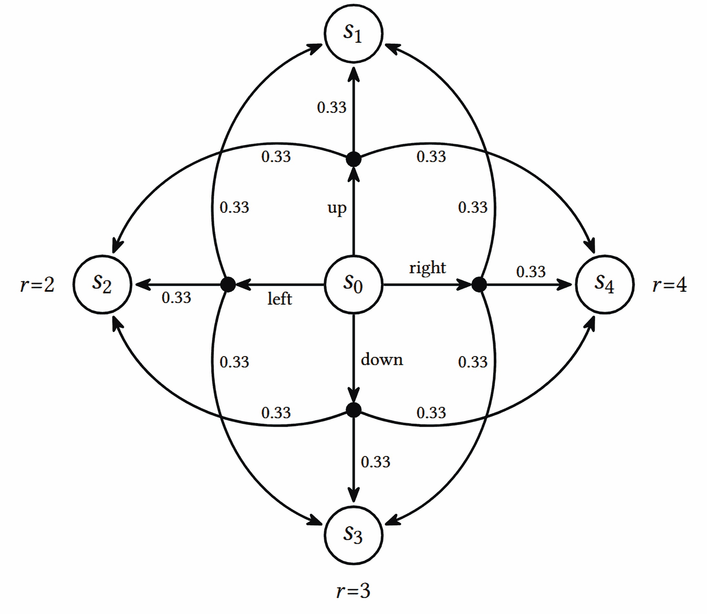

# 第五章：表格学习和贝尔曼方程。

在上一章中，你初步了解了第一个强化学习（RL）算法——交叉熵法，并了解了它的优缺点。在本书的这一部分，我们将介绍另一组方法，它们具有更多的灵活性和强大功能：Q-learning。本章将为这些方法奠定必要的背景知识。

我们还将重新审视 FrozenLake 环境，探讨新概念如何与这个环境契合，并帮助我们解决与其不确定性相关的问题。

在本章中，我们将：

+   回顾状态的价值和行动的价值，并学习如何在简单的情况下计算它们。

+   讨论贝尔曼方程，以及它如何在我们知道状态的价值时建立最优策略。

+   讨论价值迭代方法，并在 FrozenLake 环境中进行尝试。

+   对 Q-迭代方法进行相同的操作。

尽管本章中的环境简单，但它为深度 Q 学习（一个非常强大且通用的强化学习方法）奠定了必要的准备。

# 价值、状态和最优性。

你可能还记得我们在第一章中对状态价值的定义。这是一个非常重要的概念，现在是时候进一步探讨它了。

本书的这一部分是围绕状态的价值及如何逼近它展开的。我们将该价值定义为从状态中获得的期望总奖励（可选折扣）。从正式的角度来看，状态的价值由以下公式给出：

![π (a |s) = P[At = a|St = s] ](img/eq8.png)

其中 r[t]是代理在情节的第 t 步获得的局部奖励。

总奖励可以折扣，范围为 0 < γ < 1，或者不折扣（当γ = 1 时）；这取决于我们如何定义它。价值始终是根据代理遵循的某个策略计算的。为了解释这一点，让我们考虑一个非常简单的环境，包含三个状态，如图 5.1 所示：


图 5.1：一个环境状态转换及奖励的示例。

1.  代理的初始状态。

1.  代理在执行“右”动作后从初始状态到达的最终状态。从中获得的奖励是 1。

1.  代理在执行“下”动作后的最终状态。从中获得的奖励是 2。

环境始终是确定性的——每个行动都成功，我们总是从状态 1 开始。一旦我们到达状态 2 或状态 3，情节结束。现在，问题是，状态 1 的价值是多少？如果没有关于我们代理行为的信息，或者换句话说，没有其策略，这个问题是没有意义的。即使在一个简单的环境中，我们的代理也可能有无限多的行为，每个行为都有其自身的状态 1 价值。考虑以下例子：

+   代理始终向右移动。

+   代理始终向下移动。

+   代理以 50%的概率向右移动，50%的概率向下移动。

+   代理在 10%的情况下向右，在 90%的情况下执行“向下”动作  

为了演示如何计算值，让我们对之前的所有策略进行计算：  

+   对于“始终向右”代理，状态 1 的值为 1.0（每次它向左走，获得 1 分，回合结束）  

+   对于“始终向下”代理，状态 1 的值为 2.0  

+   对于 50%右/50%下代理，值为 1.0⋅0.5 + 2.0⋅0.5 = 1.5  

+   对于 10%右/90%下代理，值为 1.0⋅0.1 + 2.0⋅0.9 = 1.9  

现在，另一个问题是：这个代理的最优策略是什么？强化学习的目标是获得尽可能多的总奖励。对于这个一步的环境，总奖励等于状态 1 的值，显然，在策略 2（始终向下）下，总奖励是最大的。  

不幸的是，具有明显最优策略的简单环境在实际中并不那么有趣。对于有趣的环境，最优策略往往更难制定，甚至更难证明它们的最优性。然而，不要担心；我们正在向着让计算机能够自主学习最优行为的方向前进。

从前面的例子来看，你可能会产生一个误解，认为我们应该总是采取奖励最高的行动。通常来说，事情并没有那么简单。为了证明这一点，让我们在之前的环境中再增加一个状态，这个状态可以从状态 3 到达。状态 3 不再是终结状态，而是一个过渡状态到状态 4，且有一个很差的奖励——-20。一旦我们在状态 1 选择了“向下”这个动作，这个坏奖励是不可避免的，因为从状态 3 开始，我们只有一个出口——到状态 4。所以，对于代理来说，这是一个陷阱，它已经决定“贪婪”是一个好策略。  

  

图 5.2：同样的环境，增加了一个状态  

这样一来，我们对于状态 1 的值计算如下：  

+   “始终向右”代理的值是：1.0  

+   “始终向下”代理的值为 2.0 + (−20) = −18  

+   50%/50%代理的值为 0.5 ⋅ 1.0 + 0.5 ⋅ (2.0 + (−20)) = −8.5  

+   10%/90%代理的值为 0.1 ⋅ 1.0 + 0.9 ⋅ (2.0 + (−20)) = −16.1  

所以，这个新环境的最佳策略现在是策略 1：始终向右。我们花了一些时间讨论天真和简单的环境，这样你就能意识到这个最优问题的复杂性，并更好地理解理查德·贝尔曼的结果。贝尔曼是美国数学家，他提出并证明了著名的贝尔曼方程。我们将在下一节讨论它。  

# 贝尔曼最优性方程  

要解释贝尔曼方程，最好抽象一些。不要害怕；我会后面提供具体的例子来支持你的学习！让我们从一个确定性情况开始，当我们的所有行动都有 100% 的保证结果时。想象我们的代理观察到状态 s[0] 并有 N 个可用的行动。每个行动导致另一个状态 s[1]…s[N]，并带有相应的奖励 r[1]…r[N]。还假设我们知道与状态 s[0] 相连的所有状态的值 V [i]。在这样的状态下，代理可以采取什么最佳行动？


图 5.3：从初始状态可达的 N 个状态的抽象环境

如果我们选择具体的行动 a[i] 并计算给定该行动的值，那么该值将为 V 0 = r[i] + V [i]。因此，为了选择可能的最佳行动，代理需要计算每个行动的结果值，并选择可能的最大结果。换句话说，V [0] = maxa∈1…N。如果我们使用折现因子 γ，我们需要将下一个状态的值乘以 gamma：V [0] = maxa∈1…N。

这看起来可能与前一节的贪婪示例非常相似，实际上确实如此。然而，有一个区别：当我们贪婪地行动时，我们不仅看即时行动的奖励，还看长期状态值的奖励。这使我们能够避免可能出现的陷阱，即即时奖励很大但状态值很差的情况。

贝尔曼证明了通过这种扩展，我们的行为将获得最佳可能的结果。换句话说，它将是最优的。因此，前述方程被称为值的贝尔曼方程（对于确定性情况）。

这个想法推广到随机情况并不复杂，当我们的行为有可能导致不同状态时。我们需要做的是计算每个行动的期望值，而不仅仅是考虑下一个状态的值。为了说明这一点，让我们考虑从状态 s[0] 可用的单个行动，有三种可能的结果：


图 5.4：在随机情况下从状态转移的示例

这里，我们有一个行动，可以以三种不同的概率导致三个不同的状态。以概率 p[1]，该行动可能进入状态 s[1]，以 p[2] 进入状态 s[2]，以 p[3] 进入状态 s[3]（当然，p[1] + p[2] + p[3] = 1）。每个目标状态都有自己的奖励（r[1]、r[2] 或 r[3]）。要计算发出行动 1 后的期望值，我们需要将所有值乘以它们的概率并求和：

![π (a |s) = P[At = a|St = s] ](img/eq9.png)

或者，更正式地说，

![π (a |s) = P[At = a|St = s] ](img/eq10.png)

这里，𝔼 [s∼S] 表示在我们的状态空间 S 中所有状态上取期望值。

通过将贝尔曼方程（对于确定性情况）与随机动作的值相结合，我们得到了一般情况的贝尔曼最优性方程：

![π (a |s) = P[At = a|St = s] ](img/eq11.png)

请注意，p[a,i→j]表示在状态 i 下执行动作 a 后，转移到状态 j 的概率。解释仍然是一样的：状态的最优值对应于能够给我们最大可能的期望立即奖励，加上下一状态的折扣长期奖励的动作。你可能还会注意到，这一定义是递归的：状态的值是通过立即可达状态的值来定义的。这种递归看起来可能像是作弊：我们定义了一个值，假装我们已经知道它。然而，这在计算机科学甚至数学中都是一种非常强大且常见的技巧（数学归纳法就是基于这种技巧）。这个贝尔曼方程不仅是强化学习的基础，还是更为一般的动态规划的基础，动态规划是一种广泛用于解决实际优化问题的方法。

这些值不仅告诉我们可以获得的最佳奖励，而且基本上给出了获取该奖励的最优策略：如果我们的智能体知道每个状态的值，那么它就自动知道如何获取这个奖励。凭借贝尔曼最优性证明，在智能体到达的每个状态中，它需要选择具有最大期望奖励的动作，这个期望奖励是立即奖励与一步折扣后的长期奖励之和——仅此而已。因此，这些值对于了解是非常有用的。在你熟悉一种计算这些值的实际方法之前，我需要介绍一个数学符号。它不像状态值那样基础，但为了方便我们需要它。

# 动作的值

为了让我们的生活稍微轻松一点，我们可以定义不同的量，除了状态值 V(s)外，还可以定义动作值 Q(s,a)。基本上，这等于我们在状态 s 下执行动作 a 所能获得的总奖励，可以通过 V(s)来定义。作为一个比 V(s)更不基础的量，这个量给整个 Q 学习方法族命名，因为它更方便。在这些方法中，我们的主要目标是获取每对状态和动作的 Q 值：

![π (a |s) = P[At = a|St = s] ](img/eq12.png)

对于这个状态 s 和动作 a，Q 等于期望的立即奖励和目标状态的折扣长期奖励。我们还可以通过 Q(s,a)来定义 V(s)：

![π (a |s) = P[At = a|St = s] ](img/eq13.png)

这只是意味着某个状态的值等于我们从该状态执行的最大动作的值。

最后，我们可以递归地表达 Q(s,a)（将在第六章中使用）：

![π (a |s) = P[At = a|St = s] ](img/eq14.png)

在最后的公式中，立即奖励的索引(s,a)依赖于环境的具体细节：

+   如果在执行特定动作 a 时，立即奖励是在状态 s 下给予我们的，那么使用索引(s,a)，公式与上面展示的完全一致。

+   但是如果奖励是通过动作 a′到达某个状态 s′时给予的，奖励将具有索引(s′,a′)，并且需要被移入最大值运算符中：

    ![π (a |s) = P[At = a|St = s] ](img/eq15.png)

从数学角度来看，这个差异并不大，但在方法实现过程中可能很重要。第一种情况更为常见，因此我们将坚持使用前述公式。

为了给你一个具体的例子，让我们考虑一个类似 FrozenLake 的环境，但结构更简单：我们有一个初始状态(s[0])，周围有四个目标状态 s[1]、s[2]、s[3]、s[4]，每个状态的奖励不同：

 图 5.5：简化的网格状环境

每个动作的执行都是有概率的，和 FrozenLake 中的方式一样：有 33%的概率我们的动作将按原样执行，但也有 33%的概率我们会相对于目标单元格向左滑动，另外 33%的概率我们会向右滑动。为了简化起见，我们使用折扣因子γ = 1。



图 5.6：网格环境的转移图

让我们先计算这些动作的值。终态 s[1]…s[4]没有外部连接，因此这些状态的 Q 值对所有动作均为零。由于这个原因，终态的值等于它们的即时奖励（我们一旦到达终态，回合就结束，没有后续状态）：V [1] = 1，V [2] = 2，V [3] = 3，V [4] = 4。

状态 0 的动作值稍微复杂一些。我们从“向上”动作开始。根据定义，它的值等于立即奖励的期望值加上后续步骤的长期值。对于“向上”动作的任何可能转移，我们没有后续步骤：

![π (a |s) = P[At = a|St = s] ](img/eq16.png)

对 s[0]的其余动作进行相同的计算，结果如下：

| Q(s[0],left) | = 0.33 ⋅V [1] + 0.33 ⋅V [2] + 0.33 ⋅V [3] = 1.98 |
| --- | --- |
| Q(s[0],right) | = 0.33 ⋅V [4] + 0.33 ⋅V [1] + 0.33 ⋅V [3] = 2.64 |
| Q(s[0],down) | = 0.33 ⋅V [3] + 0.33 ⋅V [2] + 0.33 ⋅V [4] = 2.97 |

状态 s[0]的最终值是这些动作值中的最大值，即 2.97。

Q 值在实践中要方便得多，因为对于智能体来说，根据 Q 而不是 V 来做决策要简单得多。在 Q 的情况下，智能体只需要使用当前状态计算所有可用动作的 Q 值，并选择具有最大 Q 值的动作。使用状态值来做相同的选择时，智能体不仅需要知道这些值，还需要知道转移的概率。在实践中，我们很少事先知道这些概率，因此智能体需要为每个动作和状态对估计转移概率。在本章稍后的部分，你将通过两种方法解决 FrozenLake 环境，亲自看到这一点。然而，要做到这一点，我们还有一个重要的东西缺失：计算 V[i] 和 Q[i] 的通用方法。

# 值迭代方法

在你刚才看到的简单例子中，为了计算状态和动作的值，我们利用了环境的结构：转移中没有循环，因此我们可以从终端状态开始，计算它们的值，然后再处理中央状态。然而，环境中的一个循环就构成了我们方法的障碍。让我们考虑一个有两个状态的环境：


图 5.7：具有转移图中循环的示例环境

我们从状态 s[1] 开始，唯一可以采取的动作将我们带到状态 s[2]。我们获得奖励 r = 1，s[2] 中唯一的转移是一个动作，它将我们带回到 s[1]。所以，我们的智能体的生命周期是一个无限的状态序列[s[1], s[2], s[1], s[2], …]。为了处理这个无限循环，我们可以使用折扣因子：γ = 0.9。现在，问题是，两个状态的值是多少？其实，答案并不复杂。每次从 s[1] 转移到 s[2] 都会给我们奖励 1，而每次返回转移都会给我们奖励 2。因此，我们的奖励序列将是[1, 2, 1, 2, 1, 2, 1, 2, …]。由于每个状态只有一个可用的动作，我们的智能体没有选择的余地，因此我们可以在公式中省略最大值操作（因为只有一个选择）。

每个状态的值将等于无限求和：

| V (s[1]) | = 1 + γ(2 + γ(1 + γ(2 + …))) = ∑ [i=0]^∞1γ^(2i) + 2γ^(2i+1) |
| --- | --- |
| V (s[2]) | = 2 + γ(1 + γ(2 + γ(1 + …))) = ∑ [i=0]^∞2γ^(2i) + 1γ^(2i+1) |

严格来说，我们无法计算出我们状态的准确值，但当 γ = 0.9 时，每个转移的贡献会随着时间迅速减少。例如，经过 10 步后，γ¹⁰ = 0.9¹⁰ ≈ 0.349，但经过 100 步后，它就变成了 0.0000266。因此，我们可以在 50 次迭代后停止，仍然可以得到相当精确的估算值：

```py
>>> sum([0.9**(2*i) + 2*(0.9**(2*i+1)) for i in range(50)]) 
14.736450674121663 
>>> sum([2*(0.9**(2*i)) + 0.9**(2*i+1) for i in range(50)]) 
15.262752483911719
```

前面的示例可以用来概述一个更一般的过程，称为值迭代算法。该算法使我们能够数值地计算具有已知转移概率和奖励的马尔科夫决策过程（MDP）的状态值和动作值。该过程（针对状态值）包括以下步骤：

1.  将所有状态的值 V [i]初始化为某个初始值（通常为零）

1.  对于 MDP 中的每个状态 s，执行 Bellman 更新：

    ![π (a |s) = P[At = a|St = s] ](img/eq17.png)

1.  重复步骤 2，进行大量的迭代，或者直到变化变得非常小

好的，那就是理论。在实际应用中，这种方法有一些明显的局限性。首先，我们的状态空间应该是离散的，并且足够小，以便能够对所有状态进行多次迭代。这对于 FrozenLake-4x4，甚至 FrozenLake-8x8（作为更具挑战性的版本存在于 Gym 中）来说不是问题，但对于 CartPole 来说，应该如何做并不完全清楚。我们的 CartPole 的观察值是四个浮动值，表示系统的一些物理特性。潜在地，即使这些值之间有很小的差异，也可能影响状态的值。解决这个问题的一种方法是对我们的观察值进行离散化；例如，我们可以将 CartPole 的观察空间分成多个区间，并将每个区间当作空间中的一个独立离散状态。然而，这会带来很多实际问题，例如区间的大小应该如何确定，估算值时需要多少来自环境的数据。我将在后续章节中解决这个问题，当我们涉及到神经网络在 Q-learning 中的应用时。

第二个实际问题源于我们很少知道动作和奖励矩阵的转移概率。记住 Gym 提供给代理人编写者的接口：我们观察状态，决定一个动作，然后才获得下一次观察和转移奖励。我们不知道（除非查看 Gym 的环境代码）通过执行动作 a[0]从状态 s[0]进入状态 s[1]的概率是多少。我们拥有的只是代理与环境交互的历史。然而，在 Bellman 更新中，我们需要每个转移的奖励和该转移的概率。因此，解决这个问题的明显方法是将代理的经验作为这两个未知数的估计。奖励可以按原样使用。我们只需要记住在使用动作 a 从 s[0]到 s[1]的转移中获得的奖励，但要估算概率，我们需要为每个元组（s[0]，s[1]，a）保持计数器并进行归一化。

现在你已经熟悉了理论背景，让我们来看一下这个方法的实际应用。

# 实践中的值迭代

在这一部分，我们将研究值迭代方法如何在 FrozenLake 中工作。完整的示例位于 Chapter05/01_frozenlake_v_iteration.py 中。该示例中的核心数据结构如下：

+   奖励表：一个字典，键是组合的“源状态”+“动作”+“目标状态”。值是从即时奖励获得的。

+   转移表：一个字典，记录了经历的转移次数。键是组合的“状态”+“动作”，值是另一个字典，将“目标状态”映射到我们看到它的次数。

    例如，如果在状态 0 下执行动作 1 十次，三次后会将我们带到状态 4，七次后将带到状态 5。那么，表中键为(0, 1)的条目将是一个字典，内容为{4: 3, 5: 7}。我们可以利用这个表来估计我们的转移概率。

+   值表：一个字典，将一个状态映射到该状态的计算值。

我们代码的整体逻辑很简单：在循环中，我们从环境中执行 100 步随机操作，填充奖励和转移表格。完成这 100 步后，我们对所有状态执行值迭代循环，更新值表。然后我们进行几个完整回合的测试，检查使用更新后的值表后我们有哪些改进。如果这些测试回合的平均奖励超过 0.8 的边界值，我们就停止训练。在测试回合中，我们还会更新奖励和转移表格，以使用来自环境的所有数据。

现在让我们来看代码。我们首先导入所需的包并定义常量。然后我们定义几个类型别名。它们不是必需的，但使我们的代码更具可读性：

```py
import typing as tt 
import gymnasium as gym 
from collections import defaultdict, Counter 
from torch.utils.tensorboard.writer import SummaryWriter 

ENV_NAME = "FrozenLake-v1" 
GAMMA = 0.9 
TEST_EPISODES = 20
```

对于 FrozenLake 环境，观察和动作空间都属于 Box 类，因此状态和动作由整数值表示。我们还为奖励表和转移表的键定义了类型。对于奖励表，键是一个元组，格式为[状态，动作，状态]，而对于转移表，键是[状态，动作]：

```py
State = int 
Action = int 
RewardKey = tt.Tuple[State, Action, State] 
TransitKey = tt.Tuple[State, Action]
```

然后我们定义了 Agent 类，它将保存我们的表格并包含我们将在训练循环中使用的函数。在类的构造函数中，我们创建了一个用于数据采样的环境，获得了第一个观察值，并为奖励、转移和价值定义了表格：

```py
class Agent: 
    def __init__(self): 
        self.env = gym.make(ENV_NAME) 
        self.state, _ = self.env.reset() 
        self.rewards: tt.Dict[RewardKey, float] = defaultdict(float) 
        self.transits: tt.Dict[TransitKey, Counter] = defaultdict(Counter) 
        self.values: tt.Dict[State, float] = defaultdict(float)
```

函数 play_n_random_steps 用于从环境中收集随机经验并更新奖励和转移表。需要注意的是，我们不需要等到回合结束才能开始学习；我们只执行 N 步并记录其结果。这是值迭代和交叉熵方法之间的一个区别，后者只能在完整回合中进行学习：

```py
 def play_n_random_steps(self, n: int): 
        for _ in range(n): 
            action = self.env.action_space.sample() 
            new_state, reward, is_done, is_trunc, _ = self.env.step(action) 
            rw_key = (self.state, action, new_state) 
            self.rewards[rw_key] = float(reward) 
            tr_key = (self.state, action) 
            self.transits[tr_key][new_state] += 1 
            if is_done or is_trunc: 
                self.state, _ = self.env.reset() 
            else: 
                self.state = new_state
```

下一个函数（`calc_action_value()`）使用我们的转移、奖励和值表来计算从状态出发的动作值。我们将它用于两个目的：从状态中选择最佳动作，并计算值迭代中的状态的新值。

我们做以下操作：

1.  我们从转移表中提取给定状态和动作的转移计数器。此表中的计数器采用字典形式，目标状态作为键，经历的转移次数作为值。我们将所有计数器相加，以获得从该状态执行该动作的总次数。稍后我们将使用此总值从单个计数器转换为概率。

1.  然后，我们遍历每个目标状态，该状态是我们的动作所到达的，并使用贝尔曼方程计算它对总动作值的贡献。这个贡献等于即时奖励加上目标状态的折扣值。我们将此总和乘以此转移的概率，并将结果加到最终的动作值中。

该逻辑在以下图中进行了说明：

![transit[(s,a)] = {s1:c1,s2:c2} total = c1 + c2 sssaccQ1212(s,a) = tco1tal(rs1 + γVs1)+ tco2tal(rs2 + γVs2) ](img/B22150_05_08.png)

图 5.8：状态值的计算

在前面的图中，我们对状态 s 和动作 a 的值进行了计算。假设在我们的经验中，我们已经执行了该动作若干次（c[1] + c[2]），并最终进入了两个状态之一，s[1]或 s[2]。我们切换到这些状态的次数存储在我们的转移表中，形式为字典{s[1]: c[1], s[2]: c[2]}。

然后，状态和动作的近似值 Q(s,a)将等于每个状态的概率，乘以该状态的值。从贝尔曼方程来看，这等于即时奖励与折扣的长期状态值之和：

```py
 def calc_action_value(self, state: State, action: Action) -> float: 
        target_counts = self.transits[(state, action)] 
        total = sum(target_counts.values()) 
        action_value = 0.0 
        for tgt_state, count in target_counts.items(): 
            rw_key = (state, action, tgt_state) 
            reward = self.rewards[rw_key] 
            val = reward + GAMMA * self.values[tgt_state] 
            action_value += (count / total) * val 
        return action_value
```

下一个函数使用我刚才描述的函数来决定从给定状态采取最佳行动。它遍历环境中的所有可能动作，并计算每个动作的值。值最大的动作胜出，并作为执行的动作返回。这个动作选择过程是确定性的，因为`play_n_random_steps()`函数引入了足够的探索。因此，我们的智能体将在我们的值近似上表现得贪婪：

```py
 def select_action(self, state: State) -> Action: 
        best_action, best_value = None, None 
        for action in range(self.env.action_space.n): 
            action_value = self.calc_action_value(state, action) 
            if best_value is None or best_value < action_value: 
                best_value = action_value 
                best_action = action 
        return best_action
```

`play_episode()`函数使用`select_action()`来找出最佳的行动，并使用提供的环境播放一个完整的回合。此函数用于播放测试回合，在此期间，我们不希望干扰用于收集随机数据的主要环境的当前状态。因此，我们使用作为参数传递的第二个环境。逻辑非常简单，应该已经很熟悉：我们只需遍历状态并累计一个回合的奖励：

```py
 def play_episode(self, env: gym.Env) -> float: 
        total_reward = 0.0 
        state, _ = env.reset() 
        while True: 
            action = self.select_action(state) 
            new_state, reward, is_done, is_trunc, _ = env.step(action) 
            rw_key = (state, action, new_state) 
            self.rewards[rw_key] = float(reward) 
            tr_key = (state, action) 
            self.transits[tr_key][new_state] += 1 
            total_reward += reward 
            if is_done or is_trunc: 
                break 
            state = new_state 
        return total_reward
```

Agent 类的最终方法是我们的价值迭代实现，感谢我们已经定义的函数，这一方法出奇的简单。我们所做的只是循环遍历环境中的所有状态，然后对于每个状态，我们计算从该状态可达的状态的值，获得状态的价值候选值。然后，我们用可从该状态采取的动作的最大值来更新当前状态的值：

```py
 def value_iteration(self): 
        for state in range(self.env.observation_space.n): 
            state_values = [ 
                self.calc_action_value(state, action) 
                for action in range(self.env.action_space.n) 
            ] 
            self.values[state] = max(state_values)
```

这就是我们代理的所有方法，最后一部分是训练循环和代码的监控：

```py
if __name__ == "__main__": 
    test_env = gym.make(ENV_NAME) 
    agent = Agent() 
    writer = SummaryWriter(comment="-v-iteration")
```

我们创建了用于测试的环境，Agent 类实例，以及 TensorBoard 的摘要写入器：

```py
 iter_no = 0 
    best_reward = 0.0 
    while True: 
        iter_no += 1 
        agent.play_n_random_steps(100) 
        agent.value_iteration()
```

前面代码片段中的最后两行是训练循环的关键部分。我们首先执行 100 次随机步骤，以填充我们的奖励和转移表，并获取新数据，然后对所有状态执行价值迭代。

剩下的代码通过使用价值表作为我们的策略来执行测试回合，然后将数据写入 TensorBoard，跟踪最佳平均奖励，并检查训练循环停止条件：

```py
 reward = 0.0 
        for _ in range(TEST_EPISODES): 
            reward += agent.play_episode(test_env) 
        reward /= TEST_EPISODES 
        writer.add_scalar("reward", reward, iter_no) 
        if reward > best_reward: 
            print(f"{iter_no}: Best reward updated {best_reward:.3} -> {reward:.3}") 
            best_reward = reward 
        if reward > 0.80: 
            print("Solved in %d iterations!" % iter_no) 
            break 
    writer.close()
```

好的，让我们运行我们的程序：

```py
Chapter05$ ./01_frozenlake_v_iteration.py 
3: Best reward updated 0.0 -> 0.1 
4: Best reward updated 0.1 -> 0.15 
7: Best reward updated 0.15 -> 0.45 
9: Best reward updated 0.45 -> 0.7 
11: Best reward updated 0.7 -> 0.9 
Solved in 11 iterations!
```

我们的解决方案是随机的，我的实验通常需要 10 到 100 次迭代才能找到解决方案，但在所有情况下，都在不到一秒的时间内找到一个可以在 80% 的运行中解决环境的良好策略。如果你还记得，使用交叉熵方法需要大约一个小时才能达到 60% 的成功率，所以这是一个重大的改进。原因有两个。

首先，我们动作的随机结果，加上回合的长度（平均 6 到 10 步），使得交叉熵方法很难理解回合中做对了什么，哪个步骤是错误的。价值迭代通过利用每个状态（或动作）的个体值来处理，并通过估计概率和计算期望值自然地结合了动作的概率结果。因此，价值迭代更为简单，且对环境的需求数据量更少（这在强化学习中称为样本效率）。

第二个原因是，价值迭代不需要完整的回合才能开始学习。在极端情况下，我们可以仅从一个例子开始更新我们的值。然而，对于 FrozenLake，由于奖励结构（我们只有成功到达目标状态后才能获得奖励 1），我们仍然需要至少一个成功的回合来开始从有用的价值表中学习，这在更复杂的环境中可能会很难实现。例如，你可以尝试将现有代码切换到一个更大的 FrozenLake 版本，名为 FrozenLake8x8-v1。FrozenLake 的大版本可能需要从 150 次到 1,000 次迭代才能解决，并且根据 TensorBoard 图表，大多数时候它会等待第一次成功的回合，然后非常快速地达到收敛。

以下是两个图表：第一个显示了在 FrozenLake-4x4 上训练过程中的奖励动态，第二个是 8 × 8 版本的奖励动态。


图 5.9：FrozenLake-4x4 的奖励动态


图 5.10：FrozenLake-8x8 的奖励动态

现在是时候将学习状态价值的代码与学习动作价值的代码进行比较了，就像我们刚刚讨论的那样。

# FrozenLake 的 Q 迭代

整个例子在 Chapter05/02_frozenlake_q_iteration.py 文件中，差异实际上非常小：

+   最显著的变化是我们的价值表。在前一个例子中，我们保存了状态的价值，因此字典中的键只是一个状态。现在我们需要存储 Q 函数的值，它有两个参数，状态和动作，因此价值表中的键现在是 (状态, 动作) 的组合值。

+   第二个差异出现在我们的 `calc_action_value()` 函数中。我们不再需要它，因为我们的动作值现在存储在价值表中。

+   最后，代码中最重要的变化出现在代理的 `value_iteration()` 方法中。之前，它只是 `calc_action_value()` 调用的一个包装器，负责贝尔曼近似的工作。现在，由于这个函数已被移除并由价值表替代，我们需要在 `value_iteration()` 方法中执行这个近似。

让我们看看代码。由于几乎完全相同，我将直接跳到最有趣的 `value_iteration()` 函数：

```py
 def value_iteration(self): 
        for state in range(self.env.observation_space.n): 
            for action in range(self.env.action_space.n): 
                action_value = 0.0 
                target_counts = self.transits[(state, action)] 
                total = sum(target_counts.values()) 
                for tgt_state, count in target_counts.items(): 
                    rw_key = (state, action, tgt_state) 
                    reward = self.rewards[rw_key] 
                    best_action = self.select_action(tgt_state) 
                    val = reward + GAMMA * self.values[(tgt_state, best_action)] 
                    action_value += (count / total) * val 
                self.values[(state, action)] = action_value
```

这段代码与前一个例子中的 `calc_action_value()` 非常相似，实际上它做的几乎是相同的事情。对于给定的状态和动作，它需要使用我们通过该动作到达的目标状态的统计数据来计算这个动作的价值。为了计算这个值，我们使用贝尔曼方程和我们的计数器，这些计数器允许我们近似目标状态的概率。然而，在贝尔曼方程中，我们有状态的值；现在，我们需要以不同的方式来计算它。

之前，我们将其存储在价值表中（因为我们近似了状态的价值），所以我们只需要从这个表中获取它。现在我们不能再这样做了，因此我们必须调用 `select_action` 方法，它会为我们选择具有最大 Q 值的动作，然后我们将这个 Q 值作为目标状态的值。当然，我们可以实现另一个函数来计算这个状态的值，但 `select_action` 几乎完成了我们需要的所有工作，所以我们在这里会复用它。

这里还有一个我想强调的例子。让我们来看一下我们的 `select_action` 方法：

```py
 def select_action(self, state: State) -> Action: 
        best_action, best_value = None, None 
        for action in range(self.env.action_space.n): 
            action_value = self.values[(state, action)] 
            if best_value is None or best_value < action_value: 
                best_value = action_value 
                best_action = action 
        return best_action
```

正如我所说，我们不再有`calc_action_value`方法；因此，为了选择一个动作，我们只需要遍历所有动作并在值表中查找它们的值。看起来这可能是一个小小的改进，但如果你考虑我们在`calc_action_value`中使用的数据，你就能明白为什么 Q 函数的学习在强化学习中比 V 函数的学习更受欢迎。

我们的`calc_action_value`函数同时使用了关于奖励和概率的信息。对于价值迭代方法来说，这并不是一个大问题，因为该方法在训练过程中依赖这些信息。然而，在下一章中，你将了解一种价值迭代方法的扩展，它不需要概率的近似，而是直接从环境样本中获取。对于这种方法，依赖概率为智能体增加了额外的负担。在 Q 学习中，智能体做决策时所需要的只是 Q 值。

我不想说 V 函数完全没用，因为它们是演员-评论员方法的一个重要部分，而我们将在本书第三部分讨论这一方法。然而，在价值学习领域，Q 函数无疑是更受欢迎的。关于收敛速度，我们的两个版本几乎是相同的（但 Q 学习版本需要的价值表内存是价值迭代版本的四倍）。

以下是 Q 学习版本的输出，它与价值迭代版本没有重大区别：

```py
Chapter05$ ./02_frozenlake_q_iteration.py 
8: Best reward updated 0.0 -> 0.35 
11: Best reward updated 0.35 -> 0.45 
14: Best reward updated 0.45 -> 0.55 
15: Best reward updated 0.55 -> 0.65 
17: Best reward updated 0.65 -> 0.75 
18: Best reward updated 0.75 -> 0.9 
Solved in 18 iterations!
```

# 总结

恭喜你，你在理解现代最先进的强化学习（RL）方法上又迈出了重要一步！在这一章中，你了解了一些深度强化学习中广泛应用的非常重要的概念：状态值、动作值以及贝尔曼方程的不同形式。

我们还讨论了价值迭代方法，这是 Q 学习领域一个非常重要的构建块。最后，你了解了价值迭代如何改进我们在 FrozenLake 中的解决方案。

在下一章中，你将学习深度 Q 网络（DQN），它通过在 2013 年击败人类玩家的许多 Atari 2600 游戏，开启了深度强化学习的革命。
